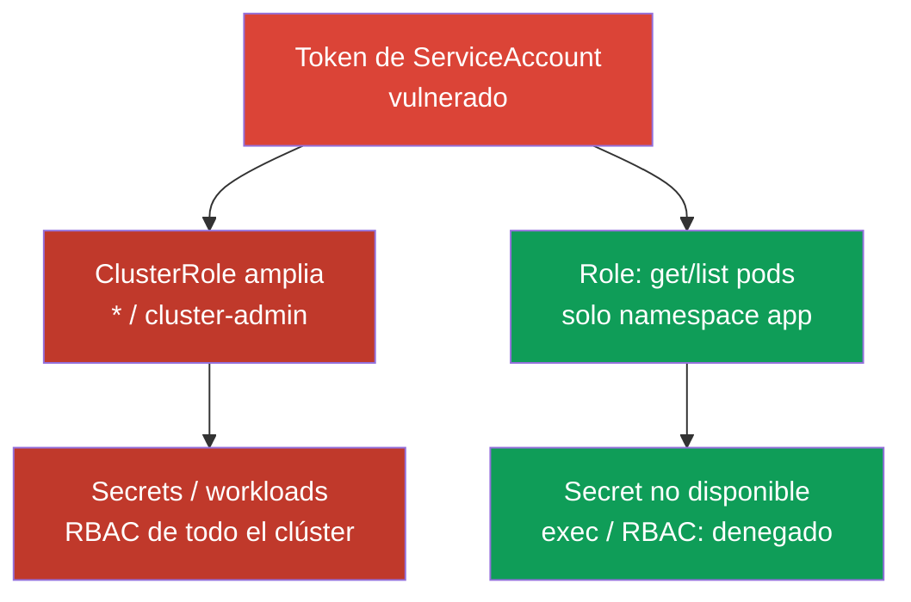
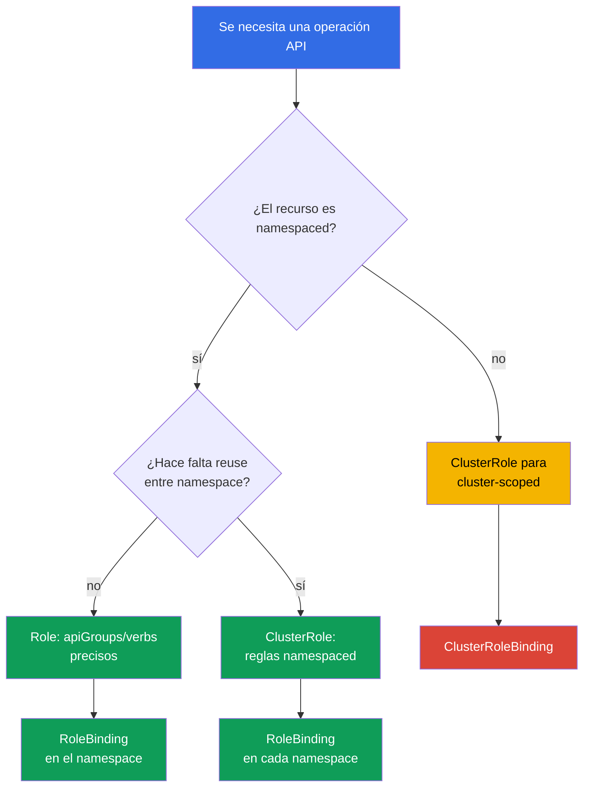

[Русская версия](ru.md) · [Eng version](README.md) · [Version française](fr.md) · [Deutsche Version](de.md) · [ქართული ვერსია](ge.md) · [繁體中文版](tw.md) · [日本語版](jp.md)

# Capítulo 10. RBAC para minimizar el acceso

> **Problema.** Un atacante que obtiene un shell en un Pod o un token robado no se detendrá en el límite de un namespace si el ServiceAccount o usuario tiene permisos excesivos. Un `verb` amplio, un `cluster-admin` olvidado por comodidad o `escalate`/`bind`/`impersonate` disponibles convierten una vulneración local en la lectura de todos los Secret, la creación de Pod en cualquier nodo o la toma completa del clúster - y esto no lo decide la vulnerabilidad en sí, sino lo que RBAC permitió por adelantado.

> **Qué sigue.** En los capítulos 07-09 reducimos la superficie de ataque de los componentes del clúster. Ahora limitaremos las consecuencias de vulnerar una identity, ServiceAccount o Pod: RBAC debe conceder solo el acceso que realmente se necesita. Este es el dominio Cluster Hardening (15%) de CKS.

> **Qué debe saber de CKA.** La sintaxis básica de `Role`, `ClusterRole`, `RoleBinding` y `ClusterRoleBinding` ya se explicó en el [capítulo 38 de CKA](../../../cka/course/38/es.md). Aquí no repetimos la creación de los cuatro objetos, sino que analizamos auditoría, escalada de privilegios y diseño seguro de reglas.

## 10.1. Least privilege: un verb adicional cambia el límite del incidente

RBAC responde a una solicitud del API server con la combinación de identity, `verb`, recurso,
namespace y, a veces, nombre del objeto. Los permisos son **aditivos**: si cualquier
`RoleBinding` o `ClusterRoleBinding` concede acceso, una role más limitada no lo retira. Por ello,
no se puede expresar una denegación con una segunda role: se debe eliminar o limitar el binding
existente. Kubernetes RBAC es un modelo **allow-only**: no tiene reglas deny negativas ni
condiciones como hora del día o source IP. En general, estos requisitos no se pueden trasladar a
admission: se ejecuta después de authentication/authorization solo para create/delete/modify (y
algunos custom verbs), mientras que `get`, `list` y `watch` eluden la capa admission. Para una
**autorización API** condicional se necesita un authorizer externo/Webhook u otra capa de
authorization/policy; source IP se limita además mediante red - firewall, load balancer o
NetworkPolicy, donde corresponda. Una admission policy sirve solo para las solicitudes que de
verdad intercepta, no como sustituto de condiciones RBAC.

El escenario de ataque es típico: a un desarrollador o ServiceAccount se le dio
`cluster-admin` «temporalmente», o un controlador recibió `verbs: ["*"]`. Tras vulnerar su token,
un atacante puede leer un Secret con credentials, ejecutar `pods/exec` en una aplicación, crear
un workload con un ServiceAccount más privilegiado o concederse una role nueva. La vulneración
inicial de un namespace se convierte en una vulneración del clúster.



Least privilege no significa simplemente sustituir `cluster-admin` por una role con un nombre
menor. Para cada sujeto se debe determinar: qué operaciones API necesita, sobre qué recursos, en
qué namespace, durante cuánto tiempo y si realmente necesita acceso a API. Para una aplicación
normal, la respuesta correcta suele ser un ServiceAccount independiente sin token; los tokens se
tratan en el capítulo 11.

Empiece con `Role` y `RoleBinding` si la tarea es local a un namespace. Se necesita
`ClusterRole` para recursos cluster-scoped o un conjunto reutilizable de reglas, pero se puede
conceder mediante `RoleBinding` solo en un namespace. `ClusterRoleBinding` extiende el alcance a
todo el clúster y requiere una justificación independiente.

> 🎯 Compruebe identity, verb, resource y scope concretos con un par de `can-i`: acción necesaria - `yes`; acción vecina peligrosa - `no`.

## 10.2. Auditoría de permisos efectivos: `kubectl auth can-i`

YAML muestra la intención, pero no la autorización final: un sujeto puede obtener acceso de varios
binding, una role integrada, un grupo o una `ClusterRole` agregada. Compruebe la respuesta del API
server con `kubectl auth can-i`.

```bash
# Resumen de las reglas de la identity actual en un namespace concreto.
kubectl auth can-i --list -n cks-104

# Compruebe los límites cluster-scoped y cross-namespace con acciones separadas.
kubectl auth can-i get nodes
kubectl auth can-i list pods -n cks-104
kubectl auth can-i list pods -n default

# Si la pregunta es específicamente «¿se permite esta acción en todos los namespaces?»:
kubectl auth can-i list pods --all-namespaces

# Permiso esperado concreto y denegación esperada - pero estos son los permisos de SU
# identity actual, no los del ServiceAccount o usuario que se está comprobando.
kubectl auth can-i list pods -n cks-104
kubectl auth can-i get secrets -n cks-104

# Comprobación como el ServiceAccount de lab104
SA=system:serviceaccount:cks-104:app-sa
kubectl auth can-i list pods -n cks-104 --as="$SA"
kubectl auth can-i delete pods -n cks-104 --as="$SA"
kubectl auth can-i get secrets -n cks-104 --as="$SA"
# yes
# no
# no
```

Sin `--as`, `can-i` siempre responde acerca de la identity con la que usted ejecuta `kubectl`, es
decir, de su propio kubeconfig, no de la identity comprobada. La tarea casi siempre pregunta por
un ServiceAccount, usuario o grupo concreto, por lo que se necesita `--as=<identity>` para la
verificación: sin él, `yes`/`no` no demuestra nada sobre el objetivo de la auditoría, sino solo
sus propios permisos.

`--as-group` no sustituye a `--as` ni es una alternativa independiente: es una lista de
impersonated groups adicionales que se aplican solo junto con un impersonated user. Si la tarea
comprueba permisos obtenidos precisamente mediante un group binding, establezca `--as` y
**además** los `--as-group` necesarios:

```bash
kubectl auth can-i list pods -n cks-104 \
  --as=group-audit-user \
  --as-group=developers
```

Recuerde que `--as=<user>` no restaura automáticamente los grupos reales de ese usuario: enumere
los impersonated groups que pertenecen al escenario comprobado.

`--list` es útil como resumen de reglas, pero no lo considere una lista completa garantizada de
effective permissions para cualquier authorizer chain: el comando se basa en
`SelfSubjectRulesReview`, cuya documentación oficial advierte explícitamente que la lista devuelta
puede ser incompleta según el authorization mode del clúster y los errores de evaluation. Además,
`--list` no admite `--all-namespaces`: `kubectl` rechaza expresamente esa combinación porque
`SelfSubjectRulesReview` enumera reglas exactamente en un namespace y no es un inventory
cluster-wide. Confirme los límites críticos con `kubectl auth can-i <verb> <resource>`
positive/negative separados para la identity concreta, como en los ejemplos anteriores.

`--list` es útil para review, pero no reemplaza la comprobación de permisos críticos: la salida
puede ser larga y un wildcard oculta un riesgo concreto. En una prueba de aceptación, compruebe
siempre el par «acción necesaria = `yes`» y «acción vecina peligrosa = `no`». Para un recurso
cluster-scoped no indique namespace:

```bash
kubectl auth can-i get nodes --as="$SA"
kubectl auth can-i create clusterrolebindings --as="$SA"
kubectl auth can-i create pods/exec -n cks-104 --as="$SA"
```

El flag `--as` utiliza Kubernetes impersonation. En Kubernetes 1.36, una solicitud puede ser
permitida por el legacy verb amplio `impersonate` o por Constrained Impersonation: un permiso
separado para la identity y otro `impersonate-on:<mode>:<verb>` para la API request realmente
ejecutada. Si faltan los impersonation permissions necesarios, API devolverá `forbidden` antes de
comprobar los permisos de la impersonated identity.

Para una auditoría de security, no conceda legacy `impersonate` automáticamente: elija el modelo
que corresponda al workflow requerido y documente su alcance.

> 🔬 Constrained Impersonation en Kubernetes 1.36+ limita por separado la identity suplantada y la acción permitida durante la suplantación.

### 10.2.1. Constrained Impersonation: limitar identity y acción

> **Kubernetes 1.36+ / avanzado.** Es material de production que excede el núcleo obligatorio de CKS: la prioridad de examen son Role/Binding normales y precisas, e `impersonate` mínimo.

**Constrained Impersonation** es Beta en Kubernetes v1.36+ y está habilitada por defecto. A
diferencia de `impersonate` normal, no permite realizar en nombre del objetivo todo lo que este
puede hacer. Para un usuario normal (el valor de `Impersonate-User` no empieza por
`system:serviceaccount:` ni `system:node:`), API server realiza **dos comprobaciones separadas**:

1. **Identity permission** - si se puede suplantar esa identity concreta. Para un generic user,
   es una regla en `apiGroups: ["authentication.k8s.io"]`, recurso `users`, con
   `resourceNames` del nombre requerido y verb `impersonate:user-info`. Como user no tiene
   namespace-scope, concédalo mediante `ClusterRole` y `ClusterRoleBinding`.
2. **Action-at-scope permission** - si se puede ejecutar una operación concreta en su scope
   *durante esta suplantación*. Para `list` Pod, es `impersonate-on:user-info:list` en `pods`;
   para `watch`, `impersonate-on:user-info:watch`. Se pueden conceder mediante `Role`/
   `RoleBinding` solo en el namespace requerido. El permiso sobre identity por sí solo no basta.

El ejemplo permite al ServiceAccount `audit-reader` suplantar solamente al generic user
`readonly@example.com` y solo hacer list/watch Pod en `cks-104`:

```yaml
apiVersion: rbac.authorization.k8s.io/v1
kind: ClusterRole
metadata:
  name: impersonate-readonly-identity
rules:
- apiGroups: ["authentication.k8s.io"]
  resources: ["users"]
  resourceNames: ["readonly@example.com"]
  verbs: ["impersonate:user-info"]
---
apiVersion: rbac.authorization.k8s.io/v1
kind: ClusterRoleBinding
metadata:
  name: audit-reader-impersonate-readonly
subjects:
- kind: ServiceAccount
  name: audit-reader
  namespace: cks-104
roleRef:
  apiGroup: rbac.authorization.k8s.io
  kind: ClusterRole
  name: impersonate-readonly-identity
---
apiVersion: rbac.authorization.k8s.io/v1
kind: Role
metadata:
  name: impersonate-readonly-pods
  namespace: cks-104
rules:
- apiGroups: [""]
  resources: ["pods"]
  verbs:
  - "impersonate-on:user-info:list"
  - "impersonate-on:user-info:watch"
---
apiVersion: rbac.authorization.k8s.io/v1
kind: RoleBinding
metadata:
  name: audit-reader-impersonate-readonly-pods
  namespace: cks-104
subjects:
- kind: ServiceAccount
  name: audit-reader
  namespace: cks-104
roleRef:
  apiGroup: rbac.authorization.k8s.io
  kind: Role
  name: impersonate-readonly-pods
```

El cliente usa los mismos headers o `kubectl --as=readonly@example.com`; solo cambian las
comprobaciones del API server. El antiguo `impersonate` sigue funcionando y conserva un fallback
amplio, así que no lo conceda junto con reglas constrained sin un motivo separado.

Importante: el constrained permission se refiere a la **API request real**, no a la acción que el
cliente describe dentro de otro review-object. Por tanto, los
`impersonate-on:user-info:list/watch` en `pods` mostrados anteriormente permiten ejecutar
`list/watch pods` reales con `--as`, pero por sí solos no permiten ejecutar:

```bash
kubectl auth can-i list pods --as=readonly@example.com -n cks-104
```

`kubectl auth can-i` crea `SelfSubjectAccessReview`, por lo que para ese audit workflow se
necesitan constrained permissions que cubran `create` en
`selfsubjectaccessreviews.authorization.k8s.io`, o un impersonator legacy controlado. No amplíe
la role constrained solo por la comodidad de `can-i` si puede comprobar directamente la operación
requerida en un escenario seguro read-only.

Para el inventario, primero encuentre de dónde pudo venir la capacidad y luego examine reglas y
subjects. No edite roles integradas antes de comprender quién las utiliza.

```bash
ROLE_NAME='role-name-to-review'
kubectl get role,rolebinding -A
kubectl get clusterrole,clusterrolebinding
kubectl describe rolebinding -n cks-104 app-sa-pod-reader
kubectl get clusterrolebinding -o wide
kubectl get clusterrole "$ROLE_NAME" -o yaml
```

## 10.3. Verbs y resources peligrosos: rutas de escalada

No todas las reglas son iguales. El acceso read-only a `pods` y `get` a `secrets` tienen daños
muy distintos, y algunos verbs permiten obtener implícitamente permisos ya existentes. Durante el
review, busque las siguientes combinaciones antes que los `get`/`list` habituales.

| Verb o resource | Por qué es peligroso | Enfoque seguro |
|---|---|---|
| `escalate` en `roles`/`clusterroles` | Junto con `create`/`update` normal en Role/ClusterRole elimina el requisito de poseer uno mismo todos los permissions escritos en la role. | No conceder a workload ni a administradores normales de namespace; controlar por separado CRUD en objetos RBAC y el bypass-verb. |
| `bind` en `roles`/`clusterroles` | Junto con `create`/`update` normal en RoleBinding/ClusterRoleBinding elimina el requisito de poseer uno mismo los permissions de la referenced role. | Limitar a roles concretas mediante `resourceNames` y conceder solo junto con la gestión de binding realmente necesaria. |
| `impersonate` en `users`, `groups`, `serviceaccounts`, `uids` o `userextras/<nombre>` | Permite ejecutar solicitudes como otra identity, incluso una más privilegiada. Los campos extra se especifican con el resource name exacto, por ejemplo `userextras/scopes`, en API group `authentication.k8s.io`. | Conceder al auditor solo cuando sea necesario y limitar mediante `resourceNames`. |
| `create`/`update`/`patch` RoleBinding y ClusterRoleBinding | Junto con una role disponible puede transferir permisos; ClusterRoleBinding lo hace para todo el clúster. | Denegar a la aplicación; separar la concesión de acceso del desarrollo de workload. |
| `get`/`list`/`watch` `secrets` | Secret suele contener password, registry credential, key o bearer token; `list`/`watch` revelan los valores de muchos Secret. | Indicar un Secret concreto con `resourceNames` para `get`, o no conceder acceso API a la aplicación. |
| `create` `serviceaccounts/token` | Emite el token del ServiceAccount elegido y puede ser una forma de usar sus permisos. | Permitir solo a automation de confianza, para ServiceAccount concretos. |
| `create` `pods/exec` | Permite la ejecución interactiva de comandos en un Pod ya en marcha y acceso a su red, filesystem y Secret montados. | No incluir en roles normales; usar acceso break-glass de corta duración y auditoría. |
| `create` `pods/portforward` | Establece un túnel hacia los puertos del Pod, eludiendo la exposición de red habitual. | Conceder específicamente para diagnóstico y revocar después del incidente. |
| `create` workload (`pods`, `deployments`, `jobs`, etc.) | Crear un Pod/workload en un namespace ya proporciona un fuerte acceso indirecto: se puede elegir cualquier ServiceAccount de ese namespace y referenciar desde Pod spec Secret, ConfigMap y almacenamiento disponible, incluso sin `get secrets` separado en la identity de origen. Esto permite obtener datos o permisos API de otro workload. Si policy permite Pod privileged/host-level, las consecuencias pueden extenderse al node. | No conceder a tenant-identity no confiables sin necesidad; considerar la creación de workload un permiso privilegiado y limitar Pod Security, ServiceAccount, diseño Secret/storage y admission policy. |
| `nodes` | El acceso a objetos node revela datos de infraestructura; modificar node es una operación cluster-wide. | Excluir de roles tenant; conceder a identity operativas independientes. |
| `get` `nodes/proxy` | Permite proxy-requests a kubelet. No es acceso read-only: las operaciones de kubelet proxy pueden eludir admission y el audit API server habitual. | No conceder a workload ni roles tenant; proporcionar solo a una identity operativa estrictamente controlada. |

Un subresource se escribe con barra: `resources: ["pods/exec"]`. Para `exec` y `portforward`
normalmente se necesita precisamente `create`, no `get`. No sustituya la regla exacta
`resources: ["pods/exec"]` por una regla para todos los `pods`: son rutas API y riesgos
distintos. En cambio, `get` en `nodes/proxy` es un permiso peligroso separado para kubelet proxy,
no una lectura inocua de node.

En Kubernetes 1.36, `KubeletFineGrainedAuthz` es GA y está habilitado permanentemente. Para una
tarea operativa legítima, conceda un subresource limitado en lugar de `nodes/proxy`: por ejemplo,
`nodes/stats`, `nodes/metrics`, `nodes/log`, `nodes/pods`, `nodes/healthz` o `nodes/configz`.
Kubelet comprueba específicamente esas rutas por separado; para las demás solicitudes y por
compatibilidad permanece el fallback `nodes/proxy`.

```yaml
# Ejemplo para una identity de monitoring; no sustituya con esta regla operaciones kubelet arbitrarias.
rules:
- apiGroups: [""]
  resources: ["nodes/metrics", "nodes/stats"]
  verbs: ["get"]
```

Los wildcards son especialmente peligrosos en tres lugares: `apiGroups: ["*"]`,
`resources: ["*"]` y `verbs: ["*"]`. Abarcan nuevos API-groups, CRD, subresource y verbs que
aparecerán después de una actualización. Una regla segura hoy se volverá silenciosamente más
amplia mañana. Un wildcard también dificulta la auditoría: por YAML no se puede saber si hay
acceso a `secrets`, `pods/exec` o `rolebindings`.

> 🧠 RBAC es aditivo: una role limitada no revoca un Allow concedido; `escalate`, `bind`, `impersonate`, bindings, Secret y subresource peligrosos pueden transferir permisos ajenos.

```yaml
# Inseguro: todo el API actual y futuro del namespace
rules:
- apiGroups: ["*"]
  resources: ["*"]
  verbs: ["*"]
```

```yaml
# Mínimo para un controlador read-only en un namespace
rules:
- apiGroups: [""]
  resources: ["pods"]
  verbs: ["get", "list"]
```

## 10.4. Diseño de una Role mínima

Primero escriba el contrato de acceso en lenguaje sencillo: «`app-sa` lee la lista de Pod y el
estado de un ConfigMap concreto en `cks-104`; no modifica workload, Secret ni RBAC». Después
tradúzcalo a reglas mínimas. Separe lectura (`get`, `list`, `watch`) y modificación (`create`,
`update`, `patch`, `delete`): un controlador que observa Pod no necesita necesariamente permiso
para eliminarlos.

> 🎯 Formule el contrato de acceso, seleccione un scope estrecho (`Role` + `RoleBinding` para el namespace) y demuestre tanto la acción permitida como el rechazo de un recurso o namespace vecino peligroso.

```yaml
apiVersion: v1
kind: ServiceAccount
metadata:
  name: app-sa
  namespace: cks-104
---
apiVersion: rbac.authorization.k8s.io/v1
kind: Role
metadata:
  name: app-sa-pod-reader
  namespace: cks-104
rules:
- apiGroups: [""]
  resources: ["pods"]
  verbs: ["get", "list"]
---
apiVersion: rbac.authorization.k8s.io/v1
kind: RoleBinding
metadata:
  name: app-sa-pod-reader
  namespace: cks-104
subjects:
- kind: ServiceAccount
  name: app-sa
  namespace: cks-104
roleRef:
  apiGroup: rbac.authorization.k8s.io
  kind: Role
  name: app-sa-pod-reader
```

`resourceNames` limita adicionalmente por el nombre del objeto `get`, `update`, `patch` y
`delete`. Es útil para un ConfigMap o Secret conocido. Para un **recurso de nivel superior** no
limita `create` ni `deletecollection`: en esas solicitudes el nombre del objeto no forma parte de
la URL. No es una regla para todos los subresource: los subresource con nombre, como `pods/exec`,
pueden limitarse mediante `resourceNames` (véase la [referencia de RBAC](https://kubernetes.io/docs/reference/access-authn-authz/rbac/)). `list`/`watch` con `resourceNames` requieren que el cliente use el field selector `metadata.name=<name>` y a menudo resultan incómodos; no los considere un sustituto completo del aislamiento por namespace.

```yaml
apiVersion: rbac.authorization.k8s.io/v1
kind: Role
metadata:
  name: app-config-reader
  namespace: cks-104
rules:
- apiGroups: [""]
  resources: ["configmaps"]
  resourceNames: ["app-config"]
  verbs: ["get"]
```

Compruebe el scope del recurso antes de elegir el objeto. `pods`, `configmaps`, `deployments` y
`secrets` son namespaced, por lo que `Role` los limita al namespace. `nodes`, `namespaces`,
`persistentvolumes` y `clusterroles` son cluster-scoped: requieren `ClusterRole`, y un
`RoleBinding` no vuelve local un recurso cluster-scoped. Si se necesita el conjunto de permisos
namespaced en varios namespace, defina `ClusterRole`, pero asígnela mediante `RoleBinding`
separados en cada namespace permitido.

`nonResourceURLs` describe URL de API server, no objetos Kubernetes. Esas URL no tienen
namespace scope, por lo que la regla debe residir en `ClusterRole` y concederse mediante
`ClusterRoleBinding`. Por ejemplo, se puede otorgar a una identity de health-check solamente
`nonResourceURLs: ["/healthz"]` y `verbs: ["get"]`, sin conceder el wildcard `/*`. Un
`RoleBinding`, incluso si se refiere a tal `ClusterRole`, no convierte una non-resource URL en un
namespaced permission.



`ClusterRole` no significa automáticamente cluster-wide access: puede contener rules para
namespaced resources y concederse mediante `RoleBinding` solo en un namespace concreto. El scope
cluster-wide aparece precisamente con `ClusterRoleBinding`. Para cluster-scoped resources y
`nonResourceURLs` se necesitan `ClusterRole` + `ClusterRoleBinding`.

## 10.5. ClusterRole integradas y agregadas: ampliación oculta de permisos

Las `ClusterRole` integradas son útiles, pero no tienen el mismo riesgo. `view` está destinada a
leer objetos namespaced habituales y deliberadamente no concede acceso a Secret, Role ni
RoleBinding: Secret suele contener privilegios de ServiceAccount. `edit` permite modificar la
mayoría de recursos namespaced y leer Secret, pero no puede modificar Role ni RoleBinding; aun
así puede iniciar un Pod como cualquier ServiceAccount del mismo namespace. `admin` puede
administrar la mayor parte de RBAC dentro de un namespace.

El `cluster-admin` integrado contiene permisos wildcard máximamente amplios. Mediante
`ClusterRoleBinding`, la misma `ClusterRole` concede cluster-wide superuser access. Mediante
`RoleBinding`, queda limitada al scope de un namespace concreto, pero la semántica integrada de
`cluster-admin` da control completo sobre los recursos de ese namespace, **incluido el propio
objeto Namespace** - una excepción importante porque `Namespace` es cluster-scoped. Tal
`RoleBinding` no se vuelve cluster-wide, pero sigue siendo una asignación namespaced
extraordinariamente privilegiada; toda asignación de `cluster-admin` debe justificarse y
controlarse por separado.

| Role | Significado práctico | Riesgo al asignarla a una aplicación o grupo amplio |
|---|---|---|
| `view` | Ver los recursos habituales del namespace; sin Secret, Role ni RoleBinding | Puede revelar topology, images y configuración, pero implica menos riesgo de fuga de credential. |
| `edit` | Modificar la mayoría de recursos namespace y leer Secret; sin modificar Role/RoleBinding | Permite modificar workload, leer Secret e iniciar Pod como cualquier ServiceAccount del namespace. |
| `admin` | Administración amplia del namespace, incluida la gestión de roles/binding dentro de su límite | Alto riesgo de escalada en el namespace y toma de aplicaciones del equipo. |
| `cluster-admin` | Con `ClusterRoleBinding` - acceso completo a todo el clúster; con `RoleBinding` - control completo de los recursos del namespace de ese binding, incluido el propio objeto Namespace | Incluso un binding local es extremadamente arriesgado; ClusterRoleBinding supone comprometer el clúster. |

Aggregation permite ampliar una `ClusterRole` integrada con reglas de otras `ClusterRole`. El
controlador RBAC combina reglas de roles con el label
`rbac.authorization.k8s.io/aggregate-to-<role>: "true"`. Esto es útil para CRD: por ejemplo, un
plugin puede añadir a `view` reglas read-only de su API. Pero tal label es un límite de supply
chain y RBAC: una role creada o modificada puede conceder silenciosamente permisos adicionales a
todos los usuarios de `view`, `edit` o `admin`.

> 🧠 `aggregate-to-*` cambia los effective permissions de toda la audiencia de la role integrada; un wildcard en la role fuente amplía los permisos en masa.

```yaml
# Ejemplo de ampliación de la role integrada view solo para leer un CRD.
# Añada una role así solo tras un security-review separado.
apiVersion: rbac.authorization.k8s.io/v1
kind: ClusterRole
metadata:
  name: aggregate-widget-view
  labels:
    rbac.authorization.k8s.io/aggregate-to-view: "true"
rules:
- apiGroups: ["example.io"]
  resources: ["widgets"]
  verbs: ["get", "list", "watch"]
```

Compruebe las reglas agregadas en la role integrada final y también las fuentes de la
aggregation. No edite `ClusterRole` del sistema con prefijo `system:`: API server puede
restaurarlas al arrancar o actualizar. Gestione sus propias `ClusterRole` y labels mediante Git,
code review y un conjunto limitado de identity autorizadas para modificar RBAC.

```bash
# Reglas efectivas finales de la role integrada
kubectl get clusterrole view -o yaml

# Todas las ClusterRole que pueden ampliar view/edit/admin
kubectl get clusterrole -l rbac.authorization.k8s.io/aggregate-to-view=true
kubectl get clusterrole -l rbac.authorization.k8s.io/aggregate-to-edit=true
kubectl get clusterrole -l rbac.authorization.k8s.io/aggregate-to-admin=true
```

### Mapa compacto de escalada

| Capacidad | Límite que cambia | Control |
|---|---|---|
| `create` CSR junto con la posibilidad de `approve`/`sign` | Puede emitir un client certificate con una identity más amplia; `create` por sí solo no basta | Separar creación, approval y signing entre identity controladas. |
| Gestión de `ValidatingWebhookConfiguration`/`MutatingWebhookConfiguration` | Cambia la validación o mutación de admission-requests cluster-wide | No conceder a roles tenant; revisar endpoint, CA y reglas webhook. |
| `patch` de labels `Namespace` | Puede cambiar las etiquetas de Pod Security Admission y admitir otro profile Pod | Limitar a una identity platform independiente y revisar los cambios de labels. |
| Crear/modificar PV con `hostPath` | Claim y Pod pueden obtener una ruta del filesystem del node | Denegar a roles tenant; controlar la storage policy y Pod Security Admission. |
| Emisión de tokens ServiceAccount (`create serviceaccounts/token`) | Permite actuar con los permisos del ServiceAccount elegido | Permitir solo a automation de confianza para ServiceAccount concretos. |
| Pertenencia a `system:masters` | Es un grupo superuser que elude la comprobación RBAC habitual | No conceder a aplicaciones; controlar la fuente de certificados y grupos externos. |

> 🎯 Tras cambiar RBAC, demuestre tanto la acción permitida como la denegación esperada.

## 10.6. Verificación: demostrar tanto el acceso necesario como la denegación

Después de aplicar la role, no se limite a `kubectl get role`: el objeto puede existir pero no
estar enlazado, entrar en conflicto con otro binding o resultar demasiado amplio. En lab104, la
comprobación para `app-sa` debe demostrar exactamente el límite requerido.

```bash
kubectl apply -f app-sa-rbac.yaml

SA=system:serviceaccount:cks-104:app-sa

# Permiso funcionalmente necesario
kubectl auth can-i get pods -n cks-104 --as="$SA"
kubectl auth can-i list pods -n cks-104 --as="$SA"
# yes
# yes

# Permisos no deseados: modificar workload, Secret, exec y RBAC
kubectl auth can-i delete pods -n cks-104 --as="$SA"
kubectl auth can-i get secrets -n cks-104 --as="$SA"
kubectl auth can-i create pods/exec -n cks-104 --as="$SA"
kubectl auth can-i create rolebindings -n cks-104 --as="$SA"
kubectl auth can-i create clusterrolebindings --as="$SA"
# no
# no
# no
# no
# no
```

Compruebe también el scope. La misma identity no debe leer Pod en un namespace vecino ni tener
permisos cluster-scoped solo porque se le concedió acceso a Pod.

```bash
kubectl auth can-i list pods -n default --as="$SA"
kubectl auth can-i get nodes --as="$SA"
# no
# no
```

Si la respuesta es inesperadamente `yes`, encuentre todos los binding del sujeto y repita la
comprobación después de eliminar o limitar el acceso excedente. Se debe eliminar el objeto preciso,
no privar accidentalmente de acceso a otro equipo:

```bash
kubectl get rolebinding -A -o yaml | grep -n -C 4 'app-sa'
kubectl get clusterrolebinding -o yaml | grep -n -C 4 'app-sa'

# Solo tras confirmar propietario y propósito del binding
kubectl delete clusterrolebinding app-sa-excessive-access
```

Para production, incluya este conjunto de `can-i` en un smoke-test después de cambiar RBAC y
envíe los cambios de Role, ClusterRole y binding a review. Revise regularmente el acceso de larga
duración según el propósito efectivo del ServiceAccount, los logs de auditoría y el propietario
del workload.

> 🏭 Las roles y aggregation labels se guardan en Git, los cambios pasan por review y las comprobaciones `can-i` critical positive/negative pasan por CI; break-glass tiene propietario y vencimiento.

## 10.7. Cómo se aplica en producción

- **Role por defecto.** Los equipos y aplicaciones reciben `Role`/`RoleBinding` namespaced;
  `ClusterRoleBinding` requiere propietario, motivo, vencimiento y security-review.
- **ServiceAccount por defecto.** No otorgue permisos de aplicación al ServiceAccount `default`.
  Si workload no usa Kubernetes API, establezca `automountServiceAccountToken: false`; de lo
  contrario, cree un ServiceAccount independiente con permisos mínimos. Así, la auditoría y
  revocación de acceso siguen siendo precisas.
- **RBAC como código.** Mantenga sus propias roles en Git, compruebe el diff de reglas y labels
  de aggregation en CI. Bloquee por separado wildcard, `escalate`, `bind`, `impersonate` y el
  acceso a Secret sin una excepción explícita.
- **Configuración de autorización de API server.** Primero determine cuál de los dos métodos de
  configuración mutuamente excluyentes se utiliza.

  En la command-line configuration, compruebe que `--authorization-mode` contiene la cadena
  necesaria, por ejemplo `Node,RBAC`.

  En la file-based configuration mediante `--authorization-config`, no establezca a la vez
  `--authorization-mode`: compruebe la presencia de `type: RBAC`, la composición y el orden de
  `authorizers` directamente en `AuthorizationConfiguration`.

  La composición y el orden de la authorizer chain deben formar parte del security-review.
- **Auditoría periódica.** Inventaríe `ClusterRoleBinding`, subjects
  `system:serviceaccount`, roles integradas y agregadores; compruebe contratos críticos mediante
  `kubectl auth can-i`.
- **Break-glass en vez de admin permanente.** El acceso de emergencia debe ser una identity
  independiente y de corta duración, registrarse y revocarse después del trabajo, no permanecer
  como `cluster-admin` en el usuario cotidiano.

## 10.8. Mini-glosario

- **least privilege** - conceder solo el conjunto mínimo de permisos que una identity necesita
  para una tarea concreta.
- **verb** - operación Kubernetes API, por ejemplo `get`, `list`, `create`, `bind` o
  `escalate`.
- **resource / subresource** - objeto API y su subrecurso, por ejemplo `pods` y `pods/exec`.
- **`resourceNames`** - limitar una regla a nombres concretos de objeto donde API server lo
  admite.
- **impersonation** - ejecutar una solicitud como otra identity mediante headers API.
- **aggregation** - adición automática de reglas de una ClusterRole a una ClusterRole integrada
  mediante label.
- **wildcard** - `*` en `apiGroups`, `resources` o `verbs`; incluye objetos futuros desconocidos
  y por eso es peligroso en una role de security.
- **break-glass access** - acceso privilegiado temporal y controlado para una emergencia.

## 10.9. Resumen del capítulo

- Los permisos RBAC son aditivos: no se puede compensar un binding excedente con una role más
  limitada; debe encontrarse, retirarse o limitarse.
- Least privilege empieza con `Role` y `RoleBinding` en un namespace concreto; el acceso de nivel
  clúster y `ClusterRoleBinding` requieren una justificación separada.
- `kubectl auth can-i --list` proporciona un resumen útil de las reglas cuando el resultado es
  completo, pero no un inventory necesariamente exhaustivo. Demuestre los security-critical
  boundaries con targeted `can-i` checks: el acceso esperado debe devolver `yes`; el denegado,
  `no`.
- Son especialmente peligrosos `escalate`, `bind`, `impersonate`, modificar binding, `secrets`,
  `serviceaccounts/token`, `pods/exec`, `pods/portforward` y `get nodes/proxy`.
- No use `*` sin un fundamento excepcional y documentado: wildcard incluye API, recursos,
  subresources y verbs presentes y futuros.
- Las ClusterRole agregadas pueden ampliar silenciosamente `view`, `edit` y `admin`; deben
  revisarse los labels `aggregate-to-*` y las fuentes de esas roles.

## 10.10. Cómo será útil: en el examen y en el trabajo real

**En el examen.** Cree o limite rápidamente una `Role` con `apiGroups`, `resources` y `verbs`
precisos, enlácela al ServiceAccount correcto en el namespace indicado y compruebe de inmediato
`kubectl auth can-i --as=system:serviceaccount:<ns>:<sa>`. Lea resource literalmente:
`pods/exec` no es igual que `pods`; `nodes` es cluster-scoped. Si debe retirar acceso excesivo,
encuentre primero el binding correspondiente, no cambie todo indiscriminadamente.

**En el trabajo real.** RBAC limita el blast radius de un token robado, errores de automation y
vulneraciones de Pod. Los incidentes más peligrosos normalmente no se deben a la sintaxis YAML,
sino a roles amplias por comodidad, wildcard y binding ocultos. La auditoría `can-i` periódica, el
review de aggregation labels y un contrato de acceso explícito convierten RBAC en un límite de
security comprobable.

> ### 🔴 Perspectiva del atacante
> **Asset:** recursos Kubernetes API.
>
> **Starting foothold:** ejecución de código dentro de un Pod.
>
> **Attacker objective:** usar la identity del workload para acceder a API.
>
> **Abuse path:** comprobar si hay token, su audience y TTL; después, RBAC permissions y la posibilidad de hacer `list` Pod, leer Secret o crear/ejecutar workload mediante `pods/exec`.
>
> **Expected evidence:** audit events y SubjectAccessReview.
>
> **Control:** `automountServiceAccountToken: false` donde no se necesita API; projected short-lived token donde se necesita; RBAC mínimo.
>
> **Retest:** la API call permitida funciona, y la denegada devuelve `403`.
>
> **ATT&CK:** [T1528 - Steal Application Access Token](https://attack.mitre.org/techniques/T1528/).

## 10.11. Preguntas de autoevaluación

<details>
<summary>1. ¿Por qué una Role más limitada no puede revocar un permiso concedido por otro binding?</summary>

RBAC en Kubernetes es aditivo: un permiso es efectivo si lo concede al menos un RoleBinding o
ClusterRoleBinding. El modelo allow-only no tiene una regla deny que pueda anular un acceso ya
concedido. Para eliminar un permiso excedente, hay que encontrar y eliminar o limitar precisamente
el binding que lo concede.
</details>

<details>
<summary>2. ¿Qué dos comprobaciones `can-i` demostrarán que `app-sa` puede leer Pod, pero no eliminarlos?</summary>

Para la acción permitida, ejecute
`kubectl auth can-i get pods -n cks-104 --as=system:serviceaccount:cks-104:app-sa` y espere
`yes`. Para la denegación, ejecute
`kubectl auth can-i delete pods -n cks-104 --as=system:serviceaccount:cks-104:app-sa` y espere
`no`. Este par comprueba la decisión efectiva de API server, no solo el YAML de la role.
</details>

<details>
<summary>3. ¿Por qué `get`/`list` Secret es más peligroso que leer la mayoría de recursos habituales?</summary>

Secret suele contener password, registry credential, key o bearer token, por lo que leerlo revela
no solo topology o estado, sino credentials listas para usar. `list` y `watch` pueden revelar de
una vez los valores de muchos Secret. Si se necesita un Secret conocido, el capítulo recomienda un
`get` preciso con `resourceNames`, o que la aplicación no tenga acceso API.
</details>

<details>
<summary>4. ¿En qué se diferencia `bind` de `escalate` y cómo puede cada uno llevar a una escalada?</summary>

Ambos verbs eluden la protección integrada de RBAC, pero no sustituyen CRUD normal sobre el objeto.
`escalate`, junto con `create`/`update` Role o ClusterRole, permite escribir en una role
permissions que el propio sujeto no tiene. `bind`, junto con `create`/`update` RoleBinding o
ClusterRoleBinding, permite asignar una referenced role sin tener todos sus permissions. Por ello,
durante la auditoría se comprueban ambas partes de la ruta: la posibilidad de modificar el objeto
RBAC y la presencia del bypass-verb correspondiente.
</details>

<details>
<summary>5. ¿Por qué se deben revisar `create pods/exec` y `create pods/portforward` por separado del acceso normal a `pods`?</summary>

Son subresource API separados, escritos como `pods/exec` y `pods/portforward`, no el recurso
normal `pods`. `create pods/exec` permite ejecutar comandos en un Pod existente con su red,
filesystem y Secret montados, mientras que `create pods/portforward` establece un túnel hacia los
puertos del Pod. Por ello, no deben incluirse implícitamente en una role read normal y normalmente
se conceden solo para diagnóstico controlado.
</details>

<details>
<summary>6. ¿Por qué `resourceNames` no limita `create` y `deletecollection` de un recurso de nivel superior, pero puede aplicarse a un subresource con nombre, como `pods/exec`?</summary>

Para `create` y `deletecollection` de un recurso de nivel superior, el nombre del objeto no forma
parte de la URL de solicitud, por lo que API server no puede limitarlos mediante `resourceNames`.
No es una limitación universal de todos los subresource. Un subresource con nombre, como
`pods/exec`, puede limitarse mediante `resourceNames`, ya que la solicitud se dirige a un Pod
concreto.
</details>

<details>
<summary>7. ¿Por qué `get nodes/proxy` no es un permiso read-only y a quién se puede conceder?</summary>

`get nodes/proxy` permite proxy-requests a kubelet, y tales operaciones pueden eludir admission y
el audit API server habitual. Por tanto, no es una lectura inofensiva de un objeto Node. El permiso
no se debe conceder a workload ni roles tenant; es admisible solo para una identity operativa
estrictamente controlada, a ser posible con `nodes/metrics`, `nodes/stats` y otros fine-grained
subresource más limitados.
</details>

<details>
<summary>8. ¿Cómo cambia effective access el label `rbac.authorization.k8s.io/aggregate-to-view=true` y por qué un wildcard en una role agregada es especialmente arriesgado?</summary>

El controlador RBAC añade reglas de ClusterRole con ese label a la role integrada `view`, por lo
que todos sus usuarios reciben nuevo acceso. Un wildcard en una role fuente de este tipo captura
de inmediato API-groups, recursos, subresource y verbs actuales y futuros para la amplia audiencia
de `view`. Por ello hay que revisar tanto la role final como todas las roles fuente de aggregation.
</details>

<details>
<summary>9. **Flashback (capítulo 04).** La `NetworkPolicy` del capítulo 04 es una allow-list: primero default-deny y después permisos estrechos. ¿Dónde funciona la misma lógica de «denegar todo y después permitir explícitamente» en el diseño RBAC, y cuándo recibe una solicitud default-deny de verdad?</summary>

En RBAC se empieza sin los permisos necesarios y se añaden solo `apiGroups`, `resources` y
`verbs` precisos con el scope mínimo. Una solicitud se deniega si ningún `RoleBinding` o
`ClusterRoleBinding` aplicable concede Allow. Se deben comprobar no solo los binding donde el
subject aparece directamente, sino también permisos obtenidos mediante sus grupos (por ejemplo,
`system:serviceaccounts` para ServiceAccount). Por eso, la ausencia de un `RoleBinding` directo
para un usuario o ServiceAccount por sí sola aún no demuestra falta de acceso; el límite final se
confirma con `kubectl auth can-i` para la identity concreta. A diferencia de NetworkPolicy, la
decisión la toma el RBAC authorizer de API server, pero el resultado también es una allow-list
explícita.
</details>

## Práctica

En la [lab 104](../../labs/104/README_ES.MD), cree `app-sa` con una Role mínima de lectura de
Pod, demuestre mediante `auth can-i` que `delete pods` está denegado y elimine el binding
excedente. En la misma lab, deshabilitará el automontaje del token ServiceAccount y limitará el
acceso anónimo a API server - los capítulos siguientes desarrollan este límite RBAC.

🌐 Práctica interactiva adicional (killer.sh/killercoda, recurso externo): [rbac-serviceaccount-permissions](https://killercoda.com/killer-shell-cks/scenario/rbac-serviceaccount-permissions) · [rbac-user-permissions](https://killercoda.com/killer-shell-cks/scenario/rbac-user-permissions) · [certificate-signing-requests-sign-manually](https://killercoda.com/killer-shell-cks/scenario/certificate-signing-requests-sign-manually) · [certificate-signing-requests-sign-k8s](https://killercoda.com/killer-shell-cks/scenario/certificate-signing-requests-sign-k8s)

🎮 Killercoda (en el navegador, sin instalación): [Create a Role and Role Binding](https://killercoda.com/chadmcrowell/course/cka/create-role) · [Create a Cluster Role and Role Binding](https://killercoda.com/chadmcrowell/course/cka/create-cluster-role)

---
[Índice](../README_ES.md) · [Capítulo 09](../09/es.md) · [Capítulo 11](../11/es.md)
