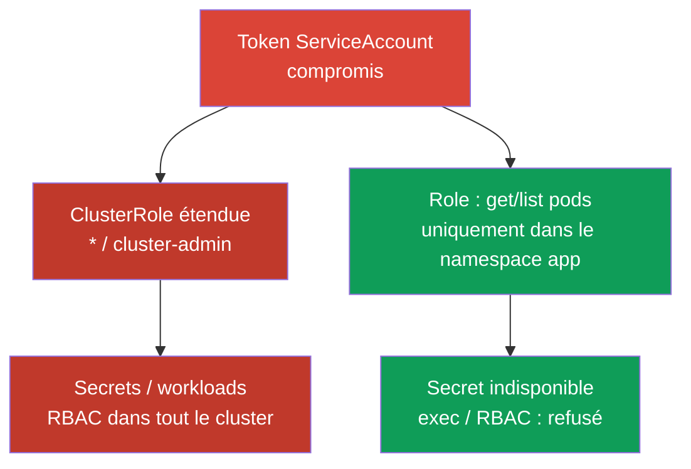
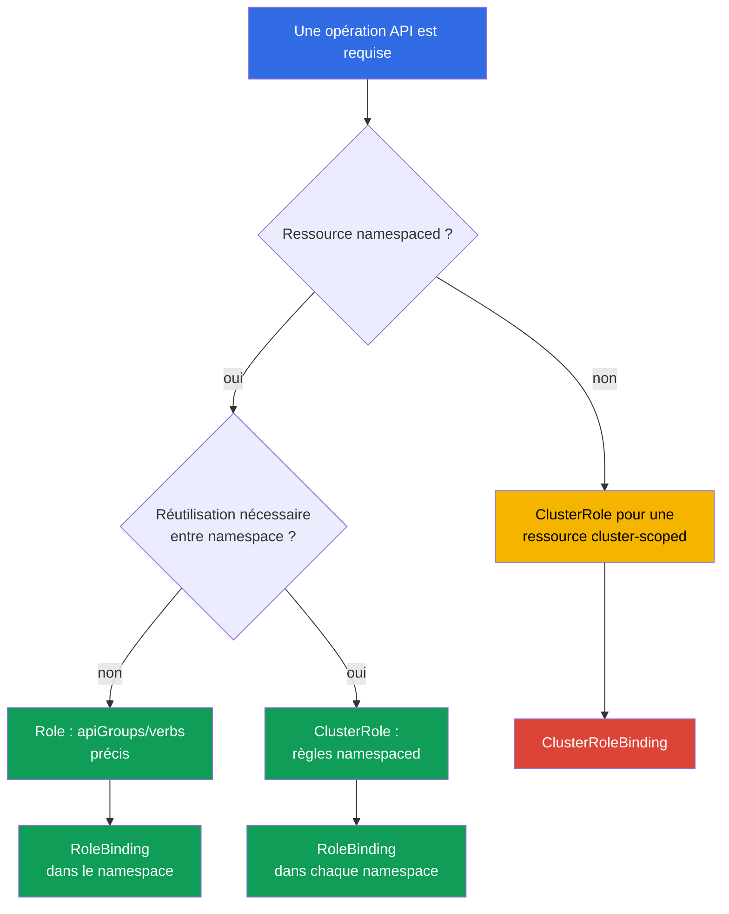

[Русская версия](ru.md) · [Eng version](README.md) · [Versión en español](es.md) · [Deutsche Version](de.md) · [ქართული ვერსია](ge.md) · [繁體中文版](tw.md) · [日本語版](jp.md)

# Chapitre 10. RBAC pour minimiser les accès

> **Le problème.** Un attaquant qui obtient un shell dans un Pod ou un token volé ne s'arrêtera pas à la frontière d'un namespace si le ServiceAccount ou l'utilisateur possède des droits excessifs. Un `verb` trop large, un `cluster-admin` oublié par commodité ou les droits `escalate`/`bind`/`impersonate` disponibles transforment une compromission locale en lecture de tous les Secret, création de Pod sur n'importe quel node ou prise de contrôle complète du cluster. Ce n'est pas la vulnérabilité elle-même qui le décide, mais ce que RBAC a autorisé à l'avance.

> **La suite.** Dans les chapitres 07-09, nous avons réduit la surface d'attaque des composants du cluster. Nous limitons maintenant les conséquences de la compromission d'une identity, d'un ServiceAccount ou d'un Pod : RBAC ne doit accorder que l'accès réellement nécessaire. C'est le domaine CKS Cluster Hardening (15%).

> **Prérequis CKA.** La syntaxe de base de `Role`, `ClusterRole`, `RoleBinding` et `ClusterRoleBinding` est déjà traitée dans le [chapitre 38 de CKA](../../../cka/course/38/fr.md). Ici, nous ne répétons pas la création de ces quatre objets, mais étudions l'audit, l'escalade de privilèges et la conception sûre des règles.

## 10.1. Least privilege : un verb de trop change la frontière de l'incident

RBAC répond à une requête vers l'API server à partir de l'identity, du `verb`, de la ressource, du namespace et parfois du nom de l'objet. Les permissions sont **additives** : si un `RoleBinding` ou un `ClusterRoleBinding` accorde l'accès, une Role plus étroite ne le retire pas. Il est donc impossible d'exprimer un refus avec une seconde Role : il faut supprimer ou réduire le binding existant. Kubernetes RBAC est un modèle **allow-only** : il n'offre ni règles de deny négatives ni conditions comme l'heure ou la source IP. En général, ces exigences ne peuvent pas être déléguées à admission : il intervient après authentication/authorization seulement pour create/delete/modify (et certains custom verbs), tandis que `get`, `list` et `watch` contournent la layer admission. Une **autorisation API** conditionnelle exige un authorizer externe/Webhook ou une autre layer d'authorization/policy ; la source IP se limite en plus par le réseau - firewall, load balancer ou NetworkPolicy selon le cas. Une admission policy ne convient qu'aux requêtes qu'elle intercepte réellement, et non comme substitut aux conditions RBAC.

Le scénario d'attaque est courant : un développeur ou un ServiceAccount a reçu `cluster-admin` « temporairement », ou un contrôleur a reçu `verbs: ["*"]`. Après compromission de son token, l'attaquant peut lire un Secret contenant des credentials, exécuter `pods/exec` dans une application, créer un workload en tant qu'un ServiceAccount plus privilégié ou s'accorder un nouveau rôle. La compromission initiale d'un namespace devient une compromission du cluster.



Least privilege ne signifie pas simplement remplacer `cluster-admin` par un rôle au nom moins impressionnant. Pour chaque subject, déterminez quelles opérations API sont nécessaires, sur quelles ressources, dans quel namespace, pendant combien de temps, et s'il a vraiment besoin d'un accès API. Pour une application ordinaire, la bonne réponse est souvent un ServiceAccount dédié sans token ; les tokens sont traités au chapitre 11.

Commencez par `Role` et `RoleBinding` lorsque la tâche est locale à un namespace. Utilisez `ClusterRole` pour les ressources cluster-scoped ou un ensemble réutilisable de règles, mais elle peut être accordée par `RoleBinding` dans un seul namespace. `ClusterRoleBinding` étend la portée à tout le cluster et requiert une justification distincte.

> 🎯 Vérifiez une identity, un verb, une ressource et une portée précis par une paire `can-i` : action nécessaire - `yes`, voisin dangereux - `no`.

## 10.2. Audit des permissions effectives : `kubectl auth can-i`

YAML montre l'intention, pas l'autorisation finale : un subject peut obtenir l'accès de plusieurs binding, d'un rôle intégré, d'un groupe ou d'une `ClusterRole` agrégée. Interrogez l'API server avec `kubectl auth can-i`.

```bash
# Aperçu des règles de l'identity actuelle dans un namespace donné.
kubectl auth can-i --list -n cks-104

# Vérifiez les frontières cluster-scoped et inter-namespace par des actions distinctes.
kubectl auth can-i get nodes
kubectl auth can-i list pods -n cks-104
kubectl auth can-i list pods -n default

# Si la question est : cette action est-elle autorisée dans tous les namespaces ?
kubectl auth can-i list pods --all-namespaces

# Une autorisation attendue et un refus attendu, mais ce sont les droits de VOTRE
# identity actuelle, pas ceux du ServiceAccount ou de l'utilisateur audité.
kubectl auth can-i list pods -n cks-104
kubectl auth can-i get secrets -n cks-104

# Vérification en tant que ServiceAccount du lab104.
SA=system:serviceaccount:cks-104:app-sa
kubectl auth can-i list pods -n cks-104 --as="$SA"
kubectl auth can-i delete pods -n cks-104 --as="$SA"
kubectl auth can-i get secrets -n cks-104 --as="$SA"
# yes
# no
# no
```

Sans `--as`, `can-i` répond toujours pour l'identity sous laquelle vous exécutez `kubectl` - votre propre kubeconfig, et non l'identity testée. Un exercice porte presque toujours sur un ServiceAccount, un utilisateur ou un groupe précis ; la vérification a donc besoin de `--as=<identity>` : sans lui, `yes`/`no` ne prouve rien sur la cible de l'audit, seulement sur vos propres droits.

`--as-group` ne remplace pas `--as` et n'est pas une alternative autonome : c'est une liste de groupes additional impersonated appliqués uniquement avec un utilisateur impersonated. Si un exercice teste les droits obtenus via un group binding, définissez `--as` et **également** les `--as-group` requis :

```bash
kubectl auth can-i list pods -n cks-104 \
  --as=group-audit-user \
  --as-group=developers
```

N'oubliez pas que `--as=<user>` ne restaure pas automatiquement les vrais groupes de cet utilisateur : indiquez les groupes impersonated qui appartiennent au scénario testé.

`--list` est pratique pour examiner les règles, mais ne le considérez pas comme une liste complète garantie des effective permissions pour toute authorizer chain. La commande repose sur `SelfSubjectRulesReview`, dont la documentation officielle avertit explicitement que la liste renvoyée peut être incomplète selon le mode d'authorization du cluster et les erreurs d'evaluation. `--list` ne prend pas non plus en charge `--all-namespaces` : `kubectl` rejette explicitement cette combinaison, car `SelfSubjectRulesReview` liste les règles dans exactement un namespace et ne constitue pas un inventaire cluster-wide. Confirmez les frontières critiques par des contrôles positifs/négatifs distincts `kubectl auth can-i <verb> <resource>` pour l'identity concernée, comme dans les exemples ci-dessus.

`--list` est utile pour la revue, mais ne remplace pas la vérification des permissions critiques : la sortie peut être longue et un wildcard masque le risque concret. Dans un test d'acceptance, vérifiez toujours la paire « action requise = `yes` » et « voisin dangereux = `no` ». Pour une ressource cluster-scoped, n'indiquez pas de namespace :

```bash
kubectl auth can-i get nodes --as="$SA"
kubectl auth can-i create clusterrolebindings --as="$SA"
kubectl auth can-i create pods/exec -n cks-104 --as="$SA"
```

Le flag `--as` utilise Kubernetes impersonation. Dans Kubernetes 1.36, la requête peut être autorisée par le legacy verb étendu `impersonate`, ou par Constrained Impersonation : un droit séparé sur l'identity et un droit `impersonate-on:<mode>:<verb>` distinct sur l'API request réellement effectuée. Si les permissions d'impersonation nécessaires manquent, l'API renvoie `forbidden` avant de vérifier les droits de l'identity impersonated.

Pour un audit de sécurité, n'accordez pas automatiquement le legacy `impersonate` : choisissez le modèle correspondant au workflow requis et documentez sa portée.

> 🔬 Constrained Impersonation dans Kubernetes 1.36+ limite séparément l'identity à usurper et l'action permise pendant cette usurpation.

### 10.2.1. Constrained Impersonation : limiter l'identity et l'action

> **Kubernetes 1.36+ / avancé.** Il s'agit de contenu production au-delà du noyau CKS obligatoire : la priorité à l'examen reste les Role/Binding ordinaires précis et un `impersonate` minimal.

**Constrained Impersonation** est Beta dans Kubernetes v1.36+ et activée par défaut. Contrairement à `impersonate` ordinaire, elle ne permet pas de faire au nom de la cible tout ce que celle-ci peut faire. Pour un utilisateur ordinaire (la valeur de `Impersonate-User` ne commence pas par `system:serviceaccount:` ou `system:node:`), l'API server effectue **deux vérifications distinctes** :

1. **Identity permission** - pouvez-vous usurper précisément cette identity ? Pour un generic user, c'est une règle dans `apiGroups: ["authentication.k8s.io"]`, sur la ressource `users`, avec `resourceNames` du nom requis et le verb `impersonate:user-info`. Puisqu'un user n'a pas de namespace-scope, accordez-la par `ClusterRole` et `ClusterRoleBinding`.
2. **Action-at-scope permission** - pouvez-vous effectuer l'opération précise dans sa portée *lors de cette usurpation* ? Pour `list` Pod, il s'agit de `impersonate-on:user-info:list` sur `pods` ; pour `watch`, de `impersonate-on:user-info:watch`. Ces droits peuvent être accordés par `Role`/`RoleBinding` uniquement dans le namespace requis. Un droit sur l'identity seul ne suffit pas.

L'exemple autorise le ServiceAccount `audit-reader` à usurper uniquement le generic user `readonly@example.com` et seulement list/watch Pod dans `cks-104` :

```yaml
apiVersion: rbac.authorization.k8s.io/v1
kind: ClusterRole
metadata:
  name: impersonate-readonly-identity
rules:
- apiGroups: ["authentication.k8s.io"]
  resources: ["users"]
  resourceNames: ["readonly@example.com"]
  verbs: ["impersonate:user-info"]
---
apiVersion: rbac.authorization.k8s.io/v1
kind: ClusterRoleBinding
metadata:
  name: audit-reader-impersonate-readonly
subjects:
- kind: ServiceAccount
  name: audit-reader
  namespace: cks-104
roleRef:
  apiGroup: rbac.authorization.k8s.io
  kind: ClusterRole
  name: impersonate-readonly-identity
---
apiVersion: rbac.authorization.k8s.io/v1
kind: Role
metadata:
  name: impersonate-readonly-pods
  namespace: cks-104
rules:
- apiGroups: [""]
  resources: ["pods"]
  verbs:
  - "impersonate-on:user-info:list"
  - "impersonate-on:user-info:watch"
---
apiVersion: rbac.authorization.k8s.io/v1
kind: RoleBinding
metadata:
  name: audit-reader-impersonate-readonly-pods
  namespace: cks-104
subjects:
- kind: ServiceAccount
  name: audit-reader
  namespace: cks-104
roleRef:
  apiGroup: rbac.authorization.k8s.io
  kind: Role
  name: impersonate-readonly-pods
```

Le client utilise les mêmes en-têtes ou `kubectl --as=readonly@example.com` ; seules les vérifications de l'API server changent. L'ancien `impersonate` continue de fonctionner et reste un fallback étendu ; ne l'accordez donc pas avec les règles constrained sans raison distincte.

Point important : une constrained permission se rapporte à l'**API request réelle**, non à l'action décrite par le client dans un autre objet de review. Ainsi les `impersonate-on:user-info:list/watch` sur `pods` montrés ci-dessus permettent les véritables `list/watch pods` sous `--as`, mais ne permettent pas à eux seuls :

```bash
kubectl auth can-i list pods --as=readonly@example.com -n cks-104
```

`kubectl auth can-i` crée un `SelfSubjectAccessReview` ; pour ce workflow d'audit, il faut donc des constrained permissions couvrant `create` sur `selfsubjectaccessreviews.authorization.k8s.io`, ou un legacy impersonator contrôlé. N'élargissez pas la constrained role uniquement pour la commodité de `can-i` si l'opération requise peut être vérifiée directement dans un scénario read-only sûr.

Pour l'inventaire, cherchez d'abord d'où peut provenir la permission, puis examinez les règles et les subjects. Ne modifiez pas les rôles intégrés avant de comprendre qui les utilise.

```bash
ROLE_NAME='role-name-to-review'
kubectl get role,rolebinding -A
kubectl get clusterrole,clusterrolebinding
kubectl describe rolebinding -n cks-104 app-sa-pod-reader
kubectl get clusterrolebinding -o wide
kubectl get clusterrole "$ROLE_NAME" -o yaml
```

## 10.3. Verbs et ressources dangereux : chemins d'escalade

Toutes les règles ne se valent pas. L'accès read-only à `pods` et `get` sur `secrets` n'ont pas du tout le même impact, et certains verbs permettent d'obtenir implicitement des droits déjà existants. Lors de la revue, cherchez les combinaisons suivantes avant les simples `get`/`list`.

| Verb ou ressource | Pourquoi il est dangereux | Approche sûre |
|---|---|---|
| `escalate` sur `roles`/`clusterroles` | Avec un `create`/`update` ordinaire sur Role/ClusterRole, supprime l'obligation de posséder soi-même toutes les permissions écrites dans le rôle. | Ne pas l'accorder aux workloads ni aux administrateurs ordinaires de namespace ; contrôler séparément le CRUD sur les objets RBAC et le verb de contournement. |
| `bind` sur `roles`/`clusterroles` | Avec un `create`/`update` ordinaire sur RoleBinding/ClusterRoleBinding, supprime l'obligation de posséder les permissions du rôle référencé. | Limiter à des rôles précis avec `resourceNames` et ne l'accorder qu'avec une gestion des binding réellement nécessaire. |
| `impersonate` sur `users`, `groups`, `serviceaccounts`, `uids` ou `userextras/<name>` | Permet d'effectuer des requêtes au nom d'une autre identity, y compris une identity plus privilégiée. Les champs Extra utilisent un nom de ressource exact, par exemple `userextras/scopes`, dans l'API group `authentication.k8s.io`. | Ne l'accorder à un auditeur que si nécessaire et le limiter avec `resourceNames`. |
| `create`/`update`/`patch` sur RoleBinding et ClusterRoleBinding | Avec un rôle accessible, peut transmettre des permissions ; ClusterRoleBinding le fait pour tout le cluster. | L'interdire aux applications ; séparer l'octroi d'accès du développement des workloads. |
| `get`/`list`/`watch` sur `secrets` | Un Secret contient souvent un mot de passe, un registry credential, une clé ou un bearer token ; `list`/`watch` divulguent les valeurs de nombreux Secret. | Indiquer un Secret précis avec `resourceNames` pour `get`, ou ne donner aucun accès API à l'application. |
| `create` sur `serviceaccounts/token` | Émet un token pour le ServiceAccount choisi et peut devenir un moyen d'utiliser ses permissions. | Ne l'autoriser que pour une automatisation de confiance et sur des ServiceAccount précis. |
| `create` sur `pods/exec` | Donne l'exécution interactive de commandes dans un Pod déjà en cours, ainsi que l'accès à son réseau, son filesystem et ses Secret mounted. | Ne pas l'inclure dans les rôles ordinaires ; utiliser un accès break-glass de courte durée et l'audit. |
| `create` sur `pods/portforward` | Crée un tunnel vers les ports d'un Pod en contournant l'exposition réseau ordinaire. | L'accorder de façon ciblée pour le diagnostic et le retirer après l'incident. |
| `create` d'un workload (`pods`, `deployments`, `jobs`, etc.) | La création d'un Pod/workload dans un namespace procure à elle seule un fort accès indirect : il est possible de choisir n'importe quel ServiceAccount de ce namespace et de référencer dans un Pod spec un Secret, un ConfigMap et un stockage accessible, même sans `get secrets` séparé pour l'identity d'origine. Cela peut permettre d'obtenir les données ou les permissions API d'un autre workload. Si la policy autorise un Pod privileged/host-level, les conséquences peuvent s'étendre au node. | Ne pas l'accorder inutilement à des tenant identity non fiables ; considérer la création de workload comme un droit privilégié et limiter Pod Security, ServiceAccount, la conception Secret/storage et admission policy. |
| `nodes` | L'accès aux objets Node divulgue des informations d'infrastructure ; modifier un Node est une opération cluster-wide. | L'exclure des rôles tenant ; l'accorder à des identity opérationnelles distinctes. |
| `get` sur `nodes/proxy` | Autorise les requêtes proxy vers kubelet. Ce n'est pas un accès read-only : les opérations proxy kubelet peuvent contourner admission et l'audit ordinaire de l'API server. | Ne pas l'accorder aux workloads ni aux rôles tenant ; ne le donner qu'à une identity opérationnelle strictement contrôlée. |

Un subresource s'écrit avec une barre oblique : `resources: ["pods/exec"]`. Pour `exec` et
`portforward`, c'est normalement `create` qui est requis, et non `get`. Ne remplacez pas la règle précise
`resources: ["pods/exec"]` par une règle sur tous les `pods` : ce sont des chemins API et des risques différents.
Inversement, `get` sur `nodes/proxy` est une permission dangereuse distincte pour le proxy kubelet, et non une
lecture inoffensive de Node.

Dans Kubernetes 1.36, `KubeletFineGrainedAuthz` est GA et activé en permanence. Pour une tâche
opérationnelle légitime, accordez un subresource étroit au lieu de `nodes/proxy` : par exemple
`nodes/stats`, `nodes/metrics`, `nodes/log`, `nodes/pods`, `nodes/healthz` ou
`nodes/configz`. Kubelet vérifie précisément ces chemins séparément ; pour les autres requêtes et la
compatibilité, `nodes/proxy` reste le fallback.

```yaml
# Exemple pour une identity de monitoring ; n'utilisez pas cette règle pour des opérations kubelet arbitraires.
rules:
- apiGroups: [""]
  resources: ["nodes/metrics", "nodes/stats"]
  verbs: ["get"]
```

Les wildcards sont particulièrement dangereux à trois endroits : `apiGroups: ["*"]`, `resources: ["*"]` et
`verbs: ["*"]`. Ils couvrent les nouveaux API group, CRD, subresource et verbs ajoutés après une mise à
jour. Une règle sûre aujourd'hui devient silencieusement plus large demain. Un wildcard complique aussi
l'audit : il est impossible de savoir dans le YAML si l'accès à `secrets`, `pods/exec` ou
`rolebindings` existe.

> 🧠 RBAC est additif : un rôle étroit n'annule pas un Allow accordé ; `escalate`, `bind`, `impersonate`, les bindings, Secret et les subresource dangereux peuvent transmettre les droits d'autrui.

```yaml
# Dangereux : tout l'API de namespace actuel et futur
rules:
- apiGroups: ["*"]
  resources: ["*"]
  verbs: ["*"]
```

```yaml
# Minimum pour un contrôleur read-only dans un namespace
rules:
- apiGroups: [""]
  resources: ["pods"]
  verbs: ["get", "list"]
```

## 10.4. Concevoir une Role minimale

Commencez par écrire le contrat d'accès en langage courant : « `app-sa` lit la liste des Pod et l'état
d'un ConfigMap précis dans `cks-104` ; il ne modifie ni workload, ni Secret, ni RBAC. » Traduisez-le
ensuite en règles minimales. Séparez la lecture (`get`, `list`, `watch`) de la modification
(`create`, `update`, `patch`, `delete`) : un contrôleur qui observe des Pod n'a pas nécessairement besoin
du droit de les supprimer.

> 🎯 Formulez le contrat d'accès, choisissez une portée étroite (`Role` + `RoleBinding` pour un namespace) et prouvez l'action autorisée ainsi que le refus sur une ressource ou un namespace adjacent dangereux.

```yaml
apiVersion: v1
kind: ServiceAccount
metadata:
  name: app-sa
  namespace: cks-104
---
apiVersion: rbac.authorization.k8s.io/v1
kind: Role
metadata:
  name: app-sa-pod-reader
  namespace: cks-104
rules:
- apiGroups: [""]
  resources: ["pods"]
  verbs: ["get", "list"]
---
apiVersion: rbac.authorization.k8s.io/v1
kind: RoleBinding
metadata:
  name: app-sa-pod-reader
  namespace: cks-104
subjects:
- kind: ServiceAccount
  name: app-sa
  namespace: cks-104
roleRef:
  apiGroup: rbac.authorization.k8s.io
  kind: Role
  name: app-sa-pod-reader
```

`resourceNames` limite en plus `get`, `update`, `patch` et `delete` par le nom de
l'objet. Cela est utile pour un ConfigMap ou Secret connu. Pour une **ressource de premier niveau**,
il ne limite pas `create` ni `deletecollection` : dans ces requêtes, le nom de l'objet ne fait pas
partie de l'URL. Ce n'est pas une règle pour tous les subresource : les subresource nommés, par exemple
`pods/exec`, peuvent être limités avec `resourceNames` (voir la [référence RBAC](https://kubernetes.io/docs/reference/access-authn-authz/rbac/)). `list`/`watch` avec `resourceNames`
exigent un field selector client `metadata.name=<name>` et sont souvent peu pratiques ; ne les considérez
pas comme un remplacement complet de l'isolation par namespace.

```yaml
apiVersion: rbac.authorization.k8s.io/v1
kind: Role
metadata:
  name: app-config-reader
  namespace: cks-104
rules:
- apiGroups: [""]
  resources: ["configmaps"]
  resourceNames: ["app-config"]
  verbs: ["get"]
```

Vérifiez la portée de la ressource avant de choisir un objet. `pods`, `configmaps`, `deployments` et `secrets`
sont namespaced ; `Role` limite donc leur namespace. `nodes`, `namespaces`,
`persistentvolumes` et `clusterroles` sont cluster-scoped : ils nécessitent une `ClusterRole`, et
`RoleBinding` ne rend pas une ressource cluster-scoped locale. Si un ensemble de permissions namespaced est nécessaire
dans plusieurs namespace, définissez une `ClusterRole`, mais liez-la par un `RoleBinding` séparé dans
chaque namespace autorisé.

`nonResourceURLs` décrit des URL API server, et non des objets Kubernetes. Ces URL n'ont pas de
portée de namespace ; la règle doit donc se trouver dans une `ClusterRole` et être accordée par
`ClusterRoleBinding`. Par exemple, une identity dédiée au health-check peut recevoir exactement
`nonResourceURLs: ["/healthz"]` et `verbs: ["get"]`, sans wildcard `/*`. Un `RoleBinding`,
même s'il référence une telle `ClusterRole`, ne transforme pas une URL non-resource en permission
namespaced.



`ClusterRole` ne signifie pas automatiquement un accès cluster-wide : elle peut contenir des règles pour
des ressources namespaced et être accordée par `RoleBinding` seulement dans un namespace précis. La
portée cluster-wide apparaît précisément avec `ClusterRoleBinding`. Les ressources cluster-scoped et
`nonResourceURLs` nécessitent `ClusterRole` + `ClusterRoleBinding`.

## 10.5. ClusterRole intégrées et agrégées : extension cachée des permissions

Les `ClusterRole` intégrées sont pratiques, mais leurs risques ne sont pas égaux. `view` sert à lire
des objets namespaced ordinaires et n'accorde délibérément aucun accès à Secret, Role ou RoleBinding :
un Secret contient souvent des privilèges de ServiceAccount. `edit` autorise la modification de la plupart
des ressources namespaced et la lecture de Secret, mais ne peut pas modifier Role ou RoleBinding ; il
peut toutefois lancer un Pod au nom de n'importe quel ServiceAccount du même namespace. `admin` peut
gérer la majeure partie de RBAC dans un namespace.

La `cluster-admin` intégrée contient les permissions wildcard les plus larges. Via
`ClusterRoleBinding`, cette même `ClusterRole` donne un accès superuser cluster-wide. Via
`RoleBinding`, elle est limitée à la portée d'un namespace précis, mais les built-in semantics de
`cluster-admin` donnent le contrôle complet des ressources de ce namespace, **y compris l'objet
Namespace lui-même** - une exception importante, puisque Namespace est lui-même une ressource
cluster-scoped. Ce `RoleBinding` ne devient pas cluster-wide, mais reste une liaison namespaced extrêmement
privilégiée ; toute attribution de `cluster-admin` doit être justifiée et contrôlée séparément.

| Rôle | Sens pratique | Risque lorsqu'il est accordé à une application ou un groupe étendu |
|---|---|---|
| `view` | Consultation des ressources ordinaires du namespace ; sans Secret, Role ni RoleBinding | Peut divulguer topology, images et configuration, mais présente un risque moindre de fuite de credential. |
| `edit` | Modification de la plupart des ressources du namespace et lecture de Secret ; sans modification de Role/RoleBinding | Peut modifier un workload, lire Secret et lancer un Pod au nom de n'importe quel ServiceAccount du namespace. |
| `admin` | Administration étendue du namespace, y compris la gestion des roles/binding dans sa frontière | Risque élevé d'escalade dans le namespace et de prise de contrôle des applications de l'équipe. |
| `cluster-admin` | Via `ClusterRoleBinding` - accès complet à tout le cluster ; via `RoleBinding` - contrôle complet des ressources du namespace de ce binding, y compris l'objet Namespace lui-même | Même une liaison locale est extrêmement risquée ; ClusterRoleBinding signifie une compromission du cluster. |

Aggregation permet d'étendre une `ClusterRole` intégrée avec les règles d'autres `ClusterRole`.
Le contrôleur RBAC combine les règles des rôles portant le label
`rbac.authorization.k8s.io/aggregate-to-<role>: "true"`. C'est utile pour les CRD : par exemple,
un plugin peut ajouter à `view` des règles read-only pour son API. Mais ce label est une frontière
supply chain et RBAC : un rôle créé ou modifié peut donner silencieusement des permissions supplémentaires
à tous les utilisateurs de `view`, `edit` ou `admin`.

> 🧠 `aggregate-to-*` modifie les effective permissions de toute l'audience du rôle intégré ; un wildcard dans le rôle source étend massivement les droits.

```yaml
# Exemple d'extension du rôle intégré view uniquement pour lire une CRD.
# N'ajoutez un tel rôle qu'après une revue de sécurité distincte.
apiVersion: rbac.authorization.k8s.io/v1
kind: ClusterRole
metadata:
  name: aggregate-widget-view
  labels:
    rbac.authorization.k8s.io/aggregate-to-view: "true"
rules:
- apiGroups: ["example.io"]
  resources: ["widgets"]
  verbs: ["get", "list", "watch"]
```

Vérifiez les règles agrégées dans le rôle intégré final, ainsi que les sources d'aggregation elles-mêmes.
Ne modifiez pas les `ClusterRole` système au préfixe `system:` : API server peut les restaurer au démarrage
ou lors d'une mise à jour. Gérez vos `ClusterRole` et labels par Git, code review et un ensemble limité
d'identity autorisées à modifier RBAC.

```bash
# Règles effectives finales du rôle intégré
kubectl get clusterrole view -o yaml

# Toutes les ClusterRole qui peuvent étendre view/edit/admin
kubectl get clusterrole -l rbac.authorization.k8s.io/aggregate-to-view=true
kubectl get clusterrole -l rbac.authorization.k8s.io/aggregate-to-edit=true
kubectl get clusterrole -l rbac.authorization.k8s.io/aggregate-to-admin=true
```

### Carte compacte des escalades

| Capacité | Frontière qu'elle modifie | Contrôle |
|---|---|---|
| `create` CSR avec la possibilité de `approve`/`sign` | Peut émettre un client certificate avec une identity plus large ; `create` seul ne suffit pas | Séparer création, approval et signing entre des identity contrôlées. |
| Gérer `ValidatingWebhookConfiguration`/`MutatingWebhookConfiguration` | Modifie la validation ou la mutation des requêtes admission cluster-wide | Ne pas l'accorder aux rôles tenant ; examiner endpoint, CA et règles du webhook. |
| `patch` des labels Namespace | Peut modifier les labels Pod Security Admission et admettre un profil de Pod différent | Limiter à une identity platform dédiée et revoir les changements de labels. |
| Créer/modifier PV avec `hostPath` | Un claim et un Pod peuvent obtenir un chemin du filesystem du node | L'interdire aux rôles tenant ; contrôler storage policy et Pod Security Admission. |
| Émettre des tokens ServiceAccount (`create serviceaccounts/token`) | Permet d'agir avec les permissions du ServiceAccount sélectionné | Ne l'autoriser qu'à une automatisation de confiance sur des ServiceAccount précis. |
| Appartenance à `system:masters` | C'est un groupe superuser qui contourne l'évaluation RBAC ordinaire | Ne pas l'accorder aux applications ; contrôler la source des certificats et les groupes externes. |

> 🎯 Après une modification RBAC, prouvez à la fois l'action autorisée et le refus attendu.

## 10.6. Vérification : prouver l'accès requis et le refus

Après avoir appliqué un rôle, ne vous arrêtez pas à `kubectl get role` : l'objet peut exister, mais
ne pas être lié, entrer en conflit avec un autre binding ou être trop large. Dans le lab104, la
vérification de `app-sa` doit prouver exactement la frontière requise.

```bash
kubectl apply -f app-sa-rbac.yaml

SA=system:serviceaccount:cks-104:app-sa

# Permission fonctionnellement nécessaire
kubectl auth can-i get pods -n cks-104 --as="$SA"
kubectl auth can-i list pods -n cks-104 --as="$SA"
# yes
# yes

# Permissions indésirables : modification de workload, Secret, exec et RBAC
kubectl auth can-i delete pods -n cks-104 --as="$SA"
kubectl auth can-i get secrets -n cks-104 --as="$SA"
kubectl auth can-i create pods/exec -n cks-104 --as="$SA"
kubectl auth can-i create rolebindings -n cks-104 --as="$SA"
kubectl auth can-i create clusterrolebindings --as="$SA"
# no
# no
# no
# no
# no
```

Vérifiez aussi la portée. La même identity ne doit pas lire les Pod d'un namespace voisin
et ne doit pas posséder de permissions cluster-scoped uniquement parce qu'elle a reçu l'accès aux Pod.

```bash
kubectl auth can-i list pods -n default --as="$SA"
kubectl auth can-i get nodes --as="$SA"
# no
# no
```

Si la réponse est étonnamment `yes`, trouvez tous les bindings du subject, puis répétez la vérification après
avoir supprimé ou restreint l'accès excessif. Supprimez l'objet précis, plutôt que de retirer par accident
l'accès à une autre équipe :

```bash
kubectl get rolebinding -A -o yaml | grep -n -C 4 'app-sa'
kubectl get clusterrolebinding -o yaml | grep -n -C 4 'app-sa'

# Seulement après avoir confirmé le propriétaire et l'objectif du binding
kubectl delete clusterrolebinding app-sa-excessive-access
```

En production, incluez cet ensemble `can-i` dans un smoke-test après une modification RBAC, et envoyez les
changements de Role, ClusterRole et binding en revue. Réévaluez régulièrement les accès de longue durée
selon l'objectif réel du ServiceAccount, les logs d'audit et le propriétaire du workload.

> 🏭 Les rôles et labels d'aggregation vivent dans Git, les changements passent en revue, les contrôles `can-i` critiques positifs/négatifs s'exécutent dans CI, et le break-glass a un propriétaire et une expiration.

## 10.7. Comment cela s'applique en production

- **Role par défaut.** Les équipes et applications reçoivent des `Role`/`RoleBinding` namespaced ;
  `ClusterRoleBinding` requiert un propriétaire, une raison, une date d'expiration et une security review.
- **ServiceAccount par défaut.** Ne donnez pas de permissions applicatives au ServiceAccount `default`.
  Si un workload n'appelle pas Kubernetes API, définissez `automountServiceAccountToken:
  false` ; sinon, créez un ServiceAccount dédié avec des permissions minimales. Ainsi, l'audit et la révocation
  d'accès restent ciblés.
- **RBAC as code.** Conservez les rôles personnalisés dans Git et vérifiez dans CI le diff des règles et des labels
  d'aggregation. Bloquez explicitement wildcard, `escalate`, `bind`, `impersonate` et l'accès à
  Secret sans exception explicite.
- **Configuration d'authorization de API server.** Déterminez d'abord laquelle des deux méthodes de
  configuration mutuellement exclusives est utilisée.

  Pour une configuration command-line, vérifiez que `--authorization-mode` contient la chaîne requise,
  par exemple `Node,RBAC`.

  Pour une configuration file-based par `--authorization-config`, ne définissez pas aussi
  `--authorization-mode` : vérifiez `type: RBAC`, ainsi que le contenu et l'ordre de `authorizers`
  directement dans `AuthorizationConfiguration`.

  La composition et l'ordre de la authorizer chain doivent faire partie de la security review.
- **Audit périodique.** Inventoriez les `ClusterRoleBinding`, les subjects `system:serviceaccount`, les
  rôles intégrés et les agrégateurs ; vérifiez les contrats critiques avec `kubectl auth can-i`.
- **Break-glass plutôt qu'un admin permanent.** L'accès d'urgence doit être une identity distincte et de courte
  durée, journalisée et retirée après le travail, plutôt que `cluster-admin` pour un utilisateur quotidien.

## 10.8. Mini-glossaire

- **least privilege** - octroi du seul ensemble minimal de permissions dont une identity a besoin pour
  une tâche précise.
- **verb** - opération Kubernetes API, par exemple `get`, `list`, `create`, `bind` ou
  `escalate`.
- **resource / subresource** - objet API et son sous-ressource, par exemple `pods` et `pods/exec`.
- **`resourceNames`** - restriction d'une règle à des noms d'objets précis là où API server la
  prend en charge.
- **impersonation** - exécution d'une requête au nom d'une autre identity au moyen des en-têtes API.
- **aggregation** - ajout automatique des règles d'une ClusterRole à une ClusterRole intégrée via un
  label.
- **wildcard** - `*` dans `apiGroups`, `resources` ou `verbs` ; il inclut des objets futurs inconnus
  et est donc dangereux dans un rôle de sécurité.
- **break-glass access** - accès privilégié temporaire et contrôlé en cas d'urgence.

## 10.9. Résumé du chapitre

- Les permissions RBAC sont additives : un binding excessif ne peut pas être compensé par un rôle plus étroit ; il
  faut le trouver, le supprimer ou le restreindre.
- Least privilege commence par `Role` et `RoleBinding` dans un namespace précis ; l'accès au
  niveau du cluster et `ClusterRoleBinding` exigent une justification distincte.
- `kubectl auth can-i --list` fournit un aperçu utile des règles lorsque le résultat est complet, mais pas un
  inventaire garanti exhaustif. Prouvez les frontières security-critical avec des contrôles `can-i`
  ciblés : l'accès attendu doit renvoyer `yes`, l'accès interdit `no`.
- Sont particulièrement dangereux `escalate`, `bind`, `impersonate`, la modification d'un binding, `secrets`,
  `serviceaccounts/token`, `pods/exec`, `pods/portforward` et `get nodes/proxy`.
- N'utilisez pas `*` sans raison exceptionnelle et documentée : un wildcard inclut les API, ressources,
  subresources et verbs actuels et futurs.
- Les ClusterRole agrégées peuvent étendre silencieusement `view`, `edit` et `admin` ; les labels
  `aggregate-to-*` et les sources de ces rôles doivent être revus.

## 10.10. Utilité à l'examen et au travail

**À l'examen.** Créez ou restreignez rapidement une `Role` avec des `apiGroups`, `resources` et
`verbs` précis, liez-la au bon ServiceAccount dans le namespace indiqué, puis vérifiez immédiatement
`kubectl auth can-i --as=system:serviceaccount:<ns>:<sa>`. Lisez la resource littéralement :
`pods/exec` n'est pas la même chose que `pods` ; `nodes` est cluster-scoped. Lorsqu'un accès
excessif doit être supprimé, trouvez d'abord le binding correspondant au lieu de tout modifier.

**Dans le travail réel.** RBAC limite le blast radius d'un token volé, d'une erreur d'automatisation
et de la compromission d'un Pod. Les incidents les plus dangereux ne viennent généralement pas de la syntaxe
YAML, mais de rôles larges pratiques, de wildcard et de bindings cachés. Des audits `can-i`
réguliers, la revue des labels d'aggregation et un contrat d'accès explicite font de RBAC une frontière de
sécurité vérifiable.

> ### 🔴 Vue de l'attaquant
> **Asset :** ressources Kubernetes API.
>
> **Starting foothold :** exécution de code dans un Pod.
>
> **Attacker objective :** utiliser l'identity du workload pour accéder à l'API.
>
> **Abuse path :** vérifier la présence d'un token, son audience et son TTL, puis les permissions RBAC et la possibilité de `list` des Pod, lire Secret ou créer/exécuter un workload via `pods/exec`.
>
> **Expected evidence :** événements d'audit et SubjectAccessReview.
>
> **Control :** `automountServiceAccountToken: false` là où l'API n'est pas nécessaire ; un token projected de courte durée là où elle l'est ; RBAC minimal.
>
> **Retest :** un API call autorisé fonctionne et un appel interdit renvoie `403`.
>
> **ATT&CK :** [T1528 - Steal Application Access Token](https://attack.mitre.org/techniques/T1528/).

## 10.11. Questions d'auto-évaluation

<details>
<summary>1. Pourquoi une Role plus étroite ne peut-elle pas annuler une permission accordée par un autre binding ?</summary>

RBAC dans Kubernetes est additif : une permission s'applique dès lors qu'au moins un RoleBinding ou ClusterRoleBinding l'accorde. Le modèle allow-only ne possède aucune règle deny qui puisse annuler un accès déjà accordé. Pour supprimer une permission excessive, trouvez et supprimez ou restreignez le binding qui l'accorde.
</details>

<details>
<summary>2. Quels deux contrôles `can-i` prouvent que `app-sa` peut lire des Pod mais ne peut pas les supprimer ?</summary>

Pour l'action autorisée, exécutez `kubectl auth can-i get pods -n cks-104 --as=system:serviceaccount:cks-104:app-sa` et attendez `yes`. Pour le refus, exécutez `kubectl auth can-i delete pods -n cks-104 --as=system:serviceaccount:cks-104:app-sa` et attendez `no`. Cette paire vérifie la décision de l'API server, et pas seulement le YAML du rôle.
</details>

<details>
<summary>3. Pourquoi `get`/`list` sur Secret est-il plus dangereux que la lecture de la plupart des ressources ordinaires ?</summary>

Un Secret contient souvent un mot de passe, un registry credential, une clé ou un bearer token ; sa lecture divulgue donc des credentials utilisables, et pas seulement topology ou état. `list` et `watch` peuvent révéler les valeurs de nombreux Secret à la fois. Si un Secret connu est nécessaire, ce chapitre recommande un `get` ciblé avec `resourceNames`, ou l'absence d'accès API de l'application.
</details>

<details>
<summary>4. En quoi `bind` diffère-t-il de `escalate`, et comment chacun peut-il conduire à une escalade ?</summary>

Ces deux verbs contournent la protection intégrée de RBAC, mais aucun ne remplace le CRUD ordinaire sur un objet. `escalate` avec `create`/`update` sur Role ou ClusterRole permet à un subject d'écrire dans un rôle des permissions qu'il ne possède pas. `bind` avec `create`/`update` sur RoleBinding ou ClusterRoleBinding permet d'attribuer un rôle référencé sans posséder toutes ses permissions. Auditez donc les deux parties du chemin : la possibilité de modifier un objet RBAC et le verb de contournement correspondant.
</details>

<details>
<summary>5. Pourquoi `create pods/exec` et `create pods/portforward` doivent-ils être revus séparément de l'accès ordinaire à `pods` ?</summary>

Ce sont des subresource API distincts, écrits `pods/exec` et `pods/portforward`, et non la ressource ordinaire `pods`. `create pods/exec` donne l'exécution de commandes dans un Pod existant avec son réseau, son filesystem et ses Secret mounted ; `create pods/portforward` crée un tunnel vers les ports du Pod. Ne les incluez donc pas implicitement dans un rôle de lecture ordinaire ; accordez-les généralement seulement pour un diagnostic contrôlé.
</details>

<details>
<summary>6. Pourquoi `resourceNames` ne limite-t-il pas `create` et `deletecollection` d'une ressource de premier niveau, mais peut-il s'appliquer à un subresource nommé tel que `pods/exec` ?</summary>

Pour `create` et `deletecollection` d'une ressource de premier niveau, le nom de l'objet ne fait pas partie de l'URL de la requête ; API server ne peut donc pas le limiter avec `resourceNames`. Ce n'est pas une restriction universelle pour tous les subresource. Un subresource nommé tel que `pods/exec` peut être limité parce que la requête adresse un Pod précis.
</details>

<details>
<summary>7. Pourquoi `get nodes/proxy` n'est-il pas une permission read-only, et à qui est-il acceptable de l'accorder ?</summary>

`get nodes/proxy` autorise les requêtes proxy vers kubelet, et ces opérations peuvent contourner admission et l'audit ordinaire de l'API server. Ce n'est donc pas une lecture inoffensive d'un objet Node. Ne l'accordez pas aux workloads ni aux rôles tenant ; il n'est acceptable que pour une identity opérationnelle strictement contrôlée, de préférence avec les subresource plus étroits `nodes/metrics`, `nodes/stats` et autres fine-grained.
</details>

<details>
<summary>8. Comment le label `rbac.authorization.k8s.io/aggregate-to-view=true` modifie-t-il l'effective access, et pourquoi un wildcard dans un rôle agrégé est-il particulièrement risqué ?</summary>

Le contrôleur RBAC ajoute les règles d'une ClusterRole portant ce label au rôle intégré final `view`, de sorte que chaque utilisateur de `view` reçoit un nouvel accès. Un wildcard dans ce rôle source couvre les API group, ressources, subresource et verbs actuels et futurs pour la vaste audience de `view`. Il faut donc revoir le rôle final comme tous les rôles sources d'aggregation.
</details>

<details>
<summary>9. **Flashback (chapitre 04).** La `NetworkPolicy` du chapitre 04 est une allow-list : d'abord default-deny, puis des permissions étroites. Où la même logique « tout refuser, puis autoriser explicitement » s'applique-t-elle dans la conception RBAC, et quand une requête reçoit-elle réellement default-deny ?</summary>

Dans RBAC, commencez par l'absence des permissions nécessaires et ajoutez seulement des `apiGroups`, `resources` et `verbs` précis, avec une portée minimale. Une requête est refusée lorsqu'aucun `RoleBinding` ou `ClusterRoleBinding` applicable n'accorde Allow. Vérifiez non seulement le binding où le subject apparaît directement, mais aussi les permissions reçues par ses groupes, par exemple `system:serviceaccounts` pour un ServiceAccount. L'absence d'un `RoleBinding` direct sur un utilisateur ou ServiceAccount ne prouve donc pas à elle seule l'absence d'accès ; confirmez la frontière finale avec `kubectl auth can-i` pour une identity précise. À la différence de NetworkPolicy, c'est le RBAC authorizer de API server qui prend la décision, mais le résultat est lui aussi une allow-list explicite.
</details>

## Pratique

Dans le [lab 104](../../labs/104/README_FR.MD), créez `app-sa` avec une Role minimale pour lire les Pod,
prouvez avec `auth can-i` que `delete pods` est refusé et supprimez un binding excessif. Dans le même lab,
vous désactiverez le montage automatique du token ServiceAccount et limiterez l'accès anonyme à API server - les
chapitres suivants développent cette frontière RBAC.

🌐 Pratique interactive complémentaire (killer.sh/killercoda, ressource externe) : [rbac-serviceaccount-permissions](https://killercoda.com/killer-shell-cks/scenario/rbac-serviceaccount-permissions) · [rbac-user-permissions](https://killercoda.com/killer-shell-cks/scenario/rbac-user-permissions) · [certificate-signing-requests-sign-manually](https://killercoda.com/killer-shell-cks/scenario/certificate-signing-requests-sign-manually) · [certificate-signing-requests-sign-k8s](https://killercoda.com/killer-shell-cks/scenario/certificate-signing-requests-sign-k8s)

🎮 Killercoda (dans le navigateur, sans installation) : [Create a Role and Role Binding](https://killercoda.com/chadmcrowell/course/cka/create-role) · [Create a Cluster Role and Role Binding](https://killercoda.com/chadmcrowell/course/cka/create-cluster-role)

---
[Table des matières](../README_FR.md) · [Chapitre 09](../09/fr.md) · [Chapitre 11](../11/fr.md)
