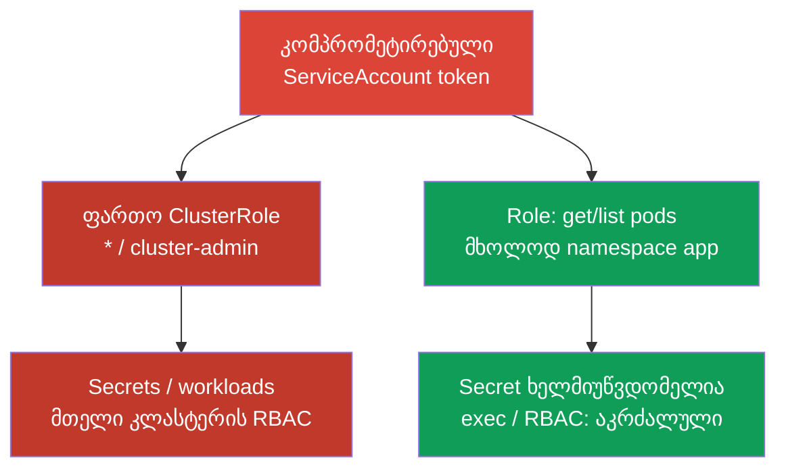
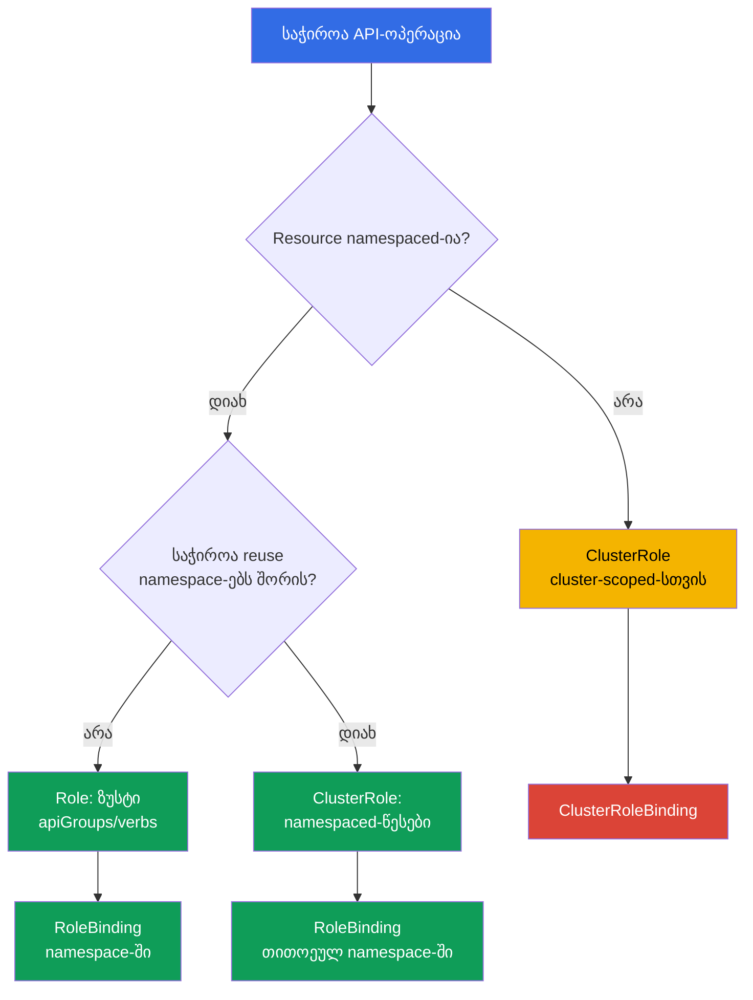

[Русская версия](ru.md) · [Eng version](README.md) · [Versión en español](es.md) · [Version française](fr.md) · [Deutsche Version](de.md) · [繁體中文版](tw.md) · [日本語版](jp.md)

# თავი 10. RBAC წვდომის მინიმიზაციისთვის

> **პრობლემა.** შემტევი, რომელმაც მიიღო shell Pod-ში ან მოიპარა token, არ გაჩერდება
> ერთი namespace-ის საზღვარზე, თუ ServiceAccount-ს ან მომხმარებელს აქვს ზედმეტი
> უფლებები. ფართო `verb`-მა, მოხერხებულობისთვის დავიწყებულმა `cluster-admin`-მა ან
> ხელმისაწვდომმა `escalate`/`bind`/`impersonate`-მა შეიძლება ლოკალური კომპრომეტაცია
> გადააქციოს ყველა Secret-ის წაკითხვად, ნებისმიერ ნოდაზე Pod-ის შექმნად ან კლასტერის
> სრულ ხელში ჩაგდებად - და ამას წყვეტს არა თავად დაუცველობა, არამედ ის, რაც RBAC-მა
> წინასწარ დაუშვა.

> **შემდეგი ნაბიჯი.** 07-09 თავებში შევამცირეთ კლასტერის კომპონენტების შეტევის
> ზედაპირი. ახლა შევზღუდავთ identity-ის, ServiceAccount-ის ან Pod-ის კომპრომეტაციის
> შედეგებს: RBAC-მა უნდა გასცეს მხოლოდ ის წვდომა, რომელიც ნამდვილად საჭიროა. ეს არის
> CKS-ის დომენი Cluster Hardening (15%).

> **რა გჭირდებათ CKA-დან.** `Role`-ის, `ClusterRole`-ის, `RoleBinding`-ისა და
> `ClusterRoleBinding`-ის საბაზისო სინტაქსი უკვე განხილულია [CKA-ს 38-ე
> თავში](../../../cka/course/38/ge.md). აქ არ მეორდება ოთხივე ობიექტის შექმნა, არამედ
> განვიხილავთ აუდიტს, უფლებების ესკალაციასა და წესების უსაფრთხო დაპროექტებას.

## 10.1. Least privilege: ერთი ზედმეტი verb ცვლის ინციდენტის საზღვარს

RBAC პასუხობს API server-ის მოთხოვნას identity-ის, `verb`-ის, resource-ის, namespace-ისა
და ზოგჯერ ობიექტის სახელის კომბინაციით. ნებართვები **ადიტიურია**: თუ ნებისმიერი
`RoleBinding` ან `ClusterRoleBinding` აძლევს წვდომას, უფრო ვიწრო role მას არ ართმევს.
ამიტომ აკრძალვის გამოხატვა მეორე role-ით შეუძლებელია: საჭიროა არსებული binding-ის
წაშლა ან შევიწროება. Kubernetes RBAC არის **allow-only** მოდელი: მასში არ არსებობს
უარყოფითი deny-წესები და პირობები, მაგალითად დღის დრო ან source IP. ასეთი მოთხოვნების
საერთო შემთხვევაში გადატანა admission-ზე შეუძლებელია: ის გაშვებულია
authentication/authorization-ის შემდეგ მხოლოდ create/delete/modify-სთვის (და
ზოგიერთი custom verb-სთვის), ხოლო `get`, `list` და `watch` ბრძანებები admission
layer-ს გვერდს უვლიან. პირობითი **API-ავტორიზაციისთვის** საჭიროა გარე/Webhook
authorizer ან სხვა authorization/policy layer; source IP დამატებით იზღუდება ქსელის
დონეზე - firewall-ით, load balancer-ით ან NetworkPolicy-ით, სადაც ეს გამოსადეგია.
Admission policy ვარგისია მხოლოდ იმ მოთხოვნებისთვის, რომლებსაც ის ნამდვილად წყვეტს,
და არა როგორც RBAC-პირობების შემცვლელი.

შეტევის სცენარი ტიპურია: დეველოპერს ან ServiceAccount-ს „დროებით" მისცეს
`cluster-admin`, ან controller-მა მიიღო `verbs: ["*"]`. მისი token-ის კომპრომეტაციის
შემდეგ შემტევს შეუძლია წაიკითხოს Secret credentials-ით, გაუშვას `pods/exec`
აპლიკაციაში, შექმნას workload უფრო პრივილეგირებული ServiceAccount-ის სახელით ან
თავად მისცეს თავს ახალი role. namespace-ის თავდაპირველი კომპრომეტაცია კლასტერის
კომპრომეტაციად იქცევა.



Least privilege არ ნიშნავს უბრალოდ `cluster-admin`-ის ჩანაცვლებას ნაკლებად
მძლავრსახელოვანი role-ით. ყოველი subject-ისთვის საჭიროა განისაზღვროს: რომელი
API-ოპერაციებია საჭირო, რომელ resource-ებზე, რომელ namespace-ში, რა ვადით და
საერთოდ არის თუ არა საჭირო API-წვდომა. ჩვეულებრივი აპლიკაციისთვის ხშირად სწორი
პასუხია ცალკე ServiceAccount token-ის გარეშე; token-ები განხილულია 11-ე თავში.

დაიწყეთ `Role`-ითა და `RoleBinding`-ით, თუ ამოცანა namespace-ში ლოკალურია.
`ClusterRole` საჭიროა cluster-scoped resource-ებისთვის ან განმეორებით
გამოსაყენებელი წესების ნაკრებისთვის, მაგრამ მისი გაცემა `RoleBinding`-ით შესაძლებელია
მხოლოდ ერთ namespace-ში. `ClusterRoleBinding` აფართოებს scope-ს მთელ კლასტერზე და
საჭიროებს ცალკე დასაბუთებას.

> 🎯 შეამოწმეთ კონკრეტული identity, verb, resource და scope წყვილი `can-i`-ით: საჭირო
> მოქმედება - `yes`, საშიში მეზობელი - `no`.

## 10.2. ფაქტობრივი უფლებების აუდიტი: `kubectl auth can-i`

YAML აჩვენებს განზრახვას, მაგრამ არა საბოლოო ავტორიზაციას: subject-მა წვდომა
შეიძლება მიიღოს რამდენიმე binding-იდან, embedded role-იდან, group-იდან ან
აგრეგირებული `ClusterRole`-იდან. შეამოწმეთ API server-ის პასუხი ბრძანებით
`kubectl auth can-i`.

```bash
# მიმდინარე identity-ის წესების მიმოხილვა კონკრეტულ namespace-ში.
kubectl auth can-i --list -n cks-104

# cluster-scoped და cross-namespace საზღვრები ცალკეული მოქმედებებით შევამოწმოთ.
kubectl auth can-i get nodes
kubectl auth can-i list pods -n cks-104
kubectl auth can-i list pods -n default

# თუ საკითხავია სწორედ "ნებადართულია თუ არა ეს მოქმედება ყველა namespace-ში":
kubectl auth can-i list pods --all-namespaces

# კონკრეტული მოსალოდნელი ნებართვა და მოსალოდნელი აკრძალვა - მაგრამ ეს არის თქვენი
# მიმდინარე identity-ის უფლებები და არა შემოწმებადი ServiceAccount-ის ან
# მომხმარებლის.
kubectl auth can-i list pods -n cks-104
kubectl auth can-i get secrets -n cks-104

# შემოწმება lab104-ის ServiceAccount-ის სახელით.
SA=system:serviceaccount:cks-104:app-sa
kubectl auth can-i list pods -n cks-104 --as="$SA"
kubectl auth can-i delete pods -n cks-104 --as="$SA"
kubectl auth can-i get secrets -n cks-104 --as="$SA"
# yes
# no
# no
```

`--as`-ის გარეშე `can-i` ყოველთვის პასუხობს იმ identity-ისთვის, რომლის ქვეშაც
თავად უშვებთ `kubectl`-ს - ანუ თქვენი საკუთარი kubeconfig-ისთვის და არა
შემოწმებადი identity-ისთვის. დავალება თითქმის ყოველთვის კონკრეტულ ServiceAccount-ს,
მომხმარებელს ან group-ს ეკითხება, ამიტომ შესამოწმებლად საჭიროა `--as=<identity>`:
მის გარეშე `yes`/`no` არაფერს ამტკიცებს აუდიტის სამიზნეზე, მხოლოდ თქვენს საკუთარ
უფლებებზე.

`--as-group` არ ცვლის `--as`-ს და არ არის მისი დამოუკიდებელი ალტერნატივა: ეს არის
დამატებითი impersonated group-ების სია, რომელიც გამოიყენება მხოლოდ impersonated
user-თან ერთად. თუ დავალება ამოწმებს group binding-ით მიღებულ უფლებებს, დააყენეთ
`--as` და **დამატებით** საჭირო `--as-group`:

```bash
kubectl auth can-i list pods -n cks-104 \
  --as=group-audit-user \
  --as-group=developers
```

გახსოვდეთ, რომ `--as=<user>` ამ მომხმარებლის რეალურ group-ებს ავტომატურად არ
აღადგენს: ჩამოთვალეთ ის impersonated group-ები, რომლებიც შემოწმებად სცენარშია
შესული.

`--list` მოსახერხებელია როგორც წესების მიმოხილვა, მაგრამ ნუ ჩათვლით მას
გარანტირებულად სრულ effective permissions-ის ჩამონათვალად ნებისმიერი authorizer
chain-ისთვის: ბრძანება ეყრდნობა `SelfSubjectRulesReview`-ს, ხოლო მისი ოფიციალური
დოკუმენტაცია პირდაპირ აფრთხილებს, რომ დაბრუნებული სია შეიძლება არასრული იყოს
კლასტერის authorization mode-ისა და evaluation-ის შეცდომების მიხედვით. `--list`
ასევე არ უჭერს მხარს `--all-namespaces`-ს: `kubectl` აშკარად უარყოფს ამ ფლაგების
კომბინაციას, რადგან `SelfSubjectRulesReview` წესებს ჩამოთვლის ზუსტად ერთ
namespace-ში და არ არის cluster-wide inventory. კრიტიკული საზღვრები დაადასტურეთ
ცალკეული positive/negative `kubectl auth can-i <verb> <resource>` ბრძანებებით
კონკრეტული identity-სთვის, როგორც ზემოთ მოცემულ მაგალითებში.

`--list` მოსახერხებელია review-სთვის, მაგრამ არ ცვლის კრიტიკული ნებართვების
შემოწმებას: გამოტანა შეიძლება გრძელი იყოს, ხოლო wildcard კონკრეტულ რისკს ფარავს.
acceptance-ტესტში ყოველთვის შეამოწმეთ წყვილი „საჭირო მოქმედება = `yes`" და
„საშიში მეზობელი მოქმედება = `no`". cluster-scoped resource-ისთვის ნუ მიუთითებთ
namespace-ს:

```bash
kubectl auth can-i get nodes --as="$SA"
kubectl auth can-i create clusterrolebindings --as="$SA"
kubectl auth can-i create pods/exec -n cks-104 --as="$SA"
```

ფლაგი `--as` იყენებს Kubernetes impersonation-ს. Kubernetes 1.36-ში მოთხოვნა
შეიძლება ნებადართული იყოს ან ფართო legacy verb-ით `impersonate`, ან Constrained
Impersonation-ით: ცალკე უფლებით identity-ზე და ცალკე `impersonate-on:<mode>:<verb>`
უფლებით ფაქტობრივად შესრულებულ API request-ზე. თუ საჭირო impersonation permissions
არ არის, API დააბრუნებს `forbidden`-ს ჯერ კიდევ impersonated identity-ის უფლებების
შემოწმებამდე.

Security-აუდიტისთვის ავტომატურად ნუ გასცემთ legacy `impersonate`-ს: აირჩიეთ
მოდელი, რომელიც შეესაბამება საჭირო workflow-ს, და დააფიქსირეთ დოკუმენტში მისი
მოქმედების არეალი.

> 🔬 Constrained Impersonation Kubernetes 1.36+-ში ცალ-ცალკე ზღუდავს იმიტირებულ
> identity-სა და იმიტაციისას ნებადართულ მოქმედებას.

### 10.2.1. Constrained Impersonation: identity-ისა და მოქმედების შეზღუდვა

> **Kubernetes 1.36+ / advanced.** ეს production-მასალაა CKS-ის სავალდებულო
> ბირთვის მიღმა: საგამოცდო პრიორიტეტია ზუსტი ჩვეულებრივი Role/Binding და
> მინიმალური `impersonate`.

**Constrained Impersonation** - Beta არის Kubernetes v1.36+-ში და ჩართულია
default-ად. ჩვეულებრივი `impersonate`-სგან განსხვავებით, ის არ იძლევა სამიზნის
სახელით ყველაფრის გაკეთების უფლებას, რაც სამიზნეს შეუძლია. ჩვეულებრივი
მომხმარებლისთვის (როცა `Impersonate-User`-ის მნიშვნელობა არ იწყება
`system:serviceaccount:`-ით ან `system:node:`-ით) API server ატარებს **ორ ცალკე
შემოწმებას**:

1. **Identity permission** - შეიძლება თუ არა ზუსტად ამ identity-ის იმიტირება.
   generic user-ისთვის ეს არის წესი `apiGroups: ["authentication.k8s.io"]`-ში,
   resource-ზე `users`, `resourceNames`-ით საჭირო სახელის და verb-ით
   `impersonate:user-info`. რადგან user-ს namespace-scope არ აქვს, გასცით ის
   `ClusterRole`-ისა და `ClusterRoleBinding`-ის მეშვეობით.
2. **Action-at-scope permission** - შეიძლება თუ არა კონკრეტული ოპერაციის შესრულება
   მისი scope-ის ფარგლებში *ამ იმიტაციისას*. Pod-ის `list`-ისთვის ეს არის
   `impersonate-on:user-info:list` `pods`-ზე; `watch`-ისთვის -
   `impersonate-on:user-info:watch`. ეს ნებართვები შეიძლება გაცემულ იქნას
   `Role`/`RoleBinding`-ით მხოლოდ საჭირო namespace-ში. მხოლოდ identity-ზე
   ნებართვა საკმარისი არ არის.

მაგალითი ServiceAccount `audit-reader`-ს უფლებას აძლევს იმიტირება მხოლოდ generic
user `readonly@example.com`-ისა და მხოლოდ `cks-104`-ში Pod-ების `list`/`watch`-ის:

```yaml
apiVersion: rbac.authorization.k8s.io/v1
kind: ClusterRole
metadata:
  name: impersonate-readonly-identity
rules:
- apiGroups: ["authentication.k8s.io"]
  resources: ["users"]
  resourceNames: ["readonly@example.com"]
  verbs: ["impersonate:user-info"]
---
apiVersion: rbac.authorization.k8s.io/v1
kind: ClusterRoleBinding
metadata:
  name: audit-reader-impersonate-readonly
subjects:
- kind: ServiceAccount
  name: audit-reader
  namespace: cks-104
roleRef:
  apiGroup: rbac.authorization.k8s.io
  kind: ClusterRole
  name: impersonate-readonly-identity
---
apiVersion: rbac.authorization.k8s.io/v1
kind: Role
metadata:
  name: impersonate-readonly-pods
  namespace: cks-104
rules:
- apiGroups: [""]
  resources: ["pods"]
  verbs:
  - "impersonate-on:user-info:list"
  - "impersonate-on:user-info:watch"
---
apiVersion: rbac.authorization.k8s.io/v1
kind: RoleBinding
metadata:
  name: audit-reader-impersonate-readonly-pods
  namespace: cks-104
subjects:
- kind: ServiceAccount
  name: audit-reader
  namespace: cks-104
roleRef:
  apiGroup: rbac.authorization.k8s.io
  kind: Role
  name: impersonate-readonly-pods
```

Client იყენებს იმავე header-ებს ან `kubectl --as=readonly@example.com`-ს; იცვლება
მხოლოდ API server-ის შემოწმებები. ძველი `impersonate` კვლავ მუშაობს და რჩება
ფართო fallback-ად, ამიტომ ნუ გასცემთ მას constrained-წესებთან ერთად ცალკე
საფუძვლის გარეშე.

მნიშვნელოვანია: constrained permission ეხება **რეალურ API request-ს**, და არა
მოქმედებას, რომელსაც client აღწერს სხვა review-ობიექტში. ამიტომ ზემოთ ნაჩვენები
`impersonate-on:user-info:list/watch` `pods`-ზე იძლევა ფაქტობრივი `list/watch
pods`-ის შესრულების უფლებას `--as`-ის ქვეშ, მაგრამ თავისთავად არ იძლევა:

```bash
kubectl auth can-i list pods --as=readonly@example.com -n cks-104
```

`kubectl auth can-i` ქმნის `SelfSubjectAccessReview`-ს, ამიტომ ასეთი
audit-workflow-სთვის საჭიროა constrained permissions, რომლებიც ფარავენ `create`-ს
`selfsubjectaccessreviews.authorization.k8s.io`-ზე, ან კონტროლირებადი legacy
impersonator. ნუ გააფართოებთ constrained role-ს მხოლოდ `can-i`-ის
მოხერხებულობისთვის, თუ საჭირო ოპერაცია პირდაპირ შეიძლება შემოწმდეს უსაფრთხო
read-only სცენარში.

inventory-სთვის ჯერ მოძებნეთ, საიდან შეიძლებოდა მოსულიყო შესაძლებლობა, შემდეგ
დაათვალიერეთ წესები და subject-ები. embedded role-ები ნუ დაარედაქტირებთ, სანამ არ
გაიგებთ, ვინ იყენებს მათ.

```bash
ROLE_NAME='role-name-to-review'
kubectl get role,rolebinding -A
kubectl get clusterrole,clusterrolebinding
kubectl describe rolebinding -n cks-104 app-sa-pod-reader
kubectl get clusterrolebinding -o wide
kubectl get clusterrole "$ROLE_NAME" -o yaml
```

## 10.3. საშიში verb-ები და resource-ები: ესკალაციის გზები

ყველა წესი ერთნაირი არ არის. Read-only წვდომა `pods`-ზე და `get` `secrets`-ზე
სრულიად განსხვავებულ ზიანს იწვევს, ხოლო ზოგიერთი verb-ი საშუალებას იძლევა
ირიბად მოხდეს უკვე არსებული უფლებების მიღება. review-ისას ჩვეულებრივი
`get`/`list`-ის წინ მოძებნეთ შემდეგი კომბინაციები.

| Verb ან resource | რატომ არის საშიში | უსაფრთხო მიდგომა |
|---|---|---|
| `escalate` `roles`/`clusterroles`-ზე | ჩვეულებრივ `create`/`update`-თან ერთად Role/ClusterRole-ზე ხსნის მოთხოვნას, თავად ფლობდე ყველა permission-ს, რომელიც role-ში იწერება. | ნუ გასცემთ workload-ს და ჩვეულებრივ namespace-ადმინისტრატორებს; ცალ-ცალკე აკონტროლეთ ორივე - CRUD RBAC-ობიექტებზე და bypass-verb. |
| `bind` `roles`/`clusterroles`-ზე | ჩვეულებრივ `create`/`update`-თან ერთად RoleBinding/ClusterRoleBinding-ზე ხსნის მოთხოვნას, თავად ფლობდე referenced role-ის permissions-ს. | შემოფარგლეთ კონკრეტული role-ებით `resourceNames`-ის მეშვეობით და გასცით მხოლოდ ნამდვილად საჭირო binding-მართვასთან ერთად. |
| `impersonate` `users`, `groups`, `serviceaccounts`, `uids` ან `userextras/<სახელი>`-ზე | საშუალებას იძლევა შესრულდეს მოთხოვნები სხვა, მათ შორის უფრო პრივილეგირებული, identity-ის სახელით. Extra-ველები დგინდება ზუსტი resource name-ით, მაგალითად `userextras/scopes`, API group-ში `authentication.k8s.io`. | მისცეთ auditor-ს მხოლოდ საჭიროებისას და შემოფარგლეთ `resourceNames`-ით. |
| `create`/`update`/`patch` RoleBinding-სა და ClusterRoleBinding-ზე | ხელმისაწვდომ role-თან ერთად შეიძლება გადასცეს უფლებები; ClusterRoleBinding ამას მთელ კლასტერზე აკეთებს. | აუკრძალეთ აპლიკაციას; გამოაცალკევეთ წვდომის გაცემა workload-ის დეველოპმენტისგან. |
| `get`/`list`/`watch` `secrets`-ზე | Secret ხშირად შეიცავს password-ს, registry credential-ს, key-ს ან bearer token-ს; `list`/`watch` ავლენს ბევრი Secret-ის მნიშვნელობას. | `get`-ისთვის მიუთითეთ კონკრეტული Secret `resourceNames`-ით, ან საერთოდ ნუ მისცემთ აპლიკაციას API-წვდომას. |
| `create` `serviceaccounts/token`-ზე | გასცემს არჩეული ServiceAccount-ის token-ს და შეიძლება გახდეს მისი უფლებებით სარგებლობის გზა. | დაუშვით მხოლოდ სანდო ავტომატიზაციისთვის, კონკრეტული ServiceAccount-ებისთვის. |
| `create` `pods/exec`-ზე | აძლევს ინტერაქტიულ command-ების შესრულების შესაძლებლობას უკვე მომუშავე Pod-ში და წვდომას მის ქსელზე, ფაილურ სისტემასა და mount-ილ Secret-ზე. | ნუ ჩართავთ ჩვეულებრივ role-ებში; გამოიყენეთ ხანმოკლე break-glass წვდომა და აუდიტი. |
| `create` `pods/portforward`-ზე | აყალიბებს ტუნელს Pod-ის port-ებამდე, გვერდს უვლის ჩვეულებრივ ქსელურ ექსპოზიციას. | გასცით წერტილოვნად დიაგნოსტიკისთვის და გააუქმეთ ინციდენტის შემდეგ. |
| `create` workload-ზე (`pods`, `deployments`, `jobs` და ა. შ.) | Pod/workload-ის შექმნა namespace-ში თავისთავად აძლევს ძლიერ ირიბ წვდომას: შეიძლება ავირჩიოთ ამ namespace-ის ნებისმიერი ServiceAccount და Pod spec-იდან მივუთითოთ Secret, ConfigMap და ხელმისაწვდომი storage, თუნდაც საწყისი identity-ისთვის ცალკე `get secrets`-ის გარეშე. ეს საშუალებას იძლევა მოხდეს სხვა workload-ის მონაცემების ან API-უფლებების მიღება. თუ policy უშვებს privileged/host-level Pod-ს, შედეგები node-ზეც შეიძლება გავრცელდეს. | ნუ გასცემთ არასანდო tenant-identity-ს საჭიროების გარეშე; workload-ის შექმნა ჩათვალეთ პრივილეგირებულ უფლებად, შემოფარგლეთ Pod Security, ServiceAccount-, Secret/storage-დიზაინი და admission policy. |
| `nodes` | node-ობიექტებზე წვდომა ავლენს ინფრასტრუქტურის შესახებ ინფორმაციას; node-ის შეცვლა cluster-wide ოპერაციაა. | გამორიცხეთ tenant-role-ებიდან; გასცით ცალკე ოპერაციულ identity-ებზე. |
| `get` `nodes/proxy`-ზე | უშვებს proxy-მოთხოვნებს kubelet-თან. ეს არ არის read-only წვდომა: kubelet proxy-ოპერაციებმა შეიძლება გვერდი აუარონ admission-ს და API server-ის ჩვეულებრივ audit-ს. | ნუ გასცემთ workload-სა და tenant-role-ებზე; მიაწოდეთ მხოლოდ მკაცრად კონტროლირებად ოპერაციულ identity-ს. |

Subresource იწერება ხაზგასმულით: `resources: ["pods/exec"]`. `exec`-ისა და
`portforward`-ისთვის ჩვეულებრივ საჭიროა სწორედ `create`, და არა `get`. ნუ
ჩაანაცვლებთ ზუსტ წესს `resources: ["pods/exec"]` წესით ყველა `pods`-ზე: ეს
სხვადასხვა API-გზაა და სხვადასხვა რისკი. პირიქით, `get` `nodes/proxy`-ზე - ცალკე
საშიში ნებართვაა kubelet proxy-ზე და არა node-ის უწყინარი წაკითხვა.

Kubernetes 1.36-ში `KubeletFineGrainedAuthz` - GA არის და მუდმივად ჩართული.
ლეგიტიმური ოპერაციული ამოცანისთვის გასცით ვიწრო subresource `nodes/proxy`-ის
ნაცვლად: მაგალითად, `nodes/stats`, `nodes/metrics`, `nodes/log`, `nodes/pods`,
`nodes/healthz` ან `nodes/configz`. kubelet სწორედ ამ გზებს ცალ-ცალკე ამოწმებს;
დანარჩენი მოთხოვნებისთვის და თავსებადობის გამო fallback-ად რჩება `nodes/proxy`.

```yaml
# მაგალითი monitoring-identity-სთვის; ამ წესით ნუ ჩაანაცვლებთ kubelet-ის ნებისმიერ ოპერაციას.
rules:
- apiGroups: [""]
  resources: ["nodes/metrics", "nodes/stats"]
  verbs: ["get"]
```

Wildcard-ები განსაკუთრებით საშიშია სამ ადგილას: `apiGroups: ["*"]`,
`resources: ["*"]` და `verbs: ["*"]`. ისინი მოიცავენ ახალ API-group-ებს, CRD-ებს,
subresource-ებსა და verb-ებს, რომლებიც განახლების შემდეგ გამოჩნდება. წესი,
რომელიც დღეს უსაფრთხოა, ხვალ შეუმჩნევლად ფართოვდება. wildcard ასევე ართულებს
აუდიტს: YAML-ის მიხედვით ვერ გაარკვევთ, არის თუ არა წვდომა `secrets`-ზე,
`pods/exec`-ზე ან `rolebindings`-ზე.

> 🧠 RBAC ადიტიურია: ვიწრო role გაცემულ Allow-ს არ აუქმებს; `escalate`, `bind`,
> `impersonate`, binding-ები, Secret და საშიში subresource-ები შეიძლება სხვისი
> უფლებების გადაცემას ემსახურებოდეს.

```yaml
# არაუსაფრთხო: მთელი მიმდინარე და მომავალი API namespace-ის ფარგლებში.
rules:
- apiGroups: ["*"]
  resources: ["*"]
  verbs: ["*"]
```

```yaml
# მინიმალური read-only controller-ისთვის ერთ namespace-ში.
rules:
- apiGroups: [""]
  resources: ["pods"]
  verbs: ["get", "list"]
```

## 10.4. მინიმალური Role-ის დაპროექტება

ჯერ ჩვეულებრივი ენით ჩაწერეთ წვდომის კონტრაქტი: „`app-sa` კითხულობს Pod-ების
სიასა და კონკრეტული ConfigMap-ის მდგომარეობას `cks-104`-ში; არ ცვლის workload-ს,
Secret-ს ან RBAC-ს". შემდეგ თარგმნეთ ის მინიმალურ წესებად. გამოყავით კითხვა
(`get`, `list`, `watch`) და ცვლილება (`create`, `update`, `patch`, `delete`):
controller-ს, რომელიც Pod-ებს აკვირდება, სავალდებულოდ არ სჭირდება მათი წაშლის
უფლება.

> 🎯 ჩამოაყალიბეთ წვდომის კონტრაქტი, აირჩიეთ ვიწრო scope (`Role` + `RoleBinding`
> namespace-სთვის) და დაამტკიცეთ ნებადართული მოქმედება და უარი საშიშ მეზობელ
> resource-ზე ან namespace-ზე.

```yaml
apiVersion: v1
kind: ServiceAccount
metadata:
  name: app-sa
  namespace: cks-104
---
apiVersion: rbac.authorization.k8s.io/v1
kind: Role
metadata:
  name: app-sa-pod-reader
  namespace: cks-104
rules:
- apiGroups: [""]
  resources: ["pods"]
  verbs: ["get", "list"]
---
apiVersion: rbac.authorization.k8s.io/v1
kind: RoleBinding
metadata:
  name: app-sa-pod-reader
  namespace: cks-104
subjects:
- kind: ServiceAccount
  name: app-sa
  namespace: cks-104
roleRef:
  apiGroup: rbac.authorization.k8s.io
  kind: Role
  name: app-sa-pod-reader
```

`resourceNames` დამატებით ზღუდავს `get`, `update`, `patch` და `delete`-ს
ობიექტის სახელით. ეს სასარგებლოა ერთი ცნობილი ConfigMap-ის ან Secret-ისთვის.
**ზედა დონის resource-ისთვის** ის არ ზღუდავს `create`-სა და
`deletecollection`-ს: ამ მოთხოვნებში ობიექტის სახელი URL-ის ნაწილი არ არის.
ეს არ არის წესი ყველა subresource-ისთვის: named subresource, მაგალითად
`pods/exec`, შეიძლება შემოიფარგლოს `resourceNames`-ით (იხილეთ [RBAC
reference](https://kubernetes.io/docs/reference/access-authn-authz/rbac/)).
`list`/`watch` `resourceNames`-თან ერთად client-ისგან მოითხოვს field selector
`metadata.name=<name>`-ს და ხშირად არამოსახერხებელია; ნუ ჩათვლით მას
namespace-იზოლაციის სრულფასოვან შემცვლელად.

```yaml
apiVersion: rbac.authorization.k8s.io/v1
kind: Role
metadata:
  name: app-config-reader
  namespace: cks-104
rules:
- apiGroups: [""]
  resources: ["configmaps"]
  resourceNames: ["app-config"]
  verbs: ["get"]
```

შეამოწმეთ resource-ის scope ობიექტის არჩევამდე. `pods`, `configmaps`,
`deployments` და `secrets` namespaced არის, ამიტომ `Role` ზღუდავს მათ
namespace-ით. `nodes`, `namespaces`, `persistentvolumes` და `clusterroles`
cluster-scoped არის: მათთვის საჭიროა `ClusterRole`, ხოლო `RoleBinding`
cluster-scoped resource-ს ლოკალურს არ ხდის. თუ namespaced-წესების ერთი ნაკრები
რამდენიმე namespace-ში გჭირდებათ, განსაზღვრეთ `ClusterRole`, მაგრამ მიაბით
ცალკეული `RoleBinding`-ებით თითოეულ ნებადართულ namespace-ში.

`nonResourceURLs` აღწერს API server-ის URL-ს და არა Kubernetes-ობიექტებს.
ასეთ URL-ს namespace scope არ აქვს, ამიტომ წესი უნდა იმყოფებოდეს
`ClusterRole`-ში და გაცემულ იქნას `ClusterRoleBinding`-ით. მაგალითად, ცალკე
health-check identity-ს შეიძლება მიეცეს ზუსტად `nonResourceURLs: ["/healthz"]`
და `verbs: ["get"]`, wildcard `/*`-ის გაცემის გარეშე. `RoleBinding`, თუნდაც ის
ასეთ `ClusterRole`-ს მიმართავდეს, non-resource URL-ს namespaced permission-ად
არ აქცევს.



`ClusterRole` ავტომატურად არ ნიშნავს cluster-wide access-ს: მას შეუძლია
შეიცავდეს წესებს namespaced resource-ებისთვის და გაცემულ იქნას
`RoleBinding`-ით მხოლოდ კონკრეტულ namespace-ში. Cluster-wide scope სწორედ
`ClusterRoleBinding`-ისას ჩნდება. cluster-scoped resource-ებისა და
`nonResourceURLs`-ისთვის საჭიროა `ClusterRole` + `ClusterRoleBinding`.

## 10.5. Built-in და აგრეგირებული ClusterRole: უფლებების ფარული გაფართოება

Built-in `ClusterRole`-ები მოსახერხებელია, მაგრამ რისკით არ არის თანაბარი.
`view` განკუთვნილია ჩვეულებრივი namespaced-ობიექტების წასაკითხად და
განზრახ არ იძლევა წვდომას Secret-ზე, Role-ზე ან RoleBinding-ზე: Secret
ხშირად შეიცავს ServiceAccount-ის პრივილეგიებს. `edit` უშვებს უმეტესი
namespaced resource-ის შეცვლას და Secret-ის კითხვას, მაგრამ ვერ ცვლის
Role-ს ან RoleBinding-ს; ამასთან შეუძლია გაუშვას Pod იმავე namespace-ის
ნებისმიერი ServiceAccount-ის სახელით. `admin`-ს შეუძლია namespace-ში
RBAC-ის უმეტესობის მართვა.

Built-in `cluster-admin` შეიცავს მაქსიმალურად ფართო wildcard-ნებართვებს.
`ClusterRoleBinding`-ით იგივე `ClusterRole` აძლევს cluster-wide superuser
წვდომას. `RoleBinding`-ით ის შემოიფარგლება კონკრეტული namespace-ის scope-ით,
მაგრამ `cluster-admin`-ის built-in სემანტიკა აძლევს ამ namespace-ის
resource-ების სრულ კონტროლს, **თავად Namespace-ობიექტის ჩათვლით** -
მნიშვნელოვანი გამონაკლისი, რადგან `Namespace` თავად cluster-scoped
resource-ია. ასეთი `RoleBinding` cluster-wide-ად არ იქცევა, მაგრამ მაინც
რჩება უკიდურესად პრივილეგირებულ namespaced binding-ად; `cluster-admin`-ის
ნებისმიერი მინიჭება ცალკე უნდა იყოს დასაბუთებული და კონტროლირებადი.

| Role | პრაქტიკული მნიშვნელობა | რისკი აპლიკაციაზე ან ფართო group-ზე მინიჭებისას |
|---|---|---|
| `view` | namespace-ის ჩვეულებრივი resource-ების ნახვა; Secret-ის, Role-ისა და RoleBinding-ის გარეშე | შეიძლება გაამჟღავნოს topology, image-ები და კონფიგურაცია, მაგრამ credential-ის გაჟონვის რისკი ნაკლებია. |
| `edit` | namespace-ის უმეტესი resource-ის შეცვლა და Secret-ის კითხვა; Role/RoleBinding-ის შეცვლის გარეშე | შესაძლებელია workload-ის შეცვლა, Secret-ის წაკითხვა და Pod-ის გაშვება namespace-ის ნებისმიერი ServiceAccount-ის სახელით. |
| `admin` | namespace-ის ფართო ადმინისტრირება, მისი საზღვრის ფარგლებში roles/binding-ების მართვის ჩათვლით | ესკალაციის მაღალი რისკი namespace-ში და გუნდის აპლიკაციების ხელში ჩაგდება. |
| `cluster-admin` | `ClusterRoleBinding`-ით - სრული წვდომა მთელ კლასტერზე; `RoleBinding`-ით - ამ binding-ის namespace-ის resource-ების სრული კონტროლი, თავად Namespace-ობიექტის ჩათვლით | თუნდაც ლოკალური მიბმა უკიდურესად სარისკოა; ClusterRoleBinding ნიშნავს კლასტერის კომპრომეტაციას. |

Aggregation იძლევა built-in ClusterRole-ის სხვა ClusterRole-ების წესებით
გაფართოების საშუალებას. RBAC controller აერთიანებს role-ების წესებს,
რომლებსაც აქვთ label
`rbac.authorization.k8s.io/aggregate-to-<role>: "true"`. ეს სასარგებლოა
CRD-ებისთვის: მაგალითად, plugin-ს შეუძლია დაამატოს `view`-ს საკუთარი
API-ის read-only წესები. მაგრამ ეს label supply chain-ისა და
RBAC-ის საზღვარია: შექმნილმა ან შეცვლილმა role-მა შეიძლება შეუმჩნევლად
მისცეს ყველა მომხმარებელს `view`, `edit` ან `admin` დამატებითი უფლებები.

> 🧠 `aggregate-to-*` ცვლის built-in role-ის მთელი აუდიტორიის effective
> permissions-ს; wildcard წყარო-role-ში მასობრივად აფართოებს უფლებებს.

```yaml
# მაგალითი built-in role view-ის გაფართოებისა მხოლოდ CRD-ის კითხვისთვის.
# დაამატეთ ასეთი role მხოლოდ ცალკე security-review-ის შემდეგ.
apiVersion: rbac.authorization.k8s.io/v1
kind: ClusterRole
metadata:
  name: aggregate-widget-view
  labels:
    rbac.authorization.k8s.io/aggregate-to-view: "true"
rules:
- apiGroups: ["example.io"]
  resources: ["widgets"]
  verbs: ["get", "list", "watch"]
```

შეამოწმეთ აგრეგირებული წესები საბოლოო built-in role-თან ერთად, ასევე
თავად aggregation-ის წყაროები. ნუ დაარედაქტირებთ სისტემურ ClusterRole-ებს
პრეფიქსით `system:`: API server-ს შეუძლია აღადგინოს ისინი გაშვებისას ან
განახლებისას. საკუთარი ClusterRole-ები და label-ები მართეთ Git-ის,
code review-ისა და შეზღუდული identity-ების წრის მეშვეობით, რომლებსაც
RBAC-ის შეცვლის უფლება აქვთ.

```bash
# built-in role-ის საბოლოო effective წესები.
kubectl get clusterrole view -o yaml

# ყველა ClusterRole, რომელსაც შეუძლია view/edit/admin-ის გაფართოება.
kubectl get clusterrole -l rbac.authorization.k8s.io/aggregate-to-view=true
kubectl get clusterrole -l rbac.authorization.k8s.io/aggregate-to-edit=true
kubectl get clusterrole -l rbac.authorization.k8s.io/aggregate-to-admin=true
```

### ესკალაციის კომპაქტური რუკა

| შესაძლებლობა | საზღვარი, რომელსაც ის ცვლის | კონტროლი |
|---|---|---|
| `create` CSR `approve`/`sign`-ის შესაძლებლობასთან ერთად | შეუძლია გასცეს client certificate უფრო ფართო identity-ით; მხოლოდ `create` საკმარისი არ არის | გაყავით create, approval და signing კონტროლირებად identity-ებს შორის. |
| `ValidatingWebhookConfiguration`/`MutatingWebhookConfiguration`-ის მართვა | ცვლის admission-მოთხოვნების ვალიდაციას ან მუტაციას მთელ კლასტერში | ნუ გასცემთ tenant-role-ებზე; დაარევიუეთ endpoint, CA და webhook-წესები. |
| `Namespace`-ის label-ების `patch` | შეუძლია შეცვალოს Pod Security Admission-ის label-ები და დაუშვას სხვა Pod-პროფილი | შემოფარგლეთ ცალკე platform-identity-ით და დაარევიუეთ label-ცვლილებები. |
| PV-ის შექმნა/შეცვლა `hostPath`-ით | claim-სა და Pod-ს შეუძლია მიიღოს node-ის ფაილური სისტემის path | აუკრძალეთ tenant-role-ებს; აკონტროლეთ storage policy და Pod Security Admission. |
| ServiceAccount token-ების გაცემა (`create serviceaccounts/token`) | საშუალებას იძლევა მოქმედება არჩეული ServiceAccount-ის უფლებებით | დაუშვით მხოლოდ სანდო ავტომატიზაციისთვის, კონკრეტული ServiceAccount-ებისთვის. |
| `system:masters`-ის წევრობა | ეს არის superuser-group, რომელიც ჩვეულებრივ RBAC-შემოწმებას გვერდს უვლის | ნუ გასცემთ აპლიკაციებზე; აკონტროლეთ სერტიფიკატების წყარო და გარე group-ები. |

> 🎯 RBAC-ის შეცვლის შემდეგ დაამტკიცეთ როგორც ნებადართული მოქმედება, ისე
> მოსალოდნელი უარი.

## 10.6. შემოწმება: დაამტკიცეთ როგორც საჭირო წვდომა, ისე უარი

Role-ის გატანის შემდეგ ნუ შემოიფარგლებით `kubectl get role`-ით: ობიექტი
შეიძლება არსებობდეს, მაგრამ არ იყოს მიბმული, კონფლიქტში იყოს სხვა binding-თან
ან ზედმეტად ფართო აღმოჩნდეს. lab104-ში `app-sa`-სთვის შემოწმებამ ზუსტად
საჭირო საზღვარი უნდა დაამტკიცოს.

```bash
kubectl apply -f app-sa-rbac.yaml

SA=system:serviceaccount:cks-104:app-sa

# ფუნქციონალურად საჭირო უფლება.
kubectl auth can-i get pods -n cks-104 --as="$SA"
kubectl auth can-i list pods -n cks-104 --as="$SA"
# yes
# yes

# არასასურველი უფლებები: workload-ის, Secret-ის, exec-ისა და RBAC-ის შეცვლა.
kubectl auth can-i delete pods -n cks-104 --as="$SA"
kubectl auth can-i get secrets -n cks-104 --as="$SA"
kubectl auth can-i create pods/exec -n cks-104 --as="$SA"
kubectl auth can-i create rolebindings -n cks-104 --as="$SA"
kubectl auth can-i create clusterrolebindings --as="$SA"
# no
# no
# no
# no
# no
```

შეამოწმეთ მოქმედების არეალიც. იმავე identity-ს არ უნდა შეეძლოს მეზობელ
namespace-ში Pod-ების წაკითხვა და არ უნდა ჰქონდეს cluster-scoped უფლებები
მხოლოდ იმიტომ, რომ მას Pod-ზე წვდომა მიეცა.

```bash
kubectl auth can-i list pods -n default --as="$SA"
kubectl auth can-i get nodes --as="$SA"
# no
# no
```

თუ პასუხი მოულოდნელად `yes` აღმოჩნდა, იპოვეთ subject-ის ყველა binding და
გაიმეორეთ შემოწმება ზედმეტი წვდომის წაშლის ან შევიწროების შემდეგ. წაშალეთ
ზუსტად ის ობიექტი და არა შემთხვევით სხვა გუნდის წვდომა:

```bash
kubectl get rolebinding -A -o yaml | grep -n -C 4 'app-sa'
kubectl get clusterrolebinding -o yaml | grep -n -C 4 'app-sa'

# მხოლოდ owner-ისა და binding-ის დანიშნულების დადასტურების შემდეგ.
kubectl delete clusterrolebinding app-sa-excessive-access
```

Production-ისთვის შეიტანეთ `can-i`-ის ეს ნაკრები smoke-test-ში RBAC-ის
ცვლილების შემდეგ, ხოლო Role-ის, ClusterRole-ისა და binding-ის ცვლილებები
გაუგზავნეთ review-ს. გრძელვადიანი წვდომა რეგულარულად გადაასინჯეთ
ServiceAccount-ის ფაქტობრივი დანიშნულების, audit-ლოგებისა და workload-ის
owner-ის მიხედვით.

> 🏭 Role-ები და aggregation label-ები ინახება Git-ში, ცვლილებები გადის
> review-ს, ხოლო კრიტიკული positive/negative `can-i` შემოწმებები - CI-ში;
> break-glass-ს ჰყავს owner და აქვს ვადა.

## 10.7. როგორ გამოიყენება production-ში

- **Role ნაგულისხმევად.** გუნდები და აპლიკაციები იღებენ namespaced
  `Role`/`RoleBinding`-ს; `ClusterRoleBinding` მოითხოვს owner-ს, მიზეზს,
  მოქმედების ვადასა და security-review-ს.
- **ServiceAccount ნაგულისხმევად.** ნუ მისცემთ `default` ServiceAccount-ს
  აპლიკაციურ უფლებებს. თუ workload არ მიმართავს Kubernetes API-ს, დააყენეთ
  `automountServiceAccountToken: false`; წინააღმდეგ შემთხვევაში შექმენით
  ცალკე ServiceAccount მინიმალური უფლებებით. ასე აუდიტი და წვდომის გაუქმება
  წერტილოვანი რჩება.
- **RBAC როგორც კოდი.** ინახავეთ საკუთარი role-ები Git-ში, შეამოწმეთ წესების
  diff და aggregation label-ები CI-ში. ცალკე დაბლოკეთ wildcard, `escalate`,
  `bind`, `impersonate` და Secret-ზე წვდომა აშკარა გამონაკლისის გარეშე.
- **API server-ის ავტორიზაციის კონფიგურაცია.** ჯერ განსაზღვრეთ, რომელი ორი
  ურთიერთგამომრიცხავი კონფიგურაციის მეთოდიდანაა გამოყენებული.

  Command-line კონფიგურაციისას შეამოწმეთ, რომ `--authorization-mode`
  შეიცავს საჭირო ჯაჭვს, მაგალითად `Node,RBAC`.

  File-based კონფიგურაციისას `--authorization-config`-ის მეშვეობით ერთდროულად
  ნუ დააყენებთ `--authorization-mode`-ს: შეამოწმეთ `type: RBAC`-ის არსებობა,
  `authorizers`-ის შემადგენლობა და მიმდევრობა უშუალოდ
  `AuthorizationConfiguration`-ში.

  authorizer chain-ის შემადგენლობა და მიმდევრობა security-review-ის ნაწილი
  უნდა იყოს.
- **პერიოდული აუდიტი.** გადაწერეთ inventory `ClusterRoleBinding`-ისთვის,
  subject-ებისთვის `system:serviceaccount`, built-in role-ებისა და
  aggregator-ებისთვის; შეამოწმეთ კრიტიკული კონტრაქტები `kubectl auth
  can-i`-ის მეშვეობით.
- **Break-glass მუდმივი admin-ის ნაცვლად.** გადაუდებელი წვდომა უნდა იყოს
  ცალკე ხანმოკლე identity, ჟურნალირებადი და გაუქმებადი მუშაობის შემდეგ, და
  არა `cluster-admin`, რომელიც ყოველდღიურ მომხმარებელთან რჩება.

## 10.8. მინი-ლექსიკონი

- **least privilege** - identity-ისთვის კონკრეტული ამოცანისთვის საჭირო
  მხოლოდ მინიმალური ნებართვების ნაკრების გაცემა.
- **verb** - Kubernetes API-ის ოპერაცია, მაგალითად `get`, `list`, `create`,
  `bind` ან `escalate`.
- **resource / subresource** - API-ობიექტი და მისი subresource, მაგალითად
  `pods` და `pods/exec`.
- **`resourceNames`** - წესის შემოფარგვლა ობიექტების კონკრეტული სახელებით
  იქ, სადაც ამას API server უჭერს მხარს.
- **impersonation** - მოთხოვნის შესრულება სხვა identity-ის სახელით
  API-header-ების მეშვეობით.
- **aggregation** - ერთი ClusterRole-ის წესების ავტომატური დამატება
  built-in ClusterRole-ში label-ის მიხედვით.
- **wildcard** - `*` `apiGroups`-ში, `resources`-ში ან `verbs`-ში; მოიცავს
  უცნობ მომავალ ობიექტებს და ამიტომ საშიშია security-role-ში.
- **break-glass access** - კონტროლირებადი დროებითი პრივილეგირებული
  წვდომა ავარიისთვის.

## 10.9. თავის შეჯამება

- RBAC-ნებართვები ადიტიურია: ზედმეტი binding ვერ კომპენსირდება უფრო ვიწრო
  role-ით, ის უნდა მოიძებნოს და წაიშალოს ან შევიწროვდეს.
- Least privilege იწყება `Role`-ითა და `RoleBinding`-ით კონკრეტულ
  namespace-ში; კლასტერის დონის წვდომა და `ClusterRoleBinding` საჭიროებენ
  ცალკე დასაბუთებას.
- `kubectl auth can-i --list` იძლევა წესების სასარგებლო მიმოხილვას, როცა
  შედეგი სრულია, მაგრამ გარანტირებულად ამომწურავი inventory არ არის.
  Security-critical საზღვრები დაამტკიცეთ targeted `can-i`-შემოწმებებით:
  მოსალოდნელმა წვდომამ უნდა დააბრუნოს `yes`, აკრძალულმა - `no`.
- განსაკუთრებით საშიშია `escalate`, `bind`, `impersonate`, binding-ის
  შეცვლა, `secrets`, `serviceaccounts/token`, `pods/exec`,
  `pods/portforward` და `get nodes/proxy`.
- ნუ გამოიყენებთ `*`-ს გამონაკლისი და დოკუმენტირებული საფუძვლის გარეშე:
  wildcard მოიცავს მიმდინარე და მომავალ API-ებს, resource-ებს,
  subresource-ებსა და verb-ებს.
- Aggregated ClusterRole-ებმა შეიძლება შეუმჩნევლად გააფართოვონ `view`,
  `edit` და `admin`; label-ები `aggregate-to-*` და ასეთი role-ების
  წყაროები უნდა დარევიუდეს.

## 10.10. როგორ გამოგადგებათ: გამოცდასა და რეალურ სამუშაოში

**გამოცდაზე.** სწრაფად შექმენით ან შეავიწროვეთ `Role` ზუსტი `apiGroups`-ით,
`resources`-ითა და `verbs`-ით, მიაბით ის სწორ ServiceAccount-ს მითითებულ
namespace-ში და დაუყოვნებლივ შეამოწმეთ
`kubectl auth can-i --as=system:serviceaccount:<ns>:<sa>`. წაიკითხეთ
resource პირდაპირ: `pods/exec` არ არის იგივე, რაც `pods`; `nodes`
cluster-scoped-ია. თუ საჭიროა ზედმეტი წვდომის მოცილება, ჯერ იპოვეთ
შესაბამისი binding და ნუ შეცვლით ყველაფერს ზედიზედ.

**რეალურ სამუშაოში.** RBAC ზღუდავს მოპარული token-ის, ავტომატიზაციის
შეცდომისა და Pod-ის კომპრომეტაციის blast radius-ს. ყველაზე საშიში
ინციდენტები ჩვეულებრივ არა YAML-ის სინტაქსის, არამედ მოსახერხებელი ფართო
role-ების, wildcard-ისა და ფარული binding-ების გამო წარმოიშობა. რეგულარული
`can-i`-აუდიტი, aggregation label-ების review და აშკარა წვდომის კონტრაქტი
RBAC-ს ამოწმებად security-საზღვრად აქცევს.

> ### 🔴 შემტევის თვალსაზრისი
> **Asset:** Kubernetes API-ის resource-ები.
>
> **Starting foothold:** კოდის შესრულება Pod-ში.
>
> **Attacker objective:** workload-ის identity-ის გამოყენება API-წვდომისთვის.
>
> **Abuse path:** შემოწმდეს token-ის არსებობა, მისი audience და TTL, შემდეგ
> RBAC permissions და Pod-ების `list`-ის, Secret-ის წაკითხვის ან
> `pods/exec`-ის მეშვეობით workload-ის შექმნის/გაშვების შესაძლებლობა.
>
> **Expected evidence:** audit-events და SubjectAccessReview.
>
> **Control:** `automountServiceAccountToken: false` იქ, სადაც API საჭირო
> არ არის; projected ხანმოკლე token იქ, სადაც საჭიროა; მინიმალური RBAC.
>
> **Retest:** ნებადართული API call მუშაობს, ხოლო აკრძალული აბრუნებს `403`-ს.
>
> **ATT&CK:** [T1528 — Steal Application Access
> Token](https://attack.mitre.org/techniques/T1528/).

## 10.11. კითხვები თვითშემოწმებისთვის

<details>
<summary>1. რატომ ვერ აუქმებს უფრო ვიწრო Role-ი სხვა binding-ის მიერ გაცემულ
ნებართვას?</summary>

Kubernetes-ში RBAC ადიტიურია: ნებართვა მოქმედებს, თუ მას გასცემს თუნდაც ერთი
RoleBinding ან ClusterRoleBinding. allow-only მოდელში არ არსებობს
deny-წესი, რომელსაც შეეძლოს უკვე გაცემული წვდომის გადაფარვა. ზედმეტი
ნებართვის მოსაშორებლად საჭიროა ზუსტად ის binding მოიძებნოს და წაიშალოს ან
შევიწროვდეს, რომელიც მას გასცემს.
</details>

<details>
<summary>2. რომელი ორი `can-i`-შემოწმება ამტკიცებს, რომ `app-sa`-ს შეუძლია
Pod-ების წაკითხვა, მაგრამ არა მათი წაშლა?</summary>

ნებადართული მოქმედებისთვის სრულდება
`kubectl auth can-i get pods -n cks-104 --as=system:serviceaccount:cks-104:app-sa`
და მოსალოდნელია `yes`. აკრძალვისთვის სრულდება
`kubectl auth can-i delete pods -n cks-104 --as=system:serviceaccount:cks-104:app-sa`
და მოსალოდნელია `no`. ეს წყვილი ამოწმებს API server-ის ფაქტობრივ
გადაწყვეტილებას და არა მხოლოდ role-ის YAML-ს.
</details>

<details>
<summary>3. რატომ არის Secret-ის `get`/`list` უფრო საშიში, ვიდრე უმეტესი
ჩვეულებრივი resource-ის კითხვა?</summary>

Secret ხშირად შეიცავს password-ს, registry credential-ს, key-ს ან bearer
token-ს, ამიტომ მისი წაკითხვა ავლენს არა მხოლოდ topology-ს ან სტატუსს,
არამედ მზა credentials-საც. `list`-სა და `watch`-ს შეუძლია ერთდროულად
ბევრი Secret-ის მნიშვნელობის გამჟღავნება. თუ საჭიროა მხოლოდ ერთი ცნობილი
Secret, თავი გვირჩევს წერტილოვან `get`-ს `resourceNames`-ით, ან
აპლიკაციისთვის API-წვდომის საერთოდ არარსებობას.
</details>

<details>
<summary>4. რით განსხვავდება `bind` `escalate`-სგან და როგორ შეუძლია
თითოეულს ესკალაციამდე მიყვანა?</summary>

ორივე verb-ი RBAC-ის built-in დაცვას გვერდს უვლის, მაგრამ ჩვეულებრივ
CRUD-ს ობიექტზე არ ცვლის. `escalate` `create`/`update`-თან ერთად Role-ზე
ან ClusterRole-ზე იძლევა საშუალებას role-ში ჩაიწეროს permissions, რომელიც
თავად subject-ს არ გააჩნია. `bind` `create`/`update`-თან ერთად
RoleBinding-ზე ან ClusterRoleBinding-ზე იძლევა საშუალებას მიენიჭოს
referenced role, თავად მისი ყველა permission-ის ფლობის გარეშე. ამიტომ
აუდიტისას მოწმდება გზის ორივე ნაწილი: RBAC-ობიექტის შეცვლის შესაძლებლობა
და შესაბამისი bypass-verb-ის არსებობა.
</details>

<details>
<summary>5. რატომ საჭიროებს `create pods/exec` და `create pods/portforward`
ცალკე review-ს `pods`-ზე ჩვეულებრივი წვდომისგან?</summary>

ეს ცალკე subresource API-ებია, რომლებიც იწერება როგორც `pods/exec` და
`pods/portforward`, და არა ჩვეულებრივი resource `pods`. `create
pods/exec` აძლევს command-ების შესრულების შესაძლებლობას უკვე არსებულ
Pod-ში მისი ქსელით, ფაილური სისტემითა და mount-ილი Secret-ებით, ხოლო
`create pods/portforward` აყალიბებს ტუნელს Pod-ის port-ებამდე. ამიტომ ისინი
არ უნდა იყოს ჩართული ჩვეულებრივ read-role-ში ავტომატურად და ჩვეულებრივ
გაიცემა მხოლოდ კონტროლირებადი დიაგნოსტიკისთვის.
</details>

<details>
<summary>6. რატომ არ ზღუდავს `resourceNames` ზედა დონის resource-ის `create`-სა
და `deletecollection`-ს, მაგრამ შეიძლება ეხებოდეს named subresource-ს,
მაგალითად `pods/exec`-ს?</summary>

ზედა დონის resource-ის `create`-სა და `deletecollection`-ისთვის ობიექტის
სახელი მოთხოვნის URL-ის ნაწილი არ არის, ამიტომ API server-ს არ შეუძლია
შემოზღუდოს ისინი `resourceNames`-ით. ეს არ არის ყველა subresource-ის
უნივერსალური შეზღუდვა. named subresource, მაგალითად `pods/exec`, შეიძლება
შემოიფარგლოს `resourceNames`-ით, რადგან მოთხოვნა კონკრეტულ Pod-ს
მიმართავს.
</details>

<details>
<summary>7. რატომ არ არის `get nodes/proxy` read-only უფლება და ვისთვის
შეიძლება მისი გაცემა?</summary>

`get nodes/proxy` უშვებს proxy-მოთხოვნებს kubelet-თან, ხოლო ასეთმა
ოპერაციებმა შეიძლება გვერდი აუარონ admission-ს და API server-ის
ჩვეულებრივ audit-ს. ამიტომ ეს არ არის Node-ობიექტის უწყინარი წაკითხვა.
უფლების გაცემა შეუძლებელია workload-ზე ან tenant-role-ებზე; ის
დასაშვებია მხოლოდ მკაცრად კონტროლირებადი ოპერაციული identity-სთვის,
სასურველია უფრო ვიწრო `nodes/metrics`, `nodes/stats` და სხვა
fine-grained subresource-ებით.
</details>

<details>
<summary>8. როგორ ცვლის label `rbac.authorization.k8s.io/aggregate-to-view=true`
effective access-ს და რატომ არის wildcard აგრეგირებულ role-ში
განსაკუთრებით სარისკო?</summary>

RBAC controller ამ label-ის მქონე ClusterRole-ის წესებს ამატებს საბოლოო
built-in role `view`-ს, ამიტომ მისი ყველა მომხმარებელი იღებს ახალ
წვდომას. wildcard ასეთ წყარო-role-ში ერთდროულად მოიცავს მიმდინარე და
მომავალ API-group-ებს, resource-ებს, subresource-ებსა და verb-ებს
`view`-ის ფართო აუდიტორიისთვის. ამიტომ საჭიროა დარევიუდეს როგორც
საბოლოო role, ასევე aggregation-ის ყველა წყარო-role.
</details>

<details>
<summary>9. **Flashback (04-ე თავი).** `NetworkPolicy` 04-ე თავიდან - allow-list
არის: ჯერ default-deny, შემდეგ ვიწრო ნებართვები. სად მუშაობს RBAC-ის
დიზაინში იგივე ლოგიკა "ჯერ ყველაფრის აკრძალვა, შემდეგ აშკარა დაშვება", და
როდის იღებს მოთხოვნა ნამდვილად default-deny-ს?</summary>

RBAC იწყება საჭირო ნებართვების არარსებობით და ამატებს მხოლოდ ზუსტ
`apiGroups`-ს, `resources`-სა და `verbs`-ს მინიმალური scope-ით. მოთხოვნა
უარყოფილია, თუ არცერთი გამოსაყენებელი `RoleBinding` ან `ClusterRoleBinding`
არ გასცემს Allow-ს. მოწმდება არა მხოლოდ binding, სადაც subject პირდაპირ
არის მითითებული, არამედ უფლებებიც, რომლებსაც ის იღებს თავისი group-ების
მეშვეობით (მაგალითად, `system:serviceaccounts` ServiceAccount-ისთვის).
ამიტომ პირდაპირი `RoleBinding`-ის არარსებობა მომხმარებელზე ან
ServiceAccount-ზე თავისთავად ჯერ არ ამტკიცებს წვდომის არარსებობას;
საბოლოო საზღვარი დასტურდება `kubectl auth can-i`-ის მეშვეობით კონკრეტული
identity-სთვის. NetworkPolicy-სგან განსხვავებით, გადაწყვეტილებას იღებს
API server-ის RBAC authorizer, მაგრამ შედეგი ასევე აშკარა allow-list-ია.
</details>

## პრაქტიკა

[ლაბა 104](../../labs/104/README_GE.MD)-ში შექმენით `app-sa` მინიმალური Role-ით
Pod-ების წასაკითხად, `auth can-i`-ის მეშვეობით დაამტკიცეთ, რომ `delete pods`
აკრძალულია, და წაშალეთ ზედმეტი მიბმა. იმავე ლაბაში გამორთავთ
ServiceAccount-ის token-ის ავტომონტირებას და შემოფარგლავთ ანონიმურ წვდომას
API server-ზე - შემდეგი თავები ავითარებენ ამ RBAC-საზღვარს.

🌐 დამატებითი ინტერაქტიული პრაქტიკა (killer.sh/killercoda, გარე რესურსი):
[rbac-serviceaccount-permissions](https://killercoda.com/killer-shell-cks/scenario/rbac-serviceaccount-permissions)
· [rbac-user-permissions](https://killercoda.com/killer-shell-cks/scenario/rbac-user-permissions)
· [certificate-signing-requests-sign-manually](https://killercoda.com/killer-shell-cks/scenario/certificate-signing-requests-sign-manually)
· [certificate-signing-requests-sign-k8s](https://killercoda.com/killer-shell-cks/scenario/certificate-signing-requests-sign-k8s)

🎮 Killercoda (ბრაუზერში, ინსტალაციის გარეშე):
[Create a Role and Role Binding](https://killercoda.com/chadmcrowell/course/cka/create-role)
· [Create a Cluster Role and Role Binding](https://killercoda.com/chadmcrowell/course/cka/create-cluster-role)

---
[სარჩევი](../README_GE.md) · [თავი 09](../09/ge.md) · [თავი 11](../11/ge.md)
