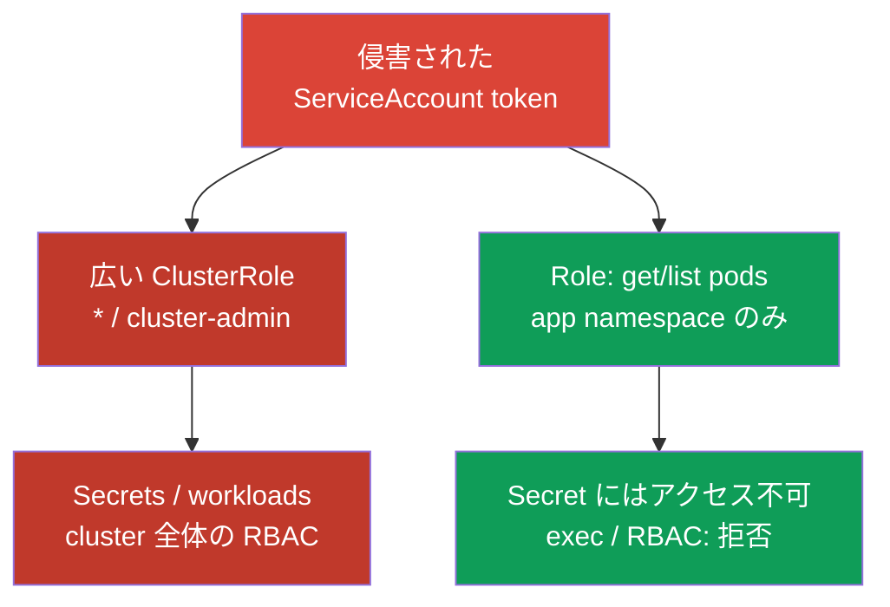
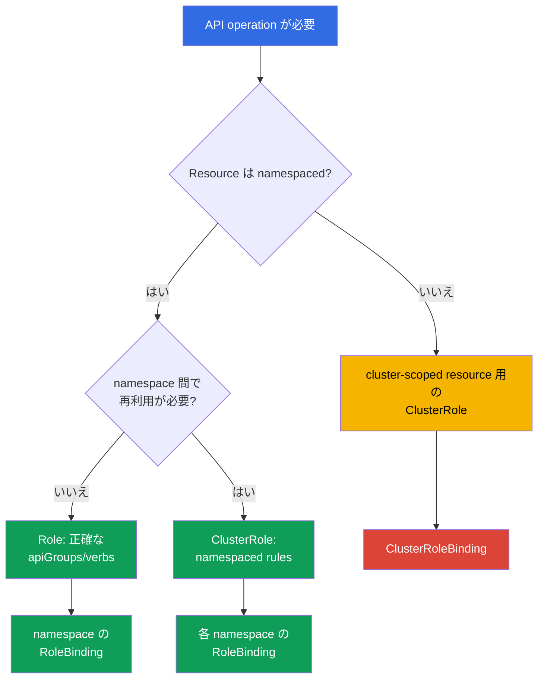

[Русская версия](ru.md) · [Eng version](README.md) · [Versión en español](es.md) · [Version française](fr.md) · [Deutsche Version](de.md) · [ქართული ვერსია](ge.md) · [繁體中文版](tw.md)

# 第10章. アクセスを最小化する RBAC

> **課題。** Pod 内の shell または盗まれた token を得た攻撃者は、ServiceAccount または user に余分な権限があれば、一つの namespace の境界で止まりません。広い `verb`、便宜のために残された `cluster-admin`、あるいは利用可能な `escalate`/`bind`/`impersonate` により、局所的な侵害が全 Secret の読み取り、任意の node 上での Pod 作成、完全な cluster takeover へ変わります。これを決めるのは脆弱性そのものではなく、RBAC があらかじめ許可したことです。

> **この先。** 第07–09章では cluster component の attack surface を減らしました。次は identity、ServiceAccount、Pod が侵害された場合の影響を制限します。RBAC は実際に必要な access だけを付与すべきです。これは CKS の Cluster Hardening（15%）domain です。

> **CKA で必要な知識。** `Role`、`ClusterRole`、`RoleBinding`、`ClusterRoleBinding` の基本構文は、すでに [CKA 第38章](../../../cka/course/38/jp.md)で扱っています。ここでは四つの object の作成は繰り返さず、audit、privilege escalation、安全な rule 設計を扱います。

## 10.1. Least privilege: 余分な一つの verb が incident boundary を変える

RBAC は identity、`verb`、resource、namespace、ときに object name の組み合わせで API server request に答えます。permissions は**加算的**です。いずれかの `RoleBinding` または `ClusterRoleBinding` が access を付与すれば、より狭い role でそれを取り上げることはできません。したがって deny は二つ目の role で表現できず、既存の binding を削除または縮小する必要があります。Kubernetes RBAC は **allow-only** model です。時刻や source IP のような条件、negative deny permission はありません。この種の要件を一般に admission へ移すことはできません。admission は authentication/authorization 後、create/delete/modify（および一部の custom verbs）でだけ動き、`get`、`list`、`watch` は admission layer を通りません。条件付きの **API authorization** には外部/Webhook authorizer または別の authorization/policy layer が必要です。source IP は適用可能な場合 network、firewall、load balancer、NetworkPolicy で追加制限します。admission policy は実際に intercept する request にだけ適し、RBAC conditions の代替ではありません。

典型的な attack scenario では、developer または ServiceAccount に「一時的に」`cluster-admin` を与えた、あるいは controller に `verbs: ["*"]` を与えました。その token が侵害されると、攻撃者は credential を含む Secret を読み、application で `pods/exec` を実行し、より特権的な ServiceAccount として workload を作成するか、自身に新しい role を付与できます。一つの namespace の初期侵害が cluster compromise へ変わります。



Least privilege は `cluster-admin` をより小さな名前の role に置き換えるだけではありません。各 subject について、どの API operation が必要か、どの resource に対してか、どの namespace でか、どの期間か、そもそも API access が必要かを決めます。通常の application では、token を持たない専用 ServiceAccount が正しい答えであることが多いです。token は第11章で扱います。

task が namespace 内に限定されるなら、`Role` と `RoleBinding` から始めます。`ClusterRole` は cluster-scoped resource または再利用する rule set に必要ですが、`RoleBinding` により一つの namespace だけで付与できます。`ClusterRoleBinding` は scope を cluster 全体に広げるため、個別の根拠が必要です。

> 🎯 `can-i` の組み合わせで、具体的な identity、verb、resource、scope を確認します。必要な action は `yes`、危険な隣接 action は `no` であるべきです。

## 10.2. 実効権限の audit: `kubectl auth can-i`

YAML は意図を示しますが、最終的な authorization は示しません。subject は複数の binding、built-in role、group、aggregated `ClusterRole` から access を得られるためです。API server の応答を `kubectl auth can-i` で確認してください。

```bash
# 特定 namespace における現在の identity の rules の概要。
kubectl auth can-i --list -n cks-104

# Cluster-scoped と cross-namespace の境界は個別の action で確認します。
kubectl auth can-i get nodes
kubectl auth can-i list pods -n cks-104
kubectl auth can-i list pods -n default

# 問いが「この action は全 namespace で許可されるか」の場合:
kubectl auth can-i list pods --all-namespaces

# 期待される具体的な許可と拒否。ただしこれはテスト対象の ServiceAccount や user ではなく、
# あなたの現在の identity の権限です。
kubectl auth can-i list pods -n cks-104
kubectl auth can-i get secrets -n cks-104

# lab104 の ServiceAccount として確認します。
SA=system:serviceaccount:cks-104:app-sa
kubectl auth can-i list pods -n cks-104 --as="$SA"
kubectl auth can-i delete pods -n cks-104 --as="$SA"
kubectl auth can-i get secrets -n cks-104 --as="$SA"
# yes
# no
# no
```

`--as` なしの `can-i` は常に、自分が `kubectl` を実行している identity、つまり自分の kubeconfig について答えます。テスト対象の identity についてではありません。task はほぼ必ず特定の ServiceAccount、user、group を問うため、検証には `--as=<identity>` が必要です。これなしの `yes`/`no` は audit target について何も証明せず、自身の permissions だけを示します。

`--as-group` は `--as` を置き換えず、それ単体の代替でもありません。これは impersonated user と一緒にだけ適用される、追加の impersonated groups の一覧です。task が group binding を通じて得る permissions を確認するなら、`--as` と**追加で**必要な `--as-group` を指定します。

```bash
kubectl auth can-i list pods -n cks-104 \
  --as=group-audit-user \
  --as-group=developers
```

`--as=<user>` はその user の実際の groups を自動で復元しないことを覚えておいてください。確認する scenario に含まれる impersonated groups を列挙します。

`--list` は rule の概要には便利ですが、どの authorizer chain においても effective permissions の完全な一覧が保証されるものと見なさないでください。この command は `SelfSubjectRulesReview` に依存し、公式 documentation も authorization mode と evaluation errors によって返る一覧が不完全になり得ると明示しています。`--list` は `--all-namespaces` もサポートしません。`kubectl` はこの flag の組み合わせを明示的に拒否します。これは `SelfSubjectRulesReview` がちょうど一つの namespace の rules を列挙するもので、cluster-wide inventory ではないからです。critical boundary は、上の例のように特定 identity に対する individual positive/negative `kubectl auth can-i <verb> <resource>` で確認してください。

`--list` は review に便利でも、critical permission の確認を置き換えません。出力は長くなり得て、wildcard は具体的な risk を隠します。acceptance test では常に「必要な action = `yes`」と「危険な隣接 action = `no`」の組を確認してください。cluster-scoped resource には namespace を指定しません。

```bash
kubectl auth can-i get nodes --as="$SA"
kubectl auth can-i create clusterrolebindings --as="$SA"
kubectl auth can-i create pods/exec -n cks-104 --as="$SA"
```

`--as` flag は Kubernetes impersonation を使用します。Kubernetes 1.36 では request は、広い legacy verb `impersonate`、または Constrained Impersonation のいずれかで許可されます。後者では identity に対する個別 permission と、実際に実行する API request の `impersonate-on:<mode>:<verb>` が別途必要です。必要な impersonation permissions がなければ、API は impersonated identity の権限を調べる前に `forbidden` を返します。

security audit で legacy `impersonate` を自動的に付与しないでください。必要な workflow に合う model を選び、その scope を文書化します。

> 🔬 Kubernetes 1.36+ の Constrained Impersonation は、偽装する identity と偽装時に許可される action を別々に制限します。

### 10.2.1. Constrained Impersonation: identity と action を制限する

> **Kubernetes 1.36+ / advanced。** これは CKS の必須 core を超えた production material です。試験では正確な通常の Role/Binding と最小限の `impersonate` が優先されます。

**Constrained Impersonation** は Kubernetes v1.36+ で Beta かつデフォルト有効です。通常の `impersonate` と異なり、target ができるすべてをその名前で実行できるようにはしません。通常の user（`Impersonate-User` の値が `system:serviceaccount:` または `system:node:` で始まらない場合）に対し、API server は**二つの別個の確認**を行います。

1. **Identity permission** — この identity だけを偽装できるか。generic user では、`apiGroups: ["authentication.k8s.io"]`、resource `users`、必要な name の `resourceNames`、verb `impersonate:user-info` を持つ rule です。user には namespace scope がないため、`ClusterRole` と `ClusterRoleBinding` で付与します。
2. **Action-at-scope permission** — この偽装で、その scope の特定 operation を実行できるか。Pod の `list` では `pods` 上の `impersonate-on:user-info:list`、`watch` では `impersonate-on:user-info:watch` です。必要な namespace で `Role`/`RoleBinding` により付与できます。identity だけの permission では不十分です。

次の例では ServiceAccount `audit-reader` が generic user `readonly@example.com` を偽装し、`cks-104` 内で Pod の list/watch だけを行えます。

```yaml
apiVersion: rbac.authorization.k8s.io/v1
kind: ClusterRole
metadata:
  name: impersonate-readonly-identity
rules:
- apiGroups: ["authentication.k8s.io"]
  resources: ["users"]
  resourceNames: ["readonly@example.com"]
  verbs: ["impersonate:user-info"]
---
apiVersion: rbac.authorization.k8s.io/v1
kind: ClusterRoleBinding
metadata:
  name: audit-reader-impersonate-readonly
subjects:
- kind: ServiceAccount
  name: audit-reader
  namespace: cks-104
roleRef:
  apiGroup: rbac.authorization.k8s.io
  kind: ClusterRole
  name: impersonate-readonly-identity
---
apiVersion: rbac.authorization.k8s.io/v1
kind: Role
metadata:
  name: impersonate-readonly-pods
  namespace: cks-104
rules:
- apiGroups: [""]
  resources: ["pods"]
  verbs:
  - "impersonate-on:user-info:list"
  - "impersonate-on:user-info:watch"
---
apiVersion: rbac.authorization.k8s.io/v1
kind: RoleBinding
metadata:
  name: audit-reader-impersonate-readonly-pods
  namespace: cks-104
subjects:
- kind: ServiceAccount
  name: audit-reader
  namespace: cks-104
roleRef:
  apiGroup: rbac.authorization.k8s.io
  kind: Role
  name: impersonate-readonly-pods
```

client は同じ headers または `kubectl --as=readonly@example.com` を使います。変わるのは API server の確認だけです。古い `impersonate` は引き続き動き、広い fallback のままです。個別の理由なく constrained rules と一緒に付与しないでください。

重要なのは、constrained permission が client が別の review object 内で説明する action ではなく、**実際の API request** に適用されることです。そのため上で示した `pods` の `impersonate-on:user-info:list/watch` は、`--as` による実際の `list/watch pods` を許可しますが、それだけでは次を実行できません。

```bash
kubectl auth can-i list pods --as=readonly@example.com -n cks-104
```

`kubectl auth can-i` は `SelfSubjectAccessReview` を作成します。したがってこの audit workflow には `selfsubjectaccessreviews.authorization.k8s.io` の `create` をカバーする constrained permissions、または管理された legacy impersonator が必要です。安全な read-only scenario で必要な operation を直接確認できるなら、`can-i` の便宜だけで constrained role を広げないでください。

inventory では、まずどこから capability が来た可能性があるかを見つけ、それから rules と subjects を確認します。誰が使っているか理解する前に built-in roles を編集しないでください。

```bash
ROLE_NAME='role-name-to-review'
kubectl get role,rolebinding -A
kubectl get clusterrole,clusterrolebinding
kubectl describe rolebinding -n cks-104 app-sa-pod-reader
kubectl get clusterrolebinding -o wide
kubectl get clusterrole "$ROLE_NAME" -o yaml
```

## 10.3. 危険な verbs と resources: escalation の経路

すべての rule が同じではありません。`pods` への read-only access と `secrets` への `get` は被害がまったく異なり、一部の verbs は既存の permissions を暗黙に取得できます。review では通常の `get`/`list` より前に、次の組み合わせを探してください。

| Verb または resource | 危険な理由 | 安全な方法 |
|---|---|---|
| `roles`/`clusterroles` の `escalate` | Role/ClusterRole の通常の `create`/`update` と組み合わさると、role に書き込むすべての permissions を自身も保持しなければならない要件を外せる。 | workload と通常の namespace administrator に付与しない。RBAC object の CRUD と bypass verb の両方を別途制御する。 |
| `roles`/`clusterroles` の `bind` | RoleBinding/ClusterRoleBinding の通常の `create`/`update` と組み合わさると、referenced role の permissions を自身も保持しなければならない要件を外せる。 | `resourceNames` で特定 role に制限し、本当に必要な binding management と一緒にだけ付与する。 |
| `users`、`groups`、`serviceaccounts`、`uids`、または `userextras/<name>` の `impersonate` | より特権的な identity を含め、別の identity として request を実行できる。Extra fields は `authentication.k8s.io` API group で、たとえば `userextras/scopes` のように正確な resource name を指定する。 | auditor に必要な場合だけ与え、`resourceNames` で制限する。 |
| RoleBinding と ClusterRoleBinding の `create`/`update`/`patch` | 利用可能な role と組み合わさると permissions を渡せる。ClusterRoleBinding では cluster 全体が対象になる。 | application には禁止し、access の付与を workload development から分離する。 |
| `secrets` の `get`/`list`/`watch` | Secret には password、registry credential、key、bearer token が含まれることが多い。`list`/`watch` は多数の Secret の値を露出する。 | `get` には `resourceNames` で特定 Secret を指定するか、application に API access を与えない。 |
| `serviceaccounts/token` の `create` | 選択した ServiceAccount の token を発行でき、その permissions を使う手段になり得る。 | 信頼できる automation にだけ、特定の ServiceAccount を対象に許可する。 |
| `pods/exec` の `create` | すでに動く Pod で interactive command execution を可能にし、その network、filesystem、mounted Secret に access できる。 | 通常 role に含めない。short-lived break-glass access と audit を使う。 |
| `pods/portforward` の `create` | Pod port への tunnel を作り、通常の network exposure を回避する。 | diagnosis のために限定的に付与し、incident 後に取り消す。 |
| workload（`pods`、`deployments`、`jobs` など）の `create` | namespace 内で Pod/workload を作るだけでも強い間接 access になる。元の identity に `get secrets` がなくても、任意の ServiceAccount を選び、Pod spec から Secret、ConfigMap、利用可能な storage を参照できるためだ。これにより別 workload の data または API permissions を取得できる。policy が privileged/host-level Pod を許すなら、影響は node にまで広がり得る。 | 必要なしに untrusted tenant identity に付与しない。workload creation を privileged right と見なし、Pod Security、ServiceAccount、Secret/storage design、admission policy を制限する。 |
| `nodes` | node object への access は infrastructure information を露出し、node の変更は cluster-wide operation である。 | tenant role から除外し、専用の operational identity に付与する。 |
| `nodes/proxy` の `get` | kubelet への proxy request を許可する。これは read-only access ではない。kubelet proxy operations は admission と通常の API server audit を回避できる。 | workload と tenant role に与えず、厳格に管理された operational identity にだけ提供する。 |

subresource は slash で書きます。`resources: ["pods/exec"]` のようにします。`exec` と `portforward` には通常 `get` ではなく `create` が必要です。正確な `resources: ["pods/exec"]` rule を、すべての `pods` に対する rule で置き換えないでください。API path と risk が異なります。反対に、`nodes/proxy` の `get` は kubelet proxy に対する独立した危険な permission であり、無害な node read ではありません。

Kubernetes 1.36 では `KubeletFineGrainedAuthz` は GA で常時有効です。正当な operational task には `nodes/proxy` ではなく、狭い subresource を付与してください。たとえば `nodes/stats`、`nodes/metrics`、`nodes/log`、`nodes/pods`、`nodes/healthz`、`nodes/configz` です。kubelet はこれらの path を個別に確認します。ほかの request と compatibility のためには `nodes/proxy` fallback が残ります。

```yaml
# monitoring identity の例。この rule で任意の kubelet operation を置き換えないでください。
rules:
- apiGroups: [""]
  resources: ["nodes/metrics", "nodes/stats"]
  verbs: ["get"]
```

wildcard は三つの場所で特に危険です。`apiGroups: ["*"]`、`resources: ["*"]`、`verbs: ["*"]` です。これらは update 後に現れる新しい API groups、CRD、subresources、verbs を取り込みます。今日安全な rule が、明日には気付かないうちに広くなります。wildcard は audit も難しくします。YAML から `secrets`、`pods/exec`、`rolebindings` への access があるか分からないためです。

> 🧠 RBAC は加算的です。狭い role は与えた Allow を取り消しません。`escalate`、`bind`、`impersonate`、bindings、Secret、危険な subresource は別人の permissions を渡し得ます。

```yaml
# 安全でない: 現在および将来の namespace API 全体
rules:
- apiGroups: ["*"]
  resources: ["*"]
  verbs: ["*"]
```

```yaml
# 一つの namespace にある read-only controller に必要な最小権限
rules:
- apiGroups: [""]
  resources: ["pods"]
  verbs: ["get", "list"]
```

## 10.4. 最小権限の Role を設計する

まず通常の言葉で access contract を書きます。「`app-sa` は `cks-104` 内の Pod の一覧と、特定の ConfigMap の状態を読み取る。workload、Secret、RBAC は変更しない」。次にこれを最小限の rules に変換します。読み取り（`get`、`list`、`watch`）と変更（`create`、`update`、`patch`、`delete`）を分けてください。Pod object を監視する controller に、必ずしも削除権限は必要ありません。

> 🎯 access contract を明文化し、狭い scope（namespace に対する `Role` + `RoleBinding`）を選び、許可された action と危険な隣接 resource または namespace での拒否を証明します。

```yaml
apiVersion: v1
kind: ServiceAccount
metadata:
  name: app-sa
  namespace: cks-104
---
apiVersion: rbac.authorization.k8s.io/v1
kind: Role
metadata:
  name: app-sa-pod-reader
  namespace: cks-104
rules:
- apiGroups: [""]
  resources: ["pods"]
  verbs: ["get", "list"]
---
apiVersion: rbac.authorization.k8s.io/v1
kind: RoleBinding
metadata:
  name: app-sa-pod-reader
  namespace: cks-104
subjects:
- kind: ServiceAccount
  name: app-sa
  namespace: cks-104
roleRef:
  apiGroup: rbac.authorization.k8s.io
  kind: Role
  name: app-sa-pod-reader
```

`resourceNames` は、object name によって `get`、`update`、`patch`、`delete` をさらに制限します。これは既知の一つの ConfigMap または Secret に便利です。**top-level resource** では、`create` と `deletecollection` は制限しません。これらの request では object name が URL の一部ではないためです。これはすべての subresource に当てはまる rule ではありません。`pods/exec` のような名前付き subresource は `resourceNames` で制限できます（[RBAC reference](https://kubernetes.io/docs/reference/access-authn-authz/rbac/)を参照）。`resourceNames` を伴う `list`/`watch` では、client が field selector `metadata.name=<name>` を指定する必要があり、使いにくいことが多いため、namespace isolation の完全な代替と考えないでください。

```yaml
apiVersion: rbac.authorization.k8s.io/v1
kind: Role
metadata:
  name: app-config-reader
  namespace: cks-104
rules:
- apiGroups: [""]
  resources: ["configmaps"]
  resourceNames: ["app-config"]
  verbs: ["get"]
```

object を選ぶ前に resource scope を確認します。`pods`、`configmaps`、`deployments`、`secrets` は namespaced であるため、`Role` はそれらを namespace に制限します。`nodes`、`namespaces`、`persistentvolumes`、`clusterroles` は cluster-scoped です。これらには `ClusterRole` が必要で、`RoleBinding` は cluster-scoped resource をローカルにはしません。namespaced rules の一式が複数の namespace で必要な場合は、`ClusterRole` を定義し、許可する namespace ごとに個別の `RoleBinding` で bind します。

`nonResourceURLs` は Kubernetes object ではなく API server の URL を表します。このような URL には namespace scope がないため、rule は `ClusterRole` に含め、`ClusterRoleBinding` で付与する必要があります。たとえば、専用 health-check identity には wildcard `/*` を与えず、正確に `nonResourceURLs: ["/healthz"]` と `verbs: ["get"]` を与えられます。このような `ClusterRole` を参照する場合でも、`RoleBinding` が non-resource URL を namespaced permission に変えることはありません。



`ClusterRole` は自動的に cluster-wide access を意味しません。namespaced resources の rules を含み、特定の namespace の `RoleBinding` を通じてのみ付与できます。cluster-wide scope になるのはまさに `ClusterRoleBinding` の場合です。cluster-scoped resources と `nonResourceURLs` には `ClusterRole` + `ClusterRoleBinding` が必要です。

## 10.5. 組み込みおよび aggregated ClusterRole: 隠れた権限拡張

組み込みの `ClusterRole` は便利ですが、risk は同じではありません。`view` は通常の namespaced object を読むためのもので、Secret、Role、RoleBinding には意図的に access を与えません。Secret は ServiceAccount の privileges を保持することが多いためです。`edit` はほとんどの namespaced resource の変更と Secret の読み取りを許可しますが、Role や RoleBinding は変更できません。それでも同じ namespace の任意の ServiceAccount として Pod を実行できます。`admin` は namespace 内のほとんどの RBAC を管理できます。

組み込みの `cluster-admin` は最も広い wildcard permission を持ちます。`ClusterRoleBinding` を通すと、同じ `ClusterRole` は cluster-wide superuser access を与えます。`RoleBinding` を通すと一つの namespace に制限されますが、組み込み `cluster-admin` の semantics は、**Namespace object 自体を含めて**その namespace の resources を完全に制御できます。Namespace は cluster-scoped resource であるため、これは重要な例外です。この `RoleBinding` は cluster-wide ではありませんが、依然として非常に特権的な namespaced binding です。すべての `cluster-admin` の割り当てには、個別の根拠と管理が必要です。

| Role | 実用的な意味 | application または広い group に付与した場合の risk |
|---|---|---|
| `view` | 通常の namespace resources を閲覧する。Secret、Role、RoleBinding は含まない | topology、image、configuration を開示し得るが、credential leakage の risk はより低い。 |
| `edit` | ほとんどの namespace resources を変更し Secret を読み取る。Role/RoleBinding は変更しない | workload を変更し、Secret を読み取り、任意の namespace ServiceAccount として Pod を実行できる。 |
| `admin` | 境界内の roles/bindings を含む、広範な namespace administration | namespace escalation と team application の takeover の risk が高い。 |
| `cluster-admin` | `ClusterRoleBinding` では cluster 全体への完全 access、`RoleBinding` では binding の namespace 内 resources（Namespace object 自体を含む）の完全 control | ローカル binding でも極めて危険であり、ClusterRoleBinding は cluster compromise を意味する。 |

aggregation は、他の ClusterRole objects の rules で組み込み ClusterRole を拡張できます。RBAC controller は、`rbac.authorization.k8s.io/aggregate-to-<role>: "true"` と label 付けされた roles の rules を結合します。これは CRD に有用です。たとえば plugin は、その API の read-only rules を `view` に追加できます。しかしこの label は supply-chain および RBAC boundary です。作成または変更された role は、すべての `view`、`edit`、`admin` user に追加 permissions を密かに与え得ます。

> 🧠 `aggregate-to-*` は組み込み role の利用者全体の effective permissions を変えます。source role の wildcard は permissions を大規模に拡張します。

```yaml
# 組み込み view role を CRD の読み取りだけに拡張する例。
# このような role は、別途 security review を行った後にのみ追加します。
apiVersion: rbac.authorization.k8s.io/v1
kind: ClusterRole
metadata:
  name: aggregate-widget-view
  labels:
    rbac.authorization.k8s.io/aggregate-to-view: "true"
rules:
- apiGroups: ["example.io"]
  resources: ["widgets"]
  verbs: ["get", "list", "watch"]
```

最終的な組み込み role の aggregated rules と aggregation source 自体の両方を確認します。`system:` prefix を持つ system ClusterRole objects を編集しないでください。API server は start または upgrade 時にそれらを復元することがあります。自分の ClusterRole objects と labels は Git、code review、RBAC の変更を許可された限られた identities を通じて管理します。

```bash
# 組み込み role の最終的な effective rules
kubectl get clusterrole view -o yaml

# view/edit/admin を拡張できるすべての ClusterRole objects
kubectl get clusterrole -l rbac.authorization.k8s.io/aggregate-to-view=true
kubectl get clusterrole -l rbac.authorization.k8s.io/aggregate-to-edit=true
kubectl get clusterrole -l rbac.authorization.k8s.io/aggregate-to-admin=true
```

### 簡潔な escalation map

| Capability | 変更する boundary | Control |
|---|---|---|
| `create` CSR と `approve`/`sign` の能力 | より広い identity を持つ client certificate を発行できる。`create` だけでは不十分 | 作成、approval、signing を管理された identities 間で分離する。 |
| `ValidatingWebhookConfiguration`/`MutatingWebhookConfiguration` の管理 | cluster-wide の admission request の validation または mutation を変更する | tenant role に付与せず、webhook endpoint、CA、rules を review する。 |
| Namespace labels の `patch` | Pod Security Admission labels を変更し、異なる Pod profile を admission できる | 専用 platform identity に制限し、label changes を review する。 |
| `hostPath` を持つ PV の作成/変更 | claim と Pod が node filesystem path を取得できる | tenant role に禁止し、storage policy と Pod Security Admission を管理する。 |
| ServiceAccount token の発行（`create serviceaccounts/token`） | 選択した ServiceAccount の permissions で動作できる | 特定の ServiceAccount objects に対する信頼された automation のみに許可する。 |
| `system:masters` の membership | 通常の RBAC evaluation を bypass する superuser group | application に付与せず、certificate source と external groups を管理する。 |

> 🎯 RBAC を変更した後は、許可された action と期待される拒否の両方を証明します。

## 10.6. 検証: 必要な access と拒否の両方を証明する

role を適用したら、`kubectl get role` で止めないでください。object は存在しても bind されていない、別の binding と競合している、または広すぎる場合があります。Lab 104 では、`app-sa` の検証は要求された boundary を正確に証明する必要があります。

```bash
kubectl apply -f app-sa-rbac.yaml

SA=system:serviceaccount:cks-104:app-sa

# 機能上必要な permission
kubectl auth can-i get pods -n cks-104 --as="$SA"
kubectl auth can-i list pods -n cks-104 --as="$SA"
# yes
# yes

# 不要な permissions: workload の変更、Secret、exec、RBAC
kubectl auth can-i delete pods -n cks-104 --as="$SA"
kubectl auth can-i get secrets -n cks-104 --as="$SA"
kubectl auth can-i create pods/exec -n cks-104 --as="$SA"
kubectl auth can-i create rolebindings -n cks-104 --as="$SA"
kubectl auth can-i create clusterrolebindings --as="$SA"
# no
# no
# no
# no
# no
```

scope も確認します。同じ identity が隣接する namespace の Pod objects を読めてはならず、Pod access を与えられたというだけで cluster-scoped permissions を持ってもなりません。

```bash
kubectl auth can-i list pods -n default --as="$SA"
kubectl auth can-i get nodes --as="$SA"
# no
# no
```

答えが予期せず `yes` の場合は、subject のすべての bindings を見つけ、余分な access を削除または縮小した後で確認を繰り返します。誤って別の team の access を拒否するのではなく、正確な object を削除してください。

```bash
kubectl get rolebinding -A -o yaml | grep -n -C 4 'app-sa'
kubectl get clusterrolebinding -o yaml | grep -n -C 4 'app-sa'

# binding の owner と目的を確認した後にのみ実行する
kubectl delete clusterrolebinding app-sa-excessive-access
```

production では、RBAC 変更後の smoke test にこの `can-i` set を含め、Role、ClusterRole、binding の変更を review に送ります。長期間の access は、実際の ServiceAccount の目的、audit logs、workload owner に基づいて定期的に再評価します。

> 🏭 roles と aggregation labels は Git に置かれ、changes は review を通り、critical positive/negative `can-i` checks は CI で実行され、break-glass には owner と expiry があります。

## 10.7. production での適用方法

- **Role をデフォルトにする。** Teams と applications には namespaced `Role`/`RoleBinding` を与えます。`ClusterRoleBinding` には owner、reason、expiry、security review が必要です。
- **ServiceAccount をデフォルトにする。** application permissions を `default` ServiceAccount に与えないでください。workload が Kubernetes API を呼ばない場合は `automountServiceAccountToken: false` を設定します。それ以外の場合は、最小権限を持つ専用 ServiceAccount を作成します。これにより audit と revocation の焦点を絞れます。
- **RBAC を code として扱う。** custom roles を Git に保持し、CI で rule と aggregation-label diff を確認します。明示的な exception なしに wildcard、`escalate`、`bind`、`impersonate`、Secret access を明示的に block します。
- **API-server authorization configuration。** まず、相互排他的な二つの configuration methods のうちどちらを使っているかを確認します。

  command-line configuration では、`--authorization-mode` に、たとえば `Node,RBAC` のような必要な chain が含まれることを確認します。

  `--authorization-config` による file-based configuration では、`--authorization-mode` を同時に設定しません。`AuthorizationConfiguration` 内で直接 `type: RBAC`、`authorizers` の内容と順序を確認します。

  authorizer-chain の内容と順序は security review の対象にする必要があります。
- **Periodic audit。** `ClusterRoleBinding`、`system:serviceaccount` subjects、組み込み roles、aggregators を inventory し、critical contracts を `kubectl auth can-i` で確認します。
- **恒久的な admin ではなく break-glass を使う。** emergency access は、日常 user の `cluster-admin` ではなく、短命で別個の identity とし、記録し、作業後に revoke する必要があります。

## 10.8. ミニ用語集

- **least privilege** - 特定の task に identity が必要とする最小限の permission set だけを付与すること。
- **verb** - `get`、`list`、`create`、`bind`、`escalate` などの Kubernetes API operation。
- **resource / subresource** - `pods` と `pods/exec` のような API object とその subresource。
- **`resourceNames`** - API server がサポートする場合に、rule を特定 object names に制限すること。
- **impersonation** - API headers を通じて別の identity として request を実行すること。
- **aggregation** - label により、一つの ClusterRole の rules を組み込み ClusterRole に自動追加すること。
- **wildcard** - `apiGroups`、`resources`、`verbs` 内の `*`。未知の将来 objects も含むため、security role では危険です。
- **break-glass access** - emergency のための、管理された一時的な privileged access。

## 10.9. 章のまとめ

- RBAC permissions は additive です。余分な binding を狭い role で相殺することはできないため、それを見つけて削除または縮小します。
- least privilege は特定 namespace の `Role` と `RoleBinding` から始まります。cluster-level access と `ClusterRoleBinding` には個別の根拠が必要です。
- `kubectl auth can-i --list` は、結果が完全な場合に便利な rule overview を提供しますが、網羅的な inventory を保証しません。security-critical boundaries は targeted `can-i` checks で証明します。期待する access は `yes`、禁止した access は `no` を返す必要があります。
- 特に危険なのは、`escalate`、`bind`、`impersonate`、binding の変更、`secrets`、`serviceaccounts/token`、`pods/exec`、`pods/portforward`、`get nodes/proxy` です。
- 例外的で文書化された理由なしに `*` を使わないでください。wildcard には現在と将来の APIs、resources、subresources、verbs が含まれます。
- aggregated ClusterRole objects は `view`、`edit`、`admin` を密かに拡張することがあります。`aggregate-to-*` labels とそれらの roles の source を review してください。

## 10.10. 試験と実務での役立ち方

**試験で。** 正確な `apiGroups`、`resources`、`verbs` を持つ `Role` を素早く作成または縮小し、指定された namespace で正しい ServiceAccount に bind し、すぐに `kubectl auth can-i --as=system:serviceaccount:<ns>:<sa>` を確認します。resource を文字どおりに読みます。`pods/exec` は `pods` と同じではなく、`nodes` は cluster-scoped です。余分な access を削除する必要がある場合は、一度にすべてを変更せず、まず対応する binding を見つけます。

**実務で。** RBAC は、盗まれた token、automation error、Pod compromise の blast radius を制限します。最も危険な incident は通常、YAML syntax ではなく、都合のよい広い roles、wildcards、隠れた bindings から生じます。定期的な `can-i` audits、aggregation-label review、明示的な access contract により、RBAC は検証可能な security boundary になります。

> ### 🔴 攻撃者の視点
> **Asset:** Kubernetes API resources。
>
> **Starting foothold:** Pod 内での code execution。
>
> **Attacker objective:** workload identity を使用して API に access すること。
>
> **Abuse path:** token、その audience と TTL、次に RBAC permissions、Pod objects の `list`、Secret の読み取り、または `pods/exec` による workload の作成/実行能力を確認する。
>
> **Expected evidence:** audit events と SubjectAccessReview。
>
> **Control:** API が不要な箇所では `automountServiceAccountToken: false`、必要な箇所では projected short-lived token、そして最小限の RBAC。
>
> **Retest:** 許可された API call は成功し、禁止されたものは `403` を返す。
>
> **ATT&CK:** [T1528 - Steal Application Access Token](https://attack.mitre.org/techniques/T1528/)。

## 10.11. 自己確認問題

<details>
<summary>1. なぜ、より狭い Role では別の binding が付与した permission を取り消せないのですか？</summary>

Kubernetes RBAC は additive です。少なくとも一つの RoleBinding または ClusterRoleBinding が permission を付与すれば、それは適用されます。allow-only model には、すでに付与された access を上書きできる deny rule がありません。余分な permission を削除するには、それを付与している binding を見つけて削除または縮小する必要があります。
</details>

<details>
<summary>2. `app-sa` が Pod objects を読める一方で削除できないことを証明する二つの `can-i` checks は何ですか？</summary>

許可された action には、`kubectl auth can-i get pods -n cks-104 --as=system:serviceaccount:cks-104:app-sa` を実行し、`yes` を期待します。拒否には、`kubectl auth can-i delete pods -n cks-104 --as=system:serviceaccount:cks-104:app-sa` を実行し、`no` を期待します。この組は、role YAML だけでなく API-server の decision を確認します。
</details>

<details>
<summary>3. Secret の `get`/`list` が、ほとんどの通常 resources の読み取りより危険なのはなぜですか？</summary>

Secret には password、registry credential、key、bearer token が含まれることが多いため、読み取りにより topology や state だけではなく、使用可能な credentials が開示されます。`list` と `watch` は一度に多数の Secret values を開示し得ます。既知の一つの Secret が必要なら、この章では `resourceNames` を使った限定的な `get`、または application API access を与えないことを推奨します。
</details>

<details>
<summary>4. `bind` は `escalate` とどう異なり、それぞれどのように escalation につながりますか？</summary>

どちらの verb も RBAC の組み込み保護を bypass しますが、object に対する通常の CRUD を置き換えるものではありません。Role または ClusterRole の `create`/`update` と組み合わせた `escalate` は、subject 自身が持たない permissions を role に書き込むことを許します。RoleBinding または ClusterRoleBinding の `create`/`update` と組み合わせた `bind` は、referenced role のすべての permissions を保持せずに、それを割り当てることを許します。したがって、RBAC object を変更する能力と対応する bypass verb という、経路の両方を audit します。
</details>

<details>
<summary>5. なぜ `create pods/exec` と `create pods/portforward` は、通常の `pods` access と分けて review する必要がありますか？</summary>

これらは通常 resource `pods` ではなく、`pods/exec` と `pods/portforward` と表記する独立した API subresources です。`create pods/exec` は、network、filesystem、mounted Secret objects を備えた既存 Pod で command execution を可能にします。`create pods/portforward` は Pod ports への tunnel を作成します。通常の read role に暗黙に含めず、通常は管理された diagnostics にのみ付与してください。
</details>

<details>
<summary>6. なぜ `resourceNames` は top-level resource の `create` と `deletecollection` を制限しない一方、`pods/exec` のような名前付き subresource に適用できるのですか？</summary>

top-level resource の `create` と `deletecollection` では、object name は request URL の一部ではないため、API server は `resourceNames` で制限できません。これはすべての subresources に対する普遍的な制限ではありません。`pods/exec` のような名前付き subresource は、request が特定の Pod を指定するため制限できます。
</details>

<details>
<summary>7. なぜ `get nodes/proxy` は read-only permission ではなく、誰に付与することが許容されますか？</summary>

`get nodes/proxy` は kubelet への proxy requests を許可し、その operations は admission と通常の API-server audit を bypass することがあります。したがって、Node object の無害な読み取りではありません。workloads や tenant roles に付与せず、厳格に管理された operational identity にだけ許容します。可能であれば、より狭い `nodes/metrics`、`nodes/stats`、その他の fine-grained subresources を使用してください。
</details>

<details>
<summary>8. label `rbac.authorization.k8s.io/aggregate-to-view=true` は effective access をどう変え、aggregated role 内の wildcard が特に危険なのはなぜですか？</summary>

RBAC controller はこの label を持つ ClusterRole の rules を最終的な組み込み role `view` に追加するため、`view` のすべての users が新しい access を受け取ります。この source role の wildcard は、広い `view` audience に対し、現在および将来の API groups、resources、subresources、verbs を対象にします。したがって、最終 role とすべての aggregation source roles の両方を review してください。
</details>

<details>
<summary>9. **Flashback（第04章）。** 第04章の `NetworkPolicy` は allow-list です。まず default-deny を設定し、次に狭い許可を追加します。同じ「すべてを deny し、次に明示的に allow する」論理は RBAC design のどこで機能し、request が実際に default-deny されるのはいつですか？</summary>

RBAC では必要な permissions がない状態から始め、最小 scope で正確な `apiGroups`、`resources`、`verbs` だけを追加します。適用可能な RoleBinding または ClusterRoleBinding が Allow を付与しなければ、request は拒否されます。subject が直接記載される binding だけでなく、ServiceAccount の `system:serviceaccounts` のような groups を通じて得る permissions も確認する必要があります。したがって、user または ServiceAccount に対する直接の RoleBinding がないだけでは、access がないことの証明にはなりません。特定 identity の `kubectl auth can-i` で最終 boundary を確認します。NetworkPolicy とは異なり、decision は API server の RBAC authorizer が行いますが、結果は同じく明示的な allow-list です。
</details>

## 演習

[Lab 104](../../labs/104/README_JP.MD)で、Pod objects を読む最小 Role を持つ `app-sa` を作成し、`auth can-i` で `delete pods` が拒否されることを証明して、過剰な binding を削除します。同じ lab では、ServiceAccount token の自動 mounting を無効化し、API server への anonymous access を制限します。次の章でこの RBAC boundary を発展させます。

🌐 追加の interactive practice（killer.sh/killercoda、external resource）: [rbac-serviceaccount-permissions](https://killercoda.com/killer-shell-cks/scenario/rbac-serviceaccount-permissions) · [rbac-user-permissions](https://killercoda.com/killer-shell-cks/scenario/rbac-user-permissions) · [certificate-signing-requests-sign-manually](https://killercoda.com/killer-shell-cks/scenario/certificate-signing-requests-sign-manually) · [certificate-signing-requests-sign-k8s](https://killercoda.com/killer-shell-cks/scenario/certificate-signing-requests-sign-k8s)

🎮 Killercoda（installation 不要の browser 内）: [Create a Role and Role Binding](https://killercoda.com/chadmcrowell/course/cka/create-role) · [Create a Cluster Role and Role Binding](https://killercoda.com/chadmcrowell/course/cka/create-cluster-role)

---
[目次](../README_JP.md) · [第09章](../09/jp.md) · [第11章](../11/jp.md)
