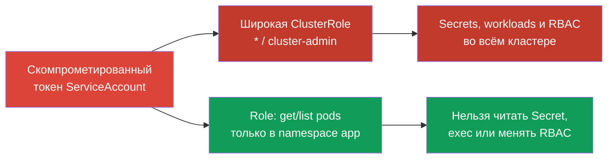
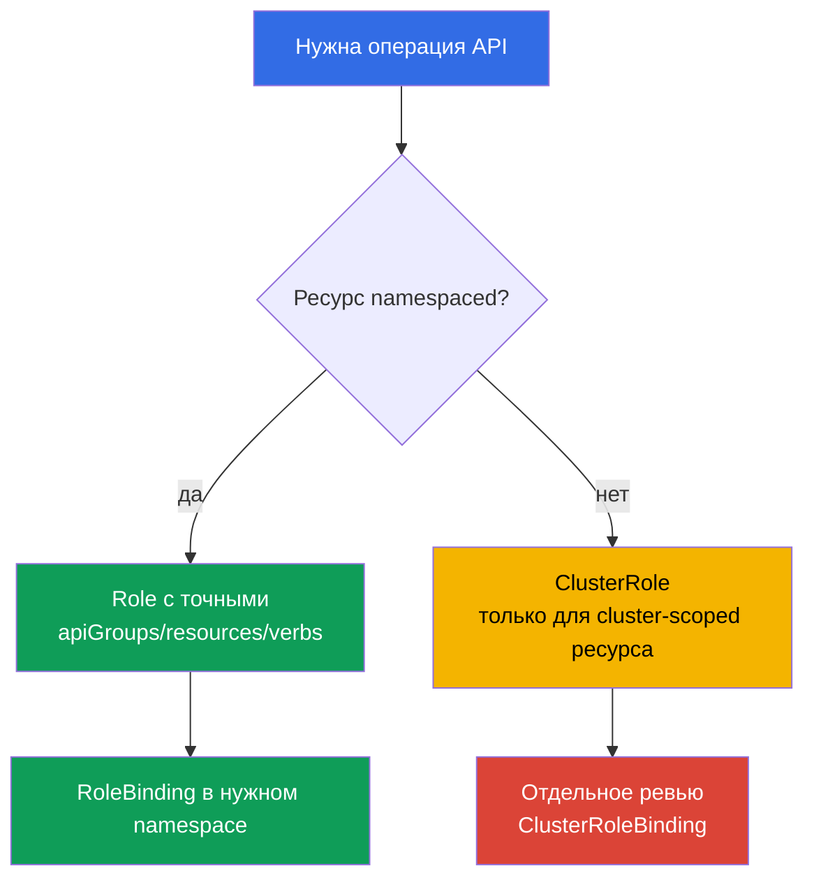

<!-- Standalone RU release: ссылки на переводы удалены, потому что соответствующие файлы не входят в архив. -->

# Глава 10. RBAC для минимизации доступа

> **Что дальше.** В главах 07-09 мы уменьшали поверхность атаки компонентов кластера.
> Теперь ограничим последствия компрометации identity, ServiceAccount или Pod: RBAC должен
> выдавать только доступ, который действительно нужен. Это домен Cluster Hardening (15%) CKS.

> **Что нужно из CKA.** Базовый синтаксис `Role`, `ClusterRole`, `RoleBinding` и
> `ClusterRoleBinding` уже разобран в [главе 38 CKA](../../../cka/course/38/ru.md).
> Здесь не повторяем создание четырёх объектов, а рассматриваем аудит, эскалацию прав и
> безопасное проектирование правил.

## 10.1. Least privilege: один лишний verb меняет границу инцидента

RBAC отвечает на запрос API server сочетанием identity, `verb`, ресурса, namespace и иногда
имени объекта. Разрешения **аддитивны**: если любой `RoleBinding` или `ClusterRoleBinding`
даёт доступ, более узкая роль его не отнимает. Поэтому запрет нельзя выразить второй ролью:
нужно удалить или сузить существующую привязку.

Сценарий атаки типичен: разработчику или ServiceAccount дали `cluster-admin` «временно»,
либо контроллер получил `verbs: ["*"]`. После компрометации его токена атакующий может
прочитать Secret с учётными данными, запустить `pods/exec` в приложении, создать
привилегированный workload или выдать себе новую роль. Первоначальный компромисс одного
namespace превращается в компрометацию кластера.



Least privilege означает не просто заменить `cluster-admin` на роль с меньшим именем. Для
каждого субъекта нужно определить: какие API-операции нужны, над какими ресурсами, в каком
namespace, на какой срок и нужен ли вообще доступ к API. Для обычного приложения часто
верный ответ - отдельный ServiceAccount без токена; токены рассматриваются в главе 11.

Начинайте с `Role` и `RoleBinding`, если задача локальна для namespace. `ClusterRole` нужна
для cluster-scoped ресурсов или повторно используемого набора правил, но её можно выдать
через `RoleBinding` только в одном namespace. `ClusterRoleBinding` расширяет область на весь
кластер и требует отдельного обоснования.

## 10.2. Аудит фактических прав: `kubectl auth can-i`

YAML показывает намерение, но не итоговую авторизацию: субъект может получить доступ из
нескольких binding, встроенной роли, группы или агрегированной `ClusterRole`. Проверяйте
ответ API server командой `kubectl auth can-i`.

```bash
# Права текущей identity в namespace и по всему кластеру
kubectl auth can-i --list -n cks-104
kubectl auth can-i --list --all-namespaces

# Конкретное ожидаемое разрешение и ожидаемый отказ
kubectl auth can-i list pods -n cks-104
kubectl auth can-i get secrets -n cks-104

# Проверка за ServiceAccount из lab104
SA=system:serviceaccount:cks-104:app-sa
kubectl auth can-i list pods -n cks-104 --as="$SA"
kubectl auth can-i delete pods -n cks-104 --as="$SA"
kubectl auth can-i get secrets -n cks-104 --as="$SA"
# yes
# no
# no
```

`--list` удобен для ревью, но не заменяет проверку критичных разрешений: вывод может быть
длинным, а wildcard скрывает конкретный риск. В acceptance-тесте всегда проверяйте пару
«нужное действие = `yes`» и «опасное соседнее действие = `no`». Для cluster-scoped ресурса
не указывайте namespace:

```bash
kubectl auth can-i get nodes --as="$SA"
kubectl auth can-i create clusterrolebindings --as="$SA"
kubectl auth can-i create pods/exec -n cks-104 --as="$SA"
```

Флаг `--as` использует Kubernetes impersonation. Ваш текущий пользователь должен иметь
право impersonate соответствующего пользователя, группы или ServiceAccount; иначе результат
будет `forbidden`, а не ответом о правах цели. В CI выполняйте аудит identity с отдельными
минимальными правами либо документируйте контролируемое право security-аудитора на
`impersonate`.

Для инвентаризации сначала найдите, откуда могла прийти возможность, затем смотрите
правила и subjects. Не редактируйте встроенные роли до понимания того, кто их использует.

```bash
kubectl get role,rolebinding -A
kubectl get clusterrole,clusterrolebinding
kubectl describe rolebinding -n cks-104 app-sa-pod-reader
kubectl get clusterrolebinding -o wide
kubectl get clusterrole <role-name> -o yaml
```

## 10.3. Опасные verbs и resources: пути эскалации

Не все правила одинаковы. Read-only доступ к `pods` и `get` к `secrets` имеют совершенно
разный ущерб, а некоторые verbs позволяют неявно получить уже существующие права. При
ревью ищите следующие сочетания прежде обычных `get`/`list`.

| Verb или resource | Почему опасен | Безопасный подход |
|---|---|---|
| `escalate` на `roles`/`clusterroles` | Позволяет создать или изменить роль с правами, которых нет у вызывающего субъекта. Без него API server не даст передать себе больше прав при обновлении роли. | Не выдавать workload и обычным администраторам namespace; выделить контролируемую identity для управления RBAC. |
| `bind` на `roles`/`clusterroles` | Позволяет привязать роль, которой субъект сам не обладает, и передать её другому субъекту или себе. | Разрешать только узкой автоматизации и только на явно нужные роли. |
| `impersonate` на `users`, `groups`, `serviceaccounts` или `userextras` | Позволяет выполнять запросы от имени другой identity, в том числе более привилегированной. | Давать аудитору только при необходимости и ограничивать `resourceNames`. |
| `create`/`update`/`patch` RoleBinding и ClusterRoleBinding | В сочетании с доступной ролью может передать права; ClusterRoleBinding делает это для всего кластера. | Запретить приложению; отделить выдачу доступа от разработки workload. |
| `get`/`list`/`watch` `secrets` | Secret часто содержит пароль, registry credential, ключ или bearer token; `list`/`watch` раскрывают значения многих Secret. | Указать конкретный Secret через `resourceNames` для `get`, либо не давать API-доступ приложению. |
| `create` `serviceaccounts/token` | Выпускает токен выбранного ServiceAccount и может стать способом воспользоваться его правами. | Разрешать только доверенной автоматизации, на конкретные ServiceAccount. |
| `create` `pods/exec` | Даёт интерактивное выполнение команд в уже работающем Pod и доступ к его сети, файловой системе и mounted Secret. | Не включать в обычные роли; использовать короткоживущий break-glass доступ и аудит. |
| `create` `pods/portforward` | Прокладывает туннель к портам Pod, обходя обычную сетевую экспозицию. | Выдавать точечно для диагностики и отзывать после инцидента. |
| `nodes`, `nodes/proxy`, `pods` с `create` | Доступ к node или создание произвольного Pod может привести к доступу к данным/токенам или к обходу границы приложения. | Исключить из tenant-ролей; применять Pod Security Admission и отдельные операционные роли. |

Subresource пишется через косую черту: `resources: ["pods/exec"]`. Для `exec` и
`portforward` обычно нужен именно `create`, а не `get`. Не заменяйте точное правило
`resources: ["pods/exec"]` правилом на все `pods`: это разные API-пути и разные риски.

Wildcards особенно опасны в трёх местах: `apiGroups: ["*"]`, `resources: ["*"]` и
`verbs: ["*"]`. Они захватывают новые API-группы, CRD, subresource и verbs, которые появятся
после обновления. Правило, безопасное сегодня, незаметно станет шире завтра. Wildcard также
усложняет аудит: нельзя по YAML понять, есть ли доступ к `secrets`, `pods/exec` или
`rolebindings`.

```yaml
# Небезопасно: весь текущий и будущий API namespace
rules:
- apiGroups: ["*"]
  resources: ["*"]
  verbs: ["*"]

# Минимально для read-only контроллера в одном namespace
rules:
- apiGroups: [""]
  resources: ["pods"]
  verbs: ["get", "list"]
```

## 10.4. Проектирование минимальной Role

Сначала запишите контракт доступа обычным языком: «`app-sa` читает список Pod и состояние
конкретного ConfigMap в `cks-104`; не изменяет workload, Secret или RBAC». Затем переведите
его в минимальные правила. Разделяйте чтение (`get`, `list`, `watch`) и изменение
(`create`, `update`, `patch`, `delete`): контроллеру, который наблюдает Pod, не обязательно
нужно право удалять их.

```yaml
apiVersion: v1
kind: ServiceAccount
metadata:
  name: app-sa
  namespace: cks-104
---
apiVersion: rbac.authorization.k8s.io/v1
kind: Role
metadata:
  name: app-sa-pod-reader
  namespace: cks-104
rules:
- apiGroups: [""]
  resources: ["pods"]
  verbs: ["get", "list"]
---
apiVersion: rbac.authorization.k8s.io/v1
kind: RoleBinding
metadata:
  name: app-sa-pod-reader
  namespace: cks-104
subjects:
- kind: ServiceAccount
  name: app-sa
  namespace: cks-104
roleRef:
  apiGroup: rbac.authorization.k8s.io
  kind: Role
  name: app-sa-pod-reader
```

`resourceNames` дополнительно ограничивает `get`, `update`, `patch` и `delete` именем
объекта. Это полезно для одного известного ConfigMap или Secret. Оно не ограничивает
`create` и `deletecollection`, потому что при таких запросах имя не является частью URL
объекта. `list`/`watch` с `resourceNames` требуют field selector `metadata.name=<name>` у
клиента и часто неудобны; не считайте их полноценной заменой namespace-изоляции.

```yaml
apiVersion: rbac.authorization.k8s.io/v1
kind: Role
metadata:
  name: app-config-reader
  namespace: cks-104
rules:
- apiGroups: [""]
  resources: ["configmaps"]
  resourceNames: ["app-config"]
  verbs: ["get"]
```

Проверьте scope ресурса до выбора объекта. `pods`, `configmaps`, `deployments` и `secrets`
namespaced, поэтому `Role` ограничивает их namespace. `nodes`, `namespaces`,
`persistentvolumes` и `clusterroles` cluster-scoped: для них нужна `ClusterRole`, а
`RoleBinding` не делает cluster-scoped ресурс локальным. Если набор namespaced-правил нужен
в нескольких namespace, определите `ClusterRole`, но привяжите её отдельными
`RoleBinding` в каждом разрешённом namespace.



## 10.5. Встроенные и агрегированные ClusterRole: скрытое расширение прав

Встроенные `ClusterRole` удобны, но не равны по риску. `view` предназначена для чтения
обычных namespaced-объектов и намеренно не даёт доступ к Secret: Secret часто содержит
привилегии ServiceAccount. `edit` разрешает изменять большинство namespaced ресурсов и
даёт чтение Secret, а `admin` может управлять большинством RBAC в namespace. `cluster-admin`
не ограничен API-группой, ресурсом или областью и должен быть только у строго
контролируемых операторов кластера.

| Роль | Практический смысл | Риск при назначении приложению или широкой группе |
|---|---|---|
| `view` | Просмотр обычных ресурсов namespace, без Secret | Может раскрыть topology, образы и конфигурацию, но меньше риск утечки credential. |
| `edit` | Изменение большинства ресурсов namespace, включая чтение Secret | Можно изменить workload и получить credential из Secret. |
| `admin` | Широкое администрирование namespace, включая управление roles/binding в его границе | Высокий риск эскалации в namespace и захвата приложений команды. |
| `cluster-admin` | Полный доступ ко всему кластеру | Компрометация subject = компрометация кластера. |

Aggregation позволяет расширять встроенную ClusterRole правилами из других ClusterRole.
Контроллер RBAC объединяет правила ролей с меткой
`rbac.authorization.k8s.io/aggregate-to-<role>: "true"`. Это полезно для CRD: например,
плагин может добавить своему API read-only правила в `view`. Но такая метка - supply chain
и RBAC-граница: созданная или изменённая роль способна незаметно дать всем пользователям
`view`, `edit` или `admin` дополнительные права.

```yaml
# Пример расширения встроенной роли view только для чтения CRD.
# Добавляйте подобную роль лишь после отдельного security-ревью.
apiVersion: rbac.authorization.k8s.io/v1
kind: ClusterRole
metadata:
  name: aggregate-widget-view
  labels:
    rbac.authorization.k8s.io/aggregate-to-view: "true"
rules:
- apiGroups: ["example.io"]
  resources: ["widgets"]
  verbs: ["get", "list", "watch"]
```

Проверьте агрегированные правила у итоговой встроенной роли, а также сами источники
агрегации. Не редактируйте системные ClusterRole с префиксом `system:`: API server может
восстановить их при запуске или обновлении. Собственные ClusterRole и labels управляйте
через Git, code review и ограниченный набор identity, которым разрешено менять RBAC.

```bash
# Итоговые эффективные правила встроенной роли
kubectl get clusterrole view -o yaml

# Все ClusterRole, которые могут расширять view/edit/admin
kubectl get clusterrole -l rbac.authorization.k8s.io/aggregate-to-view=true
kubectl get clusterrole -l rbac.authorization.k8s.io/aggregate-to-edit=true
kubectl get clusterrole -l rbac.authorization.k8s.io/aggregate-to-admin=true
```

## 10.6. Проверка: доказать и нужный доступ, и отказ

После применения роли не ограничивайтесь `kubectl get role`: объект может существовать, но
не быть привязанным, конфликтовать с другой привязкой или оказаться слишком широким. В
lab104 проверка для `app-sa` должна доказывать ровно требуемую границу.

```bash
kubectl apply -f app-sa-rbac.yaml

SA=system:serviceaccount:cks-104:app-sa

# Функционально необходимое право
kubectl auth can-i get pods -n cks-104 --as="$SA"
kubectl auth can-i list pods -n cks-104 --as="$SA"
# yes
# yes

# Нежелательные права: изменение workload, Secret, exec и RBAC
kubectl auth can-i delete pods -n cks-104 --as="$SA"
kubectl auth can-i get secrets -n cks-104 --as="$SA"
kubectl auth can-i create pods/exec -n cks-104 --as="$SA"
kubectl auth can-i create rolebindings -n cks-104 --as="$SA"
kubectl auth can-i create clusterrolebindings --as="$SA"
# no
# no
# no
# no
# no
```

Проверяйте также область видимости. Та же identity не должна читать Pod в соседнем namespace
и не должна иметь cluster-scoped прав только потому, что ей дали доступ к Pod.

```bash
kubectl auth can-i list pods -n default --as="$SA"
kubectl auth can-i get nodes --as="$SA"
# no
# no
```

Если ответ неожиданно `yes`, найдите все binding субъекта, затем повторите проверку после
удаления или сужения лишнего доступа. Удалять нужно точечный объект, а не случайно лишать
доступа другую команду:

```bash
kubectl get rolebinding -A -o yaml | grep -n -C 4 'app-sa'
kubectl get clusterrolebinding -o yaml | grep -n -C 4 'app-sa'

# Только после подтверждения владельца и назначения binding
kubectl delete clusterrolebinding app-sa-excessive-access
```

Для production включайте этот набор `can-i` в smoke-test после изменения RBAC, а изменения
Role, ClusterRole и binding отправляйте на review. Долгоживущий доступ регулярно
пересматривайте по фактическому назначению ServiceAccount, логам аудита и владельцу
workload.

## 10.7. Как это применяют в продакшене

- **Role по умолчанию.** Команды и приложения получают namespaced `Role`/`RoleBinding`;
  `ClusterRoleBinding` требует владельца, причины, срока действия и security-review.
- **Отдельные identity.** Не используйте `default` ServiceAccount. У каждого workload,
  контроллера и человека должна быть своя identity, чтобы аудит и отзыв доступа были
  точечными.
- **RBAC как код.** Храните собственные роли в Git, проверяйте diff правил и labels
  агрегации в CI. Отдельно блокируйте wildcard, `escalate`, `bind`, `impersonate` и доступ
  к Secret без явного исключения.
- **Периодический аудит.** Инвентаризируйте `ClusterRoleBinding`, subjects
  `system:serviceaccount`, встроенные роли и агрегаторы; проверяйте критичные контракты
  через `kubectl auth can-i`.
- **Break-glass вместо постоянного admin.** Экстренный доступ должен быть отдельной
  короткоживущей identity, журналироваться и отзываться после работы, а не оставаться
  `cluster-admin` у повседневного пользователя.

## 10.8. Мини-глоссарий

- **least privilege** - выдача только минимального набора разрешений, нужного identity для
  конкретной задачи.
- **verb** - операция Kubernetes API, например `get`, `list`, `create`, `bind` или
  `escalate`.
- **resource / subresource** - API-объект и его подресурс, например `pods` и `pods/exec`.
- **`resourceNames`** - ограничение правила конкретными именами объектов там, где оно
  поддерживается API server.
- **impersonation** - выполнение запроса от имени другой identity через заголовки API.
- **aggregation** - автоматическое добавление правил одной ClusterRole во встроенную
  ClusterRole по label.
- **wildcard** - `*` в `apiGroups`, `resources` или `verbs`; включает неизвестные будущие
  объекты и потому опасен в security-роли.
- **break-glass access** - контролируемый временный привилегированный доступ для аварии.

## 10.9. Итоги главы

- RBAC-разрешения аддитивны: лишний binding нельзя компенсировать более узкой ролью, его
  нужно найти и убрать или сузить.
- Least privilege начинается с `Role` и `RoleBinding` в конкретном namespace; доступ на
  уровне кластера и `ClusterRoleBinding` требуют отдельного обоснования.
- `kubectl auth can-i --list` показывает эффективные права, а проверки `yes` для нужной
  операции и `no` для опасной - доказательство границы доступа.
- Особо опасны `escalate`, `bind`, `impersonate`, изменение binding, `secrets`,
  `serviceaccounts/token`, `pods/exec` и `pods/portforward`.
- Не используйте `*` без исключительного и документированного основания: wildcard включает
  текущие и будущие API, ресурсы, subresources и verbs.
- Aggregated ClusterRole могут незаметно расширять `view`, `edit` и `admin`; labels
  `aggregate-to-*` и источники таких ролей надо ревьюить.

## 10.10. Как это пригодится: на экзамене и в реальной работе

**На экзамене.** Быстро создайте или сузьте `Role` с точными `apiGroups`, `resources` и
`verbs`, привяжите её к правильному ServiceAccount в указанном namespace и сразу проверьте
`kubectl auth can-i --as=system:serviceaccount:<ns>:<sa>`. Читайте resource буквально:
`pods/exec` - не то же самое, что `pods`; `nodes` - cluster-scoped. Если требуется убрать
избыточный доступ, сначала найдите соответствующий binding, а не меняйте всё подряд.

**В реальной работе.** RBAC ограничивает blast radius украденного токена, ошибки
автоматизации и компрометации Pod. Самые опасные инциденты обычно возникают не из-за
синтаксиса YAML, а из-за удобных широких ролей, wildcard и скрытых привязок. Регулярный
`can-i`-аудит, review aggregation labels и явный контракт доступа превращают RBAC в
проверяемую security-границу.

## 10.11. Вопросы для самопроверки

1. Почему более узкая Role не может отменить разрешение, выданное другой привязкой?
2. Какие две проверки `can-i` докажут, что `app-sa` может читать Pod, но не удалять их?
3. Почему `get`/`list` Secret опаснее чтения большинства обычных ресурсов?
4. Чем `bind` отличается от `escalate` и как каждый из них может привести к эскалации?
5. Почему `create pods/exec` и `create pods/portforward` нужно ревьюить отдельно от
   обычного доступа к `pods`?
6. В каких случаях `resourceNames` ограничивает Role, а почему он не делает `create`
   безопасным?
7. Как label `rbac.authorization.k8s.io/aggregate-to-view=true` меняет effective access и
   почему wildcard в агрегированной роли особенно рискован?

## Практика

В [лабе 104](../../labs/104/README_RU.MD) создайте `app-sa` с минимальной Role на чтение
Pod, докажите через `auth can-i`, что `delete pods` запрещён, и удалите избыточную
привязку. В той же лабе вы отключите автомонтирование токена ServiceAccount и ограничите
анонимный доступ к API server - следующие главы развивают эту RBAC-границу.

🎮 Killercoda (в браузере, без установки): [Create a Role and Role Binding](https://killercoda.com/chadmcrowell/course/cka/create-role) · [Create a Cluster Role and Role Binding](https://killercoda.com/chadmcrowell/course/cka/create-cluster-role)

---
[Оглавление](../README_RU.md) · [Глава 09](../09/ru.md) · [Глава 11](../11/ru.md)
