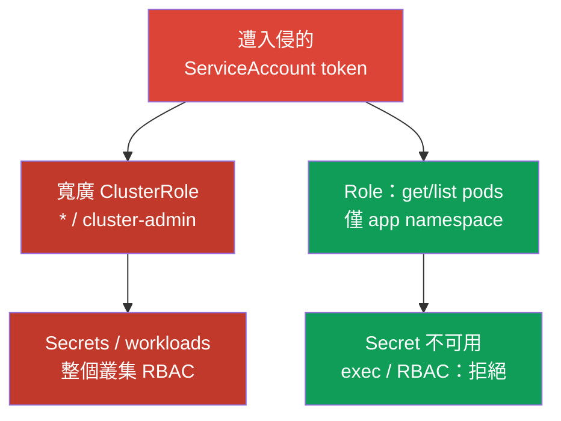
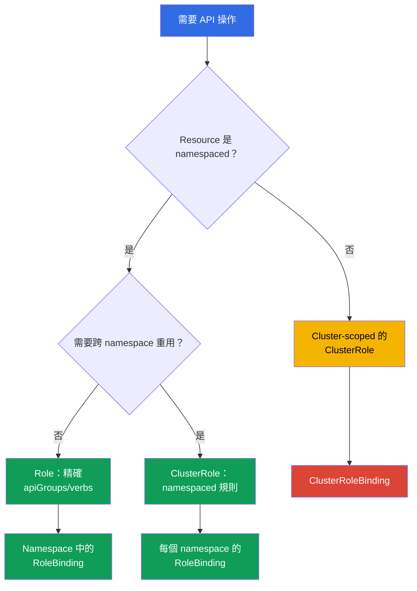

[Русская версия](ru.md) · [Eng version](README.md) · [Versión en español](es.md) · [Version française](fr.md) · [Deutsche Version](de.md) · [ქართული ვერსია](ge.md) · [日本語版](jp.md)

# 第 10 章。用 RBAC 最小化存取權限

> **問題。** 攻擊者在 Pod 取得 shell 或竊取 token 後，若 ServiceAccount 或使用者擁有多餘權限，就不會停在單一 namespace 的邊界。過寬的 `verb`、為方便而留下的 `cluster-admin`，或可用的 `escalate`/`bind`/`impersonate`，會把局部入侵轉成讀取所有 Secret、在任意節點建立 Pod 或完全接管叢集；關鍵不是漏洞本身，而是 RBAC 事先允許的內容。

> **接下來。** 第 07-09 章降低了叢集元件的攻擊面。現在限制 identity、ServiceAccount 或 Pod 遭入侵後的後果：RBAC 只應授予真正需要的存取權。這是 CKS Cluster Hardening（15%）領域。

> **需要的 CKA 基礎。** `Role`、`ClusterRole`、`RoleBinding` 和 `ClusterRoleBinding` 的基本語法見 [CKA 第 38 章](../../../cka/course/38/tw.md)。本章不重複建立四種物件，而是討論權限稽核、權限提升和安全規則設計。

## 10.1. Least privilege：多一個 verb 就會改變事件邊界

RBAC 以 identity、`verb`、resource、namespace，有時還有物件名稱的組合回答 API server 請求。權限是**累加的**：任何 `RoleBinding` 或 `ClusterRoleBinding` 授予存取後，更狹窄的角色不能撤銷它。因此不能用另一個角色表達 deny，必須刪除或縮小既有 binding。Kubernetes RBAC 是 **allow-only** 模型，沒有否定式 deny 規則，也沒有時間或 source IP 條件。這類需求通常不能交給 admission：admission 在 authentication/authorization 之後，且只攔截 create/delete/modify（及部分 custom verbs），`get`、`list` 和 `watch` 會繞過 admission layer。需要條件式 **API 授權**時，使用外部/Webhook authorizer 或其他 authorization/policy layer；source IP 則另以 firewall、load balancer 或適用時的 NetworkPolicy 限制。Admission policy 只適合它實際攔截的請求，不能取代 RBAC conditions。

典型攻擊情境是：開發者或 ServiceAccount 被「暫時」給了 `cluster-admin`，或 controller 取得 `verbs: ["*"]`。token 遭入侵後，攻擊者可讀取含憑證的 Secret、對應用程式執行 `pods/exec`、以更高權限的 ServiceAccount 建立 workload，或為自己授予新角色。原本一個 namespace 的入侵於是變成叢集入侵。



Least privilege 不只是把 `cluster-admin` 換成名字較小的角色。對每個 subject 都要定義需要哪些 API 操作、哪些 resource、哪個 namespace、持續多久，以及是否根本需要 API 存取。一般應用程式常見的正確答案是使用沒有 token 的專用 ServiceAccount；token 會在第 11 章討論。

若範圍限於 namespace，從 `Role` 和 `RoleBinding` 開始。Cluster-scoped resource 或可重複使用的規則集合才需要 `ClusterRole`，但可透過 `RoleBinding` 將它只授予一個 namespace。`ClusterRoleBinding` 擴展到整個叢集，必須有獨立理由。

> 🎯 用 `can-i` 成對檢查具體 identity、verb、resource 和 scope：需要的動作是 `yes`，相鄰的危險動作是 `no`。

## 10.2. 稽核實際權限：`kubectl auth can-i`

YAML 顯示意圖，不代表最終授權：subject 可能從多個 binding、內建角色、group 或聚合 `ClusterRole` 取得權限。用 `kubectl auth can-i` 檢查 API server 的回答。

```bash
# 檢視目前 identity 在指定 namespace 的規則。
kubectl auth can-i --list -n cks-104

# Cluster-scoped 與跨 namespace 邊界分開檢查。
kubectl auth can-i get nodes
kubectl auth can-i list pods -n cks-104
kubectl auth can-i list pods -n default

# 若問題是「所有 namespaces 是否都允許這個動作」：
kubectl auth can-i list pods --all-namespaces

# 具體的預期允許與拒絕；但這是目前 identity 的權限，
# 不是要檢查的 ServiceAccount 或使用者。
kubectl auth can-i list pods -n cks-104
kubectl auth can-i get secrets -n cks-104

# 以 lab104 的 ServiceAccount 檢查
SA=system:serviceaccount:cks-104:app-sa
kubectl auth can-i list pods -n cks-104 --as="$SA"
kubectl auth can-i delete pods -n cks-104 --as="$SA"
kubectl auth can-i get secrets -n cks-104 --as="$SA"
# yes
# no
# no
```

沒有 `--as` 時，`can-i` 永遠回答執行 `kubectl` 的 identity，也就是自己的 kubeconfig，而不是測試中的 identity。任務幾乎總是詢問特定 ServiceAccount、使用者或 group，因此要使用 `--as=<identity>`；否則 `yes`/`no` 只證明自己的權限。

`--as-group` 不能取代 `--as`，也不是獨立替代方案：它是只有和 impersonated user 一起使用才生效的額外 impersonated groups。若任務檢查透過 group binding 得到的權限，請設定 `--as` 並**額外**指定所需 `--as-group`：

```bash
kubectl auth can-i list pods -n cks-104 \
  --as=group-audit-user \
  --as-group=developers
```

`--as=<user>` 不會自動恢復該使用者的真實 groups；請列出測試情境中的 impersonated groups。

`--list` 適合概覽，但不保證是任何 authorizer chain 的完整 effective permissions。它依賴 `SelfSubjectRulesReview`，官方文件也警告返回清單可能因叢集 authorization mode 和 evaluation 錯誤而不完整。`--list` 不支援 `--all-namespaces`：`kubectl` 會拒絕此組合，因為 `SelfSubjectRulesReview` 只會列出單一 namespace 的規則，並不是 cluster-wide inventory。關鍵邊界應像上例，針對具體 identity 執行個別 positive/negative `kubectl auth can-i <verb> <resource>`。

`--list` 適合 review，但不能取代關鍵權限檢查：輸出可能很長，而 wildcard 會隱藏具體風險。Acceptance test 總要檢查「需要的動作 = `yes`」和「相鄰危險動作 = `no`」。對 cluster-scoped resource 不要指定 namespace：

```bash
kubectl auth can-i get nodes --as="$SA"
kubectl auth can-i create clusterrolebindings --as="$SA"
kubectl auth can-i create pods/exec -n cks-104 --as="$SA"
```

`--as` 使用 Kubernetes impersonation。在 Kubernetes 1.36，請求可能由寬廣的 legacy `impersonate` verb，或由 Constrained Impersonation 允許：後者分別授予 identity 權限和實際 API request 所需的 `impersonate-on:<mode>:<verb>`。若缺少 impersonation 權限，API 會在檢查被 impersonate identity 前返回 `forbidden`。

安全稽核不要自動授予 legacy `impersonate`；應選擇符合 workflow 的模型並記錄其範圍。

> 🔬 Kubernetes 1.36+ 的 Constrained Impersonation 分別限制可被冒用的 identity 和冒用時允許的動作。

### 10.2.1. Constrained Impersonation：限制 identity 與動作

> **Kubernetes 1.36+ / advanced。** 這是超出 CKS 必修核心的 production 內容；考試優先順序是精確的普通 Role/Binding 和最小 `impersonate`。

**Constrained Impersonation** 在 Kubernetes v1.36+ 為 Beta，且預設啟用。與普通 `impersonate` 不同，它不允許以目標身份執行目標所能做的一切。對一般使用者（`Impersonate-User` 不以 `system:serviceaccount:` 或 `system:node:` 開頭），API server 會進行兩項獨立檢查：

1. **Identity permission** - 是否能冒用這個 identity。generic user 要在 `apiGroups: ["authentication.k8s.io"]`、resource `users` 中，以所需名稱的 `resourceNames` 和 verb `impersonate:user-info` 建立規則。user 沒有 namespace scope，因此要用 `ClusterRole` 和 `ClusterRoleBinding` 授予。
2. **Action-at-scope permission** - 在該冒用身份下，是否能於其 scope 執行特定操作。列出 Pod 使用 `impersonate-on:user-info:list` on `pods`，watch 使用 `impersonate-on:user-info:watch`。只能在需要的 namespace 以 `Role`/`RoleBinding` 授予。只有 identity permission 不足以完成操作。

以下範例允許 ServiceAccount `audit-reader` 僅冒用 generic user `readonly@example.com`，並只在 `cks-104` list/watch Pod：

```yaml
apiVersion: rbac.authorization.k8s.io/v1
kind: ClusterRole
metadata:
  name: impersonate-readonly-identity
rules:
- apiGroups: ["authentication.k8s.io"]
  resources: ["users"]
  resourceNames: ["readonly@example.com"]
  verbs: ["impersonate:user-info"]
---
apiVersion: rbac.authorization.k8s.io/v1
kind: ClusterRoleBinding
metadata:
  name: audit-reader-impersonate-readonly
subjects:
- kind: ServiceAccount
  name: audit-reader
  namespace: cks-104
roleRef:
  apiGroup: rbac.authorization.k8s.io
  kind: ClusterRole
  name: impersonate-readonly-identity
---
apiVersion: rbac.authorization.k8s.io/v1
kind: Role
metadata:
  name: impersonate-readonly-pods
  namespace: cks-104
rules:
- apiGroups: [""]
  resources: ["pods"]
  verbs:
  - "impersonate-on:user-info:list"
  - "impersonate-on:user-info:watch"
---
apiVersion: rbac.authorization.k8s.io/v1
kind: RoleBinding
metadata:
  name: audit-reader-impersonate-readonly-pods
  namespace: cks-104
subjects:
- kind: ServiceAccount
  name: audit-reader
  namespace: cks-104
roleRef:
  apiGroup: rbac.authorization.k8s.io
  kind: Role
  name: impersonate-readonly-pods
```

Client 使用相同 headers 或 `kubectl --as=readonly@example.com`；改變的只是 API server 檢查。舊的 `impersonate` 仍可運作且是寬廣 fallback，因此除非有獨立理由，不要與 constrained 規則一併授予。

重要的是，constrained permission 針對**真實 API request**，不是 client 在另一個 review object 內描述的動作。上面的 `impersonate-on:user-info:list/watch` on `pods` 允許以 `--as` 執行實際 `list/watch pods`，但本身不允許：

```bash
kubectl auth can-i list pods --as=readonly@example.com -n cks-104
```

`kubectl auth can-i` 會建立 `SelfSubjectAccessReview`，因此此 audit workflow 需要覆蓋 `create` on `selfsubjectaccessreviews.authorization.k8s.io` 的 constrained permission，或受控的 legacy impersonator。若能在安全的 read-only 情境直接檢查必要操作，不要只為了方便 `can-i` 而擴大 constrained role。

若要盤點，先找出權限來源，再查看規則和 subjects。在理解使用者前，不要修改內建角色。

```bash
ROLE_NAME='role-name-to-review'
kubectl get role,rolebinding -A
kubectl get clusterrole,clusterrolebinding
kubectl describe rolebinding -n cks-104 app-sa-pod-reader
kubectl get clusterrolebinding -o wide
kubectl get clusterrole "$ROLE_NAME" -o yaml
```

## 10.3. 危險的 verbs 與 resources：權限提升路徑

規則的風險並不相同。對 `pods` 的 read-only 存取和對 `secrets` 的 `get` 會造成完全不同的損害；某些 verbs 還能隱含取得現有權限。Review 時，先找以下組合，再看普通的 `get`/`list`。

| Verb 或 resource | 危險原因 | 安全方法 |
|---|---|---|
| `escalate` on `roles`/`clusterroles` | 搭配 Role/ClusterRole 的 `create`/`update` 後，可繞過「自己必須擁有寫入角色的所有權限」要求。 | 不授予 workload 和普通 namespace 管理員；分別控制 RBAC 物件 CRUD 及 bypass verb。 |
| `bind` on `roles`/`clusterroles` | 搭配 RoleBinding/ClusterRoleBinding 的 `create`/`update` 後，可繞過 referenced role 權限要求。 | 用 `resourceNames` 限制到具體角色，只在確實需要管理 binding 時授予。 |
| `impersonate` on `users`、`groups`、`serviceaccounts`、`uids` 或 `userextras/<name>` | 能以另一 identity（包括更高權限者）執行請求。Extra fields 使用精確的 resource name，例如 `authentication.k8s.io` API group 中的 `userextras/scopes`。 | 僅必要時給稽核者，並限制 `resourceNames`。 |
| `create`/`update`/`patch` RoleBinding 和 ClusterRoleBinding | 搭配可用角色可轉交權限；ClusterRoleBinding 影響整個叢集。 | 禁止給應用程式；將 access grant 與 workload 開發分離。 |
| `get`/`list`/`watch` `secrets` | Secret 常含密碼、registry credential、key 或 bearer token；`list`/`watch` 暴露大量 Secret 值。 | 對 `get` 用 `resourceNames` 指定單一 Secret，或不給應用程式 API 存取。 |
| `create` `serviceaccounts/token` | 可發行所選 ServiceAccount token，成為使用其權限的方式。 | 只給可信自動化，並限制到特定 ServiceAccount。 |
| `create` `pods/exec` | 可在現有 Pod 互動執行命令，接觸網路、檔案系統和 mounted Secret。 | 不加入普通角色；使用短效 break-glass access 並稽核。 |
| `create` `pods/portforward` | 建立通往 Pod port 的 tunnel，繞過一般網路暴露。 | 僅用於診斷，精確授予並在事件後撤銷。 |
| `create` workload（`pods`、`deployments`、`jobs` 等） | 在 namespace 建立 Pod/workload 本身即能選任意 ServiceAccount，並從 Pod spec 引用 Secret、ConfigMap 和可用 storage，即使原 identity 沒有 `get secrets`。若 policy 允許 privileged/host-level Pod，後果可擴散到 node。 | 非必要不要授予不可信 tenant identity；視為 privileged 權限，限制 Pod Security、ServiceAccount、Secret/storage design 和 admission policy。 |
| `nodes` | 讀取 node 物件會暴露基礎設施資訊；修改 node 是 cluster-wide 操作。 | 從 tenant role 排除，僅給獨立的 operation identity。 |
| `get` `nodes/proxy` | 可透過 proxy 請求 kubelet；不是 read-only，可能繞過 admission 和 API server 的一般 audit。 | 不給 workload 或 tenant role，只給嚴格控制的 operation identity。 |

Subresource 以斜線表示：`resources: ["pods/exec"]`。`exec` 和 `portforward` 通常需要 `create`，不是 `get`。不要用所有 `pods` 的規則取代精確的 `resources: ["pods/exec"]`，兩者是不同 API 路徑和風險。相反，`get` `nodes/proxy` 是獨立的 kubelet proxy 危險權限，不是無害的 node 讀取。

Kubernetes 1.36 中 `KubeletFineGrainedAuthz` 已 GA 且永久啟用。合法的 operation task 應授予狹窄 subresource，而不是 `nodes/proxy`，例如 `nodes/stats`、`nodes/metrics`、`nodes/log`、`nodes/pods`、`nodes/healthz` 或 `nodes/configz`。Kubelet 會分別檢查這些路徑；其他請求及相容性仍保留 `nodes/proxy` fallback。

```yaml
# monitoring identity 的範例；不要以此規則代替任意 kubelet 操作。
rules:
- apiGroups: [""]
  resources: ["nodes/metrics", "nodes/stats"]
  verbs: ["get"]
```

Wildcards 在三處特別危險：`apiGroups: ["*"]`、`resources: ["*"]` 和 `verbs: ["*"]`。它們會包含升級後新增的 API groups、CRD、subresource 和 verbs。今天安全的規則明天可能悄悄變寬，也讓稽核無法從 YAML 判斷是否能存取 `secrets`、`pods/exec` 或 `rolebindings`。

> 🧠 RBAC 具有累加性：狹窄角色不會取消已授予的 Allow；`escalate`、`bind`、`impersonate`、bindings、Secret 和危險 subresource 都可能轉交他人權限。

```yaml
# 不安全：namespace 中目前和未來的所有 API
rules:
- apiGroups: ["*"]
  resources: ["*"]
  verbs: ["*"]
```

```yaml
# 單一 namespace 中 read-only controller 的最小規則
rules:
- apiGroups: [""]
  resources: ["pods"]
  verbs: ["get", "list"]
```

## 10.4. 設計最小 Role

先用自然語言寫出 access contract：「`app-sa` 在 `cks-104` 讀取 Pod 清單和特定 ConfigMap 狀態；不修改 workload、Secret 或 RBAC。」再將它轉成最小規則。把讀取（`get`、`list`、`watch`）和修改（`create`、`update`、`patch`、`delete`）分開：監看 Pod 的 controller 不一定需要刪除權限。

> 🎯 寫出 access contract，選擇狹窄 scope（namespace 的 `Role` + `RoleBinding`），並證明允許的動作以及危險相鄰 resource 或 namespace 的拒絕。

```yaml
apiVersion: v1
kind: ServiceAccount
metadata:
  name: app-sa
  namespace: cks-104
---
apiVersion: rbac.authorization.k8s.io/v1
kind: Role
metadata:
  name: app-sa-pod-reader
  namespace: cks-104
rules:
- apiGroups: [""]
  resources: ["pods"]
  verbs: ["get", "list"]
---
apiVersion: rbac.authorization.k8s.io/v1
kind: RoleBinding
metadata:
  name: app-sa-pod-reader
  namespace: cks-104
subjects:
- kind: ServiceAccount
  name: app-sa
  namespace: cks-104
roleRef:
  apiGroup: rbac.authorization.k8s.io
  kind: Role
  name: app-sa-pod-reader
```

`resourceNames` 可把 `get`、`update`、`patch` 和 `delete` 進一步限制到物件名稱，適合單一已知 ConfigMap 或 Secret。對**頂層 resource**，它不限制 `create` 和 `deletecollection`，因為這些請求的 URL 不包含物件名稱。這不是所有 subresource 的規則：具名 subresource（例如 `pods/exec`）可以使用 `resourceNames` 限制（見 [RBAC reference](https://kubernetes.io/docs/reference/access-authn-authz/rbac/)）。`list`/`watch` 搭配 `resourceNames` 需要 client 提供 `metadata.name=<name>` field selector，常不方便；不要把它當成 namespace isolation 的完整替代品。

```yaml
apiVersion: rbac.authorization.k8s.io/v1
kind: Role
metadata:
  name: app-config-reader
  namespace: cks-104
rules:
- apiGroups: [""]
  resources: ["configmaps"]
  resourceNames: ["app-config"]
  verbs: ["get"]
```

選擇物件前先確認 resource scope。`pods`、`configmaps`、`deployments` 和 `secrets` 是 namespaced，`Role` 因而能限制其 namespace。`nodes`、`namespaces`、`persistentvolumes` 和 `clusterroles` 是 cluster-scoped，需要 `ClusterRole`；`RoleBinding` 不會把 cluster-scoped resource 變成本地 resource。若多個 namespace 需要同一組 namespaced 權限，可定義 `ClusterRole`，再在每個允許的 namespace 建立獨立 `RoleBinding`。

`nonResourceURLs` 描述 API server URL，不是 Kubernetes 物件。這些 URL 沒有 namespace scope，因此規則必須放在 `ClusterRole`，並以 `ClusterRoleBinding` 授予。例如 health-check identity 可精確取得 `nonResourceURLs: ["/healthz"]` 和 `verbs: ["get"]`，不要授予 wildcard `/*`。即使 `RoleBinding` 引用這個 `ClusterRole`，也不會將 non-resource URL 變成 namespaced permission。



`ClusterRole` 不會自動代表 cluster-wide access：它可以只包含 namespaced resource 規則，並透過 `RoleBinding` 只在某個 namespace 授予。只有 `ClusterRoleBinding` 會產生 cluster-wide scope。Cluster-scoped resource 和 `nonResourceURLs` 需要 `ClusterRole` + `ClusterRoleBinding`。

## 10.5. 內建與聚合 ClusterRole：隱藏的權限擴張

內建 `ClusterRole` 很方便，但風險不同。`view` 用於讀取一般 namespaced 物件，刻意不允許 Secret、Role 或 RoleBinding；Secret 常包含 ServiceAccount 權限。`edit` 可修改大多數 namespaced resource 並讀取 Secret，但不能修改 Role 或 RoleBinding；它仍可用任意該 namespace 的 ServiceAccount 啟動 Pod。`admin` 可管理 namespace 中大多數 RBAC。

Built-in `cluster-admin` 含有最寬廣的 wildcard 權限。透過 `ClusterRoleBinding` 它是整個叢集的 superuser；透過 `RoleBinding` 則限於該 namespace，但其 built-in semantics 對該 namespace 的 resource 擁有完整控制，**包括 Namespace 物件本身** - 這很重要，因為 Namespace 是 cluster-scoped resource。這種 binding 不是 cluster-wide，但仍是極高權限的 namespaced binding；任何 `cluster-admin` 指派都必須有理由並受控。

| Role | 實際意義 | 授予應用程式或廣泛 group 的風險 |
|---|---|---|
| `view` | 查看一般 namespace resource；不含 Secret、Role、RoleBinding | 可暴露 topology、映像和設定，但 credential 洩漏風險較低。 |
| `edit` | 修改大多數 namespace resource 並讀取 Secret；不能修改 Role/RoleBinding | 可修改 workload、讀 Secret，並以 namespace 任意 ServiceAccount 啟動 Pod。 |
| `admin` | 廣泛管理 namespace，包括其邊界內的 roles/bindings | namespace 權限提升和接管團隊應用程式的高風險。 |
| `cluster-admin` | `ClusterRoleBinding` 是整個叢集；`RoleBinding` 是該 namespace 所有 resource，包括 Namespace 物件 | 即使局部 binding 也極危險；ClusterRoleBinding 代表叢集遭接管。 |

Aggregation 可用其他 ClusterRole 的規則擴展內建 ClusterRole。RBAC controller 會合併帶有 `rbac.authorization.k8s.io/aggregate-to-<role>: "true"` label 的角色。這對 CRD 有用，例如 plugin 可把 API 的 read-only 規則加入 `view`。但這個 label 同時是 supply chain 與 RBAC 邊界：被建立或修改的角色可能悄悄給所有 `view`、`edit` 或 `admin` 使用者額外權限。

> 🧠 `aggregate-to-*` 會改變整個內建角色使用者群體的 effective permissions；來源角色中的 wildcard 會大量擴張權限。

```yaml
# 僅為 CRD read-only 擴展內建 view 角色的範例。
# 只有經過獨立 security review 後才加入此類角色。
apiVersion: rbac.authorization.k8s.io/v1
kind: ClusterRole
metadata:
  name: aggregate-widget-view
  labels:
    rbac.authorization.k8s.io/aggregate-to-view: "true"
rules:
- apiGroups: ["example.io"]
  resources: ["widgets"]
  verbs: ["get", "list", "watch"]
```

檢查最終內建角色的聚合規則及其來源。不要編輯帶 `system:` 前綴的系統 ClusterRole：API server 可能在啟動或更新時復原它們。自有 ClusterRole 和 labels 應透過 Git、code review 及受限 identity 管理。

```bash
# 內建角色的最終 effective rules
kubectl get clusterrole view -o yaml

# 可能擴展 view/edit/admin 的所有 ClusterRole
kubectl get clusterrole -l rbac.authorization.k8s.io/aggregate-to-view=true
kubectl get clusterrole -l rbac.authorization.k8s.io/aggregate-to-edit=true
kubectl get clusterrole -l rbac.authorization.k8s.io/aggregate-to-admin=true
```

### 精簡的權限提升地圖

| 能力 | 改變的邊界 | 控制 |
|---|---|---|
| `create` CSR 並可 `approve`/`sign` | 可簽發具有更寬 identity 的 client certificate；只有 `create` 不足以做到此事 | 在受控 identity 間分離建立、核准和簽署。 |
| 管理 `ValidatingWebhookConfiguration`/`MutatingWebhookConfiguration` | 改變全叢集 admission request 的驗證或 mutation | 不授予 tenant role；review webhook endpoint、CA 和規則。 |
| `patch` Namespace labels | 可改變 Pod Security Admission labels，允許另一種 Pod profile | 限制給 platform identity 並 review label 變更。 |
| 建立/修改帶 `hostPath` 的 PV | Claim 和 Pod 可取得 node 檔案系統路徑 | 禁止 tenant role；控制 storage policy 和 Pod Security Admission。 |
| 發行 ServiceAccount token（`create serviceaccounts/token`） | 可用所選 ServiceAccount 的權限行動 | 只給可信自動化，並限於特定 ServiceAccount。 |
| `system:masters` 成員資格 | 這是繞過普通 RBAC 檢查的 superuser group | 不授予應用程式；控制 certificate 來源和外部 groups。 |

> 🎯 RBAC 變更後，同時證明允許動作和預期拒絕。

## 10.6. 驗證：證明必要存取與拒絕

套用角色後不要只執行 `kubectl get role`：物件可能存在但未被 binding、與其他 binding 衝突，或範圍過寬。lab104 對 `app-sa` 的驗證應精確證明所需邊界。

```bash
kubectl apply -f app-sa-rbac.yaml

SA=system:serviceaccount:cks-104:app-sa

# 功能上必要的權限
kubectl auth can-i get pods -n cks-104 --as="$SA"
kubectl auth can-i list pods -n cks-104 --as="$SA"
# yes
# yes

# 不需要的權限：修改 workload、Secret、exec 和 RBAC
kubectl auth can-i delete pods -n cks-104 --as="$SA"
kubectl auth can-i get secrets -n cks-104 --as="$SA"
kubectl auth can-i create pods/exec -n cks-104 --as="$SA"
kubectl auth can-i create rolebindings -n cks-104 --as="$SA"
kubectl auth can-i create clusterrolebindings --as="$SA"
# no
# no
# no
# no
# no
```

也要檢查 scope。同一 identity 不應讀取相鄰 namespace 的 Pod，也不應只因為能存取 Pod 就擁有 cluster-scoped 權限。

```bash
kubectl auth can-i list pods -n default --as="$SA"
kubectl auth can-i get nodes --as="$SA"
# no
# no
```

若結果意外為 `yes`，找出 subject 的所有 bindings，刪除或縮小多餘存取後重測。要刪除的是精確物件，不要意外剝奪另一團隊的權限：

```bash
kubectl get rolebinding -A -o yaml | grep -n -C 4 'app-sa'
kubectl get clusterrolebinding -o yaml | grep -n -C 4 'app-sa'

# 確認 owner 和 binding 用途後才執行
kubectl delete clusterrolebinding app-sa-excessive-access
```

Production 可在 RBAC 變更後將這組 `can-i` 納入 smoke test，並要求 Role、ClusterRole 和 binding 變更 review。按 ServiceAccount 的實際用途、audit logs 和 workload owner 定期檢視長期存取。

> 🏭 Roles 和 aggregation labels 存放在 Git，變更經過 review，critical positive/negative `can-i` 檢查進入 CI；break-glass 有 owner 和期限。

## 10.7. Production 中的應用方式

- **預設使用 Role。** 團隊和應用程式取得 namespaced `Role`/`RoleBinding`；`ClusterRoleBinding` 必須有 owner、原因、期限和 security review。
- **預設使用 ServiceAccount。** 不要給 `default` ServiceAccount 應用程式權限。若 workload 不呼叫 Kubernetes API，設定 `automountServiceAccountToken: false`；否則建立具最小權限的獨立 ServiceAccount。
- **RBAC as code。** 將自有角色存放 Git，在 CI 檢查規則 diff 和 aggregation labels；明確阻擋 wildcard、`escalate`、`bind`、`impersonate` 及未經批准的 Secret 存取。
- **API server authorization 設定。** 先確認兩種互斥方式中使用哪一種。Command-line configuration 要確認 `--authorization-mode` 含必要 chain，例如 `Node,RBAC`。File-based configuration 使用 `--authorization-config` 時不要同時設定 `--authorization-mode`；直接在 `AuthorizationConfiguration` 檢查 `type: RBAC`、authorizers 的內容和順序。這個 chain 應列入 security review。
- **定期稽核。** 盤點 `ClusterRoleBinding`、`system:serviceaccount` subjects、內建角色和 aggregators；用 `kubectl auth can-i` 檢查關鍵 contracts。
- **用 break-glass 取代永久 admin。** 緊急存取應是獨立短效 identity，記錄並在工作後撤銷，不應讓日常使用者長期擁有 `cluster-admin`。

## 10.8. 小詞彙表

- **least privilege** - 只授予 identity 完成特定任務所需的最小 permissions。
- **verb** - Kubernetes API 操作，例如 `get`、`list`、`create`、`bind` 或 `escalate`。
- **resource / subresource** - API 物件及其子資源，例如 `pods` 和 `pods/exec`。
- **`resourceNames`** - 在 API server 支援處，將規則限於特定物件名稱。
- **impersonation** - 透過 API headers 以另一 identity 執行請求。
- **aggregation** - 依 label 自動把一個 ClusterRole 的規則加入內建 ClusterRole。
- **wildcard** - `apiGroups`、`resources` 或 `verbs` 中的 `*`；包含未知未來物件，對 security role 很危險。
- **break-glass access** - 事故時受控的臨時 privileged access。

## 10.9. 本章總結

- RBAC 權限具有累加性：多餘 binding 不能由更窄角色補償，必須找到並刪除或縮小。
- Least privilege 從特定 namespace 的 `Role` 和 `RoleBinding` 開始；叢集層級 access 和 `ClusterRoleBinding` 需要獨立理由。
- `kubectl auth can-i --list` 是有用的規則概覽，但不保證完整 inventory。Security-critical boundary 要用 targeted `can-i` 證明：預期存取為 `yes`，禁止存取為 `no`。
- 特別危險的是 `escalate`、`bind`、`impersonate`、修改 binding、`secrets`、`serviceaccounts/token`、`pods/exec`、`pods/portforward` 和 `get nodes/proxy`。
- 除非有例外且有文件，不要使用 `*`：wildcard 包含現在和未來的 API、resource、subresource 和 verbs。
- Aggregated ClusterRole 可能悄悄擴展 `view`、`edit` 和 `admin`；必須 review `aggregate-to-*` labels 及來源角色。

## 10.10. 這對考試和實際工作有何用

**考試中。** 快速建立或縮小含精確 `apiGroups`、`resources` 和 `verbs` 的 `Role`，在指定 namespace 綁定正確 ServiceAccount，並立即執行 `kubectl auth can-i --as=system:serviceaccount:<ns>:<sa>`。逐字閱讀 resource：`pods/exec` 不等於 `pods`；`nodes` 是 cluster-scoped。若要刪除多餘權限，先找 binding，不要隨意修改所有設定。

**實際工作中。** RBAC 限制被竊 token、automation 錯誤和 Pod 遭入侵的 blast radius。最危險的事件通常不是 YAML 語法錯誤，而是方便使用的寬廣角色、wildcard 和隱藏 binding。定期 `can-i` 稽核、aggregation label review 和明確 access contract，可讓 RBAC 成為可驗證的 security boundary。

> ### 🔴 攻擊者視角
> **Asset:** Kubernetes API resources。
>
> **Starting foothold:** Pod 內的程式碼執行。
>
> **Attacker objective:** 使用 workload identity 存取 API。
>
> **Abuse path:** 檢查 token、audience 和 TTL，再檢查 RBAC permissions，嘗試 `list` Pod、讀 Secret，或透過 `pods/exec` 建立/執行 workload。
>
> **Expected evidence:** audit events 和 SubjectAccessReview。
>
> **Control:** API 不需要時設定 `automountServiceAccountToken: false`；需要時使用 projected short-lived token 和最小 RBAC。
>
> **Retest:** 允許的 API call 成功，禁止的 API call 返回 `403`。
>
> **ATT&CK:** [T1528 — Steal Application Access Token](https://attack.mitre.org/techniques/T1528/)。

## 10.11. 自我檢查問題

<details>
<summary>1. 為什麼更窄的 Role 不能取消另一個 binding 授予的權限？</summary>

Kubernetes RBAC 具有累加性：只要任一 RoleBinding 或 ClusterRoleBinding 提供權限，它就有效。allow-only 模型沒有可覆蓋既有 access 的 deny 規則；要移除多餘權限，必須找到並刪除或縮小授予它的 binding。
</details>

<details>
<summary>2. 哪兩個 `can-i` 檢查能證明 `app-sa` 可讀 Pod 但不能刪除？</summary>

執行 `kubectl auth can-i get pods -n cks-104 --as=system:serviceaccount:cks-104:app-sa` 並期待 `yes`；再執行相同 identity 的 `delete pods` 並期待 `no`。這對檢查的是 API server 的實際決策，而不只是角色 YAML。
</details>

<details>
<summary>3. 為什麼 `get`/`list` Secret 比讀取多數普通 resource 危險？</summary>

Secret 常含密碼、registry credential、key 或 bearer token，讀取會揭露可直接使用的憑證。`list` 和 `watch` 可能一次暴露許多 Secret；若只需單一已知 Secret，使用帶 `resourceNames` 的精確 `get`，或不給應用程式 API 存取。
</details>

<details>
<summary>4. `bind` 與 `escalate` 有何不同？它們如何導致權限提升？</summary>

兩者都繞過 RBAC 的內建保護，但不能取代一般 CRUD。`escalate` 搭配 Role/ClusterRole 的 `create`/`update`，可寫入 subject 自己沒有的 permissions；`bind` 搭配 RoleBinding/ClusterRoleBinding 的 `create`/`update`，可指定 referenced role 而不必擁有其全部 permissions。因此要同時稽核修改 RBAC 物件的能力和 bypass verb。
</details>

<details>
<summary>5. 為什麼 `create pods/exec` 和 `create pods/portforward` 要與普通 `pods` access 分開 review？</summary>

它們是不同的 subresource API：`pods/exec` 可在現有 Pod 中執行命令並接觸其網路、filesystem 和 mounted Secret；`pods/portforward` 可建立通往 Pod port 的 tunnel。它們不應隱含加入普通 read-role，通常只為受控診斷授予。
</details>

<details>
<summary>6. 為什麼 `resourceNames` 不限制頂層 resource 的 `create` 和 `deletecollection`，卻可套用於 `pods/exec`？</summary>

頂層 resource 的 `create` 和 `deletecollection` 請求 URL 不包含物件名稱，API server 因而無法用 `resourceNames` 限制。這不是所有 subresource 的通用限制；`pods/exec` 指向特定 Pod，因此可用具名限制。
</details>

<details>
<summary>7. 為什麼 `get nodes/proxy` 不是 read-only 權限，誰可以取得？</summary>

它允許透過 proxy 請求 kubelet，而 kubelet 操作可能繞過 admission 和 API server 一般 audit。因此不應授予 workload 或 tenant role，只能給嚴格控制的 operation identity，並盡可能使用 `nodes/metrics`、`nodes/stats` 等更窄 subresource。
</details>

<details>
<summary>8. `rbac.authorization.k8s.io/aggregate-to-view=true` 如何改變 effective access？為何聚合角色的 wildcard 特別危險？</summary>

RBAC controller 會把帶此 label 的 ClusterRole 規則加入最終內建 `view`，所有 view 使用者都取得新 access。來源角色的 wildcard 會一次包含目前和未來 API groups、resources、subresources 和 verbs，因此要 review 最終角色及所有 aggregation source。
</details>

<details>
<summary>9. **回顧（第 04 章）。** NetworkPolicy 是 allow-list；RBAC 何處使用同樣的「先全部禁止，再明確允許」邏輯？何時 request 會取得 default-deny？</summary>

RBAC 從沒有必要 permissions 開始，只加入精確 `apiGroups`、`resources` 和 `verbs` 及最小 scope。若沒有任何適用 RoleBinding 或 ClusterRoleBinding 提供 Allow，request 就會被拒絕。除了直接指定 subject 的 binding，也要考慮 identity 從 groups 取得的權限（例如 ServiceAccount 的 `system:serviceaccounts`）。因此沒有直接 binding 不能單獨證明沒有 access，需以具體 identity 的 `kubectl auth can-i` 確認。與 NetworkPolicy 不同，決策由 API server 的 RBAC authorizer 作出，但結果同樣是明確 allow-list。
</details>

## 實作

在 [lab 104](../../labs/104/README_TW.MD) 建立只有讀取 Pod 的最小 `Role` 給 `app-sa`，透過 `auth can-i` 證明 `delete pods` 被禁止，並移除多餘 binding。同一 lab 也會關閉 ServiceAccount token 的自動掛載及限制 API server 的匿名存取；後續章節會延伸這個 RBAC 邊界。

🌐 額外互動練習（killer.sh/killercoda，外部資源）：[rbac-serviceaccount-permissions](https://killercoda.com/killer-shell-cks/scenario/rbac-serviceaccount-permissions) · [rbac-user-permissions](https://killercoda.com/killer-shell-cks/scenario/rbac-user-permissions) · [certificate-signing-requests-sign-manually](https://killercoda.com/killer-shell-cks/scenario/certificate-signing-requests-sign-manually) · [certificate-signing-requests-sign-k8s](https://killercoda.com/killer-shell-cks/scenario/certificate-signing-requests-sign-k8s)

🎮 Killercoda（瀏覽器中，無需安裝）：[Create a Role and Role Binding](https://killercoda.com/chadmcrowell/course/cka/create-role) · [Create a Cluster Role and Role Binding](https://killercoda.com/chadmcrowell/course/cka/create-cluster-role)

---
[目錄](../README_TW.md) · [第 09 章](../09/tw.md) · [第 11 章](../11/tw.md)
