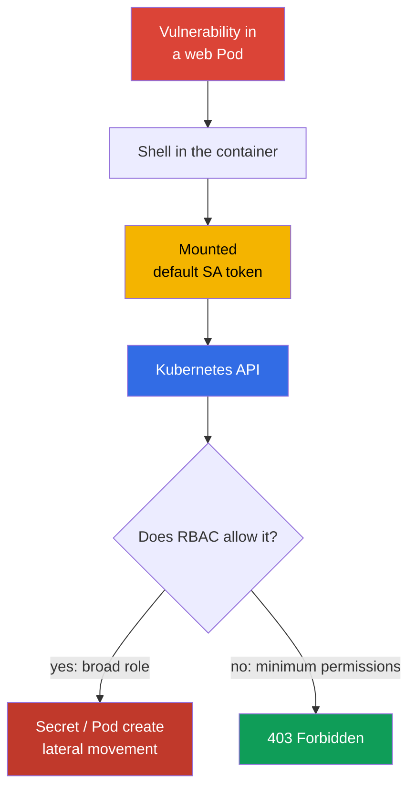
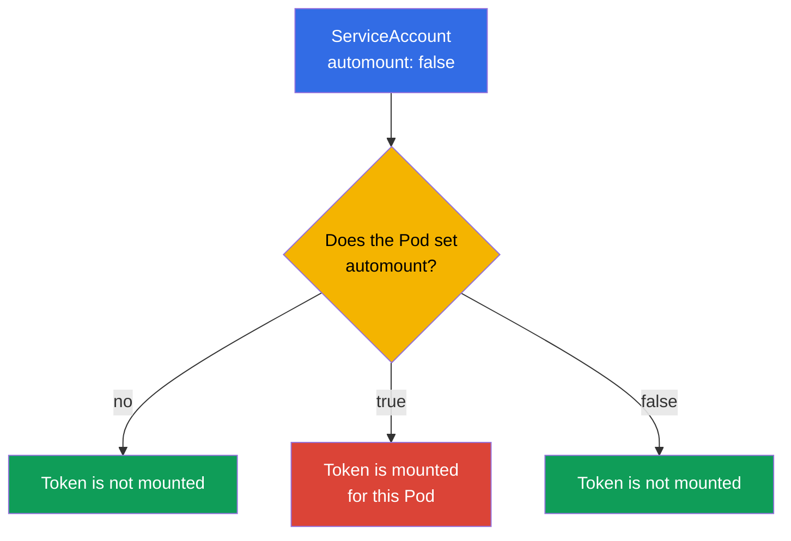
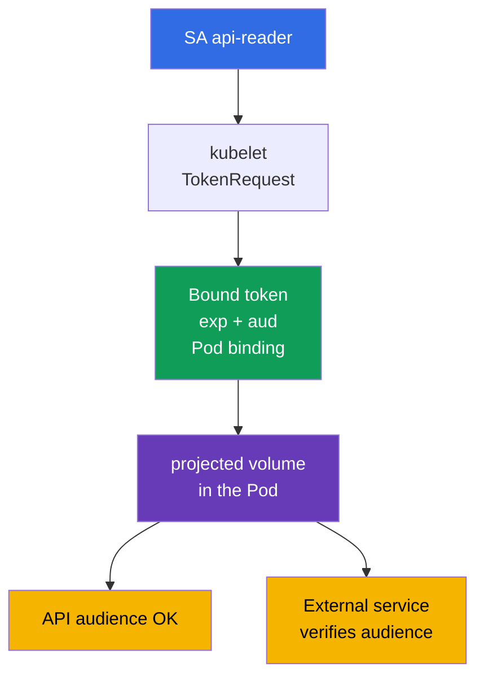

[Русская версия](ru.md)

# Chapter 11. ServiceAccounts: minimization and tokens

> **The problem.** A shell in a vulnerable Pod gives an attacker access to the mounted bearer token of the ServiceAccount. If the token is issued to the `default` account or an identity with excessive RBAC, it can be used outside the container to read Secrets, create Pods, and escalate further in the API; even a short-lived token is dangerous during its lifetime.

> **What comes next.** In Chapter 10, we reduced permissions through RBAC. Now we will limit the identity that a Pod receives: its ServiceAccount and token. An unnecessary token in a compromised container is a ready-made entry to the Kubernetes API; a minimal ServiceAccount and short-lived token reduce incident impact. This is the Cluster Hardening (15%) CKS domain. In the next chapter, we will also restrict API access from anonymous requests, networks, and apiserver settings.

> **What you need from CKA.** Basic ServiceAccount concepts, the authn -> authz -> admission chain, and automatic token mounting are covered in [CKA Chapter 21](../../../cka/course/21/README.md). Role, RoleBinding, and permission verification are covered in [CKA Chapter 38](../../../cka/course/38/README.md). Here we do not repeat basic syntax, but apply it to least privilege.

> 🧠 A token in a compromised Pod is a ServiceAccount bearer credential: its impact is determined not by the file itself but by every current and future RBAC permission of that identity.

## 11.1. Attack scenario: `default` ServiceAccount token in a Pod

Every namespace contains a `default` ServiceAccount. If a Pod does not specify `serviceAccountName`, the admission controller assigns this one. By default, that SA's token is also mounted into the Pod. A token alone does not grant permissions: authorization still depends on RBAC. But a stolen token allows an attacker to become that identity and use **all** permissions that it has now or receives later.

A typical attack path is: an application vulnerability provides a shell in a Pod, the attacker reads the token from the mounted volume, and then sends it to the API. If the `default` SA was given a RoleBinding "for convenience" or is bound to a broad ClusterRole, the attacker can read Secrets, create Pods, or advance the attack. Even a token without current permissions is not needed by an ordinary HTTP service and should not be present in its filesystem.



The hardening goal is not to rely on one control. Three independent measures are needed: do not mount a token in a Pod that does not need the API; create a dedicated SA for a Pod that needs the API; and give that SA only the necessary RBAC actions. NetworkPolicy from Chapter 04 and API access restriction from Chapter 12 complement but do not replace these measures.

> 🎯 Without the API, disable automount; with the API, use a dedicated SA, a short-lived bound token, and a minimal Role/RoleBinding, then check the token and API permissions.

## 11.2. `automountServiceAccountToken`: disable by default

The `automountServiceAccountToken: false` field prevents the ServiceAccount admission controller from adding the standard projected volume to a Pod. It can be set on the ServiceAccount or directly in the Pod `spec`.



The Pod-level value takes precedence. If the Pod does not set this field, the ServiceAccount value is used. Therefore, the secure pattern is to disable automount on the namespace's `default` SA and on newly created SAs by default, and describe exceptions explicitly in the Pod manifest only after verifying that it genuinely needs the API.

```bash
# For an existing namespace: disable automatic token mounting for the default ServiceAccount.
kubectl -n cks-104 patch serviceaccount default \
  -p '{"automountServiceAccountToken":false}'

# Confirm that the new value is recorded.
kubectl -n cks-104 get serviceaccount default \
  -o jsonpath='{.automountServiceAccountToken}{"\n"}'
# false
```

The change does not remove the volume from an already created Pod: recreate the workload and check the new Pod. The following manifest closes this path twice: automount is disabled on its SA and the Pod also explicitly prohibits mounting. The token does not enter the container at all, so there is nothing to steal when the application is compromised. This is the correct option for an application that does not call the Kubernetes API.

```yaml
apiVersion: v1
kind: ServiceAccount
metadata:
  name: app-sa
  namespace: cks-104
automountServiceAccountToken: false
---
apiVersion: v1
kind: Pod
metadata:
  name: app-without-api
  namespace: cks-104
spec:
  serviceAccountName: app-sa
  automountServiceAccountToken: false
  containers:
  - name: app
    image: nginx:1.30.4
```

Do not confuse the absence of an automatically mounted token with the absence of a ServiceAccount. The Pod still has identity `app-sa`; the standard ServiceAccount token is simply not mounted into its filesystem. Do not expect `automount: false` to stop an application that receives a token by another method - through a Secret, projected volume, or environment variable. Exclude such sources separately.

> 🧠 JWT claims, audience, rotation, and bound-object verification define the boundaries of a token credential.

## 11.3. Bound ServiceAccount token and projected volume

In modern Kubernetes, a Pod receives a **bound ServiceAccount token**, not a perpetual Secret containing a token. Kubelet requests the token through the TokenRequest API; the token is tied to the particular ServiceAccount, has a limited lifetime (`exp`), and rotates automatically before expiry. The JWT contains claims about the issuer, subject `system:serviceaccount:<ns>:<sa>`, and bound object. After the bound Pod is deleted, that credential must not be regarded as a trusted active credential.

`audience` restricts the token recipient. A token for the Kubernetes API must have an audience accepted by apiserver; a token for an external service must have that service's audience. The external service must verify the signature, `iss`, `aud`, expiration, and subject. Do not use one token "for everything": it broadens the scope in which a stolen credential can authenticate.



The Pod below does not receive the implicit standard mount. Instead, exactly one projected volume required to call the Kubernetes API is mounted: a short-lived token, CA, and namespace. Do not fix `https://kubernetes.default.svc` as a universal API audience: apiserver accepts values from `--api-audiences`, and when that flag is absent the list is derived from `--service-account-issuer`. Thus, a token with that string yields `401` in some clusters. For a Kubernetes API token, do not set `audience` explicitly, or first confirm actual `--api-audiences`/`--service-account-issuer`; set a separate audience for Vault or another external service.

```yaml
apiVersion: v1
kind: Pod
metadata:
  name: api-reader
  namespace: cks-104
spec:
  serviceAccountName: app-sa
  automountServiceAccountToken: false

  securityContext:
    runAsNonRoot: true
    runAsUser: 10001

  containers:
  - name: client
    image: curlimages/curl:8.12.1
    command: ["sh", "-c", "sleep 3600"]
    volumeMounts:
    - name: api-credential
      mountPath: /var/run/secrets/tokens
      readOnly: true
  volumes:
  - name: api-credential
    projected:
      defaultMode: 0444
      sources:
      - serviceAccountToken:
          path: token
          # For the Kubernetes API, audience is not set: the API server chooses it.
          # An explicit value is allowed only after checking --api-audiences.
          expirationSeconds: 3600
      - configMap:
          name: kube-root-ca.crt
          items:
          - key: ca.crt
            path: ca.crt
      - downwardAPI:
          items:
          - path: namespace
            fieldRef:
              fieldPath: metadata.namespace
```

The official `curlimages/curl` image runs its process as non-root (`running as curl_user is an explicit design decision`, curl-docker README), so this example explicitly defines runtime identity through `runAsNonRoot: true` and `runAsUser: 10001` rather than leaving it only to image metadata.

For Linux Kubernetes v1.36, a projected ServiceAccount token has special permission semantics: when all Pod containers use the same `runAsUser`, kubelet assigns the token to this UID and forces mode `0600`. Therefore, in this single-container Pod, the token is owner-readable only by UID `10001` without `fsGroup`.

`defaultMode: 0444` is needed for the mixed projection of non-secret `ca.crt` and `namespace`, which the non-root client must also read. It does not make the bearer token world-readable: for `serviceAccountToken`, kubelet separately applies the described `0600`.

`fsGroup` is not required here. If it is added, kubelet applies group ownership to the volume and expands permissions for a projected ServiceAccount token from `0600` to `0640`. Use such group access only when it is genuinely needed by multiple processes or a GID, not as a mandatory condition for a non-root `runAsUser`.

`expirationSeconds` requests a desired lifetime, not a way to obtain a perpetual credential: the value must be at least `600`, while the control plane still determines the limit. Kubelet updates the token file before `exp`, but an exact universal rotation interval is not guaranteed. Therefore, an application must reopen the token path for every new connection or credential refresh rather than retain stale content or a file descriptor in memory. Do not print the token in a terminal, CI logs, an incident report, or a ticket. For a temporary manual check, issue a separate token with a short duration:

```bash
# Do not set --audience for the Kubernetes API without checking --api-audiences.
kubectl -n cks-104 create token app-sa --duration=10m
```

For an external service where the freshness of the binding matters, `TokenReview` through apiserver is recommended: it checks the existence of the ServiceAccount and bound Pod, Secret, or Node and immediately rejects a bound token after its object is deleted. Offline OIDC/JWT validation verifies the signature and claims but does not learn about deletion: such a token remains valid only until `exp`. If an object is merely marked for deletion (`deletionTimestamp`), the authenticator rejects the token no later than 60 seconds later.

In Kubernetes v1.33+, `ServiceAccountNodeAudienceRestriction` is Beta and enabled by default. The restriction is applied by the `NodeRestriction` admission plugin: when the feature gate is enabled, `NodeRestriction` is active, and a TokenRequest comes from a recognized node/kubelet identity, kubelet can by default request only audiences already used by workloads on that Node. For justified exceptions, an administrator can grant the `request-serviceaccounts-token-audience` RBAC verb.

This restriction applies specifically to kubelet/node identities; it does not restrict other TokenRequest API callers.

A manually created `kubernetes.io/service-account-token` Secret creates a long-lived bearer credential. Kubernetes still officially supports this method - for example, when an integration genuinely needs a token without the usual expiry - but upstream documentation directly recommends TokenRequest instead.

For this course, consider such a Secret an exception rather than the normal way to issue a credential: first prefer short-lived TokenRequest, OIDC, or federation. If a specific integration cannot work with a limited lifetime, document the reason for the exception, minimal RBAC, Secret protection, and a rotation/revocation procedure. Do not create such a Secret as the usual way to give a Pod API access: it receives no automatic short rotation and increases impact after a leak.

> 🔬 **Kubernetes v1.37: X.509 workload identity.** The bound ServiceAccount token remains the primary JWT identity model of this chapter. Kubernetes v1.37 also stabilized Pod Certificates and ClusterTrustBundles - built-in primitives for issuing and rotating X.509 workload credentials. This is a production-current extension, not a CKS Core replacement: see [Kubernetes v1.37 Security Delta](../APPENDIX_K8S_137_SECURITY_DELTA.md).

## 11.4. Dedicated ServiceAccount and minimal RBAC

The `default` SA is not an application role. For every workload that needs the API, create a separate ServiceAccount and grant it minimal RBAC permissions.

If the required resources are only in one namespace, use `Role` + `RoleBinding`. If you need a reusable rule set or access to cluster-scoped resources, use `ClusterRole`. To grant its namespaced permissions in only one namespace, bind the `ClusterRole` through a `RoleBinding`; for genuinely cluster-wide access, use `ClusterRoleBinding`.

In this example, `app-sa` can only read a list of Pods in namespace `cks-104`: no `watch`, `create`, `delete`, Secret access, or ClusterRoleBinding.

```yaml
apiVersion: v1
kind: ServiceAccount
metadata:
  name: app-sa
  namespace: cks-104
automountServiceAccountToken: false
---
apiVersion: rbac.authorization.k8s.io/v1
kind: Role
metadata:
  name: app-pod-reader
  namespace: cks-104
rules:
- apiGroups: [""]
  resources: ["pods"]
  verbs: ["get", "list"]
---
apiVersion: rbac.authorization.k8s.io/v1
kind: RoleBinding
metadata:
  name: app-sa-pod-reader
  namespace: cks-104
subjects:
- kind: ServiceAccount
  name: app-sa
  namespace: cks-104
roleRef:
  apiGroup: rbac.authorization.k8s.io
  kind: Role
  name: app-pod-reader
```

Apply it and check the allowed and denied action specifically. `can-i` checks the authorizer as the required subject and does not require extracting the credential from the Pod.

```bash
kubectl apply -f app-sa-rbac.yaml

kubectl auth can-i list pods -n cks-104 \
  --as=system:serviceaccount:cks-104:app-sa
# yes
kubectl auth can-i delete pods -n cks-104 \
  --as=system:serviceaccount:cks-104:app-sa
# no
kubectl auth can-i get secrets -n cks-104 \
  --as=system:serviceaccount:cks-104:app-sa
# no
```

In this example, `RoleBinding` limits granted permissions to namespace `cks-104` and refers to a namespaced `Role`.

Do not treat `ClusterRoleBinding` as a mechanical replacement for this object: a `ClusterRoleBinding` can refer only to a `ClusterRole`, not a `Role`. To grant similar rules cluster-wide, you would first need to define a `ClusterRole` and then bind it through a `ClusterRoleBinding`.

During an audit, check the rule set and binding scope separately; do not add wildcard `*`, `secrets`, `pods/exec`, `bind`, `escalate`, or `impersonate` without a separately justified task. It is useful to regularly check current and future SA permissions with the command from Chapter 10:

```bash
kubectl auth can-i --list -n cks-104 \
  --as=system:serviceaccount:cks-104:app-sa
```

> 🧠 Creating or modifying a workload allows selection of someone else's ServiceAccount and running code with its token.

## 11.4.1. RBAC: workload permissions can become ServiceAccount escalation

Permission to create or modify a workload is not only permission to run an application. If a subject can create a Pod/Deployment with `serviceAccountName` of another, more privileged SA in the same namespace, it can run code with that SA's token and API permissions. Therefore, the built-in `edit` role must not be regarded as harmless: in addition to modifying workloads and reading Secrets, it can run a Pod as any ServiceAccount in the namespace. Separate deployer permissions from ServiceAccount management permissions, and do not leave sensitive SAs accessible to ordinary workload creators.

Check other RBAC escalation paths separately from ordinary read/write permissions: creating a `PersistentVolume` can give a Pod access to data or a host path; creating/approving a CSR can issue a new identity; modifying `ValidatingWebhookConfiguration` or `MutatingWebhookConfiguration` can change admission control. Grant `bind`, `escalate`, `impersonate`, management of RoleBinding/ClusterRoleBinding, and these paths only to separate administrative roles. Do not add users to `system:masters`: this group receives unrestricted superuser access and bypasses RBAC and authorization webhooks.

In Kubernetes 1.36+, Constrained Impersonation extends the old one-verb `impersonate` model: separate permissions apply, including `impersonate:user-info` and `impersonate-on:*`. This is not a reason to grant impersonation more broadly - limit the subject, groups, and scope, and use a separate minimal admin role for verification.

## 11.5. Verification and diagnosis: token, API, and RBAC

Verification must prove two independent conditions: a Pod without an API task does not contain a token, and a Pod with an API task receives only the specified short-lived credential and only the permissions of its Role.

```bash
# After creating app-without-api: the automatically mounted token file must not be present.
kubectl -n cks-104 exec app-without-api -- \
  test ! -e /var/run/secrets/kubernetes.io/serviceaccount/token

# api-reader has no standard mount but has an explicitly projected token.
kubectl -n cks-104 exec api-reader -- sh -ec '
  test ! -e /var/run/secrets/kubernetes.io/serviceaccount/token
  test -r /var/run/secrets/tokens/token
  test -r /var/run/secrets/tokens/ca.crt
'

# Allowed request: the token is not printed; curl reads it only inside the container.
kubectl -n cks-104 exec api-reader -- sh -ec '
  curl --fail --silent --show-error \
    --cacert /var/run/secrets/tokens/ca.crt \
    -H "Authorization: Bearer $(cat /var/run/secrets/tokens/token)" \
    https://kubernetes.default.svc/api/v1/namespaces/cks-104/pods >/dev/null
'
```

First distinguish transport, authentication, and authorization.

- A TLS/certificate error before an HTTP response: check the CA file, DNS/SAN, endpoint, and TLS availability.
- HTTP `401 Unauthorized`: the API server did not accept the credential - check token path, signature/issuer, `audience`, `exp`/time, and token integrity.
- HTTP `403 Forbidden`: authentication passed but the authorizer did not allow the action - check Role/RoleBinding, namespace, and targeted `kubectl auth can-i`.

If a Pod still has the standard token after changing the SA, check `spec.automountServiceAccountToken` on the Pod itself and recreate it.

| Symptom | What to check | Typical cause |
|---|---|---|
| A token is present in an ordinary application | Pod spec and ServiceAccount | `automount: false` is not set, or the Pod explicitly overrides the SA with `true` |
| `can-i` returns `no` for an expected action | `roleRef`, namespace, subject | RoleBinding is in another namespace or SA name is wrong |
| TLS/certificate error, no HTTP status received | CA, DNS/SAN, endpoint, TLS connectivity | The client could not establish a trusted TLS connection |
| API returns `401` | token path, issuer/signature, `audience`, `exp`, time | Credential expired, is damaged, or is not accepted by the authenticator |
| API returns `403` | targeted `kubectl auth can-i`, Role/RoleBinding, namespace | Credential is valid, but the required verb/resource is not allowed |
| A token Secret appeared in Git | Git history and CI logs | A legacy Secret was created or credential was printed by a command; revoke/reissue it and remove it from logs |

> 🏭 A separate SA for each workload, regular RBAC review, and a runbook for revocation and credential-leak investigation.

## 11.6. How this is applied in production

- **Disable automatic token mounting by default.** The platform team disables `automountServiceAccountToken` on the `default` SA in each application namespace. A workload that does not need the API sets `automountServiceAccountToken: false` in its Pod template as well, making the exception visible in code review.
- **One workload - one SA.** Separate ServiceAccounts and minimal RBAC bindings reduce blast radius. For permissions in one namespace, use `RoleBinding`; it can refer to a local `Role` or reusable `ClusterRole`. Use `ClusterRoleBinding` only when the subject genuinely needs cluster-wide scope - for cluster-scoped resources and/or identical namespaced permissions in every namespace.
- **Bound token instead of static Secret.** Pods use a projected token with a short lifetime and narrow audience. For external systems, use TokenRequest, OIDC workload identity, or cloud federation rather than copying a service-account-token Secret.
- **Cloud identity separate from Kubernetes RBAC.** IRSA, Workload Identity, and similar mechanisms bind an SA to a cloud role. This does not remove Kubernetes RBAC: separately check which API permissions and cloud permissions the workload receives.
- **Control and response.** RBAC review, audit logs, and searching repositories/logs for tokens must be regular. After a leak, delete the compromised Pod or SA, remove its binding, recreate the workload, and investigate which requests the credential was able to make.

## 11.7. Mini-glossary

- **ServiceAccount (SA)** - a namespaced identity for Pods and processes in the Kubernetes API.
- **default ServiceAccount** - the SA assigned to a Pod when `serviceAccountName` is not specified.
- **`automountServiceAccountToken`** - a flag permitting or prohibiting automatic credential mounting in a Pod; the Pod value takes precedence over the SA value.
- **Bound ServiceAccount token** - a short-lived token issued by the TokenRequest API and bound to a ServiceAccount and Pod object.
- **projected volume** - a volume assembling a token, ConfigMap, downward API, and other sources into specified files.
- **audience** - the token recipient; a service must accept only tokens with its audience.
- **TokenRequest API** - the API for issuing short-lived ServiceAccount tokens.
- **RoleBinding** - a namespaced binding of a Role or ClusterRole to a subject such as an SA.

## 11.8. Chapter summary

- A `default` SA token in a compromised Pod is a Kubernetes API credential; RBAC determines its impact, so minimize token and permissions together.
- `automountServiceAccountToken: false` disables automatic mounting of the ServiceAccount token. The Pod value takes precedence over the ServiceAccount value; already created Pods must be recreated.
- A modern Pod receives a bound projected token with limited lifetime and audience, which kubelet rotates. Kubernetes still officially supports a manually created long-lived ServiceAccount token Secret, but this course treats it as a documented exception rather than the ordinary way to issue a Pod credential.
- A workload with API access receives a separate SA, namespaced Role, and RoleBinding with exact `verbs` and `resources`, not the `default` SA permissions or a wildcard.
- Verification includes the absence of a token in an ordinary Pod, `kubectl auth can-i` for the SA, and a real API call with an explicitly projected credential; diagnose `401` and `403` differently.

## 11.9. How this helps: on the exam and in real work

**On the exam.** Quickly create a ServiceAccount, Role, and RoleBinding, then confirm permission and denial through `kubectl auth can-i --as=system:serviceaccount:<ns>:<sa>`. Pay attention to where automount must be disabled: the namespace's `default` SA or a particular Pod. Check that the token file is absent through `kubectl exec`, not YAML alone. Lab 104 combines this skill with RBAC and restriction of anonymous API access.

**In real work.** ServiceAccount is part of every Pod's attack surface. A "no tokens unless explicitly required" policy together with separate least-privilege SAs reduces the impact of RCE in an application. A projected bound token with a short lifetime and correct audience makes the credential narrower and more manageable, but does not eliminate the need for RBAC, audit, and network isolation.

## 11.10. Self-check questions

<details>
<summary>1. Why is a `default` SA token dangerous even in a Pod that does not currently make API requests?</summary>

The token is a credential for the `default` ServiceAccount identity even when the current application does not call the API. After RCE, an attacker can read the mounted token and use every permission the SA has now or later receives through RBAC. An ordinary HTTP service does not need that credential in its filesystem, so automount is disabled.
</details>

<details>
<summary>2. How do `automountServiceAccountToken` on a ServiceAccount and on a Pod relate? Which value applies on conflict?</summary>

If a Pod does not specify this field, the value of its ServiceAccount applies. The value in the Pod's own `spec` takes precedence, so a Pod can explicitly enable or disable mounting independently of the SA default. Changing an SA does not remove the volume from an already created Pod: recreate the workload and check the new Pod.
</details>

<details>
<summary>3. Why is a bound projected token safer than a legacy Secret with a ServiceAccount token?</summary>

A bound token is issued by the TokenRequest API, tied to a particular ServiceAccount and Pod, has `exp`, and is automatically rotated by kubelet before expiry. A legacy Secret creates a long-lived credential without this normal short rotation and therefore increases damage from a leak. After the bound Pod is deleted, the bound credential must also not be considered a trusted active credential.
</details>

<details>
<summary>4. What does `audience` restrict and what must a service that accepts a token verify?</summary>

`audience` restricts the token recipient: a Kubernetes API token must not become a token for an external Vault or other service without verification. The external service that accepts it must check the signature, `iss`, its own `aud`, expiration, and subject. Do not set an explicit audience for the Kubernetes API without confirming actual `--api-audiences` or `--service-account-issuer`.
</details>

<details>
<summary>5. Why does `app-sa` in the example receive a RoleBinding rather than a ClusterRoleBinding?</summary>

`app-sa` must read Pods only in namespace `cks-104`, so a `RoleBinding` provides the correct scope. In this example, it refers to `Role app-pod-reader`. A `ClusterRoleBinding` cannot refer to this `Role`; a cluster-wide variant would need a `ClusterRole` with the required rules and a `ClusterRoleBinding`. It is important to distinguish rules and binding scope: `RoleBinding` limits granted namespaced permissions to its namespace, while `ClusterRoleBinding` grants `ClusterRole` rules cluster-wide.
</details>

<details>
<summary>6. How do you distinguish a TLS problem, an invalid token (`401`), and insufficient RBAC permissions (`403`)?</summary>

If TLS trust is not established, the client gets a certificate/TLS error before HTTP authentication: check CA, DNS/SAN, and endpoint. `401 Unauthorized` means the API server received an HTTP request but did not accept the credential: check token path, issuer/signature, audience, expiry, and time. `403 Forbidden` means authentication passed but the authorizer did not allow the required resource/verb/scope; confirm it with targeted `kubectl auth can-i`.
</details>

<details>
<summary>7. Which checks prove that the standard automatically injected ServiceAccount token is not mounted in a Pod without an API task?</summary>

Confirm `automountServiceAccountToken: false` on the ServiceAccount and in the new Pod spec, accounting for Pod-field precedence. Then check that the standard path is absent in the container:

```bash
test ! -e /var/run/secrets/kubernetes.io/serviceaccount/token
```

After changing a workload, recreate the Pod and repeat the check because an existing volume does not disappear automatically.

This proves absence of **standard automatic injection**, not the absence of every possible ServiceAccount credential. If the requirement is "the Pod must not receive any SA token at all", also review `volumes`, `projected.serviceAccountToken`, Secret/env, sidecar/init-container, and other credential-issuance mechanisms.
</details>

<details>
<summary>8. **Flashback (Chapter 21).** A legacy ServiceAccount token was stored as a Kubernetes `Secret`. How does the threat of such a token differ from the threat of an ordinary application `Secret` from Chapter 21 (for example, `db-password`), and why does a bound projected token reduce that threat differently from how encryption at rest reduces the threat to a `Secret` in etcd?</summary>

A legacy ServiceAccount token is a bearer credential allowing actions as an identity in the Kubernetes API within its RBAC; `db-password` normally grants access to a particular application system. A bound projected token reduces the risk of using a stolen credential through lifetime, audience, Pod binding, and rotation. Encryption at rest protects Secret data in etcd, but does not limit an already mounted or read token and does not replace its short lifecycle.
</details>

## Practice

In Lab 104, create a minimal SA and RoleBinding, disable automount on the `default` SA, and prove that a Pod without a token has no credential file. Then verify permission to `list pods` and denial of `delete pods` through `kubectl auth can-i`. The next chapter adds protection for the API itself: anonymous access, authorization modes, and network boundaries.

🧪 Lab 104 (RBAC, ServiceAccount, and API restriction):
[tasks/cks/labs/104](../../labs/104/README.MD)

🌐 Additional interactive practice (killer.sh/killercoda, external resource): [serviceaccount-token-mounting](https://killercoda.com/killer-shell-cks/scenario/serviceaccount-token-mounting)

🎮 Killercoda (in the browser, without installation): [Create Service Account For a Pod](https://killercoda.com/chadmcrowell/course/cka/create-sa-for-pod) · [Role and RoleBinding](https://killercoda.com/chadmcrowell/course/ckad/role-rolebinding)

---
[Table of contents](../README.md) · [Chapter 10](../10/README.md) · [Chapter 12](../12/README.md)
