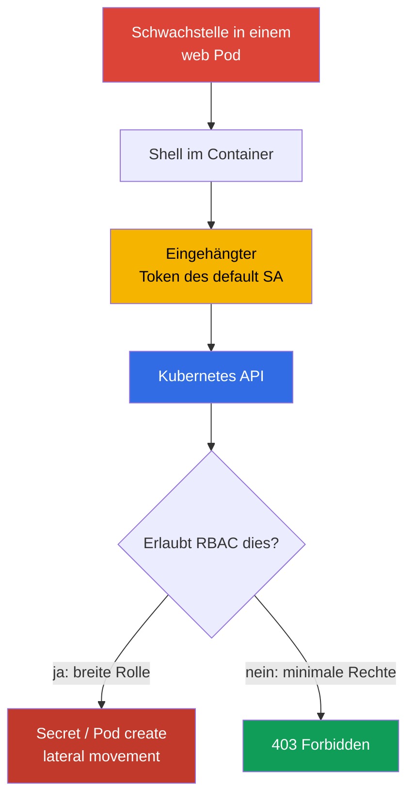
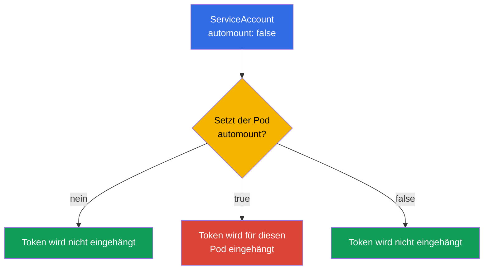
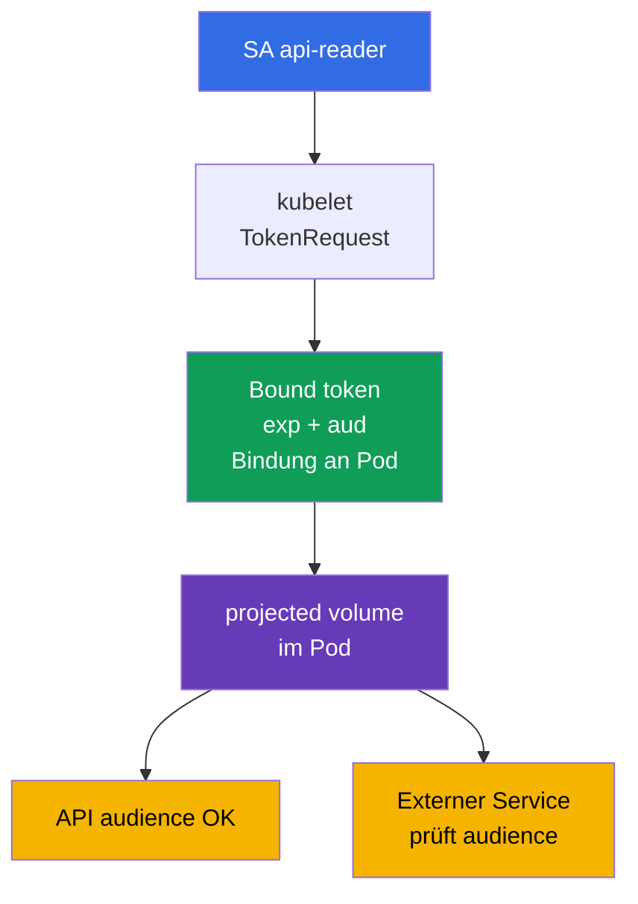

[Русская версия](ru.md) · [Eng version](README.md) · [Versión en español](es.md) · [Version française](fr.md) · [ქართული ვერსია](ge.md) · [繁體中文版](tw.md) · [日本語版](jp.md)

# Kapitel 11. ServiceAccounts: Minimierung und Token

> **Problem.** Eine Shell in einem verwundbaren Pod verschafft einem Angreifer Zugriff auf den eingehängten Bearer-Token des ServiceAccount. Ist der Token dem `default`-Account oder einer Identity mit übermäßigen RBAC-Rechten ausgestellt, kann er außerhalb des Containers zum Lesen von Secret, zum Erstellen von Pod und zur weiteren Eskalation in der API verwendet werden; auch ein short-lived Token ist während seiner Gültigkeit gefährlich.

> **Was als Nächstes kommt.** In Kapitel 10 haben wir Rechte durch RBAC reduziert. Jetzt beschränken wir die Identity, die ein Pod erhält: ServiceAccount und dessen Token. Ein überflüssiger Token in einem kompromittierten Container ist ein fertiger Zugang zur Kubernetes API; ein minimaler ServiceAccount und ein kurzlebiger Token verringern die Folgen eines Vorfalls. Dies ist die CKS-Domain Cluster Hardening (15%). Im nächsten Kapitel schließen wir den Zugang zur API zusätzlich für anonymous-Anfragen, Netzwerke und apiserver-Einstellungen.

> **Was Sie aus CKA brauchen.** Grundbegriffe von ServiceAccount, die Kette authn -> authz -> admission und das automatische Einhängen eines Token werden in [CKA-Kapitel 21](../../../cka/course/21/de.md) behandelt. Role, RoleBinding und die Prüfung von Rechten finden Sie in [CKA-Kapitel 38](../../../cka/course/38/de.md). Hier wiederholen wir nicht die Basissyntax, sondern wenden sie für least privilege an.

> 🧠 Ein Token in einem kompromittierten Pod ist eine Bearer-Credential des ServiceAccount: Sein Schaden wird nicht durch die Datei selbst bestimmt, sondern durch alle gegenwärtigen und zukünftigen RBAC-Rechte dieser Identity.

## 11.1. Angriffsszenario: Token des `default`-ServiceAccount in einem Pod

Jeder namespace enthält den ServiceAccount `default`. Wenn ein Pod keinen
`serviceAccountName` angibt, weist der admission controller genau diesen zu. Standardmäßig
wird auch der Token dieses SA in den Pod eingehängt. Ein Token allein bedeutet keine Rechte:
Die Autorisierung hängt weiterhin von RBAC ab. Ein gestohlener Token erlaubt es einem
Angreifer jedoch, diese Identity anzunehmen und **alle** Rechte zu nutzen, die ihr jetzt
erteilt sind oder später erteilt werden.

Ein typischer Angriffsweg: Eine Schwachstelle in der Anwendung liefert eine Shell im Pod,
der Angreifer liest den Token aus dem eingehängten volume und sendet ihn anschließend an die
API. Hat der `default` SA einen RoleBinding "der Einfachheit halber" erhalten oder ist er an
eine breite ClusterRole gebunden, lassen sich Secret lesen, Pod erstellen oder der Angriff
weiterführen. Auch ein Token ohne aktuelle Rechte wird von einem gewöhnlichen HTTP-Service
nicht benötigt und sollte nicht in dessen filesystem liegen.



Das Ziel des Hardening ist nicht, sich auf ein einzelnes control zu verlassen. Drei
unabhängige Maßnahmen sind nötig: keinen Token in einen Pod einhängen, der die API nicht
braucht; einen eigenen SA für einen Pod anlegen, der die API braucht; diesem SA nur die
erforderlichen RBAC-Aktionen geben. Die NetworkPolicy aus Kapitel 04 und die Beschränkung
des API-Zugriffs aus Kapitel 12 ergänzen, ersetzen diese Maßnahmen aber nicht.

> 🎯 Ohne API deaktivieren Sie automount; mit API verwenden Sie einen eigenen SA, einen short-lived bound Token und eine minimale Role/RoleBinding. Prüfen Sie danach Token und API-Rechte.

## 11.2. `automountServiceAccountToken`: standardmäßig deaktivieren

Das Feld `automountServiceAccountToken: false` hindert den ServiceAccount admission
controller daran, dem Pod das Standard-projected volume hinzuzufügen. Es kann am
ServiceAccount oder direkt in der `spec` des Pod gesetzt werden.



Der Wert auf Pod-Ebene hat Vorrang. Legt der Pod dieses Feld nicht fest, gilt der Wert des
ServiceAccount. Das sichere Muster ist daher, automount beim `default` SA des namespace und
bei neu angelegten SA standardmäßig zu deaktivieren und Ausnahmen erst nach der Prüfung,
dass der Pod die API wirklich benötigt, explizit im Pod-Manifest zu beschreiben.

```bash
# Für einen bereits vorhandenen namespace: Token beim default SA verbieten.
kubectl -n cks-104 patch serviceaccount default \
  -p '{"automountServiceAccountToken":false}'

# Sicherstellen, dass der neue Wert gespeichert ist.
kubectl -n cks-104 get serviceaccount default \
  -o jsonpath='{.automountServiceAccountToken}{"\n"}'
# false
```

Die Änderung entfernt das volume nicht aus einem bereits erstellten Pod: Erstellen Sie den
workload neu und prüfen Sie den neuen Pod. Das folgende Manifest schließt diesen Weg doppelt:
Bei seinem SA ist automount deaktiviert, und der Pod verbietet das Einhängen ebenfalls
explizit. Der Token gelangt überhaupt nicht in den Container, daher kann er bei einer
Kompromittierung der Anwendung nicht gestohlen werden. Das ist die richtige Variante für
eine Anwendung, die die Kubernetes API nicht aufruft.

```yaml
apiVersion: v1
kind: ServiceAccount
metadata:
  name: app-sa
  namespace: cks-104
automountServiceAccountToken: false
---
apiVersion: v1
kind: Pod
metadata:
  name: app-without-api
  namespace: cks-104
spec:
  serviceAccountName: app-sa
  automountServiceAccountToken: false
  containers:
  - name: app
    image: nginx:1.30.4
```

Verwechseln Sie das Fehlen eines Token nicht mit dem Fehlen eines ServiceAccount. Der Pod
hat weiterhin die Identity `app-sa`; nur wurde keine Credential in seinem filesystem
ausgestellt. Verlassen Sie sich auch nicht darauf, dass `automount: false` eine Anwendung
stoppt, der ein Token auf anderem Weg übergeben wurde - etwa über Secret, projected volume
oder eine Umgebungsvariable. Solche Quellen müssen gesondert ausgeschlossen werden.

> 🧠 JWT-Claims, audience, Rotation und die Prüfung des bound object begrenzen eine Token-Credential.

## 11.3. Bound ServiceAccount token und projected volume

In modernen Kubernetes erhält ein Pod einen **bound ServiceAccount token**, nicht ein
unbefristetes Secret mit Token. Kubelet fordert den Token über die TokenRequest API an. Der
Token ist an einen konkreten ServiceAccount gebunden, hat eine begrenzte Lebensdauer (`exp`)
und wird vor Ablauf automatisch rotiert. Das JWT enthält Claims zu issuer, subject
`system:serviceaccount:<ns>:<sa>` und bound object. Nach dem Löschen des gebundenen Pod darf
eine solche Credential nicht mehr als vertrauenswürdige gültige Credential gelten.

`audience` beschränkt den Empfänger des Token. Ein Token für die Kubernetes API muss eine
vom apiserver akzeptierte audience haben; ein Token für einen externen Service die audience
dieses Service. Der externe Service muss Signatur, `iss`, `aud`, Ablaufzeit und subject
prüfen. Verwenden Sie nicht einen Token "für alles": Das vergrößert den Bereich, in dem eine
gestohlene Credential zur Authentifizierung taugt.



Der folgende Pod erhält keinen impliziten Standard-mount. Stattdessen wird genau ein
projected volume eingehängt, das für den Aufruf der Kubernetes API benötigt wird:
kurzlebiger Token, CA und namespace. Legen Sie `https://kubernetes.default.svc` nicht als
universelle API-audience fest: Der apiserver akzeptiert Werte aus `--api-audiences`; fehlt
dieses Flag, wird die Liste aus `--service-account-issuer` abgeleitet. Ein Token mit dieser
Zeichenfolge führt daher in manchen Clustern zu `401`. Für Token gerade an die Kubernetes API
setzen Sie `audience` nicht explizit oder bestätigen zuerst die tatsächlichen
`--api-audiences`/`--service-account-issuer`; eine eigene audience setzen Sie für Vault oder
einen anderen externen Service.

```yaml
apiVersion: v1
kind: Pod
metadata:
  name: api-reader
  namespace: cks-104
spec:
  serviceAccountName: app-sa
  automountServiceAccountToken: false

  securityContext:
    runAsNonRoot: true
    runAsUser: 10001

  containers:
  - name: client
    image: curlimages/curl:8.12.1
    command: ["sh", "-c", "sleep 3600"]
    volumeMounts:
    - name: api-credential
      mountPath: /var/run/secrets/tokens
      readOnly: true
  volumes:
  - name: api-credential
    projected:
      defaultMode: 0444
      sources:
      - serviceAccountToken:
          path: token
          # Für die Kubernetes API wird audience nicht gesetzt: Der API server wählt sie.
          # Ein expliziter Wert ist erst nach Abgleich mit --api-audiences zulässig.
          expirationSeconds: 3600
      - configMap:
          name: kube-root-ca.crt
          items:
          - key: ca.crt
            path: ca.crt
      - downwardAPI:
          items:
          - path: namespace
            fieldRef:
              fieldPath: metadata.namespace
```

Das offizielle Image `curlimages/curl` startet den Prozess nicht als root (`running as
curl_user is an explicit design decision`, curl-docker README). Deshalb wird die runtime
identity in diesem Beispiel mit `runAsNonRoot: true` und `runAsUser: 10001` explizit gesetzt
und nicht allein den image metadata überlassen.

Für Linux Kubernetes v1.36 hat ein projected ServiceAccount token besondere permission
semantics: Wenn alle containers eines Pod denselben `runAsUser` verwenden, weist kubelet
den Token diesem UID zu und setzt den mode zwingend auf `0600`. In diesem Pod mit einem
Container ist der Token daher ohne `fsGroup` nur für UID `10001` als owner lesbar.

`defaultMode: 0444` wird für die mixed projection der nicht geheimen `ca.crt` und
`namespace` benötigt, die auch ein non-root client lesen muss. Es macht den Bearer-Token
nicht world-readable: Für `serviceAccountToken` wendet kubelet gesondert das zuvor
beschriebene `0600` an.

`fsGroup` ist hier nicht erforderlich. Wenn sie hinzugefügt wird, wendet kubelet group
ownership auf das volume an und erweitert die permissions für projected ServiceAccount
token von `0600` auf `0640`. Verwenden Sie solchen Gruppenzugriff nur, wenn ihn mehrere
Prozesse oder eine GID tatsächlich benötigen, nicht als Voraussetzung für non-root
`runAsUser`.

`expirationSeconds` ist eine Anfrage nach der gewünschten Lebensdauer, nicht ein Weg zu
einer unbefristeten Credential: Der Wert muss mindestens `600` betragen, die Obergrenze
bestimmt jedoch weiterhin die control plane. Kubelet aktualisiert die Token-Datei vor `exp`,
ein genauer universeller Rotationsintervall ist aber nicht garantiert. Die Anwendung muss
den Token-Pfad daher bei jeder neuen Verbindung oder Credential-Aktualisierung erneut
öffnen, statt alte Inhalte oder einen file descriptor im Speicher vorzuhalten. Geben Sie den
Token nicht im Terminal, in CI-Logs, einer Incident-Beschreibung oder einem Ticket aus. Für
eine kurzfristige manuelle Prüfung geben Sie einen eigenen Token mit kurzer duration aus:

```bash
# Für die Kubernetes API --audience nicht ohne Prüfung von --api-audiences angeben.
kubectl -n cks-104 create token app-sa --duration=10m
```

Für einen externen Service, bei dem die Aktualität der Bindung wichtig ist, wird
`TokenReview` über den apiserver empfohlen: Es prüft das Vorhandensein von ServiceAccount
und gebundenem Pod, Secret oder Node und lehnt einen bound Token nach dem Löschen des
entsprechenden Objekts unverzüglich ab. Eine Offline-Prüfung von OIDC/JWT prüft Signatur und
Claims, erfährt jedoch nichts vom Löschen: Ein solcher Token bleibt nur bis `exp` gültig.
Ist ein Objekt lediglich zum Löschen markiert (`deletionTimestamp`), lehnt der authenticator
den Token spätestens nach 60 Sekunden ab.

In Kubernetes v1.33+ ist `ServiceAccountNodeAudienceRestriction` Beta und standardmäßig
aktiviert. Die Beschränkung setzt das admission plugin `NodeRestriction` um: Wenn das
feature gate aktiviert ist, `NodeRestriction` aktiv ist und die TokenRequest-Anfrage von
einer erkannten node/kubelet identity kommt, kann kubelet standardmäßig nur audiences
anfordern, die bereits von workloads auf diesem Node verwendet werden. Für begründete
Ausnahmen kann ein Administrator das RBAC-verb `request-serviceaccounts-token-audience`
erteilen.

Diese Beschränkung betrifft ausschließlich kubelet/node identities; andere callers der
TokenRequest API werden dadurch nicht eingeschränkt.

Ein manuelles Secret vom Typ `kubernetes.io/service-account-token` erzeugt eine langlebige
Bearer-Credential. Kubernetes unterstützt diesen Weg offiziell weiterhin - etwa wenn eine
Integration wirklich einen Token ohne reguläre Ablaufzeit benötigt - die Upstream-
Dokumentation empfiehlt jedoch ausdrücklich, stattdessen TokenRequest zu verwenden.

Betrachten Sie ein solches Secret im Kurs als Ausnahme, nicht als normalen Weg zur Ausgabe
einer Credential: Bevorzugen Sie zuerst short-lived TokenRequest, OIDC oder federation.
Kann eine konkrete Integration nicht mit begrenzter lifetime arbeiten, dokumentieren Sie
den Grund der Ausnahme, minimales RBAC, den Schutz des Secret und das Verfahren für
Rotation/Widerruf. Erstellen Sie ein solches Secret nicht als normalen Weg, einem Pod Zugang
zur API zu geben: Es erhält keine automatische kurze Rotation und vergrößert bei Leaks den
Schaden stärker.

> 🔬 **Kubernetes v1.37: X.509 workload identity.** Bound ServiceAccount token bleibt das zentrale JWT-Identity-Modell dieses Kapitels. Kubernetes v1.37 hat außerdem Pod Certificates und ClusterTrustBundles stabilisiert - built-in primitives zur Ausgabe und Rotation von X.509 workload credentials. Dies ist eine production-current Erweiterung und kein Ersatz für CKS Core: siehe [Kubernetes v1.37 Security Delta](../APPENDIX_K8S_137_SECURITY_DELTA_DE.md).

## 11.4. Dedizierter ServiceAccount und minimales RBAC

Der `default` SA ist keine Anwendungsrolle. Legen Sie für jeden workload, der die API
benötigt, einen eigenen ServiceAccount an und geben Sie ihm minimale RBAC-Rechte.

Liegen die nötigen Ressourcen nur in einem namespace, verwenden Sie `Role` + `RoleBinding`.
Wenn ein wiederverwendbarer Regelsatz oder Zugang zu cluster-scoped resources nötig ist,
verwenden Sie `ClusterRole`. Um deren namespaced-Rechte nur in einem namespace zu vergeben,
binden Sie die `ClusterRole` über eine `RoleBinding`; für tatsächlich cluster-weiten Zugang
verwenden Sie `ClusterRoleBinding`.

In diesem Beispiel darf `app-sa` nur die Liste der Pod im namespace `cks-104` lesen: kein
`watch`, `create`, `delete`, Zugang zu Secret oder ClusterRoleBinding.

```yaml
apiVersion: v1
kind: ServiceAccount
metadata:
  name: app-sa
  namespace: cks-104
automountServiceAccountToken: false
---
apiVersion: rbac.authorization.k8s.io/v1
kind: Role
metadata:
  name: app-pod-reader
  namespace: cks-104
rules:
- apiGroups: [""]
  resources: ["pods"]
  verbs: ["get", "list"]
---
apiVersion: rbac.authorization.k8s.io/v1
kind: RoleBinding
metadata:
  name: app-sa-pod-reader
  namespace: cks-104
subjects:
- kind: ServiceAccount
  name: app-sa
  namespace: cks-104
roleRef:
  apiGroup: rbac.authorization.k8s.io
  kind: Role
  name: app-pod-reader
```

Wenden Sie dies an und prüfen Sie genau die erlaubte und die verbotene Aktion. `can-i`
prüft den authorizer als benötigtes subject und erfordert nicht, die Credential aus dem Pod
zu extrahieren.

```bash
kubectl apply -f app-sa-rbac.yaml

kubectl auth can-i list pods -n cks-104 \
  --as=system:serviceaccount:cks-104:app-sa
# yes
kubectl auth can-i delete pods -n cks-104 \
  --as=system:serviceaccount:cks-104:app-sa
# no
kubectl auth can-i get secrets -n cks-104 \
  --as=system:serviceaccount:cks-104:app-sa
# no
```

In diesem Beispiel beschränkt `RoleBinding` die vergebenen Rechte auf den namespace
`cks-104` und verweist auf eine namespaced `Role`.

Betrachten Sie `ClusterRoleBinding` nicht als mechanischen Ersatz für dieses Objekt:
`ClusterRoleBinding` kann nur auf eine `ClusterRole`, nicht auf eine `Role` verweisen. Um
vergleichbare Regeln cluster-weit zu erteilen, müsste zuerst eine `ClusterRole` definiert
und anschließend über `ClusterRoleBinding` gebunden werden.

Prüfen Sie beim Audit Regelsatz und scope des binding getrennt; fügen Sie wildcard `*`,
`secrets`, `pods/exec`, `bind`, `escalate` oder `impersonate` nicht ohne eine gesondert
begründete Aufgabe hinzu. Die gegenwärtigen und zukünftigen Rechte des SA lassen sich
regelmäßig mit dem Befehl aus Kapitel 10 prüfen:

```bash
kubectl auth can-i --list -n cks-104 \
  --as=system:serviceaccount:cks-104:app-sa
```

> 🧠 Das Erstellen oder Ändern eines workload erlaubt die Wahl eines fremden ServiceAccount und die Ausführung von Code mit dessen Token.

## 11.4.1. RBAC: Rechte auf workload können zur ServiceAccount-Eskalation werden

Das Recht, einen workload zu erstellen oder zu ändern, ist nicht nur das Recht, eine
Anwendung zu starten. Kann ein subject einen Pod/Deployment mit dem `serviceAccountName`
eines anderen, privilegierteren SA im selben namespace erstellen, kann es Code mit dem
Token und den API-Rechten dieses SA ausführen. Die eingebaute Rolle `edit` ist daher nicht
harmlos: Neben dem Ändern von workload und dem Lesen von Secret kann sie Pod im Namen jedes
ServiceAccount des namespace starten. Trennen Sie die Rechte eines deployer von den
Rechten zur Verwaltung von ServiceAccount und lassen Sie empfindliche SA nicht für normale
Ersteller von workload erreichbar.

Prüfen Sie weitere RBAC escalation paths getrennt von normalen read/write-Rechten: Das
Erstellen eines `PersistentVolume` kann einem Pod Zugang zu Daten oder einem host-Pfad
geben; das Erstellen/Genehmigen eines CSR kann eine neue Identity ausstellen; die Änderung
von `ValidatingWebhookConfiguration` oder `MutatingWebhookConfiguration` kann admission
control verändern. Die Rechte `bind`, `escalate`, `impersonate`, das Verwalten von
RoleBinding/ClusterRoleBinding und diese Wege werden nur getrennten administrativen Rollen
erteilt. Fügen Sie Benutzer nicht zu `system:masters` hinzu: Diese Gruppe erhält
unbegrenzten superuser-Zugang und umgeht RBAC und authorization webhooks.

In Kubernetes 1.36+ erweitert Constrained Impersonation das alte Modell eines einzelnen
verb `impersonate`: Es gelten getrennte Berechtigungen, einschließlich
`impersonate:user-info` und `impersonate-on:*`. Dies ist kein Grund, impersonation breiter
zu erteilen - beschränken Sie subject, Gruppen und scope und verwenden Sie für die Prüfung
eine getrennte minimale admin-role.

## 11.5. Prüfung und Diagnose: Token, API und RBAC

Die Prüfung muss zwei unabhängige Bedingungen belegen: Ein Pod ohne API-Aufgabe enthält
keinen Token, und ein Pod mit API-Aufgabe erhält nur die vorgegebene short-lived Credential
und nur die Berechtigungen seiner Role.

```bash
# Nach dem Erstellen von app-without-api darf der Token nicht existieren.
kubectl -n cks-104 exec app-without-api -- \
  test ! -e /var/run/secrets/kubernetes.io/serviceaccount/token

# api-reader hat keinen Standard-mount, aber einen explizit projizierten Token.
kubectl -n cks-104 exec api-reader -- sh -ec '
  test ! -e /var/run/secrets/kubernetes.io/serviceaccount/token
  test -r /var/run/secrets/tokens/token
  test -r /var/run/secrets/tokens/ca.crt
'

# Erlaubte Anfrage: Der Token wird nicht ausgegeben, curl liest ihn nur im Container.
kubectl -n cks-104 exec api-reader -- sh -ec '
  curl --fail --silent --show-error \
    --cacert /var/run/secrets/tokens/ca.crt \
    -H "Authorization: Bearer $(cat /var/run/secrets/tokens/token)" \
    https://kubernetes.default.svc/api/v1/namespaces/cks-104/pods >/dev/null
'
```

Trennen Sie zuerst transport, authentication und authorization.

- TLS/certificate error vor einer HTTP-Antwort: Prüfen Sie CA-Datei, DNS/SAN, endpoint und
  TLS-Erreichbarkeit.
- HTTP `401 Unauthorized`: Der API server hat die Credential nicht akzeptiert - prüfen Sie
  token path, Signatur/issuer, `audience`, `exp`/Zeit und die Integrität des Token.
- HTTP `403 Forbidden`: Die authentication war erfolgreich, aber der authorizer hat die
  Aktion nicht erlaubt - prüfen Sie Role/RoleBinding, namespace und gezieltes
  `kubectl auth can-i`.

Ist der Standard-Token nach der Änderung des SA weiterhin im Pod vorhanden, prüfen Sie
`spec.automountServiceAccountToken` am Pod selbst und erstellen ihn neu.

| Symptom | Was prüfen | Typische Ursache |
|---|---|---|
| Token ist in einer normalen Anwendung vorhanden | Pod spec und ServiceAccount | `automount: false` ist nicht gesetzt, oder der Pod überschreibt den SA explizit mit `true` |
| `can-i` liefert für eine erwartete Aktion `no` | `roleRef`, namespace, subject | RoleBinding liegt in einem anderen namespace oder SA-Name ist falsch |
| TLS/certificate error, kein HTTP status erhalten | CA, DNS/SAN, endpoint, TLS connectivity | Der Client konnte keine vertrauenswürdige TLS-Verbindung aufbauen |
| API antwortet `401` | token path, issuer/signature, `audience`, `exp`, Zeit | Credential ist abgelaufen, beschädigt oder wird vom authenticator nicht akzeptiert |
| API antwortet `403` | gezieltes `kubectl auth can-i`, Role/RoleBinding, namespace | Credential ist gültig, aber das benötigte verb/resource ist nicht erlaubt |
| In Git ist ein Token Secret erschienen | Git-Historie und CI-Logs | Ein legacy Secret wurde erstellt oder die Credential wurde von einem Befehl ausgegeben; widerrufen/neu ausstellen und aus Logs entfernen |

> 🏭 Ein eigener SA für jeden workload, regelmäßiges RBAC review sowie ein runbook zum Widerruf und zur Untersuchung von Credential-Leaks.

## 11.6. Anwendung in der Produktion

- **Deny by default für Token.** Das Platform Team deaktiviert
  `automountServiceAccountToken` beim `default` SA jedes Anwendungs-namespace. Ein
  workload, der keine API benötigt, setzt `automountServiceAccountToken: false` auch im
  Pod-Template, damit die Ausnahme im code review sichtbar ist.
- **Ein workload - ein SA.** Getrennte ServiceAccount und minimale RBAC bindings
  reduzieren den blast radius. Verwenden Sie für Rechte in einem namespace `RoleBinding`;
  sie kann auf eine lokale `Role` oder eine wiederverwendbare `ClusterRole` verweisen.
  `ClusterRoleBinding` verwenden Sie nur, wenn das subject wirklich cluster-weiten scope
  benötigt - für cluster-scoped resources und/oder gleiche namespaced permissions in allen
  namespaces.
- **Bound token statt statischem Secret.** Pod verwenden projected token mit kurzer
  Gültigkeit und enger audience. Für externe Systeme kommen TokenRequest, OIDC workload
  identity oder cloud federation zum Einsatz, statt ein service-account-token Secret zu
  kopieren.
- **Identity für die Cloud getrennt von Kubernetes RBAC.** IRSA, Workload Identity und
  ähnliche Mechanismen verbinden SA mit einer cloud-Rolle. Das ersetzt Kubernetes RBAC
  nicht: Prüfen Sie getrennt, welche API-Rechte und welche cloud permissions der workload
  erhält.
- **Kontrolle und Reaktion.** RBAC review, audit-logs und die Suche nach Token in
  Repositories/Logs müssen regelmäßig erfolgen. Bei einem Leak löschen Sie den
  kompromittierten Pod oder SA, entfernen das binding, erstellen den workload neu und
  untersuchen, welche Anfragen die Credential noch ausführen konnte.

## 11.7. Mini-Glossar

- **ServiceAccount (SA)** - namespaced Identity für Pod und Prozesse in der Kubernetes API.
- **default ServiceAccount** - SA, der einem Pod zugewiesen wird, wenn
  `serviceAccountName` nicht angegeben ist.
- **`automountServiceAccountToken`** - Flag, das das automatische Einhängen einer
  Credential in einen Pod erlaubt oder verbietet; der Wert des Pod hat Vorrang vor dem
  Wert des SA.
- **Bound ServiceAccount token** - ein kurzlebiger, von der TokenRequest API ausgestellter
  Token, der an ServiceAccount und Pod-Objekt gebunden ist.
- **projected volume** - volume, das Token, ConfigMap, downward API und andere Quellen in
  vorgegebene Dateien zusammenführt.
- **audience** - Empfänger eines Token; ein Service darf nur Token mit seiner audience
  akzeptieren.
- **TokenRequest API** - API zur Ausgabe short-lived ServiceAccount token.
- **RoleBinding** - namespaced Bindung einer Role oder ClusterRole an ein subject, etwa SA.

## 11.8. Zusammenfassung des Kapitels

- Ein Token des `default` SA in einem kompromittierten Pod ist eine Credential für die
  Kubernetes API; sein Schaden wird durch RBAC bestimmt, daher minimiert man Token und
  Rechte gemeinsam.
- `automountServiceAccountToken: false` deaktiviert die automatische Token-Ausgabe. Der
  Wert im Pod hat Vorrang vor dem Wert des ServiceAccount; bereits erstellte Pod müssen neu
  erstellt werden.
- Ein moderner Pod erhält einen bound projected Token mit begrenzter Lebensdauer und
  audience, den kubelet rotiert. Ein manuelles langlebiges ServiceAccount token Secret wird
  von Kubernetes weiterhin offiziell unterstützt, der Kurs behandelt es jedoch als
  dokumentierte Ausnahme und nicht als gewöhnlichen Weg zur Ausgabe einer Pod-Credential.
- Ein workload mit API-Zugang erhält einen eigenen SA, eine namespaced Role und RoleBinding
  mit genauen `verbs` und `resources`, nicht die Rechte des `default` SA oder wildcard.
- Die Prüfung umfasst das Fehlen eines Token im normalen Pod, `kubectl auth can-i` für den
  SA und einen echten API-Aufruf mit einer explizit projizierten Credential; `401` und `403`
  werden unterschiedlich diagnostiziert.

## 11.9. Nutzen für Prüfung und Praxis

**In der Prüfung.** Erstellen Sie schnell ServiceAccount, Role und RoleBinding und
bestätigen Sie dann Erlaubnis und Verbot mit
`kubectl auth can-i --as=system:serviceaccount:<ns>:<sa>`. Beachten Sie, wo automount
deaktiviert werden muss: am `default` SA des namespace oder im konkreten Pod. Prüfen Sie
das Fehlen der Token-Datei mit `kubectl exec`, nicht nur mit YAML. Lab 104 verbindet diese
Fähigkeit mit RBAC und der Begrenzung des anonymous-Zugangs zur API.

**In der Praxis.** ServiceAccount gehören zur attack surface jedes Pod. Die Richtlinie
"keine Token, bis die Notwendigkeit nachgewiesen ist" verringert zusammen mit eigenen
least-privilege SA den Schaden durch RCE in der Anwendung. Ein projected bound Token mit
kurzer lifetime und korrekter audience macht eine Credential enger und besser steuerbar,
ersetzt aber weder RBAC noch audit oder Netzwerkisolation.

## 11.10. Fragen zur Selbstkontrolle

<details>
<summary>1. Warum ist der Token des `default` SA selbst in einem Pod gefährlich, der derzeit keine Anfragen an die API stellt?</summary>

Ein Token ist eine Credential für die Identity des `default` ServiceAccount, auch wenn die
aktuelle Anwendung keine API aufruft. Nach RCE kann ein Angreifer den eingehängten Token
lesen und alle Rechte nutzen, die der SA jetzt hat oder später über RBAC erhält. Ein
gewöhnlicher HTTP-Service benötigt eine solche Credential nicht in seinem filesystem,
daher wird automount deaktiviert.
</details>

<details>
<summary>2. Wie verhalten sich `automountServiceAccountToken` am ServiceAccount und am Pod zueinander? Welcher Wert gilt bei einem Konflikt?</summary>

Gibt der Pod das Feld nicht an, gilt der Wert seines ServiceAccount. Der Wert in der `spec`
des Pod selbst hat Vorrang, sodass der Pod den mount unabhängig vom default des SA explizit
ein- oder ausschalten kann. Eine Änderung des SA entfernt das volume nicht aus einem bereits
erstellten Pod: Der workload muss neu erstellt und der neue Pod geprüft werden.
</details>

<details>
<summary>3. Warum ist ein bound projected Token sicherer als ein legacy Secret mit ServiceAccount token?</summary>

Ein bound Token wird von der TokenRequest API ausgegeben, ist an konkreten ServiceAccount
und Pod gebunden, hat `exp` und wird von kubelet vor Ablauf automatisch rotiert. Ein legacy
Secret erzeugt eine langlebige Credential ohne diese reguläre kurze Rotation und vergrößert
damit den Schaden eines Leaks. Nach dem Löschen des gebundenen Pod kann die bound Credential
ebenfalls nicht mehr als vertrauenswürdige gültige Credential gelten.
</details>

<details>
<summary>4. Was begrenzt `audience` und was muss ein Service prüfen, der einen Token annimmt?</summary>

`audience` begrenzt den Empfänger des Token: Ein Token für die Kubernetes API darf nicht
ohne Prüfung zum Token für externes Vault oder einen anderen Service werden. Ein externer
empfangender Service muss Signatur, `iss`, seine `aud`, Ablaufzeit und subject prüfen. Für
die Kubernetes API wird keine explizite audience gesetzt, ohne die tatsächlichen
`--api-audiences` oder `--service-account-issuer` bestätigt zu haben.
</details>

<details>
<summary>5. Warum erhält `app-sa` aus dem Beispiel eine RoleBinding und keine ClusterRoleBinding?</summary>

`app-sa` soll Pod nur im namespace `cks-104` lesen, daher gibt `RoleBinding` den richtigen
scope vor. In diesem Beispiel verweist sie auf `Role app-pod-reader`.
`ClusterRoleBinding` kann nicht auf diese `Role` verweisen; für die cluster-weite Variante
wären eine `ClusterRole` mit den nötigen Regeln und eine `ClusterRoleBinding` erforderlich.
Es ist wichtig, rules und binding scope zu unterscheiden: `RoleBinding` begrenzt erteilte
namespaced-Rechte auf ihren namespace, während `ClusterRoleBinding` Regeln einer
`ClusterRole` cluster-weit erteilt.
</details>

<details>
<summary>6. Wie unterscheidet man ein TLS-Problem, einen falschen Token (`401`) und unzureichende RBAC-Rechte (`403`)?</summary>

Ist TLS trust nicht aufgebaut, erhält der Client vor der HTTP authentication einen
certificate/TLS error: Prüfen Sie CA, DNS/SAN und endpoint. `401 Unauthorized` bedeutet,
dass der API server die HTTP request erhalten, die Credential aber nicht akzeptiert hat:
Prüfen Sie token path, issuer/signature, audience, expiry und Zeit. `403 Forbidden` bedeutet,
dass die authentication erfolgreich war, der authorizer aber resource/verb/scope nicht
erlaubt; dies bestätigen Sie mit gezieltem `kubectl auth can-i`.
</details>

<details>
<summary>7. Welche Prüfungen belegen, dass der standardmäßige automatische ServiceAccount token nicht in einen Pod ohne API-Aufgabe eingehängt ist?</summary>

Bestätigen Sie `automountServiceAccountToken: false` am ServiceAccount und in der spec eines
neuen Pod und berücksichtigen Sie den Vorrang des Pod-Feldes. Prüfen Sie anschließend im
Container, ob der Standardpfad fehlt:

```bash
test ! -e /var/run/secrets/kubernetes.io/serviceaccount/token
```

Erstellen Sie den Pod nach einer workload-Änderung neu und wiederholen Sie die Prüfung,
weil das bereits erstellte volume nicht automatisch verschwindet.

Dies belegt das Fehlen der **standardmäßigen automatischen Injektion**, nicht das Fehlen
jeder möglichen ServiceAccount-Credential. Lautet die requirement "Der Pod darf überhaupt
keinen SA token erhalten", prüfen Sie zusätzlich `volumes`, `projected.serviceAccountToken`,
Secret/env, sidecar/init-container und andere Mechanismen zur Ausgabe von Credentials.
</details>

<details>
<summary>8. **Rückblick (Kapitel 21).** Ein legacy ServiceAccount token wurde als Kubernetes `Secret` gespeichert. Worin unterscheidet sich die Bedrohung eines solchen Token von der eines gewöhnlichen application `Secret` aus Kapitel 21 (etwa `db-password`), und warum reduziert ein bound projected Token diese Bedrohung anders als encryption at rest die Bedrohung eines `Secret` in etcd reduziert?</summary>

Ein legacy ServiceAccount token ist eine Bearer-Credential, die es erlaubt, innerhalb seiner
RBAC als Identity in der Kubernetes API zu handeln; `db-password` öffnet gewöhnlich den
Zugang zu einem bestimmten Anwendungssystem. Ein bound projected Token verringert das Risiko
der Nutzung einer gestohlenen Credential durch Lebensdauer, audience, Bindung an den Pod und
Rotation. Encryption at rest schützt Secret-Daten in etcd, begrenzt aber weder einen bereits
eingehängten noch einen bereits gelesenen Token und ersetzt dessen kurzen lifecycle nicht.
</details>

## Praxis

Erstellen Sie in Lab 104 einen minimalen SA und RoleBinding, deaktivieren Sie automount beim
`default` SA und belegen Sie, dass ein Pod ohne Token keine Credential-Datei hat. Prüfen Sie
danach die Erlaubnis für `list pods` und das Verbot von `delete pods` mit
`kubectl auth can-i`. Das nächste Kapitel ergänzt den Schutz der API selbst: anonymous
access, authorization modes und Netzwerkgrenzen.

🧪 Lab 104 (RBAC, ServiceAccount und API-Beschränkung):
[tasks/cks/labs/104](../../labs/104/README_DE.MD)

🌐 Zusätzliche interaktive Übung (killer.sh/killercoda, externe Ressource): [serviceaccount-token-mounting](https://killercoda.com/killer-shell-cks/scenario/serviceaccount-token-mounting)

🎮 Killercoda (im Browser, ohne Installation): [Create Service Account For a Pod](https://killercoda.com/chadmcrowell/course/cka/create-sa-for-pod) · [Role and RoleBinding](https://killercoda.com/chadmcrowell/course/ckad/role-rolebinding)

---
[Inhaltsverzeichnis](../README_DE.md) · [Kapitel 10](../10/de.md) · [Kapitel 12](../12/de.md)
