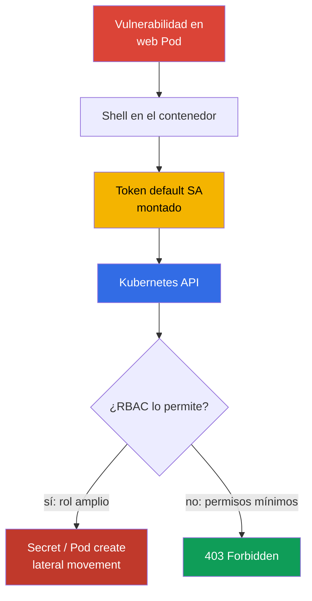
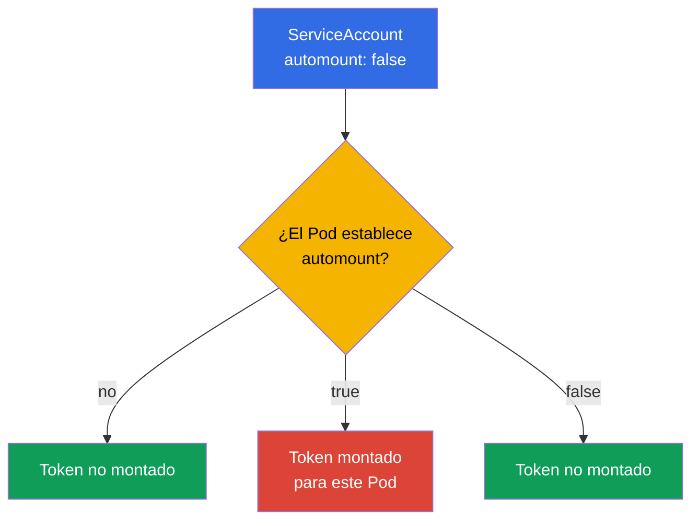
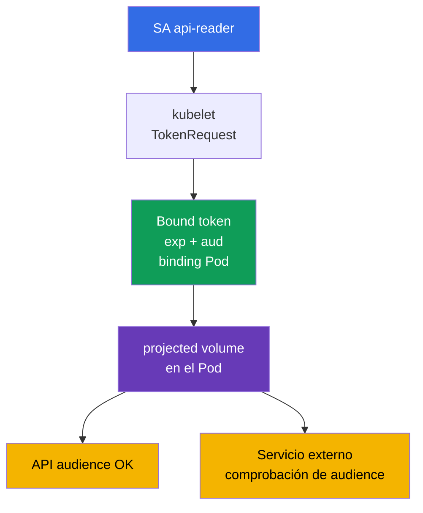

[Русская версия](ru.md) · [Eng version](README.md) · [Version française](fr.md) · [Deutsche Version](de.md) · [ქართული ვერსია](ge.md) · [繁體中文版](tw.md) · [日本語版](jp.md)

# Capítulo 11. ServiceAccounts: minimización y tokens

> **El problema.** Un shell en un Pod vulnerable da al atacante acceso al bearer token montado del ServiceAccount. Si el token se emite a la cuenta `default` o a una identity con RBAC excesivo, se puede usar fuera del contenedor para leer Secret, crear Pod y continuar la escalada en la API; incluso un short-lived token es peligroso durante su vigencia.

> **Qué sigue.** En el capítulo 10 reducimos permisos mediante RBAC. Ahora limitaremos la identity que recibe el Pod: ServiceAccount y su token. Un token innecesario en un contenedor comprometido es una entrada lista a Kubernetes API; un ServiceAccount mínimo y un short-lived token reducen el impacto del incidente. Es el dominio Cluster Hardening (15%) de CKS. En el próximo capítulo también restringiremos el acceso a API desde solicitudes anonymous, redes y ajustes de apiserver.

> **Lo necesario de CKA.** Los conceptos básicos de ServiceAccount, la cadena authn -> authz -> admission y el montaje automático de token se explican en el [capítulo 21 de CKA](../../../cka/course/21/es.md). Role, RoleBinding y la comprobación de permisos, en el [capítulo 38 de CKA](../../../cka/course/38/es.md). Aquí no repetimos la sintaxis básica, sino que la aplicamos a least privilege.

> 🧠 Un token en un Pod comprometido es una bearer credential de ServiceAccount: su daño no lo determina el archivo mismo, sino todos los permisos RBAC actuales y futuros de esa identity.

## 11.1. Escenario de ataque: token del ServiceAccount `default` en un Pod

Cada namespace contiene el ServiceAccount `default`. Si un Pod no indica `serviceAccountName`, el admission controller asigna precisamente este. De forma predeterminada, el token de ese SA también se monta en el Pod. El token por sí solo no implica permisos: la autorización sigue dependiendo de RBAC. Pero un token robado permite al atacante convertirse en esa identity y usar **todos** los permisos que tiene ahora o que reciba después.

Una ruta típica: una vulnerabilidad de aplicación da shell en un Pod, el atacante lee el token del volumen montado y después lo envía a la API. Si el SA `default` recibió un RoleBinding «por comodidad» o está vinculado a una ClusterRole amplia, se pueden leer Secret, crear Pod o prolongar el ataque. Incluso un token sin permisos actuales no es necesario para un servicio HTTP normal y no debe estar en su filesystem.



El objetivo del hardening no es confiar en un solo control. Se necesitan tres medidas independientes: no montar token en un Pod que no necesita API; asignar un SA independiente al Pod que sí necesita API; conceder a ese SA solamente las acciones RBAC necesarias. NetworkPolicy del capítulo 04 y la restricción de acceso a API del capítulo 12 complementan estas medidas, pero no las sustituyen.

> 🎯 Sin API, desactive automount; con API, use SA dedicado, short-lived bound token y Role/RoleBinding mínimos; después compruebe token y permisos API.

## 11.2. `automountServiceAccountToken`: desactivar por defecto

El campo `automountServiceAccountToken: false` impide que el admission controller de ServiceAccount agregue el projected volume estándar al Pod. Se puede establecer en ServiceAccount o directamente en el `spec` del Pod.



El valor en el nivel Pod tiene prioridad. Si el Pod no establece este campo, se utiliza el valor del ServiceAccount. Por ello, el patrón seguro es desactivar automount en el SA `default` del namespace y en los SA creados de forma predeterminada, y describir excepciones explícitamente en el manifiesto Pod solo tras comprobar que realmente necesita API.

```bash
# Para un namespace existente: prohibir el token del SA default.
kubectl -n cks-104 patch serviceaccount default \
  -p '{"automountServiceAccountToken":false}'

# Confirmar que se ha registrado el valor nuevo.
kubectl -n cks-104 get serviceaccount default \
  -o jsonpath='{.automountServiceAccountToken}{"\n"}'
# false
```

El cambio no elimina el volume de un Pod ya creado: recree el workload y compruebe el Pod nuevo. El siguiente manifiesto cierra esta vía dos veces: su SA tiene automount desactivado y el Pod también prohíbe explícitamente el montaje. El token no llega en absoluto al contenedor, así que no hay nada que robar cuando la aplicación es comprometida. Es la variante correcta para una aplicación que no llama a Kubernetes API.

```yaml
apiVersion: v1
kind: ServiceAccount
metadata:
  name: app-sa
  namespace: cks-104
automountServiceAccountToken: false
---
apiVersion: v1
kind: Pod
metadata:
  name: app-without-api
  namespace: cks-104
spec:
  serviceAccountName: app-sa
  automountServiceAccountToken: false
  containers:
  - name: app
    image: nginx:1.30.4
```

No confunda la ausencia de token con la ausencia de ServiceAccount. El Pod sigue teniendo la identity `app-sa`; simplemente no se emitió la credential en su filesystem. Tampoco espere que `automount: false` detenga una aplicación a la que se entregó token por otra vía - mediante Secret, projected volume o variable de entorno. Tales fuentes deben excluirse por separado.

> 🧠 Los claims JWT, audience, rotación y comprobación del bound object definen los límites de la token credential.

## 11.3. Bound ServiceAccount token y projected volume

En Kubernetes modernos, un Pod recibe un **bound ServiceAccount token**, no un Secret de token sin vencimiento. Kubelet solicita el token mediante TokenRequest API; está vinculado a un ServiceAccount concreto, tiene vigencia limitada (`exp`) y rota automáticamente antes de vencer. JWT incluye claims de issuer, subject `system:serviceaccount:<ns>:<sa>` y bound object. Al eliminar el Pod vinculado, no se puede considerar que tal credential siga siendo una credential confiable activa.

`audience` limita el destinatario del token. Un token para Kubernetes API debe tener una audience aceptada por apiserver; un token para un servicio externo debe tener la audience de ese servicio. El servicio externo debe comprobar firma, `iss`, `aud`, vigencia y subject. No use un token «para todo»: amplía el ámbito donde una credential robada sirve para autenticación.



El Pod siguiente no recibe el mount estándar implícito. En su lugar monta exactamente un projected volume para llamar a Kubernetes API: short-lived token, CA y namespace. No fije `https://kubernetes.default.svc` como audience API universal: apiserver acepta valores de `--api-audiences`, y sin ese flag la lista se deriva de `--service-account-issuer`. Por tanto, un token con esta cadena dará `401` en parte de los clústeres. Para un token dirigido a Kubernetes API no establezca `audience` explícitamente, o confirme antes los `--api-audiences`/`--service-account-issuer` efectivos; establezca una audience separada para Vault u otro servicio externo.

```yaml
apiVersion: v1
kind: Pod
metadata:
  name: api-reader
  namespace: cks-104
spec:
  serviceAccountName: app-sa
  automountServiceAccountToken: false

  securityContext:
    runAsNonRoot: true
    runAsUser: 10001

  containers:
  - name: client
    image: curlimages/curl:8.12.1
    command: ["sh", "-c", "sleep 3600"]
    volumeMounts:
    - name: api-credential
      mountPath: /var/run/secrets/tokens
      readOnly: true
  volumes:
  - name: api-credential
    projected:
      defaultMode: 0444
      sources:
      - serviceAccountToken:
          path: token
          # Para Kubernetes API no se establece audience: la elige API server.
          # Un valor explícito solo se permite tras contrastarlo con --api-audiences.
          expirationSeconds: 3600
      - configMap:
          name: kube-root-ca.crt
          items:
          - key: ca.crt
            path: ca.crt
      - downwardAPI:
          items:
          - path: namespace
            fieldRef:
              fieldPath: metadata.namespace
```

La imagen oficial `curlimages/curl` ejecuta el proceso sin root (`running as curl_user is an explicit design decision`, curl-docker README), por lo que la runtime identity del ejemplo se establece explícitamente mediante `runAsNonRoot: true` y `runAsUser: 10001`, y no queda solo al criterio de image metadata.

Para Linux Kubernetes v1.36, el projected ServiceAccount token tiene permission semantics especiales: cuando todos los containers del Pod usan el mismo `runAsUser`, kubelet asigna el token a ese UID e impone el mode `0600`. Así, en este Pod de un contenedor, el token pasa a ser owner-readable solo para UID `10001` sin `fsGroup`.

`defaultMode: 0444` es necesario para la mixed projection de `ca.crt` y `namespace` no secretos, que el client non-root también debe leer. No vuelve la bearer token world-readable: para `serviceAccountToken`, kubelet aplica por separado el `0600` descrito antes.

Aquí no se requiere `fsGroup`. Si se agrega, kubelet aplica group ownership al volume y, para projected ServiceAccount token, extiende los permissions de `0600` a `0640`. Use tal acceso de grupo solamente cuando de verdad lo necesiten varios procesos o un GID, no como requisito obligatorio para non-root `runAsUser`.

`expirationSeconds` es una solicitud de vigencia deseada, no una forma de obtener una credential sin vencimiento: el valor debe ser al menos `600`, pero el límite lo define el control plane. Kubelet actualiza el archivo token antes de `exp`, pero no se garantiza un intervalo de rotación universal exacto. Por ello, la aplicación debe reabrir la ruta del token en cada nueva conexión o cuando se actualice la credential, y no guardar contenido antiguo ni un descriptor de archivo en memoria. No imprima token en la terminal, CI logs, descripción de incidente o ticket. Para una comprobación manual temporal, emita un token separado y establezca una duration corta:

```bash
# Para Kubernetes API no establezca --audience sin comprobar --api-audiences.
kubectl -n cks-104 create token app-sa --duration=10m
```

Para un servicio externo para el que importa la vigencia de la vinculación, se recomienda `TokenReview` mediante apiserver: comprueba la existencia del ServiceAccount y del Pod, Secret o Node vinculados, y rechaza inmediatamente un bound token tras eliminar el objeto correspondiente. La comprobación offline OIDC/JWT comprueba firma y claims, pero no conoce la eliminación: dicho token permanece válido solo hasta `exp`. Si el objeto solo se marca para eliminación (`deletionTimestamp`), authenticator rechazará el token a más tardar tras 60 segundos.

En Kubernetes v1.33+, `ServiceAccountNodeAudienceRestriction` es Beta y está activada por defecto. La restricción la aplica el admission plugin `NodeRestriction`: cuando el feature gate está activado, `NodeRestriction` está activo y la solicitud TokenRequest procede de una identity node/kubelet reconocida, kubelet por defecto solo puede solicitar las audiences ya usadas por workloads en ese Node. Para excepciones justificadas, el administrador puede conceder el RBAC verb `request-serviceaccounts-token-audience`.

Esta restricción se refiere precisamente a kubelet/node identities; no restringe otros callers de TokenRequest API.

Un Secret manual de tipo `kubernetes.io/service-account-token` crea una bearer credential de larga duración. Kubernetes aún admite oficialmente esta forma - por ejemplo, cuando una integración realmente necesita un token sin vigencia estándar -, pero la documentación upstream recomienda expresamente usar TokenRequest en su lugar.

Para el curso, considere tal Secret una excepción, no el modo normal de emitir credential: primero prefiera TokenRequest short-lived, OIDC o federation. Si una integración concreta no puede trabajar con lifetime limitado, documente el motivo de la excepción, el RBAC mínimo, la protección del Secret y el procedimiento de rotación/revocación. No cree tal Secret como forma ordinaria de dar a un Pod acceso a API: no recibe rotación corta automática y aumenta más el daño si se filtra.

> 🔬 **Kubernetes v1.37: X.509 workload identity.** Bound ServiceAccount token sigue siendo el modelo principal de JWT identity de este capítulo. Kubernetes v1.37 también estabilizó Pod Certificates y ClusterTrustBundles - built-in primitives para emisión y rotación de X.509 workload credentials. Es una production-current extension, no un reemplazo de CKS Core: consulte [Kubernetes v1.37 Security Delta](../APPENDIX_K8S_137_SECURITY_DELTA_ES.md).

## 11.4. ServiceAccount dedicado y RBAC mínimo

El SA `default` no es un rol de aplicación. Para cada workload que necesita API, cree un ServiceAccount independiente y concédale los permisos RBAC mínimos.

Si los resources requeridos están solo en un namespace, use `Role` + `RoleBinding`. Si necesita un conjunto de reglas reusable o acceso a cluster-scoped resources, use `ClusterRole`. Para conceder sus permisos namespaced solo en un namespace, vincule `ClusterRole` mediante `RoleBinding`; para acceso realmente cluster-wide, use `ClusterRoleBinding`.

En este ejemplo, `app-sa` solo puede leer la lista de Pod en el namespace `cks-104`: nada de `watch`, `create`, `delete`, acceso a Secret ni ClusterRoleBinding.

```yaml
apiVersion: v1
kind: ServiceAccount
metadata:
  name: app-sa
  namespace: cks-104
automountServiceAccountToken: false
---
apiVersion: rbac.authorization.k8s.io/v1
kind: Role
metadata:
  name: app-pod-reader
  namespace: cks-104
rules:
- apiGroups: [""]
  resources: ["pods"]
  verbs: ["get", "list"]
---
apiVersion: rbac.authorization.k8s.io/v1
kind: RoleBinding
metadata:
  name: app-sa-pod-reader
  namespace: cks-104
subjects:
- kind: ServiceAccount
  name: app-sa
  namespace: cks-104
roleRef:
  apiGroup: rbac.authorization.k8s.io
  kind: Role
  name: app-pod-reader
```

Aplique y compruebe precisamente la acción permitida y la prohibida. `can-i` comprueba el authorizer como el sujeto requerido y no exige extraer la credential del Pod.

```bash
kubectl apply -f app-sa-rbac.yaml

kubectl auth can-i list pods -n cks-104 \
  --as=system:serviceaccount:cks-104:app-sa
# yes
kubectl auth can-i delete pods -n cks-104 \
  --as=system:serviceaccount:cks-104:app-sa
# no
kubectl auth can-i get secrets -n cks-104 \
  --as=system:serviceaccount:cks-104:app-sa
# no
```

En este ejemplo, `RoleBinding` limita los permisos concedidos al namespace `cks-104` y referencia una `Role` namespaced.

No considere `ClusterRoleBinding` un sustituto mecánico de este objeto: `ClusterRoleBinding` solo puede referenciar `ClusterRole`, no `Role`. Para conceder reglas análogas cluster-wide, primero habría que definir `ClusterRole` y después vincularla mediante `ClusterRoleBinding`.

En la auditoría, compruebe por separado el conjunto de reglas y el scope del binding; no añada wildcard `*`, `secrets`, `pods/exec`, `bind`, `escalate` o `impersonate` sin una tarea independiente justificada. Es útil comprobar periódicamente los permisos actuales y futuros del SA mediante el comando del capítulo 10:

```bash
kubectl auth can-i --list -n cks-104 \
  --as=system:serviceaccount:cks-104:app-sa
```

> 🧠 Crear o modificar un workload permite elegir el ServiceAccount de otra persona y ejecutar código con su token.

## 11.4.1. RBAC: los permisos sobre workload pueden convertirse en escalada de ServiceAccount

El permiso para crear o modificar workloads no es solo un permiso para iniciar una aplicación. Si un sujeto puede crear Pod/Deployment con `serviceAccountName` de otro SA más privilegiado en el mismo namespace, puede ejecutar código con el token y los permisos API de ese SA. Por ello, el rol integrado `edit` no puede considerarse inocuo: además de modificar workload y leer Secret, puede iniciar Pod en nombre de cualquier ServiceAccount del namespace. Separe permisos de deployer y los de gestión de ServiceAccount, y no deje los SA sensibles disponibles a creadores de workload ordinarios.

Compruebe otros RBAC escalation paths por separado de los permisos read/write normales: crear `PersistentVolume` puede dar a un Pod acceso a datos o una ruta de host; crear/aprobar CSR puede emitir una identity nueva; modificar `ValidatingWebhookConfiguration` o `MutatingWebhookConfiguration` puede cambiar admission control. Los permisos `bind`, `escalate`, `impersonate`, la gestión de RoleBinding/ClusterRoleBinding y estas vías se conceden solo a roles administrativos separados. No añada usuarios a `system:masters`: este grupo recibe acceso superuser ilimitado y evita RBAC y authorization webhooks.

En Kubernetes 1.36+, Constrained Impersonation amplía el modelo anterior de un solo verb `impersonate`: se aplican permisos distintos, incluidos `impersonate:user-info` e `impersonate-on:*`. Esto no es motivo para conceder impersonation de forma más amplia - restrinja sujeto, grupos y scope, y para comprobar use una admin-role mínima separada.

## 11.5. Comprobación y diagnóstico: token, API y RBAC

La comprobación debe demostrar dos condiciones independientes: el Pod sin tarea API no contiene token, y el Pod con tarea API recibe solo la short-lived credential indicada y únicamente los permisos de su Role.

```bash
# Después de crear app-without-api: token no debe existir.
kubectl -n cks-104 exec app-without-api -- \
  test ! -e /var/run/secrets/kubernetes.io/serviceaccount/token

# api-reader no tiene el mount estándar, pero sí token proyectado explícitamente.
kubectl -n cks-104 exec api-reader -- sh -ec '
  test ! -e /var/run/secrets/kubernetes.io/serviceaccount/token
  test -r /var/run/secrets/tokens/token
  test -r /var/run/secrets/tokens/ca.crt
'

# Solicitud permitida: token no se imprime; curl solo lo lee dentro del contenedor.
kubectl -n cks-104 exec api-reader -- sh -ec '
  curl --fail --silent --show-error \
    --cacert /var/run/secrets/tokens/ca.crt \
    -H "Authorization: Bearer $(cat /var/run/secrets/tokens/token)" \
    https://kubernetes.default.svc/api/v1/namespaces/cks-104/pods >/dev/null
'
```

Primero distinga transport, authentication y authorization.

- TLS/certificate error antes de respuesta HTTP: compruebe CA file, DNS/SAN, endpoint y conectividad TLS.
- HTTP `401 Unauthorized`: API server no aceptó la credential - compruebe token path, firma/issuer, `audience`, `exp`/hora e integridad del token.
- HTTP `403 Forbidden`: authentication fue correcta, pero authorizer no permitió la acción - compruebe Role/RoleBinding, namespace y `kubectl auth can-i` targeted.

Si el Pod aún tiene el token estándar tras cambiar el SA, compruebe `spec.automountServiceAccountToken` del propio Pod y recréelo.

| Síntoma | Qué comprobar | Causa típica |
|---|---|---|
| Token presente en una aplicación normal | Pod spec y ServiceAccount | No se estableció `automount: false`, o el Pod anuló explícitamente el SA con `true` |
| `can-i` devuelve `no` para una acción esperada | `roleRef`, namespace, subject | RoleBinding en otro namespace o nombre de SA incorrecto |
| TLS/certificate error, no se recibe HTTP status | CA, DNS/SAN, endpoint, TLS connectivity | El cliente no pudo establecer una conexión TLS confiable |
| API responde `401` | token path, issuer/signature, `audience`, `exp`, hora | La credential venció, está dañada o authenticator no la acepta |
| API responde `403` | `kubectl auth can-i` targeted, Role/RoleBinding, namespace | La credential es válida, pero no se permite el verb/resource requerido |
| Token Secret aparece en Git | historial Git y CI logs | Se creó Secret legacy o una credential se imprimió mediante un comando; revóquela/reemítala y elimínela de logs |

> 🏭 SA separado por workload, RBAC review periódico y runbook de revocación e investigación de filtraciones de credential.

## 11.6. Cómo se aplica en production

- **Deny by default para token.** El platform team desactiva `automountServiceAccountToken` en el SA `default` de cada namespace de aplicación. El workload que no necesita API fija `automountServiceAccountToken: false` también en el template Pod, para que la excepción sea visible en code review.
- **Un workload - un SA.** ServiceAccount separados y RBAC bindings mínimos reducen el blast radius. Para permisos de un namespace use `RoleBinding`; puede referenciar `Role` local o `ClusterRole` reusable. Use `ClusterRoleBinding` solo cuando el sujeto necesite realmente cluster-wide scope - para cluster-scoped resources y/o iguales namespaced permissions en todos los namespaces.
- **Bound token en vez de secret estático.** Los Pod usan projected token de vigencia corta y audience estrecha. Para sistemas externos use TokenRequest, OIDC workload identity o cloud federation, no copie service-account-token Secret.
- **Identity de cloud separada de Kubernetes RBAC.** IRSA, Workload Identity y mecanismos similares vinculan SA a un rol cloud. Esto no anula Kubernetes RBAC: compruebe por separado qué permisos API y qué cloud permissions recibe el workload.
- **Control y respuesta.** RBAC review, audit logs y la búsqueda de token en repositorios/logs deben ser regulares. En una filtración, elimine el Pod o SA comprometido, retire binding, recree workload e investigue qué solicitudes llegó a ejecutar la credential.

## 11.7. Mini glosario

- **ServiceAccount (SA)** - identity namespaced para Pod y procesos en Kubernetes API.
- **default ServiceAccount** - SA asignado al Pod si no se especifica `serviceAccountName`.
- **`automountServiceAccountToken`** - flag que permite o prohíbe el montaje automático de credential en un Pod; el valor Pod tiene prioridad sobre el valor SA.
- **Bound ServiceAccount token** - token de corta duración emitido por TokenRequest API y vinculado a ServiceAccount y objeto Pod.
- **projected volume** - volume que reúne token, ConfigMap, downward API y otras fuentes en archivos indicados.
- **audience** - destinatario del token; el servicio debe aceptar solo token con su propia audience.
- **TokenRequest API** - API que emite short-lived ServiceAccount token.
- **RoleBinding** - vinculación namespaced de Role o ClusterRole con un sujeto, por ejemplo SA.

## 11.8. Resumen del capítulo

- El token del SA `default` en un Pod comprometido es una credential para Kubernetes API; su daño lo determina RBAC, por ello token y permisos se minimizan juntos.
- `automountServiceAccountToken: false` desactiva la emisión automática de token. El valor en Pod tiene prioridad sobre el ServiceAccount; los Pod ya creados deben recrearse.
- Un Pod moderno recibe bound projected token con vigencia y audience limitadas, y kubelet lo rota. Kubernetes todavía admite oficialmente un ServiceAccount token Secret manual de larga duración, pero el curso lo considera una excepción documentada, no el modo usual de emitir credential al Pod.
- Un workload con acceso a API recibe SA separado, Role namespaced y RoleBinding con `verbs` y `resources` precisos, no permisos del SA `default` ni wildcard.
- La comprobación incluye ausencia de token en un Pod normal, `kubectl auth can-i` para el SA y una llamada API real con credential proyectada explícitamente; `401` y `403` se diagnostican de modo distinto.

## 11.9. Cómo sirve esto: en el examen y el trabajo real

**En el examen.** Cree rápidamente ServiceAccount, Role y RoleBinding, y después confirme permiso y prohibición mediante `kubectl auth can-i --as=system:serviceaccount:<ns>:<sa>`. Fíjese dónde se debe desactivar automount: en el SA `default` del namespace o en el Pod concreto. Compruebe la ausencia del archivo token mediante `kubectl exec`, no solo YAML. La lab 104 reúne esta destreza con RBAC y la restricción de acceso anonymous a API.

**En el trabajo real.** ServiceAccount forma parte de la attack surface de cada Pod. La policy «no hay tokens hasta que se pruebe la necesidad» junto con SA least-privilege separados reduce el daño de RCE en la aplicación. Un projected bound token con lifetime corto y audience correcta hace la credential más estrecha y controlable, pero no anula RBAC, audit ni aislamiento de red.

## 11.10. Preguntas de autoevaluación

<details>
<summary>1. ¿Por qué el token del SA `default` es peligroso incluso en un Pod que ahora no hace solicitudes a API?</summary>

El token es una credential para la identity del ServiceAccount `default`, aunque la aplicación actual no llame a API. Tras RCE, un atacante puede leer el token montado y usar todos los permisos que el SA tiene ahora o recibirá después mediante RBAC. Un servicio HTTP normal no necesita tal credential en su filesystem, por lo que se desactiva automount.
</details>

<details>
<summary>2. ¿Cómo se relacionan `automountServiceAccountToken` en ServiceAccount y Pod? ¿Qué valor se aplica ante un conflicto?</summary>

Si el Pod no indica el campo, se aplica el valor de su ServiceAccount. El valor del `spec` del propio Pod tiene prioridad, por lo que el Pod puede activar o desactivar explícitamente el mount, con independencia del default del SA. Cambiar el SA no elimina el volume de un Pod creado: hay que recrear el workload y comprobar el Pod nuevo.
</details>

<details>
<summary>3. ¿Por qué un bound projected token es más seguro que un Secret legacy con ServiceAccount token?</summary>

Un bound token lo emite TokenRequest API, está vinculado a ServiceAccount y Pod concretos, tiene `exp` y kubelet lo rota automáticamente antes de vencer. Un Secret legacy crea una credential de larga duración sin esa rotación corta estándar y por eso aumenta el daño de una filtración. Al eliminar el Pod vinculado, tampoco se puede considerar confiable una bound credential activa.
</details>

<details>
<summary>4. ¿Qué limita `audience` y qué debe comprobar el servicio que acepta token?</summary>

`audience` limita el destinatario del token: un token para Kubernetes API no debe convertirse sin comprobación en token para Vault externo u otro servicio. El servicio externo receptor debe comprobar firma, `iss`, su `aud`, vigencia y subject. Para Kubernetes API no se establece audience explícita sin confirmar los `--api-audiences` o `--service-account-issuer` efectivos.
</details>

<details>
<summary>5. ¿Por qué `app-sa` del ejemplo recibe RoleBinding y no ClusterRoleBinding?</summary>

`app-sa` debe leer Pod solo en el namespace `cks-104`, así que `RoleBinding` da el scope correcto. En este ejemplo referencia `Role app-pod-reader`. `ClusterRoleBinding` no puede referenciar esta `Role`; para una variante cluster-wide se necesitarían `ClusterRole` con las reglas requeridas y `ClusterRoleBinding`. Es importante distinguir rules y binding scope: `RoleBinding` limita los permisos namespaced concedidos a su namespace, mientras `ClusterRoleBinding` concede reglas `ClusterRole` cluster-wide.
</details>

<details>
<summary>6. ¿Cómo distinguir un problema TLS, token incorrecto (`401`) y permisos RBAC insuficientes (`403`)?</summary>

Sin TLS trust, el cliente recibe certificate/TLS error antes de HTTP authentication: se comprueban CA, DNS/SAN y endpoint. `401 Unauthorized` significa que API server recibió HTTP request, pero no aceptó credential: compruebe token path, issuer/signature, audience, expiry y hora. `403 Forbidden` significa que authentication fue correcta, pero authorizer no permitió resource/verb/scope; confírmelo con `kubectl auth can-i` targeted.
</details>

<details>
<summary>7. ¿Qué comprobaciones demuestran que el ServiceAccount token automático estándar no está montado en un Pod sin tarea API?</summary>

Confirme `automountServiceAccountToken: false` en ServiceAccount y en el spec del Pod nuevo, considerando la prioridad del campo Pod. Después, compruebe en el contenedor la ausencia de la ruta estándar:

```bash
test ! -e /var/run/secrets/kubernetes.io/serviceaccount/token
```

Tras cambiar el workload, recree el Pod y repita la comprobación, porque el volume ya creado no desaparece automáticamente.

Esto demuestra la ausencia de la **inyección automática estándar**, no la ausencia de cualquier ServiceAccount credential posible. Si el requirement es «el Pod no debe recibir ningún SA token», revise además `volumes`, `projected.serviceAccountToken`, Secret/env, sidecar/init-container y otros mecanismos de entrega de credential.
</details>

<details>
<summary>8. **Flashback (capítulo 21).** Legacy ServiceAccount token se almacenaba como Kubernetes `Secret`. ¿Cómo difiere la amenaza de este token de la de un application `Secret` ordinario del capítulo 21 (por ejemplo, `db-password`), y por qué bound projected token reduce esta amenaza de forma distinta a como encryption at rest reduce la amenaza para `Secret` en etcd?</summary>

Legacy ServiceAccount token es una bearer credential que permite actuar como una identity en Kubernetes API dentro de sus RBAC; `db-password` normalmente abre acceso a un sistema de aplicación concreto. Bound projected token reduce el riesgo de usar una credential robada mediante vigencia, audience, vinculación a Pod y rotación. Encryption at rest protege los datos Secret en etcd, pero no limita un token ya montado o leído ni reemplaza su lifecycle corto.
</details>

## Práctica

En la lab 104, cree un SA y RoleBinding mínimos, desactive automount en SA `default` y demuestre que un Pod sin token no tiene el archivo credential. Después compruebe el permiso `list pods` y la prohibición `delete pods` mediante `kubectl auth can-i`. El capítulo siguiente añade la protección de la propia API: anonymous access, authorization modes y límites de red.

🧪 Lab 104 (RBAC, ServiceAccount y restricción de API):
[tasks/cks/labs/104](../../labs/104/README_ES.MD)

🌐 Práctica interactiva adicional (killer.sh/killercoda, recurso externo): [serviceaccount-token-mounting](https://killercoda.com/killer-shell-cks/scenario/serviceaccount-token-mounting)

🎮 Killercoda (en el navegador, sin instalación): [Create Service Account For a Pod](https://killercoda.com/chadmcrowell/course/cka/create-sa-for-pod) · [Role and RoleBinding](https://killercoda.com/chadmcrowell/course/ckad/role-rolebinding)

---
[Índice](../README_ES.md) · [Capítulo 10](../10/es.md) · [Capítulo 12](../12/es.md)
