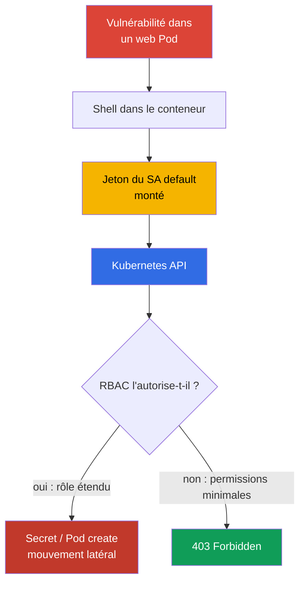
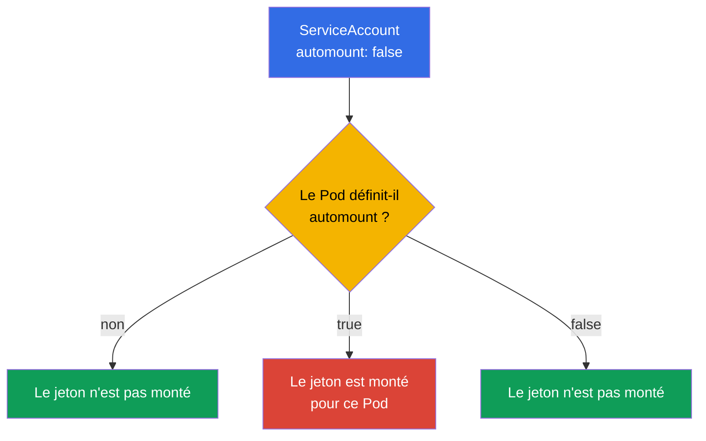
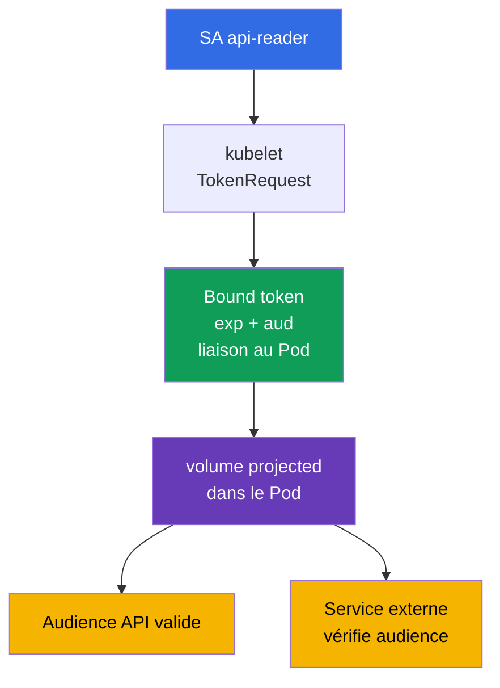

[Русская версия](ru.md) · [Eng version](README.md) · [Versión en español](es.md) · [Deutsche Version](de.md) · [ქართული ვერსია](ge.md) · [繁體中文版](tw.md) · [日本語版](jp.md)

# Chapitre 11. ServiceAccounts : minimisation et jetons

> **Le problème.** Un shell dans un Pod vulnérable donne à un attaquant accès au bearer token monté du ServiceAccount. Si le jeton est émis pour le compte `default` ou une identité avec un RBAC excessif, il peut être utilisé hors du conteneur pour lire des Secrets, créer des Pods et poursuivre l'escalade dans l'API ; même un jeton de courte durée est dangereux pendant sa période de validité.

> **La suite.** Au chapitre 10, nous avons réduit les permissions grâce à RBAC. Nous allons maintenant limiter l'identité qu'un Pod reçoit : son ServiceAccount et son jeton. Un jeton superflu dans un conteneur compromis constitue une entrée directe dans Kubernetes API ; un ServiceAccount minimal et un jeton de courte durée réduisent l'impact de l'incident. Cela relève du domaine CKS Cluster Hardening (15 %). Dans le chapitre suivant, nous restreindrons également l'accès à l'API depuis les requêtes anonymes, les réseaux et les paramètres de apiserver.

> **Prérequis CKA.** Les notions de base de ServiceAccount, la chaîne authn -> authz -> admission et le montage automatique des jetons sont traités dans le [chapitre 21 de CKA](../../../cka/course/21/fr.md). Role, RoleBinding et la vérification des permissions sont traités dans le [chapitre 38 de CKA](../../../cka/course/38/fr.md). Ici, nous ne répétons pas la syntaxe de base, mais l'appliquons au principe du moindre privilège.

> 🧠 Un jeton dans un Pod compromis est un bearer credential ServiceAccount : son impact est déterminé non par le fichier lui-même, mais par toutes les permissions RBAC actuelles et futures de cette identité.

## 11.1. Scénario d'attaque : jeton du ServiceAccount `default` dans un Pod

Chaque namespace contient un ServiceAccount `default`. Si un Pod ne spécifie pas `serviceAccountName`, le contrôleur d'admission lui attribue celui-ci. Par défaut, le jeton de ce SA est également monté dans le Pod. Un jeton seul n'accorde pas de permissions : l'autorisation dépend toujours de RBAC. Mais un jeton volé permet à un attaquant de devenir cette identité et d'utiliser **toutes** les permissions qu'elle possède actuellement ou qu'elle recevra plus tard.

Un chemin d'attaque typique est le suivant : une vulnérabilité de l'application fournit un shell dans un Pod, l'attaquant lit le jeton dans le volume monté, puis l'envoie à l'API. Si le SA `default` a reçu un RoleBinding « par commodité » ou est lié à un ClusterRole étendu, l'attaquant peut lire des Secrets, créer des Pods ou poursuivre l'attaque. Même un jeton sans permission actuelle n'est pas nécessaire à un service HTTP ordinaire et ne doit pas figurer dans son filesystem.



L'objectif du hardening n'est pas de s'appuyer sur un seul contrôle. Trois mesures indépendantes sont nécessaires : ne pas monter de jeton dans un Pod qui n'a pas besoin de l'API ; créer un SA dédié pour un Pod qui a besoin de l'API ; et n'accorder à ce SA que les actions RBAC nécessaires. NetworkPolicy du chapitre 04 et la restriction de l'accès à l'API du chapitre 12 complètent ces mesures, mais ne les remplacent pas.

> 🎯 Sans API, désactivez automount ; avec l'API, utilisez un SA dédié, un bound token de courte durée et un Role/RoleBinding minimal, puis vérifiez le jeton et les permissions API.

## 11.2. `automountServiceAccountToken` : désactiver par défaut

Le champ `automountServiceAccountToken: false` empêche le contrôleur d'admission ServiceAccount d'ajouter le volume projected standard à un Pod. Il peut être défini sur le ServiceAccount ou directement dans le `spec` du Pod.



La valeur au niveau du Pod est prioritaire. Si le Pod ne définit pas ce champ, la valeur du ServiceAccount est utilisée. Le modèle sûr consiste donc à désactiver automount sur le SA `default` du namespace et sur les SA nouvellement créés par défaut, et à décrire explicitement les exceptions dans le manifeste du Pod seulement après avoir vérifié qu'il a réellement besoin de l'API.

```bash
# Pour un namespace existant : désactiver le montage automatique du jeton pour le ServiceAccount default.
kubectl -n cks-104 patch serviceaccount default \
  -p '{"automountServiceAccountToken":false}'

# Confirmer que la nouvelle valeur est enregistrée.
kubectl -n cks-104 get serviceaccount default \
  -o jsonpath='{.automountServiceAccountToken}{"\n"}'
# false
```

La modification ne retire pas le volume d'un Pod déjà créé : recréez le workload et vérifiez le nouveau Pod. Le manifeste suivant ferme ce chemin à deux reprises : automount est désactivé sur son SA et le Pod interdit aussi explicitement le montage. Le jeton n'entre pas du tout dans le conteneur, il n'y a donc rien à voler lorsque l'application est compromise. C'est l'option correcte pour une application qui n'appelle pas Kubernetes API.

```yaml
apiVersion: v1
kind: ServiceAccount
metadata:
  name: app-sa
  namespace: cks-104
automountServiceAccountToken: false
---
apiVersion: v1
kind: Pod
metadata:
  name: app-without-api
  namespace: cks-104
spec:
  serviceAccountName: app-sa
  automountServiceAccountToken: false
  containers:
  - name: app
    image: nginx:1.30.4
```

Ne confondez pas l'absence d'un jeton monté automatiquement avec l'absence de ServiceAccount. Le Pod conserve l'identité `app-sa` ; le jeton ServiceAccount standard n'est simplement pas monté dans son filesystem. Ne vous attendez pas à ce que `automount: false` arrête une application qui reçoit un jeton par un autre moyen - via un Secret, un volume projected ou une variable d'environnement. Excluez ces sources séparément.

> 🧠 Les claims JWT, audience, la rotation et la vérification de l'objet lié définissent les limites d'un token credential.

## 11.3. Bound ServiceAccount token et volume projected

Dans un Kubernetes moderne, un Pod reçoit un **bound ServiceAccount token**, non un Secret perpétuel contenant un jeton. Kubelet demande le jeton via TokenRequest API ; le jeton est lié au ServiceAccount concerné, a une durée de vie limitée (`exp`) et est automatiquement renouvelé avant son expiration. Le JWT contient des claims concernant issuer, subject `system:serviceaccount:<ns>:<sa>` et l'objet lié. Après suppression du Pod lié, ce credential ne doit plus être considéré comme un credential actif de confiance.

`audience` limite le destinataire du jeton. Un jeton pour Kubernetes API doit avoir une audience acceptée par apiserver ; un jeton pour un service externe doit avoir l'audience de ce service. Le service externe doit vérifier la signature, `iss`, `aud`, l'expiration et subject. N'utilisez pas un jeton « pour tout » : cela étend le périmètre dans lequel un credential volé peut s'authentifier.



Le Pod ci-dessous ne reçoit pas le montage standard implicite. À la place, exactement un volume projected nécessaire pour appeler Kubernetes API est monté : un jeton de courte durée, la CA et le namespace. Ne fixez pas `https://kubernetes.default.svc` comme audience API universelle : apiserver accepte les valeurs de `--api-audiences` et, lorsque ce flag est absent, la liste est dérivée de `--service-account-issuer`. Ainsi, un jeton contenant cette chaîne renvoie `401` dans certains clusters. Pour un jeton Kubernetes API, ne définissez pas explicitement `audience`, ou confirmez d'abord les valeurs réelles de `--api-audiences`/`--service-account-issuer` ; définissez une audience distincte pour Vault ou un autre service externe.

```yaml
apiVersion: v1
kind: Pod
metadata:
  name: api-reader
  namespace: cks-104
spec:
  serviceAccountName: app-sa
  automountServiceAccountToken: false

  securityContext:
    runAsNonRoot: true
    runAsUser: 10001

  containers:
  - name: client
    image: curlimages/curl:8.12.1
    command: ["sh", "-c", "sleep 3600"]
    volumeMounts:
    - name: api-credential
      mountPath: /var/run/secrets/tokens
      readOnly: true
  volumes:
  - name: api-credential
    projected:
      defaultMode: 0444
      sources:
      - serviceAccountToken:
          path: token
          # Pour Kubernetes API, audience n'est pas définie : API server la choisit.
          # Une valeur explicite est autorisée seulement après vérification de --api-audiences.
          expirationSeconds: 3600
      - configMap:
          name: kube-root-ca.crt
          items:
          - key: ca.crt
            path: ca.crt
      - downwardAPI:
          items:
          - path: namespace
            fieldRef:
              fieldPath: metadata.namespace
```

L'image officielle `curlimages/curl` exécute son processus sans root (`running as curl_user is an explicit design decision`, README curl-docker), aussi cet exemple définit explicitement l'identité d'exécution avec `runAsNonRoot: true` et `runAsUser: 10001` au lieu de s'en remettre uniquement aux métadonnées de l'image.

Pour Kubernetes Linux v1.36, un ServiceAccount token projected a une sémantique de permissions particulière : lorsque tous les containers du Pod utilisent le même `runAsUser`, kubelet attribue le jeton à cet UID et force le mode `0600`. Ainsi, dans ce Pod à un seul conteneur, le jeton est lisible par son propriétaire, et uniquement par UID `10001`, sans `fsGroup`.

`defaultMode: 0444` est nécessaire pour la projection mixte de `ca.crt` et `namespace`, non secrets, que le client non root doit également lire. Cela ne rend pas le bearer token lisible par tout le monde : pour `serviceAccountToken`, kubelet applique séparément le `0600` décrit plus haut.

`fsGroup` n'est pas nécessaire ici. S'il est ajouté, kubelet applique la propriété de groupe au volume et étend les permissions d'un ServiceAccount token projected de `0600` à `0640`. Utilisez cet accès de groupe seulement lorsqu'il est réellement nécessaire à plusieurs processus ou à un GID, pas comme condition obligatoire d'un `runAsUser` non root.

`expirationSeconds` demande une durée de vie souhaitée, ce n'est pas un moyen d'obtenir un credential perpétuel : la valeur doit être d'au moins `600`, tandis que control plane détermine toujours la limite. Kubelet met à jour le fichier token avant `exp`, mais un intervalle de rotation universel et précis n'est pas garanti. Une application doit donc rouvrir le chemin du jeton à chaque nouvelle connexion ou à chaque actualisation du credential au lieu de conserver en mémoire un contenu obsolète ou un descripteur de fichier. N'imprimez pas le jeton dans un terminal, les logs CI, un rapport d'incident ou un ticket. Pour une vérification manuelle temporaire, émettez un jeton distinct avec une courte durée :

```bash
# Ne définissez pas --audience pour Kubernetes API sans vérifier --api-audiences.
kubectl -n cks-104 create token app-sa --duration=10m
```

Pour un service externe où l'actualité de la liaison est importante, `TokenReview` via apiserver est recommandé : il vérifie l'existence du ServiceAccount et du Pod, Secret ou Node lié, et rejette immédiatement un bound token après la suppression de son objet. Une validation OIDC/JWT hors ligne vérifie la signature et les claims, mais ne détecte pas la suppression : un tel jeton reste valide seulement jusqu'à `exp`. Si un objet est uniquement marqué pour suppression (`deletionTimestamp`), l'authenticator rejette le jeton au plus tard 60 secondes plus tard.

Dans Kubernetes v1.33+, `ServiceAccountNodeAudienceRestriction` est Beta et activée par défaut. La restriction est appliquée par le plugin d'admission `NodeRestriction` : lorsque feature gate est activé, que `NodeRestriction` est actif et qu'une TokenRequest provient d'une identité node/kubelet reconnue, kubelet ne peut par défaut demander que les audiences déjà utilisées par les workloads sur ce Node. Pour des exceptions justifiées, un administrateur peut accorder le verb RBAC `request-serviceaccounts-token-audience`.

Cette restriction s'applique spécifiquement aux identités kubelet/node ; elle ne limite pas les autres appelants de TokenRequest API.

Un Secret `kubernetes.io/service-account-token` créé manuellement produit un bearer credential de longue durée. Kubernetes prend toujours officiellement en charge cette méthode - par exemple, lorsqu'une intégration a réellement besoin d'un jeton sans expiration habituelle - mais la documentation upstream recommande directement TokenRequest à la place.

Pour ce cours, considérez un tel Secret comme une exception, non comme la façon normale d'émettre un credential : préférez d'abord TokenRequest de courte durée, OIDC ou la fédération. Si une intégration précise ne peut pas fonctionner avec une durée limitée, documentez la raison de l'exception, le RBAC minimal, la protection du Secret et une procédure de rotation/révocation. Ne créez pas un tel Secret comme moyen habituel de donner à un Pod accès à l'API : il ne reçoit pas de rotation courte automatique et augmente l'impact après une fuite.

> 🔬 **Kubernetes v1.37 : identité de workload X.509.** Le bound ServiceAccount token reste le modèle d'identité JWT principal de ce chapitre. Kubernetes v1.37 a également stabilisé Pod Certificates et ClusterTrustBundles - des primitives intégrées pour émettre et faire tourner des credentials de workload X.509. C'est une extension à jour pour la production, pas un remplacement de CKS Core : consultez [Kubernetes v1.37 Security Delta](../APPENDIX_K8S_137_SECURITY_DELTA_FR.md).

## 11.4. ServiceAccount dédié et RBAC minimal

Le SA `default` n'est pas un rôle d'application. Pour chaque workload ayant besoin de l'API, créez un ServiceAccount distinct et accordez-lui les permissions RBAC minimales.

Si les ressources requises se trouvent dans un seul namespace, utilisez `Role` + `RoleBinding`. Pour un ensemble de règles réutilisable ou un accès à des ressources de portée cluster, utilisez `ClusterRole`. Pour accorder ses permissions namespaced dans un seul namespace, liez le `ClusterRole` via un `RoleBinding` ; pour un accès réellement à l'échelle du cluster, utilisez `ClusterRoleBinding`.

Dans cet exemple, `app-sa` peut uniquement lire une liste de Pods dans le namespace `cks-104` : pas de `watch`, `create`, `delete`, accès aux Secrets ni ClusterRoleBinding.

```yaml
apiVersion: v1
kind: ServiceAccount
metadata:
  name: app-sa
  namespace: cks-104
automountServiceAccountToken: false
---
apiVersion: rbac.authorization.k8s.io/v1
kind: Role
metadata:
  name: app-pod-reader
  namespace: cks-104
rules:
- apiGroups: [""]
  resources: ["pods"]
  verbs: ["get", "list"]
---
apiVersion: rbac.authorization.k8s.io/v1
kind: RoleBinding
metadata:
  name: app-sa-pod-reader
  namespace: cks-104
subjects:
- kind: ServiceAccount
  name: app-sa
  namespace: cks-104
roleRef:
  apiGroup: rbac.authorization.k8s.io
  kind: Role
  name: app-pod-reader
```

Appliquez-le et vérifiez précisément l'action autorisée et l'action refusée. `can-i` vérifie l'autoriseur en tant que subject requis et ne demande pas d'extraire le credential du Pod.

```bash
kubectl apply -f app-sa-rbac.yaml

kubectl auth can-i list pods -n cks-104 \
  --as=system:serviceaccount:cks-104:app-sa
# yes
kubectl auth can-i delete pods -n cks-104 \
  --as=system:serviceaccount:cks-104:app-sa
# no
kubectl auth can-i get secrets -n cks-104 \
  --as=system:serviceaccount:cks-104:app-sa
# no
```

Dans cet exemple, `RoleBinding` limite les permissions accordées au namespace `cks-104` et fait référence à un `Role` namespaced.

Ne traitez pas `ClusterRoleBinding` comme un remplacement mécanique de cet objet : un `ClusterRoleBinding` ne peut faire référence qu'à un `ClusterRole`, et non à un `Role`. Pour accorder des règles similaires à l'échelle du cluster, vous devriez d'abord définir un `ClusterRole`, puis le lier via un `ClusterRoleBinding`.

Lors d'un audit, vérifiez séparément l'ensemble des règles et la portée de la liaison ; n'ajoutez pas le wildcard `*`, `secrets`, `pods/exec`, `bind`, `escalate` ou `impersonate` sans une tâche justifiée séparément. Il est utile de vérifier régulièrement les permissions actuelles et futures du SA avec la commande du chapitre 10 :

```bash
kubectl auth can-i --list -n cks-104 \
  --as=system:serviceaccount:cks-104:app-sa
```

> 🧠 Créer ou modifier un workload permet de sélectionner le ServiceAccount d'autrui et d'exécuter du code avec son jeton.

## 11.4.1. RBAC : les permissions de workload peuvent devenir une escalade de ServiceAccount

La permission de créer ou modifier un workload n'est pas seulement la permission d'exécuter une application. Si un subject peut créer un Pod/Deployment avec le `serviceAccountName` d'un autre SA plus privilégié dans le même namespace, il peut exécuter du code avec le jeton de ce SA et ses permissions API. Le rôle intégré `edit` ne doit donc pas être considéré comme inoffensif : en plus de modifier les workloads et lire les Secrets, il peut exécuter un Pod sous n'importe quel ServiceAccount du namespace. Séparez les permissions de déployeur des permissions de gestion de ServiceAccount, et ne laissez pas les SA sensibles accessibles aux créateurs de workloads ordinaires.

Vérifiez séparément les autres chemins d'escalade RBAC des permissions de lecture/écriture ordinaires : créer un `PersistentVolume` peut donner à un Pod accès à des données ou à un host path ; créer/approuver un CSR peut émettre une nouvelle identité ; modifier `ValidatingWebhookConfiguration` ou `MutatingWebhookConfiguration` peut changer le contrôle d'admission. Accordez `bind`, `escalate`, `impersonate`, la gestion de RoleBinding/ClusterRoleBinding et ces chemins uniquement à des rôles administratifs distincts. N'ajoutez pas d'utilisateurs à `system:masters` : ce groupe reçoit un accès superuser sans restriction et contourne RBAC ainsi que les webhooks d'autorisation.

Dans Kubernetes 1.36+, Constrained Impersonation étend l'ancien modèle `impersonate` à un seul verb : des permissions distinctes s'appliquent, y compris `impersonate:user-info` et `impersonate-on:*`. Ce n'est pas une raison d'accorder l'impersonation plus largement - limitez le subject, les groupes et la portée, et utilisez un rôle admin minimal distinct pour la vérification.

## 11.5. Vérification et diagnostic : jeton, API et RBAC

La vérification doit prouver deux conditions indépendantes : un Pod sans tâche API ne contient pas de jeton, et un Pod ayant une tâche API reçoit uniquement le credential de courte durée spécifié et seulement les permissions de son Role.

```bash
# Après la création de app-without-api : le fichier token monté automatiquement ne doit pas être présent.
kubectl -n cks-104 exec app-without-api -- \
  test ! -e /var/run/secrets/kubernetes.io/serviceaccount/token

# api-reader n'a pas de montage standard mais a un token explicitement projected.
kubectl -n cks-104 exec api-reader -- sh -ec '
  test ! -e /var/run/secrets/kubernetes.io/serviceaccount/token
  test -r /var/run/secrets/tokens/token
  test -r /var/run/secrets/tokens/ca.crt
'

# Requête autorisée : le token n'est pas imprimé ; curl le lit uniquement dans le conteneur.
kubectl -n cks-104 exec api-reader -- sh -ec '
  curl --fail --silent --show-error \
    --cacert /var/run/secrets/tokens/ca.crt \
    -H "Authorization: Bearer $(cat /var/run/secrets/tokens/token)" \
    https://kubernetes.default.svc/api/v1/namespaces/cks-104/pods >/dev/null
'
```

Distinguez d'abord le transport, l'authentification et l'autorisation.

- Erreur TLS/certificat avant une réponse HTTP : vérifiez le fichier CA, DNS/SAN, endpoint et la disponibilité TLS.
- HTTP `401 Unauthorized` : API server n'a pas accepté le credential - vérifiez le chemin du jeton, signature/issuer, `audience`, `exp`/heure et l'intégrité du jeton.
- HTTP `403 Forbidden` : l'authentification a réussi mais l'autoriseur n'a pas permis l'action - vérifiez Role/RoleBinding, namespace et le `kubectl auth can-i` ciblé.

Si un Pod possède toujours le jeton standard après la modification du SA, vérifiez `spec.automountServiceAccountToken` dans le Pod lui-même et recréez-le.

| Symptôme | Éléments à vérifier | Cause typique |
|---|---|---|
| Un jeton est présent dans une application ordinaire | Pod spec et ServiceAccount | `automount: false` n'est pas défini, ou le Pod remplace explicitement le SA par `true` |
| `can-i` renvoie `no` pour une action attendue | `roleRef`, namespace, subject | RoleBinding est dans un autre namespace ou le nom du SA est erroné |
| Erreur TLS/certificat, aucun statut HTTP reçu | CA, DNS/SAN, endpoint, connectivité TLS | Le client ne peut pas établir de connexion TLS de confiance |
| L'API renvoie `401` | chemin du jeton, issuer/signature, `audience`, `exp`, heure | Le credential a expiré, est endommagé ou n'est pas accepté par l'authenticator |
| L'API renvoie `403` | `kubectl auth can-i` ciblé, Role/RoleBinding, namespace | Le credential est valide, mais le verb/resource demandé n'est pas autorisé |
| Un token Secret est apparu dans Git | historique Git et logs CI | Un Secret legacy a été créé ou le credential a été imprimé par une commande ; révoquez/réémettez-le et retirez-le des logs |

> 🏭 Un SA distinct pour chaque workload, un examen RBAC régulier et un runbook de révocation et d'investigation des fuites de credentials.

## 11.6. Application en production

- **Désactiver le montage automatique des jetons par défaut.** L'équipe plateforme désactive `automountServiceAccountToken` sur le SA `default` dans chaque namespace d'application. Un workload qui n'a pas besoin de l'API définit aussi `automountServiceAccountToken: false` dans son template de Pod, rendant l'exception visible lors de la revue de code.
- **Un workload - un SA.** Des ServiceAccounts distincts et des liaisons RBAC minimales réduisent le blast radius. Pour les permissions dans un namespace, utilisez `RoleBinding` ; il peut faire référence à un `Role` local ou à un `ClusterRole` réutilisable. N'utilisez `ClusterRoleBinding` que lorsque le subject a réellement besoin d'une portée à l'échelle du cluster - pour des ressources de portée cluster et/ou des permissions namespaced identiques dans chaque namespace.
- **Bound token au lieu de Secret statique.** Les Pods utilisent un jeton projected à courte durée de vie et audience étroite. Pour les systèmes externes, utilisez TokenRequest, l'identité de workload OIDC ou la fédération cloud plutôt que de copier un Secret service-account-token.
- **Identité cloud séparée de Kubernetes RBAC.** IRSA, Workload Identity et des mécanismes similaires lient un SA à un rôle cloud. Cela ne supprime pas Kubernetes RBAC : vérifiez séparément les permissions API et les permissions cloud que le workload reçoit.
- **Contrôle et réponse.** La revue RBAC, les audit logs et la recherche de jetons dans les repositories/logs doivent être régulières. Après une fuite, supprimez le Pod ou SA compromis, retirez sa liaison, recréez le workload et enquêtez sur les requêtes que le credential pouvait effectuer.

## 11.7. Mini-glossaire

- **ServiceAccount (SA)** - une identité namespaced pour les Pods et les processus dans Kubernetes API.
- **ServiceAccount default** - le SA attribué à un Pod lorsque `serviceAccountName` n'est pas spécifié.
- **`automountServiceAccountToken`** - un flag autorisant ou interdisant le montage automatique du credential dans un Pod ; la valeur du Pod est prioritaire sur celle du SA.
- **Bound ServiceAccount token** - un jeton de courte durée émis par TokenRequest API et lié à un ServiceAccount et à un objet Pod.
- **volume projected** - un volume qui assemble un jeton, ConfigMap, downward API et d'autres sources dans des fichiers spécifiés.
- **audience** - le destinataire du jeton ; un service ne doit accepter que les jetons ayant son audience.
- **TokenRequest API** - l'API servant à émettre des ServiceAccount tokens de courte durée.
- **RoleBinding** - une liaison namespaced d'un Role ou ClusterRole à un subject tel qu'un SA.

## 11.8. Résumé du chapitre

- Un jeton du SA `default` dans un Pod compromis est un credential Kubernetes API ; RBAC détermine son impact, minimisez donc ensemble le jeton et les permissions.
- `automountServiceAccountToken: false` désactive le montage automatique du ServiceAccount token. La valeur du Pod est prioritaire sur celle du ServiceAccount ; les Pods déjà créés doivent être recréés.
- Un Pod moderne reçoit un token projected lié, avec une durée de vie et une audience limitées, que kubelet fait tourner. Kubernetes prend toujours officiellement en charge un Secret ServiceAccount token de longue durée créé manuellement, mais ce cours le traite comme une exception documentée plutôt que comme le moyen ordinaire d'émettre un credential Pod.
- Un workload ayant accès à l'API reçoit un SA distinct, un Role namespaced et un RoleBinding avec les `verbs` et `resources` exacts, non les permissions du SA `default` ou un wildcard.
- La vérification comprend l'absence de jeton dans un Pod ordinaire, `kubectl auth can-i` pour le SA, et un véritable appel API avec un credential explicitement projected ; diagnostiquez `401` et `403` différemment.

## 11.9. Utilité : à l'examen et dans le travail réel

**À l'examen.** Créez rapidement un ServiceAccount, Role et RoleBinding, puis confirmez l'autorisation et le refus avec `kubectl auth can-i --as=system:serviceaccount:<ns>:<sa>`. Faites attention à l'endroit où automount doit être désactivé : le SA `default` du namespace ou un Pod particulier. Vérifiez l'absence du fichier token avec `kubectl exec`, et non avec YAML seul. Le lab 104 associe cette compétence à RBAC et à la restriction de l'accès anonyme à l'API.

**Dans le travail réel.** ServiceAccount fait partie de la surface d'attaque de chaque Pod. Une politique « aucun jeton sauf nécessité explicite », associée à des SA distincts de moindre privilège, réduit l'impact d'une RCE dans une application. Un bound token projected à courte durée de vie et audience correcte rend le credential plus étroit et plus gérable, mais n'élimine pas le besoin de RBAC, audit et isolation réseau.

## 11.10. Questions d'auto-évaluation

<details>
<summary>1. Pourquoi un jeton du SA `default` est-il dangereux même dans un Pod qui ne fait actuellement pas de requêtes API ?</summary>

Le jeton est un credential de l'identité ServiceAccount `default`, même si l'application actuelle n'appelle pas l'API. Après une RCE, un attaquant peut lire le jeton monté et utiliser toutes les permissions que le SA possède actuellement ou recevra plus tard via RBAC. Un service HTTP ordinaire n'a pas besoin de ce credential dans son filesystem, c'est pourquoi automount est désactivé.
</details>

<details>
<summary>2. Comment `automountServiceAccountToken` sur un ServiceAccount et sur un Pod sont-ils liés ? Quelle valeur s'applique en cas de conflit ?</summary>

Si un Pod ne spécifie pas ce champ, la valeur de son ServiceAccount s'applique. La valeur dans le `spec` du Pod lui-même est prioritaire ; un Pod peut donc explicitement activer ou désactiver le montage indépendamment du défaut du SA. Modifier un SA ne retire pas le volume d'un Pod déjà créé : recréez le workload et vérifiez le nouveau Pod.
</details>

<details>
<summary>3. Pourquoi un token projected lié est-il plus sûr qu'un Secret legacy contenant un ServiceAccount token ?</summary>

Un bound token est émis par TokenRequest API, lié à un ServiceAccount et un Pod particuliers, possède `exp` et est automatiquement renouvelé par kubelet avant expiration. Un Secret legacy crée un credential de longue durée sans cette rotation courte normale et augmente donc le dommage causé par une fuite. Après la suppression du Pod lié, le credential lié ne doit pas non plus être considéré comme un credential actif de confiance.
</details>

<details>
<summary>4. Que limite `audience` et que doit vérifier un service qui accepte un jeton ?</summary>

`audience` limite le destinataire du jeton : un jeton Kubernetes API ne doit pas devenir un jeton pour un Vault externe ou un autre service sans vérification. Le service externe qui l'accepte doit vérifier la signature, `iss`, son propre `aud`, l'expiration et subject. Ne définissez pas une audience explicite pour Kubernetes API sans confirmer les valeurs réelles de `--api-audiences` ou `--service-account-issuer`.
</details>

<details>
<summary>5. Pourquoi `app-sa` de l'exemple reçoit-il un RoleBinding plutôt qu'un ClusterRoleBinding ?</summary>

`app-sa` ne doit lire les Pods que dans le namespace `cks-104`, donc un `RoleBinding` fournit la bonne portée. Dans cet exemple, il fait référence au `Role app-pod-reader`. Un `ClusterRoleBinding` ne peut pas faire référence à ce `Role` ; une variante à l'échelle du cluster nécessiterait un `ClusterRole` avec les règles voulues et un `ClusterRoleBinding`. Il est important de distinguer les règles et la portée de la liaison : `RoleBinding` limite les permissions namespaced accordées à son namespace, tandis que `ClusterRoleBinding` accorde les règles `ClusterRole` à l'échelle du cluster.
</details>

<details>
<summary>6. Comment distinguer un problème TLS, un jeton non valide (`401`) et des permissions RBAC insuffisantes (`403`) ?</summary>

Si la confiance TLS n'est pas établie, le client obtient une erreur de certificat/TLS avant l'authentification HTTP : vérifiez CA, DNS/SAN et endpoint. `401 Unauthorized` signifie que API server a reçu une requête HTTP mais n'a pas accepté le credential : vérifiez le chemin du jeton, issuer/signature, audience, expiration et heure. `403 Forbidden` signifie que l'authentification a réussi mais que l'autoriseur n'a pas permis le resource/verb/scope requis ; confirmez-le avec un `kubectl auth can-i` ciblé.
</details>

<details>
<summary>7. Quelles vérifications prouvent que le ServiceAccount token standard injecté automatiquement n'est pas monté dans un Pod sans tâche API ?</summary>

Confirmez `automountServiceAccountToken: false` sur le ServiceAccount et dans le spec du nouveau Pod, en tenant compte de la priorité du champ Pod. Vérifiez ensuite que le chemin standard est absent dans le conteneur :

```bash
test ! -e /var/run/secrets/kubernetes.io/serviceaccount/token
```

Après avoir modifié un workload, recréez le Pod et répétez la vérification car un volume existant ne disparaît pas automatiquement.

Cela prouve l'absence de **l'injection automatique standard**, non l'absence de tous les credentials ServiceAccount possibles. Si l'exigence est « le Pod ne doit recevoir aucun jeton SA », examinez également `volumes`, `projected.serviceAccountToken`, Secret/env, sidecar/init-container et les autres mécanismes d'émission de credentials.
</details>

<details>
<summary>8. **Retour au chapitre 21.** Un ServiceAccount token legacy était stocké comme `Secret` Kubernetes. En quoi la menace de ce jeton diffère-t-elle de celle d'un `Secret` applicatif ordinaire du chapitre 21 (par exemple `db-password`), et pourquoi un token projected lié réduit-il cette menace différemment de la façon dont encryption at rest réduit la menace pesant sur un `Secret` dans etcd ?</summary>

Un ServiceAccount token legacy est un bearer credential qui permet d'agir comme une identité dans Kubernetes API dans les limites de son RBAC ; `db-password` donne normalement accès à un système applicatif particulier. Un token projected lié réduit le risque d'utilisation d'un credential volé grâce à sa durée de vie, audience, liaison au Pod et rotation. Encryption at rest protège les données Secret dans etcd, mais ne limite pas un jeton déjà monté ou lu et ne remplace pas son cycle de vie court.
</details>

## Pratique

Dans le lab 104, créez un SA et un RoleBinding minimaux, désactivez automount sur le SA `default` et prouvez qu'un Pod sans jeton n'a pas de fichier credential. Vérifiez ensuite l'autorisation `list pods` et le refus de `delete pods` avec `kubectl auth can-i`. Le chapitre suivant ajoute une protection de l'API elle-même : accès anonyme, modes d'autorisation et limites réseau.

🧪 Lab 104 (RBAC, ServiceAccount et restriction API) :
[tasks/cks/labs/104](../../labs/104/README_FR.MD)

🌐 Exercice interactif supplémentaire (killer.sh/killercoda, ressource externe) : [serviceaccount-token-mounting](https://killercoda.com/killer-shell-cks/scenario/serviceaccount-token-mounting)

🎮 Killercoda (dans le navigateur, sans installation) : [Create Service Account For a Pod](https://killercoda.com/chadmcrowell/course/cka/create-sa-for-pod) · [Role and RoleBinding](https://killercoda.com/chadmcrowell/course/ckad/role-rolebinding)

---
[Table des matières](../README_FR.md) · [Chapitre 10](../10/fr.md) · [Chapitre 12](../12/fr.md)
