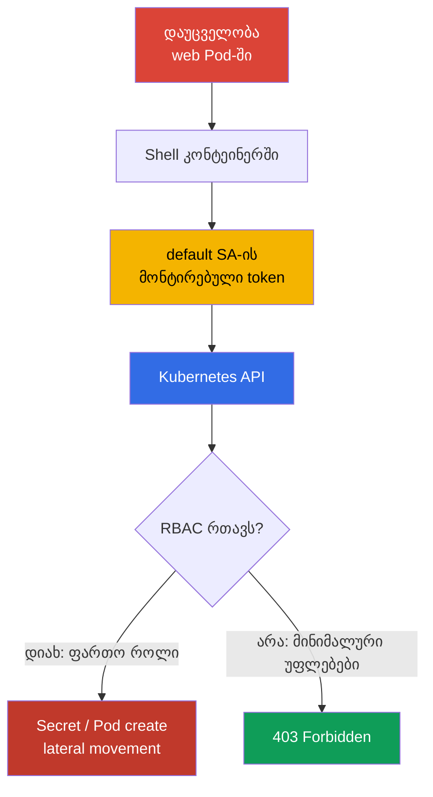
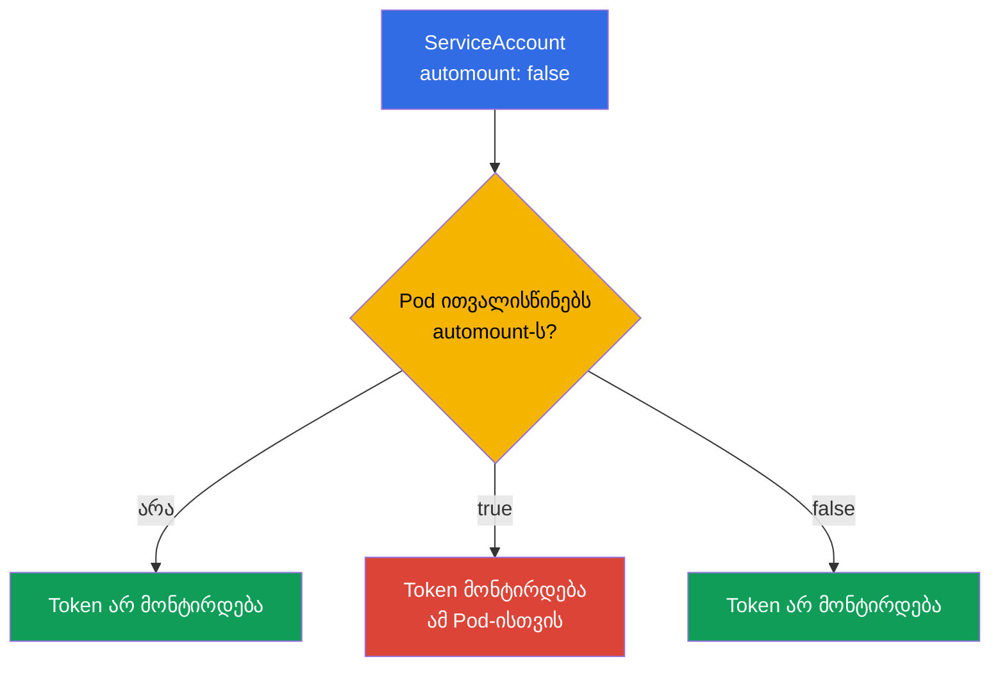
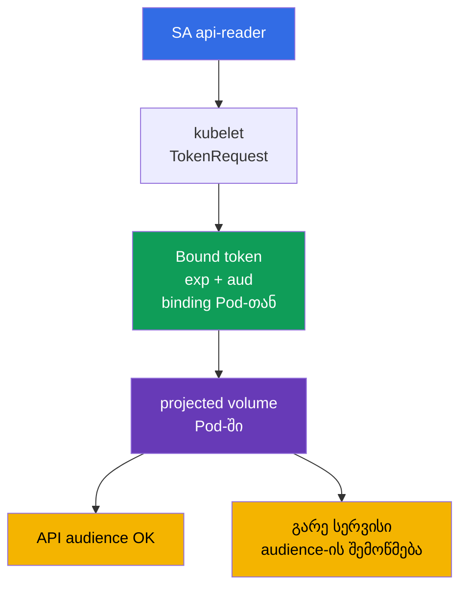

[Русская версия](ru.md) · [Eng version](README.md) · [Versión en español](es.md) · [Version française](fr.md) · [Deutsche Version](de.md) · [繁體中文版](tw.md) · [日本語版](jp.md)

# თავი 11. ServiceAccounts: მინიმიზაცია და ტოკენები

> **პრობლემა.** shell დაუცველ Pod-ში აძლევს შემტევს წვდომას ServiceAccount-ის
> მონტირებულ bearer token-ზე. თუ token გაცემულია `default`-ანგარიშზე ან identity-ზე
> ჭარბი RBAC-უფლებებით, მისი გამოყენება შესაძლებელია კონტეინერს გარეთაც Secret-ის
> წასაკითხად, Pod-ის შესაქმნელად და API-ში შემდგომი ესკალაციისთვის; მოკლევადიანი
> token-იც კი საშიშია მისი მოქმედების ვადის განმავლობაში.

> **რა არის შემდეგ.** მე-10 თავში შევამცირეთ უფლებები RBAC-ის მეშვეობით. ახლა
> შევზღუდოთ თავად identity, რომელსაც იღებს Pod: ServiceAccount და მისი token.
> ზედმეტი token კომპრომეტირებულ კონტეინერში - მზა შესასვლელია Kubernetes API-ში;
> მინიმალური ServiceAccount და მოკლევადიანი token ამცირებს ინციდენტის შედეგებს.
> ეს არის CKS-ის დომენი Cluster Hardening (15%). შემდეგ თავში დავხურავთ წვდომას
> API-ზე ასევე anonymous-მოთხოვნების, ქსელების და apiserver-პარამეტრების მხრიდან.

> **რა გჭირდებათ CKA-დან.** ServiceAccount-ის საბაზისო ცნებები, ჯაჭვი
> authn -> authz -> admission და token-ის ავტომატური მონტირება განხილულია
> [CKA-ს 21-ე თავში](../../../cka/course/21/ge.md). Role, RoleBinding და
> უფლებების შემოწმება - [CKA-ს 38-ე თავში](../../../cka/course/38/ge.md). აქ არ
> ვიმეორებთ საბაზისო სინტაქსს, არამედ ვიყენებთ მას least privilege-ისთვის.

> 🧠 Token კომპრომეტირებულ Pod-ში - ServiceAccount-ის bearer credential-ია: მისი ზიანი განისაზღვრება არა თავად ფაილით, არამედ ამ identity-ის ყველა მიმდინარე და მომავალი RBAC-უფლებით.

## 11.1. შეტევის სცენარი: `default`-ServiceAccount-ის token Pod-ში

ყოველი namespace შეიცავს ServiceAccount-ს `default`. თუ Pod-ს არ აქვს
მითითებული `serviceAccountName`, admission-კონტროლერი სწორედ მას ანიჭებს.
ნაგულისხმევად ამ SA-ის token-იც მონტირდება Pod-ში. თავად token არ ნიშნავს
უფლებებს: ავტორიზაცია მაინც დამოკიდებულია RBAC-ზე. მაგრამ მოპარული token
შემტევს აძლევს საშუალებას გახდეს ეს identity და გამოიყენოს **ყველა** უფლება,
რომელიც მას ახლა აქვს ან მოგვიანებით მიენიჭება.

ტიპური შეტევის გზა: დაუცველობა აპლიკაციაში იძლევა shell-ს Pod-ში, შემტევი
კითხულობს token-ს მონტირებული ტომიდან, შემდეგ აგზავნის მას API-ში. თუ
`default` SA-მ მიიღო RoleBinding „მოხერხებულობისთვის" ან დაკავშირებულია
ფართო ClusterRole-თან, შესაძლებელია Secret-ის წაკითხვა, Pod-ის შექმნა ან
შეტევის შემდგომი განვითარება. თუნდაც token მიმდინარე უფლებების გარეშე
საჭირო არ არის ჩვეულებრივი HTTP-სერვისისთვის და არ უნდა იდოს მისი ფაილურ
სისტემაში.



Hardening-ის მიზანი არ არის იმედი დაამყაროთ ერთ control-ზე. საჭიროა სამი
დამოუკიდებელი ზომა: არ ამონტიროთ token იმ Pod-ში, რომელსაც API არ სჭირდება;
გამოყოთ ცალკე SA Pod-ისთვის, რომელსაც API სჭირდება; მისცეთ ამ SA-ს მხოლოდ
საჭირო RBAC-მოქმედებები. NetworkPolicy მე-4 თავიდან და API-ზე წვდომის
შეზღუდვა მე-12 თავიდან ავსებს, მაგრამ არ ცვლის ამ ზომებს.

> 🎯 API-ს გარეშე გამორთეთ automount; API-სთან ერთად გამოიყენეთ გამოყოფილი SA, მოკლევადიანი bound token და მინიმალური Role/RoleBinding, შემდეგ შეამოწმეთ token და API-უფლებები.

## 11.2. `automountServiceAccountToken`: ნაგულისხმევად გამორთვა

ველი `automountServiceAccountToken: false` კრძალავს ServiceAccount
admission-კონტროლერს Pod-ში სტანდარტული projected volume-ის დამატებას. მისი
დაყენება შესაძლებელია ServiceAccount-ზე ან პირდაპირ Pod-ის `spec`-ში.



Pod-დონეზე მითითებულ მნიშვნელობას აქვს პრიორიტეტი. თუ Pod არ ითვალისწინებს
ამ ველს, გამოიყენება ServiceAccount-ის მნიშვნელობა. ამიტომ უსაფრთხო
პატერნია namespace-ის `default` SA-ზე და ახლადშექმნილ SA-ებზე ნაგულისხმევად
automount-ის გამორთვა, ხოლო გამონაკლისები ცალსახად აღიწეროს Pod-ის
მანიფესტში მას შემდეგ, რაც დადასტურდება, რომ მას მართლაც სჭირდება API.

```bash
# უკვე არსებული namespace-ისთვის: აკრძალეთ token default SA-ზე.
kubectl -n cks-104 patch serviceaccount default \
  -p '{"automountServiceAccountToken":false}'

# დარწმუნდით, რომ ახალი მნიშვნელობა ჩაწერილია.
kubectl -n cks-104 get serviceaccount default \
  -o jsonpath='{.automountServiceAccountToken}{"\n"}'
# false
```

ცვლილება არ შლის volume-ს უკვე შექმნილი Pod-იდან: ხელახლა შექმენით workload
და შეამოწმეთ ახალი Pod. შემდეგი მანიფესტი დახურავს ამ გზას ორმაგად: მის
SA-ზე გამორთულია automount, ხოლო Pod-იც ცალსახად კრძალავს მონტირებას.
Token საერთოდ არ ხვდება კონტეინერში, ამიტომ მისი მოპარვა შეუძლებელია
აპლიკაციის კომპრომეტაციის შემთხვევაშიც. ეს არის სწორი ვარიანტი
აპლიკაციისთვის, რომელიც არ იძახებს Kubernetes API-ს.

```yaml
apiVersion: v1
kind: ServiceAccount
metadata:
  name: app-sa
  namespace: cks-104
automountServiceAccountToken: false
---
apiVersion: v1
kind: Pod
metadata:
  name: app-without-api
  namespace: cks-104
spec:
  serviceAccountName: app-sa
  automountServiceAccountToken: false
  containers:
  - name: app
    image: nginx:1.30.4
```

არ აურიოთ token-ის არარსებობა ServiceAccount-ის არარსებობასთან. Pod-ს მაინც
აქვს identity `app-sa`; უბრალოდ credential არ არის გაცემული მის
filesystem-ში. ასევე ნუ ივარაუდებთ, რომ `automount: false` შეაჩერებს
აპლიკაციას, რომელსაც token სხვა გზით გადაეცა - Secret-ის, projected
volume-ის ან გარემოს ცვლადის მეშვეობით. ასეთი წყაროები ცალკე უნდა
გამოირიცხოს.

> 🧠 JWT claims, audience, როტაცია და bound object-ის შემოწმება განსაზღვრავს token credential-ის საზღვრებს.

## 11.3. Bound ServiceAccount token და projected volume

თანამედროვე Kubernetes-ში Pod იღებს **bound ServiceAccount token**-ს და არა
უვადო Secret-ს token-ით. Kubelet ითხოვს token-ს TokenRequest API-ის
მეშვეობით, token დაკავშირებულია კონკრეტულ ServiceAccount-თან, აქვს
შეზღუდული მოქმედების ვადა (`exp`) და ავტომატურად როტირდება ვადის ამოწურვამდე.
JWT-ში მოცემულია claims issuer-ის, subject-ის `system:serviceaccount:<ns>:<sa>`
და bound object-ის შესახებ. მიბმული Pod-ის წაშლისას ასეთი credential ვეღარ
ჩაითვლება მოქმედ სანდო credential-ად.

`audience` ზღუდავს token-ის მიმღებს. Token Kubernetes API-სთვის უნდა ატარებდეს
audience-ს, რომელსაც იღებს apiserver; token გარე სერვისისთვის - ამ სერვისის
audience-ს. გარე სერვისი ვალდებულია შეამოწმოს ხელმოწერა, `iss`, `aud`,
მოქმედების ვადა და subject. არ გამოიყენოთ ერთი token „ყველაფრისთვის": ეს
აფართოებს არეს, სადაც მოპარული credential გამოდგება ავთენტიფიკაციისთვის.



ქვემოთ Pod არ იღებს ნაგულისხმევ იმპლიციტურ mount-ს. მის ნაცვლად მონტირდება
ზუსტად ერთი projected volume, საჭირო Kubernetes API-ის გამოსაძახებლად:
მოკლევადიანი token, CA და namespace. არ დააფიქსიროთ
`https://kubernetes.default.svc` როგორც API-ის უნივერსალური audience:
apiserver იღებს მნიშვნელობებს `--api-audiences`-იდან, ხოლო ამ ალმის
არარსებობისას სია გამოიყვანება `--service-account-issuer`-იდან. ამიტომ
token ამ სტრიქონით ზოგ კლასტერში მისცემს `401`-ს. ზუსტად Kubernetes
API-სთვის token-ისთვის ცალსახად ნუ დააყენებთ `audience`-ს, ან ჯერ
დაადასტურეთ ფაქტობრივი `--api-audiences`/`--service-account-issuer`;
ცალკე audience დააყენეთ Vault-ისთვის ან სხვა გარე სერვისისთვის.

```yaml
apiVersion: v1
kind: Pod
metadata:
  name: api-reader
  namespace: cks-104
spec:
  serviceAccountName: app-sa
  automountServiceAccountToken: false

  securityContext:
    runAsNonRoot: true
    runAsUser: 10001

  containers:
  - name: client
    image: curlimages/curl:8.12.1
    command: ["sh", "-c", "sleep 3600"]
    volumeMounts:
    - name: api-credential
      mountPath: /var/run/secrets/tokens
      readOnly: true
  volumes:
  - name: api-credential
    projected:
      defaultMode: 0444
      sources:
      - serviceAccountToken:
          path: token
          # Kubernetes API-სთვის audience არ ინიშნება: მას ირჩევს API server.
          # ცალსახა მნიშვნელობა დასაშვებია მხოლოდ --api-audiences-თან შედარების შემდეგ.
          expirationSeconds: 3600
      - configMap:
          name: kube-root-ca.crt
          items:
          - key: ca.crt
            path: ca.crt
      - downwardAPI:
          items:
          - path: namespace
            fieldRef:
              fieldPath: metadata.namespace
```

ოფიციალური image `curlimages/curl` უშვებს პროცესს არა root-ის სახელით
(`running as curl_user is an explicit design decision`, curl-docker README),
ამიტომ runtime identity ამ მაგალითში ცალსახად ინიშნება `runAsNonRoot: true`
და `runAsUser: 10001`-ის მეშვეობით და არ რჩება მხოლოდ image metadata-ს
შეხედულებაზე.

Linux Kubernetes v1.36-სთვის projected ServiceAccount token-ს გააჩნია
სპეციალური permission semantics: როცა Pod-ის ყველა container იყენებს
ერთსა და იმავე `runAsUser`-ს, kubelet ანიჭებს token-ს ამ UID-ს და
სავალდებულოდ ადგენს mode-ს `0600`-ზე. ამიტომ ამ ერთ-კონტეინერიან Pod-ში
token ხდება owner-readable მხოლოდ UID `10001`-ისთვის, `fsGroup`-ის გარეშე.

`defaultMode: 0444` საჭიროა mixed projection-ისთვის არასაიდუმლო `ca.crt`-სა
და `namespace`-ისთვის, რომელთა წაკითხვაც non-root client-საც სჭირდება. ის
არ ხდის bearer token-ს world-readable: `serviceAccountToken`-ისთვის kubelet
ცალკე იყენებს ზემოთ აღწერილ `0600`-ს.

`fsGroup` აქ საჭირო არ არის. თუ მას დაამატებთ, kubelet გამოიყენებს group
ownership-ს volume-ზე და projected ServiceAccount token-ისთვის გააფართოებს
permissions-ს `0600`-დან `0640`-მდე. ასეთი ჯგუფური წვდომა გამოიყენეთ მხოლოდ
მაშინ, როცა ის მართლაც სჭირდება რამდენიმე პროცესს ან GID-ს, და არა როგორც
non-root `runAsUser`-ის სავალდებულო პირობა.

`expirationSeconds` არის სასურველი მოქმედების ვადის მოთხოვნა და არა
უვადო credential-ის მიღების საშუალება: მნიშვნელობა უნდა იყოს არანაკლებ
`600`, ხოლო ზედა ზღვარს მაინც განსაზღვრავს control plane. Kubelet
ანახლებს token-ის ფაილს `exp`-მდე, მაგრამ ზუსტი უნივერსალური როტაციის
ინტერვალი გარანტირებული არ არის. ამიტომ აპლიკაციამ თავიდან უნდა გახსნას
token-ის გზა ყოველი ახალი კავშირისას ან credential-ის განახლებისას და არ
შეინახოს ძველი შემცველობა ან ფაილის დესკრიპტორი მეხსიერებაში. ნუ დაბეჭდავთ
token-ს ტერმინალში, CI-ლოგებში, ინციდენტის აღწერაში ან ticket-ში.
დროებითი ხელით შემოწმებისთვის გასცით ცალკე token და დააყენეთ მოკლე
duration:

```bash
# Kubernetes API-სთვის ნუ დააყენებთ --audience-ს --api-audiences-ის შემოწმების გარეშე.
kubectl -n cks-104 create token app-sa --duration=10m
```

გარე სერვისისთვის, რომლისთვისაც მნიშვნელოვანია binding-ის აქტუალურობა,
რეკომენდირებულია `TokenReview` apiserver-ის მეშვეობით: ის ამოწმებს
ServiceAccount-ისა და bound Pod-ის, Secret-ის ან Node-ის არსებობას და
დაუყოვნებლივ ამბობს უარს bound token-ზე შესაბამისი ობიექტის წაშლის შემდეგ.
OIDC/JWT-ის offline-შემოწმება ამოწმებს ხელმოწერას და claims-ს, მაგრამ
არაფერს იგებს წაშლის შესახებ: ასეთი token ძალაშია მხოლოდ `exp`-მდე. თუ
ობიექტი მხოლოდ წასაშლელად არის მონიშნული (`deletionTimestamp`),
authenticator უარს ეტყვის token-ს არაუგვიანეს 60 წამში.

Kubernetes v1.33+-ში `ServiceAccountNodeAudienceRestriction` არის Beta
სტატუსში და ნაგულისხმევად ჩართული. თავად შეზღუდვას იყენებს admission
plugin `NodeRestriction`: როცა feature gate ჩართულია, `NodeRestriction`
აქტიურია და TokenRequest-ის მოთხოვნა მოდის ამოცნობილი node/kubelet
identity-დან, kubelet ნაგულისხმევად შეუძლია მოითხოვოს მხოლოდ ის audiences,
რომლებიც უკვე გამოიყენება workloads-ის მიერ ამ Node-ზე. დასაბუთებული
გამონაკლისებისთვის ადმინისტრატორს შეუძლია გასცეს RBAC verb
`request-serviceaccounts-token-audience`.

ეს შეზღუდვა ეხება სწორედ kubelet/node identities-ს; TokenRequest API-ის
სხვა callers-ს ის არ ზღუდავს.

ხელით შექმნილი Secret ტიპით `kubernetes.io/service-account-token` ქმნის
გრძელვადიან bearer credential-ს. Kubernetes ჯერ კიდევ ოფიციალურად უჭერს
მხარს ამ მეთოდს - მაგალითად, თუ ინტეგრაციას მართლაც სჭირდება token
ჩვეულებრივი ვადის გარეშე, - მაგრამ upstream დოკუმენტაცია პირდაპირ
გირჩევთ ამის ნაცვლად TokenRequest-ის გამოყენებას.

კურსისთვის ჩათვალეთ ასეთი Secret გამონაკლისად და არა credential-ის
გაცემის ჩვეულებრივ ხერხად: ჯერ უპირატესობა მიანიჭეთ short-lived
TokenRequest-ს, OIDC-ს ან federation-ს. თუ კონკრეტულ ინტეგრაციას არ
შეუძლია მუშაობა შეზღუდული lifetime-ით, დააფიქსირეთ გამონაკლისის მიზეზი,
მინიმალური RBAC, Secret-ის დაცვა და როტაცია/გაუქმების პროცედურა. არ
შექმნათ ასეთი Secret Pod-ისთვის API-ზე წვდომის მინიჭების ჩვეულებრივ
ხერხად: ის არ იღებს ავტომატურ მოკლე როტაციას და გაჟონვისას ზიანს
უფრო აძლიერებს.

> 🔬 **Kubernetes v1.37: X.509 workload identity.** Bound ServiceAccount token რჩება ამ თავის ძირითად JWT-identity-მოდელად. Kubernetes v1.37-მა ასევე დაასტაბილურა Pod Certificates და ClusterTrustBundles - built-in primitives X.509 workload credentials-ის გასაცემად და როტირებისთვის. ეს არის production-current გაფართოება და არა CKS Core-ის ჩანაცვლება: იხილეთ [Kubernetes v1.37 Security Delta](../APPENDIX_K8S_137_SECURITY_DELTA_GE.md).

## 11.4. გამოყოფილი ServiceAccount და მინიმალური RBAC

`default` SA არ არის აპლიკაციის როლი. ყოველი workload-ისთვის, რომელსაც
სჭირდება API, შექმენით ცალკე ServiceAccount და მიანიჭეთ მას მინიმალური
RBAC-უფლებები.

თუ საჭირო რესურსები მხოლოდ ერთ namespace-შია, გამოიყენეთ `Role` +
`RoleBinding`. თუ საჭიროა მრავალჯერადი წესების ნაკრები ან წვდომა
cluster-scoped resources-ზე, გამოიყენეთ `ClusterRole`. მისი namespaced-
უფლებების გასაცემად მხოლოდ ერთ namespace-ში დააკავშირეთ `ClusterRole`
`RoleBinding`-ის მეშვეობით; ნამდვილად cluster-wide წვდომისთვის
გამოიყენეთ `ClusterRoleBinding`.

ამ მაგალითში `app-sa`-ს შეუძლია მხოლოდ წაიკითხოს Pod-ების სია namespace
`cks-104`-ში: არანაირი `watch`, `create`, `delete`, წვდომა Secret-ზე ან
ClusterRoleBinding-ზე.

```yaml
apiVersion: v1
kind: ServiceAccount
metadata:
  name: app-sa
  namespace: cks-104
automountServiceAccountToken: false
---
apiVersion: rbac.authorization.k8s.io/v1
kind: Role
metadata:
  name: app-pod-reader
  namespace: cks-104
rules:
- apiGroups: [""]
  resources: ["pods"]
  verbs: ["get", "list"]
---
apiVersion: rbac.authorization.k8s.io/v1
kind: RoleBinding
metadata:
  name: app-sa-pod-reader
  namespace: cks-104
subjects:
- kind: ServiceAccount
  name: app-sa
  namespace: cks-104
roleRef:
  apiGroup: rbac.authorization.k8s.io
  kind: Role
  name: app-pod-reader
```

გამოიყენეთ ეს და შეამოწმეთ ზუსტად ნებადართული და აკრძალული მოქმედება.
`can-i` ამოწმებს authorizer-ს საჭირო subject-ის სახელით და არ საჭიროებს
credential-ის ამოღებას Pod-იდან.

```bash
kubectl apply -f app-sa-rbac.yaml

kubectl auth can-i list pods -n cks-104 \
  --as=system:serviceaccount:cks-104:app-sa
# yes
kubectl auth can-i delete pods -n cks-104 \
  --as=system:serviceaccount:cks-104:app-sa
# no
kubectl auth can-i get secrets -n cks-104 \
  --as=system:serviceaccount:cks-104:app-sa
# no
```

ამ მაგალითში `RoleBinding` ზღუდავს გაცემულ უფლებებს namespace
`cks-104`-ით და მიუთითებს namespaced `Role`-ზე.

ნუ განიხილავთ `ClusterRoleBinding`-ს ამ ობიექტის მექანიკურ ჩანაცვლებად:
`ClusterRoleBinding`-ს შეუძლია მიუთითოს მხოლოდ `ClusterRole`-ზე და არა
`Role`-ზე. ანალოგიური წესების cluster-wide გასაცემად ჯერ დაგჭირდებოდათ
`ClusterRole`-ის განსაზღვრა, შემდეგ კი მისი დაკავშირება
`ClusterRoleBinding`-ის მეშვეობით.

აუდიტისას ცალ-ცალკე შეამოწმეთ წესების ნაკრები და binding-ის scope; არ
დაამატოთ wildcard `*`, `secrets`, `pods/exec`, `bind`, `escalate` ან
`impersonate` ცალკე დასაბუთებული ამოცანის გარეშე. SA-ის მიმდინარე და
მომავალი უფლებების რეგულარული შემოწმება სასარგებლოა მე-10 თავის ბრძანებით:

```bash
kubectl auth can-i --list -n cks-104 \
  --as=system:serviceaccount:cks-104:app-sa
```

> 🧠 workload-ის შექმნა ან ცვლილება გაძლევთ საშუალებას აირჩიოთ სხვისი ServiceAccount და გაუშვათ კოდი მისი token-ით.

## 11.4.1. RBAC: workload-ზე უფლებები შეიძლება გახდეს ServiceAccount-ის ესკალაცია

უფლება შექმნათ ან შეცვალოთ workload - არა მხოლოდ აპლიკაციის გაშვების
უფლებაა. თუ subject-ს შეუძლია შექმნას Pod/Deployment სხვა, უფრო
პრივილეგირებული SA-ს `serviceAccountName`-ით იმავე namespace-ში, მას
შეუძლია გაუშვას კოდი ამ SA-ის token-ითა და API-უფლებებით. ამიტომ
ჩაშენებული როლი `edit` არ შეიძლება ჩაითვალოს უვნებლად: workload-ის
ცვლილებისა და Secret-ის წაკითხვის გარდა, მას შეუძლია გაუშვას Pod
namespace-ის ნებისმიერი ServiceAccount-ის სახელით. გამიჯნეთ deployer-ის
უფლებები და ServiceAccount-ის მართვის უფლებები, ხოლო მგრძნობიარე SA-ები
ხელმისაწვდომი ნუ დარჩება ჩვეულებრივი workload-შემქმნელებისთვის.

ცალკე შეამოწმეთ სხვა RBAC escalation paths ჩვეულებრივი read/write
უფლებებისგან განცალკევებით: `PersistentVolume`-ის შექმნამ შეიძლება
მისცეს Pod-ს წვდომა მონაცემებზე ან host-გზაზე; CSR-ის შექმნამ/დამტკიცებამ -
გასცეს ახალი identity; `ValidatingWebhookConfiguration`-ის ან
`MutatingWebhookConfiguration`-ის ცვლილებამ - შეცვალოს admission-კონტროლი.
უფლებები `bind`, `escalate`, `impersonate`, RoleBinding/ClusterRoleBinding-ის
მართვა და ეს გზები ეძლევა მხოლოდ ცალკეულ ადმინისტრაციულ როლებს. არ
დაამატოთ მომხმარებლები `system:masters`-ში: ეს ჯგუფი იღებს შეუზღუდავ
superuser-წვდომას და გვერდს უვლის RBAC-სა და authorization webhooks-ს.

Kubernetes 1.36+-ში Constrained Impersonation აფართოებს ერთი verb-ის
`impersonate`-ის ძველ მოდელს: მოქმედებს ცალკეული ნებართვები, მათ შორის
`impersonate:user-info` და `impersonate-on:*`. ეს არ არის მიზეზი
impersonation-ის უფრო ფართოდ გასაცემად - შეზღუდეთ subject, ჯგუფები და
scope, ხოლო შემოწმებისთვის გამოიყენეთ ცალკე მინიმალური admin-role.

## 11.5. შემოწმება და დიაგნოსტიკა: token, API და RBAC

შემოწმებამ უნდა დაამტკიცოს ორი დამოუკიდებელი პირობა: Pod-ი API-ამოცანის
გარეშე არ შეიცავს token-ს, ხოლო Pod-ი API-ამოცანით იღებს მხოლოდ
დაფიქსირებულ short-lived credential-ს და მხოლოდ თავისი Role-ის უფლებებს.

```bash
# app-without-api-ის შექმნის შემდეგ: token არ უნდა არსებობდეს.
kubectl -n cks-104 exec app-without-api -- \
  test ! -e /var/run/secrets/kubernetes.io/serviceaccount/token

# api-reader-ს არ აქვს სტანდარტული mount, მაგრამ აქვს ცალსახად proj­ected token.
kubectl -n cks-104 exec api-reader -- sh -ec '
  test ! -e /var/run/secrets/kubernetes.io/serviceaccount/token
  test -r /var/run/secrets/tokens/token
  test -r /var/run/secrets/tokens/ca.crt
'

# ნებადართული მოთხოვნა: token არ გამოდის; curl მას კითხულობს მხოლოდ კონტეინერის შიგნით.
kubectl -n cks-104 exec api-reader -- sh -ec '
  curl --fail --silent --show-error \
    --cacert /var/run/secrets/tokens/ca.crt \
    -H "Authorization: Bearer $(cat /var/run/secrets/tokens/token)" \
    https://kubernetes.default.svc/api/v1/namespaces/cks-104/pods >/dev/null
'
```

ჯერ გამიჯნეთ transport, authentication და authorization.

- TLS/certificate error HTTP-პასუხამდე: შეამოწმეთ CA ფაილი, DNS/SAN,
  endpoint და TLS-ის ხელმისაწვდომობა.
- HTTP `401 Unauthorized`: API server-მა არ მიიღო credential - შეამოწმეთ
  token-ის გზა, ხელმოწერა/issuer, `audience`, `exp`/დრო და token-ის
  მთლიანობა.
- HTTP `403 Forbidden`: authentication გაიარა, მაგრამ authorizer-მა არ
  დართო მოქმედება - შეამოწმეთ Role/RoleBinding, namespace და targeted
  `kubectl auth can-i`.

თუ Pod-ში SA-ის ცვლილების შემდეგაც კვლავ არის სტანდარტული token,
შეამოწმეთ `spec.automountServiceAccountToken` თავად Pod-ზე და ხელახლა
შექმენით ის.

| სიმპტომი | რა შეამოწმოთ | ტიპური მიზეზი |
|---|---|---|
| Token არსებობს ჩვეულებრივ აპლიკაციაში | Pod spec და ServiceAccount | არ არის დაყენებული `automount: false`, ან Pod-მა ცალსახად გადააფარა SA `true`-ს მნიშვნელობით |
| `can-i` აბრუნებს `no`-ს მოსალოდნელი მოქმედებისთვის | `roleRef`, namespace, subject | RoleBinding სხვა namespace-შია ან SA-ის სახელი არასწორია |
| TLS/certificate error, HTTP status არ მიღებულა | CA, DNS/SAN, endpoint, TLS connectivity | კლიენტმა ვერ დაამყარა სანდო TLS-კავშირი |
| API პასუხობს `401`-ით | token-ის გზა, issuer/signature, `audience`, `exp`, დრო | Credential ვადაგასულია, დაზიანებულია ან authenticator-ს არ მიაქვს |
| API პასუხობს `403`-ით | targeted `kubectl auth can-i`, Role/RoleBinding, namespace | Credential ვალიდურია, მაგრამ საჭირო verb/resource არ არის ნებადართული |
| Git-ში გამოჩნდა token Secret | Git-ის ისტორია და CI-ლოგები | შეიქმნა legacy Secret ან credential გამოტანილია ბრძანებით; გააუქმეთ/ხელახლა გასცით და წაშალეთ ლოგებიდან |

> 🏭 ცალკე SA ყოველი workload-ისთვის, RBAC-ის რეგულარული review და credential-ის გაჟონვის გაუქმებისა და გამოძიების runbook.

## 11.6. როგორ გამოიყენება production-ში

- **Deny by default token-ისთვის.** Platform team გამორთავს
  `automountServiceAccountToken`-ს ყოველი აპლიკაციური namespace-ის
  `default` SA-ზე. Workload, რომელსაც API არ სჭირდება, აფიქსირებს
  `automountServiceAccountToken: false`-ს Pod-შაბლონშიც, რათა
  გამონაკლისი ჩანდეს code review-ში.
- **ერთი workload - ერთი SA.** ცალკეული ServiceAccount და მინიმალური
  RBAC bindings ამცირებს blast radius-ს. ერთ namespace-ში უფლებებისთვის
  გამოიყენეთ `RoleBinding`; მას შეუძლია მიუთითოს ლოკალურ `Role`-ზე ან
  reusable `ClusterRole`-ზე. `ClusterRoleBinding` გამოიყენეთ მხოლოდ მაშინ,
  როცა subject-ს მართლაც სჭირდება cluster-wide scope - cluster-scoped
  resources-ისთვის და/ან ერთნაირი namespaced permissions-ისთვის ყველა
  namespace-ში.
- **Bound token სტატიკური secret-ის ნაცვლად.** Pod-ისთვის იყენებენ
  projected token-ს მოკლე ვადითა და ვიწრო audience-ით. გარე სისტემებისთვის
  იყენებენ TokenRequest-ს, OIDC workload identity-ს ან ღრუბლოვან
  federation-ს, ვიდრე service-account-token Secret-ის კოპირებას.
- **Identity ღრუბლისთვის ცალკე Kubernetes RBAC-სგან.** IRSA, Workload
  Identity და მსგავსი მექანიზმები აკავშირებს SA-ს ღრუბლოვან როლთან. ეს
  არ აუქმებს Kubernetes RBAC-ს: ცალკე შეამოწმეთ, რა API-უფლებებსა და რა
  cloud permissions-ს იღებს workload.
- **კონტროლი და რეაგირება.** RBAC review, audit-ლოგები და token-ის
  ძიება repositories-ში/ლოგებში უნდა იყოს რეგულარული. გაჟონვისას წაშალეთ
  კომპრომეტირებული Pod ან SA, მოხსენით binding, ხელახლა შექმენით workload
  და გამოიძიეთ, რა მოთხოვნები მოასწრო შეესრულებინა credential-მა.

## 11.7. მინი-ლექსიკონი

- **ServiceAccount (SA)** - namespaced identity Pod-ისა და პროცესებისთვის
  Kubernetes API-ში.
- **default ServiceAccount** - SA, რომელიც ენიჭება Pod-ს, თუ
  `serviceAccountName` მითითებული არ არის.
- **`automountServiceAccountToken`** - ალამი, რომელიც რთავს ან კრძალავს
  credential-ის ავტომატურ მონტირებას Pod-ში; Pod-ის მნიშვნელობას
  პრიორიტეტი აქვს SA-ის მნიშვნელობაზე.
- **Bound ServiceAccount token** - მოკლევადიანი token, გაცემული
  TokenRequest API-ის მიერ და მიბმული ServiceAccount-სა და Pod-ობიექტთან.
- **projected volume** - volume, რომელიც აერთიანებს token-ს, ConfigMap-ს,
  downward API-ს და სხვა წყაროებს მითითებულ ფაილებში.
- **audience** - token-ის მიმღები; სერვისმა უნდა მიიღოს მხოლოდ token,
  რომელსაც აქვს მისი საკუთარი audience.
- **TokenRequest API** - API short-lived ServiceAccount token-ის
  გასაცემად.
- **RoleBinding** - Role-ის ან ClusterRole-ის namespaced მიბმა subject-თან,
  მაგალითად SA-სთან.

## 11.8. თავის შეჯამება

- `default` SA-ის token კომპრომეტირებულ Pod-ში - credential-ია
  Kubernetes API-სთვის; მისი ზიანი განისაზღვრება RBAC-ით, ამიტომ token
  და უფლებები მინიმიზდება ერთად.
- `automountServiceAccountToken: false` გამორთავს token-ის ავტომატურ
  გაცემას. Pod-ში მითითებულ მნიშვნელობას პრიორიტეტი აქვს
  ServiceAccount-ის მნიშვნელობაზე; უკვე შექმნილი Pod-ები ხელახლა უნდა
  შეიქმნას.
- თანამედროვე Pod იღებს bound projected token-ს შეზღუდული მოქმედების
  ვადითა და audience-ით, რომელსაც kubelet როტირებს. ხელით შექმნილ
  გრძელვადიან ServiceAccount token Secret-ს Kubernetes ჯერ კიდევ
  ოფიციალურად უჭერს მხარს, მაგრამ კურსი მას მიიჩნევს დოკუმენტირებულ
  გამონაკლისად და არა Pod-ისთვის credential-ის გაცემის ჩვეულებრივ
  ხერხად.
- Workload-ი API-ზე წვდომით იღებს ცალკე SA-ს, namespaced Role-სა და
  RoleBinding-ს ზუსტი `verbs`-ითა და `resources`-ით, და არა `default`
  SA-ის ან wildcard-ის უფლებებს.
- შემოწმება მოიცავს token-ის არარსებობას ჩვეულებრივ Pod-ში,
  `kubectl auth can-i`-ს SA-სთვის და რეალურ API-გამოძახებას ცალსახად
  projected credential-ით; `401` და `403` დიაგნოსტირდება სხვადასხვანაირად.

## 11.9. როგორ გამოგადგებათ: გამოცდაზე და რეალურ სამუშაოში

**გამოცდაზე.** სწრაფად შექმენით ServiceAccount, Role და RoleBinding,
შემდეგ დაადასტურეთ ნებართვა და აკრძალვა
`kubectl auth can-i --as=system:serviceaccount:<ns>:<sa>`-ის მეშვეობით.
მიაქციეთ ყურადღება, სად საჭიროებს გამორთვას automount: namespace-ის
`default` SA-ზე თუ კონკრეტულ Pod-ში. შეამოწმეთ token-ის ფაილის
არარსებობა `kubectl exec`-ით და არა მხოლოდ YAML-ით. ლაბი 104 აერთიანებს
ამ უნარს RBAC-სა და API-ზე anonymous-წვდომის შეზღუდვასთან.

**რეალურ სამუშაოში.** ServiceAccount არის ყოველი Pod-ის attack
surface-ის ნაწილი. პოლიტიკა „token არ არის, სანამ საჭიროება არ
დადასტურდება" ცალკეულ least-privilege SA-ებთან ერთად ამცირებს
აპლიკაციაში RCE-ის ზიანს. Projected bound token მოკლე lifetime-ითა და
სწორი audience-ით ხდის credential-ს უფრო ვიწროდ და მართვადად, მაგრამ არ
აუქმებს RBAC-ს, audit-ს და ქსელურ იზოლაციას.

## 11.10. კითხვები თვითშემოწმებისთვის

<details>
<summary>1. რატომ არის `default` SA-ის token საშიში იმ Pod-შიც კი, რომელიც ამჟამად API-ს არ მიმართავს?</summary>

Token არის credential-ი `default` ServiceAccount-ის identity-სთვის, თუნდაც მიმდინარე აპლიკაცია API-ს არ იძახებდეს. RCE-ის შემდეგ შემტევს შეუძლია წაიკითხოს მონტირებული token და გამოიყენოს ყველა უფლება, რომელიც SA-ს ახლა აქვს ან მოგვიანებით მიენიჭება RBAC-ის მეშვეობით. ჩვეულებრივ HTTP-სერვისს ასეთი credential არ სჭირდება მისი filesystem-ში, ამიტომ automount გამორთულია.
</details>

<details>
<summary>2. როგორ ეხმიანება ერთმანეთს `automountServiceAccountToken` ServiceAccount-ზე და Pod-ზე? რომელი მნიშვნელობა მოქმედებს კონფლიქტისას?</summary>

თუ Pod არ ითვალისწინებს ამ ველს, გამოიყენება მისი ServiceAccount-ის მნიშვნელობა. Pod-ის თავად `spec`-ში მითითებულ მნიშვნელობას აქვს პრიორიტეტი, ამიტომ Pod-ს შეუძლია ცალსახად ჩართოს ან გამორთოს mount SA-ზე ნაგულისხმევის მიუხედავად. SA-ის ცვლილება არ შლის volume-ს უკვე შექმნილი Pod-იდან: workload ხელახლა უნდა შეიქმნას და ახალი Pod შემოწმდეს.
</details>

<details>
<summary>3. რატომ არის bound projected token უფრო უსაფრთხო, ვიდრე legacy Secret ServiceAccount token-ით?</summary>

Bound token გაიცემა TokenRequest API-ის მიერ, დაკავშირებულია კონკრეტულ ServiceAccount-სა და Pod-თან, აქვს `exp` და ავტომატურად როტირდება kubelet-ის მიერ ვადის ამოწურვამდე. Legacy Secret ქმნის გრძელვადიან credential-ს ასეთი ჩვეული მოკლე როტაციის გარეშე და ამით ზრდის გაჟონვის ზიანს. მიბმული Pod-ის წაშლისას bound credential-იც ვეღარ ჩაითვლება სანდო მოქმედ credential-ად.
</details>

<details>
<summary>4. რას ზღუდავს `audience` და რა ვალდებულია შეამოწმოს სერვისმა, რომელიც იღებს token-ს?</summary>

`audience` ზღუდავს token-ის მიმღებს: Kubernetes API-სთვის token არ უნდა გახდეს, შემოწმების გარეშე, token გარე Vault-ისთვის ან სხვა სერვისისთვის. მიმღები გარე სერვისი ვალდებულია შეამოწმოს ხელმოწერა, `iss`, თავისი `aud`, მოქმედების ვადა და subject. Kubernetes API-სთვის ცალსახა audience არ ინიშნება ფაქტობრივი `--api-audiences`-ის ან `--service-account-issuer`-ის დადასტურების გარეშე.
</details>

<details>
<summary>5. რატომ იღებს `app-sa` მაგალითიდან RoleBinding-ს და არა ClusterRoleBinding-ს?</summary>

`app-sa`-მ უნდა წაიკითხოს Pod მხოლოდ namespace `cks-104`-ში, ამიტომ `RoleBinding` განსაზღვრავს სწორ scope-ს. ამ მაგალითში ის მიუთითებს `Role app-pod-reader`-ზე. `ClusterRoleBinding`-ს არ შეუძლია მიუთითოს ამ `Role`-ზე; cluster-wide ვარიანტისთვის დასჭირდებოდა `ClusterRole` საჭირო წესებით და `ClusterRoleBinding`. მნიშვნელოვანია განასხვავოთ rules და binding scope: `RoleBinding` ზღუდავს გაცემულ namespaced-უფლებებს თავისი namespace-ით, ხოლო `ClusterRoleBinding` გასცემს `ClusterRole`-ის წესებს cluster-wide.
</details>

<details>
<summary>6. როგორ განვასხვავოთ TLS-პრობლემა, არასწორი token (`401`) და არასაკმარისი RBAC-უფლებები (`403`)?</summary>

თუ TLS trust არ არის დამყარებული, კლიენტი HTTP authentication-მდე იღებს certificate/TLS error-ს: ამოწმებენ CA-ს, DNS/SAN-ს და endpoint-ს. `401 Unauthorized` ნიშნავს, რომ API server-მა მიიღო HTTP request, მაგრამ არ მიიღო credential: ამოწმებენ token-ის გზას, issuer/signature-ს, audience-ს, expiry-ს და დროს. `403 Forbidden` ნიშნავს, რომ authentication გაიარა, მაგრამ authorizer-მა არ დართო საჭირო resource/verb/scope; ეს დასტურდება targeted `kubectl auth can-i`-ით.
</details>

<details>
<summary>7. რომელი შემოწმებები დაამტკიცებს, რომ სტანდარტული ავტომატური ServiceAccount token არ არის მონტირებული Pod-ში API-ამოცანის გარეშე?</summary>

დაადასტურეთ `automountServiceAccountToken: false` ServiceAccount-ზე და ახალი Pod-ის spec-ში, ითვალისწინებდით Pod-ის ველის პრიორიტეტს. შემდეგ კონტეინერში შეამოწმეთ სტანდარტული გზის არარსებობა:

```bash
test ! -e /var/run/secrets/kubernetes.io/serviceaccount/token
```

workload-ის ცვლილების შემდეგ ხელახლა შექმენით Pod და გაიმეორეთ
შემოწმება, რადგან უკვე შექმნილი volume ავტომატურად არ ქრება.

ეს ადასტურებს **სტანდარტული ავტომატური ინექციის** არარსებობას და არა
ნებისმიერი შესაძლო ServiceAccount credential-ის არარსებობას. თუ
მოთხოვნაა „Pod საერთოდ არ უნდა იღებდეს SA token-ს", დამატებით
გადახედეთ `volumes`-ს, `projected.serviceAccountToken`-ს, Secret/env-ს,
sidecar/init-container-ს და credential-ის გაცემის სხვა მექანიზმებს.
</details>

<details>
<summary>8. **Flashback (21-ე თავი).** Legacy ServiceAccount token ინახებოდა როგორც Kubernetes `Secret`.
   რით განსხვავდება ასეთი token-ის საფრთხე ჩვეულებრივი აპლიკაციური `Secret`-ის საფრთხისგან
   21-ე თავიდან (მაგალითად, `db-password`), და რატომ ამცირებს bound projected token ამ
   საფრთხეს სხვაგვარად, ვიდრე encryption at rest ამცირებს საფრთხეს `Secret`-ისთვის etcd-ში?</summary>

Legacy ServiceAccount token არის bearer credential, რომელიც საშუალებას იძლევა იმოქმედოთ, როგორც identity Kubernetes API-ში მისი RBAC-ის ფარგლებში; `db-password` ჩვეულებრივ ხსნის წვდომას კონკრეტულ აპლიკაციურ სისტემაზე. Bound projected token ამცირებს მოპარული credential-ის გამოყენების რისკს ვადით, audience-ით, Pod-თან მიბმით და როტაციით. Encryption at rest იცავს Secret-ის მონაცემებს etcd-ში, მაგრამ არ ზღუდავს უკვე მონტირებულ ან უკვე წაკითხულ token-ს და არ ცვლის მის მოკლე lifecycle-ს.
</details>

## პრაქტიკა

ლაბ 104-ში შექმენით მინიმალური SA და RoleBinding, გამორთეთ automount
`default` SA-ზე და დაამტკიცეთ, რომ Pod-ს token-ის გარეშე არ აქვს
credential-ის ფაილი. შემდეგ შეამოწმეთ ნებართვა `list pods`-ისთვის და
აკრძალვა `delete pods`-ისთვის `kubectl auth can-i`-ის მეშვეობით.
შემდეგი თავი ამატებს თავად API-ის დაცვას: anonymous access,
authorization modes და ქსელური საზღვრები.

🧪 ლაბი 104 (RBAC, ServiceAccount და API-ის შეზღუდვა):
[tasks/cks/labs/104](../../labs/104/README_GE.MD)

🌐 დამატებითი ინტერაქტიული პრაქტიკა (killer.sh/killercoda, გარე რესურსი): [serviceaccount-token-mounting](https://killercoda.com/killer-shell-cks/scenario/serviceaccount-token-mounting)

🎮 Killercoda (ბრაუზერში, ინსტალაციის გარეშე): [Create Service Account For a Pod](https://killercoda.com/chadmcrowell/course/cka/create-sa-for-pod) · [Role and RoleBinding](https://killercoda.com/chadmcrowell/course/ckad/role-rolebinding)

---
[სარჩევი](../README_GE.md) · [თავი 10](../10/ge.md) · [თავი 12](../12/ge.md)
