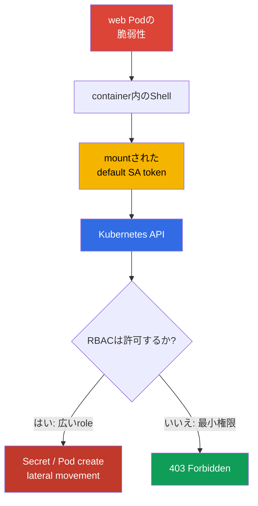
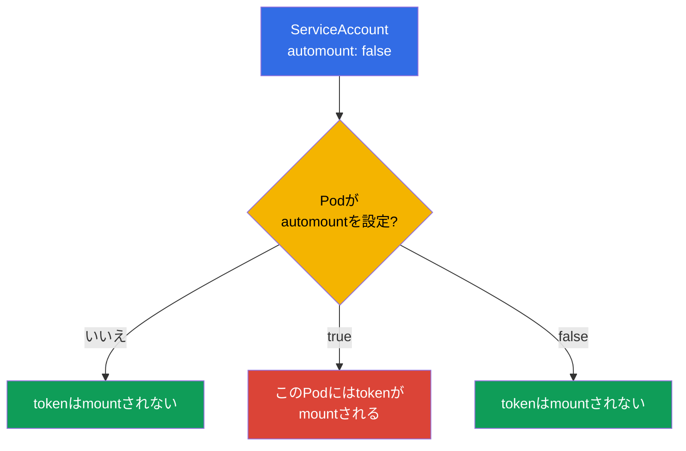
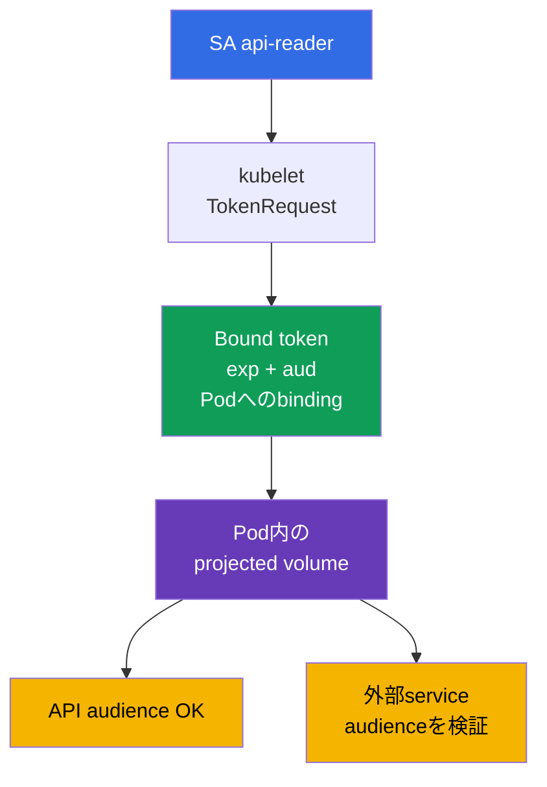

[Русская версия](ru.md) · [Eng version](README.md) · [Versión en español](es.md) · [Version française](fr.md) · [Deutsche Version](de.md) · [ქართული ვერსია](ge.md) · [繁體中文版](tw.md)

# 第11章. ServiceAccounts: 最小化とtoken

> **問題。** 脆弱なPod内のshellは、攻撃者にマウント済みServiceAccount bearer tokenへのアクセスを与えます。tokenが`default` accountまたは過剰なRBAC権限を持つidentityに発行されている場合、container外でSecretの読み取り、Podの作成、APIでのさらなるescalationに使用できます。short-lived tokenでも有効期間中は危険です。

> **次に行うこと。** 第10章でRBACにより権限を減らしました。次はPodが得るidentity自体、すなわちServiceAccountとそのtokenを制限します。侵害されたcontainer内の余計なtokenはKubernetes APIへの入口です。最小のServiceAccountと短命tokenはincidentの影響を減らします。これはCKSのCluster Hardening (15%) domainです。次章ではanonymous requests、network、apiserver settingsの側面からもAPIへのアクセスを閉じます。

> **CKAから必要なこと。** ServiceAccountの基本概念、authn -> authz -> admissionのchain、tokenの自動mountは[CKA第21章](../../../cka/course/21/jp.md)で扱います。Role、RoleBinding、権限の検証は[CKA第38章](../../../cka/course/38/jp.md)で扱います。ここでは基本syntaxを繰り返さず、least privilegeに適用します。

> 🧠 侵害されたPod内のtokenはServiceAccountのbearer credentialです。被害を決めるのはfileそのものではなく、このidentityの現在および将来のすべてのRBAC権限です。

## 11.1. 攻撃scenario: Pod内の`default` ServiceAccount token

各namespaceにはServiceAccount `default`があります。Podに`serviceAccountName`が指定されない場合、admission controllerはこれを割り当てます。defaultではこのSAのtokenもPodにmountされます。token自体が権限を意味するわけではなく、authorizationは引き続きRBACに依存します。しかし盗まれたtokenにより攻撃者はこのidentityになり、今与えられている、または後に与えられる**すべての**権限を使えます。

典型的な攻撃pathは、applicationのvulnerabilityがPod内のshellを与え、攻撃者がmountされたvolumeからtokenを読み取り、APIへ送ることです。`default` SAが「便利だから」という理由でRoleBindingを得ていたり、広いClusterRoleにbindされていたりすれば、Secretを読み、Podを作り、攻撃をさらに進められます。現在の権限がないtokenでも、通常のHTTP serviceには不要であり、そのfilesystemに置くべきではありません。



hardeningの目的は一つのcontrolに頼ることではありません。3つの独立した対策が必要です。APIを必要としないPodにtokenをmountしない、APIを必要とするPodには専用SAを用意する、このSAには必要なRBAC actionsだけを与える。第04章のNetworkPolicyと第12章のAPI access制限は、これらを補完しますが置き換えません。

> 🎯 APIなしではautomountを無効化します。APIが必要なら専用SA、short-lived bound token、最小のRole/RoleBindingを使い、その後tokenとAPI権限を検証します。

## 11.2. `automountServiceAccountToken`: defaultで無効にする

`automountServiceAccountToken: false` fieldは、ServiceAccount admission controllerが標準projected volumeをPodに追加することを禁止します。これはServiceAccountにもPodの`spec`にも設定できます。



Pod levelの値が優先されます。Podがこのfieldを設定しない場合、ServiceAccountの値が使われます。したがって安全なpatternは、namespaceの`default` SAおよび作成するSAでdefaultとしてautomountを無効にし、本当にAPIが必要だと確認してからPod manifestに例外を明示することです。

```bash
# 既存namespace用: default SAでtokenを禁止する。
kubectl -n cks-104 patch serviceaccount default \
  -p '{"automountServiceAccountToken":false}'

# 新しい値が記録されたことを確認する。
kubectl -n cks-104 get serviceaccount default \
  -o jsonpath='{.automountServiceAccountToken}{"\n"}'
# false
```

変更は既存Podのvolumeを削除しません。workloadを再作成して新しいPodを検証してください。次のmanifestはこのpathを二重に閉じます。そのSAではautomountが無効で、Podもmountを明示的に禁止します。tokenはcontainerにまったく入らないため、applicationが侵害されても盗むものがありません。これはKubernetes APIを呼ばないapplicationに正しいvariantです。

```yaml
apiVersion: v1
kind: ServiceAccount
metadata:
  name: app-sa
  namespace: cks-104
automountServiceAccountToken: false
---
apiVersion: v1
kind: Pod
metadata:
  name: app-without-api
  namespace: cks-104
spec:
  serviceAccountName: app-sa
  automountServiceAccountToken: false
  containers:
  - name: app
    image: nginx:1.30.4
```

tokenがないこととServiceAccountがないことを混同しないでください。Podには依然としてidentity `app-sa`があります。ただしcredentialがfilesystemに発行されていないだけです。また`automount: false`が、Secret、projected volume、environment variableなど別の方法で渡したtokenを止めるとは考えないでください。そのようなsourceは別途除外する必要があります。

> 🧠 JWT claims、audience、rotation、bound objectの検証がtoken credentialの境界を定めます。

## 11.3. Bound ServiceAccount tokenとprojected volume

modern Kubernetesでは、Podはtokenを持つ無期限のSecretではなく**bound ServiceAccount token**を受け取ります。kubeletはTokenRequest APIでtokenをrequestし、tokenは特定のServiceAccountにbindされ、有限のlifetime (`exp`)を持ち、期限前に自動rotationします。JWTにはissuer、subject `system:serviceaccount:<ns>:<sa>`、bound objectについてのclaimsがあります。bindされたPodが削除された場合、このcredentialを有効な信頼済みcredentialとみなせません。

`audience`はtokenの受信者を制限します。Kubernetes API用tokenにはapiserverが受け入れるaudienceが必要で、external service用tokenにはそのserviceのaudienceが必要です。external serviceはsignature、`iss`、`aud`、expiry、subjectを検証しなければなりません。一つのtokenを「すべて用」に使用してはなりません。盗まれたcredentialでauthenticationできる範囲が広がるためです。



以下のPodはimplicitな標準mountを受けません。代わりにKubernetes APIを呼ぶためだけに必要な一つのprojected volume、すなわちshort-lived token、CA、namespaceだけをmountします。`https://kubernetes.default.svc`を普遍的なAPI audienceとして固定しないでください。apiserverは`--api-audiences`の値を受け入れ、このflagがないとlistは`--service-account-issuer`から導かれます。そのためこのstringを持つtokenは一部clusterで`401`になります。Kubernetes API専用のtokenには`audience`を明示しないか、先に実際の`--api-audiences`/`--service-account-issuer`を確認してください。Vaultなどexternal serviceには別のaudienceを設定します。

```yaml
apiVersion: v1
kind: Pod
metadata:
  name: api-reader
  namespace: cks-104
spec:
  serviceAccountName: app-sa
  automountServiceAccountToken: false

  securityContext:
    runAsNonRoot: true
    runAsUser: 10001

  containers:
  - name: client
    image: curlimages/curl:8.12.1
    command: ["sh", "-c", "sleep 3600"]
    volumeMounts:
    - name: api-credential
      mountPath: /var/run/secrets/tokens
      readOnly: true
  volumes:
  - name: api-credential
    projected:
      defaultMode: 0444
      sources:
      - serviceAccountToken:
          path: token
          # Kubernetes API用のaudienceは設定しない: API serverが選択する。
          # 明示値は--api-audiencesと照合後にのみ使用できる。
          expirationSeconds: 3600
      - configMap:
          name: kube-root-ca.crt
          items:
          - key: ca.crt
            path: ca.crt
      - downwardAPI:
          items:
          - path: namespace
            fieldRef:
              fieldPath: metadata.namespace
```

公式image `curlimages/curl`はroot以外でprocessを実行します（curl-docker READMEの`running as curl_user is an explicit design decision`）。したがってこのexampleではruntime identityをimage metadata任せにせず、`runAsNonRoot: true`と`runAsUser: 10001`で明示します。

Linux Kubernetes v1.36では、projected ServiceAccount tokenに特別なpermission semanticsがあります。Podのすべてのcontainersが同じ`runAsUser`を使用する場合、kubeletはtokenをこのUIDにassignし、modeを強制的に`0600`にします。従ってこのsingle-container Podでは、`fsGroup`なしでtokenはUID `10001`だけがowner-readできます。

`defaultMode: 0444`は、non-root clientも読む必要がある非secretの`ca.crt`と`namespace`のmixed projection用です。bearer tokenをworld-readableにはしません。`serviceAccountToken`にはkubeletが前述の`0600`を別途適用します。

ここでは`fsGroup`は不要です。これを追加するとkubeletはvolumeにgroup ownershipを適用し、projected ServiceAccount tokenのpermissionsを`0600`から`0640`へ広げます。このようなgroup accessは複数processまたはGIDに実際に必要な場合だけ使用し、non-root `runAsUser`の必須条件としては使わないでください。

`expirationSeconds`は希望するlifetimeのrequestであり、永続credentialを得る方法ではありません。値は`600`以上でなければならず、limitはcontrol planeが決めます。kubeletは`exp`までにtoken fileを更新しますが、正確で普遍的なrotation intervalは保証されません。したがってapplicationは新しいconnectionまたはcredential updateごとにtokenへのpathを開き直し、古いcontentまたはfile descriptorをmemoryに保持してはなりません。tokenをterminal、CI logs、incident description、ticketへ出力しないでください。一時的なmanual verificationには別tokenを発行し、短いdurationを設定します。

```bash
# Kubernetes API用では、--api-audiencesを確認せずに--audienceを設定しない。
kubectl -n cks-104 create token app-sa --duration=10m
```

bindingの最新性が重要なexternal serviceには、apiserver経由の`TokenReview`が推奨されます。これはServiceAccountとbound Pod、Secret、Nodeの存在を確認し、対応objectの削除後にbound tokenを即座に拒否します。offline OIDC/JWT verificationはsignatureとclaimsを検証しますが、削除を知りません。そのtokenは`exp`まで有効なままです。objectが削除マークのみ（`deletionTimestamp`）の場合、authenticatorは遅くとも60秒以内にtokenを拒否します。

Kubernetes v1.33+では`ServiceAccountNodeAudienceRestriction`はBetaでdefault有効です。このrestrictionはadmission plugin `NodeRestriction`が適用します。feature gateが有効で、`NodeRestriction`がactiveで、TokenRequestが認識されたnode/kubelet identityから来る場合、kubeletはdefaultでそのNodeのworkloadsがすでに使うaudiencesだけをrequestできます。正当なexceptionにはadministratorがRBAC verb `request-serviceaccounts-token-audience`を与えられます。

このrestrictionはkubelet/node identitiesにのみ関係し、他のTokenRequest API callersは制限しません。

手動のtype `kubernetes.io/service-account-token` Secretはlong-lived bearer credentialを作ります。Kubernetesは、integrationに通常のexpiryなしのtokenが本当に必要な場合など、この方法を公式にsupportしていますが、upstream documentationは代わりにTokenRequestを使うことを明示的に推奨します。

courseではこのようなSecretを通常のcredential発行方法ではなくexceptionと考えてください。まずshort-lived TokenRequest、OIDC、またはfederationを優先します。特定integrationがlimited lifetimeで動作できない場合は、exceptionの理由、最小RBAC、Secret protection、rotation/revocation procedureをdocumentしてください。このSecretをPodにAPI accessを与える通常の方法として作成しないでください。これは自動の短いrotationを受けず、leak時の被害をより大きくします。

> 🔬 **Kubernetes v1.37: X.509 workload identity.** Bound ServiceAccount tokenはこの章の主なJWT identity modelです。Kubernetes v1.37ではPod CertificatesとClusterTrustBundlesもstableになりました。これらはX.509 workload credentialsの発行とrotationのbuilt-in primitivesです。これはCKS Coreの置き換えではなくproduction-current extensionです。[Kubernetes v1.37 Security Delta](../APPENDIX_K8S_137_SECURITY_DELTA_JP.md)を参照してください。

## 11.4. 専用ServiceAccountと最小RBAC

`default` SAはapplication roleではありません。APIが必要な各workloadには個別のServiceAccountを作り、最小のRBAC権限を与えてください。

必要なresourcesが一つのnamespaceだけにある場合は`Role` + `RoleBinding`を使います。再利用可能なrule setまたはcluster-scoped resourcesへのaccessが必要なら`ClusterRole`を使います。そのnamespaced権限を一つのnamespaceだけで与えるには`ClusterRole`を`RoleBinding`でbindします。本当にcluster-wideのaccessには`ClusterRoleBinding`を使います。

このexampleの`app-sa`はnamespace `cks-104`のPod listを読むことだけができます。`watch`、`create`、`delete`、Secret access、ClusterRoleBindingはありません。

```yaml
apiVersion: v1
kind: ServiceAccount
metadata:
  name: app-sa
  namespace: cks-104
automountServiceAccountToken: false
---
apiVersion: rbac.authorization.k8s.io/v1
kind: Role
metadata:
  name: app-pod-reader
  namespace: cks-104
rules:
- apiGroups: [""]
  resources: ["pods"]
  verbs: ["get", "list"]
---
apiVersion: rbac.authorization.k8s.io/v1
kind: RoleBinding
metadata:
  name: app-sa-pod-reader
  namespace: cks-104
subjects:
- kind: ServiceAccount
  name: app-sa
  namespace: cks-104
roleRef:
  apiGroup: rbac.authorization.k8s.io
  kind: Role
  name: app-pod-reader
```

適用し、許可されるactionと禁止されるactionをまさに検証します。`can-i`は必要なsubjectとしてauthorizerを確認し、Podからcredentialを取り出す必要がありません。

```bash
kubectl apply -f app-sa-rbac.yaml

kubectl auth can-i list pods -n cks-104 \
  --as=system:serviceaccount:cks-104:app-sa
# yes
kubectl auth can-i delete pods -n cks-104 \
  --as=system:serviceaccount:cks-104:app-sa
# no
kubectl auth can-i get secrets -n cks-104 \
  --as=system:serviceaccount:cks-104:app-sa
# no
```

このexampleでは`RoleBinding`が付与する権限をnamespace `cks-104`に制限し、namespaced `Role`を参照します。

`ClusterRoleBinding`をこのobjectの機械的な置き換えと考えないでください。`ClusterRoleBinding`は`Role`ではなく`ClusterRole`だけを参照できます。同様のrulesをcluster-wideで与えるには、まず`ClusterRole`を定義してから`ClusterRoleBinding`でbindする必要があります。

audit時はrule setとbinding scopeを別々に確認してください。個別に正当化されたtaskなしにwildcard `*`、`secrets`、`pods/exec`、`bind`、`escalate`、`impersonate`を追加してはなりません。SAの現在および将来の権限は、第10章のcommandで定期的に確認するとよいでしょう。

```bash
kubectl auth can-i --list -n cks-104 \
  --as=system:serviceaccount:cks-104:app-sa
```

> 🧠 workloadの作成または変更権限により、他者のServiceAccountを選び、そのtokenでcodeを実行できます。

## 11.4.1. RBAC: workloadへの権限はServiceAccount escalationになり得る

workloadをcreateまたはmodifyする権限は、applicationをrunする権限だけではありません。subjectが同じnamespaceの別の、よりprivilegedなSAを`serviceAccountName`に持つPod/Deploymentを作れる場合、このSAのtokenとAPI権限でcodeを実行できます。したがってbuilt-in role `edit`は無害とみなせません。workloadの変更とSecretの読み取りに加え、namespace内の任意ServiceAccountとしてPodをrunできます。deployerの権限とServiceAccount管理の権限を分け、sensitive SAを通常のworkload creatorsから利用可能なままにしないでください。

通常のread/write権限とは別に、他のRBAC escalation pathsも確認してください。`PersistentVolume`の作成はPodにdataまたはhost pathへのaccessを与え得ます。CSRのcreate/approveは新しいidentityを発行し得ます。`ValidatingWebhookConfiguration`または`MutatingWebhookConfiguration`の変更はadmission controlを変更します。`bind`、`escalate`、`impersonate`、RoleBinding/ClusterRoleBinding管理、およびこれらのpathsは専用administrative rolesだけに与えます。usersを`system:masters`に追加しないでください。このgroupは無制限のsuperuser accessを得て、RBACとauthorization webhooksをbypassします。

Kubernetes 1.36+ではConstrained Impersonationが、単一verb `impersonate`の古いmodelを拡張します。`impersonate:user-info`と`impersonate-on:*`を含む個別permissionsが適用されます。これはimpersonationを広く与える理由ではありません。subject、groups、scopeを制限し、検証には個別の最小admin-roleを使ってください。

## 11.5. 検証と診断: token、API、RBAC

検証では、二つの独立した条件を証明する必要があります。API taskのないPodにtokenがないこと、API taskのあるPodには指定されたshort-lived credentialだけが渡され、そのRoleの権限だけを持つことです。

```bash
# app-without-apiの作成後: 自動mountされたtoken fileが存在してはならない。
kubectl -n cks-104 exec app-without-api -- \
  test ! -e /var/run/secrets/kubernetes.io/serviceaccount/token

# api-readerには標準mountはないが、明示的にprojectされたtokenがある。
kubectl -n cks-104 exec api-reader -- sh -ec '
  test ! -e /var/run/secrets/kubernetes.io/serviceaccount/token
  test -r /var/run/secrets/tokens/token
  test -r /var/run/secrets/tokens/ca.crt
'

# 許可されるrequest: tokenは表示しない。curlはcontainer内でのみそれを読む。
kubectl -n cks-104 exec api-reader -- sh -ec '
  curl --fail --silent --show-error \
    --cacert /var/run/secrets/tokens/ca.crt \
    -H "Authorization: Bearer $(cat /var/run/secrets/tokens/token)" \
    https://kubernetes.default.svc/api/v1/namespaces/cks-104/pods >/dev/null
'
```

まずtransport、authentication、authorizationを区別してください。

- HTTP responseの前のTLS/certificate error: CA file、DNS/SAN、endpoint、TLS availabilityを確認します。
- HTTP `401 Unauthorized`: API serverがcredentialを受け入れていません。token path、signature/issuer、`audience`、`exp`/時刻、token integrityを確認します。
- HTTP `403 Forbidden`: authenticationは通りましたが、authorizerがactionを許可していません。Role/RoleBinding、namespace、targetを絞った`kubectl auth can-i`を確認します。

SAを変更後もPodに標準tokenがある場合は、Pod自身の`spec.automountServiceAccountToken`を確認し、再作成してください。

| 症状 | 確認する項目 | 典型的な原因 |
|---|---|---|
| 通常のapplicationにtokenがある | Pod specとServiceAccount | `automount: false`が設定されていない、またはPodが`true`でSAを明示的にoverrideしている |
| 期待するactionに対して`can-i`が`no`を返す | `roleRef`、namespace、subject | RoleBindingが別のnamespaceにある、またはSA名が誤っている |
| TLS/certificate errorでHTTP statusを受信しない | CA、DNS/SAN、endpoint、TLS connectivity | clientが信頼済みTLS connectionを確立できない |
| APIが`401`を返す | token path、issuer/signature、`audience`、`exp`、時刻 | credentialが期限切れ、破損、またはauthenticatorに受け入れられない |
| APIが`403`を返す | targetを絞った`kubectl auth can-i`、Role/RoleBinding、namespace | credentialは有効だが、必要なverb/resourceが許可されていない |
| token SecretがGitに現れた | Git historyとCI logs | legacy Secretが作成された、またはcommandがcredentialを表示した。revoke/reissueし、logsから除去する |

> 🏭 workloadごとに専用SAを用意し、定期的なRBAC reviewとcredential leakのrevoke・調査用runbookを整備してください。

## 11.6. productionでの適用方法

- **automatic token mountingをdefaultで無効化します。** platform teamは各application namespaceの`default` SAで`automountServiceAccountToken`を無効化します。APIを必要としないworkloadもPod templateに`automountServiceAccountToken: false`を設定し、例外がcode reviewで見えるようにします。
- **一つのworkloadに一つのSA。** 分離されたServiceAccountと最小RBAC bindingはblast radiusを小さくします。一つのnamespace内の権限には`RoleBinding`を使用します。これはlocalの`Role`または再利用可能な`ClusterRole`を参照できます。subjectが実際にcluster-wide scopeを必要とする場合、すなわちcluster-scoped resourcesや全namespaceで同一のnamespaced permissionsが必要な場合だけ、`ClusterRoleBinding`を使います。
- **static Secretではなくbound token。** Podにはshort lifetimeと狭いaudienceを持つprojected tokenを使用します。external systemsにはservice-account-token Secretをコピーする代わりに、TokenRequest、OIDC workload identity、cloud federationを使います。
- **cloud identityとKubernetes RBACを分離します。** IRSA、Workload IdentityなどのmechanismはSAをcloud roleにbindします。これはKubernetes RBACを不要にしません。workloadが受けるAPI permissionsとcloud permissionsを別々に確認してください。
- **controlとresponse。** RBAC review、audit logs、repositories/logsでのtoken検索を定期的に行います。leak後は侵害されたPodまたはSAを削除し、そのbindingを外してworkloadを再作成し、credentialが実行できたrequestsを調査します。

## 11.7. ミニ用語集

- **ServiceAccount (SA)** - Kubernetes APIにおけるPodとprocessのnamespaced identity。
- **default ServiceAccount** - `serviceAccountName`を指定しない場合にPodへ割り当てられるSA。
- **`automountServiceAccountToken`** - credentialのPodへの自動mountを許可または禁止するflag。Podの値がSAの値より優先されます。
- **Bound ServiceAccount token** - TokenRequest APIにより発行され、ServiceAccountとPod objectにbindされたshort-lived token。
- **projected volume** - token、ConfigMap、downward APIなどのsourceを指定のfilesとして構成するvolume。
- **audience** - tokenのrecipient。serviceは自身のaudienceを持つtokenだけを受け入れるべきです。
- **TokenRequest API** - short-lived ServiceAccount tokenを発行するAPI。
- **RoleBinding** - RoleまたはClusterRoleをSAなどのsubjectにnamespacedにbindするobject。

## 11.8. 章のまとめ

- 侵害されたPod内の`default` SA tokenはKubernetes API credentialです。影響はRBACで決まるため、tokenと権限をまとめて最小化します。
- `automountServiceAccountToken: false`はServiceAccount tokenの自動mountを無効化します。Podの値がServiceAccountの値より優先され、すでに作成されたPodは再作成が必要です。
- modern Podは、有限のlifetimeとaudienceを持ちkubeletがrotationするbound projected tokenを受け取ります。Kubernetesは手動で作成するlong-lived ServiceAccount token Secretを公式にsupportしていますが、このcourseではPod credentialを発行する通常の方法ではなく、documentされたexceptionと扱います。
- API accessを持つworkloadには、`default` SAの権限やwildcardではなく、専用SA、namespaced Role、正確な`verbs`と`resources`を持つRoleBindingを与えます。
- 検証には、通常Podにtokenがないこと、SAに対する`kubectl auth can-i`、明示的にprojectされたcredentialでの実際のAPI callを含めます。`401`と`403`は異なる方法で診断します。

## 11.9. これはどのように役立つか: 試験と実務

**試験で。** ServiceAccount、Role、RoleBindingを素早く作成し、`kubectl auth can-i --as=system:serviceaccount:<ns>:<sa>`で許可と拒否を確認します。automountをどこで無効にするか、namespaceの`default` SAか特定のPodかに注意してください。YAMLだけでなく`kubectl exec`でtoken fileがないことを確認します。Lab 104では、このskillをRBACとanonymous API accessの制限と組み合わせます。

**実務で。** ServiceAccountはすべてのPodのattack surfaceの一部です。「明示的に必要な場合を除きtokenを渡さない」policyと、分離されたleast-privilege SAにより、applicationのRCEの影響を減らせます。short lifetimeと正しいaudienceを持つprojected bound tokenはcredentialをより狭く管理しやすくしますが、RBAC、audit、network isolationの必要性をなくすものではありません。

## 11.10. 自己確認問題

<details>
<summary>1. 現在API requestを行わないPodでも、なぜ`default` SA tokenは危険ですか?</summary>

現在のapplicationがAPIを呼ばなくても、tokenは`default` ServiceAccount identityのcredentialです。RCEの後、攻撃者はmountされたtokenを読み、SAが現在持つ、または後でRBACにより得るすべての権限を使えます。通常のHTTP serviceにはこのcredentialをfilesystemに置く必要がないため、automountを無効にします。
</details>

<details>
<summary>2. ServiceAccountとPodの`automountServiceAccountToken`はどのように関係しますか? 競合した場合はどちらの値が適用されますか?</summary>

Podがこのfieldを指定しない場合、そのServiceAccountの値が適用されます。Pod自身の`spec`の値が優先されるため、PodはSA defaultとは別にmountを明示的に有効または無効にできます。SAを変更しても既存Podのvolumeは削除されません。workloadを再作成して新しいPodを確認してください。
</details>

<details>
<summary>3. なぜbound projected tokenはServiceAccount tokenを持つlegacy Secretより安全ですか?</summary>

bound tokenはTokenRequest APIが発行し、特定のServiceAccountとPodにbindされ、`exp`を持ち、kubeletが期限前に自動rotationします。legacy Secretはこの通常の短いrotationなしにlong-lived credentialを作るため、leak時の被害を増やします。bindされたPodが削除された後は、bound credentialも信頼できる有効なcredentialとみなしてはなりません。
</details>

<details>
<summary>4. `audience`は何を制限し、tokenを受け入れるserviceは何を検証する必要がありますか?</summary>

`audience`はtokenのrecipientを制限します。Kubernetes API用tokenが、検証なしにexternal Vaultなど別service用tokenになってはなりません。tokenを受け入れるexternal serviceはsignature、`iss`、自身の`aud`、expiration、subjectを確認する必要があります。実際の`--api-audiences`または`--service-account-issuer`を確認せず、Kubernetes API用tokenに明示的なaudienceを設定しないでください。
</details>

<details>
<summary>5. exampleの`app-sa`がClusterRoleBindingではなくRoleBindingを受けるのはなぜですか?</summary>

`app-sa`はnamespace `cks-104`内のPodを読むだけなので、`RoleBinding`が正しいscopeを与えます。このexampleでは`Role app-pod-reader`を参照します。`ClusterRoleBinding`はこの`Role`を参照できません。cluster-wide variantには必要なrulesを持つ`ClusterRole`と`ClusterRoleBinding`が必要です。rulesとbinding scopeを区別することが重要です。`RoleBinding`は与えるnamespaced permissionsを自身のnamespaceに制限し、`ClusterRoleBinding`は`ClusterRole` rulesをcluster-wideに与えます。
</details>

<details>
<summary>6. TLS問題、無効なtoken（`401`）、不十分なRBAC権限（`403`）をどのように区別しますか?</summary>

TLS trustが確立されなければ、clientはHTTP authenticationの前にcertificate/TLS errorを受けます。CA、DNS/SAN、endpointを確認します。`401 Unauthorized`はAPI serverがHTTP requestを受け取ったがcredentialを認めなかったことを意味します。token path、issuer/signature、audience、expiry、時刻を確認します。`403 Forbidden`はauthenticationが通ったがauthorizerが必要なresource/verb/scopeを許可しなかったことを意味します。targetを絞った`kubectl auth can-i`で確認してください。
</details>

<details>
<summary>7. API taskのないPodに、標準で自動injectされるServiceAccount tokenがmountされていないことを証明するには、どの確認が必要ですか?</summary>

ServiceAccountと新しいPod specで`automountServiceAccountToken: false`を確認し、Pod fieldの優先順位を考慮します。続いてcontainer内で標準pathがないことを確認します。

```bash
test ! -e /var/run/secrets/kubernetes.io/serviceaccount/token
```

workloadを変更した後は、既存volumeが自動では消えないためPodを再作成し、確認を繰り返します。

これは**標準的な自動injection**がないことを証明するものであり、可能なすべてのServiceAccount credentialがないことの証明ではありません。「PodはSA tokenを一切受け取ってはならない」という要件なら、`volumes`、`projected.serviceAccountToken`、Secret/env、sidecar/init-container、その他のcredential発行mechanismもreviewしてください。
</details>

<details>
<summary>8. **振り返り（第21章）。** legacy ServiceAccount tokenはKubernetes `Secret`に保存されていました。このtokenの脅威は、第21章の通常のapplication `Secret`（たとえば`db-password`）とどう異なりますか? また、bound projected tokenによる脅威の低減は、etcd内の`Secret`に対するencryption at restによる低減と、なぜ異なりますか?</summary>

legacy ServiceAccount tokenはbearer credentialであり、そのRBACの範囲内でidentityとしてKubernetes APIを操作できます。`db-password`は通常、特定のapplication systemへのaccessを与えます。bound projected tokenはlifetime、audience、Pod binding、rotationにより、盗まれたcredentialの使用リスクを減らします。encryption at restはetcd内のSecret dataを保護しますが、すでにmountまたは読み取り済みのtokenを制限せず、その短いlifecycleの代わりにもなりません。
</details>

## 練習

Lab 104で最小のSAとRoleBindingを作成し、`default` SAのautomountを無効にして、tokenのないPodにcredential fileがないことを証明してください。次に`kubectl auth can-i`で`list pods`の許可と`delete pods`の拒否を確認します。次章ではAPI自体の保護、すなわちanonymous access、authorization modes、network boundariesを追加します。

🧪 Lab 104（RBAC、ServiceAccount、API restriction）：
[tasks/cks/labs/104](../../labs/104/README_JP.MD)

🌐 追加のinteractive practice（killer.sh/killercoda、external resource）：[serviceaccount-token-mounting](https://killercoda.com/killer-shell-cks/scenario/serviceaccount-token-mounting)

🎮 Killercoda（installation不要のbrowser内）：[Create Service Account For a Pod](https://killercoda.com/chadmcrowell/course/cka/create-sa-for-pod) · [Role and RoleBinding](https://killercoda.com/chadmcrowell/course/ckad/role-rolebinding)

---
[目次](../README_JP.md) · [第10章](../10/jp.md) · [第12章](../12/jp.md)
