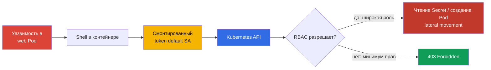
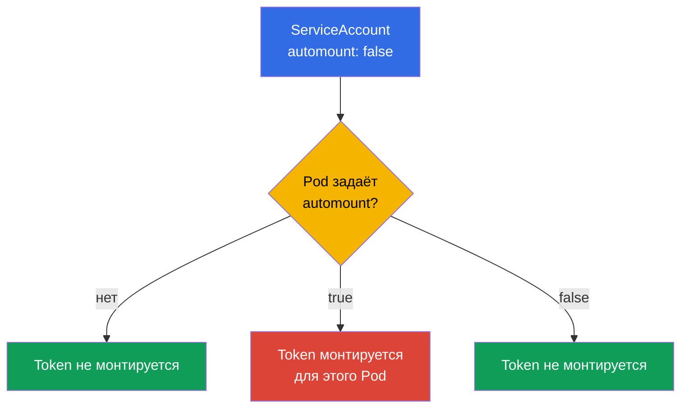
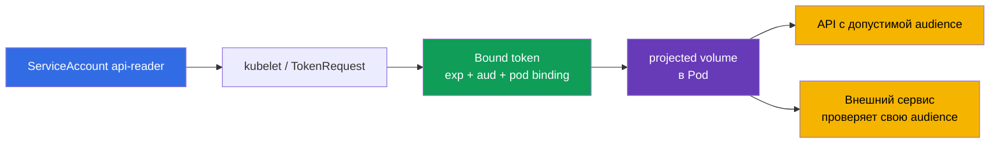

<!-- Standalone RU release: ссылки на переводы удалены, потому что соответствующие файлы не входят в архив. -->

# Глава 11. ServiceAccounts: минимизация и токены

> **Что дальше.** В главе 10 мы уменьшили права через RBAC. Теперь ограничим саму
> идентичность, которую получает Pod: ServiceAccount и его token. Лишний token в
> скомпрометированном контейнере - готовый вход в Kubernetes API; минимальный
> ServiceAccount и короткоживущий token уменьшают последствия инцидента. Это домен
> Cluster Hardening (15%) CKS. В следующей главе закроем доступ к API также со стороны
> anonymous-запросов, сетей и настроек apiserver.

> **Что нужно из CKA.** Базовые понятия ServiceAccount, цепочка authn -> authz -> admission
> и автоматическое монтирование token разобраны в [главе 21 CKA](../../../cka/course/21/ru.md).
> Role, RoleBinding и проверка прав - в [главе 38 CKA](../../../cka/course/38/ru.md).
> Здесь не повторяем базовый синтаксис, а применяем его для least privilege.

## 11.1. Сценарий атаки: token `default`-ServiceAccount в Pod

Каждый namespace содержит ServiceAccount `default`. Если у Pod не указан
`serviceAccountName`, admission-контроллер назначает именно его. По умолчанию token этого
SA также монтируется в Pod. Сам по себе token не означает прав: авторизация всё ещё зависит
от RBAC. Но украденный token позволяет атакующему стать этой идентичностью и использовать
**все** права, которые ей выданы сейчас или будут выданы позднее.

Типичный путь атаки: уязвимость в приложении даёт shell в Pod, атакующий читает token из
смонтированного тома, затем отправляет его в API. Если `default` SA получил RoleBinding
«для удобства» или связан с широкой ClusterRole, можно читать Secret, создавать Pod или
развивать атаку дальше. Даже token без текущих прав не нужен обычному HTTP-сервису и не
должен лежать в его файловой системе.



Цель hardening не в том, чтобы надеяться на один control. Нужны три независимые меры:
не монтировать token Pod, которому API не нужен; выделять отдельный SA для Pod, которому
API нужен; давать этому SA только необходимые RBAC-действия. NetworkPolicy из главы 04 и
ограничение доступа к API из главы 12 дополняют, но не заменяют эти меры.

## 11.2. `automountServiceAccountToken`: выключать по умолчанию

Поле `automountServiceAccountToken: false` запрещает ServiceAccount admission-контроллеру
добавлять стандартный projected volume в Pod. Его можно поставить на ServiceAccount или
прямо в `spec` Pod.



Значение на уровне Pod имеет приоритет. Если Pod не задаёт это поле, используется значение
ServiceAccount. Поэтому безопасный паттерн - выключить automount у `default` SA namespace
и у созданных SA по умолчанию, а исключения описывать явно в манифесте Pod после проверки,
что ему действительно нужен API.

```bash
# Для уже существующего namespace: запретить token у default SA.
kubectl -n cks-104 patch serviceaccount default \
  -p '{"automountServiceAccountToken":false}'

# Убедиться, что новое значение записано.
kubectl -n cks-104 get serviceaccount default \
  -o jsonpath='{.automountServiceAccountToken}{"\n"}'
# false
```

Изменение не удаляет volume у уже созданного Pod: пересоздайте workload и проверьте новый
Pod. Следующий манифест защищает Pod дважды: у его SA выключен automount, и Pod также
явно запрещает монтирование. Это правильный вариант для приложения, которое не вызывает
Kubernetes API.

```yaml
apiVersion: v1
kind: ServiceAccount
metadata:
  name: app-sa
  namespace: cks-104
automountServiceAccountToken: false
---
apiVersion: v1
kind: Pod
metadata:
  name: app-without-api
  namespace: cks-104
spec:
  serviceAccountName: app-sa
  automountServiceAccountToken: false
  containers:
  - name: app
    image: nginx:1.30.4
```

Не путайте отсутствие token с отсутствием ServiceAccount. Pod всё равно имеет identity
`app-sa`; просто credential не выдан в его filesystem. Также не рассчитывайте, что
`automount: false` остановит приложение, которому token передали иным способом - через
Secret, projected volume или переменную окружения. Такие источники нужно исключать отдельно.

## 11.3. Bound ServiceAccount token и projected volume

В современных Kubernetes Pod получает **bound ServiceAccount token**, а не бессрочный
Secret с token. Kubelet запрашивает token через TokenRequest API, token связан с конкретным
ServiceAccount, имеет ограниченный срок жизни (`exp`) и автоматически ротируется до
истечения. В JWT присутствуют claims об issuer, subject `system:serviceaccount:<ns>:<sa>`
и bound object. При удалении привязанного Pod такой credential нельзя считать действующим
доверенным credential.

`audience` ограничивает получателя token. Token для Kubernetes API должен иметь audience,
принимаемый apiserver; token для внешнего сервиса должен иметь audience этого сервиса.
Внешний сервис обязан проверить подпись, `iss`, `aud`, срок действия и subject. Нельзя
использовать один token «для всего»: это расширяет область, где украденный credential
годится для аутентификации.



Ниже Pod не получает неявный стандартный mount. Вместо него монтируется ровно один
projected volume, нужный для вызова Kubernetes API: короткоживущий token, CA и namespace.
`https://kubernetes.default.svc` - обычная audience API в кластере; при нестандартной
конфигурации apiserver используйте его фактически разрешённую audience.

```yaml
apiVersion: v1
kind: Pod
metadata:
  name: api-reader
  namespace: cks-104
spec:
  serviceAccountName: app-sa
  automountServiceAccountToken: false
  containers:
  - name: client
    image: curlimages/curl:8.12.1
    command: ["sh", "-c", "sleep 3600"]
    volumeMounts:
    - name: api-credential
      mountPath: /var/run/secrets/tokens
      readOnly: true
  volumes:
  - name: api-credential
    projected:
      defaultMode: 0400
      sources:
      - serviceAccountToken:
          path: token
          audience: https://kubernetes.default.svc
          expirationSeconds: 3600
      - configMap:
          name: kube-root-ca.crt
          items:
          - key: ca.crt
            path: ca.crt
      - downwardAPI:
          items:
          - path: namespace
            fieldRef:
              fieldPath: metadata.namespace
```

`expirationSeconds` - запрос желаемого времени жизни, а не способ получить бессрочный
credential: значение должно быть не меньше `600`, а предел всё равно определяет control
plane. Kubelet обновляет файл token до `exp`, но точный универсальный интервал ротации не
гарантирован. Поэтому приложение должно переоткрывать путь к token при каждом новом
подключении или при обновлении credential, а не хранить старое содержимое или дескриптор
файла в памяти. Не печатайте token в терминал, CI-логи, описание инцидента или ticket.
Для временной ручной проверки выдайте отдельный token и задайте короткую duration:

```bash
kubectl -n cks-104 create token app-sa \
  --audience=https://kubernetes.default.svc --duration=10m
```

Для внешнего сервиса, которому важна актуальность привязки, рекомендуется `TokenReview`
через apiserver: он проверяет наличие ServiceAccount и bound Pod, Secret или Node и
немедленно отклоняет bound token после удаления соответствующего объекта. Offline-проверка
OIDC/JWT проверяет подпись и claims, но не узнаёт об удалении: такой token остаётся
валидным только до `exp`. Если объект лишь помечен на удаление (`deletionTimestamp`),
authenticator отклонит token не позднее чем через 60 секунд.

В Kubernetes v1.33 `ServiceAccountNodeAudienceRestriction` - beta-функция, включённая по
умолчанию. Она ограничивает audiences, которые kubelet запрашивает через TokenRequest,
теми, что уже указаны у workloads на этом Node; для обоснованных исключений требуется
новый RBAC verb `request-serviceaccounts-token-audience`.

Legacy-вариант - Secret типа `kubernetes.io/service-account-token`, созданный намеренно
с аннотацией SA. Он создаёт долгоживущий credential и нужен только для старой внешней
интеграции, которую нельзя перевести на TokenRequest/OIDC. Не создавайте такой Secret как
обычный способ дать Pod доступ к API; он не получает автоматическую короткую ротацию и
сильнее увеличивает ущерб при утечке.

## 11.4. Выделенный ServiceAccount и минимальный RBAC

`default` SA не является ролью приложения. Для каждого workload, которому нужен API,
создайте отдельный SA и namespaced Role. В этом примере `app-sa` может только читать список
Pod в namespace `cks-104`: никакого `watch`, `create`, `delete`, доступа к Secret или
ClusterRoleBinding.

```yaml
apiVersion: v1
kind: ServiceAccount
metadata:
  name: app-sa
  namespace: cks-104
automountServiceAccountToken: false
---
apiVersion: rbac.authorization.k8s.io/v1
kind: Role
metadata:
  name: app-pod-reader
  namespace: cks-104
rules:
- apiGroups: [""]
  resources: ["pods"]
  verbs: ["get", "list"]
---
apiVersion: rbac.authorization.k8s.io/v1
kind: RoleBinding
metadata:
  name: app-sa-pod-reader
  namespace: cks-104
subjects:
- kind: ServiceAccount
  name: app-sa
  namespace: cks-104
roleRef:
  apiGroup: rbac.authorization.k8s.io
  kind: Role
  name: app-pod-reader
```

Примените и проверьте именно разрешённое и запрещённое действие. `can-i` проверяет
authorizer как нужный субъект и не требует извлекать credential из Pod.

```bash
kubectl apply -f app-sa-rbac.yaml

kubectl auth can-i list pods -n cks-104 \
  --as=system:serviceaccount:cks-104:app-sa
# yes
kubectl auth can-i delete pods -n cks-104 \
  --as=system:serviceaccount:cks-104:app-sa
# no
kubectl auth can-i get secrets -n cks-104 \
  --as=system:serviceaccount:cks-104:app-sa
# no
```

RoleBinding ограничивает область namespace `cks-104`. Не заменяйте его ClusterRoleBinding
«ради простоты»: тогда те же permissions станут cluster-wide. Не добавляйте wildcard `*` в
`resources` или `verbs`, а также не выдавайте `secrets`, `pods/exec`, `bind`, `escalate` и
`impersonate` без отдельно обоснованной задачи. Текущие и будущие права SA полезно регулярно
проверять командой из главы 10:

```bash
kubectl auth can-i --list -n cks-104 \
  --as=system:serviceaccount:cks-104:app-sa
```

## 11.5. Проверка и диагностика: token, API и RBAC

Проверка должна доказывать два независимых условия: Pod без API-задачи не содержит token,
а Pod с API-задачей получает только заданный short-lived credential и только разрешения
своей Role.

```bash
# После создания app-without-api: token не должен существовать.
kubectl -n cks-104 exec app-without-api -- \
  test ! -e /var/run/secrets/kubernetes.io/serviceaccount/token

# У api-reader нет стандартного mount, но есть явно спроецированный token.
kubectl -n cks-104 exec api-reader -- sh -ec '
  test ! -e /var/run/secrets/kubernetes.io/serviceaccount/token
  test -r /var/run/secrets/tokens/token
  test -r /var/run/secrets/tokens/ca.crt
'

# Разрешённый запрос: token не выводится, curl читает его только внутри контейнера.
kubectl -n cks-104 exec api-reader -- sh -ec '
  curl --fail --silent --show-error \
    --cacert /var/run/secrets/tokens/ca.crt \
    -H "Authorization: Bearer $(cat /var/run/secrets/tokens/token)" \
    https://kubernetes.default.svc/api/v1/namespaces/cks-104/pods >/dev/null
'
```

`401 Unauthorized` означает, что API не принял credential: проверьте срок действия,
`audience`, issuer, CA и путь к token. `403 Forbidden` означает успешную аутентификацию,
но недостаточные RBAC-права: проверьте `Role`, `RoleBinding`, namespace и `can-i`. Если
в Pod всё ещё есть стандартный token после изменения SA, проверьте `spec.automountServiceAccountToken`
у самого Pod и пересоздайте его.

| Симптом | Что проверить | Типичная причина |
|---|---|---|
| Token есть у обычного приложения | Pod spec и ServiceAccount | Не задан `automount: false`, либо Pod явно переопределил SA значением `true` |
| `can-i` возвращает `no` для ожидаемого действия | `roleRef`, namespace, subject | RoleBinding в другом namespace или неверное имя SA |
| API отвечает `403` | `kubectl auth can-i --list` | Token валиден, но Role намеренно не содержит нужный verb/resource |
| API отвечает `401` | `audience`, `expirationSeconds`, CA, время | Token истёк, audience не принимается apiserver или credential повреждён |
| В Git появился token Secret | история Git и CI-логи | Создан legacy Secret или credential выведен командой; отзовите/перевыпустите и удалите из логов |

## 11.6. Как это применяют в продакшене

- **Deny by default для token.** Platform team выключает `automountServiceAccountToken` у
  `default` SA каждого прикладного namespace. Workload, которому API не нужен, фиксирует
  `automountServiceAccountToken: false` и в шаблоне Pod, чтобы исключение было видно в
  code review.
- **Один workload - один SA.** Отдельные ServiceAccount, Role и RoleBinding уменьшают
  blast radius. Права дают в нужном namespace и с минимальным набором verb/resource;
  `ClusterRoleBinding` используют только когда объект действительно cluster-scoped.
- **Bound token вместо статичного секрета.** Для Pod используют projected token с коротким
  сроком и узкой audience. Для внешних систем применяют TokenRequest, OIDC workload
  identity или облачную федерацию, а не копируют service-account-token Secret.
- **Identity для облака отдельно от Kubernetes RBAC.** IRSA, Workload Identity и похожие
  механизмы связывают SA с облачной ролью. Это не отменяет Kubernetes RBAC: отдельно
  проверяйте, какие API-права и какие cloud permissions получает workload.
- **Контроль и реакция.** RBAC review, audit-логи и поиск token в репозиториях/логах должны
  быть регулярными. При утечке удалите скомпрометированный Pod или SA, снимите binding,
  пересоздайте workload и расследуйте, какие запросы credential успел выполнить.

## 11.7. Мини-глоссарий

- **ServiceAccount (SA)** - namespaced identity для Pod и процессов в Kubernetes API.
- **default ServiceAccount** - SA, назначаемый Pod, если `serviceAccountName` не указан.
- **`automountServiceAccountToken`** - флаг, разрешающий или запрещающий автоматическое
  монтирование credential в Pod; значение Pod приоритетнее значения SA.
- **Bound ServiceAccount token** - краткоживущий token, выпущенный TokenRequest API и
  привязанный к ServiceAccount и объекту Pod.
- **projected volume** - volume, собирающий token, ConfigMap, downward API и другие
  источники в заданные файлы.
- **audience** - получатель token; сервис обязан принимать только token со своей audience.
- **TokenRequest API** - API выпуска short-lived ServiceAccount token.
- **RoleBinding** - namespaced привязка Role или ClusterRole к субъекту, например SA.

## 11.8. Итоги главы

- Token `default` SA в скомпрометированном Pod - credential для Kubernetes API; его ущерб
  определяется RBAC, поэтому token и права минимизируют вместе.
- `automountServiceAccountToken: false` выключает автоматическую выдачу token. Значение в
  Pod имеет приоритет над значением ServiceAccount; уже созданные Pod нужно пересоздать.
- Современный Pod получает bound projected token с ограниченным сроком жизни и audience,
  а kubelet его ротирует. Долгоживущий token Secret - исключение для legacy-интеграций.
- Workload с доступом к API получает отдельный SA, namespaced Role и RoleBinding с точными
  `verbs` и `resources`, а не права `default` SA или wildcard.
- Проверка включает отсутствие token в обычном Pod, `kubectl auth can-i` для SA и реальный
  API-вызов с явно спроецированным credential; `401` и `403` диагностируются по-разному.

## 11.9. Как это пригодится: на экзамене и в реальной работе

**На экзамене.** Быстро создайте ServiceAccount, Role и RoleBinding, затем подтвердите
разрешение и запрет через `kubectl auth can-i --as=system:serviceaccount:<ns>:<sa>`.
Обратите внимание, где требуется отключить automount: на `default` SA namespace или в
конкретном Pod. Проверьте отсутствие файла token через `kubectl exec`, а не только YAML.
Лаба 104 объединяет этот навык с RBAC и ограничением anonymous-доступа к API.

**В реальной работе.** ServiceAccount - часть attack surface каждого Pod. Политика
«токенов нет, пока не доказана необходимость» вместе с отдельными least-privilege SA
снижает ущерб от RCE в приложении. Projected bound token с короткой lifetime и верной
audience делает credential более узким и управляемым, но не отменяет RBAC, audit и
сетевую изоляцию.

## 11.10. Вопросы для самопроверки

1. Почему token `default` SA опасен даже в Pod, который сейчас не делает запросов к API?
2. Как соотносятся `automountServiceAccountToken` на ServiceAccount и на Pod? Какое
   значение применяется при конфликте?
3. Почему bound projected token безопаснее legacy Secret с ServiceAccount token?
4. Что ограничивает `audience` и что обязан проверить сервис, принимающий token?
5. Почему `app-sa` из примера получает RoleBinding, а не ClusterRoleBinding?
6. Как отличить истёкший или неверный token (`401`) от недостаточных RBAC-прав (`403`)?
7. Какие три проверки докажут, что Pod без API-задачи действительно не может использовать
   ServiceAccount token?

## Практика

В лабе 104 создайте минимальный SA и RoleBinding, отключите automount у `default` SA и
докажите, что Pod без token не имеет файла credential. Затем проверьте разрешение `list pods`
и запрет `delete pods` через `kubectl auth can-i`. Следующая глава добавляет защиту самого
API: anonymous access, authorization modes и сетевые границы.

🧪 Лаба 104 (RBAC, ServiceAccount и ограничение API):
[tasks/cks/labs/104](../../labs/104/README_RU.MD)

🎮 Killercoda (в браузере, без установки): [Create Service Account For a Pod](https://killercoda.com/chadmcrowell/course/cka/create-sa-for-pod) · [Role and RoleBinding](https://killercoda.com/chadmcrowell/course/ckad/role-rolebinding)

---
[Оглавление](../README_RU.md) · [Глава 10](../10/ru.md) · [Глава 12](../12/ru.md)