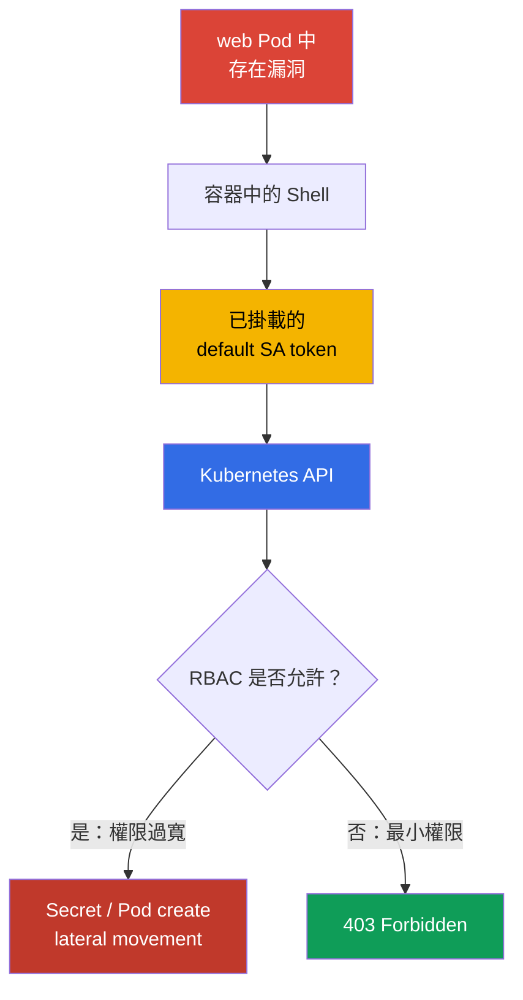
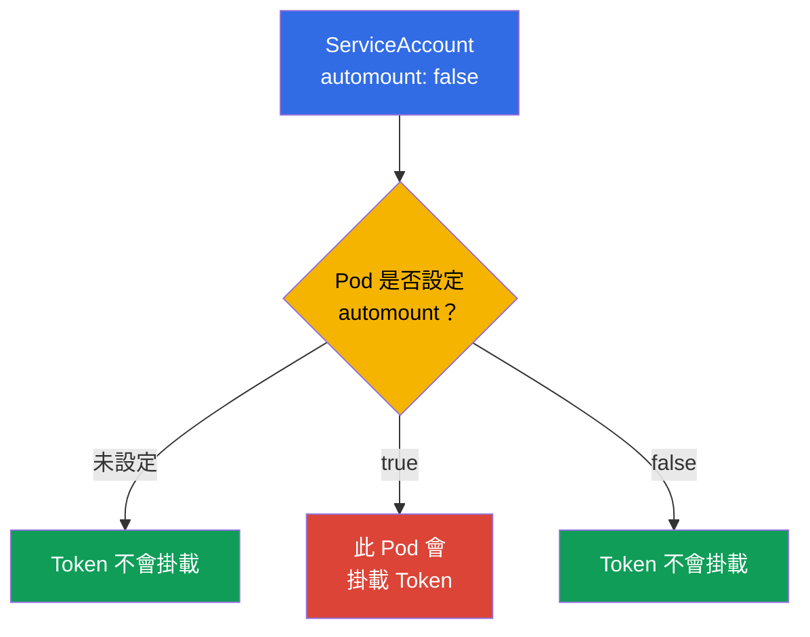
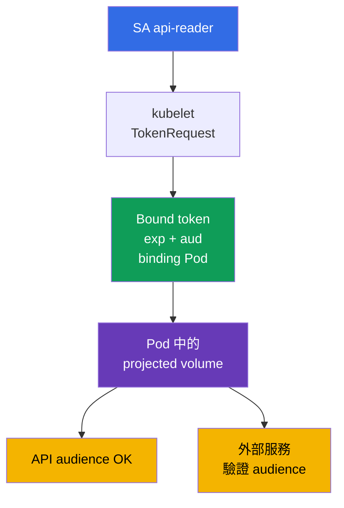

[Русская версия](ru.md) · [Eng version](README.md) · [Versión en español](es.md) · [Version française](fr.md) · [Deutsche Version](de.md) · [ქართული ვერსია](ge.md) · [日本語版](jp.md)

# 第 11 章。ServiceAccounts：最小化與權杖

> **問題。** 易受攻擊 Pod 中的 shell 會讓攻擊者存取已掛載的 ServiceAccount bearer token。若 token 發給 `default` 帳戶或 RBAC 權限過大的 identity，便可在容器外用它讀取 Secret、建立 Pod，並在 API 中進一步提升權限；即使是 short-lived token，在有效期間內也很危險。

> **接下來。** 第 10 章中，我們藉由 RBAC 縮小了權限。現在要限制 Pod 取得的 identity 本身：ServiceAccount 及其 token。遭入侵容器中的多餘 token，就是通往 Kubernetes API 的現成入口；最小化的 ServiceAccount 與短效 token 可降低事件後果。這屬於 CKS 的 Cluster Hardening（15%）領域。下一章也會從 anonymous request、網路及 apiserver 設定等面向封鎖 API 存取。

> **需要的 CKA 基礎。** ServiceAccount 的基本概念、authn -> authz -> admission 鏈，以及 token 的自動掛載，請見 [CKA 第 21 章](../../../cka/course/21/tw.md)。Role、RoleBinding 與權限檢查，請見 [CKA 第 38 章](../../../cka/course/38/tw.md)。本章不重複基本語法，而是將其用於 least privilege。

> 🧠 遭入侵 Pod 中的 token 是 ServiceAccount 的 bearer credential：其危害不是由檔案本身決定，而是由這個 identity 現在及未來所有 RBAC 權限決定。

## 11.1. 攻擊情境：Pod 中 `default`-ServiceAccount 的 token

每個 namespace 都有一個 `default` ServiceAccount。若 Pod 未指定
`serviceAccountName`，admission controller 會指派它。此 SA 的 token 預設也會掛載至
Pod。token 本身不代表權限：authorization 仍取決於 RBAC。但遭竊的 token 可讓攻擊者成為該 identity，並使用**所有**現在已授予或日後會授予它的權限。

典型攻擊路徑是：應用程式漏洞提供 Pod shell，攻擊者從掛載的 volume 讀取 token，接著將它傳送給 API。若 `default` SA 為了「方便」取得 RoleBinding，或綁定至寬廣的 ClusterRole，攻擊者便能讀取 Secret、建立 Pod，或繼續推進攻擊。即使沒有目前權限的 token，對一般 HTTP 服務也沒有必要，且不應放在其 filesystem 中。



hardening 的目的不是仰賴單一 control。需要三項彼此獨立的措施：不要為不需要 API 的 Pod 掛載 token；為需要 API 的 Pod 指派專用 SA；只授予該 SA 必要的 RBAC 動作。第 04 章的 NetworkPolicy 與第 12 章的 API 存取限制是補充，而非取代這些措施。

> 🎯 沒有 API 時請關閉 automount；需要 API 時，使用專用 SA、short-lived bound token 與最小化 Role/RoleBinding，然後驗證 token 與 API 權限。

## 11.2. `automountServiceAccountToken`：預設關閉

欄位 `automountServiceAccountToken: false` 會禁止 ServiceAccount admission controller 將標準 projected volume 加入 Pod。它可以設在 ServiceAccount 上，也可以直接設在 Pod 的 `spec` 中。



Pod 層級的值優先。若 Pod 未設定此欄位，便使用 ServiceAccount 的值。因此安全模式是關閉 namespace 的 `default` SA 與預設建立的 SA 的 automount，並在確認確實需要 API 後，於 Pod manifest 明確描述例外。

```bash
# 針對已存在的 namespace：禁止 default SA 使用 token。
kubectl -n cks-104 patch serviceaccount default \
  -p '{"automountServiceAccountToken":false}'

# 確認新的值已經寫入。
kubectl -n cks-104 get serviceaccount default \
  -o jsonpath='{.automountServiceAccountToken}{"\n"}'
# false
```

這項變更不會移除既有 Pod 的 volume：請重新建立 workload，並檢查新的 Pod。以下 manifest 從兩方面封鎖這條路徑：其 SA 關閉了 automount，而 Pod 也明確禁止掛載。token 完全不會進入 container，因此應用程式遭入侵時也無從竊取。這是不用呼叫 Kubernetes API 的應用程式的正確做法。

```yaml
apiVersion: v1
kind: ServiceAccount
metadata:
  name: app-sa
  namespace: cks-104
automountServiceAccountToken: false
---
apiVersion: v1
kind: Pod
metadata:
  name: app-without-api
  namespace: cks-104
spec:
  serviceAccountName: app-sa
  automountServiceAccountToken: false
  containers:
  - name: app
    image: nginx:1.30.4
```

不要把沒有 token 與沒有 ServiceAccount 混為一談。Pod 仍有 `app-sa` 這個 identity；只是 credential 沒有發到其 filesystem。也不要以為 `automount: false` 能阻止以其他方式取得 token 的應用程式，例如經由 Secret、projected volume 或 environment variable。這些來源必須另外排除。

> 🧠 JWT claims、audience、rotation 與 bound object 驗證，共同界定 token credential 的邊界。

## 11.3. Bound ServiceAccount token 與 projected volume

在現代 Kubernetes 中，Pod 取得的是 **bound ServiceAccount token**，而不是永久有效、內含 token 的 Secret。Kubelet 透過 TokenRequest API 請求 token；它繫結至特定 ServiceAccount、具有有限 lifetime（`exp`），並會在過期前自動 rotation。JWT 具有 issuer、subject `system:serviceaccount:<ns>:<sa>` 與 bound object 的 claims。繫結的 Pod 刪除後，該 credential 不應再被視為有效且可信的 credential。

`audience` 會限制 token 的接收者。給 Kubernetes API 的 token 必須具有 apiserver 接受的 audience；給外部服務的 token 必須具有該服務的 audience。外部服務必須驗證 signature、`iss`、`aud`、expiration 與 subject。不可把單一 token 用於「所有用途」：這會擴大遭竊 credential 可以用來 authentication 的範圍。



下列 Pod 不會取得隱式的標準 mount。取而代之的是只掛載一個呼叫 Kubernetes API 所需的 projected volume：短效 token、CA 與 namespace。不要把 `https://kubernetes.default.svc` 固定為通用 API audience：apiserver 接受來自 `--api-audiences` 的值；若沒有此 flag，清單則從 `--service-account-issuer` 衍生。因此，在某些 cluster 中，具有該字串的 token 會得到 `401`。若 token 是給 Kubernetes API，不要明確設定 `audience`，或應先確認實際的 `--api-audiences`/`--service-account-issuer`；應為 Vault 或其他外部服務設定個別 audience。

```yaml
apiVersion: v1
kind: Pod
metadata:
  name: api-reader
  namespace: cks-104
spec:
  serviceAccountName: app-sa
  automountServiceAccountToken: false

  securityContext:
    runAsNonRoot: true
    runAsUser: 10001

  containers:
  - name: client
    image: curlimages/curl:8.12.1
    command: ["sh", "-c", "sleep 3600"]
    volumeMounts:
    - name: api-credential
      mountPath: /var/run/secrets/tokens
      readOnly: true
  volumes:
  - name: api-credential
    projected:
      defaultMode: 0444
      sources:
      - serviceAccountToken:
          path: token
          # 若 token 是給 Kubernetes API 使用，不設定 audience：由 API server 自行選擇。
          # 明確設定的值只有在與 --api-audiences 核對過後才可以使用。
          expirationSeconds: 3600
      - configMap:
          name: kube-root-ca.crt
          items:
          - key: ca.crt
            path: ca.crt
      - downwardAPI:
          items:
          - path: namespace
            fieldRef:
              fieldPath: metadata.namespace
```

官方 `curlimages/curl` image 不以 root 身分執行程序（curl-docker README 指出 `running as curl_user is an explicit design decision`），因此本例明確以 `runAsNonRoot: true` 與 `runAsUser: 10001` 指定 runtime identity，而不是只交由 image metadata 決定。

在 Linux Kubernetes v1.36 中，projected ServiceAccount token 有特殊的 permission semantics：當 Pod 的所有 containers 使用相同 `runAsUser` 時，kubelet 會將 token 指派給該 UID，並強制設為 mode `0600`。所以這個單 container Pod 中，無須 `fsGroup`，token 僅能由 UID `10001` 的 owner 讀取。

`defaultMode: 0444` 是給 mixed projection 使用，讓 non-root client 也能讀取非秘密的 `ca.crt` 與 `namespace`。它不會使 bearer token 可供所有人讀取：kubelet 會對 `serviceAccountToken` 另外套用上述的 `0600`。

此處不需要 `fsGroup`。若加入它，kubelet 會對 volume 套用 group ownership，並把 projected ServiceAccount token 的 permissions 從 `0600` 擴展為 `0640`。只有多個 process 或 GID 確實需要時才使用這種 group access，而非將它視為 non-root `runAsUser` 的必要條件。

`expirationSeconds` 是對期望 lifetime 的請求，並非取得永久 credential 的方式：值不得小於 `600`，最終上限仍由 control plane 決定。Kubelet 會在 `exp` 前更新 token file，但並不保證精確而通用的 rotation interval。因此，應用程式應在每次新 connection 或 credential 更新時重新開啟 token path，而不是在記憶體保留舊內容或 file descriptor。不要將 token 輸出至 terminal、CI logs、incident description 或 ticket。若要暫時手動驗證，請發出個別 token 並設定短 duration：

```bash
# 若 token 是給 Kubernetes API 使用，未核對 --api-audiences 前請勿設定 --audience。
kubectl -n cks-104 create token app-sa --duration=10m
```

對於需要確認繫結是否仍有效的外部服務，建議透過 apiserver 使用 `TokenReview`：它會檢查 ServiceAccount 及 bound Pod、Secret 或 Node 是否存在，並在相應 object 刪除後立即拒絕 bound token。離線 OIDC/JWT 驗證會檢查 signature 與 claims，但不知道物件已被刪除：這種 token 只會在 `exp` 前持續有效。若 object 只是被標示為刪除（`deletionTimestamp`），authenticator 最晚會在 60 秒內拒絕 token。

在 Kubernetes v1.33+，`ServiceAccountNodeAudienceRestriction` 為 Beta，且預設啟用。該限制由 admission plugin `NodeRestriction` 套用：當 feature gate 啟用、`NodeRestriction` 啟用，且 TokenRequest 來自被辨識的 node/kubelet identity 時，kubelet 預設只能請求已由該 Node 上 workloads 使用的 audiences。對於合理的例外，administrator 可授予 RBAC verb `request-serviceaccounts-token-audience`。

此限制僅適用於 kubelet/node identities；不會限制其他 TokenRequest API callers。

手動建立類型為 `kubernetes.io/service-account-token` 的 Secret，會產生 long-lived bearer credential。Kubernetes 仍正式支援此方式，例如 integration 確實需要沒有標準 expiration 的 token；但 upstream documentation 明確建議改用 TokenRequest。

在本課程中，應把這種 Secret 視為例外，而不是常見的 credential 發放方式：優先使用 short-lived TokenRequest、OIDC 或 federation。若特定 integration 無法使用有限 lifetime，請記錄例外原因、最小 RBAC、Secret 保護與 rotation/revocation procedure。不要把這種 Secret 當成賦予 Pod API 存取權的一般方法：它沒有自動的短期 rotation，且洩漏時會大幅增加損害。

> 🔬 **Kubernetes v1.37：X.509 workload identity。** Bound ServiceAccount token 仍是本章主要的 JWT identity model。Kubernetes v1.37 也將 Pod Certificates 與 ClusterTrustBundles 穩定化，它們是發放與 rotation X.509 workload credentials 的 built-in primitives。這是 production-current extension，並非 CKS Core 的替代品：請見 [Kubernetes v1.37 Security Delta](../APPENDIX_K8S_137_SECURITY_DELTA_TW.md)。

## 11.4. 專用 ServiceAccount 與最小化 RBAC

`default` SA 不是應用程式的角色。對每個需要 API 的 workload，建立獨立的 ServiceAccount，並只授予它最小 RBAC 權限。

若所需 resources 只在一個 namespace 中，請使用 `Role` + `RoleBinding`。若需要可重複使用的 rule set，或存取 cluster-scoped resources，請使用 `ClusterRole`。若只要將其 namespaced 權限授予單一 namespace，請透過 `RoleBinding` 繫結 `ClusterRole`；若確實需要 cluster-wide access，則使用 `ClusterRoleBinding`。

在本例中，`app-sa` 只能讀取 `cks-104` namespace 中的 Pod 清單：沒有 `watch`、`create`、`delete`、Secret 存取或 ClusterRoleBinding。

```yaml
apiVersion: v1
kind: ServiceAccount
metadata:
  name: app-sa
  namespace: cks-104
automountServiceAccountToken: false
---
apiVersion: rbac.authorization.k8s.io/v1
kind: Role
metadata:
  name: app-pod-reader
  namespace: cks-104
rules:
- apiGroups: [""]
  resources: ["pods"]
  verbs: ["get", "list"]
---
apiVersion: rbac.authorization.k8s.io/v1
kind: RoleBinding
metadata:
  name: app-sa-pod-reader
  namespace: cks-104
subjects:
- kind: ServiceAccount
  name: app-sa
  namespace: cks-104
roleRef:
  apiGroup: rbac.authorization.k8s.io
  kind: Role
  name: app-pod-reader
```

套用後，檢查被允許及被拒絕的動作。`can-i` 會以所需 subject 檢查 authorizer，無須從 Pod 取出 credential。

```bash
kubectl apply -f app-sa-rbac.yaml

kubectl auth can-i list pods -n cks-104 \
  --as=system:serviceaccount:cks-104:app-sa
# yes
kubectl auth can-i delete pods -n cks-104 \
  --as=system:serviceaccount:cks-104:app-sa
# no
kubectl auth can-i get secrets -n cks-104 \
  --as=system:serviceaccount:cks-104:app-sa
# no
```

在本例中，`RoleBinding` 將所授予的權限限制在 `cks-104` namespace，並參照 namespaced `Role`。

不要把 `ClusterRoleBinding` 視為這個 object 的機械式替代品：`ClusterRoleBinding` 只能參照 `ClusterRole`，不能參照 `Role`。若要授予相同的 cluster-wide rules，必須先定義 `ClusterRole`，再經由 `ClusterRoleBinding` 繫結它。

稽核時，請分別檢查 rule set 與 binding scope；不要在沒有獨立且合理的需求下加入 wildcard `*`、`secrets`、`pods/exec`、`bind`、`escalate` 或 `impersonate`。使用第 10 章的命令定期檢查 SA 現在及未來的權限也很有幫助：

```bash
kubectl auth can-i --list -n cks-104 \
  --as=system:serviceaccount:cks-104:app-sa
```

> 🧠 建立或修改 workload 的權限，能讓人選擇其他人的 ServiceAccount，並以其 token 執行程式碼。

## 11.4.1. RBAC：workload 權限可能變成 ServiceAccount escalation

建立或修改 workload 的權限不只是啟動應用程式的權限。若 subject 能以同一 namespace 中另一個、權限更高的 SA 的 `serviceAccountName` 建立 Pod/Deployment，便能用該 SA 的 token 與 API 權限執行程式碼。因此，內建 `edit` role 不可視為無害：除了修改 workload 與讀取 Secret，它還可以任何 namespace ServiceAccount 的身分啟動 Pod。請分離 deployer 權限與管理 ServiceAccount 的權限，並讓敏感 SA 不可供一般 workload creators 使用。

除了普通 read/write 權限，也要分別檢查其他 RBAC escalation paths：建立 `PersistentVolume` 可能讓 Pod 存取資料或 host path；建立/核准 CSR 可發出新的 identity；修改 `ValidatingWebhookConfiguration` 或 `MutatingWebhookConfiguration` 則可變更 admission control。`bind`、`escalate`、`impersonate`、管理 RoleBinding/ClusterRoleBinding，以及這些路徑的權限，只能授予獨立的 administrative roles。不要把使用者加至 `system:masters`：此 group 擁有不受限制的 superuser access，並會略過 RBAC 與 authorization webhooks。

在 Kubernetes 1.36+，Constrained Impersonation 擴展了僅有一個 `impersonate` verb 的舊模型：會套用個別權限，包括 `impersonate:user-info` 和 `impersonate-on:*`。這不是把 impersonation 授得更廣的理由——應限制 subject、groups 與 scope，並使用個別的最小 admin-role 來驗證。

## 11.5. 驗證與診斷：token、API 與 RBAC

驗證必須證明兩個獨立條件：沒有 API 任務的 Pod 不含 token；有 API 任務的 Pod 只會取得指定的 short-lived credential，以及其 Role 所允許的權限。

```bash
# 建立 app-without-api 之後：token 不應存在。
kubectl -n cks-104 exec app-without-api -- \
  test ! -e /var/run/secrets/kubernetes.io/serviceaccount/token

# api-reader 沒有標準 mount，但有明確設定的 projected token。
kubectl -n cks-104 exec api-reader -- sh -ec '
  test ! -e /var/run/secrets/kubernetes.io/serviceaccount/token
  test -r /var/run/secrets/tokens/token
  test -r /var/run/secrets/tokens/ca.crt
'

# 允許的請求：token 不會被輸出，curl 只在容器內部讀取它。
kubectl -n cks-104 exec api-reader -- sh -ec '
  curl --fail --silent --show-error \
    --cacert /var/run/secrets/tokens/ca.crt \
    -H "Authorization: Bearer $(cat /var/run/secrets/tokens/token)" \
    https://kubernetes.default.svc/api/v1/namespaces/cks-104/pods >/dev/null
'
```

首先區分 transport、authentication 與 authorization。

- 在收到 HTTP response 前發生 TLS/certificate error：請檢查 CA file、DNS/SAN、endpoint 與 TLS connectivity。
- HTTP `401 Unauthorized`：API server 未接受 credential——請檢查 token path、signature/issuer、`audience`、`exp`/時間與 token integrity。
- HTTP `403 Forbidden`：authentication 已通過，但 authorizer 不允許該動作——請檢查 Role/RoleBinding、namespace，以及 targeted `kubectl auth can-i`。

若變更 SA 後 Pod 仍有標準 token，請檢查 Pod 本身的 `spec.automountServiceAccountToken` 並重新建立它。

| 症狀 | 檢查項目 | 常見原因 |
|---|---|---|
| 一般應用程式有 token | Pod spec 與 ServiceAccount | 未設定 `automount: false`，或 Pod 以 `true` 明確覆寫 SA |
| `can-i` 對預期動作回傳 `no` | `roleRef`、namespace、subject | RoleBinding 位於其他 namespace，或 SA 名稱錯誤 |
| TLS/certificate error，未取得 HTTP status | CA、DNS/SAN、endpoint、TLS connectivity | Client 無法建立受信任的 TLS connection |
| API 回應 `401` | token path、issuer/signature、`audience`、`exp`、時間 | Credential 已過期、損壞，或不被 authenticator 接受 |
| API 回應 `403` | targeted `kubectl auth can-i`、Role/RoleBinding、namespace | Credential 有效，但未允許所需的 verb/resource |
| Git 中出現 token Secret | Git history 與 CI logs | 建立了 legacy Secret，或 command 輸出了 credential；請 revoke/reissue，並從 logs 清除 |

> 🏭 為 workload 使用專用 SA、定期進行 RBAC review，並建立 credential leak 的 revocation 與 investigation runbook。

## 11.6. 在 production 中的應用方式

- **Token 預設拒絕。** Platform team 為每個 application namespace 的 `default` SA 關閉 `automountServiceAccountToken`。不需要 API 的 workload 也在 Pod template 固定 `automountServiceAccountToken: false`，讓例外能在 code review 中被看見。
- **一個 workload 對應一個 SA。** 獨立 ServiceAccount 與最小 RBAC bindings 可縮小 blast radius。對單一 namespace 的權限，使用 `RoleBinding`；它可以參照本機的 `Role` 或可重複使用的 `ClusterRole`。只在 subject 確實需要 cluster-wide scope 時才使用 `ClusterRoleBinding`——用於 cluster-scoped resources 和/或所有 namespaces 中相同的 namespaced permissions。
- **Bound token 取代 static Secret。** Pod 使用 short lifetime 與窄 audience 的 projected token。外部系統使用 TokenRequest、OIDC workload identity 或 cloud federation，而不是複製 service-account-token Secret。
- **將 cloud identity 與 Kubernetes RBAC 分開。** IRSA、Workload Identity 和類似機制會將 SA 繫結至 cloud role。這不會取代 Kubernetes RBAC：要分別檢查 workload 取得了哪些 API rights 及哪些 cloud permissions。
- **Control 與 response。** RBAC review、audit logs，以及在 repositories/logs 中搜尋 token，都應定期執行。發生外洩時，刪除遭入侵的 Pod 或 SA、移除 binding、重新建立 workload，並調查 credential 在此之前執行過哪些 requests。

## 11.7. 迷你詞彙表

- **ServiceAccount (SA)** - Kubernetes API 中為 Pod 與 process 使用的 namespaced identity。
- **default ServiceAccount** - 未指定 `serviceAccountName` 時指派給 Pod 的 SA。
- **`automountServiceAccountToken`** - 允許或禁止將 credential 自動掛載到 Pod 的 flag；Pod 的值優先於 SA 的值。
- **Bound ServiceAccount token** - 由 TokenRequest API 發出、繫結至 ServiceAccount 和 Pod object 的 short-lived token。
- **projected volume** - 將 token、ConfigMap、downward API 及其他 sources 組合成指定 files 的 volume。
- **audience** - token 的 receiver；服務只應接受具有其自身 audience 的 token。
- **TokenRequest API** - 發出 short-lived ServiceAccount token 的 API。
- **RoleBinding** - 將 Role 或 ClusterRole namespaced 地繫結至 subject（例如 SA）的物件。

## 11.8. 本章總結

- 遭入侵 Pod 中 `default` SA 的 token 是 Kubernetes API 的 credential；其損害由 RBAC 決定，因此 token 與權限必須一併最小化。
- `automountServiceAccountToken: false` 會關閉 token 的自動發放。Pod 中的值優先於 ServiceAccount 的值；既有 Pod 必須重新建立。
- 現代 Pod 取得具有有限 lifetime 與 audience 的 bound projected token，並由 kubelet rotation。Kubernetes 仍正式支援手動 long-lived ServiceAccount token Secret，但本課程將其視為已記錄的例外，而非向 Pod 發放 credential 的一般方式。
- 能存取 API 的 workload 使用專用 SA、namespaced Role 與 RoleBinding，含精確的 `verbs` 與 `resources`，而非 `default` SA 權限或 wildcard。
- 驗證涵蓋一般 Pod 中沒有 token、以 `kubectl auth can-i` 檢查 SA，以及以明確 projected credential 進行實際 API call；`401` 與 `403` 的診斷方式不同。

## 11.9. 適用之處：考試與實務工作

**在考試中。** 快速建立 ServiceAccount、Role 與 RoleBinding，再以 `kubectl auth can-i --as=system:serviceaccount:<ns>:<sa>` 確認允許與拒絕。注意應在何處關閉 automount：namespace 的 `default` SA 或特定 Pod。透過 `kubectl exec` 檢查 token file 不存在，而不只是查看 YAML。Lab 104 將此技能結合 RBAC 和 API anonymous access 限制。

**在實務工作中。** ServiceAccount 是每個 Pod attack surface 的一部分。「未證明有必要就不給 token」的 policy，加上分離的 least-privilege SA，可降低應用程式 RCE 的損害。具有短 lifetime 與正確 audience 的 projected bound token，讓 credential 範圍更窄、更易管理，但無法取代 RBAC、audit 或 network isolation。

## 11.10. 自我檢查問題

<details>
<summary>1. 為什麼 `default` SA 的 token 即使位於目前不對 API 發出 request 的 Pod 中，仍然危險？</summary>

token 是 `default` ServiceAccount identity 的 credential，即使目前應用程式未呼叫 API 也是如此。RCE 後，攻擊者可讀取已掛載的 token，並使用 SA 現有或日後透過 RBAC 取得的所有權限。一般 HTTP service 不需要在其 filesystem 中具有這種 credential，因此要關閉 automount。
</details>

<details>
<summary>2. ServiceAccount 與 Pod 上的 `automountServiceAccountToken` 有何關係？發生衝突時使用哪個值？</summary>

若 Pod 未指定此欄位，便套用其 ServiceAccount 的值。Pod 本身 `spec` 中的值優先，因此 Pod 可以不受 SA default 影響，明確開啟或關閉 mount。變更 SA 不會移除已建立 Pod 的 volume：必須重新建立 workload 並檢查新 Pod。
</details>

<details>
<summary>3. 為什麼 bound projected token 比含有 ServiceAccount token 的 legacy Secret 更安全？</summary>

bound token 由 TokenRequest API 發出，繫結至特定 ServiceAccount 和 Pod，具有 `exp`，且 kubelet 會在過期前自動 rotation。legacy Secret 會產生沒有這類標準短期 rotation 的 long-lived credential，因此增加外洩的危害。繫結 Pod 刪除後，bound credential 也不應再被視為可信且有效的 credential。
</details>

<details>
<summary>4. `audience` 限制什麼？接受 token 的服務必須驗證什麼？</summary>

`audience` 限制 token 的接收者：給 Kubernetes API 的 token 不應未經驗證就變成外部 Vault 或其他 service 的 token。接受 token 的外部 service 必須驗證 signature、`iss`、自身的 `aud`、expiration 與 subject。給 Kubernetes API 的 token 不應在未確認實際 `--api-audiences` 或 `--service-account-issuer` 前設定明確 audience。
</details>

<details>
<summary>5. 為什麼範例中的 `app-sa` 使用 RoleBinding 而不是 ClusterRoleBinding？</summary>

`app-sa` 只需讀取 `cks-104` namespace 中的 Pod，因此 `RoleBinding` 提供正確 scope。在本例中，它參照 `Role app-pod-reader`。`ClusterRoleBinding` 不能參照此 `Role`；若採用 cluster-wide 版本，將需要具有必要 rules 的 `ClusterRole` 及 `ClusterRoleBinding`。重要的是區分 rules 與 binding scope：`RoleBinding` 將所授予的 namespaced permissions 限制在自己的 namespace，而 `ClusterRoleBinding` 則授予 `ClusterRole` rules 的 cluster-wide 權限。
</details>

<details>
<summary>6. 如何區分 TLS 問題、錯誤 token（`401`）與 RBAC 權限不足（`403`）？</summary>

若未建立 TLS trust，client 會在 HTTP authentication 前收到 certificate/TLS error：請檢查 CA、DNS/SAN 與 endpoint。`401 Unauthorized` 表示 API server 收到 HTTP request，卻未接受 credential：請檢查 token path、issuer/signature、audience、expiry 與時間。`403 Forbidden` 表示 authentication 已通過，但 authorizer 不允許所需 resource/verb/scope；以 targeted `kubectl auth can-i` 確認。
</details>

<details>
<summary>7. 哪些檢查可證明沒有 API 任務的 Pod 未掛載標準的自動 ServiceAccount token？</summary>

確認 ServiceAccount 及新 Pod 的 spec 都有 `automountServiceAccountToken: false`，並考量 Pod 欄位的優先順序。接著在 container 中確認標準路徑不存在：

```bash
test ! -e /var/run/secrets/kubernetes.io/serviceaccount/token
```

變更 workload 後請重新建立 Pod 並重複檢查，因為已建立的 volume 不會自動消失。

這證明沒有**標準自動注入**，不是證明不存在任何可能的 ServiceAccount credential。若 requirement 是「Pod 完全不應取得 SA token」，還要 review `volumes`、`projected.serviceAccountToken`、Secret/env、sidecar/init-container 與其他 credential 發放機制。
</details>

<details>
<summary>8. **回顧（第 21 章）。** Legacy ServiceAccount token 曾儲存為 Kubernetes `Secret`。這種 token 的威脅與第 21 章普通 application `Secret`（例如 `db-password`）的威脅有何不同？為何 bound projected token 降低該威脅的方式，與 encryption at rest 降低 etcd 中 `Secret` 威脅的方式不同？</summary>

legacy ServiceAccount token 是 bearer credential，可讓人以該 identity 在其 RBAC 範圍內操作 Kubernetes API；`db-password` 通常只開放對特定 application system 的 access。bound projected token 透過 lifetime、audience、繫結至 Pod 與 rotation，降低遭竊 credential 被使用的風險。encryption at rest 保護 etcd 中的 Secret data，卻不限制已掛載或已讀取的 token，也不能取代其短 lifecycle。
</details>

## 實作

在 Lab 104 中建立最小 SA 與 RoleBinding，關閉 `default` SA 的 automount，並證明沒有 token 的 Pod 不含 credential file。接著透過 `kubectl auth can-i` 檢查 `list pods` 被允許、`delete pods` 被拒絕。下一章會加入對 API 本身的防護：anonymous access、authorization modes 與 network boundaries。

🧪 Lab 104（RBAC、ServiceAccount 與 API 限制）：
[tasks/cks/labs/104](../../labs/104/README_TW.MD)

🌐 額外互動式練習（killer.sh/killercoda，外部資源）：[serviceaccount-token-mounting](https://killercoda.com/killer-shell-cks/scenario/serviceaccount-token-mounting)

🎮 Killercoda（瀏覽器中，無需安裝）：[Create Service Account For a Pod](https://killercoda.com/chadmcrowell/course/cka/create-sa-for-pod) · [Role and RoleBinding](https://killercoda.com/chadmcrowell/course/ckad/role-rolebinding)

---
[目錄](../README_TW.md) · [第 10 章](../10/tw.md) · [第 12 章](../12/tw.md)
