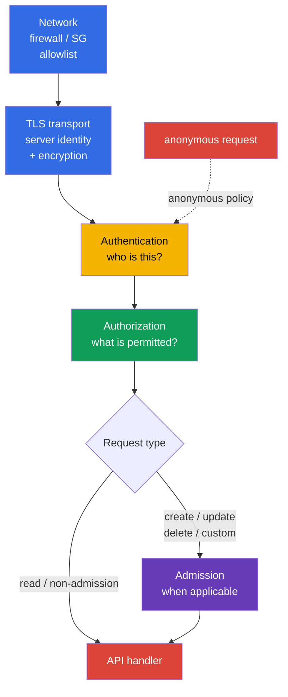
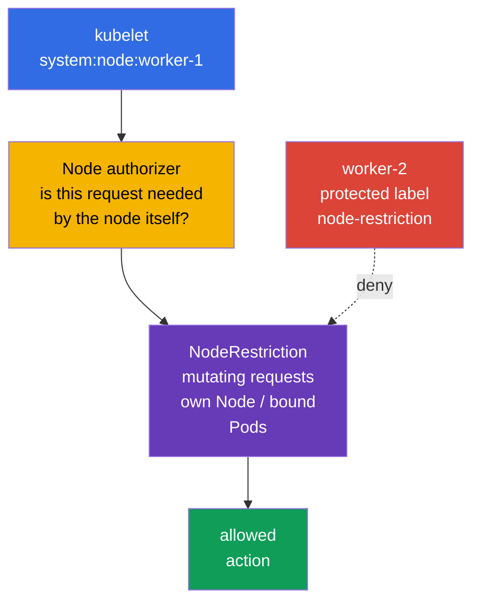
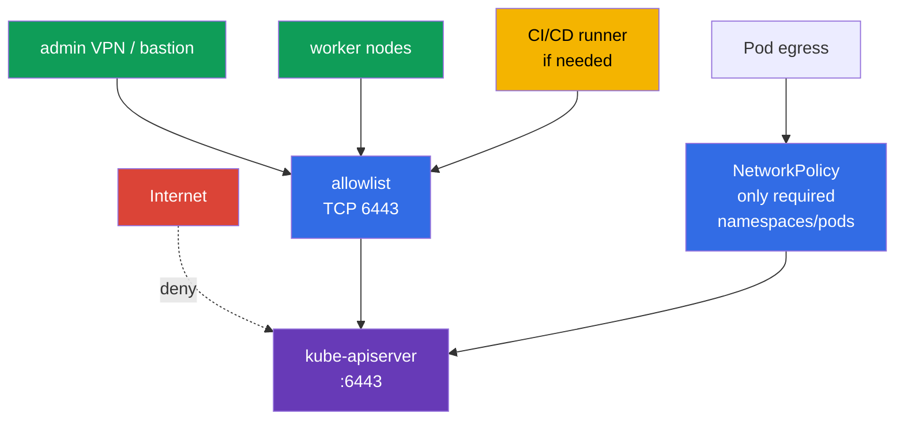

[Русская версия](ru.md) · [Versión en español](es.md) · [Version française](fr.md) · [Deutsche Version](de.md) · [ქართული ვერსია](ge.md) · [繁體中文版](tw.md) · [日本語版](jp.md)

# Chapter 12. Restricting access to the Kubernetes API

> **The problem.** An API endpoint reachable from an unnecessary network, an anonymous request, or an obsolete binding for `system:unauthenticated` lets an attacker bypass the ordinary client boundary. A network-perimeter, TLS, or apiserver configuration error turns one request without a reliably verified identity into access to cluster data and control.

> **What comes next.** Chapter 11 removed unnecessary ServiceAccount tokens. Now we close the point that those tokens and other credentials call: the Kubernetes API. An error in `kube-apiserver`, kubelet, or network perimeter turns one unauthenticated request into a path to data and cluster control. This is the **Cluster Hardening** CKS domain (15%): limit who can reach the API at all, what they become after authentication, and what they can do.

> **What you need from CKA.** The basic authn -> authz -> admission path and ServiceAccount are covered in [CKA Chapter 21](../../../cka/course/21/README.md); kubeconfig, client TLS certificates, and CSR are in [CKA Chapter 39](../../../cka/course/39/README.md). Here we do not repeat these mechanisms; we use them to harden the API.

> 🧠 Network, TLS, authentication, and authorization are independent sequential barriers; admission is added for requests to which it applies. Timeout/refused, `401`, and `403` indicate different layers.

## 12.1. API request path: several independent barriers

`kube-apiserver` is the single point for controlling cluster state. `kubectl`, controllers, kubelet, operators, and applications using ServiceAccount all go through it. Protection therefore does not reduce to one RBAC rule: stop a request as early as possible and still retain subsequent checks.



- **Network** determines whether a source can establish a TCP connection to `6443`. It is the first and cheapest barrier, but does not replace identity and RBAC.
- **TLS transport** protects connection confidentiality and integrity and lets a client verify API-server identity. Server-side TLS alone is not a client allowlist. With X.509 client-certificate authentication, TLS requests and receives the client certificate and proves possession of its private key; then the Kubernetes X.509 authenticator at **Authentication** validates the certificate against configured client CA and converts its identity into user/groups.
- **Authentication** maps a certificate, bearer token, or other credential to a subject. When anonymous access is enabled, a request without credentials becomes user `system:anonymous` and group `system:unauthenticated`. In current `AuthenticationConfiguration`, anonymous access can be restricted through an explicit allowlist of **exact HTTP paths**. Common paths are `/livez`, `/readyz`, and, if needed, `/healthz`; kubeadm public token discovery may need exact path `/api/v1/namespaces/kube-public/configmaps/cluster-info`. Other paths do not receive anonymous identity.
- **Authorization** checks the allowed verb, resource, and scope. In an ordinary kubeadm cluster this is `Node,RBAC`.
- **Admission** acts after authorization only for requests to which admission control applies: primarily create/delete/modify and some custom verbs. Object `get`, `list`, and `watch` bypass the admission layer. Admission can change an object or reject a request; `NodeRestriction` here limits permissible **changes** from kubelet identities.

The order matters in investigation. `401 Unauthorized` means a request failed Authentication. `403 Forbidden` means a subject was already determined and the request was prohibited; check Authorization first. For mutating/custom requests, rejection can also happen later at Admission, but admission does not participate in ordinary `get/list/watch`. Do not try to fix `401` by creating RoleBinding.

## 12.2. Anonymous access, legacy ports, and old RBAC bindings

### Why `system:anonymous` is dangerous

Anonymous access is sometimes retained for a legacy health check or out of habit. The anonymous subject itself grants nothing, but one mistaken `RoleBinding` or `ClusterRoleBinding` for `system:anonymous` or `system:unauthenticated` makes the API available without a key, certificate, or token. Close entry first, then remove already granted permissions: disabled anonymous access today does not make a dangerous binding safe forever.

For standard kubeadm, complete `--anonymous-auth=false` cannot be treated as a universal baseline: its health probes call `/livez` and `/readyz` without credentials, so a global anonymous prohibition can return `401` and restart API server. The primary option for such a cluster is a stable `AuthenticationConfiguration` connected through `--authentication-config`. Its conditions are an allowlist of **exact** paths: no other path becomes anonymous even with a permissive RBAC binding. This also affects token-based `kubeadm join`: before trusting the API, a client reads `/api/v1/namespaces/kube-public/configmaps/cluster-info` unauthenticated. Choose one of two tested options: add this exact path during public token discovery, or disable public discovery and use file/HTTPS discovery. A health-only allowlist without this path is incompatible with ordinary token-based join. Add `/healthz` only if a health check truly uses it. Every exception needs a separate review of routes, network access, and anonymous-subject permissions.

On a kubeadm control plane, `kube-apiserver` is usually a static Pod. Edit the active manifest locally on control plane with node-console access and a stored rollback path. Do not copy backup YAML into `/etc/kubernetes/manifests/`: kubelet can treat it as another static Pod.

```bash
# On the control plane: save a copy outside the static Pod manifest directory.
sudo install -d -m 700 /root/k8s-manifest-backup
sudo cp /etc/kubernetes/manifests/kube-apiserver.yaml \
  /root/k8s-manifest-backup/kube-apiserver.yaml

# Create authentication configuration outside the static Pod manifest directory.
# If kubeadm join uses public token discovery, retain the exact cluster-info path.
sudo install -d -m 700 /etc/kubernetes/authentication
sudo tee /etc/kubernetes/authentication/apiserver-authentication.yaml >/dev/null <<'EOF'
apiVersion: apiserver.config.k8s.io/v1
kind: AuthenticationConfiguration
anonymous:
  enabled: true
  conditions:
  - path: /livez
  - path: /readyz
  - path: /api/v1/namespaces/kube-public/configmaps/cluster-info
EOF
sudo chmod 0600 /etc/kubernetes/authentication/apiserver-authentication.yaml

# Find existing authn flags; there must not be conflicting duplicates.
sudo grep -nE -- '--(anonymous-auth|authentication-config)' \
  /etc/kubernetes/manifests/kube-apiserver.yaml || true
sudoedit /etc/kubernetes/manifests/kube-apiserver.yaml
```

In `spec.containers[].command`, specify exactly one file path and do not set `--anonymous-auth` at the same time; these configuration methods are mutually exclusive:

```yaml
- --authentication-config=/etc/kubernetes/authentication/apiserver-authentication.yaml
```

One flag is insufficient: the file is on the host and must be explicitly mounted in the static Pod. Add a `hostPath` volume and read-only `volumeMount` without removing existing kube-apiserver volumes:

```yaml
# Add to existing kube-apiserver volumeMounts:
volumeMounts:
- name: authentication-config
  mountPath: /etc/kubernetes/authentication/apiserver-authentication.yaml
  readOnly: true

# Add to existing Pod volumes:
volumes:
- name: authentication-config
  hostPath:
    path: /etc/kubernetes/authentication/apiserver-authentication.yaml
    type: File
```

After changing it, check that the container truly sees the file, API server recovers, and `/readyz` succeeds. `hostPath` is a local node path: in an HA control plane, create the same file and mount on **every** control-plane node, otherwise that apiserver cannot mount the file or start.

Manual static-Pod editing suits a particular lab or emergency task, but must not remain the sole source of truth for a kubeadm cluster. For permanent configuration, move parameter and mount into `ClusterConfiguration`, for example via `apiServer.extraArgs` and `apiServer.extraVolumes`, or use managed kubeadm patches. Otherwise `kubeadm upgrade` can regenerate a manifest without this setting:

```yaml
apiVersion: kubeadm.k8s.io/v1beta4
kind: ClusterConfiguration
apiServer:
  extraArgs:
  - name: authentication-config
    value: /etc/kubernetes/authentication/apiserver-authentication.yaml
  extraVolumes:
  - name: authentication-config
    hostPath: /etc/kubernetes/authentication/apiserver-authentication.yaml
    mountPath: /etc/kubernetes/authentication/apiserver-authentication.yaml
    readOnly: true
    pathType: File
```

Complete disabling with `--anonymous-auth=false` is acceptable only after changing kubeadm health probes to authenticated ones or using another tested mechanism, and checking bootstrap dependencies. After saving, kubelet recreates the static Pod. A manifest is desired source, not proof of argv for a running apiserver. Do not restart all control-plane components at once and do not end the SSH session until API recovers.

```bash
# Desired configuration. The manifest alone does not prove active runtime.
sudo grep -n -- '--authentication-config=' \
  /etc/kubernetes/manifests/kube-apiserver.yaml
watch -n 2 'sudo crictl ps --name kube-apiserver'

# On a Linux host where container PIDs are visible: prove argv and file visibility to
# the running process separately. If runtime/PID namespace does not permit this, use
# its equivalent inspect verification instead of concluding from the manifest alone.
APISERVER_PID="$(pgrep -xo kube-apiserver)" || {
  echo 'ERROR: running kube-apiserver process not found' >&2
  exit 2
}
AUTH_CONFIG_ARG='--authentication-config=/etc/kubernetes/authentication/apiserver-authentication.yaml'
AUTH_CONFIG_PATH='/etc/kubernetes/authentication/apiserver-authentication.yaml'

if ! sudo cat "/proc/${APISERVER_PID}/cmdline" \
    | tr '\0' '\n' \
    | grep -Fxq -- "$AUTH_CONFIG_ARG"
then
  echo "ERROR: active kube-apiserver argv does not contain ${AUTH_CONFIG_ARG}" >&2
  exit 1
fi

if ! sudo test -e "/proc/${APISERVER_PID}/root${AUTH_CONFIG_PATH}"; then
  echo "ERROR: ${AUTH_CONFIG_PATH} is not visible in kube-apiserver mount namespace" >&2
  exit 1
fi

echo 'OK: active kube-apiserver uses the expected authentication config path'

# API readiness is checked separately from desired configuration and argv.
kubectl get --raw='/readyz?verbose'
kubectl get nodes
```

Kubelet is the second HTTP API on every node. Protect it separately: disable anonymous authentication and the legacy read-only API. Do not treat `/var/lib/kubelet/config.yaml` as a universal source: kubelet can receive `--config`, `--config-dir`, and arguments from a unit, drop-in, or environment file. Establish actual startup sources first and only then check active `KubeletConfiguration`; with authorized access it can also be compared with `/configz`.

```bash
sudo systemctl cat kubelet
sudo systemctl show kubelet -p ExecStart --value
KUBELET_PID=$(pgrep -xo kubelet) || { echo 'kubelet process not found' >&2; exit 2; }
sudo tr '\0' '\n' < "/proc/$KUBELET_PID/cmdline" \
  | grep -E -- '^--config(=|$)|^--config-dir(=|$)|^--(read-only-port|anonymous-auth|authorization-mode)(=|$)' || true
# After determining the real file, for example: sudo grep -nE 'readOnlyPort|anonymous:|authorization:' <active-kubelet-config>
```

```yaml
# In active KubeletConfiguration; the path is determined by startup configuration.
readOnlyPort: 0
authentication:
  anonymous:
    enabled: false
authorization:
  mode: Webhook
```

Equivalents if a particular installation manages kubelet through flags:

```text
--read-only-port=0
--anonymous-auth=false
--authorization-mode=Webhook
```

`10255` is the historical read-only, unauthenticated kubelet port; disable it. Do not “open `10250` to everyone”: the normal kubelet API must remain protected by authentication, `Webhook` authorization, and network rules. Modern Kubernetes has removed legacy kube-apiserver `--insecure-port`; this is no reason to ignore old manifests, images, and documentation. Look for it as an indicator of unsupported or insecure configuration, not something to enable for compatibility.

```bash
# On every node: an ss error is a check error, not confirmation of a closed port.
listeners=$(sudo ss -H -lnt '( sport = :10255 )') || {
  echo 'ERROR: cannot inspect TCP listener 10255' >&2; exit 2;
}
if [ -n "$listeners" ]; then
  printf 'ERROR: kubelet read-only port 10255 is listening:\n%s\n' "$listeners" >&2
  exit 1
fi
echo 'OK: kubelet read-only port 10255 is closed'

# Check 10250 together with firewall; an exact socket filter avoids another port matching.
sudo ss -H -lntp '( sport = :10250 )'
```

> 🎯 Set secure authentication configuration and remove bindings for `system:anonymous`/`system:unauthenticated`. Disable legacy `10255` and `--insecure-port`, but do not publish protected `10250`.

### Binding inventory and cleanup

Do not delete a `ClusterRole` by name at random: one role can be required by another subject. Find bindings whose `subjects` actually name the anonymous user or its group, check the assigned role, and only then remove an unnecessary binding.

```bash
# ClusterRoleBinding objects that directly grant permissions to anonymous user or unauthenticated group.
kubectl get clusterrolebinding -o json | jq -r '
  .items[]
  | select(any(.subjects[]?;
      (.kind == "User" and .name == "system:anonymous") or
      (.kind == "Group" and .name == "system:unauthenticated")))
  | [.metadata.name, .roleRef.kind, .roleRef.name] | @tsv'

# The same for namespace-scoped RoleBinding objects.
kubectl get rolebinding -A -o json | jq -r '
  .items[]
  | select(any(.subjects[]?;
      (.kind == "User" and .name == "system:anonymous") or
      (.kind == "Group" and .name == "system:unauthenticated")))
  | [.metadata.namespace, .metadata.name, .roleRef.kind, .roleRef.name] | @tsv'
```

Do not delete a binding merely because its subject matches. In particular, `system:public-info-viewer` is a standard default ClusterRoleBinding for `system:unauthenticated` to non-sensitive public information; with RBAC enabled, missing subjects from standard bindings can be restored by auto-reconciliation after API startup. Kubeadm token discovery also uses RoleBinding `kubeadm:bootstrap-signer-clusterinfo` to read `kube-public/cluster-info`. Check the role and whether the discovery workflow is required first; delete only a custom or truly excessive binding.

After review, targeted deletion looks like this:

```bash
REVIEWED_CLUSTERROLEBINDING='reviewed-clusterrolebinding'
NAMESPACE='reviewed-namespace'
REVIEWED_ROLEBINDING='reviewed-rolebinding'
kubectl delete clusterrolebinding "$REVIEWED_CLUSTERROLEBINDING"
kubectl delete rolebinding -n "$NAMESPACE" "$REVIEWED_ROLEBINDING"
```

Also check every binding granting permissions to group `system:unauthenticated`: disabling anonymous access closes its normal path, but policy must stay minimal and understandable after future identity-provider changes.

## 12.3. Authorization modes and NodeRestriction

`--authorization-mode` defines an ordered chain of authorization modules. Every module returns `Allow`, `Deny`, or `NoOpinion`: `Allow` **or** `Deny` immediately terminates the chain, and only `NoOpinion` passes a request to the next module. If every module returns `NoOpinion`, the request is denied. Order therefore matters, and `AlwaysAllow` in a reachable part of the chain nullifies least privilege for requests reaching it.

| Mode | Purpose | Hardening decision |
|---|---|---|
| `Node` | handles requests from kubelet identities `system:node:<node>` | enable before `RBAC` in an ordinary kubeadm cluster |
| `RBAC` | checks Role, ClusterRole, and bindings for users, groups, and ServiceAccount | primary authorizer for administrators and workloads |
| `Webhook` | asks an external authorization webhook | use only with an available, tested external service |
| `ABAC` | rules from a local policy file | legacy option; difficult to audit, avoid in new clusters |
| `AlwaysAllow` | permits everything | never use in production |

Structured `AuthorizationConfiguration` has been stable since Kubernetes v1.32 and is set by `--authorization-config`. Choose **one** approach: this file cannot be combined with CLI `--authorization-mode` and `--authorization-webhook-*`; if mixed, `kube-apiserver` exits with an error. The file is useful where parameters and several webhook authorizers are needed, but plan and test migration to it as a control-plane change rather than add a second parallel configuration source.

Check the desired argument in the static-Pod manifest and set a secure base chain when it fits cluster architecture. After kubelet reconciliation, confirm argv of the running process separately, as in §12.2: a manifest line alone does not prove active configuration.

```bash
sudo grep -n -- '--authorization-mode' /etc/kubernetes/manifests/kube-apiserver.yaml
```

```yaml
- --authorization-mode=Node,RBAC
```

`Node` authorizer is not needed “to trust every node”, but for special kubelet API operations. In the shown kubeadm baseline `Node,RBAC`, other identities are authorized by RBAC. A different deliberate architecture can include Webhook, for example; what matters is a fail-closed authorization policy for every other request and no `AlwaysAllow` fallback. Do not change modes on a running cluster without checking bootstrap controllers, identity provider, and current API clients.

> 🎯 kubeadm baseline: `Node,RBAC` without `AlwaysAllow`; `Node` serves kubelet, RBAC limits other identities, and `NodeRestriction` limits permitted mutating requests with node credentials.

**NodeRestriction** is a validating admission plugin that complements `Node` authorizer. `Node` authorizer determines kubelet API permissions and relation-sensitive reads; `NodeRestriction` then limits permissible **changes**: kubelet can modify only its own Node and Pod objects bound to that node, and cannot change protected Node labels/taints outside the allowed model. Read requests do not go through admission, so their scope is set by authorizer.



In kubeadm, `NodeRestriction` is normally enabled as an additional admission plugin. Check both `--enable-admission-plugins` and `--disable-admission-plugins` first.

```bash
sudo grep -nE -- '--(enable|disable)-admission-plugins' \
  /etc/kubernetes/manifests/kube-apiserver.yaml
sudo crictl ps --name kube-apiserver
```

In Kubernetes v1.36, `--enable-admission-plugins` adds plugins to the built-in default-enabled set; do not enumerate defaults in that flag. If `NodeRestriction` is not enabled, add it to the explicit additional list. Preserve other additional plugins already in `--enable-admission-plugins`, and separately ensure a required default or plugin is not disabled through `--disable-admission-plugins`. RBAC controls general role/binding-based permissions for users, groups, and ServiceAccount; `Node` authorizer serves special node-identity permissions. `NodeRestriction` does not replace them: it adds admission restrictions to kubelet mutating requests. Also consider feature gate `ServiceAccountNodeAudienceRestriction`: when enabled, NodeRestriction narrows audiences for which kubelet can request ServiceAccount tokens through `TokenRequest` to audiences already used by Pod objects on that node or explicitly granted through RBAC. It is not a substitute for NodeRestriction, but an additional limit for node-originated token requests.

> 🎯 Restrict `:6443` to a private endpoint or precise CIDR allowlist; for Pod objects, check a separate egress policy.

## 12.4. Network restriction of access to apiserver

Even with correct TLS and RBAC, a public API endpoint expands surface: `:6443` lets an attacker enumerate credentials, use a future vulnerability, or obtain error information. A private endpoint is a strong and often preferred option, but not a universal absolute: a public endpoint can be justified when strict network limits are available (narrow CIDR allowlist, firewall/WAF appropriate to architecture) and authentication is strong. In either case, allow `:6443` only from required, verified source paths: the administrative network/VPN, control plane, kubelet/worker traffic, agreed automation endpoints, and in-cluster workloads that truly need the API. Do not assume workload traffic is always seen by the endpoint as a worker-node address: determine actual CNI/cloud datapath and source address after SNAT/routing.



Apply barriers at the appropriate responsibility boundary:

- **Cloud Security Group / firewall**: allow `TCP/6443` only from genuinely required source ranges/identities: control plane, kubelet/worker path, VPN/bastion, automation and, if topology requires it, addresses/CIDRs of authorized Pod workloads. Do not add the whole Pod CIDR automatically: first determine which source the API endpoint actually sees after CNI/cloud routing and SNAT. Do not set `0.0.0.0/0`; in a private cluster use a private endpoint or tunnel.
- **Host firewall** (`nftables`, `iptables`, `ufw`) on a self-managed control plane: duplicates the network perimeter and restricts sources if a cloud firewall is mistakenly broadened.
- **NetworkPolicy**: `kubernetes.default.svc` is a logical Service name, and standard NetworkPolicy does not select a destination Service by name. Restrict API egress through `ipBlock`/endpoint CIDR after checking actual datapath, or through a CNI-specific entity, FQDN, or Service policy. Do not move `ipBlock` blindly between CNI: Service DNAT can happen before or after policy and has no universal semantics. Allow API only to namespaces and workloads that truly need it, reducing lateral movement after Pod compromise.
- **Routing and DNS**: ensure the control-plane endpoint is published and resolved only as required by the chosen access model. A private endpoint often simplifies this; a public endpoint needs especially strict source control and authentication.

**kubeadm discovery is a separate case.** With token-based discovery, ConfigMap `kube-public/cluster-info` contains publicly accessible discovery information by default (API address and CA data); it is not a Secret and must not be issued or protected as one. A bootstrap token, in contrast, is temporary credential material for discovery/TLS bootstrap and needs separate controls: limited distribution, short lifetime, revocation, and CSR/auto-approval review. When anonymous access is limited through `AuthenticationConfiguration`, an RBAC binding is insufficient: exact path `/api/v1/namespaces/kube-public/configmaps/cluster-info` must also appear in `anonymous.conditions`, or the request receives no anonymous identity and token discovery breaks. Where required, disable public `cluster-info` access or use file/HTTPS discovery with a suitable trust channel; do not mix protection of public information with protection of a token.

NetworkPolicy does not replace Security Group or a host firewall: CNI applies it to Pod traffic and it need not cover host, external, or control-plane traffic identically in every topology. In managed Kubernetes, provider owns part of endpoint and firewall; check its private/public endpoint, allowed CIDRs, and separate control-plane security rules instead of trying to edit a static Pod you do not own.

Before changing a firewall, record current listeners and rule, and keep a separate console session for rollback. Blocking `6443` for your administrator or kubelet can make a cluster unavailable.

```bash
# On the control plane: who listens for the API; the exact process depends on runtime.
sudo ss -lntp | grep ':6443'

# From an administrative machine: check the endpoint without disabling TLS verification in production.
kubectl cluster-info
kubectl get --raw='/livez?verbose'
```

> 🔬 `kubectl proxy` and `port-forward` are auxiliary ways to access locally: they use operator kubeconfig permissions and create additional diagnostic surface.

## 12.4.1. Local API gateways: `kubectl proxy` and `port-forward`

`kubectl proxy` and `kubectl port-forward` use the user's kubeconfig authority; they do not create a new restricted identity. By default `kubectl proxy` listens on `127.0.0.1`, limiting risk to the local machine. Do not expand it with `--address` unnecessarily; a broad `--accept-hosts`, particularly `--disable-filter`, can make a proxy accessible to other clients as a gateway to the API with operator permissions. Similarly, do not use `kubectl port-forward --address 0.0.0.0` unless a short separately agreed connection through a protected network is necessary. End a temporary tunnel after diagnostics and do not treat it as a substitute for firewall, RBAC, or NetworkPolicy.

> 🎯 Confirm active configuration, safe flags, readiness after reload, `401` for an anonymous path, and targeted `can-i` with `no`; diagnose static Pod through kubelet and runtime.

## 12.5. Profiling, ServiceAccount lookup, and flag audit

Profiling endpoints are useful for performance diagnostics but, when unneeded, increase process-information disclosure surface. Disable profiling on `kube-apiserver`; in the same operation check controller-manager and scheduler. Chapter [07](../07/README.md) covers detailed CIS checking of all three components; [Chapter 09](../09/README.md) covers insecure arguments and TLS hardening.

```yaml
# In the kube-apiserver static Pod command
- --profiling=false
```

```bash
for component in kube-apiserver kube-controller-manager kube-scheduler; do
  sudo grep -n -- '--profiling' "/etc/kubernetes/manifests/${component}.yaml" || true
done
```

`--service-account-lookup` concerns checking whether a ServiceAccount exists when authenticating a legacy ServiceAccount token. Value `false` disables API-based revocation: a deleted ServiceAccount or legacy token no longer revokes an already issued token through this check. This is **not** a mechanism to set or guarantee a short TTL for legacy tokens; their lifetime is determined by issuance method and token claims. Do not turn lookup off without an explicit decision. In modern clusters, prefer bound short-lived projected tokens from Chapter 11, and verify flag availability and behavior for your version using `kube-apiserver --help` and its documentation.

Check configuration as a set of risks, not one flag. For scheduler, first check for `--config`: there deprecated `--profiling` is ignored, so set `enableProfiling: false` in the discovered active `KubeSchedulerConfiguration`.

```bash
sudo grep -nE -- \
  '--(anonymous-auth|authorization-mode|enable-admission-plugins|profiling|service-account-lookup|insecure-port|secure-port)' \
  /etc/kubernetes/manifests/kube-apiserver.yaml
sudo grep -n -- '--config' /etc/kubernetes/manifests/kube-scheduler.yaml
# For the specified --config: sudo grep -n 'enableProfiling:' <active-scheduler-config>

# Kubelet: first find the actual --config/--config-dir in unit and /proc/<kubelet-pid>/cmdline,
# then check the discovered active KubeletConfiguration.
```

| Finding | Why it is dangerous | Secure direction |
|---|---|---|
| broad anonymous access | a request without credentials becomes `system:anonymous`; with selective config only exact allowed paths are excluded | `AuthenticationConfiguration` with minimal exact-path allowlist, or `--anonymous-auth=false` when compatible with probes/bootstrapping; cleanup bindings |
| `--authorization-mode=AlwaysAllow` | every authenticated or anonymous subject passes authz | `Node,RBAC` or a deliberate Webhook integration |
| missing `NodeRestriction` | compromised kubelet gets a broader path to API | enable the plugin while preserving existing defaults |
| profiling enabled unnecessarily | extra diagnostic endpoints | for apiserver/controller-manager use `--profiling=false`; for scheduler with `--config` use `enableProfiling: false` in active `KubeSchedulerConfiguration` |
| `readOnlyPort` is not `0` | legacy kubelet API without authentication | `readOnlyPort: 0` |
| public `6443` | increased surface for credential attacks and API vulnerabilities | private endpoint or strict CIDR allowlist, firewall, and strong authentication |

After changing a static Pod, confirm more than the YAML line. Kubelet must start a new container and the API must become Ready. On YAML error or unsupported flag, use local console, `journalctl -u kubelet`, `crictl ps -a`, and the saved manifest copy.

## 12.6. Verification: prove that unauthorized API access is blocked

Perform verification in two independent layers: authentication without a credential and authorization for an explicit subject. Check from a network that should have TCP access to the API; firewall timeout and API `401` are different, but both are useful results in their own layers.

```bash
# Take the server URL from current kubeconfig without passing a certificate, key, or token to curl.
APISERVER=$(kubectl config view --minify \
  -o jsonpath='{.clusters[0].cluster.server}')
printf '%s\n' "$APISERVER"

# Protected path: `401` proves that /version does not pass anonymous authn.
# -k is acceptable for a training test; in production pass CA using --cacert.
curl -k -sS -o /dev/null -w '%{http_code}\n' "$APISERVER/version"

# If selective configuration intentionally allows /readyz, check it separately.
# A ready API normally returns 200, but that does not disprove 401 on /version.
curl -k -sS -o /dev/null -w '%{http_code}\n' "$APISERVER/readyz"
```

`401` on `/version` proves only that this protected path does not accept an anonymous request; it does not prove global disabling of anonymous authenticator. With selective `AuthenticationConfiguration`, exact allowed paths such as `/readyz` or discovery path can intentionally work without credentials. If connection times out or is refused, diagnose firewall, Security Group, DNS, and route first; this is not proof of Authentication configuration.

With cluster-admin permissions, separately check authorizer through impersonation:

```bash
# There must be no permission. The calling administrator needs the `impersonate` permission.
# A full anonymous identity includes both user and group.
kubectl auth can-i get pods --all-namespaces \
  --as=system:anonymous --as-group=system:unauthenticated
kubectl auth can-i list secrets --all-namespaces \
  --as=system:anonymous --as-group=system:unauthenticated

# Explicitly check minimal permissions of the ServiceAccount from Lab 104.
kubectl auth can-i list pods -n cks-104 \
  --as=system:serviceaccount:cks-104:app-sa
kubectl auth can-i delete pods -n cks-104 \
  --as=system:serviceaccount:cks-104:app-sa
```

Expect `no` for anonymous checks and prohibited `delete`; `list pods` for dedicated `app-sa` must return `yes` only in the specified namespace. `kubectl auth can-i` checks authorizer for an impersonated identity, but does not make a real connection without credentials and does not prove anonymous-authenticator state. Save commands, HTTP status, and changed configuration sources in the change record: this is evidence that the control works, not merely a claim.

## 12.7. Common errors and diagnostics

| Symptom | Likely cause | What to check |
|---|---|---|
| API does not start after editing | YAML is damaged, a flag is duplicated, or unsupported | `journalctl -u kubelet`, `crictl ps -a`, saved manifest copy |
| `curl` does not return 401 but times out | traffic is cut before API | Security Group/firewall, DNS, route, and port `6443` |
| anonymous `can-i` unexpectedly returns yes | RoleBinding/ClusterRoleBinding remains | search `system:anonymous` and `system:unauthenticated` in bindings |
| kubelet stops registering | firewall or API endpoint inaccessible, kubelet config wrong | `journalctl -u kubelet`, `ss`, node routes, active kubelet arguments |
| NodeRestriction has no expected effect | plugin inactive or kubelet does not use node identity | apiserver flags, client-certificate CN, admission configuration |
| Pod can no longer reach API | egress policy too strict/narrow, required allow rule absent, datapath/CIDR/port wrong, or ServiceAccount token intentionally disabled | need for access, active NetworkPolicy/CNI policy, actual API datapath, `automountServiceAccountToken`, RBAC |

> 🏭 Endpoint exposure, kubeadm/API configuration, and RBAC cleanup are fixed in IaC and compared against baseline; owners are responsible for endpoint, CIDR, and evidence after changes.

## 12.8. How this is applied in production

- **Several layers, one baseline.** `--anonymous-auth=false` where compatible with probes and bootstrap dependencies, or narrow conditions for exact health/discovery paths in `AuthenticationConfiguration`, `Node,RBAC`, NodeRestriction with assessment of `ServiceAccountNodeAudienceRestriction`, a closed kubelet read-only port, and private/strictly allowlisted API endpoint belong in kubeadm configuration, node image, or IaC. Manual static-Pod editing is acceptable for an emergency task, but must not be the only source of truth.
- **Restrict network access by purpose.** Administrators work through VPN/bastion, CI/CD has separate egress addresses, workers/control plane receive only required rules, and for Pod-to-API traffic record actual datapath/source and allow only workloads that truly need API. A public endpoint is acceptable only with explicit risk owner, strict source restriction, and strong authentication; a private endpoint remains a strong, but not only, option.
- **Reassess permissions after identity changes.** Regularly find bindings for `system:anonymous`, `system:unauthenticated`, obsolete users, and ServiceAccount; remove unused ones and test `kubectl auth can-i`.
- **Observability does not expose diagnostics.** Metrics, audit, and centralized logs provide needed visibility; enable profiling temporarily, through an allowlist, and with a disable plan.
- **Divide a managed control plane by responsibility.** You cannot edit a provider static-Pod manifest, but can and must control endpoint exposure, allowed CIDRs, RBAC, admission policy, node security groups, and kubelet access.

## 12.9. Mini-glossary

- **anonymous authentication** - mapping a request without credentials to `system:anonymous`; it is normally disabled for API and kubelet.
- **`system:unauthenticated`** - the anonymous-subject group; a binding to it requires the same review as a binding to `system:anonymous`.
- **authorization mode** - an API-server authorizer, for example `Node`, `RBAC`, or `Webhook`.
- **Node authorizer** - a special authorizer for kubelet identities; it permits necessary node operations and relation-sensitive access to objects associated with Pod objects on that node.
- **NodeRestriction** - a validating admission plugin that limits permitted Node/Pod changes by kubelet and protected Node labels; with `ServiceAccountNodeAudienceRestriction`, it also limits audiences of node-originated `TokenRequest`.
- **allowlist** - an explicit list of permitted sources, ports, or destinations instead of allowing everyone.
- **read-only port** - an obsolete unauthenticated kubelet API disabled through `readOnlyPort: 0`/`--read-only-port=0`.
- **profiling** - process performance-diagnostics endpoints. It is disabled when unneeded with `--profiling=false`, except for `kube-scheduler` with `--config`: its CLI flag is ignored and the active `KubeSchedulerConfiguration` requires `enableProfiling: false`.
- **static Pod** - a Pod kubelet manages from a local manifest; kubeadm normally starts control-plane components this way.

## 12.10. Chapter summary

- Protect the API with several independent layers: network, TLS, authentication, and authorization; admission additionally applies to mutating and supported custom requests.
- For kubelet, disable anonymous access (`--anonymous-auth=false`). On kube-apiserver, either explicitly limit health endpoints and, while public token discovery is needed, exact `kube-public/cluster-info` path through `AuthenticationConfiguration`; in both cases, inspect and remove only unnecessary RoleBinding/ClusterRoleBinding for `system:anonymous` and `system:unauthenticated`.
- Disable legacy kubelet read-only port with `readOnlyPort: 0`; retain `10250` only with authentication, `Webhook` authorization, and network restriction.
- The secure kubeadm base authorizer chain is `Node,RBAC`; `AlwaysAllow` is incompatible with least privilege. `Node` authorizer sets kubelet API permissions and NodeRestriction adds limits to its mutating requests.
- Prefer a private endpoint for API `:6443`; a public endpoint requires a strict firewall/Security Group allowlist and strong authentication. In every case, focused NetworkPolicy for Pod egress reduces lateral movement.
- `--profiling=false`, enabled ServiceAccount lookup for API revocation of legacy tokens, and flag audit reduce surface. Bound projected tokens, not `--service-account-lookup=false`, provide short TTL.
- Prove the result with separate checks: anonymous `curl` to a protected path such as `/version` must return API `401`; verify intentionally allowed health/discovery paths separately. `kubectl auth can-i --as=system:anonymous --as-group=system:unauthenticated` checks the authorizer for the impersonated identity and must return `no` for a prohibited action.

## 12.11. How this helps on the exam and at work

**On the exam.** A task normally gives control-plane access and asks you to close anonymous API or remove a dangerous binding. Find the active static-Pod manifest, save a copy outside `/etc/kubernetes/manifests/`, change the single required flag, wait for API recreation, and check `/readyz`. Then use `curl` without credentials to a protected path such as `/version`; with selective configuration, separately account for intentionally allowed exact paths. `kubectl auth can-i --as=system:anonymous --as-group=system:unauthenticated` checks only authorizer for an impersonated identity; do not stop at finding text in a file.

**Exam scenario: a kubeadm cluster was created with `AlwaysAllow`.** The current context can point to an account that should not have permissions after RBAC is enabled, while kubeconfig (or a separate kubeconfig) contains a known administrative account. Before changing it, select that account explicitly **for every command**: do not run `kubectl config use-context`, which could lose the original context and create a false successful result.

```bash
CURRENT_CONTEXT=$(kubectl config current-context)
kubectl config get-contexts
ADMIN_CONTEXT='kubernetes-admin@kubernetes'  # name of a known admin context from the list

# If admin is in another file, also add --kubeconfig=/path/to/admin.conf.
kubectl --context="$ADMIN_CONTEXT" auth whoami
sudo grep -nE -- '--authorization(-mode|-config)' \
  /etc/kubernetes/manifests/kube-apiserver.yaml
sudo cp -a /etc/kubernetes/manifests/kube-apiserver.yaml \
  /root/kube-apiserver.yaml.before-authz
sudoedit /etc/kubernetes/manifests/kube-apiserver.yaml
```

In the manifest, replace `--authorization-mode=AlwaysAllow` with `--authorization-mode=Node,RBAC` without removing other arguments. If `--authorization-config` is found, do not add `--authorization-mode` at the same time: fix active structured configuration by its schema. A `can-i` check **before** remediation does not prove the admin account has RBAC permissions: with `AlwaysAllow` it succeeds for any authenticated subject.

```bash
# Kubelet recreates the static Pod; do not end control-plane access before verification.
watch -n 2 'sudo crictl ps --name kube-apiserver'
kubectl --context="$ADMIN_CONTEXT" get --raw='/readyz?verbose'
kubectl --context="$ADMIN_CONTEXT" auth can-i get nodes

# This context in the scenario lacks the required RBAC binding; expected output is "no".
kubectl --context="$CURRENT_CONTEXT" auth can-i get nodes
```

In a real cluster, after urgent recovery also reflect authorizer in the kubeadm configuration source (`kubeadm-config`/IaC), or a subsequent `kubeadm upgrade` can generate a manifest with obsolete configuration again.

**In real work.** API restriction is part of network and identity design, not a one-time CIS edit. A private endpoint is a strong option; if the endpoint is public, compensate with strict allowlist and strong authentication. Short-lived bound tokens, minimal bindings, and automatic configuration-drift validation make compromise of one node or one Pod far less destructive.

## 12.12. Self-check questions

<details>
<summary>1. In which order does a request pass the network perimeter, authn, authz, and admission, and what does `401` mean compared with `403`?</summary>

First the network perimeter decides whether connection is possible, then TLS protects transport and lets the client verify API-server identity. With X.509 client authentication, TLS receives the client certificate, while trust by Kubernetes client CA and mapping to user/groups is performed by the X.509 authenticator during Authentication. Then API performs Authentication and Authorization; Admission is added if the request type goes through admission control. `401 Unauthorized` means a credential did not pass Authentication. `403 Forbidden` means identity is already determined and the request is prohibited: check Authorization first, though mutating/custom requests can also be denied by Admission.
</details>

<details>
<summary>2. Why must bindings for `system:anonymous` and `system:unauthenticated` still be reviewed after `--anonymous-auth=false`?</summary>

Disabling anonymous auth closes the current ordinary path to these subjects, but a dangerous binding remains hidden excessive permission. On a later authentication or identity-provider change, it can become reachable again without separate review. Therefore find subjects `system:anonymous` and group `system:unauthenticated` in RoleBinding and ClusterRoleBinding, and remove the unnecessary binding itself.
</details>

<details>
<summary>3. How does `10255` differ from `10250`, and which settings are required for kubelet API?</summary>

`10255` is the historical read-only unauthenticated kubelet API and must be disabled with `readOnlyPort: 0` or `--read-only-port=0`. `10250` is the normal kubelet API and must not be opened to everyone: it needs authentication, `Webhook` authorization, and network rules/firewall. Confirm disabling `10255` using `ss`, not only a configuration line.
</details>

<details>
<summary>4. Why must `AlwaysAllow` not be added beside `RBAC` as a “spare” mode?</summary>

An authorizer chain stops as soon as a module returns Allow or Deny; only NoOpinion passes a request onward. `AlwaysAllow` returns Allow for requests that reach it and thus nullifies least privilege for that part of the chain. Secure kubeadm baseline is `Node,RBAC`, not an allow-everything fallback.
</details>

<details>
<summary>5. How do NodeRestriction and `ServiceAccountNodeAudienceRestriction` reduce the consequences of kubelet-credential compromise?</summary>

`Node` authorizer first determines permitted kubelet API operations and relation-based read access. For mutating requests, `NodeRestriction` additionally prevents a node identity from arbitrarily changing other Node/Pod objects and protected Node labels. With `ServiceAccountNodeAudienceRestriction` enabled, the same admission plugin also limits audiences kubelet can request through `TokenRequest` to those used by Pod objects on the node or separately permitted by RBAC. Read requests do not pass NodeRestriction and must be evaluated under Node-authorizer rules.
</details>

<details>
<summary>6. Why does NetworkPolicy not replace firewall or Security Group for API server, and under which conditions can a public endpoint be justified?</summary>

NetworkPolicy is applied by CNI to Pod traffic and need not cover host, external, and control-plane traffic identically; standard policy also does not select a destination Service by DNS name. Firewall and Security Group restrict source access to `:6443` at another layer. A public endpoint is justified only by an explicit reason, strict CIDR allowlist, strong authentication, and understanding of network architecture; a private endpoint is often preferable.
</details>

<details>
<summary>7. Which two checks separately prove API network reachability and lack of anonymous authorization?</summary>

From an administrative or other allowed machine, check network reachability and health with `kubectl cluster-info` or `kubectl get --raw='/livez?verbose'`. Check Authentication with `curl` without credentials to a protected path such as `/version`, expecting API `401`. Under selective configuration, test an exact allowed health/discovery path separately because it can intentionally not return `401`. `kubectl auth can-i ... --as=system:anonymous --as-group=system:unauthenticated`, expecting `no`, checks only authorizer for the impersonated identity. Diagnose timeout or refused as network, not proof of Authentication.
</details>

<details>
<summary>8. **Flashback (Chapter 32).** A one-time `curl`/`401` in question 7 proves absence of anonymous access only **at the check time**. Kubernetes audit log records **API requests** (who, when, which resource, which verb, and result); it is not continuous monitoring of `/etc/kubernetes/manifests/kube-apiserver.yaml` or `--anonymous-auth`. What can Chapter 32 audit log actually show retrospectively about anonymous requests, and why does absence of an anonymous event **not prove** configuration did not change throughout the interval between two checks? Which additional mechanisms - periodic checks, file-integrity monitoring, GitOps drift detection - are needed for continuous assurance that audit log itself does not provide?</summary>

An audit log retrospectively shows completed API requests from anonymous identity: when they happened, which resource and verb they called, and the result. Absence of such events does not prove `--anonymous-auth` remained unchanged: the flag could have been briefly enabled while no anonymous request happened. Continuous assurance needs periodic configuration checks, file-integrity monitoring of the manifest, and GitOps/drift detection, complementing audit of API calls.
</details>

## Practice

In Lab 104, you create a ServiceAccount with minimal Role, disable automatic token mounting, remove an excess RBAC binding, and set `--anonymous-auth=false` on `kube-apiserver`. Afterwards `check_result` checks `auth can-i` and anonymous `curl`.

🧪 Lab 104 (RBAC minimization, ServiceAccount tokens, and API restriction):
[tasks/cks/labs/104](../../labs/104/README.MD)

🧪 Lab 114 (kubeconfig contexts, client certificate extraction, and reducing Service exposure NodePort -> ClusterIP): [tasks/cks/labs/114](../../labs/114/README_RU.MD)

🌐 Additional interactive practice (killer.sh/killercoda, external resource): [apiserver-crash](https://killercoda.com/killer-shell-cks/scenario/apiserver-crash) · [apiserver-misconfigured](https://killercoda.com/killer-shell-cks/scenario/apiserver-misconfigured) · [apiserver-node-restriction](https://killercoda.com/killer-shell-cks/scenario/apiserver-node-restriction)

## Reference material

- [Kubernetes: authentication](https://kubernetes.io/docs/reference/access-authn-authz/authentication/)
- [Kubernetes: kubeadm](https://kubernetes.io/docs/setup/production-environment/tools/kubeadm/)

---
[Table of contents](../README.md) · [Chapter 11](../11/README.md) · [Chapter 13](../13/README.md)
