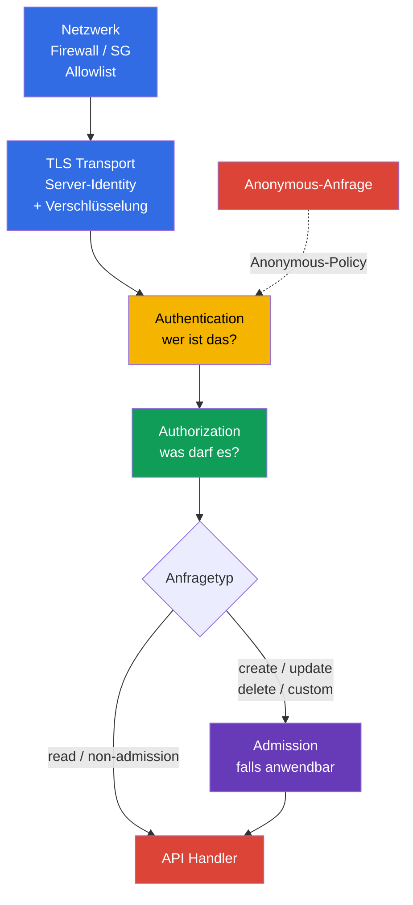
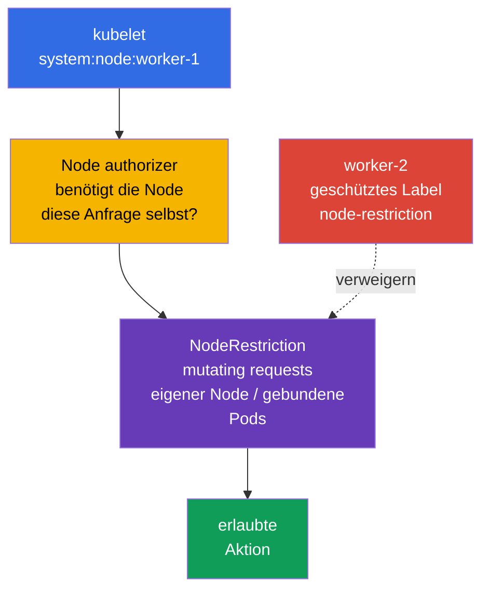
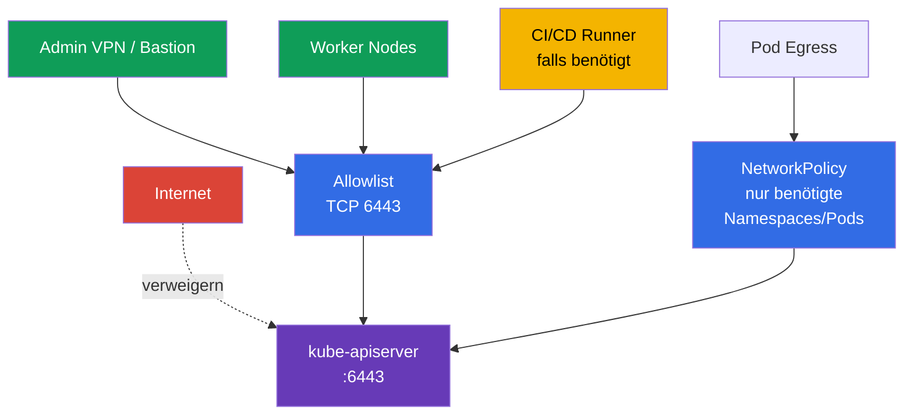

[Русская версия](ru.md) · [Eng version](README.md) · [Versión en español](es.md) · [Version française](fr.md) · [ქართული ვერსია](ge.md) · [繁體中文版](tw.md) · [日本語版](jp.md)

# Kapitel 12. Zugriff auf die Kubernetes API beschränken

> **Das Problem.** Ein aus einem unnötigen Netzwerk erreichbarer API-Endpoint, eine
> Anonymous-Anfrage oder ein veralteter Binding für `system:unauthenticated` erlauben einem
> Angreifer, die Grenze eines gewöhnlichen Clients zu umgehen. Ein Fehler im
> Netzwerkperimeter, TLS oder in der Konfiguration des apiserver verwandelt eine Anfrage ohne
> zuverlässig geprüfte Identity in Zugriff auf Daten und die Steuerung des Clusters.

> **Wie es weitergeht.** In Kapitel 11 haben wir überflüssige ServiceAccount-Tokens entfernt.
> Jetzt schließen wir den Endpunkt selbst, an den sich diese Tokens und andere Credentials
> wenden: die Kubernetes API. Ein Fehler in `kube-apiserver`, kubelet oder dem
> Netzwerkperimeter verwandelt eine nicht authentisierte Anfrage in einen Weg zu Daten und
> Clustersteuerung. Dies ist die CKS-Domain **Cluster Hardening** (15 %): Wir beschränken,
> wer die API überhaupt erreichen kann, wer er nach der Authentication wird und was er tun
> darf.

> **Was Sie aus CKA kennen müssen.** Den grundlegenden Pfad authn -> authz -> admission und
> ServiceAccounts behandelt [CKA-Kapitel 21](../../../cka/course/21/de.md); kubeconfig,
> Client-TLS-Zertifikate und CSRs behandelt
> [CKA-Kapitel 39](../../../cka/course/39/de.md). Hier wiederholen wir diese Mechanismen
> nicht, sondern wenden sie zum Hardening der API an.

> 🧠 Netzwerk, TLS, Authentication und Authorization sind unabhängige aufeinanderfolgende Barrieren; Admission kommt für Anfragen hinzu, auf die sie anwendbar ist. Timeout/refused, `401` und `403` weisen auf unterschiedliche Schichten hin.

## 12.1. Der Anfrageweg zur API: mehrere unabhängige Barrieren

`kube-apiserver` ist der zentrale Steuerungspunkt für den Zustand des Clusters. Über ihn
laufen `kubectl`, Controller, kubelet, Operatoren und Anwendungen mit ServiceAccount. Der
Schutz reduziert sich daher nicht auf eine RBAC-Regel: Eine Anfrage muss möglichst früh
gestoppt werden, während die nachfolgenden Prüfungen dennoch erhalten bleiben.



- **Netzwerk** beantwortet, ob die Quelle eine TCP-Verbindung zu `6443` aufbauen kann. Dies
  ist die erste und günstigste Barriere, ersetzt aber weder Identity noch RBAC.
- **TLS Transport** schützt Confidentiality und Integrity der Verbindung und erlaubt dem
  Client, die Identity des API server zu prüfen. Server-side TLS allein ist keine Allowlist
  für Clients. Bei X.509 Client-certificate Authentication fordert TLS das Client-Zertifikat
  an und erhält es, bestätigt den Besitz des entsprechenden Private Key, und der Kubernetes
  X.509 Authenticator prüft das Zertifikat dann in der Schicht **Authentication** gegen die
  konfigurierte Client CA und bildet dessen Identity auf User/Groups ab.
- **Authentication** ordnet Zertifikat, Bearer Token oder einen anderen Credential einem
  Subject zu. Ist Anonymous Access aktiviert, erhält eine Anfrage ohne Credential das
  Subject `system:anonymous` und die Gruppe `system:unauthenticated`. In der aktuellen
  `AuthenticationConfiguration` lässt sich Anonymous Access durch eine explizite Allowlist
  **exakter HTTP Paths** beschränken. Häufig sind dies `/livez`, `/readyz` und bei Bedarf
  `/healthz`; für kubeadm Public Token Discovery kann ein separat explizit erlaubter Path
  `/api/v1/namespaces/kube-public/configmaps/cluster-info` sein. Andere Paths erhalten
  keine Anonymous Identity.
- **Authorization** prüft zulässiges Verb, Ressource und Scope. In einem gewöhnlichen
  kubeadm-Cluster ist dies `Node,RBAC`.
- **Admission** wirkt nach der Authorization nur für Anfragen, auf die Admission Control
  angewandt wird: vor allem create/delete/modify und einige Custom Verbs. `get`, `list` und
  `watch` von Objekten umgehen die Admission Layer. Admission kann ein Objekt ändern oder
  eine Anfrage verwerfen; `NodeRestriction` begrenzt hier zulässige **Änderungen** durch
  kubelet-Identities.

Gerade die Reihenfolge ist bei der Untersuchung wichtig: `401 Unauthorized` bedeutet, dass
die Anfrage Authentication nicht bestanden hat. `403 Forbidden` bedeutet, dass die Anfrage
für ein bereits bestimmtes Subject verboten ist; prüfen Sie zuerst Authorization. Bei
Mutating-/Custom-Anfragen kann eine separate Verweigerung später auch bei Admission
auftreten, doch Admission beteiligt sich nicht an gewöhnlichem `get/list/watch`. Versuchen
Sie nicht, `401` durch das Erstellen eines RoleBinding zu beheben.


## 12.2. Anonymous Access, Legacy Ports und alte RBAC-Bindings

### Warum `system:anonymous` gefährlich ist

Anonymous Access wird manchmal wegen eines veralteten Health Check oder aus Gewohnheit
belassen. Das Anonymous Subject selbst erlaubt nichts, doch ein fehlerhafter `RoleBinding`
oder `ClusterRoleBinding` für `system:anonymous` oder `system:unauthenticated` macht die API
ohne Schlüssel, Zertifikat oder Token verfügbar. Schließen Sie zuerst den Zugang und
entfernen Sie danach bereits erteilte Rechte: Ein heute deaktivierter Anonymous Access macht
einen gefährlichen Binding nicht dauerhaft sicher.

Für einen Standard-kubeadm darf vollständiges `--anonymous-auth=false` nicht als universelle
Baseline gelten: Seine Health Probes rufen `/livez` und `/readyz` ohne Credentials auf und
können bei einem globalen Anonymous-Verbot `401` erhalten und den API server neu starten. Die
Hauptoption für einen solchen Cluster ist eine stabile `AuthenticationConfiguration`, die
über `--authentication-config` eingebunden wird. Ihre Bedingungen sind eine Allowlist
**exakter** Paths: Jeder andere Path wird auch bei einem erlaubenden RBAC Binding nicht
anonymous. Das betrifft auch token-based `kubeadm join`: Vor dem Vertrauen in die API liest
der unauthenticated Client
`/api/v1/namespaces/kube-public/configmaps/cluster-info`. Wählen Sie daher eine von
zwei geprüften Optionen: Fügen Sie diesen exakten Path für die Zeit der Public Token Discovery
hinzu oder deaktivieren Sie Public Discovery und verwenden Sie File-/HTTPS-Discovery. Eine
Health-only Allowlist ohne diesen Path ist nicht mit dem gewöhnlichen token-based Join
vereinbar. `/healthz` fügen Sie nur hinzu, wenn ein Health Check ihn tatsächlich verwendet.
Jede Ausnahme erfordert ein separates Review der Routen, des Netzwerkzugriffs und der Rechte
des Anonymous Subjects.

In einer kubeadm Control Plane ist `kube-apiserver` gewöhnlich ein Static Pod. Ändern Sie das
aktive Manifest lokal auf der Control Plane, mit Zugang zur Node-Konsole und einem gesicherten
Rollback-Pfad. Kopieren Sie keine YAML-Sicherung nach `/etc/kubernetes/manifests/`: kubelet
kann sie als weiteren Static Pod behandeln.

```bash
# Auf der Control Plane: eine Kopie außerhalb des Static-Pod-Manifestverzeichnisses sichern.
sudo install -d -m 700 /root/k8s-manifest-backup
sudo cp /etc/kubernetes/manifests/kube-apiserver.yaml \
  /root/k8s-manifest-backup/kube-apiserver.yaml

# Authentication Configuration außerhalb des Static-Pod-Manifestverzeichnisses erstellen.
# Wenn kubeadm join Public Token Discovery verwendet, den exakten cluster-info-Path beibehalten.
sudo install -d -m 700 /etc/kubernetes/authentication
sudo tee /etc/kubernetes/authentication/apiserver-authentication.yaml >/dev/null <<'EOF'
apiVersion: apiserver.config.k8s.io/v1
kind: AuthenticationConfiguration
anonymous:
  enabled: true
  conditions:
  - path: /livez
  - path: /readyz
  - path: /api/v1/namespaces/kube-public/configmaps/cluster-info
EOF
sudo chmod 0600 /etc/kubernetes/authentication/apiserver-authentication.yaml

# Bereits gesetzte Authn-Flags suchen; widersprüchliche Wiederholungen dürfen nicht existieren.
sudo grep -nE -- '--(anonymous-auth|authentication-config)' \
  /etc/kubernetes/manifests/kube-apiserver.yaml || true
sudoedit /etc/kubernetes/manifests/kube-apiserver.yaml
```

Geben Sie in `spec.containers[].command` genau einen Pfad zur Datei an und setzen Sie nicht
gleichzeitig `--anonymous-auth` (diese Konfigurationsarten schließen einander aus):

```yaml
- --authentication-config=/etc/kubernetes/authentication/apiserver-authentication.yaml
```

Das Flag allein genügt nicht: Die Datei befindet sich auf dem Host und muss explizit in den
Static Pod gemountet werden. Fügen Sie ein `hostPath`-Volume und einen Read-only
`volumeMount` hinzu, ohne bestehende Volumes des kube-apiserver zu entfernen:

```yaml
# Zu bestehenden volumeMounts des kube-apiserver hinzufügen:
volumeMounts:
- name: authentication-config
  mountPath: /etc/kubernetes/authentication/apiserver-authentication.yaml
  readOnly: true

# Zu bestehenden Volumes des Pod hinzufügen:
volumes:
- name: authentication-config
  hostPath:
    path: /etc/kubernetes/authentication/apiserver-authentication.yaml
    type: File
```

Prüfen Sie nach der Änderung, dass der Container die Datei tatsächlich sieht, der API server
wiederhergestellt ist und `/readyz` erfolgreich ist. `hostPath` ist ein lokaler Node-Pfad:
Erstellen Sie in einer HA Control Plane die gleiche Datei und denselben Mount auf **jeder**
Control-Plane-Node, sonst kann deren apiserver die Datei nicht mounten und nicht starten.

Die manuelle Änderung eines Static Pod eignet sich für eine konkrete Labor- oder Notfallaufgabe,
darf aber nicht die einzige Source of Truth eines kubeadm-Clusters bleiben. Übernehmen Sie
Parameter und Mount für eine dauerhafte Konfiguration in die `ClusterConfiguration`, etwa
über `apiServer.extraArgs` und `apiServer.extraVolumes`, oder verwenden Sie verwaltete
kubeadm Patches. Andernfalls kann `kubeadm upgrade` das Manifest ohne diese Einstellung neu
generieren:

```yaml
apiVersion: kubeadm.k8s.io/v1beta4
kind: ClusterConfiguration
apiServer:
  extraArgs:
  - name: authentication-config
    value: /etc/kubernetes/authentication/apiserver-authentication.yaml
  extraVolumes:
  - name: authentication-config
    hostPath: /etc/kubernetes/authentication/apiserver-authentication.yaml
    mountPath: /etc/kubernetes/authentication/apiserver-authentication.yaml
    readOnly: true
    pathType: File
```


Eine vollständige Deaktivierung mit `--anonymous-auth=false` ist nur nach vorheriger Änderung
der kubeadm Health Probes auf authentisierte Probes oder einen anderen geprüften Mechanismus
und nach Prüfung der Bootstrap-Abhängigkeiten zulässig. Nach dem Speichern erstellt kubelet
den Static Pod neu. Das Manifest ist eine Desired Source, kein Nachweis für das argv des
bereits laufenden apiserver. Starten Sie nicht alle Control-Plane-Komponenten gleichzeitig
neu und beenden Sie die SSH-Sitzung nicht, bevor die API wiederhergestellt ist.

```bash
# Desired Configuration. Das Manifest allein beweist keine aktive Runtime.
sudo grep -n -- '--authentication-config=' \
  /etc/kubernetes/manifests/kube-apiserver.yaml
watch -n 2 'sudo crictl ps --name kube-apiserver'

# Auf einem Linux-Host, auf dem die Container-PIDs sichtbar sind: argv und Dateisichtbarkeit
# für den laufenden Prozess getrennt nachweisen. Falls Runtime/PID Namespace dies nicht
# zulassen, nutzen Sie die äquivalente Inspect-Prüfung, statt nur aus dem Manifest zu schließen.
APISERVER_PID="$(pgrep -xo kube-apiserver)" || {
  echo 'ERROR: running kube-apiserver process not found' >&2
  exit 2
}
AUTH_CONFIG_ARG='--authentication-config=/etc/kubernetes/authentication/apiserver-authentication.yaml'
AUTH_CONFIG_PATH='/etc/kubernetes/authentication/apiserver-authentication.yaml'

if ! sudo cat "/proc/${APISERVER_PID}/cmdline" \
    | tr '\0' '\n' \
    | grep -Fxq -- "$AUTH_CONFIG_ARG"
then
  echo "ERROR: active kube-apiserver argv does not contain ${AUTH_CONFIG_ARG}" >&2
  exit 1
fi

if ! sudo test -e "/proc/${APISERVER_PID}/root${AUTH_CONFIG_PATH}"; then
  echo "ERROR: ${AUTH_CONFIG_PATH} is not visible in kube-apiserver mount namespace" >&2
  exit 1
fi

echo 'OK: active kube-apiserver uses the expected authentication config path'

# Die API-Bereitschaft wird getrennt von Desired Configuration und argv geprüft.
kubectl get --raw='/readyz?verbose'
kubectl get nodes
```

Kubelet ist die zweite HTTP API auf jeder node. Sie wird separat geschützt: Deaktivieren Sie
Anonymous Authentication und die Legacy Read-only API. `/var/lib/kubelet/config.yaml` kann
nicht als universelle Quelle gelten: kubelet kann `--config`, `--config-dir` und Argumente
aus Unit, Drop-in oder Environment-Datei erhalten. Bestimmen Sie zuerst die tatsächlichen
Startup Sources und prüfen Sie erst danach die aktive `KubeletConfiguration`; bei erlaubtem
Zugriff kann sie auch über den Endpoint `/configz` abgeglichen werden.

```bash
sudo systemctl cat kubelet
sudo systemctl show kubelet -p ExecStart --value
KUBELET_PID=$(pgrep -xo kubelet) || { echo 'kubelet process not found' >&2; exit 2; }
sudo tr '\0' '\n' < "/proc/$KUBELET_PID/cmdline" \
  | grep -E -- '^--config(=|$)|^--config-dir(=|$)|^--(read-only-port|anonymous-auth|authorization-mode)(=|$)' || true
# Nach Bestimmung der tatsächlichen Datei, zum Beispiel: sudo grep -nE 'readOnlyPort|anonymous:|authorization:' <active-kubelet-config>
```

```yaml
# In der aktiven KubeletConfiguration; der Pfad wird durch die Startup Configuration bestimmt.
readOnlyPort: 0
authentication:
  anonymous:
    enabled: false
authorization:
  mode: Webhook
```

Äquivalente Werte, falls die konkrete Installation kubelet mit Flags verwaltet:

```text
--read-only-port=0
--anonymous-auth=false
--authorization-mode=Webhook
```

`10255` ist der historische Read-only, nicht authentisierte kubelet-Port; er muss
deaktiviert sein. Die gewöhnliche kubelet API auf `10250` darf nicht „für alle geöffnet“
werden: Sie muss durch Authentication, `Webhook` Authorization und Netzwerkregeln geschützt
bleiben. Der Legacy-`--insecure-port` des `kube-apiserver` wurde in modernem Kubernetes
bereits entfernt; das ist kein Grund, alte Manifeste, Images und Dokumentation zu
ignorieren. Suchen Sie ihn als Zeichen einer nicht unterstützten oder unsicheren
Konfiguration, statt ihn für Kompatibilität aktivieren zu wollen.

```bash
# Auf jeder node: Ein Fehler von ss ist ein Prüffehler, kein Nachweis für einen geschlossenen Port.
listeners=$(sudo ss -H -lnt '( sport = :10255 )') || {
  echo 'ERROR: cannot inspect TCP listener 10255' >&2; exit 2;
}
if [ -n "$listeners" ]; then
  printf 'ERROR: kubelet read-only port 10255 is listening:\n%s\n' "$listeners" >&2
  exit 1
fi
echo 'OK: kubelet read-only port 10255 is closed'

# 10250 zusammen mit der Firewall prüfen; der exakte Socket-Filter trifft keinen anderen Port.
sudo ss -H -lntp '( sport = :10250 )'
```

> 🎯 Definieren Sie eine sichere Authentication Configuration und entfernen Sie Bindings für `system:anonymous`/`system:unauthenticated`. Legacy `10255` und `--insecure-port` werden deaktiviert; geschütztes `10250` wird nicht veröffentlicht.

### Inventory und Cleanup von Bindings

Löschen Sie eine `ClusterRole` nicht blind anhand ihres Namens: Eine Rolle kann von einem
anderen Subject benötigt werden. Finden Sie Bindings, bei denen in `subjects` tatsächlich der
Anonymous User oder seine Gruppe angegeben ist, prüfen Sie die zugewiesene Rolle und löschen
Sie erst dann den unnötigen Binding.

```bash
# ClusterRoleBinding mit direkter Vergabe von Rechten an den Anonymous User oder die Gruppe unauthenticated.
kubectl get clusterrolebinding -o json | jq -r '
  .items[]
  | select(any(.subjects[]?;
      (.kind == "User" and .name == "system:anonymous") or
      (.kind == "Group" and .name == "system:unauthenticated")))
  | [.metadata.name, .roleRef.kind, .roleRef.name] | @tsv'

# Dasselbe für namespace-scoped RoleBinding.
kubectl get rolebinding -A -o json | jq -r '
  .items[]
  | select(any(.subjects[]?;
      (.kind == "User" and .name == "system:anonymous") or
      (.kind == "Group" and .name == "system:unauthenticated")))
  | [.metadata.namespace, .metadata.name, .roleRef.kind, .roleRef.name] | @tsv'
```

Löschen Sie einen Binding nicht allein wegen einer Übereinstimmung beim Subject. Insbesondere
ist `system:public-info-viewer` ein regulärer Default ClusterRoleBinding für
`system:unauthenticated` mit nicht sensiblen öffentlichen Informationen; bei aktiviertem
RBAC können fehlende Subjects eines regulären Bindings durch Auto-reconciliation nach dem
Start der API wiederhergestellt werden. Auch die kubeadm Token Discovery verwendet den
RoleBinding `kubeadm:bootstrap-signer-clusterinfo` zum Lesen von `kube-public/cluster-info`.
Prüfen Sie zuerst die Rolle und ob der betreffende Discovery Workflow nötig ist; löschen Sie
nur einen Custom oder tatsächlich überflüssigen Binding.

Nach dem Review sieht ein gezieltes Löschen so aus:

```bash
REVIEWED_CLUSTERROLEBINDING='reviewed-clusterrolebinding'
NAMESPACE='reviewed-namespace'
REVIEWED_ROLEBINDING='reviewed-rolebinding'
kubectl delete clusterrolebinding "$REVIEWED_CLUSTERROLEBINDING"
kubectl delete rolebinding -n "$NAMESPACE" "$REVIEWED_ROLEBINDING"
```

Prüfen Sie auch jeden Binding, der der Gruppe `system:unauthenticated` Rechte gibt: Das
Deaktivieren von Anonymous Access unterbindet ihren gewöhnlichen Weg, doch die Policy muss
bei späteren Änderungen des Identity Provider minimal und verständlich bleiben.


## 12.3. Authorization Modes und NodeRestriction

`--authorization-mode` definiert eine geordnete Kette von Authorization-Modulen. Jedes Modul
gibt `Allow`, `Deny` oder `NoOpinion` zurück: `Allow` **oder** `Deny` beendet die Kette
sofort; nur `NoOpinion` gibt die Anfrage an das nächste Modul weiter. Geben alle Module
`NoOpinion` zurück, wird die Anfrage verweigert. Die Reihenfolge ist daher bedeutsam, und
`AlwaysAllow` in einem erreichbaren Teil der Kette setzt Least Privilege für die Anfragen
außer Kraft, die ihn erreichen.

| Mode | Zweck | Entscheidung für das Hardening |
|---|---|---|
| `Node` | verarbeitet Anfragen von kubelet-Identities `system:node:<node>` | in einem gewöhnlichen kubeadm-Cluster vor `RBAC` aktivieren |
| `RBAC` | prüft Role, ClusterRole und Bindings für Benutzer, Gruppen und ServiceAccounts | Haupt-Authorizer für Administratoren und Workloads |
| `Webhook` | fragt einen externen Authorization Webhook | nur mit einem verfügbaren und geprüften externen Service verwenden |
| `ABAC` | Regeln aus einer lokalen Policy-Datei | Legacy-Option; schwer zu auditieren, in neuen Clustern vermeiden |
| `AlwaysAllow` | erlaubt alles | nicht in Production verwenden |

Die strukturierte `AuthorizationConfiguration` ist seit Kubernetes v1.32 stabil und wird
durch das Flag `--authorization-config` gesetzt. Wählen Sie **einen** Ansatz: Diese Datei
kann nicht mit der CLI-Konfiguration `--authorization-mode` und
`--authorization-webhook-*` kombiniert werden; bei einer Mischung beendet
`kube-apiserver` sich mit einem Fehler. Die Datei ist nützlich, wenn Parameter und mehrere
Webhook-Authorizer nötig sind, aber ein Übergang darauf wird als Änderung der Control Plane
geplant und geprüft, nicht als zweite parallele Konfigurationsquelle hinzugefügt.

Prüfen Sie das gewünschte Argument im Static-Pod-Manifest und setzen Sie eine sichere
Baseline Chain, falls sie zur Clusterarchitektur passt. Bestätigen Sie nach der kubelet
Reconciliation das argv des laufenden Prozesses getrennt (wie in §12.2): Eine Zeile im
Manifest beweist für sich keine aktive Konfiguration.

```bash
sudo grep -n -- '--authorization-mode' /etc/kubernetes/manifests/kube-apiserver.yaml
```

```yaml
- --authorization-mode=Node,RBAC
```

Der `Node` Authorizer dient nicht dazu, „allen Nodes zu vertrauen“, sondern besonderen
API-Operationen des kubelet. In der gezeigten kubeadm Baseline `Node,RBAC` werden die
übrigen Identities über RBAC autorisiert. In einer anderen bewusst gewählten Architektur
kann der allgemeine Authorizer beispielsweise Webhook enthalten; wichtig ist, dass für alle
übrigen Requests eine fail-closed Authorization Policy vorhanden ist und `AlwaysAllow` nicht
als Fallback verwendet wird. Ändern Sie die Liste der Modes in einem laufenden Cluster nicht
ohne Prüfung von Bootstrap-Controllern, Identity Provider und aktuellen API-Clients.

> 🎯 kubeadm Baseline: `Node,RBAC` ohne `AlwaysAllow`; `Node` bedient kubelet, RBAC beschränkt die übrigen Identities und `NodeRestriction` beschränkt zulässige Mutating Requests mit Node Credentials.

**NodeRestriction** ist ein Validating Admission Plugin, das den `Node` Authorizer ergänzt.
Der `Node` Authorizer bestimmt die API-Rechte des kubelet und beschränkt
relation-sensitive Reads; `NodeRestriction` begrenzt anschließend zulässige
**Änderungen**: kubelet darf nur seinen eigenen `Node` und die dieser Node zugewiesenen Pods
ändern und geschützte Node Labels/Taints außerhalb des erlaubten Modells nicht verändern.
Read-Anfragen durchlaufen Admission nicht, ihr Scope wird daher vom Authorizer bestimmt.



In kubeadm ist `NodeRestriction` gewöhnlich als zusätzliches Admission Plugin aktiviert.
Prüfen Sie zunächst gleichzeitig `--enable-admission-plugins` und
`--disable-admission-plugins`.

```bash
sudo grep -nE -- '--(enable|disable)-admission-plugins' \
  /etc/kubernetes/manifests/kube-apiserver.yaml
sudo crictl ps --name kube-apiserver
```

In Kubernetes v1.36 fügt `--enable-admission-plugins` Plugins zum built-in
default-enabled Set hinzu; Defaults müssen in diesem Flag nicht aufgelistet werden. Ist
`NodeRestriction` nicht aktiviert, fügen Sie es der expliziten Additional List hinzu.
Enthält `--enable-admission-plugins` bereits andere zusätzliche Plugins, behalten Sie sie
bei. Stellen Sie getrennt sicher, dass ein benötigter Default oder Plugin nicht über
`--disable-admission-plugins` deaktiviert wird. RBAC steuert die allgemeinen
role-/binding-basierten Berechtigungen von Benutzern, Gruppen und ServiceAccounts, während
der `Node` Authorizer die besonderen Rechte von Node Identities bedient. `NodeRestriction`
ersetzt sie nicht: Es fügt Admission-Einschränkungen für Mutating Requests des kubelet hinzu.
Beachten Sie daneben das Feature Gate `ServiceAccountNodeAudienceRestriction`: Wenn es
aktiviert ist, beschränkt NodeRestriction außerdem die Audiences, für die kubelet über
`TokenRequest` ServiceAccount-Tokens anfordern kann, auf Audiences, die bereits von Pods auf
dieser Node verwendet oder explizit durch RBAC erteilt wurden. Dies ersetzt NodeRestriction
nicht, sondern ist eine zusätzliche Einschränkung für Node-originated Token Requests.

> 🎯 Beschränken Sie den privaten Endpoint `:6443` oder eine präzise CIDR Allowlist; für Pods prüfen Sie eine separate Egress Policy.

## 12.4. Netzwerkbeschränkung des Zugriffs auf den apiserver

Auch mit korrekt konfiguriertem TLS und RBAC erweitert ein öffentlicher API Endpoint die
Oberfläche: Die Adresse `:6443` gibt einem Angreifer Gelegenheit, Credentials zu erraten,
eine künftige Schwachstelle zu nutzen oder Informationen aus Fehlern zu gewinnen. Ein Private
Endpoint ist eine starke und oft bevorzugte Option, aber kein universelles Absolutum: Ein
Public Endpoint kann begründet sein, wenn strenge Netzbeschränkungen (enge CIDR Allowlist,
Firewall/WAF entsprechend der Architektur) und starke Authentication verfügbar sind. In
jedem Fall wird `:6443` nur aus benötigten und bestätigten Source Paths erlaubt:
Administrationsnetz/VPN, Control Plane, kubelet-/Worker-Traffic, abgestimmte Automation
Endpoints und jene In-cluster Workloads, die die API tatsächlich benötigen. Nehmen Sie nicht
an, dass Workload-Traffic beim Endpoint immer als Adresse einer Worker Node sichtbar ist:
Bestimmen Sie den tatsächlichen CNI-/Cloud-Datapath und die Source Address nach SNAT/Routing.



Wenden Sie Barrieren dort an, wo die Verantwortung liegt:

- **Cloud Security Group / Firewall**: Erlauben Sie `TCP/6443` nur aus den tatsächlich
  benötigten Source Ranges/Identities: Control Plane, kubelet-/Worker-Pfad, VPN/Bastion,
  Automation und, falls die Topologie es verlangt, Adressen/CIDR autorisierter Pod
  Workloads. Fügen Sie nicht automatisch das gesamte Pod CIDR hinzu: Bestimmen Sie zuerst,
  welche Source der API Endpoint nach CNI-/Cloud-Routing und SNAT tatsächlich sieht. Setzen
  Sie nicht `0.0.0.0/0`; verwenden Sie in einem Private Cluster einen Private Endpoint oder
  Tunnel.
- **Host Firewall** (`nftables`, `iptables`, `ufw`) auf einer Self-managed Control Plane:
  Sie dupliziert den Netzwerkperimeter und beschränkt Sources, falls die Cloud Firewall
  irrtümlich erweitert wird.
- **NetworkPolicy**: `kubernetes.default.svc` ist ein logischer Service-Name, und eine
  Standard-NetworkPolicy wählt den Destination Service nicht nach Namen. Egress zur API wird
  durch `ipBlock`/Endpoint CIDR mit Prüfung des tatsächlichen Datapath oder durch eine
  CNI-specific Entity, FQDN oder Service Policy beschränkt. Übertragen Sie `ipBlock` nicht
  blind zwischen CNIs: Service-DNAT kann vor oder nach der Policy stattfinden und hat keine
  universelle Semantik. Erlauben Sie die API nur den Namespaces und Workloads, die sie
  tatsächlich benötigen - dies verringert Lateral Movement nach einer Pod-Kompromittierung.
- **Routing und DNS**: Stellen Sie sicher, dass der Control-Plane Endpoint nur so
  veröffentlicht und aufgelöst wird, wie es das gewählte Zugriffsmodell verlangt; ein
  Private Endpoint vereinfacht dies oft, ein Public Endpoint erfordert aber besonders
  strenge Kontrolle der Sources und Authentication.

**kubeadm Discovery ist ein Sonderfall.** Bei Token-based Discovery enthält ConfigMap
`kube-public/cluster-info` standardmäßig öffentlich verfügbare Discovery-Informationen
(API-Adresse und CA-Daten); sie ist kein Secret und darf nicht wie ein Secret erteilt oder
geschützt werden. Der Bootstrap Token dagegen ist temporäre Credential-Information für
Discovery/TLS Bootstrap und verlangt eine getrennte Kontrolle: eingeschränkte Verteilung,
kurze Lebensdauer, Widerruf und Review von CSR/Auto-approval. Wird Anonymous über
`AuthenticationConfiguration` eingeschränkt, genügt der RBAC Binding nicht: Der exakte Path
`/api/v1/namespaces/kube-public/configmaps/cluster-info` muss ebenfalls in
`anonymous.conditions` stehen, sonst erhält die Anfrage keine Anonymous Identity und Token
Discovery schlägt fehl. Bei Bedarf wird Public Access zu `cluster-info` deaktiviert oder
File-/HTTPS-Discovery mit einem geeigneten Trust Channel angewandt; vermischen Sie nicht den
Schutz öffentlicher Information mit dem Schutz eines Tokens.

NetworkPolicy ersetzt Security Group oder Host Firewall nicht: Sie wird durch das CNI auf
Pod-Traffic angewandt und muss Host-, externen oder Control-Plane-Traffic nicht in jeder
Topologie gleich abdecken. In Managed Kubernetes gehört ein Teil von Endpoint und Firewall
dem Provider; prüfen Sie dann dessen Private/Public Endpoint, Allowed CIDRs und gesonderte
Control-Plane Security Rules, statt einen Static Pod zu ändern, den Sie nicht besitzen.

Halten Sie vor einer Firewall-Änderung die aktuellen Listener und die Regel fest und
unterhalten Sie eine separate Konsolensitzung für den Rollback. Das Blockieren von `6443` für
den eigenen Administrator oder kubelet kann den Cluster unerreichbar machen.

```bash
# Auf der Control Plane: Wer die API abhört; das konkrete Programm hängt von der Runtime ab.
sudo ss -lntp | grep ':6443'

# Auf der Administrationsmaschine: Endpoint prüfen, ohne die TLS-Prüfung in Production zu deaktivieren.
kubectl cluster-info
kubectl get --raw='/livez?verbose'
```

> 🔬 `kubectl proxy` und `port-forward` als Hilfswege für lokalen Zugriff: Sie verwenden die Rechte des kubeconfig des Operators und schaffen eine zusätzliche Diagnose-Oberfläche.

## 12.4.1. Lokale API-Gateways: `kubectl proxy` und `port-forward`

`kubectl proxy` und `kubectl port-forward` verwenden die Berechtigungen des kubeconfig des
Benutzers und erzeugen keine neue eingeschränkte Identity. Standardmäßig lauscht
`kubectl proxy` auf `127.0.0.1`, was das Risiko auf die lokale Maschine begrenzt. Erweitern
Sie `--address` nicht ohne Bedarf; ein breites `--accept-hosts` und besonders
`--disable-filter` können den Proxy in ein für andere Clients verfügbares Gateway zur API
mit den Rechten des Operators verwandeln. Verwenden Sie ebenso
`kubectl port-forward --address 0.0.0.0` nicht, wenn keine kurze, separat vereinbarte
Verbindung über ein geschütztes Netzwerk benötigt wird. Beenden Sie einen temporären Tunnel
nach der Diagnose und betrachten Sie ihn nicht als Ersatz für Firewall, RBAC oder
NetworkPolicy.

> 🎯 Bestätigen Sie Active Config, sichere Flags, Readiness nach dem Reload, `401` für einen Anonymous Path und zielgerichtetes `can-i` mit `no`; diagnostizieren Sie Static Pods über kubelet und Runtime.


## 12.5. Profiling, ServiceAccount Lookup und Audit von Flags

Profiling Endpoints werden für die Leistungsdiagnose benötigt, vergrößern aber ohne Bedarf
die Oberfläche zur Offenlegung von Prozessinformationen. Deaktivieren Sie Profiling auf
`kube-apiserver`; prüfen Sie bei derselben Gelegenheit Controller Manager und Scheduler.
Die detaillierte CIS-Prüfung aller drei Komponenten steht in
[Kapitel 07](../07/de.md), unsichere Argumente und TLS Hardening in
[Kapitel 09](../09/de.md).

```yaml
# In command des kube-apiserver Static Pod.
- --profiling=false
```

```bash
for component in kube-apiserver kube-controller-manager kube-scheduler; do
  sudo grep -n -- '--profiling' "/etc/kubernetes/manifests/${component}.yaml" || true
done
```

`--service-account-lookup` bezieht sich auf die Prüfung, ob ein ServiceAccount bei der
Authentication eines Legacy ServiceAccount Token existiert. Der Wert `false` deaktiviert die
API-based Revocation: Ein gelöschter ServiceAccount oder gelöschter Legacy Token widerrufen
einen bereits ausgestellten Token über diese Prüfung nicht mehr. Dies ist **kein** Mechanismus
zum Festlegen oder Garantieren einer kurzen TTL für Legacy Tokens; ihre Laufzeit wird durch
die Ausstellungsmethode und die Claims des Tokens bestimmt. Ohne explizite Entscheidung wird
Lookup nicht deaktiviert. In modernen Clustern sind Bound, Short-lived Projected Tokens aus
Kapitel 11 vorzuziehen; Vorhandensein und Verhalten des Flags werden anhand von
`kube-apiserver --help` und der Dokumentation der verwendeten Version abgeglichen.

Prüfen Sie Konfiguration als Risikosatz und nicht nur ein Flag. Prüfen Sie beim Scheduler
zuerst, ob `--config` vorhanden ist: Dann wird das deprecated `--profiling` ignoriert,
weshalb `enableProfiling: false` in der gefundenen aktiven `KubeSchedulerConfiguration`
gesetzt wird.

```bash
sudo grep -nE -- \
  '--(anonymous-auth|authorization-mode|enable-admission-plugins|profiling|service-account-lookup|insecure-port|secure-port)' \
  /etc/kubernetes/manifests/kube-apiserver.yaml
sudo grep -n -- '--config' /etc/kubernetes/manifests/kube-scheduler.yaml
# Über das angegebene --config: sudo grep -n 'enableProfiling:' <active-scheduler-config>

# Kubelet: zuerst tatsächliches --config/--config-dir in Unit und /proc/<kubelet-pid>/cmdline finden,
# danach die gefundene aktive KubeletConfiguration prüfen.
```

| Befund | Warum gefährlich | Sichere Richtung |
|---|---|---|
| breiter Anonymous Access | Eine Anfrage ohne Credential erhält `system:anonymous`; bei selektiver Konfiguration sind nur exakt erlaubte Paths ausgenommen | `AuthenticationConfiguration` mit minimaler Allowlist exakter Paths oder `--anonymous-auth=false`, wenn dies mit Probes/Bootstrapping vereinbar ist; Cleanup von Bindings |
| `--authorization-mode=AlwaysAllow` | Jedes authentisierte oder Anonymous Subject durchläuft authz | `Node,RBAC` oder eine bewusst gewählte Webhook-Integration |
| `NodeRestriction` fehlt | Ein kompromittiertes kubelet erhält einen breiteren Weg zur API | Plugin aktivieren und bestehende Defaults erhalten |
| Profiling ohne Bedarf aktiviert | zusätzliche Diagnostic Endpoints | für apiserver/controller-manager: `--profiling=false`; für Scheduler mit `--config`: `enableProfiling: false` in der aktiven `KubeSchedulerConfiguration` |
| `readOnlyPort` ist nicht `0` | Legacy kubelet API ohne Authentication | `readOnlyPort: 0` |
| öffentliches `6443` | vergrößerte Oberfläche für Credential Attacks und API-Schwachstellen | Private Endpoint oder strikte CIDR Allowlist, Firewall und starke Authentication |

Bestätigen Sie nach einer Static-Pod-Änderung nicht nur die Zeile in YAML. Kubelet muss
einen neuen Container starten und die API muss Ready werden. Verwenden Sie bei YAML-Fehlern
oder einem nicht unterstützten Flag die lokale Konsole, `journalctl -u kubelet`,
`crictl ps -a` und die gespeicherte Kopie des Manifests.

## 12.6. Überprüfung: Nachweisen, dass der Zugang geschlossen ist

Die Überprüfung erfolgt in zwei unabhängigen Schichten: Authentication ohne Credential und
Authorization für ein explizit angegebenes Subject. Prüfen Sie aus dem Netzwerk, das
TCP-Zugang zur API haben soll; ein Firewall-Timeout und API-`401` sind unterschiedliche,
aber in ihren jeweiligen Schichten gleichermaßen nützliche Ergebnisse.

```bash
# Die Server-URL aus dem aktuellen kubeconfig übernehmen, ohne Zertifikat, Schlüssel oder Token an curl zu übergeben.
APISERVER=$(kubectl config view --minify \
  -o jsonpath='{.clusters[0].cluster.server}')
printf '%s\n' "$APISERVER"

# Geschützter Path: `401` beweist, dass gerade /version die anonyme authn nicht besteht.
# Für einen Übungstest ist -k vertretbar, in Produktion die CA jedoch mit --cacert übergeben.
curl -k -sS -o /dev/null -w '%{http_code}\n' "$APISERVER/version"

# Wenn die selektive Konfiguration /readyz absichtlich erlaubt, diesen separat prüfen.
# Bei bereiter API wird gewöhnlich 200 erwartet, doch das widerlegt kein 401 bei /version.
curl -k -sS -o /dev/null -w '%{http_code}\n' "$APISERVER/readyz"
```

`401` bei `/version` beweist nur, dass dieser geschützte Path keine anonyme Anfrage
akzeptiert; er beweist nicht die globale Deaktivierung des Anonymous Authenticators. Bei
einer selektiven `AuthenticationConfiguration` können exakt erlaubte Paths wie `/readyz`
oder der Discovery-Path absichtlich ohne Credential funktionieren. Führt die Verbindung zu
Timeout/refused, diagnostizieren Sie zuerst Firewall, Security Group, DNS und Route; das ist
kein Nachweis für die Authentication-Konfiguration.

Mit cluster-admin-Rechten prüfen Sie den Authorizer separat mittels Impersonation:

```bash
# Es darf keine Berechtigung bestehen. Der aufrufende Administrator benötigt das Recht impersonate.
# Die vollständige anonyme Identity umfasst sowohl User als auch Group.
kubectl auth can-i get pods --all-namespaces \
  --as=system:anonymous --as-group=system:unauthenticated
kubectl auth can-i list secrets --all-namespaces \
  --as=system:anonymous --as-group=system:unauthenticated

# Die minimalen Rechte des ServiceAccount aus Lab 104 explizit prüfen.
kubectl auth can-i list pods -n cks-104 \
  --as=system:serviceaccount:cks-104:app-sa
kubectl auth can-i delete pods -n cks-104 \
  --as=system:serviceaccount:cks-104:app-sa
```

Erwarten Sie `no` für die Anonymous-Prüfungen und für das verbotene `delete`; `list pods`
für den vorgesehenen `app-sa` muss nur im angegebenen Namespace `yes` zurückgeben. `kubectl
auth can-i` prüft den Authorizer für die impersonierte Identity, stellt aber keine echte
Verbindung ohne Credential her und beweist nicht den Zustand des Anonymous Authenticators.
Halten Sie Befehle, HTTP-Status und geänderte Config Sources im Change Record fest: Dies
belegt, dass die Kontrolle funktioniert, statt sie nur zu behaupten.

## 12.7. Häufige Fehler und Diagnose

| Symptom | Wahrscheinliche Ursache | Was prüfen |
|---|---|---|
| API startet nach der Änderung nicht | YAML beschädigt, Flag dupliziert oder nicht unterstützt | `journalctl -u kubelet`, `crictl ps -a`, gespeicherte Manifestkopie |
| `curl` liefert kein 401, sondern Timeout | Traffic wird vor der API abgeschnitten | Security Group/Firewall, DNS, Route und Port `6443` |
| Anonymous `can-i` unerwartet `yes` | RoleBinding/ClusterRoleBinding ist verblieben | in Bindings nach `system:anonymous` und `system:unauthenticated` suchen |
| kubelet registriert sich nicht mehr | Firewall oder API Endpoint nicht erreichbar, kubelet config falsch | `journalctl -u kubelet`, `ss`, Node-Routen und aktive kubelet-Argumente |
| NodeRestriction hat nicht den erwarteten Effekt | Plugin nicht aktiv oder kubelet verwendet keine Node Identity | apiserver-Flags, CN des Client-Zertifikats, Admission-Konfiguration |
| Pod erreicht die API nicht mehr | Egress-Policy zu strikt/eng, notwendige Allow-Rule fehlt, Datapath/CIDR/Port falsch oder ServiceAccount-Token absichtlich deaktiviert | Zugriffsbedarf, aktive NetworkPolicy/CNI-Policy und tatsächlichen Datapath zur API, `automountServiceAccountToken`, RBAC |

> 🏭 Endpoint Exposure, kubeadm/API-Konfiguration und RBAC-Cleanup werden in IaC festgehalten und gegen die Baseline abgeglichen; Verantwortliche stehen für Endpoint, CIDR und Evidence nach Änderungen ein.

## 12.8. Anwendung in der Produktion

- **Mehrere Schichten, eine Baseline.** `--anonymous-auth=false` (wo es mit Probes und
  Bootstrap-Abhängigkeiten vereinbar ist) oder enge Conditions für exakte
  Health-/Discovery-Paths in der `AuthenticationConfiguration`, `Node,RBAC`, NodeRestriction
  unter Berücksichtigung von `ServiceAccountNodeAudienceRestriction`, ein geschlossener
  kubelet Read-only Port sowie ein privater/streng allowlist-basierter API Endpoint werden in
  kubeadm config, Node Image oder IaC beschrieben. Eine manuelle Änderung des Static Pod ist
  für eine Notfallaufgabe vertretbar, darf aber nicht die einzige Source of Truth sein.
- **Netzwerk nach Zweck.** Administratoren arbeiten über VPN/bastion, CI/CD hat separate
  Quelladressen, Worker/Control Plane erhalten nur notwendige Regeln, und für Pod-to-API
  werden der tatsächliche Datapath/die Quelle separat dokumentiert und nur Workloads erlaubt,
  die die API wirklich benötigen. Ein Public Endpoint ist nur mit explizitem Risk Owner,
  strenger Quellenbegrenzung und starker Authentication zulässig; ein Private Endpoint bleibt
  eine starke, aber nicht die einzige Option.
- **Rechte nach einer Identity-Änderung prüfen.** Suchen Sie regelmäßig nach Bindings für
  `system:anonymous`, `system:unauthenticated`, veraltete Benutzer und ServiceAccount,
  entfernen Sie ungenutzte und testen Sie `kubectl auth can-i`.
- **Observability öffnet nicht die Diagnose.** Metrics, Audit und zentralisierte Logs liefern
  die notwendige Sichtbarkeit; Profiling wird nur zeitweise, per Allowlist und mit einem Plan
  zum Abschalten aktiviert.
- **Managed Control Planes nach Verantwortung trennen.** Das Static-Pod-Manifest des
  Providers lässt sich nicht ändern, doch Endpoint Exposure, Allowed CIDRs, RBAC,
  Admission-Policy, Node Security Groups und Zugriff auf kubelet können und müssen
  kontrolliert werden.

## 12.9. Mini-Glossar

- **anonymous authentication** - Zuordnung einer Anfrage ohne Credential zu
  `system:anonymous`; für API und kubelet wird sie gewöhnlich deaktiviert.
- **`system:unauthenticated`** - Gruppe des anonymen Subjects; ein Binding darauf erfordert
  dasselbe Review wie ein Binding auf `system:anonymous`.
- **authorization mode** - Authorizer des API server, zum Beispiel `Node`, `RBAC` oder
  `Webhook`.
- **Node authorizer** - spezieller Authorizer für kubelet-Identities; erlaubt notwendige Node
  Operations und relation-sensitive Zugriffe auf Objekte, die mit Pods dieser Node verbunden
  sind.
- **NodeRestriction** - Validating Admission Plugin, das zulässige Änderungen an Node/Pod
  durch kubelet und geschützte Node Labels beschränkt; mit
  `ServiceAccountNodeAudienceRestriction` beschränkt es auch Audiences Node-originierter
  `TokenRequest`.
- **allowlist** - explizite Liste zulässiger Quellen, Ports oder Ziele, statt allen Zugriff
  zu erlauben.
- **read-only port** - veraltete nicht authentisierte kubelet API, deaktiviert mit
  `readOnlyPort: 0`/`--read-only-port=0`.
- **profiling** - Endpoints zur Diagnose der Prozessleistung; wird ohne Bedarf mit
  `--profiling=false` deaktiviert, außer bei `kube-scheduler` mit `--config`: Dort wird das
  CLI-Flag ignoriert und `enableProfiling: false` in der aktiven
  `KubeSchedulerConfiguration` benötigt.
- **static Pod** - Pod, den kubelet aus einem lokalen Manifest verwaltet; kubeadm startet so
  gewöhnlich die Control-Plane-Komponenten.

## 12.10. Zusammenfassung des Kapitels

- Die API wird mit mehreren unabhängigen Schichten geschützt: Netzwerk, TLS, Authentication
  und Authorization; für mutierende und unterstützte Custom Requests kommt zusätzlich
  Admission hinzu.
- Für kubelet wird der Anonymous Access deaktiviert (`--anonymous-auth=false`). Beim
  kube-apiserver wird Anonymous Access entweder über `AuthenticationConfiguration` auf die
  Health Endpoints und, solange Public Token Discovery benötigt wird, den exakten Path
  `kube-public/cluster-info` begrenzt; in beiden Fällen werden nur
  unnötige RoleBinding/ClusterRoleBinding für `system:anonymous` und
  `system:unauthenticated` geprüft und entfernt.
- Der Legacy kubelet Read-only Port wird mit `readOnlyPort: 0` deaktiviert; `10250` bleibt
  nur mit Authentication, `Webhook` Authorization und Netzwerkbeschränkung bestehen.
- Die sichere kubeadm Baseline der Authorizer-Kette ist `Node,RBAC`; `AlwaysAllow` ist mit
  Least Privilege unvereinbar. Der `Node` Authorizer definiert die kubelet API-Rechte, und
  NodeRestriction fügt Grenzen für dessen mutierende Requests hinzu.
- Für API `:6443` wird ein Private Endpoint bevorzugt; bei einem Public Endpoint sind eine
  strikte Firewall-/Security-Group-Allowlist und starke Authentication Pflicht. In jedem
  Fall reduzieren gezielte NetworkPolicy für Pod Egress die Lateral Movement.
- `--profiling=false`, aktivierter ServiceAccount Lookup für die API Revocation von Legacy
  Tokens und die Prüfung der Flags reduzieren die Angriffsfläche; kurze TTL liefern Bound
  Projected Tokens, nicht `--service-account-lookup=false`.
- Das Ergebnis wird mit getrennten Prüfungen belegt: Ein anonymer `curl` auf einen Protected
  Path wie `/version` muss API-`401` liefern; ein absichtlich erlaubter Health-/Discovery-Path
  wird separat geprüft. `kubectl auth can-i --as=system:anonymous
  --as-group=system:unauthenticated` prüft den Authorizer für die impersonierte Identity und
  muss für eine verbotene Aktion `no` zurückgeben.

## 12.11. Nutzen für Prüfung und Praxis

**In der Prüfung.** Die Aufgabe gibt gewöhnlich Zugriff auf die Control Plane und verlangt,
die Anonymous API zu schließen oder ein gefährliches Binding zu entfernen. Finden Sie das
aktive Static-Pod-Manifest, speichern Sie eine Kopie außerhalb von
`/etc/kubernetes/manifests/`, korrigieren Sie das eine benötigte Flag, warten Sie die
Neuerstellung der API ab und prüfen Sie `/readyz`. Verwenden Sie danach `curl` ohne
Credential auf einen Protected Path wie `/version`; bei einer selektiven Konfiguration
berücksichtigen Sie absichtlich erlaubte exakte Paths separat. `kubectl auth can-i
--as=system:anonymous --as-group=system:unauthenticated` prüft nur den Authorizer für die
impersonierte Identity; beschränken Sie sich nicht auf die Textsuche in einer Datei.

**Prüfungsszenario: Ein kubeadm-Cluster wurde mit `AlwaysAllow` erstellt.** Der aktuelle
Context kann auf ein Konto zeigen, das nach dem Aktivieren von RBAC keine ausreichenden Rechte
hat, während kubeconfig (oder eine separate kubeconfig) ein bekanntes administratives Konto
enthält. Wählen Sie es vor der Änderung **für jeden Befehl** explizit: Führen Sie nicht
`kubectl config use-context` aus, damit der ursprüngliche Context erhalten bleibt und Sie
sich kein falsches erfolgreiches Ergebnis verschaffen.

```bash
CURRENT_CONTEXT=$(kubectl config current-context)
kubectl config get-contexts
ADMIN_CONTEXT='kubernetes-admin@kubernetes'  # Name des bekannten Admin-Context aus der Liste

# Befindet sich der Admin in einer anderen Datei, zusätzlich --kubeconfig=/path/to/admin.conf angeben.
kubectl --context="$ADMIN_CONTEXT" auth whoami
sudo grep -nE -- '--authorization(-mode|-config)' \
  /etc/kubernetes/manifests/kube-apiserver.yaml
sudo cp -a /etc/kubernetes/manifests/kube-apiserver.yaml \
  /root/kube-apiserver.yaml.before-authz
sudoedit /etc/kubernetes/manifests/kube-apiserver.yaml
```

Ersetzen Sie im Manifest `--authorization-mode=AlwaysAllow` durch
`--authorization-mode=Node,RBAC`, ohne andere Argumente zu entfernen. Wird
`--authorization-config` gefunden, fügen Sie nicht gleichzeitig `--authorization-mode` hinzu:
Korrigieren Sie die aktive strukturierte Konfiguration gemäß ihrem Schema. Eine `can-i`-
Prüfung **vor** der Korrektur beweist nicht, dass das Admin-Konto RBAC-Rechte besitzt: Mit
`AlwaysAllow` wird sie für jedes authentisierte Subject erfolgreich sein.

```bash
# Kubelet erstellt den Static Pod neu; den Zugang zur Control Plane erst nach der Prüfung beenden.
watch -n 2 'sudo crictl ps --name kube-apiserver'
kubectl --context="$ADMIN_CONTEXT" get --raw='/readyz?verbose'
kubectl --context="$ADMIN_CONTEXT" auth can-i get nodes

# Dieser Context hat im Szenario nicht das erforderliche RBAC-Binding; erwartet wird "no".
kubectl --context="$CURRENT_CONTEXT" auth can-i get nodes
```

In einem realen Cluster halten Sie den Authorizer nach der dringenden Wiederherstellung auch
in der kubeadm-Konfigurationsquelle (`kubeadm-config`/IaC) fest, sonst kann ein späteres
`kubeadm upgrade` das Manifest wieder mit der veralteten Einstellung erzeugen.

**In der Praxis.** Die Einschränkung der API ist Teil des Netzwerk- und Identity-Designs,
keine einmalige CIS-Korrektur. Ein Private Endpoint ist eine starke Option; ist der Endpoint
public, wird er durch eine strikte Allowlist und starke Authentication ausgeglichen.
Kurzlebige Bound Tokens, minimale Bindings und automatische Prüfung auf Configuration Drift
machen die Kompromittierung einer Node oder eines Pod deutlich weniger folgenreich.

## 12.12. Fragen zur Selbstkontrolle

<details>
<summary>1. In welcher Reihenfolge durchläuft eine Anfrage Netzwerkperimeter, authn, authz und
   admission, und was bedeutet `401` im Vergleich zu `403`?</summary>

Zuerst entscheidet der Netzwerkperimeter, ob eine Verbindung möglich ist; dann schützt TLS
den Transport und ermöglicht dem Client, die Identity des API server zu prüfen. Bei der
X.509 Client Authentication erhält TLS das Client-Zertifikat, während Vertrauen über die
Kubernetes Client CA und die Zuordnung zu User/Groups der X.509 Authenticator während der
Authentication ausführt. Anschließend führt die API Authentication und Authorization aus;
Admission kommt hinzu, wenn der Anfragetyp Admission Control durchläuft. `401 Unauthorized`
bedeutet, dass das Credential die Authentication nicht bestanden hat. `403 Forbidden`
bedeutet, dass die Identity bereits bestimmt und die Anfrage verboten ist: Prüfen Sie zuerst
Authorization; bei mutierenden/Custom Requests kann auch Admission verweigern.
</details>

<details>
<summary>2. Warum müssen Bindings für `system:anonymous` und `system:unauthenticated` auch nach
   `--anonymous-auth=false` noch überprüft werden?</summary>

Das Deaktivieren von Anonymous Auth schließt den aktuellen gewöhnlichen Weg zu diesen Subjects,
doch ein gefährliches Binding bleibt eine versteckte überschüssige Berechtigung. Bei einer
späteren Änderung der Authentication oder des Identity Providers kann sie ohne separates
Review wieder zugänglich werden. Suchen Sie deshalb in RoleBinding und ClusterRoleBinding nach
dem Subject `system:anonymous` und der Gruppe `system:unauthenticated` und entfernen Sie nur
das unnötige Binding.
</details>

<details>
<summary>3. Worin unterscheiden sich `10255` und `10250`, und welche Einstellungen benötigt die
   kubelet API?</summary>

`10255` ist die historische nicht authentisierte Read-only kubelet API und muss mit
`readOnlyPort: 0` oder `--read-only-port=0` deaktiviert werden. `10250` ist die reguläre
kubelet API, die nicht für alle geöffnet wird: Sie benötigt Authentication, `Webhook`
Authorization und Netzwerkregeln/Firewall. Das Abschalten von `10255` wird mit `ss`
bestätigt, nicht nur durch eine Konfigurationszeile.
</details>

<details>
<summary>4. Warum darf `AlwaysAllow` nicht als "Reserve" neben `RBAC` hinzugefügt werden?</summary>

Die Authorizer-Kette hält sofort an, wenn ein Modul Allow oder Deny zurückgibt; nur
NoOpinion gibt die Anfrage weiter. `AlwaysAllow` gibt für die Requests, die es erreichen,
Allow zurück und hebt damit Least Privilege für diesen Teil der Kette auf. Die sichere
kubeadm Baseline ist `Node,RBAC`, kein Fallback, der alles erlaubt.
</details>

<details>
<summary>5. Wie verringern NodeRestriction und `ServiceAccountNodeAudienceRestriction` die Folgen
   einer Kompromittierung eines kubelet Credential?</summary>

Der `Node` Authorizer bestimmt zuerst die erlaubten kubelet API Operations und den
relation-basierten Read Access. Bei mutierenden Requests verhindert NodeRestriction zusätzlich,
dass eine Node Identity fremde Node/Pod und geschützte Node Labels beliebig verändern kann.
Bei aktiviertem `ServiceAccountNodeAudienceRestriction` beschränkt dasselbe Admission Plugin
auch die Audiences, die kubelet über `TokenRequest` anfordern kann, auf die von Pods auf der
Node verwendeten oder separat via RBAC erlaubten. Read Requests durchlaufen NodeRestriction
nicht und müssen nach den Regeln des Node Authorizers bewertet werden.
</details>

<details>
<summary>6. Warum ersetzt NetworkPolicy nicht Firewall oder Security Group für den API server, und
   unter welchen Bedingungen kann ein Public Endpoint gerechtfertigt sein?</summary>

NetworkPolicy wird vom CNI auf Pod Traffic angewendet und muss Host-, externen und
Control-Plane-Traffic nicht in jeder Topologie gleich abdecken; außerdem wählt die Standard
Policy kein Ziel-Service anhand seines DNS-Namens aus. Firewall und Security Group begrenzen
den Zugang der Quellen zu `:6443` auf einer anderen Ebene. Ein Public Endpoint ist nur bei
ausdrücklicher Begründung, strikter CIDR Allowlist, starker Authentication und Kontrolle der
Netzwerkarchitektur vertretbar; ein Private Endpoint ist oft vorzuziehen.
</details>

<details>
<summary>7. Welche zwei Prüfungen belegen getrennt die Netzwerkerreichbarkeit der API und das
   Fehlen einer Anonymous Authorization?</summary>

Von einer administrativen oder anderen erlaubten Maschine prüfen Sie Netzwerkerreichbarkeit
und Health mit `kubectl cluster-info` oder `kubectl get --raw='/livez?verbose'`.
Authentication prüfen Sie mit `curl` ohne Credential auf einen Protected Path wie `/version`
und erwarten API-`401`. Bei einer selektiven Konfiguration wird ein exakt erlaubter
Health-/Discovery-Path separat getestet: Er kann absichtlich kein `401` liefern. `kubectl
auth can-i ... --as=system:anonymous --as-group=system:unauthenticated`, mit erwartetem
`no`, prüft nur den Authorizer für die impersonierte Identity. Timeout oder refused werden
als Netzwerkproblem diagnostiziert, nicht als Nachweis für Authentication.
</details>

<details>
<summary>8. **Rückblick (Kapitel 32).** Ein einmaliges `curl`/`401` aus Frage 7 dieses Kapitels
   beweist das Fehlen von Anonymous Access nur **zum Zeitpunkt der Prüfung**. Das Kubernetes
   Audit Log hält **API Requests** fest (wer, wann, welche Resource, welches Verb, welches
   Result) - es überwacht nicht kontinuierlich den Zustand der Datei
   `/etc/kubernetes/manifests/kube-apiserver.yaml` oder des Flags `--anonymous-auth`. Was kann
   das Audit Log aus Kapitel 32 also rückblickend tatsächlich über anonyme Anfragen zeigen,
   und warum **beweist** das Fehlen eines anonymen Ereignisses im Log nicht, dass die
   Konfiguration während des gesamten Intervalls zwischen zwei Prüfungen unverändert blieb
   (beispielsweise wenn das Flag kurz aktiviert wurde, aber in diesem Moment niemand eine
   anonyme Anfrage stellte)? Welche zusätzlichen Mechanismen (periodic checks, file integrity
   monitoring, GitOps drift detection) werden für die Continuous Assurance benötigt, die das
   Audit Log selbst nicht liefert?</summary>

Das Audit Log zeigt rückblickend erfolgte API Requests einer anonymen Identity: wann sie
stattfanden, auf welche Resource und welches Verb sie zugriffen und welches Result sie hatten.
Das Fehlen solcher Ereignisse beweist keine Unveränderlichkeit von `--anonymous-auth`: Das
Flag könnte vorübergehend aktiviert gewesen sein, ohne dass in dieser Zeit anonyme Anfragen
erfolgten. Für Continuous Assurance werden periodische Configuration Checks, File Integrity
Monitoring des Manifests und GitOps Drift Detection benötigt, die das Audit von API-Aufrufen
ergänzen.
</details>

## Praxis

In Lab 104 erstellen Sie einen ServiceAccount mit minimaler Role, deaktivieren das automatische
Mounten des Tokens, entfernen ein überschüssiges RBAC-Binding und setzen
`--anonymous-auth=false` auf dem `kube-apiserver`. Danach prüft `check_result` `auth can-i`
und anonymes `curl`.

🧪 Lab 104 (RBAC-Minimierung, ServiceAccount-Tokens und Einschränkung der API):
[tasks/cks/labs/104](../../labs/104/README_DE.MD)

🧪 Lab 114 (kubeconfig-Kontexte, Client-Certificate-Extraktion und Reduzierung der Service-Exposition NodePort -> ClusterIP): [tasks/cks/labs/114](../../labs/114/README_RU.MD)

🌐 Zusätzliche interaktive Praxis (killer.sh/killercoda, externe Ressource): [apiserver-crash](https://killercoda.com/killer-shell-cks/scenario/apiserver-crash) · [apiserver-misconfigured](https://killercoda.com/killer-shell-cks/scenario/apiserver-misconfigured) · [apiserver-node-restriction](https://killercoda.com/killer-shell-cks/scenario/apiserver-node-restriction)

## Referenzmaterialien

- [Kubernetes: Authentication](https://kubernetes.io/docs/reference/access-authn-authz/authentication/)
- [Kubernetes: kubeadm](https://kubernetes.io/docs/setup/production-environment/tools/kubeadm/)

---
[Inhaltsverzeichnis](../README_DE.md) · [Kapitel 11](../11/de.md) · [Kapitel 13](../13/de.md)
