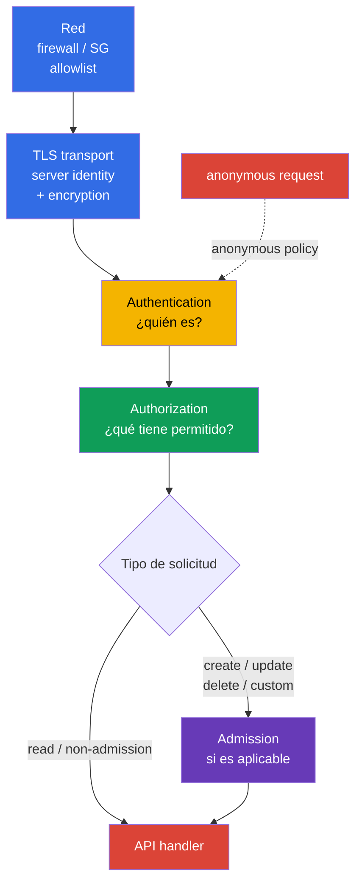
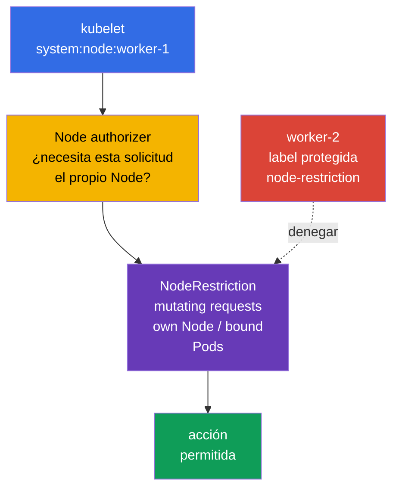
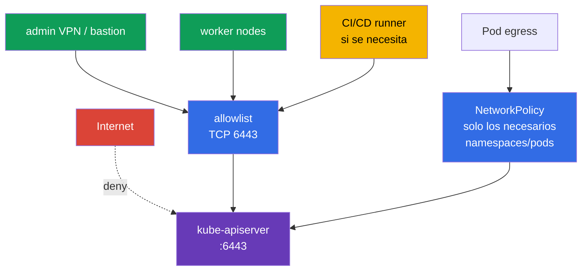

[Русская версия](ru.md) · [Eng version](README.md) · [Version française](fr.md) · [Deutsche Version](de.md) · [ქართული ვერსია](ge.md) · [繁體中文版](tw.md) · [日本語版](jp.md)

# Capítulo 12. Restricción del acceso a Kubernetes API

> **Problema.** Un API endpoint accesible desde una red innecesaria, una solicitud anonymous o un binding obsoleto para `system:unauthenticated` permiten a un atacante eludir el límite de un cliente ordinario. Un error en el perímetro de red, TLS o la configuración de apiserver convierte una solicitud sin una identity comprobada de forma fiable en acceso a datos y control del clúster.

> **Qué sigue.** En el capítulo 11 eliminamos los tokens de ServiceAccount innecesarios. Ahora cerraremos el propio punto al que acceden esos tokens y otras credenciales: Kubernetes API. Un error en `kube-apiserver`, kubelet o el perímetro de red convierte una sola solicitud no autenticada en una vía hacia los datos y el control del clúster. Este es el dominio **Cluster Hardening** de CKS (15%): limitamos quién puede llegar siquiera a API, en quién se convierte tras authentication y qué puede hacer.

> **Qué debe saber de CKA.** La ruta básica authn -> authz -> admission y ServiceAccount se explican en el [capítulo 21 de CKA](../../../cka/course/21/es.md); kubeconfig, certificados TLS de cliente y CSR, en el [capítulo 39 de CKA](../../../cka/course/39/es.md). Aquí no repetimos estos mecanismos: los aplicamos al hardening de API.

> 🧠 Red, TLS, authentication y authorization son barreras secuenciales independientes; admission se añade a las solicitudes a las que es aplicable. Timeout/refused, `401` y `403` señalan capas distintas.

## 12.1. Ruta de la solicitud a API: varias barreras independientes

`kube-apiserver` es el punto único de control del estado del clúster. Por él pasan `kubectl`, controladores, kubelet, operadores y aplicaciones con ServiceAccount. Por eso la protección no se reduce a una regla RBAC: la solicitud debe detenerse tan pronto como sea posible y, aun así, conservar las comprobaciones posteriores.



- **Red** determina si el origen puede establecer una conexión TCP con `6443`. Es la primera barrera y la menos costosa, pero no reemplaza identity ni RBAC.
- **TLS transport** protege la confidentiality e integrity de la conexión y permite al cliente comprobar la identity de API server. El TLS del lado del servidor por sí solo no es una allowlist de clientes. Con X.509 client-certificate authentication, TLS solicita y recibe el certificado del cliente y prueba la posesión de la private key correspondiente; después, el X.509 authenticator de Kubernetes, ya en la capa **Authentication**, valida el certificado contra el client CA configurado y convierte su identity en user/groups.
- **Authentication** asocia un certificado, bearer token u otro credential con un sujeto. Si anonymous access está habilitado, una solicitud sin credential recibe el sujeto `system:anonymous` y el grupo `system:unauthenticated`. En la `AuthenticationConfiguration` actual, anonymous access se puede limitar con una allowlist explícita de **HTTP paths exactos**. Una variante habitual es `/livez`, `/readyz` y, si hace falta, `/healthz`; para kubeadm public token discovery, un path explícitamente permitido aparte puede ser `/api/v1/namespaces/kube-public/configmaps/cluster-info`. Los demás paths no reciben anonymous identity.
- **Authorization** comprueba el verb, resource y scope permitidos. En un clúster kubeadm habitual es `Node,RBAC`.
- **Admission** actúa después de authorization solo para solicitudes a las que se aplica admission control: ante todo create/delete/modify y algunos custom verbs. `get`, `list` y `watch` de objetos omiten la admission layer. Admission puede modificar un objeto o rechazar una solicitud; aquí `NodeRestriction` limita los **cambios** permitidos de las kubelet identities.

El orden es precisamente importante al investigar: `401 Unauthorized` significa que la solicitud no superó Authentication. `403 Forbidden` significa que una solicitud ya fue prohibida a un sujeto identificado; primero se comprueba Authorization. Para mutating/custom requests también puede producirse después un rechazo independiente en Admission, pero admission no participa en los `get/list/watch` normales. No intente corregir un `401` creando un RoleBinding.

## 12.2. Anonymous access, legacy ports y bindings RBAC antiguos

### Por qué `system:anonymous` es peligroso

Anonymous access a veces se deja por un health check heredado o por costumbre. El sujeto anonymous por sí mismo no permite nada, pero un solo `RoleBinding` o `ClusterRoleBinding` erróneo para `system:anonymous` o `system:unauthenticated` hace que API sea accesible sin clave, certificado ni token. Primero se cierra la entrada y después se eliminan los permisos ya concedidos: deshabilitar ahora anonymous access no hace que un binding peligroso sea seguro para siempre.

Para kubeadm estándar, el `--anonymous-auth=false` completo no puede considerarse un baseline universal: sus health probes acceden a `/livez` y `/readyz` sin credentials, por lo que, con una prohibición global de anonymous, pueden recibir `401` y reiniciar API server. La opción principal para tal clúster es una `AuthenticationConfiguration` estable, conectada mediante `--authentication-config`. Sus conditions son una allowlist de paths **exactos**: cualquier otro path no se vuelve anonymous incluso con un RBAC binding permisivo. Esto también afecta a `kubeadm join` basado en token: antes de confiar en API, el cliente unauthenticated lee `/api/v1/namespaces/kube-public/configmaps/cluster-info`. Por ello, elija una de dos opciones comprobadas: añada este path exacto durante public token discovery, o deshabilite public discovery y use file/HTTPS discovery. Una allowlist solo de health sin este path es incompatible con el token-based join normal. `/healthz` se añade únicamente si un health check lo utiliza realmente. Cada exception requiere una revisión separada de rutas, acceso de red y permisos del sujeto anonymous.

En el control-plane de kubeadm, `kube-apiserver` suele ser un static Pod. Edite el manifest activo localmente en control-plane, con acceso a la consola del Node y una ruta de rollback guardada. No copie YAML de respaldo a `/etc/kubernetes/manifests/`: kubelet puede interpretarlo como otro static Pod.

```bash
# En control-plane: guardar una copia fuera del directorio de manifests de static Pod.
sudo install -d -m 700 /root/k8s-manifest-backup
sudo cp /etc/kubernetes/manifests/kube-apiserver.yaml \
  /root/k8s-manifest-backup/kube-apiserver.yaml

# Crear la authentication configuration fuera del directorio de manifests de static Pod.
# Si kubeadm join usa public token discovery, mantenga el path cluster-info exacto.
sudo install -d -m 700 /etc/kubernetes/authentication
sudo tee /etc/kubernetes/authentication/apiserver-authentication.yaml >/dev/null <<'EOF'
apiVersion: apiserver.config.k8s.io/v1
kind: AuthenticationConfiguration
anonymous:
  enabled: true
  conditions:
  - path: /livez
  - path: /readyz
  - path: /api/v1/namespaces/kube-public/configmaps/cluster-info
EOF
sudo chmod 0600 /etc/kubernetes/authentication/apiserver-authentication.yaml

# Buscar los flags authn ya establecidos; no debe haber repeticiones en conflicto.
sudo grep -nE -- '--(anonymous-auth|authentication-config)' \
  /etc/kubernetes/manifests/kube-apiserver.yaml || true
sudoedit /etc/kubernetes/manifests/kube-apiserver.yaml
```

En `spec.containers[].command` indique exactamente una ruta al archivo y no configure simultáneamente `--anonymous-auth` (estas formas de configuración son mutuamente excluyentes):

```yaml
- --authentication-config=/etc/kubernetes/authentication/apiserver-authentication.yaml
```

Un flag no basta: el archivo está en el host y debe montarse explícitamente en el static Pod. Añada un volume `hostPath` y un `volumeMount` read-only, sin eliminar los volumes existentes de kube-apiserver:

```yaml
# Añada a los volumeMounts existentes de kube-apiserver:
volumeMounts:
- name: authentication-config
  mountPath: /etc/kubernetes/authentication/apiserver-authentication.yaml
  readOnly: true

# Añada a los volumes existentes del Pod:
volumes:
- name: authentication-config
  hostPath:
    path: /etc/kubernetes/authentication/apiserver-authentication.yaml
    type: File
```

Después del cambio, compruebe que el container realmente ve el archivo, que API server se ha recuperado y que `/readyz` funciona correctamente. `hostPath` es una ruta local del Node: en un HA control plane, cree el mismo archivo y mount en **cada** Node de control-plane; de lo contrario, su apiserver no podrá montar el archivo ni iniciarse.

La edición manual del static Pod sirve para una tarea concreta de laboratorio o emergencia, pero no debe ser la única source of truth de un clúster kubeadm. Para una configuración permanente, lleve el parámetro y el mount a `ClusterConfiguration`, por ejemplo mediante `apiServer.extraArgs` y `apiServer.extraVolumes`, o use kubeadm patches gestionados. De otro modo, `kubeadm upgrade` puede regenerar el manifest sin esta configuración:

```yaml
apiVersion: kubeadm.k8s.io/v1beta4
kind: ClusterConfiguration
apiServer:
  extraArgs:
  - name: authentication-config
    value: /etc/kubernetes/authentication/apiserver-authentication.yaml
  extraVolumes:
  - name: authentication-config
    hostPath: /etc/kubernetes/authentication/apiserver-authentication.yaml
    mountPath: /etc/kubernetes/authentication/apiserver-authentication.yaml
    readOnly: true
    pathType: File
```

La deshabilitación total mediante `--anonymous-auth=false` solo es admisible después de cambiar previamente las kubeadm health probes a autenticadas, o a otro mecanismo comprobado, y de verificar las dependencias de bootstrap. Tras guardar, kubelet recrea el static Pod. El manifest es una desired source, no una prueba del argv de apiserver que ya está en ejecución. No reinicie todos los componentes de control-plane a la vez ni cierre la sesión SSH hasta que API se haya recuperado.

```bash
# Desired configuration. El manifest por sí solo no prueba el active runtime.
sudo grep -n -- '--authentication-config=' \
  /etc/kubernetes/manifests/kube-apiserver.yaml
watch -n 2 'sudo crictl ps --name kube-apiserver'

# En un Linux-host donde los PID de los containers son visibles: probar por separado argv y la visibilidad del archivo
# para el proceso en ejecución. Si el runtime/PID namespace no lo permite, use su comprobación inspect equivalente,
# y no concluya solo a partir del manifest.
APISERVER_PID="$(pgrep -xo kube-apiserver)" || {
  echo 'ERROR: running kube-apiserver process not found' >&2
  exit 2
}
AUTH_CONFIG_ARG='--authentication-config=/etc/kubernetes/authentication/apiserver-authentication.yaml'
AUTH_CONFIG_PATH='/etc/kubernetes/authentication/apiserver-authentication.yaml'

if ! sudo cat "/proc/${APISERVER_PID}/cmdline" \
    | tr '\0' '\n' \
    | grep -Fxq -- "$AUTH_CONFIG_ARG"
then
  echo "ERROR: active kube-apiserver argv does not contain ${AUTH_CONFIG_ARG}" >&2
  exit 1
fi

if ! sudo test -e "/proc/${APISERVER_PID}/root${AUTH_CONFIG_PATH}"; then
  echo "ERROR: ${AUTH_CONFIG_PATH} is not visible in kube-apiserver mount namespace" >&2
  exit 1
fi

echo 'OK: active kube-apiserver uses the expected authentication config path'

# La disponibilidad de API se comprueba separadamente de desired configuration y argv.
kubectl get --raw='/readyz?verbose'
kubectl get nodes
```

Kubelet es el segundo HTTP API en cada Node. Se protege por separado: se deshabilitan anonymous authentication y el legacy read-only API. No se puede considerar `/var/lib/kubelet/config.yaml` una fuente universal: kubelet puede recibir `--config`, `--config-dir` y argumentos de unit, drop-in o un archivo de environment. Primero determine las startup sources reales y solo después compruebe la `KubeletConfiguration` activa; con acceso permitido también puede contrastarla con el endpoint `/configz`.

```bash
sudo systemctl cat kubelet
sudo systemctl show kubelet -p ExecStart --value
KUBELET_PID=$(pgrep -xo kubelet) || { echo 'kubelet process not found' >&2; exit 2; }
sudo tr '\0' '\n' < "/proc/$KUBELET_PID/cmdline" \
  | grep -E -- '^--config(=|$)|^--config-dir(=|$)|^--(read-only-port|anonymous-auth|authorization-mode)(=|$)' || true
# Tras determinar el archivo real, por ejemplo: sudo grep -nE 'readOnlyPort|anonymous:|authorization:' <active-kubelet-config>
```

```yaml
# En la KubeletConfiguration activa, la ruta la determina la startup configuration.
readOnlyPort: 0
authentication:
  anonymous:
    enabled: false
authorization:
  mode: Webhook
```

Equivalentes si una instalación concreta gestiona kubelet mediante flags:

```text
--read-only-port=0
--anonymous-auth=false
--authorization-mode=Webhook
```

`10255` es el puerto histórico read-only no autenticado de kubelet; debe estar deshabilitado. El API kubelet normal en `10250` no debe «abrirse para todos»: debe seguir protegido por authentication, `Webhook` authorization y reglas de red. En `kube-apiserver`, el legacy `--insecure-port` ya se eliminó en Kubernetes moderno; no es motivo para ignorar manifests, imágenes y documentación antiguos. Búsquelo como señal de una configuración no compatible o insegura, no intente habilitarlo por compatibilidad.

```bash
# En cada Node: un error de ss es un error de comprobación, no una confirmación de puerto cerrado.
listeners=$(sudo ss -H -lnt '( sport = :10255 )') || {
  echo 'ERROR: cannot inspect TCP listener 10255' >&2; exit 2;
}
if [ -n "$listeners" ]; then
  printf 'ERROR: kubelet read-only port 10255 is listening:\n%s\n' "$listeners" >&2
  exit 1
fi
echo 'OK: kubelet read-only port 10255 is closed'

# 10250 se comprueba junto con firewall; el filtro socket exacto evita coincidir con otro puerto.
sudo ss -H -lntp '( sport = :10250 )'
```

> 🎯 Configure una authentication configuration segura y elimine los bindings para `system:anonymous`/`system:unauthenticated`. Deshabilite el legacy `10255` y `--insecure-port`, y no publique el `10250` protegido.

### Inventario y cleanup de bindings

No elimine un `ClusterRole` por nombre al azar: un rol puede ser necesario para otro sujeto. Busque los bindings cuyos `subjects` indiquen realmente el anonymous user o su grupo, revise el rol asignado y solo entonces elimine el binding innecesario.

```bash
# ClusterRoleBinding con concesión directa de permisos al anonymous user o al grupo unauthenticated.
kubectl get clusterrolebinding -o json | jq -r '
  .items[]
  | select(any(.subjects[]?;
      (.kind == "User" and .name == "system:anonymous") or
      (.kind == "Group" and .name == "system:unauthenticated")))
  | [.metadata.name, .roleRef.kind, .roleRef.name] | @tsv'

# Lo mismo para RoleBinding con scope de namespace.
kubectl get rolebinding -A -o json | jq -r '
  .items[]
  | select(any(.subjects[]?;
      (.kind == "User" and .name == "system:anonymous") or
      (.kind == "Group" and .name == "system:unauthenticated")))
  | [.metadata.namespace, .metadata.name, .roleRef.kind, .roleRef.name] | @tsv'
```

No elimine un binding solo porque el sujeto coincide. En particular, `system:public-info-viewer` es un default ClusterRoleBinding estándar para `system:unauthenticated` con non-sensitive public information; con RBAC habilitado, los subjects faltantes de los bindings estándar pueden restaurarse mediante auto-reconciliation al iniciar API. Además, kubeadm token discovery usa el RoleBinding `kubeadm:bootstrap-signer-clusterinfo` para leer `kube-public/cluster-info`. Primero compruebe el rol y si se necesita el discovery workflow correspondiente; elimine únicamente un binding personalizado o realmente excesivo.

Tras la revisión, la eliminación dirigida se ve así:

```bash
REVIEWED_CLUSTERROLEBINDING='reviewed-clusterrolebinding'
NAMESPACE='reviewed-namespace'
REVIEWED_ROLEBINDING='reviewed-rolebinding'
kubectl delete clusterrolebinding "$REVIEWED_CLUSTERROLEBINDING"
kubectl delete rolebinding -n "$NAMESPACE" "$REVIEWED_ROLEBINDING"
```

Revise también cualquier binding que otorgue permisos al grupo `system:unauthenticated`: deshabilitar anonymous access detiene la vía habitual actual hacia él, pero la policy debe seguir siendo mínima y comprensible ante cambios posteriores en el identity provider.

## 12.3. Authorization modes y NodeRestriction

`--authorization-mode` establece una cadena ordenada de módulos de autorización. Cada módulo devuelve `Allow`, `Deny` o `NoOpinion`: `Allow` **o** `Deny` terminan inmediatamente la cadena, y solo `NoOpinion` pasa la solicitud al módulo siguiente; si todos los módulos devuelven `NoOpinion`, la solicitud se rechaza. Por ello el orden importa, y `AlwaysAllow` en una parte alcanzable de la cadena anula least privilege para las solicitudes que le llegan.

| Mode | Finalidad | Decisión de hardening |
|---|---|---|
| `Node` | procesa solicitudes de kubelet identities `system:node:<node>` | habilitar antes de `RBAC` en un clúster kubeadm normal |
| `RBAC` | comprueba Role, ClusterRole y bindings para usuarios, grupos y ServiceAccount | authorizer principal para administradores y workload |
| `Webhook` | consulta un authorization webhook externo | usar solo con un servicio externo disponible y comprobado |
| `ABAC` | reglas de un archivo policy local | opción legacy; difícil de auditar, evitar en clústeres nuevos |
| `AlwaysAllow` | permite todo | no usar en production |

La `AuthorizationConfiguration` estructurada es estable desde Kubernetes v1.32 y se establece mediante el flag `--authorization-config`. Se elige **un** enfoque: este archivo no puede combinarse con la configuración CLI `--authorization-mode` y `--authorization-webhook-*`; si se mezclan, `kube-apiserver` finalizará con un error. El archivo es útil cuando se necesitan parámetros y varios webhook authorizer, pero la migración se planifica y verifica como un cambio de control plane, no se añade una segunda fuente de configuración paralela.

Compruebe el argumento desired en el manifest de static Pod y establezca una cadena de base segura si corresponde a la arquitectura del clúster. Tras la reconciliation de kubelet, confirme por separado el argv del proceso en ejecución (como en §12.2): una línea en el manifest por sí sola no prueba la configuración activa:

```bash
sudo grep -n -- '--authorization-mode' /etc/kubernetes/manifests/kube-apiserver.yaml
```

```yaml
- --authorization-mode=Node,RBAC
```

El authorizer `Node` no es para «confiar en todos los Nodes», sino para las API operations especiales de kubelet. En el baseline kubeadm mostrado, `Node,RBAC` autoriza las demás identities mediante RBAC. En otra arquitectura deliberada, el authorizer común puede incluir, por ejemplo, Webhook; es importante que exista una authorization policy fail-closed para todas las demás requests y que `AlwaysAllow` no se use como fallback. No cambie la lista de modes en un clúster en funcionamiento sin comprobar bootstrap controllers, identity provider y los clientes API actuales.

> 🎯 Baseline kubeadm: `Node,RBAC` sin `AlwaysAllow`; `Node` atiende kubelet, RBAC limita las demás identities y `NodeRestriction` limita las mutating requests permitidas con node credentials.

**NodeRestriction** es un validating admission plugin que complementa al authorizer `Node`. El authorizer `Node` determina los permisos API de kubelet y limita las relation-sensitive reads; después, `NodeRestriction` limita los **cambios** permitidos: kubelet solo puede modificar su propio `Node` y los `Pod` asignados a ese Node, y no puede modificar Node labels/taints protegidos fuera del modelo permitido. Las solicitudes de lectura no pasan por admission, por lo que su scope lo determina precisamente el authorizer.



En kubeadm, `NodeRestriction` suele estar habilitado como admission plugin adicional. Compruebe primero a la vez `--enable-admission-plugins` y `--disable-admission-plugins`.

```bash
sudo grep -nE -- '--(enable|disable)-admission-plugins' \
  /etc/kubernetes/manifests/kube-apiserver.yaml
sudo crictl ps --name kube-apiserver
```

En Kubernetes v1.36, `--enable-admission-plugins` añade plugins al built-in default-enabled set; no es necesario enumerar los defaults en ese flag. Si `NodeRestriction` no está habilitado, añádalo a la lista additional explícita. Si `--enable-admission-plugins` ya contiene otros plugins adicionales, consérvelos. Asegúrese también de que el default o plugin necesario no esté deshabilitado mediante `--disable-admission-plugins`. RBAC controla los permisos generales basados en role/binding de usuarios, grupos y ServiceAccount, mientras que el authorizer `Node` atiende los permisos especiales de node identities. `NodeRestriction` no los reemplaza: añade restricciones de admission a las mutating requests de kubelet. Junto a él, tenga en cuenta el feature gate `ServiceAccountNodeAudienceRestriction`: cuando está habilitado, NodeRestriction también restringe las audiences para las que kubelet puede solicitar ServiceAccount-tokens mediante `TokenRequest`, a las audiences que ya usan los Pod de ese Node o que se conceden explícitamente mediante RBAC. No reemplaza NodeRestriction, sino que es una restricción adicional para node-originated token requests.

> 🎯 Restrinja `:6443` con private endpoint o una allowlist CIDR exacta; para los Pod, compruebe una egress policy separada.

## 12.4. Restricción de red para acceder a apiserver

Incluso con TLS y RBAC correctos, un API endpoint público amplía la superficie: la dirección `:6443` da a un atacante la posibilidad de probar credentials, aprovechar una vulnerabilidad futura u obtener información por errores. Un private endpoint es una opción sólida y a menudo preferible, pero no es un absoluto universal: un public endpoint puede justificarse si hay restricciones de red estrictas disponibles (allowlist CIDR estrecha, firewall/WAF según la arquitectura) y authentication fuerte. En cualquier variante, `:6443` se permite únicamente desde source paths necesarios y confirmados: red administrativa/VPN, control-plane, tráfico kubelet/worker, automation endpoints acordados y los in-cluster workloads que realmente necesiten API. No presuponga que el endpoint siempre ve workload traffic como dirección del worker Node: determine el CNI/cloud datapath efectivo y la source address después de SNAT/routing.



Aplique las barreras según el ámbito de responsabilidad:

- **Cloud Security Group / firewall**: permita `TCP/6443` solo desde los source ranges/identities realmente necesarios: control-plane, ruta kubelet/worker, VPN/bastion, automation y, si la topology lo requiere, direcciones/CIDR de los Pod workloads autorizados. No añada automáticamente todo el Pod CIDR: primero determine qué source ve realmente API endpoint después de CNI/cloud routing y SNAT. No configure `0.0.0.0/0`; en un clúster private use private endpoint o tunnel.
- **Host firewall** (`nftables`, `iptables`, `ufw`) en un control-plane self-managed: duplica el perímetro de red y restringe los orígenes si el cloud firewall se amplía por error.
- **NetworkPolicy**: `kubernetes.default.svc` es un nombre lógico de Service, y la NetworkPolicy estándar no selecciona un Service de destino por nombre. La restricción de egress a API se construye mediante `ipBlock`/endpoint CIDR verificando el datapath real, o mediante una entity, FQDN o Service policy CNI-specific. No traslade `ipBlock` entre CNI sin comprobar: el DNAT de Service puede producirse antes o después de policy y no tiene una semántica universal. Permita API solo al namespace y workload que realmente lo necesiten: esto reduce lateral movement tras comprometer un Pod.
- **Routing y DNS**: asegúrese de que el control-plane endpoint se publica y resuelve únicamente como exige el modelo de acceso elegido; un private endpoint suele simplificarlo, pero un public endpoint exige un control especialmente estricto de fuentes y authentication.

**kubeadm discovery es un caso aparte.** En token-based discovery, ConfigMap `kube-public/cluster-info` contiene por defecto discovery-information accesible públicamente (dirección API y datos CA); no es un Secret y no debe distribuirse ni protegerse como un Secret. Bootstrap token, por el contrario, es una credential temporal para discovery/TLS bootstrap y necesita control separado: distribución limitada, vida corta, revocación y revisión de CSR/auto-approval. Al limitar anonymous mediante `AuthenticationConfiguration`, un RBAC binding no basta: el exact path `/api/v1/namespaces/kube-public/configmaps/cluster-info` también debe estar en `anonymous.conditions`; de lo contrario, la request no recibe anonymous identity y token discovery se rompe. Si hace falta, se deshabilita el public access a `cluster-info` o se aplica file/HTTPS discovery con un canal de confianza adecuado; no mezcle la protección de información pública con la protección del token.

NetworkPolicy no sustituye a Security Group ni a host firewall: CNI la aplica al tráfico de Pod y no tiene por qué cubrir de forma idéntica el tráfico de host, externo o control-plane en cada topology. En managed Kubernetes, parte del endpoint y firewall pertenecen al provider; entonces compruebe su private/public endpoint, allowed CIDRs y control-plane security rules separadas, en vez de intentar editar un static Pod que no tiene.

Antes de cambiar el firewall, registre los listeners y la regla actuales, y mantenga una sesión de consola separada para rollback. Bloquear `6443` para su propio administrador o kubelet puede dejar el clúster inaccesible.

```bash
# En control-plane: quién escucha API; el programa concreto depende del runtime.
sudo ss -lntp | grep ':6443'

# Desde la máquina administrativa: comprobar endpoint sin deshabilitar la verificación TLS en production.
kubectl cluster-info
kubectl get --raw='/livez?verbose'
```

> 🔬 `kubectl proxy` y `port-forward` como formas auxiliares de acceso local: utilizan los permisos del kubeconfig del operador y crean una superficie adicional de diagnóstico.

## 12.4.1. Gateways API locales: `kubectl proxy` y `port-forward`

`kubectl proxy` y `kubectl port-forward` usan las facultades del kubeconfig del usuario, no crean una identity nueva limitada. Por defecto, `kubectl proxy` escucha en `127.0.0.1`, lo que limita el riesgo a la máquina local. No amplíe su `--address` sin necesidad; un `--accept-hosts` amplio, y especialmente `--disable-filter`, pueden convertir proxy en un gateway hacia API accesible para otros clientes con los permisos del operador. Del mismo modo, no use `kubectl port-forward --address 0.0.0.0` salvo que se necesite una conexión breve, acordada por separado, a través de una red segura. Cierre el túnel temporal después del diagnóstico y no lo considere sustituto de firewall, RBAC o NetworkPolicy.

> 🎯 Confirme active config, flags seguros, readiness después de reload, `401` para anonymous path y un `can-i` dirigido con `no`; diagnostique static Pod mediante kubelet y runtime.

## 12.5. Profiling, ServiceAccount lookup y auditoría de flags

Los profiling endpoints son necesarios para diagnosticar el rendimiento, pero sin necesidad amplían la superficie de divulgación de información sobre el proceso. En `kube-apiserver` deshabilite profiling; en la misma operación compruebe controller-manager y scheduler. La comprobación CIS detallada de los tres componentes se presenta en el [capítulo 07](../07/es.md), y los argumentos inseguros y el TLS-hardening, en el [capítulo 09](../09/es.md).

```yaml
# En el command del static Pod kube-apiserver
- --profiling=false
```

```bash
for component in kube-apiserver kube-controller-manager kube-scheduler; do
  sudo grep -n -- '--profiling' "/etc/kubernetes/manifests/${component}.yaml" || true
done
```

`--service-account-lookup` se refiere a comprobar la existencia de ServiceAccount durante authentication de un legacy ServiceAccount token. El valor `false` deshabilita API-based revocation: un ServiceAccount eliminado o un legacy token eliminado dejan de revocar el token ya emitido mediante esta comprobación. Esto **no** es un mecanismo para establecer o garantizar un TTL corto para legacy tokens; su duración la determina la forma de emisión y los claims del token. Sin una decisión explícita, lookup no se deshabilita. En clústeres modernos se prefieren los bound, short-lived projected tokens del capítulo 11, y la existencia y comportamiento del flag se contrastan con la versión mediante `kube-apiserver --help` y la documentación de la versión usada.

Compruebe la configuración como un conjunto de riesgos, no solo un flag. En scheduler, primero compruebe la presencia de `--config`: con él, el `--profiling` deprecated se ignora, por lo que `enableProfiling: false` se establece en la `KubeSchedulerConfiguration` activa encontrada.

```bash
sudo grep -nE -- \
  '--(anonymous-auth|authorization-mode|enable-admission-plugins|profiling|service-account-lookup|insecure-port|secure-port)' \
  /etc/kubernetes/manifests/kube-apiserver.yaml
sudo grep -n -- '--config' /etc/kubernetes/manifests/kube-scheduler.yaml
# Según el --config indicado: sudo grep -n 'enableProfiling:' <active-scheduler-config>

# Kubelet: primero encontrar el --config/--config-dir real en unit y /proc/<kubelet-pid>/cmdline,
# y después comprobar la KubeletConfiguration activa encontrada.
```

| Hallazgo | Por qué es peligroso | Dirección segura |
|---|---|---|
| broad anonymous access | una request sin credential recibe `system:anonymous`; con selective config solo quedan excluidos los exact allowed paths | `AuthenticationConfiguration` con una allowlist mínima de exact paths o `--anonymous-auth=false`, si es compatible con probes/bootstrapping; cleanup de bindings |
| `--authorization-mode=AlwaysAllow` | todo sujeto autenticado o anonymous supera authz | `Node,RBAC` o integración Webhook deliberada |
| ausencia de `NodeRestriction` | un kubelet comprometido obtiene una vía más amplia hacia API | habilitar plugin conservando los defaults existentes |
| profiling habilitado sin necesidad | endpoints de diagnóstico adicionales | para apiserver/controller-manager: `--profiling=false`; para scheduler con `--config`: `enableProfiling: false` en la `KubeSchedulerConfiguration` activa |
| `readOnlyPort` distinto de `0` | legacy kubelet API sin authentication | `readOnlyPort: 0` |
| `6443` público | superficie ampliada para credentials attacks y vulnerabilidades API | private endpoint o allowlist CIDR estricta, firewall y authentication fuerte |

Después de editar un static Pod, no confirme solo la línea en YAML. Kubelet debe iniciar un container nuevo y API debe estar Ready. Si hay YAML erróneo o un flag no soportado, use la consola local, `journalctl -u kubelet`, `crictl ps -a` y la copia guardada del manifest.

## 12.6. Verificación: demostrar que el acceso no autorizado a la API está bloqueado

La verificación se ejecuta en dos capas independientes: authentication sin credential y authorization para un sujeto indicado explícitamente. Compruebe desde la red que debe tener TCP access a API; el firewall timeout y el `401` de API son resultados distintos pero ambos útiles en sus respectivas capas.

```bash
# Tomamos la server URL del kubeconfig actual, sin pasar certificado, clave ni token a curl.
APISERVER=$(kubectl config view --minify \
  -o jsonpath='{.clusters[0].cluster.server}')
printf '%s\n' "$APISERVER"

# Protected path: `401` prueba que precisamente /version no supera anonymous authn.
# Para una prueba educativa se permite -k, pero en production proporcione CA mediante --cacert.
curl -k -sS -o /dev/null -w '%{http_code}\n' "$APISERVER/version"

# Si selective config permite intencionadamente /readyz, compruébelo por separado.
# Con API preparada se suele esperar 200, pero esto no refuta el 401 en /version.
curl -k -sS -o /dev/null -w '%{http_code}\n' "$APISERVER/readyz"
```

Un `401` en `/version` prueba únicamente que este protected path no acepta anonymous request; no prueba la deshabilitación global del anonymous authenticator. En una `AuthenticationConfiguration` selectiva, exact allowed paths, por ejemplo `/readyz` o discovery path, pueden funcionar intencionadamente sin credential. Si la conexión hace timeout/refused, primero diagnostique firewall, Security Group, DNS y ruta; esto no prueba una configuración de Authentication.

Con permisos cluster-admin, compruebe por separado authorizer mediante impersonation:

```bash
# No debe haber permiso. El administrador que realiza la llamada necesita el permiso `impersonate`.
# La anonymous identity completa incluye user y group.
kubectl auth can-i get pods --all-namespaces \
  --as=system:anonymous --as-group=system:unauthenticated
kubectl auth can-i list secrets --all-namespaces \
  --as=system:anonymous --as-group=system:unauthenticated

# Comprobar explícitamente los permisos mínimos de ServiceAccount de la lab 104.
kubectl auth can-i list pods -n cks-104 \
  --as=system:serviceaccount:cks-104:app-sa
kubectl auth can-i delete pods -n cks-104 \
  --as=system:serviceaccount:cks-104:app-sa
```

Espere `no` para las comprobaciones anonymous y para el `delete` prohibido; `list pods` para el `app-sa` dedicado debe devolver `yes` solo en el namespace indicado. `kubectl auth can-i` comprueba authorizer para la impersonated identity, pero no establece una conexión real sin credential ni prueba el estado del anonymous authenticator. Guarde los comandos, el HTTP status y los config sources modificados en el change record: es evidencia de que el control funciona, no solo de que se declara.

## 12.7. Errores habituales y diagnóstico

| Síntoma | Causa probable | Qué comprobar |
|---|---|---|
| API no se inicia tras editar | YAML dañado, flag duplicado o no soportado | `journalctl -u kubelet`, `crictl ps -a`, copia guardada del manifest |
| `curl` no da 401 sino timeout | tráfico cortado antes de API | Security Group/firewall, DNS, ruta y puerto `6443` |
| anonymous `can-i` da inesperadamente `yes` | queda un RoleBinding/ClusterRoleBinding | buscar `system:anonymous` y `system:unauthenticated` en bindings |
| kubelet deja de registrarse | firewall o API endpoint inaccesibles, kubelet config incorrecto | `journalctl -u kubelet`, `ss`, node routes y active kubelet args |
| NodeRestriction no produce el efecto esperado | plugin no está activo o kubelet no usa node identity | flags de apiserver, CN del certificado cliente, admission configuration |
| Pod ya no alcanza API | egress policy demasiado estricta/estrecha, falta el allow-rule necesario, datapath/CIDR/port incorrecto o ServiceAccount-token se deshabilitó intencionadamente | necesidad de acceso, NetworkPolicy/CNI policy activa y datapath real a API, `automountServiceAccountToken`, RBAC |

> 🏭 Endpoint exposure, kubeadm/API configuration y RBAC cleanup se fijan en IaC y se comparan con el baseline; los propietarios responden del endpoint, CIDR y evidence tras los cambios.

## 12.8. Cómo se aplica en production

- **Varias capas, un baseline.** `--anonymous-auth=false` (donde es compatible con probes y dependencias de bootstrap) o conditions estrechas para los health/discovery paths exactos en `AuthenticationConfiguration`, `Node,RBAC`, NodeRestriction con evaluación de `ServiceAccountNodeAudienceRestriction`, el kubelet read-only port cerrado y un API endpoint private/estrictamente allowlisted se describen en kubeadm config, image del Node o IaC. La edición manual de static Pod es admisible en una emergencia, pero no debe ser la única source of truth.
- **Red según el propósito.** Los administradores trabajan mediante VPN/bastion, CI/CD tiene direcciones de salida separadas, worker/control-plane reciben solo las reglas necesarias y para Pod-to-API se fija separadamente el datapath/source efectivo, permitiendo solo los workloads que realmente necesitan API. Un public endpoint es admisible únicamente con un propietario explícito del riesgo, restricción estricta de orígenes y authentication fuerte; un private endpoint sigue siendo una opción sólida, pero no la única.
- **Los permisos se revisan después de cambiar identity.** Busque regularmente bindings para `system:anonymous`, `system:unauthenticated`, usuarios obsoletos y ServiceAccount, elimine los no utilizados y pruebe `kubectl auth can-i`.
- **Observability no abre diagnóstico.** Metrics, audit y logs centralizados proporcionan la visibilidad necesaria; profiling se habilita temporalmente, por allowlist y con un plan de deshabilitación.
- **El managed control plane se separa por responsabilidades.** No se puede editar el manifest de static Pod del provider, pero sí se pueden y deben controlar endpoint exposure, allowed CIDRs, RBAC, admission-policy, node security groups y el acceso a kubelet.

## 12.9. Mini-glosario

- **anonymous authentication** - asociación de una request sin credential con `system:anonymous`; normalmente se deshabilita para API y kubelet.
- **`system:unauthenticated`** - grupo del sujeto anonymous; un binding hacia él requiere la misma revisión que un binding hacia `system:anonymous`.
- **authorization mode** - authorizer de API server, por ejemplo `Node`, `RBAC` o `Webhook`.
- **Node authorizer** - authorizer especial para kubelet identities; permite las node operations necesarias y el acceso relation-sensitive a objetos relacionados con los Pod de ese Node.
- **NodeRestriction** - validating admission plugin que limita los cambios permitidos de Node/Pod por kubelet y los Node labels protegidos; con `ServiceAccountNodeAudienceRestriction` también limita las audiences de `TokenRequest` node-originated.
- **allowlist** - lista explícita de orígenes, puertos o destinos permitidos en lugar de permitir a todos.
- **read-only port** - legacy kubelet API no autenticada, deshabilitada mediante `readOnlyPort: 0`/`--read-only-port=0`.
- **profiling** - endpoints para diagnóstico de rendimiento del proceso; sin necesidad se deshabilita con `--profiling=false`, excepto en `kube-scheduler` con `--config`: para él, el flag CLI se ignora y se necesita `enableProfiling: false` en la `KubeSchedulerConfiguration` activa.
- **static Pod** - Pod gestionado por kubelet desde un manifest local; kubeadm suele iniciar así los componentes de control-plane.

## 12.10. Resumen del capítulo

- API se protege con varias capas independientes: red, TLS, authentication y authorization; para mutating y custom requests admitidas también se aplica admission.
- Para kubelet se deshabilita anonymous access (`--anonymous-auth=false`). En kube-apiserver, se limitan explícitamente sus health endpoints y, mientras se necesite public token discovery, el path exacto `kube-public/cluster-info` mediante `AuthenticationConfiguration`; en ambos casos se comprueban y eliminan solo los RoleBinding/ClusterRoleBinding innecesarios para `system:anonymous` y `system:unauthenticated`.
- El legacy kubelet read-only port se deshabilita con `readOnlyPort: 0`; `10250` se mantiene únicamente con authentication, `Webhook` authorization y restricción de red.
- La cadena base segura de authorizer en kubeadm es `Node,RBAC`; `AlwaysAllow` es incompatible con least privilege. El authorizer `Node` establece los permisos API de kubelet y NodeRestriction añade restricciones a sus mutating requests.
- Para API `:6443` se prefiere private endpoint; con public endpoint son obligatorios un firewall/Security Group allowlist estricto y authentication fuerte. En cualquier caso, NetworkPolicy específica para Pod egress reduce lateral movement.
- `--profiling=false`, ServiceAccount lookup habilitado para API revocation de legacy tokens y auditoría de flags reducen la superficie; los bound projected tokens, no `--service-account-lookup=false`, proporcionan TTL corto.
- El resultado se demuestra con comprobaciones separadas: anonymous `curl` a un protected path, por ejemplo `/version`, debe dar API `401`; un health/discovery path intentionally allowed se prueba por separado. `kubectl auth can-i --as=system:anonymous --as-group=system:unauthenticated` comprueba authorizer para la impersonated identity y debe devolver `no` para la acción prohibida.

## 12.11. Cómo será útil: en el examen y en el trabajo real

**En el examen.** La tarea suele dar acceso a control-plane y pedir cerrar anonymous API o eliminar un binding peligroso. Encuentre el manifest de static Pod activo, guarde una copia fuera de `/etc/kubernetes/manifests/`, corrija el único flag necesario, espere la recreación de API y compruebe `/readyz`. Después use `curl` sin credential a un protected path, por ejemplo `/version`; con una selective configuration, considere por separado los exact paths intencionadamente allowed. `kubectl auth can-i --as=system:anonymous --as-group=system:unauthenticated` comprueba únicamente authorizer para la impersonated identity; no se limite a buscar texto en un archivo.

**Escenario de examen: el clúster kubeadm se creó con `AlwaysAllow`.** El context actual puede apuntar a una cuenta que, después de habilitar RBAC, no deba tener permisos, mientras que en kubeconfig (o en un kubeconfig separado) hay una cuenta administrativa conocida. Antes del cambio, selecciónela explícitamente **para cada comando**: no ejecute `kubectl config use-context`, para no perder el context original ni obtener un resultado falsamente satisfactorio.

```bash
CURRENT_CONTEXT=$(kubectl config current-context)
kubectl config get-contexts
ADMIN_CONTEXT='kubernetes-admin@kubernetes'  # nombre del admin context conocido de la lista

# Si el admin está en otro archivo, añada también --kubeconfig=/ruta/a/admin.conf.
kubectl --context="$ADMIN_CONTEXT" auth whoami
sudo grep -nE -- '--authorization(-mode|-config)' \
  /etc/kubernetes/manifests/kube-apiserver.yaml
sudo cp -a /etc/kubernetes/manifests/kube-apiserver.yaml \
  /root/kube-apiserver.yaml.before-authz
sudoedit /etc/kubernetes/manifests/kube-apiserver.yaml
```

En el manifest, sustituya `--authorization-mode=AlwaysAllow` por `--authorization-mode=Node,RBAC`, sin eliminar los demás argumentos. Si encuentra `--authorization-config`, no añada `--authorization-mode` al mismo tiempo: corrija la active structured configuration según su esquema. Una comprobación `can-i` **antes** de la corrección no prueba que la cuenta admin tenga permisos RBAC: con `AlwaysAllow` tendrá éxito para cualquier sujeto autenticado.

```bash
# Kubelet recrea el static Pod; no pierda acceso a control-plane antes de comprobarlo.
watch -n 2 'sudo crictl ps --name kube-apiserver'
kubectl --context="$ADMIN_CONTEXT" get --raw='/readyz?verbose'
kubectl --context="$ADMIN_CONTEXT" auth can-i get nodes

# Este context no tiene el RBAC binding requerido en el escenario; se espera "no".
kubectl --context="$CURRENT_CONTEXT" auth can-i get nodes
```

En un clúster real, después de una recuperación urgente refleje también authorizer en la fuente de configuración kubeadm (`kubeadm-config`/IaC); de lo contrario, un posterior `kubeadm upgrade` puede volver a generar un manifest con la configuración obsoleta.

**En el trabajo real.** La restricción de API forma parte del diseño de red e identity, no de una corrección CIS puntual. Un private endpoint es una opción sólida; si el endpoint es public, se compensa con una allowlist estricta y authentication fuerte. Los bound tokens de corta vida, los bindings mínimos y la comprobación automática de configuration drift hacen que comprometer un Node o un Pod sea sustancialmente menos destructivo.

## 12.12. Preguntas de autoevaluación

<details>
<summary>1. ¿En qué orden una solicitud atraviesa el perímetro de red, authn, authz y admission, y qué significa `401` frente a `403`?</summary>

Primero el perímetro de red decide si la conexión es posible; después TLS protege el transport y permite al cliente comprobar la identity de API server. Con X.509 client authentication, TLS recibe el certificado cliente, mientras que su confianza mediante Kubernetes client CA y el mapeo a user/groups los realiza el X.509 authenticator en la etapa Authentication. Después API ejecuta Authentication y Authorization; Admission se añade si el tipo de solicitud pasa por admission control. `401 Unauthorized` significa que el credential no superó Authentication. `403 Forbidden` significa que la identity ya está determinada y la solicitud se prohíbe: primero se comprueba Authorization, y para mutating/custom requests también puede rechazarse en Admission.
</details>

<details>
<summary>2. ¿Por qué después de `--anonymous-auth=false` se deben seguir revisando los bindings para `system:anonymous` y `system:unauthenticated`?</summary>

Deshabilitar anonymous auth cierra la vía habitual actual hacia estos sujetos, pero un binding peligroso permanece como un permiso excedente oculto. Ante un cambio posterior de authentication o identity provider, puede volver a ser accesible sin una revisión separada. Por ello se buscan los subjects `system:anonymous` y el grupo `system:unauthenticated` en RoleBinding y ClusterRoleBinding y se elimina exactamente el binding innecesario.
</details>

<details>
<summary>3. ¿Qué diferencia hay entre `10255` y `10250` y qué configuración necesita kubelet API?</summary>

`10255` es el histórico kubelet API read-only no autenticado y debe deshabilitarse con `readOnlyPort: 0` o `--read-only-port=0`. `10250` es el kubelet API normal, que no se abre para todos: necesita authentication, `Webhook` authorization y reglas de red/firewall. La deshabilitación de `10255` se confirma mediante `ss`, no solo con una línea de configuración.
</details>

<details>
<summary>4. ¿Por qué no se puede añadir `AlwaysAllow` junto a `RBAC` como mode «de reserva»?</summary>

La cadena de authorizer se detiene en cuanto un módulo devuelve Allow o Deny; solo NoOpinion pasa la solicitud más adelante. `AlwaysAllow` devuelve Allow para las solicitudes que lo alcanzan y así anula least privilege para esa parte de la cadena. El baseline kubeadm seguro es `Node,RBAC`, no un fallback que permite todo.
</details>

<details>
<summary>5. ¿Cómo reducen NodeRestriction y `ServiceAccountNodeAudienceRestriction` las consecuencias de comprometer una kubelet credential?</summary>

El authorizer `Node` determina primero las kubelet API operations permitidas y el read access basado en relaciones. Para las mutating requests, `NodeRestriction` además impide que una node identity modifique arbitrariamente Node/Pod ajenos y Node labels protegidos. Con `ServiceAccountNodeAudienceRestriction` habilitado, el mismo admission plugin también limita las audiences que kubelet puede solicitar mediante `TokenRequest` a las usadas por los Pod del Node o permitidas separadamente por RBAC. Las read requests no pasan por NodeRestriction y se deben evaluar según las reglas del authorizer Node.
</details>

<details>
<summary>6. ¿Por qué NetworkPolicy no sustituye firewall o Security Group para API server y en qué condiciones puede justificarse un public endpoint?</summary>

NetworkPolicy es aplicada por CNI al tráfico de Pod y no tiene por qué cubrir de modo idéntico el host, el tráfico externo y control-plane; además, standard policy no selecciona un Service de destino por nombre DNS. Firewall y Security Group limitan el acceso de los orígenes a `:6443` en otra capa. Un public endpoint solo es admisible con una justificación explícita, allowlist CIDR estricta, authentication fuerte y control de la arquitectura de red; un private endpoint suele ser preferible.
</details>

<details>
<summary>7. ¿Qué dos comprobaciones demostrarán por separado la accesibilidad de red a API y la ausencia de authorization anonymous?</summary>

Desde una máquina administrativa u otra permitida, la accesibilidad de red y health se comprueban con `kubectl cluster-info` o `kubectl get --raw='/livez?verbose'`. Authentication se comprueba con `curl` sin credential a un protected path, por ejemplo `/version`, esperando API `401`. En una selective configuration, un exact allowed health/discovery path se prueba por separado: puede no devolver `401` intencionadamente. `kubectl auth can-i ... --as=system:anonymous
--as-group=system:unauthenticated`, esperando `no`, comprueba únicamente authorizer para la impersonated identity. Timeout o refused se diagnostican como red, no como prueba de Authentication.
</details>

<details>
<summary>8. **Flashback (capítulo 32).** Un `curl`/`401` puntual de la pregunta 7 de este capítulo demuestra la ausencia de anonymous access solo **en el momento de la comprobación**. Kubernetes audit log registra **API requests** (quién, cuándo, qué resource, qué verb, qué result); no es un monitor continuo del estado del archivo `/etc/kubernetes/manifests/kube-apiserver.yaml` ni del flag `--anonymous-auth`. ¿Qué puede mostrar retrospectivamente audit log del capítulo 32 sobre anonymous requests, y por qué la ausencia de un evento anonymous en el log **no demuestra** que configuration no cambiase durante todo el intervalo entre dos comprobaciones (por ejemplo, si el flag se habilitó brevemente pero nadie hizo una anonymous request en ese momento)? ¿Qué mecanismos adicionales (periodic checks, file integrity monitoring, GitOps drift detection) se necesitan para continuous assurance que audit log por sí solo no proporciona?</summary>

Audit log mostrará retrospectivamente las API requests realizadas por una anonymous identity: cuándo ocurrieron, a qué resource y verb accedieron y cuál fue el result. La ausencia de dichos eventos no prueba que `--anonymous-auth` no cambiase: el flag pudo habilitarse temporalmente, pero no hubo anonymous requests entonces. Para continuous assurance se necesitan periodic configuration checks, file integrity monitoring del manifest y GitOps/drift detection, que complementan la auditoría de API calls.
</details>

## Práctica

En la lab 104 creará un ServiceAccount con Role mínima, deshabilitará el automontaje del token, eliminará el RBAC binding excesivo y configurará `--anonymous-auth=false` en `kube-apiserver`. Después, `check_result` comprobará `auth can-i` y anonymous `curl`.

🧪 Lab 104 (minimización RBAC, tokens de ServiceAccount y restricción de API):
[tasks/cks/labs/104](../../labs/104/README_ES.MD)

🧪 Lab 114 (contextos de kubeconfig, extracción de client certificate y reducción de la exposición del Service NodePort -> ClusterIP): [tasks/cks/labs/114](../../labs/114/README_RU.MD)

🌐 Práctica interactiva adicional (killer.sh/killercoda, recurso externo): [apiserver-crash](https://killercoda.com/killer-shell-cks/scenario/apiserver-crash) · [apiserver-misconfigured](https://killercoda.com/killer-shell-cks/scenario/apiserver-misconfigured) · [apiserver-node-restriction](https://killercoda.com/killer-shell-cks/scenario/apiserver-node-restriction)

## Materiales de referencia

- [Kubernetes: autenticación](https://kubernetes.io/docs/reference/access-authn-authz/authentication/)
- [Kubernetes: kubeadm](https://kubernetes.io/docs/setup/production-environment/tools/kubeadm/)

---
[Índice](../README_ES.md) · [Capítulo 11](../11/es.md) · [Capítulo 13](../13/es.md)
