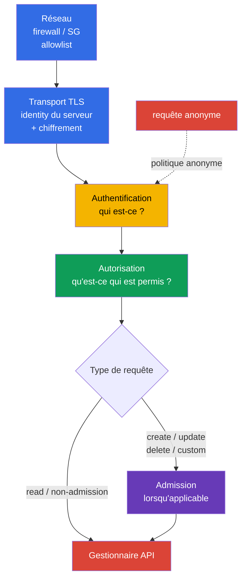
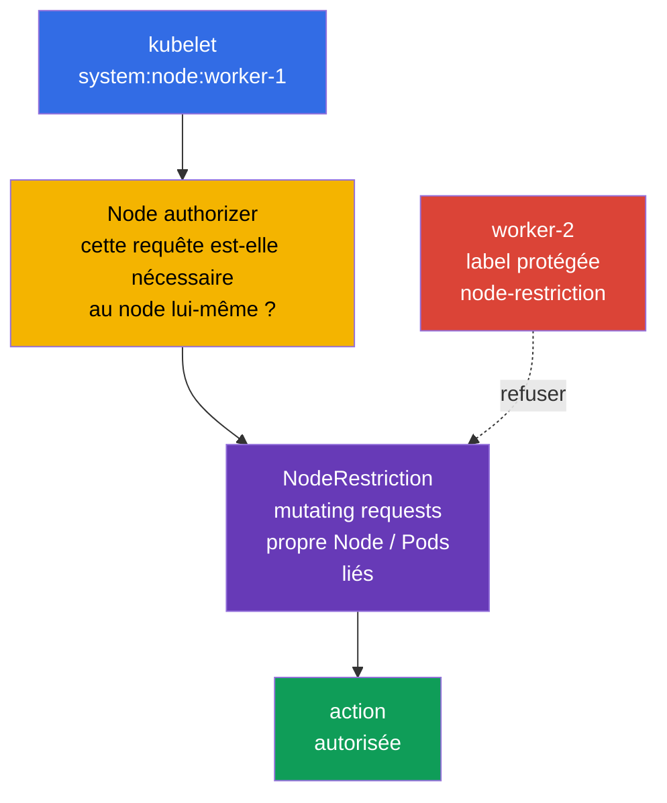
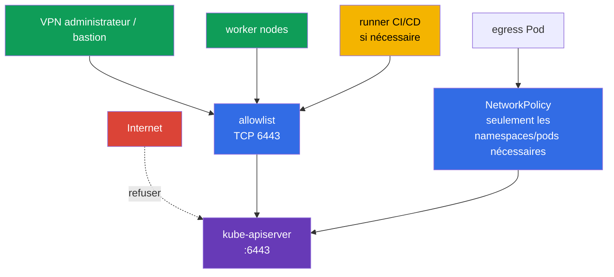

[Русская версия](ru.md) · [Eng version](README.md) · [Versión en español](es.md) · [Deutsche Version](de.md) · [ქართული ვერსია](ge.md) · [繁體中文版](tw.md) · [日本語版](jp.md)

# Chapitre 12. Restreindre l'accès à l'API Kubernetes

> **Le problème.** Un endpoint API accessible depuis un réseau inutile, une requête anonyme ou une binding obsolète pour `system:unauthenticated` permettent à un attaquant de contourner la limite d'un client ordinaire. Une erreur dans le périmètre réseau, TLS ou la configuration de l'apiserver transforme une requête sans identity vérifiée de manière fiable en accès aux données et au contrôle du cluster.

> **La suite.** Au chapitre 11, nous avons supprimé les tokens ServiceAccount inutiles. Nous allons maintenant fermer le point auquel ces tokens et les autres identifiants s'adressent : l'API Kubernetes. Une erreur dans `kube-apiserver`, kubelet ou le périmètre réseau transforme une requête non authentifiée en voie d'accès aux données et au contrôle du cluster. C'est le domaine **Cluster Hardening** de CKS (15 %) : nous limitons qui peut atteindre l'API, ce qu'il devient après l'authentification et ce qu'il peut faire.

> **Ce que vous devez connaître de CKA.** Le chemin de base authn -> authz -> admission et ServiceAccount sont présentés dans le [chapitre 21 de CKA](../../../cka/course/21/fr.md) ; kubeconfig, les certificats TLS clients et CSR le sont dans le [chapitre 39 de CKA](../../../cka/course/39/fr.md). Nous ne répétons pas ici ces mécanismes : nous les employons pour le hardening de l'API.

> 🧠 Le réseau, TLS, l'authentification et l'autorisation sont des barrières séquentielles indépendantes ; admission est ajouté aux requêtes auxquelles il s'applique. Timeout/refused, `401` et `403` indiquent des couches différentes.

## 12.1. Chemin d'une requête API : plusieurs barrières indépendantes

`kube-apiserver` est le point unique de contrôle de l'état du cluster. `kubectl`, les contrôleurs, kubelet, les opérateurs et les applications avec ServiceAccount passent tous par lui. La protection ne se réduit donc pas à une règle RBAC : il faut arrêter une requête aussi tôt que possible tout en conservant les vérifications suivantes.



- **Réseau** détermine si une source peut établir une connexion TCP à `6443`. C'est la première barrière, et la moins coûteuse, mais elle ne remplace ni l'identity ni RBAC.
- **Transport TLS** protège la confidentialité et l'intégrité de la connexion et permet au client de vérifier l'identity de l'API server. TLS côté serveur seul n'est pas une allowlist de clients. Avec l'authentification par certificat client X.509, TLS demande et reçoit le certificat client et prouve la possession de sa private key ; ensuite, l'authenticator X.509 Kubernetes de la couche **Authentification** valide le certificat auprès du client CA configuré et convertit son identity en user/groups.
- **Authentification** associe un certificat, un bearer token ou un autre credential à un sujet. Lorsque anonymous access est activé, une requête sans credential devient l'utilisateur `system:anonymous` et le groupe `system:unauthenticated`. Dans `AuthenticationConfiguration` actuel, anonymous access peut être limité par une allowlist explicite de **HTTP paths exacts**. Les paths courants sont `/livez`, `/readyz` et, si nécessaire, `/healthz` ; kubeadm public token discovery peut nécessiter le path exact `/api/v1/namespaces/kube-public/configmaps/cluster-info`. Les autres paths ne reçoivent pas d'identity anonyme.
- **Autorisation** vérifie le verb, la resource et le scope autorisés. Dans un cluster kubeadm ordinaire, c'est `Node,RBAC`.
- **Admission** agit après l'autorisation uniquement pour les requêtes auxquelles admission control s'applique : surtout create/delete/modify et certains custom verbs. Les `get`, `list` et `watch` d'objets contournent la couche admission. Admission peut modifier un objet ou rejeter une requête ; `NodeRestriction` limite ici les **modifications** permises aux kubelet identities.

L'ordre est important lors d'une investigation. `401 Unauthorized` signifie qu'une requête n'a pas passé l'authentification. `403 Forbidden` signifie qu'un sujet a déjà été déterminé et que la requête lui est interdite ; vérifiez d'abord l'autorisation. Pour les mutating/custom requests, un rejet peut aussi survenir plus tard à l'étape Admission, mais admission ne participe pas aux `get/list/watch` ordinaires. N'essayez pas de corriger un `401` en créant un RoleBinding.

## 12.2. Anonymous access, legacy ports et anciennes bindings RBAC

### Pourquoi `system:anonymous` est dangereux

Anonymous access est parfois conservé pour un legacy health check ou par habitude. Le sujet anonyme ne permet rien à lui seul, mais un seul `RoleBinding` ou `ClusterRoleBinding` erroné pour `system:anonymous` ou `system:unauthenticated` rend l'API disponible sans clé, certificat ni token. Fermez d'abord l'entrée, puis supprimez les permissions déjà accordées : désactiver anonymous access aujourd'hui ne rend pas une binding dangereuse sûre pour toujours.

Pour kubeadm standard, désactiver complètement avec `--anonymous-auth=false` ne peut pas être considéré comme une baseline universelle : ses health probes appellent `/livez` et `/readyz` sans credentials, donc une interdiction globale de anonymous peut renvoyer `401` et redémarrer l'API server. L'option principale pour un tel cluster est une `AuthenticationConfiguration` stable connectée par `--authentication-config`. Ses conditions forment une allowlist de paths **exacts** : aucun autre path ne devient anonyme, même avec une binding RBAC permissive. Cela affecte aussi `kubeadm join` fondé sur un token : avant de faire confiance à l'API, un client lit `/api/v1/namespaces/kube-public/configmaps/cluster-info` sans authentification. Choisissez l'une des deux options testées : ajoutez ce path exact lors de public token discovery, ou désactivez public discovery et employez file/HTTPS discovery. Une allowlist limitée aux health checks sans ce path est incompatible avec le token-based join ordinaire. N'ajoutez `/healthz` que si un health check l'utilise réellement. Chaque exception nécessite une revue distincte des routes, de l'accès réseau et des permissions du sujet anonyme.

Sur un control-plane kubeadm, `kube-apiserver` est en général un static Pod. Modifiez le manifest actif localement sur le control-plane avec un accès à la console du node et une procédure de rollback enregistrée. Ne copiez pas de YAML de sauvegarde dans `/etc/kubernetes/manifests/` : kubelet peut le considérer comme un autre static Pod.

```bash
# Sur le control-plane : enregistrer une copie hors du répertoire des manifests static Pod.
sudo install -d -m 700 /root/k8s-manifest-backup
sudo cp /etc/kubernetes/manifests/kube-apiserver.yaml \
  /root/k8s-manifest-backup/kube-apiserver.yaml

# Créer la configuration d'authentification hors du répertoire des manifests static Pod.
# Si kubeadm join utilise public token discovery, conserver le path cluster-info exact.
sudo install -d -m 700 /etc/kubernetes/authentication
sudo tee /etc/kubernetes/authentication/apiserver-authentication.yaml >/dev/null <<'EOF'
apiVersion: apiserver.config.k8s.io/v1
kind: AuthenticationConfiguration
anonymous:
  enabled: true
  conditions:
  - path: /livez
  - path: /readyz
  - path: /api/v1/namespaces/kube-public/configmaps/cluster-info
EOF
sudo chmod 0600 /etc/kubernetes/authentication/apiserver-authentication.yaml

# Trouver les flags authn existants ; il ne doit pas y avoir de doublons conflictuels.
sudo grep -nE -- '--(anonymous-auth|authentication-config)' \
  /etc/kubernetes/manifests/kube-apiserver.yaml || true
sudoedit /etc/kubernetes/manifests/kube-apiserver.yaml
```

Dans `spec.containers[].command`, indiquez exactement un chemin de fichier et ne définissez pas `--anonymous-auth` en même temps ; ces méthodes de configuration sont mutuellement exclusives :

```yaml
- --authentication-config=/etc/kubernetes/authentication/apiserver-authentication.yaml
```

Un flag seul ne suffit pas : le fichier se trouve sur l'host et doit être explicitement monté dans le static Pod. Ajoutez un volume `hostPath` et un `volumeMount` en lecture seule sans supprimer les volumes kube-apiserver existants :

```yaml
# Ajouter aux volumeMounts kube-apiserver existants :
volumeMounts:
- name: authentication-config
  mountPath: /etc/kubernetes/authentication/apiserver-authentication.yaml
  readOnly: true

# Ajouter aux volumes Pod existants :
volumes:
- name: authentication-config
  hostPath:
    path: /etc/kubernetes/authentication/apiserver-authentication.yaml
    type: File
```

Après la modification, vérifiez que le container voit réellement le fichier, que l'API server se rétablit et que `/readyz` réussit. `hostPath` est un chemin local au node : dans un control plane HA, créez le même fichier et le même mount sur **chaque** node de control-plane, sinon cet apiserver ne pourra pas monter le fichier ni démarrer.

La modification manuelle d'un static Pod convient à un lab précis ou à une tâche d'urgence, mais elle ne doit pas rester l'unique source of truth d'un cluster kubeadm. Pour une configuration permanente, déplacez le paramètre et le mount dans `ClusterConfiguration`, par exemple via `apiServer.extraArgs` et `apiServer.extraVolumes`, ou utilisez des kubeadm patches gérés. Sinon, `kubeadm upgrade` peut régénérer un manifest sans ce paramètre :

```yaml
apiVersion: kubeadm.k8s.io/v1beta4
kind: ClusterConfiguration
apiServer:
  extraArgs:
  - name: authentication-config
    value: /etc/kubernetes/authentication/apiserver-authentication.yaml
  extraVolumes:
  - name: authentication-config
    hostPath: /etc/kubernetes/authentication/apiserver-authentication.yaml
    mountPath: /etc/kubernetes/authentication/apiserver-authentication.yaml
    readOnly: true
    pathType: File
```

La désactivation complète avec `--anonymous-auth=false` n'est acceptable qu'après avoir remplacé les kubeadm health probes par des probes authentifiées, ou employé un autre mécanisme testé, et vérifié les dépendances de bootstrap. Après l'enregistrement, kubelet recrée le static Pod. Un manifest est une source souhaitée, pas une preuve de l'argv d'un apiserver en cours d'exécution. Ne redémarrez pas tous les composants du control-plane en même temps et ne terminez pas la session SSH avant le rétablissement de l'API.

```bash
# Configuration souhaitée. Le manifest seul ne prouve pas le runtime actif.
sudo grep -n -- '--authentication-config=' \
  /etc/kubernetes/manifests/kube-apiserver.yaml
watch -n 2 'sudo crictl ps --name kube-apiserver'

# Sur un host Linux où les PID des containers sont visibles : prouver séparément argv et
# visibilité du fichier pour le processus en cours. Si le namespace runtime/PID ne le
# permet pas, utilisez la vérification inspect équivalente au lieu de conclure depuis le manifest seul.
APISERVER_PID="$(pgrep -xo kube-apiserver)" || {
  echo 'ERROR: running kube-apiserver process not found' >&2
  exit 2
}
AUTH_CONFIG_ARG='--authentication-config=/etc/kubernetes/authentication/apiserver-authentication.yaml'
AUTH_CONFIG_PATH='/etc/kubernetes/authentication/apiserver-authentication.yaml'

if ! sudo cat "/proc/${APISERVER_PID}/cmdline" \
    | tr '\0' '\n' \
    | grep -Fxq -- "$AUTH_CONFIG_ARG"
then
  echo "ERROR: active kube-apiserver argv does not contain ${AUTH_CONFIG_ARG}" >&2
  exit 1
fi

if ! sudo test -e "/proc/${APISERVER_PID}/root${AUTH_CONFIG_PATH}"; then
  echo "ERROR: ${AUTH_CONFIG_PATH} is not visible in kube-apiserver mount namespace" >&2
  exit 1
fi

echo 'OK: active kube-apiserver uses the expected authentication config path'

# La disponibilité de l'API est vérifiée séparément de la configuration souhaitée et d'argv.
kubectl get --raw='/readyz?verbose'
kubectl get nodes
```

Kubelet est la deuxième API HTTP sur chaque node. Protégez-la séparément : désactivez anonymous authentication et la legacy read-only API. Ne considérez pas `/var/lib/kubelet/config.yaml` comme une source universelle : kubelet peut recevoir `--config`, `--config-dir` et des arguments d'une unit, d'un drop-in ou d'un fichier environment. Établissez d'abord les startup sources réelles, puis vérifiez la `KubeletConfiguration` active ; avec un accès autorisé, elle peut aussi être comparée à `/configz`.

```bash
sudo systemctl cat kubelet
sudo systemctl show kubelet -p ExecStart --value
KUBELET_PID=$(pgrep -xo kubelet) || { echo 'kubelet process not found' >&2; exit 2; }
sudo tr '\0' '\n' < "/proc/$KUBELET_PID/cmdline" \
  | grep -E -- '^--config(=|$)|^--config-dir(=|$)|^--(read-only-port|anonymous-auth|authorization-mode)(=|$)' || true
# Après avoir déterminé le fichier réel, par exemple : sudo grep -nE 'readOnlyPort|anonymous:|authorization:' <active-kubelet-config>
```

```yaml
# Dans la KubeletConfiguration active ; le chemin est déterminé par la startup configuration.
readOnlyPort: 0
authentication:
  anonymous:
    enabled: false
authorization:
  mode: Webhook
```

Équivalents si une installation particulière gère kubelet par flags :

```text
--read-only-port=0
--anonymous-auth=false
--authorization-mode=Webhook
```

`10255` est le port kubelet historique read-only non authentifié ; désactivez-le. N'« ouvrez pas `10250` à tous » : l'API kubelet normale doit rester protégée par l'authentification, l'autorisation `Webhook` et des règles réseau. Le legacy `--insecure-port` de `kube-apiserver` a été supprimé dans les Kubernetes modernes ; ce n'est pas une raison d'ignorer les anciens manifests, images et documents. Recherchez-le comme l'indicateur d'une configuration non prise en charge ou non sécurisée, et non comme une option à activer pour la compatibilité.

```bash
# Sur chaque node : une erreur ss est une erreur de vérification, pas une confirmation que le port est fermé.
listeners=$(sudo ss -H -lnt '( sport = :10255 )') || {
  echo 'ERROR: cannot inspect TCP listener 10255' >&2; exit 2;
}
if [ -n "$listeners" ]; then
  printf 'ERROR: kubelet read-only port 10255 is listening:\n%s\n' "$listeners" >&2
  exit 1
fi
echo 'OK: kubelet read-only port 10255 is closed'

# Vérifier 10250 avec le firewall ; un filtre de socket exact évite une correspondance avec un autre port.
sudo ss -H -lntp '( sport = :10250 )'
```

> 🎯 Définissez une configuration d'authentification sécurisée et supprimez les bindings pour `system:anonymous`/`system:unauthenticated`. Désactivez le legacy `10255` et `--insecure-port`, sans publier le `10250` protégé.

### Inventaire et cleanup des bindings

Ne supprimez pas un `ClusterRole` par son nom au hasard : un rôle peut être requis par un autre sujet. Trouvez les bindings dont les `subjects` nomment réellement l'utilisateur anonyme ou son groupe, vérifiez le rôle attribué, puis supprimez seulement une binding inutile.

```bash
# ClusterRoleBinding qui accordent directement des permissions à l'utilisateur anonyme ou au groupe unauthenticated.
kubectl get clusterrolebinding -o json | jq -r '
  .items[]
  | select(any(.subjects[]?;
      (.kind == "User" and .name == "system:anonymous") or
      (.kind == "Group" and .name == "system:unauthenticated")))
  | [.metadata.name, .roleRef.kind, .roleRef.name] | @tsv'

# Même chose pour les RoleBinding de scope namespace.
kubectl get rolebinding -A -o json | jq -r '
  .items[]
  | select(any(.subjects[]?;
      (.kind == "User" and .name == "system:anonymous") or
      (.kind == "Group" and .name == "system:unauthenticated")))
  | [.metadata.namespace, .metadata.name, .roleRef.kind, .roleRef.name] | @tsv'
```

Ne supprimez pas une binding uniquement parce que son sujet correspond. En particulier, `system:public-info-viewer` est un default ClusterRoleBinding standard pour `system:unauthenticated` vers des informations publiques non sensibles ; lorsque RBAC est activé, les subjects manquants de bindings standard peuvent être restaurés par auto-reconciliation après le démarrage de l'API. kubeadm token discovery emploie également le RoleBinding `kubeadm:bootstrap-signer-clusterinfo` pour lire `kube-public/cluster-info`. Vérifiez d'abord le rôle et si le discovery workflow correspondant est nécessaire ; ne supprimez qu'une binding personnalisée ou réellement excessive.

Après revue, une suppression ciblée se présente ainsi :

```bash
REVIEWED_CLUSTERROLEBINDING='reviewed-clusterrolebinding'
NAMESPACE='reviewed-namespace'
REVIEWED_ROLEBINDING='reviewed-rolebinding'
kubectl delete clusterrolebinding "$REVIEWED_CLUSTERROLEBINDING"
kubectl delete rolebinding -n "$NAMESPACE" "$REVIEWED_ROLEBINDING"
```

Vérifiez également toute binding accordant des permissions au groupe `system:unauthenticated` : désactiver anonymous access ferme son chemin ordinaire, mais la policy doit rester minimale et compréhensible lors de futurs changements d'identity provider.

## 12.3. Authorization modes et NodeRestriction

`--authorization-mode` définit une chaîne ordonnée de modules d'autorisation. Chaque module renvoie `Allow`, `Deny` ou `NoOpinion` : `Allow` **ou** `Deny` termine immédiatement la chaîne, et seul `NoOpinion` transmet une requête au module suivant ; si tous les modules renvoient `NoOpinion`, la requête est rejetée. L'ordre est donc important et `AlwaysAllow`, dans une partie atteignable de la chaîne, annule le least privilege pour les requêtes qui l'atteignent.

| Mode | Objectif | Décision de hardening |
|---|---|---|
| `Node` | traite les requêtes des kubelet identities `system:node:<node>` | activer avant `RBAC` dans un cluster kubeadm ordinaire |
| `RBAC` | vérifie Role, ClusterRole et bindings pour les utilisateurs, groupes et ServiceAccount | authorizer principal des administrateurs et workloads |
| `Webhook` | interroge un authorization webhook externe | utiliser uniquement avec un service externe disponible et testé |
| `ABAC` | règles provenant d'un fichier policy local | option legacy ; difficile à auditer, à éviter dans les nouveaux clusters |
| `AlwaysAllow` | permet tout | ne jamais utiliser en production |

`AuthorizationConfiguration` structuré est stable depuis Kubernetes v1.32 et est défini par `--authorization-config`. Choisissez **une** approche : ce fichier ne peut pas être combiné avec les options CLI `--authorization-mode` et `--authorization-webhook-*` ; s'ils sont mélangés, `kube-apiserver` se termine avec une erreur. Ce fichier est utile lorsque des paramètres et plusieurs webhook authorizers sont nécessaires, mais planifiez et testez sa migration comme une modification du control plane au lieu d'ajouter une deuxième source de configuration parallèle.

Vérifiez l'argument souhaité dans le manifest static Pod et définissez une chaîne de base sûre si elle convient à l'architecture du cluster. Après la reconciliation de kubelet, confirmez séparément l'argv du processus en cours (comme en §12.2) : une ligne du manifest seule ne prouve pas la configuration active.

```bash
sudo grep -n -- '--authorization-mode' /etc/kubernetes/manifests/kube-apiserver.yaml
```

```yaml
- --authorization-mode=Node,RBAC
```

L'authorizer `Node` ne sert pas à « faire confiance à tous les nodes », mais aux API operations spéciales de kubelet. Dans la baseline kubeadm présentée, `Node,RBAC` autorise les autres identities par RBAC. Dans une autre architecture délibérée, l'authorizer global peut inclure Webhook, par exemple ; l'essentiel est qu'une authorization policy fail-closed existe pour toutes les autres requests et que `AlwaysAllow` ne soit pas utilisé comme fallback. Ne modifiez pas la liste des modes sur un cluster en fonctionnement sans vérifier les contrôleurs de bootstrap, l'identity provider et les clients API actuels.

> 🎯 Baseline kubeadm : `Node,RBAC` sans `AlwaysAllow` ; `Node` sert kubelet, RBAC limite les autres identities et `NodeRestriction` limite les mutating requests permises avec des node credentials.

**NodeRestriction** est un validating admission plugin qui complète l'authorizer `Node`. L'authorizer `Node` détermine les permissions API de kubelet et limite les relation-sensitive reads ; `NodeRestriction` limite ensuite les **modifications** permises : kubelet ne peut modifier que son propre `Node` et les `Pod` affectés à ce node, et ne peut pas modifier les Node labels/taints protégés en dehors du modèle autorisé. Les requêtes de lecture ne passent pas par admission ; leur scope est donc déterminé par l'authorizer.



Dans kubeadm, `NodeRestriction` est normalement activé comme admission plugin supplémentaire. Vérifiez d'abord simultanément `--enable-admission-plugins` et `--disable-admission-plugins`.

```bash
sudo grep -nE -- '--(enable|disable)-admission-plugins' \
  /etc/kubernetes/manifests/kube-apiserver.yaml
sudo crictl ps --name kube-apiserver
```

Dans Kubernetes v1.36, `--enable-admission-plugins` ajoute des plugins au built-in default-enabled set ; il ne faut pas énumérer les defaults dans ce flag. Si `NodeRestriction` n'est pas activé, ajoutez-le à la liste additional explicite. Si `--enable-admission-plugins` contient déjà d'autres plugins supplémentaires, conservez-les. Vérifiez aussi que le default ou plugin nécessaire n'est pas désactivé par `--disable-admission-plugins`. RBAC gère les permissions générales fondées sur les role/binding des utilisateurs, groupes et ServiceAccount, tandis que l'authorizer `Node` sert les permissions spéciales des node identities. `NodeRestriction` ne les remplace pas : il ajoute des restrictions admission aux mutating requests de kubelet. Prenez également en compte le feature gate `ServiceAccountNodeAudienceRestriction` : quand il est activé, NodeRestriction restreint aussi les audiences pour lesquelles kubelet peut demander des ServiceAccount tokens par `TokenRequest`, à celles déjà utilisées par les Pod de ce node ou explicitement accordées par RBAC. Il ne remplace pas NodeRestriction, mais constitue une restriction supplémentaire des node-originated token requests.

> 🎯 Restreignez `:6443` par un private endpoint ou une allowlist CIDR exacte ; pour les Pod, vérifiez une egress policy distincte.

## 12.4. Restriction réseau de l'accès à apiserver

Même avec TLS et RBAC corrects, un API endpoint public élargit la surface : l'adresse `:6443` donne à un attaquant la possibilité de deviner des credentials, d'exploiter une vulnérabilité future ou d'obtenir des informations par les erreurs. Un private endpoint est une option solide et souvent préférable, mais pas un absolu universel : un public endpoint peut être justifié si des restrictions réseau strictes sont disponibles (allowlist CIDR étroite, firewall/WAF selon l'architecture) et si l'authentification est forte. Dans tous les cas, `:6443` n'est autorisé que depuis des source paths nécessaires et confirmés : réseau administratif/VPN, control-plane, trafic kubelet/worker, automation endpoints convenus et workloads in-cluster qui ont réellement besoin de l'API. Ne supposez pas que l'endpoint voit toujours le trafic workload comme l'adresse du worker node : établissez le CNI/cloud datapath réel et la source address après SNAT/routing.



Appliquez les barrières selon le domaine de responsabilité :

- **Cloud Security Group / firewall** : autorisez `TCP/6443` seulement depuis les source ranges/identities réellement nécessaires : control-plane, chemin kubelet/worker, VPN/bastion, automation et, si la topology l'exige, les adresses/CIDR des Pod workloads autorisés. N'ajoutez pas automatiquement tout le Pod CIDR : déterminez d'abord quelle source voit réellement l'API endpoint après CNI/cloud routing et SNAT. Ne définissez pas `0.0.0.0/0` ; dans un cluster private, utilisez un private endpoint ou un tunnel.
- **Host firewall** (`nftables`, `iptables`, `ufw`) sur un control-plane self-managed : il double le périmètre réseau et restreint les sources si le cloud firewall est élargi par erreur.
- **NetworkPolicy** : `kubernetes.default.svc` est un nom logique de Service, et la NetworkPolicy standard ne sélectionne pas un Service de destination par son nom. La restriction de l'egress vers l'API se construit avec un `ipBlock`/endpoint CIDR après vérification du datapath réel, ou par une entity, une policy FQDN ou Service CNI-specific. Ne transférez pas un `ipBlock` d'un CNI à l'autre sans vérification : le DNAT du Service peut intervenir avant ou après la policy et n'a pas de sémantique universelle. Autorisez l'API seulement au namespace et au workload qui en ont réellement besoin : cela réduit le lateral movement après compromission d'un Pod.
- **Routage et DNS** : assurez-vous que le control-plane endpoint est publié et résolu seulement comme l'exige le modèle d'accès choisi ; un private endpoint simplifie souvent cela, mais un public endpoint exige un contrôle particulièrement strict des sources et de l'authentification.

**kubeadm discovery est un cas particulier.** Avec token-based discovery, ConfigMap `kube-public/cluster-info` contient par défaut des discovery-information accessibles publiquement (adresse de l'API et données CA) ; ce n'est pas un Secret et ne doit pas être distribué ou protégé comme un Secret. Le bootstrap token, en revanche, est une credential temporaire pour discovery/TLS bootstrap et nécessite un contrôle séparé : diffusion limitée, courte durée de vie, révocation et revue de CSR/auto-approval. Lorsque anonymous est restreint par `AuthenticationConfiguration`, une binding RBAC ne suffit pas : le path exact `/api/v1/namespaces/kube-public/configmaps/cluster-info` doit aussi figurer dans `anonymous.conditions`, sinon la requête ne reçoit pas d'identity anonyme et token discovery échoue. Si nécessaire, désactivez public access à `cluster-info` ou utilisez file/HTTPS discovery avec un canal de confiance approprié ; ne mélangez pas la protection des informations publiques avec celle du token.

NetworkPolicy ne remplace ni Security Group ni host firewall : elle est appliquée par CNI au trafic Pod et ne doit pas nécessairement couvrir de façon identique le trafic host, externe ou control-plane dans chaque topology. Dans Kubernetes managé, une partie de l'endpoint et du firewall appartient au provider ; vérifiez alors son private/public endpoint, ses allowed CIDRs et ses control-plane security rules distinctes, au lieu de tenter de modifier un static Pod que vous n'avez pas.

Avant de modifier le firewall, consignez les listeners et la règle actuels, et gardez une session de console distincte pour le rollback. Bloquer `6443` pour votre propre administrateur ou kubelet peut rendre le cluster inaccessible.

```bash
# Sur le control-plane : qui écoute l'API ; le programme précis dépend du runtime.
sudo ss -lntp | grep ':6443'

# Depuis la machine administrative : vérifier l'endpoint sans désactiver la vérification TLS en production.
kubectl cluster-info
kubectl get --raw='/livez?verbose'
```

> 🔬 `kubectl proxy` et `port-forward`, des moyens auxiliaires d'accès local : ils utilisent les permissions du kubeconfig de l'opérateur et créent une surface de diagnostic supplémentaire.

## 12.4.1. Passerelles API locales : `kubectl proxy` et `port-forward`

`kubectl proxy` et `kubectl port-forward` utilisent les permissions du kubeconfig de l'utilisateur ; ils ne créent pas une nouvelle identity limitée. Par défaut, `kubectl proxy` écoute sur `127.0.0.1`, ce qui limite le risque à la machine locale. N'élargissez pas son `--address` sans nécessité ; un `--accept-hosts` large, et surtout `--disable-filter`, peuvent transformer le proxy en une passerelle vers l'API accessible à d'autres clients avec les permissions de l'opérateur. De même, n'utilisez pas `kubectl port-forward --address 0.0.0.0` sauf si une connexion brève, convenue séparément, à travers un réseau protégé est nécessaire. Fermez le tunnel temporaire après le diagnostic et ne le considérez pas comme un substitut à firewall, RBAC ou NetworkPolicy.

> 🎯 Confirmez l'active config, des flags sûrs, la readiness après reload, `401` pour un anonymous path et un `can-i` ciblé avec `no` ; diagnostiquez le static Pod par kubelet et le runtime.

## 12.5. Profilage, recherche de ServiceAccount et audit des flags

Les endpoints de profilage sont nécessaires au diagnostic des performances, mais ils
augmentent inutilement la surface de divulgation d'informations sur le processus. Sur
`kube-apiserver`, désactivez le profiling ; dans la même opération, vérifiez
controller-manager et scheduler. Une vérification CIS détaillée des trois composants est
présentée au [chapitre 07](../07/fr.md), et les arguments non sûrs ainsi que le hardening TLS
au [chapitre 09](../09/fr.md).

```yaml
# Dans la commande du static Pod kube-apiserver
- --profiling=false
```

```bash
for component in kube-apiserver kube-controller-manager kube-scheduler; do
  sudo grep -n -- '--profiling' "/etc/kubernetes/manifests/${component}.yaml" || true
done
```

`--service-account-lookup` concerne la vérification de l'existence d'un ServiceAccount lors
de l'authentification par legacy ServiceAccount token. La valeur `false` désactive la
révocation basée sur l'API : un ServiceAccount supprimé ou un legacy token supprimé ne révoque
plus un token déjà émis par cette vérification. Ce n'est **pas** un mécanisme qui définit ou
garantit un TTL court pour les legacy tokens ; leur durée de vie dépend du mode d'émission et
des claims du token. Ne désactivez pas la recherche sans décision explicite. Dans les clusters
modernes, privilégiez les bound, short-lived projected tokens du chapitre 11, et vérifiez la
présence et le comportement du flag pour la version utilisée avec `kube-apiserver --help` et
sa documentation.

Évaluez la configuration comme un ensemble de risques, et non comme un seul flag. Pour
scheduler, vérifiez d'abord la présence de `--config` : lorsqu'il est présent, le
`--profiling` deprecated est ignoré ; définissez donc `enableProfiling: false` dans le
`KubeSchedulerConfiguration` actif trouvé.

```bash
sudo grep -nE -- \
  '--(anonymous-auth|authorization-mode|enable-admission-plugins|profiling|service-account-lookup|insecure-port|secure-port)' \
  /etc/kubernetes/manifests/kube-apiserver.yaml
sudo grep -n -- '--config' /etc/kubernetes/manifests/kube-scheduler.yaml
# Pour le --config indiqué : sudo grep -n 'enableProfiling:' <active-scheduler-config>

# Kubelet : trouver d'abord le véritable --config/--config-dir dans l'unité et /proc/<kubelet-pid>/cmdline,
# puis vérifier le KubeletConfiguration actif trouvé.
```

| Constat | Pourquoi c'est dangereux | Orientation sûre |
|---|---|---|
| broad anonymous access | une requête sans credential reçoit `system:anonymous` ; avec une selective config, seuls les exact allowed paths sont exclus | `AuthenticationConfiguration` avec un allowlist minimal d'exact paths ou `--anonymous-auth=false` si cela est compatible avec les probes/le bootstrapping ; cleanup des bindings |
| `--authorization-mode=AlwaysAllow` | tout sujet authentifié ou anonymous passe authz | `Node,RBAC` ou une intégration Webhook réfléchie |
| `NodeRestriction` absent | un kubelet compromis obtient une voie plus large vers l'API | activer le plugin en préservant les defaults existants |
| profiling activé sans nécessité | endpoints de diagnostic superflus | pour apiserver/controller-manager - `--profiling=false` ; pour scheduler avec `--config` - `enableProfiling: false` dans le `KubeSchedulerConfiguration` actif |
| `readOnlyPort` différent de `0` | legacy kubelet API sans authentication | `readOnlyPort: 0` |
| `6443` public | surface accrue pour les credentials attacks et les vulnérabilités API | private endpoint ou strict CIDR allowlist, firewall et authentication forte |

Après avoir modifié un static Pod, ne confirmez pas seulement la ligne dans le YAML. Kubelet
doit démarrer le nouveau conteneur, et l'API doit devenir Ready. En cas d'erreur YAML ou de
flag non pris en charge, utilisez la console locale, `journalctl -u kubelet`, `crictl ps -a`
et la copie enregistrée du manifeste.

## 12.6. Vérification : prouver que l'entrée est fermée

La vérification s'effectue dans deux couches indépendantes : authentication sans credential
et authorization pour un sujet explicitement donné. Testez depuis le réseau qui doit disposer
d'un accès TCP à l'API ; un timeout du firewall et une API `401` sont différents, mais ce sont
tous deux des résultats utiles dans leurs couches respectives.

```bash
# Prendre l'URL du server dans le kubeconfig actuel, sans transmettre de certificat, clé ou token à curl.
APISERVER=$(kubectl config view --minify \
  -o jsonpath='{.clusters[0].cluster.server}')
printf '%s\n' "$APISERVER"

# Protected path : `401` prouve que /version ne passe précisément pas l'authn anonymous.
# Pour un test pédagogique, -k est acceptable, mais en production fournissez la CA avec --cacert.
curl -k -sS -o /dev/null -w '%{http_code}\n' "$APISERVER/version"

# Si une selective config autorise intentionnellement /readyz, vérifiez-le séparément.
# Lorsque l'API est prête, 200 est normalement attendu, mais cela ne contredit pas 401 sur /version.
curl -k -sS -o /dev/null -w '%{http_code}\n' "$APISERVER/readyz"
```

Un `401` sur `/version` prouve seulement que ce protected path n'accepte pas de requête
anonymous ; il ne prouve pas la désactivation globale de l'authenticator anonymous. Avec une
`AuthenticationConfiguration` selective, des exact allowed paths, tels que `/readyz` ou le
discovery path, peuvent intentionnellement fonctionner sans credential. Si la connexion
expire ou est refusée, diagnostiquez d'abord le firewall, la Security Group, le DNS et le
routage ; ce n'est pas une preuve de la configuration d'Authentication.

Avec les droits cluster-admin, vérifiez séparément l'authorizer par impersonation :

```bash
# Il ne doit pas y avoir d'autorisation. L'administrateur appelant doit avoir le droit d'impersonate.
# L'identity anonymous complète comprend le user et le group.
kubectl auth can-i get pods --all-namespaces \
  --as=system:anonymous --as-group=system:unauthenticated
kubectl auth can-i list secrets --all-namespaces \
  --as=system:anonymous --as-group=system:unauthenticated

# Vérifier explicitement les droits minimaux du ServiceAccount de la lab 104.
kubectl auth can-i list pods -n cks-104 \
  --as=system:serviceaccount:cks-104:app-sa
kubectl auth can-i delete pods -n cks-104 \
  --as=system:serviceaccount:cks-104:app-sa
```

Attendez `no` pour les vérifications anonymous et pour le `delete` interdit ; `list pods`
pour le `app-sa` dédié doit renvoyer `yes` seulement dans le namespace indiqué. `kubectl auth
can-i` vérifie l'authorizer pour une identity impersonated, mais n'établit pas une vraie
connexion sans credential et ne prouve pas l'état de l'authenticator anonymous. Conservez les
commandes, le HTTP status et les config sources modifiées dans le change record : c'est la
preuve que le contrôle fonctionne, et non seulement qu'il est déclaré.

## 12.7. Erreurs courantes et diagnostic

| Symptôme | Cause probable | À vérifier |
|---|---|---|
| L'API ne démarre pas après la modification | YAML endommagé, flag dupliqué ou non pris en charge | `journalctl -u kubelet`, `crictl ps -a`, la copie enregistrée du manifeste |
| `curl` ne renvoie pas 401 mais un timeout | le trafic est coupé avant l'API | Security Group/firewall, DNS, routage et port `6443` |
| `can-i` anonymous renvoie `yes` de façon inattendue | une RoleBinding/ClusterRoleBinding est restée | rechercher `system:anonymous` et `system:unauthenticated` dans les bindings |
| kubelet cesse de s'enregistrer | firewall ou API endpoint indisponibles, kubelet config incorrecte | `journalctl -u kubelet`, `ss`, les routes du node et les active kubelet args |
| NodeRestriction ne produit pas l'effet attendu | le plugin n'est pas actif ou kubelet n'utilise pas une node identity | flags de l'apiserver, CN du certificat client, admission configuration |
| Un Pod n'atteint plus l'API | egress policy trop stricte/étroite, allow-rule nécessaire absent, datapath/CIDR/port incorrect, ou ServiceAccount-token intentionnellement désactivé | nécessité de l'accès, active NetworkPolicy/CNI policy et datapath réel vers l'API, `automountServiceAccountToken`, RBAC |

> 🏭 Endpoint exposure, kubeadm/API configuration et cleanup RBAC sont consignés dans l'IaC et comparés au baseline ; les responsables répondent de l'endpoint, des CIDR et de l'evidence après les changements.

## 12.8. Application en production

- **Plusieurs couches, un baseline.** `--anonymous-auth=false` (lorsqu'il est compatible avec
  les probes et les dépendances de bootstrap) ou des conditions étroites pour des health/discovery paths exacts
  dans `AuthenticationConfiguration`, `Node,RBAC`, NodeRestriction avec évaluation de
  `ServiceAccountNodeAudienceRestriction`, un kubelet read-only port fermé et un API endpoint
  private/strictement allowlisted sont décrits dans la config kubeadm, l'image du node ou l'IaC. Une
  modification manuelle du static Pod est acceptable pour une tâche d'urgence, mais ne doit pas
  être l'unique source de vérité.
- **Le réseau selon sa destination.** Les administrateurs travaillent via un VPN/bastion,
  CI/CD possède des adresses sources distinctes, worker/control-plane ne reçoivent que les
  règles nécessaires, et pour Pod-to-API, le datapath/source réel est documenté séparément et
  seuls les workloads auxquels l'API est effectivement nécessaire sont autorisés. Un public
  endpoint n'est admissible qu'avec un responsable explicite du risque, une restriction stricte
  des sources et une authentication forte ; le private endpoint reste une option forte, mais
  non unique.
- **Les droits sont revus après un changement d'identity.** Recherchez régulièrement les
  bindings pour `system:anonymous`, `system:unauthenticated`, les utilisateurs obsolètes et les
  ServiceAccount, supprimez ceux qui ne sont pas utilisés et testez `kubectl auth can-i`.
- **L'observabilité n'ouvre pas le diagnostic.** Metrics, audit et les logs centralisés donnent
  la visibilité nécessaire ; activez le profiling temporairement, par allowlist et avec un plan
  de désactivation.
- **Le managed control plane est séparé selon les responsabilités.** Vous ne pouvez pas modifier
  le manifeste du static Pod du fournisseur, mais vous pouvez et devez contrôler endpoint exposure,
  allowed CIDRs, RBAC, admission-policy, node security groups et l'accès à kubelet.

## 12.9. Mini-glossaire

- **anonymous authentication** - association d'une requête sans credential à
  `system:anonymous` ; elle est généralement désactivée pour l'API et kubelet.
- **`system:unauthenticated`** - groupe du sujet anonymous ; un binding vers lui exige le même
  review qu'un binding vers `system:anonymous`.
- **authorization mode** - authorizer de l'API server, par exemple `Node`, `RBAC` ou `Webhook`.
- **Node authorizer** - authorizer spécial pour les kubelet identities ; il autorise les node
  operations nécessaires et l'accès relation-sensitive aux objets liés aux Pod de ce node.
- **NodeRestriction** - validating admission plugin qui limite les modifications autorisées de
  Node/Pod par kubelet et les Node labels protégés ; avec
  `ServiceAccountNodeAudienceRestriction`, il limite également les audiences des `TokenRequest`
  node-originated.
- **allowlist** - liste explicite de sources, ports ou destinations admis au lieu d'autoriser tout
  le monde.
- **read-only port** - legacy kubelet API non authentifiée, désactivée avec
  `readOnlyPort: 0`/`--read-only-port=0`.
- **profiling** - endpoints de diagnostic des performances du processus ; ils sont désactivés
  lorsqu'ils ne sont pas nécessaires avec `--profiling=false`, sauf pour `kube-scheduler` avec
  `--config` : son flag CLI est ignoré et `enableProfiling: false` est nécessaire dans le
  `KubeSchedulerConfiguration` actif.
- **static Pod** - Pod géré par kubelet depuis un manifeste local ; kubeadm démarre habituellement
  ainsi les composants du control-plane.

## 12.10. Résumé du chapitre

- L'API est protégée par plusieurs couches indépendantes : réseau, TLS, authentication et
  authorization ; admission s'applique en plus aux mutating requests et aux custom requests
  pris en charge.
- Pour kubelet, désactivez l'accès anonymous (`--anonymous-auth=false`). Sur kube-apiserver,
  limitez-le explicitement à ses health endpoints et, tant que le public token discovery est
  nécessaire, au path exact `kube-public/cluster-info` via `AuthenticationConfiguration` ; dans
  les deux cas, vérifiez et supprimez seulement les RoleBinding/ClusterRoleBinding inutiles pour
  `system:anonymous` et `system:unauthenticated`.
- Désactivez le legacy kubelet read-only port avec `readOnlyPort: 0` ; laissez `10250` seulement
  avec authentication, authorization `Webhook` et restriction réseau.
- La chaîne authorizer baseline sûre de kubeadm est `Node,RBAC` ; `AlwaysAllow` est incompatible
  avec le least privilege. L'authorizer `Node` définit les droits API de kubelet, et
  NodeRestriction ajoute des restrictions à ses mutating requests.
- Pour l'API `:6443`, privilégiez un private endpoint ; avec un public endpoint, un strict
  firewall/Security Group allowlist et une authentication forte sont obligatoires. Dans tous les
  cas, des NetworkPolicy ciblées pour Pod egress réduisent le lateral movement.
- `--profiling=false`, ServiceAccount lookup activé pour la révocation API des legacy tokens et
  l'audit des flags réduisent la surface ; les bound projected tokens, et non
  `--service-account-lookup=false`, fournissent un TTL court.
- Prouvez le résultat par des vérifications distinctes : un `curl` anonymous vers un protected
  path, tel que `/version`, doit renvoyer une API `401` ; vérifiez séparément tout health/discovery
  path intentionally allowed. `kubectl auth can-i --as=system:anonymous
  --as-group=system:unauthenticated` vérifie l'authorizer pour une identity impersonated et doit
  renvoyer `no` pour une action interdite.

## 12.11. Utilité : à l'examen et dans le travail réel

**À l'examen.** La tâche donne généralement accès au control-plane et demande de fermer l'API
anonymous ou de supprimer un binding dangereux. Trouvez le manifeste actif du static Pod,
conservez une copie hors de `/etc/kubernetes/manifests/`, corrigez le seul flag nécessaire,
attendez la recréation de l'API et vérifiez `/readyz`. Utilisez ensuite `curl` sans credential
vers un protected path, tel que `/version` ; avec une selective configuration, prenez
séparément en compte les exact paths intentionnellement allowed. `kubectl auth can-i
--as=system:anonymous --as-group=system:unauthenticated` vérifie seulement l'authorizer pour
une identity impersonated ; ne vous limitez pas à rechercher du texte dans un fichier.

**Scénario d'examen : un cluster kubeadm a été créé avec `AlwaysAllow`.** Le context actuel
peut pointer vers un compte qui n'a pas les droits requis après l'activation de RBAC, tandis
qu'un compte administratif connu existe dans kubeconfig (ou un kubeconfig distinct). Avant la
modification, sélectionnez-le explicitement **pour chaque commande** : n'exécutez pas `kubectl
config use-context`, afin de ne pas perdre le context d'origine ni obtenir un faux résultat
positif.

```bash
CURRENT_CONTEXT=$(kubectl config current-context)
kubectl config get-contexts
ADMIN_CONTEXT='kubernetes-admin@kubernetes'  # nom du context admin connu dans la liste

# Si admin est dans un autre fichier, ajoutez aussi --kubeconfig=/chemin/vers/admin.conf.
kubectl --context="$ADMIN_CONTEXT" auth whoami
sudo grep -nE -- '--authorization(-mode|-config)' \
  /etc/kubernetes/manifests/kube-apiserver.yaml
sudo cp -a /etc/kubernetes/manifests/kube-apiserver.yaml \
  /root/kube-apiserver.yaml.before-authz
sudoedit /etc/kubernetes/manifests/kube-apiserver.yaml
```

Dans le manifeste, remplacez `--authorization-mode=AlwaysAllow` par
`--authorization-mode=Node,RBAC`, sans supprimer les autres arguments. Si
`--authorization-config` est trouvé, n'ajoutez pas simultanément `--authorization-mode` :
corrigez l'active structured configuration selon son schéma. Une vérification `can-i` **avant**
la correction ne prouve pas que le compte admin a les droits RBAC : avec `AlwaysAllow`, elle
réussira pour tout sujet authentifié.

```bash
# Kubelet recrée le static Pod ; ne perdez pas l'accès au control-plane avant la vérification.
watch -n 2 'sudo crictl ps --name kube-apiserver'
kubectl --context="$ADMIN_CONTEXT" get --raw='/readyz?verbose'
kubectl --context="$ADMIN_CONTEXT" auth can-i get nodes

# Ce context du scénario n'a pas le binding RBAC requis ; le résultat attendu est "no".
kubectl --context="$CURRENT_CONTEXT" auth can-i get nodes
```

Dans un cluster réel, après une récupération urgente, reflétez aussi l'authorizer dans la
source de configuration de kubeadm (`kubeadm-config`/IaC), sinon un futur `kubeadm upgrade`
pourrait régénérer un manifeste avec une configuration obsolète.

**Dans le travail réel.** La restriction de l'API fait partie de la conception du réseau et de
l'identity, et non d'une correction CIS ponctuelle. Un private endpoint est une option forte ;
si l'endpoint est public, compensez-le par un strict allowlist et une authentication forte. Des
bound tokens de courte durée, des bindings minimaux et une vérification automatisée de la dérive
de configuration rendent la compromission d'un node ou d'un Pod nettement moins destructrice.

## 12.12. Questions d'auto-évaluation

<details>
<summary>1. Dans quel ordre une requête traverse-t-elle le périmètre réseau, authn, authz et admission, et que signifie `401` par rapport à `403` ?</summary>

Le périmètre réseau décide d'abord si la connexion est possible, puis TLS protège le transport
et permet au client de vérifier l'identity de l'API server. Avec X.509 client authentication,
TLS reçoit le certificat client, tandis que sa confiance via la Kubernetes client CA et son
mapping vers user/groups sont réalisés par l'authenticator X.509 à l'étape Authentication.
Ensuite, l'API applique Authentication et Authorization ; Admission est ajoutée si le type de
requête passe par admission control. `401 Unauthorized` signifie que le credential n'a pas
passé Authentication. `403 Forbidden` signifie que l'identity est déjà déterminée et que la
requête est refusée : vérifiez d'abord Authorization, et pour les mutating/custom requests, un
refus à Admission est également possible.
</details>

<details>
<summary>2. Pourquoi faut-il encore revoir les bindings de `system:anonymous` et `system:unauthenticated` après `--anonymous-auth=false` ?</summary>

La désactivation de l'auth anonymous ferme le chemin ordinaire actuel vers ces sujets, mais un
binding dangereux reste une autorisation superflue cachée. Lors d'une modification ultérieure de
l'authentication ou de l'identity provider, il peut redevenir accessible sans review distinct.
Recherchez donc le sujet `system:anonymous` et le groupe `system:unauthenticated` dans les
RoleBinding et ClusterRoleBinding, puis supprimez précisément le binding inutile.
</details>

<details>
<summary>3. En quoi `10255` diffère-t-il de `10250` et quels réglages sont nécessaires pour kubelet API ?</summary>

`10255` est le legacy kubelet API historique non authentifié en lecture seule et doit être
désactivé avec `readOnlyPort: 0` ou `--read-only-port=0`. `10250` est le kubelet API normal,
qui ne doit pas être ouvert à tous : il nécessite authentication, authorization `Webhook` et
des règles réseau/firewall. Confirmez la désactivation de `10255` avec `ss`, et non seulement
par une ligne de configuration.
</details>

<details>
<summary>4. Pourquoi ne peut-on pas ajouter `AlwaysAllow` à côté de `RBAC` comme mode « de secours » ?</summary>

La chaîne d'authorizers s'arrête dès qu'un module renvoie Allow ou Deny ; seul NoOpinion
transmet la requête à la suite. `AlwaysAllow` renvoie Allow pour les requêtes qui lui
parviennent et annule ainsi le least privilege pour cette partie de la chaîne. Le baseline
kubeadm sûr est `Node,RBAC`, et non un fallback qui autorise tout.
</details>

<details>
<summary>5. Comment NodeRestriction et `ServiceAccountNodeAudienceRestriction` réduisent-ils les conséquences de la compromission d'un kubelet credential ?</summary>

L'authorizer `Node` détermine d'abord les kubelet API operations autorisées et le relation-based
read access. Pour les mutating requests, NodeRestriction empêche en plus une node identity de
modifier arbitrairement des Node/Pod d'autres nodes ainsi que des Node labels protégés. Lorsque
`ServiceAccountNodeAudienceRestriction` est activé, le même admission plugin limite aussi les
audiences que kubelet peut demander par `TokenRequest` à celles utilisées par les Pod du node ou
explicitement accordées par RBAC. Les read requests ne passent pas par NodeRestriction et
doivent être évaluées selon les règles de l'authorizer Node.
</details>

<details>
<summary>6. Pourquoi NetworkPolicy ne remplace-t-elle pas un firewall ou une Security Group pour API server et dans quelles conditions un public endpoint peut-il être justifié ?</summary>

NetworkPolicy est appliquée par le CNI au trafic des Pod et ne couvre pas nécessairement de la
même manière le trafic host, externe ou control-plane ; de plus, la standard policy ne
sélectionne pas un Service de destination par son nom DNS. Firewall et Security Group
restreignent l'accès des sources à `:6443` à un autre niveau. Un public endpoint n'est
acceptable qu'avec une justification explicite, un strict CIDR allowlist, une authentication
forte et la maîtrise de l'architecture réseau ; un private endpoint est souvent préférable.
</details>

<details>
<summary>7. Quelles deux vérifications prouvent séparément l'accessibilité réseau de l'API et l'absence d'authorization anonymous ?</summary>

Depuis une machine administrative ou autre machine autorisée, vérifiez l'accessibilité réseau
et la santé avec `kubectl cluster-info` ou `kubectl get --raw='/livez?verbose'`. Vérifiez
Authentication avec un `curl` sans credential vers un protected path, tel que `/version`, en
attendant une API `401`. Avec une selective configuration, testez séparément l'exact allowed
health/discovery path : il peut intentionnellement ne pas renvoyer `401`. `kubectl auth can-i
... --as=system:anonymous --as-group=system:unauthenticated`, en attendant `no`, ne vérifie que
l'authorizer pour une identity impersonated. Diagnostiquez un timeout ou un refused comme un
problème réseau, et non comme une preuve d'Authentication.
</details>

<details>
<summary>8. **Flashback (chapitre 32).** Un `curl`/`401` ponctuel de la question 7 de ce chapitre prouve l'absence d'accès anonymous seulement **au moment de la vérification**. Kubernetes audit log enregistre les **API requests** (qui, quand, quelle resource, quel verb, quel result) - ce n'est pas une surveillance continue de l'état du fichier `/etc/kubernetes/manifests/kube-apiserver.yaml` ou du flag `--anonymous-auth`. Que peut donc réellement montrer rétrospectivement l'audit log du chapitre 32 au sujet des anonymous requests, et pourquoi l'absence d'événement anonymous dans le log **ne prouve-t-elle pas** que la configuration est restée inchangée pendant tout l'intervalle entre deux vérifications (par exemple, si le flag a été activé brièvement mais que personne n'a effectué d'anonymous request à ce moment) ? Quels mécanismes supplémentaires (periodic checks, file integrity monitoring, GitOps drift detection) sont nécessaires pour la continuous assurance que l'audit log ne fournit pas lui-même ?</summary>

L'audit log montrera rétrospectivement les API requests qui ont été effectuées par l'identity
anonymous : leur date, la resource et le verb visés, ainsi que leur result. L'absence de tels
événements ne prouve pas l'immuabilité de `--anonymous-auth` : le flag a pu être activé
temporairement sans qu'aucune anonymous request ne soit faite à ce moment. Pour la continuous
assurance, il faut des periodic configuration checks, un file integrity monitoring du manifeste
et du GitOps/drift detection, qui complètent l'audit des appels API.
</details>

## Pratique

Dans la lab 104, vous créerez un ServiceAccount avec une Role minimale, désactiverez
l'automount du token, supprimerez un binding RBAC superflu et définirez
`--anonymous-auth=false` sur `kube-apiserver`. Ensuite, `check_result` vérifiera `auth can-i`
et un `curl` anonymous.

🧪 Lab 104 (minimisation RBAC, ServiceAccount tokens et restriction de l'API) :
[tasks/cks/labs/104](../../labs/104/README_FR.MD)

🧪 Lab 114 (contextes kubeconfig, extraction de client certificate et réduction de l'exposition du Service NodePort -> ClusterIP) : [tasks/cks/labs/114](../../labs/114/README_RU.MD)

🌐 Pratique interactive supplémentaire (killer.sh/killercoda, ressource externe) : [apiserver-crash](https://killercoda.com/killer-shell-cks/scenario/apiserver-crash) · [apiserver-misconfigured](https://killercoda.com/killer-shell-cks/scenario/apiserver-misconfigured) · [apiserver-node-restriction](https://killercoda.com/killer-shell-cks/scenario/apiserver-node-restriction)

## Références

- [Kubernetes : authentification](https://kubernetes.io/docs/reference/access-authn-authz/authentication/)
- [Kubernetes : kubeadm](https://kubernetes.io/docs/setup/production-environment/tools/kubeadm/)

---
[Table des matières](../README_FR.md) · [Chapitre 11](../11/fr.md) · [Chapitre 13](../13/fr.md)
