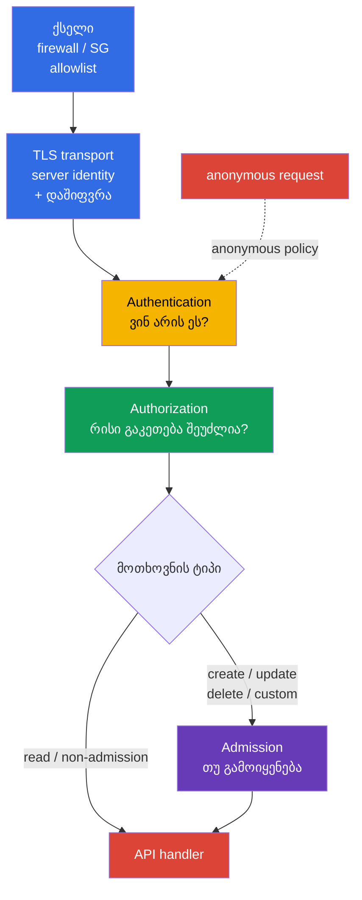
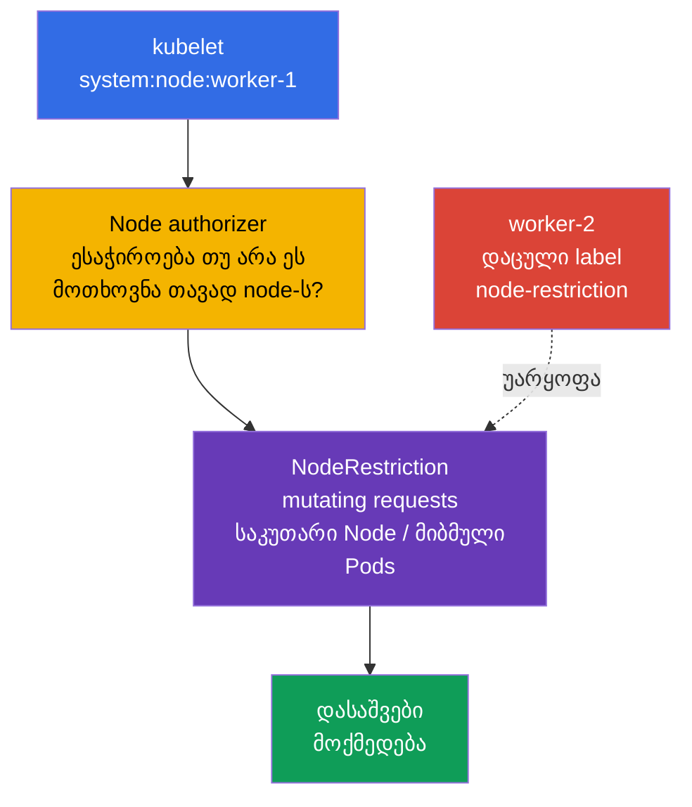
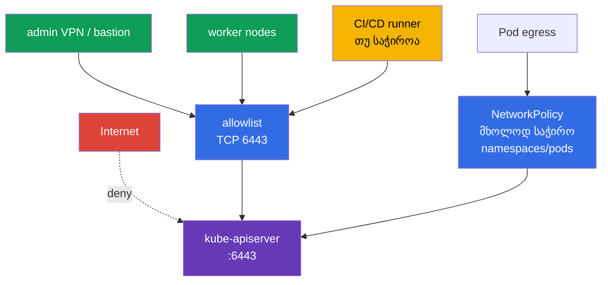

[Русская версия](ru.md) · [Eng version](README.md) · [Versión en español](es.md) · [Version française](fr.md) · [Deutsche Version](de.md) · [繁體中文版](tw.md) · [日本語版](jp.md)

# თავი 12. Kubernetes API-ზე წვდომის შეზღუდვა

> **პრობლემა.** ზედმეტი ქსელიდან ხელმისაწვდომი API endpoint, anonymous-მოთხოვნა ან
> მოძველებული binding `system:unauthenticated`-სთვის საშუალებას აძლევს შემტევს გვერდი აუაროს
> ჩვეულებრივი client-ის საზღვარს. შეცდომა ქსელურ პერიმეტრში, TLS-ში ან apiserver-ის
> პარამეტრებში საიმედოდ დაუდასტურებელი identity-ის მქონე ერთ მოთხოვნას მონაცემებზე წვდომად
> და კლასტერის მართვად აქცევს.

> **რა არის შემდეგ.** მე-11 თავში მოვაშორეთ ზედმეტი ServiceAccount-ტოკენები. ახლა დავხუროთ
> თავად წერტილი, რომელსაც ეს ტოკენები და სხვა credential-ები მიმართავენ: Kubernetes API.
> შეცდომა `kube-apiserver`-ში, kubelet-ში ან ქსელურ პერიმეტრში ერთ არაავთენტიფიცირებულ
> მოთხოვნას მონაცემებთან და კლასტერის მართვასთან წვდომის გზად აქცევს. ეს არის CKS-ის
> **Cluster Hardening** დომენი (15%): ვზღუდავთ, ვინ საერთოდ შეძლებს API-მდე მიღწევას, ვინ
> გახდება იგი ავთენტიფიკაციის შემდეგ და რისი გაკეთება შეეძლება.

> **რა გჭირდებათ CKA-დან.** საბაზისო გზა authn -> authz -> admission და ServiceAccount
> განხილულია [CKA-ს 21-ე თავში](../../../cka/course/21/ge.md); kubeconfig, client-ის TLS-
> სერტიფიკატები და CSR - [CKA-ს 39-ე თავში](../../../cka/course/39/ge.md). აქ არ
> ვიმეორებთ ამ მექანიზმებს, არამედ ვიყენებთ მათ API-ს hardening-ისთვის.

> 🧠 ქსელი, TLS, authentication და authorization — დამოუკიდებელი თანმიმდევრული ბარიერებია;
> admission ემატება მოთხოვნებისთვის, რომლებზეც ის გამოიყენება. Timeout/refused, `401` და `403`
> სხვადასხვა შრეზე მიუთითებს.

## 12.1. API-სკენ მოთხოვნის გზა: რამდენიმე დამოუკიდებელი ბარიერი

`kube-apiserver` - კლასტერის მდგომარეობის მართვის ერთადერთი წერტილია. მის გავლით გადის
`kubectl`, კონტროლერები, kubelet, ოპერატორები და ServiceAccount-ის მქონე აპლიკაციები.
ამიტომ დაცვა არ დაიყვანება ერთ RBAC-წესზე: მოთხოვნა უნდა შეჩერდეს რაც შეიძლება ადრე და
ამავე დროს დარჩეს შემდგომი შემოწმებებიც.



- **ქსელი** განსაზღვრავს, შეუძლია თუ არა წყაროს დაამყაროს TCP-კავშირი `6443`-თან. ეს არის
  პირველი და ყველაზე იაფი ბარიერი, მაგრამ ის არ ცვლის identity-სა და RBAC-ს.
- **TLS transport** იცავს კავშირის confidentiality-სა და integrity-ს და საშუალებას აძლევს
  client-ს შეამოწმოს API server-ის identity. თავად server-side TLS არ არის client-ების
  allowlist. X.509 client-certificate authentication-ის დროს TLS ითხოვს და იღებს
  client-ის სერტიფიკატს და ადასტურებს შესაბამისი private key-ის ფლობას, ხოლო Kubernetes-ის
  X.509 authenticator უკვე **Authentication**-ის შრეზე ამოწმებს სერტიფიკატს
  კონფიგურირებული client CA-ს მიხედვით და გარდაქმნის მის identity-ს user/groups-ად.
- **Authentication** სერტიფიკატს, bearer token-ს ან სხვა credential-ს subject-ს
  უსადაგებს. თუ anonymous access ჩართულია, credential-ის გარეშე მოთხოვნა იღებს subject-ს
  `system:anonymous` და ჯგუფს `system:unauthenticated`. აქტუალურ
  `AuthenticationConfiguration`-ში anonymous access შეიძლება შეიზღუდოს **ზუსტი HTTP
  paths**-ის ცხადი allowlist-ით. ხშირი ვარიანტია `/livez`, `/readyz` და საჭიროების
  შემთხვევაში `/healthz`; kubeadm-ის public token discovery-სთვის ცალკე ცხადად ნებადართულ
  path-ად შეიძლება იყოს `/api/v1/namespaces/kube-public/configmaps/cluster-info`.
  დანარჩენი paths-ები anonymous identity-ს არ იღებენ.
- **Authorization** ამოწმებს დასაშვებ verb-ს, resource-ს და scope-ს. ჩვეულებრივ
  kubeadm-კლასტერში ეს არის `Node,RBAC`.
- **Admission** მოქმედებს authorization-ის შემდეგ მხოლოდ იმ მოთხოვნებისთვის, რომლებზეც
  გამოიყენება admission control: უპირველესად create/delete/modify და ზოგიერთი custom
  verb. `get`, `list` და `watch` ობიექტების მიმართ ავლენს admission layer-ს. Admission-ს
  შეუძლია შეცვალოს ობიექტი ან უარყოს მოთხოვნა; `NodeRestriction` აქ ზღუდავს დასაშვებ
  **ცვლილებებს** kubelet-identity-ებისგან.

სწორედ თანმიმდევრობაა მნიშვნელოვანი გამოძიებისას: `401 Unauthorized` ნიშნავს, რომ
მოთხოვნამ ვერ გაიარა Authentication. `403 Forbidden` ნიშნავს, რომ უკვე განსაზღვრული
subject-ისთვის მოთხოვნა აკრძალულია; ჯერ Authorization მოწმდება. Mutating/custom
მოთხოვნებისთვის ცალკე უარყოფა შეიძლება მოხდეს მოგვიანებითაც, Admission-ზე, მაგრამ
admission არ მონაწილეობს ჩვეულებრივ `get/list/watch`-ში. ნუ სცდით `401`-ის გამოსწორებას
RoleBinding-ის შექმნით.

## 12.2. Anonymous access, legacy პორტები და ძველი RBAC-მიბმები

### რატომ არის `system:anonymous` საშიში

Anonymous access ზოგჯერ ტოვებენ მოძველებული health check-ის გამო ან ჩვევის გამო. თავად
anonymous-subject-ი არაფერს არ ანიჭებს, მაგრამ ერთი შეცდომითი `RoleBinding` ან
`ClusterRoleBinding` `system:anonymous`-ისთვის ან `system:unauthenticated`-ისთვის აქცევს
API-ს ხელმისაწვდომად გასაღების, სერტიფიკატის ან ტოკენის გარეშე. ჯერ იხურება შესასვლელი,
შემდეგ - უკვე გაცემული უფლებები: ამჟამად გამორთული anonymous access საშიშ binding-ს
სამუდამოდ უსაფრთხოს არ ხდის.

სტანდარტული kubeadm-ისთვის სრული `--anonymous-auth=false` არ შეიძლება ჩაითვალოს
უნივერსალურ baseline-ად: მისი health probe-ები მიმართავენ `/livez`-სა და `/readyz`-ს
credential-ების გარეშე, ამიტომ anonymous-ის გლობალური აკრძალვისას მათ შეიძლება მიიღონ
`401` და გადატვირთონ API server. ასეთი კლასტერისთვის ძირითადი ვარიანტია სტაბილური
`AuthenticationConfiguration`, რომელიც უერთდება `--authentication-config`-ის მეშვეობით.
მასში პირობები არის **ზუსტი** paths-ების allowlist: ნებისმიერი სხვა path anonymous ვერ
გახდება მაშინაც კი, თუ RBAC binding მას ნებადართავს. ეს ეხება token-based `kubeadm
join`-საც: API-სადმი ნდობამდე unauthenticated client კითხულობს
`/api/v1/namespaces/kube-public/configmaps/cluster-info`-ს. ამიტომ აირჩიეთ ერთ-ერთი ორი
გამოცდილი ვარიანტიდან: დაამატეთ ეს ზუსტი path public token discovery-ის დროისთვის ან
გამორთეთ public discovery და გამოიყენეთ file/HTTPS discovery. Health-only allowlist ამ
path-ის გარეშე შეუთავსებელია ჩვეულებრივ token-based join-თან. `/healthz` მხოლოდ მაშინ
ემატება, თუ მას რეალურად იყენებს health check. ყოველი გამონაკლისი მოითხოვს routes-ის,
ქსელური წვდომისა და anonymous-subject-ის უფლებების ცალკე review-ს.

kubeadm control-plane-ზე `kube-apiserver` ჩვეულებრივ არის static Pod. შეასწორეთ აქტიური
manifest ლოკალურად control-plane-ზე, node-ის კონსოლთან წვდომითა და დაცული rollback-გზით.
ნუ დააკოპირებთ სარეზერვო YAML-ს `/etc/kubernetes/manifests/`-ში: kubelet-მა შეიძლება ის
აღიქვას როგორც კიდევ ერთი static Pod.

```bash
# control-plane-ზე: შეინახეთ ასლი static Pod-manifest-ების საქაღალდის გარეთ.
sudo install -d -m 700 /root/k8s-manifest-backup
sudo cp /etc/kubernetes/manifests/kube-apiserver.yaml \
  /root/k8s-manifest-backup/kube-apiserver.yaml

# შექმენით authentication configuration static Pod-manifest-ების საქაღალდის გარეთ.
# თუ kubeadm join იყენებს public token discovery-ს, დატოვეთ ზუსტი cluster-info path.
sudo install -d -m 700 /etc/kubernetes/authentication
sudo tee /etc/kubernetes/authentication/apiserver-authentication.yaml >/dev/null <<'EOF'
apiVersion: apiserver.config.k8s.io/v1
kind: AuthenticationConfiguration
anonymous:
  enabled: true
  conditions:
  - path: /livez
  - path: /readyz
  - path: /api/v1/namespaces/kube-public/configmaps/cluster-info
EOF
sudo chmod 0600 /etc/kubernetes/authentication/apiserver-authentication.yaml

# იპოვეთ უკვე მითითებული authn-ფლაგები; კონფლიქტური გამეორებები არ უნდა იყოს.
sudo grep -nE -- '--(anonymous-auth|authentication-config)' \
  /etc/kubernetes/manifests/kube-apiserver.yaml || true
sudoedit /etc/kubernetes/manifests/kube-apiserver.yaml
```

`spec.containers[].command`-ში მიუთითეთ ზუსტად ერთი გზა ფაილამდე და ნუ დააყენებთ
ერთდროულად `--anonymous-auth`-ს (ეს კონფიგურაციის წესები ურთიერთგამომრიცხავია):

```yaml
- --authentication-config=/etc/kubernetes/authentication/apiserver-authentication.yaml
```

ერთი ფლაგი საკმარისი არ არის: ფაილი მდებარეობს host-ზე და ცხადად უნდა იყოს mount
გაკეთებული static Pod-ში. დაამატეთ `hostPath` volume და read-only `volumeMount`, არსებული
kube-apiserver-ის volumes-ების წაშლის გარეშე:

```yaml
# დაამატეთ kube-apiserver-ის არსებულ volumeMounts-ს:
volumeMounts:
- name: authentication-config
  mountPath: /etc/kubernetes/authentication/apiserver-authentication.yaml
  readOnly: true

# დაამატეთ Pod-ის არსებულ volumes-ს:
volumes:
- name: authentication-config
  hostPath:
    path: /etc/kubernetes/authentication/apiserver-authentication.yaml
    type: File
```

ცვლილების შემდეგ შეამოწმეთ, რომ container ნამდვილად ხედავს ფაილს, API server აღდგენილია
და `/readyz` წარმატებულია. `hostPath` — ეს არის node-ის ლოკალური გზა: HA control plane-ში
შექმენით იგივე ფაილი და mount **ყოველ** control-plane node-ზე, თორემ მის apiserver-ს
ფაილის mount-ი და ატვირთვა არ შეეძლება.

Static Pod-ის ხელით რედაქტირება ვარგისია კონკრეტული ლაბორატორიული ან საგანგებო
ამოცანისთვის, მაგრამ არ უნდა დარჩეს kubeadm-კლასტერის ერთადერთი source of truth-ად.
მუდმივი კონფიგურაციისთვის გადაიტანეთ პარამეტრი და mount `ClusterConfiguration`-ში,
მაგალითად `apiServer.extraArgs`-ისა და `apiServer.extraVolumes`-ის მეშვეობით, ან
გამოიყენეთ მართვადი kubeadm patches. თორემ `kubeadm upgrade`-მა შეიძლება ხელახლა
გამოქმნას manifest ამ პარამეტრის გარეშე:

```yaml
apiVersion: kubeadm.k8s.io/v1beta4
kind: ClusterConfiguration
apiServer:
  extraArgs:
  - name: authentication-config
    value: /etc/kubernetes/authentication/apiserver-authentication.yaml
  extraVolumes:
  - name: authentication-config
    hostPath: /etc/kubernetes/authentication/apiserver-authentication.yaml
    mountPath: /etc/kubernetes/authentication/apiserver-authentication.yaml
    readOnly: true
    pathType: File
```

სრული გამორთვა `--anonymous-auth=false`-ით დასაშვებია მხოლოდ kubeadm-ის health
probe-ების წინასწარ ავთენტიფიცირებულზე ან სხვა გამოცდილ მექანიზმზე შეცვლისა და
bootstrap-დამოკიდებულებების შემოწმების შემდეგ. შენახვის შემდეგ kubelet ხელახლა ქმნის
static Pod-ს. Manifest — ეს არის desired წყარო და არა უკვე მომუშავე apiserver-ის argv-ის
დამტკიცება. ნუ გადატვირთავთ ერთდროულად ყველა control-plane კომპონენტს და ნუ დაასრულებთ
SSH-სესიას, სანამ API არ აღდგება.

```bash
# Desired configuration. Manifest თავისთავად არ ადასტურებს active runtime-ს.
sudo grep -n -- '--authentication-config=' \
  /etc/kubernetes/manifests/kube-apiserver.yaml
watch -n 2 'sudo crictl ps --name kube-apiserver'

# Linux-host-ზე, სადაც კონტეინერების PID ჩანს: ცალკე დაამტკიცეთ argv და ფაილის ხილვადობა
# გაშვებული პროცესისთვის. თუ runtime/PID namespace ამას არ იძლევა, გამოიყენეთ მისი
# ეკვივალენტური inspect-შემოწმება და ნუ გამოიტანთ დასკვნას მხოლოდ manifest-ის მიხედვით.
APISERVER_PID="$(pgrep -xo kube-apiserver)" || {
  echo 'ERROR: running kube-apiserver process not found' >&2
  exit 2
}
AUTH_CONFIG_ARG='--authentication-config=/etc/kubernetes/authentication/apiserver-authentication.yaml'
AUTH_CONFIG_PATH='/etc/kubernetes/authentication/apiserver-authentication.yaml'

if ! sudo cat "/proc/${APISERVER_PID}/cmdline" \
    | tr '\0' '\n' \
    | grep -Fxq -- "$AUTH_CONFIG_ARG"
then
  echo "ERROR: active kube-apiserver argv does not contain ${AUTH_CONFIG_ARG}" >&2
  exit 1
fi

if ! sudo test -e "/proc/${APISERVER_PID}/root${AUTH_CONFIG_PATH}"; then
  echo "ERROR: ${AUTH_CONFIG_PATH} is not visible in kube-apiserver mount namespace" >&2
  exit 1
fi

echo 'OK: active kube-apiserver uses the expected authentication config path'

# API-ის მზადყოფნა მოწმდება ცალკე, desired configuration-ისა და argv-ისგან დამოუკიდებლად.
kubectl get --raw='/readyz?verbose'
kubectl get nodes
```

Kubelet - ეს არის მეორე HTTP API ყოველ node-ზე. ის ცალკე იცავება: გამორთეთ anonymous
authentication და legacy read-only API. `/var/lib/kubelet/config.yaml` ვერ ჩაითვლება
უნივერსალურ წყაროდ: kubelet-მა შეიძლება მიიღოს `--config`, `--config-dir` და არგუმენტები
unit-იდან, drop-in-იდან ან environment-ფაილიდან. ჯერ დაადგინეთ რეალური startup sources და
მხოლოდ შემდეგ შეამოწმეთ აქტიური `KubeletConfiguration`; დაშვებული წვდომისას მისი შედარებაც
შეიძლება endpoint `/configz`-თან.

```bash
sudo systemctl cat kubelet
sudo systemctl show kubelet -p ExecStart --value
KUBELET_PID=$(pgrep -xo kubelet) || { echo 'kubelet process not found' >&2; exit 2; }
sudo tr '\0' '\n' < "/proc/$KUBELET_PID/cmdline" \
  | grep -E -- '^--config(=|$)|^--config-dir(=|$)|^--(read-only-port|anonymous-auth|authorization-mode)(=|$)' || true
# რეალური ფაილის დადგენის შემდეგ, მაგალითად: sudo grep -nE 'readOnlyPort|anonymous:|authorization:' <active-kubelet-config>
```

```yaml
# აქტიურ KubeletConfiguration-ში, გზა განისაზღვრება startup configuration-ით.
readOnlyPort: 0
authentication:
  anonymous:
    enabled: false
authorization:
  mode: Webhook
```

ეკვივალენტები, თუ კონკრეტული ინსტალაცია kubelet-ს ფლაგებით მართავს:

```text
--read-only-port=0
--anonymous-auth=false
--authorization-mode=Webhook
```

`10255` - kubelet-ის ისტორიული read-only, არაავთენტიფიცირებული პორტია; ის უნდა იყოს
გამორთული. ჩვეულებრივი kubelet API `10250`-ზე არ უნდა „გაიხსნას ყველასთვის“: ის უნდა
დარჩეს დაცული authentication-ით, `Webhook` authorization-ითა და ქსელური წესებით.
`kube-apiserver`-ის legacy `--insecure-port` თანამედროვე Kubernetes-ში უკვე მოშორებულია;
ეს არ არის მიზეზი, უგულებელვყოთ ძველი manifest-ები, images და დოკუმენტაცია. ეძებეთ ის
როგორც მხარდაუჭერელი ან დაუცველი კონფიგურაციის ნიშანი და ნუ შეეცდებით მის ჩართვას
თავსებადობისთვის.

```bash
# ყოველ node-ზე: ss-ის შეცდომა არის შემოწმების შეცდომა და არა დახურული პორტის დადასტურება.
listeners=$(sudo ss -H -lnt '( sport = :10255 )') || {
  echo 'ERROR: cannot inspect TCP listener 10255' >&2; exit 2;
}
if [ -n "$listeners" ]; then
  printf 'ERROR: kubelet read-only port 10255 is listening:\n%s\n' "$listeners" >&2
  exit 1
fi
echo 'OK: kubelet read-only port 10255 is closed'

# 10250 შემოწმდება firewall-თან ერთად; ზუსტი socket filter არ დაემთხვევა სხვა პორტს.
sudo ss -H -lntp '( sport = :10250 )'
```

> 🎯 დააყენეთ უსაფრთხო authentication configuration და წაშალეთ bindings `system:anonymous`/`system:unauthenticated`-სთვის. Legacy `10255` და `--insecure-port` გამორთეთ, ხოლო დაცული `10250` ნუ გამოაქვეყნებთ.

### Bindings-ის ინვენტარიზაცია და cleanup

ნუ წაშლით `ClusterRole`-ს სახელით შემთხვევით: ერთი role შეიძლება სჭირდებოდეს სხვა
subject-ს. იპოვეთ bindings, რომლებშიც `subjects`-ს შორის მართლაც მითითებულია anonymous
user ან მისი ჯგუფი, შეამოწმეთ მინიჭებული role და მხოლოდ შემდეგ წაშალეთ ზედმეტი binding.

```bash
# ClusterRoleBinding, რომელიც პირდაპირ ანიჭებს უფლებებს anonymous user-ს ან unauthenticated ჯგუფს.
kubectl get clusterrolebinding -o json | jq -r '
  .items[]
  | select(any(.subjects[]?;
      (.kind == "User" and .name == "system:anonymous") or
      (.kind == "Group" and .name == "system:unauthenticated")))
  | [.metadata.name, .roleRef.kind, .roleRef.name] | @tsv'

# იგივე namespace-scoped RoleBinding-ისთვის.
kubectl get rolebinding -A -o json | jq -r '
  .items[]
  | select(any(.subjects[]?;
      (.kind == "User" and .name == "system:anonymous") or
      (.kind == "Group" and .name == "system:unauthenticated")))
  | [.metadata.namespace, .metadata.name, .roleRef.kind, .roleRef.name] | @tsv'
```

ნუ წაშლით binding-ს მხოლოდ subject-ის დამთხვევის გამო. კერძოდ, `system:public-info-viewer`
— ეს არის რეგულარული default ClusterRoleBinding `system:unauthenticated`-სთვის
non-sensitive საჯარო ინფორმაციით; ჩართული RBAC-ის შემთხვევაში რეგულარული binding-ების
დაკარგული subjects შეიძლება აღდგეს auto-reconciliation-ით API-ის გაშვების შემდეგ.
ასევე kubeadm token discovery-ში გამოიყენება RoleBinding
`kubeadm:bootstrap-signer-clusterinfo` `kube-public/cluster-info`-ს წასაკითხად. ჯერ
შეამოწმეთ role და სჭირდება თუ არა შესაბამისი discovery workflow; წაშალეთ მხოლოდ custom ან
მართლაც ზედმეტი binding.

Review-ის შემდეგ წაშლა ასე გამოიყურება:

```bash
REVIEWED_CLUSTERROLEBINDING='reviewed-clusterrolebinding'
NAMESPACE='reviewed-namespace'
REVIEWED_ROLEBINDING='reviewed-rolebinding'
kubectl delete clusterrolebinding "$REVIEWED_CLUSTERROLEBINDING"
kubectl delete rolebinding -n "$NAMESPACE" "$REVIEWED_ROLEBINDING"
```

ასევე შეამოწმეთ ნებისმიერი binding, რომელიც ჯგუფს `system:unauthenticated`-ს უფლებას
ანიჭებს: anonymous access-ის გამორთვა აჩერებს მისკენ ჩვეულებრივ გზას, მაგრამ პოლიტიკა
უნდა დარჩეს მინიმალური და გასაგები identity provider-ის შემდგომი ცვლილებების დროსაც.

## 12.3. Authorization modes და NodeRestriction

`--authorization-mode` განსაზღვრავს authorization-მოდულების დალაგებულ ჯაჭვს. ყოველი
მოდული აბრუნებს `Allow`-ს, `Deny`-ს ან `NoOpinion`-ს: `Allow` **ან** `Deny` დაუყოვნებლივ
ასრულებს ჯაჭვს, და მხოლოდ `NoOpinion` გადასცემს მოთხოვნას შემდეგ მოდულს; თუ ყველა
მოდულმა დააბრუნა `NoOpinion`, მოთხოვნა იუარყვება. ამიტომ თანმიმდევრობას მნიშვნელობა
აქვს, ხოლო `AlwaysAllow` ჯაჭვის მისაწვდომ ნაწილში ანულებს least privilege-ს იმ
მოთხოვნებისთვის, რომლებიც მასამდე მიაღწიეს.

| Mode | დანიშნულება | გადაწყვეტილება hardening-ისთვის |
|---|---|---|
| `Node` | ამუშავებს kubelet-identity-ების `system:node:<node>` მოთხოვნებს | ჩართეთ `RBAC`-მდე ჩვეულებრივ kubeadm-კლასტერში |
| `RBAC` | ამოწმებს Role-ს, ClusterRole-ს და bindings-ს მომხმარებლებისთვის, ჯგუფებისთვის და ServiceAccount-ისთვის | ძირითადი authorizer ადმინისტრატორებისა და workload-ისთვის |
| `Webhook` | ეკითხება გარე authorization webhook-ს | გამოიყენეთ მხოლოდ ხელმისაწვდომ და შემოწმებულ გარე სერვისთან |
| `ABAC` | წესები ლოკალური policy-ფაილიდან | legacy-ვარიანტი; რთული აუდიტისთვის, ერიდეთ ახალ კლასტერებში |
| `AlwaysAllow` | ყველაფერს ნებადართავს | ნუ გამოიყენებთ production-ში |

Structured `AuthorizationConfiguration` სტაბილურია Kubernetes v1.32-იდან და
განისაზღვრება ფლაგით `--authorization-config`. აირჩიეთ **ერთი** მიდგომა: ეს ფაილი ვერ
შეთავსდება CLI-კონფიგურაციასთან `--authorization-mode` და
`--authorization-webhook-*`-თან; შერევისას `kube-apiserver` მუშაობას შეცდომით დაასრულებს.
ფაილი სასარგებლოა, როცა საჭიროა პარამეტრები და რამდენიმე webhook authorizer, მაგრამ მასზე
გადასვლა იგეგმება და მოწმდება, როგორც control plane-ის ცვლილება, და არა როგორც
კონფიგურაციის მეორე პარალელური წყაროს დამატება.

შეამოწმეთ desired არგუმენტი static Pod-manifest-ში და დააყენეთ უსაფრთხო საბაზისო ჯაჭვი,
თუ ის შეესაბამება კლასტერის არქიტექტურას. Reconciliation-ის შემდეგ kubelet-ისგან ცალკე
დაადასტურეთ გაშვებული პროცესის argv (როგორც §12.2-ში): manifest-ში სტრიქონი
თავისთავად არ ადასტურებს აქტიურ კონფიგურაციას:

```bash
sudo grep -n -- '--authorization-mode' /etc/kubernetes/manifests/kube-apiserver.yaml
```

```yaml
- --authorization-mode=Node,RBAC
```

`Node` authorizer არ არის საჭირო „ყველა node-ის ნდობისთვის“, არამედ kubelet-ის სპეციალური
API ოპერაციებისთვის. ნაჩვენებ kubeadm baseline-ში `Node,RBAC` დანარჩენი identity-ები
ავტორიზდება RBAC-ის მეშვეობით. სხვა გააზრებულ არქიტექტურაში საერთო authorizer-მა
შეიძლება შეიცავდეს, მაგალითად, Webhook-ს; მნიშვნელოვანია, რომ ყველა დანარჩენი
მოთხოვნისთვის არსებობდეს fail-closed authorization policy და `AlwaysAllow` არ
გამოიყენებოდეს fallback-ად. ნუ შეცვლით modes-ების სიას მომუშავე კლასტერზე
bootstrap-კონტროლერების, identity provider-ისა და მიმდინარე API-კლიენტების შემოწმების
გარეშე.

> 🎯 kubeadm baseline: `Node,RBAC` `AlwaysAllow`-ის გარეშე; `Node` ემსახურება kubelet-ს,
> RBAC ზღუდავს დანარჩენ identity-ებს, ხოლო `NodeRestriction` ზღუდავს დასაშვებ mutating
> requests-ს node credentials-ით.

**NodeRestriction** — validating admission plugin-ია, რომელიც ავსებს `Node` authorizer-ს.
`Node` authorizer განსაზღვრავს kubelet-ის API-უფლებებს და ზღუდავს relation-sensitive
reads-ს; `NodeRestriction` შემდეგ ზღუდავს დასაშვებ **ცვლილებებს**: kubelet-ს შეუძლია
შეცვალოს მხოლოდ საკუთარი `Node` და ამ node-ისთვის მინიჭებული `Pod`-ები და ვერ შეცვლის
დაცულ Node labels/taints-ს ნებადართული მოდელის მიღმა. Read-მოთხოვნები admission-ს არ
გადის, ამიტომ მათ scope-ს განსაზღვრავს სწორედ authorizer.



kubeadm-ში `NodeRestriction` ჩვეულებრივ ჩართულია, როგორც დამატებითი admission plugin.
ჯერ ერთდროულად შეამოწმეთ `--enable-admission-plugins` და `--disable-admission-plugins`.

```bash
sudo grep -nE -- '--(enable|disable)-admission-plugins' \
  /etc/kubernetes/manifests/kube-apiserver.yaml
sudo crictl ps --name kube-apiserver
```

Kubernetes v1.36-ში `--enable-admission-plugins` ამატებს plugins-ს built-in
default-enabled ნაკრებთან; defaults ამ ფლაგში ჩამოთვლა არ სჭირდება. თუ `NodeRestriction`
ჩართული არ არის, დაამატეთ ის ცხად additional სიაში. თუ `--enable-admission-plugins`-ში
უკვე არის სხვა დამატებითი plugins, შეინარჩუნეთ ისინი. ცალკე დარწმუნდით, რომ საჭირო
default ან plugin არ არის გამორთული `--disable-admission-plugins`-ით. RBAC მართავს
მომხმარებლების, ჯგუფებისა და ServiceAccount-ის საერთო role/binding-based უფლებებს, ხოლო
`Node` authorizer ემსახურება node identity-ების სპეციალურ უფლებებს. `NodeRestriction`
მათ არ ცვლის: ის ამატებს admission-შეზღუდვებს kubelet-ის mutating requests-ისთვის. მის
გვერდით გაითვალისწინეთ feature gate `ServiceAccountNodeAudienceRestriction`: როცა ის
ჩართულია, NodeRestriction ასევე ავიწროებს audiences-ს, რომლებისთვისაც kubelet-ს შეუძლია
მოითხოვოს ServiceAccount-ტოკენები `TokenRequest`-ის მეშვეობით, უკვე ამ node-ზე Pod-ის
მიერ გამოყენებულ audiences-მდე ან RBAC-ით ცხადად გაცემულამდე. ეს არ არის NodeRestriction-ის
ჩანაცვლება, არამედ დამატებითი შეზღუდვა node-ის მიერ ინიცირებული token requests-ისთვის.

> 🎯 შეზღუდეთ `:6443` private endpoint-ით ან ზუსტი CIDR allowlist-ით; Pod-ისთვის შეამოწმეთ
> ცალკე egress policy.

## 12.4. apiserver-ზე წვდომის ქსელური შეზღუდვა

სწორი TLS-ისა და RBAC-ის შემთხვევაშიც კი საჯარო API endpoint აფართოებს ზედაპირს: მისამართი
`:6443` შემტევს აძლევს შესაძლებლობას გადაარჩიოს credentials, გამოიყენოს მომავალი
დაუცველობა ან მიიღოს ინფორმაცია შეცდომების მიხედვით. Private endpoint — ეს ძლიერი და
ხშირად სასურველი ვარიანტია, მაგრამ არა უნივერსალური აბსოლუტი: public endpoint შეიძლება
გამართლებული იყოს, თუ ხელმისაწვდომია მკაცრი ქსელური შეზღუდვები (ვიწრო CIDR allowlist,
firewall/WAF არქიტექტურის მიხედვით) და ძლიერი ავთენტიფიკაცია. ნებისმიერ შემთხვევაში
`:6443` ნებადართულია მხოლოდ საჭირო და დადასტურებული source paths-იდან:
ადმინისტრაციული ქსელი/VPN, control-plane, kubelet/worker traffic, შეთანხმებული automation
endpoints და ის in-cluster workloads, რომლებსაც მართლაც სჭირდებათ API. ნუ ივარაუდებთ, რომ
workload-ის ტრაფიკი endpoint-ს ყოველთვის ჩანს worker-node-ის მისამართად: დაადგინეთ რეალური
CNI/cloud datapath და source address SNAT/routing-ის შემდეგ.



ბარიერები გამოიყენეთ პასუხისმგებლობის ადგილის მიხედვით:

- **Cloud Security Group / firewall**: დაუშვით `TCP/6443` მხოლოდ რეალურად საჭირო source
  ranges/identities-იდან: control-plane, kubelet/worker path, VPN/bastion, automation და,
  თუ ტოპოლოგია ამას მოითხოვს, ავტორიზებული Pod workloads-ის მისამართები/CIDR. ნუ
  დაამატებთ ავტომატურად მთელ Pod CIDR-ს: ჯერ დაადგინეთ, რომელ source-ს რეალურად ხედავს API
  endpoint CNI/cloud routing-ისა და SNAT-ის შემდეგ. ნუ დააყენებთ `0.0.0.0/0`-ს; private
  კლასტერში გამოიყენეთ private endpoint ან tunnel.
- **Host firewall** (`nftables`, `iptables`, `ufw`) self-managed control-plane-ზე: ის
  ორმაგდება ქსელურ პერიმეტრთან და ზღუდავს წყაროებს, თუ cloud firewall შეცდომით
  გაფართოვდება.
- **NetworkPolicy**: `kubernetes.default.svc` — ეს Service-ის ლოგიკური სახელია, ხოლო
  სტანდარტული NetworkPolicy destination Service-ს სახელით არ ირჩევს. API-სკენ egress-ის
  შეზღუდვა შენდება `ipBlock`/endpoint CIDR-ით, რეალური datapath-ის შემოწმებით, ან
  CNI-specific entity-ით, FQDN-ით ან Service policy-ით. ნუ გადაიტანთ `ipBlock`-ს CNI-ებს
  შორის ბრმად: Service-ის DNAT შეიძლება მოხდეს policy-მდე ან მის შემდეგ და არ აქვს
  უნივერსალური სემანტიკა. დაუშვით API მხოლოდ იმ namespace-სა და workload-ისთვის,
  რომელსაც ის მართლაც სჭირდება — ეს ამცირებს lateral movement-ს Pod-ის კომპრომეტაციის
  შემდეგ.
- **მარშრუტიზაცია და DNS**: დარწმუნდით, რომ control-plane endpoint ქვეყნდება და
  გარკვეულდება მხოლოდ ისე, როგორც მოითხოვს არჩეული წვდომის მოდელი; private endpoint
  ხშირად ამარტივებს ამას, მაგრამ public endpoint მოითხოვს განსაკუთრებით მკაცრ წყაროებისა
  და ავთენტიფიკაციის კონტროლს.

**kubeadm discovery — ცალკე შემთხვევაა.** Token-based discovery-ის დროს ConfigMap
`kube-public/cluster-info` ნაგულისხმევად შეიცავს საჯაროდ ხელმისაწვდომ discovery-ინფორმაციას
(API-ის მისამართი და CA-მონაცემები); ეს არ არის Secret და არ უნდა გაიცეს ან დაცულ იქნას
Secret-ის მსგავსად. Bootstrap token, პირიქით, არის დროებითი credential-ინფორმაცია
discovery/TLS bootstrap-ისთვის და მოითხოვს ცალკე კონტროლს: შეზღუდულ გავრცელებას, მოკლე
სიცოცხლის ვადას, გაუქმებას და CSR/auto-approval-ის review-ს. Anonymous-ის შეზღუდვისას
`AuthenticationConfiguration`-ის მეშვეობით RBAC binding საკმარისი არ არის: ზუსტი path
`/api/v1/namespaces/kube-public/configmaps/cluster-info`-იც უნდა იყოს
`anonymous.conditions`-ში, თორემ request anonymous identity-ს ვერ მიიღებს და token
discovery ჩავარდება. საჭიროებისას public წვდომა `cluster-info`-ზე გამოირთვება ან
გამოიყენება file/HTTPS discovery შესაბამისი trust channel-ით; ნუ აურევთ საჯარო
ინფორმაციის დაცვასა და ტოკენის დაცვას.

NetworkPolicy არ ცვლის Security Group-ს ან host firewall-ს: ის გამოიყენება CNI-ის მიერ
Pod-ის ტრაფიკზე და არ არის ვალდებული ერთნაირად დაფაროს host-ის, გარე ან control-plane-ის
ტრაფიკი ყოველ ტოპოლოგიაში. Managed Kubernetes-ში endpoint-ისა და firewall-ის ნაწილი
პროვაიდერს ეკუთვნის; მაშინ შეამოწმეთ მისი private/public endpoint, allowed CIDRs და
ცალკე control-plane security rules, static Pod-ის რედაქტირების ცდის ნაცვლად, რომელიც
თქვენ არ გაქვთ.

Firewall-ის ცვლილებამდე დააფიქსირეთ მიმდინარე listeners და წესი, შეინარჩუნეთ ცალკე
საკონსოლო სესია rollback-ისთვის. `6443`-ის დაბლოკვამ საკუთარი ადმინისტრატორისთვის ან
kubelet-ისთვის შეიძლება კლასტერი მიუწვდომელი გახადოს.

```bash
# control-plane-ზე: ვინ უსმენს API-ს; კონკრეტული პროგრამა დამოკიდებულია runtime-ზე.
sudo ss -lntp | grep ':6443'

# ადმინისტრაციული მანქანიდან: შეამოწმეთ endpoint production-ში TLS-შემოწმების გამორთვის გარეშე.
kubectl cluster-info
kubectl get --raw='/livez?verbose'
```

> 🔬 `kubectl proxy` და `port-forward`, როგორც ლოკალური წვდომის დამხმარე გზები: ისინი
> იყენებენ ოპერატორის kubeconfig-ის უფლებებს და ქმნიან დამატებით დიაგნოსტიკის ზედაპირს.

## 12.4.1. ლოკალური API-შლუზები: `kubectl proxy` და `port-forward`

`kubectl proxy` და `kubectl port-forward` იყენებენ მომხმარებლის kubeconfig-ის
უფლებამოსილებებს და არ ქმნიან ახალ შეზღუდულ identity-ს. ნაგულისხმევად `kubectl proxy`
უსმენს `127.0.0.1`-ს, რაც რისკს ლოკალურ მანქანამდე ზღუდავს. ნუ გააფართოებთ მის
`--address`-ს საჭიროების გარეშე; ფართო `--accept-hosts`-მა და განსაკუთრებით
`--disable-filter`-მა შეიძლება proxy აქციოს სხვა client-ებისთვის ხელმისაწვდომ API-შლუზად
ოპერატორის უფლებებით. ანალოგიურად ნუ გამოიყენებთ `kubectl port-forward --address
0.0.0.0`-ს, თუ არ არის საჭირო მოკლე, ცალკე შეთანხმებული კავშირი დაცული ქსელით. დაასრულეთ
დროებითი tunnel დიაგნოსტიკის შემდეგ და ნუ ჩათვლით მას firewall-ის, RBAC-ის ან
NetworkPolicy-ის ჩანაცვლებად.

> 🎯 დაადასტურეთ active config, უსაფრთხო flags, readiness reload-ის შემდეგ, `401`
> anonymous path-ისთვის და targeted `can-i` `no`-თი; static Pod-ს დიაგნოსტირებთ kubelet-ისა
> და runtime-ის მეშვეობით.

## 12.5. Profiling, ServiceAccount lookup და ფლაგების აუდიტი

Profiling endpoints საჭიროა წარმადობის დიაგნოსტიკისთვის, მაგრამ საჭიროების გარეშე
ზრდის პროცესის შესახებ ინფორმაციის გამჟღავნების ზედაპირს. `kube-apiserver`-ზე გამორთეთ
profiling; იმავე ოპერაციაში შეამოწმეთ controller-manager და scheduler. სამივე
კომპონენტის დეტალური CIS-შემოწმება მოცემულია [მე-07 თავში](../07/ge.md), ხოლო
დაუცველი არგუმენტები და TLS-hardening — [მე-09 თავში](../09/ge.md).

```yaml
# kube-apiserver static Pod-ის command-ში
- --profiling=false
```

```bash
for component in kube-apiserver kube-controller-manager kube-scheduler; do
  sudo grep -n -- '--profiling' "/etc/kubernetes/manifests/${component}.yaml" || true
done
```

`--service-account-lookup` ეხება ServiceAccount-ის არსებობის შემოწმებას legacy
ServiceAccount token-ის ავთენტიფიკაციისას. მნიშვნელობა `false` გამორთავს API-based
revocation-ს: წაშლილი ServiceAccount ან წაშლილი legacy token ამ შემოწმებით უკვე
გაცემულ token-ს აღარ აუქმებს. ეს **არ არის** legacy tokens-ისთვის მოკლე TTL-ის დაწესების
ან გარანტიის მექანიზმი; მათი მოქმედების ვადა განისაზღვრება გაცემის მეთოდითა და
token-ის claims-ით. ცხადი გადაწყვეტილების გარეშე lookup არ გამოირთვება. თანამედროვე
კლასტერებში უპირატესობას ანიჭებენ მე-11 თავის bound, short-lived projected tokens-ს, ხოლო
ფლაგის არსებობასა და ქცევას ადარებენ ვერსიასთან `kube-apiserver --help`-ისა და
გამოყენებული ვერსიის დოკუმენტაციის მეშვეობით.

შეამოწმეთ კონფიგურაცია, როგორც რისკების ნაკრები და არა მხოლოდ ერთი ფლაგი. Scheduler-ისთვის
ჯერ შეამოწმეთ `--config`-ის არსებობა: მისი არსებობისას deprecated `--profiling`
იგნორირდება, ამიტომ `enableProfiling: false` ისახება ნაპოვნი აქტიური
`KubeSchedulerConfiguration`-ში.

```bash
sudo grep -nE -- \
  '--(anonymous-auth|authorization-mode|enable-admission-plugins|profiling|service-account-lookup|insecure-port|secure-port)' \
  /etc/kubernetes/manifests/kube-apiserver.yaml
sudo grep -n -- '--config' /etc/kubernetes/manifests/kube-scheduler.yaml
# მითითებული --config-ის მიხედვით: sudo grep -n 'enableProfiling:' <active-scheduler-config>

# Kubelet: ჯერ იპოვეთ რეალური --config/--config-dir unit-სა და /proc/<kubelet-pid>/cmdline-ში,
# შემდეგ შეამოწმეთ ნაპოვნი active KubeletConfiguration.
```

| მიგნება | რატომ არის საშიში | უსაფრთხო მიმართულება |
|---|---|---|
| broad anonymous access | credential-ის გარეშე მოთხოვნა იღებს `system:anonymous`-ს; selective config-ის დროს გამორიცხულია მხოლოდ exact allowed paths | `AuthenticationConfiguration` მინიმალური allowlist-ით exact paths-ისთვის ან `--anonymous-auth=false`, თუ ეს თავსებადია probes/bootstrapping-თან; bindings-ის cleanup |
| `--authorization-mode=AlwaysAllow` | ნებისმიერი ავთენტიფიცირებული ან anonymous subject გადის authz-ს | `Node,RBAC` ან გააზრებული Webhook-ინტეგრაცია |
| `NodeRestriction` არ არის | კომპრომეტირებული kubelet იღებს API-სკენ უფრო ფართო გზას | ჩართეთ plugin, არსებული defaults-ის შენარჩუნებით |
| profiling ჩართულია საჭიროების გარეშე | ზედმეტი diagnostic endpoints | apiserver/controller-manager-ისთვის — `--profiling=false`; scheduler-ისთვის `--config`-ით — `enableProfiling: false` აქტიურ `KubeSchedulerConfiguration`-ში |
| `readOnlyPort` არ უდრის `0`-ს | legacy kubelet API ავთენტიფიკაციის გარეშე | `readOnlyPort: 0` |
| საჯარო `6443` | გაზრდილი ზედაპირი credentials attacks-ისა და API-დაუცველობებისთვის | private endpoint ან მკაცრი CIDR allowlist, firewall და ძლიერი ავთენტიფიკაცია |

Static Pod-ის რედაქტირების შემდეგ დაადასტურეთ არა მხოლოდ სტრიქონი YAML-ში. Kubelet-მა
უნდა გაუშვას ახალი container, ხოლო API-მ — გახდეს Ready. YAML-ის შეცდომის ან
მხარდაუჭერელი ფლაგის დროს გამოიყენეთ ლოკალური კონსოლი, `journalctl -u kubelet`,
`crictl ps -a` და manifest-ის შენახული ასლი.

## 12.6. შემოწმება: დამტკიცება, რომ შესასვლელი დახურულია

შემოწმება ტარდება ორ დამოუკიდებელ შრეზე: authentication credential-ის გარეშე და
authorization ცხადად მითითებული subject-ისთვის. შეამოწმეთ იმ ქსელიდან, რომელსაც უნდა
ჰქონდეს TCP-წვდომა API-სთან; firewall timeout და API `401` — სხვადასხვა, მაგრამ ორივე
სასარგებლო შედეგია საკუთარ შრეებში.

```bash
# ავიღოთ server URL მიმდინარე kubeconfig-იდან, curl-ისთვის სერტიფიკატის, key-ისა და token-ის გადაცემის გარეშე.
APISERVER=$(kubectl config view --minify \
  -o jsonpath='{.clusters[0].cluster.server}')
printf '%s\n' "$APISERVER"

# Protected path: `401` ადასტურებს, რომ სწორედ /version არ ატარებს anonymous authn-ს.
# სასწავლო ტესტისთვის -k დასაშვებია, მაგრამ production-ში CA გადაეცით --cacert-ის მეშვეობით.
curl -k -sS -o /dev/null -w '%{http_code}\n' "$APISERVER/version"

# თუ selective config განზრახ უშვებს /readyz-ს, შეამოწმეთ ის ცალკე.
# API-ის მზადყოფნისას ჩვეულებრივ მოსალოდნელია 200, მაგრამ ეს არ უარყოფს 401-ს /version-ზე.
curl -k -sS -o /dev/null -w '%{http_code}\n' "$APISERVER/readyz"
```

`401` `/version`-ზე ადასტურებს მხოლოდ იმას, რომ ეს protected path არ იღებს anonymous
მოთხოვნას; ის არ ადასტურებს anonymous authenticator-ის გლობალურ გამორთვას. Selective
`AuthenticationConfiguration`-ის შემთხვევაში exact allowed paths, მაგალითად `/readyz` ან
discovery path, შეიძლება განზრახ მუშაობდეს credential-ის გარეშე. თუ კავშირი
timeout/refused-ია, ჯერ დიაგნოსტირეთ firewall, Security Group, DNS და მარშრუტი; ეს არ
არის Authentication-ის კონფიგურაციის დამტკიცება.

cluster-admin უფლებებით ცალკე შეამოწმეთ authorizer impersonation-ის მეშვეობით:

```bash
# არ უნდა იყოს ნებართვა. გამომძახებელ ადმინისტრატორს უნდა ჰქონდეს impersonate უფლება.
# სრული anonymous identity მოიცავს ორივეს - user-საც და group-საც.
kubectl auth can-i get pods --all-namespaces \
  --as=system:anonymous --as-group=system:unauthenticated
kubectl auth can-i list secrets --all-namespaces \
  --as=system:anonymous --as-group=system:unauthenticated

# ცხადად შეამოწმეთ ServiceAccount-ის მინიმალური უფლებები 104-ე ლაბადან.
kubectl auth can-i list pods -n cks-104 \
  --as=system:serviceaccount:cks-104:app-sa
kubectl auth can-i delete pods -n cks-104 \
  --as=system:serviceaccount:cks-104:app-sa
```

ელოდეთ `no`-ს anonymous-შემოწმებებისთვის და აკრძალული `delete`-სთვის; `list pods`
გამოყოფილი `app-sa`-სთვის უნდა დააბრუნოს `yes` მხოლოდ მითითებულ namespace-ში. `kubectl
auth can-i` ამოწმებს authorizer-ს impersonated identity-სთვის, მაგრამ არ ამყარებს
რეალურ კავშირს credential-ის გარეშე და არ ადასტურებს anonymous authenticator-ის
მდგომარეობას. შეინახეთ ბრძანებები, HTTP status და შეცვლილი config sources change
record-ში: ეს ადასტურებს, რომ კონტროლი მუშაობს და არა მხოლოდ დეკლარირებულია.

## 12.7. ტიპური შეცდომები და დიაგნოსტიკა

| სიმპტომი | სავარაუდო მიზეზი | რა შეამოწმოთ |
|---|---|---|
| API არ იტვირთება რედაქტირების შემდეგ | YAML დაზიანებულია, ფლაგი დუბლირებულია ან მხარდაუჭერელია | `journalctl -u kubelet`, `crictl ps -a`, manifest-ის შენახული ასლი |
| `curl` არ იძლევა 401-ს, არამედ timeout-ს | ტრაფიკი გაწყვეტილია API-მდე | Security Group/firewall, DNS, მარშრუტი და პორტი `6443` |
| anonymous `can-i` მოულოდნელად `yes` | დარჩა RoleBinding/ClusterRoleBinding | `system:anonymous`-ისა და `system:unauthenticated`-ის ძებნა bindings-ში |
| kubelet აღარ რეგისტრირდება | firewall ან API endpoint მიუწვდომელია, არასწორია kubelet config | `journalctl -u kubelet`, `ss`, node-ის routes და აქტიური kubelet-არგუმენტები |
| NodeRestriction არ იძლევა მოსალოდნელ ეფექტს | plugin არააქტიურია ან kubelet არ იყენებს node identity-ს | apiserver-ის ფლაგები, client-სერტიფიკატის CN, admission configuration |
| Pod-ს აღარ მიუწვდება API | egress policy ზედმეტად მკაცრი/ვიწროა, არ არის საჭირო allow-rule, არასწორია datapath/CIDR/port ან ServiceAccount-token განზრახ გამორთულია | წვდომის აუცილებლობა, active NetworkPolicy/CNI policy და API-სკენ რეალური datapath, `automountServiceAccountToken`, RBAC |

> 🏭 Endpoint exposure, kubeadm/API configuration და RBAC cleanup მაგრდება IaC-ში და
> ადარდება baseline-ს; მფლობელები პასუხისმგებელნი არიან endpoint-ზე, CIDR-სა და
> evidence-ზე ცვლილებების შემდეგ.

## 12.8. როგორ გამოიყენება პროდაქშენში

- **რამდენიმე შრე, ერთი baseline.** `--anonymous-auth=false` (სადაც ის თავსებადია
  probes-სა და bootstrap-დამოკიდებულებებთან) ან ვიწრო conditions ზუსტი health/discovery
  paths-ისთვის `AuthenticationConfiguration`-ში, `Node,RBAC`, NodeRestriction
  `ServiceAccountNodeAudienceRestriction`-ის შეფასებით, დახურული kubelet read-only port
  და private/მკაცრად allowlist-გამოყენებადი API endpoint აღიწერება kubeadm config-ში,
  node-ის image-ში ან IaC-ში. Static Pod-ის ხელით რედაქტირება დასაშვებია საგანგებო
  ამოცანისთვის, მაგრამ არ უნდა იყოს ერთადერთი source of truth.
- **ქსელი დანიშნულების მიხედვით.** ადმინისტრატორები მუშაობენ VPN/bastion-ის მეშვეობით,
  CI/CD-ს აქვს ცალკე გამავალი მისამართები, worker/control-plane იღებენ მხოლოდ საჭირო
  წესებს, ხოლო Pod-to-API-სთვის ცალკე ფიქსირდება რეალური datapath/source და
  ნებადართულია მხოლოდ ის workloads, რომლებსაც API მართლაც სჭირდება. Public endpoint
  დასაშვებია მხოლოდ ცხადი risk owner-ის, წყაროების მკაცრი შეზღუდვისა და ძლიერი
  ავთენტიფიკაციის პირობებში; private endpoint რჩება ძლიერ, მაგრამ არა ერთადერთ
  ვარიანტად.
- **უფლებები გადაისინჯება identity-ის ცვლილების შემდეგ.** რეგულარულად ეძებენ bindings-ს
  `system:anonymous`-ისთვის, `system:unauthenticated`-ისთვის, მოძველებული
  მომხმარებლებისა და ServiceAccount-ისთვის, შლიან გამოუყენებელს და ტესტავენ `kubectl
  auth can-i`-ს.
- **დაკვირვებადობა არ ხსნის დიაგნოსტიკას.** Metrics, audit და ცენტრალიზებული ლოგები
  იძლევა საჭირო ხილვადობას; profiling ირთვება დროებით, allowlist-ით და გამორთვის
  გეგმით.
- **Managed control plane იყოფა პასუხისმგებლობის მიხედვით.** ვერ ვცვლით პროვაიდერის
  static Pod-manifest-ს, მაგრამ შეგვიძლია და უნდა ვაკონტროლოთ endpoint exposure,
  allowed CIDRs, RBAC, admission-policy, node security groups და kubelet-ზე წვდომა.

## 12.9. მინი-გლოსარიუმი

- **anonymous authentication** - credential-ის გარეშე მოთხოვნის შესაბამისობა
  `system:anonymous`-თან; API-სა და kubelet-ისთვის ის ჩვეულებრივ გამორთულია.
- **`system:unauthenticated`** - ანონიმური subject-ის ჯგუფი; მასზე binding მოითხოვს
  იმავე review-ს, რასაც `system:anonymous`-ზე binding.
- **authorization mode** - API server-ის authorizer, მაგალითად `Node`, `RBAC` ან
  `Webhook`.
- **Node authorizer** — სპეციალური authorizer kubelet-identity-ებისთვის; ნებადართავს
  საჭირო node operations-ს და relation-sensitive წვდომას ამ node-ის Pod-თან
  დაკავშირებულ ობიექტებზე.
- **NodeRestriction** — validating admission plugin, რომელიც ზღუდავს kubelet-ის მიერ
  Node/Pod-ის დასაშვებ ცვლილებებს და დაცულ Node labels-ს;
  `ServiceAccountNodeAudienceRestriction`-თან ერთად ასევე ზღუდავს node-ის მიერ
  ინიცირებული `TokenRequest`-ის audiences-ს.
- **allowlist** - დასაშვები წყაროების, პორტების ან დანიშნულებების ცხადი სია ყველასთვის
  ნებართვის ნაცვლად.
- **read-only port** - მოძველებული, არაავთენტიფიცირებული kubelet API, გამორთული
  `readOnlyPort: 0`/`--read-only-port=0`-ით.
- **profiling** - პროცესის წარმადობის დიაგნოსტიკის endpoints; საჭიროების გარეშე
  გამორთულია `--profiling=false`-ით, გარდა `kube-scheduler`-ისა `--config`-ით: მისთვის
  CLI-ფლაგი იგნორირდება და საჭიროა `enableProfiling: false` აქტიურ
  `KubeSchedulerConfiguration`-ში.
- **static Pod** - Pod, რომელსაც kubelet მართავს ლოკალური manifest-იდან; kubeadm
  ჩვეულებრივ ასე უშვებს control-plane-კომპონენტებს.

## 12.10. თავის შეჯამება

- API იცავენ რამდენიმე დამოუკიდებელი შრით: ქსელი, TLS, authentication და
  authorization; mutating და მხარდაჭერილი custom requests-ისთვის დამატებით
  გამოიყენება admission.
- kubelet-ისთვის გამორთულია anonymous-წვდომა (`--anonymous-auth=false`).
  kube-apiserver-ზე ან ცხადად იზღუდება მისი health endpoints და, სანამ საჭიროა public
  token discovery, ზუსტი path `kube-public/cluster-info` `AuthenticationConfiguration`-ის
  მეშვეობით; ორივე შემთხვევაში მოწმდება და შორდება მხოლოდ ზედმეტი
  RoleBinding/ClusterRoleBinding `system:anonymous`-ისა და `system:unauthenticated`-ისთვის.
- Legacy kubelet read-only port გამორთულია `readOnlyPort: 0`-ით; `10250` რჩება მხოლოდ
  authentication-ით, `Webhook` authorization-ითა და ქსელური შეზღუდვით.
- kubeadm-ის უსაფრთხო საბაზისო authorizer-ჯაჭვია `Node,RBAC`; `AlwaysAllow`
  შეუთავსებელია least privilege-თან. `Node` authorizer განსაზღვრავს kubelet-ის
  API-უფლებებს, ხოლო NodeRestriction ამატებს შეზღუდვებს მის mutating requests-ს.
- API `:6443`-ისთვის უპირატესობა ენიჭება private endpoint-ს; public endpoint-ის
  შემთხვევაში სავალდებულოა მკაცრი firewall/Security Group allowlist და ძლიერი
  ავთენტიფიკაცია. ნებისმიერ შემთხვევაში წერტილოვანი NetworkPolicy Pod-ის
  egress-ისთვის ამცირებს lateral movement-ს.
- `--profiling=false`, ჩართული ServiceAccount lookup legacy tokens-ის API
  revocation-ისთვის და ფლაგების აუდიტი ამცირებს ზედაპირს; მოკლე TTL-ს უზრუნველყოფს
  bound projected tokens და არა `--service-account-lookup=false`.
- შედეგი მტკიცდება ცალკეული შემოწმებებით: anonymous `curl` protected path-ზე,
  მაგალითად `/version`, უნდა იძლეოდეს API `401`-ს; განზრახ ნებადართული
  health/discovery path მოწმდება ცალკე. `kubectl auth can-i --as=system:anonymous
  --as-group=system:unauthenticated` ამოწმებს authorizer-ს impersonated
  identity-სთვის და უნდა დააბრუნოს `no` აკრძალული მოქმედებისთვის.

## 12.11. როგორ გამოგადგებათ: გამოცდაზე და რეალურ სამუშაოში

**გამოცდაზე.** დავალება ჩვეულებრივ იძლევა წვდომას control-plane-ზე და ითხოვს anonymous
API-ის დახურვას ან საშიში binding-ის მოშორებას. იპოვეთ აქტიური static Pod-manifest,
შეინახეთ ასლი `/etc/kubernetes/manifests/`-ის გარეთ, გაასწორეთ ერთადერთი საჭირო ფლაგი,
დაელოდეთ API-ის ხელახლა შექმნას და შეამოწმეთ `/readyz`. შემდეგ გამოიყენეთ `curl`
credential-ის გარეშე protected path-ზე, მაგალითად `/version`-ზე; selective
configuration-ის შემთხვევაში ცალკე გაითვალისწინეთ განზრახ ნებადართული exact paths.
`kubectl auth can-i --as=system:anonymous --as-group=system:unauthenticated` ამოწმებს
მხოლოდ authorizer-ს impersonated identity-სთვის; ნუ შემოიფარგლებით ტექსტის ძებნით
ფაილში.

**გამოცდის სცენარი: kubeadm-კლასტერი შექმნილია `AlwaysAllow`-ით.** მიმდინარე context-მა
შეიძლება მიუთითოს ანგარიშზე, რომელსაც RBAC-ის ჩართვის შემდეგ არ ჰქონდება უფლებები, ხოლო
kubeconfig-ში (ან ცალკე kubeconfig-ში) არის ცნობილი ადმინისტრაციული ანგარიში. ცვლილებამდე
ცხადად აირჩიეთ ის **ყოველი ბრძანებისთვის**: ნუ შეასრულებთ `kubectl config
use-context`-ს, რომ არ დაკარგოთ საწყისი context და არ მიიღოთ ცრუ წარმატებული შედეგი.

```bash
CURRENT_CONTEXT=$(kubectl config current-context)
kubectl config get-contexts
ADMIN_CONTEXT='kubernetes-admin@kubernetes'  # ცნობილი admin context-ის სახელი სიიდან

# თუ admin სხვა ფაილშია, დაამატეთ ასევე --kubeconfig=/path/to/admin.conf.
kubectl --context="$ADMIN_CONTEXT" auth whoami
sudo grep -nE -- '--authorization(-mode|-config)' \
  /etc/kubernetes/manifests/kube-apiserver.yaml
sudo cp -a /etc/kubernetes/manifests/kube-apiserver.yaml \
  /root/kube-apiserver.yaml.before-authz
sudoedit /etc/kubernetes/manifests/kube-apiserver.yaml
```

manifest-ში ჩაანაცვლეთ `--authorization-mode=AlwaysAllow` `--authorization-mode=Node,RBAC`-ით,
სხვა არგუმენტების წაშლის გარეშე. თუ ნაპოვნია `--authorization-config`, ერთდროულად ნუ
დაამატებთ `--authorization-mode`-ს: გაასწორეთ აქტიური structured configuration მისი
სქემის მიხედვით. `can-i`-ის შემოწმება გასწორებამდე არ ადასტურებს, რომ admin-ანგარიშს
აქვს RBAC-უფლებები: `AlwaysAllow`-ის დროს ის წარმატებული იქნება ნებისმიერი
ავთენტიფიცირებული subject-ისთვის.

```bash
# Kubelet ხელახლა ქმნის static Pod-ს; ნუ შეწყვეტთ control-plane-ზე წვდომას შემოწმებამდე.
watch -n 2 'sudo crictl ps --name kube-apiserver'
kubectl --context="$ADMIN_CONTEXT" get --raw='/readyz?verbose'
kubectl --context="$ADMIN_CONTEXT" auth can-i get nodes

# ამ context-ს სცენარში არ აქვს საჭირო RBAC-მიბმა; მოსალოდნელია "no".
kubectl --context="$CURRENT_CONTEXT" auth can-i get nodes
```

რეალურ კლასტერში სასწრაფო აღდგენის შემდეგ ასევე ასახეთ authorizer kubeadm-ის
კონფიგურაციის წყაროში (`kubeadm-config`/IaC), თორემ შემდგომმა `kubeadm upgrade`-მა
შეიძლება ხელახლა შექმნას manifest მოძველებული პარამეტრით.

**რეალურ სამუშაოში.** API-ის შეზღუდვა ქსელისა და identity-ის დაპროექტების ნაწილია და
არა ერთჯერადი CIS-შესწორება. Private endpoint - ძლიერი ვარიანტია; თუ endpoint public-ია,
ის კომპენსირდება მკაცრი allowlist-ითა და ძლიერი ავთენტიფიკაციით. Short-lived bound
tokens, მინიმალური bindings და კონფიგურაციის დრიფტის ავტომატური შემოწმება ხდის ერთი
node-ის ან ერთი Pod-ის კომპრომეტაციას მნიშვნელოვნად ნაკლებად დამანგრეველს.

## 12.12. თვითშემოწმების კითხვები

<details>
<summary>1. რა თანმიმდევრობით გადის მოთხოვნა ქსელურ პერიმეტრს, authn-ს, authz-სა და
   admission-ს, და რას ნიშნავს `401` `403`-თან შედარებით?</summary>

ჯერ ქსელური პერიმეტრი წყვეტს, შესაძლებელია თუ არა კავშირი, შემდეგ TLS იცავს transport-ს
და აძლევს client-ს საშუალებას შეამოწმოს API server-ის identity. X.509 client
authentication-ის დროს TLS იღებს client-ის სერტიფიკატს, ხოლო მისი ნდობა Kubernetes
client CA-ს მიხედვით და user/groups-ზე ასახვა X.509 authenticator-ს ეკუთვნის
Authentication-ის ეტაპზე. შემდეგ API ასრულებს Authentication-სა და Authorization-ს;
Admission ემატება, თუ მოთხოვნის ტიპი admission control-ს ატარებს. `401 Unauthorized`
ნიშნავს, რომ credential-მა ვერ გაიარა Authentication. `403 Forbidden` ნიშნავს, რომ
identity უკვე განსაზღვრულია და მოთხოვნა აკრძალულია: ჯერ მოწმდება Authorization, ხოლო
mutating/custom requests-ისთვის შესაძლებელია უარიც Admission-ზე.
</details>

<details>
<summary>2. რატომ არის საჭირო `--anonymous-auth=false`-ის შემდეგაც bindings-ის review
   `system:anonymous`-სა და `system:unauthenticated`-ისთვის?</summary>

Anonymous auth-ის გამორთვა ხურავს ამ subject-ებისკენ მიმავალ ჩვეულებრივ გზას, მაგრამ
საშიში binding რჩება დაფარულ ზედმეტ ნებართვად. Authentication-ის ან identity provider-ის
შემდგომი ცვლილებისას ის შეიძლება ცალკე review-ს გარეშე ისევ ხელმისაწვდომი გახდეს. ამიტომ
ეძებენ subject `system:anonymous`-ს და ჯგუფ `system:unauthenticated`-ს RoleBinding-სა და
ClusterRoleBinding-ში და შლიან სწორედ ზედმეტ binding-ს.
</details>

<details>
<summary>3. რით განსხვავდება `10255` `10250`-სგან და რა პარამეტრები სჭირდება kubelet
   API-ს?</summary>

`10255` — ეს ისტორიული read-only, არაავთენტიფიცირებული kubelet API-ია და უნდა გამოირთოს
`readOnlyPort: 0`-ით ან `--read-only-port=0`-ით. `10250` — ჩვეულებრივი kubelet API-ია,
რომელიც არ იხსნება ყველასთვის: მას სჭირდება authentication, `Webhook` authorization და
ქსელური წესები/firewall. `10255`-ის გამორთვა მტკიცდება `ss`-ით და არა მხოლოდ
კონფიგურაციის სტრიქონით.
</details>

<details>
<summary>4. რატომ არ შეიძლება `AlwaysAllow`-ის დამატება `RBAC`-ის გვერდით, როგორც
   „სათადარიგო“ mode?</summary>

Authorizer-ჯაჭვი დაუყოვნებლივ ჩერდება, როცა მოდული აბრუნებს Allow-ს ან Deny-ს; მხოლოდ
NoOpinion გადასცემს მოთხოვნას შემდგომ. `AlwaysAllow` მასთან მისულ მოთხოვნებზე
აბრუნებს Allow-ს და ამით ანულებს least privilege-ს ჯაჭვის ამ ნაწილისთვის. kubeadm-ის
უსაფრთხო baseline არის `Node,RBAC`, და არა fallback, რომელიც ყველაფერს ნებადართავს.
</details>

<details>
<summary>5. როგორ ამცირებს NodeRestriction და `ServiceAccountNodeAudienceRestriction`
   kubelet credential-ის კომპრომეტაციის შედეგებს?</summary>

`Node` authorizer ჯერ განსაზღვრავს kubelet-ის დასაშვებ API operations-ს და
relation-based read access-ს. Mutating requests-ისთვის `NodeRestriction` დამატებით
ვერ აძლევს node identity-ს ნებართვას თვითნებურად შეცვალოს სხვისი Node/Pod და დაცული
Node labels. ჩართული `ServiceAccountNodeAudienceRestriction`-ის დროს იგივე admission
plugin ასევე ზღუდავს audiences-ს, რომელსაც kubelet-ს შეუძლია მოითხოვოს
`TokenRequest`-ის მეშვეობით, node-ზე Pod-ის მიერ გამოყენებულამდე ან ცალკე RBAC-ით
ნებადართულამდე. Read requests NodeRestriction-ს არ ატარებენ და უნდა შეფასდნენ Node
authorizer-ის წესებით.
</details>

<details>
<summary>6. რატომ არ ცვლის NetworkPolicy firewall-ს ან Security Group-ს API server-ისთვის
   და რა პირობებში შეიძლება იყოს public endpoint გამართლებული?</summary>

NetworkPolicy გამოიყენება CNI-ის მიერ Pod-ის ტრაფიკზე და არ ვალდებულებს ერთნაირად
დაფაროს host-ის, გარე და control-plane-ის ტრაფიკი ყოველ ტოპოლოგიაში; ასევე
სტანდარტული policy არ ირჩევს დანიშნულების Service-ს DNS-სახელით. Firewall და Security
Group ზღუდავენ წყაროების წვდომას `:6443`-სთან სხვა დონეზე. Public endpoint დასაშვებია
მხოლოდ ცხადი დასაბუთების, მკაცრი CIDR allowlist-ის, ძლიერი ავთენტიფიკაციისა და
ქსელური არქიტექტურის კონტროლის პირობებში; private endpoint ხშირად სასურველია.
</details>

<details>
<summary>7. რომელი ორი შემოწმება ამტკიცებს ცალკე API-ის ქსელურ ხელმისაწვდომობასა და
   anonymous ავტორიზაციის არარსებობას?</summary>

ადმინისტრაციული ან სხვა ნებადართული მანქანიდან ქსელურ ხელმისაწვდომობასა და health-ს
ამოწმებენ `kubectl cluster-info`-ით ან `kubectl get --raw='/livez?verbose'`-ით.
Authentication-ს ამოწმებენ `curl`-ით credential-ის გარეშე protected path-ზე, მაგალითად
`/version`-ზე, ელოდებიან API `401`-ს. Selective configuration-ის დროს exact allowed
health/discovery path ცალკე მოწმდება: მან შეიძლება განზრახ არ მოგცეთ `401`. `kubectl
auth can-i ... --as=system:anonymous --as-group=system:unauthenticated`, `no`-ს
მოლოდინით, ამოწმებს მხოლოდ authorizer-ს impersonated identity-სთვის. Timeout ან
refused დიაგნოსტირდება, როგორც ქსელი და არა როგორც Authentication-ის დამტკიცება.
</details>

<details>
<summary>8. **Flashback (32-ე თავი).** ამ თავის მე-7 ამოცანის ერთჯერადი `curl`/`401`
   ადასტურებს anonymous-წვდომის არარსებობას მხოლოდ **შემოწმების მომენტში**. Kubernetes-ის
   audit log ფიქსირებს **API requests**-ს (ვინ, როდის, რომელი resource, რომელი verb,
   რომელი result) - ის არ არის ფაილ
   `/etc/kubernetes/manifests/kube-apiserver.yaml`-ის ან ფლაგ `--anonymous-auth`-ის
   მდგომარეობის უწყვეტი მონიტორი. მაშ რის ჩვენებას შეძლებს რეალურად audit log 32-ე
   თავიდან რეტროსპექტიულად anonymous-მოთხოვნების შესახებ, და რატომ **არ ადასტურებს**
   ლოგში anonymous-მოვლენის არარსებობა იმას, რომ configuration არ იცვლებოდა ორ
   შემოწმებას შორის მთელი ინტერვალის განმავლობაში (მაგალითად, თუ flag მოკლედ ჩაირთო,
   მაგრამ ვერავინ გააკეთა anonymous-მოთხოვნა სწორედ ამ მომენტში)? რა დამატებითი
   მექანიზმები (periodic checks, file integrity monitoring, GitOps drift detection)
   სჭირდება continuous assurance-ს, რომელსაც თავად audit log არ იძლევა?</summary>

Audit log რეტროსპექტიულად აჩვენებს anonymous identity-დან შემდგარ API requests-ს:
როდის მოხდა, რომელ resource-სა და verb-ს მიმართავდნენ და როგორი იყო result. ასეთი
მოვლენების არარსებობა არ ადასტურებს `--anonymous-auth`-ის უცვლელობას: flag დროებით
შეიძლება ჩართული ყოფილიყო, მაგრამ ამ დროს anonymous-მოთხოვნები არ ყოფილა. Continuous
assurance-ისთვის სჭირდება პერიოდული configuration checks, manifest-ის file integrity
monitoring და GitOps/drift detection, რომლებიც ავსებენ API-ზარების audit-ს.
</details>

## პრაქტიკა

104-ე ლაბაში შექმნით ServiceAccount-ს მინიმალური Role-ით, გამორთავთ ტოკენის
ავტომონტაჟს, წაშლით ზედმეტ RBAC-მიბმას და დააყენებთ `--anonymous-auth=false`-ს
`kube-apiserver`-ზე. ამის შემდეგ `check_result` შეამოწმებს `auth can-i`-სა და
anonymous `curl`-ს.

🧪 ლაბა 104 (RBAC-მინიმიზაცია, ServiceAccount-ტოკენები და API-ის შეზღუდვა):
[tasks/cks/labs/104](../../labs/104/README_GE.MD)

🧪 ლაბა 114 (kubeconfig context-ები, client certificate-ის ამოღება და Service-ის exposure-ის შემცირება NodePort -> ClusterIP): [tasks/cks/labs/114](../../labs/114/README_RU.MD)

🌐 დამატებითი ინტერაქტიული პრაქტიკა (killer.sh/killercoda, გარე რესურსი): [apiserver-crash](https://killercoda.com/killer-shell-cks/scenario/apiserver-crash) · [apiserver-misconfigured](https://killercoda.com/killer-shell-cks/scenario/apiserver-misconfigured) · [apiserver-node-restriction](https://killercoda.com/killer-shell-cks/scenario/apiserver-node-restriction)

## საცნობარო მასალები

- [Kubernetes: ავთენტიფიკაცია](https://kubernetes.io/docs/reference/access-authn-authz/authentication/)
- [Kubernetes: kubeadm](https://kubernetes.io/docs/setup/production-environment/tools/kubeadm/)

---
[სარჩევი](../README_GE.md) · [თავი 11](../11/ge.md) · [თავი 13](../13/ge.md)
