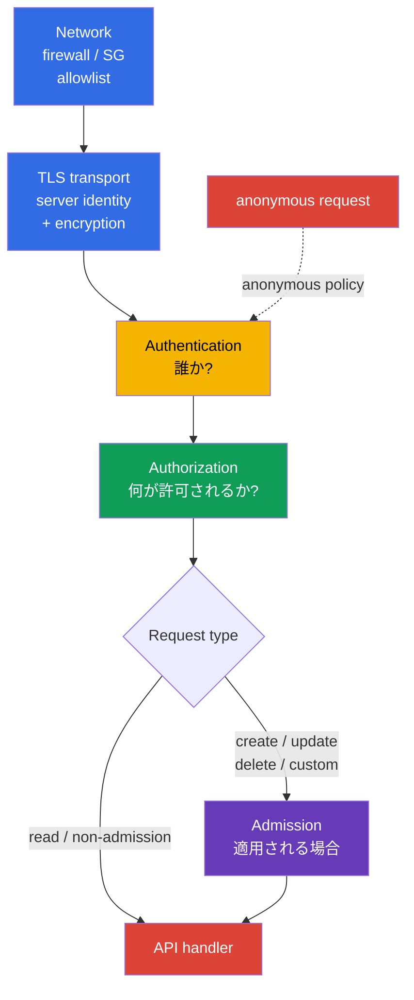
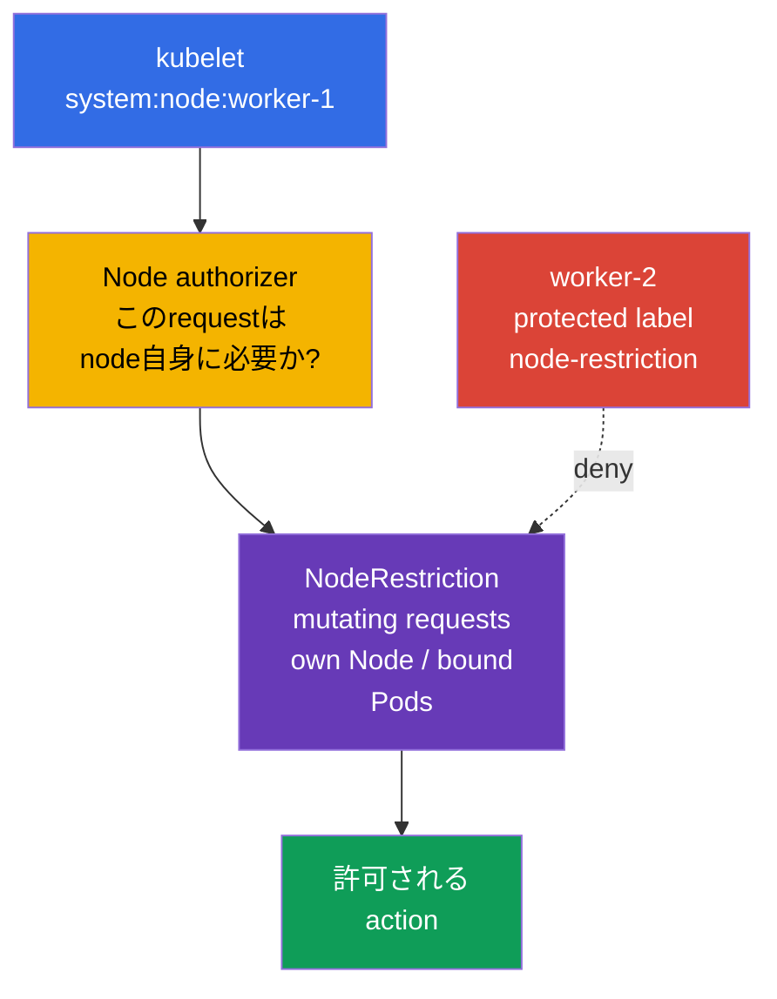
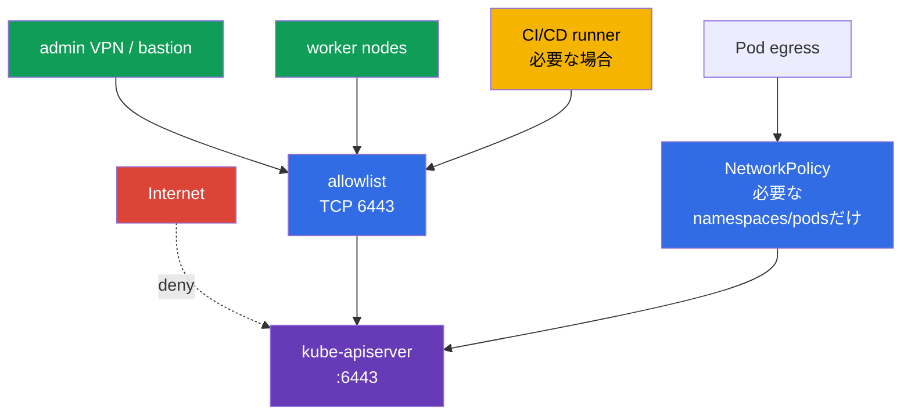

[Русская версия](ru.md) · [Eng version](README.md) · [Versión en español](es.md) · [Version française](fr.md) · [Deutsche Version](de.md) · [ქართული ვერსია](ge.md) · [繁體中文版](tw.md)

# 第12章. Kubernetes APIへのaccessを制限する

> **問題。** 不要なnetworkから到達できるAPI endpoint、anonymous request、または`system:unauthenticated`の古いbindingにより、攻撃者は通常のclient boundaryを迂回できます。network perimeter、TLS、apiserver configurationのerrorは、信頼性の高いidentity検証なしの一つのrequestをcluster dataとcontrolへのaccessに変えます。

> **次に行うこと。** 第11章で不要なServiceAccount tokenを取り除きました。次は、それらのtokenや他のcredentialが呼び出す接点、Kubernetes API自体を閉じます。`kube-apiserver`、kubelet、network perimeterのerrorは、unauthenticated request一つをdataとcluster controlへのpathに変えます。これはCKSの**Cluster Hardening** domain（15%）です。誰がAPIへ到達できるか、authentication後にどのidentityになるか、何ができるかを制限します。

> **CKAから必要なこと。** 基本的なauthn -> authz -> admission pathとServiceAccountは[CKA第21章](../../../cka/course/21/jp.md)、kubeconfig、client TLS certificates、CSRは[CKA第39章](../../../cka/course/39/jp.md)で扱います。ここではこれらのmechanismsを繰り返さず、API hardeningに適用します。

> 🧠 Network、TLS、authentication、authorizationは独立した順番のbarriersです。admissionは適用対象のrequestに追加されます。timeout/refused、`401`、`403`は異なるlayersを示します。

## 12.1. API request path: 複数の独立したbarriers

`kube-apiserver`はcluster stateをcontrolする唯一のpointです。`kubectl`、controllers、kubelet、operators、ServiceAccountを使うapplicationsはすべてそこを通ります。そのためprotectionは一つのRBAC ruleに還元されません。requestをできるだけ早期に止めつつ、後続のchecksも残します。



- **Network**はsourceが`6443`へTCP connectionを確立できるかを決めます。最初で最も低costなbarrierですが、identityとRBACの代わりにはなりません。
- **TLS transport**はconnectionのconfidentialityとintegrityを保護し、clientがAPI server identityを検証できるようにします。server-side TLSだけはclient allowlistではありません。X.509 client-certificate authenticationでは、TLSがclient certificateをrequest・受信し、そのprivate keyのpossessionを証明します。その後**Authentication** layerのKubernetes X.509 authenticatorがconfigured client CAに対してcertificateを検証し、identityをuser/groupsに変換します。
- **Authentication**はcertificate、bearer token、その他credentialをsubjectに対応付けます。anonymous accessが有効なら、credentialのないrequestはuser `system:anonymous`とgroup `system:unauthenticated`になります。currentの`AuthenticationConfiguration`では、anonymous accessを**正確なHTTP paths**の明示的allowlistで制限できます。よく使うpathは`/livez`、`/readyz`、必要なら`/healthz`です。kubeadm public token discoveryには、`/api/v1/namespaces/kube-public/configmaps/cluster-info`を明示的に許可する必要がある場合があります。他のpathsはanonymous identityを受けません。
- **Authorization**は許可されるverb、resource、scopeを確認します。通常のkubeadm clusterでは`Node,RBAC`です。
- **Admission**はauthorization後、admission controlが適用されるrequests、主にcreate/delete/modifyと一部custom verbsだけで機能します。objectの`get`、`list`、`watch`はadmission layerを通りません。admissionはobjectを変更またはrequestをrejectできます。ここで`NodeRestriction`はkubelet identitiesからの許可される**changes**を制限します。

investigationでは順序が重要です。`401 Unauthorized`はrequestがAuthenticationを通過しなかったことを意味します。`403 Forbidden`はsubjectがすでに決まっていてrequestが禁止されたことを意味するので、まずAuthorizationを確認します。mutating/custom requestsでは後のAdmissionでもrejectされ得ますが、admissionは通常の`get/list/watch`に関与しません。RoleBindingを作って`401`を直そうとしないでください。

## 12.2. Anonymous access、legacy ports、古いRBAC bindings

### `system:anonymous`が危険な理由

Anonymous accessはlegacy health checkのため、または慣習で残されることがあります。anonymous subject自体は何も許可しませんが、`system:anonymous`または`system:unauthenticated`への一つの誤った`RoleBinding`または`ClusterRoleBinding`が、key、certificate、tokenなしにAPIを利用可能にします。まずentryを閉じ、次に既存のpermissionsを削除してください。現在anonymous accessが無効でも、危険なbindingが永遠に安全になるわけではありません。

標準kubeadmでは、完全な`--anonymous-auth=false`をuniversal baselineと考えられません。health probesがcredentialsなしで`/livez`と`/readyz`を呼ぶため、globalにanonymousを禁止すると`401`となりAPI serverをrestartし得ます。このclusterのprimary optionは、`--authentication-config`で接続するstableな`AuthenticationConfiguration`です。そこに置くconditionsは**正確な**pathsのallowlistです。permissiveなRBAC bindingがあっても、他のpathはanonymousになりません。これはtoken-basedの`kubeadm join`にも影響します。APIをtrustする前にclientはunauthenticatedで`/api/v1/namespaces/kube-public/configmaps/cluster-info`を読みます。検証済みの二つのoptionsから一つを選んでください。public token discovery中はこの正確なpathを追加するか、public discoveryを無効にしてfile/HTTPS discoveryを使います。このpathのないhealth-only allowlistは通常のtoken-based joinと互換性がありません。`/healthz`はhealth checkが実際に使う場合だけ追加します。各exceptionにはroutes、network access、anonymous subject permissionsの個別reviewが必要です。

kubeadm control planeでは`kube-apiserver`は通常static Podです。node-console accessと保存済みrollback pathを用意し、control plane上でactive manifestをlocalに編集します。backup YAMLを`/etc/kubernetes/manifests/`にコピーしないでください。kubeletがそれを別のstatic Podとして扱う可能性があります。

```bash
# control plane上: static Pod manifest directoryの外にcopyを保存する。
sudo install -d -m 700 /root/k8s-manifest-backup
sudo cp /etc/kubernetes/manifests/kube-apiserver.yaml \
  /root/k8s-manifest-backup/kube-apiserver.yaml

# static Pod manifest directoryの外にauthentication configurationを作成する。
# kubeadm joinがpublic token discoveryを使う場合、正確なcluster-info pathを残す。
sudo install -d -m 700 /etc/kubernetes/authentication
sudo tee /etc/kubernetes/authentication/apiserver-authentication.yaml >/dev/null <<'EOF'
apiVersion: apiserver.config.k8s.io/v1
kind: AuthenticationConfiguration
anonymous:
  enabled: true
  conditions:
  - path: /livez
  - path: /readyz
  - path: /api/v1/namespaces/kube-public/configmaps/cluster-info
EOF
sudo chmod 0600 /etc/kubernetes/authentication/apiserver-authentication.yaml

# 既存のauthn flagsを探す。conflicting duplicatesがあってはならない。
sudo grep -nE -- '--(anonymous-auth|authentication-config)' \
  /etc/kubernetes/manifests/kube-apiserver.yaml || true
sudoedit /etc/kubernetes/manifests/kube-apiserver.yaml
```

`spec.containers[].command`にはfile pathを一つだけ指定し、同時に`--anonymous-auth`を設定しないでください。このconfiguration methodsはmutually exclusiveです。

```yaml
- --authentication-config=/etc/kubernetes/authentication/apiserver-authentication.yaml
```

flag一つでは不十分です。fileはhost上にあり、static Podへ明示的にmountする必要があります。既存のkube-apiserver volumesを削除せず、`hostPath` volumeとread-only `volumeMount`を追加してください。

```yaml
# 既存kube-apiserver volumeMountsに追加する:
volumeMounts:
- name: authentication-config
  mountPath: /etc/kubernetes/authentication/apiserver-authentication.yaml
  readOnly: true

# 既存Pod volumesに追加する:
volumes:
- name: authentication-config
  hostPath:
    path: /etc/kubernetes/authentication/apiserver-authentication.yaml
    type: File
```

変更後、containerが実際にfileを見られること、API serverがrecoverしたこと、`/readyz`が成功することを確認します。`hostPath`はlocal node pathです。HA control planeでは**すべての**control-plane nodeに同じfileを作成してmountします。そうしなければ、そのapiserverはfileをmountできずstartしません。

手動のstatic-Pod editingは特定labまたはemergency taskには適しますが、kubeadm clusterの唯一のsource of truthのままにしてはいけません。permanent configurationでは、`apiServer.extraArgs`と`apiServer.extraVolumes`などでparameterとmountを`ClusterConfiguration`へ移すか、managed kubeadm patchesを使います。そうしないと`kubeadm upgrade`がこのsettingなしにmanifestをregenerateする可能性があります。

```yaml
apiVersion: kubeadm.k8s.io/v1beta4
kind: ClusterConfiguration
apiServer:
  extraArgs:
  - name: authentication-config
    value: /etc/kubernetes/authentication/apiserver-authentication.yaml
  extraVolumes:
  - name: authentication-config
    hostPath: /etc/kubernetes/authentication/apiserver-authentication.yaml
    mountPath: /etc/kubernetes/authentication/apiserver-authentication.yaml
    readOnly: true
    pathType: File
```

`--anonymous-auth=false`による完全無効化は、kubeadm health probesをauthenticatedなものへ先に変更するか、別のtested mechanismを使用し、bootstrap dependenciesを確認した後だけ許容されます。save後にkubeletはstatic Podをrecreateします。manifestはdesired sourceであり、すでにrunしているapiserverのargvの証明ではありません。すべてのcontrol-plane componentsを同時にrestartせず、APIがrecoverするまでSSH sessionを終えないでください。

```bash
# Desired configuration。manifest単独はactive runtimeを証明しない。
sudo grep -n -- '--authentication-config=' \
  /etc/kubernetes/manifests/kube-apiserver.yaml
watch -n 2 'sudo crictl ps --name kube-apiserver'

# container PIDが見えるLinux hostでは、running processに対してargvとfile visibilityを
# 個別に証明する。runtime/PID namespaceがこれを許さない場合は、manifestだけから結論を
# 出さず、そのequivalent inspect verificationを使う。
APISERVER_PID="$(pgrep -xo kube-apiserver)" || {
  echo 'ERROR: running kube-apiserver process not found' >&2
  exit 2
}
AUTH_CONFIG_ARG='--authentication-config=/etc/kubernetes/authentication/apiserver-authentication.yaml'
AUTH_CONFIG_PATH='/etc/kubernetes/authentication/apiserver-authentication.yaml'

if ! sudo cat "/proc/${APISERVER_PID}/cmdline" \
    | tr '\0' '\n' \
    | grep -Fxq -- "$AUTH_CONFIG_ARG"
then
  echo "ERROR: active kube-apiserver argv does not contain ${AUTH_CONFIG_ARG}" >&2
  exit 1
fi

if ! sudo test -e "/proc/${APISERVER_PID}/root${AUTH_CONFIG_PATH}"; then
  echo "ERROR: ${AUTH_CONFIG_PATH} is not visible in kube-apiserver mount namespace" >&2
  exit 1
fi

echo 'OK: active kube-apiserver uses the expected authentication config path'

# API readinessはdesired configurationとargvとは別に確認する。
kubectl get --raw='/readyz?verbose'
kubectl get nodes
```

Kubeletは各node上の二番目のHTTP APIです。別途protectします。anonymous authenticationとlegacy read-only APIを無効にします。`/var/lib/kubelet/config.yaml`をuniversal sourceとみなしてはいけません。kubeletは`--config`、`--config-dir`、argumentsをunit、drop-in、environment fileから受け取ることがあります。まずactual startup sourcesを確定し、その後にactive `KubeletConfiguration`を確認します。authorized accessがあれば`/configz`とも比較できます。

```bash
sudo systemctl cat kubelet
sudo systemctl show kubelet -p ExecStart --value
KUBELET_PID=$(pgrep -xo kubelet) || { echo 'kubelet process not found' >&2; exit 2; }
sudo tr '\0' '\n' < "/proc/$KUBELET_PID/cmdline" \
  | grep -E -- '^--config(=|$)|^--config-dir(=|$)|^--(read-only-port|anonymous-auth|authorization-mode)(=|$)' || true
# 実際のfileを確定後の例: sudo grep -nE 'readOnlyPort|anonymous:|authorization:' <active-kubelet-config>
```

```yaml
# active KubeletConfiguration内。pathはstartup configurationにより決まる。
readOnlyPort: 0
authentication:
  anonymous:
    enabled: false
authorization:
  mode: Webhook
```

特定installationがflagsでkubeletをmanageする場合のequivalentsです。

```text
--read-only-port=0
--anonymous-auth=false
--authorization-mode=Webhook
```

`10255`はhistoricalなread-only、unauthenticated kubelet portであり、無効にします。`10250`の通常kubelet APIを「全員にopen」にしてはいけません。authentication、`Webhook` authorization、network rulesでprotectしたままにします。modern Kubernetesではlegacy kube-apiserver `--insecure-port`は削除されています。しかしこれは古いmanifests、images、documentationを無視する理由にはなりません。compatibilityのために有効化するものではなく、unsupportedまたはinsecure configurationのindicatorとして探してください。

```bash
# 各nodeで実行する。ss errorはcheck errorであり、closed portの確認ではない。
listeners=$(sudo ss -H -lnt '( sport = :10255 )') || {
  echo 'ERROR: cannot inspect TCP listener 10255' >&2; exit 2;
}
if [ -n "$listeners" ]; then
  printf 'ERROR: kubelet read-only port 10255 is listening:\n%s\n' "$listeners" >&2
  exit 1
fi
echo 'OK: kubelet read-only port 10255 is closed'

# 10250はfirewallと合わせて確認する。exact socket filterにより別portとのmatchを避ける。
sudo ss -H -lntp '( sport = :10250 )'
```

> 🎯 secure authentication configurationを設定し、`system:anonymous`/`system:unauthenticated`のbindingsを削除します。legacy `10255`と`--insecure-port`を無効にしますが、protectされた`10250`は公開しません。

### Bindingのinventoryとcleanup

名前だけで`ClusterRole`を無作為に削除しないでください。一つのroleが別subjectに必要な場合があります。`subjects`にanonymous userまたはそのgroupが実際に指定されたbindingsを見つけ、assigned roleを確認してから不要なbindingだけを削除します。

```bash
# anonymous userまたはunauthenticated groupに直接permissionsを与えるClusterRoleBinding objects。
kubectl get clusterrolebinding -o json | jq -r '
  .items[]
  | select(any(.subjects[]?;
      (.kind == "User" and .name == "system:anonymous") or
      (.kind == "Group" and .name == "system:unauthenticated")))
  | [.metadata.name, .roleRef.kind, .roleRef.name] | @tsv'

# namespace-scoped RoleBinding objectsについても同様。
kubectl get rolebinding -A -o json | jq -r '
  .items[]
  | select(any(.subjects[]?;
      (.kind == "User" and .name == "system:anonymous") or
      (.kind == "Group" and .name == "system:unauthenticated")))
  | [.metadata.namespace, .metadata.name, .roleRef.kind, .roleRef.name] | @tsv'
```

subjectが一致するだけでbindingを削除しないでください。特に`system:public-info-viewer`は、non-sensitive public informationに対する`system:unauthenticated`向けのstandard default ClusterRoleBindingです。RBACが有効なら、standard bindingsから欠けたsubjectsはAPI start後にauto-reconciliationでrestoreされる場合があります。またkubeadm token discoveryは、`kube-public/cluster-info`を読むためにRoleBinding `kubeadm:bootstrap-signer-clusterinfo`を使います。最初にroleと対応するdiscovery workflowが必要かを確認し、customまたは本当にexcessiveなbindingだけを削除してください。

review後のtargeted deletionは次のようになります。

```bash
REVIEWED_CLUSTERROLEBINDING='reviewed-clusterrolebinding'
NAMESPACE='reviewed-namespace'
REVIEWED_ROLEBINDING='reviewed-rolebinding'
kubectl delete clusterrolebinding "$REVIEWED_CLUSTERROLEBINDING"
kubectl delete rolebinding -n "$NAMESPACE" "$REVIEWED_ROLEBINDING"
```

`system:unauthenticated` groupにpermissionsを与えるすべてのbindingも確認してください。anonymous accessを無効にすると通常のpathは閉じますが、将来のidentity-provider changes後もpolicyがminimalで理解可能なままである必要があります。

## 12.3. Authorization modesとNodeRestriction

`--authorization-mode`はauthorization modulesのordered chainを定義します。各moduleは`Allow`、`Deny`、`NoOpinion`を返します。`Allow`**または**`Deny`はchainを直ちにterminateし、`NoOpinion`だけがrequestを次moduleへ渡します。すべてのmodulesが`NoOpinion`を返せばrequestはdenyされます。したがってorderは重要です。到達可能なchain部分の`AlwaysAllow`は、そこへ到達するrequestsに対するleast privilegeを無効にします。

| Mode | 目的 | hardeningの判断 |
|---|---|---|
| `Node` | kubelet identity `system:node:<node>`からのrequestsを処理する | 通常のkubeadm clusterでは`RBAC`の前に有効化する |
| `RBAC` | users、groups、ServiceAccountに対するRole、ClusterRole、bindingsを確認する | administratorsとworkloadsのprimary authorizer |
| `Webhook` | external authorization webhookへ問い合わせる | availableかつtestedなexternal serviceがある場合だけ使う |
| `ABAC` | local policy fileのrules | legacy option。auditが難しいためnew clustersでは避ける |
| `AlwaysAllow` | すべてを許可する | productionでは決して使わない |

structured `AuthorizationConfiguration`はKubernetes v1.32からstableで、`--authorization-config`で設定します。**一つ**のapproachを選びます。このfileはCLIの`--authorization-mode`および`--authorization-webhook-*`と組み合わせられず、混在すると`kube-apiserver`はerrorでexitします。parametersと複数webhook authorizersが必要な場合には有用ですが、control-plane changeとしてmigrationをplan・testし、二つ目のparallel configuration sourceを追加するものではありません。

static-Pod manifest内のdesired argumentを確認し、cluster architectureに適する場合はsecure base chainを設定します。kubelet reconciliation後、§12.2と同様にrunning processのargvを別途確認してください。manifest lineだけではactive configurationを証明しません。

```bash
sudo grep -n -- '--authorization-mode' /etc/kubernetes/manifests/kube-apiserver.yaml
```

```yaml
- --authorization-mode=Node,RBAC
```

`Node` authorizerは「すべてのnodeをtrustする」ためでなく、special kubelet API operationsのために必要です。示したkubeadm baseline `Node,RBAC`では、他のidentitiesはRBACでauthorizeされます。意図的に異なるarchitectureでは、例えばWebhookを含められます。重要なのは、他のすべてのrequestsにfail-closed authorization policyがあり、`AlwaysAllow`をfallbackにしないことです。bootstrap controllers、identity provider、current API clientsを確認せず、running clusterのmodesを変更しないでください。

> 🎯 kubeadm baseline: `AlwaysAllow`なしの`Node,RBAC`。`Node`はkubeletに対応し、RBACは他のidentitiesを制限し、`NodeRestriction`はnode credentialsによる許可されるmutating requestsを制限します。

**NodeRestriction**は`Node` authorizerを補完するvalidating admission pluginです。`Node` authorizerはkubelet API permissionsとrelation-sensitive readsを決めます。続いて`NodeRestriction`が許可される**changes**を制限します。kubeletは自身の`Node`とそのnodeにbindされた`Pod`だけをmodifyでき、allowed modelの外にあるprotected Node labels/taintsは変更できません。read requestsはadmissionを通らないため、そのscopeはauthorizerが決めます。



kubeadmでは`NodeRestriction`は通常additional admission pluginとして有効です。最初に`--enable-admission-plugins`と`--disable-admission-plugins`の両方を確認してください。

```bash
sudo grep -nE -- '--(enable|disable)-admission-plugins' \
  /etc/kubernetes/manifests/kube-apiserver.yaml
sudo crictl ps --name kube-apiserver
```

Kubernetes v1.36では、`--enable-admission-plugins`はpluginsをbuilt-in default-enabled setへ追加します。defaultsをこのflagに列挙する必要はありません。`NodeRestriction`が有効でなければ、explicit additional listへ追加します。`--enable-admission-plugins`に他のadditional pluginsがすでにある場合は保持します。必要なdefaultまたはpluginが`--disable-admission-plugins`で無効にされていないことも別途確認します。RBACはusers、groups、ServiceAccountの一般的なrole/binding-based permissionsをcontrolし、`Node` authorizerはnode identitiesのspecial permissionsを扱います。`NodeRestriction`はこれらを置き換えません。kubeletのmutating requestsにadmission restrictionsを追加します。併せてfeature gate `ServiceAccountNodeAudienceRestriction`も考慮してください。有効な場合、NodeRestrictionはkubeletが`TokenRequest`を通じてServiceAccount tokensをrequestできるaudiencesを、そのnodeのPodがすでに使うaudiences、またはRBACで明示的に許可されたaudiencesに制限します。これはNodeRestrictionの置き換えではなく、node-originated token requestsへの追加restrictionです。

> 🎯 `:6443`はprivate endpointまたは正確なCIDR allowlistに制限します。Podについては別途egress policyを確認してください。

## 12.4. apiserver accessのnetwork制限

TLSとRBACが正しくても、public API endpointはattack surfaceを広げます。`:6443`により攻撃者はcredentialsを試し、将来のvulnerabilityを利用し、errorsから情報を得られます。private endpointは強力で多くの場合望ましいoptionですが、universalな絶対解ではありません。厳格なnetwork restrictions（狭いCIDR allowlist、architectureに応じたfirewall/WAF）とstrong authenticationがあればpublic endpointも正当化できます。どの場合も`:6443`は必要かつ確認済みのsource paths、すなわちadministrative network/VPN、control plane、kubelet/worker traffic、承認済みautomation endpoints、実際にAPIを必要とするin-cluster workloadsだけに許可します。workload trafficが常にendpointからworker-node addressとして見えると仮定せず、CNI/cloud datapathとSNAT/routing後のsource addressを確定してください。



責任範囲ごとにbarriersを適用します。

- **Cloud Security Group / firewall**: `TCP/6443`を実際に必要なsource ranges/identities、すなわちcontrol plane、kubelet/worker path、VPN/bastion、automation、topologyが必要とする場合のauthorized Pod workloadsのaddresses/CIDRsだけに許可します。Pod CIDR全体を自動で追加しません。まずCNI/cloud routingとSNAT後にAPI endpointが実際に見るsourceを確定します。`0.0.0.0/0`は設定せず、private clusterではprivate endpointまたはtunnelを使います。
- **Host firewall**（self-managed control planeの`nftables`、`iptables`、`ufw`）: cloud firewallが誤って広げられた場合にもsourcesを制限するようnetwork perimeterを重ねます。
- **NetworkPolicy**: `kubernetes.default.svc`はlogical Service nameであり、standard NetworkPolicyはdestination Serviceをnameで選択しません。APIへのegress制限は、actual datapathを検証した`ipBlock`/endpoint CIDR、またはCNI-specific entity、FQDN、Service policyで構築します。`ipBlock`をCNI間で盲目的に移植しないでください。Service DNATはpolicyの前後どちらでも起こり得てuniversal semanticsがありません。APIを本当に必要とするnamespaceとworkloadだけに許可し、Pod compromise後のlateral movementを減らします。
- **RoutingとDNS**: control-plane endpointが、選んだaccess modelに必要な方法でのみpublished・resolvedされることを確認します。private endpointはしばしばこれを単純化しますが、public endpointではsource controlとauthenticationを特に厳しくする必要があります。

**kubeadm discoveryは別caseです。** token-based discoveryでは、ConfigMap `kube-public/cluster-info`はdefaultでpublicly accessible discovery information（API addressとCA data）を含みます。これはSecretではなく、Secretのように発行・保護すべきものではありません。一方bootstrap tokenはdiscovery/TLS bootstrap用のtemporary credentialであり、limited distribution、short lifetime、revocation、CSR/auto-approval reviewという別のcontrolが必要です。`AuthenticationConfiguration`でanonymousを制限する場合、RBAC bindingだけでは不十分です。exact path `/api/v1/namespaces/kube-public/configmaps/cluster-info`も`anonymous.conditions`に置く必要があり、そうしなければrequestはanonymous identityを得られずtoken discoveryが壊れます。必要なら`cluster-info`へのpublic accessを無効にするか、適切なtrust channelを持つfile/HTTPS discoveryを使います。public informationのprotectionとtokenのprotectionを混同しないでください。

NetworkPolicyはSecurity Groupやhost firewallを置き換えません。CNIがPod trafficに適用するもので、host、external、control-plane trafficを各topologyで同じようにcoverするとは限りません。managed Kubernetesではendpointとfirewallの一部をproviderが所有します。その場合、存在しないstatic Podを編集しようとせず、providerのprivate/public endpoint、allowed CIDRs、個別control-plane security rulesを確認します。

firewallを変更する前にcurrent listenersとruleを記録し、rollback用のseparate console sessionを維持してください。administratorまたはkubeletからの`6443`をblockするとclusterにアクセスできなくなります。

```bash
# control planeで実行: APIをlistenするもの。specific programはruntimeに依存する。
sudo ss -lntp | grep ':6443'

# administrative machineから: productionでTLS verificationを無効にせずendpointを確認する。
kubectl cluster-info
kubectl get --raw='/livez?verbose'
```

> 🔬 local accessの補助手段である`kubectl proxy`と`port-forward`はoperatorのkubeconfig permissionsを使い、追加のdiagnostic surfaceを作ります。

## 12.4.1. local API gateways: `kubectl proxy`と`port-forward`

`kubectl proxy`と`kubectl port-forward`はuserのkubeconfig permissionsを使うのであり、新しいrestricted identityを作るものではありません。defaultで`kubectl proxy`は`127.0.0.1`をlistenし、riskをlocal machineに制限します。必要なく`--address`を広げないでください。広い`--accept-hosts`、特に`--disable-filter`はproxyをoperator permissionsでAPIへ接続する他clients向けgatewayに変える可能性があります。同様に、secured networkを通じた短時間で個別承認済みのconnectionが必要な場合以外、`kubectl port-forward --address 0.0.0.0`を使わないでください。diagnosis後にtemporary tunnelを終了し、firewall、RBAC、NetworkPolicyの代わりと考えないでください。

> 🎯 active config、安全なflags、reload後のreadiness、anonymous pathに対する`401`、`no`となるtargeted `can-i`を確認します。static Podはkubeletとruntimeで診断します。

## 12.5. Profiling、ServiceAccount lookup、flagsのaudit

profiling endpointsはperformance diagnosticsに必要ですが、不要ならprocess information disclosure surfaceを広げます。`kube-apiserver`ではprofilingを無効化し、同じ作業でcontroller-managerとschedulerも確認します。三componentsすべての詳細なCIS checkは[第07章](../07/jp.md)、insecure argumentsとTLS hardeningは[第09章](../09/jp.md)で扱います。

```yaml
# kube-apiserver static Podのcommand内
- --profiling=false
```

```bash
for component in kube-apiserver kube-controller-manager kube-scheduler; do
  sudo grep -n -- '--profiling' "/etc/kubernetes/manifests/${component}.yaml" || true
done
```

`--service-account-lookup`はlegacy ServiceAccount tokenのauthentication時にServiceAccountのexistenceを確認します。`false`はAPI-based revocationを無効にします。削除済みServiceAccountまたは削除済みlegacy tokenは、このcheckにより発行済みtokenをrevokeしなくなります。これはlegacy tokensにshort TTLを設定または保証するmechanism**ではありません**。lifetimeはissuance methodとtoken claimsで決まります。明示的な判断なしにlookupを無効にしません。modern clusterでは第11章のbound short-lived projected tokensを優先し、flagの存在とbehaviorをversionの`kube-apiserver --help`およびdocumentationで確認します。

一つのflagだけでなくrisk setとしてconfigurationを確認します。schedulerではまず`--config`の有無を確認してください。ある場合deprecatedの`--profiling`は無視されるため、見つけたactive `KubeSchedulerConfiguration`で`enableProfiling: false`を設定します。

```bash
sudo grep -nE -- \
  '--(anonymous-auth|authorization-mode|enable-admission-plugins|profiling|service-account-lookup|insecure-port|secure-port)' \
  /etc/kubernetes/manifests/kube-apiserver.yaml
sudo grep -n -- '--config' /etc/kubernetes/manifests/kube-scheduler.yaml
# 指定された--configの場合: sudo grep -n 'enableProfiling:' <active-scheduler-config>

# Kubelet: まずunitと/proc/<kubelet-pid>/cmdlineでactual --config/--config-dirを見つけ、
# 次に見つけたactive KubeletConfigurationを確認する。
```

| Finding | 危険な理由 | 安全な方向 |
|---|---|---|
| broad anonymous access | credentialなしのrequestが`system:anonymous`になる。selective configではexact allowed pathsだけが例外 | minimalなexact paths allowlistを持つ`AuthenticationConfiguration`、またはprobes/bootstrappingと互換なら`--anonymous-auth=false`。bindingsをcleanupする |
| `--authorization-mode=AlwaysAllow` | authenticatedまたはanonymous subjectがauthzを通過する | `Node,RBAC`または意図的なWebhook integration |
| `NodeRestriction`がない | compromised kubeletにより広いAPI pathを与える | existing defaultsを保ってpluginを有効化する |
| 不要なprofiling有効 | 余分なdiagnostic endpoints | apiserver/controller-managerでは`--profiling=false`。`--config`付きschedulerではactive `KubeSchedulerConfiguration`に`enableProfiling: false` |
| `readOnlyPort`が`0`以外 | authenticationなしのlegacy kubelet API | `readOnlyPort: 0` |
| public `6443` | credential attacksとAPI vulnerabilitiesへのsurface増大 | private endpoint、またはstrict CIDR allowlist、firewall、strong authentication |

static Podを編集後、YAMLのlineだけを確認しないでください。kubeletがnew containerをstartし、APIがReadyになる必要があります。YAML errorまたはunsupported flagの場合は、local console、`journalctl -u kubelet`、`crictl ps -a`、保存したmanifest copyを使います。

## 12.6. Verification: entryが閉じていることを証明する

verificationは二つのindependent layersで行います。credentialなしのauthenticationと、explicit subjectに対するauthorizationです。APIへのTCP accessが許されるnetworkから確認してください。firewall timeoutとAPI `401`は異なりますが、それぞれのlayerで有用なresultです。

```bash
# current kubeconfigからserver URLを取得し、certificate、key、tokenをcurlへ渡さない。
APISERVER=$(kubectl config view --minify \
  -o jsonpath='{.clusters[0].cluster.server}')
printf '%s\n' "$APISERVER"

# Protected path: `401`は/ versionがanonymous authnを通らないことを証明する。
# Lab testでは-kを使えるが、productionでは--cacertでCAを渡す。
curl -k -sS -o /dev/null -w '%{http_code}\n' "$APISERVER/version"

# selective configが意図的に/readyzを許可するなら、別途確認する。
# APIがReadyなら通常200を期待するが、/versionの401を否定するものではない。
curl -k -sS -o /dev/null -w '%{http_code}\n' "$APISERVER/readyz"
```

`/version`の`401`は、このprotected pathがanonymous requestをacceptしないことだけを示し、anonymous authenticatorがglobalに無効であることは証明しません。selective `AuthenticationConfiguration`では`/readyz`やdiscovery pathなどexact allowed pathsが意図的にcredentialなしで働く場合があります。connectionがtimeout/refusedなら、まずfirewall、Security Group、DNS、routeをdiagnoseしてください。Authentication configurationの証明ではありません。

cluster-admin permissionsで、impersonationによってauthorizerを別途確認します。

```bash
# 許可されてはならない。calling administratorにはimpersonate permissionが必要。
# complete anonymous identityにはuserとgroupの両方が含まれる。
kubectl auth can-i get pods --all-namespaces \
  --as=system:anonymous --as-group=system:unauthenticated
kubectl auth can-i list secrets --all-namespaces \
  --as=system:anonymous --as-group=system:unauthenticated

# Lab 104のminimal ServiceAccount permissionsを明示的に確認する。
kubectl auth can-i list pods -n cks-104 \
  --as=system:serviceaccount:cks-104:app-sa
kubectl auth can-i delete pods -n cks-104 \
  --as=system:serviceaccount:cks-104:app-sa
```

anonymous checksとforbidden `delete`には`no`を期待します。dedicated `app-sa`の`list pods`は指定namespaceでのみ`yes`を返すべきです。`kubectl auth can-i`はimpersonated identityのauthorizerを確認しますが、credentialなしのreal connectionを確立せず、anonymous authenticatorのstateを証明しません。commands、HTTP status、変更したconfig sourcesをchange recordに保存します。これはcontrolが単に表明されるだけでなくworkingであるevidenceです。

## 12.7. よくあるerrorsとdiagnosis

| Symptom | 想定原因 | 確認すること |
|---|---|---|
| 編集後にAPIがstartしない | YAMLが壊れた、flagがduplicateまたはunsupported | `journalctl -u kubelet`、`crictl ps -a`、保存済みmanifest copy |
| `curl`が401でなくtimeout | trafficがAPI前でcutされている | Security Group/firewall、DNS、route、port `6443` |
| anonymous `can-i`がunexpectedに`yes` | RoleBinding/ClusterRoleBindingが残っている | bindingsで`system:anonymous`と`system:unauthenticated`を検索 |
| kubeletがregisterしなくなった | firewallまたはAPI endpointに到達不能、kubelet config誤り | `journalctl -u kubelet`、`ss`、node routes、active kubelet args |
| NodeRestrictionがexpected effectを持たない | pluginがactiveでない、またはkubeletがnode identityを使っていない | apiserver flags、client certificate CN、admission configuration |
| PodがAPIへ到達しなくなった | egress policyがstrictすぎる/狭すぎる、allow-rule不足、datapath/CIDR/port誤り、またはServiceAccount tokenが意図的に無効 | accessの必要性、active NetworkPolicy/CNI policyとactual API datapath、`automountServiceAccountToken`、RBAC |

> 🏭 endpoint exposure、kubeadm/API configuration、RBAC cleanupをIaCに固定しbaselineと照合します。ownersはendpoint、CIDR、changes後のevidenceに責任を持ちます。

## 12.8. productionでの適用方法

- **複数layers、一つのbaseline。** probesとbootstrap dependenciesに互換な場所での`--anonymous-auth=false`、または`AuthenticationConfiguration`のexact health/discovery pathsへの狭いconditions、`Node,RBAC`、`ServiceAccountNodeAudienceRestriction`を評価したNodeRestriction、closed kubelet read-only port、private/strictly allowlisted API endpointをkubeadm config、node image、IaCに記述します。manual static-Pod editはemergency taskには許容されますが、唯一のsource of truthではありません。
- **purposeごとのnetwork。** administratorsはVPN/bastion経由、CI/CDにはseparate egress addresses、worker/control planeには必要なrulesだけを与え、Pod-to-APIではactual datapath/sourceを別に記録してAPIを本当に必要とするworkloadsだけ許可します。public endpointはexplicit risk owner、strict source restriction、strong authenticationがある場合だけ許容されます。private endpointは強力ですが唯一のoptionではありません。
- **identity change後にpermissionsをreview。** `system:anonymous`、`system:unauthenticated`、obsolete users、ServiceAccountへのbindingsを定期的に検索し、unusedなものを削除して`kubectl auth can-i`をtestします。
- **observabilityでdiagnosticsを開かない。** metrics、audit、centralized logsは必要なvisibilityを与えます。profilingはtemporaryに、allowlistとdisable planを持って有効化します。
- **managed control planeはresponsibilityで分離。** providerのstatic Pod manifestは編集できませんが、endpoint exposure、allowed CIDRs、RBAC、admission-policy、node security groups、kubelet accessはcontrolできますし、controlすべきです。

## 12.9. ミニ用語集

- **anonymous authentication** - credentialなしのrequestを`system:anonymous`にmapすること。APIとkubeletでは通常無効化します。
- **`system:unauthenticated`** - anonymous subjectのgroup。このbindingも`system:anonymous`へのbindingと同様にreviewが必要です。
- **authorization mode** - `Node`、`RBAC`、`Webhook`などAPI serverのauthorizer。
- **Node authorizer** - kubelet identities専用のauthorizer。必要なnode operationsと、そのnodeのPodに関連するobjectsへのrelation-sensitive accessを許可します。
- **NodeRestriction** - kubeletによるNode/Podの許可可能なchangesとprotected Node labelsを制限するvalidating admission plugin。`ServiceAccountNodeAudienceRestriction`とともにnode-originated `TokenRequest`のaudiencesも制限します。
- **allowlist** - すべてを許可する代わりに、allowed sources、ports、destinationsを明示するlist。
- **read-only port** - `readOnlyPort: 0`/`--read-only-port=0`で無効化するobsolete unauthenticated kubelet API。
- **profiling** - process performance diagnostics endpoints。不要なら`--profiling=false`で無効化します。ただし`--config`付き`kube-scheduler`ではCLI flagはignoreされ、active `KubeSchedulerConfiguration`の`enableProfiling: false`が必要です。
- **static Pod** - kubeletがlocal manifestで管理するPod。kubeadmは通常この方法でcontrol-plane componentsをstartします。

## 12.10. 章のまとめ

- APIはnetwork、TLS、authentication、authorizationという複数のindependent layersでprotectします。mutatingとsupportされるcustom requestsにはadmissionも追加されます。
- kubeletではanonymous access（`--anonymous-auth=false`）を無効化します。kube-apiserverでは、`AuthenticationConfiguration`でhealth endpointsとpublic token discoveryが必要な間は正確な`kube-public/cluster-info` pathを明示的に制限するか、いずれの場合も`system:anonymous`と`system:unauthenticated`の不要なRoleBinding/ClusterRoleBindingだけを確認して削除します。
- legacy kubelet read-only portは`readOnlyPort: 0`で無効化します。`10250`はauthentication、`Webhook` authorization、network restriction付きだけにします。
- secureなkubeadm authorizer baselineは`Node,RBAC`です。`AlwaysAllow`はleast privilegeと両立しません。`Node` authorizerがkubelet API permissionsを定め、NodeRestrictionがそのmutating requestsにrestrictionsを追加します。
- API `:6443`にはprivate endpointを優先します。public endpointではstrict firewall/Security Group allowlistとstrong authenticationが必須です。どの場合もPod egressへのtargeted NetworkPolicyがlateral movementを減らします。
- `--profiling=false`、legacy tokenのAPI revocation用にenabledなServiceAccount lookup、flagsのauditはsurfaceを減らします。short TTLは`--service-account-lookup=false`でなくbound projected tokensが提供します。
- resultは別々に証明します。`/version`などprotected pathへのanonymous `curl`はAPI `401`を返すべきで、intentionally allowed health/discovery pathは別途確認します。`kubectl auth can-i --as=system:anonymous --as-group=system:unauthenticated`はimpersonated identityのauthorizerを確認し、forbidden actionには`no`を返すべきです。

## 12.11. これはどのように役立つか: 試験と実務

**試験で。** taskは通常control planeへのaccessを与え、anonymous APIを閉じるかdangerous bindingを取り除くよう求めます。active static-Pod manifestを見つけ、`/etc/kubernetes/manifests/`の外にcopyを保存し、必要なflag一つを修正して、APIのrecreationを待ち`/readyz`を確認します。次にcredentialなしで`/version`などprotected pathへ`curl`を使います。selective configurationではintentionally allowed exact pathsを別に考慮します。`kubectl auth can-i --as=system:anonymous --as-group=system:unauthenticated`はimpersonated identityのauthorizerだけを確認します。file内のtext検索だけで済ませないでください。

**試験scenario: kubeadm clusterが`AlwaysAllow`で作成されている。** current contextはRBAC有効化後にpermissionsを持たないaccountを指しているかもしれず、kubeconfig（またはseparate kubeconfig）にはknown administrative accountがあります。変更前に**各command**で明示的にそれを選びます。original contextを失いfalse success resultを得ないよう`kubectl config use-context`を実行しません。

```bash
CURRENT_CONTEXT=$(kubectl config current-context)
kubectl config get-contexts
ADMIN_CONTEXT='kubernetes-admin@kubernetes'  # 一覧にある既知の admin context 名

# adminが別fileにある場合は、--kubeconfig=/path/to/admin.confも追加する。
kubectl --context="$ADMIN_CONTEXT" auth whoami
sudo grep -nE -- '--authorization(-mode|-config)' \
  /etc/kubernetes/manifests/kube-apiserver.yaml
sudo cp -a /etc/kubernetes/manifests/kube-apiserver.yaml \
  /root/kube-apiserver.yaml.before-authz
sudoedit /etc/kubernetes/manifests/kube-apiserver.yaml
```

manifestでは、他のargumentsを削除せず`--authorization-mode=AlwaysAllow`を`--authorization-mode=Node,RBAC`へreplaceします。`--authorization-config`が見つかった場合、同時に`--authorization-mode`を追加せず、schemaに従ってactive structured configurationを修正します。fix**前**の`can-i` checkはadmin accountがRBAC permissionsを持つことを証明しません。`AlwaysAllow`ではすべてのauthenticated subjectsにsuccessします。

```bash
# Kubeletがstatic Podをrecreateする。確認までcontrol planeへのaccessを終えない。
watch -n 2 'sudo crictl ps --name kube-apiserver'
kubectl --context="$ADMIN_CONTEXT" get --raw='/readyz?verbose'
kubectl --context="$ADMIN_CONTEXT" auth can-i get nodes

# このscenarioのcontextにはrequired RBAC bindingがない。"no"を期待する。
kubectl --context="$CURRENT_CONTEXT" auth can-i get nodes
```

real clusterではemergency recovery後にauthorizerをkubeadm configuration source（`kubeadm-config`/IaC）にも反映します。そうしないと後続の`kubeadm upgrade`がobsolete settingのmanifestを再生成する可能性があります。

**実務で。** API restrictionはone-time CIS fixでなくnetworkとidentity designの一部です。private endpointはstrong optionです。endpointがpublicならstrict allowlistとstrong authenticationで補います。short-lived bound tokens、minimal bindings、automatic configuration-drift checksにより、一つのnodeまたはPodのcompromiseの被害を大幅に小さくできます。

## 12.12. 自己確認問題

<details>
<summary>1. requestはnetwork perimeter、authn、authz、admissionをどの順で通過し、`401`と`403`は何を意味しますか?</summary>

最初にnetwork perimeterがconnection可能かを決め、次にTLSがtransportをprotectしてclientがAPI server identityをverifyできます。X.509 client authenticationではTLSがclient certificateを受け取り、Kubernetes client CAによるtrustとuser/groupsへのmappingはAuthentication段階でX.509 authenticatorが行います。次にAPIはAuthenticationとAuthorizationを実行し、request typeがadmission controlを通る場合はAdmissionが加わります。`401 Unauthorized`はcredentialがAuthenticationを通らなかったことです。`403 Forbidden`はidentityがすでに決まりrequestがprohibitedであることです。まずAuthorizationを確認し、mutating/custom requestsではAdmissionでrejectされることもあります。
</details>

<details>
<summary>2. `--anonymous-auth=false`の後も、なぜ`system:anonymous`と`system:unauthenticated`へのbindingsをreviewする必要がありますか?</summary>

anonymous authの無効化はこれらsubjectsへの現在の通常pathを閉じますが、dangerous bindingはhidden excessive permissionとして残ります。後でauthenticationまたはidentity providerが変更されれば、別reviewなしに再びaccessibleになる可能性があります。そのためRoleBindingとClusterRoleBindingでsubject `system:anonymous`とgroup `system:unauthenticated`を探し、不要なbindingだけを削除します。
</details>

<details>
<summary>3. `10255`と`10250`の違い、およびkubelet APIに必要なsettingsは何ですか?</summary>

`10255`はhistoricalなread-only unauthenticated kubelet APIで、`readOnlyPort: 0`または`--read-only-port=0`で無効にします。`10250`は通常のkubelet APIで、全員にopenしません。authentication、`Webhook` authorization、network rules/firewallが必要です。`10255`の無効化はconfiguration lineだけでなく`ss`で確認します。
</details>

<details>
<summary>4. `AlwaysAllow`を「予備」のmodeとして`RBAC`の隣に追加してはいけない理由は何ですか?</summary>

authorizer chainはmoduleがAllowまたはDenyを返すと直ちに停止し、NoOpinionだけがrequestを先へ渡します。`AlwaysAllow`は到達したrequestsにAllowを返し、そのchain部分のleast privilegeを無効にします。secureなkubeadm baselineはすべてを許すfallbackでなく`Node,RBAC`です。
</details>

<details>
<summary>5. NodeRestrictionと`ServiceAccountNodeAudienceRestriction`はkubelet credential compromiseの影響をどのように減らしますか?</summary>

`Node` authorizerがまずpermitted kubelet API operationsとrelation-based read accessを決めます。mutating requestsでは、NodeRestrictionがnode identityによる他のNode/Pod objectsとprotected Node labelsのarbitrary changesを防ぎます。`ServiceAccountNodeAudienceRestriction`が有効な場合、同じadmission pluginはkubeletが`TokenRequest`でrequestできるaudiencesを、そのnodeのPod objectsが使うものまたはRBACで個別に許可されたものに制限します。read requestsはNodeRestrictionを通らず、Node authorizer rulesで評価する必要があります。
</details>

<details>
<summary>6. API serverに対してNetworkPolicyがfirewallまたはSecurity Groupを置き換えない理由と、public endpointが正当化できるconditionsは何ですか?</summary>

NetworkPolicyはCNIがPod trafficへ適用するもので、host、external、control-plane trafficを同じようにcoverする必要はありません。standard policyはDNS nameでdestination Serviceを選びません。firewallとSecurity Groupは別layerで`:6443`へのsource accessを制限します。public endpointはexplicit reason、strict CIDR allowlist、strong authentication、network architectureの理解がある場合だけ正当化できます。private endpointの方がしばしば望ましい選択です。
</details>

<details>
<summary>7. API network reachabilityとanonymous authorizationの不在を別々に証明する二つのchecksは何ですか?</summary>

administrativeまたは他のallowed machineから、`kubectl cluster-info`または`kubectl get --raw='/livez?verbose'`でnetwork reachabilityとhealthを確認します。`/version`などprotected pathへcredentialなしの`curl`を行いAPI `401`を期待してAuthenticationを確認します。selective configurationでは、exact allowed health/discovery pathが意図的に`401`を返さないため別にtestします。`no`を期待する`kubectl auth can-i ... --as=system:anonymous --as-group=system:unauthenticated`はimpersonated identityのauthorizerだけを確認します。timeoutまたはrefusedはAuthenticationの証明ではなくnetworkとしてdiagnoseします。
</details>

<details>
<summary>8. **振り返り（第32章）。** 問7のone-time `curl`/`401`は、anonymous accessがないことを**確認時点**に限って証明します。Kubernetes audit logは**API requests**（誰が、いつ、どのresource、どのverb、どのresult）を記録しますが、`/etc/kubernetes/manifests/kube-apiserver.yaml`や`--anonymous-auth`のcontinuous monitoringではありません。第32章のaudit logはanonymous requestsについて何をretrospectively示せますか? また、logにanonymous eventがないことは、二つのchecksの間ずっとconfigurationが変わらなかったことをなぜ**証明しませんか**? audit logだけでは得られないcontinuous assuranceには、periodic checks、file integrity monitoring、GitOps drift detectionなどどのadditional mechanismsが必要ですか?</summary>

audit logはanonymous identityによる完了済みAPI requests、すなわち発生時刻、呼び出したresourceとverb、resultをretrospectively示します。このeventsがないことは`--anonymous-auth`が不変だった証明ではありません。flagが短時間有効化されても、その時にanonymous requestがなかったかもしれません。continuous assuranceには、API callsのauditを補うperiodic configuration checks、manifestのfile integrity monitoring、GitOps/drift detectionが必要です。
</details>

## 練習

Lab 104ではminimal Roleを持つServiceAccountを作成し、tokenのautomatic mountingを無効化し、excess RBAC bindingを削除して、`kube-apiserver`に`--anonymous-auth=false`を設定します。その後`check_result`が`auth can-i`とanonymous `curl`を確認します。

🧪 Lab 104（RBAC minimization、ServiceAccount tokens、API restriction）：
[tasks/cks/labs/104](../../labs/104/README_JP.MD)

🧪 Lab 114（kubeconfig contexts、client certificate の抽出、Service exposure の NodePort -> ClusterIP への縮小）：[tasks/cks/labs/114](../../labs/114/README_RU.MD)

🌐 追加のinteractive practice（killer.sh/killercoda、external resource）：[apiserver-crash](https://killercoda.com/killer-shell-cks/scenario/apiserver-crash) · [apiserver-misconfigured](https://killercoda.com/killer-shell-cks/scenario/apiserver-misconfigured) · [apiserver-node-restriction](https://killercoda.com/killer-shell-cks/scenario/apiserver-node-restriction)

## 参考資料

- [Kubernetes: authentication](https://kubernetes.io/docs/reference/access-authn-authz/authentication/)
- [Kubernetes: kubeadm](https://kubernetes.io/docs/setup/production-environment/tools/kubeadm/)

---
[目次](../README_JP.md) · [第11章](../11/jp.md) · [第13章](../13/jp.md)
