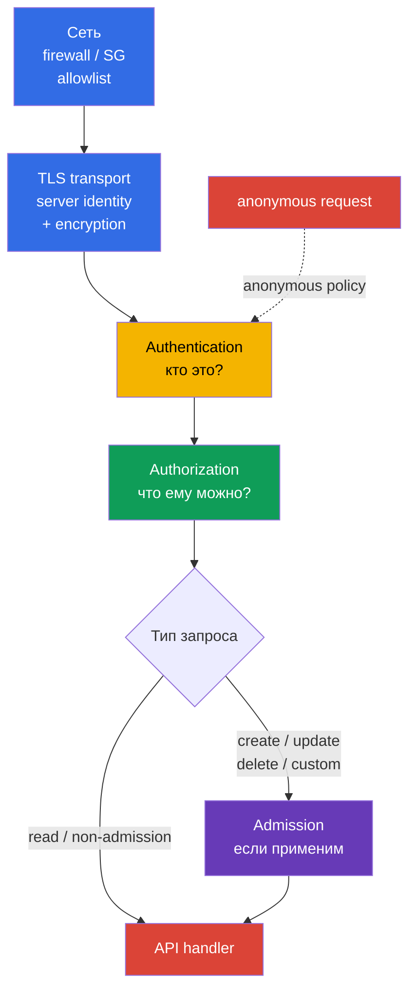
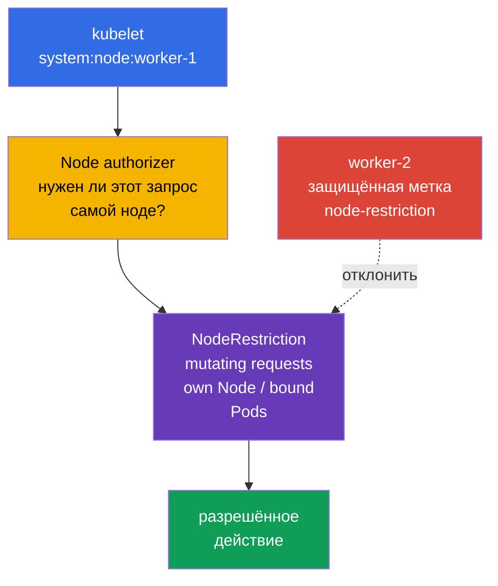
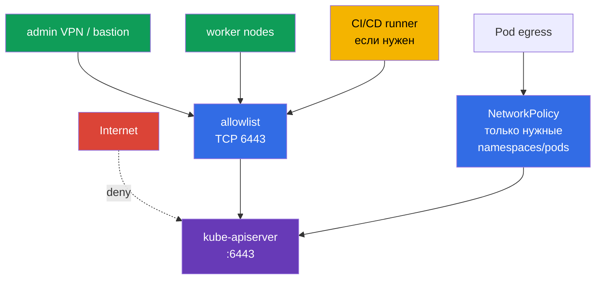

<!-- Standalone RU release: ссылки на переводы удалены, потому что соответствующие файлы не входят в архив. -->

# Глава 12. Ограничение доступа к Kubernetes API

> **Проблема.** Доступный из лишней сети API endpoint, anonymous-запрос или устаревшая
> binding для `system:unauthenticated` позволяют атакующему обойти границу обычного
> клиента. Ошибка в сетевом периметре, TLS или настройках apiserver превращает один
> запрос без надёжно проверенной identity в доступ к данным и управлению кластером.

> **Что дальше.** В главе 11 мы убрали лишние ServiceAccount-токены. Теперь закроем саму
> точку, к которой эти токены и другие учётные данные обращаются: Kubernetes API. Ошибка в
> `kube-apiserver`, kubelet или сетевом периметре превращает один неаутентифицированный
> запрос в путь к данным и управлению кластером. Это домен **Cluster Hardening** CKS (15%):
> ограничиваем, кто вообще может дойти до API, кем он станет после аутентификации и что
> сможет сделать.

> **Что нужно знать из CKA.** Базовый путь authn -> authz -> admission и ServiceAccount
> разобраны в [главе 21 CKA](../../../cka/course/21/ru.md); kubeconfig, клиентские TLS-
> сертификаты и CSR - в [главе 39 CKA](../../../cka/course/39/ru.md). Здесь не повторяем
> эти механизмы, а применяем их для hardening API.

> 🧠 Сеть, TLS, authentication и authorization — независимые последовательные барьеры;
> admission добавляется для запросов, к которым он применим. Timeout/refused, `401` и `403`
> указывают на разные слои.

## 12.1. Путь запроса к API: несколько независимых барьеров

`kube-apiserver` - единая точка управления состоянием кластера. Через него проходят
`kubectl`, контроллеры, kubelet, операторы и приложения с ServiceAccount. Поэтому защита
не сводится к одному RBAC-правилу: запрос нужно остановить как можно раньше и всё равно
оставить последующие проверки.



- **Сеть** отвечает, может ли источник установить TCP-соединение с `6443`. Это первый и
  самый дешёвый барьер, но он не заменяет identity и RBAC.
- **TLS transport** защищает confidentiality и integrity соединения и позволяет клиенту
  проверить identity API server. Сам по себе server-side TLS не является allowlist
  клиентов. При X.509 client-certificate authentication TLS запрашивает и получает
  сертификат клиента и подтверждает владение соответствующим private key, а Kubernetes
  X.509 authenticator уже на слое **Authentication** проверяет сертификат по настроенному
  client CA и преобразует его identity в user/groups.
- **Authentication** сопоставляет сертификат, bearer token или другой credential с
  субъектом. Если anonymous access включён, запрос без credential получает субъект
  `system:anonymous` и группу `system:unauthenticated`. В актуальном
  `AuthenticationConfiguration` anonymous access можно ограничить явным allowlist **точных
  HTTP paths**. Частый вариант — `/livez`, `/readyz` и при необходимости `/healthz`; для
  kubeadm public token discovery отдельным явно разрешённым path может быть
  `/api/v1/namespaces/kube-public/configmaps/cluster-info`. Остальные paths anonymous
  identity не получают.
- **Authorization** проверяет допустимый verb, resource и scope. В обычном kubeadm-кластере
  это `Node,RBAC`.
- **Admission** действует после authorization только для запросов, к которым применяется
  admission control: прежде всего create/delete/modify и некоторых custom verbs. `get`,
  `list` и `watch` объектов обходят admission layer. Admission может изменить объект или
  отклонить запрос; `NodeRestriction` здесь ограничивает допустимые **изменения** от
  kubelet-идентичностей.

Именно порядок важен при расследовании: `401 Unauthorized` означает, что запрос не прошёл
Authentication. `403 Forbidden` означает, что уже определённому субъекту запрос запрещён;
сначала проверяют Authorization. Для mutating/custom requests отдельное отклонение может
произойти и позже на Admission, но admission не участвует в обычных `get/list/watch`. Не
пытайтесь исправить `401` созданием RoleBinding.

## 12.2. Anonymous access, legacy ports и старые RBAC-привязки

### Почему `system:anonymous` опасен

Anonymous access иногда оставляют ради устаревшего health check или из привычки. Сам по
себе anonymous-субъект ничего не разрешает, но одна ошибочная `RoleBinding` или
`ClusterRoleBinding` для `system:anonymous` либо `system:unauthenticated` делает API
доступным без ключа, сертификата или токена. Сначала закрывают вход, затем удаляют уже
выданные права: отключённый сейчас anonymous access не делает опасную binding безопасной
навсегда.

Для стандартного kubeadm полный `--anonymous-auth=false` нельзя считать универсальным
baseline: его health probes обращаются к `/livez` и `/readyz` без credentials, поэтому при
глобальном запрете anonymous они могут получать `401` и перезапускать API server. Основной
вариант для такого кластера — стабильный `AuthenticationConfiguration`, подключаемый через
`--authentication-config`. Условия в нём — allowlist **точных** путей: любой другой путь не
становится anonymous даже при разрешающей RBAC binding. Это влияет и на token-based
`kubeadm join`: до доверия к API клиент unauthenticated читает
`/api/v1/namespaces/kube-public/configmaps/cluster-info`. Поэтому выберите один из двух
проверенных вариантов: добавьте этот точный путь на время public token discovery либо
отключите public discovery и используйте file/HTTPS discovery. Health-only allowlist без
этого пути несовместим с обычным token-based join. `/healthz` добавляют лишь если его
реально использует health check. Каждый exception требует отдельного ревью маршрутов,
сетевого доступа и прав anonymous-субъекта.

На kubeadm control-plane `kube-apiserver` обычно является static Pod. Правьте активный
манифест локально на control-plane, имея доступ к консоли ноды и сохранённый путь отката.
Не копируйте резервный YAML в `/etc/kubernetes/manifests/`: kubelet может воспринять его
как ещё один static Pod.

```bash
# На control-plane: сохранить копию вне каталога static Pod-манифестов.
sudo install -d -m 700 /root/k8s-manifest-backup
sudo cp /etc/kubernetes/manifests/kube-apiserver.yaml \
  /root/k8s-manifest-backup/kube-apiserver.yaml

# Создать authentication configuration вне каталога static Pod-манифестов.
# Если kubeadm join использует public token discovery, оставьте точный cluster-info path.
sudo install -d -m 700 /etc/kubernetes/authentication
sudo tee /etc/kubernetes/authentication/apiserver-authentication.yaml >/dev/null <<'EOF'
apiVersion: apiserver.config.k8s.io/v1
kind: AuthenticationConfiguration
anonymous:
  enabled: true
  conditions:
  - path: /livez
  - path: /readyz
  - path: /api/v1/namespaces/kube-public/configmaps/cluster-info
EOF
sudo chmod 0600 /etc/kubernetes/authentication/apiserver-authentication.yaml

# Найти уже заданные authn-флаги; конфликтующих повторов быть не должно.
sudo grep -nE -- '--(anonymous-auth|authentication-config)' \
  /etc/kubernetes/manifests/kube-apiserver.yaml || true
sudoedit /etc/kubernetes/manifests/kube-apiserver.yaml
```

В `spec.containers[].command` укажите ровно один путь к файлу и не задавайте одновременно
`--anonymous-auth` (эти способы настройки взаимоисключающие):

```yaml
- --authentication-config=/etc/kubernetes/authentication/apiserver-authentication.yaml
```

Одного флага недостаточно: файл находится на host и должен быть явно смонтирован в
static Pod. Добавьте `hostPath` volume и read-only `volumeMount`, не удаляя существующие
volumes kube-apiserver:

```yaml
# Добавьте к существующим volumeMounts kube-apiserver:
volumeMounts:
- name: authentication-config
  mountPath: /etc/kubernetes/authentication/apiserver-authentication.yaml
  readOnly: true

# Добавьте к существующим volumes Pod:
volumes:
- name: authentication-config
  hostPath:
    path: /etc/kubernetes/authentication/apiserver-authentication.yaml
    type: File
```

После изменения проверьте, что container действительно видит файл, API server
восстановился и `/readyz` успешен. `hostPath` — локальный путь ноды: в HA control plane
создайте одинаковый файл и mount на **каждой** control-plane ноде, иначе её apiserver не
сможет смонтировать файл и подняться.

Ручная правка static Pod подходит для конкретной лабораторной или аварийной задачи, но
не должна оставаться единственным source of truth kubeadm-кластера. Для постоянной
конфигурации перенесите параметр и mount в `ClusterConfiguration`, например через
`apiServer.extraArgs` и `apiServer.extraVolumes`, либо используйте управляемые kubeadm
patches. Иначе `kubeadm upgrade` может перегенерировать manifest без этой настройки:

```yaml
apiVersion: kubeadm.k8s.io/v1beta4
kind: ClusterConfiguration
apiServer:
  extraArgs:
  - name: authentication-config
    value: /etc/kubernetes/authentication/apiserver-authentication.yaml
  extraVolumes:
  - name: authentication-config
    hostPath: /etc/kubernetes/authentication/apiserver-authentication.yaml
    mountPath: /etc/kubernetes/authentication/apiserver-authentication.yaml
    readOnly: true
    pathType: File
```

Полное отключение через `--anonymous-auth=false` допустимо только после предварительного
изменения kubeadm health probes на аутентифицированные либо иной проверенный механизм и
проверки bootstrap-зависимостей. После сохранения kubelet пересоздаёт static Pod. Манифест
— это desired source, а не доказательство argv уже работающего apiserver. Не перезапускайте
одновременно все control-plane компоненты и не завершайте SSH-сессию, пока API не
восстановился.

```bash
# Desired configuration. Манифест сам по себе не доказывает active runtime.
sudo grep -n -- '--authentication-config=' \
  /etc/kubernetes/manifests/kube-apiserver.yaml
watch -n 2 'sudo crictl ps --name kube-apiserver'

# На Linux-host, где видны PID контейнеров: отдельно доказать argv и видимость файла
# запущенному процессу. Если runtime/PID namespace этого не позволяет, используйте его
# эквивалентную inspect-проверку, а не делайте вывод только по manifest.
APISERVER_PID="$(pgrep -xo kube-apiserver)" || {
  echo 'ERROR: running kube-apiserver process not found' >&2
  exit 2
}
AUTH_CONFIG_ARG='--authentication-config=/etc/kubernetes/authentication/apiserver-authentication.yaml'
AUTH_CONFIG_PATH='/etc/kubernetes/authentication/apiserver-authentication.yaml'

if ! sudo cat "/proc/${APISERVER_PID}/cmdline" \
    | tr '\0' '\n' \
    | grep -Fxq -- "$AUTH_CONFIG_ARG"
then
  echo "ERROR: active kube-apiserver argv does not contain ${AUTH_CONFIG_ARG}" >&2
  exit 1
fi

if ! sudo test -e "/proc/${APISERVER_PID}/root${AUTH_CONFIG_PATH}"; then
  echo "ERROR: ${AUTH_CONFIG_PATH} is not visible in kube-apiserver mount namespace" >&2
  exit 1
fi

echo 'OK: active kube-apiserver uses the expected authentication config path'

# Готовность API проверяют отдельно от desired configuration и argv.
kubectl get --raw='/readyz?verbose'
kubectl get nodes
```

Kubelet - второй HTTP API на каждой ноде. Его защищают отдельно: отключают anonymous
authentication и legacy read-only API. Нельзя считать `/var/lib/kubelet/config.yaml`
универсальным источником: kubelet может получить `--config`, `--config-dir` и аргументы из
unit, drop-in или environment-файла. Сначала установите фактические startup sources и
только затем проверяйте активный `KubeletConfiguration`; при разрешённом доступе его также
можно сверить с endpoint `/configz`.

```bash
sudo systemctl cat kubelet
sudo systemctl show kubelet -p ExecStart --value
KUBELET_PID=$(pgrep -xo kubelet) || { echo 'kubelet process not found' >&2; exit 2; }
sudo tr '\0' '\n' < "/proc/$KUBELET_PID/cmdline" \
  | grep -E -- '^--config(=|$)|^--config-dir(=|$)|^--(read-only-port|anonymous-auth|authorization-mode)(=|$)' || true
# После определения реального файла, например: sudo grep -nE 'readOnlyPort|anonymous:|authorization:' <active-kubelet-config>
```

```yaml
# В активном KubeletConfiguration, путь определяется startup configuration.
readOnlyPort: 0
authentication:
  anonymous:
    enabled: false
authorization:
  mode: Webhook
```

Эквиваленты, если конкретная установка управляет kubelet флагами:

```text
--read-only-port=0
--anonymous-auth=false
--authorization-mode=Webhook
```

`10255` - исторический read-only, неаутентифицированный порт kubelet; он должен быть
выключен. Нормальный kubelet API на `10250` не надо «открывать для всех»: он должен
оставаться защищён authentication, `Webhook` authorization и сетевыми правилами. У
`kube-apiserver` legacy `--insecure-port` в современных Kubernetes уже удалён; это не
повод игнорировать старые манифесты, образы и документацию. Ищите его как признак
неподдерживаемой либо небезопасной конфигурации, а не пытайтесь включить ради совместимости.

```bash
# На каждой ноде: ошибка ss — ошибка проверки, а не подтверждение закрытого порта.
listeners=$(sudo ss -H -lnt '( sport = :10255 )') || {
  echo 'ERROR: cannot inspect TCP listener 10255' >&2; exit 2;
}
if [ -n "$listeners" ]; then
  printf 'ERROR: kubelet read-only port 10255 is listening:\n%s\n' "$listeners" >&2
  exit 1
fi
echo 'OK: kubelet read-only port 10255 is closed'

# 10250 проверяем вместе с firewall; exact socket filter не даёт совпасть с другим портом.
sudo ss -H -lntp '( sport = :10250 )'
```

> 🎯 Задайте безопасную authentication configuration и удалите bindings для `system:anonymous`/`system:unauthenticated`. Legacy `10255` и `--insecure-port` отключают, а защищённый `10250` не публикуют.

### Инвентаризация и cleanup bindings

Не удаляйте `ClusterRole` по имени наугад: одна роль может быть нужна другому субъекту.
Найдите bindings, в которых среди `subjects` действительно указан anonymous user или его
группа, проверьте назначенную роль и только затем удалите ненужную binding.

```bash
# ClusterRoleBinding с прямой выдачей прав anonymous user или группе unauthenticated.
kubectl get clusterrolebinding -o json | jq -r '
  .items[]
  | select(any(.subjects[]?;
      (.kind == "User" and .name == "system:anonymous") or
      (.kind == "Group" and .name == "system:unauthenticated")))
  | [.metadata.name, .roleRef.kind, .roleRef.name] | @tsv'

# То же для namespace-scoped RoleBinding.
kubectl get rolebinding -A -o json | jq -r '
  .items[]
  | select(any(.subjects[]?;
      (.kind == "User" and .name == "system:anonymous") or
      (.kind == "Group" and .name == "system:unauthenticated")))
  | [.metadata.namespace, .metadata.name, .roleRef.kind, .roleRef.name] | @tsv'
```

Не удаляйте binding только из-за совпадения субъекта. В частности,
`system:public-info-viewer` — штатная default ClusterRoleBinding для
`system:unauthenticated` с non-sensitive public information; при включённом RBAC missing
subjects штатных binding могут быть восстановлены auto-reconciliation после старта API.
Также в kubeadm token discovery используется RoleBinding
`kubeadm:bootstrap-signer-clusterinfo` для чтения `kube-public/cluster-info`. Сначала
проверьте роль и нужен ли соответствующий discovery workflow; удаляйте только кастомную или
действительно избыточную binding.

После ревью удаление адресно выглядит так:

```bash
REVIEWED_CLUSTERROLEBINDING='reviewed-clusterrolebinding'
NAMESPACE='reviewed-namespace'
REVIEWED_ROLEBINDING='reviewed-rolebinding'
kubectl delete clusterrolebinding "$REVIEWED_CLUSTERROLEBINDING"
kubectl delete rolebinding -n "$NAMESPACE" "$REVIEWED_ROLEBINDING"
```

Проверьте также любые binding, выдающие право группе `system:unauthenticated`: отключение
anonymous access останавливает обычный путь к ней, но политика должна оставаться
минимальной и понятной при последующих изменениях identity provider.

## 12.3. Authorization modes и NodeRestriction

`--authorization-mode` задаёт упорядоченную цепочку модулей авторизации. Каждый модуль
возвращает `Allow`, `Deny` или `NoOpinion`: `Allow` **или** `Deny` немедленно завершают
цепочку, и только `NoOpinion` передаёт запрос следующему модулю; если все модули вернули
`NoOpinion`, запрос отклоняется. Поэтому порядок значим, а `AlwaysAllow` в достижимой части
цепочки обнуляет least privilege для запросов, которые до него дошли.

| Mode | Назначение | Решение для hardening |
|---|---|---|
| `Node` | обрабатывает запросы kubelet-идентичностей `system:node:<node>` | включать перед `RBAC` в обычном kubeadm-кластере |
| `RBAC` | проверяет Role, ClusterRole и bindings для пользователей, групп и ServiceAccount | основной authorizer для администраторов и workload |
| `Webhook` | спрашивает внешний authorization webhook | использовать только с доступным и проверенным внешним сервисом |
| `ABAC` | правила из локального файла policy | legacy-вариант; сложен для аудита, избегать в новых кластерах |
| `AlwaysAllow` | разрешает всё | не использовать в production |

Structured `AuthorizationConfiguration` стабилен начиная с Kubernetes v1.32 и задаётся
флагом `--authorization-config`. Выбирают **один** подход: этот файл нельзя совмещать с
CLI-настройкой `--authorization-mode` и `--authorization-webhook-*`; при смешении
`kube-apiserver` завершит работу с ошибкой. Файл полезен, когда нужны параметры и несколько
webhook authorizer, но переход на него планируют и проверяют как изменение control plane, а
не добавляют второй параллельный источник конфигурации.

Проверьте desired аргумент в static Pod-манифесте и задайте безопасную базовую цепочку,
если она соответствует архитектуре кластера. После reconciliation kubelet отдельно
подтвердите argv запущенного процесса (как в §12.2): строка в manifest сама по себе не
доказывает активную конфигурацию:

```bash
sudo grep -n -- '--authorization-mode' /etc/kubernetes/manifests/kube-apiserver.yaml
```

```yaml
- --authorization-mode=Node,RBAC
```

`Node` authorizer нужен не «для доверия всем нодам», а для специальных API operations
kubelet. В показанном kubeadm baseline `Node,RBAC` остальные identities авторизуются через
RBAC. В другой осознанной архитектуре общий authorizer может включать, например, Webhook;
важно, чтобы для всех остальных requests существовала fail-closed authorization policy, а
`AlwaysAllow` не использовался как fallback. Не меняйте список modes на работающем кластере
без проверки bootstrap-контроллеров, identity provider и текущих API-клиентов.

> 🎯 kubeadm baseline: `Node,RBAC` без `AlwaysAllow`; `Node` обслуживает kubelet, RBAC
> ограничивает остальные identities, а `NodeRestriction` ограничивает допустимые mutating
> requests с node credentials.

**NodeRestriction** — validating admission plugin, дополняющий `Node` authorizer. `Node`
authorizer определяет API-права kubelet и ограничивает relation-sensitive reads;
`NodeRestriction` затем ограничивает допустимые **изменения**: kubelet может изменять
только свой `Node` и `Pod`, назначенные этой ноде, и не может менять защищённые Node
labels/taints вне разрешённой модели. Read-запросы через admission не проходят, поэтому их
scope определяет именно authorizer.



В kubeadm `NodeRestriction` обычно включён как дополнительный admission plugin. Сначала
проверьте одновременно `--enable-admission-plugins` и `--disable-admission-plugins`.

```bash
sudo grep -nE -- '--(enable|disable)-admission-plugins' \
  /etc/kubernetes/manifests/kube-apiserver.yaml
sudo crictl ps --name kube-apiserver
```

В Kubernetes v1.36 `--enable-admission-plugins` добавляет plugins к built-in
default-enabled set; defaults не нужно перечислять в этом флаге. Если `NodeRestriction`
не включён, добавьте его в explicit additional list. Если в
`--enable-admission-plugins` уже есть другие дополнительные plugins, сохраните их.
Отдельно убедитесь, что нужный default или plugin не отключён через
`--disable-admission-plugins`. RBAC управляет общими role/binding-based разрешениями
пользователей, групп и ServiceAccount, а `Node` authorizer обслуживает специальные права
node identities. `NodeRestriction` не заменяет их: он добавляет admission-ограничения к
mutating requests kubelet. Рядом с ним учитывайте feature gate
`ServiceAccountNodeAudienceRestriction`: когда он включён, NodeRestriction также сужает
аудитории, для которых kubelet может запрашивать ServiceAccount-токены через `TokenRequest`,
до аудиторий, уже используемых Pod на этой ноде, либо явно выданных через RBAC. Это не
замена NodeRestriction, а дополнительное ограничение для node-originated token requests.

> 🎯 Ограничьте `:6443` private endpoint или точным CIDR allowlist; для Pod проверьте отдельную egress policy.

## 12.4. Сетевое ограничение доступа к apiserver

Даже при корректных TLS и RBAC публичный API endpoint расширяет поверхность: адрес `:6443`
даёт атакующему возможность перебирать credentials, использовать будущую уязвимость или
получать сведения по ошибкам. Private endpoint - сильная и часто предпочтительная опция, но
не универсальный абсолют: public endpoint может быть обоснован, если доступны строгие
сетевые ограничения (узкий allowlist CIDR, firewall/WAF по архитектуре) и сильная
аутентификация. В любом варианте `:6443` разрешают только из необходимых и подтверждённых
source paths: административной сети/VPN, control-plane, kubelet/worker traffic,
согласованных automation endpoints и тех in-cluster workloads, которым действительно нужен
API. Не предполагайте, что workload traffic всегда виден endpoint как адрес worker-ноды:
определите фактический CNI/cloud datapath и source address после SNAT/routing.



Применяйте барьеры по месту ответственности:

- **Cloud Security Group / firewall**: разрешите `TCP/6443` только из фактически
  необходимых source ranges/identities: control-plane, kubelet/worker path, VPN/bastion,
  automation и, если topology этого требует, адресов/CIDR авторизованных Pod workloads.
  Не добавляйте весь Pod CIDR автоматически: сначала определите, какой source реально видит
  API endpoint после CNI/cloud routing и SNAT. Не ставьте `0.0.0.0/0`; в private кластере
  используйте private endpoint или tunnel.
- **Host firewall** (`nftables`, `iptables`, `ufw`) на self-managed control-plane: дублирует
  сетевой периметр и ограничивает источники, если cloud firewall ошибочно расширят.
- **NetworkPolicy**: `kubernetes.default.svc` — логическое имя Service, а стандартная
  NetworkPolicy не выбирает destination Service по имени. Ограничение egress к API строят
  через `ipBlock`/endpoint CIDR с проверкой реального datapath либо через CNI-specific
  entity, FQDN или Service policy. Не переносите `ipBlock` между CNI вслепую: DNAT Service
  может происходить до или после policy и не имеет универсальной семантики. Разрешайте API
  только namespace и workload, которым он действительно нужен — это сокращает lateral
  movement после компрометации Pod.
- **Маршрутизация и DNS**: убедитесь, что control-plane endpoint публикуется и разрешается
  только так, как требует выбранная модель доступа; private endpoint часто упрощает это, но
  public endpoint требует особенно строгого контроля источников и аутентификации.

**kubeadm discovery - отдельный случай.** При token-based discovery ConfigMap
`kube-public/cluster-info` по умолчанию содержит публично доступную discovery-информацию
(адрес API и данные CA); это не Secret и не следует выдавать или защищать как Secret.
Bootstrap token, напротив, является временной учётной информацией для discovery/TLS bootstrap
и требует отдельного контроля: ограниченного распространения, короткого срока жизни,
отзыва и ревью CSR/auto-approval. При ограничении anonymous через
`AuthenticationConfiguration` RBAC binding недостаточна: exact path
`/api/v1/namespaces/kube-public/configmaps/cluster-info` тоже должен быть в
`anonymous.conditions`, иначе request не получит anonymous identity и token discovery
сломается. При необходимости public access к `cluster-info` отключают или применяют
file/HTTPS discovery с подходящим каналом доверия; не смешивайте защиту публичной
информации и защиту токена.

NetworkPolicy не заменяет Security Group или host firewall: она применяется CNI к трафику
Pod и не обязана покрывать хостовый, внешний или control-plane трафик одинаково в каждой
топологии. Для managed Kubernetes часть endpoint и firewall принадлежит провайдеру; тогда
проверяйте его private/public endpoint, allowed CIDRs и отдельные control-plane security
rules вместо попытки править static Pod, которого у вас нет.

Перед изменением firewall зафиксируйте текущие слушатели и правило, поддержите отдельную
консольную сессию для отката. Блокировка `6443` для своего администратора или kubelet
может сделать кластер недоступным.

```bash
# На control-plane: кто слушает API; конкретная программа зависит от runtime.
sudo ss -lntp | grep ':6443'

# С административной машины: проверить endpoint без отключения TLS-проверки в production.
kubectl cluster-info
kubectl get --raw='/livez?verbose'
```

> 🔬 `kubectl proxy` и `port-forward` как вспомогательные способы локального доступа: используют права kubeconfig оператора и создают дополнительную поверхность диагностики.

## 12.4.1. Локальные API-шлюзы: `kubectl proxy` и `port-forward`

`kubectl proxy` и `kubectl port-forward` используют полномочия kubeconfig пользователя, а
не создают новую ограниченную identity. По умолчанию `kubectl proxy` слушает `127.0.0.1`,
что ограничивает риск локальной машиной. Не расширяйте его `--address` без необходимости;
широкий `--accept-hosts`, а особенно `--disable-filter`, могут превратить proxy в доступный
другим клиентам шлюз к API с правами оператора. Аналогично не используйте
`kubectl port-forward --address 0.0.0.0`, если не требуется краткое, отдельно согласованное
подключение через защищённую сеть. Завершайте временный туннель после диагностики и не
считайте его заменой firewall, RBAC или NetworkPolicy.

> 🎯 Подтвердите active config, безопасные flags, readiness после reload, `401` для anonymous path и targeted `can-i` с `no`; static Pod диагностируйте через kubelet и runtime.

## 12.5. Profiling, ServiceAccount lookup и аудит флагов

Профилировочные endpoints нужны для диагностики производительности, но без необходимости
увеличивают поверхность раскрытия информации о процессе. На `kube-apiserver` выключите
profiling; в той же операции проверьте controller-manager и scheduler. Подробная CIS-
проверка всех трёх компонентов приведена в [главе 07](../07/ru.md), а небезопасные
аргументы и TLS-hardening - в [главе 09](../09/ru.md).

```yaml
# В command kube-apiserver static Pod
- --profiling=false
```

```bash
for component in kube-apiserver kube-controller-manager kube-scheduler; do
  sudo grep -n -- '--profiling' "/etc/kubernetes/manifests/${component}.yaml" || true
done
```

`--service-account-lookup` относится к проверке существования ServiceAccount при
аутентификации legacy ServiceAccount token. Значение `false` отключает API-based revocation:
удалённый ServiceAccount или удалённый legacy token больше не отзывают уже выпущенный token
через эту проверку. Это **не** механизм задания или гарантии короткого TTL для legacy tokens;
срок их действия определяется способом выпуска и claims токена. Без явного решения lookup не
выключают. В современных кластерах предпочитают bound, short-lived projected tokens из главы
11, а наличие и поведение флага сверяют с версией через `kube-apiserver --help` и документацию
используемой версии.

Проверяйте конфигурацию как набор рисков, а не только один флаг. У scheduler сначала
проверьте наличие `--config`: при нём deprecated `--profiling` игнорируется, поэтому
`enableProfiling: false` задают в найденном активном `KubeSchedulerConfiguration`.

```bash
sudo grep -nE -- \
  '--(anonymous-auth|authorization-mode|enable-admission-plugins|profiling|service-account-lookup|insecure-port|secure-port)' \
  /etc/kubernetes/manifests/kube-apiserver.yaml
sudo grep -n -- '--config' /etc/kubernetes/manifests/kube-scheduler.yaml
# По указанному --config: sudo grep -n 'enableProfiling:' <active-scheduler-config>

# Kubelet: сначала найти реальный --config/--config-dir в unit и /proc/<kubelet-pid>/cmdline,
# затем проверить найденный active KubeletConfiguration.
```

| Находка | Почему опасно | Безопасное направление |
|---|---|---|
| broad anonymous access | запрос без credential получает `system:anonymous`; при selective config исключены только exact allowed paths | `AuthenticationConfiguration` с минимальным allowlist exact paths либо `--anonymous-auth=false`, если это совместимо с probes/bootstrapping; cleanup bindings |
| `--authorization-mode=AlwaysAllow` | любой аутентифицированный либо anonymous субъект проходит authz | `Node,RBAC` либо осознанная интеграция Webhook |
| отсутствует `NodeRestriction` | скомпрометированный kubelet получает более широкий путь к API | включить plugin, сохранив существующие defaults |
| profiling включён без нужды | лишние диагностические endpoints | для apiserver/controller-manager — `--profiling=false`; для scheduler с `--config` — `enableProfiling: false` в активном `KubeSchedulerConfiguration` |
| `readOnlyPort` не равен `0` | legacy kubelet API без authentication | `readOnlyPort: 0` |
| публичный `6443` | увеличенная поверхность для credentials attacks и уязвимостей API | private endpoint либо строгий CIDR allowlist, firewall и сильная authentication |

После правки static Pod подтверждайте не только строку в YAML. Kubelet должен запустить
новый контейнер, а API - стать Ready. При ошибке YAML или неподдерживаемом флаге используйте
локальную консоль, `journalctl -u kubelet`, `crictl ps -a` и сохранённую копию манифеста.

## 12.6. Проверка: доказать, что вход закрыт

Проверку выполняют в два независимых слоя: authentication без credential и authorization
для явно заданного субъекта. Проверяйте из той сети, которая должна иметь TCP-доступ к API;
firewall timeout и API `401` - разные, но оба полезные результаты в своих слоях.

```bash
# Берём server URL из текущего kubeconfig, не передавая сертификат, ключ или token в curl.
APISERVER=$(kubectl config view --minify \
  -o jsonpath='{.clusters[0].cluster.server}')
printf '%s\n' "$APISERVER"

# Protected path: `401` доказывает, что именно /version не проходит anonymous authn.
# Для учебного теста -k допустим, но в production передайте CA через --cacert.
curl -k -sS -o /dev/null -w '%{http_code}\n' "$APISERVER/version"

# Если selective config намеренно разрешает /readyz, проверьте его отдельно.
# При готовом API обычно ожидается 200, но это не опровергает 401 на /version.
curl -k -sS -o /dev/null -w '%{http_code}\n' "$APISERVER/readyz"
```

`401` на `/version` доказывает только то, что этот protected path не принимает anonymous
request; он не доказывает глобальное отключение anonymous authenticator. При selective
`AuthenticationConfiguration` exact allowed paths, например `/readyz` или discovery path,
могут намеренно работать без credential. Если соединение timeout/refused, сначала
диагностируйте firewall, Security Group, DNS и маршрут; это не доказательство настройки
Authentication.

С правами cluster-admin отдельно проверьте authorizer через impersonation:

```bash
# Не должно быть разрешения. У вызывающего администратора должно быть право impersonate.
# Полная anonymous identity включает и user, и group.
kubectl auth can-i get pods --all-namespaces \
  --as=system:anonymous --as-group=system:unauthenticated
kubectl auth can-i list secrets --all-namespaces \
  --as=system:anonymous --as-group=system:unauthenticated

# Явно проверить минимальные права ServiceAccount из лабы 104.
kubectl auth can-i list pods -n cks-104 \
  --as=system:serviceaccount:cks-104:app-sa
kubectl auth can-i delete pods -n cks-104 \
  --as=system:serviceaccount:cks-104:app-sa
```

Ожидайте `no` для anonymous-проверок и для запрещённого `delete`; `list pods` для
выделенного `app-sa` должен вернуть `yes` только в заданном namespace. `kubectl auth can-i`
проверяет authorizer для impersonated identity, но не устанавливает реальное соединение без
credential и не доказывает состояние anonymous authenticator. Сохраните команды, HTTP status
и изменённые config sources в change record: это доказательство, что контроль работает, а не
только заявлен.

## 12.7. Типичные ошибки и диагностика

| Симптом | Вероятная причина | Что проверить |
|---|---|---|
| API не поднимается после правки | YAML повреждён, флаг продублирован или не поддержан | `journalctl -u kubelet`, `crictl ps -a`, сохранённую копию манифеста |
| `curl` не даёт 401, а timeout | трафик отрезан до API | Security Group/firewall, DNS, маршрут и порт `6443` |
| anonymous `can-i` неожиданно `yes` | осталась RoleBinding/ClusterRoleBinding | поиск `system:anonymous` и `system:unauthenticated` в bindings |
| kubelet перестал регистрироваться | firewall или API endpoint недоступны, неверен kubelet config | `journalctl -u kubelet`, `ss`, node routes и active kubelet args |
| NodeRestriction не даёт ожидаемого эффекта | plugin не активен либо kubelet использует не node identity | флаги apiserver, CN клиентского сертификата, admission configuration |
| Pod больше не достаёт API | egress policy слишком строгая/узкая, отсутствует нужный allow-rule, неверен datapath/CIDR/port либо ServiceAccount-token отключён намеренно | необходимость доступа, active NetworkPolicy/CNI policy и реальный datapath к API, `automountServiceAccountToken`, RBAC |

> 🏭 Endpoint exposure, kubeadm/API configuration и RBAC cleanup закрепляют в IaC и сверяют с baseline; владельцы отвечают за endpoint, CIDR и evidence после изменений.

## 12.8. Как это применяют в продакшене

- **Несколько слоёв, один baseline.** `--anonymous-auth=false` (где он совместим с
  probes и bootstrap-зависимостями) либо узкие conditions для точных health/discovery paths
  в `AuthenticationConfiguration`, `Node,RBAC`, NodeRestriction с оценкой
  `ServiceAccountNodeAudienceRestriction`, закрытый kubelet read-only port и
  private/строго allowlisted API endpoint описывают в kubeadm config, image ноды или IaC. Ручная правка static Pod допустима для
  аварийной задачи, но не должна быть единственным источником истины.
- **Сеть по назначению.** Администраторы работают через VPN/bastion, CI/CD имеет отдельные
  исходящие адреса, worker/control-plane получают только необходимые правила, а для
  Pod-to-API отдельно фиксируют фактический datapath/source и разрешают лишь workloads,
  которым API действительно нужен. Public endpoint допустим лишь при явном владельце риска,
  строгом ограничении источников и сильной authentication; private endpoint остаётся сильным,
  но не единственным вариантом.
- **Права пересматривают после изменения identity.** Регулярно ищут bindings для
  `system:anonymous`, `system:unauthenticated`, устаревших пользователей и ServiceAccount,
  удаляют неиспользуемые и тестируют `kubectl auth can-i`.
- **Наблюдаемость не открывает диагностику.** Metrics, audit и централизованные логи дают
  нужную видимость; profiling включают временно, по allowlist и с планом отключения.
- **Managed control plane разделяют по ответственности.** Нельзя править static
  Pod-манифест провайдера, зато можно и нужно контролировать endpoint exposure, allowed
  CIDRs, RBAC, admission-policy, node security groups и доступ к kubelet.

## 12.9. Мини-глоссарий

- **anonymous authentication** - сопоставление запроса без credential с
  `system:anonymous`; для API и kubelet его обычно отключают.
- **`system:unauthenticated`** - группа анонимного субъекта; binding на неё требует
  такого же ревью, как binding на `system:anonymous`.
- **authorization mode** - authorizer API server, например `Node`, `RBAC` или `Webhook`.
- **Node authorizer** — специальный authorizer для kubelet identities; разрешает
  необходимые node operations и relation-sensitive доступ к объектам, связанным с Pod этой
  ноды.
- **NodeRestriction** — validating admission plugin, ограничивающий допустимые изменения
  Node/Pod со стороны kubelet и защищённые Node labels; с
  `ServiceAccountNodeAudienceRestriction` также ограничивает audiences node-originated
  `TokenRequest`.
- **allowlist** - явный список допустимых источников, портов или назначений вместо
  разрешения всем.
- **read-only port** - устаревший неаутентифицированный kubelet API, выключаемый через
  `readOnlyPort: 0`/`--read-only-port=0`.
- **profiling** - endpoints диагностики производительности процесса; без необходимости
  выключается `--profiling=false`, кроме `kube-scheduler` с `--config`: для него CLI-флаг
  игнорируется и нужен `enableProfiling: false` в активном `KubeSchedulerConfiguration`.
- **static Pod** - Pod, которым kubelet управляет из локального манифеста; kubeadm обычно
  так запускает control-plane компоненты.

## 12.10. Итоги главы

- API защищают несколькими независимыми слоями: сеть, TLS, authentication и authorization;
  для mutating и поддерживаемых custom requests дополнительно применяется admission.
- Для kubelet отключают anonymous-доступ (`--anonymous-auth=false`). На kube-apiserver
  либо явно ограничивают его health endpoints и, пока нужен public token discovery,
  точным path `kube-public/cluster-info` через `AuthenticationConfiguration`; в обоих случаях
  проверяют и удаляют только ненужные RoleBinding/ClusterRoleBinding для
  `system:anonymous` и `system:unauthenticated`.
- Legacy kubelet read-only port отключают `readOnlyPort: 0`; `10250` оставляют только с
  authentication, `Webhook` authorization и сетевым ограничением.
- Безопасная базовая authorizer-цепочка kubeadm — `Node,RBAC`; `AlwaysAllow` несовместим с
  least privilege. `Node` authorizer задаёт kubelet API-права, а NodeRestriction добавляет
  ограничения к его mutating requests.
- Для API `:6443` предпочитают private endpoint; при public endpoint обязательны строгий
  firewall/Security Group allowlist и сильная authentication. В любом случае точечные
  NetworkPolicy для Pod egress уменьшают lateral movement.
- `--profiling=false`, включённый ServiceAccount lookup для API revocation legacy tokens и
  аудит флагов уменьшают поверхность; короткий TTL обеспечивают bound projected tokens, а не
  `--service-account-lookup=false`.
- Результат доказывают отдельными проверками: anonymous `curl` к protected path, например
  `/version`, должен дать API `401`; intentionally allowed health/discovery path проверяют
  отдельно. `kubectl auth can-i --as=system:anonymous --as-group=system:unauthenticated`
  проверяет authorizer для impersonated identity и должен вернуть `no` для запрещённого
  действия.

## 12.11. Как это пригодится: на экзамене и в реальной работе

**На экзамене.** Задание обычно даёт доступ к control-plane и просит закрыть anonymous API
либо убрать опасную binding. Найдите активный static Pod-манифест, сохраните копию вне
`/etc/kubernetes/manifests/`, исправьте единственный нужный флаг, дождитесь пересоздания
API и проверьте `/readyz`. Затем используйте `curl` без credential к protected path, например
`/version`; при selective configuration отдельно учитывайте намеренно allowed exact paths.
`kubectl auth can-i --as=system:anonymous --as-group=system:unauthenticated` проверяет лишь
authorizer для impersonated identity; не ограничивайтесь поиском текста в файле.

**Экзаменационный сценарий: kubeadm-кластер создан с `AlwaysAllow`.** Текущий context может
указывать на учётную запись, которой после включения RBAC не положены права, а в kubeconfig
(или отдельном kubeconfig) есть известная административная учётная запись. До изменения
явно выберите её **для каждой команды**: не выполняйте `kubectl config use-context`, чтобы
не потерять исходный context и не выдать себе ложный успешный результат.

```bash
CURRENT_CONTEXT=$(kubectl config current-context)
kubectl config get-contexts
ADMIN_CONTEXT='kubernetes-admin@kubernetes'  # имя известного admin context из списка

# Если admin находится в другом файле, добавляйте также --kubeconfig=/путь/к/admin.conf.
kubectl --context="$ADMIN_CONTEXT" auth whoami
sudo grep -nE -- '--authorization(-mode|-config)' \
  /etc/kubernetes/manifests/kube-apiserver.yaml
sudo cp -a /etc/kubernetes/manifests/kube-apiserver.yaml \
  /root/kube-apiserver.yaml.before-authz
sudoedit /etc/kubernetes/manifests/kube-apiserver.yaml
```

В manifest замените `--authorization-mode=AlwaysAllow` на
`--authorization-mode=Node,RBAC`, не удаляя другие аргументы. Если найден
`--authorization-config`, не добавляйте одновременно `--authorization-mode`: исправляйте
активный structured configuration согласно его схеме. Проверка `can-i` **до** исправления
не доказывает, что admin-учётная запись имеет RBAC-права: при `AlwaysAllow` она будет
успешной для любого аутентифицированного субъекта.

```bash
# Kubelet пересоздаёт static Pod; не завершайте доступ к control-plane до проверки.
watch -n 2 'sudo crictl ps --name kube-apiserver'
kubectl --context="$ADMIN_CONTEXT" get --raw='/readyz?verbose'
kubectl --context="$ADMIN_CONTEXT" auth can-i get nodes

# Этот context в сценарии не имеет требуемой RBAC-привязки; ожидается "no".
kubectl --context="$CURRENT_CONTEXT" auth can-i get nodes
```

В реальном кластере после срочного восстановления также отразите authorizer в источнике
конфигурации kubeadm (`kubeadm-config`/IaC), иначе последующий `kubeadm upgrade` может
снова сгенерировать manifest с устаревшей настройкой.

**В реальной работе.** Ограничение API - часть проектирования сети и идентичности, а не
разовая CIS-правка. Private endpoint - сильная опция; если endpoint public, его компенсируют
строгим allowlist и сильной authentication. Короткоживущие bound tokens, минимальные
bindings и автоматическая проверка конфигурационного дрейфа делают компрометацию одной ноды
или одного Pod существенно менее разрушительной.

## 12.12. Вопросы для самопроверки

<details>
<summary>1. В каком порядке запрос проходит сетевой периметр, authn, authz и admission, и что
   означает `401` в сравнении с `403`?</summary>

Сначала сетевой периметр решает, возможно ли соединение, затем TLS защищает transport и
позволяет клиенту проверить identity API server. При X.509 client authentication TLS получает
клиентский сертификат, а его доверие по Kubernetes client CA и отображение в user/groups
выполняет X.509 authenticator на этапе Authentication. Затем API выполняет Authentication и
Authorization; Admission добавляется, если тип запроса проходит admission control.
`401 Unauthorized` означает, что credential не прошёл Authentication. `403 Forbidden`
означает, что identity уже определена и запрос запрещён: сначала проверяют Authorization,
а для mutating/custom requests также возможен отказ на Admission.
</details>

<details>
<summary>2. Почему после `--anonymous-auth=false` всё равно нужно ревьюить bindings для
   `system:anonymous` и `system:unauthenticated`?</summary>

Отключение anonymous auth закрывает текущий обычный путь к этим субъектам, но опасная binding остаётся скрытым избыточным разрешением. При последующем изменении authentication или identity provider она может снова стать доступной без отдельного review. Поэтому ищут subjects `system:anonymous` и группу `system:unauthenticated` в RoleBinding и ClusterRoleBinding и удаляют именно ненужную привязку.
</details>

<details>
<summary>3. Чем `10255` отличается от `10250` и какие настройки нужны kubelet API?</summary>

`10255` — исторический read-only неаутентифицированный kubelet API и должен быть выключен `readOnlyPort: 0` либо `--read-only-port=0`. `10250` — нормальный kubelet API, который не открывают всем: для него нужны authentication, `Webhook` authorization и сетевые правила/firewall. Отключение `10255` подтверждают через `ss`, а не только строкой конфигурации.
</details>

<details>
<summary>4. Почему `AlwaysAllow` нельзя добавлять рядом с `RBAC` как «запасной» mode?</summary>

Authorizer-цепочка останавливается сразу, когда модуль возвращает Allow или Deny; только NoOpinion передаёт запрос далее. `AlwaysAllow` возвращает Allow для дошедших до него запросов и тем самым обнуляет least privilege для этой части цепочки. Безопасный kubeadm baseline — `Node,RBAC`, а не fallback с разрешением всех.
</details>

<details>
<summary>5. Как NodeRestriction и `ServiceAccountNodeAudienceRestriction` снижают последствия
   компрометации kubelet credential?</summary>

`Node` authorizer сначала определяет разрешённые kubelet API operations и relation-based
read access. Для mutating requests `NodeRestriction` дополнительно не позволяет node
identity произвольно изменять чужие Node/Pod и защищённые Node labels. При включённом
`ServiceAccountNodeAudienceRestriction` тот же admission plugin также ограничивает
audiences, которые kubelet может запросить через `TokenRequest`, до используемых Pod на ноде
либо отдельно разрешённых RBAC. Read requests не проходят NodeRestriction и должны
оцениваться по правилам Node authorizer.
</details>

<details>
<summary>6. Почему NetworkPolicy не заменяет firewall или Security Group для API server и при каких
   условиях public endpoint может быть оправдан?</summary>

NetworkPolicy применяется CNI к Pod-трафику и не обязана одинаково покрывать host, внешний и control-plane traffic; также standard policy не выбирает Service назначения по DNS-имени. Firewall и Security Group ограничивают доступ источников к `:6443` на другом уровне. Public endpoint допустим лишь при явном обосновании, строгом CIDR allowlist, сильной authentication и контроле сетевой архитектуры; private endpoint часто предпочтительнее.
</details>

<details>
<summary>7. Какие две проверки докажут отдельно сетевую доступность API и отсутствие anonymous
   авторизации?</summary>

С административной или иной разрешённой машины сетевую доступность и health проверяют
`kubectl cluster-info` либо `kubectl get --raw='/livez?verbose'`. Authentication проверяют
`curl` без credential к protected path, например `/version`, ожидая API `401`. При selective
configuration exact allowed health/discovery path тестируют отдельно: он может намеренно не
дать `401`. `kubectl auth can-i ... --as=system:anonymous
--as-group=system:unauthenticated`, ожидая `no`, проверяет только authorizer для
impersonated identity. Timeout или refused диагностируют как сеть, а не как доказательство
Authentication.
</details>

<details>
<summary>8. **Flashback (глава 32).** Разовый `curl`/`401` из задания 7 этой главы доказывает
   отсутствие anonymous-доступа только **в момент проверки**. Kubernetes audit log
   фиксирует **API requests** (кто, когда, какой resource, какой verb, какой result) - он
   не является непрерывным монитором состояния файла
   `/etc/kubernetes/manifests/kube-apiserver.yaml` или флага `--anonymous-auth`. Что тогда
   реально может показать audit log из главы 32 ретроспективно про anonymous-запросы, и
   почему отсутствие anonymous-события в логе **не доказывает**, что configuration не
   менялась весь интервал между двумя проверками (например, если flag на короткое время
   включили, но никто не сделал anonymous-запрос именно в этот момент)? Какие
   дополнительные механизмы (periodic checks, file integrity monitoring, GitOps drift
   detection) нужны для continuous assurance, которую сам audit log не даёт?</summary>

Audit log ретроспективно покажет состоявшиеся API requests от anonymous identity: когда они были, к какому resource и verb обращались и каким был result. Отсутствие таких событий не доказывает неизменность `--anonymous-auth`: флаг мог временно включаться, но в это время не было anonymous-запросов. Для continuous assurance нужны периодические configuration checks, file integrity monitoring манифеста и GitOps/drift detection, дополняющие audit API-вызовов.
</details>

## Практика

В лабе 104 вы создадите ServiceAccount с минимальной Role, отключите автомонтирование
токена, удалите избыточную RBAC-привязку и зададите `--anonymous-auth=false` на
`kube-apiserver`. После этого `check_result` проверит `auth can-i` и anonymous `curl`.

🧪 Лаба 104 (RBAC-минимизация, ServiceAccount-токены и ограничение API):
[tasks/cks/labs/104](../../labs/104/README_RU.MD)

🌐 Дополнительная интерактивная практика (killer.sh/killercoda, внешний ресурс): [apiserver-crash](https://killercoda.com/killer-shell-cks/scenario/apiserver-crash) · [apiserver-misconfigured](https://killercoda.com/killer-shell-cks/scenario/apiserver-misconfigured) · [apiserver-node-restriction](https://killercoda.com/killer-shell-cks/scenario/apiserver-node-restriction)

## Справочные материалы

- [Kubernetes: аутентификация](https://kubernetes.io/docs/reference/access-authn-authz/authentication/)
- [Kubernetes: kubeadm](https://kubernetes.io/docs/setup/production-environment/tools/kubeadm/)

---
[Оглавление](../README_RU.md) · [Глава 11](../11/ru.md) · [Глава 13](../13/ru.md)
