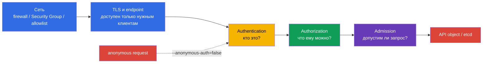
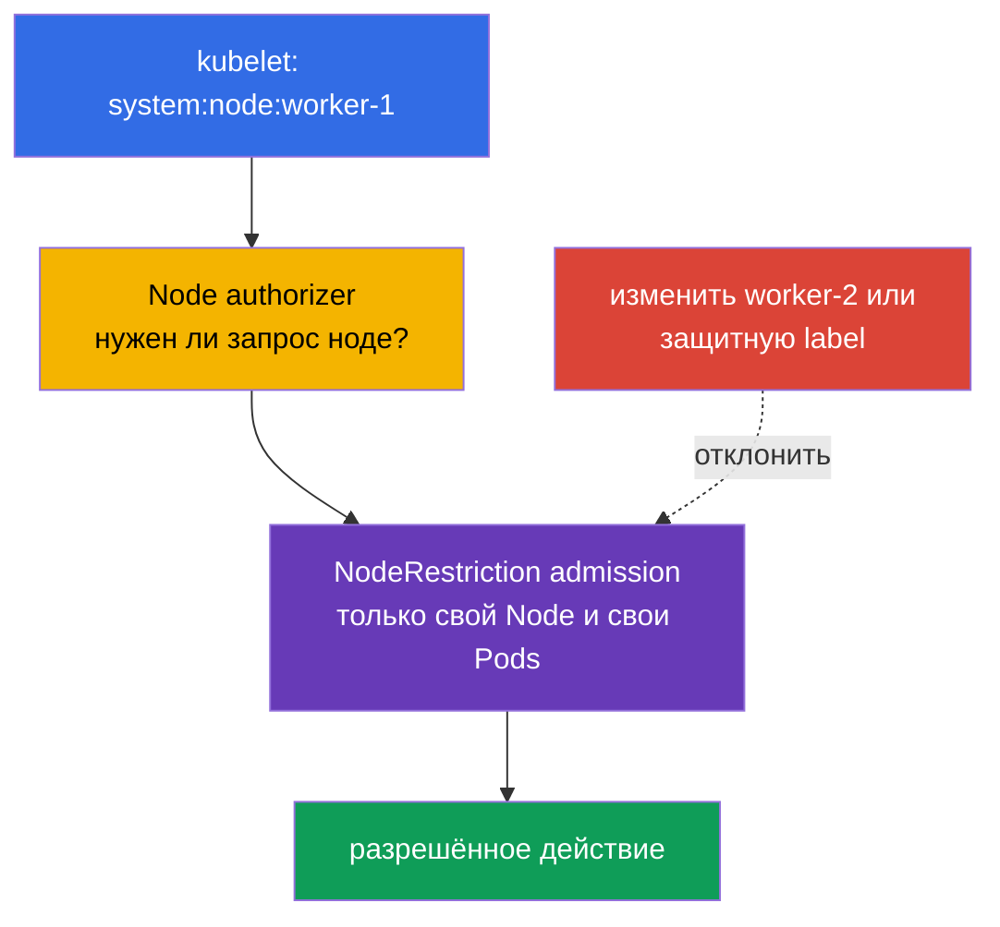
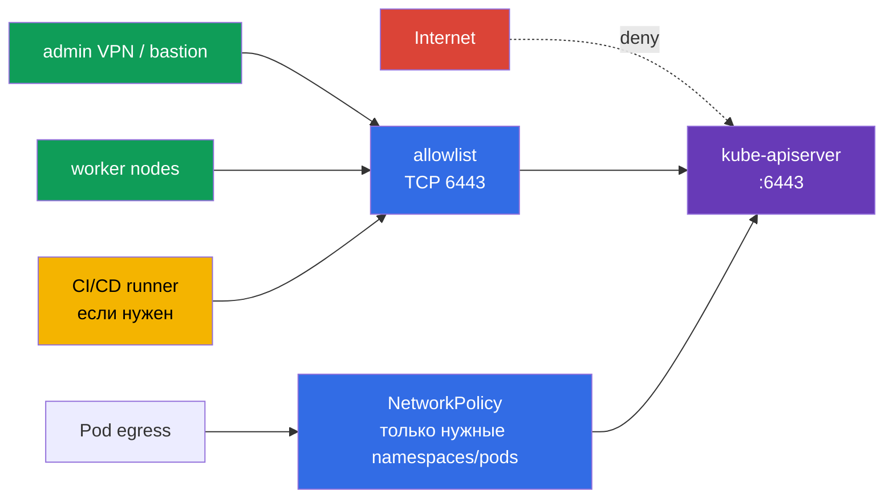

<!-- Standalone RU release: ссылки на переводы удалены, потому что соответствующие файлы не входят в архив. -->

# Глава 12. Ограничение доступа к Kubernetes API

> **Что дальше.** В главе 11 мы убрали лишние ServiceAccount-токены. Теперь закроем саму
> точку, к которой эти токены и другие учётные данные обращаются: Kubernetes API. Ошибка в
> `kube-apiserver`, kubelet или сетевом периметре превращает один неаутентифицированный
> запрос в путь к данным и управлению кластером. Это домен **Cluster Hardening** CKS (15%):
> ограничиваем, кто вообще может дойти до API, кем он станет после аутентификации и что
> сможет сделать.

> **Что нужно знать из CKA.** Базовый путь authn -> authz -> admission и ServiceAccount
> разобраны в [главе 21 CKA](../../../cka/course/21/ru.md); kubeconfig, клиентские TLS-
> сертификаты и CSR - в [главе 39 CKA](../../../cka/course/39/ru.md). Здесь не повторяем
> эти механизмы, а применяем их для hardening API.

## 12.1. Путь запроса к API: несколько независимых барьеров

`kube-apiserver` - единая точка управления состоянием кластера. Через него проходят
`kubectl`, контроллеры, kubelet, операторы и приложения с ServiceAccount. Поэтому защита
не сводится к одному RBAC-правилу: запрос нужно остановить как можно раньше и всё равно
оставить последующие проверки.



- **Сеть** отвечает, может ли источник установить TCP-соединение с `6443`. Это первый и
  самый дешёвый барьер, но он не заменяет identity и RBAC.
- **Authentication** сопоставляет сертификат, bearer token или другой credential с
  субъектом. Если anonymous access включён, запрос без credential получает субъект
  `system:anonymous` и группу `system:unauthenticated`. В актуальном
  `AuthenticationConfiguration` anonymous access можно разрешить только для заданных
  путей health endpoints, например `/livez`, `/readyz` и `/healthz`, а не обязательно
  для всего API.
- **Authorization** проверяет допустимый verb, resource и scope. В обычном kubeadm-кластере
  это `Node,RBAC`.
- **Admission** действует после authorization: может изменить объект или отклонить его по
  политике. `NodeRestriction` здесь ограничивает действия kubelet-идентичностей.

Именно порядок важен при расследовании: `401 Unauthorized` означает, что запрос не прошёл
аутентификацию; `403 Forbidden` - личность уже определена, но ей отказала авторизация или
admission. Не пытайтесь исправить `401` созданием RoleBinding.

## 12.2. Anonymous access, legacy ports и старые RBAC-привязки

### Почему `system:anonymous` опасен

Anonymous access иногда оставляют ради устаревшего health check или из привычки. Сам по
себе anonymous-субъект ничего не разрешает, но одна ошибочная `RoleBinding` или
`ClusterRoleBinding` для `system:anonymous` либо `system:unauthenticated` делает API
доступным без ключа, сертификата или токена. Сначала закрывают вход, затем удаляют уже
выданные права: отключённый сейчас anonymous access не делает опасную binding безопасной
навсегда.

Полное отключение через `--anonymous-auth=false` остаётся безопасным baseline. Но
стабильный `AuthenticationConfiguration`, подключаемый через `--authentication-config`,
может оставить anonymous access только для явного списка health endpoints, например
`/livez`, `/readyz` и `/healthz`; остальные пути не станут anonymous даже при разрешающей
binding. Эти два способа настройки взаимоисключающие: при поле `anonymous` в файле не
задавайте `--anonymous-auth` одновременно. Такой exception требует отдельного ревью
маршрутов, сетевого доступа и прав anonymous-субъекта.

На kubeadm control-plane `kube-apiserver` обычно является static Pod. Правьте активный
манифест локально на control-plane, имея доступ к консоли ноды и сохранённый путь отката.
Не копируйте резервный YAML в `/etc/kubernetes/manifests/`: kubelet может воспринять его
как ещё один static Pod.

```bash
# На control-plane: сохранить копию вне каталога static Pod-манифестов.
sudo install -d -m 700 /root/k8s-manifest-backup
sudo cp /etc/kubernetes/manifests/kube-apiserver.yaml \
  /root/k8s-manifest-backup/kube-apiserver.yaml

# Найти уже заданное значение; конфликтующих повторов флага быть не должно.
sudo grep -n -- '--anonymous-auth' /etc/kubernetes/manifests/kube-apiserver.yaml || true
sudoedit /etc/kubernetes/manifests/kube-apiserver.yaml
```

В `spec.containers[].command` должен остаться ровно один аргумент:

```yaml
- --anonymous-auth=false
```

После сохранения kubelet пересоздаёт static Pod. Не перезапускайте одновременно все
control-plane компоненты и не завершайте SSH-сессию, пока API не восстановился.

```bash
watch -n 2 'sudo crictl ps --name kube-apiserver'
kubectl get --raw='/readyz?verbose'
kubectl get nodes
```

Kubelet - второй HTTP API на каждой ноде. Его защищают отдельно: отключают anonymous
authentication и legacy read-only API. В актуальной конфигурации kubelet это обычно
`/var/lib/kubelet/config.yaml`; фактический источник сначала определяют по unit и процессу.

```bash
sudo systemctl cat kubelet
sudo ps -ef | grep '[k]ubelet'
sudo grep -nE 'readOnlyPort|anonymous:|authorization:' /var/lib/kubelet/config.yaml
```

```yaml
# /var/lib/kubelet/config.yaml
readOnlyPort: 0
authentication:
  anonymous:
    enabled: false
authorization:
  mode: Webhook
```

Эквиваленты, если конкретная установка управляет kubelet флагами:

```text
--read-only-port=0
--anonymous-auth=false
--authorization-mode=Webhook
```

`10255` - исторический read-only, неаутентифицированный порт kubelet; он должен быть
выключен. Нормальный kubelet API на `10250` не надо «открывать для всех»: он должен
оставаться защищён authentication, `Webhook` authorization и сетевыми правилами. У
`kube-apiserver` legacy `--insecure-port` в современных Kubernetes уже удалён; это не
повод игнорировать старые манифесты, образы и документацию. Ищите его как признак
неподдерживаемой либо небезопасной конфигурации, а не пытайтесь включить ради совместимости.

```bash
# На каждой ноде: read-only API не должен слушаться; 10250 проверяем вместе с firewall.
sudo ss -lntp | grep ':10255' || echo 'kubelet read-only port is closed'
sudo ss -lntp | grep ':10250'
```

### Инвентаризация и cleanup bindings

Не удаляйте `ClusterRole` по имени наугад: одна роль может быть нужна другому субъекту.
Найдите bindings, в которых среди `subjects` действительно указан anonymous user или его
группа, проверьте назначенную роль и только затем удалите ненужную binding.

```bash
# ClusterRoleBinding с прямой выдачей прав anonymous user или группе unauthenticated.
kubectl get clusterrolebinding -o json | jq -r '
  .items[]
  | select(any(.subjects[]?;
      (.kind == "User" and .name == "system:anonymous") or
      (.kind == "Group" and .name == "system:unauthenticated")))
  | [.metadata.name, .roleRef.kind, .roleRef.name] | @tsv'

# То же для namespace-scoped RoleBinding.
kubectl get rolebinding -A -o json | jq -r '
  .items[]
  | select(any(.subjects[]?;
      (.kind == "User" and .name == "system:anonymous") or
      (.kind == "Group" and .name == "system:unauthenticated")))
  | [.metadata.namespace, .metadata.name, .roleRef.kind, .roleRef.name] | @tsv'
```

После ревью удаление адресно выглядит так:

```bash
REVIEWED_CLUSTERROLEBINDING='reviewed-clusterrolebinding'
NAMESPACE='reviewed-namespace'
REVIEWED_ROLEBINDING='reviewed-rolebinding'
kubectl delete clusterrolebinding "$REVIEWED_CLUSTERROLEBINDING"
kubectl delete rolebinding -n "$NAMESPACE" "$REVIEWED_ROLEBINDING"
```

Проверьте также любые binding, выдающие право группе `system:unauthenticated`: отключение
anonymous access останавливает обычный путь к ней, но политика должна оставаться
минимальной и понятной при последующих изменениях identity provider.

## 12.3. Authorization modes и NodeRestriction

`--authorization-mode` задаёт упорядоченную цепочку модулей авторизации. Каждый модуль
возвращает `Allow`, `Deny` или `NoOpinion`: `Allow` **или** `Deny` немедленно завершают
цепочку, и только `NoOpinion` передаёт запрос следующему модулю; если все модули вернули
`NoOpinion`, запрос отклоняется. Поэтому порядок значим, а `AlwaysAllow` в достижимой части
цепочки обнуляет least privilege для запросов, которые до него дошли.

| Mode | Назначение | Решение для hardening |
|---|---|---|
| `Node` | обрабатывает запросы kubelet-идентичностей `system:node:<node>` | включать перед `RBAC` в обычном kubeadm-кластере |
| `RBAC` | проверяет Role, ClusterRole и bindings для пользователей, групп и ServiceAccount | основной authorizer для администраторов и workload |
| `Webhook` | спрашивает внешний authorization webhook | использовать только с доступным и проверенным внешним сервисом |
| `ABAC` | правила из локального файла policy | legacy-вариант; сложен для аудита, избегать в новых кластерах |
| `AlwaysAllow` | разрешает всё | не использовать в production |

Structured `AuthorizationConfiguration` стабилен начиная с Kubernetes v1.32 и задаётся
флагом `--authorization-config`. Выбирают **один** подход: этот файл нельзя совмещать с
CLI-настройкой `--authorization-mode` и `--authorization-webhook-*`; при смешении
`kube-apiserver` завершит работу с ошибкой. Файл полезен, когда нужны параметры и несколько
webhook authorizer, но переход на него планируют и проверяют как изменение control plane, а
не добавляют второй параллельный источник конфигурации.

Проверьте активный аргумент в static Pod-манифесте и задайте безопасную базовую цепочку,
если она соответствует архитектуре кластера:

```bash
sudo grep -n -- '--authorization-mode' /etc/kubernetes/manifests/kube-apiserver.yaml
```

```yaml
- --authorization-mode=Node,RBAC
```

`Node` authorizer нужен не «для доверия всем нодам», а для необходимой работы kubelet;
`RBAC` остаётся обязательным для остальных запросов. Не меняйте список modes на работающем
кластере без проверки bootstrap-контроллеров, identity provider и текущих API-клиентов.

**NodeRestriction** - admission plugin, дополняющий `Node` authorizer. С kubelet-
сертификатом атакующий, захвативший ноду, не должен получать возможность выдавать себе
доступ через произвольные объекты Node или управлять workload другой ноды. При включённом
`NodeRestriction` kubelet может изменять свой Node и Pod, назначенные именно на эту ноду,
но не должен менять чужие Node/Pod или устанавливать опасные метки с префиксом
`node-restriction.kubernetes.io/`.



В kubeadm `NodeRestriction` обычно включён. Проверьте прежде, чем добавлять: не заменяйте
полный список admission plugins неполным значением и не отключайте другие defaults.

```bash
sudo grep -nE -- '--(enable|disable)-admission-plugins' \
  /etc/kubernetes/manifests/kube-apiserver.yaml
sudo crictl ps --name kube-apiserver
```

Если plugin отсутствует, добавьте `NodeRestriction` к существующему
`--enable-admission-plugins` после проверки совместимости. Не путайте это с RBAC: RBAC
выдаёт права всем субъектам, а NodeRestriction вводит дополнительное предметное
ограничение именно для kubelet-идентичности. Рядом с ним учитывайте feature gate
`ServiceAccountNodeAudienceRestriction`: когда он включён, NodeRestriction также сужает
аудитории, для которых kubelet может запрашивать ServiceAccount-токены через `TokenRequest`,
до аудиторий, уже используемых Pod на этой ноде, либо явно выданных через RBAC. Это не
замена NodeRestriction, а дополнительное ограничение для node-originated token requests.

## 12.4. Сетевое ограничение доступа к apiserver

Даже при корректных TLS и RBAC публичный API endpoint расширяет поверхность: адрес `:6443`
даёт атакующему возможность перебирать credentials, использовать будущую уязвимость или
получать сведения по ошибкам. Private endpoint - сильная и часто предпочтительная опция, но
не универсальный абсолют: public endpoint может быть обоснован, если доступны строгие
сетевые ограничения (узкий allowlist CIDR, firewall/WAF по архитектуре) и сильная
аутентификация. В любом варианте доступ дают только административной сети, control-plane,
worker nodes и согласованным automation endpoints.



Применяйте барьеры по месту ответственности:

- **Cloud Security Group / firewall**: разрешите `TCP/6443` только control-plane, worker
  subnets, VPN/bastion и известным automation sources. Не ставьте `0.0.0.0/0`; в private
  кластере используйте private endpoint или tunnel.
- **Host firewall** (`nftables`, `iptables`, `ufw`) на self-managed control-plane: дублирует
  сетевой периметр и ограничивает источники, если cloud firewall ошибочно расширят.
- **NetworkPolicy**: ограничьте egress Pod к `kubernetes.default.svc`/API только для
  namespace и workload, которым API действительно нужен. Это сокращает lateral movement
  после компрометации Pod.
- **Маршрутизация и DNS**: убедитесь, что control-plane endpoint публикуется и разрешается
  только так, как требует выбранная модель доступа; private endpoint часто упрощает это, но
  public endpoint требует особенно строгого контроля источников и аутентификации.

**kubeadm discovery - отдельный случай.** При token-based discovery ConfigMap
`kube-public/cluster-info` по умолчанию содержит публично доступную discovery-информацию
(адрес API и данные CA); это не Secret и не следует выдавать или защищать как Secret.
Bootstrap token, напротив, является временной учётной информацией для discovery/TLS bootstrap
и требует отдельного контроля: ограниченного распространения, короткого срока жизни,
отзыва и ревью CSR/auto-approval. При необходимости public access к `cluster-info` отключают
или применяют file/HTTPS discovery с подходящим каналом доверия; не смешивайте защиту
публичной информации и защиту токена.

NetworkPolicy не заменяет Security Group или host firewall: она применяется CNI к трафику
Pod и не обязана покрывать хостовый, внешний или control-plane трафик одинаково в каждой
топологии. Для managed Kubernetes часть endpoint и firewall принадлежит провайдеру; тогда
проверяйте его private/public endpoint, allowed CIDRs и отдельные control-plane security
rules вместо попытки править static Pod, которого у вас нет.

Перед изменением firewall зафиксируйте текущие слушатели и правило, поддержите отдельную
консольную сессию для отката. Блокировка `6443` для своего администратора или kubelet
может сделать кластер недоступным.

```bash
# На control-plane: кто слушает API; конкретная программа зависит от runtime.
sudo ss -lntp | grep ':6443'

# С административной машины: проверить endpoint без отключения TLS-проверки в production.
kubectl cluster-info
kubectl get --raw='/livez?verbose'
```

## 12.5. Profiling, ServiceAccount lookup и аудит флагов

Профилировочные endpoints нужны для диагностики производительности, но без необходимости
увеличивают поверхность раскрытия информации о процессе. На `kube-apiserver` выключите
profiling; в той же операции проверьте controller-manager и scheduler. Подробная CIS-
проверка всех трёх компонентов приведена в [главе 07](../07/ru.md), а небезопасные
аргументы и TLS-hardening - в [главе 09](../09/ru.md).

```yaml
# В command kube-apiserver static Pod
- --profiling=false
```

```bash
for component in kube-apiserver kube-controller-manager kube-scheduler; do
  sudo grep -n -- '--profiling' "/etc/kubernetes/manifests/${component}.yaml" || true
done
```

`--service-account-lookup` относится к проверке существования ServiceAccount при
аутентификации legacy ServiceAccount token. Значение `false` отключает API-based revocation:
удалённый ServiceAccount или удалённый legacy token больше не отзывают уже выпущенный token
через эту проверку. Это **не** механизм задания или гарантии короткого TTL для legacy tokens;
срок их действия определяется способом выпуска и claims токена. Без явного решения lookup не
выключают. В современных кластерах предпочитают bound, short-lived projected tokens из главы
11, а наличие и поведение флага сверяют с версией через `kube-apiserver --help` и документацию
используемой версии.

Проверяйте конфигурацию как набор рисков, а не только один флаг:

```bash
sudo grep -nE -- '--(anonymous-auth|authorization-mode|enable-admission-plugins|\
profiling|service-account-lookup|insecure-port|secure-port)' \
  /etc/kubernetes/manifests/kube-apiserver.yaml

# Kubelet проверяем в его реальном config source.
sudo grep -nE 'readOnlyPort|anonymous:|authorization:' /var/lib/kubelet/config.yaml
```

| Находка | Почему опасно | Безопасное направление |
|---|---|---|
| `--anonymous-auth=true` | запрос без credential становится субъектом API | `--anonymous-auth=false` и cleanup bindings |
| `--authorization-mode=AlwaysAllow` | любой аутентифицированный либо anonymous субъект проходит authz | `Node,RBAC` либо осознанная интеграция Webhook |
| отсутствует `NodeRestriction` | скомпрометированный kubelet получает более широкий путь к API | включить plugin, сохранив существующие defaults |
| profiling включён без нужды | лишние диагностические endpoints | `--profiling=false` на control plane компонентах |
| `readOnlyPort` не равен `0` | legacy kubelet API без authentication | `readOnlyPort: 0` |
| публичный `6443` | увеличенная поверхность для credentials attacks и уязвимостей API | private endpoint либо строгий CIDR allowlist, firewall и сильная authentication |

После правки static Pod подтверждайте не только строку в YAML. Kubelet должен запустить
новый контейнер, а API - стать Ready. При ошибке YAML или неподдерживаемом флаге используйте
локальную консоль, `journalctl -u kubelet`, `crictl ps -a` и сохранённую копию манифеста.

## 12.6. Проверка: доказать, что вход закрыт

Проверку выполняют в два слоя: без credential и от имени конкретного субъекта. Проверяйте
из той сети, которая должна иметь TCP-доступ к API; firewall timeout и API `401` - разные,
но оба полезные результаты в своих слоях.

```bash
# Берём server URL из текущего kubeconfig, не передавая сертификат, ключ или token в curl.
APISERVER=$(kubectl config view --minify \
  -o jsonpath='{.clusters[0].cluster.server}')
printf '%s\n' "$APISERVER"

# После --anonymous-auth=false ожидаем 401. Для учебного теста -k допустим,
# но в production передайте CA через --cacert, а не отключайте проверку TLS.
curl -k -sS -o /dev/null -w '%{http_code}\n' "$APISERVER/version"
```

До исправления ответ может быть `200`, `403` или другой код в зависимости от того, какие
anonymous bindings и endpoint доступны. После отключения anonymous authentication ожидаемый
ответ API - `401`. Если соединение timeout/refused, сначала диагностируйте firewall,
Security Group, DNS и маршрут; это не доказательство настройки authn.

С правами cluster-admin проверьте authorizer через impersonation:

```bash
# Не должно быть разрешения. У вызывающего администратора должно быть право impersonate.
kubectl auth can-i get pods --all-namespaces --as=system:anonymous
kubectl auth can-i list secrets --all-namespaces --as=system:anonymous
kubectl auth can-i get pods --all-namespaces \
  --as=system:anonymous --as-group=system:unauthenticated

# Явно проверить минимальные права ServiceAccount из лабы 104.
kubectl auth can-i list pods -n cks-104 \
  --as=system:serviceaccount:cks-104:app-sa
kubectl auth can-i delete pods -n cks-104 \
  --as=system:serviceaccount:cks-104:app-sa
```

Ожидайте `no` для anonymous-проверок и для запрещённого `delete`; `list pods` для
выделенного `app-sa` должен вернуть `yes` только в заданном namespace. Сохраните команды,
HTTP status и изменённые config sources в change record: это доказательство, что контроль
работает, а не только заявлен.

## 12.7. Типичные ошибки и диагностика

| Симптом | Вероятная причина | Что проверить |
|---|---|---|
| API не поднимается после правки | YAML повреждён, флаг продублирован или не поддержан | `journalctl -u kubelet`, `crictl ps -a`, сохранённую копию манифеста |
| `curl` не даёт 401, а timeout | трафик отрезан до API | Security Group/firewall, DNS, маршрут и порт `6443` |
| anonymous `can-i` неожиданно `yes` | осталась RoleBinding/ClusterRoleBinding | поиск `system:anonymous` и `system:unauthenticated` в bindings |
| kubelet перестал регистрироваться | firewall или API endpoint недоступны, неверен kubelet config | `journalctl -u kubelet`, `ss`, node routes и active kubelet args |
| NodeRestriction не даёт ожидаемого эффекта | plugin не активен либо kubelet использует не node identity | флаги apiserver, CN клиентского сертификата, admission configuration |
| Pod больше не достаёт API | egress policy слишком широка или ServiceAccount-token отключён намеренно | необходимость доступа, NetworkPolicy, `automountServiceAccountToken`, RBAC |

## 12.8. Как это применяют в продакшене

- **Несколько слоёв, один baseline.** `--anonymous-auth=false` (или узкие health-only
  conditions в `AuthenticationConfiguration`), `Node,RBAC`, NodeRestriction с оценкой
  `ServiceAccountNodeAudienceRestriction`, закрытый kubelet read-only port и
  private/строго allowlisted API endpoint описывают в kubeadm config, image ноды или IaC. Ручная правка static Pod допустима для
  аварийной задачи, но не должна быть единственным источником истины.
- **Сеть по назначению.** Администраторы работают через VPN/bastion, CI/CD имеет отдельные
  исходящие адреса, а worker и control-plane получают только необходимые правила. Public
  endpoint допустим лишь при явном владельце риска, строгом ограничении источников и сильной
  authentication; private endpoint остаётся сильным, но не единственным вариантом.
- **Права пересматривают после изменения identity.** Регулярно ищут bindings для
  `system:anonymous`, `system:unauthenticated`, устаревших пользователей и ServiceAccount,
  удаляют неиспользуемые и тестируют `kubectl auth can-i`.
- **Наблюдаемость не открывает диагностику.** Metrics, audit и централизованные логи дают
  нужную видимость; profiling включают временно, по allowlist и с планом отключения.
- **Managed control plane разделяют по ответственности.** Нельзя править static
  Pod-манифест провайдера, зато можно и нужно контролировать endpoint exposure, allowed
  CIDRs, RBAC, admission-policy, node security groups и доступ к kubelet.

## 12.9. Мини-глоссарий

- **anonymous authentication** - сопоставление запроса без credential с
  `system:anonymous`; для API и kubelet его обычно отключают.
- **`system:unauthenticated`** - группа анонимного субъекта; binding на неё требует
  такого же ревью, как binding на `system:anonymous`.
- **authorization mode** - authorizer API server, например `Node`, `RBAC` или `Webhook`.
- **Node authorizer** - authorizer для действий kubelet-идентичностей над нужными им Node
  и Pod объектами.
- **NodeRestriction** - admission plugin, дополнительно ограничивающий действия kubelet
  его собственной нодой и назначенными ей Pod; с feature gate
  `ServiceAccountNodeAudienceRestriction` также сужает допустимые аудитории TokenRequest от
  kubelet.
- **allowlist** - явный список допустимых источников, портов или назначений вместо
  разрешения всем.
- **read-only port** - устаревший неаутентифицированный kubelet API, выключаемый через
  `readOnlyPort: 0`/`--read-only-port=0`.
- **profiling** - endpoints диагностики производительности процесса; без необходимости
  отключаются `--profiling=false`.
- **static Pod** - Pod, которым kubelet управляет из локального манифеста; kubeadm обычно
  так запускает control-plane компоненты.

## 12.10. Итоги главы

- API защищают последовательно: сеть, TLS, authentication, authorization и admission;
  один слой не заменяет остальные.
- `--anonymous-auth=false` нужен на kube-apiserver и kubelet. После него нужно проверить и
  удалить ненужные RoleBinding/ClusterRoleBinding для `system:anonymous` и
  `system:unauthenticated`.
- Legacy kubelet read-only port отключают `readOnlyPort: 0`; `10250` оставляют только с
  authentication, `Webhook` authorization и сетевым ограничением.
- Безопасная базовая authorizer-цепочка kubeadm - `Node,RBAC`; `AlwaysAllow` несовместим с
  least privilege. NodeRestriction сужает последствия захвата kubelet credential.
- Для API `:6443` предпочитают private endpoint; при public endpoint обязательны строгий
  firewall/Security Group allowlist и сильная authentication. В любом случае точечные
  NetworkPolicy для Pod egress уменьшают lateral movement.
- `--profiling=false`, включённый ServiceAccount lookup для API revocation legacy tokens и
  аудит флагов уменьшают поверхность; короткий TTL обеспечивают bound projected tokens, а не
  `--service-account-lookup=false`.
- Результат доказывают отдельными проверками: anonymous `curl` должен дать API `401`, а
  `kubectl auth can-i --as=system:anonymous` - `no`.

## 12.11. Как это пригодится: на экзамене и в реальной работе

**На экзамене.** Задание обычно даёт доступ к control-plane и просит закрыть anonymous API
либо убрать опасную binding. Найдите активный static Pod-манифест, сохраните копию вне
`/etc/kubernetes/manifests/`, исправьте единственный нужный флаг, дождитесь пересоздания
API и проверьте `/readyz`. Затем используйте `curl` без credential и `kubectl auth can-i
--as=system:anonymous`; не ограничивайтесь поиском текста в файле.

**В реальной работе.** Ограничение API - часть проектирования сети и идентичности, а не
разовая CIS-правка. Private endpoint - сильная опция; если endpoint public, его компенсируют
строгим allowlist и сильной authentication. Короткоживущие bound tokens, минимальные
bindings и автоматическая проверка конфигурационного дрейфа делают компрометацию одной ноды
или одного Pod существенно менее разрушительной.

## 12.12. Вопросы для самопроверки

1. В каком порядке запрос проходит сетевой периметр, authn, authz и admission, и что
   означает `401` в сравнении с `403`?
2. Почему после `--anonymous-auth=false` всё равно нужно ревьюить bindings для
   `system:anonymous` и `system:unauthenticated`?
3. Чем `10255` отличается от `10250` и какие настройки нужны kubelet API?
4. Почему `AlwaysAllow` нельзя добавлять рядом с `RBAC` как «запасной» mode?
5. Как NodeRestriction и `ServiceAccountNodeAudienceRestriction` снижают последствия
   компрометации kubelet credential?
6. Почему NetworkPolicy не заменяет firewall или Security Group для API server и при каких
   условиях public endpoint может быть оправдан?
7. Какие две проверки докажут отдельно сетевую доступность API и отсутствие anonymous
   авторизации?

## Практика

В лабе 104 вы создадите ServiceAccount с минимальной Role, отключите автомонтирование
токена, удалите избыточную RBAC-привязку и зададите `--anonymous-auth=false` на
`kube-apiserver`. После этого `check_result` проверит `auth can-i` и anonymous `curl`.

🧪 Лаба 104 (RBAC-минимизация, ServiceAccount-токены и ограничение API):
[tasks/cks/labs/104](../../labs/104/README_RU.MD)

---
[Оглавление](../README_RU.md) · [Глава 11](../11/ru.md) · [Глава 13](../13/ru.md)
