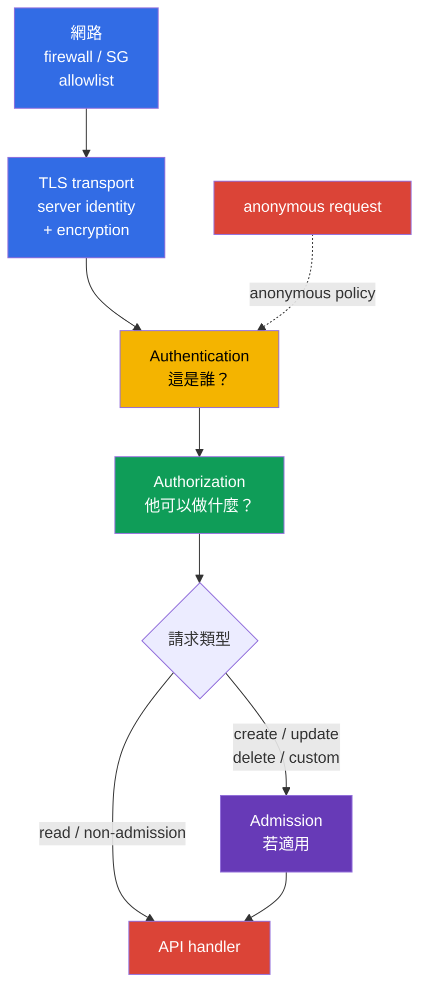
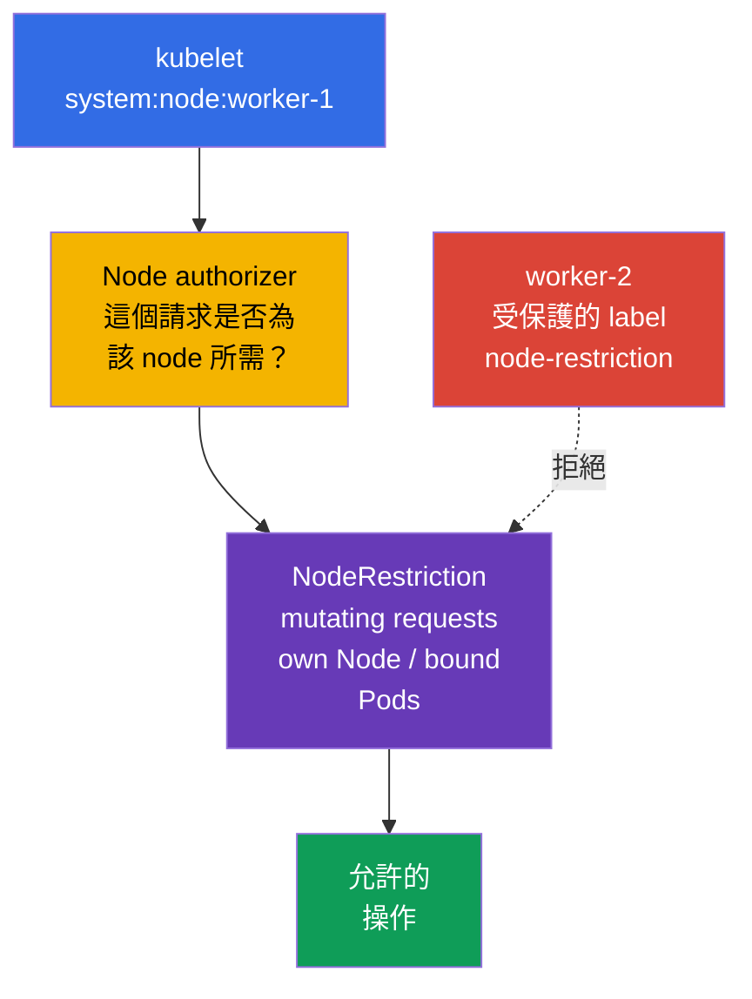
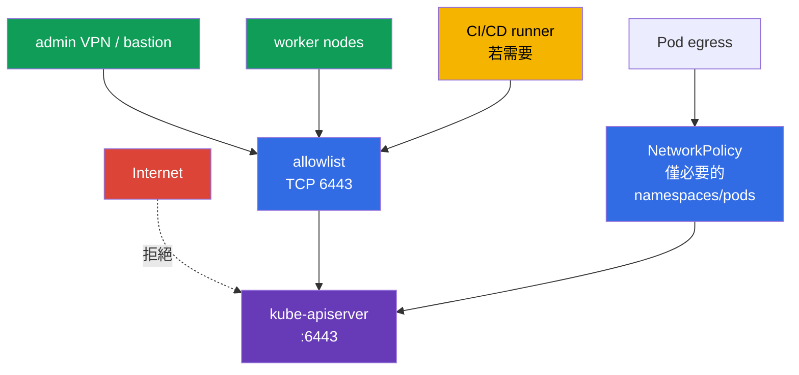

[Русская версия](ru.md) · [Eng version](README.md) · [Versión en español](es.md) · [Version française](fr.md) · [Deutsche Version](de.md) · [ქართული ვერსია](ge.md) · [日本語版](jp.md)

# 第 12 章。限制對 Kubernetes API 的存取

> **問題。** 從不必要網路可存取的 API endpoint、anonymous 請求，或過時的
> `system:unauthenticated` binding，會讓攻擊者繞過一般客戶端的邊界。網路周界、TLS
> 或 apiserver 設定的錯誤，會把一個未經可靠驗證的 identity 請求，轉變為存取資料與
> 管理叢集的權限。

> **接下來。** 第 11 章移除了多餘的 ServiceAccount token。現在要關閉這些 token 與其他
> 憑證所存取的端點：Kubernetes API。`kube-apiserver`、kubelet 或網路周界中的錯誤，會將
> 一個未驗證請求變成取得叢集資料與控制權的途徑。這是 CKS 的 **Cluster Hardening**
> 領域（15%）：限制誰能抵達 API、驗證後成為何種身分，以及能執行什麼操作。

> **需要的 CKA 基礎。** 基本的 authn -> authz -> admission 路徑及 ServiceAccount 見
> [CKA 第 21 章](../../../cka/course/21/tw.md)；kubeconfig、client TLS 憑證及 CSR 見
> [CKA 第 39 章](../../../cka/course/39/tw.md)。本章不重複這些機制，而是將它們用於
> API hardening。

> 🧠 網路、TLS、authentication 與 authorization 是彼此獨立且連續的屏障；admission
> 會加入適用的請求。Timeout/refused、`401` 與 `403` 指向不同層次。

## 12.1. API 請求路徑：多個獨立屏障

`kube-apiserver` 是叢集狀態管理的單一入口。`kubectl`、controller、kubelet、operator
與使用 ServiceAccount 的應用程式都會經過它。因此防護不能簡化成一條 RBAC 規則：應盡早
停止請求，同時仍保留後續檢查。



- **網路**決定來源是否能對 `6443` 建立 TCP 連線。這是第一道且成本最低的屏障，
  但不能取代 identity 與 RBAC。
- **TLS transport** 保護連線的 confidentiality 與 integrity，並讓 client 驗證 API server
  的 identity。單靠 server-side TLS 並不是 client allowlist。在 X.509 client-certificate
  authentication 中，TLS 會要求並取得 client 憑證、確認其持有對應的 private key，而
  Kubernetes X.509 authenticator 會在 **Authentication** 層依設定的 client CA 驗證憑證，
  並將其 identity 轉換為 user/groups。
- **Authentication** 將憑證、bearer token 或其他 credential 對應至 subject。若啟用
  anonymous access，沒有 credential 的請求會取得 subject `system:anonymous` 及 group
  `system:unauthenticated`。在目前的 `AuthenticationConfiguration` 中，可用明確的
  **精確 HTTP paths** allowlist 限制 anonymous access。常見的設定是 `/livez`、`/readyz`
  與必要時的 `/healthz`；對 kubeadm public token discovery，另一個可明確允許的 path 可為
  `/api/v1/namespaces/kube-public/configmaps/cluster-info`。其餘 paths 不會取得 anonymous
  identity。
- **Authorization** 驗證允許的 verb、resource 及 scope。一般 kubeadm 叢集使用
  `Node,RBAC`。
- **Admission** 在 authorization 後，僅對適用 admission control 的請求生效：首先是
  create/delete/modify 與一些 custom verbs。物件的 `get`、`list` 和 `watch` 會略過
  admission layer。Admission 可修改物件或拒絕請求；此處 `NodeRestriction` 限制
  kubelet-identities 可進行的**變更**。

這個順序在調查時至關重要：`401 Unauthorized` 表示請求未通過 Authentication。`403 Forbidden`
表示已識別的 subject 被拒絕；首先檢查 Authorization。對 mutating/custom requests，請求也可能
稍後在 Admission 被拒絕，但 admission 不參與一般的 `get/list/watch`。不要試圖透過建立
RoleBinding 修正 `401`。

## 12.2. Anonymous access、legacy ports 與舊 RBAC bindings

### 為何 `system:anonymous` 危險

有時會為了舊式 health check 或習慣保留 Anonymous access。anonymous subject 本身不會授予
任何權限，但只要有一條錯誤的 `RoleBinding` 或 `ClusterRoleBinding` 指向 `system:anonymous`
或 `system:unauthenticated`，API 就能在沒有 key、憑證或 token 的情況下存取。先關閉入口，
再移除已授予的權限：目前停用 anonymous access，不代表危險的 binding 從此安全。

對標準 kubeadm 而言，完整的 `--anonymous-auth=false` 不能視為通用 baseline：其 health probes
會在沒有 credentials 的情況下存取 `/livez` 與 `/readyz`，所以全域禁止 anonymous 時，它們可能
收到 `401` 並重新啟動 API server。此類叢集的主要做法是透過 `--authentication-config` 連接穩定的
`AuthenticationConfiguration`。其中的條件是**精確** path 的 allowlist：即使存在允許它的
RBAC binding，任何其他 path 也不會成為 anonymous。這也影響 token-based `kubeadm join`：在
信任 API 前，unauthenticated client 會讀取
`/api/v1/namespaces/kube-public/configmaps/cluster-info`。因此請選擇兩種已驗證做法之一：
在 public token discovery 期間加入這個精確 path，或停用 public discovery 並使用 file/HTTPS
discovery。沒有此 path 的 health-only allowlist 與一般 token-based join 不相容。只有在 health
check 實際使用時才加入 `/healthz`。每個 exception 都需要個別審查 routes、網路存取與
anonymous subject 權限。

在 kubeadm control-plane，`kube-apiserver` 通常是 static Pod。請在 control-plane 本機修改
active manifest，並保有 node console 存取與已保存的 rollback 路徑。不要將備份 YAML 複製到
`/etc/kubernetes/manifests/`：kubelet 可能將其視為另一個 static Pod。

```bash
# 在 control-plane：將副本儲存在 static Pod manifest 目錄之外。
sudo install -d -m 700 /root/k8s-manifest-backup
sudo cp /etc/kubernetes/manifests/kube-apiserver.yaml \
  /root/k8s-manifest-backup/kube-apiserver.yaml

# 在 static Pod manifest 目錄之外建立 authentication configuration。
# 若 kubeadm join 使用 public token discovery，保留精確的 cluster-info path。
sudo install -d -m 700 /etc/kubernetes/authentication
sudo tee /etc/kubernetes/authentication/apiserver-authentication.yaml >/dev/null <<'EOF'
apiVersion: apiserver.config.k8s.io/v1
kind: AuthenticationConfiguration
anonymous:
  enabled: true
  conditions:
  - path: /livez
  - path: /readyz
  - path: /api/v1/namespaces/kube-public/configmaps/cluster-info
EOF
sudo chmod 0600 /etc/kubernetes/authentication/apiserver-authentication.yaml

# 找出已設定的 authn flags；不得有衝突的重複項。
sudo grep -nE -- '--(anonymous-auth|authentication-config)' \
  /etc/kubernetes/manifests/kube-apiserver.yaml || true
sudoedit /etc/kubernetes/manifests/kube-apiserver.yaml
```

在 `spec.containers[].command` 中只指定一個檔案路徑，且不要同時設定
`--anonymous-auth`（這兩種設定方式彼此互斥）：

```yaml
- --authentication-config=/etc/kubernetes/authentication/apiserver-authentication.yaml
```

僅有 flag 還不夠：檔案位於 host，且必須明確 mount 到 static Pod。新增 `hostPath` volume
及 read-only `volumeMount`，但不要移除 kube-apiserver 現有的 volumes：

```yaml
# 加到 kube-apiserver 現有的 volumeMounts：
volumeMounts:
- name: authentication-config
  mountPath: /etc/kubernetes/authentication/apiserver-authentication.yaml
  readOnly: true

# 加到 Pod 現有的 volumes：
volumes:
- name: authentication-config
  hostPath:
    path: /etc/kubernetes/authentication/apiserver-authentication.yaml
    type: File
```

變更後，確認 container 確實能看到該檔案、API server 已恢復，且 `/readyz` 成功。`hostPath` 是
node 的本機路徑：在 HA control plane 上，於**每個** control-plane node 建立相同檔案與 mount，
否則該 node 的 apiserver 無法 mount 檔案並啟動。

手動編輯 static Pod 適合特定實驗或緊急任務，但不應是 kubeadm 叢集唯一的 source of truth。
對永久設定，請將參數與 mount 移至 `ClusterConfiguration`，例如使用 `apiServer.extraArgs` 與
`apiServer.extraVolumes`，或改用受管理的 kubeadm patches。否則 `kubeadm upgrade` 可能重新產生
不含此設定的 manifest：

```yaml
apiVersion: kubeadm.k8s.io/v1beta4
kind: ClusterConfiguration
apiServer:
  extraArgs:
  - name: authentication-config
    value: /etc/kubernetes/authentication/apiserver-authentication.yaml
  extraVolumes:
  - name: authentication-config
    hostPath: /etc/kubernetes/authentication/apiserver-authentication.yaml
    mountPath: /etc/kubernetes/authentication/apiserver-authentication.yaml
    readOnly: true
    pathType: File
```

只有在事先將 kubeadm health probes 改為 authenticated，或採用其他已驗證機制並檢查
bootstrap dependencies 後，才可透過 `--anonymous-auth=false` 完整停用。儲存後 kubelet 會重新
建立 static Pod。manifest 是 desired source，並不是已執行 apiserver argv 的證明。不要同時重啟
所有 control-plane components，API 尚未恢復前也不要結束 SSH session。

```bash
# Desired configuration。manifest 本身不證明 active runtime。
sudo grep -n -- '--authentication-config=' \
  /etc/kubernetes/manifests/kube-apiserver.yaml
watch -n 2 'sudo crictl ps --name kube-apiserver'

# 在可看到 container PID 的 Linux host：
# 分別證明已執行 process 的 argv 與檔案可見性。
# 如果 runtime/PID namespace 不允許，請使用其等效的 inspect 驗證，而非只從 manifest 推論。
APISERVER_PID="$(pgrep -xo kube-apiserver)" || {
  echo 'ERROR: running kube-apiserver process not found' >&2
  exit 2
}
AUTH_CONFIG_ARG='--authentication-config=/etc/kubernetes/authentication/apiserver-authentication.yaml'
AUTH_CONFIG_PATH='/etc/kubernetes/authentication/apiserver-authentication.yaml'

if ! sudo cat "/proc/${APISERVER_PID}/cmdline" \
    | tr '\0' '\n' \
    | grep -Fxq -- "$AUTH_CONFIG_ARG"
then
  echo "ERROR: active kube-apiserver argv does not contain ${AUTH_CONFIG_ARG}" >&2
  exit 1
fi

if ! sudo test -e "/proc/${APISERVER_PID}/root${AUTH_CONFIG_PATH}"; then
  echo "ERROR: ${AUTH_CONFIG_PATH} is not visible in kube-apiserver mount namespace" >&2
  exit 1
fi

echo 'OK: active kube-apiserver uses the expected authentication config path'

# API readiness 需與 desired configuration 及 argv 分開驗證。
kubectl get --raw='/readyz?verbose'
kubectl get nodes
```

Kubelet 是每個 node 的第二個 HTTP API。其防護要另行處理：停用 anonymous authentication
與 legacy read-only API。不能將 `/var/lib/kubelet/config.yaml` 視為通用來源：kubelet 可能從
unit、drop-in 或 environment 檔案取得 `--config`、`--config-dir` 與 arguments。先確認實際的
startup sources，然後才檢查 active `KubeletConfiguration`；在允許存取時，也可與 endpoint
`/configz` 交叉驗證。

```bash
sudo systemctl cat kubelet
sudo systemctl show kubelet -p ExecStart --value
KUBELET_PID=$(pgrep -xo kubelet) || { echo 'kubelet process not found' >&2; exit 2; }
sudo tr '\0' '\n' < "/proc/$KUBELET_PID/cmdline" \
  | grep -E -- '^--config(=|$)|^--config-dir(=|$)|^--(read-only-port|anonymous-auth|authorization-mode)(=|$)' || true
# 在確認實際檔案後，例如：sudo grep -nE 'readOnlyPort|anonymous:|authorization:' <active-kubelet-config>
```

```yaml
# 在 active KubeletConfiguration 中，路徑由 startup configuration 決定。
readOnlyPort: 0
authentication:
  anonymous:
    enabled: false
authorization:
  mode: Webhook
```

若特定安裝透過 kubelet flags 管理，等效設定為：

```text
--read-only-port=0
--anonymous-auth=false
--authorization-mode=Webhook
```

`10255` 是 kubelet 的歷史 read-only、未驗證 port；必須停用。不應「向所有人開放」正常的
`10250` kubelet API：它應繼續受 authentication、`Webhook` authorization 與網路規則保護。
對 `kube-apiserver` 而言，legacy `--insecure-port` 已在目前 Kubernetes 中移除；這不是忽略舊
manifests、images 與文件的理由。將其視為不支援或不安全設定的跡象，而不是為了相容性嘗試啟用它。

```bash
# 在每個 node：ss 發生錯誤即為驗證錯誤，而非關閉 port 的證明。
listeners=$(sudo ss -H -lnt '( sport = :10255 )') || {
  echo 'ERROR: cannot inspect TCP listener 10255' >&2; exit 2;
}
if [ -n "$listeners" ]; then
  printf 'ERROR: kubelet read-only port 10255 is listening:\n%s\n' "$listeners" >&2
  exit 1
fi
echo 'OK: kubelet read-only port 10255 is closed'

# 將 10250 與 firewall 一起檢查；精確的 socket filter 不會匹配到其他 port。
sudo ss -H -lntp '( sport = :10250 )'
```

> 🎯 設定安全的 authentication configuration，並移除給 `system:anonymous`/`system:unauthenticated`
> 的 bindings。停用 legacy `10255` 與 `--insecure-port`，但不要公開受保護的 `10250`。

### 清查與清理 bindings

不要憑名稱隨意刪除 `ClusterRole`：一個 role 可能是另一個 subject 所需。找出 `subjects` 中確實
列出 anonymous user 或其 group 的 bindings，檢查所指派 role，接著才刪除不必要的 binding。

```bash
# 對 anonymous user 或 unauthenticated group 直接授權的 ClusterRoleBinding。
kubectl get clusterrolebinding -o json | jq -r '
  .items[]
  | select(any(.subjects[]?;
      (.kind == "User" and .name == "system:anonymous") or
      (.kind == "Group" and .name == "system:unauthenticated")))
  | [.metadata.name, .roleRef.kind, .roleRef.name] | @tsv'

# namespace-scoped RoleBinding 也是如此。
kubectl get rolebinding -A -o json | jq -r '
  .items[]
  | select(any(.subjects[]?;
      (.kind == "User" and .name == "system:anonymous") or
      (.kind == "Group" and .name == "system:unauthenticated")))
  | [.metadata.namespace, .metadata.name, .roleRef.kind, .roleRef.name] | @tsv'
```

不要只因 subject 符合便刪除 binding。尤其 `system:public-info-viewer` 是提供
`system:unauthenticated` non-sensitive public information 的標準 default ClusterRoleBinding；
啟用 RBAC 且 subjects 缺失時，標準 bindings 可能在 API 啟動後由 auto-reconciliation 還原。
此外，kubeadm token discovery 使用 RoleBinding `kubeadm:bootstrap-signer-clusterinfo` 讀取
`kube-public/cluster-info`。先檢查 role 與是否需要對應 discovery workflow；只刪除 custom 或
確實多餘的 binding。

經過審查後，可這樣精確刪除：

```bash
REVIEWED_CLUSTERROLEBINDING='reviewed-clusterrolebinding'
NAMESPACE='reviewed-namespace'
REVIEWED_ROLEBINDING='reviewed-rolebinding'
kubectl delete clusterrolebinding "$REVIEWED_CLUSTERROLEBINDING"
kubectl delete rolebinding -n "$NAMESPACE" "$REVIEWED_ROLEBINDING"
```

也請檢查任何向 `system:unauthenticated` group 授權的 binding：停用 anonymous access 會阻止
通往它的一般路徑，但在 identity provider 後續變更時，policy 仍應維持最小且清楚。

## 12.3. Authorization modes 與 NodeRestriction

`--authorization-mode` 設定有序的 authorization modules 鏈。每個 module 回傳 `Allow`、`Deny`
或 `NoOpinion`：`Allow` **或** `Deny` 都會立即終止鏈，只有 `NoOpinion` 會將請求交給下一個
module；若所有 modules 都回傳 `NoOpinion`，請求會被拒絕。因此順序很重要，而鏈中可達的
`AlwaysAllow` 會讓抵達它的請求失去 least privilege。

| Mode | 用途 | Hardening 決策 |
|---|---|---|
| `Node` | 處理 kubelet-identity `system:node:<node>` 的請求 | 在一般 kubeadm 叢集中置於 `RBAC` 之前 |
| `RBAC` | 檢查 users、groups 與 ServiceAccount 的 Role、ClusterRole 和 bindings | 管理員與 workload 的主要 authorizer |
| `Webhook` | 查詢外部 authorization webhook | 僅與可用且經驗證的外部服務搭配使用 |
| `ABAC` | 來自本機 policy 檔案的規則 | legacy 選項；難以稽核，在新叢集中避免使用 |
| `AlwaysAllow` | 允許所有操作 | 不在 production 使用 |

Structured `AuthorizationConfiguration` 自 Kubernetes v1.32 起穩定，並由
`--authorization-config` flag 設定。請選擇**一種**做法：此檔案不能與
`--authorization-mode` 及 `--authorization-webhook-*` CLI 設定並用；混用時
`kube-apiserver` 會因錯誤結束。需要 parameters 與多個 webhook authorizer 時此檔案很有用，
但應將遷移規劃並驗證為 control plane 變更，而不是加入第二個並行的設定來源。

若符合叢集架構，請檢查 static Pod manifest 的 desired argument，並設定安全的 baseline chain。
kubelet reconciliation 後，另外確認執行中 process 的 argv（如 §12.2）：單靠 manifest 中的字串
不證明 active configuration：

```bash
sudo grep -n -- '--authorization-mode' /etc/kubernetes/manifests/kube-apiserver.yaml
```

```yaml
- --authorization-mode=Node,RBAC
```

`Node` authorizer 並不是「信任所有 nodes」所需，而是用於 kubelet 的特殊 API operations。所示
kubeadm baseline 的其他 identities 透過 RBAC 授權。另一種經審慎設計的架構中，共用 authorizer
可包含例如 Webhook；重點是其餘所有 requests 都應有 fail-closed authorization policy，且
`AlwaysAllow` 不應作為 fallback。沒有檢查 bootstrap controllers、identity provider 與目前的
API clients 前，不要在運行中的叢集變更 modes 清單。

> 🎯 kubeadm baseline：沒有 `AlwaysAllow` 的 `Node,RBAC`；`Node` 服務 kubelet，RBAC
> 限制其他 identities，而 `NodeRestriction` 限制使用 node credentials 的可接受 mutating
> requests。

**NodeRestriction** 是補足 `Node` authorizer 的 validating admission plugin。`Node` authorizer
決定 kubelet 的 API 權限並限制 relation-sensitive reads；接著 `NodeRestriction` 限制允許的
**變更**：kubelet 僅能修改自己的 `Node` 及排程至該 node 的 `Pod`，且無法修改受保護的 Node
labels/taints（超出允許模型者）。Read 請求不會通過 admission，因此其 scope 正由 authorizer
決定。



在 kubeadm 中，`NodeRestriction` 通常作為額外 admission plugin 啟用。先同時檢查
`--enable-admission-plugins` 與 `--disable-admission-plugins`。

```bash
sudo grep -nE -- '--(enable|disable)-admission-plugins' \
  /etc/kubernetes/manifests/kube-apiserver.yaml
sudo crictl ps --name kube-apiserver
```

在 Kubernetes v1.36，`--enable-admission-plugins` 會將 plugins 加入 built-in default-enabled
set；無須在這個 flag 列出 defaults。若未啟用 `NodeRestriction`，請將它加到 explicit additional
list。若 `--enable-admission-plugins` 已有其他 additional plugins，請保留它們。另行確認需要的
default 或 plugin 沒有透過 `--disable-admission-plugins` 停用。RBAC 管理 users、groups 與
ServiceAccount 的一般 role/binding-based 權限，而 `Node` authorizer 處理 node identities 的
特殊權限。`NodeRestriction` 不取代它們：它為 kubelet 的 mutating requests 加上 admission
限制。也請考量旁邊的 feature gate `ServiceAccountNodeAudienceRestriction`：啟用時，
NodeRestriction 也會收緊 kubelet 可透過 `TokenRequest` 為 ServiceAccount token 請求的 audiences，
只允許已被該 node 上 Pod 使用的 audiences，或透過 RBAC 明確授予的 audiences。它並非取代
NodeRestriction，而是 node-originated token requests 的額外限制。

> 🎯 將 `:6443` 限制為 private endpoint 或精確 CIDR allowlist；對 Pod 則另外檢查 egress policy。

## 12.4. 對 apiserver 的網路存取限制

即使 TLS 與 RBAC 均設定正確，public API endpoint 仍會擴大攻擊面：`:6443` 位址讓攻擊者能
猜測 credentials、利用未來的漏洞，或從錯誤取得資訊。Private endpoint 是強而且通常較佳的選項，
但不是放諸四海皆準的絕對答案：若具備嚴格的網路限制（窄範圍 CIDR allowlist、依架構配置的
firewall/WAF）和強大的 authentication，public endpoint 也可能有正當理由。無論哪一種情況，
僅從必要且已確認的 source paths 允許 `:6443`：管理網路/VPN、control-plane、kubelet/worker
traffic、已核准的 automation endpoints，以及確實需要 API 的 in-cluster workloads。不要假定
endpoint 一律將 workload traffic 視為 worker node 位址：應判定實際的 CNI/cloud datapath，
以及 SNAT/routing 後的 source address。



依責任範圍採用各項屏障：

- **Cloud Security Group / firewall**：僅從實際必要的 source ranges/identities 允許
  `TCP/6443`：control-plane、kubelet/worker path、VPN/bastion、automation，以及若 topology
  有此需求，已授權 Pod workloads 的 addresses/CIDRs。不要自動加入整個 Pod CIDR：先判定 CNI/cloud
  routing 和 SNAT 後 API endpoint 實際看到的 source。不要設定 `0.0.0.0/0`；private 叢集使用
  private endpoint 或 tunnel。
- **Host firewall**（self-managed control-plane 上的 `nftables`、`iptables`、`ufw`）：
  複製網路周界並限制來源，以防 cloud firewall 被錯誤擴大。
- **NetworkPolicy**：`kubernetes.default.svc` 是 Service 的邏輯名稱，標準 NetworkPolicy
  無法依名稱選取 destination Service。對 API 的 egress 限制，應使用已驗證實際 datapath 的
  `ipBlock`/endpoint CIDR，或使用 CNI-specific entity、FQDN 或 Service policy。不要盲目在
  CNI 之間移植 `ipBlock`：Service DNAT 可能發生在 policy 之前或之後，沒有通用語意。僅允許
  確實需要 API 的 namespace 與 workload - 這可減少 Pod 遭入侵後的 lateral movement。
- **Routing 與 DNS**：確認 control-plane endpoint 僅依所選 access model 的需求發布與解析；
  private endpoint 通常可簡化此事，但 public endpoint 對來源控制與 authentication 有更嚴格的
  要求。

**kubeadm discovery - 個別案例。** token-based discovery 的 ConfigMap
`kube-public/cluster-info` 預設包含公開可存取的 discovery information（API 位址與 CA data）；
它不是 Secret，不應像 Secret 一樣發放或保護。反之，Bootstrap token 是供 discovery/TLS bootstrap
使用的暫時性 credential，需要獨立控制：限制散布、短生命週期、撤銷以及 CSR/auto-approval review。
透過 `AuthenticationConfiguration` 限制 anonymous 時，RBAC binding 並不足夠：精確的 path
`/api/v1/namespaces/kube-public/configmaps/cluster-info` 也必須存在於 `anonymous.conditions`，
否則 request 不會取得 anonymous identity，token discovery 會中斷。若需限制對 `cluster-info` 的
public access，請停用它或使用具備適當 trust channel 的 file/HTTPS discovery；不要混淆公開資訊
與 token 的防護。

NetworkPolicy 不能取代 Security Group 或 host firewall：它由 CNI 套用至 Pod traffic，在每種
topology 下不一定會同樣覆蓋 host、external 或 control-plane traffic。對 managed Kubernetes，
部分 endpoint 與 firewall 屬於 provider；此時應檢查其 private/public endpoint、allowed CIDRs
及個別的 control-plane security rules，而不是試圖編輯不存在的 static Pod。

變更 firewall 前，記錄目前的 listeners 與規則，並保留可回復的獨立 console session。若封鎖
管理員或 kubelet 對 `6443` 的存取，可能讓叢集無法使用。

```bash
# 在 control-plane：誰在監聽 API；實際程式取決於 runtime。
sudo ss -lntp | grep ':6443'

# 從管理機器：在 production 中不關閉 TLS verification 地檢查 endpoint。
kubectl cluster-info
kubectl get --raw='/livez?verbose'
```

> 🔬 `kubectl proxy` 與 `port-forward` 是輔助的本機存取方式：它們使用操作員 kubeconfig 的權限，並增加診斷攻擊面。

## 12.4.1. 本機 API gateway：`kubectl proxy` 與 `port-forward`

`kubectl proxy` 與 `kubectl port-forward` 使用使用者 kubeconfig 的權限，而不是建立新的受限
identity。`kubectl proxy` 預設監聽 `127.0.0.1`，將風險限制於本機。非必要時不要擴大其
`--address`；寬鬆的 `--accept-hosts`，尤其是 `--disable-filter`，可能使 proxy 成為其他 clients
可存取、具操作員權限的 API gateway。類似地，除非需要透過安全網路進行短暫且另行核准的連線，
否則不要使用 `kubectl port-forward --address 0.0.0.0`。診斷後請結束暫時 tunnel，也不要把它
當作 firewall、RBAC 或 NetworkPolicy 的替代品。

> 🎯 確認 active config、安全 flags、reload 後的 readiness、anonymous path 的 `401`，以及回傳 `no` 的 targeted `can-i`；透過 kubelet 與 runtime 診斷 static Pod。

## 12.5. Profiling、ServiceAccount lookup 與 flag 稽核

Profiling endpoints 用於效能診斷，但不必要時會增加程序資訊外洩的攻擊面。在 `kube-apiserver`
停用 profiling；同一次操作中檢查 controller-manager 與 scheduler。所有三個 components 的詳細
CIS 檢查見[第 07 章](../07/tw.md)，不安全 arguments 與 TLS hardening 見[第 09 章](../09/tw.md)。

```yaml
# 在 kube-apiserver static Pod 的 command 中
- --profiling=false
```

```bash
for component in kube-apiserver kube-controller-manager kube-scheduler; do
  sudo grep -n -- '--profiling' "/etc/kubernetes/manifests/${component}.yaml" || true
done
```

`--service-account-lookup` 關係到 authentication 時確認 legacy ServiceAccount token 的
ServiceAccount 是否存在。設為 `false` 會停用 API-based revocation：已刪除的 ServiceAccount 或
legacy token 不會再透過此檢查撤銷既有 token。這**不是**為 legacy tokens 設定或保證短 TTL 的
機制；其有效期取決於發行方法與 token claims。沒有明確決策時，請不要停用 lookup。現代叢集偏好
第 11 章的 bound、short-lived projected tokens，並以 `kube-apiserver --help` 和所用版本文件，
依版本確認此 flag 是否存在及其行為。

請將 configuration 當作一組 risks 檢查，而不只是一個 flag。對 scheduler，先檢查是否有
`--config`：有它時 deprecated `--profiling` 會被忽略，因此要在找到的 active
`KubeSchedulerConfiguration` 設定 `enableProfiling: false`。

```bash
sudo grep -nE -- \
  '--(anonymous-auth|authorization-mode|enable-admission-plugins|profiling|service-account-lookup|insecure-port|secure-port)' \
  /etc/kubernetes/manifests/kube-apiserver.yaml
sudo grep -n -- '--config' /etc/kubernetes/manifests/kube-scheduler.yaml
# 對指定的 --config：sudo grep -n 'enableProfiling:' <active-scheduler-config>

# Kubelet：先在 unit 與 /proc/<kubelet-pid>/cmdline 找到實際 --config/--config-dir，
# 再檢查找到的 active KubeletConfiguration。
```

| 發現 | 為何危險 | 安全方向 |
|---|---|---|
| broad anonymous access | 沒有 credential 的 request 會取得 `system:anonymous`；在 selective config 中，只有 exact allowed paths 被排除 | 使用具最小 exact paths allowlist 的 `AuthenticationConfiguration`，或若與 probes/bootstrapping 相容則用 `--anonymous-auth=false`；cleanup bindings |
| `--authorization-mode=AlwaysAllow` | 所有 authenticated 或 anonymous subject 都會通過 authz | `Node,RBAC` 或經審慎設計的 Webhook integration |
| 缺少 `NodeRestriction` | 遭入侵的 kubelet 取得更廣泛的 API 路徑 | 啟用 plugin 並保留既有 defaults |
| 不必要地啟用 profiling | 額外的 diagnostic endpoints | 對 apiserver/controller-manager 使用 `--profiling=false`；對含 `--config` 的 scheduler，於 active `KubeSchedulerConfiguration` 設定 `enableProfiling: false` |
| `readOnlyPort` 不為 `0` | 沒有 authentication 的 legacy kubelet API | `readOnlyPort: 0` |
| public `6443` | credentials attacks 與 API vulnerabilities 的擴大攻擊面 | private endpoint 或嚴格的 CIDR allowlist、firewall 與強 authentication |

編輯 static Pod 後，不要只確認 YAML 中的一行。Kubelet 必須啟動新 container，且 API 必須變為 Ready。
若 YAML 出錯或 flag 不受支援，使用本機 console、`journalctl -u kubelet`、`crictl ps -a` 與保存的
manifest 副本。

## 12.6. 驗證：證明入口已關閉

驗證分兩個獨立層次執行：沒有 credential 的 authentication，以及明確指定 subject 的
authorization。從應具有 API TCP access 的網路檢查；firewall timeout 與 API `401` 不同，
但兩者在各自的層次都很有用。

```bash
# 從目前 kubeconfig 取得 server URL，不將 certificate、key 或 token 傳給 curl。
APISERVER=$(kubectl config view --minify \
  -o jsonpath='{.clusters[0].cluster.server}')
printf '%s\n' "$APISERVER"

# Protected path：`401` 證明正是 /version 未通過 anonymous authn。
# 測試環境允許 -k，但 production 應透過 --cacert 提供 CA。
curl -k -sS -o /dev/null -w '%{http_code}\n' "$APISERVER/version"

# 若 selective config 有意允許 /readyz，請分開檢查它。
# API Ready 時通常預期 200，但這不否定 /version 的 401。
curl -k -sS -o /dev/null -w '%{http_code}\n' "$APISERVER/readyz"
```

對 `/version` 的 `401` 僅證明此 protected path 不接受 anonymous request；它不證明 anonymous
authenticator 已全域停用。在 selective `AuthenticationConfiguration` 中，例如 `/readyz` 或
discovery path 的 exact allowed paths 可刻意在沒有 credential 時運作。若連線 timeout/refused，
先診斷 firewall、Security Group、DNS 與路由；這不是 Authentication 設定的證明。

使用 cluster-admin 權限，另行透過 impersonation 檢查 authorizer：

```bash
# 不應獲得允許。呼叫端管理員必須具有 impersonate 權限。
# 完整 anonymous identity 同時包含 user 與 group。
kubectl auth can-i get pods --all-namespaces \
  --as=system:anonymous --as-group=system:unauthenticated
kubectl auth can-i list secrets --all-namespaces \
  --as=system:anonymous --as-group=system:unauthenticated

# 明確檢查 lab 104 中 ServiceAccount 的最小權限。
kubectl auth can-i list pods -n cks-104 \
  --as=system:serviceaccount:cks-104:app-sa
kubectl auth can-i delete pods -n cks-104 \
  --as=system:serviceaccount:cks-104:app-sa
```

對 anonymous checks 與被禁止的 `delete`，預期為 `no`；專用 `app-sa` 的 `list pods` 應僅在
指定 namespace 回傳 `yes`。`kubectl auth can-i` 檢查 impersonated identity 的 authorizer，
但不會在沒有 credential 的情況下建立實際連線，也不證明 anonymous authenticator 狀態。將 commands、
HTTP status 及變更過的 config sources 記錄在 change record 中：這證明控制實際運作，而不只是宣稱。

## 12.7. 常見錯誤與診斷

| 症狀 | 可能原因 | 要檢查什麼 |
|---|---|---|
| 編輯後 API 未啟動 | YAML 損毀、flag 重複或不受支援 | `journalctl -u kubelet`、`crictl ps -a`、保存的 manifest 副本 |
| `curl` 沒有回傳 401 而是 timeout | traffic 在到達 API 前遭攔截 | Security Group/firewall、DNS、route 與 port `6443` |
| anonymous `can-i` 意外回傳 `yes` | 還留有 RoleBinding/ClusterRoleBinding | 在 bindings 搜尋 `system:anonymous` 與 `system:unauthenticated` |
| kubelet 停止註冊 | firewall 或 API endpoint 不可達，或 kubelet config 錯誤 | `journalctl -u kubelet`、`ss`、node routes 與 active kubelet args |
| NodeRestriction 未產生預期效果 | plugin 未啟用，或 kubelet 未使用 node identity | apiserver flags、client certificate CN、admission configuration |
| Pod 無法再存取 API | egress policy 過嚴/過窄、缺少 allow-rule、datapath/CIDR/port 錯誤，或 ServiceAccount-token 被刻意停用 | 存取需求、active NetworkPolicy/CNI policy、實際到 API 的 datapath、`automountServiceAccountToken`、RBAC |

> 🏭 在 IaC 中落實 endpoint exposure、kubeadm/API configuration 與 RBAC cleanup，並與 baseline 比對；owners 對變更後的 endpoint、CIDR 與 evidence 負責。

## 12.8. 如何在 production 套用

- **多層防護，一個 baseline。** `--anonymous-auth=false`（在與 probes 與 bootstrap dependencies
  相容之處），或在 `AuthenticationConfiguration` 內對精確 health/discovery paths 使用窄範圍
  conditions、`Node,RBAC`、已評估 `ServiceAccountNodeAudienceRestriction` 的 NodeRestriction、
  關閉的 kubelet read-only port，以及 private/嚴格 allowlisted API endpoint，均應在 kubeadm
  config、node image 或 IaC 中描述。手動編輯 static Pod 適合緊急任務，但不應是唯一的
  source of truth。
- **依用途配置網路。** 管理員透過 VPN/bastion 作業，CI/CD 有獨立的 source addresses，
  worker/control-plane 僅獲得必要規則；對 Pod-to-API，另行固定實際 datapath/source，並只允許
  真正需要 API 的 workloads。Public endpoint 僅在有明確 risk owner、嚴格 source restrictions
  與強 authentication 時才有正當理由；private endpoint 仍是強大但非唯一的選項。
- **identity 變更後重新審查權限。** 定期尋找 `system:anonymous`、`system:unauthenticated`、
  過時 users 與 ServiceAccount 的 bindings，移除未使用者，並測試 `kubectl auth can-i`。
- **Observability 不會開放診斷。** Metrics、audit 與集中 logs 提供需要的 visibility；profiling
  僅暫時依 allowlist 啟用，且須有停用計畫。
- **Managed control plane 按責任劃分。** 不能編輯 provider 的 static Pod manifest，但可以且應當
  控制 endpoint exposure、allowed CIDRs、RBAC、admission-policy、node security groups 與
  kubelet access。

## 12.9. 小型詞彙表

- **anonymous authentication** - 將無 credential 的 request 對應到 `system:anonymous`；通常對
  API 與 kubelet 停用。
- **`system:unauthenticated`** - anonymous subject 的 group；指向它的 binding 需要與指向
  `system:anonymous` 的 binding 相同的 review。
- **authorization mode** - API server authorizer，例如 `Node`、`RBAC` 或 `Webhook`。
- **Node authorizer** - kubelet identities 的專用 authorizer；允許必要的 node operations，及
  對與該 node Pod 關聯物件的 relation-sensitive access。
- **NodeRestriction** - 限制 kubelet 可進行的 Node/Pod changes 與受保護 Node labels 的
  validating admission plugin；配合 `ServiceAccountNodeAudienceRestriction` 也限制
  node-originated `TokenRequest` audiences。
- **allowlist** - 明確列出允許來源、ports 或 destinations，而非允許所有人。
- **read-only port** - 透過 `readOnlyPort: 0`/`--read-only-port=0` 停用的 legacy、
  unauthenticated kubelet API。
- **profiling** - process performance diagnostics endpoints；不需要時以 `--profiling=false`
  停用，`kube-scheduler` 含 `--config` 時除外：該 CLI flag 會被忽略，需在 active
  `KubeSchedulerConfiguration` 中設定 `enableProfiling: false`。
- **static Pod** - kubelet 從本機 manifest 管理的 Pod；kubeadm 通常以此啟動 control-plane
  components。

## 12.10. 本章總結

- API 由多個獨立層次防護：網路、TLS、authentication 與 authorization；對 mutating 與支援的
  custom requests，還會套用 admission。
- 對 kubelet 停用 anonymous access（`--anonymous-auth=false`）。在 kube-apiserver，則透過
  `AuthenticationConfiguration` 明確限制 health endpoints，並在仍需要 public token discovery
  時以精確 path 限制 `kube-public/cluster-info`；兩種情況均僅審查並移除不必要的、指向
  `system:anonymous` 與 `system:unauthenticated` 的 RoleBinding/ClusterRoleBinding。
- 以 `readOnlyPort: 0` 停用 legacy kubelet read-only port；僅在具有 authentication、`Webhook`
  authorization 與網路限制時保留 `10250`。
- 安全的 kubeadm authorizer baseline 是 `Node,RBAC`；`AlwaysAllow` 與 least privilege 不相容。
  `Node` authorizer 設定 kubelet API permissions，而 NodeRestriction 為其 mutating requests
  加上限制。
- API `:6443` 偏好 private endpoint；public endpoint 必須具備嚴格 firewall/Security Group
  allowlist 與強 authentication。無論哪種情況，為 Pod egress 設定精確 NetworkPolicy 都能減少
  lateral movement。
- `--profiling=false`、為 legacy tokens 的 API revocation 啟用 ServiceAccount lookup，以及 flag
  audit 可減少攻擊面；bound projected tokens 而非 `--service-account-lookup=false` 提供短 TTL。
- 以分開的 checks 證明結果：對 protected path（例如 `/version`）的 anonymous `curl` 應得到
  API `401`；intentionally allowed health/discovery path 需另外檢查。`kubectl auth can-i
  --as=system:anonymous --as-group=system:unauthenticated` 檢查 impersonated identity 的
  authorizer，且對禁止操作應回傳 `no`。

## 12.11. 這在考試與實務工作如何運用

**在考試中。** 題目通常提供 control-plane access，並要求關閉 anonymous API 或移除危險 binding。
找出 active static Pod manifest，在 `/etc/kubernetes/manifests/` 外保存副本，修正唯一需要的 flag，
等待 API 重新建立並檢查 `/readyz`。接著對 protected path（例如 `/version`）使用無 credential 的
`curl`；採用 selective configuration 時，要另外考量刻意 allowed 的 exact paths。`kubectl auth can-i
--as=system:anonymous --as-group=system:unauthenticated` 僅檢查 impersonated identity 的 authorizer；
不要只搜尋檔案中的文字。

**考試情境：kubeadm 叢集以 `AlwaysAllow` 建立。** 目前 context 可能指向在啟用 RBAC 後不應有
權限的帳號，而 kubeconfig（或另一個 kubeconfig）含有已知的管理帳號。變更前，為**每個 command**
明確選取它：不要執行 `kubectl config use-context`，避免遺失原本 context 或得到錯誤的成功結果。

```bash
CURRENT_CONTEXT=$(kubectl config current-context)
kubectl config get-contexts
ADMIN_CONTEXT='kubernetes-admin@kubernetes'  # 清單中已知 admin context 的名稱

# 若 admin 位於另一個檔案，也加入 --kubeconfig=/path/to/admin.conf。
kubectl --context="$ADMIN_CONTEXT" auth whoami
sudo grep -nE -- '--authorization(-mode|-config)' \
  /etc/kubernetes/manifests/kube-apiserver.yaml
sudo cp -a /etc/kubernetes/manifests/kube-apiserver.yaml \
  /root/kube-apiserver.yaml.before-authz
sudoedit /etc/kubernetes/manifests/kube-apiserver.yaml
```

在 manifest 中，將 `--authorization-mode=AlwaysAllow` 替換為
`--authorization-mode=Node,RBAC`，但不要刪除其他 arguments。若發現 `--authorization-config`，
不要同時加入 `--authorization-mode`：依其 schema 修正 active structured configuration。修正
**前**的 `can-i` check 無法證明 admin account 有 RBAC permissions：使用 `AlwaysAllow` 時，
任何 authenticated subject 都會成功。

```bash
# Kubelet 會重新建立 static Pod；完成驗證前不要中斷 control-plane access。
watch -n 2 'sudo crictl ps --name kube-apiserver'
kubectl --context="$ADMIN_CONTEXT" get --raw='/readyz?verbose'
kubectl --context="$ADMIN_CONTEXT" auth can-i get nodes

# 情境中的此 context 沒有必要的 RBAC binding；預期為 "no"。
kubectl --context="$CURRENT_CONTEXT" auth can-i get nodes
```

在實際叢集完成緊急復原後，也應在 kubeadm configuration source（`kubeadm-config`/IaC）反映
authorizer，否則後續 `kubeadm upgrade` 可能再次產生具有過時設定的 manifest。

**在實際工作中。** API 限制是網路與 identity 設計的一部分，而非一次性的 CIS 修正。Private
endpoint 是強大的選項；若 endpoint 為 public，須以嚴格 allowlist 與強 authentication 補償。
短生命週期 bound tokens、最小 bindings 與 configuration drift 的自動檢查，使單一 node 或 Pod
遭入侵時的破壞性大幅降低。

## 12.12. 自我檢查問題

<details>
<summary>1. 請求依何順序通過網路周界、authn、authz 與 admission？相較於 `403`，`401` 代表什麼？</summary>

網路周界先決定是否可連線，接著 TLS 保護 transport 並允許 client 驗證 API server identity。在
X.509 client authentication 中，TLS 取得 client certificate，而 Kubernetes client CA 對它的信任
與到 user/groups 的映射，由 Authentication 階段的 X.509 authenticator 執行。然後 API 執行
Authentication 與 Authorization；若請求類型通過 admission control，會加入 Admission。
`401 Unauthorized` 表示 credential 未通過 Authentication。`403 Forbidden` 表示 identity 已經
確定但請求被禁止：先檢查 Authorization；對 mutating/custom requests，也可能在 Admission 被拒絕。
</details>

<details>
<summary>2. 為什麼在 `--anonymous-auth=false` 後，仍需要 review `system:anonymous` 與 `system:unauthenticated` 的 bindings？</summary>

停用 anonymous auth 會關閉目前通往這些 subjects 的一般路徑，但危險的 binding 仍是隱藏的多餘
授權。往後 authentication 或 identity provider 變更時，它可能再次可用而無需額外 review。因此，
在 RoleBinding 與 ClusterRoleBinding 找出 subject `system:anonymous` 和 group
`system:unauthenticated`，只移除不必要的 binding。
</details>

<details>
<summary>3. `10255` 與 `10250` 有何不同，kubelet API 需要哪些設定？</summary>

`10255` 是歷史 read-only、unauthenticated kubelet API，應以 `readOnlyPort: 0` 或
`--read-only-port=0` 停用。`10250` 是一般 kubelet API，不應向所有人開放：需要 authentication、
`Webhook` authorization 及網路規則/firewall。透過 `ss` 而非只讀 configuration 一行來確認
`10255` 已停用。
</details>

<details>
<summary>4. 為什麼不能將 `AlwaysAllow` 作為「備援」mode 放在 `RBAC` 旁？</summary>

Authorizer chain 在 module 回傳 Allow 或 Deny 時立即停止；只有 NoOpinion 將 request 交給下一個
module。`AlwaysAllow` 對抵達它的 requests 回傳 Allow，因而使這部分 chain 失去 least privilege。
安全的 kubeadm baseline 是 `Node,RBAC`，而不是允許所有人的 fallback。
</details>

<details>
<summary>5. NodeRestriction 與 `ServiceAccountNodeAudienceRestriction` 如何降低 kubelet credential 遭入侵的後果？</summary>

`Node` authorizer 先決定允許的 kubelet API operations 與 relation-based read access。對 mutating
requests，`NodeRestriction` 額外禁止 node identity 任意修改其他 Node/Pod 與受保護的 Node labels。
啟用 `ServiceAccountNodeAudienceRestriction` 時，同一 admission plugin 也會將 kubelet 經由
`TokenRequest` 請求的 audiences 限制為該 node Pod 所使用者，或由 RBAC 另行允許者。Read requests
不通過 NodeRestriction，應根據 Node authorizer 規則評估。
</details>

<details>
<summary>6. 為什麼 NetworkPolicy 無法取代 API server 的 firewall 或 Security Group？在何種條件下 public endpoint 可能合理？</summary>

NetworkPolicy 由 CNI 套用至 Pod traffic，不一定同樣覆蓋 host、external 與 control-plane traffic；
此外，standard policy 不能依 DNS name 選取 destination Service。Firewall 與 Security Group 在另一
層限制到 `:6443` 的 source access。Public endpoint 僅在有明確正當理由、嚴格 CIDR allowlist、
強 authentication 與受控網路架構時才可接受；private endpoint 通常更好。
</details>

<details>
<summary>7. 哪兩項檢查可分別證明 API 的網路可達性與不存在 anonymous authorization？</summary>

從管理員或其他已允許機器，使用 `kubectl cluster-info` 或 `kubectl get --raw='/livez?verbose'`
檢查 network reachability 與 health。對 protected path（例如 `/version`）使用沒有 credential 的
`curl`，預期 API `401`，即可檢查 Authentication。在 selective configuration 中，另外測試
exact allowed health/discovery path：它可能刻意不回傳 `401`。預期 `no` 的 `kubectl auth can-i ...
--as=system:anonymous --as-group=system:unauthenticated` 僅檢查 impersonated identity 的
authorizer。將 timeout 或 refused 作為網路問題診斷，而非 Authentication 的證明。
</details>

<details>
<summary>8. **Flashback（第 32 章）。** 本章問題 7 的單次 `curl`/`401` 只證明**檢查當下**沒有 anonymous access。Kubernetes audit log 記錄 **API requests**（誰、何時、哪個 resource、哪個 verb、哪個 result）- 它不是檔案 `/etc/kubernetes/manifests/kube-apiserver.yaml` 或 flag `--anonymous-auth` 狀態的持續監控。那麼，第 32 章的 audit log 能追溯顯示哪些 anonymous requests？為什麼 log 中沒有 anonymous event **不能證明**兩次檢查期間 configuration 未曾變更（例如 flag 短暫啟用，但當時沒有人提出 anonymous request）？還需要哪些額外 mechanisms（periodic checks、file integrity monitoring、GitOps drift detection）來提供 audit log 本身不具備的 continuous assurance？</summary>

Audit log 可以追溯顯示已發生的 anonymous identity API requests：何時發生、存取哪個 resource 與 verb、
以及 result。沒有這類 events 並不證明 `--anonymous-auth` 沒變過：flag 可能曾暫時啟用，但那時沒有
anonymous requests。continuous assurance 需要 periodic configuration checks、manifest file integrity
monitoring 與 GitOps/drift detection，補足 API calls 的 audit。
</details>

## 練習

在 lab 104，您將建立具有最小 Role 的 ServiceAccount、停用 token automount、移除多餘的 RBAC
binding，並在 `kube-apiserver` 設定 `--anonymous-auth=false`。之後 `check_result` 會檢查
`auth can-i` 與 anonymous `curl`。

🧪 Lab 104（RBAC 最小化、ServiceAccount tokens 與 API 限制）：
[tasks/cks/labs/104](../../labs/104/README_TW.MD)

🧪 Lab 114(kubeconfig contexts、client certificate 提取,以及將 Service exposure 從 NodePort 縮減為 ClusterIP):[tasks/cks/labs/114](../../labs/114/README_RU.MD)

🌐 額外互動式練習（killer.sh/killercoda，外部資源）：[apiserver-crash](https://killercoda.com/killer-shell-cks/scenario/apiserver-crash) · [apiserver-misconfigured](https://killercoda.com/killer-shell-cks/scenario/apiserver-misconfigured) · [apiserver-node-restriction](https://killercoda.com/killer-shell-cks/scenario/apiserver-node-restriction)

## 參考資料

- [Kubernetes：authentication](https://kubernetes.io/docs/reference/access-authn-authz/authentication/)
- [Kubernetes：kubeadm](https://kubernetes.io/docs/setup/production-environment/tools/kubeadm/)

---
[目錄](../README_TW.md) · [第 11 章](../11/tw.md) · [第 13 章](../13/tw.md)
