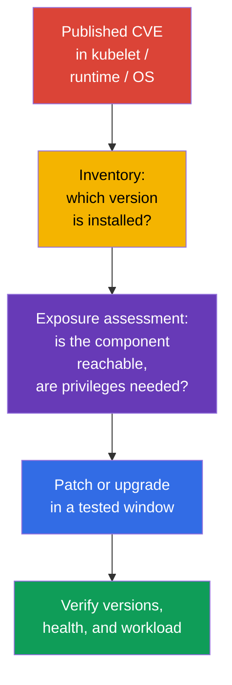
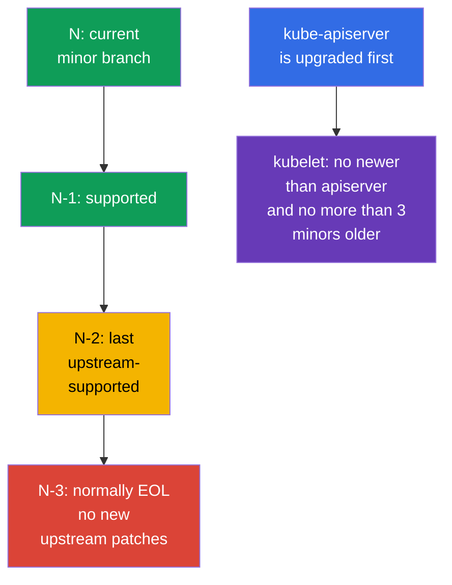

[Русская версия](ru.md) · [Versión en español](es.md) · [Version française](fr.md) · [Deutsche Version](de.md) · [ქართული ვერსია](ge.md) · [繁體中文版](tw.md) · [日本語版](jp.md)

# Chapter 13. Upgrading Kubernetes to remediate vulnerabilities

> **The problem.** A published CVE in kubelet, API server, container runtime, or the kernel remains a viable path from a compromised Pod or network to a node and cluster until the vulnerable version is replaced. An EOL branch may receive no fix at all, while the wrong upgrade order adds downtime or incompatibility instead of safe remediation.

> **What comes next.** In chapter 12, we reduced access to the Kubernetes API. But a correctly configured API does not protect against a known vulnerability in `kube-apiserver`, kubelet, or container runtime. Upgrading is a security control: it reduces the time during which an attacker can use a published CVE. This is the CKS **Cluster Hardening** domain (15%): you must assess advisory urgency, respect version skew, and upgrade a cluster without a new attack surface or downtime.

> **What you need from CKA.** The complete `kubeadm upgrade` procedure, the distinction between `apply` and `node`, `cordon`/`drain`/`uncordon`, PodDisruptionBudget, and OS upgrades are separate lifecycle skills. Here we establish the required security sequence: CVE, EOL, advisories, version skew, evidence, and node dependencies.

> 🧠 A patch reduces the exploitation window; priority accounts for reachability, prerequisites, and cluster exposure, not only CVSS.

## 13.1. Why a patch is a security control

A CVE in a Kubernetes component, container runtime, or node kernel can give an attacker a path from a Pod to data, the Kubernetes API, or the node itself. A typical chain is: an exploit is published for an installed version -> an attacker gains entry to a workload or network access to the control plane -> they use the vulnerable component before the team installs the fix. Firewall, RBAC, and NetworkPolicy reduce exposure but do not fix a code defect.



**Threat model.** Do not assume a CVE is dangerous only with a public endpoint. For example, a `kubelet` bug can be reachable from an already compromised Pod or neighboring node, and an `runc` flaw from a container already running in the cluster. Thus the response depends not only on CVSS: prerequisites, vulnerable-function availability, a public exploit, compensating controls, and affected-node value matter.

**EOL (End of Life)** is a separate risk. For a branch no longer supported by upstream or a distribution, new CVE fixes may not appear at all. A compensating control does not turn an EOL version into a supported one: plan a move to a supported minor branch or vendor support with an explicit term.

Practical response to an advisory:

1. Record affected components and exact versions, including managed control plane, worker pools, `containerd`, `runc`, OS, and CNI.
2. Compare CVE exploitation conditions with your configuration, network reachability, and attacker permissions. Do not ignore a CVE only because external access is absent.
3. Select the fixed version from the advisory, check support policy and compatibility, test in stage, then perform rollout with verification and rollback.
4. If an immediate patch is impossible, temporarily narrow exposure according to advisory recommendations, assign an owner and deadline. A temporary mitigation must not become permanent.

> 🏭 Release cadence and support window set the lifecycle: a supported cluster is easier to patch than an urgent migration from EOL.

## 13.2. Release cadence, support window, and version skew

Kubernetes releases minor versions regularly, normally three times a year, and patch releases as fixes become ready. Take the exact date and fixes from release notes of the relevant branch, not an old runbook. Upstream normally supports the latest three minor branches: current `N`, `N-1`, and `N-2`. Thus `N-3` is normally EOL; a managed service or enterprise distribution can have a different window, which must be checked separately.

In this lab, Kubernetes `v1.36` denotes the **target version of the example**, not the current stable Kubernetes version or a promise of its current support window. Before a real change window, check the actually supported target branch and fixed patch from the advisory. Upgrade sequentially, one minor version at a time, for example `v1.34` -> `v1.35` -> `v1.36`; within a branch, patch directly to the fixed version. This cadence leaves time for tests and does not turn an urgent CVE into a multi-version migration project.



> 🎯 Upgrade the control plane first; kubelet is not newer than `kube-apiserver` and not more than three minor versions older.

**Version skew** limits upgrade order. For every kubelet, check two bounds against its `kube-apiserver`:

1. kubelet is **not newer** than the API server;
2. kubelet is **not more than three minor versions older** than the API server.

This implies the order: upgrade control plane first, then workers. Permitted skew is a temporary state for a short rolling upgrade, not normal operation of old nodes for months. Ranges for other components depend on version and role; check the official [version skew policy](https://kubernetes.io/releases/version-skew-policy/) before changing anything.

**HA control plane.** `kube-apiserver` instances may differ by at most one minor version. While an old API server remains, it narrows the kubelet upper bound: kubelet cannot be newer than **any** API server. For example, with API servers `1.37` and `1.36`, kubelet `1.36`, `1.35`, and `1.34` are permitted; kubelet `1.37` is not because of API server `1.36`.

**Control-plane managers.** `kube-controller-manager`, `kube-scheduler`, and `cloud-controller-manager` must not be newer than `kube-apiserver`. Normally keep them on the same minor version; in permitted skew, they can be no more than one minor version older than the corresponding API server.

Before the target minor upgrade, also check removed APIs in applications, Helm charts, operators, and add-ons. CVE remediation must not break the next deploy through a removed `apiVersion`; preserve inventory before the change window and remediate found dependencies before upgrade.

> 🏭 An advisory and exact inventory record affected versions, remediation owner, SLA, evidence of the fix, and temporary mitigation.

## 13.3. Advisories, CVE feed, and version inventory

The decision source is the primary advisory, not only a CVE aggregator. For Kubernetes, use [security advisories](https://kubernetes.io/docs/reference/issues-security/security/) and release notes; for OS, cloud provider, CNI, and runtime, use their vendor advisory. NVD, GitHub Advisory Database, and enterprise CVE feeds help notification and discovery but can lag, contain incomplete version ranges, or omit configuration conditions.

| What to check | Where to look | Why |
|---|---|---|
| Kubernetes CVE and fixed version | Kubernetes security advisory, release notes | Understand affected range, prerequisites, and fixed version |
| Branch support | upstream release/support policy or vendor policy | Do not select an EOL branch without future patches |
| Client/server version | `kubectl version --output=yaml` | Compare server to advisory; client does not prove node version |
| Every node version | `kubectl get nodes -o wide`, `kubectl describe node` | Find lagging kubelet and mixed rollout |
| Runtime and OS packages | package manager, SBOM/asset inventory, vendor advisory | A Kubernetes patch does not fix `containerd`, `runc`, kernel, or OpenSSL |

```bash
# kubectl and API-server versions. Do not put kubeconfig credentials in a ticket or chat.
kubectl version --output=yaml

# Kubelet versions on all nodes and their state.
kubectl get nodes -o wide
kubectl get nodes -o custom-columns=NAME:.metadata.name,KUBELET:.status.nodeInfo.kubeletVersion,OS:.status.nodeInfo.osImage

# On a particular node: package version and origin depend on the distribution.
kubeadm version -o short
containerd --version
runc --version
uname -r
```

`kubectl version` sees API server, but does not replace inventory of control-plane packages and worker nodes. In managed Kubernetes, the provider can upgrade control plane: still compare the control-plane version, support calendar, node image/AMI, and deadline after which the provider ends branch support.

A useful habit is a patch SLA: a critical CVE with a reachable exploit gets a short response window, while others get the next planned window. Severity alone is not priority: a lower-CVSS CVE without authentication in an externally reachable component can matter more than a local CVE with hard prerequisites.

> 🎯 Sequence: preflight → first control plane through `kubeadm upgrade apply` → health → each worker through `kubeadm upgrade node`, `cordon`/`drain`, kubelet, verification, and `uncordon`.

## 13.4. Safe `kubeadm` upgrade: control plane, then nodes

Do not memorize or copy homemade package/repository scripts: exact commands depend on target minor, OS, package manager, and node state. On the exam and in real work, open official Kubernetes documentation for the needed version and follow it sequentially. This is more reliable than reconstructing commands from memory.

### Official route

- [Upgrading kubeadm clusters](https://kubernetes.io/docs/tasks/administer-cluster/kubeadm/kubeadm-upgrade/) - primary document: choose target version, first and additional control-plane nodes, cluster verification, and recovery.
- [Upgrading Linux nodes](https://kubernetes.io/docs/tasks/administer-cluster/kubeadm/upgrading-linux-nodes/) - separate sequence for a Linux worker node.
- [Changing the Kubernetes package repository](https://kubernetes.io/docs/tasks/administer-cluster/kubeadm/change-package-repository/) - use when target minor requires changing the `pkgs.k8s.io` repository.
- [Safely Drain a Node](https://kubernetes.io/docs/tasks/administer-cluster/safely-drain-node/) - `drain`, PodDisruptionBudget, and DaemonSet behavior.
- [Version Skew Policy](https://kubernetes.io/releases/version-skew-policy/) - compatibility bounds if task wording is uncertain.

If target minor differs from current upstream, switch the version selector in documentation to the relevant branch: commands and package versions must be for the target release, not a course-note example.

### Short exam route

1. Read the task, determine current and target versions; do not skip minor versions or violate version skew.
2. Open the main guide. On the first control plane, follow it: upgrade `kubeadm`, run `kubeadm upgrade plan`, then `kubeadm upgrade apply <target-version>`. Then follow the same guide for this node: `drain`, upgrade `kubelet`/`kubectl`, restart kubelet, verify node and control-plane components, and `uncordon`.
3. In HA, upgrade remaining control-plane nodes one at a time through `kubeadm upgrade node`, then repeat lifecycle `drain` → kubelet/kubectl → restart → verification → `uncordon` for **each**. Ensure API remains available and do not move to workers until control plane is healthy.
4. For every worker, open the Linux-node guide and follow it: upgrade `kubeadm` → `kubeadm upgrade node` → `drain` → upgrade `kubelet`/`kubectl` → restart kubelet → check `Ready` and version → `uncordon`.
5. Finally, confirm every node is `Ready` and expected versions. If `drain`, preflight, or health check fails, stop and investigate; do not randomly add `--force`, `--disable-eviction`, or `--ignore-preflight-errors`.

> 🎯 **CKS Core.** On the exam, documentation is part of the workflow: open the guide, map current step to task, and follow it literally. You do not need custom automation or a production change runbook.

### Production boundary

Before a production change, also read advisory and release notes and check backup, CNI/CSI/runtime compatibility, capacity, and tested rollback. This does not change `kubeadm` order but determines whether rollout can start safely.

> 🏭 Production. In production, preserve evidence, use stage and progressive rollout; details depend on the platform and are not an exam command set.

## 13.5. Runtime and OS: Kubernetes is not the only CVE source

A `kube-apiserver` patch does not upgrade `containerd`, `runc`, kernel, OpenSSL, `systemd`, or OS packages. For an attack from a container, runtime and kernel are often the boundary between workload and node. Therefore inventory and patch policy must cover the whole node image.

| Dependency | Risk when lagging | Check before rollout |
|---|---|---|
| `containerd` and CRI | CVE, incompatible CRI, config/socket change | Target Kubernetes-version support, `SystemdCgroup`, service health, node image |
| `runc` | container escape on a runtime vulnerability | Fixed advisory version and containerd package dependency |
| kernel and OS packages | privilege escalation, network/filesystem CVE | OS support, vendor security update, reboot need, node image |
| cgroups/systemd | kubelet/runtime do not start or use different cgroups | One cgroup driver and cgroup v2 support in OS and runtime |
| CNI, CSI, CoreDNS | network, storage, or DNS do not return after change | Compatibility matrix and stage smoke test |

### cgroup v2 baseline for Kubernetes v1.35+

Before planning a transition to Kubernetes v1.35+, run preflight **on every node**: kubelet and runtime must work with cgroup v2 and a consistent `systemd` cgroup driver. `failCgroupV1` is a `KubeletConfiguration` field, not a feature gate; its default is `true` since v1.35. Do not disable it through `failCgroupV1: false` to extend cgroup v1 life: a temporary override is only a short, documented migration measure. If the check fails, migrate OS/runtime in stage and verify node image first, rather than bypass preflight in production.

In Kubernetes v1.36, `KubeletCgroupDriverFromCRI` is GA. If a CRI runtime supports the `RuntimeConfig` call, kubelet obtains the driver from runtime and ignores its own `cgroupDriver`; if runtime does not support it, kubelet uses `cgroupDriver` from its configuration. Therefore, do not hard-code `/var/lib/kubelet/config.yaml` and `/etc/containerd/config.toml`: first determine active kubelet `--config`/`--config-dir`, unit, process, and documented configuration source of the installed CRI runtime.

```yaml
# In active KubeletConfiguration found from startup configuration.
failCgroupV1: true
# cgroupDriver: systemd  # fallback only for a runtime without RuntimeConfig
```

```bash
# On every node; a nonzero exit code means the cgroup v2 baseline is not yet met.
set -euo pipefail
test "$(stat -fc %T /sys/fs/cgroup)" = 'cgroup2fs'
sudo systemctl cat kubelet containerd crio 2>/dev/null || true
KUBELET_PID=$(pgrep -xo kubelet) || { echo 'kubelet process not found' >&2; exit 2; }
# `sudo cat` opens /proc as root. `pipefail` preserves a read error, whereas absent
# --config/--config-dir is permitted and therefore only grep gets || true.
sudo cat "/proc/$KUBELET_PID/cmdline" \
  | tr '\0' '\n' \
  | { grep -E -- '^--config(=|$)|^--config-dir(=|$)' || true; }
sudo journalctl -u kubelet -b --no-pager | grep -Ei 'cgroup|RuntimeConfig' || true
```

For CRI-O, nonstandard containerd installation, or another runtime, check its effective driver in documented runtime configuration and logs; do not copy a containerd path or `SystemdCgroup` field blindly.

The safe strategy is to separate risk: first test a compatible Kubernetes + runtime + OS combination in stage, then roll out by node. If an urgent runtime/OS CVE needs immediate remediation, use the same lifecycle: `cordon` -> `drain` -> patch/reboot or replacement -> health check -> `uncordon`. For an immutable node pool, it is often safer to create a new patched pool, move workload by rolling replacement, and delete old nodes rather than change many packages in place.

When updating a package repository, check repository source and signature. Do not mix random versions from different repositories or perform a major Kubernetes, runtime, and OS migration simultaneously without dedicated testing: it becomes hard to distinguish CVE remediation from regression and roll back safely.

> 🎯 Do not violate version skew, update all nodes at once, bypass PDB or preflight without reason, and confirm the result with versions and health.

## 13.6. Common mistakes during a security upgrade

- **“We have no public API, so the CVE does not affect us.”** A vulnerable kubelet or runtime can be reachable by an internal attacker after compromise of a Pod or node.
- **Only control plane is patched.** Worker kubelet, `containerd`, `runc`, and OS remain vulnerable although `kubectl version` already looks good.
- **EOL is treated as low risk.** The lack of a new advisory means absence of a patch, not absence of vulnerabilities.
- **Minor versions are skipped or kubelet is updated before API server.** This violates version skew and creates a hard-to-diagnose state.
- **All nodes are upgraded at once or PDB is bypassed.** An urgent CVE does not justify losing all replicas; first assess exposure and capacity, then perform rolling rollout.
- **Only successful `kubeadm` is trusted.** The command does not prove runtime, CNI, DNS, storage, and applications really work on fixed versions.

> 🏭 Security upgrade: advisories, inventory, support policy, stage, progressive rollout, evidence, and stop conditions on health failure.

## 13.7. How this is used in production

- **Patch management as a process.** A team subscribes to upstream and vendor advisories, links CVEs to inventory, assigns severity-based SLA, owner, rollout window, and closure evidence. This is better than one-off yearly “upgrade days.”
- **Risk grows after a patch is published.** A diff between vulnerable and fixed versions often narrows investigation of the CVE cause and makes reverse engineering easier. Therefore, a known, attacker-reachable, unfixed CVE after a fixed patch is released normally gets higher priority: the chance of exploit emergence or adaptation grows. AI-assisted analysis further reduces the cost and time of such research but does not itself prove exploitability; reachability, prerequisites, and asset value still need assessment.
- **Short release lag.** Regular movement within the supported N/N-1/N-2 window reduces every change's size and leaves time to test critical CVEs rather than conduct a multi-hop upgrade at night.
- **Stage and progressive rollout.** First test node image and add-ons, then upgrade a small pool/node, observe metrics, and only then continue. For managed Kubernetes, control-plane and node-pool deadlines are controlled separately.
- **Automated but observable node replacement.** Infrastructure as Code, golden images, maintenance windows, PDB, and autoscaling make upgrading reproducible. Automation must stop on health failure rather than continue replacing the entire fleet.
- **Single SBOM/asset inventory.** It links advisory not only to Kubernetes but also to `containerd`, `runc`, CNI, OS, and kernel, so the team does not miss the second half of a node attack.

## 13.8. Mini-glossary

- **CVE** - identifier of a publicly known vulnerability.
- **security advisory** - primary vendor notification with affected versions, exploitation conditions, mitigation, and fixed version.
- **EOL** - end of version support; new upstream security patches normally do not appear.
- **release cadence** - regularity of minor and patch releases.
- **support window** - range of supported branches; upstream Kubernetes normally keeps `N`, `N-1`, and `N-2`.
- **version skew** - permitted component-version difference; kubelet is not newer than API server and not more than three minor versions older.
- **`kubeadm upgrade plan` / `apply` / `node`** - plan the upgrade / apply the upgrade on the first control-plane node / update the configuration on a specific node.
- **rolling upgrade** - one-node-at-a-time upgrade with verification between steps.
- **`cordon` / `drain` / `uncordon`** - prevent scheduling / evict workload / return node to scheduling.
- **node image** - agreed OS, runtime, and package image for a node.

## 13.9. Chapter summary

- An upgrade is a security control: it remediates known Kubernetes CVEs but does not replace RBAC, network controls, and hardening.
- An EOL branch is dangerous because new CVEs may have no upstream patch; normally only `N`, `N-1`, and `N-2` are supported, while `N-3` is EOL.
- Advisory and release notes are the primary source for fixed version and CVE conditions; a CVE feed helps notification but does not replace advisory reading and node inventory.
- Respect version skew: control plane is upgraded first, kubelet is not newer than API server and not more than three minor versions older; minor versions are traversed sequentially.
- Safe `kubeadm` rollout: preflight and backup -> control plane -> health check -> on one worker `kubeadm` -> `kubeadm upgrade node` -> `cordon`/`drain` -> kubelet/kubectl -> restart and verification -> `uncordon`.
- A Kubernetes patch does not remediate CVEs in `containerd`, `runc`, kernel, or OS; runtime and node image need separate compatibility checks and patch policy.

## 13.10. How this helps: on the exam and in real work

**On the exam.** A task can ask you to safely upgrade a cluster or explain version order. First determine current and target versions, do not violate version skew, upgrade control plane before workers, use `drain` before kubelet upgrade, and return the node through `uncordon`. Remember the distinction: on the first control-plane node use `kubeadm upgrade apply`; on a worker use `kubeadm upgrade node`.

**In real work.** The skill's value is not mechanically running `kubeadm`, but reducing CVE exposure without losing availability. An engineer reads the advisory, confirms affected versions, checks EOL and dependencies, tests node image, proceeds in a rolling wave, and then demonstrates both the fixed version and service health.

> 🏭 A production gate preserves version, readiness, and health evidence; it does not replace tested rollback.

## 13.11. Independent practice: security upgrade gate

This is a self-contained controlled simulation for a kubeadm cluster. It does not replace actual package upgrading: the goal is to pass CKS-oriented preflight gates without changing the training-cluster version. Perform it only in an ephemeral environment; first compare etcd certificate paths with your control-plane manifest.

Create an evidence directory and record the initial state:

```bash
export UPGRADE_EVIDENCE=/tmp/cks-upgrade-security
mkdir -p "$UPGRADE_EVIDENCE/before"

kubectl version -o yaml > "$UPGRADE_EVIDENCE/before/version.yaml"
kubectl get nodes -o wide > "$UPGRADE_EVIDENCE/before/nodes.txt"
kubectl get --raw='/readyz?verbose' > "$UPGRADE_EVIDENCE/before/readyz.txt"
```

### Gate 1: kubelet version skew and plan

This is a limited gate: it compares every kubelet only to the one API server returned by `kubectl` (in HA, this can be one load-balancer backend), and stops if kubelet violates either bound: newer than this API server **or** more than three minor versions older. It does not prove skew of all HA API servers and does not check `kube-controller-manager`, `kube-scheduler`, `cloud-controller-manager`, `kube-proxy`, or `kubectl`; inventory and policy for those are compared separately before production rollout. Then `kubeadm upgrade plan` checks available targets, preflight, and upgrade order. For a real transition select exactly the next minor branch.

```bash
set -euo pipefail
SERVER_MINOR=$(kubectl version -o json | jq -r '.serverVersion.minor | sub("[^0-9].*$"; "") | tonumber')
kubectl get nodes -o json | jq -e --argjson server "$SERVER_MINOR" \
  '[.items[] | (.status.nodeInfo.kubeletVersion | capture("v1\\.(?<m>[0-9]+)").m | tonumber)] |
   all(. >= ($server - 3) and . <= $server)' \
  | tee "$UPGRADE_EVIDENCE/before/skew-check.txt"
sudo kubeadm upgrade plan | tee "$UPGRADE_EVIDENCE/before/kubeadm-upgrade-plan.txt"
```

### Gate 2: backup and verifiable restore

Do not infer the presence of `etcdctl`/`etcdutl` from kubeadm being installed. Before the gate, check binaries and their compatibility with the etcd version. If tools are absent, install a pre-verified, pinned compatible version from a trusted source or use an approved operational image/toolbox. Do not download `latest` directly during a change window.

```bash
set -euo pipefail
command -v etcdctl >/dev/null 2>&1 || {
  echo 'ERROR: etcdctl is not installed on this control-plane node' >&2
  exit 1
}
command -v etcdutl >/dev/null 2>&1 || {
  echo 'ERROR: etcdutl is not installed on this control-plane node' >&2
  exit 1
}
etcdctl version
etcdutl version
```

On a control-plane node, create a snapshot with TLS parameters from `/etc/kubernetes/manifests/etcd.yaml`, then verify it through `etcdutl snapshot status`. Do not restore over running etcd: write the exact restore command in the runbook and rehearse it in a separate cluster.

```bash
set -euo pipefail
sudo ETCDCTL_API=3 etcdctl snapshot save /var/backups/etcd-pre-upgrade.db \
  --endpoints=https://127.0.0.1:2379 \
  --cacert=/etc/kubernetes/pki/etcd/ca.crt \
  --cert=/etc/kubernetes/pki/etcd/healthcheck-client.crt \
  --key=/etc/kubernetes/pki/etcd/healthcheck-client.key
sudo etcdutl snapshot status /var/backups/etcd-pre-upgrade.db -w json \
  | tee "$UPGRADE_EVIDENCE/before/etcd-snapshot-status.json"
sudo sha256sum /var/backups/etcd-pre-upgrade.db \
  | tee "$UPGRADE_EVIDENCE/before/etcd-snapshot.sha256"
```

### Gate 3: deprecated API and security configuration

Check not only manifests in Git, but actual use of deprecated APIs through the API-server metric. The direct `kubectl get --raw /metrics` below obtains metrics from only one selected API-server backend and is therefore only local evidence, not complete inventory, in HA. For production HA, aggregate scraping from **all** API servers in monitoring (for example, PromQL `max by (group, version, resource, subresource, removed_release) (apiserver_requested_deprecated_apis) > 0`) or compare audit events from each API server. Any line with a value above zero receives an owner and remediation before upgrade. Preserve admission and critical RBAC permissions; detailed Pod Security Admission configuration is covered in chapter 19, not this upgrade practice.

```bash
set -euo pipefail
# This is evidence only for the selected API-server backend; in HA use aggregation described above.
kubectl get --raw /metrics \
  | awk '/^apiserver_requested_deprecated_apis/ && $NF > 0' \
  | tee "$UPGRADE_EVIDENCE/before/deprecated-apis.txt"

```

### Production note: preserving custom security flags

In self-hosted `kubeadm` production, an upgrade command can rewrite static Pod manifests from `ClusterConfiguration`. Therefore custom audit, encryption, and profiling settings must be recorded in Infrastructure as Code and separately verified in change/rollback procedure.

> 🏭 **Production.** This is an operational control for a particular platform implementation, not 🎯 CKS Core and not a mandatory before/after static-Pod runbook for this chapter.

### Controlled simulation and post-upgrade validation

The training simulation does not need a separate Bash runbook for post-upgrade evidence: it distracts from the exam action order. After the upgrade procedure specified in the task, confirm that control plane and kubelet have expected versions and respect version skew, `/readyz` succeeds, and all nodes are `Ready`. Then check `kube-system` and one critical workload; on a problem, stop, collect events, and do not move to the next node.

For a real rollout, additionally preserve exact before/after versions, verified etcd-snapshot status, health/smoke-test results, and tested rollback. Compare custom RBAC or admission-policy changes through project-specific procedure rather than trying to declare them safe with a generic YAML diff.

> 🎯 **CKS Core.** On the exam, follow only task conditions: control plane is upgraded before workers, use `cordon`/`drain` before a worker update, and after verification return the node through `uncordon`.

## 13.12. Self-check questions

<details>
<summary>1. Why can a CVE in kubelet or `runc` be critical even if API server is not accessible from the Internet?</summary>

Kubelet can be reachable by an attacker from a compromised Pod or neighboring node, and an `runc` vulnerability can be exploited from an already running container. Therefore, absence of a public API does not remove internal attack prerequisites. Priority is determined by vulnerable-function reachability, required privileges, exploit, and node value, not external exposure alone.
</details>

<details>
<summary>2. How does an EOL branch differ from a supported branch in terms of the next CVE?</summary>

For a supported branch, upstream or vendor releases a fixed patch under support policy. For an EOL branch, the next vulnerability can remain without any new security patch. Compensating controls do not make EOL supported, so move to a supported minor branch or use explicitly limited vendor support.
</details>

<details>
<summary>3. Which branches normally fall in upstream support window `N`/`N-1`/`N-2`, and what does `N-3` mean?</summary>

Upstream Kubernetes normally supports current minor branch `N` and two previous ones: `N-1` and `N-2`. `N-3` is normally EOL and receives no new upstream security patches. The actual managed-service or enterprise-distribution window can differ and must be checked separately.
</details>

<details>
<summary>4. Why are CVSS and a CVE feed insufficient to decide upgrade urgency?</summary>

CVSS does not describe specific cluster exposure: prerequisites, function reachability, attacker access, public exploit, and compensating controls are required. A CVE feed is useful for notification but can lag or lack exact ranges and conditions. A decision uses the primary vendor/upstream advisory, fixed version, inventory, and support policy.
</details>

<details>
<summary>5. Why is control plane upgraded before workers, why must kubelet not be newer than API server, and why can it not lag by more than three minor versions?</summary>

Version skew requires kubelet to be no newer than kube-apiserver and no more than three minor versions older, so control plane is raised first. In HA, an old API server also limits permitted kubelet upper version while it remains. Such skew is permitted only during rolling upgrade, not permanently.
</details>

<details>
<summary>6. Name the safe sequence for upgrading a worker through `kubeadm`.</summary>

After healthy control plane, upgrade `kubeadm` on worker, run `kubeadm upgrade node`, then from an administrative machine use `cordon` and `drain` with PDB and capacity considered. Then install target `kubelet` and `kubectl`, restart kubelet, check Ready, version, and workload smoke test. Only then `uncordon` and move to the next node.
</details>

<details>
<summary>7. Which checks are needed after successful `kubeadm upgrade` to prove both security patch and cluster operation?</summary>

Check actual control-plane and kubelet versions through `kubectl version --output=yaml` and `kubectl get nodes -o wide`, not only kubeadm exit code. Confirm health with `/readyz?verbose`, every Node `Ready`, `kube-system`, critical DaemonSet/Deployment, events, and workload smoke test. Also check alerts and absence of runtime, CNI, DNS, and storage problems.
</details>

<details>
<summary>8. Why does upgrading Kubernetes not automatically close CVEs in `containerd`, `runc`, or kernel, and how are they upgraded safely?</summary>

Kubernetes packages do not upgrade independent runtime, kernel, and OS packages although they are often the boundary between container and node. Compare their versions and Kubernetes compatibility through vendor advisory, inventory, and node image. Use the same controlled lifecycle: stage, then node-by-node `cordon`/`drain`, patch or reboot/replacement, health check, and `uncordon`.
</details>

<details>
<summary>9. **Flashback (chapter 26).** Version skew (this chapter) and image digest pinning (chapter 26) both make “which exact version runs now” a verifiable fact, not an assumption. What is the difference between “version compatible” (version skew) and “version identical” (digest), and why is the former sufficient for kubelet/API server while the latter is required for a production container image?</summary>

Version skew defines an allowed relationship of minor versions of interacting components: kubelet and API server can differ but be compatible in the specified range. A digest, by contrast, identifies concrete immutable image bytes; a tag provides no such guarantee. Kubernetes rolling lifecycle needs limited version compatibility, while a production image must be reproducibly pinned to exact contents.
</details>

## Practice

Exercise 13.11 fully covers CKS-oriented security gates without external material. In chapter 14, we move to minimizing node attack surface and runtime-daemon security.

🧪 Lab 113 (upgrade control plane and worker through `kubeadm`, evidence of no downtime): [tasks/cks/labs/113](../../labs/113/README.MD)

🎮 Killercoda (in a browser, without installation): [Upgrading Kubernetes](https://killercoda.com/chadmcrowell/course/cka/upgrade-k8s) · [Upgrade Kubelet](https://killercoda.com/chadmcrowell/course/cka/upgrade-kubelet)

## Mixed checkpoint: Cluster Hardening is complete

Before moving to System Hardening, spend 15-20 minutes without hints checking that the Cluster Hardening domain (chapters 10-13) is established:

1. Create a narrow Role/RoleBinding for a test subject and use two `can-i` checks to show that `get pods` is allowed but `delete pods` is denied (chapter 10).
2. Disable `automount` for the `default` ServiceAccount in a test namespace and demonstrate that a new Pod without an explicit SA receives no token file (chapter 11).
3. Check whether anonymous access is enabled on API server and explain the difference between `401` and `403` in the response (chapter 12).
4. **Mixed task.** Take NetworkPolicy default-deny (chapter 04, Cluster Setup domain) and RBAC default-deny (chapter 10, this domain): explain why absence of an explicit rule means denial, not permission, in both cases, and how the decision maker differs (API server RBAC authorizer vs CNI plugin).
5. Name the safe `kubeadm` control-plane upgrade sequence and explain why kubelet must not be newer than API server (chapter 13).

If task 4 caused difficulty, return to chapters 04 and 10 together.

---
[Table of contents](../README.md) · [Chapter 12](../12/README.md) · [Chapter 14](../14/README.md)
