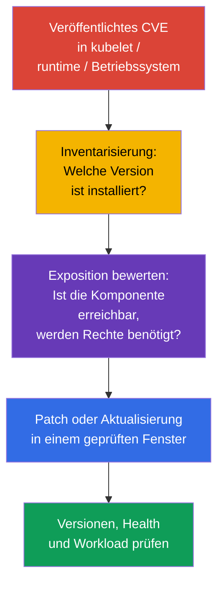
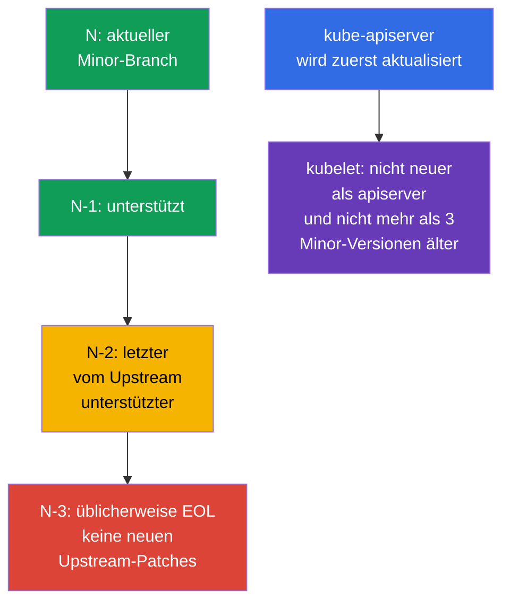

[Русская версия](ru.md) · [Eng version](README.md) · [Versión en español](es.md) · [Version française](fr.md) · [ქართული ვერსია](ge.md) · [繁體中文版](tw.md) · [日本語版](jp.md)

# Kapitel 13. Kubernetes aktualisieren, um Schwachstellen zu beheben

> **Das Problem.** Ein veröffentlichtes CVE in kubelet, API server, container runtime oder Kernel bleibt ein möglicher Weg von einem kompromittierten Pod oder Netzwerk zu Node und Cluster, bis die verwundbare Version ersetzt wird. Ein EOL-Branch erhält möglicherweise überhaupt keine Behebung, und eine falsche Aktualisierungsreihenfolge führt zu Ausfallzeit oder Inkompatibilität statt zu sicherer Remediation.

> **Was kommt als Nächstes.** In Kapitel 12 haben wir den Zugriff auf die Kubernetes API eingeschränkt. Eine korrekt konfigurierte API schützt jedoch nicht vor einer bekannten Schwachstelle in `kube-apiserver`, kubelet oder container runtime. Eine Aktualisierung ist ein Security-Control: Sie verkürzt die Zeit, in der ein Angreifer ein veröffentlichtes CVE ausnutzen kann. Dies ist die CKS-Domain **Cluster Hardening** (15%): Sie müssen die Dringlichkeit eines Advisory beurteilen, Version Skew einhalten und den Cluster ohne neue Angriffsfläche und ohne Ausfallzeit aktualisieren können.

> **Was Sie aus CKA benötigen.** Die vollständige Prozedur `kubeadm upgrade`, der Unterschied zwischen `apply` und `node`, `cordon`/`drain`/`uncordon`, PodDisruptionBudget und Betriebssystemaktualisierungen sind eigenständige Lifecycle-Fähigkeiten. Hier halten wir die notwendige Sicherheitsreihenfolge fest: CVE, EOL, Advisories, Version Skew, Evidence und Node-Abhängigkeiten.

> 🧠 Ein Patch verkürzt das Ausnutzungsfenster; bei der Priorisierung zählen Erreichbarkeit, Voraussetzungen und die Exposition des Clusters, nicht nur CVSS.

## 13.1. Warum ein Patch ein Security-Control ist

Ein CVE in einer Kubernetes-Komponente, container runtime oder im Node-Kernel kann einem Angreifer einen Weg von einem Pod zu Daten, der Kubernetes API oder dem Node selbst eröffnen. Eine typische Kette: Für die installierte Version wird ein Exploit veröffentlicht -> der Angreifer erhält Zugang zu einem Workload oder zum Control-Plane-Netzwerk -> er nutzt die verwundbare Komponente aus, bevor das Team die Behebung einspielt. Firewall, RBAC und NetworkPolicy reduzieren die Exposition, beheben aber keinen Fehler im Code.



**Bedrohungsmodell.** Nehmen Sie nicht an, dass ein CVE nur bei einem öffentlichen Endpoint gefährlich ist. Beispielsweise kann ein Fehler in `kubelet` von einem bereits kompromittierten Pod oder einem benachbarten Node aus erreichbar sein, und ein Fehler in `runc` aus einem Container, der bereits im Cluster läuft. Die Reaktion hängt daher nicht allein von CVSS ab: Voraussetzungen, Erreichbarkeit der verwundbaren Funktion, das Vorhandensein eines öffentlichen Exploit, kompensierende Controls und der Wert der betroffenen Nodes sind wichtig.

**EOL (End of Life)** ist ein separates Risiko. Für einen Branch, der nicht mehr vom Upstream oder der Distribution unterstützt wird, können neue CVE-Behebungen überhaupt nicht mehr erscheinen. Ein kompensierendes Control macht eine EOL-Version nicht zu einer unterstützten Version: Es wird ein Plan für den Wechsel zu einem unterstützten Minor-Branch oder Support vom Anbieter mit klar definiertem Zeitraum benötigt.

Praktische Reaktion auf ein Advisory:

1. Erfassen Sie die betroffenen Komponenten und exakten Versionen, einschließlich managed control plane, Worker Pools, `containerd`, `runc`, Betriebssystem und CNI.
2. Gleichen Sie die Ausnutzungsbedingungen des CVE mit Ihrer Konfiguration, Netzwerkerreichbarkeit und den Rechten des Angreifers ab. Ignorieren Sie ein CVE nicht nur wegen fehlenden externen Zugriffs.
3. Wählen Sie die behobene Version aus dem Advisory, prüfen Sie Support-Policy und Kompatibilität, testen Sie in Stage und führen Sie dann ein Rollout mit Prüfung und Rollback aus.
4. Ist ein sofortiger Patch nicht möglich, begrenzen Sie die Exposition vorübergehend entsprechend den Empfehlungen des Advisory, bestimmen Sie einen Verantwortlichen und eine Frist. Eine vorübergehende Mitigation darf nicht dauerhaft bleiben.

> 🏭 Release Cadence und Support Window bestimmen den Lifecycle: Ein unterstützter Cluster lässt sich leichter patchen, als aus EOL dringend migriert werden muss.

## 13.2. Release Cadence, Support Window und Version Skew

Kubernetes veröffentlicht Minor-Versionen regelmäßig, üblicherweise dreimal im Jahr, und Patch-Releases erscheinen, sobald Behebungen bereitstehen. Das genaue Datum und die Liste der Behebungen müssen aus den Release Notes des jeweiligen Branch stammen, nicht aus einem alten Runbook. Upstream unterstützt üblicherweise die drei neuesten Minor-Branches: das aktuelle `N`, `N-1` und `N-2`. Folglich ist `N-3` in der Regel bereits EOL; bei einem managed Service oder einer Enterprise-Distribution kann das Fenster abweichen und muss separat geprüft werden.

In diesem Lab bezeichnet Kubernetes `v1.36` die **Zielversion (Target)** des Beispiels, nicht die "aktuelle stabile" Kubernetes-Version und keine Zusage zu ihrem aktuellen Support Window. Gleichen Sie vor einem tatsächlichen Change Window den wirklich unterstützten Ziel-Branch und den behobenen Patch aus dem Advisory ab. Der Wechsel erfolgt schrittweise, jeweils um eine Minor-Version, zum Beispiel `v1.34` -> `v1.35` -> `v1.36`; innerhalb eines Branch kann direkt auf die behobene Version aktualisiert werden. Dieser Rhythmus lässt Zeit für Tests und verwandelt ein dringendes CVE nicht in ein Migration-Projekt über mehrere Versionen.



> 🎯 Aktualisieren Sie zuerst die Control Plane; kubelet darf nicht neuer als `kube-apiserver` und nicht mehr als drei Minor-Versionen älter sein.

**Version Skew** begrenzt die Aktualisierungsreihenfolge. Prüfen Sie für jeden kubelet zwei Grenzen in Bezug auf seinen `kube-apiserver`:

1. kubelet darf **nicht neuer** als der API server sein;
2. kubelet darf **nicht mehr als drei Minor-Versionen älter** als der API server sein.

Daraus folgt die Reihenfolge: Zuerst wird die Control Plane aktualisiert, dann die Worker Nodes. Zulässiger Skew ist ein vorübergehender Zustand für ein kurzes Rolling Upgrade, nicht der Normalzustand alter Nodes über Monate. Der Bereich für andere Komponenten hängt von Version und Rolle ab; prüfen Sie vor einer Änderung die offizielle [Version-Skew-Policy](https://kubernetes.io/releases/version-skew-policy/).

**HA Control Plane.** Instanzen von `kube-apiserver` dürfen sich höchstens um eine Minor-Version unterscheiden. Solange im Cluster ein alter API server bleibt, begrenzt gerade dieser die obere kubelet-Grenze: kubelet darf nicht neuer als **irgendein** API server sein. Bei API servern `1.37` und `1.36` sind beispielsweise kubelet `1.36`, `1.35` und `1.34` zulässig; kubelet `1.37` ist wegen API server `1.36` nicht zulässig.

**Control-Plane-Manager.** `kube-controller-manager`, `kube-scheduler` und `cloud-controller-manager` dürfen nicht neuer als `kube-apiserver` sein. Üblicherweise werden sie auf derselben Minor-Version gehalten; im zulässigen Skew dürfen sie höchstens eine Minor-Version älter als der entsprechende API server sein.

Prüfen Sie vor einem Ziel-Minor-Upgrade außerdem entfernte APIs bei Anwendungen, Helm-Charts, Operators und Add-ons. Die Behebung eines CVE darf nicht das nächste Deployment aufgrund einer entfernten `apiVersion` brechen; bewahren Sie ein Inventar vor dem Change Window auf und beheben Sie gefundene Abhängigkeiten vor dem Upgrade.

> 🏭 Advisory und exaktes Inventar dokumentieren betroffene Versionen, Verantwortliche für die Remediation, SLA, Evidence der Behebung und vorübergehende Mitigation.

## 13.3. Advisories, CVE Feed und Versionsinventarisierung

Die Entscheidungsquelle ist das primäre Advisory, nicht nur ein CVE-Aggregator. Für Kubernetes sind dies die [Security Advisories](https://kubernetes.io/docs/reference/issues-security/security/) und Release Notes; für Betriebssystem, Cloud-Anbieter, CNI und runtime das Advisory des jeweiligen Herstellers. NVD, GitHub Advisory Database und unternehmensweite CVE Feeds sind für Benachrichtigungen und Suche hilfreich, können aber hinterherhinken, unvollständige Versionsbereiche enthalten oder Konfigurationsbedingungen nicht beschreiben.

| Was prüfen | Wo suchen | Warum |
|---|---|---|
| Kubernetes CVE und behobene Version | Kubernetes Security Advisory, Release Notes | Betroffenen Bereich, Voraussetzungen und die Version mit Behebung verstehen |
| Support des Branch | Upstream Release/Support-Policy oder Anbieter-Policy | Keinen EOL-Branch ohne nachfolgende Patches wählen |
| Client-/Server-Version | `kubectl version --output=yaml` | Server mit Advisory abgleichen; Client beweist keine Node-Version |
| Version jedes Node | `kubectl get nodes -o wide`, `kubectl describe node` | Zurückgebliebene kubelet und gemischtes Rollout finden |
| Runtime- und Betriebssystempakete | Paketmanager, SBOM/Asset-Inventar, Vendor Advisory | Kubernetes-Patch behebt nicht `containerd`, `runc`, Kernel oder OpenSSL |

```bash
# Versionen von kubectl und API server. Geben Sie keine Credentials aus kubeconfig in ein Ticket oder einen Chat aus.
kubectl version --output=yaml

# kubelet-Versionen auf allen Nodes und deren Zustand.
kubectl get nodes -o wide
kubectl get nodes -o custom-columns=NAME:.metadata.name,KUBELET:.status.nodeInfo.kubeletVersion,OS:.status.nodeInfo.osImage

# Auf einem bestimmten Node: Version und Herkunft der Pakete hängen von der Distribution ab.
kubeadm version -o short
containerd --version
runc --version
uname -r
```

`kubectl version` erkennt den API server, ersetzt aber nicht die Inventarisierung von Control-Plane-Paketen und Worker Node. In managed Kubernetes kann der Anbieter die Control Plane aktualisieren: Prüfen Sie dennoch Control-Plane-Version, Support-Kalender, Node-Image/AMI und die Frist, nach der der Anbieter den Support für den Branch beendet.

Eine nützliche Gewohnheit ist ein Patch-SLA: Ein kritisches CVE mit einem erreichbaren Exploit erhält ein kurzes Reaktionsfenster, andere das nächste geplante Fenster. Severity allein ist keine Priorität: Ein CVE mit geringerem CVSS, aber ohne Authentication in einer von außen erreichbaren Komponente, kann wichtiger sein als ein lokales CVE mit schwierigen Voraussetzungen.

> 🎯 Reihenfolge: Preflight → erste Control Plane mit `kubeadm upgrade apply` → Health → jeder Worker mit `kubeadm upgrade node`, `cordon`/`drain`, kubelet, Prüfung und `uncordon`.

## 13.4. Sicheres `kubeadm` Upgrade: zuerst Control Plane, dann Nodes

Lernen Sie keine selbstgebauten Package/Repository-Skripts auswendig und kopieren Sie sie nicht: Die konkreten Befehle hängen von Target Minor, Betriebssystem, Package Manager und Node-Zustand ab. Öffnen Sie in der Prüfung und in der Praxis die offizielle Kubernetes-Dokumentation für die benötigte Version und führen Sie deren Schritte in Reihenfolge aus. Das ist zuverlässiger, als Befehle aus dem Gedächtnis zu rekonstruieren.

### Der offizielle Weg

- [kubeadm-Cluster aktualisieren](https://kubernetes.io/docs/tasks/administer-cluster/kubeadm/kubeadm-upgrade/) - das Hauptdokument: Auswahl der Target-Version, erster und weitere Control-Plane-Nodes, Cluster-Prüfung und Recovery.
- [Linux Nodes aktualisieren](https://kubernetes.io/docs/tasks/administer-cluster/kubeadm/upgrading-linux-nodes/) - separate Reihenfolge für einen Linux Worker Node.
- [Kubernetes-Package-Repository wechseln](https://kubernetes.io/docs/tasks/administer-cluster/kubeadm/change-package-repository/) - verwenden Sie dies, wenn Target Minor einen Wechsel des `pkgs.k8s.io`-Repository erfordert.
- [Einen Node sicher drainen](https://kubernetes.io/docs/tasks/administer-cluster/safely-drain-node/) - Verhalten von `drain`, PodDisruptionBudget und DaemonSet.
- [Version-Skew-Policy](https://kubernetes.io/releases/version-skew-policy/) - Kompatibilitätsgrenzen, wenn die Aufgabenstellung Zweifel weckt.

Wenn Target Minor vom aktuellen Upstream abweicht, wechseln Sie in der Dokumentation den Versionsselektor auf den entsprechenden Branch: Befehle und Package-Versionen müssen genau zum Target Release gehören, nicht zu einem Beispiel aus einem Lernzettel.

### Der kurze Prüfungsweg

1. Lesen Sie die Aufgabe und bestimmen Sie aktuelle und Zielversion; überspringen Sie keine Minor-Versionen und verletzen Sie Version Skew nicht.
2. Öffnen Sie den Haupt-Guide. Folgen Sie auf der ersten Control Plane dessen Schritten: Aktualisieren Sie `kubeadm`, führen Sie `kubeadm upgrade plan` und dann `kubeadm upgrade apply <target-version>` aus. Führen Sie danach für diesen Node gemäß demselben Guide `drain`, die Aktualisierung von `kubelet`/`kubectl`, den Neustart von kubelet, die Prüfung von Node und Control-Plane-Komponenten sowie `uncordon` aus.
3. Aktualisieren Sie bei HA die übrigen Control-Plane-Nodes einzeln über `kubeadm upgrade node` und wiederholen Sie danach für **jeden** denselben Lifecycle `drain` → kubelet/kubectl → Neustart → Prüfung → `uncordon`. Stellen Sie sicher, dass die API verfügbar bleibt, und wechseln Sie nicht zu den Workern, solange die Control Plane nicht healthy ist.
4. Öffnen Sie für jeden Worker Node den Linux-Node-Guide und führen Sie ihn der Reihe nach aus: `kubeadm` aktualisieren → `kubeadm upgrade node` → `drain` → `kubelet`/`kubectl` aktualisieren → kubelet neu starten → `Ready` und Version prüfen → `uncordon`.
5. Bestätigen Sie am Ende `Ready` für alle Nodes und die erwarteten Versionen. Schlägt `drain`, Preflight oder Health Check fehl, halten Sie an und untersuchen Sie die Ursache; fügen Sie nicht willkürlich `--force`, `--disable-eviction` oder `--ignore-preflight-errors` hinzu.

> 🎯 **CKS Core.** In der Prüfung ist Dokumentation Teil des Arbeitsablaufs: Öffnen Sie den Guide, gleichen Sie den aktuellen Schritt mit der Aufgabe ab und führen Sie ihn wortgetreu aus. Sie müssen keine Custom Automation erstellen oder ein Production Change Runbook reproduzieren.

### Produktionsgrenze

Vor einer Production Change lesen Sie zusätzlich Advisory und Release Notes, prüfen Backup, CNI/CSI/runtime-Kompatibilität, Capacity und getestetes Rollback. Das ändert nicht die `kubeadm`-Reihenfolge, entscheidet aber, ob ein Rollout sicher begonnen werden kann.

> 🏭 Production. In der Produktion werden Evidence dokumentiert, Stage und ein progressives Rollout durchgeführt; Details hängen von der Platform ab und sind kein Befehlssatz für die Prüfung.

## 13.5. Runtime und Betriebssystem: Kubernetes ist nicht die einzige CVE-Quelle

Ein Patch für `kube-apiserver` aktualisiert nicht `containerd`, `runc`, Kernel, OpenSSL, `systemd` und Betriebssystempakete. Für einen Angriff aus einem Container sind runtime und Kernel oft die Grenze zwischen Workload und Node. Inventar und Patch-Policy müssen daher das gesamte Node-Image umfassen.

| Abhängigkeit | Risiko bei Rückstand | Vor dem Rollout prüfen |
|---|---|---|
| `containerd` und CRI | CVE, inkompatibles CRI, Änderung von Konfiguration/Socket | Unterstützung der Kubernetes-Zielversion, `SystemdCgroup`, Service Health und Node-Image |
| `runc` | Container Escape bei einer Runtime-Schwachstelle | Behobene Version aus dem Advisory und Package-Abhängigkeit von containerd |
| Kernel und Betriebssystempakete | Privilege Escalation, Network/Filesystem-CVE | Betriebssystem-Support, Vendor Security Update, Reboot-Anforderung und Node-Image |
| cgroups/systemd | kubelet/runtime startet nicht oder erhält unterschiedliche cgroups | Einheitlicher cgroup Driver und cgroup-v2-Unterstützung in Betriebssystem und runtime |
| CNI, CSI, CoreDNS | Netzwerk, Storage oder DNS werden nach Change nicht wiederhergestellt | Compatibility Matrix und Smoke Test in Stage |

### Cgroup-v2-Baseline für Kubernetes v1.35+

Führen Sie vor der Planung eines Wechsels auf Kubernetes v1.35+ den Preflight **auf jedem Node** aus: kubelet und runtime müssen mit cgroup v2 und einem abgestimmten `systemd` cgroup Driver arbeiten. `failCgroupV1` ist ein Feld der `KubeletConfiguration`, kein Feature Gate; sein Standardwert ist seit v1.35 `true`. Deaktivieren Sie es nicht mit `failCgroupV1: false`, um die Nutzung von cgroup v1 zu verlängern: Ein vorübergehender Override ist nur als kurze, dokumentierte Migrationsmaßnahme möglich. Schlägt die Prüfung fehl, migrieren Sie zuerst Betriebssystem/runtime in Stage und prüfen das Node-Image, statt den Preflight in der Produktion zu umgehen.

In Kubernetes v1.36 ist `KubeletCgroupDriverFromCRI` bereits GA. Unterstützt die CRI runtime den `RuntimeConfig`-Aufruf, bezieht kubelet den Driver von der runtime und ignoriert den eigenen `cgroupDriver`; unterstützt die runtime dies nicht, verwendet kubelet den `cgroupDriver` aus seiner Konfiguration. Legen Sie daher die Pfade `/var/lib/kubelet/config.yaml` und `/etc/containerd/config.toml` nicht fest: Bestimmen Sie zuerst die aktiven kubelet-Optionen `--config`/`--config-dir`, die Unit und den Prozess sowie die dokumentierte Config Source der installierten CRI runtime.

```yaml
# In der aktiven KubeletConfiguration, die aus der Startup-Konfiguration ermittelt wurde.
failCgroupV1: true
# cgroupDriver: systemd  # Fallback nur für runtime ohne RuntimeConfig
```

```bash
# Auf jedem Node; ein Exit Code ungleich null bedeutet, dass die cgroup-v2-Baseline noch nicht erfüllt ist.
set -euo pipefail
test "$(stat -fc %T /sys/fs/cgroup)" = 'cgroup2fs'
sudo systemctl cat kubelet containerd crio 2>/dev/null || true
KUBELET_PID=$(pgrep -xo kubelet) || { echo 'kubelet process not found' >&2; exit 2; }
# `sudo cat` öffnet /proc als root. `pipefail` bewahrt einen Lesefehler, während
# fehlendes --config/--config-dir zulässig bleibt und deshalb nur grep || true erhält.
sudo cat "/proc/$KUBELET_PID/cmdline" \
  | tr '\0' '\n' \
  | { grep -E -- '^--config(=|$)|^--config-dir(=|$)' || true; }
sudo journalctl -u kubelet -b --no-pager | grep -Ei 'cgroup|RuntimeConfig' || true
```

Prüfen Sie bei CRI-O, containerd mit nicht standardmäßiger Installation oder einer anderen runtime ihren effektiven Driver in der dokumentierten Runtime-Konfiguration und in den Logs; kopieren Sie einen containerd-Pfad oder das Feld `SystemdCgroup` nicht blind.

Eine sichere Strategie trennt das Risiko: Prüfen Sie zuerst die kompatible Kombination Kubernetes + runtime + Betriebssystem in Stage und rollen Sie dann Node für Node aus. Erfordert ein dringendes Runtime-/Betriebssystem-CVE sofortige Remediation, verwenden Sie denselben Lifecycle: `cordon` -> `drain` -> Patch/Reboot oder Replacement -> Health Check -> `uncordon`. Bei einem immutable Node Pool ist es oft sicherer, einen neuen gepatchten Pool zu erstellen, Workloads per Rolling Replacement zu verschieben und die alten Nodes zu entfernen, als viele Pakete vor Ort zu ändern.

Prüfen Sie beim Aktualisieren des Package-Repository Quelle und Signatur des Repository. Mischen Sie nicht zufällige Versionen aus unterschiedlichen Repositories und führen Sie nicht gleichzeitig eine große Kubernetes-, Runtime- und Betriebssystem-Migration ohne einen dedizierten Test durch: Sonst lassen sich CVE-Remediation und Regression schwer unterscheiden und sicher zurückrollen.

> 🎯 Verletzen Sie Version Skew nicht, aktualisieren Sie nicht alle Nodes gleichzeitig, umgehen Sie PDB oder Preflight nicht ohne Grund und bestätigen Sie das Ergebnis mit Versionen und Health.

## 13.6. Häufige Fehler bei Security-Aktualisierungen

- **"Wir haben keine öffentliche API, das CVE betrifft uns nicht."** Ein verwundbarer kubelet oder eine runtime kann einem internen Angreifer nach der Kompromittierung eines Pod oder Node zugänglich sein.
- **Nur die Control Plane wird gepatcht.** Worker kubelet, `containerd`, `runc` und das Betriebssystem bleiben verwundbar, obwohl `kubectl version` bereits gut aussieht.
- **EOL wird für niedriges Risiko gehalten.** Das Ausbleiben eines neuen Advisory bedeutet, dass kein Patch kommt, nicht dass keine Schwachstellen existieren.
- **Minor-Versionen werden übersprungen oder kubelet vor dem API server aktualisiert.** Dies verletzt Version Skew und schafft einen schwer zu diagnostizierenden Zustand.
- **Alle Nodes werden gleichzeitig aktualisiert oder PDB wird umgangen.** Ein dringendes CVE rechtfertigt nicht den Verlust aller Replikate; bewerten Sie zuerst Exposition und Capacity, führen Sie dann ein Rolling Rollout aus.
- **Nur einem erfolgreichen `kubeadm` wird vertraut.** Der Befehl beweist nicht, dass runtime, CNI, DNS, Storage und Anwendungen tatsächlich auf behobenen Versionen funktionieren.

> 🏭 Security Upgrade: Advisories, Inventar, Support-Policy, Stage, progressives Rollout, Evidence und Stop Conditions bei Health Failure.

## 13.7. Anwendung in der Produktion

- **Patch Management als Prozess.** Das Team abonniert Upstream- und Vendor-Advisories, verknüpft CVE mit dem Inventar, bestimmt ein Severity-basiertes SLA, Verantwortliche, ein Rollout-Fenster und die Bestätigung der Schließung. Das ist besser als einzelne "Aktualisierungstage" einmal jährlich.
- **Nach der Veröffentlichung eines Patch steigt das Risiko.** Der Diff zwischen verwundbarer und behobener Version grenzt häufig den Suchbereich nach der Ursache eines CVE ein und erleichtert Reverse Engineering. Daher erhält ein bekanntes, für einen Angreifer erreichbares und noch nicht behobenes CVE nach Veröffentlichung eines Fixed Patch üblicherweise eine höhere Priorität: Die Wahrscheinlichkeit, dass ein Exploit erscheint oder angepasst wird, steigt. AI-assisted Analyse verringert zusätzlich Kosten und Zeit einer solchen Untersuchung, beweist aber selbst keine Exploitability; Erreichbarkeit, Voraussetzungen und Wert des Assets werden weiterhin bewertet.
- **Kurzer Lag nach dem Release.** Regelmäßiger Wechsel innerhalb des unterstützten Fensters N/N-1/N-2 verringert den Umfang jeder Änderung und lässt Zeit, kritische CVE ruhig zu testen, statt nachts ein Multi-Hop-Upgrade durchzuführen.
- **Stage und progressives Rollout.** Zuerst werden Node-Image und Add-ons getestet, dann ein kleiner Pool/Node aktualisiert, Metriken geprüft und erst danach fortgesetzt. Bei managed Kubernetes werden Fristen für Control Plane und Node Pool separat kontrolliert.
- **Automatisierter, aber beobachtbarer Node-Austausch.** Infrastructure as Code, Golden Image, Maintenance Windows, PDB und Autoscaling machen Aktualisierungen reproduzierbar. Automatisierung muss bei Health Failure anhalten, statt den gesamten Bestand weiter zu ersetzen.
- **Einheitliches SBOM/Asset-Inventar.** Es verknüpft Advisory nicht nur mit Kubernetes, sondern auch mit `containerd`, `runc`, CNI, Betriebssystem und Kernel, damit das Team die zweite Hälfte eines Angriffs auf den Node nicht übersieht.

## 13.8. Mini-Glossar

- **CVE** - Kennung einer öffentlich bekannten Schwachstelle.
- **Security Advisory** - primäre Herstellerbenachrichtigung mit betroffenen Versionen, Ausnutzungsbedingungen, Mitigation und behobener Version.
- **EOL** - Ende der Unterstützung einer Version; neue Upstream Security Patches erscheinen üblicherweise nicht.
- **Release Cadence** - Regelmäßigkeit der Veröffentlichung von Minor- und Patch-Releases.
- **Support Window** - Bereich unterstützter Branches; Upstream Kubernetes hält gewöhnlich `N`, `N-1` und `N-2`.
- **Version Skew** - zulässiger Versionsunterschied von Komponenten; kubelet darf nicht neuer als der API server und nicht mehr als drei Minor-Versionen älter sein.
- **`kubeadm upgrade plan` / `apply` / `node`** - Aktualisierungsplan / Anwendung auf der ersten Control Plane / Aktualisierung der Konfiguration eines bestimmten Node.
- **Rolling Upgrade** - Aktualisierung Node für Node mit Prüfung zwischen den Schritten.
- **`cordon` / `drain` / `uncordon`** - Scheduling verbieten / Workload evakuieren / Node wieder für Scheduling freigeben.
- **Node-Image** - abgestimmtes Image aus Betriebssystem, runtime und Packages für einen Node.

## 13.9. Zusammenfassung des Kapitels

- Eine Aktualisierung ist ein Security-Control: Sie behebt bekannte CVE in Kubernetes, ersetzt aber nicht RBAC, Network Controls und Hardening.
- Ein EOL-Branch ist gefährlich, weil für neue CVE möglicherweise kein Upstream Patch existiert; üblicherweise werden nur `N`, `N-1` und `N-2` unterstützt, während `N-3` bereits EOL ist.
- Advisory und Release Notes sind die primäre Quelle für die behobene Version und CVE-Bedingungen; ein CVE Feed hilft bei Benachrichtigungen, ersetzt aber nicht das Lesen des Advisory und die Inventarisierung der Nodes.
- Halten Sie Version Skew ein: Zuerst wird die Control Plane aktualisiert, kubelet darf nicht neuer als der API server und nicht mehr als drei Minor-Versionen älter sein; Minor-Versionen werden nacheinander durchlaufen.
- Sicheres `kubeadm` Rollout: Preflight und Backup -> Control Plane -> Health Check -> auf einem Worker `kubeadm` -> `kubeadm upgrade node` -> `cordon`/`drain` -> kubelet/kubectl -> Neustart und Prüfung -> `uncordon`.
- Ein Kubernetes-Patch behebt keine CVE in `containerd`, `runc`, Kernel und Betriebssystem; runtime und Node-Image benötigen eine separate Compatibility-Prüfung und Patch-Policy.

## 13.10. Wie dies hilft: in der Prüfung und in der Praxis

**In der Prüfung.** Eine Aufgabe kann die sichere Aktualisierung eines Clusters oder die Erklärung der Versionsreihenfolge verlangen. Bestimmen Sie zuerst aktuelle und Zielversion, verletzen Sie Version Skew nicht, aktualisieren Sie die Control Plane vor dem Worker Node, verwenden Sie `drain` vor der Aktualisierung von kubelet und geben Sie den Node mit `uncordon` zurück. Denken Sie an den Unterschied: Auf dem ersten Control-Plane-Node wird `kubeadm upgrade apply` verwendet, auf einem Worker `kubeadm upgrade node`.

**In der Praxis.** Der Wert dieser Fähigkeit liegt nicht im mechanischen Ausführen von `kubeadm`, sondern in der Verringerung der CVE-Exposition ohne Verlust der Verfügbarkeit. Ein Ingenieur liest das Advisory, bestätigt die betroffenen Versionen, prüft EOL und Abhängigkeiten, testet das Node-Image, arbeitet mit einer Rolling-Welle und beweist danach sowohl die behobene Version als auch die Funktion der Services.

> 🏭 Ein Production Gate dokumentiert Evidence zu Versionen, Readiness und Health; es ersetzt kein getestetes Rollback.

## 13.11. Eigenständige Praxis: Security Upgrade Gate

Dies ist eine eigenständige kontrollierte Simulation für einen kubeadm-Cluster. Sie ersetzt keine tatsächliche Package-Aktualisierung: Ziel ist es, CKS-orientierte Preflight Gates zu durchlaufen, ohne die Version des Trainingsclusters zu ändern. Führen Sie sie nur in einer kurzlebigen Umgebung aus; gleichen Sie die Zertifikatspfade von etcd zuerst mit dem Manifest Ihrer Control Plane ab.

Erstellen Sie ein Evidence-Verzeichnis und dokumentieren Sie den Ausgangszustand:

```bash
export UPGRADE_EVIDENCE=/tmp/cks-upgrade-security
mkdir -p "$UPGRADE_EVIDENCE/before"

kubectl version -o yaml > "$UPGRADE_EVIDENCE/before/version.yaml"
kubectl get nodes -o wide > "$UPGRADE_EVIDENCE/before/nodes.txt"
kubectl get --raw='/readyz?verbose' > "$UPGRADE_EVIDENCE/before/readyz.txt"
```

### Gate 1: kubelet Version Skew und Plan

Dies ist ein begrenztes Gate: Es vergleicht jeden kubelet nur mit einem API server, der `kubectl` antwortete (bei HA kann dies ein Backend des Load Balancer sein), und hält an, wenn kubelet eine der Grenzen verletzt: neuer als dieser API server **oder** mehr als drei Minor-Versionen älter. Es beweist nicht den Skew aller HA API server und prüft `kube-controller-manager`, `kube-scheduler`, `cloud-controller-manager`, `kube-proxy` oder `kubectl` nicht; deren Inventar und Policy werden vor einem Production Rollout separat abgeglichen. Anschließend prüft `kubeadm upgrade plan` verfügbare Ziele, Preflight und Aktualisierungsreihenfolge. Wählen Sie für einen tatsächlichen Wechsel genau den nächsten Minor-Branch.

```bash
set -euo pipefail
SERVER_MINOR=$(kubectl version -o json | jq -r '.serverVersion.minor | sub("[^0-9].*$"; "") | tonumber')
kubectl get nodes -o json | jq -e --argjson server "$SERVER_MINOR" \
  '[.items[] | (.status.nodeInfo.kubeletVersion | capture("v1\\.(?<m>[0-9]+)").m | tonumber)] |
   all(. >= ($server - 3) and . <= $server)' \
  | tee "$UPGRADE_EVIDENCE/before/skew-check.txt"
sudo kubeadm upgrade plan | tee "$UPGRADE_EVIDENCE/before/kubeadm-upgrade-plan.txt"
```

### Gate 2: Backup und überprüfbare Wiederherstellung

Leiten Sie das Vorhandensein von `etcdctl`/`etcdutl` nicht allein aus der Tatsache ab, dass kubeadm installiert ist. Prüfen Sie vor dem Gate die Binaries und ihre Kompatibilität mit der etcd-Version. Wenn die Tools fehlen, installieren Sie vorher eine geprüfte und festgelegte kompatible Version aus einer vertrauenswürdigen Quelle oder verwenden eine genehmigte Operational Image/Toolbox. Laden Sie während eines Change Window nicht direkt `latest` herunter.

```bash
set -euo pipefail
command -v etcdctl >/dev/null 2>&1 || {
  echo 'ERROR: etcdctl is not installed on this control-plane node' >&2
  exit 1
}
command -v etcdutl >/dev/null 2>&1 || {
  echo 'ERROR: etcdutl is not installed on this control-plane node' >&2
  exit 1
}
etcdctl version
etcdutl version
```

Erstellen Sie auf dem Control-Plane-Node einen Snapshot mit TLS-Parametern aus `/etc/kubernetes/manifests/etcd.yaml` und prüfen Sie ihn anschließend mit `etcdutl snapshot status`. Führen Sie kein Restore über einem laufenden etcd aus: Schreiben Sie den exakten Restore-Befehl in das Runbook und üben Sie ihn in einem separaten Cluster.

```bash
set -euo pipefail
sudo ETCDCTL_API=3 etcdctl snapshot save /var/backups/etcd-pre-upgrade.db \
  --endpoints=https://127.0.0.1:2379 \
  --cacert=/etc/kubernetes/pki/etcd/ca.crt \
  --cert=/etc/kubernetes/pki/etcd/healthcheck-client.crt \
  --key=/etc/kubernetes/pki/etcd/healthcheck-client.key
sudo etcdutl snapshot status /var/backups/etcd-pre-upgrade.db -w json \
  | tee "$UPGRADE_EVIDENCE/before/etcd-snapshot-status.json"
sudo sha256sum /var/backups/etcd-pre-upgrade.db \
  | tee "$UPGRADE_EVIDENCE/before/etcd-snapshot.sha256"
```

### Gate 3: Deprecated API und Security-Konfiguration

Prüfen Sie nicht nur Manifeste in Git, sondern auch die tatsächliche Nutzung deprecated APIs anhand der Metrik des API server. Das direkte `kubectl get --raw /metrics` unten erhält Metriken nur von einem ausgewählten API server Backend und ist bei HA deshalb nur lokale Evidence, kein vollständiges Inventar. Aggregieren Sie für Production HA den Scrape **aller** API server im Monitoring (zum Beispiel mit PromQL `max by (group, version, resource, subresource, removed_release) (apiserver_requested_deprecated_apis) > 0`) oder gleichen Sie die Audit Events jedes API server ab. Jede Zeile mit einem Wert größer als null erhält vor dem Upgrade einen Verantwortlichen und eine Remediation. Dokumentieren Sie Admission und kritische RBAC-Berechtigungen; die detaillierte Pod Security Admission Konfiguration wird in Kapitel 19 behandelt, nicht in dieser Upgrade-Praxis.

```bash
set -euo pipefail
# Dies ist Evidence nur für das ausgewählte API server Backend; bei HA die oben beschriebene Aggregation verwenden.
kubectl get --raw /metrics \
  | awk '/^apiserver_requested_deprecated_apis/ && $NF > 0' \
  | tee "$UPGRADE_EVIDENCE/before/deprecated-apis.txt"

```

### Produktionshinweis: Erhalt benutzerdefinierter Security Flags

Bei einem self-hosted kubeadm Production Upgrade kann das Team die Static Pod Manifests aus `ClusterConfiguration` überschreiben. Custom Audit-, Encryption- und Profiling-Einstellungen müssen daher in Infrastructure as Code dokumentiert und in der Change-/Rollback-Prozedur separat geprüft werden.

> 🏭 **Production.** Dies ist ein Operational Control für eine bestimmte Platform Implementation, nicht 🎯 CKS Core und kein verpflichtendes Before/After Static-Pod Runbook dieses Kapitels.

### Kontrollierte Simulation und Post-Upgrade-Validierung

In der Trainingssimulation wird kein separates Bash Runbook für Post-Upgrade Evidence benötigt: Es lenkt von der Prüfungsreihenfolge ab. Bestätigen Sie nach der in der Aufgabe angegebenen Upgrade-Prozedur, dass Control Plane und kubelet die erwarteten Versionen haben und Version Skew einhalten, `/readyz` erfolgreich ist und alle Nodes `Ready` sind. Prüfen Sie dann `kube-system` und einen kritischen Workload; halten Sie bei einem Problem an, sammeln Sie Events und wechseln Sie nicht zum nächsten Node.

Speichern Sie für ein tatsächliches Rollout zusätzlich die exakten Versionen vor/nachher, den Status des geprüften etcd Snapshot, die Ergebnisse der Health-/Smoke-Tests und getestetes Rollback. Änderungen an Custom RBAC oder Admission Policy werden mit einer projektspezifischen Prozedur abgeglichen, statt sie durch einen allgemeinen YAML Diff für sicher zu erklären.

> 🎯 **CKS Core.** Folgen Sie in der Prüfung nur den Bedingungen der Aufgabe: Die Control Plane wird vor dem Worker aktualisiert, verwenden Sie vor dessen Aktualisierung `cordon`/`drain` und geben Sie den Node nach der Prüfung über `uncordon` zurück.

## 13.12. Fragen zur Selbstkontrolle

<details>
<summary>1. Warum kann ein CVE in kubelet oder `runc` kritisch sein, selbst wenn der API server nicht aus dem Internet erreichbar ist?</summary>

kubelet kann für einen Angreifer aus einem bereits kompromittierten Pod oder einem benachbarten Node erreichbar sein, und eine Schwachstelle in `runc` kann aus einem bereits laufenden Container ausgenutzt werden. Das Fehlen einer öffentlichen API beseitigt daher nicht die internen Voraussetzungen eines Angriffs. Die Priorität richtet sich nach Erreichbarkeit der verwundbaren Funktion, erforderlichen Rechten, Exploit und Wert des Node, nicht allein nach der externen Exposition.
</details>

<details>
<summary>2. Wodurch unterscheidet sich ein EOL-Branch bei einem folgenden CVE von einem unterstützten Branch?</summary>

Für einen unterstützten Branch veröffentlicht Upstream oder Anbieter einen behobenen Patch im Rahmen der Support Policy. Bei einem EOL-Branch kann die nächste Schwachstelle überhaupt ohne neuen Security Patch bleiben. Kompensierende Controls machen eine EOL-Version nicht zu einer unterstützten Version; daher ist ein Wechsel zu einem unterstützten Minor-Branch oder klar begrenzter Anbieter-Support nötig.
</details>

<details>
<summary>3. Welche Branches gehören üblicherweise zum Upstream Support Window `N`/`N-1`/`N-2` und was bedeutet `N-3`?</summary>

Upstream Kubernetes unterstützt üblicherweise den aktuellen Minor-Branch `N` und die zwei vorherigen: `N-1` und `N-2`. `N-3` ist gewöhnlich bereits EOL und erhält keine neuen Upstream Security Patches. Das tatsächliche Fenster eines managed Service oder einer Enterprise-Distribution kann abweichen und muss deshalb separat geprüft werden.
</details>

<details>
<summary>4. Warum reichen CVSS und ein CVE Feed nicht für die Entscheidung über die Dringlichkeit einer Aktualisierung aus?</summary>

CVSS beschreibt nicht die konkrete Exposition eines Clusters: Es werden Voraussetzungen, Erreichbarkeit der Funktion, Angreiferzugriff, ein öffentlicher Exploit und kompensierende Controls benötigt. Ein CVE Feed ist für Benachrichtigungen hilfreich, kann aber hinterherhinken oder genaue Bereiche und Bedingungen nicht enthalten. Die Entscheidung beruht auf dem primären Vendor-/Upstream-Advisory, der behobenen Version, dem Inventar und der Support Policy.
</details>

<details>
<summary>5. Warum wird die Control Plane vor Worker Nodes aktualisiert, warum darf kubelet nicht neuer als der API server sein und nicht mehr als drei Minor-Versionen hinter ihm zurückliegen?</summary>

Version Skew verlangt, dass kubelet nicht neuer als kube-apiserver und nicht mehr als drei Minor-Versionen älter ist; deshalb wird zuerst die Control Plane angehoben. Bei HA begrenzt ein alter API server die zulässige obere kubelet-Version ebenfalls, solange er im Cluster bleibt. Dieser Skew ist nur während eines Rolling Upgrade zulässig, nicht als dauerhafter Zustand.
</details>

<details>
<summary>6. Nennen Sie die sichere Aktualisierungsreihenfolge eines Worker Node mit `kubeadm`.</summary>

Nach einer healthy Control Plane wird auf dem Worker `kubeadm` aktualisiert und `kubeadm upgrade node` ausgeführt, anschließend erfolgen von einer administrativen Maschine `cordon` und `drain` unter Berücksichtigung von PDB und Capacity. Danach werden Target `kubelet` und `kubectl` installiert, kubelet neu gestartet und `Ready`, Version und Workload Smoke Test geprüft. Erst danach folgt `uncordon` und der Wechsel zum nächsten Node.
</details>

<details>
<summary>7. Welche Prüfungen sind nach einem erfolgreichen `kubeadm upgrade` notwendig, um sowohl den Security Patch als auch die Funktion des Clusters zu belegen?</summary>

Prüfen Sie die tatsächlichen Versionen von Control Plane und kubelet mit `kubectl version --output=yaml` und `kubectl get nodes -o wide`, nicht nur den Exit Code von `kubeadm`. Bestätigen Sie Health über `/readyz?verbose`, den Zustand aller Node `Ready`, `kube-system`, kritische DaemonSet/Deployment, Events und Workload Smoke Tests. Prüfen Sie zusätzlich Alerts und das Fehlen von Problemen bei runtime, CNI, DNS und Storage.
</details>

<details>
<summary>8. Warum behebt eine Kubernetes-Aktualisierung CVE in `containerd`, `runc` oder Kernel nicht automatisch, und wie werden diese sicher aktualisiert?</summary>

Kubernetes-Packages aktualisieren unabhängige runtime, Kernel und Betriebssystempakete nicht, obwohl gerade diese oft die Grenze zwischen Container und Node bilden. Ihre Versionen und Kompatibilität mit Kubernetes werden anhand von Vendor Advisory, Inventar und Node-Image abgeglichen. Das Rollout erfolgt mit demselben kontrollierten Lifecycle: Stage, dann Node für Node `cordon`/`drain`, Patch oder Reboot/Replacement, Health Check und `uncordon`.
</details>

<details>
<summary>9. **Rückblick (Kapitel 26).** Version Skew (dieses Kapitel) und Image Digest Pinning (Kapitel 26) behandeln beide die Anforderung, dass "welche genaue Version gerade läuft" eine überprüfbare Tatsache und keine Annahme sein muss. Worin liegt der Unterschied zwischen "Version compatible" (Version Skew) und "Version identical" (Digest), und warum reicht für kubelet/API server das Erste, während bei einem Container Image in der Produktion das Zweite zwingend ist?</summary>

Version Skew legt die zulässige Beziehung zwischen Minor-Versionen zusammenwirkender Komponenten fest: kubelet und API server dürfen unterschiedlich, aber im angegebenen Bereich kompatibel sein. Ein Digest identifiziert dagegen die konkreten unveränderlichen Bytes eines Image; ein Tag bietet diese Garantie nicht. Für den Rolling Lifecycle von Kubernetes ist eingeschränkte Versionskompatibilität nötig, ein Production Image muss jedoch reproduzierbar auf exakten Inhalt festgelegt sein.
</details>

## Praxis

Die Übung 13.11 deckt die CKS-orientierten Security Gates vollständig ohne externes Material ab. Im Kapitel 14 gehen wir zur Minimierung der Node-Angriffsfläche und zur Sicherheit des Runtime-Daemon über.

🧪 Lab 113 (Control Plane und Worker mit `kubeadm` aktualisieren, Evidence für fehlende Downtime): [tasks/cks/labs/113](../../labs/113/README_DE.MD)

🎮 Killercoda (im Browser, ohne Installation): [Kubernetes aktualisieren](https://killercoda.com/chadmcrowell/course/cka/upgrade-k8s) · [Kubelet aktualisieren](https://killercoda.com/chadmcrowell/course/cka/upgrade-kubelet)

## Gemischter Checkpoint: Cluster Hardening abgeschlossen

Bevor Sie zu System Hardening übergehen, prüfen Sie 15-20 Minuten lang ohne Hinweise, ob die Domain Cluster Hardening (Kapitel 10-13) gefestigt ist:

1. Erstellen Sie eine eng gefasste Role/RoleBinding für ein Test-Subject und zeigen Sie mit zwei `can-i`-Prüfungen, dass `get pods` erlaubt, `delete pods` jedoch verboten ist (Kapitel 10).
2. Deaktivieren Sie `automount` beim `default` ServiceAccount in einem Test-Namespace und belegen Sie, dass ein neuer Pod ohne expliziten SA keine Token-Datei erhält (Kapitel 11).
3. Prüfen Sie, ob anonymous access auf dem API server aktiviert ist, und erklären Sie den Unterschied zwischen `401` und `403` in der Antwort (Kapitel 12).
4. **Gemischte Aufgabe.** Nehmen Sie NetworkPolicy Default-Deny (Kapitel 04, Domain Cluster Setup) und RBAC Default-Deny (Kapitel 10, diese Domain): Erklären Sie, warum das Fehlen einer expliziten Regel in beiden Fällen Verbot und nicht Erlaubnis bedeutet und worin sich unterscheidet, wer diese Entscheidung trifft (API server RBAC Authorizer gegenüber CNI Plugin).
5. Nennen Sie die sichere Aktualisierungsreihenfolge der Control Plane mit `kubeadm` und erklären Sie, warum kubelet nicht neuer als der API server sein darf (Kapitel 13).

Wenn Aufgabe 4 Schwierigkeiten bereitet hat, kehren Sie gemeinsam zu Kapitel 04 und 10 zurück.

---
[Inhaltsverzeichnis](../README_DE.md) · [Kapitel 12](../12/de.md) · [Kapitel 14](../14/de.md)
