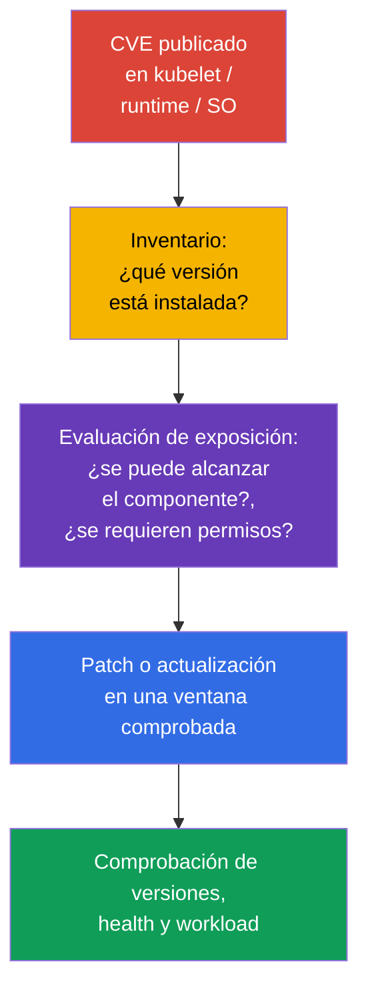
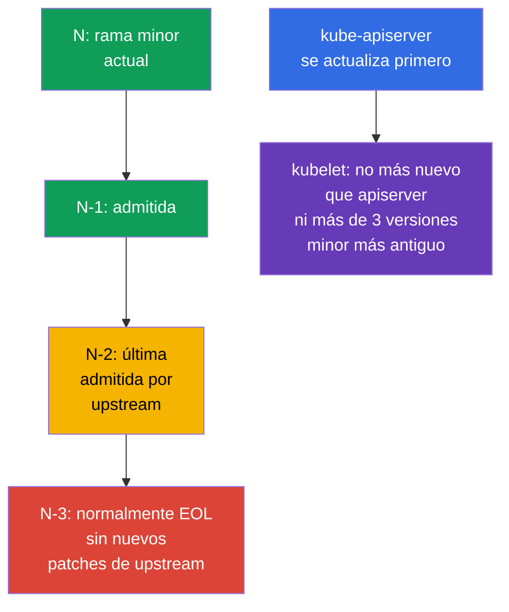

[Русская версия](ru.md) · [Eng version](README.md) · [Version française](fr.md) · [Deutsche Version](de.md) · [ქართული ვერსია](ge.md) · [繁體中文版](tw.md) · [日本語版](jp.md)

# Capítulo 13. Actualización de Kubernetes para corregir vulnerabilidades

> **El problema.** Un CVE publicado en kubelet, API server, container runtime o el kernel
> sigue siendo una vía activa desde un Pod comprometido o la red hacia el nodo y el clúster,
> hasta que se sustituye la versión vulnerable. Una rama EOL puede no recibir ninguna
> corrección, y un orden de actualización incorrecto añade indisponibilidad o incompatibilidad
> en vez de remediation segura.

> **Qué sigue.** En el capítulo 12 redujimos el acceso a la API de Kubernetes. Pero una API
> configurada correctamente no protege de una vulnerabilidad conocida en `kube-apiserver`,
> kubelet o container runtime. La actualización es un control de seguridad: reduce el tiempo
> durante el que un atacante puede usar un CVE publicado. Es el dominio **Cluster Hardening**
> de CKS (15%): hay que saber evaluar la urgencia de un advisory, respetar version skew y
> actualizar el clúster sin crear una nueva superficie de ataque ni causar indisponibilidad.

> **Lo que debes saber de CKA.** El procedimiento completo de `kubeadm upgrade`, la diferencia
> entre `apply` y `node`, `cordon`/`drain`/`uncordon`, PodDisruptionBudget y la actualización
> del SO son una habilidad de lifecycle aparte. Aquí fijamos la secuencia de seguridad
> necesaria: CVE, EOL, advisories, version skew, evidence y dependencias del nodo.

> 🧠 Un patch reduce la ventana de explotación; la prioridad considera reachability, prerequisites y la exposición del clúster, no solo CVSS.

## 13.1. Por qué un patch es un control de seguridad

Un CVE en un componente de Kubernetes, container runtime o el kernel de un nodo puede abrir
al atacante un camino desde un Pod hacia datos, la API de Kubernetes o el propio nodo. La
cadena típica es: se publica un exploit para la versión instalada -> el atacante obtiene
acceso a un workload o a la red del control plane -> usa el componente vulnerable antes de
que el equipo instale la corrección. Firewall, RBAC y NetworkPolicy reducen la exposición,
pero no corrigen un defecto en el código.



**Modelo de amenazas.** No se debe asumir que un CVE es peligroso solo con un endpoint
público. Por ejemplo, un fallo en `kubelet` puede ser accesible desde un Pod ya comprometido
o un nodo vecino, y un defecto en `runc` desde un contenedor que ya se ejecuta en el clúster.
Por ello, la respuesta no depende solo de CVSS: importan los prerequisites, la disponibilidad
de la función vulnerable, la existencia de un exploit público, los controls compensatorios y
el valor de los nodos afectados.

**EOL (End of Life)** es un riesgo aparte. Para una rama que upstream o la distribución ya no
admite, es posible que no aparezcan nuevas correcciones de CVE. Un control compensatorio no
convierte una versión EOL en una versión admitida: se necesita un plan para pasar a una rama
minor admitida o soporte del proveedor con un plazo definido explícitamente.

Respuesta práctica ante un advisory:

1. Registra los componentes afectados y las versiones exactas, incluidos control plane
   gestionado, worker pools, `containerd`, `runc`, SO y CNI.
2. Relaciona las condiciones de explotación del CVE con tu configuración, disponibilidad de
   red y permisos del atacante. No ignores un CVE solo por no haber acceso externo.
3. Elige la versión corregida del advisory, comprueba la support policy y la compatibilidad,
   pruébala en stage y luego realiza el rollout con verificación y rollback.
4. Si un patch inmediato no es posible, reduce temporalmente la exposición según las
   recomendaciones del advisory, asigna un responsable y una fecha límite. Una mitigation
   temporal no debe quedarse de forma permanente.

> 🏭 Release cadence y support window establecen el lifecycle: es más fácil aplicar patches a un clúster admitido que migrar urgentemente desde EOL.

## 13.2. Release cadence, support window y version skew

Kubernetes publica versiones minor regularmente, normalmente tres veces al año, y los
patch releases aparecen a medida que están listas las correcciones. La fecha exacta y la
lista de correcciones deben obtenerse de las release notes de la rama concreta, no de un
runbook antiguo. Upstream normalmente admite las tres ramas minor más recientes: la actual
`N`, `N-1` y `N-2`. Por tanto, `N-3` normalmente ya es EOL; en un servicio managed o una
distribución enterprise, la ventana puede variar y debe comprobarse por separado.

En este laboratorio, Kubernetes `v1.36` representa la **versión objetivo (target) del
ejemplo**, no la versión Kubernetes «stable» actual ni una promesa de su support window
vigente. Antes de una ventana de cambio real, comprueba la rama target admitida de hecho y
el patch fixed del advisory. La transición se hace secuencialmente, una versión minor a la
vez, por ejemplo `v1.34` -> `v1.35` -> `v1.36`; el patch dentro de una rama puede actualizarse
directamente a la versión corregida. Este ritmo deja tiempo para pruebas y no convierte un
CVE urgente en un proyecto de migración multiversión.



> 🎯 Actualiza primero el control plane; kubelet no puede ser más nuevo que `kube-apiserver` ni más de tres versiones minor más antiguo que él.

**Version skew** limita el orden de actualización. Para cada kubelet, comprueba dos límites
respecto a su `kube-apiserver`:

1. kubelet **no es más nuevo** que API server;
2. kubelet **no es más de tres versiones minor más antiguo** que API server.

De ello se desprende el orden: primero se actualiza el control plane y luego los nodos de
trabajo. El skew permitido es un estado temporal para un rolling upgrade corto, no el modo
normal de mantener nodos antiguos durante meses. El rango de los demás componentes depende
de la versión y del rol; antes de un cambio consulta la
[policy de version skew](https://kubernetes.io/releases/version-skew-policy/) oficial.

**Control plane de HA.** Las instancias de `kube-apiserver` pueden diferir como máximo una
versión minor. Mientras quede un API server antiguo en el clúster, este restringe el límite
superior de kubelet: kubelet no puede ser más nuevo que **ningún** API server. Por ejemplo,
con API servers `1.37` y `1.36`, se permiten kubelet `1.36`, `1.35` y `1.34`; kubelet `1.37`
no se permite a causa del API server `1.36`.

**Managers de control plane.** `kube-controller-manager`, `kube-scheduler` y
`cloud-controller-manager` no deben ser más nuevos que `kube-apiserver`. Normalmente se
mantienen en la misma versión minor; dentro del skew permitido pueden ser como máximo una
versión minor más antiguos que el API server correspondiente.

Antes de la actualización minor objetivo, revisa también las API eliminadas usadas por
aplicaciones, Helm charts, operadores y add-ons. Corregir un CVE no debe romper el siguiente
deploy por un `apiVersion` eliminado; conserva un inventory antes de la ventana de cambio y
resuelve las dependencias encontradas antes del upgrade.

> 🏭 El advisory y el inventory exacto registran affected versions, responsable de remediation, SLA, evidence de la corrección y mitigation temporal.

## 13.3. Advisories, CVE feed e inventario de versiones

La fuente para decidir es el advisory primario, no solo un agregador de CVE. Para Kubernetes
son los [security advisories](https://kubernetes.io/docs/reference/issues-security/security/)
y las release notes; para el SO, el proveedor cloud, CNI y runtime, el advisory de su
fabricante. NVD, GitHub Advisory Database y los CVE feeds corporativos son útiles para
notificaciones y búsqueda, pero pueden retrasarse, contener rangos de versiones incompletos
o no describir las condiciones de configuración.

| Qué comprobar | Dónde buscar | Para qué |
|---|---|---|
| Kubernetes CVE y fixed version | Kubernetes security advisory, release notes | Entender el rango afectado, prerequisites y la versión con corrección |
| Soporte de la rama | upstream release/support policy o política del proveedor | No elegir una rama EOL sin patches posteriores |
| Versión client/server | `kubectl version --output=yaml` | Relacionar server con el advisory; client no prueba la versión del nodo |
| Versión de cada nodo | `kubectl get nodes -o wide`, `kubectl describe node` | Encontrar kubelet atrasados y un rollout mezclado |
| Paquetes de runtime y SO | gestor de paquetes, SBOM/asset inventory, vendor advisory | Un patch de Kubernetes no corrige `containerd`, `runc`, kernel u OpenSSL |

```bash
# Versiones de kubectl y API server. No envíes credentials de kubeconfig a un ticket o chat.
kubectl version --output=yaml

# Versiones de kubelet en todos los nodos y su estado.
kubectl get nodes -o wide
kubectl get nodes -o custom-columns=NAME:.metadata.name,KUBELET:.status.nodeInfo.kubeletVersion,OS:.status.nodeInfo.osImage

# En un nodo concreto: la versión y el origen de los paquetes dependen de la distribución.
kubeadm version -o short
containerd --version
runc --version
uname -r
```

`kubectl version` muestra API server, pero no sustituye el inventario de paquetes de control
plane y del nodo de trabajo. En Kubernetes managed el proveedor puede actualizar control
plane: aun así hay que comprobar la versión de control plane, el support calendar, node
image/AMI y la fecha límite tras la que el proveedor deja de admitir la rama.

Un hábito útil es mantener un patch SLA: un CVE crítico con un exploit reachable recibe una
ventana de reacción breve, los demás reciben la próxima ventana planificada. La severity por
sí sola no es la prioridad: un CVE con menor CVSS, pero sin authentication en un componente
accesible desde el exterior, puede ser más importante que un CVE local con prerequisites
difíciles.

> 🎯 Secuencia: preflight → primer control plane mediante `kubeadm upgrade apply` → health → cada worker mediante `kubeadm upgrade node`, `cordon`/`drain`, kubelet, comprobación y `uncordon`.

## 13.4. Upgrade seguro con `kubeadm`: control plane, luego nodos

No memorices ni copies scripts propios de package/repository: los comandos concretos dependen
de la minor target, el SO, package manager y el estado del nodo. En el examen y en el trabajo
real, abre la documentación oficial de Kubernetes para la versión requerida y realiza sus
pasos de forma secuencial. Es más fiable que intentar reconstruir los comandos de memoria.

### Ruta oficial

- [Upgrading kubeadm clusters](https://kubernetes.io/docs/tasks/administer-cluster/kubeadm/kubeadm-upgrade/) - documento principal: elección de target version, primer y demás nodos de control plane, comprobación del clúster y recovery.
- [Upgrading Linux nodes](https://kubernetes.io/docs/tasks/administer-cluster/kubeadm/upgrading-linux-nodes/) - secuencia independiente para el nodo worker de Linux.
- [Changing the Kubernetes package repository](https://kubernetes.io/docs/tasks/administer-cluster/kubeadm/change-package-repository/) - úsalo cuando la minor target requiera cambiar el repository `pkgs.k8s.io`.
- [Safely Drain a Node](https://kubernetes.io/docs/tasks/administer-cluster/safely-drain-node/) - comportamiento de `drain`, PodDisruptionBudget y DaemonSet.
- [Version Skew Policy](https://kubernetes.io/releases/version-skew-policy/) - límites de compatibilidad, si la redacción de la tarea causa dudas.

Si la minor target difiere de la upstream actual, cambia el selector de versión de la
documentación a la rama correspondiente: los comandos y package versions deben referirse
precisamente a la release target, no al ejemplo de unos apuntes.

### Ruta breve para el examen

1. Lee la tarea, determina las versiones actual y objetivo; no saltes versiones minor ni
   incumplas version skew.
2. Abre el guide principal. En el primer control plane sigue sus pasos: actualiza `kubeadm`,
   ejecuta `kubeadm upgrade plan` y después `kubeadm upgrade apply <target-version>`. Luego,
   con el mismo guide, realiza para este nodo `drain`, actualización de `kubelet`/`kubectl`,
   restart de kubelet, comprobación del node y los componentes de control plane, y `uncordon`.
3. En HA, actualiza los demás nodos de control plane de uno en uno mediante `kubeadm upgrade
   node`, y después repite para **cada uno** el mismo lifecycle `drain` → kubelet/kubectl →
   restart → comprobación → `uncordon`. Asegúrate de que API siga disponible y no pases a un
   worker hasta que control plane esté healthy.
4. Para cada nodo worker, abre el Linux-node guide y hazlo en orden: actualizar `kubeadm` →
   `kubeadm upgrade node` → `drain` → actualizar `kubelet`/`kubectl` → restart de kubelet →
   comprobar `Ready` y versión → `uncordon`.
5. Al final confirma el estado `Ready` de todos los nodos y las versiones esperadas. Si
   `drain`, preflight o health check fallan, detente y analiza la causa; no añadas al azar
   `--force`, `--disable-eviction` ni `--ignore-preflight-errors`.

> 🎯 **CKS Core.** En el examen, la documentación forma parte del proceso de trabajo: abre el guide, relaciona el paso actual con la tarea y ejecútalo literalmente. No necesitas crear custom automation ni reproducir un production change runbook.

### Límite de production

Antes de un production change, lee además el advisory y las release notes, comprueba backup,
compatibilidad de CNI/CSI/runtime, capacity y rollback probado. Esto no cambia el orden de
`kubeadm`, pero determina si se puede iniciar el rollout de forma segura.

> 🏭 Production. En production se registra evidence, se realiza stage y progressive rollout; los detalles
> dependen de la platform y no son un conjunto de comandos de examen.

## 13.5. Runtime y SO: Kubernetes no es la única fuente de CVE

Un patch de `kube-apiserver` no actualiza `containerd`, `runc`, kernel, OpenSSL, `systemd` ni
los paquetes del SO. Para un ataque desde un contenedor, runtime y kernel son a menudo el
límite entre el workload y el nodo. Por eso el inventory y la patch policy deben cubrir todo
el node image.

| Dependencia | Riesgo si se retrasa | Qué comprobar antes del rollout |
|---|---|---|
| `containerd` y CRI | CVE, CRI incompatible, cambio de configuración/socket | Soporte de la versión objetivo de Kubernetes, `SystemdCgroup`, health del servicio y la imagen del nodo |
| `runc` | escape del contenedor si runtime tiene una vulnerabilidad | Fixed version del advisory y dependencia de paquete de containerd |
| kernel y paquetes del SO | privilege escalation, CVE de red/filesystem | Soporte del SO, vendor security update, necesidad de reboot y node image |
| cgroups/systemd | kubelet/runtime no arrancan o reciben cgroup distintos | Un único cgroup driver y soporte de cgroup v2 en el SO y runtime |
| CNI, CSI, CoreDNS | red, storage o DNS no se recuperan después del cambio | Compatibility matrix y smoke test en stage |

### Baseline de cgroup v2 para Kubernetes v1.35+

Antes de planificar la transición a Kubernetes v1.35+, realiza preflight **en cada nodo**:
kubelet y runtime deben operar con cgroup v2 y un cgroup driver `systemd` coherente.
`failCgroupV1` es un campo de `KubeletConfiguration`, no un feature gate; su default es
`true` desde v1.35. No lo desactives con `failCgroupV1: false` para prolongar la vida de
cgroup v1: un override temporal solo es posible como medida de migración breve y documentada.
Si la comprobación falla, migra primero el SO/runtime en stage y verifica el node image, en
vez de sortear el preflight en production.

En Kubernetes v1.36, `KubeletCgroupDriverFromCRI` ya es GA. Si el CRI runtime admite la
llamada `RuntimeConfig`, kubelet obtiene el driver de runtime e ignora su propio
`cgroupDriver`; si runtime no la admite, kubelet usa `cgroupDriver` de su configuración. Por
ello, no fijes las rutas `/var/lib/kubelet/config.yaml` y `/etc/containerd/config.toml`:
primero determina el `--config`/`--config-dir` activo de kubelet y el unit, proceso y config
source documentado del CRI runtime instalado.

```yaml
# En el KubeletConfiguration activo, localizado a partir de la startup configuration.
failCgroupV1: true
# cgroupDriver: systemd  # fallback solo para runtime sin RuntimeConfig
```

```bash
# En cada nodo; un exit code distinto de cero significa que todavía no se cumple el baseline de cgroup v2.
set -euo pipefail
test "$(stat -fc %T /sys/fs/cgroup)" = 'cgroup2fs'
sudo systemctl cat kubelet containerd crio 2>/dev/null || true
KUBELET_PID=$(pgrep -xo kubelet) || { echo 'kubelet process not found' >&2; exit 2; }
# `sudo cat` abre /proc como root. `pipefail` conserva el error de lectura, mientras que
# la ausencia de --config/--config-dir sigue siendo válida y por eso solo grep recibe || true.
sudo cat "/proc/$KUBELET_PID/cmdline" \
  | tr '\0' '\n' \
  | { grep -E -- '^--config(=|$)|^--config-dir(=|$)' || true; }
sudo journalctl -u kubelet -b --no-pager | grep -Ei 'cgroup|RuntimeConfig' || true
```

Para CRI-O, containerd con una instalación no estándar u otro runtime, comprueba su driver
efectivo en la configuración de runtime documentada y en los logs; no copies sin más la ruta
de containerd o el campo `SystemdCgroup`.

Una estrategia segura es dividir el riesgo: primero comprobar una combinación compatible de
Kubernetes + runtime + SO en stage, y después desplegar por nodos. Si un CVE urgente de
runtime/SO requiere remediation inmediata, usa el mismo lifecycle: `cordon` -> `drain` ->
patch/reboot o replacement -> health check -> `uncordon`. Para un immutable node pool suele
ser más seguro crear un pool nuevo con patch, mover el workload mediante sustitución rolling
y eliminar los nodos antiguos que modificar numerosos paquetes in situ.

Al actualizar el package repository, comprueba el origen y la firma del repositorio. No
mezcles versiones aleatorias de repositorios distintos ni hagas a la vez una migración grande
de Kubernetes, runtime y SO sin una prueba específica: así es difícil diferenciar la CVE
remediation de una regression y hacer rollback con seguridad.

> 🎯 No incumplas version skew, no actualices todos los nodos a la vez, no evites PDB ni preflight sin motivo, y confirma el resultado con versiones y health.

## 13.6. Errores habituales al actualizar por seguridad

- **«No tenemos API pública, el CVE no nos afecta».** Un kubelet o runtime vulnerable puede
  ser accesible para un atacante interno tras comprometer un Pod o nodo.
- **Solo se aplica patch al control plane.** Worker kubelet, `containerd`, `runc` y el SO
  siguen siendo vulnerables, aunque `kubectl version` ya tenga buen aspecto.
- **Se considera EOL como riesgo bajo.** La ausencia de un advisory nuevo significa que no
  hay patch, no que no haya vulnerabilidades.
- **Se saltan versiones minor o se actualiza kubelet antes que API server.** Esto incumple
  version skew y crea un estado difícil de diagnosticar.
- **Se actualizan todos los nodos a la vez o se evita PDB.** Un CVE urgente no justifica la
  pérdida de todas las réplicas; primero se evalúan exposición y capacity, y luego se hace
  un rolling rollout.
- **Se confía solo en que `kubeadm` termine correctamente.** El comando no prueba que
  runtime, CNI, DNS, storage y aplicaciones operen realmente con las versiones corregidas.

> 🏭 Security upgrade: advisories, inventory, support policy, stage, progressive rollout, evidence y stop conditions ante un health failure.

## 13.7. Cómo se aplica en production

- **Patch management como proceso.** El equipo se suscribe a advisories de upstream y de
  vendor, relaciona CVE con inventory, asigna SLA basado en severity, responsable, ventana
  de rollout y confirmación de cierre. Es mejor que unos «días de actualización» aislados
  una vez al año.
- **Tras publicar un patch, el riesgo crece.** El diff entre la versión vulnerable y la
  corregida suele acotar el área para buscar la causa del CVE y facilita reverse engineering.
  Por eso, un CVE conocido, alcanzable por el atacante y aún no corregido tras publicarse un
  fixed patch suele recibir mayor prioridad: aumenta la probabilidad de que aparezca o se
  adapte un exploit. El análisis asistido por IA reduce además el coste y el tiempo de esa
  investigación, pero por sí solo no demuestra exploitability; todavía se evalúan
  reachability, prerequisites y el valor del activo.
- **Lag corto desde el release.** La transición regular dentro de la ventana admitida
  N/N-1/N-2 reduce el tamaño de cada cambio y permite probar tranquilamente CVE críticos,
  en vez de hacer un multi-hop upgrade por la noche.
- **Stage y progressive rollout.** Primero se prueban node image y add-ons; luego se
  actualiza un pool/nodo pequeño, se observan métricas y solo entonces se continúa. Para
  Kubernetes managed, se controlan por separado los plazos de control plane y node pool.
- **Sustitución de nodos automatizada, pero observable.** Infrastructure as Code, golden
  image, maintenance windows, PDB y autoscaling hacen la actualización reproducible. La
  automatización debe detenerse ante un health failure, no seguir sustituyendo todo el parque.
- **Un único SBOM/asset inventory.** Relaciona el advisory no solo con Kubernetes, sino
  también con `containerd`, `runc`, CNI, SO y kernel, por lo que el equipo no pierde la
  segunda mitad de un ataque al nodo.

## 13.8. Miniglosario

- **CVE** - identificador de una vulnerabilidad conocida públicamente.
- **security advisory** - aviso primario del fabricante con versiones afectadas, condiciones
  de explotación, mitigation y fixed version.
- **EOL** - fin del soporte de una versión; normalmente ya no se publican upstream security patches nuevos.
- **release cadence** - periodicidad de publicación de versiones minor y patch releases.
- **support window** - intervalo de ramas admitidas; upstream Kubernetes normalmente mantiene
  `N`, `N-1` y `N-2`.
- **version skew** - diferencia de versiones permitida entre componentes; kubelet no es más nuevo que API server ni más de tres versiones minor más antiguo que él.
- **`kubeadm upgrade plan` / `apply` / `node`** - plan de actualización / aplicación en el
  primer control plane / actualización de la configuración de un nodo concreto.
- **rolling upgrade** - actualización de un nodo cada vez con comprobación entre pasos.
- **`cordon` / `drain` / `uncordon`** - prohibir la planificación / desalojar el workload /
  devolver el nodo a la planificación.
- **node image** - imagen coherente de SO, runtime y paquetes para el nodo.

## 13.9. Resumen del capítulo

- La actualización es un control de seguridad: corrige CVE conocidos en Kubernetes, pero no
  sustituye RBAC, network controls ni hardening.
- Una rama EOL es peligrosa porque podría no haber upstream patch para nuevos CVE; normalmente
  solo se admiten `N`, `N-1` y `N-2`, y `N-3` ya es EOL.
- El advisory y las release notes son la fuente primaria de la fixed version y las condiciones
  del CVE; un CVE feed ayuda a notificar, pero no sustituye leer el advisory ni el inventario
  de nodos.
- Respeta version skew: control plane se actualiza primero, kubelet no es más nuevo que API
  server ni más de tres versiones minor más antiguo que él; las versiones minor se recorren
  secuencialmente.
- Un rollout seguro con `kubeadm`: preflight y backup -> control plane -> health check ->
  en un worker `kubeadm` -> `kubeadm upgrade node` -> `cordon`/`drain` -> kubelet/kubectl ->
  restart y comprobación -> `uncordon`.
- Un patch de Kubernetes no corrige CVE en `containerd`, `runc`, kernel y SO; runtime y node
  image requieren una comprobación de compatibility y una patch policy independientes.

## 13.10. Cómo resulta útil: en el examen y en el trabajo real

**En el examen.** La tarea puede pedir actualizar el clúster de forma segura o explicar el
orden de versiones. Primero determina las versiones actual y objetivo, no incumplas version
skew, actualiza control plane antes que el nodo de trabajo, usa `drain` antes de actualizar
kubelet y devuelve el nodo mediante `uncordon`. Recuerda la diferencia: en el primer nodo de
control plane se aplica `kubeadm upgrade apply`; en un worker, `kubeadm upgrade node`.

**En el trabajo real.** El valor de la habilidad no está en ejecutar `kubeadm` mecánicamente,
sino en reducir la exposición a CVE sin perder disponibilidad. El ingeniero lee el advisory,
confirma las versiones afectadas, comprueba EOL y dependencias, prueba node image, avanza en
una ola rolling y demuestra después tanto la versión corregida como la operatividad de los
servicios.

> 🏭 Un production gate registra evidence de versiones, readiness y health; no sustituye un rollback probado.

## 13.11. Práctica autónoma: security upgrade gate

Esta es una simulation autocontenida y controlada para un clúster kubeadm. No sustituye la
actualización real de paquetes: el objetivo es pasar los preflight gates orientados a CKS sin
cambiar la versión del clúster de formación. Ejecútala solo en un entorno desechable; primero
comprueba las rutas de los certificados etcd frente al manifest de tu control plane.

Crea un directorio para evidence y registra el estado inicial:

```bash
export UPGRADE_EVIDENCE=/tmp/cks-upgrade-security
mkdir -p "$UPGRADE_EVIDENCE/before"

kubectl version -o yaml > "$UPGRADE_EVIDENCE/before/version.yaml"
kubectl get nodes -o wide > "$UPGRADE_EVIDENCE/before/nodes.txt"
kubectl get --raw='/readyz?verbose' > "$UPGRADE_EVIDENCE/before/readyz.txt"
```

### Gate 1: version skew de kubelet y plan

Este gate es limitado: compara cada kubelet solo con un API server devuelto por `kubectl`
(en HA puede ser un backend del load balancer) y se detiene si kubelet incumple cualquier
límite: es más nuevo que ese API server **o** más de tres versiones minor más antiguo. No
demuestra el skew de todos los API servers de HA ni comprueba `kube-controller-manager`,
`kube-scheduler`, `cloud-controller-manager`, `kube-proxy` o `kubectl`; su inventory y policy
se comprueban por separado antes de un production rollout. Después, `kubeadm upgrade plan`
comprueba los objetivos disponibles, preflight y el orden de actualización. Para una
transición real, elige exactamente la siguiente rama minor.

```bash
set -euo pipefail
SERVER_MINOR=$(kubectl version -o json | jq -r '.serverVersion.minor | sub("[^0-9].*$"; "") | tonumber')
kubectl get nodes -o json | jq -e --argjson server "$SERVER_MINOR" \
  '[.items[] | (.status.nodeInfo.kubeletVersion | capture("v1\\.(?<m>[0-9]+)").m | tonumber)] |
   all(. >= ($server - 3) and . <= $server)' \
  | tee "$UPGRADE_EVIDENCE/before/skew-check.txt"
sudo kubeadm upgrade plan | tee "$UPGRADE_EVIDENCE/before/kubeadm-upgrade-plan.txt"
```

### Gate 2: backup y recuperación comprobable

No se debe deducir la presencia de `etcdctl`/`etcdutl` del mero hecho de instalar kubeadm.
Antes del gate, comprueba los binaries y su compatibilidad con la versión de etcd. Si no están
las herramientas, instala de antemano una versión compatible, comprobada y fijada desde una
fuente de confianza, o usa una operational image/toolbox aprobada. No descargues `latest`
directamente durante la ventana de cambio.

```bash
set -euo pipefail
command -v etcdctl >/dev/null 2>&1 || {
  echo 'ERROR: etcdctl is not installed on this control-plane node' >&2
  exit 1
}
command -v etcdutl >/dev/null 2>&1 || {
  echo 'ERROR: etcdutl is not installed on this control-plane node' >&2
  exit 1
}
etcdctl version
etcdutl version
```

En el nodo de control plane, crea un snapshot con los parámetros TLS de
`/etc/kubernetes/manifests/etcd.yaml` y compruébalo mediante `etcdutl snapshot status`.
No ejecutes restore sobre un etcd en funcionamiento: escribe el comando de restore exacto
en el runbook y ensáyalo en un clúster independiente.

```bash
set -euo pipefail
sudo ETCDCTL_API=3 etcdctl snapshot save /var/backups/etcd-pre-upgrade.db \
  --endpoints=https://127.0.0.1:2379 \
  --cacert=/etc/kubernetes/pki/etcd/ca.crt \
  --cert=/etc/kubernetes/pki/etcd/healthcheck-client.crt \
  --key=/etc/kubernetes/pki/etcd/healthcheck-client.key
sudo etcdutl snapshot status /var/backups/etcd-pre-upgrade.db -w json \
  | tee "$UPGRADE_EVIDENCE/before/etcd-snapshot-status.json"
sudo sha256sum /var/backups/etcd-pre-upgrade.db \
  | tee "$UPGRADE_EVIDENCE/before/etcd-snapshot.sha256"
```

### Gate 3: API deprecated y security configuration

Comprueba no solo los manifests en Git, sino también el uso efectivo de deprecated APIs
mediante la métrica de API server. El `kubectl get --raw /metrics` directo de abajo obtiene
métricas de solo un backend de API server elegido y, por tanto, en HA solo es evidence local,
no un inventory completo. Para production HA, agrega el scrape de **todos** los API servers
en monitoring (por ejemplo, PromQL `max by (group, version, resource, subresource, removed_release)
(apiserver_requested_deprecated_apis) > 0`) o consulta los audit events de cada API server.
Cada línea con un valor mayor de cero recibe un responsable y remediation antes del upgrade.
Registra admission y los permisos RBAC críticos; la detailed Pod Security Admission
configuration se trata en el capítulo 19, no en esta práctica de upgrade.

```bash
set -euo pipefail
# Esta evidencia es solo del backend de API server seleccionado; en HA usa la agregación descrita arriba.
kubectl get --raw /metrics \
  | awk '/^apiserver_requested_deprecated_apis/ && $NF > 0' \
  | tee "$UPGRADE_EVIDENCE/before/deprecated-apis.txt"

```

### Nota de production: conservación de custom security flags

En un upgrade de production self-hosted con `kubeadm`, el comando puede reescribir los static
Pod manifests a partir de `ClusterConfiguration`. Por ello, los ajustes custom de audit,
encryption y profiling deben registrarse en Infrastructure as Code y comprobarse por separado
en el procedimiento de change/rollback.

> 🏭 **Production.** Es un operational control para una platform implementation concreta, no es 🎯 CKS
> Core ni un runbook obligatorio de static-Pod before/after para este capítulo.

### Simulation controlada y validación post-upgrade

En la simulation de formación no se necesita un Bash runbook independiente para evidence
post-upgrade: distrae del orden de acciones del examen. Tras el proceso de upgrade indicado
en la tarea, confirma que control plane y kubelet tienen las versiones esperadas y respetan
version skew, que `/readyz` tiene éxito y que todos los nodos están `Ready`. Luego comprueba
`kube-system` y un workload crítico; ante un problema, detente, recopila eventos y no pases al
siguiente nodo.

Para un rollout real, conserva además las versiones exactas antes/después, el estado del
snapshot etcd comprobado, los resultados de health/smoke tests y rollback probado. Los cambios
en RBAC custom o admission policy se revisan mediante un procedimiento específico del
proyecto, no intentando declararlos seguros mediante un YAML diff general.

> 🎯 **CKS Core.** En el examen sigue solo las condiciones de la tarea: control plane se
> actualiza antes que un worker, antes de actualizar un worker usa `cordon`/`drain` y, después
> de comprobarlo, devuelve el nodo mediante `uncordon`.

## 13.12. Preguntas de autoevaluación

<details>
<summary>1. ¿Por qué un CVE en kubelet o `runc` puede ser crítico aunque API server no sea accesible
   desde Internet?</summary>

Kubelet puede ser alcanzable para un atacante desde un Pod ya comprometido o un nodo vecino, y una vulnerabilidad en `runc` puede explotarse desde un contenedor que ya se está ejecutando. Por tanto, la ausencia de API pública no elimina los prerequisite internos del ataque. La prioridad se determina por la disponibilidad de la función vulnerable, los permisos requeridos, el exploit y el valor del nodo, no solo por la exposición externa.
</details>

<details>
<summary>2. ¿En qué se diferencia una rama EOL de una rama admitida respecto al próximo CVE?</summary>

Para una rama admitida, upstream o el proveedor publica un patch corregido conforme a la support policy. Para una rama EOL, la siguiente vulnerabilidad puede quedar sin un security patch nuevo. Los controls compensatorios no hacen que una versión EOL esté admitida, por lo que se necesita pasar a una rama minor admitida o tener soporte del proveedor explícitamente limitado.
</details>

<details>
<summary>3. ¿Qué ramas suelen estar incluidas en el upstream support window `N`/`N-1`/`N-2`, y qué significa
   `N-3`?</summary>

Upstream Kubernetes normalmente admite la rama minor actual `N` y las dos anteriores: `N-1` y `N-2`. `N-3` normalmente ya es EOL y no recibe nuevos upstream security patches. La ventana real de un servicio managed o una distribución enterprise puede variar, así que se comprueba por separado.
</details>

<details>
<summary>4. ¿Por qué CVSS y un CVE feed no son suficientes para decidir la urgencia de una actualización?</summary>

CVSS no describe la exposición concreta del clúster: se necesitan prerequisites, reachability de la función, acceso del atacante, exploit público y controls compensatorios. Un CVE feed es útil para notificaciones, pero puede retrasarse o no contener rangos y condiciones precisos. La decisión se basa en el vendor/upstream advisory primario, la fixed version, el inventory y la support policy.
</details>

<details>
<summary>5. ¿Por qué se actualiza control plane antes que los nodos de trabajo, por qué kubelet no debe ser más nuevo que
   API server y no puede ser más de tres versiones minor más antiguo?</summary>

Version skew exige que kubelet no sea más nuevo que kube-apiserver ni más de tres versiones minor más antiguo, por eso se eleva primero control plane. En HA, el API server antiguo también limita la versión superior admisible de kubelet mientras permanezca en el clúster. Este skew solo se admite durante un rolling upgrade, no como estado permanente.
</details>

<details>
<summary>6. Nombra una secuencia segura para actualizar un nodo de trabajo mediante `kubeadm`.</summary>

Después de un control plane healthy, en el worker se actualiza `kubeadm`, se ejecuta `kubeadm upgrade node` y luego, desde la máquina administrativa, se hace `cordon` y `drain` teniendo en cuenta PDB y capacity. Después se instalan `kubelet` y `kubectl` target, se reinicia kubelet y se comprueban Ready, la versión y un workload smoke test. Solo entonces se ejecuta `uncordon` y se pasa al siguiente nodo.
</details>

<details>
<summary>7. ¿Qué comprobaciones se necesitan tras un `kubeadm upgrade` correcto para demostrar tanto el security patch
   como la operatividad del clúster?</summary>

Se comprueban las versiones reales de control plane y kubelet mediante `kubectl version --output=yaml` y `kubectl get nodes -o wide`, no solo el exit code de `kubeadm`. Health se confirma con `/readyz?verbose`, el estado `Ready` de todos los Node, `kube-system`, DaemonSet/Deployment críticos, eventos y workload smoke test. Además se comprueban alerts y la ausencia de problemas en runtime, CNI, DNS y storage.
</details>

<details>
<summary>8. ¿Por qué actualizar Kubernetes no cierra automáticamente CVE en `containerd`, `runc` o
   kernel, y cómo actualizarlos de forma segura?</summary>

Los paquetes de Kubernetes no actualizan runtime independientes, kernel ni paquetes del SO, aunque a menudo son precisamente el límite entre el contenedor y el nodo. Sus versiones y compatibility con Kubernetes se comprueban mediante vendor advisory, inventory y node image. El rollout se realiza con el mismo lifecycle controlado: stage, después `cordon`/`drain` nodo a nodo, patch o reboot/replacement, health check y `uncordon`.
</details>

<details>
<summary>9. **Flashback (capítulo 26).** Version skew (este capítulo) e image digest pinning (capítulo 26) son
   mecanismos sobre que «qué versión exacta se ejecuta ahora» debe ser un hecho comprobable,
   no una suposición. ¿Cuál es la diferencia entre «versión compatible» (version skew) y
   «versión idéntica» (digest), y por qué basta la primera para kubelet/API server, pero para
   una container image en production se necesita obligatoriamente la segunda?</summary>

Version skew establece una relación permitida entre las versiones minor de componentes que interactúan: kubelet y API server pueden ser distintos, pero compatibles dentro del rango indicado. Digest, en cambio, identifica los bytes inmutables concretos de una imagen; un tag no ofrece esa garantía. Para el rolling lifecycle de Kubernetes se necesita compatibilidad limitada de versiones, mientras que una production image debe quedar fijada de forma reproducible a un contenido exacto.
</details>

## Práctica

El ejercicio 13.11 cubre completamente los security gates orientados a CKS sin material
externo. En el capítulo 14 pasaremos a minimizar la superficie del nodo y a la seguridad del
daemon de runtime.

🧪 Lab 113 (actualización de control-plane y worker mediante `kubeadm`, evidence de ausencia de downtime): [tasks/cks/labs/113](../../labs/113/README_ES.MD)

🎮 Killercoda (en el navegador, sin instalación): [Upgrading Kubernetes](https://killercoda.com/chadmcrowell/course/cka/upgrade-k8s) · [Upgrade Kubelet](https://killercoda.com/chadmcrowell/course/cka/upgrade-kubelet)

## Checkpoint combinado: Cluster Hardening completado

Antes de pasar a System Hardening, comprueba durante 15-20 minutos sin pistas que el dominio
Cluster Hardening (capítulos 10-13) se ha consolidado:

1. Crea un Role/RoleBinding limitado para un subject de prueba y demuestra con dos
   comprobaciones `can-i` que `get pods` está permitido, pero `delete pods` está prohibido
   (capítulo 10).
2. Desactiva `automount` en el ServiceAccount `default` de un namespace de prueba y demuestra
   que un Pod nuevo sin un SA explícito no recibe un archivo de token (capítulo 11).
3. Comprueba si anonymous access está habilitado en API server y explica la diferencia entre
   `401` y `403` en la respuesta (capítulo 12).
4. **Tarea combinada.** Toma NetworkPolicy default-deny (capítulo 04, dominio Cluster
   Setup) y RBAC default-deny (capítulo 10, este dominio): explica por qué la ausencia de una
   regla explícita en ambos casos significa prohibición, no permiso, y cuál es la diferencia
   entre quién toma esa decisión (API server RBAC authorizer vs CNI plugin).
5. Nombra la secuencia segura para actualizar control plane mediante `kubeadm` y explica por
   qué kubelet no debe ser más nuevo que API server (capítulo 13).

Si la tarea 4 te resultó difícil, vuelve a los capítulos 04 y 10 juntos.

---
[Índice](../README_ES.md) · [Capítulo 12](../12/es.md) · [Capítulo 14](../14/es.md)
