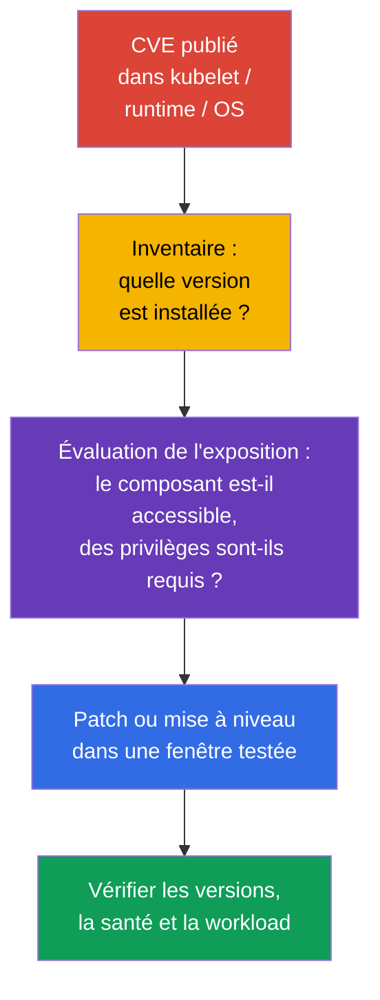
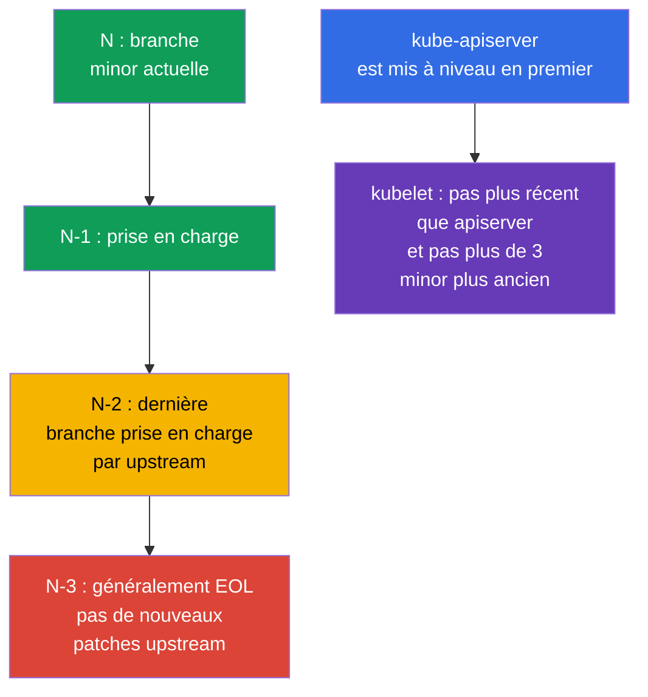

[Русская версия](ru.md) · [Eng version](README.md) · [Versión en español](es.md) · [Deutsche Version](de.md) · [ქართული ვერსია](ge.md) · [繁體中文版](tw.md) · [日本語版](jp.md)

# Chapitre 13. Mettre à niveau Kubernetes pour corriger des vulnérabilités

> **Le problème.** Un CVE publié dans kubelet, API server, container runtime ou le kernel reste un chemin exploitable d'un Pod compromis ou du réseau vers un nœud et le cluster tant que la version vulnérable n'est pas remplacée. Une branche EOL peut ne recevoir aucun correctif, tandis qu'un ordre de mise à niveau incorrect ajoute une indisponibilité ou une incompatibilité au lieu d'une remediation sûre.

> **La suite.** Au chapitre 12, nous avons réduit l'accès à l'API Kubernetes. Mais une API correctement configurée ne protège pas contre une vulnérabilité connue dans `kube-apiserver`, kubelet ou container runtime. La mise à niveau est un contrôle de sécurité : elle réduit le temps pendant lequel un attaquant peut exploiter un CVE publié. C'est le domaine **Cluster Hardening** (15 %) de CKS : il faut évaluer l'urgence d'un advisory, respecter le version skew et mettre à niveau un cluster sans créer de nouvelle surface d'attaque ni d'indisponibilité.

> **Ce qu'il faut connaître de CKA.** La procédure complète `kubeadm upgrade`, la différence entre `apply` et `node`, `cordon`/`drain`/`uncordon`, PodDisruptionBudget et la mise à niveau de l'OS sont des compétences de lifecycle distinctes. Nous fixons ici la séquence de sécurité nécessaire : CVE, EOL, advisories, version skew, evidence et dépendances du nœud.

> 🧠 Un patch réduit la fenêtre d'exploitation ; la priorité tient compte de l'accessibilité, des prerequisites et de l'exposition du cluster, pas seulement de CVSS.

## 13.1. Pourquoi un patch est un contrôle de sécurité

Un CVE dans un composant Kubernetes, container runtime ou le kernel d'un nœud peut donner à un attaquant un chemin d'un Pod vers des données, l'API Kubernetes ou le nœud lui-même. Une chaîne typique est la suivante : un exploit est publié pour une version installée -> l'attaquant obtient l'accès à une workload ou un accès réseau au control plane -> il utilise le composant vulnérable avant que l'équipe installe le correctif. Firewall, RBAC et NetworkPolicy réduisent l'exposition, mais ne corrigent pas un défaut de code.



**Modèle de menace.** Ne supposez pas qu'un CVE n'est dangereux qu'en présence d'un endpoint public. Par exemple, un défaut de `kubelet` peut être accessible depuis un Pod déjà compromis ou un nœud voisin, et un défaut `runc` depuis un conteneur déjà exécuté dans le cluster. La réponse ne dépend donc pas seulement de CVSS : les prerequisites, la disponibilité de la fonction vulnérable, l'existence d'un exploit public, les contrôles compensatoires et la valeur des nœuds affectés comptent.

**EOL (End of Life)** est un risque distinct. Pour une branche qui n'est plus prise en charge par upstream ou une distribution, de nouveaux correctifs de CVE peuvent ne jamais paraître. Un contrôle compensatoire ne transforme pas une version EOL en version prise en charge : il faut planifier le passage à une branche minor prise en charge ou un support fournisseur avec une échéance explicitement définie.

Réponse pratique à un advisory :

1. Consignez les composants affectés et les versions exactes, y compris le control plane managed, les worker pools, `containerd`, `runc`, l'OS et le CNI.
2. Comparez les conditions d'exploitation du CVE à votre configuration, à l'accessibilité réseau et aux droits de l'attaquant. N'ignorez pas un CVE uniquement parce qu'il n'y a pas d'accès externe.
3. Choisissez la version corrigée dans l'advisory, vérifiez la support policy et la compatibilité, testez en stage, puis effectuez le rollout avec vérification et rollback.
4. Si un patch immédiat est impossible, réduisez temporairement l'exposition selon les recommandations de l'advisory, attribuez un responsable et une échéance. Une mitigation temporaire ne doit pas devenir permanente.

> 🏭 Release cadence et support window définissent le lifecycle : un cluster pris en charge est plus facile à patcher qu'une migration urgente depuis EOL.

## 13.2. Release cadence, support window et version skew

Kubernetes publie régulièrement des versions minor, normalement trois fois par an, et des patch-releases au fur et à mesure que les correctifs sont prêts. Prenez la date exacte et la liste des correctifs dans les release notes de la branche concernée, pas dans un ancien runbook. Upstream prend normalement en charge les trois dernières branches minor : la branche actuelle `N`, `N-1` et `N-2`. Par conséquent, `N-3` est généralement EOL ; un service managed ou une distribution enterprise peut avoir une fenêtre différente, à vérifier séparément.

Dans ce laboratoire, Kubernetes `v1.36` désigne la **version cible de l'exemple**, et non la version stable actuelle de Kubernetes ni une promesse concernant sa support window actuelle. Avant une véritable change window, vérifiez la branche cible réellement prise en charge et le fixed patch de l'advisory. La transition s'effectue séquentiellement, une version minor à la fois, par exemple `v1.34` -> `v1.35` -> `v1.36` ; dans une branche, mettez directement à jour vers la version corrigée. Ce rythme laisse du temps pour les tests et ne transforme pas un CVE urgent en projet de migration de plusieurs versions.



> 🎯 Mettez d'abord à niveau le control plane ; kubelet ne doit pas être plus récent que `kube-apiserver` ni avoir plus de trois versions minor de retard sur lui.

**Version skew** limite l'ordre de la mise à niveau. Pour chaque kubelet, vérifiez deux limites par rapport à son `kube-apiserver` :

1. kubelet **ne doit pas être plus récent** que API server ;
2. kubelet ne doit pas être **plus de trois versions minor plus ancien** que API server.

Il en découle l'ordre : on met d'abord à niveau le control plane, puis les worker nodes. Le skew autorisé est un état temporaire pour une courte rolling upgrade, et non le mode de fonctionnement normal de vieux nœuds pendant des mois. La plage des autres composants dépend de la version et du rôle ; avant une modification, consultez la [policy version skew](https://kubernetes.io/releases/version-skew-policy/) officielle.

**HA control plane.** Les instances `kube-apiserver` ne peuvent différer que d'une version minor au maximum. Tant qu'un ancien API server demeure dans le cluster, c'est lui qui restreint la limite supérieure de kubelet : kubelet ne peut être plus récent qu'**aucun** API server. Par exemple, avec des API servers `1.37` et `1.36`, les kubelet `1.36`, `1.35` et `1.34` sont autorisés ; kubelet `1.37` ne l'est pas en raison de l'API server `1.36`.

**Control-plane managers.** `kube-controller-manager`, `kube-scheduler` et `cloud-controller-manager` ne doivent pas être plus récents que `kube-apiserver`. On les maintient normalement à la même version minor ; dans le skew autorisé, ils peuvent avoir au plus une version minor de retard sur l'API server correspondant.

Avant la mise à niveau minor cible, vérifiez aussi les API supprimées dans les applications, Helm charts, operators et addons. La correction d'un CVE ne doit pas casser le prochain deploy en raison d'un `apiVersion` supprimé ; conservez l'inventaire avant la change window et éliminez les dépendances trouvées avant l'upgrade.

> 🏭 L'advisory et l'inventaire exact consignent les affected versions, le responsable de la remediation, le SLA, l'evidence du correctif et la mitigation temporaire.

## 13.3. Advisories, CVE feed et inventaire des versions

La source de décision est l'advisory primaire, et non seulement un agrégateur de CVE. Pour Kubernetes, il s'agit des [security advisories](https://kubernetes.io/docs/reference/issues-security/security/) et des release notes ; pour l'OS, le fournisseur cloud, le CNI et le runtime, il s'agit de l'advisory de leur fabricant. NVD, GitHub Advisory Database et les CVE feeds d'entreprise sont utiles pour les notifications et la recherche, mais peuvent avoir du retard, contenir des plages de versions incomplètes ou ne pas décrire les conditions de configuration.

| À vérifier | Où chercher | Pourquoi |
|---|---|---|
| Kubernetes CVE et fixed version | Kubernetes security advisory, release notes | Comprendre la plage affectée, les prerequisites et la version contenant le correctif |
| Support de la branche | upstream release/support policy ou policy du fournisseur | Ne pas choisir une branche EOL sans patches ultérieurs |
| Version client/server | `kubectl version --output=yaml` | Comparer le server à l'advisory ; le client ne prouve pas la version du nœud |
| Version de chaque nœud | `kubectl get nodes -o wide`, `kubectl describe node` | Trouver les kubelet en retard et un rollout mixte |
| Packages runtime et OS | package manager, SBOM/asset inventory, vendor advisory | Un patch Kubernetes ne corrige pas `containerd`, `runc`, kernel ou OpenSSL |

```bash
# Versions de kubectl et d'API server. Ne placez pas les credentials du kubeconfig dans un ticket ou un chat.
kubectl version --output=yaml

# Versions de kubelet sur tous les nœuds et leur état.
kubectl get nodes -o wide
kubectl get nodes -o custom-columns=NAME:.metadata.name,KUBELET:.status.nodeInfo.kubeletVersion,OS:.status.nodeInfo.osImage

# Sur un nœud précis : la version et l'origine des packages dépendent de la distribution.
kubeadm version -o short
containerd --version
runc --version
uname -r
```

`kubectl version` voit API server, mais ne remplace pas l'inventaire des packages du control plane et du worker node. Dans Kubernetes managed, le fournisseur peut mettre à niveau le control plane : il faut tout de même vérifier la version du control plane, le support calendar, le node image/AMI et l'échéance après laquelle le fournisseur cesse de prendre en charge la branche.

Une habitude utile consiste à gérer un patch SLA : un CVE critique avec un exploit accessible reçoit une courte fenêtre de réponse, les autres le prochain créneau planifié. La severity seule ne constitue pas la priorité : un CVE avec un CVSS plus faible, mais sans authentication dans un composant accessible depuis l'extérieur, peut être plus important qu'un CVE local ayant des prerequisites difficiles.

> 🎯 Séquence : preflight → premier control plane via `kubeadm upgrade apply` → health → chaque worker via `kubeadm upgrade node`, `cordon`/`drain`, kubelet, vérification et `uncordon`.

## 13.4. Mise à niveau `kubeadm` sûre : control plane, puis nœuds

N'apprenez pas par cœur et ne copiez pas de scripts de package/repository improvisés : les commandes précises dépendent de la target minor, de l'OS, du package manager et de l'état du nœud. À l'examen comme en situation réelle, ouvrez la documentation Kubernetes officielle correspondant à la version nécessaire et effectuez ses étapes dans l'ordre. C'est plus fiable que d'essayer de reconstituer les commandes de mémoire.

### Itinéraire officiel

- [Upgrading kubeadm clusters](https://kubernetes.io/docs/tasks/administer-cluster/kubeadm/kubeadm-upgrade/) - document principal : choix de la target version, premier et autres control-plane nodes, vérification du cluster et recovery.
- [Upgrading Linux nodes](https://kubernetes.io/docs/tasks/administer-cluster/kubeadm/upgrading-linux-nodes/) - séquence distincte pour un worker node Linux.
- [Changing the Kubernetes package repository](https://kubernetes.io/docs/tasks/administer-cluster/kubeadm/change-package-repository/) - utilisez-le lorsque la target minor impose de changer le repository `pkgs.k8s.io`.
- [Safely Drain a Node](https://kubernetes.io/docs/tasks/administer-cluster/safely-drain-node/) - comportement de `drain`, PodDisruptionBudget et DaemonSet.
- [Version Skew Policy](https://kubernetes.io/releases/version-skew-policy/) - limites de compatibilité, si la formulation de la tâche laisse un doute.

Si la target minor diffère de la current upstream, dans la documentation sélectionnez la branche correspondante : les commandes et les package versions doivent se rapporter exactement à la target release, et non à un exemple de notes.

### Itinéraire court pour l'examen

1. Lisez l'énoncé, déterminez les versions actuelle et cible ; ne sautez pas de versions minor et ne violez pas le version skew.
2. Ouvrez le guide principal. Sur le premier control-plane, suivez ses étapes : mettez à jour `kubeadm`, exécutez `kubeadm upgrade plan`, puis `kubeadm upgrade apply <target-version>`. Ensuite, à l'aide du même guide, effectuez pour ce nœud le `drain`, la mise à niveau de `kubelet`/`kubectl`, le restart de kubelet, la vérification du node et des control-plane components, puis `uncordon`.
3. En HA, mettez à niveau les autres control-plane nodes un à un avec `kubeadm upgrade node`, puis répétez pour **chacun** le même lifecycle `drain` → kubelet/kubectl → restart → vérification → `uncordon`. Assurez-vous que l'API reste accessible et ne passez pas aux workers tant que le control plane n'est pas healthy.
4. Pour chaque worker node, ouvrez le guide Linux-node et effectuez ses étapes dans l'ordre : mettre à niveau `kubeadm` → `kubeadm upgrade node` → `drain` → mettre à niveau `kubelet`/`kubectl` → restart de kubelet → vérifier `Ready` et la version → `uncordon`.
5. À la fin, confirmez l'état `Ready` de tous les nœuds et les versions attendues. Si `drain`, preflight ou health check échoue, arrêtez-vous et analysez la cause ; n'ajoutez pas au hasard `--force`, `--disable-eviction` ou `--ignore-preflight-errors`.

> 🎯 **CKS Core.** À l'examen, la documentation fait partie du processus de travail : ouvrez le guide, comparez l'étape actuelle à l'énoncé et exécutez-la littéralement. Il n'est pas nécessaire de créer une custom automation ou de reproduire un production change runbook.

### Limite de production

Avant un changement en production, lisez aussi l'advisory et les release notes, vérifiez le backup, la compatibilité CNI/CSI/runtime, la capacity et un rollback testé. Cela ne change pas l'ordre de `kubeadm`, mais détermine si l'on peut démarrer le rollout en toute sécurité.

> 🏭 Production. En production, on consigne l'evidence, on utilise stage et progressive rollout ; les détails dépendent de la platform et ne constituent pas un ensemble de commandes d'examen.

## 13.5. Runtime et OS : Kubernetes n'est pas la seule source de CVE

Le patch de `kube-apiserver` ne met pas à jour `containerd`, `runc`, kernel, OpenSSL, `systemd` et les packages OS. Pour une attaque depuis un conteneur, runtime et kernel sont souvent la frontière entre workload et nœud. L'inventaire et la patch policy doivent donc couvrir l'ensemble du node image.

| Dépendance | Risque si elle est en retard | À vérifier avant le rollout |
|---|---|---|
| `containerd` et CRI | CVE, CRI incompatible, modification de la configuration/du socket | Le support de la version Kubernetes cible, `SystemdCgroup`, la santé du service et le node image |
| `runc` | escape du conteneur en cas de vulnérabilité du runtime | La fixed version de l'advisory et la dépendance de package de containerd |
| kernel et packages OS | privilege escalation, CVE réseau/filesystem | Le support de l'OS, la vendor security update, le besoin de reboot et le node image |
| cgroups/systemd | kubelet/runtime ne démarrent pas ou utilisent des cgroup différents | Un cgroup driver unique et le support de cgroup v2 dans l'OS et le runtime |
| CNI, CSI, CoreDNS | réseau, storage ou DNS ne reviennent pas après le changement | Compatibility matrix et smoke test en stage |

### Baseline cgroup v2 pour Kubernetes v1.35+

Avant de planifier le passage à Kubernetes v1.35+, effectuez un preflight **sur chaque nœud** : kubelet et runtime doivent fonctionner avec cgroup v2 et un cgroup driver `systemd` cohérent. `failCgroupV1` est un champ de `KubeletConfiguration`, non un feature gate ; sa valeur par défaut est `true` à partir de v1.35. Ne le désactivez pas avec `failCgroupV1: false` pour prolonger la vie de cgroup v1 : un override temporaire n'est possible que comme mesure de migration courte et documentée. Si la vérification échoue, migrez d'abord l'OS/runtime en stage et vérifiez le node image, au lieu de contourner le preflight en production.

Dans Kubernetes v1.36, `KubeletCgroupDriverFromCRI` est déjà GA. Si le CRI runtime prend en charge l'appel `RuntimeConfig`, kubelet obtient le driver depuis runtime et ignore son propre `cgroupDriver` ; si runtime ne le prend pas en charge, kubelet utilise le `cgroupDriver` de sa configuration. Ne figez donc pas les chemins `/var/lib/kubelet/config.yaml` et `/etc/containerd/config.toml` : déterminez d'abord les `--config`/`--config-dir` kubelet actifs ainsi que l'unité, le processus et la config source documentée du CRI runtime installé.

```yaml
# Dans le KubeletConfiguration actif, trouvé à partir de la startup configuration.
failCgroupV1: true
# cgroupDriver: systemd  # fallback uniquement pour un runtime sans RuntimeConfig
```

```bash
# Sur chaque nœud ; un exit code non nul signifie que la baseline cgroup v2 n'est pas encore satisfaite.
set -euo pipefail
test "$(stat -fc %T /sys/fs/cgroup)" = 'cgroup2fs'
sudo systemctl cat kubelet containerd crio 2>/dev/null || true
KUBELET_PID=$(pgrep -xo kubelet) || { echo 'kubelet process not found' >&2; exit 2; }
# `sudo cat` ouvre /proc en tant que root. `pipefail` conserve l'erreur de lecture, tandis que
# l'absence de --config/--config-dir reste acceptable et seul grep reçoit donc || true.
sudo cat "/proc/$KUBELET_PID/cmdline" \
  | tr '\0' '\n' \
  | { grep -E -- '^--config(=|$)|^--config-dir(=|$)' || true; }
sudo journalctl -u kubelet -b --no-pager | grep -Ei 'cgroup|RuntimeConfig' || true
```

Pour CRI-O, containerd avec une installation non standard ou un autre runtime, vérifiez son driver effectif dans la configuration runtime documentée et dans les logs ; ne copiez pas aveuglément un chemin containerd ou le champ `SystemdCgroup`.

Une stratégie sûre consiste à séparer le risque : vérifiez d'abord la combinaison compatible Kubernetes + runtime + OS en stage, puis déployez nœud par nœud. Si un CVE runtime/OS urgent exige une remediation immédiate, utilisez le même lifecycle : `cordon` -> `drain` -> patch/reboot ou replacement -> health check -> `uncordon`. Pour un immutable node pool, il est souvent plus sûr de créer un nouveau pool patché, de migrer la workload par remplacement progressif et de supprimer les anciens nœuds, plutôt que de modifier de nombreux packages sur place.

Lors de la mise à jour du package repository, vérifiez la source et la signature du repository. Ne mélangez pas des versions aléatoires de plusieurs repositories et n'effectuez pas en même temps une vaste migration Kubernetes, runtime et OS sans test dédié : il devient alors difficile de distinguer la CVE remediation d'une regression et de revenir en arrière en sécurité.

> 🎯 Ne violez pas le version skew, ne mettez pas à niveau tous les nœuds à la fois, ne contournez pas PDB ou preflight sans raison et confirmez le résultat avec les versions et health.

## 13.6. Erreurs courantes lors d'une mise à niveau de sécurité

- **« Nous n'avons pas d'API publique, le CVE ne nous concerne pas. »** Un kubelet ou runtime vulnérable peut être accessible à un attaquant interne après la compromission d'un Pod ou d'un nœud.
- **Seul le control plane est patché.** Worker kubelet, `containerd`, `runc` et l'OS restent vulnérables, même si `kubectl version` semble déjà correct.
- **EOL est considéré comme un risque faible.** L'absence d'un nouvel advisory signifie l'absence de patch, non l'absence de vulnérabilités.
- **Des versions minor sont sautées ou kubelet est mis à niveau avant API server.** Cela viole le version skew et crée un état difficile à diagnostiquer.
- **Tous les nœuds sont mis à jour d'un coup ou PDB est contourné.** Un CVE urgent ne justifie pas la perte de toutes les répliques ; évaluez d'abord l'exposition et la capacity, puis effectuez un rolling rollout.
- **On se fie seulement au succès de `kubeadm`.** La commande ne prouve pas que runtime, CNI, DNS, storage et les applications fonctionnent réellement sur les versions corrigées.

> 🏭 Security upgrade : advisories, inventaire, support policy, stage, progressive rollout, evidence et stop conditions en cas de health failure.

## 13.7. Comment cela est appliqué en production

- **Patch management comme processus.** L'équipe s'abonne aux advisories upstream et vendor, relie les CVE à l'inventaire, attribue un SLA fondé sur la severity, un responsable, une fenêtre de rollout et une confirmation de clôture. C'est préférable à des « journées de mise à niveau » isolées une fois par an.
- **Le risque augmente après la publication d'un patch.** Le diff entre une version vulnérable et une version corrigée réduit souvent le périmètre de recherche de la cause d'un CVE et facilite le reverse engineering. Par conséquent, un CVE connu, accessible à un attaquant et toujours non corrigé après la sortie d'un fixed patch reçoit généralement une priorité plus élevée : la probabilité de l'apparition ou de l'adaptation d'un exploit augmente. L'analyse assistée par AI réduit encore le coût et le temps d'une telle recherche, mais ne prouve pas à elle seule l'exploitability ; il faut toujours évaluer reachability, prerequisites et la valeur de l'actif.
- **Un lag court après la release.** Des transitions régulières dans la fenêtre prise en charge N/N-1/N-2 réduisent l'ampleur de chaque changement et permettent de tester calmement un CVE critique, plutôt que de conduire une multi-hop upgrade nocturne.
- **Stage et progressive rollout.** Testez d'abord le node image et les addons, mettez ensuite à niveau un petit pool/un nœud, observez les métriques et poursuivez seulement après cela. Pour Kubernetes managed, contrôlez séparément les deadlines du control plane et du node pool.
- **Remplacement de nœuds automatisé, mais observable.** Infrastructure as Code, golden image, maintenance windows, PDB et autoscaling rendent la mise à niveau reproductible. L'automatisation doit s'arrêter lors d'un health failure, et non continuer à remplacer toute la flotte.
- **Un SBOM/asset inventory unique.** Il relie l'advisory non seulement à Kubernetes, mais aussi à `containerd`, `runc`, CNI, OS et kernel, afin que l'équipe ne manque pas la seconde moitié de l'attaque contre le nœud.

## 13.8. Mini-glossaire

- **CVE** - identifiant d'une vulnérabilité connue publiquement.
- **security advisory** - notification primaire d'un fabricant indiquant les versions affectées, les conditions d'exploitation, la mitigation et la fixed version.
- **EOL** - fin de la prise en charge d'une version ; de nouveaux upstream security patches ne sont généralement pas publiés.
- **release cadence** - fréquence de sortie des versions minor et patch-releases.
- **support window** - plage des branches prises en charge ; upstream Kubernetes conserve normalement `N`, `N-1` et `N-2`.
- **version skew** - différence autorisée entre versions de composants ; kubelet n'est pas plus récent qu'API server et n'a pas plus de trois versions minor de retard.
- **`kubeadm upgrade plan` / `apply` / `node`** - plan de mise à niveau / application sur le premier control plane / mise à niveau de la configuration d'un nœud donné.
- **rolling upgrade** - mise à niveau d'un nœud à la fois, avec vérification entre les étapes.
- **`cordon` / `drain` / `uncordon`** - interdire la planification / évacuer la workload / réautoriser la planification sur le nœud.
- **node image** - image cohérente d'OS, runtime et packages pour un nœud.

## 13.9. Résumé du chapitre

- La mise à niveau est un contrôle de sécurité : elle élimine des CVE connus dans Kubernetes, mais ne remplace pas RBAC, les network controls et le hardening.
- Une branche EOL est dangereuse car les nouveaux CVE peuvent ne pas recevoir de patch upstream ; normalement, seuls `N`, `N-1` et `N-2` sont pris en charge, et `N-3` est déjà EOL.
- L'advisory et les release notes sont la source primaire de la fixed version et des conditions du CVE ; le CVE feed aide à notifier, mais ne remplace pas la lecture de l'advisory ni l'inventaire des nœuds.
- Respectez le version skew : le control plane est mis à niveau en premier, kubelet n'est pas plus récent qu'API server et n'a pas plus de trois versions minor de retard ; les versions minor sont traversées séquentiellement.
- Un rollout `kubeadm` sûr : preflight et backup -> control plane -> health check -> sur un worker `kubeadm` -> `kubeadm upgrade node` -> `cordon`/`drain` -> kubelet/kubectl -> restart et vérification -> `uncordon`.
- Un patch Kubernetes ne corrige pas les CVE de `containerd`, `runc`, kernel et OS ; runtime et node image requièrent une vérification de compatibilité et une patch policy distinctes.

## 13.10. En quoi cela sert : à l'examen et dans le travail réel

**À l'examen.** La tâche peut demander de mettre à niveau un cluster en sécurité ou d'expliquer l'ordre des versions. Déterminez d'abord les versions actuelle et cible, ne violez pas le version skew, mettez à niveau le control plane avant le worker node, utilisez `drain` avant de mettre à niveau kubelet et remettez le nœud en service avec `uncordon`. Souvenez-vous de la différence : sur le premier nœud control plane, on utilise `kubeadm upgrade apply`, sur le worker, `kubeadm upgrade node`.

**Dans le travail réel.** La valeur de la compétence ne consiste pas à lancer mécaniquement `kubeadm`, mais à réduire l'exposition au CVE sans perdre de disponibilité. L'ingénieur lit l'advisory, confirme les versions affectées, vérifie EOL et les dépendances, teste le node image, procède par rolling wave et prouve après celle-ci à la fois la version corrigée et le fonctionnement des services.

> 🏭 Un production gate consigne l'evidence des versions, readiness et health ; il ne remplace pas un rollback testé.

## 13.11. Pratique autonome : security upgrade gate

Il s'agit d'une simulation contrôlée self-contained pour un cluster kubeadm. Elle ne remplace pas une véritable mise à niveau des packages : son objectif est de passer les preflight gates orientés CKS sans modifier la version du cluster de formation. Exécutez-la uniquement dans un environnement jetable ; vérifiez d'abord les chemins des certificats etcd avec le manifest de votre control plane.

Créez le répertoire d'evidence et consignez l'état initial :

```bash
export UPGRADE_EVIDENCE=/tmp/cks-upgrade-security
mkdir -p "$UPGRADE_EVIDENCE/before"

kubectl version -o yaml > "$UPGRADE_EVIDENCE/before/version.yaml"
kubectl get nodes -o wide > "$UPGRADE_EVIDENCE/before/nodes.txt"
kubectl get --raw='/readyz?verbose' > "$UPGRADE_EVIDENCE/before/readyz.txt"
```

### Gate 1 : version skew de kubelet et plan

Il s'agit d'un gate limité : il compare chaque kubelet à un seul API server renvoyé par `kubectl` (en HA, il peut s'agir d'un backend du load balancer) et s'arrête si kubelet viole l'une des limites : plus récent que cet API server **ou** plus de trois versions minor plus ancien. Il ne prouve pas le skew de tous les API servers HA et ne vérifie pas `kube-controller-manager`, `kube-scheduler`, `cloud-controller-manager`, `kube-proxy` ou `kubectl` ; leur inventory et leur policy sont vérifiés séparément avant un production rollout. Ensuite, `kubeadm upgrade plan` vérifie les cibles disponibles, preflight et l'ordre de mise à niveau. Pour une transition réelle, choisissez exactement la branche minor suivante.

```bash
set -euo pipefail
SERVER_MINOR=$(kubectl version -o json | jq -r '.serverVersion.minor | sub("[^0-9].*$"; "") | tonumber')
kubectl get nodes -o json | jq -e --argjson server "$SERVER_MINOR" \
  '[.items[] | (.status.nodeInfo.kubeletVersion | capture("v1\\.(?<m>[0-9]+)").m | tonumber)] |
   all(. >= ($server - 3) and . <= $server)' \
  | tee "$UPGRADE_EVIDENCE/before/skew-check.txt"
sudo kubeadm upgrade plan | tee "$UPGRADE_EVIDENCE/before/kubeadm-upgrade-plan.txt"
```

### Gate 2 : backup et restauration vérifiable

La présence de `etcdctl`/`etcdutl` ne doit pas être déduite du seul fait que kubeadm est installé. Avant ce gate, vérifiez les binaries et leur compatibilité avec la version etcd. Si les outils sont absents, installez à l'avance une version compatible vérifiée et épinglée depuis une source de confiance, ou utilisez une operational image/toolbox approuvée. Ne téléchargez pas `latest` directement pendant une change window.

```bash
set -euo pipefail
command -v etcdctl >/dev/null 2>&1 || {
  echo 'ERROR: etcdctl is not installed on this control-plane node' >&2
  exit 1
}
command -v etcdutl >/dev/null 2>&1 || {
  echo 'ERROR: etcdutl is not installed on this control-plane node' >&2
  exit 1
}
etcdctl version
etcdutl version
```

Sur le nœud control plane, créez un snapshot avec les paramètres TLS de `/etc/kubernetes/manifests/etcd.yaml`, puis vérifiez-le au moyen de `etcdutl snapshot status`. N'exécutez pas une restauration par-dessus un etcd actif : consignez la commande de restauration exacte dans le runbook et répétez-la dans un cluster distinct.

```bash
set -euo pipefail
sudo ETCDCTL_API=3 etcdctl snapshot save /var/backups/etcd-pre-upgrade.db \
  --endpoints=https://127.0.0.1:2379 \
  --cacert=/etc/kubernetes/pki/etcd/ca.crt \
  --cert=/etc/kubernetes/pki/etcd/healthcheck-client.crt \
  --key=/etc/kubernetes/pki/etcd/healthcheck-client.key
sudo etcdutl snapshot status /var/backups/etcd-pre-upgrade.db -w json \
  | tee "$UPGRADE_EVIDENCE/before/etcd-snapshot-status.json"
sudo sha256sum /var/backups/etcd-pre-upgrade.db \
  | tee "$UPGRADE_EVIDENCE/before/etcd-snapshot.sha256"
```

### Gate 3 : API deprecated et security configuration

Ne vérifiez pas uniquement les manifests dans Git, mais aussi l'usage réel des deprecated APIs avec la métrique d'API server. Le `kubectl get --raw /metrics` direct ci-dessous obtient des métriques auprès d'un seul backend API server sélectionné et ne constitue donc, en HA, qu'une evidence locale, pas un inventory complet. Pour une production HA, agrégez le scrape de **tous** les API servers dans monitoring (par exemple, PromQL `max by (group, version, resource, subresource, removed_release)
(apiserver_requested_deprecated_apis) > 0`) ou vérifiez les audit events de chaque API server. Toute ligne dont la valeur est supérieure à zéro reçoit un responsable et une remediation avant l'upgrade. Consignez admission et les permissions RBAC critiques ; la configuration détaillée de Pod Security Admission est traitée au chapitre 19, et non dans cette pratique d'upgrade.

```bash
set -euo pipefail
# Cette evidence ne concerne que le backend API server sélectionné ; en HA, utilisez l'agrégation décrite ci-dessus.
kubectl get --raw /metrics \
  | awk '/^apiserver_requested_deprecated_apis/ && $NF > 0' \
  | tee "$UPGRADE_EVIDENCE/before/deprecated-apis.txt"

```

### Note de production : conservation des custom security flags

Dans une mise à niveau de production `kubeadm` self-hosted, la commande peut réécrire les static Pod manifests à partir de `ClusterConfiguration`. Par conséquent, les réglages custom d'audit, de chiffrement et de profiling doivent être consignés dans Infrastructure as Code et vérifiés séparément dans la procédure de change/rollback.

> 🏭 **Production.** Il s'agit d'un operational control pour une platform implementation donnée, et non de 🎯 CKS Core ni d'un static-Pod runbook before/after obligatoire de ce chapitre.

### Simulation contrôlée et validation post-upgrade

Dans une simulation de formation, un Bash runbook distinct pour l'evidence post-upgrade n'est pas nécessaire : il détourne de l'ordre des actions de l'examen. Après la procédure d'upgrade indiquée dans l'énoncé, confirmez que control plane et kubelet ont les versions attendues et respectent le version skew, que `/readyz` réussit et que tous les nœuds sont `Ready`. Vérifiez ensuite `kube-system` et une workload critique ; en cas de problème, arrêtez-vous, collectez les événements et ne passez pas au nœud suivant.

Pour un vrai rollout, conservez en plus les versions exactes avant/après, l'état du snapshot etcd vérifié, les résultats des health/smoke tests et un rollback testé. Les changements de RBAC custom ou de policy admission sont vérifiés selon une procédure spécifique au projet, plutôt que considérés comme sûrs à partir d'un simple YAML diff général.

> 🎯 **CKS Core.** À l'examen, suivez seulement les conditions de l'énoncé : le control plane est mis à niveau avant le worker ; avant la mise à niveau du worker, utilisez `cordon`/`drain`, puis, après vérification, remettez le nœud en service avec `uncordon`.

## 13.12. Questions d'autoévaluation

<details>
<summary>1. Pourquoi un CVE dans kubelet ou `runc` peut-il être critique, même si API server n'est pas accessible depuis Internet ?</summary>

Kubelet peut être accessible à un attaquant depuis un Pod déjà compromis ou un nœud voisin, et une vulnérabilité de `runc` peut être exploitée depuis un conteneur déjà en cours d'exécution. L'absence d'API publique n'élimine donc pas les prerequisites internes d'une attaque. La priorité est déterminée par l'accessibilité de la fonction vulnérable, les droits requis, l'exploit et la valeur du nœud, et pas seulement par l'exposition externe.
</details>

<details>
<summary>2. En quoi une branche EOL diffère-t-elle d'une branche prise en charge du point de vue du prochain CVE ?</summary>

Pour une branche prise en charge, upstream ou le fournisseur publie un patch corrigé dans le cadre de la support policy. Pour une branche EOL, la prochaine vulnérabilité peut rester sans nouveau security patch. Les contrôles compensatoires ne rendent pas une version EOL prise en charge : une transition vers une branche minor prise en charge ou un support fournisseur explicitement limité est donc nécessaire.
</details>

<details>
<summary>3. Quelles branches font normalement partie de la upstream support window `N`/`N-1`/`N-2`, et que signifie `N-3` ?</summary>

Upstream Kubernetes prend normalement en charge la branche minor actuelle `N` et les deux précédentes : `N-1` et `N-2`. `N-3` est généralement déjà EOL et ne reçoit plus de nouveaux upstream security patches. La fenêtre réelle d'un service managed ou d'une distribution enterprise peut différer, il faut donc la vérifier séparément.
</details>

<details>
<summary>4. Pourquoi CVSS et CVE feed ne suffisent-ils pas pour décider de l'urgence d'une mise à niveau ?</summary>

CVSS ne décrit pas l'exposition concrète du cluster : il faut connaître les prerequisites, l'accessibilité de la fonction, l'accès de l'attaquant, l'exploit public et les contrôles compensatoires. Un CVE feed est utile pour la notification, mais peut avoir du retard ou omettre les plages et conditions exactes. La décision repose sur l'advisory primaire vendor/upstream, la fixed version, l'inventaire et la support policy.
</details>

<details>
<summary>5. Pourquoi le control plane est-il mis à niveau avant les worker nodes, pourquoi kubelet ne doit-il pas être plus récent qu'API server ni avoir plus de trois versions minor de retard ?</summary>

Le version skew impose que kubelet ne soit pas plus récent que kube-apiserver et n'ait pas plus de trois versions minor de retard sur lui ; le control plane est donc mis à niveau en premier. En HA, un ancien API server restreint également la version supérieure autorisée de kubelet tant qu'il demeure dans le cluster. Ce skew n'est autorisé que pendant une rolling upgrade, et non comme état permanent.
</details>

<details>
<summary>6. Donnez la séquence sûre de mise à niveau d'un worker node avec `kubeadm`.</summary>

Après un control plane healthy, sur le worker, mettez à niveau `kubeadm`, exécutez `kubeadm upgrade node`, puis, depuis une machine d'administration, effectuez `cordon` et `drain` en tenant compte de PDB et de la capacity. Installez ensuite le `kubelet` et `kubectl` cibles, redémarrez kubelet, vérifiez Ready, la version et le workload smoke test. Exécutez seulement alors `uncordon` et passez au nœud suivant.
</details>

<details>
<summary>7. Quelles vérifications sont nécessaires après un `kubeadm upgrade` réussi pour prouver à la fois le security patch et le bon fonctionnement du cluster ?</summary>

Vérifiez les versions effectives du control plane et de kubelet avec `kubectl version --output=yaml` et `kubectl get nodes -o wide`, et pas seulement l'exit code de `kubeadm`. La health est confirmée par `/readyz?verbose`, l'état `Ready` de tous les Node, `kube-system`, les DaemonSet/Deployment critiques, les événements et le workload smoke test. Vérifiez aussi les alerts et l'absence de problèmes dans runtime, CNI, DNS et storage.
</details>

<details>
<summary>8. Pourquoi une mise à niveau de Kubernetes ne corrige-t-elle pas automatiquement les CVE dans `containerd`, `runc` ou kernel, et comment les mettre à jour en sécurité ?</summary>

Les packages Kubernetes ne mettent pas à jour les runtime indépendants, kernel et packages OS, bien que ceux-ci soient souvent la frontière entre conteneur et nœud. Vérifiez leurs versions et leur compatibilité avec Kubernetes à l'aide de l'advisory vendor, de l'inventaire et du node image. Effectuez le rollout avec le même lifecycle contrôlé : stage, puis `cordon`/`drain` nœud par nœud, patch ou reboot/replacement, health check et `uncordon`.
</details>

<details>
<summary>9. **Flashback (chapitre 26).** Version skew (ce chapitre) et image digest pinning (chapitre 26) sont deux mécanismes visant à faire de « quelle version s'exécute actuellement » un fait vérifiable, et non une supposition. Quelle est la différence entre une « version compatible » (version skew) et une « version identique » (digest), et pourquoi kubelet/API server n'ont-ils besoin que de la première, tandis qu'une container image en production doit impérativement avoir la seconde ?</summary>

Le version skew définit une relation autorisée entre les versions minor de composants qui interagissent : kubelet et API server peuvent être différents, mais compatibles dans la plage indiquée. Un digest, au contraire, identifie les octets précis et immuables d'une image ; un tag ne donne pas cette garantie. Le rolling lifecycle de Kubernetes nécessite une compatibilité de version limitée, tandis qu'une production image doit être fixée de manière reproductible à un contenu exact.
</details>

## Pratique

L'exercice 13.11 couvre entièrement les security gates orientés CKS sans matériel externe.
Au chapitre 14, nous passerons à la minimisation de la surface du nœud et à la sécurité du runtime-daemon.

🧪 Labo 113 (mise à niveau du control-plane et du worker avec `kubeadm`, evidence de l'absence de downtime) : [tasks/cks/labs/113](../../labs/113/README_FR.MD)

🎮 Killercoda (dans le navigateur, sans installation) : [Upgrading Kubernetes](https://killercoda.com/chadmcrowell/course/cka/upgrade-k8s) · [Upgrade Kubelet](https://killercoda.com/chadmcrowell/course/cka/upgrade-kubelet)

## Checkpoint mixte : Cluster Hardening est terminé

Avant de passer à System Hardening, vérifiez pendant 15 à 20 minutes sans indices que le domaine Cluster Hardening (chapitres 10-13) est acquis :

1. Créez une Role/RoleBinding étroite pour un subject de test et montrez avec deux vérifications `can-i` que `get pods` est autorisé, mais que `delete pods` est interdit (chapitre 10).
2. Désactivez `automount` pour le ServiceAccount `default` dans un namespace de test et prouvez qu'un nouveau Pod sans SA explicite ne reçoit pas de fichier token (chapitre 11).
3. Vérifiez si anonymous access est activé sur API server et expliquez la différence entre `401` et `403` dans la réponse (chapitre 12).
4. **Exercice mixte.** Prenez NetworkPolicy default-deny (chapitre 04, domaine Cluster Setup) et RBAC default-deny (chapitre 10, ce domaine) : expliquez pourquoi l'absence de règle explicite signifie l'interdiction, et non l'autorisation, dans les deux cas, et en quoi diffèrent ceux qui prennent cette décision (API server RBAC authorizer vs CNI plugin).
5. Donnez la séquence sûre de mise à niveau du control plane avec `kubeadm` et expliquez pourquoi kubelet ne doit pas être plus récent qu'API server (chapitre 13).

Si l'exercice 4 a posé problème, revenez ensemble aux chapitres 04 et 10.

---
[Table des matières](../README_FR.md) · [Chapitre 12](../12/fr.md) · [Chapitre 14](../14/fr.md)
