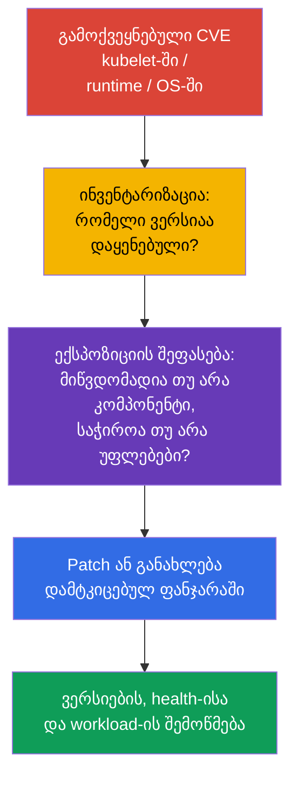
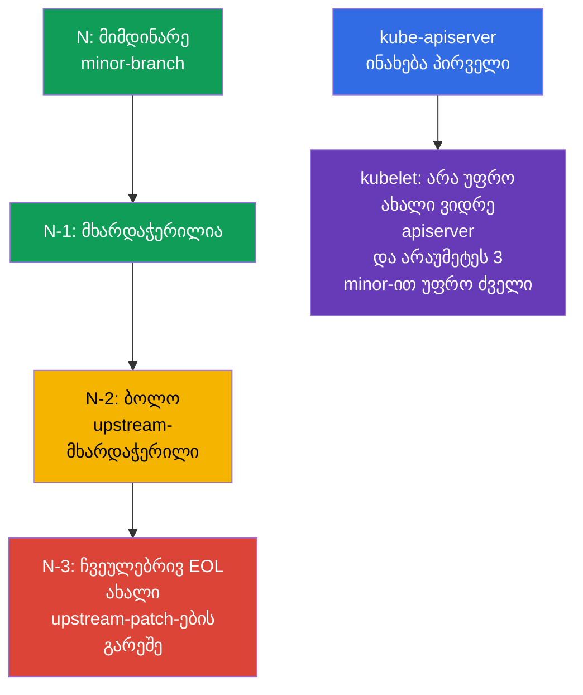

[Русская версия](ru.md) · [Eng version](README.md) · [Versión en español](es.md) · [Version française](fr.md) · [Deutsche Version](de.md) · [繁體中文版](tw.md) · [日本語版](jp.md)

# თავი 13. Kubernetes-ის განახლება დაუცველობების აღმოსაფხვრელად

> **პრობლემა.** გამოქვეყნებული CVE kubelet-ში, API server-ში, container runtime-ში ან
> ბირთვში რჩება მუშა გზად კომპრომეტირებული Pod-იდან ან ქსელიდან ნოდასა და კლასტერამდე,
> სანამ დაუცველი ვერსია არ ჩანაცვლდება. EOL-branch-მა შეიძლება საერთოდ არ მიიღოს
> შესწორება, ხოლო განახლების არასწორმა თანმიმდევრობამ შეიძლება დაამატოს downtime ან
> შეუთავსებლობა უსაფრთხო remediation-ის ნაცვლად.

> **რა არის შემდეგ.** მე-12 თავში შევზღუდეთ წვდომა Kubernetes API-ზე. მაგრამ სწორად
> კონფიგურირებული API არ იცავს ცნობილი დაუცველობისგან `kube-apiserver`-ში, kubelet-ში
> ან container runtime-ში. განახლება - security-კონტროლია: ის ამცირებს დროს, რომლის
> განმავლობაშიც შემტევს შეუძლია გამოიყენოს გამოქვეყნებული CVE. ეს არის CKS-ის დომენი
> **Cluster Hardening** (15%): საჭიროა შეფასდეს advisory-ის სისწრაფე, დაცული იყოს
> version skew და განახლდეს კლასტერი შეტევის ახალი ზედაპირისა და downtime-ის გარეშე.

> **რა გჭირდებათ CKA-დან.** `kubeadm upgrade`-ის სრული პროცედურა, განსხვავება `apply`-სა
> და `node`-ს შორის, `cordon`/`drain`/`uncordon`, PodDisruptionBudget და ოპერაციული
> სისტემის განახლება - ცალკე lifecycle-უნარია. აქ ფიქსირდება საჭირო security-
> თანმიმდევრობა: CVE, EOL, advisory-ები, version skew, evidence და ნოდის დამოკიდებულებები.

> 🧠 Patch ამცირებს ექსპლუატაციის ფანჯარას; პრიორიტეტში ითვლება მიღწევადობა, prerequisites და კლასტერის ექსპოზიცია და არა მხოლოდ CVSS.

## 13.1. რატომ არის patch security-კონტროლი

CVE Kubernetes-კომპონენტში, container runtime-ში ან ნოდის ბირთვში შეიძლება მისცეს
შემტევს გზა Pod-იდან მონაცემებამდე, Kubernetes API-მდე ან თავად ნოდამდე. ტიპური ჯაჭვი:
გამოქვეყნებულია exploit დაყენებული ვერსიისთვის -> შემტევი იღებს შესვლას workload-ში ან
ქსელს control plane-მდე -> იყენებს დაუცველ კომპონენტს, სანამ გუნდი დააყენებს შესწორებას.
Firewall, RBAC და NetworkPolicy ამცირებენ ექსპოზიციას, მაგრამ არ ასწორებენ დეფექტს
კოდში.



**საფრთხის მოდელი.** არ ღირს ვიფიქროთ, რომ CVE საშიშია მხოლოდ საჯარო endpoint-ის
შემთხვევაში. მაგალითად, ხარვეზი `kubelet`-ში შეიძლება ხელმისაწვდომი იყოს უკვე
კომპრომეტირებული Pod-იდან ან მეზობელი ნოდიდან, ხოლო `runc`-ის დეფექტი - კონტეინერიდან,
რომელიც უკვე გაშვებულია კლასტერში. ამიტომ პასუხი დამოკიდებულია არა მხოლოდ CVSS-ზე:
მნიშვნელოვანია prerequisites, დაუცველი ფუნქციის ხელმისაწვდომობა, საჯარო exploit-ის
არსებობა, compensating controls და დაზარალებული ნოდების ღირებულება.

**EOL (End of Life)** - ცალკე რისკია. ისეთი branch-ისთვის, რომელსაც upstream ან
დისტრიბუტივი აღარ უჭერს მხარს, ახალი CVE-შესწორებები შეიძლება საერთოდ არ გამოჩნდეს.
Compensating control არ აქცევს EOL-ვერსიას მხარდაჭერილად: საჭიროა გეგმა მხარდაჭერილ
minor-branch-ზე გადასვლისთვის ან მომწოდებლისგან მხარდაჭერა ცხადად განსაზღვრული
ვადით.

Advisory-ზე პრაქტიკული რეაქცია:

1. დააფიქსირეთ დაზარალებული კომპონენტები და ზუსტი ვერსიები, managed control plane-ის,
   worker pool-ების, `containerd`-ის, `runc`-ის, OS-ისა და CNI-ის ჩათვლით.
2. შეადარეთ CVE-ის ექსპლუატაციის პირობები თქვენს კონფიგურაციას, ქსელურ
   ხელმისაწვდომობასა და შემტევის უფლებებს. არ დაუშვათ CVE-ის იგნორირება მხოლოდ გარე
   წვდომის არარსებობის გამო.
3. აირჩიეთ შესწორებული ვერსია advisory-დან, შეამოწმეთ support policy და
   თავსებადობა, დატესტეთ stage-ში, შემდეგ შეასრულეთ rollout შემოწმებითა და rollback-ით.
4. თუ დაუყოვნებელი patch შეუძლებელია, დროებით შეავიწროვეთ ექსპოზიცია advisory-ის
   რეკომენდაციების მიხედვით, დანიშნეთ პასუხისმგებელი და deadline. დროებითი mitigation
   არ უნდა დარჩეს მუდმივად.

> 🏭 Release cadence და support window განსაზღვრავენ lifecycle-ს: მხარდაჭერილი კლასტერის patch-ვა უფრო მარტივია, ვიდრე EOL-იდან სასწრაფო migration.

## 13.2. Release cadence, support window და version skew

Kubernetes გამოაქვეყნებს minor-ვერსიებს რეგულარულად, ჩვეულებრივ წელიწადში სამჯერ, ხოლო
patch-release-ები გამოდის შესწორებების მზადებისთანავე. ზუსტი თარიღი და შესწორებების
სია უნდა იქნას აღებული კონკრეტული branch-ის release notes-იდან და არა ძველი
runbook-იდან. Upstream ჩვეულებრივ უჭერს მხარს ბოლო სამ minor-branch-ს: მიმდინარე `N`-ს,
`N-1`-სა და `N-2`-ს. შესაბამისად, `N-3` ჩვეულებრივ უკვე EOL-ია; managed-სერვისს ან
enterprise-დისტრიბუტივს ფანჯარა შეიძლება განსხვავებული ჰქონდეს, და ის ცალკე უნდა
შემოწმდეს.

ამ ლაბორატორიაში Kubernetes `v1.36` აღნიშნავს მაგალითის **სამიზნე (target) ვერსიას**,
და არა Kubernetes-ის „მიმდინარე stable" ვერსიას და არც მისი აქტუალური support
window-ის დაპირებას. ნამდვილი change window-ის წინ შეამოწმეთ ფაქტობრივად მხარდაჭერილი
target-branch და fixed patch advisory-დან. გადასვლა კეთდება თანმიმდევრულად, ერთი
minor-ვერსიით, მაგალითად `v1.34` -> `v1.35` -> `v1.36`; patch-ი branch-ის შიგნით
შეიძლება პირდაპირ განახლდეს შესწორებულ ვერსიამდე. ასეთი ტემპი ტოვებს დროს ტესტირებისთვის
და არ აქცევს სასწრაფო CVE-ს მრავალვერსიან migration-პროექტად.



> 🎯 ჯერ განაახლეთ control plane; kubelet არ უნდა იყოს `kube-apiserver`-ზე უფრო ახალი და არაუმეტეს სამი minor-ვერსიით უფრო ძველი მასზე.

**Version skew** ზღუდავს განახლების თანმიმდევრობას. ყოველი kubelet-ისთვის შეამოწმეთ
ორი საზღვარი მისი `kube-apiserver`-ის მიმართ:

1. kubelet **არ უნდა იყოს** API server-ზე უფრო ახალი;
2. kubelet **არ უნდა იყოს** API server-ზე **სამ minor-ვერსიაზე მეტად უფრო ძველი**.

აქედან გამომდინარეობს თანმიმდევრობა: ჯერ ნახლდება control plane, შემდეგ - worker
ნოდები. დასაშვები skew - დროებითი მდგომარეობაა მოკლე rolling upgrade-ისთვის და არა
ძველი ნოდების ჩვეულებრივი მდგომარეობა თვეების განმავლობაში. სხვა კომპონენტების
დიაპაზონი დამოკიდებულია ვერსიასა და როლზე; ცვლილებამდე შეამოწმეთ ოფიციალური
[version skew policy](https://kubernetes.io/releases/version-skew-policy/).

**HA control plane.** `kube-apiserver`-ის ეგზემპლარები შეიძლება განსხვავდებოდნენ
მაქსიმუმ ერთი minor-ვერსიით. სანამ კლასტერში რჩება ძველი API server, სწორედ ის ავიწროვებს
kubelet-ის ზედა საზღვარს: kubelet არ შეიძლება იყოს **არცერთ** API server-ზე უფრო ახალი.
მაგალითად, API server-ების `1.37` და `1.36` შემთხვევაში დასაშვებია kubelet `1.36`,
`1.35` და `1.34`; kubelet `1.37` დაუშვებელია API server `1.36`-ის გამო.

**Control-plane manager-ები.** `kube-controller-manager`, `kube-scheduler` და
`cloud-controller-manager` არ უნდა იყვნენ `kube-apiserver`-ზე უფრო ახალი. ჩვეულებრივ
ისინი ინახება იმავე minor-ვერსიაზე; დასაშვები skew-ის ფარგლებში ისინი შეიძლება იყვნენ
არაუმეტეს ერთი minor-ვერსიით უფრო ძველი შესაბამის API server-ზე.

სამიზნე minor-განახლებამდე ასევე შეამოწმეთ წაშლილი API-ები აპლიკაციებში, Helm-chart-
ებში, ოპერატორებსა და add-on-ებში. CVE-ის აღმოფხვრა არ უნდა დაამტვრიოს შემდეგი deploy
წაშლილი `apiVersion`-ის გამო; შეინახეთ inventory change window-მდე და აღმოფხვრეთ
ნაპოვნი დამოკიდებულებები upgrade-მდე.

> 🏭 Advisory და ზუსტი inventory აფიქსირებენ affected versions-ს, remediation-ის მფლობელს, SLA-ს, შესწორების evidence-ს და დროებით mitigation-ს.

## 13.3. Advisory-ები, CVE feed და ვერსიების ინვენტარიზაცია

გადაწყვეტილების წყარო - პირველადი advisory-ია და არა მხოლოდ CVE-აგრეგატორი. Kubernetes-
ისთვის ეს არის [security advisories](https://kubernetes.io/docs/reference/issues-security/security/)
და release notes; OS-ის, cloud-მომწოდებლის, CNI-ისა და runtime-ის - მათი
წარმომადგენლის advisory. NVD, GitHub Advisory Database და კორპორატიული CVE feed-ები
სასარგებლოა შეტყობინებებისა და ძებნისთვის, მაგრამ შეიძლება ჩამორჩეს, შეიცავდეს
არასრულ ვერსია-დიაპაზონებს ან არ აღწერდეს კონფიგურაციულ პირობებს.

| რა შემოწმდეს | სად ვეძებოთ | რატომ |
|---|---|---|
| Kubernetes CVE და fixed version | Kubernetes security advisory, release notes | გავიგოთ დაზარალებული დიაპაზონი, prerequisites და ვერსია შესწორებით |
| Branch-ის მხარდაჭერა | upstream release/support policy ან მომწოდებლის policy | არ ავირჩიოთ EOL-branch შემდგომი patch-ების გარეშე |
| Client/server-ის ვერსია | `kubectl version --output=yaml` | დავადაროთ server advisory-ს; client არ ამტკიცებს ნოდის ვერსიას |
| ყოველი ნოდის ვერსია | `kubectl get nodes -o wide`, `kubectl describe node` | ვიპოვოთ ჩამორჩენილი kubelet-ები და შერეული rollout |
| Runtime და OS-პაკეტები | პაკეტის მენეჯერი, SBOM/asset inventory, vendor advisory | Kubernetes-patch არ ასწორებს `containerd`-ს, `runc`-ს, ბირთვს ან OpenSSL-ს |

```bash
# kubectl-ისა და API server-ის ვერსიები. ნუ გამოიტანთ credentials-ს kubeconfig-იდან ticket-ში ან chat-ში.
kubectl version --output=yaml

# kubelet-ის ვერსიები ყველა ნოდაზე და მათი მდგომარეობა.
kubectl get nodes -o wide
kubectl get nodes -o custom-columns=NAME:.metadata.name,KUBELET:.status.nodeInfo.kubeletVersion,OS:.status.nodeInfo.osImage

# კონკრეტულ ნოდაზე: პაკეტების ვერსია და წარმოშობა დამოკიდებულია დისტრიბუტივზე.
kubeadm version -o short
containerd --version
runc --version
uname -r
```

`kubectl version` ხედავს API server-ს, მაგრამ არ ცვლის control-plane-პაკეტებისა და
worker-ნოდის ინვენტარიზაციას. Managed Kubernetes-ში control plane-ს შეიძლება
ანახლებდეს provider: მაინც საჭიროა შემოწმდეს control plane-ის ვერსია, support
calendar, node image/AMI და deadline, რომლის შემდეგაც მომწოდებელი წყვეტს branch-ის
მხარდაჭერას.

სასარგებლო ჩვევაა patch SLA-ს წარმოება: კრიტიკულ CVE-ს reachable exploit-ით ეთმობა
მოკლე რეაგირების ფანჯარა, დანარჩენებს - უახლოესი გეგმური ფანჯარა. Severity თავისთავად
არ არის პრიორიტეტი: CVE-ს ნაკლები CVSS-ით, მაგრამ authentication-ის გარეშე გარედან
ხელმისაწვდომ კომპონენტში, შეიძლება უფრო მნიშვნელოვანი იყოს, ვიდრე ლოკალური CVE
რთული prerequisites-ით.

> 🎯 თანმიმდევრობა: preflight → პირველი control plane `kubeadm upgrade apply`-ის მეშვეობით → health → ყოველი worker `kubeadm upgrade node`-ით, `cordon`/`drain`-ით, kubelet-ით, შემოწმებითა და `uncordon`-ით.

## 13.4. უსაფრთხო `kubeadm` upgrade: ჯერ control plane, შემდეგ ნოდები

ნუ დაისწავლით ზეპირად და ნუ დააკოპირებთ საკუთარ package/repository script-ებს:
კონკრეტული ბრძანებები დამოკიდებულია target minor-ზე, OS-ზე, package manager-ზე და
ნოდის მდგომარეობაზე. გამოცდაზე და რეალურ სამუშაოში გახსენით ოფიციალური Kubernetes-
დოკუმენტაცია საჭირო ვერსიისთვის და თანმიმდევრობით შეასრულეთ მისი ნაბიჯები. ეს უფრო
საიმედოა, ვიდრე ბრძანებების მეხსიერებიდან აღდგენის მცდელობა.

### ოფიციალური მარშრუტი

- [Upgrading kubeadm clusters](https://kubernetes.io/docs/tasks/administer-cluster/kubeadm/kubeadm-upgrade/) — ძირითადი დოკუმენტი: target ვერსიის არჩევა, პირველი და დამატებითი control-plane ნოდები, კლასტერის შემოწმება და recovery.
- [Upgrading Linux nodes](https://kubernetes.io/docs/tasks/administer-cluster/kubeadm/upgrading-linux-nodes/) — ცალკე თანმიმდევრობა Linux worker-ნოდისთვის.
- [Changing the Kubernetes package repository](https://kubernetes.io/docs/tasks/administer-cluster/kubeadm/change-package-repository/) — გამოიყენეთ, როცა target minor მოითხოვს `pkgs.k8s.io` repository-ის გადართვას.
- [Safely Drain a Node](https://kubernetes.io/docs/tasks/administer-cluster/safely-drain-node/) — `drain`-ის ქცევა, PodDisruptionBudget და DaemonSet.
- [Version Skew Policy](https://kubernetes.io/releases/version-skew-policy/) — თავსებადობის საზღვრები, თუ დავალების ფორმულირება ეჭვს იწვევს.

თუ target minor განსხვავდება მიმდინარე upstream-ისგან, დოკუმენტაციაში გადართეთ
ვერსიის selector შესაბამის branch-ზე: ბრძანებები და package-ვერსიები უნდა
ეკუთვნოდნენ ზუსტად target release-ს და არა კონსპექტის მაგალითს.

### მოკლე საგამოცდო მარშრუტი

1. წაიკითხეთ დავალება, განსაზღვრეთ მიმდინარე და სამიზნე ვერსიები; არ გამოტოვოთ
   minor-ვერსიები და არ დაარღვიოთ version skew.
2. გახსენით ძირითადი guide. პირველ control-plane-ზე მიჰყევით მის ნაბიჯებს: განაახლეთ
   `kubeadm`, შეასრულეთ `kubeadm upgrade plan`, შემდეგ `kubeadm upgrade apply
   <target-version>`. შემდეგ იმავე guide-ის მიხედვით შეასრულეთ ამ ნოდისთვის `drain`,
   `kubelet`/`kubectl`-ის განახლება, kubelet-ის restart, ნოდისა და control-plane
   კომპონენტების შემოწმება და `uncordon`.
3. HA-ში განაახლეთ დანარჩენი control-plane ნოდები თითო-თითოდ `kubeadm upgrade node`-
   ის მეშვეობით, რის შემდეგაც **თითოეულისთვის** გაიმეორეთ იგივე lifecycle `drain` →
   kubelet/kubectl → restart → შემოწმება → `uncordon`. დარწმუნდით, რომ API ხელმისაწვდომი
   რჩება, და ნუ გადახვალთ worker-ზე, სანამ control plane healthy არ არის.
4. ყოველი worker-ნოდისთვის გახსენით Linux-node guide და შეასრულეთ იგი თანმიმდევრობით:
   `kubeadm`-ის განახლება → `kubeadm upgrade node` → `drain` → `kubelet`/`kubectl`-ის
   განახლება → kubelet-ის restart → `Ready`-სა და ვერსიის შემოწმება → `uncordon`.
5. ბოლოს დაადასტურეთ ყველა ნოდის `Ready` მდგომარეობა და მოსალოდნელი ვერსიები. თუ
   `drain`, preflight ან health check არ გადის, შეჩერდით და გაარკვიეთ მიზეზი; ნუ
   დაამატებთ შემთხვევით `--force`-ს, `--disable-eviction`-ს ან
   `--ignore-preflight-errors`-ს.

> 🎯 **CKS Core.** გამოცდაზე დოკუმენტაცია - სამუშაო პროცესის ნაწილია: გახსენით guide,
> შეადარეთ მიმდინარე ნაბიჯი დავალებას და შეასრულეთ ის სიტყვასიტყვით. არ არის საჭირო
> custom automation-ის შექმნა ან production change runbook-ის აღდგენა.

### Production boundary

Production change-მდე დამატებით იკითხება advisory და release notes, მოწმდება backup,
CNI/CSI/runtime-თავსებადობა, capacity და ტესტირებული rollback. ეს არ ცვლის `kubeadm`-ის
თანმიმდევრობას, მაგრამ განსაზღვრავს, შეიძლება თუ არა rollout-ის უსაფრთხოდ დაწყება.

> 🏭 Production. Production-ში ფიქსირდება evidence, კეთდება stage და progressive rollout; დეტალები დამოკიდებულია platform-ზე და არ არის საგამოცდო ბრძანებების ნაკრები.

## 13.5. Runtime და OS: Kubernetes არ არის CVE-ის ერთადერთი წყარო

`kube-apiserver`-ის patch არ ანახლებს `containerd`-ს, `runc`-ს, ბირთვს, OpenSSL-ს,
`systemd`-ს და OS-პაკეტებს. კონტეინერიდან შეტევისთვის სწორედ runtime და ბირთვი
ხშირად წარმოადგენენ საზღვარს workload-სა და ნოდას შორის. ამიტომ inventory-სა და
patch-policy-ს უნდა მოიცავდეს მთელი node image.

| დამოკიდებულება | რისკი ჩამორჩენისას | რა შევამოწმოთ rollout-ის წინ |
|---|---|---|
| `containerd` და CRI | CVE, შეუთავსებელი CRI, კონფიგურაციის/socket-ის შეცვლა | სამიზნე Kubernetes-ვერსიის მხარდაჭერა, `SystemdCgroup`, სერვისის health და ნოდის image |
| `runc` | escape კონტეინერიდან runtime-ის დაუცველობისას | Fixed version advisory-დან და containerd-ის პაკეტური დამოკიდებულება |
| ბირთვი და OS-პაკეტები | privilege escalation, ქსელური/ფაილური CVE | OS-ის მხარდაჭერა, vendor security update, reboot-ის საჭიროება და node image |
| cgroups/systemd | kubelet/runtime არ ეშვება ან იღებს სხვადასხვა cgroup-ს | ერთიანი cgroup driver და cgroup v2-ის მხარდაჭერა OS-სა და runtime-ში |
| CNI, CSI, CoreDNS | ქსელი, storage ან DNS არ აღდგება change-ის შემდეგ | Compatibility matrix და smoke test stage-ში |

### Cgroup v2 baseline Kubernetes v1.35+-ისთვის

Kubernetes v1.35+-ზე გადასვლის დაგეგმვამდე შეასრულეთ preflight **ყოველ ნოდაზე**:
kubelet-სა და runtime-ს უნდა შეეძლოთ მუშაობა cgroup v2-სთან და შეთანხმებულ `systemd`
cgroup driver-თან. `failCgroupV1` - `KubeletConfiguration`-ის ველია და არა feature
gate; მისი default v1.35-იდან ტოლია `true`-ის. არ გამორთოთ ის `failCgroupV1: false`-ის
მეშვეობით, რათა გააგრძელოთ cgroup v1-ის სიცოცხლე: დროებითი override შესაძლებელია
მხოლოდ როგორც მოკლე, დოკუმენტირებული migration-ღონისძიება. თუ შემოწმება არ გადის,
ჯერ წაიყვანეთ migration OS/runtime-ისთვის stage-ში და შეამოწმეთ node image, ნუ
გვერდს აუვლით preflight-ს production-ში.

Kubernetes v1.36-ში `KubeletCgroupDriverFromCRI` უკვე GA-ია. თუ CRI runtime უჭერს
მხარს `RuntimeConfig`-ის გამოძახებას, kubelet იღებს driver-ს runtime-ისგან და
იგნორირებს საკუთარ `cgroupDriver`-ს; თუ runtime მას არ უჭერს მხარს, kubelet იყენებს
`cgroupDriver`-ს საკუთარი კონფიგურაციიდან. ამიტომ არ დააფიქსიროთ გზები
`/var/lib/kubelet/config.yaml` და `/etc/containerd/config.toml`: ჯერ განსაზღვრეთ
kubelet-ის აქტიური `--config`/`--config-dir` და unit, პროცესი და დაყენებული CRI
runtime-ის დოკუმენტირებული config source.

```yaml
# აქტიურ KubeletConfiguration-ში, ნაპოვნ startup კონფიგურაციიდან.
failCgroupV1: true
# cgroupDriver: systemd  # fallback მხოლოდ RuntimeConfig-ის გარეშე runtime-ისთვის
```

```bash
# ყოველ ნოდაზე; არანულოვანი exit code ნიშნავს, რომ cgroup v2 baseline ჯერ არ არის შესრულებული.
set -euo pipefail
test "$(stat -fc %T /sys/fs/cgroup)" = 'cgroup2fs'
sudo systemctl cat kubelet containerd crio 2>/dev/null || true
KUBELET_PID=$(pgrep -xo kubelet) || { echo 'kubelet process not found' >&2; exit 2; }
# `sudo cat` ხსნის /proc-ს root-ის სახელით. `pipefail` ინახავს კითხვის შეცდომას, ხოლო
# --config/--config-dir-ის არარსებობა რჩება დასაშვები და ამიტომ მხოლოდ grep იღებს || true-ს.
sudo cat "/proc/$KUBELET_PID/cmdline" \
  | tr '\0' '\n' \
  | { grep -E -- '^--config(=|$)|^--config-dir(=|$)' || true; }
sudo journalctl -u kubelet -b --no-pager | grep -Ei 'cgroup|RuntimeConfig' || true
```

CRI-O-სთვის, containerd-ისთვის არასტანდარტული ინსტალაციით ან სხვა runtime-სთვის
შეამოწმეთ მისი ეფექტური driver დოკუმენტირებულ runtime-კონფიგურაციასა და logs-ში; ნუ
დააკოპირებთ ბრმად containerd-ის გზას ან ველს `SystemdCgroup`.

უსაფრთხო სტრატეგია - რისკის გაყოფაა: ჯერ შეამოწმეთ თავსებადი კავშირი Kubernetes +
runtime + OS stage-ში, შემდეგ გადაატარეთ ნოდა-ნოდა. თუ სასწრაფო runtime/OS CVE
საჭიროებს დაუყოვნებელ remediation-ს, გამოიყენეთ იგივე lifecycle: `cordon` -> `drain`
-> patch/reboot ან replacement -> health check -> `uncordon`. Immutable node pool-
ისთვის ხშირად უფრო უსაფრთხოა შეიქმნას ახალი patched pool, გადაიტანოს workload
rolling-ჩანაცვლებით და წაიშალოს ძველი ნოდები, ვიდრე შეიცვალოს ბევრი პაკეტი ადგილზე.

Package repository-ის განახლებისას შეამოწმეთ repository-ის წყარო და ხელმოწერა. ნუ
შეურევთ შემთხვევით ვერსიებს სხვადასხვა repository-დან და ნუ ჩაატარებთ ერთდროულად
დიდ Kubernetes-, runtime- და OS-migration-ს გამოყოფილი ტესტის გარეშე: ასე რთულია
CVE-remediation-ის regression-ისგან გარჩევა და უსაფრთხოდ rollback.

> 🎯 არ დაარღვიოთ version skew, არ განაახლოთ ყველა ნოდა ერთდროულად, არ გვერდი აუაროთ PDB-ს ან preflight-ს მიზეზის გარეშე და დაადასტურეთ შედეგი ვერსიებითა და health-ით.

## 13.6. Security-განახლების ტიპური შეცდომები

- **„ჩვენ არ გვაქვს საჯარო API, CVE ჩვენ არ გვეხება".** დაუცველი kubelet ან runtime
  შეიძლება ხელმისაწვდომი იყოს შიდა შემტევისთვის Pod-ის ან ნოდის კომპრომეტაციის
  შემდეგ.
- **Patch-ვდება მხოლოდ control plane.** Worker-ის kubelet, `containerd`, `runc` და OS
  რჩება დაუცველი, თუმცა `kubectl version` უკვე კარგად გამოიყურება.
- **EOL-ს იღებენ დაბალ რისკად.** ახალი advisory-ის არარსებობა ნიშნავს patch-ის
  არარსებობას და არა დაუცველობების არარსებობას.
- **Გადახტება minor-ვერსიებზე ან kubelet-ის განახლება API server-ზე ადრე.** ეს
  არღვევს version skew-ს და ქმნის მძიმედ დიაგნოსტირებად მდგომარეობას.
- **ყველა ნოდის ერთდროული განახლება ან PDB-ის გვერდის ავლა.** სასწრაფო CVE არ
  ამართლებს ყველა replica-ს დაკარგვას; ჯერ ფასდება ექსპოზიცია და capacity, შემდეგ
  სრულდება rolling rollout.
- **ენდობიან მხოლოდ წარმატებულ `kubeadm`-ს.** ბრძანება არ ამტკიცებს, რომ runtime,
  CNI, DNS, storage და აპლიკაციები რეალურად მუშაობენ შესწორებულ ვერსიებზე.

> 🏭 Security upgrade: advisory-ები, inventory, support policy, stage, progressive rollout, evidence და stop conditions health failure-ის შემთხვევაში.

## 13.7. როგორ იყენებენ ამას production-ში

- **Patch management, როგორც პროცესი.** გუნდი გამოწერილია upstream- და vendor-
  advisory-ებზე, აკავშირებს CVE-ს inventory-სთან, ანიჭებს severity-based SLA-ს,
  პასუხისმგებელს, rollout-ის ფანჯარას და დახურვის დადასტურებას. ეს უკეთესია, ვიდრე
  ცალკეული „განახლების დღეები" წელიწადში ერთხელ.
- **Patch-ის გამოქვეყნების შემდეგ რისკი იზრდება.** Diff დაუცველ და შესწორებულ
  ვერსიას შორის ხშირად ავიწროვებს CVE-ის მიზეზის ძებნის არეალს და ამარტივებს reverse
  engineering-ს. ამიტომ ცნობილი, შემტევისთვის ხელმისაწვდომი და ჯერ არაგამოსწორებული
  CVE fixed patch-ის გამოსვლის შემდეგ ჩვეულებრივ იღებს უფრო მაღალ პრიორიტეტს:
  იზრდება ალბათობა, რომ exploit გაჩნდება ან ადაპტირდება. AI-assisted ანალიზი
  დამატებით ამცირებს ასეთი კვლევის ღირებულებასა და დროს, მაგრამ თავისთავად არ
  ამტკიცებს exploitability-ს; მაინც ფასდება reachability, prerequisites და
  asset-ის ღირებულება.
- **მოკლე lag release-იდან.** რეგულარული გადასვლა მხარდაჭერილი ფანჯრის N/N-1/N-2
  ფარგლებში ამცირებს ყოველი ცვლილების ზომას და ტოვებს შესაძლებლობას მშვიდად
  ტესტირდეს critical CVE, ნაცვლად ღამის multi-hop upgrade-ისა.
- **Stage და progressive rollout.** ჯერ ტესტირდება node image და add-on-ები, შემდეგ
  ნახლდება პატარა pool/ნოდა, ეთვალება metrics და მხოლოდ ამის შემდეგ გრძელდება.
  Managed Kubernetes-ისთვის ცალკე კონტროლდება control plane-ისა და node pool-ის
  deadline-ები.
- **ავტომატიზირებული, მაგრამ დაკვირვებადი ნოდების ჩანაცვლება.** Infrastructure as
  Code, golden image, maintenance windows, PDB და autoscaling ხდის განახლებას
  reproducible-ს. ავტომატიზაცია ვალდებულია შეჩერდეს health failure-ზე და არ
  განაგრძოს მთელი პარკის ჩანაცვლება.
- **ერთიანი SBOM/asset inventory.** ის აკავშირებს advisory-ს არა მხოლოდ Kubernetes-
  თან, არამედ `containerd`-თან, `runc`-თან, CNI-სთან, OS-თან და ბირთვთან, ამიტომ
  გუნდი არ ტოვებს გამოტოვებულ ნოდაზე შეტევის მეორე ნახევარს.

## 13.8. მინი-ლექსიკონი

- **CVE** - საჯაროდ ცნობილი დაუცველობის იდენტიფიკატორი.
- **security advisory** - მწარმოებლის პირველადი შეტყობინება დაზარალებული
  ვერსიებით, ექსპლუატაციის პირობებით, mitigation-ითა და fixed version-ით.
- **EOL** - ვერსიის მხარდაჭერის დასრულება; ახალი upstream security patch-ები
  ჩვეულებრივ აღარ გამოდის.
- **release cadence** - minor- და patch-release-ების გამოსვლის რეგულარობა.
- **support window** - მხარდაჭერილი branch-ების დიაპაზონი; upstream Kubernetes
  ჩვეულებრივ ინახავს `N`-ს, `N-1`-სა და `N-2`-ს.
- **version skew** - კომპონენტების ვერსიათა დასაშვები სხვაობა; kubelet არ არის
  API server-ზე უფრო ახალი და არაუმეტეს სამი minor-ვერსიით უფრო ძველი მასზე.
- **`kubeadm upgrade plan` / `apply` / `node`** - განახლების გეგმა / გამოყენება
  პირველ control plane-ზე / კონკრეტული ნოდის კონფიგურაციის განახლება.
- **rolling upgrade** - განახლება ერთი ნოდის მიხედვით, ნაბიჯებს შორის შემოწმებით.
- **`cordon` / `drain` / `uncordon`** - დაგეგმვის აკრძალვა / workload-ის გამოსახლება
  / ნოდის დაბრუნება დაგეგმვაში.
- **node image** - OS-ის, runtime-ისა და პაკეტების შეთანხმებული image ნოდისთვის.

## 13.9. თავის შედეგები

- განახლება - security-კონტროლია: ის აღმოფხვრის ცნობილ CVE-ებს Kubernetes-ში,
  მაგრამ არ ცვლის RBAC-ს, network controls-სა და hardening-ს.
- EOL-branch საშიშია იმით, რომ ახალი CVE-ებისთვის შეიძლება არ იყოს upstream patch;
  ჩვეულებრივ მხარდაჭერილია მხოლოდ `N`, `N-1` და `N-2`, ხოლო `N-3` უკვე EOL-ია.
- Advisory და release notes - fixed version-ისა და CVE-პირობების პირველადი წყაროა;
  CVE feed ეხმარება შეტყობინებაში, მაგრამ არ ცვლის advisory-ის კითხვას და ნოდების
  ინვენტარიზაციას.
- დაიცავით version skew: control plane ნახლდება პირველი, kubelet არ უნდა იყოს
  API server-ზე უფრო ახალი და არაუმეტეს სამი minor-ვერსიით უფრო ძველი მასზე;
  minor-ვერსიები გადის თანმიმდევრულად.
- უსაფრთხო `kubeadm` rollout: preflight და backup -> control plane -> health check
  -> ერთ worker-ზე `kubeadm` -> `kubeadm upgrade node` -> `cordon`/`drain` ->
  kubelet/kubectl -> restart და შემოწმება -> `uncordon`.
- Kubernetes-patch არ ასწორებს CVE-ს `containerd`-ში, `runc`-ში, ბირთვსა და OS-ში;
  runtime-ს და node image-ს სჭირდება ცალკე compatibility-შემოწმება და patch policy.

## 13.10. როგორ გამოგადგებათ: გამოცდაზე და რეალურ სამუშაოში

**გამოცდაზე.** დავალებამ შეიძლება მოითხოვოს კლასტერის უსაფრთხოდ განახლება ან
ვერსიების თანმიმდევრობის ახსნა. ჯერ განსაზღვრეთ მიმდინარე და სამიზნე ვერსიები, ნუ
დაარღვევთ version skew-ს, განაახლეთ control plane worker-ნოდამდე, გამოიყენეთ
`drain` kubelet-ის განახლებამდე და დაუბრუნეთ ნოდა `uncordon`-ის მეშვეობით.
გახსოვდეთ განსხვავება: პირველ control-plane ნოდაზე გამოიყენება `kubeadm upgrade
apply`, worker-ზე - `kubeadm upgrade node`.

**რეალურ სამუშაოში.** ამ უნარის ღირებულება არ არის `kubeadm`-ის მექანიკურ გაშვებაში,
არამედ CVE-ის ექსპოზიციის შემცირებაში ხელმისაწვდომობის დაკარგვის გარეშე. ინჟინერი
კითხულობს advisory-ს, ადასტურებს დაზარალებულ ვერსიებს, ამოწმებს EOL-სა და
დამოკიდებულებებს, ტესტავს node image-ს, მიდის rolling-ტალღით და ამის შემდეგ ამტკიცებს
როგორც შესწორებულ ვერსიას, ისე სერვისების მუშაუნარიანობას.

> 🏭 Production gate აფიქსირებს ვერსიების, readiness-ისა და health-ის evidence-ს; ის არ ცვლის ტესტირებული rollback-ს.

## 13.11. დამოუკიდებელი პრაქტიკა: security upgrade gate

ეს არის self-contained კონტროლირებადი simulation kubeadm-კლასტერისთვის. ის არ ცვლის
პაკეტების რეალურ განახლებას: მიზანია გავიაროთ CKS-ორიენტირებული preflight gate-ები,
სასწავლო კლასტერის ვერსიის შეცვლის გარეშე. შეასრულეთ ეს მხოლოდ ერთჯერად stand-ზე;
etcd-ის სერტიფიკატების გზები ჯერ შეადარეთ თქვენი control plane-ის manifest-ს.

შექმენით evidence-კატალოგი და დააფიქსირეთ საწყისი მდგომარეობა:

```bash
export UPGRADE_EVIDENCE=/tmp/cks-upgrade-security
mkdir -p "$UPGRADE_EVIDENCE/before"

kubectl version -o yaml > "$UPGRADE_EVIDENCE/before/version.yaml"
kubectl get nodes -o wide > "$UPGRADE_EVIDENCE/before/nodes.txt"
kubectl get --raw='/readyz?verbose' > "$UPGRADE_EVIDENCE/before/readyz.txt"
```

### Gate 1: kubelet version skew და გეგმა

ეს შეზღუდული gate-ია: ის ადარებს ყოველ kubelet-ს მხოლოდ ერთ API server-ს, რომელმაც
უპასუხა `kubectl`-ს (HA-ში ეს შეიძლება იყოს ერთი load balancer-ის backend), და
ჩერდება, თუ kubelet არღვევს რომელიმე საზღვარს: უფრო ახალია ამ API server-ზე **ან**
სამ minor-ვერსიაზე მეტად უფრო ძველია. ის არ ამტკიცებს ყველა HA API server-ის skew-ს
და არ ამოწმებს `kube-controller-manager`-ს, `kube-scheduler`-ს,
`cloud-controller-manager`-ს, `kube-proxy`-ს ან `kubectl`-ს; მათი inventory და
policy ცალკე მოწმდება production rollout-ის წინ. შემდეგ `kubeadm upgrade plan`
ამოწმებს ხელმისაწვდომ სამიზნეებს, preflight-სა და განახლების თანმიმდევრობას.
ნამდვილი გადასვლისთვის აირჩიეთ ზუსტად შემდეგი minor-branch.

```bash
set -euo pipefail
SERVER_MINOR=$(kubectl version -o json | jq -r '.serverVersion.minor | sub("[^0-9].*$"; "") | tonumber')
kubectl get nodes -o json | jq -e --argjson server "$SERVER_MINOR" \
  '[.items[] | (.status.nodeInfo.kubeletVersion | capture("v1\\.(?<m>[0-9]+)").m | tonumber)] |
   all(. >= ($server - 3) and . <= $server)' \
  | tee "$UPGRADE_EVIDENCE/before/skew-check.txt"
sudo kubeadm upgrade plan | tee "$UPGRADE_EVIDENCE/before/kubeadm-upgrade-plan.txt"
```

### Gate 2: backup და შესამოწმებელი აღდგენა

`etcdctl`/`etcdutl`-ის არსებობა არ ღირს გამოვიტანოთ თავად kubeadm-ის დაყენების
ფაქტიდან. Gate-მდე შეამოწმეთ binary-ები და მათი თავსებადობა etcd-ის ვერსიასთან. თუ
ინსტრუმენტები არ არის, დააყენეთ წინასწარ შემოწმებული და დაფიქსირებული თავსებადი
ვერსია სანდო წყაროდან ან გამოიყენეთ დამტკიცებული operational image/toolbox. ნუ
ჩამოტვირთავთ `latest`-ს პირდაპირ change window-ის დროს.

```bash
set -euo pipefail
command -v etcdctl >/dev/null 2>&1 || {
  echo 'ERROR: etcdctl is not installed on this control-plane node' >&2
  exit 1
}
command -v etcdutl >/dev/null 2>&1 || {
  echo 'ERROR: etcdutl is not installed on this control-plane node' >&2
  exit 1
}
etcdctl version
etcdutl version
```

Control plane-ის ნოდაზე შექმენით snapshot TLS-პარამეტრებით `/etc/kubernetes/manifests/etcd.yaml`-იდან,
შემდეგ შეამოწმეთ ის `etcdutl snapshot status`-ის მეშვეობით. ნუ გაუშვებთ restore-ს
მომუშავე etcd-ზე: ჩაწერეთ ზუსტი restore-ბრძანება runbook-ში და გაიმეორეთ ის ცალკე
კლასტერზე.

```bash
set -euo pipefail
sudo ETCDCTL_API=3 etcdctl snapshot save /var/backups/etcd-pre-upgrade.db \
  --endpoints=https://127.0.0.1:2379 \
  --cacert=/etc/kubernetes/pki/etcd/ca.crt \
  --cert=/etc/kubernetes/pki/etcd/healthcheck-client.crt \
  --key=/etc/kubernetes/pki/etcd/healthcheck-client.key
sudo etcdutl snapshot status /var/backups/etcd-pre-upgrade.db -w json \
  | tee "$UPGRADE_EVIDENCE/before/etcd-snapshot-status.json"
sudo sha256sum /var/backups/etcd-pre-upgrade.db \
  | tee "$UPGRADE_EVIDENCE/before/etcd-snapshot.sha256"
```

### Gate 3: deprecated API და security-კონფიგურაცია

შეამოწმეთ არა მხოლოდ manifest-ები Git-ში, არამედ deprecated API-ების ფაქტობრივი
გამოყენება API server-ის მეტრიკის მიხედვით. ქვემოთ მოცემული პირდაპირი `kubectl get
--raw /metrics` იღებს მეტრიკებს მხოლოდ ერთი არჩეული API server-backend-იდან და
ამიტომ HA-ში წარმოადგენს მხოლოდ ლოკალურ evidence-ს და არა სრულ inventory-ს.
Production HA-ისთვის დააგროვეთ **ყველა** API server-ის scrape monitoring-ში
(მაგალითად, PromQL `max by (group, version, resource, subresource, removed_release)
(apiserver_requested_deprecated_apis) > 0`) ან შეადარეთ ყოველი API server-ის audit
events. ნებისმიერ სტრიქონს ნულზე მეტი მნიშვნელობით upgrade-მდე უნდა ჰყავდეს
პასუხისმგებელი და remediation. დააფიქსირეთ admission და კრიტიკული RBAC-უფლებები;
დეტალური Pod Security Admission კონფიგურაცია განიხილება მე-19 თავში და არა ამ
upgrade-პრაქტიკაში.

```bash
set -euo pipefail
# ეს არის evidence მხოლოდ არჩეული API server-backend-ისთვის; HA-ში გამოიყენეთ ზემოთ აღწერილი აგრეგაცია.
kubectl get --raw /metrics \
  | awk '/^apiserver_requested_deprecated_apis/ && $NF > 0' \
  | tee "$UPGRADE_EVIDENCE/before/deprecated-apis.txt"

```

### Production note: custom security flags-ის შენარჩუნება

Self-hosted `kubeadm` production upgrade-ში გუნდს შეუძლია გადაწეროს static Pod
manifest-ები `ClusterConfiguration`-იდან. ამიტომ custom audit, encryption და
profiling პარამეტრები უნდა იყოს დაფიქსირებული Infrastructure as Code-ში და ცალკე
შემოწმებული change/rollback პროცედურაში.

> 🏭 **Production.** ეს operational control-ია კონკრეტული platform implementation-ისთვის და არა 🎯 CKS Core და არც ამ თავის სავალდებულო before/after static-Pod runbook.

### კონტროლირებადი simulation და post-upgrade validation

სასწავლო simulation-ში არ არის საჭირო ცალკე Bash runbook post-upgrade evidence-
ისთვის: ის აშორებს საგამოცდო მოქმედებების თანმიმდევრობისგან. დავალებაში მითითებული
upgrade-პროცესის შემდეგ დაადასტურეთ, რომ control plane-სა და kubelet-ს აქვთ
მოსალოდნელი ვერსიები და იცავენ version skew-ს, `/readyz` წარმატებულია, ხოლო ყველა
ნოდა `Ready`-ია. შემდეგ შეამოწმეთ `kube-system` და ერთი კრიტიკული workload; პრობლემის
შემთხვევაში შეჩერდით, შეაგროვეთ events და ნუ გადახვალთ შემდეგ ნოდაზე.

ნამდვილი rollout-ისთვის დამატებით ინახავენ ზუსტ ვერსიებს before-ისა და
after-ისთვის, შემოწმებული etcd snapshot-ის სტატუსს, health/smoke ტესტების შედეგებსა
და ტესტირებული rollback-ს. Custom RBAC-ის ან admission policy-ის ცვლილებები მოწმდება
პროექტ-სპეციფიკური პროცედურის მიხედვით და არ ცდილობენ ზოგადი YAML diff-ით ცნონ ისინი
უსაფრთხოდ.

> 🎯 **CKS Core.** გამოცდაზე მიჰყევით მხოლოდ დავალების პირობებს: control plane ნახლდება worker-ზე ადრე, worker-ის განახლებამდე გამოიყენეთ `cordon`/`drain`, შემოწმების შემდეგ დაუბრუნეთ ნოდა `uncordon`-ის მეშვეობით.

## 13.12. თვითშემოწმების კითხვები

<details>
<summary>1. რატომ შეიძლება იყოს CVE kubelet-ში ან `runc`-ში კრიტიკული, თუნდაც API server ინტერნეტიდან ხელმისაწვდომი არ იყოს?</summary>

kubelet შეიძლება ხელმისაწვდომი იყოს შემტევისთვის უკვე კომპრომეტირებული Pod-იდან ან მეზობელი ნოდიდან, ხოლო `runc`-ის დაუცველობა შეიძლება იქნას გამოყენებული უკვე გაშვებული კონტეინერიდან. ამიტომ საჯარო API-ის არარსებობა არ აღმოფხვრის შეტევის შიდა prerequisites-ს. პრიორიტეტი განისაზღვრება დაუცველი ფუნქციის ხელმისაწვდომობით, საჭირო უფლებებით, exploit-ითა და ნოდის ღირებულებით და არა მხოლოდ გარე ექსპოზიციით.
</details>

<details>
<summary>2. რით განსხვავდება EOL-branch მხარდაჭერილი branch-ისგან შემდეგი CVE-ის თვალსაზრისით?</summary>

მხარდაჭერილი branch-ისთვის upstream ან მომწოდებელი გამოსცემს შესწორებულ patch-ს support policy-ის ფარგლებში. EOL-branch-ისთვის შემდეგი დაუცველობა შეიძლება საერთოდ დარჩეს ახალი security patch-ის გარეშე. Compensating controls არ აქცევს EOL-ვერსიას მხარდაჭერილად, ამიტომ საჭიროა გადასვლა მხარდაჭერილ minor-branch-ზე ან მომწოდებლის ცხადად შეზღუდული მხარდაჭერა.
</details>

<details>
<summary>3. რომელი branch-ები შედის ჩვეულებრივ upstream support window `N`/`N-1`/`N-2`-ში და რას ნიშნავს `N-3`?</summary>

Upstream Kubernetes ჩვეულებრივ უჭერს მხარს მიმდინარე minor-branch-ს `N`-ს და ორ წინას: `N-1`-სა და `N-2`-ს. `N-3` ჩვეულებრივ უკვე EOL-ია და არ იღებს ახალ upstream security patch-ებს. Managed-სერვისის ან enterprise-დისტრიბუტივის რეალური ფანჯარა შეიძლება განსხვავდებოდეს, ამიტომ ის ცალკე მოწმდება.
</details>

<details>
<summary>4. რატომ არ არის საკმარისი CVSS და CVE feed განახლების სისწრაფის შესახებ გადაწყვეტილებისთვის?</summary>

CVSS არ აღწერს კლასტერის კონკრეტულ ექსპოზიციას: საჭიროა prerequisites, ფუნქციის მიღწევადობა, შემტევის წვდომა, საჯარო exploit და compensating controls. CVE feed სასარგებლოა შეტყობინებისთვის, მაგრამ შეიძლება ჩამორჩეს ან არ შეიცავდეს ზუსტ დიაპაზონებსა და პირობებს. გადაწყვეტილება ეყრდნობა პირველად vendor/upstream advisory-ს, fixed version-ს, inventory-სა და support policy-ს.
</details>

<details>
<summary>5. რატომ ნახლდება control plane worker-ნოდებზე ადრე, რატომ არ უნდა იყოს kubelet API server-ზე უფრო ახალი და რატომ არ შეიძლება ჩამორჩეს მას სამ minor-ვერსიაზე მეტად?</summary>

Version skew მოითხოვს, რომ kubelet არ იყოს kube-apiserver-ზე უფრო ახალი და არაუმეტეს სამი minor-ვერსიით უფრო ძველი მასზე, ამიტომ ჯერ ინახება control plane. HA-ში ძველი API server ასევე ზღუდავს kubelet-ის დასაშვებ ზედა ვერსიას, სანამ ის რჩება კლასტერში. ასეთი skew დასაშვებია მხოლოდ rolling upgrade-ის დროისთვის და არა როგორც მუდმივი მდგომარეობა.
</details>

<details>
<summary>6. დაასახელეთ worker-ნოდის უსაფრთხო განახლების თანმიმდევრობა `kubeadm`-ის მეშვეობით.</summary>

Healthy control plane-ის შემდეგ worker-ზე ნახლდება `kubeadm`, სრულდება `kubeadm upgrade node`, შემდეგ ადმინისტრაციული მანქანიდან სრულდება `cordon` და `drain` PDB-ისა და capacity-ის გათვალისწინებით. ამის შემდეგ დგინდება target `kubelet` და `kubectl`, ხელახლა ეშვება kubelet, მოწმდება Ready, ვერსია და workload smoke test. მხოლოდ ამის შემდეგ სრულდება `uncordon` და გადადის შემდეგ ნოდაზე.
</details>

<details>
<summary>7. რა შემოწმებებია საჭირო წარმატებული `kubeadm upgrade`-ის შემდეგ, რომ დამტკიცდეს როგორც security patch, ისე კლასტერის მუშაუნარიანობა?</summary>

მოწმდება control plane-ისა და kubelet-ის ფაქტობრივი ვერსიები `kubectl version --output=yaml`-ისა და `kubectl get nodes -o wide`-ის მეშვეობით და არა მხოლოდ `kubeadm`-ის exit code. Health დასტურდება `/readyz?verbose`-ით, ყველა Node-ის `Ready` მდგომარეობით, `kube-system`-ით, კრიტიკული DaemonSet/Deployment-ით, events-ით და workload smoke test-ით. დამატებით მოწმდება alerts და runtime-ის, CNI-ის, DNS-ისა და storage-ის პრობლემების არარსებობა.
</details>

<details>
<summary>8. რატომ არ ხურავს Kubernetes-ის განახლება ავტომატურად CVE-ს `containerd`-ში, `runc`-ში ან ბირთვში, და როგორ ნახლდება ისინი უსაფრთხოდ?</summary>

Kubernetes-პაკეტები არ ანახლებენ დამოუკიდებელ runtime-ს, ბირთვსა და OS-პაკეტებს, თუმცა სწორედ ისინი ხშირად წარმოადგენენ საზღვარს კონტეინერსა და ნოდას შორის. მათი ვერსიები და თავსებადობა Kubernetes-თან მოწმდება vendor advisory-ის, inventory-ისა და node image-ის მიხედვით. Rollout სრულდება იმავე კონტროლირებადი lifecycle-ით: stage, შემდეგ ნოდა-ნოდა `cordon`/`drain`, patch ან reboot/replacement, health check და `uncordon`.
</details>

<details>
<summary>9. **Flashback (26-ე თავი).** Version skew (ეს თავი) და image digest pinning (26-ე თავი) -
   ორივე მექანიზმია იმის შესახებ, რომ "ზუსტად რომელი ვერსია მუშაობს ახლა" უნდა იყოს
   შესამოწმებელი ფაქტი და არა ვარაუდი. რა განსხვავებაა "ვერსია compatible"-სა (version
   skew) და "ვერსია identical"-ს (digest) შორის, და რატომ არის საკმარისი kubelet/API
   server-ისთვის პირველი, ხოლო container image-ისთვის production-ში - სავალდებულოა
   მეორე?</summary>

Version skew განსაზღვრავს ურთიერთმოქმედი კომპონენტების minor-ვერსიების დასაშვებ ურთიერთობას: kubelet და API server შეიძლება იყოს განსხვავებული, მაგრამ თავსებადი მითითებულ დიაპაზონში. Digest, პირიქით, აიდენტიფიცირებს image-ის კონკრეტულ უცვლელ ბაიტებს; tag ასეთ გარანტიას არ იძლევა. Kubernetes-ის rolling lifecycle-ისთვის საჭიროა შეზღუდული ვერსია-თავსებადობა, ხოლო production image უნდა იყოს reproducible-ად დაფიქსირებული ზუსტ შინაარსზე.
</details>

## პრაქტიკა

სავარჯიშო 13.11 სრულად ფარავს CKS-ორიენტირებულ security gate-ებს გარე მასალის
გარეშე. მე-14 თავში გადავალთ ნოდის ზედაპირის მინიმიზაციასა და runtime-daemon-ის
უსაფრთხოებაზე.

🧪 ლაბა 113 (control-plane-ისა და worker-ის upgrade `kubeadm`-ის მეშვეობით, downtime-ის არარსებობის evidence): [tasks/cks/labs/113](../../labs/113/README_GE.MD)

🎮 Killercoda (ბრაუზერში, დაყენების გარეშე): [Upgrading Kubernetes](https://killercoda.com/chadmcrowell/course/cka/upgrade-k8s) · [Upgrade Kubelet](https://killercoda.com/chadmcrowell/course/cka/upgrade-kubelet)

## შერეული checkpoint: Cluster Hardening დასრულებულია

System Hardening-ზე გადასვლამდე შეამოწმეთ 15-20 წუთის განმავლობაში მინიშნებების
გარეშე, რომ დომენი Cluster Hardening (10-13 თავები) განმტკიცებულია:

1. შექმენით ვიწრო Role/RoleBinding სატესტო subject-ისთვის და აჩვენეთ ორი `can-i`
   შემოწმებით, რომ `get pods` ნებადართულია, ხოლო `delete pods` აკრძალული (მე-10
   თავი).
2. გამორთეთ `automount` `default` ServiceAccount-ისთვის სატესტო namespace-ში და
   დაამტკიცეთ, რომ ახალი Pod ცხადი SA-ს გარეშე არ იღებს token-ფაილს (მე-11 თავი).
3. შეამოწმეთ, ჩართულია თუ არა anonymous access API server-ზე, და აუხსენით
   განსხვავება `401`-სა და `403`-ს შორის პასუხში (მე-12 თავი).
4. **შერეული დავალება.** აიღეთ NetworkPolicy default-deny (მე-04 თავი, დომენი
   Cluster Setup) და RBAC default-deny (მე-10 თავი, ეს დომენი): აუხსენით, რატომ
   ნიშნავს ცხადი წესის არარსებობა ორივე შემთხვევაში აკრძალვას და არა ნებართვას, და
   რა განსხვავებაა იმას შორის, ვინ იღებს ამ გადაწყვეტილებას (API server RBAC
   authorizer vs CNI plugin).
5. დაასახელეთ control plane-ის უსაფრთხო განახლების თანმიმდევრობა `kubeadm`-ის
   მეშვეობით და აუხსენით, რატომ არ უნდა იყოს kubelet API server-ზე უფრო ახალი
   (მე-13 თავი).

თუ მე-4 დავალებამ გაგიჭირდათ - დაუბრუნდით მე-04 და მე-10 თავებს ერთად.

---
[სარჩევი](../README_GE.md) · [თავი 12](../12/ge.md) · [თავი 14](../14/ge.md)
