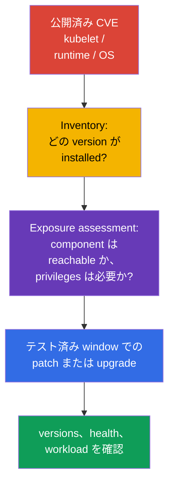
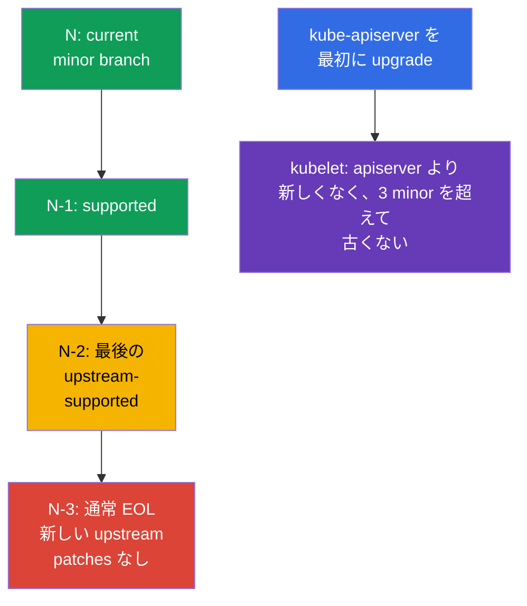

[Русская версия](ru.md) · [Eng version](README.md) · [Versión en español](es.md) · [Version française](fr.md) · [Deutsche Version](de.md) · [ქართული ვერსია](ge.md) · [繁體中文版](tw.md)

# 第13章. 脆弱性を修正するための Kubernetes アップグレード

> **課題。** kubelet、API server、container runtime、または kernel に公開済み CVE がある場合、脆弱な version を置き換えるまで、侵害された Pod または network から node と cluster へ至る経路として機能し続けます。EOL branch には修正が届かないことがあり、誤った upgrade order は安全な remediation ではなく downtime や incompatibility を生みます。

> **この先。** 第12章では Kubernetes API への access を減らしました。しかし正しく設定された API でも、`kube-apiserver`、kubelet、container runtime の既知の vulnerability は防げません。upgrade は security control です。公開済み CVE を attacker が利用できる期間を短縮します。これは CKS の **Cluster Hardening** domain（15%）です。advisory の緊急度を評価し、version skew を守り、新しい attack surface や downtime なしに cluster を upgrade する必要があります。

> **CKA で必要な知識。** `kubeadm upgrade` の完全な手順、`apply` と `node` の違い、`cordon`/`drain`/`uncordon`、PodDisruptionBudget、OS upgrade は別の lifecycle skill です。ここでは、CVE、EOL、advisories、version skew、evidence、node dependencies という必須の security sequence を扱います。

> 🧠 patch は exploitation window を短縮します。優先度は CVSS だけでなく、reachability、prerequisites、cluster exposure を考慮します。

## 13.1. patch が security control である理由

Kubernetes component、container runtime、node kernel の CVE は、attacker に Pod から data、Kubernetes API、または node 自体への経路を与え得ます。典型的な chain は、installed version 向け exploit が公開される -> attacker が workload または control plane network への entry を得る -> team が fix を導入する前に脆弱 component を使用する、です。Firewall、RBAC、NetworkPolicy は exposure を減らしますが、code defect を修正しません。



**Threat model。** CVE が危険なのは public endpoint がある場合だけだと考えないでください。たとえば `kubelet` bug はすでに侵害された Pod や隣接 node から reachable になり得ます。また `runc` flaw はすでに cluster で実行中の container から利用され得ます。したがって response は CVSS だけに依存しません。prerequisites、vulnerable function の利用可否、public exploit、compensating controls、affected node の価値が重要です。

**EOL（End of Life）** は別の risk です。upstream または distribution がサポートしなくなった branch では、新しい CVE fixes がまったく出ないことがあります。compensating control は EOL version を supported にはしません。supported minor branch へ移行する plan、または期限を明示した vendor support が必要です。

advisory への実践的な response:

1. managed control plane、worker pools、`containerd`、`runc`、OS、CNI を含め、affected components と正確な versions を記録します。
2. CVE の exploitation conditions を、自身の configuration、network reachability、attacker permissions と照合します。external access がないだけで CVE を無視しないでください。
3. advisory から fixed version を選び、support policy と compatibility を確認し、stage で test してから verification と rollback を伴う rollout を実行します。
4. immediate patch が不可能なら、advisory の推奨に従って exposure を一時的に縮小し、owner と deadline を指定します。一時的 mitigation を恒久化してはいけません。

> 🏭 release cadence と support window は lifecycle を決めます。supported cluster は EOL から緊急 migration するより patch しやすくなります。

## 13.2. Release cadence、support window、version skew

Kubernetes は regular に minor versions を、通常年三回リリースし、fix の準備に応じて patch releases を出します。正確な日付と fixes の一覧は古い runbook ではなく、該当 branch の release notes で確認してください。upstream は通常、current `N`、`N-1`、`N-2` の最新三 minor branches を support します。したがって `N-3` は通常 EOL です。managed service または enterprise distribution の window は異なる場合があり、別途確認が必要です。

この lab の Kubernetes `v1.36` は、Kubernetes の「現在の stable」version や最新 support window の約束ではなく、例の**target version**を表します。実際の change window 前に、supported target branch と advisory の fixed patch を確認してください。`v1.34` -> `v1.35` -> `v1.36` のように、一度に一 minor version ずつ順番に移行します。branch 内の patch は fixed version へ直接 upgrade できます。この cadence は test 時間を残し、緊急 CVE を multi-version migration project にしません。



> 🎯 control plane を先に upgrade します。kubelet は `kube-apiserver` より新しくなく、3 minor versions を超えて古くない必要があります。

**Version skew** は upgrade order を制限します。各 kubelet について、その `kube-apiserver` を基準に二つの boundary を確認します。

1. kubelet は API server **より新しくない**こと。
2. kubelet は API server より **3 minor versions を超えて古くない**こと。

このため control plane、次に worker nodes の順で upgrade します。許容される skew は短い rolling upgrade の一時的 state であり、old node を何か月も運用する通常 mode ではありません。他 components の範囲は version と role に依存するため、change 前に公式の [version skew policy](https://kubernetes.io/releases/version-skew-policy/) を確認してください。

**HA control plane。** `kube-apiserver` instances は最大一 minor version の違いしか許されません。cluster に old API server が一つでも残る間、その server が kubelet の upper boundary を狭めます。kubelet は**いずれの** API server よりも新しくなれません。たとえば API servers が `1.37` と `1.36` の場合、kubelet `1.36`、`1.35`、`1.34` は許容されますが、`1.37` は API server `1.36` のため不許可です。

**Control-plane managers。** `kube-controller-manager`、`kube-scheduler`、`cloud-controller-manager` は `kube-apiserver` より新しくしてはいけません。通常は同じ minor version に保ち、許容 skew では対応する API server より最大一 minor 古くできます。

target minor upgrade 前には、applications、Helm charts、operators、add-ons が使用する removed APIs も確認します。CVE remediation により、removed `apiVersion` のため次の deploy が壊れてはいけません。change window 前に inventory を保存し、見つかった dependencies を修正してください。

> 🏭 advisory と正確な inventory には、affected versions、remediation owner、SLA、fix evidence、一時的 mitigation を記録します。

## 13.3. Advisories、CVE feed、version inventory

意思決定の source は CVE aggregator だけでなく primary advisory です。Kubernetes では [security advisories](https://kubernetes.io/docs/reference/issues-security/security/) と release notes、OS、cloud provider、CNI、runtime では各 vendor の advisory を使います。NVD、GitHub Advisory Database、enterprise CVE feeds は通知や検索に役立ちますが、遅延、不完全な version ranges、configuration conditions の欠落があり得ます。

| 確認項目 | 確認場所 | 理由 |
|---|---|---|
| Kubernetes CVE と fixed version | Kubernetes security advisory、release notes | affected range、prerequisites、fixed version を理解する |
| branch support | upstream release/support policy または vendor policy | その後の patches がない EOL branch を選ばない |
| client/server version | `kubectl version --output=yaml` | server を advisory と照合する。client は node version を証明しない |
| 各 node version | `kubectl get nodes -o wide`、`kubectl describe node` | 遅れた kubelet と mixed rollout を見つける |
| runtime と OS packages | package manager、SBOM/asset inventory、vendor advisory | Kubernetes patch は `containerd`、`runc`、kernel、OpenSSL を修正しない |

```bash
# kubectl と API server の versions。kubeconfig の credentials を ticket や chat に出さないこと。
kubectl version --output=yaml

# 全 node の kubelet versions と状態。
kubectl get nodes -o wide
kubectl get nodes -o custom-columns=NAME:.metadata.name,KUBELET:.status.nodeInfo.kubeletVersion,OS:.status.nodeInfo.osImage

# 特定 node 上。package version と source は distribution に依存します。
kubeadm version -o short
containerd --version
runc --version
uname -r
```

`kubectl version` は API server を確認できますが、control-plane package と worker node の inventory の代わりにはなりません。managed Kubernetes では provider が control plane を update することがあります。それでも control-plane version、support calendar、node image/AMI、provider が branch support を終了する deadline を確認する必要があります。

patch SLA を持つことは有用です。reachable exploit を持つ critical CVE には短い response window を、ほかには次の planned window を割り当てます。severity だけでは priority になりません。低い CVSS でも external component で authentication 不要の CVE は、難しい prerequisites を持つ local CVE より重要になり得ます。

> 🎯 sequence: preflight → 最初の control plane の `kubeadm upgrade apply` → health → 各 worker の `kubeadm upgrade node`、`cordon`/`drain`、kubelet、verification、`uncordon`。

## 13.4. 安全な `kubeadm` upgrade: control plane、次に nodes

自作の package/repository scripts を暗記または copy しないでください。具体的な commands は target minor、OS、package manager、node state に依存します。試験でも実務でも、必要 version の official Kubernetes documentation を開き、手順どおりに実行してください。記憶から commands を再構成しようとするより信頼できます。

### 公式の経路

- [Upgrading kubeadm clusters](https://kubernetes.io/docs/tasks/administer-cluster/kubeadm/kubeadm-upgrade/) - target version の選択、最初と追加 control-plane nodes、cluster verification、recovery の主要 document。
- [Upgrading Linux nodes](https://kubernetes.io/docs/tasks/administer-cluster/kubeadm/upgrading-linux-nodes/) - Linux worker node の独立した sequence。
- [Changing the Kubernetes package repository](https://kubernetes.io/docs/tasks/administer-cluster/kubeadm/change-package-repository/) - target minor で `pkgs.k8s.io` repository の切り替えが必要な場合に使用。
- [Safely Drain a Node](https://kubernetes.io/docs/tasks/administer-cluster/safely-drain-node/) - `drain`、PodDisruptionBudget、DaemonSet の動作。
- [Version Skew Policy](https://kubernetes.io/releases/version-skew-policy/) - task の表現に疑問がある場合の compatibility boundaries。

target minor が current upstream と異なる場合は documentation の version selector を対応する branch に切り替えます。commands と package versions は、notes の例ではなく target release に正確に対応している必要があります。

### 短い試験用経路

1. task を読み、current と target versions を決めます。minor versions を飛ばさず、version skew に違反しません。
2. main guide を開きます。最初の control plane では、`kubeadm` を upgrade し、`kubeadm upgrade plan`、続いて `kubeadm upgrade apply <target-version>` を実行します。同じ guide に従い、その node の `drain`、`kubelet`/`kubectl` update、kubelet restart、node と control-plane components の verification、`uncordon` を行います。
3. HA では残りの control-plane nodes を一つずつ `kubeadm upgrade node` で update し、**それぞれ**について `drain` → kubelet/kubectl → restart → verification → `uncordon` を繰り返します。API が available であることを確認し、control plane が healthy になるまで worker に進みません。
4. 各 worker node では Linux-node guide を順番に実行します。`kubeadm` update → `kubeadm upgrade node` → `drain` → `kubelet`/`kubectl` update → kubelet restart → `Ready` と version の確認 → `uncordon`。
5. 最後に全 nodes の `Ready` と expected versions を確認します。`drain`、preflight、health check が失敗したら停止して原因を調査します。理由なく `--force`、`--disable-eviction`、`--ignore-preflight-errors` を追加しないでください。

> 🎯 **CKS Core。** 試験では documentation も workflow の一部です。guide を開き、current step を task と照合して、文字どおり実行します。custom automation を作ったり、production change runbook を再現したりする必要はありません。

### Production boundary

production change 前には advisory と release notes を読み、backup、CNI/CSI/runtime compatibility、capacity、tested rollback を確認します。これは `kubeadm` の順序を変えませんが、安全に rollout を始められるかを決めます。

> 🏭 Production。production では evidence を保存し、stage と progressive rollout を行います。詳細は platform に依存し、試験の command set ではありません。

## 13.5. Runtime と OS: Kubernetes だけが CVE source ではない

`kube-apiserver` の patch は、`containerd`、`runc`、kernel、OpenSSL、`systemd`、OS packages を update しません。container からの attack では runtime と kernel が workload と node の boundary になることが多いため、inventory と patch policy は node image 全体を対象にする必要があります。

| Dependency | 遅れている場合の risk | rollout 前の確認 |
|---|---|---|
| `containerd` と CRI | CVE、incompatible CRI、configuration/socket change | target Kubernetes version support、`SystemdCgroup`、service health、node image |
| `runc` | runtime vulnerability による container escape | advisory の fixed version と containerd package dependency |
| kernel と OS packages | privilege escalation、network/filesystem CVE | OS support、vendor security update、reboot 必要性、node image |
| cgroups/systemd | kubelet/runtime が起動しない、または異なる cgroup を使用 | unified cgroup driver、OS と runtime の cgroup v2 support |
| CNI、CSI、CoreDNS | change 後に network、storage、DNS が復旧しない | compatibility matrix と stage の smoke test |

### Kubernetes v1.35+ の Cgroup v2 baseline

Kubernetes v1.35+ への移行を計画する前に、**各 node**で preflight を行います。kubelet と runtime は cgroup v2 および一致した `systemd` cgroup driver で動作する必要があります。`failCgroupV1` は feature gate ではなく `KubeletConfiguration` field であり、v1.35 から default は `true` です。cgroup v1 を延命するために `failCgroupV1: false` で無効にしないでください。一時 override は短期で文書化された migration measure としてのみ許されます。check が失敗する場合は、production で preflight を bypass せず、まず stage で OS/runtime を移行して node image を確認します。

Kubernetes v1.36 では `KubeletCgroupDriverFromCRI` は GA です。CRI runtime が `RuntimeConfig` call を support する場合、kubelet は runtime から driver を取得して自らの `cgroupDriver` を無視します。runtime が support しなければ kubelet は自分の configuration の `cgroupDriver` を使用します。そのため `/var/lib/kubelet/config.yaml` と `/etc/containerd/config.toml` の paths を固定しないでください。まず installed CRI runtime の active `--config`/`--config-dir` kubelet、unit、process、documented config source を特定します。

```yaml
# startup configuration から見つけた active KubeletConfiguration 内。
failCgroupV1: true
# cgroupDriver: systemd  # RuntimeConfig を持たない runtime にだけ使う fallback
```

```bash
# 各 node 上。nonzero exit code は cgroup v2 baseline がまだ満たされないことを表します。
set -euo pipefail
test "$(stat -fc %T /sys/fs/cgroup)" = 'cgroup2fs'
sudo systemctl cat kubelet containerd crio 2>/dev/null || true
KUBELET_PID=$(pgrep -xo kubelet) || { echo 'kubelet process not found' >&2; exit 2; }
# `sudo cat` は root として /proc を開きます。`pipefail` は read error を保ちますが、
# --config/--config-dir がないことは許容されるため、grep だけに || true を付けます。
sudo cat "/proc/$KUBELET_PID/cmdline" \
  | tr '\0' '\n' \
  | { grep -E -- '^--config(=|$)|^--config-dir(=|$)' || true; }
sudo journalctl -u kubelet -b --no-pager | grep -Ei 'cgroup|RuntimeConfig' || true
```

CRI-O、非標準 installation の containerd、ほかの runtime では、documented runtime configuration と logs で effective driver を確認します。containerd path や `SystemdCgroup` field を無批判に copy しないでください。

安全な strategy は risk を分離することです。まず compatible な Kubernetes + runtime + OS の組み合わせを stage で確認し、その後 node ごとに rollout します。urgent runtime/OS CVE に immediate remediation が必要なら、同じ lifecycle を使います。`cordon` -> `drain` -> patch/reboot または replacement -> health check -> `uncordon`。immutable node pool では、多数 packages を in-place 変更するよりも、新しい patched pool を作成し、workload を rolling replacement で移動して old nodes を削除する方が安全なことがあります。

package repository の update 時は repository source と signature を確認します。異なる repositories の任意 versions を混ぜず、専用 test なしに大きな Kubernetes、runtime、OS migration を同時に行わないでください。そうすると CVE remediation と regression の切り分け、safe rollback が困難になります。

> 🎯 version skew に違反せず、全 nodes を同時 update せず、理由なく PDB や preflight を bypass せず、最終 version と health を確認します。

## 13.6. security upgrade の一般的な誤り

- **「public API がないので CVE は関係ない」。** 脆弱な kubelet または runtime は、Pod または node を侵害した internal attacker から reachable であり得ます。
- **control plane だけを patch する。** `kubectl version` が良く見えても、worker kubelet、`containerd`、`runc`、OS は脆弱なままです。
- **EOL を低 risk とみなす。** 新しい advisory がないことは patch がないことを意味し、vulnerabilities がないことではありません。
- **minor versions を飛ばす、または API server より先に kubelet を update する。** version skew に違反し、diagnose が難しい state を作ります。
- **全 nodes を同時 update する、または PDB を bypass する。** 緊急 CVE でも全 replicas の損失は正当化されません。まず exposure と capacity を評価し、rolling rollout を実行します。
- **成功した `kubeadm` だけを信頼する。** command は runtime、CNI、DNS、storage、applications が fixed versions で実際に動くことを証明しません。

> 🏭 security upgrade: advisories、inventory、support policy、stage、progressive rollout、evidence、health failure での stop conditions。

## 13.7. production での適用方法

- **process としての patch management。** Team は upstream と vendor advisories を購読し、CVE を inventory に結び付け、severity-based SLA、owner、rollout window、closure evidence を割り当てます。年一回の「upgrade day」より優れています。
- **patch 公開後に risk は増える。** vulnerable と fixed version の diff は CVE の原因範囲を狭め、reverse engineering を容易にすることがあります。そのため known で attacker に reachable、かつ fixed patch 公開後も未修正の CVE は通常高 priority です。exploit の出現または adaptation の可能性が増すためです。AI-assisted analysis はこの研究の cost と時間をさらに下げますが、それだけで exploitability を証明するものではありません。reachability、prerequisites、asset value を引き続き評価します。
- **release からの短い lag。** support window N/N-1/N-2 内で regular に移行すると、各 change を小さく保ち、critical CVE を落ち着いて test できます。夜間の multi-hop upgrade にはなりません。
- **stage と progressive rollout。** 最初に node image と add-ons を test し、次に小さな pool/node を update して metrics を確認してから続行します。managed Kubernetes では control plane と node pool の deadlines を別々に管理します。
- **automated だが observable な node replacement。** Infrastructure as Code、golden image、maintenance windows、PDB、autoscaling により upgrade は reproducible になります。automation は health failure で停止すべきで、全 fleet を置換し続けてはいけません。
- **単一の SBOM/asset inventory。** Kubernetes だけでなく `containerd`、`runc`、CNI、OS、kernel と advisory を結びつけ、node attack のもう一方を見逃さないようにします。

## 13.8. ミニ用語集

- **CVE** - publicly known vulnerability の identifier。
- **security advisory** - affected versions、exploitation conditions、mitigation、fixed version を含む vendor の primary notification。
- **EOL** - version support の終了。通常、新しい upstream security patches は出ません。
- **release cadence** - minor と patch releases の頻度。
- **support window** - supported branches の範囲。upstream Kubernetes は通常 `N`、`N-1`、`N-2` を保守します。
- **version skew** - components 間で許容される version 差。kubelet は API server より新しくなく、3 minor versions を超えて古くありません。
- **`kubeadm upgrade plan` / `apply` / `node`** - upgrade plan / 最初の control plane での apply / specific node の configuration update。
- **rolling upgrade** - steps 間で verification を行いながら一 node ずつ update すること。
- **`cordon` / `drain` / `uncordon`** - scheduling を禁止 / workload を evict / node を scheduling に戻すこと。
- **node image** - node 用の整合した OS、runtime、packages image。

## 13.9. 章のまとめ

- upgrade は security control です。Kubernetes の既知 CVE を修正しますが、RBAC、network controls、hardening を置き換えません。
- EOL branch は、新しい CVE に upstream patch がない可能性があるため危険です。通常は `N`、`N-1`、`N-2` のみが supported で、`N-3` は EOL です。
- advisory と release notes は fixed version と CVE conditions の primary source です。CVE feed は通知に役立ちますが、advisory の確認と node inventory を置き換えません。
- version skew を守ります。control plane を最初に update し、kubelet は API server より新しくなく、3 minor versions を超えて古くありません。minor versions は順に通過します。
- 安全な `kubeadm` rollout: preflight と backup -> control plane -> health check -> worker ごとに `kubeadm` -> `kubeadm upgrade node` -> `cordon`/`drain` -> kubelet/kubectl -> restart と verification -> `uncordon`。
- Kubernetes patch は `containerd`、`runc`、kernel、OS の CVE を修正しません。runtime と node image には個別の compatibility check と patch policy が必要です。

## 13.10. 試験と実務での役立ち方

**試験で。** task は cluster の安全な upgrade または version order の説明を求めることがあります。最初に current と target versions を確認し、version skew に違反せず、worker node の前に control plane を update し、kubelet update 前に `drain` を使用して `uncordon` で node を戻します。最初の control plane では `kubeadm upgrade apply`、worker では `kubeadm upgrade node` を使う違いを覚えてください。

**実務で。** skill の価値は `kubeadm` を機械的に実行することではなく、availability を失わず CVE exposure を減らすことです。engineer は advisory を読み、affected versions を確認し、EOL と dependencies を確認し、node image を test し、rolling wave で進め、fixed version と service health の両方を証明します。

> 🏭 Production gate は versions、readiness、health の evidence を記録します。tested rollback の代わりにはなりません。

## 13.11. 自習: security upgrade gate

これは kubeadm cluster 向けの self-contained な controlled simulation です。実際の package upgrade を置き換えるものではありません。目的は training cluster の version を変更せず、CKS-oriented preflight gates を通過することです。一回限りの environment でのみ実行し、etcd certificate paths はまず control plane の manifest と照合してください。

evidence directory を作成し、初期 state を記録します。

```bash
export UPGRADE_EVIDENCE=/tmp/cks-upgrade-security
mkdir -p "$UPGRADE_EVIDENCE/before"

kubectl version -o yaml > "$UPGRADE_EVIDENCE/before/version.yaml"
kubectl get nodes -o wide > "$UPGRADE_EVIDENCE/before/nodes.txt"
kubectl get --raw='/readyz?verbose' > "$UPGRADE_EVIDENCE/before/readyz.txt"
```

### Gate 1: kubelet version skew と plan

これは限定的な gate です。`kubectl` が返す一つの API server とのみ各 kubelet を比較します（HA では load balancer の一 backend の場合があります）。kubelet がその API server より**新しい**、または 3 minor versions を超えて**古い**場合に停止します。すべての HA API servers の skew を証明せず、`kube-controller-manager`、`kube-scheduler`、`cloud-controller-manager`、`kube-proxy`、`kubectl` も確認しません。これらの inventory と policy は production rollout 前に個別確認します。次に `kubeadm upgrade plan` が available targets、preflight、upgrade order を確認します。実際の移行では正確に次の minor branch を選びます。

```bash
set -euo pipefail
SERVER_MINOR=$(kubectl version -o json | jq -r '.serverVersion.minor | sub("[^0-9].*$"; "") | tonumber')
kubectl get nodes -o json | jq -e --argjson server "$SERVER_MINOR" \
  '[.items[] | (.status.nodeInfo.kubeletVersion | capture("v1\\.(?<m>[0-9]+)").m | tonumber)] |
   all(. >= ($server - 3) and . <= $server)' \
  | tee "$UPGRADE_EVIDENCE/before/skew-check.txt"
sudo kubeadm upgrade plan | tee "$UPGRADE_EVIDENCE/before/kubeadm-upgrade-plan.txt"
```

### Gate 2: backup と検証可能な restore

`etcdctl`/`etcdutl` があることを kubeadm installation だけから推測してはいけません。gate 前に binaries と etcd version との compatibility を確認します。tools がない場合は、trusted source から事前に検証・pin した compatible version を導入するか、approved operational image/toolbox を使います。change window 中に `latest` を直接 download しないでください。

```bash
set -euo pipefail
command -v etcdctl >/dev/null 2>&1 || {
  echo 'ERROR: etcdctl is not installed on this control-plane node' >&2
  exit 1
}
command -v etcdutl >/dev/null 2>&1 || {
  echo 'ERROR: etcdutl is not installed on this control-plane node' >&2
  exit 1
}
etcdctl version
etcdutl version
```

control plane node で `/etc/kubernetes/manifests/etcd.yaml` の TLS parameters を使用して snapshot を作成し、`etcdutl snapshot status` で確認します。running etcd に restore を実行しないでください。正確な restore command を runbook に記録し、separate cluster で rehearsal します。

```bash
set -euo pipefail
sudo ETCDCTL_API=3 etcdctl snapshot save /var/backups/etcd-pre-upgrade.db \
  --endpoints=https://127.0.0.1:2379 \
  --cacert=/etc/kubernetes/pki/etcd/ca.crt \
  --cert=/etc/kubernetes/pki/etcd/healthcheck-client.crt \
  --key=/etc/kubernetes/pki/etcd/healthcheck-client.key
sudo etcdutl snapshot status /var/backups/etcd-pre-upgrade.db -w json \
  | tee "$UPGRADE_EVIDENCE/before/etcd-snapshot-status.json"
sudo sha256sum /var/backups/etcd-pre-upgrade.db \
  | tee "$UPGRADE_EVIDENCE/before/etcd-snapshot.sha256"
```

### Gate 3: deprecated API と security configuration

Git 内 manifests だけでなく、API server metric で deprecated APIs の実際の利用を確認します。下の `kubectl get --raw /metrics` は選択された一つの API server backend からだけ metrics を得るため、HA では complete inventory ではなく local evidence にすぎません。production HA では、monitoring で**すべての** API servers の scrape を aggregate します（例: PromQL `max by (group, version, resource, subresource, removed_release) (apiserver_requested_deprecated_apis) > 0`）。または各 API server の audit events を確認します。値が zero より大きいすべての line に、upgrade 前に owner と remediation を割り当てます。admission と critical RBAC permissions を記録します。詳細な Pod Security Admission configuration は upgrade practice ではなく第19章で扱います。

```bash
set -euo pipefail
# これは選択された API server backend の evidence のみです。HA では上記の aggregation を使います。
kubectl get --raw /metrics \
  | awk '/^apiserver_requested_deprecated_apis/ && $NF > 0' \
  | tee "$UPGRADE_EVIDENCE/before/deprecated-apis.txt"

```

### Production note: custom security flags の保持

self-hosted `kubeadm` production upgrade では、command が `ClusterConfiguration` から static Pod manifests を書き換える可能性があります。そのため custom audit、encryption、profiling settings は Infrastructure as Code に記録し、change/rollback procedure で個別確認する必要があります。

> 🏭 **Production。** これは特定 platform implementation の operational control であり、🎯 CKS Core でも、この章の mandatory before/after static-Pod runbook でもありません。

### Controlled simulation と post-upgrade validation

training simulation では post-upgrade evidence 用の別の Bash runbook は不要です。試験の手順から注意をそらすためです。task 指定の upgrade process 後、control plane と kubelet が expected versions で version skew を守り、`/readyz` が成功し、すべての nodes が `Ready` であることを確認します。次に `kube-system` と一つの critical workload を確認します。問題があれば停止して events を収集し、次の node へ進みません。

actual rollout では、before/after の正確な versions、検証済み etcd snapshot の status、health/smoke tests、tested rollback をさらに保存します。custom RBAC または admission policy の変更は project-specific procedure で照合し、一般的な YAML diff で安全と判断しようとしてはいけません。

> 🎯 **CKS Core。** 試験では task の条件だけに従います。control plane は worker より前に update し、worker update 前に `cordon`/`drain` を使用し、verification 後に `uncordon` で node を戻します。

## 13.12. 自己確認問題

<details>
<summary>1. API server が internet から利用できなくても、kubelet または `runc` の CVE が critical になり得るのはなぜですか？</summary>

kubelet はすでに侵害された Pod または隣接 node から attacker に reachable であり得て、`runc` vulnerability はすでに実行中の container から exploit され得ます。したがって public API がないことは internal attack prerequisites を取り除きません。priority は external exposure だけでなく、vulnerable function の reachability、必要 permissions、exploit、node value で決めます。
</details>

<details>
<summary>2. 次の CVE という観点で、EOL branch は supported branch とどう異なりますか？</summary>

supported branch では upstream または vendor が support policy 内で fixed patch をリリースします。EOL branch では次の vulnerability が新しい security patch をまったく受けないことがあります。compensating controls は EOL version を supported にはしないため、supported minor branch への移行または明確に期限を区切った vendor support が必要です。
</details>

<details>
<summary>3. 通常どの branches が upstream support window `N`/`N-1`/`N-2` に含まれ、`N-3` は何を意味しますか？</summary>

upstream Kubernetes は通常 current minor branch `N` と二つ前までの `N-1`、`N-2` を support します。`N-3` は通常 EOL で、新しい upstream security patches を受けません。managed service または enterprise distribution の実際の window は異なる場合があるため、個別に確認します。
</details>

<details>
<summary>4. upgrade の緊急度を決めるために CVSS と CVE feed だけでは不十分なのはなぜですか？</summary>

CVSS は cluster 固有の exposure を表しません。prerequisites、function reachability、attacker access、public exploit、compensating controls が必要です。CVE feed は通知に有用ですが、遅れたり正確な ranges や conditions を欠いたりします。decision は primary vendor/upstream advisory、fixed version、inventory、support policy に基づきます。
</details>

<details>
<summary>5. なぜ control plane を worker nodes より先に update し、kubelet は API server より新しくなく、3 minor versions を超えて遅れてはならないのですか？</summary>

version skew では kubelet は kube-apiserver より新しくなく、3 minor versions を超えて古くない必要があるため、control plane を最初に上げます。HA では old API server が cluster に残る間、それも kubelet の allowed upper version を制限します。この skew は rolling upgrade 中だけ許容され、恒久 state ではありません。
</details>

<details>
<summary>6. `kubeadm` を使う worker node の安全な upgrade sequence を挙げてください。</summary>

healthy control plane の後、worker で `kubeadm` を update し、`kubeadm upgrade node` を実行します。次に administrative machine から PDB と capacity を考慮して `cordon` と `drain` を実行します。target `kubelet` と `kubectl` を install し、kubelet を restart して、Ready、version、workload smoke test を確認します。その後にだけ `uncordon` を行い、次の node に進みます。
</details>

<details>
<summary>7. successful `kubeadm upgrade` の後、security patch と cluster functionality の両方を証明するにはどの checks が必要ですか？</summary>

`kubeadm` exit code だけではなく、`kubectl version --output=yaml` と `kubectl get nodes -o wide` で actual control-plane と kubelet versions を確認します。`/readyz?verbose`、全 Node の `Ready`、`kube-system`、critical DaemonSet/Deployment、events、workload smoke test で health を確認します。alerts、runtime、CNI、DNS、storage の問題がないことも確認します。
</details>

<details>
<summary>8. Kubernetes upgrade が `containerd`、`runc`、kernel の CVE を自動で閉じないのはなぜですか？また安全にどう update しますか？</summary>

Kubernetes packages は independent runtime、kernel、OS packages を update しませんが、これらは container と node の boundary になることが多いです。versions と Kubernetes compatibility を vendor advisory、inventory、node image と照合します。同じ controlled lifecycle を使います。stage、次に node-by-node の `cordon`/`drain`、patch または reboot/replacement、health check、`uncordon` です。
</details>

<details>
<summary>9. **Flashback（第26章）。** version skew（本章）と image digest pinning（第26章）はどちらも「現在動く正確な version」を確認可能な fact にします。「compatible version」（version skew）と「identical version」（digest）はどう異なり、kubelet/API server には前者で十分な一方、production container image には後者が必須なのはなぜですか？</summary>

version skew は interacting components の minor versions 間に許容される関係を定めます。kubelet と API server は異なっていても、指定 range で compatible であり得ます。一方 digest は image の不変な正確な bytes を識別し、tag はその保証をしません。Kubernetes の rolling lifecycle には制限された version compatibility が必要で、production image は正確な content に再現可能に固定する必要があります。
</details>

## 演習

演習 13.11 は外部 material なしに CKS-oriented security gates をすべて扱います。第14章では node attack surface の最小化と runtime daemon security に進みます。

🧪 Lab 113（`kubeadm` による control-plane と worker の upgrade、downtime がない evidence）: [tasks/cks/labs/113](../../labs/113/README_JP.MD)

🎮 Killercoda（installation 不要の browser 内）: [Upgrading Kubernetes](https://killercoda.com/chadmcrowell/course/cka/upgrade-k8s) · [Upgrade Kubelet](https://killercoda.com/chadmcrowell/course/cka/upgrade-kubelet)

## 総合チェックポイント: Cluster Hardening の完了

System Hardening に進む前に、15-20 分、hints なしで Cluster Hardening domain（第10-13章）が身に付いたか確認します。

1. test subject 用に狭い Role/RoleBinding を作成し、二つの `can-i` checks で `get pods` は許可され、`delete pods` は拒否されることを示します（第10章）。
2. test namespace の `default` ServiceAccount で `automount` を無効にし、explicit SA のない新しい Pod が token file を受け取らないことを証明します（第11章）。
3. API server で anonymous access が有効かを確認し、response の `401` と `403` の違いを説明します（第12章）。
4. **総合 task。** NetworkPolicy default-deny（第04章、Cluster Setup domain）と RBAC default-deny（第10章、この domain）を比較します。両方で explicit rule がないことが allow ではなく deny を意味する理由と、decision maker（API server RBAC authorizer と CNI plugin）の違いを説明します。
5. `kubeadm` を使う control-plane upgrade の安全な sequence を挙げ、kubelet が API server より新しくてはならない理由を説明します（第13章）。

task 4 が難しかった場合は、第04章と第10章を一緒に見直してください。

---
[目次](../README_JP.md) · [第12章](../12/jp.md) · [第14章](../14/jp.md)
