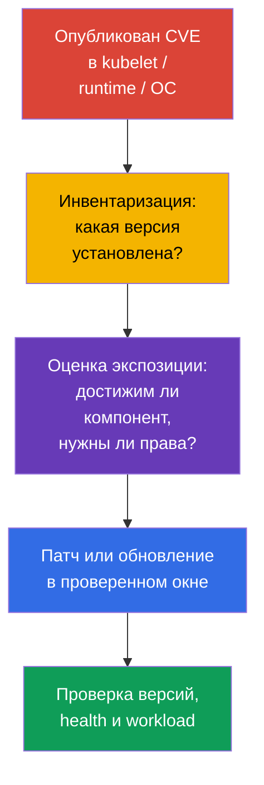
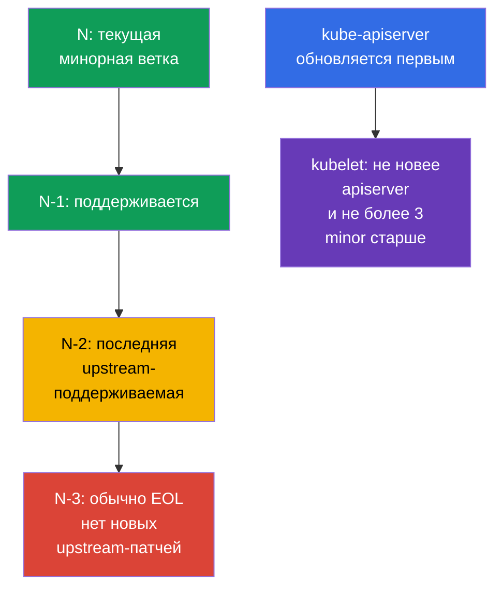

<!-- Standalone RU release: ссылки на переводы удалены, потому что соответствующие файлы не входят в архив. -->

# Глава 13. Обновление Kubernetes для устранения уязвимостей

> **Проблема.** Опубликованный CVE в kubelet, API server, container runtime или ядре
> остаётся рабочим путём от скомпрометированного Pod либо сети к ноде и кластеру, пока
> уязвимая версия не заменена. EOL-ветка может вообще не получить исправление, а неверный
> порядок обновления добавляет простой или несовместимость вместо безопасного remediation.

> **Что дальше.** В главе 12 мы сократили доступ к Kubernetes API. Но правильно настроенный
> API не спасает от известной уязвимости в `kube-apiserver`, kubelet или container runtime.
> Обновление - это security-контроль: оно сокращает время, в течение которого атакующий
> может использовать опубликованный CVE. Это домен **Cluster Hardening** CKS (15%): нужно
> уметь оценить срочность advisory, соблюсти version skew и обновить кластер без новой
> поверхности атаки и без простоя.

> **Что нужно знать из CKA.** Полная процедура `kubeadm upgrade`, различие `apply` и
> `node`, `cordon`/`drain`/`uncordon`, PodDisruptionBudget и обновление ОС — отдельный
> lifecycle-навык. Здесь фиксируем необходимую security-последовательность: CVE, EOL,
> advisories, version skew, evidence и зависимости ноды.

> 🧠 Patch сокращает окно эксплуатации; приоритет учитывает достижимость, prerequisites и экспозицию кластера, не только CVSS.

## 13.1. Почему патч - это security-контроль

CVE в Kubernetes-компоненте, container runtime или ядре ноды может дать атакующему путь от
Pod к данным, Kubernetes API или самой ноде. Типичная цепочка: опубликован exploit для
установленной версии -> атакующий получает вход в workload либо сеть к control plane ->
использует уязвимый компонент до того, как команда поставит исправление. Firewall, RBAC и
NetworkPolicy уменьшают экспозицию, но не исправляют дефект в коде.



**Модель угрозы.** Не следует считать, что CVE опасен только при публичном endpoint. Например,
ошибка в `kubelet` может быть доступна с уже скомпрометированного Pod или соседней ноды,
а дефект `runc` - из контейнера, который уже запущен в кластере. Поэтому ответ зависит не
только от CVSS: важны prerequisites, доступность уязвимой функции, наличие публичного
exploit, компенсирующие controls и ценность затронутых нод.

**EOL (End of Life)** - отдельный риск. Для ветки, которую больше не поддерживает upstream
или дистрибутив, новые исправления CVE могут вообще не появиться. Компенсирующий control
не превращает EOL-версию в поддерживаемую: нужен план перехода на поддерживаемую минорную
ветку или поддержка от поставщика с явно определённым сроком.

Практическая реакция на advisory:

1. Зафиксируйте затронутые компоненты и точные версии, включая managed control plane,
   worker pools, `containerd`, `runc`, ОС и CNI.
2. Сопоставьте условия эксплуатации CVE со своей конфигурацией, сетевой доступностью и
   правами атакующего. Не игнорируйте CVE только из-за отсутствия внешнего доступа.
3. Выберите исправленную версию из advisory, проверьте support policy и совместимость,
   протестируйте в stage, затем выполните rollout с проверкой и откатом.
4. Если немедленный патч невозможен, временно сузьте экспозицию по рекомендациям advisory,
   назначьте владельца и дедлайн. Временная mitigation не должна остаться постоянной.

> 🏭 Release cadence и support window задают lifecycle: поддерживаемый кластер проще патчить, чем срочно мигрировать из EOL.

## 13.2. Release cadence, support window и version skew

Kubernetes выпускает минорные версии регулярно, обычно три раза в год, а patch-релизы
выходят по мере готовности исправлений. Точную дату и список исправлений надо брать из
release notes конкретной ветки, а не из старого runbook. Upstream обычно поддерживает три
последние минорные ветки: текущую `N`, `N-1` и `N-2`. Следовательно, `N-3` обычно уже EOL;
у managed-сервиса или enterprise-дистрибутива окно может отличаться, и его нужно проверять
отдельно.

В этой лаборатории Kubernetes `v1.36` обозначает **целевую (target) версию примера**, а не
«текущую stable» версию Kubernetes и не обещание её актуального support window. Перед
реальным change window сверяйте фактическую поддерживаемую target-ветку и fixed patch из
advisory. Переход делают последовательно, по одной minor-версии, например `v1.34` ->
`v1.35` -> `v1.36`; patch внутри ветки можно обновлять напрямую до исправленной версии.
Такой ритм оставляет время на тесты и не превращает срочный CVE в многоверсионный
migration-проект.



> 🎯 Сначала обновляйте control plane; kubelet не новее `kube-apiserver` и не более чем на три minor-версии старше него.

**Version skew** ограничивает порядок обновления. Для каждого kubelet проверяйте две
границы относительно его `kube-apiserver`:

1. kubelet **не новее** API server;
2. kubelet **не более чем на три minor-версии старее** API server.

Из них следует порядок: сначала обновляют control plane, затем рабочие узлы. Допустимый
skew — временное состояние для короткого rolling upgrade, а не нормальный режим жизни
старых нод месяцами. Диапазон для других компонентов зависит от версии и роли; перед
изменением сверяйтесь с официальной
[policy version skew](https://kubernetes.io/releases/version-skew-policy/).

**HA control plane.** Экземпляры `kube-apiserver` могут отличаться максимум на одну
minor-версию. Пока в кластере остаётся старый API server, именно он сужает верхнюю границу
kubelet: kubelet не может быть новее **ни одного** API server. Например, при API servers
`1.37` и `1.36` допустимы kubelet `1.36`, `1.35` и `1.34`; kubelet `1.37` недопустим из-за
API server `1.36`.

**Control-plane managers.** `kube-controller-manager`, `kube-scheduler` и
`cloud-controller-manager` не должны быть новее `kube-apiserver`. Обычно их держат на той
же minor-версии; в допустимом skew они могут быть не более чем на одну minor-версию старее
соответствующего API server.

Перед целевым минорным обновлением также проверьте удаляемые API у приложений, Helm-чартов,
операторов и аддонов. Устранение CVE не должно сломать следующий deploy из-за удалённого
`apiVersion`; сохраните inventory до change window и устраните найденные зависимости до upgrade.

> 🏭 Advisory и точный inventory фиксируют affected versions, владельца remediation, SLA, evidence исправления и временную mitigation.

## 13.3. Advisories, CVE feed и инвентаризация версий

Источник решения - первичный advisory, а не только агрегатор CVE. У Kubernetes это
[security advisories](https://kubernetes.io/docs/reference/issues-security/security/) и
release notes; для ОС, облачного поставщика, CNI и runtime - advisory их производителя.
NVD, GitHub Advisory Database и корпоративные CVE feeds полезны для уведомлений и поиска,
но могут отставать, содержать неполные диапазоны версий или не описывать конфигурационные
условия.

| Что проверять | Где искать | Зачем |
|---|---|---|
| Kubernetes CVE и fixed version | Kubernetes security advisory, release notes | Понять затронутый диапазон, prerequisites и версию с исправлением |
| Поддержку ветки | upstream release/support policy или policy поставщика | Не выбрать EOL-ветку без последующих патчей |
| Версию client/server | `kubectl version --output=yaml` | Сопоставить server с advisory; client не доказывает версию ноды |
| Версию каждой ноды | `kubectl get nodes -o wide`, `kubectl describe node` | Найти отстающие kubelet и смешанный rollout |
| Пакеты runtime и ОС | пакетный менеджер, SBOM/asset inventory, vendor advisory | Kubernetes-патч не исправляет `containerd`, `runc`, kernel или OpenSSL |

```bash
# Версии kubectl и API server. Не выводите credentials из kubeconfig в тикет или чат.
kubectl version --output=yaml

# Версии kubelet на всех нодах и их состояние.
kubectl get nodes -o wide
kubectl get nodes -o custom-columns=NAME:.metadata.name,KUBELET:.status.nodeInfo.kubeletVersion,OS:.status.nodeInfo.osImage

# На конкретной ноде: версия и происхождение пакетов зависят от дистрибутива.
kubeadm version -o short
containerd --version
runc --version
uname -r
```

`kubectl version` видит API server, но не заменяет инвентаризацию control-plane пакетов и
рабочего узла. В managed Kubernetes control plane может обновлять провайдер: всё равно нужно
сверить версию control plane, support calendar, node image/AMI и deadline, после которого
поставщик прекращает поддержку ветки.

Полезная привычка - вести patch SLA: критический CVE с reachable exploit получает короткое
окно реакции, остальные - ближайшее плановое окно. Severity сама по себе не приоритет:
CVE с меньшим CVSS, но без authentication в доступном извне компоненте, может быть важнее
локального CVE с трудными prerequisites.

> 🎯 Последовательность: preflight → первый control plane через `kubeadm upgrade apply` → health → каждый worker через `kubeadm upgrade node`, `cordon`/`drain`, kubelet, проверку и `uncordon`.

## 13.4. Безопасный `kubeadm` upgrade: control plane, затем ноды

Не заучивайте и не копируйте самодельные package/repository scripts: конкретные команды
зависят от target minor, ОС, package manager и состояния узла. На экзамене и в реальной
работе откройте официальную документацию Kubernetes для нужной версии и последовательно
выполните её шаги. Это надёжнее, чем пытаться восстановить команды по памяти.

### Официальный маршрут

- [Upgrading kubeadm clusters](https://kubernetes.io/docs/tasks/administer-cluster/kubeadm/kubeadm-upgrade/) — основной документ: выбор target version, первый и дополнительные control-plane узлы, проверка кластера и recovery.
- [Upgrading Linux nodes](https://kubernetes.io/docs/tasks/administer-cluster/kubeadm/upgrading-linux-nodes/) — отдельная последовательность для worker-ноды Linux.
- [Changing the Kubernetes package repository](https://kubernetes.io/docs/tasks/administer-cluster/kubeadm/change-package-repository/) — используйте, когда target minor требует переключения `pkgs.k8s.io` repository.
- [Safely Drain a Node](https://kubernetes.io/docs/tasks/administer-cluster/safely-drain-node/) — поведение `drain`, PodDisruptionBudget и DaemonSet.
- [Version Skew Policy](https://kubernetes.io/releases/version-skew-policy/) — границы совместимости, если формулировка задания вызывает сомнение.

Если target minor отличается от current upstream, в документации переключите selector версии
на соответствующую ветку: команды и package versions должны относиться именно к target
release, а не к примеру из конспекта.

### Короткий экзаменационный маршрут

1. Прочитайте задание, определите текущую и целевую версии; не пропускайте minor-версии и
   не нарушайте version skew.
2. Откройте основной guide. На первом control-plane следуйте его шагам: обновите `kubeadm`,
   выполните `kubeadm upgrade plan`, затем `kubeadm upgrade apply <target-version>`. Затем по
   тому же guide выполните для этой ноды `drain`, обновление `kubelet`/`kubectl`, restart
   kubelet, проверку node и control-plane components и `uncordon`.
3. В HA обновляйте остальные control-plane ноды по одной через `kubeadm upgrade node`, после
   чего для **каждой** повторите тот же lifecycle `drain` → kubelet/kubectl → restart →
   проверка → `uncordon`. Убеждайтесь, что API остаётся доступен, и не переходите к worker,
   пока control plane не healthy.
4. Для каждой worker-ноды откройте Linux-node guide и выполняйте его по порядку: обновить
   `kubeadm` → `kubeadm upgrade node` → `drain` → обновить `kubelet`/`kubectl` → restart
   kubelet → проверить `Ready` и версию → `uncordon`.
5. В конце подтвердите `Ready` всех нод и ожидаемые версии. Если `drain`, preflight или
   health check не проходит, остановитесь и разберите причину; не добавляйте наугад
   `--force`, `--disable-eviction` или `--ignore-preflight-errors`.

> 🎯 **CKS Core.** На экзамене документация — часть рабочего процесса: откройте guide,
> сопоставьте текущий шаг с заданием и выполняйте его буквально. Не нужно создавать custom
> automation или воспроизводить production change runbook.

### Production boundary

Перед production change дополнительно читают advisory и release notes, проверяют backup,
CNI/CSI/runtime compatibility, capacity и tested rollback. Это не меняет порядок `kubeadm`,
но определяет, можно ли безопасно начинать rollout.

> 🏭 Production. В production фиксируют evidence, делают stage и progressive rollout; детали
> зависят от platform и не являются экзаменационным набором команд.

## 13.5. Runtime и ОС: Kubernetes не единственный источник CVE

Патч `kube-apiserver` не обновляет `containerd`, `runc`, kernel, OpenSSL, `systemd` и
пакеты ОС. Для атаки из контейнера именно runtime и kernel часто являются границей между
workload и нодой. Поэтому inventory и patch policy должны охватывать весь node image.

| Зависимость | Риск при отставании | Что проверить перед rollout |
|---|---|---|
| `containerd` и CRI | CVE, несовместимый CRI, изменение конфигурации/сокета | Поддержку целевой Kubernetes-версии, `SystemdCgroup`, health сервиса и образ ноды |
| `runc` | escape из контейнера при уязвимости runtime | Fixed version из advisory и пакетную зависимость containerd |
| kernel и ОС-пакеты | privilege escalation, network/filesystem CVE | Поддержку ОС, vendor security update, необходимость reboot и node image |
| cgroups/systemd | kubelet/runtime не запускаются либо получают разные cgroup | Единый cgroup driver и поддержку cgroup v2 в ОС и runtime |
| CNI, CSI, CoreDNS | сеть, storage или DNS не восстановятся после change | Compatibility matrix и smoke test на stage |

### Cgroup v2 baseline для Kubernetes v1.35+

До планирования перехода на Kubernetes v1.35+ выполните preflight **на каждой ноде**:
kubelet и runtime должны работать с cgroup v2 и согласованным `systemd` cgroup driver.
`failCgroupV1` — поле `KubeletConfiguration`, а не feature gate; его default равен `true`
с v1.35. Не отключайте его через `failCgroupV1: false`, чтобы продлить жизнь cgroup v1:
временный override возможен лишь как краткая, документированная мера миграции. Если
проверка не проходит, сначала мигрируйте ОС/runtime в stage и проверьте node image, а не
обходите preflight в production.

В Kubernetes v1.36 `KubeletCgroupDriverFromCRI` уже GA. Если CRI runtime поддерживает
вызов `RuntimeConfig`, kubelet получает driver от runtime и игнорирует собственный
`cgroupDriver`; если runtime его не поддерживает, kubelet использует `cgroupDriver` из
своей конфигурации. Поэтому не фиксируйте пути `/var/lib/kubelet/config.yaml` и
`/etc/containerd/config.toml`: сначала определите активные `--config`/`--config-dir` kubelet
и unit, процесс и документированный config source установленного CRI runtime.

```yaml
# В активном KubeletConfiguration, найденном из startup configuration.
failCgroupV1: true
# cgroupDriver: systemd  # fallback только для runtime без RuntimeConfig
```

```bash
# На каждой ноде; ненулевой exit code означает, что cgroup v2 baseline пока не выполнен.
set -euo pipefail
test "$(stat -fc %T /sys/fs/cgroup)" = 'cgroup2fs'
sudo systemctl cat kubelet containerd crio 2>/dev/null || true
KUBELET_PID=$(pgrep -xo kubelet) || { echo 'kubelet process not found' >&2; exit 2; }
# `sudo cat` открывает /proc как root. `pipefail` сохраняет ошибку чтения, тогда как
# отсутствие --config/--config-dir остаётся допустимым и потому только grep получает || true.
sudo cat "/proc/$KUBELET_PID/cmdline" \
  | tr '\0' '\n' \
  | { grep -E -- '^--config(=|$)|^--config-dir(=|$)' || true; }
sudo journalctl -u kubelet -b --no-pager | grep -Ei 'cgroup|RuntimeConfig' || true
```

Для CRI-O, containerd с нестандартной установкой или другого runtime проверьте его
эффективный driver в документированной runtime-конфигурации и в логах; не копируйте путь
containerd или поле `SystemdCgroup` вслепую.

Безопасная стратегия - разделить риск: сначала проверить совместимую связку Kubernetes +
runtime + ОС в stage, затем раскатывать по нодам. Если urgent runtime/OS CVE требует
немедленной remediation, используйте тот же lifecycle: `cordon` -> `drain` -> patch/reboot
или replacement -> health check -> `uncordon`. Для immutable node pool часто безопаснее
создать новый patched pool, перенести workload rolling-заменой и удалить старые ноды, чем
менять множество пакетов на месте.

При обновлении package repository проверяйте источник и подпись репозитория. Не смешивайте
случайные версии из разных репозиториев и не делайте одновременно большой Kubernetes,
runtime и ОС migration без выделенного теста: так трудно отличить CVE remediation от
regression и безопасно откатиться.

> 🎯 Не нарушайте version skew, не обновляйте все ноды одновременно, не обходите PDB или preflight без причины и подтверждайте итог версиями и health.

## 13.6. Типичные ошибки при security-обновлении

- **«У нас нет публичного API, CVE не касается нас».** Уязвимый kubelet или runtime может
  быть доступен внутреннему атакующему после компрометации Pod или ноды.
- **Патчится только control plane.** Worker kubelet, `containerd`, `runc` и ОС остаются
  уязвимыми, хотя `kubectl version` уже выглядит хорошо.
- **EOL принимают за низкий риск.** Отсутствие нового advisory означает отсутствие patch,
  а не отсутствие уязвимостей.
- **Перепрыгивают минорные версии или обновляют kubelet раньше API server.** Это нарушает
  version skew и создаёт трудно диагностируемое состояние.
- **Обновляют все ноды сразу либо обходят PDB.** Срочный CVE не оправдывает потерю всех
  реплик; сначала оценивают экспозицию и capacity, затем выполняют rolling rollout.
- **Доверяют только успешному `kubeadm`.** Команда не доказывает, что runtime, CNI, DNS,
  storage и приложения действительно работают на исправленных версиях.

> 🏭 Security upgrade: advisories, inventory, support policy, stage, progressive rollout, evidence и stop conditions при health failure.

## 13.7. Как это применяют в продакшене

- **Patch management как процесс.** Команда подписывается на upstream и vendor advisories,
  связывает CVE с inventory, назначает severity-based SLA, владельца, окно rollout и
  подтверждение закрытия. Это лучше разовых «дней обновления» раз в год.
- **После публикации patch риск растёт.** Diff между уязвимой и исправленной версиями часто
  сужает область поиска причины CVE и облегчает reverse engineering. Поэтому известная,
  доступная атакующему и ещё не устранённая CVE после выхода fixed patch обычно получает
  более высокий приоритет: вероятность появления или адаптации exploit возрастает. AI-assisted
  анализ дополнительно снижает стоимость и время такого исследования, но сам по себе не
  доказывает exploitability; всё равно оценивают reachability, prerequisites и ценность актива.
- **Короткий lag от релиза.** Регулярный переход в пределах поддерживаемого окна N/N-1/N-2
  уменьшает размер каждого изменения и оставляет возможность спокойно тестировать critical
  CVE, а не проводить multi-hop upgrade ночью.
- **Stage и progressive rollout.** Сначала тестируют node image и аддоны, затем обновляют
  небольшой pool/ноду, смотрят метрики и только после этого продолжают. Для managed
  Kubernetes контролируют отдельно control plane и node pool deadlines.
- **Автоматизированная, но наблюдаемая замена нод.** Infrastructure as Code, golden image,
  maintenance windows, PDB и autoscaling делают обновление воспроизводимым. Автоматизация
  обязана останавливаться на health failure, а не продолжать заменять весь парк.
- **Единый SBOM/asset inventory.** Он связывает advisory не только с Kubernetes, но и с
  `containerd`, `runc`, CNI, ОС и kernel, поэтому команда не упускает вторую половину
  атаки на ноду.

## 13.8. Мини-глоссарий

- **CVE** - идентификатор публично известной уязвимости.
- **security advisory** - первичное уведомление производителя с затронутыми версиями,
  условиями эксплуатации, mitigation и fixed version.
- **EOL** - окончание поддержки версии; новые upstream security patches обычно не выходят.
- **release cadence** - регулярность выхода минорных и patch-релизов.
- **support window** - диапазон поддерживаемых веток; upstream Kubernetes обычно держит
  `N`, `N-1` и `N-2`.
- **version skew** - допустимая разница версий компонентов; kubelet не новее API server и не более чем на три minor-версии старше него.
- **`kubeadm upgrade plan` / `apply` / `node`** - план обновления / применение на первом
  control plane / обновление конфигурации конкретной ноды.
- **rolling upgrade** - обновление по одной ноде с проверкой между шагами.
- **`cordon` / `drain` / `uncordon`** - запретить планирование / выселить workload /
  вернуть ноду в планирование.
- **node image** - согласованный образ ОС, runtime и пакетов для ноды.

## 13.9. Итоги главы

- Обновление - security-контроль: оно устраняет известные CVE в Kubernetes, но не заменяет
  RBAC, network controls и hardening.
- EOL-ветка опасна тем, что для новых CVE может не быть upstream patch; обычно поддерживаются
  только `N`, `N-1` и `N-2`, а `N-3` уже EOL.
- Advisory и release notes - первичный источник fixed version и условий CVE; CVE feed
  помогает уведомлять, но не заменяет чтение advisory и инвентаризацию нод.
- Соблюдайте version skew: control plane обновляется первым, kubelet не новее API server
  и не более чем на три minor-версии старше него; minor-версии проходят последовательно.
- Безопасный `kubeadm` rollout: preflight и backup -> control plane -> health check ->
  на одном worker `kubeadm` -> `kubeadm upgrade node` -> `cordon`/`drain` -> kubelet/kubectl ->
  restart и проверка -> `uncordon`.
- Kubernetes-патч не исправляет CVE в `containerd`, `runc`, kernel и ОС; runtime и node image
  требуют отдельной compatibility-проверки и patch policy.

## 13.10. Как это пригодится: на экзамене и в реальной работе

**На экзамене.** Задание может попросить безопасно обновить кластер или объяснить порядок
версий. Сначала определите текущую и целевую версии, не нарушайте version skew, обновите
control plane до рабочего узла, используйте `drain` перед обновлением kubelet и верните узел
через `uncordon`. Помните разницу: на первом узле control plane применяется `kubeadm upgrade
apply`, на worker - `kubeadm upgrade node`.

**В реальной работе.** Ценность навыка не в механическом запуске `kubeadm`, а в сокращении
экспозиции CVE без потери доступности. Инженер читает advisory, подтверждает затронутые
версии, проверяет EOL и зависимости, тестирует node image, идёт rolling-волной и доказывает
после неё и исправленную версию, и работоспособность сервисов.

> 🏭 Production gate фиксирует evidence версий, readiness и health; он не заменяет tested rollback.

## 13.11. Самостоятельная практика: security upgrade gate

Это self-contained контролируемая simulation для kubeadm-кластера. Она не заменяет
реальное обновление пакетов: цель - пройти CKS-ориентированные preflight gates,
не меняя версию учебного кластера. Выполняйте её только в одноразовом стенде; пути
сертификатов etcd сначала сверяйте с manifest вашего control plane.

Создайте каталог evidence и зафиксируйте исходное состояние:

```bash
export UPGRADE_EVIDENCE=/tmp/cks-upgrade-security
mkdir -p "$UPGRADE_EVIDENCE/before"

kubectl version -o yaml > "$UPGRADE_EVIDENCE/before/version.yaml"
kubectl get nodes -o wide > "$UPGRADE_EVIDENCE/before/nodes.txt"
kubectl get --raw='/readyz?verbose' > "$UPGRADE_EVIDENCE/before/readyz.txt"
```

### Gate 1: kubelet version skew и план

Это ограниченный gate: он сравнивает каждый kubelet только с одним API server, который
вернул `kubectl` (в HA это может быть один backend load balancer), и останавливается, если
kubelet нарушает любую границу: новее этого API server **либо** более чем на три
minor-версии старше. Он не доказывает skew всех HA API servers и не проверяет
`kube-controller-manager`, `kube-scheduler`, `cloud-controller-manager`, `kube-proxy` или
`kubectl`; их inventory и policy сверяют отдельно перед production rollout. Затем `kubeadm
upgrade plan` проверяет доступные цели, preflight и порядок обновления. Для реального
перехода выберите ровно следующую minor-ветку.

```bash
set -euo pipefail
SERVER_MINOR=$(kubectl version -o json | jq -r '.serverVersion.minor | sub("[^0-9].*$"; "") | tonumber')
kubectl get nodes -o json | jq -e --argjson server "$SERVER_MINOR" \
  '[.items[] | (.status.nodeInfo.kubeletVersion | capture("v1\\.(?<m>[0-9]+)").m | tonumber)] |
   all(. >= ($server - 3) and . <= $server)' \
  | tee "$UPGRADE_EVIDENCE/before/skew-check.txt"
sudo kubeadm upgrade plan | tee "$UPGRADE_EVIDENCE/before/kubeadm-upgrade-plan.txt"
```

### Gate 2: backup и проверяемое восстановление

Наличие `etcdctl`/`etcdutl` не следует выводить из самого факта установки kubeadm.
Перед gate проверьте binaries и их совместимость с версией etcd. Если инструментов нет,
установите заранее проверенную и закреплённую совместимую версию из доверенного
источника либо используйте утверждённый operational image/toolbox. Не скачивайте
`latest` непосредственно во время change window.

```bash
set -euo pipefail
command -v etcdctl >/dev/null 2>&1 || {
  echo 'ERROR: etcdctl is not installed on this control-plane node' >&2
  exit 1
}
command -v etcdutl >/dev/null 2>&1 || {
  echo 'ERROR: etcdutl is not installed on this control-plane node' >&2
  exit 1
}
etcdctl version
etcdutl version
```

На узле control plane создайте snapshot с TLS-параметрами из
`/etc/kubernetes/manifests/etcd.yaml`, затем проверьте его через `etcdutl snapshot status`.
Не запускайте restore поверх работающего etcd: запишите точную restore-команду в runbook и
репетируйте её в отдельном кластере.

```bash
set -euo pipefail
sudo ETCDCTL_API=3 etcdctl snapshot save /var/backups/etcd-pre-upgrade.db \
  --endpoints=https://127.0.0.1:2379 \
  --cacert=/etc/kubernetes/pki/etcd/ca.crt \
  --cert=/etc/kubernetes/pki/etcd/healthcheck-client.crt \
  --key=/etc/kubernetes/pki/etcd/healthcheck-client.key
sudo etcdutl snapshot status /var/backups/etcd-pre-upgrade.db -w json \
  | tee "$UPGRADE_EVIDENCE/before/etcd-snapshot-status.json"
sudo sha256sum /var/backups/etcd-pre-upgrade.db \
  | tee "$UPGRADE_EVIDENCE/before/etcd-snapshot.sha256"
```

### Gate 3: deprecated API и security configuration

Проверьте не только manifests в Git, но и фактическое использование deprecated APIs по
метрике API server. Прямой `kubectl get --raw /metrics` ниже получает метрики только одного
выбранного API server backend и потому в HA является лишь локальным evidence, а не полным
inventory. Для production HA агрегируйте scrape **всех** API servers в monitoring (например,
PromQL `max by (group, version, resource, subresource, removed_release)
(apiserver_requested_deprecated_apis) > 0`) либо сверяйте audit events каждого API server.
Любая строка со значением больше нуля получает владельца и remediation до upgrade. Зафиксируйте
admission и критические RBAC-разрешения; detailed Pod Security Admission configuration разбирается
в главе 19, а не в этом upgrade practice.

```bash
set -euo pipefail
# Это evidence только выбранного API server backend; в HA используйте описанную выше агрегацию.
kubectl get --raw /metrics \
  | awk '/^apiserver_requested_deprecated_apis/ && $NF > 0' \
  | tee "$UPGRADE_EVIDENCE/before/deprecated-apis.txt"

```

### Production note: сохранность custom security flags

В self-hosted `kubeadm` production upgrade команда может переписать static Pod manifests из
`ClusterConfiguration`. Поэтому custom audit, encryption и profiling settings должны быть
зафиксированы в Infrastructure as Code и отдельно проверены в change/rollback procedure.

> 🏭 **Production.** Это operational control для конкретной platform implementation, не 🎯 CKS
> Core и не обязательный before/after static-Pod runbook этой главы.

### Контролируемая simulation и post-upgrade validation

В учебной simulation не нужен отдельный Bash runbook для post-upgrade evidence: он отвлекает
от экзаменационного порядка действий. После указанного в задании upgrade-процесса подтвердите,
что control plane и kubelet имеют ожидаемые версии и соблюдают version skew, `/readyz` успешен,
а все ноды `Ready`. Затем проверьте `kube-system` и одну критичную рабочую нагрузку; при
проблеме остановитесь, соберите события и не переходите к следующей ноде.

Для реального rollout дополнительно сохраняют точные версии до/после, статус проверенного
etcd snapshot, результаты health/smoke tests и tested rollback. Изменения custom RBAC или
admission policy сверяют по project-specific процедуре, а не пытаются признать безопасными
общим YAML diff.

> 🎯 **CKS Core.** На экзамене следуйте только условиям задания: control plane обновляется
> раньше worker, перед обновлением worker используйте `cordon`/`drain`, после проверки верните
> ноду через `uncordon`.

## 13.12. Вопросы для самопроверки

<details>
<summary>1. Почему CVE в kubelet или `runc` может быть критичным, даже если API server не доступен
   из интернета?</summary>

Kubelet может быть достижим атакующему уже из скомпрометированного Pod или соседней ноды, а уязвимость `runc` может эксплуатироваться из уже запущенного контейнера. Поэтому отсутствие публичного API не устраняет внутренние prerequisite атаки. Приоритет определяют по доступности уязвимой функции, требуемым правам, exploit и ценности ноды, а не только по внешней экспозиции.
</details>

<details>
<summary>2. Чем EOL-ветка отличается от поддерживаемой ветки с точки зрения следующего CVE?</summary>

Для поддерживаемой ветки upstream или поставщик выпускает исправленный patch в рамках support policy. Для EOL-ветки следующая уязвимость может остаться без нового security patch вообще. Компенсирующие controls не делают EOL-версию поддерживаемой, поэтому нужен переход на поддерживаемую minor-ветку или явно ограниченная поддержка поставщика.
</details>

<details>
<summary>3. Какие ветки обычно входят в upstream support window `N`/`N-1`/`N-2`, и что означает
   `N-3`?</summary>

Upstream Kubernetes обычно поддерживает текущую minor-ветку `N` и две предыдущие: `N-1` и `N-2`. `N-3` обычно уже EOL и не получает новых upstream security patches. Реальное окно managed-сервиса или enterprise-дистрибутива может отличаться, поэтому его сверяют отдельно.
</details>

<details>
<summary>4. Почему CVSS и CVE feed недостаточны для решения о срочности обновления?</summary>

CVSS не описывает конкретную экспозицию кластера: нужны prerequisites, достижимость функции, доступ атакующего, public exploit и компенсирующие controls. CVE feed полезен для уведомления, но может отставать или не содержать точных диапазонов и условий. Решение опирается на первичный vendor/upstream advisory, fixed version, inventory и support policy.
</details>

<details>
<summary>5. Почему control plane обновляют раньше рабочих узлов, почему kubelet не должен быть новее
   API server и не может отставать от него более чем на три minor-версии?</summary>

Version skew требует, чтобы kubelet был не новее kube-apiserver и не более чем на три minor-версии старше него, поэтому сначала поднимают control plane. В HA старый API server также ограничивает допустимую верхнюю версию kubelet, пока он остаётся в кластере. Такой skew допустим только на время rolling upgrade, а не как постоянное состояние.
</details>

<details>
<summary>6. Назовите безопасную последовательность обновления рабочего узла через `kubeadm`.</summary>

После healthy control plane на worker обновляют `kubeadm`, выполняют `kubeadm upgrade node`, затем с административной машины делают `cordon` и `drain` с учётом PDB и capacity. После этого устанавливают target `kubelet` и `kubectl`, перезапускают kubelet, проверяют Ready, версию и workload smoke test. Только затем выполняют `uncordon` и переходят к следующей ноде.
</details>

<details>
<summary>7. Какие проверки нужны после успешного `kubeadm upgrade`, чтобы доказать и security patch,
   и работоспособность кластера?</summary>

Проверяют фактические версии control plane и kubelet через `kubectl version --output=yaml` и `kubectl get nodes -o wide`, а не только exit code `kubeadm`. Health подтверждают `/readyz?verbose`, состоянием всех Node `Ready`, `kube-system`, критичных DaemonSet/Deployment, событий и smoke test workload. Дополнительно проверяют alerts и отсутствие проблем runtime, CNI, DNS и storage.
</details>

<details>
<summary>8. Почему обновление Kubernetes не закрывает автоматически CVE в `containerd`, `runc` или
   kernel, и как их обновлять безопасно?</summary>

Пакеты Kubernetes не обновляют независимые runtime, kernel и пакеты ОС, хотя именно они часто являются границей между контейнером и нодой. Их версии и compatibility с Kubernetes сверяют по vendor advisory, inventory и node image. Rollout выполняют тем же контролируемым lifecycle: stage, затем node-by-node `cordon`/`drain`, patch или reboot/replacement, health check и `uncordon`.
</details>

<details>
<summary>9. **Flashback (глава 26).** Version skew (эта глава) и image digest pinning (глава 26) -
   оба механизма про то, что "какая именно версия сейчас работает" должно быть проверяемым
   фактом, а не предположением. В чём разница между "версия compatible" (version skew) и
   "версия identical" (digest), и почему для kubelet/API server достаточно первого, а для
   container image в production - обязательно второе?</summary>

Version skew задаёт допустимое отношение minor-версий взаимодействующих компонентов: kubelet и API server могут быть разными, но совместимыми в указанном диапазоне. Digest, напротив, идентифицирует конкретные неизменные байты образа; tag не даёт такой гарантии. Для rolling lifecycle Kubernetes нужна ограниченная совместимость версий, а production image должен быть воспроизводимо закреплён за точным содержимым.
</details>

## Дополнительная практика

Упражнение 13.11 полностью покрывает CKS-oriented security gates без внешнего материала.
В главе 14 перейдём к минимизации поверхности узла и безопасности runtime-демона.

🧪 Лаба 113 (upgrade control-plane и worker через `kubeadm`, evidence отсутствия downtime): [tasks/cks/labs/113](../../labs/113/README_RU.MD)

🎮 Killercoda (в браузере, без установки): [Upgrading Kubernetes](https://killercoda.com/chadmcrowell/course/cka/upgrade-k8s) · [Upgrade Kubelet](https://killercoda.com/chadmcrowell/course/cka/upgrade-kubelet)

## Смешанный чек-поинт: Cluster Hardening завершён

Прежде чем перейти к System Hardening, проверьте 15-20 минут без подсказок, что домен
Cluster Hardening (главы 10-13) закрепился:

1. Создайте узкую Role/RoleBinding для тестового subject и покажите двумя `can-i`
   проверками, что разрешён `get pods`, но запрещён `delete pods` (глава 10).
2. Отключите `automount` у `default` ServiceAccount в тестовом namespace и докажите, что
   новый Pod без явного SA не получает token-файл (глава 11).
3. Проверьте, включён ли anonymous access на API server, и объясните разницу между `401`
   и `403` в ответе (глава 12).
4. **Смешанное задание.** Возьмите NetworkPolicy default-deny (глава 04, домен Cluster
   Setup) и RBAC default-deny (глава 10, этот домен): объясните, почему отсутствие явного
   правила в обоих случаях означает запрет, а не разрешение, и в чём разница между тем, кто
   принимает это решение (API server RBAC authorizer vs CNI plugin).
5. Назовите безопасную последовательность обновления control plane через `kubeadm` и
   объясните, почему kubelet не должен быть новее API server (глава 13).

Если задание 4 вызвало затруднение - вернитесь к главам 04 и 10 вместе.

---
[Оглавление](../README_RU.md) · [Глава 12](../12/ru.md) · [Глава 14](../14/ru.md)
