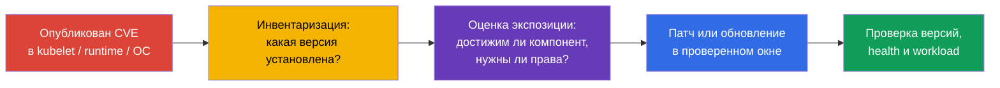
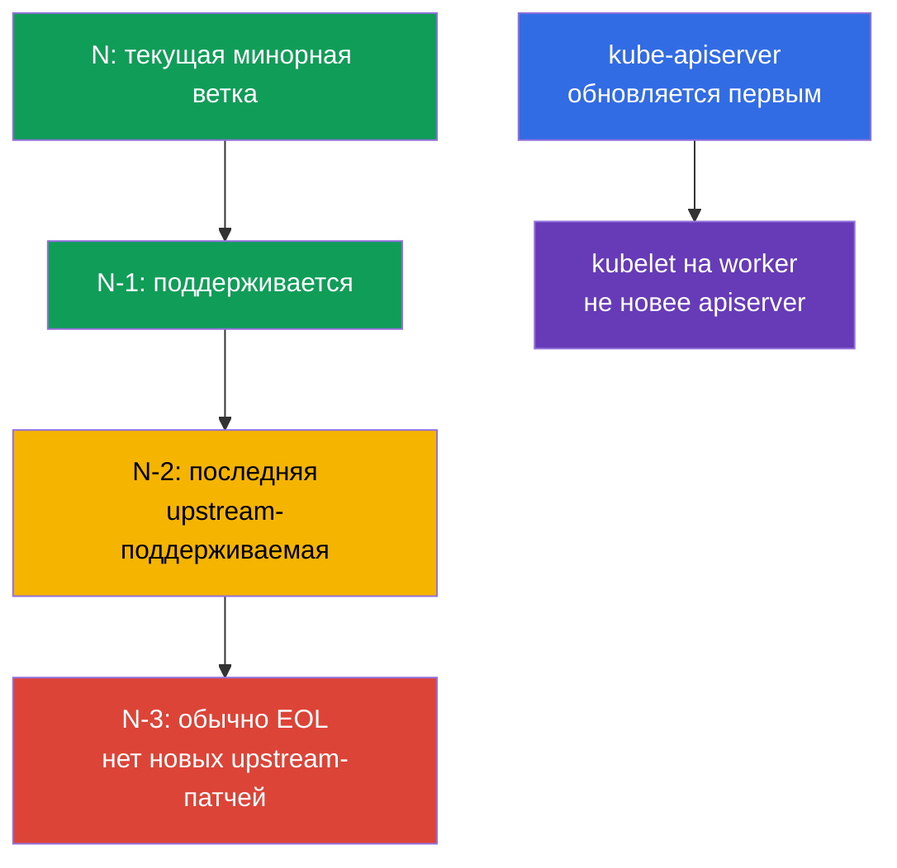
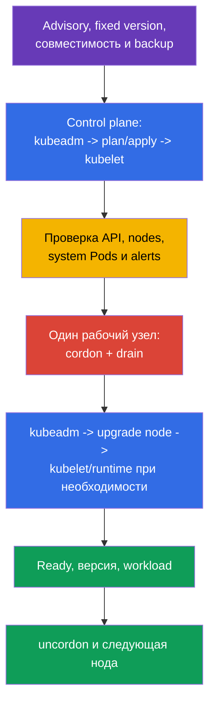

[Eng version](README.md) · [Versión en español](es.md) · [Version française](fr.md) · [Deutsche Version](de.md) · [ქართული ვერსია](ge.md) · [繁體中文版](tw.md) · [日本語版](jp.md)

# Глава 13. Обновление Kubernetes для устранения уязвимостей

> **Что дальше.** В главе 12 мы сократили доступ к Kubernetes API. Но правильно настроенный
> API не спасает от известной уязвимости в `kube-apiserver`, kubelet или container runtime.
> Обновление - это security-контроль: оно сокращает время, в течение которого атакующий
> может использовать опубликованный CVE. Это домен **Cluster Hardening** CKS (15%): нужно
> уметь оценить срочность advisory, соблюсти version skew и обновить кластер без новой
> поверхности атаки и без простоя.

> **Что нужно знать из CKA.** Полная процедура `kubeadm upgrade`, различие `apply` и
> `node`, `cordon`/`drain`/`uncordon`, PodDisruptionBudget и обновление ОС разобраны в
> [главе 36 CKA](../../../cka/course/36/ru.md). Здесь не повторяем lifecycle-процедуру,
> а рассматриваем её с security-стороны: CVE, EOL, advisories и зависимости ноды.

## 13.1. Почему патч - это security-контроль

CVE в Kubernetes-компоненте, container runtime или ядре ноды может дать атакующему путь от
Pod к данным, Kubernetes API или самой ноде. Типичная цепочка: опубликован exploit для
установленной версии -> атакующий получает вход в workload либо сеть к control plane ->
использует уязвимый компонент до того, как команда поставит исправление. Firewall, RBAC и
NetworkPolicy уменьшают экспозицию, но не исправляют дефект в коде.



**Модель угрозы.** Не следует считать, что CVE опасен только при публичном endpoint. Например,
ошибка в `kubelet` может быть доступна с уже скомпрометированного Pod или соседней ноды,
а дефект `runc` - из контейнера, который уже запущен в кластере. Поэтому ответ зависит не
только от CVSS: важны prerequisites, доступность уязвимой функции, наличие публичного
exploit, компенсирующие controls и ценность затронутых нод.

**EOL (End of Life)** - отдельный риск. Для ветки, которую больше не поддерживает upstream
или дистрибутив, новые исправления CVE могут вообще не появиться. Компенсирующий control
не превращает EOL-версию в поддерживаемую: нужен план перехода на поддерживаемую минорную
ветку или поддержка от поставщика с явно определённым сроком.

Практическая реакция на advisory:

1. Зафиксируйте затронутые компоненты и точные версии, включая managed control plane,
   worker pools, `containerd`, `runc`, ОС и CNI.
2. Сопоставьте условия эксплуатации CVE со своей конфигурацией, сетевой доступностью и
   правами атакующего. Не игнорируйте CVE только из-за отсутствия внешнего доступа.
3. Выберите исправленную версию из advisory, проверьте support policy и совместимость,
   протестируйте в stage, затем выполните rollout с проверкой и откатом.
4. Если немедленный патч невозможен, временно сузьте экспозицию по рекомендациям advisory,
   назначьте владельца и дедлайн. Временная mitigation не должна остаться постоянной.

## 13.2. Release cadence, support window и version skew

Kubernetes выпускает минорные версии регулярно, обычно три раза в год, а patch-релизы
выходят по мере готовности исправлений. Точную дату и список исправлений надо брать из
release notes конкретной ветки, а не из старого runbook. Upstream обычно поддерживает три
последние минорные ветки: текущую `N`, `N-1` и `N-2`. Следовательно, `N-3` обычно уже EOL;
у managed-сервиса или enterprise-дистрибутива окно может отличаться, и его нужно проверять
отдельно.

Для целевой версии курса - Kubernetes `v1.36` - это означает: не ждать накопления большого
числа минорных обновлений. Переход делают последовательно, по одной минорной версии,
например `v1.34` -> `v1.35` -> `v1.36`; патч внутри ветки можно обновлять напрямую до
исправленной версии. Такой ритм оставляет время на тесты и не превращает срочный CVE в
многоверсионный migration-проект.



**Version skew** ограничивает порядок. `kubelet` не может быть новее `kube-apiserver`,
поэтому сначала обновляют control plane, затем рабочие узлы. Допустимый диапазон для других
компонентов зависит от версии и роли; перед изменением сверяйтесь с официальной
[policy version skew](https://kubernetes.io/releases/version-skew-policy/). Не используйте
допустимый skew как нормальное постоянное состояние: он нужен для короткого rolling upgrade,
а не для жизни старых нод месяцами.

Перед целевым минорным обновлением также проверьте удаляемые API у приложений, Helm-чартов,
операторов и аддонов. Устранение CVE не должно сломать следующий deploy из-за удалённого
`apiVersion`; инструменты и порядок проверки описаны в [главе 36 CKA](../../../cka/course/36/ru.md).

## 13.3. Advisories, CVE feed и инвентаризация версий

Источник решения - первичный advisory, а не только агрегатор CVE. У Kubernetes это
[security advisories](https://kubernetes.io/docs/reference/issues-security/security/) и
release notes; для ОС, облачного поставщика, CNI и runtime - advisory их производителя.
NVD, GitHub Advisory Database и корпоративные CVE feeds полезны для уведомлений и поиска,
но могут отставать, содержать неполные диапазоны версий или не описывать конфигурационные
условия.

| Что проверять | Где искать | Зачем |
|---|---|---|
| Kubernetes CVE и fixed version | Kubernetes security advisory, release notes | Понять затронутый диапазон, prerequisites и версию с исправлением |
| Поддержку ветки | upstream release/support policy или policy поставщика | Не выбрать EOL-ветку без последующих патчей |
| Версию client/server | `kubectl version --output=yaml` | Сопоставить server с advisory; client не доказывает версию ноды |
| Версию каждой ноды | `kubectl get nodes -o wide`, `kubectl describe node` | Найти отстающие kubelet и смешанный rollout |
| Пакеты runtime и ОС | пакетный менеджер, SBOM/asset inventory, vendor advisory | Kubernetes-патч не исправляет `containerd`, `runc`, kernel или OpenSSL |

```bash
# Версии kubectl и API server. Не выводите credentials из kubeconfig в тикет или чат.
kubectl version --output=yaml

# Версии kubelet на всех нодах и их состояние.
kubectl get nodes -o wide
kubectl get nodes -o custom-columns=NAME:.metadata.name,KUBELET:.status.nodeInfo.kubeletVersion,OS:.status.nodeInfo.osImage

# На конкретной ноде: версия и происхождение пакетов зависят от дистрибутива.
kubeadm version -o short
containerd --version
runc --version
uname -r
```

`kubectl version` видит API server, но не заменяет инвентаризацию control-plane пакетов и
рабочего узла. В managed Kubernetes control plane может обновлять провайдер: всё равно нужно
сверить версию control plane, support calendar, node image/AMI и deadline, после которого
поставщик прекращает поддержку ветки.

Полезная привычка - вести patch SLA: критический CVE с reachable exploit получает короткое
окно реакции, остальные - ближайшее плановое окно. Severity сама по себе не приоритет:
CVE с меньшим CVSS, но без authentication в доступном извне компоненте, может быть важнее
локального CVE с трудными prerequisites.

## 13.4. Безопасный `kubeadm` upgrade: control plane, затем ноды

Командную процедуру целиком берите из [главы 36 CKA](../../../cka/course/36/ru.md). Ниже -
security-последовательность, которая не пропускает ни исправление CVE, ни проверку его
результата. Значение `v1.36.x` - пример целевого поддерживаемого patch-релиза; используйте
ровно версию из проверенного advisory и своего репозитория пакетов.

### До изменения

- Прочитайте advisory и release notes, проверьте support window, version skew, удалённые API,
  совместимость CNI/CSI/CoreDNS и container runtime.
- Проверьте health control plane, свободную ёмкость для evicted Pod, PDB и готовность
  monitoring/alerting. Устраните уже существующие `NotReady` и `CrashLoopBackOff` до начала.
- Проверьте backup и процедуру восстановления etcd; backup должен быть проверяемым, а не
  только «успешно созданным файлом». Подготовьте tested rollback для пакетов и node image.
- Воспроизведите процедуру в stage с теми же critical add-ons и workload. Не добавляйте
  `--ignore-preflight-errors`, чтобы «пройти дальше», пока причина не понята и не одобрена.



### Control plane

На первом control-plane обновите пакет `kubeadm` до целевой ветки, выполните только
предварительный расчёт, затем примените обновление. После `apply` обновите `kubelet` и
`kubectl` до согласованного patch-релиза и перезапустите `kubelet`. В HA-кластере остальные
узлы control plane обновляются по одному через `kubeadm upgrade node`, с проверкой quorum и
API между узлами. Не обновляйте все узлы control plane одновременно.

```bash
# Пример для Debian/Ubuntu: точный suffix пакета и репозиторий сверяйте с документацией
# целевой версии. Снимайте hold только на время контролируемого изменения.
sudo apt-mark unhold kubeadm
sudo apt-get update
sudo apt-get install -y kubeadm='1.36.x-*'
sudo apt-mark hold kubeadm

sudo kubeadm upgrade plan
sudo kubeadm upgrade apply v1.36.x --yes

sudo apt-mark unhold kubelet kubectl
sudo apt-get install -y kubelet='1.36.x-*' kubectl='1.36.x-*'
sudo apt-mark hold kubelet kubectl
sudo systemctl daemon-reload
sudo systemctl restart kubelet
```

### Worker-ноды

К рабочим узлам переходят только после healthy control plane. Узел выводят из планирования и
освобождают, обновляют `kubeadm`, запускают `kubeadm upgrade node` - **не** `apply`, затем
обновляют и перезапускают `kubelet`. Возвращают ноду лишь после проверки `Ready` и версии.
Повторяют по одной ноде, соблюдая PDB и требуемую capacity.

```bash
# С рабочей машины или control plane.
kubectl cordon worker-1
kubectl drain worker-1 --ignore-daemonsets --delete-emptydir-data

# На worker-1: обновить kubeadm до согласованной версии, затем конфигурацию ноды.
sudo kubeadm upgrade node
sudo systemctl daemon-reload
sudo systemctl restart kubelet

# После проверки состояния ноды.
kubectl get node worker-1 -o wide
kubectl uncordon worker-1
```

Команды `drain` и флаги зависят от workload. `--delete-emptydir-data` удаляет локальные
`emptyDir`-данные и допустим только когда это ожидаемо; `--force` и обход PDB не являются
безопасным default. Если `drain` ждёт PDB, это сигнал проверить число реплик и доступность,
а не повод ломать защиту ради скорости.

### Проверка результата и диагностика

```bash
kubectl get nodes -o wide
kubectl get --raw='/readyz?verbose'
kubectl get pods -A --field-selector=status.phase!=Running
kubectl get events -A --sort-by=.lastTimestamp
kubectl version --output=yaml
```

Проверьте отдельно: API server готов, все ноды `Ready`, версии соответствуют плану, `kube-system`
и критичные DaemonSet/Deployment восстановились, workload проходит smoke test, а alerts не
сигнализируют об ошибках runtime, CNI, DNS или storage. Ошибка `NotReady` после обновления
чаще требует смотреть `journalctl -u kubelet`, статус `containerd`, cgroup driver, CRI socket
и логи CNI - не повторять `kubeadm` вслепую.

## 13.5. Runtime и ОС: Kubernetes не единственный источник CVE

Патч `kube-apiserver` не обновляет `containerd`, `runc`, kernel, OpenSSL, `systemd` и
пакеты ОС. Для атаки из контейнера именно runtime и kernel часто являются границей между
workload и нодой. Поэтому inventory и patch policy должны охватывать весь node image.

| Зависимость | Риск при отставании | Что проверить перед rollout |
|---|---|---|
| `containerd` и CRI | CVE, несовместимый CRI, изменение конфигурации/сокета | Поддержку целевой Kubernetes-версии, `SystemdCgroup`, health сервиса и образ ноды |
| `runc` | escape из контейнера при уязвимости runtime | Fixed version из advisory и пакетную зависимость containerd |
| kernel и ОС-пакеты | privilege escalation, network/filesystem CVE | Поддержку ОС, vendor security update, необходимость reboot и node image |
| cgroups/systemd | kubelet/runtime не запускаются либо получают разные cgroup | Единый cgroup driver и поддержку cgroup v2 в ОС и runtime |
| CNI, CSI, CoreDNS | сеть, storage или DNS не восстановятся после change | Compatibility matrix и smoke test на stage |

Безопасная стратегия - разделить риск: сначала проверить совместимую связку Kubernetes +
runtime + ОС в stage, затем раскатывать по нодам. Если urgent runtime/OS CVE требует
немедленной remediation, используйте тот же lifecycle: `cordon` -> `drain` -> patch/reboot
или replacement -> health check -> `uncordon`. Для immutable node pool часто безопаснее
создать новый patched pool, перенести workload rolling-заменой и удалить старые ноды, чем
менять множество пакетов на месте.

При обновлении package repository проверяйте источник и подпись репозитория. Не смешивайте
случайные версии из разных репозиториев и не делайте одновременно большой Kubernetes,
runtime и ОС migration без выделенного теста: так трудно отличить CVE remediation от
regression и безопасно откатиться.

## 13.6. Типичные ошибки при security-обновлении

- **«У нас нет публичного API, CVE не касается нас».** Уязвимый kubelet или runtime может
  быть доступен внутреннему атакующему после компрометации Pod или ноды.
- **Патчится только control plane.** Worker kubelet, `containerd`, `runc` и ОС остаются
  уязвимыми, хотя `kubectl version` уже выглядит хорошо.
- **EOL принимают за низкий риск.** Отсутствие нового advisory означает отсутствие patch,
  а не отсутствие уязвимостей.
- **Перепрыгивают минорные версии или обновляют kubelet раньше API server.** Это нарушает
  version skew и создаёт трудно диагностируемое состояние.
- **Обновляют все ноды сразу либо обходят PDB.** Срочный CVE не оправдывает потерю всех
  реплик; сначала оценивают экспозицию и capacity, затем выполняют rolling rollout.
- **Доверяют только успешному `kubeadm`.** Команда не доказывает, что runtime, CNI, DNS,
  storage и приложения действительно работают на исправленных версиях.

## 13.7. Как это применяют в продакшене

- **Patch management как процесс.** Команда подписывается на upstream и vendor advisories,
  связывает CVE с inventory, назначает severity-based SLA, владельца, окно rollout и
  подтверждение закрытия. Это лучше разовых «дней обновления» раз в год.
- **Короткий lag от релиза.** Регулярный переход в пределах поддерживаемого окна N/N-1/N-2
  уменьшает размер каждого изменения и оставляет возможность спокойно тестировать critical
  CVE, а не проводить multi-hop upgrade ночью.
- **Stage и progressive rollout.** Сначала тестируют node image и аддоны, затем обновляют
  небольшой pool/ноду, смотрят метрики и только после этого продолжают. Для managed
  Kubernetes контролируют отдельно control plane и node pool deadlines.
- **Автоматизированная, но наблюдаемая замена нод.** Infrastructure as Code, golden image,
  maintenance windows, PDB и autoscaling делают обновление воспроизводимым. Автоматизация
  обязана останавливаться на health failure, а не продолжать заменять весь парк.
- **Единый SBOM/asset inventory.** Он связывает advisory не только с Kubernetes, но и с
  `containerd`, `runc`, CNI, ОС и kernel, поэтому команда не упускает вторую половину
  атаки на ноду.

## 13.8. Мини-глоссарий

- **CVE** - идентификатор публично известной уязвимости.
- **security advisory** - первичное уведомление производителя с затронутыми версиями,
  условиями эксплуатации, mitigation и fixed version.
- **EOL** - окончание поддержки версии; новые upstream security patches обычно не выходят.
- **release cadence** - регулярность выхода минорных и patch-релизов.
- **support window** - диапазон поддерживаемых веток; upstream Kubernetes обычно держит
  `N`, `N-1` и `N-2`.
- **version skew** - допустимая разница версий компонентов; kubelet не новее API server.
- **`kubeadm upgrade plan` / `apply` / `node`** - план обновления / применение на первом
  control plane / обновление конфигурации конкретной ноды.
- **rolling upgrade** - обновление по одной ноде с проверкой между шагами.
- **`cordon` / `drain` / `uncordon`** - запретить планирование / выселить workload /
  вернуть ноду в планирование.
- **node image** - согласованный образ ОС, runtime и пакетов для ноды.

## 13.9. Итоги главы

- Обновление - security-контроль: оно устраняет известные CVE в Kubernetes, но не заменяет
  RBAC, network controls и hardening.
- EOL-ветка опасна тем, что для новых CVE может не быть upstream patch; обычно поддерживаются
  только `N`, `N-1` и `N-2`, а `N-3` уже EOL.
- Advisory и release notes - первичный источник fixed version и условий CVE; CVE feed
  помогает уведомлять, но не заменяет чтение advisory и инвентаризацию нод.
- Соблюдайте version skew: control plane обновляется первым, kubelet не должен быть новее
  API server, минорные версии проходят последовательно.
- Безопасный `kubeadm` rollout: preflight и backup -> control plane -> health check ->
  `cordon`/`drain` одного рабочего узла -> `kubeadm upgrade node` и kubelet -> проверка ->
  `uncordon`.
- Kubernetes-патч не исправляет CVE в `containerd`, `runc`, kernel и ОС; runtime и node image
  требуют отдельной compatibility-проверки и patch policy.

## 13.10. Как это пригодится: на экзамене и в реальной работе

**На экзамене.** Задание может попросить безопасно обновить кластер или объяснить порядок
версий. Сначала определите текущую и целевую версии, не нарушайте version skew, обновите
control plane до рабочего узла, используйте `drain` перед обновлением kubelet и верните узел
через `uncordon`. Помните разницу: на первом узле control plane применяется `kubeadm upgrade
apply`, на worker - `kubeadm upgrade node`.

**В реальной работе.** Ценность навыка не в механическом запуске `kubeadm`, а в сокращении
экспозиции CVE без потери доступности. Инженер читает advisory, подтверждает затронутые
версии, проверяет EOL и зависимости, тестирует node image, идёт rolling-волной и доказывает
после неё и исправленную версию, и работоспособность сервисов.

## 13.11. Самостоятельная практика: security upgrade gate

Это self-contained контролируемая simulation для kubeadm-кластера. Она не заменяет
реальное обновление пакетов: цель - пройти все security gates и получить артефакты до/после,
не меняя версию учебного кластера. Выполняйте её только в одноразовом стенде; пути
сертификатов etcd сначала сверяйте с manifest вашего control plane.

Создайте каталог evidence и зафиксируйте исходное состояние:

```bash
export UPGRADE_EVIDENCE=/tmp/cks-upgrade-security
mkdir -p "$UPGRADE_EVIDENCE"/{before,after}

kubectl version -o yaml > "$UPGRADE_EVIDENCE/before/version.yaml"
kubectl get nodes -o wide > "$UPGRADE_EVIDENCE/before/nodes.txt"
kubectl get --raw='/readyz?verbose' > "$UPGRADE_EVIDENCE/before/readyz.txt"
kubectl get ns -o json > "$UPGRADE_EVIDENCE/before/namespaces.json"
kubectl get clusterrole,clusterrolebinding -o yaml > "$UPGRADE_EVIDENCE/before/rbac.yaml"
kubectl get validatingadmissionpolicy,validatingadmissionpolicybinding -o yaml \
  > "$UPGRADE_EVIDENCE/before/admission.yaml" 2>/dev/null || true
```

### Gate 1: version skew и план

Скрипт не предполагает номер версии: он сравнивает каждый kubelet с текущим API server и
останавливается, если kubelet новее. Затем `kubeadm upgrade plan` проверяет доступные цели,
preflight и порядок обновления. Для реального перехода выберите ровно следующую minor-ветку.

```bash
SERVER_MINOR=$(kubectl version -o json | jq -r '.serverVersion.minor | sub("[^0-9].*$"; "") | tonumber')
kubectl get nodes -o json | jq -e --argjson server "$SERVER_MINOR" \
  '[.items[] | (.status.nodeInfo.kubeletVersion | capture("v1\\.(?<m>[0-9]+)").m | tonumber)] |
   all(. <= $server)' \
  | tee "$UPGRADE_EVIDENCE/before/skew-check.txt"
sudo kubeadm upgrade plan | tee "$UPGRADE_EVIDENCE/before/kubeadm-upgrade-plan.txt"
```

### Gate 2: backup и проверяемое восстановление

На узле control plane создайте snapshot с TLS-параметрами из
`/etc/kubernetes/manifests/etcd.yaml`, затем проверьте его через `etcdutl snapshot status`.
Не запускайте restore поверх работающего etcd: запишите точную restore-команду в runbook и
репетируйте её в отдельном кластере.

```bash
sudo ETCDCTL_API=3 etcdctl snapshot save /var/backups/etcd-pre-upgrade.db \
  --endpoints=https://127.0.0.1:2379 \
  --cacert=/etc/kubernetes/pki/etcd/ca.crt \
  --cert=/etc/kubernetes/pki/etcd/healthcheck-client.crt \
  --key=/etc/kubernetes/pki/etcd/healthcheck-client.key
sudo etcdutl snapshot status /var/backups/etcd-pre-upgrade.db -w json \
  | tee "$UPGRADE_EVIDENCE/before/etcd-snapshot-status.json"
sudo sha256sum /var/backups/etcd-pre-upgrade.db \
  | tee "$UPGRADE_EVIDENCE/before/etcd-snapshot.sha256"
```

### Gate 3: deprecated API и security configuration

Проверьте не только manifests в Git, но и фактическое использование deprecated APIs по
метрике API server. Любая строка со значением больше нуля получает владельца и remediation
до upgrade. Зафиксируйте PSS, admission и критические RBAC-разрешения.

```bash
kubectl get --raw /metrics \
  | awk '/^apiserver_requested_deprecated_apis/ && $NF > 0' \
  | tee "$UPGRADE_EVIDENCE/before/deprecated-apis.txt"

kubectl auth can-i --list --as=system:serviceaccount:default:default \
  > "$UPGRADE_EVIDENCE/before/default-sa-can-i.txt"
kubectl get ns -L pod-security.kubernetes.io/enforce,pod-security.kubernetes.io/enforce-version \
  > "$UPGRADE_EVIDENCE/before/pss.txt"
kubectl api-resources --api-group=admissionregistration.k8s.io \
  > "$UPGRADE_EVIDENCE/before/admission-resources.txt"
```

### Контролируемая simulation и post-upgrade validation

Отметьте simulation, ещё раз выполните те же probes как если бы control plane и один
рабочий узел уже прошли rolling upgrade. Сравнение должно показать неизменившийся security
posture; health обязан быть успешным. При реальном upgrade между блоками выполняются
`kubeadm upgrade apply` для первого control plane и `kubeadm upgrade node` для остальных
узлов в порядке из 13.4.

```bash
printf 'mode=controlled-simulation\nserver_minor=%s\ntarget_minor=%s\n' \
  "$SERVER_MINOR" "$((SERVER_MINOR + 1))" > "$UPGRADE_EVIDENCE/simulation.txt"

kubectl get --raw='/readyz?verbose' > "$UPGRADE_EVIDENCE/after/readyz.txt"
kubectl get nodes -o wide > "$UPGRADE_EVIDENCE/after/nodes.txt"
kubectl get ns -o json > "$UPGRADE_EVIDENCE/after/namespaces.json"
kubectl get clusterrole,clusterrolebinding -o yaml > "$UPGRADE_EVIDENCE/after/rbac.yaml"
kubectl get validatingadmissionpolicy,validatingadmissionpolicybinding -o yaml \
  > "$UPGRADE_EVIDENCE/after/admission.yaml" 2>/dev/null || true
kubectl auth can-i --list --as=system:serviceaccount:default:default \
  > "$UPGRADE_EVIDENCE/after/default-sa-can-i.txt"

grep -q 'readyz check passed' "$UPGRADE_EVIDENCE/after/readyz.txt"
diff -u "$UPGRADE_EVIDENCE/before/rbac.yaml" "$UPGRADE_EVIDENCE/after/rbac.yaml"
diff -u "$UPGRADE_EVIDENCE/before/admission.yaml" "$UPGRADE_EVIDENCE/after/admission.yaml"
diff -u "$UPGRADE_EVIDENCE/before/default-sa-can-i.txt" \
  "$UPGRADE_EVIDENCE/after/default-sa-can-i.txt"
kubectl get pods -A --field-selector=status.phase!=Running
```

Simulation считается принятой, если skew check успешен, `kubeadm upgrade plan` сохранён,
snapshot валиден, deprecated API inventory разобран, `/readyz` успешен, все узлы `Ready`,
а RBAC/admission/PSS не стали слабее. Для реального upgrade дополнительно приложите точные
версии до/после и smoke test критической рабочей нагрузки.

## 13.12. Вопросы для самопроверки

1. Почему CVE в kubelet или `runc` может быть критичным, даже если API server не доступен
   из интернета?
2. Чем EOL-ветка отличается от поддерживаемой ветки с точки зрения следующего CVE?
3. Какие ветки обычно входят в upstream support window `N`/`N-1`/`N-2`, и что означает
   `N-3`?
4. Почему CVSS и CVE feed недостаточны для решения о срочности обновления?
5. Почему control plane обновляют раньше рабочих узлов и почему kubelet не должен быть новее
   API server?
6. Назовите безопасную последовательность обновления рабочего узла через `kubeadm`.
7. Какие проверки нужны после успешного `kubeadm upgrade`, чтобы доказать и security patch,
   и работоспособность кластера?
8. Почему обновление Kubernetes не закрывает автоматически CVE в `containerd`, `runc` или
   kernel, и как их обновлять безопасно?

## Дополнительная практика

Упражнение 13.11 полностью покрывает CKS-oriented security gates без внешнего материала.
Для тренировки самого изменения пакетов можно дополнительно пройти полный `kubeadm`
lifecycle в CKA-лабе. В главе 14 перейдём к минимизации поверхности узла и безопасности
runtime-демона.

🧪 Лаба 111 (kubeadm upgrade): [tasks/cka/labs/111](../../../cka/labs/111/README_RU.MD)

🎮 Killercoda (в браузере, без установки): [Upgrading Kubernetes](https://killercoda.com/chadmcrowell/course/cka/upgrade-k8s) · [Upgrade Kubelet](https://killercoda.com/chadmcrowell/course/cka/upgrade-kubelet)

---
[Оглавление](../README_RU.md) · [Глава 12](../12/ru.md) · [Глава 14](../14/ru.md)
