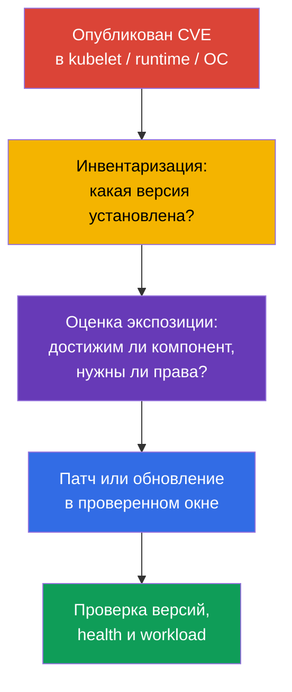
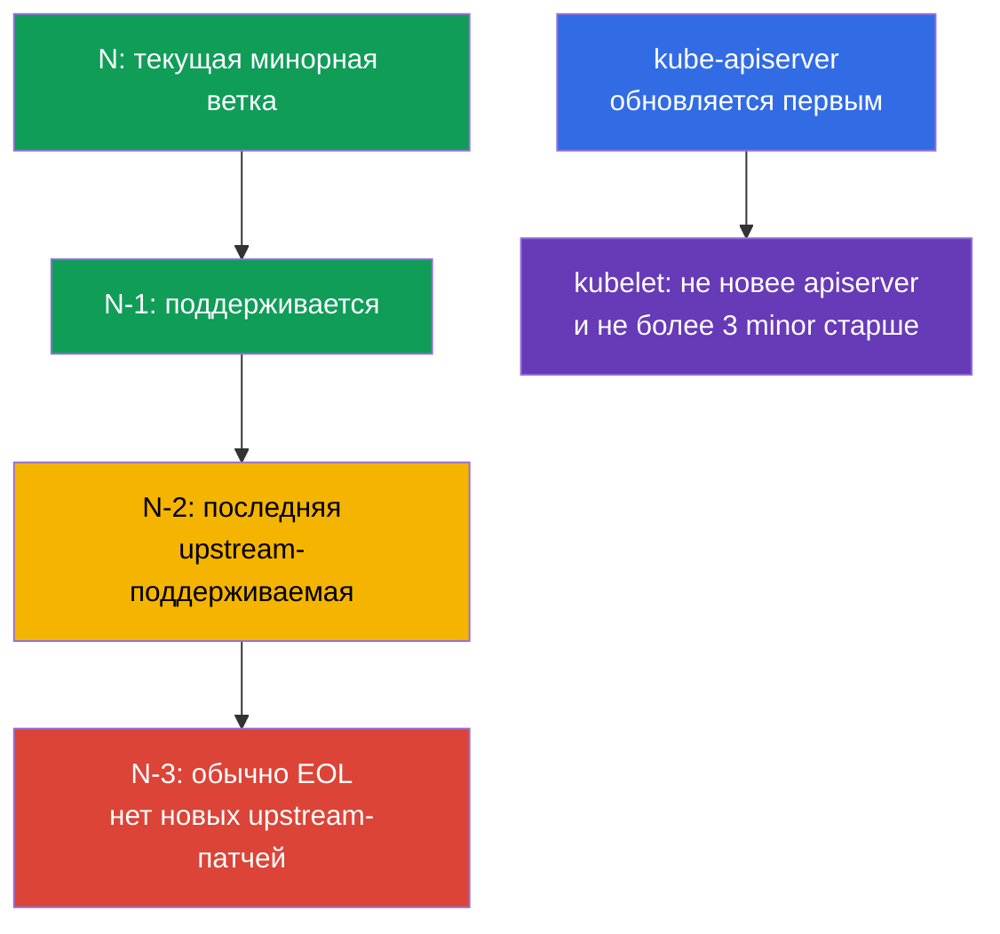
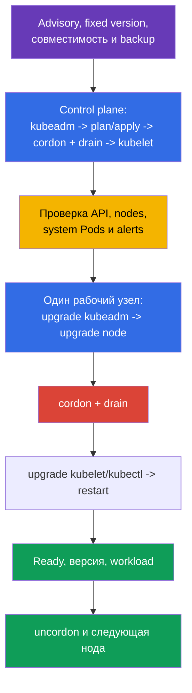

<!-- Standalone RU release: ссылки на переводы удалены, потому что соответствующие файлы не входят в архив. -->

# Глава 13. Обновление Kubernetes для устранения уязвимостей

> **Что дальше.** В главе 12 мы сократили доступ к Kubernetes API. Но правильно настроенный
> API не спасает от известной уязвимости в `kube-apiserver`, kubelet или container runtime.
> Обновление - это security-контроль: оно сокращает время, в течение которого атакующий
> может использовать опубликованный CVE. Это домен **Cluster Hardening** CKS (15%): нужно
> уметь оценить срочность advisory, соблюсти version skew и обновить кластер без новой
> поверхности атаки и без простоя.

> **Что нужно знать из CKA.** Полная процедура `kubeadm upgrade`, различие `apply` и
> `node`, `cordon`/`drain`/`uncordon`, PodDisruptionBudget и обновление ОС разобраны в
> [главе 36 CKA](../../../cka/course/36/ru.md). Здесь не повторяем lifecycle-процедуру,
> а рассматриваем её с security-стороны: CVE, EOL, advisories и зависимости ноды.

## 13.1. Почему патч - это security-контроль

CVE в Kubernetes-компоненте, container runtime или ядре ноды может дать атакующему путь от
Pod к данным, Kubernetes API или самой ноде. Типичная цепочка: опубликован exploit для
установленной версии -> атакующий получает вход в workload либо сеть к control plane ->
использует уязвимый компонент до того, как команда поставит исправление. Firewall, RBAC и
NetworkPolicy уменьшают экспозицию, но не исправляют дефект в коде.



**Модель угрозы.** Не следует считать, что CVE опасен только при публичном endpoint. Например,
ошибка в `kubelet` может быть доступна с уже скомпрометированного Pod или соседней ноды,
а дефект `runc` - из контейнера, который уже запущен в кластере. Поэтому ответ зависит не
только от CVSS: важны prerequisites, доступность уязвимой функции, наличие публичного
exploit, компенсирующие controls и ценность затронутых нод.

**EOL (End of Life)** - отдельный риск. Для ветки, которую больше не поддерживает upstream
или дистрибутив, новые исправления CVE могут вообще не появиться. Компенсирующий control
не превращает EOL-версию в поддерживаемую: нужен план перехода на поддерживаемую минорную
ветку или поддержка от поставщика с явно определённым сроком.

Практическая реакция на advisory:

1. Зафиксируйте затронутые компоненты и точные версии, включая managed control plane,
   worker pools, `containerd`, `runc`, ОС и CNI.
2. Сопоставьте условия эксплуатации CVE со своей конфигурацией, сетевой доступностью и
   правами атакующего. Не игнорируйте CVE только из-за отсутствия внешнего доступа.
3. Выберите исправленную версию из advisory, проверьте support policy и совместимость,
   протестируйте в stage, затем выполните rollout с проверкой и откатом.
4. Если немедленный патч невозможен, временно сузьте экспозицию по рекомендациям advisory,
   назначьте владельца и дедлайн. Временная mitigation не должна остаться постоянной.

## 13.2. Release cadence, support window и version skew

Kubernetes выпускает минорные версии регулярно, обычно три раза в год, а patch-релизы
выходят по мере готовности исправлений. Точную дату и список исправлений надо брать из
release notes конкретной ветки, а не из старого runbook. Upstream обычно поддерживает три
последние минорные ветки: текущую `N`, `N-1` и `N-2`. Следовательно, `N-3` обычно уже EOL;
у managed-сервиса или enterprise-дистрибутива окно может отличаться, и его нужно проверять
отдельно.

В этой лаборатории Kubernetes `v1.36` обозначает **целевую (target) версию примера**, а не
«текущую stable» версию Kubernetes и не обещание её актуального support window. Перед
реальным change window сверяйте фактическую поддерживаемую target-ветку и fixed patch из
advisory. Переход делают последовательно, по одной minor-версии, например `v1.34` ->
`v1.35` -> `v1.36`; patch внутри ветки можно обновлять напрямую до исправленной версии.
Такой ритм оставляет время на тесты и не превращает срочный CVE в многоверсионный
migration-проект.



**Version skew** ограничивает порядок. Для каждого kubelet проверяйте обе границы относительно
его `kube-apiserver`: kubelet **не новее** API server и **не более чем на три minor-версии
старше** него. Поэтому сначала обновляют control plane, затем рабочие узлы. Допустимый
диапазон для других компонентов зависит от версии и роли; перед изменением сверяйтесь с
официальной [policy version skew](https://kubernetes.io/releases/version-skew-policy/). Не
используйте допустимый skew как нормальное постоянное состояние: он нужен для короткого
rolling upgrade, а не для жизни старых нод месяцами. В HA экземпляры `kube-apiserver`
могут отличаться максимум на одну minor-версию; пока в кластере остаётся старый API server,
он сужает допустимую верхнюю границу версии kubelet: kubelet не может быть новее ни одного
API server. Например, при API servers `1.37` и `1.36` допустимы kubelet `1.36`, `1.35` и
`1.34`, а kubelet `1.37` недопустим из-за API server `1.36`. `kube-controller-manager`,
`kube-scheduler` и `cloud-controller-manager` не должны быть новее API server и обычно
держатся на его minor-версии (допускается максимум одна minor старше назад).

Перед целевым минорным обновлением также проверьте удаляемые API у приложений, Helm-чартов,
операторов и аддонов. Устранение CVE не должно сломать следующий deploy из-за удалённого
`apiVersion`; инструменты и порядок проверки описаны в [главе 36 CKA](../../../cka/course/36/ru.md).

## 13.3. Advisories, CVE feed и инвентаризация версий

Источник решения - первичный advisory, а не только агрегатор CVE. У Kubernetes это
[security advisories](https://kubernetes.io/docs/reference/issues-security/security/) и
release notes; для ОС, облачного поставщика, CNI и runtime - advisory их производителя.
NVD, GitHub Advisory Database и корпоративные CVE feeds полезны для уведомлений и поиска,
но могут отставать, содержать неполные диапазоны версий или не описывать конфигурационные
условия.

| Что проверять | Где искать | Зачем |
|---|---|---|
| Kubernetes CVE и fixed version | Kubernetes security advisory, release notes | Понять затронутый диапазон, prerequisites и версию с исправлением |
| Поддержку ветки | upstream release/support policy или policy поставщика | Не выбрать EOL-ветку без последующих патчей |
| Версию client/server | `kubectl version --output=yaml` | Сопоставить server с advisory; client не доказывает версию ноды |
| Версию каждой ноды | `kubectl get nodes -o wide`, `kubectl describe node` | Найти отстающие kubelet и смешанный rollout |
| Пакеты runtime и ОС | пакетный менеджер, SBOM/asset inventory, vendor advisory | Kubernetes-патч не исправляет `containerd`, `runc`, kernel или OpenSSL |

```bash
# Версии kubectl и API server. Не выводите credentials из kubeconfig в тикет или чат.
kubectl version --output=yaml

# Версии kubelet на всех нодах и их состояние.
kubectl get nodes -o wide
kubectl get nodes -o custom-columns=NAME:.metadata.name,KUBELET:.status.nodeInfo.kubeletVersion,OS:.status.nodeInfo.osImage

# На конкретной ноде: версия и происхождение пакетов зависят от дистрибутива.
kubeadm version -o short
containerd --version
runc --version
uname -r
```

`kubectl version` видит API server, но не заменяет инвентаризацию control-plane пакетов и
рабочего узла. В managed Kubernetes control plane может обновлять провайдер: всё равно нужно
сверить версию control plane, support calendar, node image/AMI и deadline, после которого
поставщик прекращает поддержку ветки.

Полезная привычка - вести patch SLA: критический CVE с reachable exploit получает короткое
окно реакции, остальные - ближайшее плановое окно. Severity сама по себе не приоритет:
CVE с меньшим CVSS, но без authentication в доступном извне компоненте, может быть важнее
локального CVE с трудными prerequisites.

## 13.4. Безопасный `kubeadm` upgrade: control plane, затем ноды

Командную процедуру целиком берите из [главы 36 CKA](../../../cka/course/36/ru.md). Ниже -
security-последовательность, которая не пропускает ни исправление CVE, ни проверку его
результата. `v1.36.x` здесь является **lab target**: замените его на точный поддерживаемый
patch из проверенного advisory и своего репозитория пакетов; это не утверждение, что
`v1.36` является текущей stable-версией.

### До изменения

- Прочитайте advisory и release notes, проверьте support window, version skew, удалённые API,
  совместимость CNI/CSI/CoreDNS и container runtime.
- Проверьте health control plane, свободную ёмкость для evicted Pod, PDB и готовность
  monitoring/alerting. Устраните уже существующие `NotReady` и `CrashLoopBackOff` до начала.
- Проверьте backup и процедуру восстановления etcd; backup должен быть проверяемым, а не
  только «успешно созданным файлом». Подготовьте tested rollback для пакетов и node image.
- Воспроизведите процедуру в stage с теми же critical add-ons и workload. Не добавляйте
  `--ignore-preflight-errors`, чтобы «пройти дальше», пока причина не понята и не одобрена.



### Control plane

На первом control-plane обновите пакет `kubeadm` до target-версии, выполните только
предварительный расчёт, затем примените обновление. Канонический порядок для minor-upgrade:
`kubeadm upgrade apply` → обновление CNI, если его compatibility matrix этого требует →
`cordon` и `drain` перед заменой `kubelet` → target-пакеты kubelet/kubectl → restart и
проверка → `uncordon`. Drain нельзя пропускать перед обновлением kubelet control-plane:
он даёт PDB и capacity возможность остановить небезопасный rollout. Проверяйте, что в
кластере есть ёмкость для выселенных workload; не добавляйте `--force` и не обходите PDB.
Static Pods control plane не выселяются через `drain`.

После `apply` и нужной проверки CNI установите target `kubelet` и `kubectl`, перезапустите
kubelet, убедитесь в `Ready` и только тогда сделайте `uncordon`. В HA-кластере остальные control-plane ноды
обновляют по одной через `kubeadm upgrade node`, с проверкой quorum и API между нодами. Не
обновляйте все control-plane ноды одновременно.

```bash
# Пример Debian/Ubuntu. Сначала переключите фактически активный source на target minor,
# затем обновите индекс и выберите точный patch из этого репозитория. `1.36.<PATCH>` и
# `1.36.x-*` не являются copy-paste значениями.
export TARGET_K8S_VERSION='v1.36.<PATCH>'
export TARGET_K8S_MINOR='v1.36'
KEYRING=/etc/apt/keyrings/kubernetes-apt-keyring.gpg
K8S_SOURCE_FILES=$(sudo grep -RIlE --include='*.list' --include='*.sources' \
  'https://pkgs\.k8s\.io/core:/stable:/v1\.[0-9]+/deb/' \
  /etc/apt/sources.list /etc/apt/sources.list.d 2>/dev/null | sort -u || true)

# Один signing key используется для всех minor-веток. Создайте keyring лишь при первом
# подключении репозитория; --yes исключает интерактивный вопрос о перезаписи.
if ! sudo test -s "$KEYRING"; then
  sudo install -d -m 0755 /etc/apt/keyrings
  curl -fsSL "https://pkgs.k8s.io/core:/stable:/${TARGET_K8S_MINOR}/deb/Release.key" \
    | sudo gpg --dearmor --yes -o "$KEYRING"
  sudo chmod 0644 "$KEYRING"
fi

# Меняем minor в реально активном source, а не всегда создаём kubernetes.list.
if [ -n "$K8S_SOURCE_FILES" ]; then
  printf '%s\n' "$K8S_SOURCE_FILES"
  while IFS= read -r source_file; do
    sudo sed -Ei "s#https://pkgs\.k8s\.io/core:/stable:/v1\.[0-9]+/deb/#https://pkgs.k8s.io/core:/stable:/${TARGET_K8S_MINOR}/deb/#g" "$source_file"
  done <<< "$K8S_SOURCE_FILES"
else
  echo "deb [signed-by=$KEYRING] https://pkgs.k8s.io/core:/stable:/${TARGET_K8S_MINOR}/deb/ /" \
    | sudo tee /etc/apt/sources.list.d/kubernetes.list >/dev/null
fi
sudo apt-get update
apt-cache madison kubeadm
export TARGET_K8S_PACKAGE_VERSION='<точная-версия-из-целевого-репозитория>'

# На control-plane-1: kubeadm можно обновить до apply, kubelet -- только после drain.
sudo apt-mark unhold kubeadm
sudo apt-get install -y kubeadm="$TARGET_K8S_PACKAGE_VERSION"
sudo apt-mark hold kubeadm
sudo kubeadm upgrade plan

# На control-plane-1: сначала обновляется control plane.
sudo kubeadm upgrade apply "$TARGET_K8S_VERSION" --yes
# Если матрица CNI требует обновления, выполните его здесь и подтвердите сеть.

# С административной машины: только перед minor-обновлением kubelet.
kubectl cordon control-plane-1
kubectl drain control-plane-1 --ignore-daemonsets

# На control-plane-1.
sudo apt-mark unhold kubelet kubectl
sudo apt-get install -y kubelet="$TARGET_K8S_PACKAGE_VERSION" kubectl="$TARGET_K8S_PACKAGE_VERSION"
sudo apt-mark hold kubelet kubectl
sudo systemctl daemon-reload
sudo systemctl restart kubelet

# С административной машины: только после Ready и проверки версии.
kubectl get node control-plane-1 -o wide
kubectl uncordon control-plane-1
```

### Worker-ноды

К рабочим узлам переходят только после healthy control plane. Канонический порядок для
каждой worker-ноды: обновить `kubeadm` → выполнить `kubeadm upgrade node` (**не** `apply`) →
вывести ноду из планирования и освободить её → обновить `kubelet` и `kubectl` →
перезапустить kubelet → проверить `Ready` и версию → `uncordon`. Повторяют по одной ноде,
соблюдая PDB и требуемую capacity.

```bash
# На worker-1, пример Debian/Ubuntu. Репозиторий pkgs.k8s.io привязан к minor-ветке:
# поменяйте minor в фактически активном source, затем обновите индекс и выбирайте patch.
export TARGET_K8S_VERSION='v1.36.<PATCH>'
export TARGET_K8S_MINOR='v1.36'
KEYRING=/etc/apt/keyrings/kubernetes-apt-keyring.gpg
K8S_SOURCE_FILES=$(sudo grep -RIlE --include='*.list' --include='*.sources' \
  'https://pkgs\.k8s\.io/core:/stable:/v1\.[0-9]+/deb/' \
  /etc/apt/sources.list /etc/apt/sources.list.d 2>/dev/null | sort -u || true)

# Обычная minor-смена переиспользует signing key. Импортируйте и сделайте keyring читаемым
# для apt только при первом подключении; --yes исключает интерактивную перезапись.
if ! sudo test -s "$KEYRING"; then
  sudo install -d -m 0755 /etc/apt/keyrings
  curl -fsSL "https://pkgs.k8s.io/core:/stable:/${TARGET_K8S_MINOR}/deb/Release.key" \
    | sudo gpg --dearmor --yes -o "$KEYRING"
  sudo chmod 0644 "$KEYRING"
fi

if [ -n "$K8S_SOURCE_FILES" ]; then
  printf '%s\n' "$K8S_SOURCE_FILES"
  while IFS= read -r source_file; do
    sudo sed -Ei "s#https://pkgs\.k8s\.io/core:/stable:/v1\.[0-9]+/deb/#https://pkgs.k8s.io/core:/stable:/${TARGET_K8S_MINOR}/deb/#g" "$source_file"
  done <<< "$K8S_SOURCE_FILES"
else
  echo "deb [signed-by=$KEYRING] https://pkgs.k8s.io/core:/stable:/${TARGET_K8S_MINOR}/deb/ /" \
    | sudo tee /etc/apt/sources.list.d/kubernetes.list >/dev/null
fi
sudo apt-get update
apt-cache madison kubeadm
export TARGET_K8S_PACKAGE_VERSION='<точная-версия-из-целевого-репозитория>'

# Сначала обновите kubeadm и примените его node-конфигурацию.
sudo apt-mark unhold kubeadm
sudo apt-get install -y kubeadm="$TARGET_K8S_PACKAGE_VERSION"
sudo apt-mark hold kubeadm
sudo kubeadm upgrade node

# С административной машины: --delete-emptydir-data добавляйте только если потеря этих
# данных ожидаема. Не добавляйте --force и не обходите PDB ради ускорения.
kubectl cordon worker-1
kubectl drain worker-1 --ignore-daemonsets

# На worker-1: kubelet и kubectl обновляют вместе только после drain.
sudo apt-mark unhold kubelet kubectl
sudo apt-get install -y kubelet="$TARGET_K8S_PACKAGE_VERSION" kubectl="$TARGET_K8S_PACKAGE_VERSION"
sudo apt-mark hold kubelet kubectl
sudo systemctl daemon-reload
sudo systemctl restart kubelet

# С административной машины: только после Ready, версии и workload smoke test.
kubectl get node worker-1 -o wide
kubectl uncordon worker-1
```

Для RPM-дистрибутива сначала проверьте и при необходимости переключите vendor-репозиторий
на целевую minor-ветку, затем выберите **явную точную** версию. Используйте эквиваленты
`kubeadm-<TARGET_K8S_PACKAGE_VERSION>`, `kubelet-<TARGET_K8S_PACKAGE_VERSION>` и
`kubectl-<TARGET_K8S_PACKAGE_VERSION>` в том же порядке: `kubeadm upgrade node` → drain →
обновление kubelet/kubectl → restart kubelet → проверка → `uncordon`. Не оставляйте worker
на старом kubelet из-за того, что `kubeadm upgrade node` завершился успешно: эта команда не
устанавливает пакеты.

### Проверка результата и диагностика

```bash
kubectl get nodes -o wide
kubectl get --raw='/readyz?verbose'

# Gate завершается с ненулевым кодом для Failed/Pending/Unknown Pod или Running Pod без Ready=True.
# Успешно завершённые Pods Job имеют phase=Succeeded и намеренно не считаются ошибкой.
kubectl get pods -A -o json | jq -e '
  [ .items[]
    | select(
        .status.phase == "Failed" or
        .status.phase == "Pending" or
        .status.phase == "Unknown" or
        (.status.phase == "Running" and
          (any(.status.conditions[]?; .type == "Ready" and .status == "True") | not))
      )
  ] | length == 0
'
kubectl get events -A --sort-by=.lastTimestamp
kubectl version --output=yaml
```

Проверьте отдельно: API server готов, все ноды `Ready`, версии соответствуют плану, `kube-system`
и критичные DaemonSet/Deployment восстановились, workload проходит smoke test, а alerts не
сигнализируют об ошибках runtime, CNI, DNS или storage. Ошибка `NotReady` после обновления
чаще требует смотреть `journalctl -u kubelet`, статус `containerd`, cgroup driver, CRI socket
и логи CNI - не повторять `kubeadm` вслепую.

## 13.5. Runtime и ОС: Kubernetes не единственный источник CVE

Патч `kube-apiserver` не обновляет `containerd`, `runc`, kernel, OpenSSL, `systemd` и
пакеты ОС. Для атаки из контейнера именно runtime и kernel часто являются границей между
workload и нодой. Поэтому inventory и patch policy должны охватывать весь node image.

| Зависимость | Риск при отставании | Что проверить перед rollout |
|---|---|---|
| `containerd` и CRI | CVE, несовместимый CRI, изменение конфигурации/сокета | Поддержку целевой Kubernetes-версии, `SystemdCgroup`, health сервиса и образ ноды |
| `runc` | escape из контейнера при уязвимости runtime | Fixed version из advisory и пакетную зависимость containerd |
| kernel и ОС-пакеты | privilege escalation, network/filesystem CVE | Поддержку ОС, vendor security update, необходимость reboot и node image |
| cgroups/systemd | kubelet/runtime не запускаются либо получают разные cgroup | Единый cgroup driver и поддержку cgroup v2 в ОС и runtime |
| CNI, CSI, CoreDNS | сеть, storage или DNS не восстановятся после change | Compatibility matrix и smoke test на stage |

### Cgroup v2 baseline для Kubernetes v1.35+

До планирования перехода на Kubernetes v1.35+ выполните preflight **на каждой ноде**:
kubelet и runtime должны работать с cgroup v2 и согласованным `systemd` cgroup driver.
`failCgroupV1` — поле `KubeletConfiguration`, а не feature gate; его default равен `true`
с v1.35. Не отключайте его через `failCgroupV1: false`, чтобы продлить жизнь cgroup v1:
временный override возможен лишь как краткая, документированная мера миграции. Если
проверка не проходит, сначала мигрируйте ОС/runtime в stage и проверьте node image, а не
обходите preflight в production.

```yaml
# /var/lib/kubelet/config.yaml — безопасный baseline v1.35+.
failCgroupV1: true
```

```bash
# На каждой ноде; ненулевой exit code означает, что cgroup v2 baseline пока не выполнен.
set -euo pipefail
test "$(stat -fc %T /sys/fs/cgroup)" = 'cgroup2fs'
sudo grep -Eq '^[[:space:]]*cgroupDriver:[[:space:]]*systemd[[:space:]]*$' \
  /var/lib/kubelet/config.yaml
sudo grep -Eq '^[[:space:]]*SystemdCgroup[[:space:]]*=[[:space:]]*true[[:space:]]*$' \
  /etc/containerd/config.toml
```

Для CRI-O или нестандартных путей конфигурации проверьте тот же `systemd` driver в
конфигурации используемого runtime; не копируйте путь `containerd` вслепую.

Безопасная стратегия - разделить риск: сначала проверить совместимую связку Kubernetes +
runtime + ОС в stage, затем раскатывать по нодам. Если urgent runtime/OS CVE требует
немедленной remediation, используйте тот же lifecycle: `cordon` -> `drain` -> patch/reboot
или replacement -> health check -> `uncordon`. Для immutable node pool часто безопаснее
создать новый patched pool, перенести workload rolling-заменой и удалить старые ноды, чем
менять множество пакетов на месте.

При обновлении package repository проверяйте источник и подпись репозитория. Не смешивайте
случайные версии из разных репозиториев и не делайте одновременно большой Kubernetes,
runtime и ОС migration без выделенного теста: так трудно отличить CVE remediation от
regression и безопасно откатиться.

## 13.6. Типичные ошибки при security-обновлении

- **«У нас нет публичного API, CVE не касается нас».** Уязвимый kubelet или runtime может
  быть доступен внутреннему атакующему после компрометации Pod или ноды.
- **Патчится только control plane.** Worker kubelet, `containerd`, `runc` и ОС остаются
  уязвимыми, хотя `kubectl version` уже выглядит хорошо.
- **EOL принимают за низкий риск.** Отсутствие нового advisory означает отсутствие patch,
  а не отсутствие уязвимостей.
- **Перепрыгивают минорные версии или обновляют kubelet раньше API server.** Это нарушает
  version skew и создаёт трудно диагностируемое состояние.
- **Обновляют все ноды сразу либо обходят PDB.** Срочный CVE не оправдывает потерю всех
  реплик; сначала оценивают экспозицию и capacity, затем выполняют rolling rollout.
- **Доверяют только успешному `kubeadm`.** Команда не доказывает, что runtime, CNI, DNS,
  storage и приложения действительно работают на исправленных версиях.

## 13.7. Как это применяют в продакшене

- **Patch management как процесс.** Команда подписывается на upstream и vendor advisories,
  связывает CVE с inventory, назначает severity-based SLA, владельца, окно rollout и
  подтверждение закрытия. Это лучше разовых «дней обновления» раз в год.
- **Короткий lag от релиза.** Регулярный переход в пределах поддерживаемого окна N/N-1/N-2
  уменьшает размер каждого изменения и оставляет возможность спокойно тестировать critical
  CVE, а не проводить multi-hop upgrade ночью.
- **Stage и progressive rollout.** Сначала тестируют node image и аддоны, затем обновляют
  небольшой pool/ноду, смотрят метрики и только после этого продолжают. Для managed
  Kubernetes контролируют отдельно control plane и node pool deadlines.
- **Автоматизированная, но наблюдаемая замена нод.** Infrastructure as Code, golden image,
  maintenance windows, PDB и autoscaling делают обновление воспроизводимым. Автоматизация
  обязана останавливаться на health failure, а не продолжать заменять весь парк.
- **Единый SBOM/asset inventory.** Он связывает advisory не только с Kubernetes, но и с
  `containerd`, `runc`, CNI, ОС и kernel, поэтому команда не упускает вторую половину
  атаки на ноду.

## 13.8. Мини-глоссарий

- **CVE** - идентификатор публично известной уязвимости.
- **security advisory** - первичное уведомление производителя с затронутыми версиями,
  условиями эксплуатации, mitigation и fixed version.
- **EOL** - окончание поддержки версии; новые upstream security patches обычно не выходят.
- **release cadence** - регулярность выхода минорных и patch-релизов.
- **support window** - диапазон поддерживаемых веток; upstream Kubernetes обычно держит
  `N`, `N-1` и `N-2`.
- **version skew** - допустимая разница версий компонентов; kubelet не новее API server и не более чем на три minor-версии старше него.
- **`kubeadm upgrade plan` / `apply` / `node`** - план обновления / применение на первом
  control plane / обновление конфигурации конкретной ноды.
- **rolling upgrade** - обновление по одной ноде с проверкой между шагами.
- **`cordon` / `drain` / `uncordon`** - запретить планирование / выселить workload /
  вернуть ноду в планирование.
- **node image** - согласованный образ ОС, runtime и пакетов для ноды.

## 13.9. Итоги главы

- Обновление - security-контроль: оно устраняет известные CVE в Kubernetes, но не заменяет
  RBAC, network controls и hardening.
- EOL-ветка опасна тем, что для новых CVE может не быть upstream patch; обычно поддерживаются
  только `N`, `N-1` и `N-2`, а `N-3` уже EOL.
- Advisory и release notes - первичный источник fixed version и условий CVE; CVE feed
  помогает уведомлять, но не заменяет чтение advisory и инвентаризацию нод.
- Соблюдайте version skew: control plane обновляется первым, kubelet не новее API server
  и не более чем на три minor-версии старше него; minor-версии проходят последовательно.
- Безопасный `kubeadm` rollout: preflight и backup -> control plane -> health check ->
  на одном worker `kubeadm` -> `kubeadm upgrade node` -> `cordon`/`drain` -> kubelet/kubectl ->
  restart и проверка -> `uncordon`.
- Kubernetes-патч не исправляет CVE в `containerd`, `runc`, kernel и ОС; runtime и node image
  требуют отдельной compatibility-проверки и patch policy.

## 13.10. Как это пригодится: на экзамене и в реальной работе

**На экзамене.** Задание может попросить безопасно обновить кластер или объяснить порядок
версий. Сначала определите текущую и целевую версии, не нарушайте version skew, обновите
control plane до рабочего узла, используйте `drain` перед обновлением kubelet и верните узел
через `uncordon`. Помните разницу: на первом узле control plane применяется `kubeadm upgrade
apply`, на worker - `kubeadm upgrade node`.

**В реальной работе.** Ценность навыка не в механическом запуске `kubeadm`, а в сокращении
экспозиции CVE без потери доступности. Инженер читает advisory, подтверждает затронутые
версии, проверяет EOL и зависимости, тестирует node image, идёт rolling-волной и доказывает
после неё и исправленную версию, и работоспособность сервисов.

## 13.11. Самостоятельная практика: security upgrade gate

Это self-contained контролируемая simulation для kubeadm-кластера. Она не заменяет
реальное обновление пакетов: цель - пройти все security gates и получить артефакты до/после,
не меняя версию учебного кластера. Выполняйте её только в одноразовом стенде; пути
сертификатов etcd сначала сверяйте с manifest вашего control plane.

Создайте каталог evidence и зафиксируйте исходное состояние:

```bash
export UPGRADE_EVIDENCE=/tmp/cks-upgrade-security
mkdir -p "$UPGRADE_EVIDENCE"/{before,after}

kubectl version -o yaml > "$UPGRADE_EVIDENCE/before/version.yaml"
kubectl get nodes -o wide > "$UPGRADE_EVIDENCE/before/nodes.txt"
kubectl get --raw='/readyz?verbose' > "$UPGRADE_EVIDENCE/before/readyz.txt"
kubectl get ns -o json > "$UPGRADE_EVIDENCE/before/namespaces.json"
kubectl get clusterrole,clusterrolebinding -o yaml > "$UPGRADE_EVIDENCE/before/rbac.yaml"
kubectl get validatingadmissionpolicy,validatingadmissionpolicybinding -o yaml \
  > "$UPGRADE_EVIDENCE/before/admission.yaml" 2>/dev/null || true
```

### Gate 1: kubelet version skew и план

Это ограниченный gate: он сравнивает каждый kubelet только с одним API server, который
вернул `kubectl` (в HA это может быть один backend load balancer), и останавливается, если
kubelet нарушает любую границу: новее этого API server **либо** более чем на три
minor-версии старше. Он не доказывает skew всех HA API servers и не проверяет
`kube-controller-manager`, `kube-scheduler`, `cloud-controller-manager`, `kube-proxy` или
`kubectl`; их inventory и policy сверяют отдельно перед production rollout. Затем `kubeadm
upgrade plan` проверяет доступные цели, preflight и порядок обновления. Для реального
перехода выберите ровно следующую minor-ветку.

```bash
set -euo pipefail
SERVER_MINOR=$(kubectl version -o json | jq -r '.serverVersion.minor | sub("[^0-9].*$"; "") | tonumber')
kubectl get nodes -o json | jq -e --argjson server "$SERVER_MINOR" \
  '[.items[] | (.status.nodeInfo.kubeletVersion | capture("v1\\.(?<m>[0-9]+)").m | tonumber)] |
   all(. >= ($server - 3) and . <= $server)' \
  | tee "$UPGRADE_EVIDENCE/before/skew-check.txt"
sudo kubeadm upgrade plan | tee "$UPGRADE_EVIDENCE/before/kubeadm-upgrade-plan.txt"
```

### Gate 2: backup и проверяемое восстановление

На узле control plane создайте snapshot с TLS-параметрами из
`/etc/kubernetes/manifests/etcd.yaml`, затем проверьте его через `etcdutl snapshot status`.
Не запускайте restore поверх работающего etcd: запишите точную restore-команду в runbook и
репетируйте её в отдельном кластере.

```bash
sudo ETCDCTL_API=3 etcdctl snapshot save /var/backups/etcd-pre-upgrade.db \
  --endpoints=https://127.0.0.1:2379 \
  --cacert=/etc/kubernetes/pki/etcd/ca.crt \
  --cert=/etc/kubernetes/pki/etcd/healthcheck-client.crt \
  --key=/etc/kubernetes/pki/etcd/healthcheck-client.key
sudo etcdutl snapshot status /var/backups/etcd-pre-upgrade.db -w json \
  | tee "$UPGRADE_EVIDENCE/before/etcd-snapshot-status.json"
sudo sha256sum /var/backups/etcd-pre-upgrade.db \
  | tee "$UPGRADE_EVIDENCE/before/etcd-snapshot.sha256"
```

### Gate 3: deprecated API и security configuration

Проверьте не только manifests в Git, но и фактическое использование deprecated APIs по
метрике API server. Любая строка со значением больше нуля получает владельца и remediation
до upgrade. Зафиксируйте PSS, admission и критические RBAC-разрешения.

```bash
kubectl get --raw /metrics \
  | awk '/^apiserver_requested_deprecated_apis/ && $NF > 0' \
  | tee "$UPGRADE_EVIDENCE/before/deprecated-apis.txt"

kubectl auth can-i --list --as=system:serviceaccount:default:default \
  > "$UPGRADE_EVIDENCE/before/default-sa-can-i.txt"
# Нормализованная карта namespace -> enforce/enforce-version для post-upgrade сравнения.
kubectl get ns -o json | jq -S '[.items[] | {
  namespace: .metadata.name,
  enforce: (.metadata.labels["pod-security.kubernetes.io/enforce"] // ""),
  enforceVersion: (.metadata.labels["pod-security.kubernetes.io/enforce-version"] // "")
}] | sort_by(.namespace)' > "$UPGRADE_EVIDENCE/before/pss.txt"
kubectl api-resources --api-group=admissionregistration.k8s.io \
  > "$UPGRADE_EVIDENCE/before/admission-resources.txt"
```

### Gate 4: security-флаги static Pod manifests не должны исчезнуть

Главная экзаменационная ловушка `kubeadm upgrade`: команда переписывает static Pod
manifests control plane из своей собственной конфигурации (`ClusterConfiguration` в
`kubeadm-config` ConfigMap), а не просто патчит существующий файл. Кастомные флаги
`--audit-policy-file`, `--audit-log-path`, `--encryption-provider-config` (KMS/at-rest
encryption) и `--profiling=false`, добавленные вручную в manifest **после** первоначальной
установки кластера, но не отражённые в `kubeadm-config`, могут быть потеряны при следующем
`kubeadm upgrade apply` - кластер останется API-совместим и `Ready`, но de facto потеряет
audit trail, шифрование Secret at rest или debug-профилирование останется включённым.
Зафиксируйте полный список аргументов **до** upgrade:

```bash
kubectl -n kube-system get pod -l component=kube-apiserver \
  -o jsonpath='{.items[0].spec.containers[0].command}' \
  | jq -r '.[]' | sort > "$UPGRADE_EVIDENCE/before/apiserver-flags.txt"
grep -E '^--(audit-policy-file|audit-log-path|encryption-provider-config|profiling)' \
  "$UPGRADE_EVIDENCE/before/apiserver-flags.txt" \
  | tee "$UPGRADE_EVIDENCE/before/apiserver-security-flags.txt"
```

Если этот список пуст в вашем кластере - это отдельная находка: значит, audit/KMS/profiling
hardening ещё не применены, и сравнение после upgrade окажется тривиальным. В таком случае
сначала настройте нужные флаги (главы 07, 09, 32) и только после этого выполняйте upgrade
gate осмысленно.

### Контролируемая simulation и post-upgrade validation

Отметьте simulation, ещё раз выполните те же probes как если бы control plane и один
рабочий узел уже прошли rolling upgrade. Сравнение должно показать неизменившийся security
posture; health обязан быть успешным. Node gate ниже возвращает ненулевой код, если у любой
ноды condition `Ready=False` (а также если condition `Ready=True` отсутствует). При реальном
upgrade между блоками выполняются
`kubeadm upgrade apply` для первого control plane и `kubeadm upgrade node` для остальных
узлов в порядке из 13.4.

```bash
set -euo pipefail
printf 'mode=controlled-simulation\nserver_minor=%s\ntarget_minor=%s\n' \
  "$SERVER_MINOR" "$((SERVER_MINOR + 1))" > "$UPGRADE_EVIDENCE/simulation.txt"

kubectl get --raw='/readyz?verbose' > "$UPGRADE_EVIDENCE/after/readyz.txt"
kubectl get nodes -o wide > "$UPGRADE_EVIDENCE/after/nodes.txt"
kubectl get ns -o json > "$UPGRADE_EVIDENCE/after/namespaces.json"
kubectl get clusterrole,clusterrolebinding -o yaml > "$UPGRADE_EVIDENCE/after/rbac.yaml"
kubectl get validatingadmissionpolicy,validatingadmissionpolicybinding -o yaml \
  > "$UPGRADE_EVIDENCE/after/admission.yaml" 2>/dev/null || true
kubectl auth can-i --list --as=system:serviceaccount:default:default \
  > "$UPGRADE_EVIDENCE/after/default-sa-can-i.txt"
kubectl get ns -o json | jq -S '[.items[] | {
  namespace: .metadata.name,
  enforce: (.metadata.labels["pod-security.kubernetes.io/enforce"] // ""),
  enforceVersion: (.metadata.labels["pod-security.kubernetes.io/enforce-version"] // "")
}] | sort_by(.namespace)' > "$UPGRADE_EVIDENCE/after/pss.txt"
kubectl -n kube-system get pod -l component=kube-apiserver \
  -o jsonpath='{.items[0].spec.containers[0].command}' \
  | jq -r '.[]' | sort > "$UPGRADE_EVIDENCE/after/apiserver-flags.txt"
grep -E '^--(audit-policy-file|audit-log-path|encryption-provider-config|profiling)' \
  "$UPGRADE_EVIDENCE/after/apiserver-flags.txt" \
  > "$UPGRADE_EVIDENCE/after/apiserver-security-flags.txt"

grep -q 'readyz check passed' "$UPGRADE_EVIDENCE/after/readyz.txt"
# Любое Ready=False (или отсутствие Ready=True) даёт jq exit code 1 и останавливает gate.
kubectl get nodes -o json | jq -e '
  [ .items[]
    | {name: .metadata.name,
       ready: [.status.conditions[]? | select(.type == "Ready") | .status]}
    | select((.ready | index("False")) != null or
             (.ready | index("True")) == null)
  ] | length == 0
' > "$UPGRADE_EVIDENCE/after/nodes-ready-gate.txt"
diff -u "$UPGRADE_EVIDENCE/before/rbac.yaml" "$UPGRADE_EVIDENCE/after/rbac.yaml"
diff -u "$UPGRADE_EVIDENCE/before/admission.yaml" "$UPGRADE_EVIDENCE/after/admission.yaml"
diff -u "$UPGRADE_EVIDENCE/before/default-sa-can-i.txt" \
  "$UPGRADE_EVIDENCE/after/default-sa-can-i.txt"
# Gate: любой security-флаг, присутствовавший до upgrade, обязан остаться после него.
# Пустой diff -u не обязателен (после upgrade список может стать шире), но exit code
# comm -23 (строки только в before) обязан быть нулевой длины.
missing_flags=$(comm -23 "$UPGRADE_EVIDENCE/before/apiserver-security-flags.txt" \
  "$UPGRADE_EVIDENCE/after/apiserver-security-flags.txt")
if [[ -n "$missing_flags" ]]; then
  echo "ERROR: security flags disappeared after upgrade:" >&2
  printf '%s\n' "$missing_flags" >&2
  exit 1
fi

# Несуществующий enforce — самый слабый уровень; latest считаем новее числовой версии.
# Gate завершается ненулевым кодом только если у сохранённого namespace PSS ослаблен.
jq -e --slurpfile before "$UPGRADE_EVIDENCE/before/pss.txt" '
  def enforce_level:
    if . == "restricted" then 2 elif . == "baseline" then 1 else 0 end;
  def version_minor:
    if . == "latest" then 999999
    elif test("^v1\\.[0-9]+$") then (capture("^v1\\.(?<minor>[0-9]+)$").minor | tonumber)
    else -1 end;
  $before[0] as $previous |
  [ $previous[] as $before_ns
    | ([.[] | select(.namespace == $before_ns.namespace)] | .[0]) as $after_ns
    | select($after_ns != null)
    | ($before_ns.enforce | enforce_level) as $before_enforce
    | ($after_ns.enforce | enforce_level) as $after_enforce
    | ($before_ns.enforceVersion | version_minor) as $before_version
    | ($after_ns.enforceVersion | version_minor) as $after_version
    | select($after_enforce < $before_enforce or
             ($after_enforce == $before_enforce and $after_version < $before_version))
    | {namespace: $before_ns.namespace, before: $before_ns, after: $after_ns}
  ] as $weaker |
  if ($weaker | length) == 0 then true
  else error("PSS policy was weakened: " + ($weaker | tojson))
  end
' "$UPGRADE_EVIDENCE/after/pss.txt" \
  | tee "$UPGRADE_EVIDENCE/after/pss-weakening-gate.txt"

# Succeeded Pods завершённых Job не являются health failure; Running Pod обязан иметь Ready=True.
kubectl get pods -A -o json | jq -e '
  [ .items[]
    | select(
        .status.phase == "Failed" or
        .status.phase == "Pending" or
        .status.phase == "Unknown" or
        (.status.phase == "Running" and
          (any(.status.conditions[]?; .type == "Ready" and .status == "True") | not))
      )
  ] | length == 0
'
```

Simulation считается принятой, если skew check успешен, `kubeadm upgrade plan` сохранён,
snapshot валиден, deprecated API inventory разобран, `/readyz` успешен, все узлы `Ready`,
а RBAC/admission/PSS не стали слабее, и ни один security-флаг apiserver (audit, encryption
provider, profiling) не исчез из static Pod manifest после upgrade. Для реального upgrade
дополнительно приложите точные версии до/после и smoke test критической рабочей нагрузки.

## 13.12. Вопросы для самопроверки

<details>
<summary>1. Почему CVE в kubelet или `runc` может быть критичным, даже если API server не доступен
   из интернета?</summary>

Kubelet может быть достижим атакующему уже из скомпрометированного Pod или соседней ноды, а уязвимость `runc` может эксплуатироваться из уже запущенного контейнера. Поэтому отсутствие публичного API не устраняет внутренние prerequisite атаки. Приоритет определяют по доступности уязвимой функции, требуемым правам, exploit и ценности ноды, а не только по внешней экспозиции.
</details>

<details>
<summary>2. Чем EOL-ветка отличается от поддерживаемой ветки с точки зрения следующего CVE?</summary>

Для поддерживаемой ветки upstream или поставщик выпускает исправленный patch в рамках support policy. Для EOL-ветки следующая уязвимость может остаться без нового security patch вообще. Компенсирующие controls не делают EOL-версию поддерживаемой, поэтому нужен переход на поддерживаемую minor-ветку или явно ограниченная поддержка поставщика.
</details>

<details>
<summary>3. Какие ветки обычно входят в upstream support window `N`/`N-1`/`N-2`, и что означает
   `N-3`?</summary>

Upstream Kubernetes обычно поддерживает текущую minor-ветку `N` и две предыдущие: `N-1` и `N-2`. `N-3` обычно уже EOL и не получает новых upstream security patches. Реальное окно managed-сервиса или enterprise-дистрибутива может отличаться, поэтому его сверяют отдельно.
</details>

<details>
<summary>4. Почему CVSS и CVE feed недостаточны для решения о срочности обновления?</summary>

CVSS не описывает конкретную экспозицию кластера: нужны prerequisites, достижимость функции, доступ атакующего, public exploit и компенсирующие controls. CVE feed полезен для уведомления, но может отставать или не содержать точных диапазонов и условий. Решение опирается на первичный vendor/upstream advisory, fixed version, inventory и support policy.
</details>

<details>
<summary>5. Почему control plane обновляют раньше рабочих узлов, почему kubelet не должен быть новее
   API server и не может отставать от него более чем на три minor-версии?</summary>

Version skew требует, чтобы kubelet был не новее kube-apiserver и не более чем на три minor-версии старше него, поэтому сначала поднимают control plane. В HA старый API server также ограничивает допустимую верхнюю версию kubelet, пока он остаётся в кластере. Такой skew допустим только на время rolling upgrade, а не как постоянное состояние.
</details>

<details>
<summary>6. Назовите безопасную последовательность обновления рабочего узла через `kubeadm`.</summary>

После healthy control plane на worker обновляют `kubeadm`, выполняют `kubeadm upgrade node`, затем с административной машины делают `cordon` и `drain` с учётом PDB и capacity. После этого устанавливают target `kubelet` и `kubectl`, перезапускают kubelet, проверяют Ready, версию и workload smoke test. Только затем выполняют `uncordon` и переходят к следующей ноде.
</details>

<details>
<summary>7. Какие проверки нужны после успешного `kubeadm upgrade`, чтобы доказать и security patch,
   и работоспособность кластера?</summary>

Проверяют фактические версии control plane и kubelet через `kubectl version --output=yaml` и `kubectl get nodes -o wide`, а не только exit code `kubeadm`. Health подтверждают `/readyz?verbose`, состоянием всех Node `Ready`, `kube-system`, критичных DaemonSet/Deployment, событий и smoke test workload. Дополнительно проверяют alerts и отсутствие проблем runtime, CNI, DNS и storage.
</details>

<details>
<summary>8. Почему обновление Kubernetes не закрывает автоматически CVE в `containerd`, `runc` или
   kernel, и как их обновлять безопасно?</summary>

Пакеты Kubernetes не обновляют независимые runtime, kernel и пакеты ОС, хотя именно они часто являются границей между контейнером и нодой. Их версии и compatibility с Kubernetes сверяют по vendor advisory, inventory и node image. Rollout выполняют тем же контролируемым lifecycle: stage, затем node-by-node `cordon`/`drain`, patch или reboot/replacement, health check и `uncordon`.
</details>

<details>
<summary>9. **Flashback (глава 26).** Version skew (эта глава) и image digest pinning (глава 26) -
   оба механизма про то, что "какая именно версия сейчас работает" должно быть проверяемым
   фактом, а не предположением. В чём разница между "версия compatible" (version skew) и
   "версия identical" (digest), и почему для kubelet/API server достаточно первого, а для
   container image в production - обязательно второе?</summary>

Version skew задаёт допустимое отношение minor-версий взаимодействующих компонентов: kubelet и API server могут быть разными, но совместимыми в указанном диапазоне. Digest, напротив, идентифицирует конкретные неизменные байты образа; tag не даёт такой гарантии. Для rolling lifecycle Kubernetes нужна ограниченная совместимость версий, а production image должен быть воспроизводимо закреплён за точным содержимым.
</details>

## Дополнительная практика

Упражнение 13.11 полностью покрывает CKS-oriented security gates без внешнего материала.
В главе 14 перейдём к минимизации поверхности узла и безопасности runtime-демона.

🧪 Лаба 113 (upgrade control-plane и worker через `kubeadm`, evidence отсутствия downtime): [tasks/cks/labs/113](../../labs/113/README_RU.MD)

Для тренировки полного `kubeadm` lifecycle (init/join/upgrade на нескольких кластерах) можно
дополнительно пройти CKA-лабу: [tasks/cka/labs/111](../../../cka/labs/111/README_RU.MD)

🎮 Killercoda (в браузере, без установки): [Upgrading Kubernetes](https://killercoda.com/chadmcrowell/course/cka/upgrade-k8s) · [Upgrade Kubelet](https://killercoda.com/chadmcrowell/course/cka/upgrade-kubelet)

## Смешанный чек-поинт: Cluster Hardening завершён

Прежде чем перейти к System Hardening, проверьте 15-20 минут без подсказок, что домен
Cluster Hardening (главы 10-13) закрепился:

1. Создайте узкую Role/RoleBinding для тестового subject и покажите двумя `can-i`
   проверками, что разрешён `get pods`, но запрещён `delete pods` (глава 10).
2. Отключите `automount` у `default` ServiceAccount в тестовом namespace и докажите, что
   новый Pod без явного SA не получает token-файл (глава 11).
3. Проверьте, включён ли anonymous access на API server, и объясните разницу между `401`
   и `403` в ответе (глава 12).
4. **Смешанное задание.** Возьмите NetworkPolicy default-deny (глава 04, домен Cluster
   Setup) и RBAC default-deny (глава 10, этот домен): объясните, почему отсутствие явного
   правила в обоих случаях означает запрет, а не разрешение, и в чём разница между тем, кто
   принимает это решение (API server RBAC authorizer vs CNI plugin).
5. Назовите безопасную последовательность обновления control plane через `kubeadm` и
   объясните, почему kubelet не должен быть новее API server (глава 13).

Если задание 4 вызвало затруднение - вернитесь к главам 04 и 10 вместе.

---
[Оглавление](../README_RU.md) · [Глава 12](../12/ru.md) · [Глава 14](../14/ru.md)
