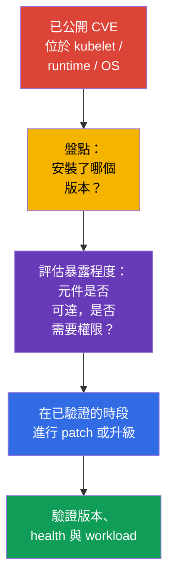
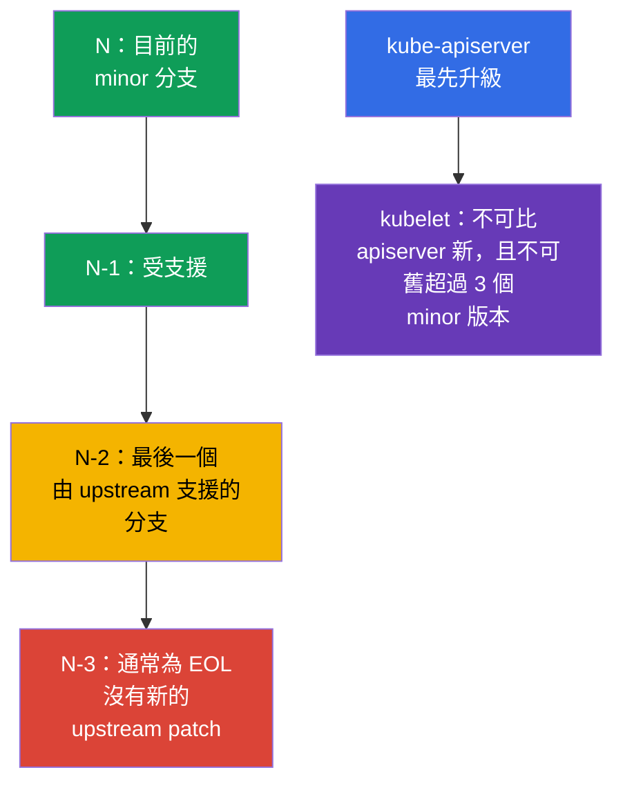

[Русская версия](ru.md) · [Eng version](README.md) · [Versión en español](es.md) · [Version française](fr.md) · [Deutsche Version](de.md) · [ქართული ვერსია](ge.md) · [日本語版](jp.md)

# 第 13 章：為修補漏洞升級 Kubernetes

> **問題。** kubelet、API server、container runtime 或核心中已公開的 CVE，在脆弱版本被替換之前，
> 仍是從已遭入侵的 Pod 或網路通往節點與叢集的可行路徑。EOL 分支可能根本收不到修補程式，
> 而錯誤的升級順序會以停機或不相容取代安全的 remediation。

> **接下來。** 在第 12 章中，我們縮小了 Kubernetes API 的存取範圍。但正確設定的 API
> 無法防禦 `kube-apiserver`、kubelet 或 container runtime 中已知的漏洞。升級是一項
> security control：它縮短攻擊者可利用已公開 CVE 的時間。這屬於 CKS 的
> **Cluster Hardening** 領域 (15%)：你必須能評估 advisory 的急迫性、遵守 version skew，
> 並在不增加攻擊面且不中斷服務的情況下升級叢集。

> **需要從 CKA 了解的內容。** 完整的 `kubeadm upgrade` 程序、`apply` 與 `node` 的差異、
> `cordon`/`drain`/`uncordon`、PodDisruptionBudget 和 OS 升級，屬於另一項 lifecycle
> 技能。這裡固定必要的安全順序：CVE、EOL、advisories、version skew、evidence 與節點相依性。

> 🧠 Patch 能縮短利用窗口；優先順序不只考量 CVSS，還會考量可達性、prerequisites 與叢集暴露程度。

## 13.1. 為什麼 patch 是 security control

Kubernetes 元件、container runtime 或節點核心中的 CVE，可能為攻擊者提供從 Pod 通往資料、
Kubernetes API 或節點本身的路徑。典型鏈結為：已安裝版本的 exploit 公開 -> 攻擊者進入
workload 或取得通往 control plane 的網路 -> 在團隊部署修補程式前利用脆弱元件。Firewall、RBAC
和 NetworkPolicy 可降低暴露程度，但無法修正程式碼缺陷。



**威脅模型。** 不應假定 CVE 只有在公開 endpoint 存在時才危險。例如，`kubelet` 的錯誤可能
能從已遭入侵的 Pod 或鄰近節點存取，而 `runc` 缺陷則可從叢集中已執行的容器利用。因此，回應
不只取決於 CVSS：還要考量 prerequisites、脆弱功能是否可用、是否已有公開 exploit、補償性
controls 及受影響節點的價值。

**EOL (End of Life)** 是另一種風險。對於 upstream 或發行版已不再支援的分支，新的 CVE
修補程式可能根本不會出現。補償性 control 無法讓 EOL 版本變為受支援版本：你需要遷移至受支援
minor 分支的計畫，或由供應商提供具有明確期限的支援。

面對 advisory 的實務回應：

1. 記錄受影響元件及精確版本，包括 managed control plane、worker pools、`containerd`、
   `runc`、OS 和 CNI。
2. 將 CVE 的利用條件與自身設定、網路可達性及攻擊者權限比對。不要只因沒有外部存取就忽略 CVE。
3. 從 advisory 選擇已修補版本，檢查 support policy 和相容性，在 stage 測試，然後執行具備驗證
   與 rollback 的 rollout。
4. 若無法立即修補，依 advisory 建議暫時縮小暴露範圍，指定 owner 與 deadline。暫時的 mitigation
   不應永久保留。

> 🏭 Release cadence 與 support window 決定 lifecycle：維持受支援的叢集，比緊急從 EOL 遷移更容易 patch。

## 13.2. Release cadence、support window 與 version skew

Kubernetes 定期發布 minor 版本，通常一年三次，而 patch release 會隨修補程式完成而發行。
應從特定分支的 release notes，而非過時的 runbook，取得精確日期和修補清單。Upstream 通常支援
最新三個 minor 分支：目前的 `N`、`N-1` 與 `N-2`。因此，`N-3` 通常已是 EOL；managed service
或 enterprise 發行版的支援窗口可能不同，必須另行查核。

在這個實驗中，Kubernetes `v1.36` 是範例的**目標 (target) 版本**，並非 Kubernetes 的「目前
stable」版本，也不保證其實際 support window。在真正的 change window 前，請核對實際受支援的
target 分支及 advisory 中的 fixed patch。轉換應依序逐一跨越 minor 版本，例如 `v1.34` ->
`v1.35` -> `v1.36`；可在一個分支內直接更新至已修補版本。這種節奏可保留測試時間，不會讓緊急
CVE 演變成跨多個版本的 migration 專案。



> 🎯 先升級 control plane；kubelet 不得比 `kube-apiserver` 新，也不得比它舊超過三個 minor 版本。

**Version skew** 限制升級順序。針對每個 kubelet，請相對於其 `kube-apiserver` 檢查兩個界限：

1. kubelet **不得比** API server 新；
2. kubelet **不得比** API server 舊超過三個 minor 版本。

由此得出順序：先升級 control plane，然後升級工作節點。允許的 skew 是短暫 rolling upgrade
期間的暫時狀態，而非讓舊節點存活數月的正常模式。其他元件的範圍依版本與角色而異；變更前請
參閱官方的[version skew policy](https://kubernetes.io/releases/version-skew-policy/)。

**HA control plane。** `kube-apiserver` 執行個體最多只能相差一個 minor 版本。只要叢集中
還有舊 API server，它就會限制 kubelet 的上限：kubelet 不得比**任一** API server 新。例如，
API servers 為 `1.37` 與 `1.36` 時，允許 kubelet `1.36`、`1.35` 與 `1.34`；由於 API server
`1.36`，不允許 kubelet `1.37`。

**Control-plane managers。** `kube-controller-manager`、`kube-scheduler` 與
`cloud-controller-manager` 不得比 `kube-apiserver` 新。通常會維持在相同 minor 版本；在允許的
skew 中，它們最多可比對應 API server 舊一個 minor 版本。

在目標 minor 升級前，也請檢查應用程式、Helm charts、operators 與 add-ons 所使用的已移除 API。
修補 CVE 不應因已移除的 `apiVersion` 而破壞下一次 deploy；請在 change window 前保存 inventory，
並在 upgrade 前排除找到的相依性。

> 🏭 Advisory 和精確 inventory 應記錄 affected versions、remediation owner、SLA、修補 evidence 與暫時 mitigation。

## 13.3. Advisories、CVE feed 與版本盤點

決策來源是原始 advisory，而不只是 CVE aggregator。對 Kubernetes 而言，這是
[security advisories](https://kubernetes.io/docs/reference/issues-security/security/) 與 release notes；
對 OS、cloud provider、CNI 與 runtime 而言，則是其供應商的 advisory。NVD、GitHub Advisory
Database 和企業 CVE feeds 有助於通知與搜尋，但可能落後、包含不完整的版本範圍，或未說明設定條件。

| 檢查項目 | 查詢位置 | 原因 |
|---|---|---|
| Kubernetes CVE 與 fixed version | Kubernetes security advisory、release notes | 了解受影響範圍、prerequisites 與已修補版本 |
| 分支支援情況 | upstream release/support policy 或供應商 policy | 避免選擇不再有後續 patch 的 EOL 分支 |
| client/server 版本 | `kubectl version --output=yaml` | 將 server 與 advisory 比對；client 無法證明節點版本 |
| 每個節點的版本 | `kubectl get nodes -o wide`、`kubectl describe node` | 找出落後的 kubelet 與混合 rollout |
| runtime 與 OS 套件 | package manager、SBOM/asset inventory、vendor advisory | Kubernetes patch 不會修補 `containerd`、`runc`、kernel 或 OpenSSL |

```bash
# kubectl 與 API server 的版本。不要將 kubeconfig 的 credentials 輸出到 ticket 或 chat。
kubectl version --output=yaml

# 所有節點上的 kubelet 版本及其狀態。
kubectl get nodes -o wide
kubectl get nodes -o custom-columns=NAME:.metadata.name,KUBELET:.status.nodeInfo.kubeletVersion,OS:.status.nodeInfo.osImage

# 特定節點上：版本與套件來源取決於發行版。
kubeadm version -o short
containerd --version
runc --version
uname -r
```

`kubectl version` 可看到 API server，但無法取代 control-plane 套件與工作節點的盤點。在 managed
Kubernetes 中，provider 可能升級 control plane：你仍須核對 control plane 版本、support calendar、
node image/AMI 及 provider 停止支援該分支的 deadline。

一個實用習慣是維護 patch SLA：有 reachable exploit 的 critical CVE 應有短反應窗口，其他則放入
下一個排定的窗口。Severity 本身不是優先順序：低 CVSS 但無需 authentication、存在於對外可達元件的
CVE，可能比 prerequisites 困難的本機 CVE 更重要。

> 🎯 順序：preflight → 透過 `kubeadm upgrade apply` 處理第一個 control plane → health → 以 `kubeadm upgrade node`、`cordon`/`drain`、kubelet、驗證與 `uncordon` 處理每個 worker。

## 13.4. 安全的 `kubeadm` upgrade：control plane，然後節點

不要背誦或複製自行編寫的 package/repository scripts：具體命令取決於 target minor、OS、package
manager 和節點狀態。考試和實際工作時，請開啟相應 Kubernetes 版本的官方文件，並依序執行其步驟。
這比試圖憑記憶還原命令可靠。

### 官方路徑

- [Upgrading kubeadm clusters](https://kubernetes.io/docs/tasks/administer-cluster/kubeadm/kubeadm-upgrade/) - 主要文件：選擇 target version、第一個與額外 control-plane 節點、叢集驗證與 recovery。
- [Upgrading Linux nodes](https://kubernetes.io/docs/tasks/administer-cluster/kubeadm/upgrading-linux-nodes/) - Linux worker node 的獨立順序。
- [Changing the Kubernetes package repository](https://kubernetes.io/docs/tasks/administer-cluster/kubeadm/change-package-repository/) - target minor 需要切換 `pkgs.k8s.io` repository 時使用。
- [Safely Drain a Node](https://kubernetes.io/docs/tasks/administer-cluster/safely-drain-node/) - `drain`、PodDisruptionBudget 與 DaemonSet 的行為。
- [Version Skew Policy](https://kubernetes.io/releases/version-skew-policy/) - 題目措辭有疑問時的相容性界限。

若 target minor 與目前的 upstream 不同，請在文件中將版本 selector 切換至相應分支：命令與 package
versions 必須對應 target release，而不是講義中的範例。

### 簡短考試路徑

1. 閱讀題目，確認目前與目標版本；不要跳過 minor 版本，也不要違反 version skew。
2. 開啟主要 guide。在第一個 control-plane 依其步驟進行：升級 `kubeadm`，執行 `kubeadm upgrade plan`，
   接著執行 `kubeadm upgrade apply <target-version>`。然後依同一份 guide，對此節點執行 `drain`、
   升級 `kubelet`/`kubectl`、restart kubelet、驗證 node 與 control-plane components，最後 `uncordon`。
3. 在 HA 中，透過 `kubeadm upgrade node` 逐一升級其餘 control-plane 節點，之後對**每個**節點重複
   lifecycle：`drain` → kubelet/kubectl → restart → 驗證 → `uncordon`。確認 API 仍可用；在 control plane
   healthy 前，不要進入 worker。
4. 對每個 worker node 開啟 Linux-node guide 並按順序執行：升級 `kubeadm` → `kubeadm upgrade node` →
   `drain` → 升級 `kubelet`/`kubectl` → restart kubelet → 驗證 `Ready` 與版本 → `uncordon`。
5. 最後確認所有節點皆為 `Ready` 且版本符合預期。若 `drain`、preflight 或 health check 失敗，請停止
   並找出原因；不要隨意加入 `--force`、`--disable-eviction` 或 `--ignore-preflight-errors`。

> 🎯 **CKS Core。** 考試中，文件是工作流程的一部分：開啟 guide，將目前步驟與題目比對，並逐字執行。
> 不需要建立 custom automation 或重現 production change runbook。

### Production boundary

在 production change 前，還要閱讀 advisory 和 release notes，檢查 backup、CNI/CSI/runtime
compatibility、capacity 與 tested rollback。這不會改變 `kubeadm` 順序，但會決定是否能安全開始 rollout。

> 🏭 Production。在 production 中應記錄 evidence、進行 stage 與 progressive rollout；細節取決於 platform，
> 並非考試所要求的一組命令。

## 13.5. Runtime 與 OS：Kubernetes 並非唯一的 CVE 來源

`kube-apiserver` patch 不會升級 `containerd`、`runc`、kernel、OpenSSL、`systemd` 和 OS 套件。
對於來自容器的攻擊，runtime 與 kernel 經常才是 workload 與節點間的邊界。因此，inventory 與 patch
policy 應涵蓋完整的 node image。

| 相依項目 | 落後時的風險 | rollout 前的檢查項目 |
|---|---|---|
| `containerd` 與 CRI | CVE、不相容的 CRI、設定/socket 變更 | 目標 Kubernetes 版本支援、`SystemdCgroup`、服務 health 與 node image |
| `runc` | runtime 漏洞導致 container escape | advisory 中的 fixed version 與 containerd 的套件相依性 |
| kernel 與 OS 套件 | privilege escalation、network/filesystem CVE | OS 支援情況、vendor security update、是否需要 reboot 及 node image |
| cgroups/systemd | kubelet/runtime 無法啟動或取得不同 cgroup | 統一的 cgroup driver，以及 OS 與 runtime 對 cgroup v2 的支援 |
| CNI、CSI、CoreDNS | change 後網路、storage 或 DNS 無法恢復 | compatibility matrix 及 stage 上的 smoke test |

### Kubernetes v1.35+ 的 cgroup v2 baseline

在規劃升級至 Kubernetes v1.35+ 前，請在**每個節點**執行 preflight：kubelet 與 runtime 必須使用
cgroup v2 並採用一致的 `systemd` cgroup driver。`failCgroupV1` 是 `KubeletConfiguration` 欄位，
不是 feature gate；從 v1.35 起其 default 為 `true`。不要使用 `failCgroupV1: false` 來延長 cgroup v1
的壽命：暫時 override 只能是短暫、已記錄的 migration 措施。若檢查不通過，應先在 stage 遷移 OS/runtime
並驗證 node image，而不是在 production 繞過 preflight。

在 Kubernetes v1.36 中，`KubeletCgroupDriverFromCRI` 已為 GA。若 CRI runtime 支援
`RuntimeConfig` 呼叫，kubelet 會從 runtime 取得 driver 並忽略自己的 `cgroupDriver`；若 runtime
不支援，kubelet 則使用其設定中的 `cgroupDriver`。因此，請不要固定使用
`/var/lib/kubelet/config.yaml` 與 `/etc/containerd/config.toml` 路徑：先找出有效的
`--config`/`--config-dir` kubelet，以及所安裝 CRI runtime 的 unit、process 與已記錄的 config source。

```yaml
# 位於從 startup configuration 找到的有效 KubeletConfiguration 中。
failCgroupV1: true
# cgroupDriver: systemd  # 僅供不支援 RuntimeConfig 的 runtime 作為 fallback
```

```bash
# 在每個節點上執行；非零 exit code 表示尚未符合 cgroup v2 baseline。
set -euo pipefail
test "$(stat -fc %T /sys/fs/cgroup)" = 'cgroup2fs'
sudo systemctl cat kubelet containerd crio 2>/dev/null || true
KUBELET_PID=$(pgrep -xo kubelet) || { echo 'kubelet process not found' >&2; exit 2; }
# `sudo cat` 會以 root 身分開啟 /proc。`pipefail` 會保留讀取錯誤，而
# 缺少 --config/--config-dir 仍屬允許，所以只有 grep 使用 || true。
sudo cat "/proc/$KUBELET_PID/cmdline" \
  | tr '\0' '\n' \
  | { grep -E -- '^--config(=|$)|^--config-dir(=|$)' || true; }
sudo journalctl -u kubelet -b --no-pager | grep -Ei 'cgroup|RuntimeConfig' || true
```

對 CRI-O、採用非標準安裝的 containerd 或其他 runtime，請在已記錄的 runtime configuration 與 logs
中檢查其有效 driver；不要盲目複製 containerd 路徑或 `SystemdCgroup` 欄位。

安全策略是拆分風險：先在 stage 驗證 Kubernetes + runtime + OS 的相容組合，然後逐節點 rollout。
若緊急 runtime/OS CVE 需要立即 remediation，請使用相同 lifecycle：`cordon` -> `drain` -> patch/reboot
或 replacement -> health check -> `uncordon`。對 immutable node pool 而言，建立新的 patched pool、以
rolling replacement 移轉 workload，並移除舊節點，通常比就地修改大量套件安全。

更新 package repository 時，請檢查 repository 的來源與簽章。不要混用不同 repositories 中的任意版本，
也不要在沒有專門測試的情況下同時進行大型 Kubernetes、runtime 與 OS migration：這會難以區分 CVE
remediation 與 regression，也難以安全 rollback。

> 🎯 不要違反 version skew、不要同時升級所有節點、不要無故繞過 PDB 或 preflight，並以版本和 health 確認結果。

## 13.6. Security 升級中的常見錯誤

- **「我們沒有公開 API，所以 CVE 與我們無關。」** 脆弱的 kubelet 或 runtime 可在 Pod 或節點遭入侵後，
  被內部攻擊者存取。
- **只 patch control plane。** Worker kubelet、`containerd`、`runc` 和 OS 仍可能脆弱，即使
  `kubectl version` 已看似正常。
- **將 EOL 視為低風險。** 沒有新的 advisory 代表沒有 patch，不代表沒有漏洞。
- **跳過 minor 版本，或在 API server 前升級 kubelet。** 這會違反 version skew，並造成難以診斷的狀態。
- **同時升級所有節點或繞過 PDB。** 緊急 CVE 不能合理化失去所有 replicas；先評估暴露程度和 capacity，
  再執行 rolling rollout。
- **只信任成功的 `kubeadm`。** 該命令無法證明 runtime、CNI、DNS、storage 與應用程式確實在已修補版本上運作。

> 🏭 Security upgrade：advisories、inventory、support policy、stage、progressive rollout、evidence 與 health failure 時的 stop conditions。

## 13.7. 如何在 production 中套用

- **Patch management 是一項流程。** 團隊訂閱 upstream 與 vendor advisories，將 CVE 關聯至 inventory，
  指定 severity-based SLA、owner、rollout window 與完成修補的證明。這比一年一次的「升級日」更好。
- **Patch 發布後風險升高。** 脆弱版本與已修補版本間的 diff 往往縮小 CVE 原因的搜尋範圍，並讓 reverse
  engineering 更容易。因此，fixed patch 發布後，已知、攻擊者可達且尚未修補的 CVE 通常具有更高優先順序：
  出現或改寫 exploit 的機率提高。AI-assisted 分析可進一步降低這類研究的成本與時間，但它本身無法證明
  exploitability；仍須評估 reachability、prerequisites 與資產價值。
- **縮短 release lag。** 在受支援的 N/N-1/N-2 窗口內定期升級，可縮小每次變更範圍，並保留從容測試
  critical CVE 的空間，而非在夜間執行 multi-hop upgrade。
- **Stage 與 progressive rollout。** 先測試 node image 與 add-ons，接著升級小型 pool/節點，觀察 metrics，
  再繼續進行。對 managed Kubernetes，應分別控管 control plane 與 node pool deadlines。
- **自動化但可觀察的節點替換。** Infrastructure as Code、golden image、maintenance windows、PDB 和
  autoscaling 讓升級可重現。自動化必須在 health failure 時停止，而不是持續替換整個節點群。
- **統一的 SBOM/asset inventory。** 它將 advisory 不只關聯至 Kubernetes，也關聯至 `containerd`、`runc`、
  CNI、OS 與 kernel，因此團隊不會漏掉攻擊節點的另一半。

## 13.8. 小型詞彙表

- **CVE** - 公開已知漏洞的識別碼。
- **security advisory** - 製造商的原始通知，包含受影響版本、利用條件、mitigation 與 fixed version。
- **EOL** - 版本支援終止；新的 upstream security patches 通常不再發布。
- **release cadence** - minor 與 patch release 的發布頻率。
- **support window** - 受支援分支的範圍；upstream Kubernetes 通常維護 `N`、`N-1` 和 `N-2`。
- **version skew** - 元件版本間允許的差異；kubelet 不得比 API server 新，也不得比它舊超過三個 minor 版本。
- **`kubeadm upgrade plan` / `apply` / `node`** - 升級計畫 / 套用於第一個 control plane / 升級特定節點的設定。
- **rolling upgrade** - 逐一更新節點，並在步驟間進行驗證。
- **`cordon` / `drain` / `uncordon`** - 禁止排程 / 驅逐 workload / 讓節點恢復排程。
- **node image** - OS、runtime 與節點套件的一致映像。

## 13.9. 本章摘要

- 升級是一項 security control：它會消除 Kubernetes 中已知的 CVE，但不能取代 RBAC、network controls
  和 hardening。
- EOL 分支危險之處在於，新 CVE 可能沒有 upstream patch；通常只支援 `N`、`N-1` 和 `N-2`，而 `N-3`
  已是 EOL。
- Advisory 與 release notes 是 fixed version 和 CVE 條件的原始來源；CVE feed 有助於通知，但不能取代
  閱讀 advisory 與節點盤點。
- 遵守 version skew：先升級 control plane，kubelet 不得比 API server 新，也不得比它舊超過三個 minor
  版本；minor 版本必須依序通過。
- 安全的 `kubeadm` rollout：preflight 與 backup -> control plane -> health check -> 在一個 worker 上
  `kubeadm` -> `kubeadm upgrade node` -> `cordon`/`drain` -> kubelet/kubectl -> restart 與驗證 -> `uncordon`。
- Kubernetes patch 不會修補 `containerd`、`runc`、kernel 與 OS 中的 CVE；runtime 與 node image 需要單獨的
  compatibility 檢查與 patch policy。

## 13.10. 這如何派上用場：考試與實際工作

**考試中。** 題目可能要求你安全地升級叢集，或說明版本順序。先確認目前與目標版本，不要違反 version
skew，先將 control plane 升級到工作節點，升級 kubelet 前使用 `drain`，並透過 `uncordon` 讓節點恢復。
請記住差異：第一個 control-plane 節點使用 `kubeadm upgrade apply`，worker 使用 `kubeadm upgrade node`。

**實際工作中。** 這項技能的價值不在機械式執行 `kubeadm`，而在於不犧牲可用性地降低 CVE 暴露程度。
工程師閱讀 advisory、確認受影響版本、檢查 EOL 與相依性、測試 node image、以 rolling wave 前進，並在之後
證明已修補版本與服務可運作。

> 🏭 Production gate 應記錄版本、readiness 與 health evidence；它無法取代 tested rollback。

## 13.11. 自主練習：security upgrade gate

這是一個為 kubeadm 叢集設計、self-contained 的受控 simulation。它不會取代真正的套件升級：目標是在不
變更教學叢集版本的情況下，通過 CKS 導向的 preflight gates。請只在一次性環境中執行；先依你的 control
plane manifest 確認 etcd 憑證路徑。

建立 evidence 目錄並記錄初始狀態：

```bash
export UPGRADE_EVIDENCE=/tmp/cks-upgrade-security
mkdir -p "$UPGRADE_EVIDENCE/before"

kubectl version -o yaml > "$UPGRADE_EVIDENCE/before/version.yaml"
kubectl get nodes -o wide > "$UPGRADE_EVIDENCE/before/nodes.txt"
kubectl get --raw='/readyz?verbose' > "$UPGRADE_EVIDENCE/before/readyz.txt"
```

### Gate 1：kubelet version skew 與計畫

這是一個受限的 gate：它只將每個 kubelet 與 `kubectl` 回傳的一個 API server 比較（在 HA 中，這可能是
load balancer 的一個 backend），並在 kubelet 違反任一界限時停止：比該 API server 新**或**比它舊超過
三個 minor 版本。它不能證明所有 HA API servers 的 skew，也不會檢查 `kube-controller-manager`、
`kube-scheduler`、`cloud-controller-manager`、`kube-proxy` 或 `kubectl`；在 production rollout 前須另行
核對它們的 inventory 與 policy。接著，`kubeadm upgrade plan` 檢查可用目標、preflight 與升級順序。
真正轉換時，選擇恰好下一個 minor 分支。

```bash
set -euo pipefail
SERVER_MINOR=$(kubectl version -o json | jq -r '.serverVersion.minor | sub("[^0-9].*$"; "") | tonumber')
kubectl get nodes -o json | jq -e --argjson server "$SERVER_MINOR" \
  '[.items[] | (.status.nodeInfo.kubeletVersion | capture("v1\\.(?<m>[0-9]+)").m | tonumber)] |
   all(. >= ($server - 3) and . <= $server)' \
  | tee "$UPGRADE_EVIDENCE/before/skew-check.txt"
sudo kubeadm upgrade plan | tee "$UPGRADE_EVIDENCE/before/kubeadm-upgrade-plan.txt"
```

### Gate 2：backup 與可驗證的還原

不應僅因安裝了 kubeadm 就推斷存在 `etcdctl`/`etcdutl`。在 gate 前，檢查 binaries 及其與 etcd 版本的
相容性。若工具不存在，預先從受信任來源安裝已驗證且鎖定版本的相容版本，或使用已核准的 operational
image/toolbox。不要在 change window 期間直接下載 `latest`。

```bash
set -euo pipefail
command -v etcdctl >/dev/null 2>&1 || {
  echo 'ERROR: etcdctl is not installed on this control-plane node' >&2
  exit 1
}
command -v etcdutl >/dev/null 2>&1 || {
  echo 'ERROR: etcdutl is not installed on this control-plane node' >&2
  exit 1
}
etcdctl version
etcdutl version
```

在 control-plane 節點上，使用 `/etc/kubernetes/manifests/etcd.yaml` 的 TLS 參數建立 snapshot，
然後透過 `etcdutl snapshot status` 驗證。不要在執行中的 etcd 上進行 restore：將精確的 restore 命令
記錄在 runbook，並在獨立叢集演練它。

```bash
set -euo pipefail
sudo ETCDCTL_API=3 etcdctl snapshot save /var/backups/etcd-pre-upgrade.db \
  --endpoints=https://127.0.0.1:2379 \
  --cacert=/etc/kubernetes/pki/etcd/ca.crt \
  --cert=/etc/kubernetes/pki/etcd/healthcheck-client.crt \
  --key=/etc/kubernetes/pki/etcd/healthcheck-client.key
sudo etcdutl snapshot status /var/backups/etcd-pre-upgrade.db -w json \
  | tee "$UPGRADE_EVIDENCE/before/etcd-snapshot-status.json"
sudo sha256sum /var/backups/etcd-pre-upgrade.db \
  | tee "$UPGRADE_EVIDENCE/before/etcd-snapshot.sha256"
```

### Gate 3：deprecated API 與 security configuration

不只要檢查 Git 中的 manifests，也要依 API server metric 檢查實際使用 deprecated APIs 的情況。下方的
直接 `kubectl get --raw /metrics` 只會取得一個選定 API server backend 的 metrics，因此在 HA 中它僅是
本機 evidence，而不是完整 inventory。對 production HA，請在 monitoring 中彙總**所有** API servers 的
scrape（例如 PromQL `max by (group, version, resource, subresource, removed_release)
(apiserver_requested_deprecated_apis) > 0`），或核對每個 API server 的 audit events。任何數值大於零的
資料列都要在 upgrade 前指定 owner 與 remediation。記錄 admission 與重要 RBAC permissions；detailed
Pod Security Admission configuration 在第 19 章討論，不在本 upgrade practice 中。

```bash
set -euo pipefail
# 此為選定 API server backend 的 evidence；在 HA 中使用前述的彙總。
kubectl get --raw /metrics \
  | awk '/^apiserver_requested_deprecated_apis/ && $NF > 0' \
  | tee "$UPGRADE_EVIDENCE/before/deprecated-apis.txt"

```

### Production note：保留 custom security flags

在 self-hosted `kubeadm` production upgrade 中，該命令可能會從 `ClusterConfiguration` 重寫 static Pod
manifests。因此，custom audit、encryption 和 profiling settings 必須記錄於 Infrastructure as Code，並在
change/rollback procedure 中個別驗證。

> 🏭 **Production。** 這是特定 platform implementation 的 operational control，不是 🎯 CKS
> Core，也不是本章必要的 before/after static-Pod runbook。

### 受控 simulation 與 post-upgrade validation

在教學 simulation 中，不需要另一份用於 post-upgrade evidence 的 Bash runbook：它會分散對考試操作順序的
注意力。完成題目指定的 upgrade process 後，確認 control plane 與 kubelet 具有預期版本且遵守 version skew、
`/readyz` 成功，並且所有節點都是 `Ready`。接著檢查 `kube-system` 與一項關鍵 workload；如有問題，停止、
收集 events，且不要前進至下一個節點。

對實際 rollout，還要保存前後的精確版本、已驗證 etcd snapshot 的狀態、health/smoke tests 結果與 tested
rollback。custom RBAC 或 admission policy 的變更，應透過 project-specific procedure 核對，而非試圖以通用
YAML diff 判定其安全性。

> 🎯 **CKS Core。** 考試中只遵循題目條件：control plane 先於 worker 升級；升級 worker 前使用
> `cordon`/`drain`，驗證後用 `uncordon` 讓節點恢復。

## 13.12. 自我檢查問題

<details>
<summary>1. 即使 API server 無法從網際網路存取，為什麼 kubelet 或 `runc` 中的 CVE 仍可能很嚴重？</summary>

攻擊者可能已從遭入侵的 Pod 或鄰近節點連到 kubelet，而 `runc` 漏洞則可從已執行的容器利用。因此，沒有公開 API 並不會消除攻擊的內部 prerequisites。優先順序應依脆弱功能的可達性、所需權限、exploit 與節點價值判定，而非只看外部暴露程度。
</details>

<details>
<summary>2. 就下一個 CVE 而言，EOL 分支與受支援分支有何差異？</summary>

對受支援分支，upstream 或供應商會依 support policy 發布已修補的 patch。對 EOL 分支，下一個漏洞可能根本不會收到新的 security patch。補償性 controls 無法讓 EOL 版本變為受支援版本，因此需要遷移到受支援 minor 分支，或採用有明確限制的供應商支援。
</details>

<details>
<summary>3. 哪些分支通常位於 upstream support window `N`/`N-1`/`N-2` 中，`N-3` 又代表什麼？</summary>

Upstream Kubernetes 通常支援目前的 minor 分支 `N` 和前兩個分支：`N-1` 與 `N-2`。`N-3` 通常已是 EOL，且不會收到新的 upstream security patches。managed service 或 enterprise 發行版的實際窗口可能不同，因此必須另行確認。
</details>

<details>
<summary>4. 為什麼 CVSS 與 CVE feed 不足以決定升級的急迫性？</summary>

CVSS 不會描述叢集的特定暴露程度：還需要 prerequisites、功能可達性、攻擊者存取、public exploit 與補償性 controls。CVE feed 有助於通知，但可能落後或不含精確的範圍與條件。決策應基於原始 vendor/upstream advisory、fixed version、inventory 和 support policy。
</details>

<details>
<summary>5. 為什麼 control plane 要先於工作節點升級？為什麼 kubelet 不得比 API server 新，且不得比它舊超過三個 minor 版本？</summary>

Version skew 要求 kubelet 不得比 kube-apiserver 新，且不得比它舊超過三個 minor 版本，因此必須先升級 control plane。在 HA 中，只要舊 API server 仍在叢集內，它也會限制 kubelet 可接受的上限版本。這種 skew 只允許在 rolling upgrade 期間存在，而非作為永久狀態。
</details>

<details>
<summary>6. 請說明透過 `kubeadm` 升級工作節點的安全順序。</summary>

在 control plane healthy 後，於 worker 升級 `kubeadm`、執行 `kubeadm upgrade node`，接著從管理機器依 PDB 與 capacity 執行 `cordon` 和 `drain`。之後安裝目標 `kubelet` 和 `kubectl`、重新啟動 kubelet，並檢查 Ready、版本與 workload smoke test。只有這些完成後才執行 `uncordon` 並進入下一個節點。
</details>

<details>
<summary>7. 成功完成 `kubeadm upgrade` 後，需要哪些檢查才能同時證明 security patch 與叢集可運作？</summary>

應透過 `kubectl version --output=yaml` 與 `kubectl get nodes -o wide` 檢查 control plane 與 kubelet 的實際版本，而不是只看 `kubeadm` exit code。以 `/readyz?verbose`、所有 Node 的 `Ready` 狀態、`kube-system`、關鍵 DaemonSet/Deployment、events 及 workload smoke test 確認 health。也要檢查 alerts，並確認 runtime、CNI、DNS 與 storage 沒有問題。
</details>

<details>
<summary>8. 為什麼升級 Kubernetes 不會自動關閉 `containerd`、`runc` 或 kernel 中的 CVE，又該如何安全升級它們？</summary>

Kubernetes 套件不會升級獨立的 runtime、kernel 與 OS 套件，而它們經常正是容器與節點間的邊界。應依 vendor advisory、inventory 與 node image 核對它們的版本及其與 Kubernetes 的 compatibility。使用相同受控 lifecycle 進行 rollout：先 stage，再逐節點 `cordon`/`drain`、patch 或 reboot/replacement、health check 和 `uncordon`。
</details>

<details>
<summary>9. **Flashback (第 26 章)。** Version skew（本章）和 image digest pinning（第 26 章）都是在確保「目前實際執行的確切版本」應是可驗證的事實，而非假設。「version compatible」（version skew）與「version identical」（digest）有何差異？為什麼 kubelet/API server 只需前者，而 production 中的 container image 必須使用後者？</summary>

Version skew 定義互動元件的 minor 版本可接受關係：kubelet 與 API server 可以不同，但必須在指定範圍內相容。相反地，digest 識別映像的特定不可變 bytes；tag 不提供這種保證。Kubernetes rolling lifecycle 需要有限的版本相容性，而 production image 必須可重現地固定至精確內容。
</details>

## 練習

練習 13.11 已完整涵蓋不需外部材料的 CKS-oriented security gates。
在第 14 章中，我們將轉向縮小節點攻擊面與 runtime daemon 的安全性。

🧪 Lab 113（透過 `kubeadm` 升級 control-plane 與 worker，並取得無 downtime 的 evidence）：[tasks/cks/labs/113](../../labs/113/README_TW.MD)

🎮 Killercoda（在瀏覽器中，無需安裝）：[Upgrading Kubernetes](https://killercoda.com/chadmcrowell/course/cka/upgrade-k8s) · [Upgrade Kubelet](https://killercoda.com/chadmcrowell/course/cka/upgrade-kubelet)

## 綜合 checkpoint：Cluster Hardening 已完成

在進入 System Hardening 前，花 15-20 分鐘、不使用提示確認 Cluster Hardening 領域（第 10-13 章）
是否已鞏固：

1. 為測試 subject 建立窄範圍的 Role/RoleBinding，並以兩個 `can-i` 檢查證明允許 `get pods`，但禁止
   `delete pods`（第 10 章）。
2. 在測試 namespace 中停用 `default` ServiceAccount 的 `automount`，並證明沒有明確 SA 的新 Pod 不會
   取得 token 檔案（第 11 章）。
3. 檢查 API server 是否啟用 anonymous access，並說明回應中 `401` 與 `403` 的差異（第 12 章）。
4. **綜合題。** 將 NetworkPolicy default-deny（第 04 章，Cluster Setup 領域）與 RBAC default-deny
   （第 10 章，本領域）結合：說明為何兩種情況中沒有明確規則都代表拒絕而非允許，以及作出此決定者
   的差異（API server RBAC authorizer vs CNI plugin）。
5. 說明透過 `kubeadm` 升級 control plane 的安全順序，並解釋為什麼 kubelet 不得比 API server 新（第 13 章）。

若第 4 題讓你感到困難，請同時回到第 04 與第 10 章。

---
[目錄](../README_TW.md) · [第 12 章](../12/tw.md) · [第 14 章](../14/tw.md)
