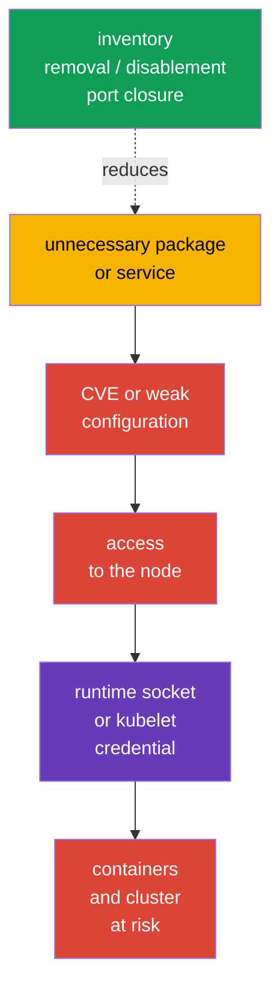
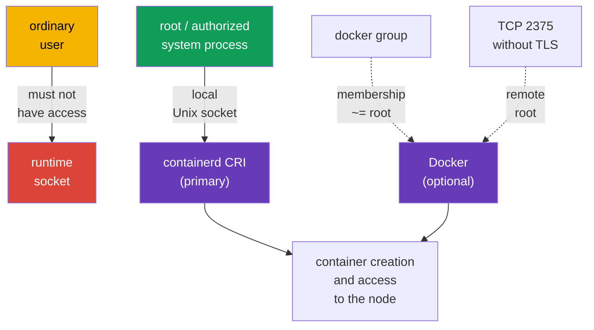

[Русская версия](ru.md) · [Versión en español](es.md) · [Version française](fr.md) · [Deutsche Version](de.md) · [ქართული ვერსია](ge.md) · [繁體中文版](tw.md) · [日本語版](jp.md)

# Chapter 14. Minimizing host OS footprint and runtime daemon security

> **The problem.** An unnecessary package, service, listener, or socket on a Kubernetes node adds a separate binary with CVEs and a path to local or network entry. Compromising such a component can lead to kubelet credentials or the container runtime socket, bypassing Kubernetes API restrictions and putting all workloads on the node at risk.

> **What comes next.** Kubernetes limits workloads with policies, RBAC, and SecurityContext - that is, it narrows what a workload can do to the API and node - but all of this stands on a Linux node. An unnecessary service, package, open port, or access to a runtime socket gives an attacker a path around the Kubernetes API. In this **System Hardening** CKS domain section, we reduce the attack surface of the node itself: retain only needed services, packages, and network points, and give the modern containerd CRI runtime only to those who genuinely need it.

> **What you need from CKA.** Working with `systemd`, processes, files, and logs is covered in [CKA Chapter 0.5](../../../cka/course/00-5-linux/README.md). Docker, containerd, cgroups, and the cgroup driver are covered in [CKA Chapter 0.4](../../../cka/course/00-4-containers/README.md). CRI's role and the kubelet-containerd connection are covered in [CKA Chapter 40](../../../cka/course/40/README.md). Here we do not repeat runtime architecture, but restrict its access and attack surface.

## 14.1. Attack scenario: an unnecessary component becomes an entry point

A Kubernetes node is not a general-purpose server for every task. For example, a worker normally does not need a graphical environment, printing, Bluetooth, a file share, or Docker daemon when kubelet uses containerd. Every installed and especially running component adds:

- binaries and dependencies with CVEs;
- a process with permissions and configuration;
- a listening port or local socket;
- logs, accounts, unit files, and a path to misconfiguration.



This is not an instruction to remove everything indiscriminately. `kubelet`, containerd, CNI, SSH for approved administration, and control-plane components on the respective node can be needed. The goal is to obtain an explicit list: **component -> owner -> purpose -> port/socket**. If there is no purpose and owner, remove or disable the component after checking dependencies and a rollback plan.

Before changing anything, record the initial state. On the control plane, do not disable `kubelet`, containerd, etcd, or Kubernetes components in the SSH session on which access depends: an error can make the node and API inaccessible.

```bash
set -euo pipefail
sudo install -d -m 700 /root/hardening-before
sudo systemctl list-unit-files --type=service | sort \
  | sudo tee /root/hardening-before/services-enabled.txt >/dev/null
sudo systemctl list-units --type=service --state=running | sort \
  | sudo tee /root/hardening-before/services-running.txt >/dev/null
sudo ss -tulpn | sort | sudo tee /root/hardening-before/listeners.txt >/dev/null
if command -v dpkg-query >/dev/null; then
  sudo dpkg-query -W -f='${binary:Package}\t${Version}\n' | LC_ALL=C sort \
    | sudo tee /root/hardening-before/packages.txt >/dev/null
elif command -v rpm >/dev/null; then
  sudo rpm -qa | LC_ALL=C sort \
    | sudo tee /root/hardening-before/packages.txt >/dev/null
else
  echo 'REVIEW_REQUIRED: unsupported package manager; cannot create package inventory' >&2
  exit 2
fi
```

> 🧠 Node compromise can begin with an unnecessary process, package, listener, or socket; maintain a map of the component, owner, purpose, and allowed access.

> 🎯 Inventory services, packages, kernel modules, and listeners; change only an unnecessary object, save a baseline, and check `kubelet`/containerd. `disable --now`, removal, and port closure require different checks.

## 14.6. Security of containerd and optional Docker

On a modern Kubernetes node, containerd is the primary CRI runtime; Docker daemon and its socket are not part of the CRI baseline and are needed only for a separate confirmed task. A runtime daemon has more privileges than an ordinary container. A client able to reach the containerd, NRI, or Docker API can often start a privileged container, mount the host filesystem, or obtain node credentials. Therefore, a Unix socket is an access boundary, not a harmless implementation detail.

> 🎯 Access to the containerd CRI socket is only for `root` and minimal system consumers, without a world-writable mode or mounting in an unprivileged workload.



> 🔬 Docker applies only to a Docker host; NRI/debug/metrics require version- and runtime-specific checking.

### Docker: no unauthenticated TCP API

`dockerd -H tcp://0.0.0.0:2375` exposes the Docker API to everyone who can reach the port. Port `2375` has no TLS or authentication: it is effectively remote root. It must not be present in the `ExecStart` of a systemd unit, a drop-in, or `/etc/docker/daemon.json`. Do not try to "cover" `2375` with a firewall alone: a rule error makes the API available again.

```bash
set -euo pipefail
# This gate checks the independently effective configuration and actual listeners.
# false is the secure baseline; true is allowed only for a documented risk exception.
ALLOW_REMOTE_DOCKER_API=false
declare -a TCP_CONFIGURATION_SOURCES=()
USES_SOCKET_ACTIVATION=false

add_tcp_source() {
  TCP_CONFIGURATION_SOURCES+=("$1")
}

# Classify normalized Docker -H/--host values. Unix and fd are not TCP;
# host:, host:port, :port, numeric port and tcp:// are TCP forms.
classify_docker_host() {
  local source=$1 host=$2
  case "$host" in
    unix://*|/*|@*) ;;
    fd://*) USES_SOCKET_ACTIVATION=true ;;
    tcp://*|*:*|[0-9]*) add_tcp_source "$source: $host" ;;
    *)
      printf 'REVIEW_REQUIRED: cannot classify Docker host value from %s: %s\n' "$source" "$host" >&2
      exit 2
      ;;
  esac
}

# Effective systemd service configuration plus argv of an active daemon.
DOCKER_SERVICE_EXEC=$(sudo systemctl show docker.service -p ExecStart --value 2>/dev/null || true)
DOCKER_PID=$(pgrep -xo dockerd || true)
DOCKER_CMDLINE=''
if [ -n "$DOCKER_PID" ]; then
  DOCKER_CMDLINE=$(sudo cat "/proc/$DOCKER_PID/cmdline" | tr '\0' '\n') || {
    echo 'ERROR: cannot read dockerd argv' >&2
    exit 2
  }
fi

# Parse all -H/--host forms in effective ExecStart, including -H=<value>.
mapfile -t EXEC_HOST_DIRECTIVES < <(
  printf '%s\n' "$DOCKER_SERVICE_EXEC"     | grep -Eo -- '(-H|--host)(=|[[:space:]]+)[^[:space:]]+' || true
)
for directive in "${EXEC_HOST_DIRECTIVES[@]}"; do
  case "$directive" in
    -H=*) host=${directive#-H=} ;;
    --host=*) host=${directive#--host=} ;;
    -H\ *) host=${directive#-H } ;;
    --host\ *) host=${directive#--host } ;;
    *)
      printf 'REVIEW_REQUIRED: cannot normalize ExecStart host directive: %s\n' "$directive" >&2
      exit 2
      ;;
  esac
  classify_docker_host 'docker.service ExecStart' "$host"
done

# argv is NUL-separated, so parse its individual values without quoting ambiguity.
mapfile -t DOCKER_ARGV <<< "$DOCKER_CMDLINE"
for ((i = 0; i < ${#DOCKER_ARGV[@]}; i++)); do
  case "${DOCKER_ARGV[i]}" in
    -H|--host)
      ((++i < ${#DOCKER_ARGV[@]})) || {
        echo 'REVIEW_REQUIRED: dockerd host flag has no value' >&2
        exit 2
      }
      classify_docker_host 'dockerd argv' "${DOCKER_ARGV[i]}"
      ;;
    -H=*) classify_docker_host 'dockerd argv' "${DOCKER_ARGV[i]#-H=}" ;;
    --host=*) classify_docker_host 'dockerd argv' "${DOCKER_ARGV[i]#--host=}" ;;
  esac
done

# A custom config path cannot safely be inferred from grep output; require its explicit review.
if printf '%s\n' "$DOCKER_SERVICE_EXEC" "$DOCKER_CMDLINE"   | grep -Eq -- '--config-file(=|[[:space:]])'; then
  echo 'REVIEW_REQUIRED: dockerd uses --config-file; parse that effective config before allowing Docker TCP API' >&2
  exit 2
fi

# Parse hosts in the default config. Without jq, a hosts key is review-required, not PASS.
if sudo test -f /etc/docker/daemon.json && sudo grep -qE '"hosts"[[:space:]]*:' /etc/docker/daemon.json; then
  command -v jq >/dev/null || {
    echo 'REVIEW_REQUIRED: jq is required to parse daemon.json hosts safely' >&2
    exit 2
  }
  DOCKER_CONFIG_HOSTS=$(sudo jq -er '
    if .hosts? == null then empty
    elif (.hosts | type) == "array" and all(.hosts[]; type == "string") then .hosts[]
    else error("daemon.json hosts must be an array of strings") end
  ' /etc/docker/daemon.json) || {
    echo 'REVIEW_REQUIRED: cannot parse daemon.json hosts' >&2
    exit 2
  }
  while IFS= read -r host; do
    [ -z "$host" ] || classify_docker_host 'daemon.json hosts' "$host"
  done <<< "$DOCKER_CONFIG_HOSTS"
fi

# `Listen` is systemd's effective socket property. Distinguish an absent unit from a
# unit whose effective configuration cannot be read; never turn the latter into PASS.
DOCKER_SOCKET_LOAD_STATE=$(sudo systemctl show docker.socket -p LoadState --value 2>/dev/null) || {
  echo 'REVIEW_REQUIRED: cannot determine whether docker.socket exists' >&2
  exit 2
}
case "$DOCKER_SOCKET_LOAD_STATE" in
  not-found) DOCKER_SOCKET_PRESENT=false ;;
  '')
    echo 'REVIEW_REQUIRED: empty docker.socket LoadState' >&2
    exit 2
    ;;
  *) DOCKER_SOCKET_PRESENT=true ;;
esac
if [ "$DOCKER_SOCKET_PRESENT" = true ]; then
  DOCKER_SOCKET_LISTEN=$(sudo systemctl show docker.socket -p Listen --value) || {
    echo 'REVIEW_REQUIRED: cannot read effective docker.socket Listen configuration' >&2
    exit 2
  }
  [ -n "$DOCKER_SOCKET_LISTEN" ] || {
    echo 'REVIEW_REQUIRED: docker.socket has no effective Listen entries' >&2
    exit 2
  }
  while IFS= read -r listen_entry; do
    listen_entry=${listen_entry#"${listen_entry%%[![:space:]]*}"}
    [ -z "$listen_entry" ] && continue
    case "$listen_entry" in
      *' (Stream)') socket_address=${listen_entry% (Stream)} ;;
      *)
        printf 'REVIEW_REQUIRED: cannot classify non-stream docker.socket Listen entry: %s\n' "$listen_entry" >&2
        exit 2
        ;;
    esac
    case "$socket_address" in
      /*|@*) ;;  # filesystem and abstract Unix sockets
      *:*) add_tcp_source "docker.socket Listen: $socket_address" ;;
      *)
        if [[ "$socket_address" =~ ^[0-9]+$ ]]; then
          add_tcp_source "docker.socket Listen: $socket_address"
        else
          printf 'REVIEW_REQUIRED: cannot classify docker.socket Listen address: %s\n' "$socket_address" >&2
          exit 2
        fi
        ;;
    esac
  done <<< "$DOCKER_SOCKET_LISTEN"
elif [ "$USES_SOCKET_ACTIVATION" = true ]; then
  echo 'REVIEW_REQUIRED: dockerd uses fd:// but docker.socket is absent' >&2
  exit 2
fi

# Current listeners are separate evidence. Match dockerd anywhere in process metadata, not only first.
listeners_2375=$(sudo ss -H -lnt '( sport = :2375 )') || {
  echo 'ERROR: cannot inspect TCP 2375' >&2
  exit 2
}
dockerd_tcp_listeners=$(sudo ss -H -lntp | awk 'index($0, "\"dockerd\"")') || {
  echo 'ERROR: cannot inspect dockerd TCP listeners' >&2
  exit 2
}

TCP_EVIDENCE=$(printf '%s\n%s\n' "${TCP_CONFIGURATION_SOURCES[*]-}" "$dockerd_tcp_listeners")
if [ -n "$listeners_2375" ] || [ -n "${TCP_CONFIGURATION_SOURCES[*]-}" ] || [ -n "$dockerd_tcp_listeners" ]; then
  printf 'Docker TCP configuration/listener evidence:\n%s\n' "$TCP_EVIDENCE" >&2
  if printf '%s\n%s\n' "$listeners_2375" "$TCP_EVIDENCE"     | grep -Eq '(^|[^0-9])2375([^0-9]|$)'; then
    echo 'ERROR: Docker TCP 2375 is configured or listening' >&2
    exit 1
  fi
  if [ "$ALLOW_REMOTE_DOCKER_API" != true ]; then
    echo 'ERROR: unexpected Docker TCP endpoint is configured or listening' >&2
    exit 1
  fi
  echo 'REVIEW_REQUIRED: every allowed endpoint needs effective tlsverify=true, CA, server certificate/key, verified client-certificate authentication and firewall/security-group allowlist.' >&2
  exit 2
fi
echo 'OK: no Docker TCP endpoint is configured or listening'
```

In a typical systemd installation, Docker receives `-H fd://`: `docker.socket` normally creates a local Unix socket. Do not assume this without checking: effective systemd property `Listen` can define a TCP listener that exists before `dockerd` starts. The gate above parses only `Stream` entries: path `/…` and abstract Unix socket `@…` remain Unix, while a port, `host:port`, and `[IPv6]:port` are TCP. Do not add `hosts` in `daemon.json` and `-H` in a unit at the same time: Docker exits with conflicting configuration. Remove only the TCP endpoint from the active source, then verify configuration and restart one service at a time.

```bash
# For daemon.json, first check syntax and supported keys.
sudo dockerd --validate --config-file=/etc/docker/daemon.json
sudo systemctl daemon-reload
sudo systemctl restart docker.service
sudo systemctl --no-pager --full status docker.service
sudo journalctl -u docker.service -n 50 --no-pager
```

If a remote Docker API is genuinely an approved requirement, the port number does not prove TLS or mTLS: even `2376` is not proof. For **every** allowed TCP endpoint, confirm effective `tlsverify=true`, CA, server certificate and key, and actual client-certificate authentication; restrict sources through firewall/security group and a dedicated management network. This is an exception with a risk owner, not the default for a Kubernetes node.

### containerd, NRI, and runtime filesystem boundaries

The primary CRI socket is normally at `/run/containerd/containerd.sock`; the NRI socket path is configurable and often `/run/nri/nri.sock` (equivalent to `/var/run/nri/nri.sock`). Access to **either** is root-equivalent. Leave it only to `root` and a minimal set of system processes. If a group is needed for operations, it must be a dedicated system group with no ordinary users; do not add developers, CI accounts, or workload identities. Never mount `containerd.sock` or `nri.sock` into an unprivileged container.

There is no universal `chmod` for a Docker or containerd socket: path, owner, group, and mode are set by the package, systemd unit, and policy of the particular node. Do not use world-writable modes or fix permissions with a one-time command if systemd recreates the socket. First identify the configuration owner, then preserve minimally required access through supported image/IaC configuration and check it after restart.

```bash
sudo systemctl status containerd.service --no-pager
sudo systemctl cat containerd.service
sudo stat -Lc '%A %a %U:%G %n' /run/containerd/containerd.sock \
  /run/nri/nri.sock 2>/dev/null || true
sudo ss -lxnp | grep -E 'containerd\.sock|nri\.sock' || true

# CRI diagnostics run locally and as root; compare the endpoint with kubelet config.
sudo crictl --runtime-endpoint unix:///run/containerd/containerd.sock ps
sudo grep -Rns -- '--container-runtime-endpoint\|containerRuntimeEndpoint' \
  /var/lib/kubelet /etc/systemd/system /usr/lib/systemd/system 2>/dev/null || true
```


## 14.2. Inventory and disable unnecessary services

First distinguish three states. `systemctl list-units` shows loaded units, `is-active` whether the process currently runs, and `is-enabled` whether it will start at boot. A disabled unit can still be active until it is explicitly stopped.

```bash
# Running service units and their state.
sudo systemctl list-units --type=service --state=running

# All installed service units, including disabled ones.
sudo systemctl list-unit-files --type=service

# Where a particular service came from and how it starts.
SERVICE='service-to-review.service'
sudo systemctl status "$SERVICE"
sudo systemctl cat "$SERVICE"
sudo systemctl show "$SERVICE" -p FragmentPath -p ExecStart -p User
sudo journalctl -u "$SERVICE" --since '24 hours ago'
```

A decision table is useful before running any command:

| Finding | Question before action | Normal decision |
|---|---|---|
| `kubelet.service` | Is the node part of the cluster? | retain; change only deliberately |
| `containerd.service` | Is it kubelet's CRI endpoint? | retain on a Kubernetes node |
| `docker.service`/`docker.socket` | Does this node need Docker? | remove/disable if CRI is containerd and Docker is unnecessary |
| `sshd.service` | Is there an approved bastion/console path? | retain with Chapter 15 hardening or disable only with alternative access |
| `cups`, `avahi-daemon`, Bluetooth, GUI service | Is there a documented server purpose? | normally remove or disable |
| unknown service | Who owns it, which package and port? | investigate; do not guess |

For a known unnecessary unit, the safe baseline operation is to stop it now and prevent autostart. The command is reversible: `enable --now` returns the service if needed.

```bash
# Example only after confirming that the service is not needed on this node.
sudo systemctl disable --now avahi-daemon.service

# Check both states.
sudo systemctl is-active avahi-daemon.service || true
sudo systemctl is-enabled avahi-daemon.service || true
```

`mask` is stronger than `disable`: it prevents manual and dependency-based unit startup by pointing it to `/dev/null`. Use it for a service that definitely must not appear in the node image and record the exception in image build/IaC. Do not mask a Kubernetes dependency without understanding the consequences.

```bash
UNIT='confirmed-unwanted.service'

# Save the initial state before changing it.
sudo systemctl is-active "$UNIT" \
  > "/root/hardening-before/${UNIT}.active" 2>&1 || true
sudo systemctl is-enabled "$UNIT" \
  > "/root/hardening-before/${UNIT}.enabled" 2>&1 || true

# Mask and stop an already running unit.
sudo systemctl mask --now "$UNIT"

# Prove both states.
sudo systemctl is-active "$UNIT" || true
sudo systemctl is-enabled "$UNIT" || true
```

Without `--now`, `mask` blocks only future manual and dependency-based startup: an already running service continues to run. For rollback, first run `systemctl unmask <unit>`, then restore the exact active/enabled state saved before the change. Do not automatically run `enable --now` if the unit was not enabled and active before hardening.

## 14.3. Unnecessary packages and a minimal OS image

Stopping a service is insufficient: its package, libraries, timer/socket unit, and future CVE remain on the node. Inventory packages, determine which package installed a binary, and check reverse dependencies. On Debian/Ubuntu:

```bash
PACKAGE='package-to-review'
BINARY='binary-to-review'
apt list --installed 2>/dev/null | less
apt-cache policy "$PACKAGE"
dpkg -S "$(command -v "$BINARY")"
apt-cache rdepends --installed "$PACKAGE"

# Print manually installed packages: a starting point for image review.
apt-mark showmanual | sort
```

After review, remove the confirmed package itself. `apt purge` also removes its configuration; before `autoremove`, first read the list because it can include a needed library or diagnostic tool.

```bash
PACKAGE='confirmed-unneeded-package'
sudo apt purge "$PACKAGE"
sudo apt autoremove --dry-run
# Run autoremove only after reviewing its list.
sudo apt autoremove
# A mass apt upgrade is intentionally not performed here: patching proceeds in a separate change window.
```

On RPM systems, equivalents are `rpm -qa`, `dnf repoquery --installed`, and `dnf remove`. Do not mix system hardening with an uncontrolled mass upgrade: updates, image version, and rollback must follow the ordinary operations process.

**A minimal OS image** is preferable to manually cleaning every already running node. Node image/configuration declares required packages and services, excludes desktops, compilers, test utilities, and unnecessary agents, then regularly rebuilds the image with patches. Minimality does not mean no recovery tools: an approved way to access, log, and diagnose must remain.

> 🏭 **Production.** A dedicated Kubernetes OS - for example, [Bottlerocket](https://bottlerocket.dev/) - can reduce mutable host footprint through an intentionally minimal immutable image and managed update workflow. This is an architectural choice: before production rollout, check in staging support for the target Kubernetes version, CNI/CSI, bootstrap, observability, debug access, and rollback. Do not transfer `apt`/`dpkg` commands or ordinary Linux distribution paths to such an OS without its official documentation.

| Approach | Benefit | Risk and control |
|---|---|---|
| Remove a package on a running node | quickly eliminates a known surface | drift between nodes; record in IaC/image |
| Golden image with a package allowlist | uniform, auditable state | requires a rebuild and update process |
| Immutable/minimal OS | fewer packages and runtime changes | plan debug and updates in advance |
| "Remove everything unknown" | none | can break kubelet, CNI, storage, monitoring, or access |

## 14.4. Kernel modules: inventory and controlled disablement

A kernel module is part of the attack surface, but not an "unnecessary package" that can be removed without consequences. First record loaded modules, their parameters, and loading rules; check a module's purpose with the image owner and OS documentation.

```bash
MODULE='example_module'
lsmod | sort
sudo modinfo "$MODULE"
# `modprobe -c` is the source of truth for the effective configuration.
EFFECTIVE_MODPROBE_CONFIG=$(sudo modprobe -c) || {
  echo 'ERROR: cannot read effective modprobe configuration' >&2
  exit 2
}
printf '%s\n' "$EFFECTIVE_MODPROBE_CONFIG" \
  | grep -E "^(blacklist|install)[[:space:]]+${MODULE}\b" || true
sudo modprobe -n -v "$MODULE"
# These files are only for finding the rule's source; they can be overridden.
sudo find /etc/modprobe.d /run/modprobe.d /usr/local/lib/modprobe.d \
  /usr/lib/modprobe.d /lib/modprobe.d -type f -print 2>/dev/null | sort
sudo grep -RnsE "^(blacklist|install)[[:space:]]+${MODULE}\b" \
  /etc/modprobe.d /run/modprobe.d /usr/local/lib/modprobe.d /usr/lib/modprobe.d /lib/modprobe.d \
  2>/dev/null || true
```

`modprobe -c` shows the final rules with precedence applied; the file-level `find`/`grep` is only for locating the source of a rule seen there and can display overridden entries. For a specific module, `modprobe -n -v` shows the actual action that `modprobe` will apply.

`modprobe -r <module>` unloads a module **only temporarily**: it does not survive a reboot and fails if the module is in use or held by a dependency. Persistent prohibition is configured in managed `modprobe` configuration; `blacklist` prevents ordinary autoload, while `install ... /bin/false` also blocks explicit `modprobe` through that rule. Apply both mechanisms only after checking that the module is truly unnecessary.

```bash
MODULE='example_module'
# In a change window: temporary check; do not try to force-unload an in-use module.
sudo modprobe -r "$MODULE"

# Persistent rule in image/IaC, not manual node drift.
sudo tee "/etc/modprobe.d/disable-${MODULE}.conf" >/dev/null <<EOF
blacklist $MODULE
install $MODULE /bin/false
EOF

# For Debian/Ubuntu, update initramfs if the module can load early during boot.
sudo update-initramfs -u
sudo modprobe -n -v "$MODULE"       # the install /bin/false rule is expected
```

After a scheduled reboot, check `lsmod`, `modprobe -n -v`, and node health. Modules can be needed by CNI, a storage driver, runtime, or network/disk hardware. First test on one drained/staging node, then roll out node-by-node with checks of `kubelet`, containerd, CNI, and workload; do not apply a blacklist to an entire pool at once.

## 14.5. Open ports: listener, purpose, and network perimeter

A port is not dangerous by itself - an unknown service or one reachable from the wrong sources is dangerous. First establish the mapping "listener - PID - unit - required sources", then restrict the service and firewall. `ss` is usually available on modern Linux; `lsof` and `netstat` are useful alternatives.

```bash
# TCP and UDP listeners with process and PID (root is needed for complete information).
sudo ss -tulpn
sudo lsof -nP -iTCP -sTCP:LISTEN
sudo netstat -tulpn                    # if the net-tools package is installed

# Runtime Unix sockets are not visible in TCP/UDP output.
sudo ss -lxnp | grep -E 'docker|containerd' || true
```

| Point | Where it is usually needed | Secure direction |
|---|---|---|
| SSH `22/tcp` | managed node access | only bastion/VPN/administrative CIDRs |
| kubelet `10250/tcp` | control plane and approved diagnosis | do not expose to the Internet; TLS, authn/authz, and firewall |
| kube-apiserver `6443/tcp` | control plane; workers and administrators by architecture | allowlist/private endpoint, not `0.0.0.0/0` |
| etcd `2379`, `2380/tcp` | only control-plane/etcd peers | do not expose on a worker or external network |
| Docker TCP API (often `2375`/`2376`) | only for justified remote management | do not listen on `2375`; every TCP endpoint needs an explicit exception, mTLS, and precise firewall |
| containerd/NRI Unix socket | locally on the node | `root` and a minimal set of authorized system consumers |

Do not conclude from the port number without the process: for example, `6443` is expected on the control plane but can be an error on a worker; `10250` is required by kubelet but must not be public. Network filtering complements, but does not replace, disabling an unnecessary service. Chapter 15 covers detailed restriction of external access and SSH.

```bash
SERVICE='service-owning-the-listener.service'
PORT='10250'
# First check the specific listener and its unit.
sudo ss -lntp | grep -E ':(22|10250|6443|2379|2380|2375|2376)\b' || true
sudo systemctl status "$SERVICE"

# After removing/disabling the service, the port must disappear. An ss error is not listener absence.
listeners=$(sudo ss -H -lnt "( sport = :${PORT} )") || {
  echo "ERROR: cannot inspect TCP listener ${PORT}" >&2; exit 2;
}
if [ -n "$listeners" ]; then
  printf 'ERROR: TCP port %s is still listening:\n%s\n' "$PORT" "$listeners" >&2
  exit 1
fi
echo "OK: TCP listener ${PORT} is absent"
```

> 🎯 Inventory services, packages, kernel modules, and listeners; change only an unnecessary object, save a baseline, and check `kubelet`/containerd. `disable --now`, removal, and port closure require different checks.
