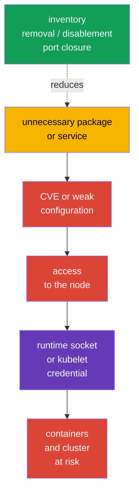
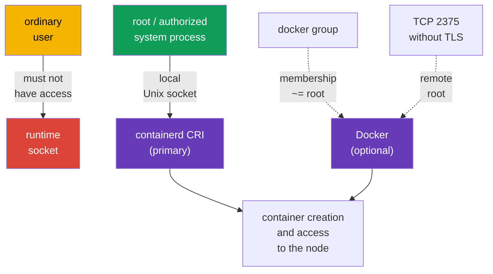

[Русская версия](ru.md) · [Versión en español](es.md) · [Version française](fr.md) · [Deutsche Version](de.md) · [ქართული ვერსია](ge.md) · [繁體中文版](tw.md) · [日本語版](jp.md)

# Chapter 14. Minimizing host OS footprint and runtime daemon security

> **The problem.** An unnecessary package, service, listener, or socket on a Kubernetes node adds a separate binary with CVEs and a path to local or network entry. Compromising such a component can lead to kubelet credentials or the container runtime socket, bypassing Kubernetes API restrictions and putting all workloads on the node at risk.

> **What comes next.** Kubernetes limits workloads with policies, RBAC, and SecurityContext - that is, it narrows what a workload can do to the API and node - but all of this stands on a Linux node. An unnecessary service, package, open port, or access to a runtime socket gives an attacker a path around the Kubernetes API. In this **System Hardening** CKS domain section, we reduce the attack surface of the node itself: retain only needed services, packages, and network points, and give the modern containerd CRI runtime only to those who genuinely need it.

> **What you need from CKA.** Working with `systemd`, processes, files, and logs is covered in [CKA Chapter 0.5](../../../cka/course/00-5-linux/README.md). Docker, containerd, cgroups, and the cgroup driver are covered in [CKA Chapter 0.4](../../../cka/course/00-4-containers/README.md). CRI's role and the kubelet-containerd connection are covered in [CKA Chapter 40](../../../cka/course/40/README.md). Here we do not repeat runtime architecture, but restrict its access and attack surface.

## 14.1. Attack scenario: an unnecessary component becomes an entry point

A Kubernetes node is not a general-purpose server for every task. For example, a worker normally does not need a graphical environment, printing, Bluetooth, a file share, or Docker daemon when kubelet uses containerd. Every installed and especially running component adds:

- binaries and dependencies with CVEs;
- a process with permissions and configuration;
- a listening port or local socket;
- logs, accounts, unit files, and a path to misconfiguration.



This is not an instruction to remove everything indiscriminately. `kubelet`, containerd, CNI, SSH for approved administration, and control-plane components on the respective node can be needed. The goal is to obtain an explicit list: **component -> owner -> purpose -> port/socket**. If there is no purpose and owner, remove or disable the component after checking dependencies and a rollback plan.

Before changing anything, record the initial state. On the control plane, do not disable `kubelet`, containerd, etcd, or Kubernetes components in the SSH session on which access depends: an error can make the node and API inaccessible.

```bash
set -euo pipefail
sudo install -d -m 700 /root/hardening-before
sudo systemctl list-unit-files --type=service | sort \
  | sudo tee /root/hardening-before/services-enabled.txt >/dev/null
sudo systemctl list-units --type=service --state=running | sort \
  | sudo tee /root/hardening-before/services-running.txt >/dev/null
sudo ss -tulpn | sort | sudo tee /root/hardening-before/listeners.txt >/dev/null
if command -v dpkg-query >/dev/null; then
  sudo dpkg-query -W -f='${binary:Package}\t${Version}\n' | LC_ALL=C sort \
    | sudo tee /root/hardening-before/packages.txt >/dev/null
elif command -v rpm >/dev/null; then
  sudo rpm -qa | LC_ALL=C sort \
    | sudo tee /root/hardening-before/packages.txt >/dev/null
else
  echo 'REVIEW_REQUIRED: unsupported package manager; cannot create package inventory' >&2
  exit 2
fi
```

> 🧠 Node compromise can begin with an unnecessary process, package, listener, or socket; maintain a map of the component, owner, purpose, and allowed access.

> 🎯 Inventory services, packages, kernel modules, and listeners; change only an unnecessary object, save a baseline, and check `kubelet`/containerd. `disable --now`, removal, and port closure require different checks.

## 14.2. Inventory and disable unnecessary services

First distinguish three states. `systemctl list-units` shows loaded units, `is-active` whether the process currently runs, and `is-enabled` whether it will start at boot. A disabled unit can still be active until it is explicitly stopped.

```bash
# Running service units and their state.
sudo systemctl list-units --type=service --state=running

# All installed service units, including disabled ones.
sudo systemctl list-unit-files --type=service

# Where a particular service came from and how it starts.
SERVICE='service-to-review.service'
sudo systemctl status "$SERVICE"
sudo systemctl cat "$SERVICE"
sudo systemctl show "$SERVICE" -p FragmentPath -p ExecStart -p User
sudo journalctl -u "$SERVICE" --since '24 hours ago'
```

A decision table is useful before running any command:

| Finding | Question before action | Normal decision |
|---|---|---|
| `kubelet.service` | Is the node part of the cluster? | retain; change only deliberately |
| `containerd.service` | Is it kubelet's CRI endpoint? | retain on a Kubernetes node |
| `docker.service`/`docker.socket` | Does this node need Docker? | remove/disable if CRI is containerd and Docker is unnecessary |
| `sshd.service` | Is there an approved bastion/console path? | retain with Chapter 15 hardening or disable only with alternative access |
| `cups`, `avahi-daemon`, Bluetooth, GUI service | Is there a documented server purpose? | normally remove or disable |
| unknown service | Who owns it, which package and port? | investigate; do not guess |

For a known unnecessary unit, the safe baseline operation is to stop it now and prevent autostart. The command is reversible: `enable --now` returns the service if needed.

```bash
# Example only after confirming that the service is not needed on this node.
sudo systemctl disable --now avahi-daemon.service

# Check both states.
sudo systemctl is-active avahi-daemon.service || true
sudo systemctl is-enabled avahi-daemon.service || true
```

`mask` is stronger than `disable`: it prevents manual and dependency-based unit startup by pointing it to `/dev/null`. Use it for a service that definitely must not appear in the node image and record the exception in image build/IaC. Do not mask a Kubernetes dependency without understanding the consequences.

```bash
UNIT='confirmed-unwanted.service'

# Save the initial state before changing it.
sudo systemctl is-active "$UNIT" \
  > "/root/hardening-before/${UNIT}.active" 2>&1 || true
sudo systemctl is-enabled "$UNIT" \
  > "/root/hardening-before/${UNIT}.enabled" 2>&1 || true

# Mask and stop an already running unit.
sudo systemctl mask --now "$UNIT"

# Prove both states.
sudo systemctl is-active "$UNIT" || true
sudo systemctl is-enabled "$UNIT" || true
```

Without `--now`, `mask` blocks only future manual and dependency-based startup: an already running service continues to run. For rollback, first run `systemctl unmask <unit>`, then restore the exact active/enabled state saved before the change. Do not automatically run `enable --now` if the unit was not enabled and active before hardening.

## 14.3. Unnecessary packages and a minimal OS image

Stopping a service is insufficient: its package, libraries, timer/socket unit, and future CVE remain on the node. Inventory packages, determine which package installed a binary, and check reverse dependencies. On Debian/Ubuntu:

```bash
PACKAGE='package-to-review'
BINARY='binary-to-review'
apt list --installed 2>/dev/null | less
apt-cache policy "$PACKAGE"
dpkg -S "$(command -v "$BINARY")"
apt-cache rdepends --installed "$PACKAGE"

# Print manually installed packages: a starting point for image review.
apt-mark showmanual | sort
```

After review, remove the confirmed package itself. `apt purge` also removes its configuration; before `autoremove`, first read the list because it can include a needed library or diagnostic tool.

```bash
PACKAGE='confirmed-unneeded-package'
sudo apt purge "$PACKAGE"
sudo apt autoremove --dry-run
# Run autoremove only after reviewing its list.
sudo apt autoremove
# A mass apt upgrade is intentionally not performed here: patching proceeds in a separate change window.
```

On RPM systems, equivalents are `rpm -qa`, `dnf repoquery --installed`, and `dnf remove`. Do not mix system hardening with an uncontrolled mass upgrade: updates, image version, and rollback must follow the ordinary operations process.

**A minimal OS image** is preferable to manually cleaning every already running node. Node image/configuration declares required packages and services, excludes desktops, compilers, test utilities, and unnecessary agents, then regularly rebuilds the image with patches. Minimality does not mean no recovery tools: an approved way to access, log, and diagnose must remain.

> 🏭 **Production.** A dedicated Kubernetes OS - for example, [Bottlerocket](https://bottlerocket.dev/) - can reduce mutable host footprint through an intentionally minimal immutable image and managed update workflow. This is an architectural choice: before production rollout, check in staging support for the target Kubernetes version, CNI/CSI, bootstrap, observability, debug access, and rollback. Do not transfer `apt`/`dpkg` commands or ordinary Linux distribution paths to such an OS without its official documentation.

| Approach | Benefit | Risk and control |
|---|---|---|
| Remove a package on a running node | quickly eliminates a known surface | drift between nodes; record in IaC/image |
| Golden image with a package allowlist | uniform, auditable state | requires a rebuild and update process |
| Immutable/minimal OS | fewer packages and runtime changes | plan debug and updates in advance |
| "Remove everything unknown" | none | can break kubelet, CNI, storage, monitoring, or access |

## 14.4. Kernel modules: inventory and controlled disablement

A kernel module is part of the attack surface, but not an "unnecessary package" that can be removed without consequences. First record loaded modules, their parameters, and loading rules; check a module's purpose with the image owner and OS documentation.

```bash
MODULE='example_module'
lsmod | sort
sudo modinfo "$MODULE"
# `modprobe -c` is the source of truth for the effective configuration.
EFFECTIVE_MODPROBE_CONFIG=$(sudo modprobe -c) || {
  echo 'ERROR: cannot read effective modprobe configuration' >&2
  exit 2
}
printf '%s\n' "$EFFECTIVE_MODPROBE_CONFIG" \
  | grep -E "^(blacklist|install)[[:space:]]+${MODULE}\b" || true
sudo modprobe -n -v "$MODULE"
# These files are only for finding the rule's source; they can be overridden.
sudo find /etc/modprobe.d /run/modprobe.d /usr/local/lib/modprobe.d \
  /usr/lib/modprobe.d /lib/modprobe.d -type f -print 2>/dev/null | sort
sudo grep -RnsE "^(blacklist|install)[[:space:]]+${MODULE}\b" \
  /etc/modprobe.d /run/modprobe.d /usr/local/lib/modprobe.d /usr/lib/modprobe.d /lib/modprobe.d \
  2>/dev/null || true
```

`modprobe -c` shows the final rules with precedence applied; the file-level `find`/`grep` is only for locating the source of a rule seen there and can display overridden entries. For a specific module, `modprobe -n -v` shows the actual action that `modprobe` will apply.

`modprobe -r <module>` unloads a module **only temporarily**: it does not survive a reboot and fails if the module is in use or held by a dependency. Persistent prohibition is configured in managed `modprobe` configuration; `blacklist` prevents ordinary autoload, while `install ... /bin/false` also blocks explicit `modprobe` through that rule. Apply both mechanisms only after checking that the module is truly unnecessary.

```bash
MODULE='example_module'
# In a change window: temporary check; do not try to force-unload an in-use module.
sudo modprobe -r "$MODULE"

# Persistent rule in image/IaC, not manual node drift.
sudo tee "/etc/modprobe.d/disable-${MODULE}.conf" >/dev/null <<EOF
blacklist $MODULE
install $MODULE /bin/false
EOF

# For Debian/Ubuntu, update initramfs if the module can load early during boot.
sudo update-initramfs -u
sudo modprobe -n -v "$MODULE"       # the install /bin/false rule is expected
```

After a scheduled reboot, check `lsmod`, `modprobe -n -v`, and node health. Modules can be needed by CNI, a storage driver, runtime, or network/disk hardware. First test on one drained/staging node, then roll out node-by-node with checks of `kubelet`, containerd, CNI, and workload; do not apply a blacklist to an entire pool at once.

## 14.5. Open ports: listener, purpose, and network perimeter

A port is not dangerous by itself - an unknown service or one reachable from the wrong sources is dangerous. First establish the mapping "listener - PID - unit - required sources", then restrict the service and firewall. `ss` is usually available on modern Linux; `lsof` and `netstat` are useful alternatives.

```bash
# TCP and UDP listeners with process and PID (root is needed for complete information).
sudo ss -tulpn
sudo lsof -nP -iTCP -sTCP:LISTEN
sudo netstat -tulpn                    # if the net-tools package is installed

# Runtime Unix sockets are not visible in TCP/UDP output.
sudo ss -lxnp | grep -E 'docker|containerd' || true
```

| Point | Where it is usually needed | Secure direction |
|---|---|---|
| SSH `22/tcp` | managed node access | only bastion/VPN/administrative CIDRs |
| kubelet `10250/tcp` | control plane and approved diagnosis | do not expose to the Internet; TLS, authn/authz, and firewall |
| kube-apiserver `6443/tcp` | control plane; workers and administrators by architecture | allowlist/private endpoint, not `0.0.0.0/0` |
| etcd `2379`, `2380/tcp` | only control-plane/etcd peers | do not expose on a worker or external network |
| Docker TCP API (often `2375`/`2376`) | only for justified remote management | do not listen on `2375`; every TCP endpoint needs an explicit exception, mTLS, and precise firewall |

| containerd/NRI Unix socket | locally on the node | `root` and a minimal set of authorized system consumers |

Do not conclude from the port number without the process: for example, `6443` is expected on the control plane but can be an error on a worker; `10250` is required by kubelet but must not be public. Network filtering complements, but does not replace, disabling an unnecessary service. Chapter 15 covers detailed restriction of external access and SSH.

```bash
SERVICE='service-owning-the-listener.service'
PORT='10250'
# First check the specific listener and its unit.
sudo ss -lntp | grep -E ':(22|10250|6443|2379|2380|2375|2376)\b' || true
sudo systemctl status "$SERVICE"

# After removing/disabling the service, the port must disappear. An ss error is not listener absence.
listeners=$(sudo ss -H -lnt "( sport = :${PORT} )") || {
  echo "ERROR: cannot inspect TCP listener ${PORT}" >&2; exit 2;
}
if [ -n "$listeners" ]; then
  printf 'ERROR: TCP port %s is still listening:\n%s\n' "$PORT" "$listeners" >&2
  exit 1
fi
echo "OK: TCP listener ${PORT} is absent"
```

> 🎯 Inventory services, packages, kernel modules, and listeners; change only an unnecessary object, save a baseline, and check `kubelet`/containerd. `disable --now`, removal, and port closure require different checks.

## 14.6. Security of containerd and optional Docker

On a modern Kubernetes node, containerd is the primary CRI runtime; Docker daemon and its socket are not part of the CRI baseline and are needed only for a separate confirmed task. A runtime daemon has more privileges than an ordinary container. A client able to reach the containerd, NRI, or Docker API can often start a privileged container, mount the host filesystem, or obtain node credentials. Therefore, a Unix socket is an access boundary, not a harmless implementation detail.

> 🎯 Access to the containerd CRI socket is only for `root` and minimal system consumers, without a world-writable mode or mounting in an unprivileged workload.



> 🔬 Docker applies only to a Docker host; NRI/debug/metrics require version- and runtime-specific checking.

### Docker: no unauthenticated TCP API

`dockerd -H tcp://0.0.0.0:2375` exposes the Docker API to everyone who can reach the port. Port `2375` has no TLS or authentication: it is effectively remote root. It must not be present in the `ExecStart` of a systemd unit, a drop-in, or `/etc/docker/daemon.json`. Do not try to "cover" `2375` with a firewall alone: a rule error makes the API available again.

```bash
set -euo pipefail
# This gate checks the independently effective configuration and actual listeners.
# false is the secure baseline; true is allowed only for a documented risk exception.
ALLOW_REMOTE_DOCKER_API=false
declare -a TCP_CONFIGURATION_SOURCES=()
USES_SOCKET_ACTIVATION=false

add_tcp_source() {
  TCP_CONFIGURATION_SOURCES+=("$1")
}

# Classify normalized Docker -H/--host values. Unix and fd are not TCP;
# host:, host:port, :port, numeric port and tcp:// are TCP forms.
classify_docker_host() {
  local source=$1 host=$2
  case "$host" in
    unix://*|/*|@*) ;;
    fd://*) USES_SOCKET_ACTIVATION=true ;;
    tcp://*|*:*|[0-9]*) add_tcp_source "$source: $host" ;;
    *)
      printf 'REVIEW_REQUIRED: cannot classify Docker host value from %s: %s\n' "$source" "$host" >&2
      exit 2
      ;;
  esac
}

# Effective systemd service configuration plus argv of an active daemon.
DOCKER_SERVICE_EXEC=$(sudo systemctl show docker.service -p ExecStart --value 2>/dev/null || true)
DOCKER_PID=$(pgrep -xo dockerd || true)
DOCKER_CMDLINE=''
if [ -n "$DOCKER_PID" ]; then
  DOCKER_CMDLINE=$(sudo cat "/proc/$DOCKER_PID/cmdline" | tr '\0' '\n') || {
    echo 'ERROR: cannot read dockerd argv' >&2
    exit 2
  }
fi

# Parse all -H/--host forms in effective ExecStart, including -H=<value>.
mapfile -t EXEC_HOST_DIRECTIVES < <(
  printf '%s\n' "$DOCKER_SERVICE_EXEC"     | grep -Eo -- '(-H|--host)(=|[[:space:]]+)[^[:space:]]+' || true
)
for directive in "${EXEC_HOST_DIRECTIVES[@]}"; do
  case "$directive" in
    -H=*) host=${directive#-H=} ;;
    --host=*) host=${directive#--host=} ;;
    -H\ *) host=${directive#-H } ;;
    --host\ *) host=${directive#--host } ;;
    *)
      printf 'REVIEW_REQUIRED: cannot normalize ExecStart host directive: %s\n' "$directive" >&2
      exit 2
      ;;
  esac
  classify_docker_host 'docker.service ExecStart' "$host"
done

# argv is NUL-separated, so parse its individual values without quoting ambiguity.
mapfile -t DOCKER_ARGV <<< "$DOCKER_CMDLINE"
for ((i = 0; i < ${#DOCKER_ARGV[@]}; i++)); do
  case "${DOCKER_ARGV[i]}" in
    -H|--host)
      ((++i < ${#DOCKER_ARGV[@]})) || {
        echo 'REVIEW_REQUIRED: dockerd host flag has no value' >&2
        exit 2
      }
      classify_docker_host 'dockerd argv' "${DOCKER_ARGV[i]}"
      ;;
    -H=*) classify_docker_host 'dockerd argv' "${DOCKER_ARGV[i]#-H=}" ;;
    --host=*) classify_docker_host 'dockerd argv' "${DOCKER_ARGV[i]#--host=}" ;;
  esac
done

# A custom config path cannot safely be inferred from grep output; require its explicit review.
if printf '%s\n' "$DOCKER_SERVICE_EXEC" "$DOCKER_CMDLINE"   | grep -Eq -- '--config-file(=|[[:space:]])'; then
  echo 'REVIEW_REQUIRED: dockerd uses --config-file; parse that effective config before allowing Docker TCP API' >&2
  exit 2
fi

# Parse hosts in the default config. Without jq, a hosts key is review-required, not PASS.
if sudo test -f /etc/docker/daemon.json && sudo grep -qE '"hosts"[[:space:]]*:' /etc/docker/daemon.json; then
  command -v jq >/dev/null || {
    echo 'REVIEW_REQUIRED: jq is required to parse daemon.json hosts safely' >&2
    exit 2
  }
  DOCKER_CONFIG_HOSTS=$(sudo jq -er '
    if .hosts? == null then empty
    elif (.hosts | type) == "array" and all(.hosts[]; type == "string") then .hosts[]
    else error("daemon.json hosts must be an array of strings") end
  ' /etc/docker/daemon.json) || {
    echo 'REVIEW_REQUIRED: cannot parse daemon.json hosts' >&2
    exit 2
  }
  while IFS= read -r host; do
    [ -z "$host" ] || classify_docker_host 'daemon.json hosts' "$host"
  done <<< "$DOCKER_CONFIG_HOSTS"
fi

# `Listen` is systemd's effective socket property. Distinguish an absent unit from a
# unit whose effective configuration cannot be read; never turn the latter into PASS.
DOCKER_SOCKET_LOAD_STATE=$(sudo systemctl show docker.socket -p LoadState --value 2>/dev/null) || {
  echo 'REVIEW_REQUIRED: cannot determine whether docker.socket exists' >&2
  exit 2
}
case "$DOCKER_SOCKET_LOAD_STATE" in
  not-found) DOCKER_SOCKET_PRESENT=false ;;
  '')
    echo 'REVIEW_REQUIRED: empty docker.socket LoadState' >&2
    exit 2
    ;;
  *) DOCKER_SOCKET_PRESENT=true ;;
esac
if [ "$DOCKER_SOCKET_PRESENT" = true ]; then
  DOCKER_SOCKET_LISTEN=$(sudo systemctl show docker.socket -p Listen --value) || {
    echo 'REVIEW_REQUIRED: cannot read effective docker.socket Listen configuration' >&2
    exit 2
  }
  [ -n "$DOCKER_SOCKET_LISTEN" ] || {
    echo 'REVIEW_REQUIRED: docker.socket has no effective Listen entries' >&2
    exit 2
  }
  while IFS= read -r listen_entry; do
    listen_entry=${listen_entry#"${listen_entry%%[![:space:]]*}"}
    [ -z "$listen_entry" ] && continue
    case "$listen_entry" in
      *' (Stream)') socket_address=${listen_entry% (Stream)} ;;
      *)
        printf 'REVIEW_REQUIRED: cannot classify non-stream docker.socket Listen entry: %s\n' "$listen_entry" >&2
        exit 2
        ;;
    esac
    case "$socket_address" in
      /*|@*) ;;  # filesystem and abstract Unix sockets
      *:*) add_tcp_source "docker.socket Listen: $socket_address" ;;
      *)
        if [[ "$socket_address" =~ ^[0-9]+$ ]]; then
          add_tcp_source "docker.socket Listen: $socket_address"
        else
          printf 'REVIEW_REQUIRED: cannot classify docker.socket Listen address: %s\n' "$socket_address" >&2
          exit 2
        fi
        ;;
    esac
  done <<< "$DOCKER_SOCKET_LISTEN"
elif [ "$USES_SOCKET_ACTIVATION" = true ]; then
  echo 'REVIEW_REQUIRED: dockerd uses fd:// but docker.socket is absent' >&2
  exit 2
fi

# Current listeners are separate evidence. Match dockerd anywhere in process metadata, not only first.
listeners_2375=$(sudo ss -H -lnt '( sport = :2375 )') || {
  echo 'ERROR: cannot inspect TCP 2375' >&2
  exit 2
}
dockerd_tcp_listeners=$(sudo ss -H -lntp | awk 'index($0, "\"dockerd\"")') || {
  echo 'ERROR: cannot inspect dockerd TCP listeners' >&2
  exit 2
}

TCP_EVIDENCE=$(printf '%s\n%s\n' "${TCP_CONFIGURATION_SOURCES[*]-}" "$dockerd_tcp_listeners")
if [ -n "$listeners_2375" ] || [ -n "${TCP_CONFIGURATION_SOURCES[*]-}" ] || [ -n "$dockerd_tcp_listeners" ]; then
  printf 'Docker TCP configuration/listener evidence:\n%s\n' "$TCP_EVIDENCE" >&2
  if printf '%s\n%s\n' "$listeners_2375" "$TCP_EVIDENCE"     | grep -Eq '(^|[^0-9])2375([^0-9]|$)'; then
    echo 'ERROR: Docker TCP 2375 is configured or listening' >&2
    exit 1
  fi
  if [ "$ALLOW_REMOTE_DOCKER_API" != true ]; then
    echo 'ERROR: unexpected Docker TCP endpoint is configured or listening' >&2
    exit 1
  fi
  echo 'REVIEW_REQUIRED: every allowed endpoint needs effective tlsverify=true, CA, server certificate/key, verified client-certificate authentication and firewall/security-group allowlist.' >&2
  exit 2
fi
echo 'OK: no Docker TCP endpoint is configured or listening'
```

In a typical systemd installation, Docker receives `-H fd://`: `docker.socket` normally creates a local Unix socket. Do not assume this without checking: effective systemd property `Listen` can define a TCP listener that exists before `dockerd` starts. The gate above parses only `Stream` entries: path `/…` and abstract Unix socket `@…` remain Unix, while a port, `host:port`, and `[IPv6]:port` are TCP. Do not add `hosts` in `daemon.json` and `-H` in a unit at the same time: Docker exits with conflicting configuration. Remove only the TCP endpoint from the active source, then verify configuration and restart one service at a time.

```bash
# For daemon.json, first check syntax and supported keys.
sudo dockerd --validate --config-file=/etc/docker/daemon.json
sudo systemctl daemon-reload
sudo systemctl restart docker.service
sudo systemctl --no-pager --full status docker.service
sudo journalctl -u docker.service -n 50 --no-pager
```

If a remote Docker API is genuinely an approved requirement, the port number does not prove TLS or mTLS: even `2376` is not proof. For **every** allowed TCP endpoint, confirm effective `tlsverify=true`, CA, server certificate and key, and actual client-certificate authentication; restrict sources through firewall/security group and a dedicated management network. This is an exception with a risk owner, not the default for a Kubernetes node.

### containerd, NRI, and runtime filesystem boundaries

The primary CRI socket is normally at `/run/containerd/containerd.sock`; the NRI socket path is configurable and often `/run/nri/nri.sock` (equivalent to `/var/run/nri/nri.sock`). Access to **either** is root-equivalent. Leave it only to `root` and a minimal set of system processes. If a group is needed for operations, it must be a dedicated system group with no ordinary users; do not add developers, CI accounts, or workload identities. Never mount `containerd.sock` or `nri.sock` into an unprivileged container.

There is no universal `chmod` for a Docker or containerd socket: path, owner, group, and mode are set by the package, systemd unit, and policy of the particular node. Do not use world-writable modes or fix permissions with a one-time command if systemd recreates the socket. First identify the configuration owner, then preserve minimally required access through supported image/IaC configuration and check it after restart.

```bash
sudo systemctl status containerd.service --no-pager
sudo systemctl cat containerd.service
sudo stat -Lc '%A %a %U:%G %n' /run/containerd/containerd.sock \
  /run/nri/nri.sock 2>/dev/null || true
sudo ss -lxnp | grep -E 'containerd\.sock|nri\.sock' || true

# CRI diagnostics run locally and as root; compare the endpoint with kubelet config.
sudo crictl --runtime-endpoint unix:///run/containerd/containerd.sock ps
sudo grep -Rns -- '--container-runtime-endpoint\|containerRuntimeEndpoint' \
  /var/lib/kubelet /etc/systemd/system /usr/lib/systemd/system 2>/dev/null || true
```

Protect more than just the socket. `/run/containerd` holds runtime state and sockets, while `/var/lib/containerd` holds persistent content and metadata. For containerd, the reference is `0700` for `/var/lib/containerd` and `0711` for the `/run/containerd` root: the second mode allows traversal, which a user-namespaced workload can require, without exposing directory contents. Sensitive subdirectories must be `0700`, sockets `0660` with a system group with no unprivileged users; no path must be writable by ordinary users or containers. Configuration, plugins, and CNI must also be root-owned and protected from writes by unauthorized users or processes: this usually means `/etc/containerd`, the runtime's plugin directories, and `/etc/cni/net.d`, with CNI binaries in `/opt/cni/bin` (check the exact paths against your distribution and configuration). Do not change them with a broad `chmod -R`: check ownership and writable bits precisely.

```bash
sudo find /run/containerd /var/lib/containerd /etc/containerd /etc/cni/net.d /opt/cni/bin \
  -xdev -printf '%m %u:%g %p\n' 2>/dev/null | sort
```

In containerd 2.0, NRI is enabled by default. This is an explicit decision point: if NRI is not used, disable the plugin in a validated configuration (`[plugins."io.containerd.nri.v1.nri"]` and `disable = true`); if it is used, treat NRI plugins, their configuration, and external plugin connections as part of the runtime TCB, and restrict their paths and access.

Debug and metrics are separate API surfaces. The Unix debug socket is restricted to `root` and authorized system consumers; a TCP debug endpoint is never published. containerd metrics frequently have no TLS or authentication: bind them only to loopback or a dedicated management interface and further restrict them with firewall/routing. Before changing anything, check the supported parameters of your specific containerd version and verify listeners with `ss` after restart.

### Docker: only if it is actually needed

If Docker is kept for a separate task, its socket and the `docker` group are also root-equivalent. Do not grant membership to ordinary users, do not mount the socket into an unprivileged workload, and do not assume the same owner/mode for every installation: follow unit/package policy and check access as a denied account.

```bash
readlink -f /var/run/docker.sock 2>/dev/null || true
sudo stat -Lc '%A %a %U:%G %n' /var/run/docker.sock 2>/dev/null || true
getent group docker || true
getent group docker | awk -F: '{print $4}'
UNPRIVILEGED_USER='unprivileged-user'
sudo -u "$UNPRIVILEGED_USER" docker ps  # access must be denied for an unauthorized user
```

If Docker is not needed on a Kubernetes node, it is more reliable to remove the package, or to disable and mask `docker.service` and `docker.socket` after confirming that kubelet or operational tasks do not depend on them.

### Hardening `/etc/docker/daemon.json`

`daemon.json` is one source of Docker configuration. It does not replace the firewall, socket permissions, SecurityContext, and Kubernetes policies, but it sets a secure daemon baseline. Do not add `hosts` if systemd already passes `-H fd://`.

#### New Docker host

The following baseline applies to a **new** Docker installation after checking version support and compatibility with the planned workload:

```json
{
  "live-restore": true,
  "no-new-privileges": true,
  "userns-remap": "default",
  "log-driver": "local"
}
```

| Key | What it provides | What to check before enabling |
|---|---|---|
| `live-restore` | can keep containers running while the daemon is unavailable | update workflow, monitoring, and expected restart behavior; not a guarantee for every config/migration change |
| `no-new-privileges` | prevents new container processes from escalating privilege via `setuid`/file capabilities | applications that mistakenly need privilege escalation; existing containers must be recreated |
| `userns-remap` | maps the container root to an unprivileged host UID | volumes, ownership, images, and compatibility; do not enable without testing on a production-like node |
| `log-driver: local` | limits JSON log growth, with rotation managed by the driver | centralized log collection and retention; existing containers do not migrate automatically |

#### Existing Docker host: separate migration

Do not apply this JSON to an existing Docker host as a simple configuration edit followed by a restart. Before the change, gather an inventory of containers/images/volumes, check `/etc/subuid` and `/etc/subgid`, bind mounts, host networking and privileged containers, assess compatibility with `userns-remap`, and prepare a recreate/migration and rollback plan.

```bash
set -euo pipefail
sudo docker ps -a --no-trunc
sudo docker image ls
sudo docker volume ls
sudo docker network ls
sudo grep -Ev '^[[:space:]]*(#|$)' /etc/subuid /etc/subgid 2>/dev/null || true
# For each workload individually: sudo docker inspect <container>; check mounts, network, and privileges.
```

`no-new-privileges` as a daemon default applies to new containers; existing ones must be recreated. Changing `log-driver` does not automatically migrate existing containers. `userns-remap` changes Docker's namespace/storage view and ownership, so it requires a separate migration. `live-restore` is not an unconditional guarantee that containers survive every daemon configuration change. For a Kubernetes node with containerd, this is not a containerd setting and not a replacement for `runAsNonRoot`; apply Docker only to a dedicated Docker host after testing.

Never create `daemon.json` over an existing file with `install /dev/null`: first save the current configuration. Create a new empty file only if it does not already exist.

```bash
sudo install -d -m 0755 /etc/docker

if sudo test -e /etc/docker/daemon.json; then
  # First save the existing configuration.
  sudo cp -a /etc/docker/daemon.json /root/hardening-before/daemon.json.before
  sudo chown root:root /etc/docker/daemon.json
  sudo chmod 0600 /etc/docker/daemon.json
else
  # Create an empty file only if it does not already exist.
  sudo install -m 0600 -o root -g root /dev/null /etc/docker/daemon.json
fi

sudoedit /etc/docker/daemon.json
sudo dockerd --validate --config-file=/etc/docker/daemon.json
sudo systemctl restart docker.service
sudo systemctl --no-pager --full status docker.service
sudo docker info --format '{{json .SecurityOptions}}'
```

> 🎯 Prove the before/after minimization diff and with negative checks: the unnecessary service is not active/enabled, the listener and `2375` are absent, and an unprivileged user does not get runtime access.

## 14.7. Verifying the result: prove the node is minimal

Verification consists of a configuration fact and an access fact. It is not enough to see the expected line in a file: the service might not have reread the configuration, and the socket might have been recreated with the previous group. Run a before/after diff and a test as the user whose access was removed.

```bash
set -euo pipefail
sudo install -d -m 700 /root/hardening-after

# 1. Services: before/after snapshots and diff of running + enabled states.
sudo systemctl list-units --type=service --state=running | sort \
  | sudo tee /root/hardening-after/services-running.txt >/dev/null
sudo systemctl list-unit-files --type=service | sort \
  | sudo tee /root/hardening-after/services-enabled.txt >/dev/null
sudo diff -u /root/hardening-before/services-running.txt \
  /root/hardening-after/services-running.txt || true
sudo diff -u /root/hardening-before/services-enabled.txt \
  /root/hardening-after/services-enabled.txt || true

# 2. Packages and network listeners: distro-aware snapshot, then explain every diff.
if command -v dpkg-query >/dev/null; then
  sudo dpkg-query -W -f='${binary:Package}\t${Version}\n' | LC_ALL=C sort \
    | sudo tee /root/hardening-after/packages.txt >/dev/null
elif command -v rpm >/dev/null; then
  sudo rpm -qa | LC_ALL=C sort \
    | sudo tee /root/hardening-after/packages.txt >/dev/null
else
  echo 'REVIEW_REQUIRED: unsupported package manager; cannot create package inventory' >&2
  exit 2
fi
sudo ss -tulpn | sort | sudo tee /root/hardening-after/listeners.txt >/dev/null
sudo diff -u /root/hardening-before/packages.txt \
  /root/hardening-after/packages.txt || true
sudo diff -u /root/hardening-before/listeners.txt \
  /root/hardening-after/listeners.txt || true

# 3. Docker TCP: repeat the canonical gate from §14.6 in full, not just the `ss` check.
# PASS is possible only if there is no TCP endpoint at the same time in the effective
# ExecStart/argv, daemon.json hosts/default or explicitly reviewed custom config, effective
# docker.socket Listen, and current listener. A TCP Listen can exist before dockerd starts.

# 4. The runtime socket stays local; owner/mode follow unit/package policy,
#    do not grant access to ordinary users, and are not world-writable.
for socket in /run/containerd/containerd.sock /run/nri/nri.sock /var/run/docker.sock; do
  if [ -S "$socket" ]; then
    sudo stat -Lc '%A %a %U:%G %n' "$socket"
  fi
done

# 5. Debug must not be public, and metrics must not be on every interface without TLS/auth.
sudo ss -lntup | grep -E 'containerd|debug|metrics' || true
```

**DoD - minimal node:**

- [ ] Every active service has a purpose, owner, and expected port/socket.
- [ ] Unnecessary services are stopped with `systemctl disable --now`, and repeatedly dangerous ones are masked when needed; kubelet/containerd and required components are not broken.
- [ ] Confirmed unnecessary packages are removed; the node image has a package allowlist and an update process, not undocumented manual drift.
- [ ] `ss -tulpn` contains no unexplained listeners; `10250`, `6443`, etcd, and SSH are accessible only where and to whom the architecture requires.
- [ ] `2375` is not configured and not listening; the full gate examines the effective `ExecStart`/argv, `daemon.json hosts` or an explicitly reviewed custom config, the effective `docker.socket Listen`, and `ss -lntp`. There is no unauthorized Docker TCP endpoint on **any** port, including an endpoint that is not yet listening or is socket-activated. An allowed endpoint has a risk owner, effective `tlsverify=true`, a CA, server certificate/key, confirmed client-certificate authentication, and a firewall/security-group allowlist; `2376` alone does not prove mTLS.
- [ ] `/run/containerd/containerd.sock` and, if present, `/run/nri/nri.sock` are not accessible to ordinary users, are not mounted into an unprivileged workload, and `sudo crictl` still works; allowed groups contain only authorized system accounts.
- [ ] `/run/containerd`, `/var/lib/containerd`, and configuration/plugins/CNI are root-owned and not writable by unauthorized users or processes; there is no public TCP debug endpoint, and metrics without TLS/auth are restricted to loopback or a management interface.
- [ ] If Docker is installed, its access is restricted by unit/package policy and an ordinary user cannot run `docker ps`; `daemon.json` has passed `dockerd --validate`.
- [ ] Docker/containerd and kubelet are healthy, and the changes are recorded in the image/IaC/change record.

## 14.8. Common mistakes and diagnostics

| Symptom | Likely cause | What to check and fix |
|---|---|---|
| `docker` still listens on `2375` | TCP is set in a systemd drop-in, `ExecStart`, or `daemon.json` | `systemctl cat docker.service docker.socket`, `ps -ef`, search for `tcp://`; remove the active source and restart the daemon |
| Docker does not start after an edit | conflicting `hosts` in JSON and `-H` in the unit, or invalid JSON | `dockerd --validate`, `journalctl -u docker`, keep a single hosts source |
| a one-off socket permission fix disappears after restart | systemd or the runtime recreates the socket | find the unit/package owner via `systemctl cat`, pin the policy in IaC/drop-in, recheck with `stat` |
| a user can still run `docker ps` or reach the runtime | an old login session still holds the privileged group, or the policy is too broad | `id <user>`, a new session, `getent group`, remove non-system members, and recheck access |
| a worker became `NotReady` | containerd or kubelet was removed/stopped, or CRI config broke | `systemctl status kubelet containerd`, `journalctl -u kubelet`, compare the endpoint and restore from the snapshot |
| a needed port was closed | the port was disabled by number without checking the PID and purpose | `ss -lntp`, the unit owner, sources/purpose; roll back precisely |
| a needed utility is missing after `apt autoremove` | the list was not reviewed, or a package dependency was misjudged | restore the package, pin the image allowlist, use `--dry-run` |

> 🏭 Role-specific golden images, IaC, inventory, and drift detection; staged/canary and node-by-node rollout with rollback and checks of `kubelet`, runtime, CNI, and workload.

## 14.9. How this is used in production

- **Kubernetes v1.37 rootless node path.** `KubeletInUserNamespace` became Beta and allows building a node stack where kubelet and related node components run without host root through a user namespace. Do not confuse this with `spec.hostUsers: false`, which isolates a Pod. See [Kubernetes v1.37 Security Delta](../APPENDIX_K8S_137_SECURITY_DELTA.md).
- **Baselines are defined as code.** The package list, enabled services, systemd drop-ins, firewall, and socket checks live in the immutable image, Ansible/Cloud-Init, or other IaC. A manual emergency fix is then carried back into the source of truth.
- **Nodes are separated by role.** The control plane, worker, build host, and Docker host do not receive the same package and port set. In particular, Docker daemon is not installed on a worker just for interactive `docker ps` if the CRI is containerd.
- **Runtime access is reviewed as privileged access.** Changing group membership and containerd/NRI/Docker socket permissions, along with a systemd override, goes through the same review as granting `sudo`; allowed system groups contain no ordinary users.
- **Drift is checked.** A regular CIS/OS scan, package inventory, enabled units, and listeners are compared against the baseline. A new listener with no owner is an incident or change, not "normal state."
- **Changes are made incrementally.** First a staging node and one service, then a `kubelet`/`containerd` health check, only then rollout. For the control plane, an out-of-band console and a tested rollback are kept ready.

> **For those who want to go deeper, not exam material.** This chapter and Chapters 16-17 explain namespaces, capabilities, cgroups, and MAC exactly to the depth needed for CKS: recognize the risk, apply the right `securityContext` field or policy, and verify the effect. If you need a deeper look at the mechanism itself - how the kernel implements syscall interception, what happens at the cgroup v2 controller level, or how namespace isolation works at the level of kernel structures - that is the subject of a separate book: Liz Rice, *Container Security*, 2nd edition (O'Reilly, 2025). The course does not try to compete with it in depth of Linux internals; this is a deliberate scope boundary, not a signal that the topic is exhausted by Chapters 14-17.

## 14.10. Mini-glossary

- **footprint** - the set of packages, processes, ports, sockets, and configuration that increases a node's attack surface.
- **attack surface** - all reachable points through which an attack or misconfiguration is possible.
- **systemd unit** - a description of a service, socket, timer, or other entity managed by systemd.
- **Unix socket** - a local filesystem IPC point; file permissions determine who can reach the daemon's API.
- **Docker socket** - `/var/run/docker.sock`, the local API of the Docker daemon; if Docker is installed, access to it is root-equivalent and restricted by the policy of the specific unit/package.
- **`docker` group** - a group that grants access to the Docker socket; treated as root-equivalent, not as an ordinary working group.
- **CRI socket** - the endpoint between kubelet and the primary containerd runtime, for example `/run/containerd/containerd.sock`; access to it is root-equivalent.
- **NRI socket** - the Unix API of containerd's Node Resource Interface; access to it is also root-equivalent.
- **`daemon.json`** - the Docker daemon configuration file, usually `/etc/docker/daemon.json`.
- **`live-restore`** - a Docker mode that keeps containers running while the daemon restarts.
- **`userns-remap`** - user namespace remapping of a container's UID/GID on the host.

## 14.11. Chapter summary

- A minimal node starts with inventory: every service, package, listener, and socket has a purpose and an owner; everything else is removed or disabled.
- `systemctl disable --now` stops an unnecessary service and prevents its autostart; `apt purge` applies only to a confirmed package after checking dependencies.
- Ports are assessed by process and sources: kubelet `10250` and API `6443` must not be open to the entire Internet, and Docker `2375` must not listen at all.
- `-H tcp://0.0.0.0:2375` is unauthenticated remote root. Keep Docker on a Unix socket; any TCP endpoint is only a justified mTLS exception, and `2376` is not proof of its safety.
- containerd is the primary modern CRI runtime; access to its socket and the NRI socket is root-equivalent, restricted to authorized system accounts and processes, and never mounted into an unprivileged workload.
- Docker/containerd socket permissions are not set with a universal `chmod`: they are pinned through the policy of the relevant unit/package, without a world-writable mode and without ordinary users.
- `/run/containerd`, `/var/lib/containerd`, and config/plugins/CNI are protected root-owned surfaces; Unix debug is restricted, TCP debug is never public, and metrics without TLS/auth listen only on loopback or a management interface.
- `live-restore`, `no-new-privileges`, and `userns-remap` in `daemon.json` apply only to a justified Docker host and require validation, a compatibility test, and rollout.

## 14.12. How this helps: on the exam and in real work

**On the exam.** First find the active source: `systemctl cat`, `systemctl show`, `ss -tulpn`, `stat`, and `ps` are more reliable than guessing from a file path. A task can require removing Docker TCP, fixing socket permissions, or disabling a service. After the change, prove the result: `2375` is not listening, `ss -lntp` shows no unauthorized `dockerd` TCP listener, `stat` shows the expected owner/mode, and a user without permissions gets a denial. Do not disable kubelet/containerd just because their port or process looks unfamiliar.

**In real work.** Most node compromises begin with an ordinary mistake: an unpatched package, a leftover management service, a public daemon API, or too broad a Unix group. An auditable minimal image, role-specific node pools, an allowlist of network sources, and continuous drift checking reduce the chance of such a mistake and the blast radius if one still occurs.

## 14.13. Self-check questions

<details>
<summary>1. Why does a disabled but not removed unnecessary package still increase the attack surface?</summary>

A stopped service does not remove the package's binaries, libraries, configuration, socket/timer units, and potential CVEs. It can be re-enabled or become a source of error at the next change. After checking dependencies, a confirmed unnecessary package is removed, and a minimal image is maintained through an allowlist and regular rebuilds.
</details>

<details>
<summary>2. How does `systemctl disable --now` differ from `mask`, and when is each needed?</summary>

`systemctl disable --now` immediately stops a service and prevents its ordinary autostart; this is a reversible baseline operation for a known unnecessary unit. `mask` is stronger: it points the unit to `/dev/null` and blocks manual and dependency-based startup. Mask is used for a service that definitely must not appear in the image, without masking a Kubernetes dependency without understanding the consequences.
</details>

<details>
<summary>3. How do you establish a listener's owner before closing its port?</summary>

First, TCP/UDP listeners with process and PID are listed with `sudo ss -tulpn`; `lsof` and `netstat` serve as alternatives. Then, for the found service, `systemctl status`, `systemctl cat`, `systemctl show ... -p ExecStart`, and the log are checked. The decision is made based on the listener, PID, unit, purpose, and allowed sources - not the port number.
</details>

<details>
<summary>4. Why can't `10250` and `6443` be "closed everywhere" the same way, while `2375` must be absent?</summary>

`10250` is needed by the protected kubelet API, and `6443` by the API server, so their access depends on the node's role and architecture: the control plane, workers, administrators, and monitoring get precise allowlists. They must not be reachable from the Internet, but closing them fully would break needed flows. `2375` is an unauthenticated Docker TCP API and is not needed at all in the secure baseline.
</details>

<details>
<summary>5. Why is `tcp://0.0.0.0:2375` equivalent to remote root even if a firewall currently exists?</summary>

The Docker API on `2375` uses no TLS or authentication; any client that reaches the port can create privileged containers, mount the host filesystem, and gain access to the node. The firewall is only an external compensating layer, and a mistake in its rule reopens this root-equivalent API. Therefore, the TCP endpoint must be removed from the active unit, drop-in, and `daemon.json`, not merely filtered by the network.
</details>

<details>
<summary>6. Why is access to the containerd/NRI socket root-equivalent, and to whom is it acceptable to grant it?</summary>

A client of the containerd or NRI API can manage containers with privileges, mount the host filesystem, or obtain node credentials, so the socket is a security boundary. Access is left to root and a minimal set of system processes. If a group is required for operations, it must be a dedicated system group with no ordinary users, developers, CI identities, or workloads.
</details>

<details>
<summary>7. Why can't a universal `chmod` be assigned to the runtime socket, and how is the policy pinned durably?</summary>

The socket's path, owner, group, and mode are set by the package, systemd unit, and the specific node's policy, and the socket can be recreated after a restart. A universal or one-off `chmod` might not match the installation and disappear. First identify the configuration owner via `systemctl cat` and `stat`, then pin the minimally required access in the supported image/IaC configuration or unit policy and verify it after restart.
</details>

<details>
<summary>8. Why must a TCP debug endpoint never be public, and metrics without TLS/auth be restricted to loopback or a management interface?</summary>

The debug API provides an extra diagnostic surface, so its TCP variant is not published; the Unix socket is restricted to root and authorized system consumers. containerd metrics often have no TLS and authentication, so a public listener exposes data to any source. They are bound to loopback or a dedicated management interface and further restricted by firewall/routing.
</details>

<details>
<summary>9. How does a temporary `modprobe -r` differ from `blacklist` and `install ... /bin/false`?</summary>

`modprobe -r` only temporarily unloads a module and does not survive a reboot; it also fails if the module is in use or held by a dependency. `blacklist` prevents ordinary autoload, while the rule `install <module> /bin/false` also blocks explicit `modprobe` through that rule. Persistent rules are stored in managed `modprobe` configuration and, if needed, the initramfs is updated.
</details>

<details>
<summary>10. Why is disabling a module tested node-by-node before rollout?</summary>

A module can be needed by CNI, a storage driver, runtime, or network/disk hardware, and a mistake can make a Node NotReady or break workloads. It is first tested on a drained/staging node, including kubelet, containerd, CNI, and applications. The change is then rolled out across nodes with health checks, not to the entire pool at once.
</details>

<details>
<summary>11. What risks must be checked before `userns-remap` in `daemon.json`?</summary>

`userns-remap` changes the mapping of a container's root to an unprivileged host UID, but it also changes the ownership of Docker files and the behavior of bind mounts. Before enabling it, volumes, ownership, images, and workload compatibility are checked. This is a setting for a dedicated Docker host that requires testing, `dockerd` validation, and a rollback plan - it is not a replacement for `runAsNonRoot` on Kubernetes with containerd.
</details>

<details>
<summary>12. **Flashback (Chapter 29).** This chapter closes known unnecessary processes and ports in advance (static hardening, "before the incident"). How does Falco from Chapter 29 detect a **new**, previously unaccounted-for process on the node after hardening - what detection signal complements static inventory if an attacker runs something that was not on the original service list?</summary>

Static inventory compares known services, packages, and listeners against a baseline, but as a rule it does not see an as-yet-unknown program in advance. Falco complements it with runtime detection: a rule for unexpected process execution or launching a shell/binary in a sensitive context creates an alert on the system event. This signal makes it possible to investigate the new process after hardening, then update the baseline or respond as to an incident.
</details>

## Practice

Lab 105 combines system hardening: inventorying services, packages, and ports, minimizing node access, and Docker daemon security. Run it with a control snapshot before changes and run `check_result` only after all checks from 14.7.

🧪 Lab 105 (OS System Hardening and Docker daemon security): [tasks/cks/labs/105](../../labs/105/README.MD)
🌐 Additional interactive practice (killer.sh/killercoda, external resource): [system-hardening-close-open-ports](https://killercoda.com/killer-shell-cks/scenario/system-hardening-close-open-ports) · [system-hardening-manage-packages](https://killercoda.com/killer-shell-cks/scenario/system-hardening-manage-packages)

## Reference material

- [CIS Kubernetes Benchmark](https://www.cisecurity.org/benchmark/kubernetes)
- [Kubernetes: Container Runtimes](https://kubernetes.io/docs/setup/production-environment/container-runtimes/)
- [containerd: Operations and administration](https://github.com/containerd/containerd/blob/main/docs/ops.md)
- [Liz Rice, Container Security, 2nd Edition (O'Reilly, 2025)](https://www.oreilly.com/library/view/container-security-2nd/9798341627697/) - an in-depth look at Linux internals (syscalls, capabilities, cgroups, namespaces) beyond the scope of CKS.

---
[Table of contents](../README.md) · [Chapter 13](../13/README.md) · [Chapter 15](../15/README.md)
