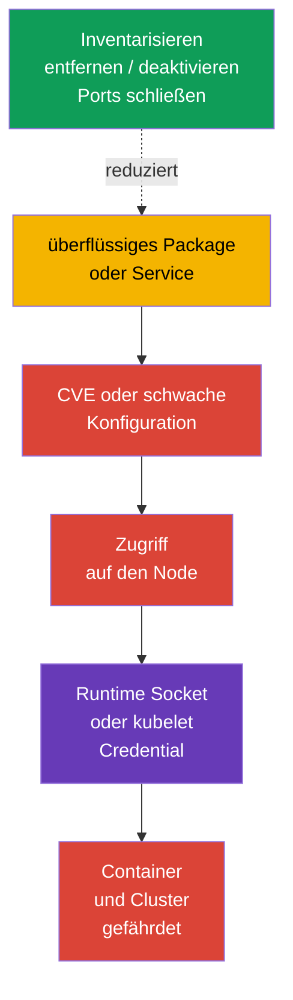
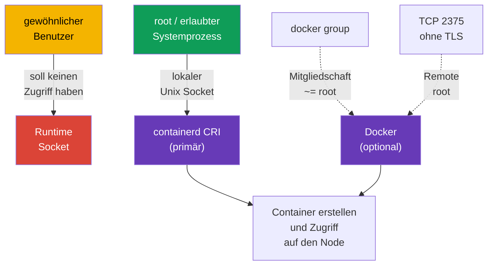

[Русская версия](ru.md) · [Eng version](README.md) · [Versión en español](es.md) · [Version française](fr.md) · [ქართული ვერსია](ge.md) · [繁體中文版](tw.md) · [日本語版](jp.md)

# Kapitel 14. Minimierung des Footprints des Host-Betriebssystems und Sicherheit des Runtime-Daemon

> **Das Problem.** Ein überflüssiges Package, ein Service, Listener oder Socket auf einem Kubernetes-Node fügt ein separates Binary mit CVE und einen lokalen oder Netzwerk-Einstiegspunkt hinzu. Die Kompromittierung einer solchen Komponente kann zu kubelet Credentials oder dem Socket der container runtime führen, die Einschränkungen der Kubernetes API umgehen und alle Workloads auf dem Node gefährden.

> **Was kommt als Nächstes.** Kubernetes beschränkt Workloads über Policies, RBAC und SecurityContext - also das, was ein Workload mit der API und dem Node tun kann -, aber all dies steht auf einem Linux-Node. Ein überflüssiger Service, ein Package, ein offener Port oder Zugriff auf einen Runtime Socket bietet einem Angreifer einen Weg an der Kubernetes API vorbei. In diesem Abschnitt der CKS-Domain **System Hardening** verringern wir die Angriffsfläche des Node selbst: Wir behalten nur benötigte Services, Packages und Netzwerkpunkte und geben die moderne CRI runtime containerd nur denjenigen, die sie tatsächlich benötigen.

> **Was Sie aus CKA benötigen.** Die Arbeit mit `systemd`, Prozessen, Dateien und dem Journal wird in [CKA-Kapitel 0.5](../../../cka/course/00-5-linux/de.md) behandelt. Docker, containerd, cgroups und der cgroup Driver werden in [CKA-Kapitel 0.4](../../../cka/course/00-4-containers/de.md) erklärt. Die Rolle von CRI und die Verbindung von kubelet mit containerd finden Sie in [CKA-Kapitel 40](../../../cka/course/40/de.md). Hier wiederholen wir nicht die Funktionsweise der runtime, sondern begrenzen deren Zugriff und Angriffsfläche.

## 14.1. Angriffsszenario: Eine überflüssige Komponente wird zum Einstiegspunkt

Ein Kubernetes-Node ist kein universeller Server für alle Aufgaben. Beispielsweise benötigt ein Worker üblicherweise keine grafische Umgebung, keinen Druck, kein Bluetooth, keine Dateifreigabe und keinen Docker Daemon, wenn kubelet mit containerd arbeitet. Jede installierte und insbesondere jede laufende Komponente fügt Folgendes hinzu:

- Binaries und Abhängigkeiten mit CVE;
- einen Prozess mit Rechten und Konfiguration;
- einen lauschenden Port oder lokalen Socket;
- Logs, Accounts, Unit-Dateien und einen Weg für Fehlkonfigurationen.



Dies ist kein Aufruf, alles wahllos zu entfernen. `kubelet`, containerd, CNI, SSH für abgestimmte Administration und Control-Plane-Komponenten auf dem entsprechenden Node können benötigt werden. Ziel ist eine explizite Liste: **Komponente -> Verantwortlicher -> Zweck -> Port/Socket**. Fehlen Zweck und Verantwortlicher, wird die Komponente nach Prüfung von Abhängigkeiten und Rollback-Plan entfernt oder deaktiviert.

Dokumentieren Sie vor einer Änderung den Ausgangszustand. Deaktivieren Sie auf der Control Plane nicht `kubelet`, containerd, etcd oder Kubernetes-Komponenten in einer SSH-Sitzung, von der der Zugriff abhängt: Ein Fehler kann Node und API unerreichbar machen.

```bash
set -euo pipefail
sudo install -d -m 700 /root/hardening-before
sudo systemctl list-unit-files --type=service | sort \
  | sudo tee /root/hardening-before/services-enabled.txt >/dev/null
sudo systemctl list-units --type=service --state=running | sort \
  | sudo tee /root/hardening-before/services-running.txt >/dev/null
sudo ss -tulpn | sort | sudo tee /root/hardening-before/listeners.txt >/dev/null
if command -v dpkg-query >/dev/null; then
  sudo dpkg-query -W -f='${binary:Package}\t${Version}\n' | LC_ALL=C sort \
    | sudo tee /root/hardening-before/packages.txt >/dev/null
elif command -v rpm >/dev/null; then
  sudo rpm -qa | LC_ALL=C sort \
    | sudo tee /root/hardening-before/packages.txt >/dev/null
else
  echo 'REVIEW_REQUIRED: unsupported package manager; cannot create package inventory' >&2
  exit 2
fi
```

> 🧠 Die Kompromittierung eines Node kann mit einem überflüssigen Prozess, Package, Listener oder Socket beginnen; pflegen Sie eine Karte von Komponente, Verantwortlichem, Zweck und zulässigem Zugriff.

> 🎯 Inventarisieren Sie Service, Package, Kernel-Modul und Listener; ändern Sie nur das nicht benötigte Objekt, bewahren Sie eine Baseline und prüfen Sie `kubelet`/containerd. `disable --now`, Removal und das Schließen eines Ports erfordern unterschiedliche Prüfungen.

## 14.2. Inventarisierung und Deaktivierung nicht benötigter Services

Unterscheiden Sie zuerst drei Zustände. `systemctl list-units` zeigt geladene Units, `is-active`, ob ein Prozess jetzt läuft, und `is-enabled`, ob er beim Booten startet. Eine deaktivierte Unit kann bis zum expliziten Anhalten noch aktiv sein.

```bash
# Laufende Service Units und ihr Zustand.
sudo systemctl list-units --type=service --state=running

# Alle installierten Service Units, auch deaktivierte.
sudo systemctl list-unit-files --type=service

# Woher ein bestimmter Service stammt und wodurch er gestartet wird.
SERVICE='service-to-review.service'
sudo systemctl status "$SERVICE"
sudo systemctl cat "$SERVICE"
sudo systemctl show "$SERVICE" -p FragmentPath -p ExecStart -p User
sudo journalctl -u "$SERVICE" --since '24 hours ago'
```

Eine Entscheidungstabelle vor jedem Befehl ist nützlich:

| Befund | Frage vor der Aktion | Normale Entscheidung |
|---|---|---|
| `kubelet.service` | Gehört der Node zum Cluster? | behalten; nur bewusst korrigieren |
| `containerd.service` | Ist dies der CRI Endpoint von kubelet? | auf einem Kubernetes-Node behalten |
| `docker.service`/`docker.socket` | Benötigt dieser Node Docker? | entfernen/deaktivieren, wenn CRI containerd ist und Docker nicht benötigt wird |
| `sshd.service` | Gibt es einen abgestimmten Bastion-/Console-Zugang? | mit dem Hardening aus Kapitel 15 behalten oder nur bei alternativem Zugang deaktivieren |
| `cups`, `avahi-daemon`, Bluetooth, GUI-Service | Gibt es einen dokumentierten Serverzweck? | üblicherweise entfernen oder deaktivieren |
| unbekannter Service | Wer ist verantwortlich, welches Package und welcher Port? | untersuchen, nicht raten |

Für eine bekannte nicht benötigte Unit besteht die sichere Grundoperation darin, sie jetzt anzuhalten und ihren Autostart zu verbieten. Der Befehl ist umkehrbar: `enable --now` stellt den Service bei Bedarf wieder her.

```bash
# Beispiel erst, nachdem bestätigt wurde, dass der Service auf diesem Node nicht benötigt wird.
sudo systemctl disable --now avahi-daemon.service

# Beide Zustände prüfen.
sudo systemctl is-active avahi-daemon.service || true
sudo systemctl is-enabled avahi-daemon.service || true
```

`mask` ist stärker als `disable`: Es verhindert den manuellen und abhängigen Start einer Unit, indem es auf `/dev/null` verweist. Verwenden Sie es für einen Service, der im Node-Image sicher nicht erscheinen darf, und dokumentieren Sie die Ausnahme in Image Build/IaC. Maskieren Sie keine Kubernetes-Abhängigkeit, ohne die Folgen zu verstehen.

```bash
UNIT='confirmed-unwanted.service'

# Den Ausgangszustand vor der Änderung speichern.
sudo systemctl is-active "$UNIT" \
  > "/root/hardening-before/${UNIT}.active" 2>&1 || true
sudo systemctl is-enabled "$UNIT" \
  > "/root/hardening-before/${UNIT}.enabled" 2>&1 || true

# Maskieren und die bereits laufende Unit anhalten.
sudo systemctl mask --now "$UNIT"

# Beide Zustände belegen.
sudo systemctl is-active "$UNIT" || true
sudo systemctl is-enabled "$UNIT" || true
```

Ohne `--now` blockiert `mask` nur zukünftige manuelle und abhängige Starts: Ein bereits laufender Service läuft weiter. Führen Sie für ein Rollback zuerst `systemctl unmask <unit>` aus und stellen Sie dann genau den vor der Änderung gespeicherten Zustand active/enabled wieder her. Führen Sie `enable --now` nicht automatisch aus, wenn die Unit vor dem Hardening nicht enabled und active war.

## 14.3. Überflüssige Packages und ein minimales Betriebssystem-Image

Das Anhalten eines Service genügt nicht: Das Package, seine Libraries, Timer/Socket-Units und zukünftige CVE bleiben auf dem Node. Inventarisieren Sie Packages, bestimmen Sie, welches Package ein Binary bereitgestellt hat, und prüfen Sie Reverse Dependencies. Auf Debian/Ubuntu:

```bash
PACKAGE='package-to-review'
BINARY='binary-to-review'
apt list --installed 2>/dev/null | less
apt-cache policy "$PACKAGE"
dpkg -S "$(command -v "$BINARY")"
apt-cache rdepends --installed "$PACKAGE"

# Manuell installierte Packages ausgeben: Ausgangspunkt für das Image-Review.
apt-mark showmanual | sort
```

Entfernen Sie nach dem Review genau das bestätigte Package. `apt purge` entfernt auch dessen Konfiguration; lesen Sie vor `autoremove` zuerst die Liste, denn sie kann eine benötigte Library oder ein Diagnosetool enthalten.

```bash
PACKAGE='confirmed-unneeded-package'
sudo apt purge "$PACKAGE"
sudo apt autoremove --dry-run
# autoremove erst nach Review seiner Liste ausführen.
sudo apt autoremove
# Ein umfassendes apt upgrade wird hier absichtlich nicht ausgeführt: Patching erfolgt in einem separaten Change Window.
```

Auf RPM-Systemen sind `rpm -qa`, `dnf repoquery --installed` und `dnf remove` die Entsprechungen. Vermischen Sie System Hardening nicht mit einem unkontrollierten umfassenden Update: Aktualisierungen, Image-Version und Rollback müssen über den normalen Betriebsprozess erfolgen.

Ein **minimales Betriebssystem-Image** ist der manuellen Bereinigung jedes bereits laufenden Node vorzuziehen. Im Node-Image/in der Node-Konfiguration werden die benötigten Packages und Services deklariert, Desktop, Compiler, Test-Utilities und nicht benötigte Agents ausgeschlossen und das Image anschließend regelmäßig mit Patches neu erstellt. Minimalität bedeutet nicht das Fehlen von Wiederherstellungsmitteln: Ein abgestimmter Weg für Zugriff, Logging und Diagnose muss verbleiben.

> 🏭 **Production.** Ein spezialisiertes Kubernetes-Betriebssystem - beispielsweise [Bottlerocket](https://bottlerocket.dev/) - kann den veränderbaren Host Footprint durch ein absichtlich minimales Immutable Image und einen verwalteten Update Workflow verringern. Dies ist eine Architekturentscheidung: Prüfen Sie vor einem Production Rollout in Stage die Unterstützung der Kubernetes-Zielversion, CNI/CSI, Bootstrap, Observability, Debug-Zugang und Rollback. Übertragen Sie nicht ohne offizielle Dokumentation die Befehle `apt`/`dpkg` oder Pfade einer gewöhnlichen Linux-Distribution auf ein solches Betriebssystem.

| Ansatz | Vorteil | Risiko und Control |
|---|---|---|
| Package auf einem laufenden Node entfernen | entfernt eine bekannte Angriffsfläche schnell | Drift zwischen Nodes; in IaC/Image dokumentieren |
| Golden Image mit Allowlist für Packages | einheitlicher, auditierbarer Zustand | Prozess für Neubau und Aktualisierung erforderlich |
| Immutable/minimales Betriebssystem | weniger Packages und Änderungen zur Laufzeit | Debug und Aktualisierung im Voraus vorsehen |
| "Alles Unbekannte entfernen" | nein | kann kubelet, CNI, Storage, Monitoring oder Zugang beeinträchtigen |

## 14.4. Kernel-Module: Inventarisierung und kontrollierte Deaktivierung

Ein Kernel-Modul ist Teil der Angriffsfläche, aber kein "überflüssiges Package", das ohne Folgen entfernt werden kann. Erfassen Sie zuerst geladene Module, deren Parameter und Laderegeln; prüfen Sie den Zweck eines Moduls mit dem Verantwortlichen des Image und in der Betriebssystemdokumentation.

```bash
MODULE='example_module'
lsmod | sort
sudo modinfo "$MODULE"
# `modprobe -c` ist die Quelle der Wahrheit für die effektive Konfiguration.
EFFECTIVE_MODPROBE_CONFIG=$(sudo modprobe -c) || {
  echo 'ERROR: cannot read effective modprobe configuration' >&2
  exit 2
}
printf '%s\n' "$EFFECTIVE_MODPROBE_CONFIG" \
  | grep -E "^(blacklist|install)[[:space:]]+${MODULE}\b" || true
sudo modprobe -n -v "$MODULE"
# Diese Dateien dienen nur dazu, die Quelle einer Regel zu finden; sie können überschrieben sein.
sudo find /etc/modprobe.d /run/modprobe.d /usr/local/lib/modprobe.d \
  /usr/lib/modprobe.d /lib/modprobe.d -type f -print 2>/dev/null | sort
sudo grep -RnsE "^(blacklist|install)[[:space:]]+${MODULE}\b" \
  /etc/modprobe.d /run/modprobe.d /usr/local/lib/modprobe.d /usr/lib/modprobe.d /lib/modprobe.d \
  2>/dev/null || true
```

`modprobe -c` zeigt die finalen Regeln unter Berücksichtigung von Precedence; file-level `find`/`grep` wird nur benötigt, um die Quelle einer gesehenen Regel zu finden, und kann überschriebenen Einträge zeigen. Für ein bestimmtes Modul zeigt `modprobe -n -v` die tatsächliche Aktion, die `modprobe` anwenden wird.

`modprobe -r <module>` entlädt ein Modul **nur vorübergehend**: Es übersteht keinen Reboot und schlägt fehl, wenn das Modul verwendet oder durch eine Abhängigkeit gehalten wird. Das dauerhafte Verbot wird in verwalteter `modprobe`-Konfiguration festgelegt; `blacklist` verhindert gewöhnliches Autoloading, während `install ... /bin/false` auch einen expliziten `modprobe` über diese Regel blockiert. Wenden Sie beide Mechanismen nur zusammen an, nachdem geprüft wurde, dass das Modul wirklich nicht benötigt wird.

```bash
MODULE='example_module'
# Im Change Window: vorübergehende Prüfung; versuchen Sie nicht, ein verwendetes Modul zwangsweise zu entladen.
sudo modprobe -r "$MODULE"

# Dauerhafte Regel in Image/IaC, nicht als manueller Node-Drift.
sudo tee "/etc/modprobe.d/disable-${MODULE}.conf" >/dev/null <<EOF
blacklist $MODULE
install $MODULE /bin/false
EOF

# Für Debian/Ubuntu initramfs aktualisieren, wenn das Modul beim frühen Booten vorhanden sein kann.
sudo update-initramfs -u
sudo modprobe -n -v "$MODULE"       # Regel install /bin/false wird erwartet
```

Prüfen Sie nach einem geplanten Reboot `lsmod`, `modprobe -n -v` und die Node Health. Module können für CNI, Storage Driver, runtime oder Netzwerk-/Festplattenhardware erforderlich sein. Testen Sie zuerst auf einem drained/staging Node und führen Sie dann ein Node-für-Node-Rollout mit Prüfung von `kubelet`, containerd, CNI und Workload aus; wenden Sie die Blacklist nicht gleichzeitig auf den gesamten Pool an.

## 14.5. Offene Ports: Listener, Zweck und Netzwerkperimeter

Nicht der Port selbst ist gefährlich, sondern ein unbekannter Service oder ein Service, der für die falschen Quellen erreichbar ist. Ordnen Sie zuerst "Listener - PID - Unit - benötigte Quellen" zu und beschränken Sie dann Service und Firewall. `ss` ist üblicherweise auf aktuellem Linux verfügbar; `lsof` und `netstat` sind als Alternativen nützlich.

```bash
# TCP- und UDP-Listener mit Prozess und PID (für vollständige Informationen wird root benötigt).
sudo ss -tulpn
sudo lsof -nP -iTCP -sTCP:LISTEN
sudo netstat -tulpn                    # wenn das Package net-tools installiert ist

# Unix Sockets der runtime - in der TCP/UDP-Ausgabe nicht sichtbar.
sudo ss -lxnp | grep -E 'docker|containerd' || true
```

| Punkt | Wo üblicherweise benötigt | Sichere Richtung |
|---|---|---|
| SSH `22/tcp` | verwalteter Zugriff auf den Node | nur Bastion/VPN/administrative CIDR |
| kubelet `10250/tcp` | Control Plane und abgestimmte Diagnose | nicht für das Internet öffnen; TLS, authn/authz und Firewall |
| kube-apiserver `6443/tcp` | Control Plane; Worker und Administratoren gemäß Architektur | Allowlist/private Endpoint, nicht `0.0.0.0/0` |
| etcd `2379`, `2380/tcp` | nur Control Plane/etcd Peers | nicht auf Worker oder im externen Netzwerk veröffentlichen |
| Docker TCP API (häufig `2375`/`2376`) | nur bei begründetem Remote Management | `2375` nicht lauschen lassen; jeder TCP Endpoint erfordert eine explizite Ausnahme, mTLS und eine genaue Firewall |

| containerd/NRI Unix Socket | lokal auf dem Node | `root` und minimale Menge erlaubter System-Consumer |

Schließen Sie nicht vom Port auf den Prozess: Beispielsweise wird `6443` auf der Control Plane erwartet, kann auf einem Worker jedoch ein Fehler sein; `10250` benötigt kubelet, darf aber nicht öffentlich sein. Der Netzwerkfilter ergänzt die Deaktivierung eines nicht benötigten Service, ersetzt sie aber nicht. Die detaillierte Einschränkung externen Zugriffs und von SSH wird in Kapitel 15 behandelt.

```bash
SERVICE='service-owning-the-listener.service'
PORT='10250'
# Zuerst den konkreten Listener und seine Unit prüfen.
sudo ss -lntp | grep -E ':(22|10250|6443|2379|2380|2375|2376)\b' || true
sudo systemctl status "$SERVICE"

# Nach dem Entfernen/Deaktivieren des Service muss der Port verschwinden. Ein ss-Fehler bedeutet nicht, dass kein Listener vorhanden ist.
listeners=$(sudo ss -H -lnt "( sport = :${PORT} )") || {
  echo "ERROR: cannot inspect TCP listener ${PORT}" >&2; exit 2;
}
if [ -n "$listeners" ]; then
  printf 'ERROR: TCP port %s is still listening:\n%s\n' "$PORT" "$listeners" >&2
  exit 1
fi
echo "OK: TCP listener ${PORT} is absent"
```

> 🎯 Inventarisieren Sie Service, Package, Kernel-Modul und Listener; ändern Sie nur das nicht benötigte Objekt, bewahren Sie eine Baseline und prüfen Sie `kubelet`/containerd. `disable --now`, Removal und das Schließen eines Ports erfordern unterschiedliche Prüfungen.

## 14.6. Sicherheit von containerd und optionalem Docker

Auf einem aktuellen Kubernetes-Node ist containerd die primäre CRI runtime; Docker Daemon und sein Socket gehören nicht zur CRI Baseline und werden nur für eine separate bestätigte Aufgabe benötigt. Ein Runtime Daemon hat mehr Rechte als ein gewöhnlicher Container. Ein Client, der containerd, NRI oder die Docker API erreichen kann, kann häufig einen privilegierten Container starten, das Host Filesystem mounten oder Node Credentials erhalten. Ein Unix Socket ist daher eine Zugriffsgrenze, nicht ein harmloses Implementierungsdetail.

> 🎯 Zugriff auf den containerd CRI Socket erhalten nur `root` und minimale systemische Consumer, ohne world-writable Mode und ohne Mount in einen unprivilegierten Workload.



> 🔬 Docker gilt nur für einen Docker Host; NRI/Debug/Metrics benötigen eine versions- und runtime-spezifische Prüfung.

### Docker: keine unauthentifizierte TCP API

`dockerd -H tcp://0.0.0.0:2375` öffnet die Docker API für alle, die den Port erreichen können. Auf `2375` gibt es weder TLS noch Authentifizierung: Das entspricht praktisch Remote Root. Es darf weder in `ExecStart` einer systemd Unit noch in einem Drop-in oder `/etc/docker/daemon.json` vorhanden sein. Versuchen Sie nicht, `2375` nur mit einer Firewall zu "schützen": Ein Fehler in der Regel macht die API wieder erreichbar.

```bash
set -euo pipefail
# Dieses Gate prüft unabhängig die effektive Konfiguration und tatsächliche Listener.
# false ist die sichere Baseline; true ist nur für eine dokumentierte Risikoausnahme zulässig.
ALLOW_REMOTE_DOCKER_API=false
declare -a TCP_CONFIGURATION_SOURCES=()
USES_SOCKET_ACTIVATION=false

add_tcp_source() {
  TCP_CONFIGURATION_SOURCES+=("$1")
}

# Normalisierte Docker -H/--host-Werte klassifizieren. Unix und fd sind nicht TCP;
# host:, host:port, :port, numerischer Port und tcp:// sind TCP-Formen.
classify_docker_host() {
  local source=$1 host=$2
  case "$host" in
    unix://*|/*|@*) ;;
    fd://*) USES_SOCKET_ACTIVATION=true ;;
    tcp://*|*:*|[0-9]*) add_tcp_source "$source: $host" ;;
    *)
      printf 'REVIEW_REQUIRED: cannot classify Docker host value from %s: %s\n' "$source" "$host" >&2
      exit 2
      ;;
  esac
}

# Effektive systemd-Service-Konfiguration plus argv eines aktiven Daemon.
DOCKER_SERVICE_EXEC=$(sudo systemctl show docker.service -p ExecStart --value 2>/dev/null || true)
DOCKER_PID=$(pgrep -xo dockerd || true)
DOCKER_CMDLINE=''
if [ -n "$DOCKER_PID" ]; then
  DOCKER_CMDLINE=$(sudo cat "/proc/$DOCKER_PID/cmdline" | tr '\0' '\n') || {
    echo 'ERROR: cannot read dockerd argv' >&2
    exit 2
  }
fi

# Alle -H/--host-Formen im effektiven ExecStart einschließlich -H=<value> parsen.
mapfile -t EXEC_HOST_DIRECTIVES < <(
  printf '%s\n' "$DOCKER_SERVICE_EXEC"     | grep -Eo -- '(-H|--host)(=|[[:space:]]+)[^[:space:]]+' || true
)
for directive in "${EXEC_HOST_DIRECTIVES[@]}"; do
  case "$directive" in
    -H=*) host=${directive#-H=} ;;
    --host=*) host=${directive#--host=} ;;
    -H\ *) host=${directive#-H } ;;
    --host\ *) host=${directive#--host } ;;
    *)
      printf 'REVIEW_REQUIRED: cannot normalize ExecStart host directive: %s\n' "$directive" >&2
      exit 2
      ;;
  esac
  classify_docker_host 'docker.service ExecStart' "$host"
done

# argv ist NUL-separiert, daher die Einzelwerte ohne Quote-Mehrdeutigkeit parsen.
mapfile -t DOCKER_ARGV <<< "$DOCKER_CMDLINE"
for ((i = 0; i < ${#DOCKER_ARGV[@]}; i++)); do
  case "${DOCKER_ARGV[i]}" in
    -H|--host)
      ((++i < ${#DOCKER_ARGV[@]})) || {
        echo 'REVIEW_REQUIRED: dockerd host flag has no value' >&2
        exit 2
      }
      classify_docker_host 'dockerd argv' "${DOCKER_ARGV[i]}"
      ;;
    -H=*) classify_docker_host 'dockerd argv' "${DOCKER_ARGV[i]#-H=}" ;;
    --host=*) classify_docker_host 'dockerd argv' "${DOCKER_ARGV[i]#--host=}" ;;
  esac
done

# Ein benutzerdefinierter Config-Pfad kann nicht sicher aus grep-Ausgabe abgeleitet werden; explizites Review verlangen.
if printf '%s\n' "$DOCKER_SERVICE_EXEC" "$DOCKER_CMDLINE"   | grep -Eq -- '--config-file(=|[[:space:]])'; then
  echo 'REVIEW_REQUIRED: dockerd uses --config-file; parse that effective config before allowing Docker TCP API' >&2
  exit 2
fi

# Hosts in der Standardkonfiguration parsen. Ohne jq erfordert ein hosts-Schlüssel Review, nicht PASS.
if sudo test -f /etc/docker/daemon.json && sudo grep -qE '"hosts"[[:space:]]*:' /etc/docker/daemon.json; then
  command -v jq >/dev/null || {
    echo 'REVIEW_REQUIRED: jq is required to parse daemon.json hosts safely' >&2
    exit 2
  }
  DOCKER_CONFIG_HOSTS=$(sudo jq -er '
    if .hosts? == null then empty
    elif (.hosts | type) == "array" and all(.hosts[]; type == "string") then .hosts[]
    else error("daemon.json hosts must be an array of strings") end
  ' /etc/docker/daemon.json) || {
    echo 'REVIEW_REQUIRED: cannot parse daemon.json hosts' >&2
    exit 2
  }
  while IFS= read -r host; do
    [ -z "$host" ] || classify_docker_host 'daemon.json hosts' "$host"
  done <<< "$DOCKER_CONFIG_HOSTS"
fi

# `Listen` ist die effektive Socket-Eigenschaft von systemd. Eine fehlende Unit von einer
# Unit unterscheiden, deren effektive Konfiguration nicht gelesen werden kann; Letzteres nie zu PASS machen.
DOCKER_SOCKET_LOAD_STATE=$(sudo systemctl show docker.socket -p LoadState --value 2>/dev/null) || {
  echo 'REVIEW_REQUIRED: cannot determine whether docker.socket exists' >&2
  exit 2
}
case "$DOCKER_SOCKET_LOAD_STATE" in
  not-found) DOCKER_SOCKET_PRESENT=false ;;
  '')
    echo 'REVIEW_REQUIRED: empty docker.socket LoadState' >&2
    exit 2
    ;;
  *) DOCKER_SOCKET_PRESENT=true ;;
esac
if [ "$DOCKER_SOCKET_PRESENT" = true ]; then
  DOCKER_SOCKET_LISTEN=$(sudo systemctl show docker.socket -p Listen --value) || {
    echo 'REVIEW_REQUIRED: cannot read effective docker.socket Listen configuration' >&2
    exit 2
  }
  [ -n "$DOCKER_SOCKET_LISTEN" ] || {
    echo 'REVIEW_REQUIRED: docker.socket has no effective Listen entries' >&2
    exit 2
  }
  while IFS= read -r listen_entry; do
    listen_entry=${listen_entry#"${listen_entry%%[![:space:]]*}"}
    [ -z "$listen_entry" ] && continue
    case "$listen_entry" in
      *' (Stream)') socket_address=${listen_entry% (Stream)} ;;
      *)
        printf 'REVIEW_REQUIRED: cannot classify non-stream docker.socket Listen entry: %s\n' "$listen_entry" >&2
        exit 2
        ;;
    esac
    case "$socket_address" in
      /*|@*) ;;  # Filesystem- und abstrakte Unix Sockets
      *:*) add_tcp_source "docker.socket Listen: $socket_address" ;;
      *)
        if [[ "$socket_address" =~ ^[0-9]+$ ]]; then
          add_tcp_source "docker.socket Listen: $socket_address"
        else
          printf 'REVIEW_REQUIRED: cannot classify docker.socket Listen address: %s\n' "$socket_address" >&2
          exit 2
        fi
        ;;
    esac
  done <<< "$DOCKER_SOCKET_LISTEN"
elif [ "$USES_SOCKET_ACTIVATION" = true ]; then
  echo 'REVIEW_REQUIRED: dockerd uses fd:// but docker.socket is absent' >&2
  exit 2
fi

# Aktuelle Listener sind separate Evidence. dockerd überall in den Prozessmetadaten abgleichen, nicht nur als Erstes.
listeners_2375=$(sudo ss -H -lnt '( sport = :2375 )') || {
  echo 'ERROR: cannot inspect TCP 2375' >&2
  exit 2
}
dockerd_tcp_listeners=$(sudo ss -H -lntp | awk 'index($0, "\"dockerd\"")') || {
  echo 'ERROR: cannot inspect dockerd TCP listeners' >&2
  exit 2
}

TCP_EVIDENCE=$(printf '%s\n%s\n' "${TCP_CONFIGURATION_SOURCES[*]-}" "$dockerd_tcp_listeners")
if [ -n "$listeners_2375" ] || [ -n "${TCP_CONFIGURATION_SOURCES[*]-}" ] || [ -n "$dockerd_tcp_listeners" ]; then
  printf 'Docker TCP configuration/listener evidence:\n%s\n' "$TCP_EVIDENCE" >&2
  if printf '%s\n%s\n' "$listeners_2375" "$TCP_EVIDENCE"     | grep -Eq '(^|[^0-9])2375([^0-9]|$)'; then
    echo 'ERROR: Docker TCP 2375 is configured or listening' >&2
    exit 1
  fi
  if [ "$ALLOW_REMOTE_DOCKER_API" != true ]; then
    echo 'ERROR: unexpected Docker TCP endpoint is configured or listening' >&2
    exit 1
  fi
  echo 'REVIEW_REQUIRED: every allowed endpoint needs effective tlsverify=true, CA, server certificate/key, verified client-certificate authentication and firewall/security-group allowlist.' >&2
  exit 2
fi
echo 'OK: no Docker TCP endpoint is configured or listening'
```

Bei einer typischen systemd-Installation erhält Docker `-H fd://`: `docker.socket` erstellt üblicherweise einen lokalen Unix Socket. Nehmen Sie dies nicht ohne Prüfung an: Die effektive systemd-Eigenschaft `Listen` kann einen TCP Listener festlegen, der bereits vor dem Start von `dockerd` vorhanden ist. Das Gate oben parst nur `Stream`-Einträge: Pfad `/…` und abstrakter Unix Socket `@…` bleiben Unix, während Port, `host:port` und `[IPv6]:port` als TCP gelten. Fügen Sie nicht zugleich `hosts` in `daemon.json` und `-H` in der Unit hinzu: Docker beendet sich bei kollidierenden Einstellungen. Entfernen Sie nur den TCP Endpoint aus der aktiven Quelle, prüfen Sie dann die Konfiguration und starten Sie jeweils nur einen Service neu.

```bash
# Für daemon.json zuerst Syntax und unterstützte Schlüssel prüfen.
sudo dockerd --validate --config-file=/etc/docker/daemon.json
sudo systemctl daemon-reload
sudo systemctl restart docker.service
sudo systemctl --no-pager --full status docker.service
sudo journalctl -u docker.service -n 50 --no-pager
```

Ist die Remote Docker API tatsächlich eine abgestimmte Anforderung, beweist die Portnummer weder TLS noch mTLS: Auch `2376` ist kein Nachweis. Bestätigen Sie für **jeden** erlaubten TCP Endpoint effektives `tlsverify=true`, CA, Server-Zertifikat und Schlüssel sowie tatsächliche Client-Zertifikatsauthentifizierung; begrenzen Sie Quellen über Firewall/Security Group und ein dediziertes Management-Netzwerk. Dies ist eine Ausnahme mit einem Risikoverantwortlichen, nicht der Standard für einen Kubernetes-Node.

### containerd, NRI und Dateigrenzen der runtime

Der primäre CRI Socket befindet sich gewöhnlich unter `/run/containerd/containerd.sock`; der Pfad des NRI Socket ist konfigurierbar und lautet häufig `/run/nri/nri.sock` (entspricht `/var/run/nri/nri.sock`). Zugriff auf **jeden** von beiden ist root-equivalent. Überlassen Sie ihn nur `root` und der minimalen Menge systemischer Prozesse. Wenn für den Betrieb eine Gruppe nötig ist, muss es eine dedizierte Systemgruppe ohne gewöhnliche Benutzer sein; fügen Sie keine Entwickler, CI-Accounts oder Workload Identities hinzu. Mounten Sie `containerd.sock` oder `nri.sock` niemals in einen unprivilegierten Container.

Es gibt kein universelles `chmod` für Docker- oder containerd-Sockets: Pfad, Owner, Gruppe und Mode werden von Package, systemd Unit und der Policy des jeweiligen Node bestimmt. Verwenden Sie keine world-writable Modes und beheben Sie Berechtigungen nicht mit einem einmaligen Befehl, wenn systemd den Socket neu erstellt. Bestimmen Sie zuerst den Verantwortlichen für die Konfiguration, legen Sie dann den minimal nötigen Zugriff über die unterstützte Konfiguration des Image/IaC fest und prüfen Sie ihn nach einem Neustart.

```bash
sudo systemctl status containerd.service --no-pager
sudo systemctl cat containerd.service
sudo stat -Lc '%A %a %U:%G %n' /run/containerd/containerd.sock \
  /run/nri/nri.sock 2>/dev/null || true
sudo ss -lxnp | grep -E 'containerd\.sock|nri\.sock' || true

# CRI-Diagnose erfolgt lokal und als root; Endpoint mit kubelet Config abgleichen.
sudo crictl --runtime-endpoint unix:///run/containerd/containerd.sock ps
sudo grep -Rns -- '--container-runtime-endpoint\|containerRuntimeEndpoint' \
  /var/lib/kubelet /etc/systemd/system /usr/lib/systemd/system 2>/dev/null || true
```

Schützen Sie nicht nur den Socket. `/run/containerd` enthält Runtime-Zustand und Sockets, während `/var/lib/containerd` persistenten Content und Metadata enthält. Für containerd sind `0700` für `/var/lib/containerd` und `0711` für das Wurzelverzeichnis `/run/containerd` eine Orientierung: Der zweite Mode erlaubt Traversal, das für User-Namespaced Workloads erforderlich sein kann, legt aber den Inhalt des Verzeichnisses nicht offen. Sensible Unterverzeichnisse müssen `0700`, Sockets `0660` mit einer Systemgruppe ohne unprivilegierte Benutzer sein; kein Pfad darf für gewöhnliche Benutzer oder Container writable sein. Konfiguration, Plugins und CNI müssen ebenfalls root-owned und gegen Schreibzugriff nicht autorisierter Subjects geschützt sein: üblicherweise `/etc/containerd`, Verzeichnisse der Runtime Plugins und `/etc/cni/net.d`, während CNI Binaries unter `/opt/cni/bin` liegen (gleichen Sie die konkreten Pfade mit Distribution und Config ab). Ändern Sie sie nicht mit einem breiten `chmod -R`: Prüfen Sie Owner und Writable-Bits gezielt.

```bash
sudo find /run/containerd /var/lib/containerd /etc/containerd /etc/cni/net.d /opt/cni/bin \
  -xdev -printf '%m %u:%g %p\n' 2>/dev/null | sort
```

In containerd 2.0 ist NRI standardmäßig aktiviert. Dies ist ein klarer Entscheidungspunkt: Wird NRI nicht verwendet, deaktivieren Sie das Plugin in der geprüften Konfiguration (`[plugins."io.containerd.nri.v1.nri"]` und `disable = true`); wird es verwendet, behandeln Sie NRI Plugins, ihre Konfiguration und externe Plugin-Verbindungen als Teil der Runtime TCB und beschränken Sie deren Pfade und Zugriff.

Debug und Metrics sind separate API-Angriffsflächen. Beschränken Sie einen Unix Debug Socket auf `root` und erlaubte systemische Consumer; einen TCP Debug Endpoint veröffentlichen Sie niemals. Metrics von containerd besitzen häufig weder TLS noch Authentifizierung: Binden Sie sie nur an Loopback oder ein dediziertes Management Interface und beschränken Sie Firewall/Routing zusätzlich. Gleichen Sie vor einer Änderung die unterstützten Optionen mit genau Ihrer containerd-Version ab und prüfen Sie Listener nach dem Neustart mit `ss`.

### Docker: nur wenn er tatsächlich benötigt wird

Wird Docker für eine separate Aufgabe behalten, sind sein Socket und die Gruppe `docker` ebenfalls root-equivalent. Erteilen Sie gewöhnlichen Benutzern keine Mitgliedschaft, mounten Sie den Socket nicht in einen unprivilegierten Workload und nehmen Sie nicht einheitliche Owner/Modes für alle Installationen an: Folgen Sie der Unit/Package-Policy und prüfen Sie Zugriff im Namen eines nicht berechtigten Accounts.

```bash
readlink -f /var/run/docker.sock 2>/dev/null || true
sudo stat -Lc '%A %a %U:%G %n' /var/run/docker.sock 2>/dev/null || true
getent group docker || true
getent group docker | awk -F: '{print $4}'
UNPRIVILEGED_USER='unprivileged-user'
sudo -u "$UNPRIVILEGED_USER" docker ps  # Für einen nicht berechtigten Benutzer wird eine Ablehnung erwartet
```

Wird Docker auf dem Kubernetes-Node nicht benötigt, ist es zuverlässiger, das Package zu entfernen oder `docker.service` und `docker.socket` zu deaktivieren und zu maskieren, nachdem geprüft wurde, dass kubelet oder Betriebsaufgaben nicht davon abhängen.

### Hardening von `/etc/docker/daemon.json`

`daemon.json` ist eine der Docker-Konfigurationsquellen. Es ersetzt weder Firewall noch Socket-Berechtigungen, SecurityContext oder Kubernetes-Policies, stellt aber eine sichere Daemon Baseline bereit. Fügen Sie `hosts` nicht hinzu, wenn systemd bereits `-H fd://` übergibt.

#### Neuer Docker Host

Die folgende Baseline gilt für eine **neue** Docker-Installation nach Prüfung von Versionsunterstützung und Kompatibilität mit geplanten Workloads:

```json
{
  "live-restore": true,
  "no-new-privileges": true,
  "userns-remap": "default",
  "log-driver": "local"
}
```

| Schlüssel | Wirkung | Vor der Aktivierung prüfen |
|---|---|---|
| `live-restore` | kann Container bei Nichtverfügbarkeit des Daemon weiterlaufen lassen | Aktualisierungsworkflow, Monitoring und erwartetes Neustartverhalten; keine Garantie für jede Config-/Migration-Änderung |
| `no-new-privileges` | verbietet neuen Containerprozessen die Privilege Escalation über `setuid`/File Capabilities | Anwendungen, die fälschlich Privilege Escalation benötigen; bestehende Container neu erstellen |
| `userns-remap` | mappt Container Root auf einen unprivilegierten Host UID | Volumes, Owner, Images und Kompatibilität; nicht ohne Test auf einem Production Node aktivieren |
| `log-driver: local` | begrenzt das Wachstum von JSON Logs und die Rotation wird vom Driver verwaltet | zentralisierte Log-Sammlung und Retention; bestehende Container migrieren nicht automatisch |

#### Bestehender Docker Host: separate Migration

Wenden Sie dieses JSON nicht als gewöhnliche Änderung mit anschließendem Neustart auf einen bereits laufenden Docker Host an. Erfassen Sie vor dem Change Container/Images/Volumes, prüfen Sie `/etc/subuid` und `/etc/subgid`, Bind Mounts, Host Networking und privilegierte Container, beurteilen Sie die Kompatibilität mit `userns-remap` und bereiten Sie einen Recreate-/Migrations- und Rollback-Plan vor.

```bash
set -euo pipefail
sudo docker ps -a --no-trunc
sudo docker image ls
sudo docker volume ls
sudo docker network ls
sudo grep -Ev '^[[:space:]]*(#|$)' /etc/subuid /etc/subgid 2>/dev/null || true
# Für jeden Workload einzeln: sudo docker inspect <container>; Mounts, Network und Privileges prüfen.
```

`no-new-privileges` als Daemon Standard gilt für neue Container; bestehende müssen neu erstellt werden. Ein Wechsel des `log-driver` migriert bestehende Container nicht automatisch. `userns-remap` ändert Namespace-/Storage-Ansicht und Owner von Docker und erfordert daher eine separate Migration. `live-restore` ist keine bedingungslose Garantie für die Erhaltung von Containern bei jeder Änderung der Daemon-Konfiguration. Für einen Kubernetes-Node mit containerd ist dies keine containerd-Einstellung und kein Ersatz für `runAsNonRoot`; wenden Sie Docker nur auf einem dedizierten Docker Host nach Tests an.

Erstellen Sie `daemon.json` niemals durch `install /dev/null` über einer bestehenden Datei: Bewahren Sie zuerst die aktuelle Konfiguration auf. Erstellen Sie eine neue leere Datei nur, wenn sie nicht existiert.

```bash
sudo install -d -m 0755 /etc/docker

if sudo test -e /etc/docker/daemon.json; then
  # Zuerst die bestehende Konfiguration sichern.
  sudo cp -a /etc/docker/daemon.json /root/hardening-before/daemon.json.before
  sudo chown root:root /etc/docker/daemon.json
  sudo chmod 0600 /etc/docker/daemon.json
else
  # Leere Datei nur erstellen, wenn sie noch nicht vorhanden ist.
  sudo install -m 0600 -o root -g root /dev/null /etc/docker/daemon.json
fi

sudoedit /etc/docker/daemon.json
sudo dockerd --validate --config-file=/etc/docker/daemon.json
sudo systemctl restart docker.service
sudo systemctl --no-pager --full status docker.service
sudo docker info --format '{{json .SecurityOptions}}'
```

> 🎯 Belegen Sie die Minimierung mit Vorher-/Nachher-Diff und negativen Prüfungen: Nicht benötigter Service ist nicht active/enabled, Listener und `2375` fehlen, ein unprivilegierter Benutzer erhält keinen Runtime Access.

## 14.7. Ergebnis prüfen: Einen minimalen Node belegen

Die Prüfung besteht aus Konfigurationsfakt und Zugriffsfakt. Es reicht nicht, die erforderliche Zeile in einer Datei zu sehen: Ein Service könnte die Config nicht erneut eingelesen haben und ein Socket könnte mit der vorherigen Gruppe neu erstellt worden sein. Führen Sie einen Vorher-/Nachher-Diff und einen Test unter dem Benutzer aus, dem der Zugriff entzogen wurde.

```bash
set -euo pipefail
sudo install -d -m 700 /root/hardening-after

# 1. Services: Before/After Snapshots und Diff der Zustände running + enabled.
sudo systemctl list-units --type=service --state=running | sort \
  | sudo tee /root/hardening-after/services-running.txt >/dev/null
sudo systemctl list-unit-files --type=service | sort \
  | sudo tee /root/hardening-after/services-enabled.txt >/dev/null
sudo diff -u /root/hardening-before/services-running.txt \
  /root/hardening-after/services-running.txt || true
sudo diff -u /root/hardening-before/services-enabled.txt \
  /root/hardening-after/services-enabled.txt || true

# 2. Packages und Netzwerk-Listener: distributionsbewusster Snapshot, dann jeden Diff erklären.
if command -v dpkg-query >/dev/null; then
  sudo dpkg-query -W -f='${binary:Package}\t${Version}\n' | LC_ALL=C sort \
    | sudo tee /root/hardening-after/packages.txt >/dev/null
elif command -v rpm >/dev/null; then
  sudo rpm -qa | LC_ALL=C sort \
    | sudo tee /root/hardening-after/packages.txt >/dev/null
else
  echo 'REVIEW_REQUIRED: unsupported package manager; cannot create package inventory' >&2
  exit 2
fi
sudo ss -tulpn | sort | sudo tee /root/hardening-after/listeners.txt >/dev/null
sudo diff -u /root/hardening-before/packages.txt \
  /root/hardening-after/packages.txt || true
sudo diff -u /root/hardening-before/listeners.txt \
  /root/hardening-after/listeners.txt || true

# 3. Docker TCP: Das kanonische Gate aus §14.6 vollständig wiederholen, nicht nur die `ss`-Prüfung.
# PASS ist nur möglich, wenn gleichzeitig kein TCP Endpoint in effektivem ExecStart/argv,
# daemon.json hosts/Default oder explizit geprüfter Custom Config, effektivem docker.socket Listen
# und aktuellem Listener vorhanden ist. TCP Listen kann vor dem Start von dockerd existieren.

# 4. Runtime Socket bleibt lokal; Owner/Mode entsprechen der Unit-/Package-Policy,
#    gewähren gewöhnlichen Benutzern keinen Zugriff und sind nicht world-writable.
for socket in /run/containerd/containerd.sock /run/nri/nri.sock /var/run/docker.sock; do
  if [ -S "$socket" ]; then
    sudo stat -Lc '%A %a %U:%G %n' "$socket"
  fi
done

# 5. Debug darf nicht öffentlich sein, Metrics nicht auf allen Interfaces ohne TLS/auth.
sudo ss -lntup | grep -E 'containerd|debug|metrics' || true
```

**DoD - minimaler Node:**

- [ ] Für jeden aktiven Service gibt es Zweck, Verantwortlichen und erwarteten Port/Socket.
- [ ] Nicht benötigte Services wurden mit `systemctl disable --now` angehalten und bei Bedarf gegen erneute Gefährdung maskiert; kubelet/containerd und benötigte Komponenten sind nicht beeinträchtigt.
- [ ] Nachweislich überflüssige Packages wurden entfernt; das Node-Image besitzt eine Package Allowlist und einen Aktualisierungsprozess statt manuellen, nicht dokumentierten Drift.
- [ ] `ss -tulpn` enthält keine unerklärten Listener; `10250`, `6443`, etcd und SSH sind nur dort und für die Quellen erreichbar, wo die Architektur dies erfordert.
- [ ] `2375` ist nicht konfiguriert und lauscht nicht; das vollständige Gate analysiert effektives `ExecStart`/argv, `daemon.json hosts` oder explizit geprüfte Custom Config, effektives `docker.socket Listen` und `ss -lntp`. Es gibt keinen nicht erlaubten Docker TCP Endpoint auf **irgendeinem** Port, einschließlich eines Endpoint, der noch nicht lauscht oder socket-activated ist. Ein erlaubter Endpoint hat einen Risikoverantwortlichen, effektives `tlsverify=true`, CA, Server-Zertifikat/Schlüssel, bestätigte Client-Zertifikatsauthentifizierung und eine Firewall/Security-Group Allowlist; `2376` allein beweist kein mTLS.
- [ ] `/run/containerd/containerd.sock` und, falls vorhanden, `/run/nri/nri.sock` sind für gewöhnliche Benutzer nicht zugänglich, nicht in einen unprivilegierten Workload gemountet und `sudo crictl` funktioniert weiterhin; erlaubte Gruppen bestehen nur aus System-Subjects.
- [ ] `/run/containerd`, `/var/lib/containerd`, Config/Plugins/CNI sind root-owned und für nicht autorisierte Subjects nicht writable; es gibt keinen öffentlichen TCP Debug Endpoint und Metrics ohne TLS/auth sind auf Loopback oder ein Management Interface beschränkt.
- [ ] Bei installiertem Docker ist der Zugriff gemäß Unit-/Package-Policy beschränkt, ein gewöhnlicher Benutzer kann `docker ps` nicht ausführen und `daemon.json` hat `dockerd --validate` bestanden.
- [ ] Docker/containerd und kubelet sind healthy, und Änderungen sind im Image/IaC/Change Record dokumentiert.

## 14.8. Häufige Fehler und Diagnose

| Symptom | Wahrscheinliche Ursache | Prüfen und beheben |
|---|---|---|
| `docker` lauscht weiterhin auf `2375` | TCP ist in systemd Drop-in, `ExecStart` oder `daemon.json` festgelegt | `systemctl cat docker.service docker.socket`, `ps -ef`, nach `tcp://` suchen; aktive Quelle entfernen und Daemon neu starten |
| Docker startet nach einer Änderung nicht | Konflikt bei `hosts` in JSON und `-H` in der Unit oder ungültiges JSON | `dockerd --validate`, `journalctl -u docker`, eine Quelle für hosts beibehalten |
| Einmalige Socket-Berechtigungsänderung verschwindet nach Neustart | systemd oder runtime erstellt Socket neu | Unit-/Package-Verantwortlichen über `systemctl cat` finden, Policy in IaC/Drop-in festlegen, `stat` erneut prüfen |
| Benutzer kann weiterhin `docker ps` ausführen oder die runtime erreichen | Alte Login-Sitzung enthält privilegierte Gruppe oder Policy ist zu weit | `id <user>`, neue Sitzung, `getent group`, Nicht-Systemmitglieder entfernen und Zugriff prüfen |
| Worker wird `NotReady` | containerd oder kubelet entfernt/angehalten oder CRI Config beschädigt | `systemctl status kubelet containerd`, `journalctl -u kubelet`, Endpoint abgleichen und aus Snapshot wiederherstellen |
| Benötigter Port wurde geschlossen | Port wurde nach Nummer ohne Prüfung von PID und Zweck deaktiviert | `ss -lntp`, Unit-Verantwortlicher, Quellen/Zweck; gezielt zurückrollen |
| Nach `apt autoremove` fehlt ein benötigtes Utility | Liste wurde nicht geprüft, Package Dependency falsch eingeschätzt | Package wiederherstellen, Image Allowlist festlegen, `--dry-run` verwenden |

> 🏭 Rollenbezogenes Golden Image, IaC, Inventar und Drift Detection; Staging/Canary und Node-für-Node-Rollout mit Rollback und Prüfung von `kubelet`, runtime, CNI und Workload.

## 14.9. Anwendung in der Produktion

- **Kubernetes v1.37 Rootless Node Path.** `KubeletInUserNamespace` wurde Beta und ermöglicht den Aufbau eines Node Stack, in dem kubelet und zugehörige Node Components ohne Host Root über einen User Namespace laufen. Verwechseln Sie dies nicht mit `spec.hostUsers: false`, das einen Pod isoliert. Siehe [Kubernetes v1.37 Security Delta](../APPENDIX_K8S_137_SECURITY_DELTA_DE.md).
- **Baseline wird als Code festgelegt.** Die Liste der Packages, enabled Services, systemd Drop-ins, Firewall und Socket-Prüfung gehören in ein Immutable Image, Ansible/Cloud-Init oder anderes IaC. Ein manueller Emergency Fix wird anschließend in die Source of Truth übertragen.
- **Nodes werden nach Rolle getrennt.** Control Plane, Worker, Build Host und Docker Host erhalten nicht denselben Satz an Packages und Ports. Insbesondere wird Docker Daemon nicht nur wegen interaktivem `docker ps` auf einem Worker installiert, wenn CRI containerd ist.
- **Runtime-Zugriff wird als privilegierter Zugriff geprüft.** Änderungen an Gruppenmitgliedern, Berechtigungen von containerd/NRI/Docker Socket und systemd Override durchlaufen dasselbe Review wie die Vergabe von `sudo`; erlaubte Systemgruppen enthalten keine gewöhnlichen Benutzer.
- **Drift wird geprüft.** Regelmäßige CIS-/Betriebssystem-Scans, Package-Inventar, enabled Units und Listener werden mit der Baseline verglichen. Ein neuer Listener ohne Verantwortlichen ist ein Incident oder Change, kein "Normalzustand".
- **Schrittweise ändern.** Zuerst ein Staging Node und ein Service, dann Health Check von `kubelet`/`containerd`, erst danach das Rollout. Für die Control Plane wird eine Out-of-Band Console und getestetes Rollback vorgehalten.

> **Für alle, die tiefer einsteigen möchten, nicht prüfungsrelevant.** Dieses Kapitel und die Kapitel 16-17 erklären Namespaces, Capabilities, cgroups und MAC genau in dem Umfang, der für CKS erforderlich ist: Risiko erkennen, das passende Feld in `securityContext` oder eine Policy anwenden und die Wirkung prüfen. Wird eine tiefere Erklärung des Mechanismus selbst benötigt - wie der Kernel Syscall Interception umsetzt, was auf Ebene eines cgroup-v2-Controller geschieht oder wie Namespace-Isolation auf Ebene von Kernel Structures funktioniert -, ist dem eine eigene Veröffentlichung gewidmet: Liz Rice, *Container Security*, 2nd edition (O'Reilly, 2025). Der Kurs versucht nicht, damit in der Tiefe von Linux Internals zu konkurrieren; dies ist eine bewusste Umfangsgrenze und kein Zeichen dafür, dass das Thema mit den Kapiteln 14-17 erschöpft wäre.

## 14.10. Mini-Glossar

- **Footprint** - die Menge an Packages, Prozessen, Ports, Sockets und Konfiguration, die die Angriffsfläche eines Node vergrößert.
- **Attack Surface** - alle erreichbaren Punkte, über die ein Angriff oder eine Konfigurationsfehler möglich ist.
- **systemd Unit** - Beschreibung eines Service, Socket, Timer oder einer anderen von systemd verwalteten Entität.
- **Unix Socket** - lokaler dateibasierter IPC-Punkt; Dateiberechtigungen bestimmen, wer die Daemon API erreichen kann.
- **Docker Socket** - `/var/run/docker.sock`, lokale API des Docker Daemon; falls Docker installiert ist, ist der Zugriff root-equivalent und durch die Policy der jeweiligen Unit/des Package eingeschränkt.
- **`docker` Group** - Gruppe, die Zugriff auf den Docker Socket gibt; sie wird als root-equivalent und nicht als gewöhnliche Arbeitsgruppe behandelt.
- **CRI Socket** - Endpoint zwischen kubelet und der primären containerd runtime, etwa `/run/containerd/containerd.sock`; Zugriff darauf ist root-equivalent.
- **NRI Socket** - Unix API der Node Resource Interface von containerd; auch der Zugriff darauf ist root-equivalent.
- **`daemon.json`** - Docker-Daemon-Konfigurationsdatei, gewöhnlich `/etc/docker/daemon.json`.
- **`live-restore`** - Docker-Modus, der Container beim Neustart des Daemon weiterlaufen lässt.
- **`userns-remap`** - User Namespace Remapping von Container UID/GID auf dem Host.

## 14.11. Zusammenfassung des Kapitels

- Ein minimaler Node beginnt mit Inventarisierung: Jeder Service, jedes Package, jeder Listener und Socket hat Zweck und Verantwortlichen; alles andere wird entfernt oder deaktiviert.
- `systemctl disable --now` hält einen nicht benötigten Service an und verbietet seinen Autostart; `apt purge` wird nur nach Prüfung der Abhängigkeiten auf ein bestätigtes Package angewandt.
- Ports werden nach Prozess und Quellen bewertet: kubelet `10250` und API `6443` dürfen nicht für das gesamte Internet offen sein, und Docker `2375` darf überhaupt nicht lauschen.
- `-H tcp://0.0.0.0:2375` ist unauthentifiziertes Remote Root. Behalten Sie Docker auf einem Unix Socket; jeder TCP Endpoint ist nur eine begründete mTLS-Ausnahme, und `2376` beweist nicht dessen Sicherheit.
- containerd ist die primäre moderne CRI runtime; Zugriff auf seinen Socket und den NRI Socket ist root-equivalent, auf System-Subjects beschränkt und wird niemals in einen unprivilegierten Workload gemountet.
- Die Berechtigungen von Docker/containerd Socket werden nicht mit universellem `chmod` gesetzt: Sie werden über die Policy der entsprechenden Unit/des Package festgelegt, ohne world-writable Mode und ohne gewöhnliche Benutzer.
- `/run/containerd`, `/var/lib/containerd`, Config/Plugins/CNI sind geschützte root-owned Oberflächen; Unix Debug ist beschränkt, TCP Debug nie öffentlich, und Metrics ohne TLS/auth lauschen nur auf Loopback oder Management Interface.
- `live-restore`, `no-new-privileges` und `userns-remap` in `daemon.json` gelten nur für einen begründeten Docker Host und benötigen Validierung, Kompatibilitätstest und Rollout.

## 14.12. Wie dies hilft: in der Prüfung und in der Praxis

**In der Prüfung.** Finden Sie zuerst die aktive Quelle: `systemctl cat`, `systemctl show`, `ss -tulpn`, `stat` und `ps` sind zuverlässiger als Vermutungen anhand eines Dateipfads. Die Aufgabe kann das Entfernen von Docker TCP, das Korrigieren von Socket-Berechtigungen oder das Deaktivieren eines Service verlangen. Belegen Sie nach der Änderung das Ergebnis: `2375` lauscht nicht, `ss -lntp` zeigt keinen nicht erlaubten TCP Listener von `dockerd`, `stat` zeigt den benötigten Owner/Mode und ein Benutzer ohne Rechte erhält eine Ablehnung. Deaktivieren Sie kubelet/containerd nicht nur, weil ihr Port oder Prozess unbekannt aussieht.

**In der Praxis.** Die meisten Node-Kompromittierungen beginnen mit einem gewöhnlichen Fehler: einem nicht gepatchten Package, einem zurückgelassenen Management Service, einer öffentlichen Daemon API oder einer zu weit gefassten Unix-Gruppe. Ein auditierbares Minimal Image, rollenbezogene Node Pools, eine Allowlist der Netzwerkquellen und kontinuierliche Drift-Prüfung verringern die Wahrscheinlichkeit eines solchen Fehlers und den Schaden, falls er dennoch geschieht.

## 14.13. Fragen zur Selbstkontrolle

<details>
<summary>1. Warum vergrößert ein deaktiviertes, aber nicht entferntes überflüssiges Package weiterhin die Angriffsfläche?</summary>

Ein angehaltener Service entfernt nicht die Binaries, Libraries, Konfiguration, Socket-/Timer-Units und potenziellen CVE des Package. Er kann wieder aktiviert werden oder bei der nächsten Änderung zur Fehlerquelle werden. Nach Prüfung der Abhängigkeiten wird ein bestätigtes nicht benötigtes Package entfernt und das minimale Image über eine Allowlist und regelmäßigen Neubau gepflegt.
</details>

<details>
<summary>2. Wodurch unterscheiden sich `systemctl disable --now` und `mask`, und wann wird welche Variante benötigt?</summary>

`systemctl disable --now` hält einen Service sofort an und verbietet seinen gewöhnlichen Autostart; dies ist die umkehrbare Grundoperation für eine bekannte nicht benötigte Unit. `mask` ist stärker: Es verweist die Unit auf `/dev/null` und blockiert manuellen und abhängigen Start. Mask wird für einen Service verwendet, der im Image sicher nicht erscheinen darf, ohne Kubernetes-Abhängigkeiten zu maskieren, deren Folgen nicht verstanden werden.
</details>

<details>
<summary>3. Wie bestimmen Sie den Verantwortlichen eines Listener, bevor Sie dessen Port schließen?</summary>

Geben Sie zuerst TCP/UDP Listener mit PID und Prozess durch `sudo ss -tulpn` aus; `lsof` und `netstat` dienen als Alternativen. Prüfen Sie dann für den gefundenen Service `systemctl status`, `systemctl cat`, `systemctl show ... -p ExecStart` und das Journal. Die Entscheidung beruht auf der Verbindung aus Listener, PID, Unit, Zweck und erlaubten Quellen, nicht auf der Portnummer.
</details>

<details>
<summary>4. Warum können `10250` und `6443` nicht gleichermaßen "überall geschlossen" werden, während `2375` fehlen muss?</summary>

`10250` wird von der geschützten kubelet API benötigt und `6443` vom API server, daher hängt ihr Zugriff von Node-Rolle und Architektur ab: Control Plane, Worker, Administratoren und Monitoring erhalten genaue Allowlists. Sie dürfen nicht aus dem Internet erreichbar sein, aber vollständiges Schließen würde benötigte Flows brechen. `2375` ist eine unauthentifizierte Docker TCP API und in einer sicheren Baseline überhaupt nicht erforderlich.
</details>

<details>
<summary>5. Warum entspricht `tcp://0.0.0.0:2375` Remote Root, selbst wenn es derzeit eine Firewall gibt?</summary>

Die Docker API auf `2375` verwendet weder TLS noch Authentication; jeder Client, der den Port erreicht, kann privilegierte Container erstellen, das Host Filesystem mounten und Zugriff auf den Node erhalten. Eine Firewall ist nur eine äußere kompensierende Schicht und ihr Fehler öffnet diese root-equivalent API erneut. Daher muss der TCP Endpoint aus aktiver Unit, Drop-in und `daemon.json` entfernt und nicht nur im Netzwerk gefiltert werden.
</details>

<details>
<summary>6. Warum ist Zugriff auf den containerd/NRI Socket root-equivalent und wem darf er gewährt werden?</summary>

Ein Client der containerd oder NRI API kann Container mit Privilegien verwalten, das Host Filesystem mounten oder Node Credentials erhalten, daher ist der Socket eine Security Boundary. Zugriff bleibt root und der minimalen Menge systemischer Prozesse vorbehalten. Ist eine Gruppe nötig, muss sie eine dedizierte Systemgruppe ohne gewöhnliche Benutzer, Entwickler, CI Identities und Workloads sein.
</details>

<details>
<summary>7. Warum kann kein universelles `chmod` für einen Runtime Socket festgelegt werden und wie wird eine Policy dauerhaft verankert?</summary>

Pfad, Owner, Gruppe und Mode eines Socket werden durch Package, systemd Unit und die Policy des jeweiligen Node festgelegt, und ein Socket kann nach Neustart neu erstellt werden. Ein universelles oder einmaliges `chmod` passt möglicherweise nicht zur Installation und kann verschwinden. Bestimmen Sie zuerst den Verantwortlichen über `systemctl cat` und `stat`, verankern Sie dann den minimalen Zugriff in der unterstützten Image/IaC-Konfiguration oder Unit Policy und prüfen Sie ihn nach dem Neustart.
</details>

<details>
<summary>8. Warum darf ein TCP Debug Endpoint nicht öffentlich sein und warum werden Metrics ohne TLS/auth auf Loopback oder Management Interface beschränkt?</summary>

Eine Debug API stellt eine zusätzliche diagnostische Oberfläche bereit, daher wird ihre TCP-Variante nicht veröffentlicht; ein Unix Socket wird auf root und erlaubte systemische Consumer beschränkt. containerd Metrics besitzen häufig weder TLS noch Authentication, daher legt ein öffentlicher Listener Daten für jede Quelle offen. Sie werden an Loopback oder ein dediziertes Management Interface gebunden und zusätzlich über Firewall/Routing eingeschränkt.
</details>

<details>
<summary>9. Wodurch unterscheidet sich temporäres `modprobe -r` von `blacklist` und `install ... /bin/false`?</summary>

`modprobe -r` entlädt ein Modul nur vorübergehend und übersteht keinen Reboot; außerdem verweigert es die Ausführung, wenn das Modul verwendet oder durch eine Abhängigkeit gehalten wird. `blacklist` verhindert gewöhnliches Autoloading, während die Regel `install <module> /bin/false` auch explizites `modprobe` über diese Regel blockiert. Dauerhafte Regeln werden in verwalteter `modprobe`-Config gespeichert und bei Bedarf wird initramfs aktualisiert.
</details>

<details>
<summary>10. Warum wird die Deaktivierung eines Moduls Node für Node vor dem Rollout getestet?</summary>

Ein Modul kann für CNI, Storage Driver, runtime oder Netzwerk-/Festplattenhardware benötigt werden, und ein Fehler kann einen Node NotReady machen oder Workloads beeinträchtigen. Prüfen Sie die Deaktivierung zuerst auf einem drained/staging Node, einschließlich kubelet, containerd, CNI und Anwendungen. Danach wird die Änderung mit Health Checks über Nodes ausgerollt, nicht gleichzeitig auf den gesamten Pool.
</details>

<details>
<summary>11. Welche Risiken müssen vor `userns-remap` in `daemon.json` geprüft werden?</summary>

`userns-remap` mappt Container Root auf einen unprivilegierten Host UID, ändert aber auch den Owner von Docker-Dateien und das Verhalten von Bind Mounts. Prüfen Sie vor der Aktivierung Volumes, Owner, Images und Workload-Kompatibilität. Dies ist eine Einstellung für einen dedizierten Docker Host, die Tests, Validierung durch `dockerd` und einen Rollback-Plan benötigt, und kein Ersatz für `runAsNonRoot` bei Kubernetes mit containerd.
</details>

<details>
<summary>12. **Rückblick (Kapitel 29).** Dieses Kapitel beseitigt bekannte überflüssige Prozesse und Ports im Voraus (Static Hardening, "vor dem Incident"). Wie erkennt Falco aus Kapitel 29 **einen neuen**, zuvor nicht erfassten Prozess auf dem Node nach dem Hardening - welches Detection Signal ergänzt das Static Inventory, wenn ein Angreifer etwas startet, das nicht in der ursprünglichen Liste der Services enthalten war?</summary>

Ein Static Inventory vergleicht bekannte Services, Packages und Listener mit der Baseline, erkennt eine vorher unbekannte Anwendung jedoch nicht im Voraus als Regel. Falco ergänzt es durch Runtime Detection: Eine Rule für unerwartete Process Execution oder den Start einer Shell/eines Binary in einem sensiblen Kontext erzeugt auf Basis eines System Events einen Alert. Dieses Signal ermöglicht die Untersuchung eines neuen Prozesses nach dem Hardening und anschließend die Aktualisierung der Baseline oder eine Incident Response.
</details>

## Praxis

Lab 105 verbindet System Hardening: die Inventarisierung von Services, Packages und Ports, die Minimierung des Node-Zugriffs und die Sicherheit des Docker Daemon. Führen Sie es mit einem Kontroll-Snapshot vor Änderungen aus und starten Sie `check_result` erst nach allen Prüfungen aus 14.7.

🧪 Lab 105 (Betriebssystem-System-Hardening und Sicherheit des Docker-Daemon):
[tasks/cks/labs/105](../../labs/105/README_DE.MD)
🌐 Zusätzliche interaktive Praxis (killer.sh/killercoda, externe Ressource): [system-hardening-close-open-ports](https://killercoda.com/killer-shell-cks/scenario/system-hardening-close-open-ports) · [system-hardening-manage-packages](https://killercoda.com/killer-shell-cks/scenario/system-hardening-manage-packages)

## Referenzmaterial

- [CIS Kubernetes Benchmark](https://www.cisecurity.org/benchmark/kubernetes)
- [Kubernetes: Container Runtimes](https://kubernetes.io/docs/setup/production-environment/container-runtimes/)
- [containerd: Operations and administration](https://github.com/containerd/containerd/blob/main/docs/ops.md)
- [Liz Rice, Container Security, 2nd Edition (O'Reilly, 2025)](https://www.oreilly.com/library/view/container-security-2nd/9798341627697/) - ausführliche Behandlung von Linux Internals (Syscalls, Capabilities, cgroups, Namespaces) außerhalb des CKS-Umfangs.

---
[Inhaltsverzeichnis](../README_DE.md) · [Kapitel 13](../13/de.md) · [Kapitel 15](../15/de.md)
