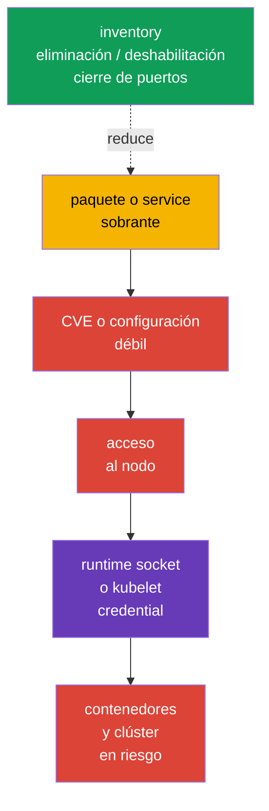
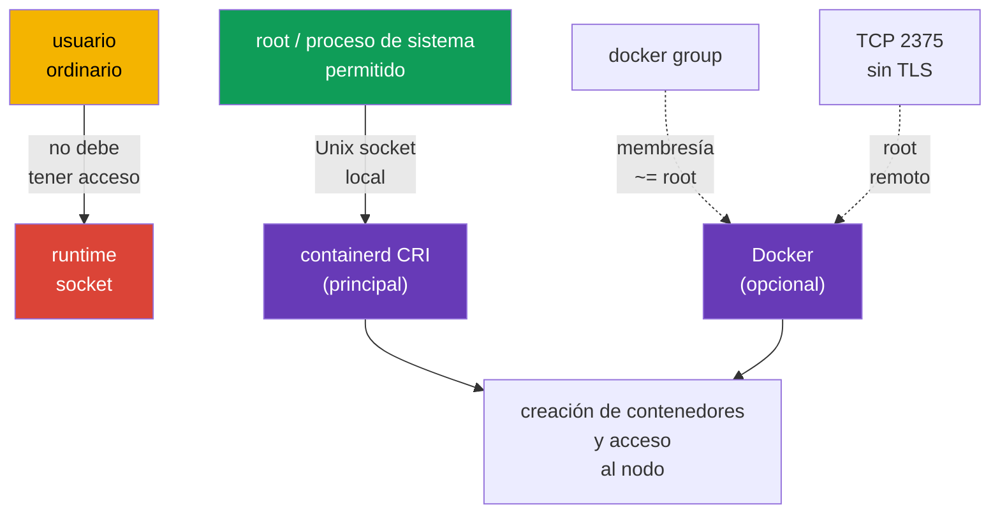

[Русская версия](ru.md) · [Eng version](README.md) · [Version française](fr.md) · [Deutsche Version](de.md) · [ქართული ვერსია](ge.md) · [繁體中文版](tw.md) · [日本語版](jp.md)

# Capítulo 14. Minimización del footprint de la OS host y seguridad del runtime daemon

> **El problema.** Un paquete, service, listener o socket sobrante en un nodo Kubernetes añade
> un binary separado con CVE y una ruta de entrada local o de red. Comprometer tal componente
> puede conducir a kubelet credentials o al socket de container runtime, eludiendo las restricciones
> de Kubernetes API y poniendo en riesgo todos los workloads del nodo.

> **Qué sigue.** Kubernetes limita los workloads con policies, RBAC y SecurityContext, es decir,
> estrecha lo que una carga puede hacer con la API y el nodo, pero todo ello se apoya en un nodo
> Linux. Un service, paquete, puerto abierto o acceso al socket runtime sobrante da a un atacante
> una ruta que elude Kubernetes API. En esta parte del dominio **System Hardening** de CKS
> reducimos la superficie de ataque del propio nodo: dejamos solo los servicios, paquetes y puntos
> de red necesarios, y concedemos el runtime CRI moderno containerd únicamente a quienes de verdad
> lo necesitan.

> **Qué necesita saber de CKA.** El trabajo con `systemd`, procesos, archivos y el journal se
> trata en el [capítulo 0.5 de CKA](../../../cka/course/00-5-linux/es.md). Docker, containerd,
> cgroups y cgroup driver se explican en el [capítulo 0.4 de CKA](../../../cka/course/00-4-containers/es.md).
> El papel de CRI y el vínculo de kubelet con containerd están en el
> [capítulo 40 de CKA](../../../cka/course/40/es.md). Aquí no repetimos la arquitectura runtime,
> sino que restringimos su acceso y superficie de ataque.

## 14.1. Escenario de ataque: un componente sobrante se convierte en punto de entrada

Un nodo Kubernetes no es un servidor universal para toda clase de tareas. Por ejemplo, en un
worker normalmente no se necesitan entorno gráfico, impresión, Bluetooth, un file share ni Docker
daemon si kubelet funciona con containerd. Cada componente instalado y especialmente en ejecución
añade:

- binarios y dependencias con CVE;
- un proceso con permisos y configuración;
- un puerto de escucha o socket local;
- logs, cuentas, unit-files y una ruta para una configuración errónea.



Esto no es un llamamiento a eliminar todo indiscriminadamente. `kubelet`, containerd, CNI, SSH
para administración acordada y los componentes control-plane del nodo correspondiente pueden ser
necesarios. El objetivo es obtener una lista explícita: **componente -> propietario -> propósito ->
puerto/socket**. Si no hay propósito ni propietario, se elimina o deshabilita el componente tras
comprobar dependencias y un plan de rollback.

Antes del cambio, registre el estado inicial. En control-plane, no deshabilite `kubelet`,
containerd, etcd ni componentes Kubernetes en una sesión SSH de la que dependa el acceso: un
error puede dejar inaccesibles el nodo y la API.

```bash
set -euo pipefail
sudo install -d -m 700 /root/hardening-before
sudo systemctl list-unit-files --type=service | sort \
  | sudo tee /root/hardening-before/services-enabled.txt >/dev/null
sudo systemctl list-units --type=service --state=running | sort \
  | sudo tee /root/hardening-before/services-running.txt >/dev/null
sudo ss -tulpn | sort | sudo tee /root/hardening-before/listeners.txt >/dev/null
if command -v dpkg-query >/dev/null; then
  sudo dpkg-query -W -f='${binary:Package}\t${Version}\n' | LC_ALL=C sort \
    | sudo tee /root/hardening-before/packages.txt >/dev/null
elif command -v rpm >/dev/null; then
  sudo rpm -qa | LC_ALL=C sort \
    | sudo tee /root/hardening-before/packages.txt >/dev/null
else
  echo 'REVIEW_REQUIRED: unsupported package manager; cannot create package inventory' >&2
  exit 2
fi
```

> 🧠 Comprometer un nodo puede empezar con un proceso, paquete, listener o socket sobrante; mantenga un mapa de componente, propietario, propósito y acceso permitido.

> 🎯 Inventaríe service, paquete, kernel module y listener; cambie solo el objeto innecesario, conserve el baseline y compruebe `kubelet`/containerd. `disable --now`, removal y cierre de puertos requieren verificaciones distintas.

## 14.2. Inventory y deshabilitación de servicios innecesarios

Primero distinga tres estados. `systemctl list-units` muestra los unit cargados, `is-active` si
el proceso funciona ahora y `is-enabled` si se iniciará al arrancar. Un unit deshabilitado puede
seguir activo hasta detenerlo explícitamente.

```bash
# Service units en ejecución y su estado.
sudo systemctl list-units --type=service --state=running

# Todos los service units instalados, incluidos los deshabilitados.
sudo systemctl list-unit-files --type=service

# De dónde procede un service concreto y con qué se inicia.
SERVICE='service-to-review.service'
sudo systemctl status "$SERVICE"
sudo systemctl cat "$SERVICE"
sudo systemctl show "$SERVICE" -p FragmentPath -p ExecStart -p User
sudo journalctl -u "$SERVICE" --since '24 hours ago'
```

Una tabla de decisión es útil antes de ejecutar cualquier comando:

| Hallazgo | Pregunta antes de actuar | Decisión normal |
|---|---|---|
| `kubelet.service` | ¿El nodo pertenece al clúster? | mantener; corregir solo de forma consciente |
| `containerd.service` | ¿Es este el endpoint CRI de kubelet? | mantener en el nodo Kubernetes |
| `docker.service`/`docker.socket` | ¿Este nodo necesita Docker? | eliminar/deshabilitar si CRI es containerd y Docker no es necesario |
| `sshd.service` | ¿Hay una ruta bastion/console acordada? | mantener con hardening del capítulo 15 o deshabilitar solo si existe acceso alternativo |
| `cups`, `avahi-daemon`, Bluetooth, GUI-service | ¿Hay un propósito de servidor documentado? | normalmente eliminar o deshabilitar |
| service desconocido | ¿Quién es propietario y qué paquete y puerto tiene? | investigar, no adivinar |

Para un unit conocido e innecesario, la operación base segura es detenerlo ahora y prohibir el
autoinicio. El comando es reversible: `enable --now` devuelve el service si es necesario.

```bash
# Ejemplo solo tras confirmar que el service no es necesario para este nodo.
sudo systemctl disable --now avahi-daemon.service

# Comprobar ambos estados.
sudo systemctl is-active avahi-daemon.service || true
sudo systemctl is-enabled avahi-daemon.service || true
```

`mask` es más fuerte que `disable`: prohíbe el inicio manual y por dependencia del unit al
apuntarlo a `/dev/null`. Úselo para un servicio que con certeza no debe aparecer en la image del
nodo y registre la excepción en image build/IaC. No enmascare una dependencia Kubernetes sin
comprender las consecuencias.

```bash
UNIT='confirmed-unwanted.service'

# Guardar el estado original antes del cambio.
sudo systemctl is-active "$UNIT" \
  > "/root/hardening-before/${UNIT}.active" 2>&1 || true
sudo systemctl is-enabled "$UNIT" \
  > "/root/hardening-before/${UNIT}.enabled" 2>&1 || true

# Mask + detención de un unit ya en ejecución.
sudo systemctl mask --now "$UNIT"

# Demostrar ambos estados.
sudo systemctl is-active "$UNIT" || true
sudo systemctl is-enabled "$UNIT" || true
```

Sin `--now`, `mask` bloquea solo el inicio manual y dependency-based futuro: un service ya en
ejecución continuará funcionando. Para rollback, ejecute primero `systemctl unmask <unit>` y luego
restaure exactamente el estado active/enabled guardado antes del cambio. No ejecute
automáticamente `enable --now` si el unit no estaba enabled y active antes del hardening.

## 14.3. Paquetes sobrantes e imagen OS mínima

Detener un service no basta: el paquete, sus bibliotecas, timer/socket unit y futuras CVE
permanecen en el nodo. Inventaríe paquetes, determine qué paquete proporcionó el binary y
compruebe reverse dependencies. En Debian/Ubuntu:

```bash
PACKAGE='package-to-review'
BINARY='binary-to-review'
apt list --installed 2>/dev/null | less
apt-cache policy "$PACKAGE"
dpkg -S "$(command -v "$BINARY")"
apt-cache rdepends --installed "$PACKAGE"

# Mostrar los paquetes instalados manualmente: punto de partida para el review de imagen.
apt-mark showmanual | sort
```

Tras el review, elimine precisamente el paquete confirmado. `apt purge` elimina también su
configuración; antes de `autoremove`, lea primero la lista porque puede incluir una biblioteca o
herramienta de diagnóstico necesaria.

```bash
PACKAGE='confirmed-unneeded-package'
sudo apt purge "$PACKAGE"
sudo apt autoremove --dry-run
# Ejecute autoremove solo después de revisar su lista.
sudo apt autoremove
# No se ejecuta aquí un apt upgrade masivo intencionadamente: patching se realiza en otra change window.
```

En sistemas RPM, los equivalentes son `rpm -qa`, `dnf repoquery --installed` y `dnf remove`.
No mezcle system hardening con una actualización masiva sin controlar: updates, image version y
rollback deben seguir el proceso normal de operaciones.

La **imagen OS mínima** es preferible a limpiar manualmente cada nodo que ya está en ejecución.
En la image/configuración del nodo se declaran los paquetes y services necesarios, se excluyen
desktop, compilers, utilidades de prueba y agentes innecesarios, y después se reconstruye la image
regularmente con patches. Minimalidad no significa ausencia de medios de recuperación: debe quedar
un método acordado de acceso, logging y diagnóstico.

> 🏭 **Producción.** Una Kubernetes-OS especializada, por ejemplo [Bottlerocket](https://bottlerocket.dev/), puede reducir el mutable host footprint mediante una immutable image deliberadamente mínima y un update workflow gestionado. Es una elección arquitectónica: antes del rollout en producción, compruebe en stage el soporte de la versión Kubernetes objetivo, CNI/CSI, bootstrap, observability, acceso de debug y rollback. No traslade a esta OS comandos `apt`/`dpkg` o rutas de una distribución Linux ordinaria sin su documentación oficial.

| Enfoque | Ventaja | Riesgo y control |
|---|---|---|
| Eliminar un paquete en un nodo en ejecución | elimina rápidamente una superficie conocida | drift entre nodos; fijar en IaC/image |
| Golden image con allowlist de paquetes | estado uniforme y auditable | requiere proceso de reconstrucción y actualización |
| Immutable/minimal OS | menos paquetes y cambios en runtime | prever debug y actualización de antemano |
| «Eliminar todo lo desconocido» | ninguno | puede romper kubelet, CNI, storage, monitoring o acceso |

## 14.4. Módulos de kernel: inventory y deshabilitación controlada

Un módulo de kernel es parte de la attack surface, pero no un «paquete sobrante» que se pueda
eliminar sin consecuencias. Primero registre los módulos cargados, sus parámetros y reglas de
carga; compruebe el propósito del módulo con el propietario de la image y en la documentación OS.

```bash
MODULE='example_module'
lsmod | sort
sudo modinfo "$MODULE"
# `modprobe -c` es la fuente de verdad de la effective configuration.
EFFECTIVE_MODPROBE_CONFIG=$(sudo modprobe -c) || {
  echo 'ERROR: cannot read effective modprobe configuration' >&2
  exit 2
}
printf '%s\n' "$EFFECTIVE_MODPROBE_CONFIG" \
  | grep -E "^(blacklist|install)[[:space:]]+${MODULE}\b" || true
sudo modprobe -n -v "$MODULE"
# Estos archivos solo sirven para encontrar el origen de la regla; pueden estar overridden.
sudo find /etc/modprobe.d /run/modprobe.d /usr/local/lib/modprobe.d \
  /usr/lib/modprobe.d /lib/modprobe.d -type f -print 2>/dev/null | sort
sudo grep -RnsE "^(blacklist|install)[[:space:]]+${MODULE}\b" \
  /etc/modprobe.d /run/modprobe.d /usr/local/lib/modprobe.d /usr/lib/modprobe.d /lib/modprobe.d \
  2>/dev/null || true
```

`modprobe -c` muestra las reglas finales con precedence; el `find`/`grep` a nivel de archivo solo
sirve para encontrar el origen de la regla vista y puede mostrar entradas sobrescritas. Para un
módulo concreto, `modprobe -n -v` muestra la acción real que aplicará `modprobe`.

`modprobe -r <module>` descarga el módulo **solo temporalmente**: no sobrevive al reboot y falla
si el módulo está en uso o retenido por una dependencia. La prohibición permanente se define en la
configuración `modprobe` gestionada; `blacklist` impide la carga autoload ordinaria, y
`install ... /bin/false` también bloquea el `modprobe` explícito mediante esa regla. Aplique ambos
mecanismos juntos solo después de comprobar que el módulo realmente no es necesario.

```bash
MODULE='example_module'
# En una change window: comprobación temporal; no intente descargar por la fuerza un módulo usado.
sudo modprobe -r "$MODULE"

# Regla permanente en image/IaC, no drift manual del nodo.
sudo tee "/etc/modprobe.d/disable-${MODULE}.conf" >/dev/null <<EOF
blacklist $MODULE
install $MODULE /bin/false
EOF

# Para Debian/Ubuntu, actualice initramfs si el módulo puede cargarse pronto durante el arranque.
sudo update-initramfs -u
sudo modprobe -n -v "$MODULE"       # se espera la regla install /bin/false
```

Tras un reboot planificado, compruebe `lsmod`, `modprobe -n -v` y la salud del nodo. Los módulos
pueden ser necesarios para CNI, storage driver, runtime o hardware de red/disco. Pruebe primero
en un nodo drained/staging y después haga rollout node-by-node con comprobación de `kubelet`,
containerd, CNI y workload; no aplique la blacklist a todo el pool simultáneamente.

## 14.5. Puertos abiertos: listener, propósito y perímetro de red

Un puerto no es peligroso por sí mismo: lo es un service desconocido o accesible desde fuentes
inadecuadas. Primero establezca la correspondencia «listener - PID - unit - fuentes necesarias»;
después restrinja service y firewall. `ss` suele estar disponible en Linux moderno; `lsof` y
`netstat` son alternativas útiles.

```bash
# TCP y UDP listeners con proceso y PID (se necesita root para información completa).
sudo ss -tulpn
sudo lsof -nP -iTCP -sTCP:LISTEN
sudo netstat -tulpn                    # si está instalado el paquete net-tools

# Los Unix sockets runtime no aparecen en la salida TCP/UDP.
sudo ss -lxnp | grep -E 'docker|containerd' || true
```

| Punto | Dónde suele ser necesario | Dirección segura |
|---|---|---|
| SSH `22/tcp` | acceso gestionado al nodo | solo bastion/VPN/CIDR administrativos |
| kubelet `10250/tcp` | control-plane y diagnóstico acordado | no abrir a Internet; TLS, authn/authz y firewall |
| kube-apiserver `6443/tcp` | control-plane; worker y administradores según arquitectura | allowlist/private endpoint, no `0.0.0.0/0` |
| etcd `2379`, `2380/tcp` | solo control-plane/etcd peers | no publicar en worker ni red externa |
| Docker TCP API (a menudo `2375`/`2376`) | solo con gestión remota justificada | no escuchar `2375`; cualquier TCP endpoint exige excepción explícita, mTLS y firewall exacto |

| containerd/NRI Unix socket | localmente en el nodo | `root` y conjunto mínimo de consumidores de sistema permitidos |

No concluya por el número de puerto sin el proceso: por ejemplo, `6443` se espera en control-plane,
pero puede ser un error en worker; `10250` es necesario para kubelet, pero no debe ser público. El
filtro de red complementa, no sustituye, la deshabilitación de un service innecesario. La
restricción detallada de acceso externo y SSH se trata en el capítulo 15.

```bash
SERVICE='service-owning-the-listener.service'
PORT='10250'
# Primero compruebe el listener concreto y su unit.
sudo ss -lntp | grep -E ':(22|10250|6443|2379|2380|2375|2376)\b' || true
sudo systemctl status "$SERVICE"

# Tras eliminar/deshabilitar el service, el puerto debe desaparecer. Un error de ss no equivale a que no haya listener.
listeners=$(sudo ss -H -lnt "( sport = :${PORT} )") || {
  echo "ERROR: cannot inspect TCP listener ${PORT}" >&2; exit 2;
}
if [ -n "$listeners" ]; then
  printf 'ERROR: TCP port %s is still listening:\n%s\n' "$PORT" "$listeners" >&2
  exit 1
fi
echo "OK: TCP listener ${PORT} is absent"
```

> 🎯 Inventaríe service, paquete, kernel module y listener; cambie solo el objeto innecesario, conserve el baseline y compruebe `kubelet`/containerd. `disable --now`, removal y cierre de puertos requieren verificaciones distintas.

## 14.6. Seguridad de containerd y Docker opcional

En un nodo Kubernetes moderno, containerd es el CRI runtime principal; Docker daemon y su socket
no forman parte del CRI baseline y solo se necesitan para una tarea separada y confirmada. Runtime
daemon tiene más permisos que un contenedor ordinario. Un cliente que puede acceder a la API de
containerd, NRI o Docker a menudo puede iniciar un contenedor privilegiado, montar el filesystem
host u obtener node credentials. Por tanto, el Unix socket es un límite de acceso, no un detalle de
implementación inofensivo.

> 🎯 Acceso al containerd CRI socket solo para `root` y consumidores de sistema mínimos, sin modo world-writable ni mount en un workload no privilegiado.



> 🔬 Docker se aplica solo a un Docker-host; NRI/debug/metrics requieren comprobación específica de versión y runtime.

### Docker: ningún TCP API no autenticado

`dockerd -H tcp://0.0.0.0:2375` abre Docker API a cualquiera que alcance el puerto. En `2375`
no hay TLS ni authentication: es prácticamente root remoto. No debe aparecer ni en `ExecStart`
de un systemd unit, ni en un drop-in, ni en `/etc/docker/daemon.json`. No intente «cubrir»
`2375` solo con firewall: un error de regla volverá a hacer accesible la API.

```bash
set -euo pipefail
# Este gate comprueba independientemente effective configuration y actual listeners.
# false es el baseline seguro; true se permite solo para una documented risk exception.
ALLOW_REMOTE_DOCKER_API=false
declare -a TCP_CONFIGURATION_SOURCES=()
USES_SOCKET_ACTIVATION=false

add_tcp_source() {
  TCP_CONFIGURATION_SOURCES+=("$1")
}

# Clasificar valores Docker -H/--host normalizados. Unix y fd no son TCP;
# host:, host:port, :port, puerto numérico y tcp:// son formas TCP.
classify_docker_host() {
  local source=$1 host=$2
  case "$host" in
    unix://*|/*|@*) ;;
    fd://*) USES_SOCKET_ACTIVATION=true ;;
    tcp://*|*:*|[0-9]*) add_tcp_source "$source: $host" ;;
    *)
      printf 'REVIEW_REQUIRED: cannot classify Docker host value from %s: %s\n' "$source" "$host" >&2
      exit 2
      ;;
  esac
}

# Effective systemd service configuration más argv de un daemon activo.
DOCKER_SERVICE_EXEC=$(sudo systemctl show docker.service -p ExecStart --value 2>/dev/null || true)
DOCKER_PID=$(pgrep -xo dockerd || true)
DOCKER_CMDLINE=''
if [ -n "$DOCKER_PID" ]; then
  DOCKER_CMDLINE=$(sudo cat "/proc/$DOCKER_PID/cmdline" | tr '\0' '\n') || {
    echo 'ERROR: cannot read dockerd argv' >&2
    exit 2
  }
fi

# Analizar todas las formas -H/--host en effective ExecStart, incluido -H=<value>.
mapfile -t EXEC_HOST_DIRECTIVES < <(
  printf '%s\n' "$DOCKER_SERVICE_EXEC"     | grep -Eo -- '(-H|--host)(=|[[:space:]]+)[^[:space:]]+' || true
)
for directive in "${EXEC_HOST_DIRECTIVES[@]}"; do
  case "$directive" in
    -H=*) host=${directive#-H=} ;;
    --host=*) host=${directive#--host=} ;;
    -H\ *) host=${directive#-H } ;;
    --host\ *) host=${directive#--host } ;;
    *)
      printf 'REVIEW_REQUIRED: cannot normalize ExecStart host directive: %s\n' "$directive" >&2
      exit 2
      ;;
  esac
  classify_docker_host 'docker.service ExecStart' "$host"
done

# argv está separado por NUL, así que analice sus valores individuales sin ambigüedad de quoting.
mapfile -t DOCKER_ARGV <<< "$DOCKER_CMDLINE"
for ((i = 0; i < ${#DOCKER_ARGV[@]}; i++)); do
  case "${DOCKER_ARGV[i]}" in
    -H|--host)
      ((++i < ${#DOCKER_ARGV[@]})) || {
        echo 'REVIEW_REQUIRED: dockerd host flag has no value' >&2
        exit 2
      }
      classify_docker_host 'dockerd argv' "${DOCKER_ARGV[i]}"
      ;;
    -H=*) classify_docker_host 'dockerd argv' "${DOCKER_ARGV[i]#-H=}" ;;
    --host=*) classify_docker_host 'dockerd argv' "${DOCKER_ARGV[i]#--host=}" ;;
  esac
done

# Una ruta config personalizada no se puede inferir con seguridad de la salida grep; exija su review explícito.
if printf '%s\n' "$DOCKER_SERVICE_EXEC" "$DOCKER_CMDLINE"   | grep -Eq -- '--config-file(=|[[:space:]])'; then
  echo 'REVIEW_REQUIRED: dockerd uses --config-file; parse that effective config before allowing Docker TCP API' >&2
  exit 2
fi

# Analizar hosts en el config predeterminado. Sin jq, una clave hosts requiere review, no PASS.
if sudo test -f /etc/docker/daemon.json && sudo grep -qE '"hosts"[[:space:]]*:' /etc/docker/daemon.json; then
  command -v jq >/dev/null || {
    echo 'REVIEW_REQUIRED: jq is required to parse daemon.json hosts safely' >&2
    exit 2
  }
  DOCKER_CONFIG_HOSTS=$(sudo jq -er '
    if .hosts? == null then empty
    elif (.hosts | type) == "array" and all(.hosts[]; type == "string") then .hosts[]
    else error("daemon.json hosts must be an array of strings") end
  ' /etc/docker/daemon.json) || {
    echo 'REVIEW_REQUIRED: cannot parse daemon.json hosts' >&2
    exit 2
  }
  while IFS= read -r host; do
    [ -z "$host" ] || classify_docker_host 'daemon.json hosts' "$host"
  done <<< "$DOCKER_CONFIG_HOSTS"
fi

# `Listen` es la propiedad effective socket de systemd. Distinga un unit ausente de un
# unit cuya effective configuration no se puede leer; nunca convierta esto último en PASS.
DOCKER_SOCKET_LOAD_STATE=$(sudo systemctl show docker.socket -p LoadState --value 2>/dev/null) || {
  echo 'REVIEW_REQUIRED: cannot determine whether docker.socket exists' >&2
  exit 2
}
case "$DOCKER_SOCKET_LOAD_STATE" in
  not-found) DOCKER_SOCKET_PRESENT=false ;;
  '')
    echo 'REVIEW_REQUIRED: empty docker.socket LoadState' >&2
    exit 2
    ;;
  *) DOCKER_SOCKET_PRESENT=true ;;
esac
if [ "$DOCKER_SOCKET_PRESENT" = true ]; then
  DOCKER_SOCKET_LISTEN=$(sudo systemctl show docker.socket -p Listen --value) || {
    echo 'REVIEW_REQUIRED: cannot read effective docker.socket Listen configuration' >&2
    exit 2
  }
  [ -n "$DOCKER_SOCKET_LISTEN" ] || {
    echo 'REVIEW_REQUIRED: docker.socket has no effective Listen entries' >&2
    exit 2
  }
  while IFS= read -r listen_entry; do
    listen_entry=${listen_entry#"${listen_entry%%[![:space:]]*}"}
    [ -z "$listen_entry" ] && continue
    case "$listen_entry" in
      *' (Stream)') socket_address=${listen_entry% (Stream)} ;;
      *)
        printf 'REVIEW_REQUIRED: cannot classify non-stream docker.socket Listen entry: %s\n' "$listen_entry" >&2
        exit 2
        ;;
    esac
    case "$socket_address" in
      /*|@*) ;;  # filesystem y abstract Unix sockets
      *:*) add_tcp_source "docker.socket Listen: $socket_address" ;;
      *)
        if [[ "$socket_address" =~ ^[0-9]+$ ]]; then
          add_tcp_source "docker.socket Listen: $socket_address"
        else
          printf 'REVIEW_REQUIRED: cannot classify docker.socket Listen address: %s\n' "$socket_address" >&2
          exit 2
        fi
        ;;
    esac
  done <<< "$DOCKER_SOCKET_LISTEN"
elif [ "$USES_SOCKET_ACTIVATION" = true ]; then
  echo 'REVIEW_REQUIRED: dockerd uses fd:// but docker.socket is absent' >&2
  exit 2
fi

# Los listeners actuales son evidence separado. Haga coincidir dockerd en cualquier metadata de proceso, no solo la primera.
listeners_2375=$(sudo ss -H -lnt '( sport = :2375 )') || {
  echo 'ERROR: cannot inspect TCP 2375' >&2
  exit 2
}
dockerd_tcp_listeners=$(sudo ss -H -lntp | awk 'index($0, "\"dockerd\"")') || {
  echo 'ERROR: cannot inspect dockerd TCP listeners' >&2
  exit 2
}

TCP_EVIDENCE=$(printf '%s\n%s\n' "${TCP_CONFIGURATION_SOURCES[*]-}" "$dockerd_tcp_listeners")
if [ -n "$listeners_2375" ] || [ -n "${TCP_CONFIGURATION_SOURCES[*]-}" ] || [ -n "$dockerd_tcp_listeners" ]; then
  printf 'Docker TCP configuration/listener evidence:\n%s\n' "$TCP_EVIDENCE" >&2
  if printf '%s\n%s\n' "$listeners_2375" "$TCP_EVIDENCE"     | grep -Eq '(^|[^0-9])2375([^0-9]|$)'; then
    echo 'ERROR: Docker TCP 2375 is configured or listening' >&2
    exit 1
  fi
  if [ "$ALLOW_REMOTE_DOCKER_API" != true ]; then
    echo 'ERROR: unexpected Docker TCP endpoint is configured or listening' >&2
    exit 1
  fi
  echo 'REVIEW_REQUIRED: every allowed endpoint needs effective tlsverify=true, CA, server certificate/key, verified client-certificate authentication and firewall/security-group allowlist.' >&2
  exit 2
fi
echo 'OK: no Docker TCP endpoint is configured or listening'
```

En una instalación systemd típica, Docker recibe `-H fd://`: `docker.socket` suele crear un Unix
socket local. No lo suponga sin comprobar: la effective systemd property `Listen` puede definir un
TCP listener que existe antes de iniciar `dockerd`. El gate anterior analiza solo las entries
`Stream`: la ruta `/…` y el abstract Unix socket `@…` siguen siendo Unix, mientras que port,
`host:port` y `[IPv6]:port` se consideran TCP. No añada simultáneamente `hosts` en `daemon.json`
y `-H` en el unit: Docker termina ante configuraciones en conflicto. Elimine solo TCP endpoint de
la fuente activa, después compruebe la configuración y reinicie un service cada vez.

```bash
# Para daemon.json, compruebe primero la sintaxis y las claves admitidas.
sudo dockerd --validate --config-file=/etc/docker/daemon.json
sudo systemctl daemon-reload
sudo systemctl restart docker.service
sudo systemctl --no-pager --full status docker.service
sudo journalctl -u docker.service -n 50 --no-pager
```

Si Docker API remoto es realmente un requisito acordado, el número de puerto no demuestra TLS ni
mTLS: incluso `2376` no es una prueba. Para **cada** TCP endpoint permitido, confirme
`tlsverify=true` efectivo, CA, server certificate y key, además de authentication real de client
certificate; restrinja las fuentes mediante firewall/security group y una management network
dedicada. Es una excepción con propietario de riesgo, no un default para un nodo Kubernetes.

### containerd, NRI y límites de archivos runtime

El CRI socket principal suele estar en `/run/containerd/containerd.sock`; la ruta del NRI socket se
configura y a menudo es `/run/nri/nri.sock` (equivalente a `/var/run/nri/nri.sock`). El acceso a
**cualquiera** de ellos es root-equivalent. Déjelo solo a `root` y al conjunto mínimo de procesos
del sistema. Si para operaciones se necesita un grupo, debe ser un grupo de sistema dedicado sin
usuarios ordinarios; no añada desarrolladores, cuentas CI ni workload identity. Nunca monte
`containerd.sock` o `nri.sock` en un contenedor no privilegiado.

No hay un `chmod` universal para Docker o containerd socket: ruta, propietario, grupo y modo los
define el paquete, systemd unit y policy del nodo concreto. No use modos world-writable ni
«corrija» permisos con un comando único si systemd recrea el socket. Primero determine el
propietario de configuración, después fije el acceso mínimo necesario mediante configuración de
image/IaC admitida y compruébelo tras el reinicio.

```bash
sudo systemctl status containerd.service --no-pager
sudo systemctl cat containerd.service
sudo stat -Lc '%A %a %U:%G %n' /run/containerd/containerd.sock \
  /run/nri/nri.sock 2>/dev/null || true
sudo ss -lxnp | grep -E 'containerd\.sock|nri\.sock' || true

# El diagnóstico CRI se realiza localmente y como root; coteje endpoint con kubelet config.
sudo crictl --runtime-endpoint unix:///run/containerd/containerd.sock ps
sudo grep -Rns -- '--container-runtime-endpoint\|containerRuntimeEndpoint' \
  /var/lib/kubelet /etc/systemd/system /usr/lib/systemd/system 2>/dev/null || true
```

No proteja solo el socket. `/run/containerd` contiene runtime-state y sockets, y
`/var/lib/containerd`, content y metadata persistentes. Para containerd, la referencia es `0700`
para `/var/lib/containerd` y `0711` para la raíz de `/run/containerd`: el segundo modo permite
traversal, que puede necesitar user-namespaced workload, pero no revela el contenido del directorio.
Los subdirectorios sensibles deben ser `0700`, sockets `0660` con un grupo de sistema sin usuarios
no privilegiados; ninguna ruta debe ser writable por usuarios ordinarios ni contenedores.
Configuración, plugins y CNI también deben ser root-owned y estar protegidos contra escritura de
sujetos no autorizados: normalmente son `/etc/containerd`, directorios de runtime plugins y
`/etc/cni/net.d`, mientras que los CNI binaries están en `/opt/cni/bin` (coteje las rutas concretas
con la distribución y configuración). No las cambie con un `chmod -R` amplio: compruebe ownership
y writable-bits de forma precisa.

```bash
sudo find /run/containerd /var/lib/containerd /etc/containerd /etc/cni/net.d /opt/cni/bin \
  -xdev -printf '%m %u:%g %p\n' 2>/dev/null | sort
```

En containerd 2.0, NRI está habilitado de forma predeterminada. Es un punto de decisión explícito:
si NRI no se usa, deshabilite el plugin en configuración comprobada
(`[plugins."io.containerd.nri.v1.nri"]` y `disable = true`); si se usa, considere los NRI
plugins, su configuración y conexiones de plugins externos como parte del runtime TCB y restrinja
sus rutas y acceso.

Debug y metrics son superficies API separadas. El Unix debug socket se restringe a `root` y
consumidores del sistema permitidos; un TCP debug endpoint nunca se publica. Las metrics de
containerd a menudo no tienen TLS ni authentication: vincúlelas solo a loopback o una management
interface dedicada y restrinja adicionalmente firewall/routing. Antes del cambio, coteje los
parámetros admitidos con su versión de containerd y compruebe listeners con `ss` tras el reinicio.

### Docker: solo si realmente se necesita

Si se conserva Docker para una tarea separada, su socket y grupo `docker` también son
root-equivalent. No conceda membresía a usuarios ordinarios, no monte el socket en workload no
privilegiado y no suponga un owner/mode único para todas las instalaciones: siga la unit/package
policy y compruebe acceso como una cuenta no permitida.

```bash
readlink -f /var/run/docker.sock 2>/dev/null || true
sudo stat -Lc '%A %a %U:%G %n' /var/run/docker.sock 2>/dev/null || true
getent group docker || true
getent group docker | awk -F: '{print $4}'
UNPRIVILEGED_USER='unprivileged-user'
sudo -u "$UNPRIVILEGED_USER" docker ps  # se espera rechazo para el usuario no permitido
```

Si Docker no es necesario en el nodo Kubernetes, es más fiable eliminar el paquete o deshabilitar
y enmascarar `docker.service` y `docker.socket`, tras confirmar que kubelet o tareas operativas no
dependen de ellos.

### Hardening de `/etc/docker/daemon.json`

`daemon.json` es una de las fuentes de configuración de Docker. No sustituye firewall, permisos
de socket, SecurityContext ni policies Kubernetes, pero define un baseline seguro del daemon. No
añada `hosts` si systemd ya pasa `-H fd://`.

#### Nuevo Docker-host

El siguiente baseline se aplica a una instalación Docker **nueva** tras comprobar el soporte de
versión y compatibilidad con el planned workload:

```json
{
  "live-restore": true,
  "no-new-privileges": true,
  "userns-remap": "default",
  "log-driver": "local"
}
```

| Clave | Qué proporciona | Qué comprobar antes de habilitar |
|---|---|---|
| `live-restore` | puede mantener los contenedores en ejecución mientras el daemon no está disponible | workflow de actualización, monitoring y comportamiento de reinicio esperado; no es garantía para cualquier cambio config/migration |
| `no-new-privileges` | impide que procesos de contenedor nuevos escalen privilege mediante `setuid`/file capabilities | aplicaciones que por error requieren privilege escalation; los contenedores existentes se recrean |
| `userns-remap` | mapea el root del contenedor a UID no privilegiado del host | volumes, ownership, images y compatibilidad; no habilitar sin prueba en un nodo de tipo producción |
| `log-driver: local` | limita el crecimiento de logs JSON y el driver gestiona rotation | recolección centralizada de logs y retention; los contenedores existentes no se migran automáticamente |

#### Docker-host existente: migración separada

No aplique este JSON a un Docker-host existente como una edición de configuración simple seguida
de un restart. Antes del cambio, recopile un inventory de containers/images/volumes, compruebe
`/etc/subuid` y `/etc/subgid`, bind mounts, host networking y contenedores privilegiados, evalúe
compatibilidad con `userns-remap` y prepare un plan de recreate/migration y rollback.

```bash
set -euo pipefail
sudo docker ps -a --no-trunc
sudo docker image ls
sudo docker volume ls
sudo docker network ls
sudo grep -Ev '^[[:space:]]*(#|$)' /etc/subuid /etc/subgid 2>/dev/null || true
# Para cada workload individualmente: sudo docker inspect <container>; compruebe mounts, network y privileges.
```

`no-new-privileges` como daemon default se aplica a contenedores nuevos; los existentes se deben
recreate. Cambiar `log-driver` no migra automáticamente los contenedores existentes.
`userns-remap` cambia namespace/storage view y ownership de Docker, por lo que exige una migration
separada. `live-restore` no es una garantía incondicional de que los contenedores sobrevivan a
cualquier cambio de configuración daemon. Para un nodo Kubernetes con containerd, no es una
configuración containerd ni un sustituto de `runAsNonRoot`; aplique Docker solo a un Docker-host
dedicado tras probarlo.

Nunca cree `daemon.json` sobre un archivo existente con `install /dev/null`: primero guarde la
configuración actual. Cree un nuevo archivo vacío solo si aún no existe.

```bash
sudo install -d -m 0755 /etc/docker

if sudo test -e /etc/docker/daemon.json; then
  # Guardar primero la configuración existente.
  sudo cp -a /etc/docker/daemon.json /root/hardening-before/daemon.json.before
  sudo chown root:root /etc/docker/daemon.json
  sudo chmod 0600 /etc/docker/daemon.json
else
  # Crear un archivo vacío solo si todavía no existe.
  sudo install -m 0600 -o root -g root /dev/null /etc/docker/daemon.json
fi

sudoedit /etc/docker/daemon.json
sudo dockerd --validate --config-file=/etc/docker/daemon.json
sudo systemctl restart docker.service
sudo systemctl --no-pager --full status docker.service
sudo docker info --format '{{json .SecurityOptions}}'
```

> 🎯 Demuestre la minimización con diff antes/después y comprobaciones negativas: el service innecesario no está active/enabled, listener y `2375` están ausentes, y un usuario no privilegiado no obtiene runtime access.

## 14.7. Verificación del resultado: demostrar un nodo mínimo

La comprobación consta de un hecho de configuración y un hecho de acceso. No basta ver la línea
esperada en un archivo: el service pudo no releer la configuración y el socket pudo recrearse con
el grupo anterior. Ejecute un diff antes/después y una prueba como el usuario al que se retiró el
acceso.

```bash
set -euo pipefail
sudo install -d -m 700 /root/hardening-after

# 1. Services: snapshots antes/después y diff de estados running + enabled.
sudo systemctl list-units --type=service --state=running | sort \
  | sudo tee /root/hardening-after/services-running.txt >/dev/null
sudo systemctl list-unit-files --type=service | sort \
  | sudo tee /root/hardening-after/services-enabled.txt >/dev/null
sudo diff -u /root/hardening-before/services-running.txt \
  /root/hardening-after/services-running.txt || true
sudo diff -u /root/hardening-before/services-enabled.txt \
  /root/hardening-after/services-enabled.txt || true

# 2. Paquetes y network listeners: snapshot distro-aware; explique después cada diff.
if command -v dpkg-query >/dev/null; then
  sudo dpkg-query -W -f='${binary:Package}\t${Version}\n' | LC_ALL=C sort \
    | sudo tee /root/hardening-after/packages.txt >/dev/null
elif command -v rpm >/dev/null; then
  sudo rpm -qa | LC_ALL=C sort \
    | sudo tee /root/hardening-after/packages.txt >/dev/null
else
  echo 'REVIEW_REQUIRED: unsupported package manager; cannot create package inventory' >&2
  exit 2
fi
sudo ss -tulpn | sort | sudo tee /root/hardening-after/listeners.txt >/dev/null
sudo diff -u /root/hardening-before/packages.txt \
  /root/hardening-after/packages.txt || true
sudo diff -u /root/hardening-before/listeners.txt \
  /root/hardening-after/listeners.txt || true

# 3. Docker TCP: repita por completo el canonical gate de §14.6, no solo la comprobación `ss`.
# PASS solo es posible si no hay TCP endpoint simultáneamente en effective ExecStart/argv,
# daemon.json hosts/default o custom config explícitamente revisado, effective docker.socket Listen
# y current listener. TCP Listen puede existir antes de iniciar dockerd.

# 4. Runtime socket se mantiene local; owner/mode siguen policy unit/package,
#    no dan acceso a usuarios ordinarios y no son world-writable.
for socket in /run/containerd/containerd.sock /run/nri/nri.sock /var/run/docker.sock; do
  if [ -S "$socket" ]; then
    sudo stat -Lc '%A %a %U:%G %n' "$socket"
  fi
done

# 5. Debug no debe ser público y metrics no deben estar en todas las interfaces sin TLS/auth.
sudo ss -lntup | grep -E 'containerd|debug|metrics' || true
```

**DoD - nodo mínimo:**

- [ ] Cada service activo tiene propósito, propietario y puerto/socket esperado.
- [ ] Los service innecesarios se detienen con `systemctl disable --now`, y los repetidamente
  peligrosos se enmascaran cuando es necesario; kubelet/containerd y componentes requeridos no se
  rompen.
- [ ] Se eliminan paquetes innecesarios confirmados; la image del nodo tiene package allowlist y
  proceso de actualización, no manual drift no documentado.
- [ ] `ss -tulpn` no contiene listeners sin explicación; `10250`, `6443`, etcd y SSH son
  accesibles solo donde y a las fuentes requeridas por la arquitectura.
- [ ] `2375` no está configurado ni escucha; el full gate examina `ExecStart`/argv efectivo,
  `daemon.json hosts` o custom config revisado explícitamente, `docker.socket Listen` efectivo y
  `ss -lntp`. No hay Docker TCP endpoint no autorizado en **ningún** puerto, incluso un endpoint
  que aún no escucha o es socket-activated. Un endpoint permitido tiene propietario de riesgo,
  `tlsverify=true` efectivo, CA, server certificate/key, client-certificate authentication
  confirmada y firewall/security-group allowlist; `2376` por sí solo no demuestra mTLS.
- [ ] `/run/containerd/containerd.sock` y, si existe, `/run/nri/nri.sock` no son accesibles a
  usuarios ordinarios, no se montan en un workload no privilegiado y `sudo crictl` sigue
  funcionando; los grupos permitidos contienen solo sujetos de sistema autorizados.
- [ ] `/run/containerd`, `/var/lib/containerd`, configuración/plugins/CNI son root-owned y no
  writable por sujetos no autorizados; no hay TCP debug endpoint público y las metrics sin TLS/auth
  se restringen a loopback o management interface.
- [ ] Si Docker está instalado, su acceso se restringe por unit/package policy y un usuario
  ordinario no puede ejecutar `docker ps`; `daemon.json` pasó `dockerd --validate`.
- [ ] Docker/containerd y kubelet están healthy, y los cambios se registran en image/IaC/change record.

## 14.8. Errores frecuentes y diagnóstico

| Síntoma | Causa probable | Qué comprobar y corregir |
|---|---|---|
| `docker` aún escucha en `2375` | TCP está definido en systemd drop-in, `ExecStart` o `daemon.json` | `systemctl cat docker.service docker.socket`, `ps -ef`, buscar `tcp://`; eliminar la fuente activa y reiniciar daemon |
| Docker no inicia tras una edición | `hosts` en conflicto en JSON y `-H` en el unit, o JSON inválido | `dockerd --validate`, `journalctl -u docker`, conservar una sola fuente hosts |
| una corrección puntual de permisos socket desaparece tras reiniciar | systemd o runtime recrea el socket | encontrar el propietario unit/package con `systemctl cat`, fijar policy en IaC/drop-in, volver a comprobar con `stat` |
| un usuario aún puede ejecutar `docker ps` o llegar al runtime | una sesión login antigua aún tiene el grupo privilegiado, o la policy es demasiado amplia | `id <user>`, sesión nueva, `getent group`, eliminar miembros no de sistema y volver a comprobar acceso |
| un worker se convirtió en `NotReady` | se eliminó/detuvo containerd, kubelet o se rompió CRI config | `systemctl status kubelet containerd`, `journalctl -u kubelet`, cotejar endpoint y restaurar desde snapshot |
| se cerró un puerto necesario | se deshabilitó el puerto por número sin comprobar PID y propósito | `ss -lntp`, propietario unit, fuentes/propósito; rollback preciso |
| falta una utilidad necesaria después de `apt autoremove` | no se revisó la lista o se evaluó mal una package dependency | restaurar el paquete, fijar allowlist de imagen, usar `--dry-run` |

> 🏭 Role-specific golden image, IaC, inventory y drift detection; staging/canary y node-by-node rollout con rollback y comprobaciones de `kubelet`, runtime, CNI y workload.

## 14.9. Cómo se usa esto en producción

- **Kubernetes v1.37 rootless node path.** `KubeletInUserNamespace` pasó a Beta y permite crear
  un node stack en el que kubelet y componentes de nodo relacionados se ejecutan sin host-root
  mediante un user namespace. No lo confunda con `spec.hostUsers: false`, que aísla un Pod. Véase
  [Kubernetes v1.37 Security Delta](../APPENDIX_K8S_137_SECURITY_DELTA_ES.md).
- **Los baselines se definen como código.** La lista de paquetes, enabled services, systemd
  drop-ins, firewall y comprobación de socket se incluyen en immutable image, Ansible/Cloud-Init u
  otro IaC. Una corrección manual de emergencia se lleva después al source of truth.
- **Los nodos se separan por función.** Control-plane, worker, build-host y Docker-host no reciben
  el mismo conjunto de paquetes y puertos. En especial, no instale Docker daemon en un worker solo
  para `docker ps` interactivo si el CRI es containerd.
- **El acceso runtime se revisa como acceso privilegiado.** Cambiar miembros de grupos, permisos de
  containerd/NRI/Docker socket y systemd override pasa por el mismo review que conceder `sudo`; los
  grupos de sistema permitidos no incluyen usuarios ordinarios.
- **Se comprueba el drift.** Un CIS/OS scan regular, inventory de paquetes, enabled unit y listeners
  se comparan con el baseline. Un listener nuevo sin propietario es un incidente o change, no un
  «estado normal».
- **Los cambios se hacen gradualmente.** Primero un nodo staging y un service, luego un health
  check de `kubelet`/`containerd`, y solo después rollout. Para control-plane se mantiene una
  out-of-band console y rollback probado.

> **Para quien quiera profundizar, material no de examen.** Este capítulo y los capítulos 16-17 explican namespaces, capabilities, cgroups y MAC justo en la medida necesaria para CKS: reconocer el riesgo, aplicar el campo o policy `securityContext` adecuado y comprobar el efecto. Si necesita un análisis más profundo del mecanismo mismo - cómo el kernel implementa syscall interception, qué ocurre en el nivel del cgroup v2 controller o cómo funciona namespace isolation en el nivel de kernel structures - ese es precisamente el tema de un libro aparte: Liz Rice, *Container Security*, 2nd edition (O'Reilly, 2025). El curso no intenta competir con él en profundidad de Linux internals; este es un límite de alcance deliberado, no una señal de que el tema se agote con los capítulos 14-17.

## 14.10. Mini-glosario

- **footprint** - conjunto de paquetes, procesos, puertos, sockets y configuración que aumenta
  la superficie de ataque de un nodo.
- **attack surface** - todos los puntos accesibles a través de los que es posible un ataque o una
  configuración errónea.
- **systemd unit** - descripción de un service, socket, timer u otra entidad gestionada por
  systemd.
- **Unix socket** - punto IPC local de filesystem; los permisos del archivo determinan quién
  alcanza la API daemon.
- **Docker socket** - `/var/run/docker.sock`, API local de Docker daemon; si Docker está instalado,
  el acceso es root-equivalent y se restringe mediante la policy del unit/package concreto.
- **`docker` group** - grupo que concede acceso a Docker socket; se trata como root-equivalent,
  no como grupo de trabajo ordinario.
- **CRI socket** - endpoint entre kubelet y el runtime containerd principal, por ejemplo
  `/run/containerd/containerd.sock`; el acceso es root-equivalent.
- **NRI socket** - API Unix Node Resource Interface de containerd; su acceso también es
  root-equivalent.
- **`daemon.json`** - archivo de configuración Docker daemon, normalmente
  `/etc/docker/daemon.json`.
- **`live-restore`** - modo Docker que mantiene contenedores funcionando al reiniciar daemon.
- **`userns-remap`** - user namespace remapping de UID/GID de un contenedor en el host.

## 14.11. Resumen del capítulo

- Un nodo mínimo empieza por el inventory: cada service, paquete, listener y socket tiene propósito
  y propietario; todo lo demás se elimina o deshabilita.
- `systemctl disable --now` detiene un service innecesario e impide su autoinicio; `apt purge` se
  aplica solo a un paquete confirmado después de comprobar dependencias.
- Los puertos se evalúan por proceso y fuentes: kubelet `10250` y API `6443` no deben estar
  abiertos a todo Internet, y Docker `2375` no debe escuchar en absoluto.
- `-H tcp://0.0.0.0:2375` es root remoto no autenticado. Mantenga Docker en Unix socket; cualquier
  TCP endpoint es solo una excepción mTLS justificada, y `2376` no prueba su seguridad.
- containerd es el CRI runtime moderno principal; el acceso a su socket y NRI socket es
  root-equivalent, se restringe a sujetos de sistema y nunca se monta en workload no privilegiado.
- Los permisos Docker/containerd socket no se definen con `chmod` universal: se fijan mediante la
  policy del unit/package pertinente, sin modo world-writable ni usuarios ordinarios.
- `/run/containerd`, `/var/lib/containerd`, config/plugins/CNI son superficies root-owned
  protegidas; Unix debug está restringido, TCP debug nunca es público y metrics sin TLS/auth
  escuchan solo en loopback o management interface.
- `live-restore`, `no-new-privileges` y `userns-remap` en `daemon.json` se aplican solo a un
  Docker-host justificado y requieren validation, prueba de compatibilidad y rollout.

## 14.12. Cómo ayuda esto: en el examen y en el trabajo real

**En el examen.** Encuentre primero la fuente activa: `systemctl cat`, `systemctl show`,
`ss -tulpn`, `stat` y `ps` son más fiables que adivinar por una ruta de archivo. Una tarea puede
pedir eliminar Docker TCP, corregir permisos socket o deshabilitar un service. Tras el cambio,
demuestre el resultado: `2375` no escucha, `ss -lntp` no muestra TCP listener `dockerd` no
autorizado, `stat` muestra owner/mode requerido y un usuario sin permisos recibe rechazo. No
deshabilite kubelet/containerd solo porque su puerto o proceso parezca desconocido.

**En el trabajo real.** La mayor parte de los compromisos de nodo comienza con un error ordinario:
un paquete sin parchear, un management service olvidado, daemon API público o un grupo Unix
demasiado amplio. Una minimal image auditable, role-specific node pools, allowlist de fuentes de
red y comprobación de drift continua reducen la posibilidad de tal error y el blast radius si de
todos modos sucede.

## 14.13. Preguntas de autoevaluación

<details>
<summary>1. ¿Por qué un paquete sobrante deshabilitado, pero no eliminado, sigue aumentando la superficie de ataque?</summary>

Un service detenido no elimina los binarios, bibliotecas, configuración, socket/timer units y CVE
potenciales del paquete. Puede volver a habilitarse o convertirse en fuente de error durante el
siguiente cambio. Tras comprobar dependencias, se elimina el paquete innecesario confirmado, y la
minimal image se mantiene mediante allowlist y reconstrucciones regulares.
</details>

<details>
<summary>2. ¿En qué se diferencia `systemctl disable --now` de `mask`, y cuándo se necesita cada opción?</summary>

`systemctl disable --now` detiene inmediatamente un service e impide su autoinicio ordinario: es
una operación base reversible para un unit innecesario conocido. `mask` es más fuerte: apunta el
unit a `/dev/null` y bloquea el inicio manual y por dependencia. Mask se usa para un servicio que
con certeza no debe aparecer en la image, sin enmascarar una dependencia Kubernetes sin comprender
las consecuencias.
</details>

<details>
<summary>3. ¿Cómo se establece el propietario de un listener antes de cerrar su puerto?</summary>

Primero se listan TCP/UDP listeners con proceso y PID mediante `sudo ss -tulpn`; `lsof` y
`netstat` sirven como alternativas. Después, para el service encontrado se comprueban
`systemctl status`, `systemctl cat`, `systemctl show ... -p ExecStart` y journal. La decisión se
toma por listener, PID, unit, propósito y fuentes permitidas, no por el número de puerto.
</details>

<details>
<summary>4. ¿Por qué no se pueden «cerrar en todas partes» `10250` y `6443` de la misma manera, mientras que `2375` debe estar ausente?</summary>

`10250` es necesario para la API kubelet protegida y `6443` para API server, por lo que su acceso
depende de la función del nodo y arquitectura: se dan allowlists exactas a control plane, worker,
administradores y monitoring. No deben ser accesibles desde Internet, pero cerrarlos por completo
rompería flows necesarios. `2375` es Docker TCP API no autenticada y no se necesita en absoluto en
un baseline seguro.
</details>

<details>
<summary>5. ¿Por qué `tcp://0.0.0.0:2375` equivale a root remoto, incluso si ahora existe firewall?</summary>

Docker API en `2375` no usa TLS ni authentication; cualquier cliente que alcanza el puerto puede
crear contenedores privilegiados, montar host filesystem y acceder al nodo. Firewall es solo una
capa compensatoria externa, y su error vuelve a abrir esa API root-equivalent. Por tanto, TCP
endpoint debe retirarse del unit, drop-in y `daemon.json` activos, no solo filtrarse por red.
</details>

<details>
<summary>6. ¿Por qué el acceso a containerd/NRI socket es root-equivalent y a quién se puede conceder?</summary>

Un cliente de containerd o NRI API puede gestionar contenedores con privilegios, montar host
filesystem u obtener node credentials, por lo que socket es un security boundary. El acceso se
deja a root y al conjunto mínimo de procesos de sistema. Si se necesita un grupo, debe ser un grupo
de sistema dedicado sin usuarios ordinarios, desarrolladores, CI identity ni workload.
</details>

<details>
<summary>7. ¿Por qué no se puede asignar un `chmod` universal a runtime socket, y cómo fijar la policy de forma duradera?</summary>

Ruta, owner, group y mode del socket se definen por paquete, systemd unit y policy del nodo
concreto, y el socket puede recrearse después de un restart. Un `chmod` universal o puntual puede
no corresponder a la instalación y desaparecer. Primero determine el propietario mediante
`systemctl cat` y `stat`, después fije el acceso mínimo en image/IaC o unit policy admitidos y
compruébelo tras el restart.
</details>

<details>
<summary>8. ¿Por qué TCP debug endpoint no debe ser público, y las metrics sin TLS/auth se limitan a loopback o management interface?</summary>

Debug API proporciona superficie diagnóstica sobrante y por tanto no se publica su variante TCP;
Unix socket se restringe a root y consumidores de sistema permitidos. Las metrics de containerd a
menudo no tienen TLS ni authentication, por lo que un listener público revela datos a cualquier
fuente. Vincúlelas a loopback o management interface dedicada y restrinja adicionalmente mediante
firewall/routing.
</details>

<details>
<summary>9. ¿En qué se diferencia `modprobe -r` temporal de `blacklist` e `install ... /bin/false`?</summary>

`modprobe -r` solo descarga un módulo temporalmente y no sobrevive al reboot; también falla si el
módulo está en uso o retenido por una dependencia. `blacklist` prohíbe la carga autoload ordinaria,
y la regla `install <module> /bin/false` bloquea también el `modprobe` explícito mediante esa regla.
Las reglas permanentes se conservan en config `modprobe` gestionada y, si es necesario, se actualiza
initramfs.
</details>

<details>
<summary>10. ¿Por qué la deshabilitación de un módulo se prueba node-by-node antes de rollout?</summary>

Un módulo puede ser necesario para CNI, storage driver, runtime o hardware de red/disco, y un error
puede hacer que Node sea NotReady o interrumpir workload. Primero pruebe la deshabilitación en un
nodo drained/staging, incluidos kubelet, containerd, CNI y aplicaciones. Después despliegue el
cambio por nodos con health checks, no a todo el pool a la vez.
</details>

<details>
<summary>11. ¿Qué riesgos se deben comprobar antes de `userns-remap` en `daemon.json`?</summary>

`userns-remap` cambia el mapping del root de contenedor a UID host no privilegiado, pero también
cambia ownership de archivos Docker y el comportamiento de bind mounts. Antes de habilitarlo,
compruebe volumes, ownership, images y compatibilidad de workload. Es una configuración de
Docker-host dedicado que requiere prueba, validation `dockerd` y plan de rollback, no un sustituto
de `runAsNonRoot` para Kubernetes con containerd.
</details>

<details>
<summary>12. **Flashback (capítulo 29).** Este capítulo cierra por adelantado procesos y puertos sobrantes conocidos (static hardening, «antes del incidente»). ¿Cómo detectará Falco del capítulo 29 un proceso **nuevo**, no considerado antes, en un nodo ya después del hardening: qué señal de detección complementa el static inventory si un atacante inicia algo que no estaba en la lista original de servicios?</summary>

Static inventory compara services, packages y listeners conocidos con el baseline, pero no ve como
regla un programa desconocido de antemano. Falco lo complementa con runtime detection: una rule
para process execution inesperada o inicio de shell/binary en un contexto sensible genera una
alert por el system event. Esta señal permite investigar el proceso nuevo después del hardening y
después actualizar el baseline o responder como a un incidente.
</details>

## Práctica

La lab 105 combina system hardening: inventory de servicios, paquetes y puertos, minimización de
acceso al nodo y seguridad de Docker daemon. Realícela con un snapshot de control antes de los
cambios y ejecute `check_result` solo después de todas las comprobaciones de 14.7.

🧪 Lab 105 (System Hardening de OS y seguridad de Docker daemon):
[tasks/cks/labs/105](../../labs/105/README_ES.MD)
🌐 Práctica interactiva adicional (killer.sh/killercoda, recurso externo): [system-hardening-close-open-ports](https://killercoda.com/killer-shell-cks/scenario/system-hardening-close-open-ports) · [system-hardening-manage-packages](https://killercoda.com/killer-shell-cks/scenario/system-hardening-manage-packages)

## Materiales de referencia

- [CIS Kubernetes Benchmark](https://www.cisecurity.org/benchmark/kubernetes)
- [Kubernetes: Container Runtimes](https://kubernetes.io/docs/setup/production-environment/container-runtimes/)
- [containerd: Operations and administration](https://github.com/containerd/containerd/blob/main/docs/ops.md)
- [Liz Rice, Container Security, 2nd Edition (O'Reilly, 2025)](https://www.oreilly.com/library/view/container-security-2nd/9798341627697/) - análisis profundo de Linux internals (syscalls, capabilities, cgroups, namespaces) fuera del alcance de CKS.

---
[Índice](../README_ES.md) · [Capítulo 13](../13/es.md) · [Capítulo 15](../15/es.md)
