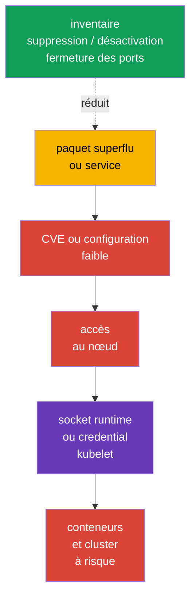
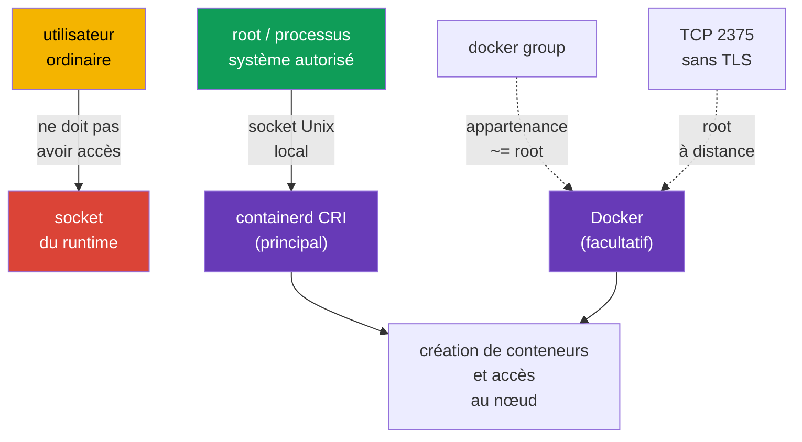

[Русская версия](ru.md) · [Eng version](README.md) · [Versión en español](es.md) · [Deutsche Version](de.md) · [ქართული ვერსია](ge.md) · [繁體中文版](tw.md) · [日本語版](jp.md)

# Chapitre 14. Minimiser l'empreinte de l'OS hôte et sécuriser le daemon runtime

> **Le problème.** Un paquet, service, listener ou socket superflu sur un nœud Kubernetes ajoute
> un binaire distinct avec des CVE et un chemin d'accès local ou réseau. La compromission d'un tel
> composant peut mener aux credentials de kubelet ou au socket de container runtime, en contournant
> les restrictions de l'API Kubernetes et en mettant en danger toutes les workload du nœud.

> **La suite.** Kubernetes limite les workload avec des policies, RBAC et SecurityContext - il
> réduit donc ce que la charge peut faire avec l'API et le nœud - mais tout cela repose sur un
> nœud Linux. Un service, paquet, port ouvert ou accès au socket runtime superflu donne à un
> attaquant un chemin pour contourner l'API Kubernetes. Dans cette partie du domaine **System
> Hardening** de CKS, nous réduisons la surface d'attaque du nœud lui-même : nous ne conservons que
> les services, paquets et points réseau nécessaires, et nous n'accordons le CRI runtime moderne
> containerd qu'à ceux qui en ont réellement besoin.

> **Ce qu'il faut connaître de CKA.** Le travail avec `systemd`, les processus, fichiers et le
> journal est abordé dans le [chapitre 0.5 de CKA](../../../cka/course/00-5-linux/fr.md). Le
> fonctionnement de Docker, containerd, cgroups et du cgroup driver est décrit dans le
> [chapitre 0.4 de CKA](../../../cka/course/00-4-containers/fr.md). Le rôle de CRI et le lien entre
> kubelet et containerd sont expliqués dans le [chapitre 40 de CKA](../../../cka/course/40/fr.md).
> Nous ne répétons pas ici le fonctionnement du runtime, mais limitons son accès et sa surface
> d'attaque.

## 14.1. Scénario d'attaque : un composant superflu devient un point d'entrée

Un nœud Kubernetes n'est pas un serveur universel pour toutes les tâches. Par exemple, sur un
worker, un environnement graphique, l'impression, Bluetooth, un partage de fichiers ou Docker
daemon ne sont généralement pas nécessaires lorsque kubelet utilise containerd. Chaque composant
installé, et surtout chaque composant en cours d'exécution, ajoute :

- des binaires et dépendances avec des CVE ;
- un processus avec des droits et une configuration ;
- un port en écoute ou un socket local ;
- des journaux, comptes, fichiers unit et un chemin de mauvaise configuration.



Ce n'est pas une invitation à tout supprimer sans distinction. `kubelet`, containerd, CNI, SSH
pour une administration convenue et les composants control-plane sur le nœud approprié peuvent
être nécessaires. Le but est d'obtenir une liste explicite : **composant -> propriétaire -> rôle
-> port/socket**. Si le rôle et le propriétaire sont inconnus, le composant est supprimé ou
désactivé après vérification des dépendances et du plan de rollback.

Avant toute modification, enregistrez l'état initial. Sur le control-plane, ne désactivez pas
`kubelet`, containerd, etcd ou les composants Kubernetes dans une session SSH dont dépend l'accès :
une erreur peut rendre le nœud et l'API indisponibles.

```bash
set -euo pipefail
sudo install -d -m 700 /root/hardening-before
sudo systemctl list-unit-files --type=service | sort \
  | sudo tee /root/hardening-before/services-enabled.txt >/dev/null
sudo systemctl list-units --type=service --state=running | sort \
  | sudo tee /root/hardening-before/services-running.txt >/dev/null
sudo ss -tulpn | sort | sudo tee /root/hardening-before/listeners.txt >/dev/null
if command -v dpkg-query >/dev/null; then
  sudo dpkg-query -W -f='${binary:Package}\t${Version}\n' | LC_ALL=C sort \
    | sudo tee /root/hardening-before/packages.txt >/dev/null
elif command -v rpm >/dev/null; then
  sudo rpm -qa | LC_ALL=C sort \
    | sudo tee /root/hardening-before/packages.txt >/dev/null
else
  echo 'REVIEW_REQUIRED: unsupported package manager; cannot create package inventory' >&2
  exit 2
fi
```

> 🧠 La compromission d'un nœud peut commencer par un processus, paquet, listener ou socket superflu ; maintenez une carte du composant, de son propriétaire, de son rôle et de l'accès autorisé.

> 🎯 Inventoriez le service, paquet, kernel module et listener ; ne modifiez que l'objet superflu, conservez le baseline et vérifiez `kubelet`/containerd. `disable --now`, removal et la fermeture d'un port demandent des vérifications différentes.
## 14.2. Inventorier et désactiver les services inutiles

Distinguez d'abord trois états. `systemctl list-units` affiche les unit chargés, `is-active` indique
si le processus s'exécute maintenant, et `is-enabled` s'il démarrera au boot. Un unit désactivé
peut encore être actif jusqu'à son arrêt explicite.

```bash
# Service units en cours d'exécution et leur état.
sudo systemctl list-units --type=service --state=running

# Tous les service units installés, y compris ceux qui sont désactivés.
sudo systemctl list-unit-files --type=service

# L'origine d'un service précis et ce qui le lance.
SERVICE='service-to-review.service'
sudo systemctl status "$SERVICE"
sudo systemctl cat "$SERVICE"
sudo systemctl show "$SERVICE" -p FragmentPath -p ExecStart -p User
sudo journalctl -u "$SERVICE" --since '24 hours ago'
```

Ce tableau de décision est utile avant toute commande :

| Constat | Question avant l'action | Décision habituelle |
|---|---|---|
| `kubelet.service` | Le nœud appartient-il au cluster ? | le conserver ; ne le corriger qu'en connaissance de cause |
| `containerd.service` | Est-ce le CRI endpoint de kubelet ? | le conserver sur un nœud Kubernetes |
| `docker.service`/`docker.socket` | Docker est-il nécessaire sur ce nœud ? | le supprimer/désactiver si le CRI est containerd et que Docker n'est pas requis |
| `sshd.service` | Existe-t-il un chemin bastion/console convenu ? | le conserver avec le hardening du chapitre 15, ou le désactiver uniquement si l'accès alternatif existe |
| `cups`, `avahi-daemon`, Bluetooth, GUI-service | Existe-t-il un rôle serveur documenté ? | généralement le supprimer ou le désactiver |
| service inconnu | Qui est le propriétaire, quel paquet et quel port ? | enquêter, ne pas deviner |

Pour un unit connu et inutile, l'opération de base sûre consiste à l'arrêter maintenant puis à
empêcher son démarrage automatique. La commande est réversible : `enable --now` restaurera le
service si nécessaire.

```bash
# Exemple uniquement après confirmation que le service n'est pas nécessaire sur ce nœud.
sudo systemctl disable --now avahi-daemon.service

# Vérifier les deux états.
sudo systemctl is-active avahi-daemon.service || true
sudo systemctl is-enabled avahi-daemon.service || true
```

`mask` est plus fort que `disable` : il interdit le démarrage manuel et par dépendance du unit en
le faisant pointer vers `/dev/null`. Utilisez-le pour un service qui ne doit certainement pas
apparaître dans l'image du nœud, et consignez l'exception dans l'image build/IaC. Ne masquez pas
une dépendance Kubernetes sans en comprendre les conséquences.

```bash
UNIT='confirmed-unwanted.service'

# Enregistrer l'état initial avant la modification.
sudo systemctl is-active "$UNIT" \
  > "/root/hardening-before/${UNIT}.active" 2>&1 || true
sudo systemctl is-enabled "$UNIT" \
  > "/root/hardening-before/${UNIT}.enabled" 2>&1 || true

# Mask + arrêt du unit déjà en cours d'exécution.
sudo systemctl mask --now "$UNIT"

# Démontrer les deux états.
sudo systemctl is-active "$UNIT" || true
sudo systemctl is-enabled "$UNIT" || true
```

Sans `--now`, `mask` bloque seulement les futurs démarrages manuels et par dépendance : un service
déjà en cours d'exécution continue de fonctionner. Pour le rollback, exécutez d'abord `systemctl
unmask <unit>`, puis restaurez précisément l'état active/enabled enregistré avant la modification.
N'exécutez pas automatiquement `enable --now` si le unit n'était pas enabled et active avant le
hardening.

## 14.3. Paquets superflus et image minimale de l'OS

Arrêter un service ne suffit pas : le paquet, ses bibliothèques, le timer/socket unit et un futur
CVE restent sur le nœud. Inventoriez les paquets, identifiez quel paquet a fourni le binaire et
vérifiez les reverse dependencies. Sur Debian/Ubuntu :

```bash
PACKAGE='package-to-review'
BINARY='binary-to-review'
apt list --installed 2>/dev/null | less
apt-cache policy "$PACKAGE"
dpkg -S "$(command -v "$BINARY")"
apt-cache rdepends --installed "$PACKAGE"

# Afficher les paquets installés manuellement : point de départ pour la revue de l'image.
apt-mark showmanual | sort
```

Après revue, supprimez exactement le paquet confirmé. `apt purge` supprime aussi sa
configuration ; avant `autoremove`, lisez d'abord la liste, car elle peut inclure une bibliothèque
nécessaire ou un outil de diagnostic.

```bash
PACKAGE='confirmed-unneeded-package'
sudo apt purge "$PACKAGE"
sudo apt autoremove --dry-run
# Exécutez autoremove uniquement après avoir revu sa liste.
sudo apt autoremove
# Aucun apt upgrade de masse n'est délibérément exécuté ici : le patching a lieu dans une change window distincte.
```

Sur les systèmes RPM, les équivalents sont `rpm -qa`, `dnf repoquery --installed` et `dnf remove`.
Ne mélangez pas le hardening système à une mise à jour massive non contrôlée : les mises à jour,
la version de l'image et le rollback doivent suivre le processus d'exploitation habituel.

Une **image minimale de l'OS** est préférable au nettoyage manuel de chaque nœud déjà en cours
d'exécution. Dans l'image/la configuration du nœud, déclarez les paquets et services nécessaires,
excluez le desktop, les compilers, les outils de test et les agents inutiles, puis reconstruisez
régulièrement l'image avec les patchs. La minimalité ne signifie pas l'absence de moyens de
restauration : une méthode convenue d'accès, de journalisation et de diagnostic doit demeurer.

> 🏭 **Production.** Un OS Kubernetes spécialisé - par exemple,
> [Bottlerocket](https://bottlerocket.dev/) - peut réduire l'empreinte mutable de l'hôte grâce à
> une image immutable délibérément minimale et à un workflow de mise à jour contrôlé. C'est un
> choix d'architecture : avant le rollout en production, vérifiez en stage la prise en charge de
> la version Kubernetes cible, de CNI/CSI, du bootstrap, de l'observability, de l'accès debug et
> du rollback. Ne transposez pas sur un tel OS les commandes `apt`/`dpkg` ou les chemins d'une
> distribution Linux habituelle sans sa documentation officielle.

| Approche | Avantage | Risque et contrôle |
|---|---|---|
| Supprimer un paquet sur un nœud en cours d'exécution | élimine rapidement une surface connue | dérive entre les nœuds ; la consigner dans IaC/image |
| Golden image avec allowlist de paquets | état uniforme et auditable | un processus de reconstruction et de mise à jour est nécessaire |
| Immutable/minimal OS | moins de paquets et de changements au runtime | prévoir à l'avance le debug et les mises à jour |
| « Tout supprimer si c'est inconnu » | aucun | peut casser kubelet, CNI, storage, monitoring ou l'accès |

## 14.4. Modules du kernel : inventaire et désactivation contrôlée

Un module du kernel fait partie de la surface d'attaque, mais ce n'est pas un « paquet superflu »
que l'on peut supprimer sans conséquences. Enregistrez d'abord les modules chargés, leurs
paramètres et les règles de chargement ; vérifiez le rôle du module auprès du propriétaire de
l'image et dans la documentation de l'OS.

```bash
MODULE='example_module'
lsmod | sort
sudo modinfo "$MODULE"
# `modprobe -c` est la source de vérité pour l'effective configuration.
EFFECTIVE_MODPROBE_CONFIG=$(sudo modprobe -c) || {
  echo 'ERROR: cannot read effective modprobe configuration' >&2
  exit 2
}
printf '%s\n' "$EFFECTIVE_MODPROBE_CONFIG" \
  | grep -E "^(blacklist|install)[[:space:]]+${MODULE}\b" || true
sudo modprobe -n -v "$MODULE"
# Ces fichiers servent uniquement à trouver la source de la règle ; ils peuvent être overridden.
sudo find /etc/modprobe.d /run/modprobe.d /usr/local/lib/modprobe.d \
  /usr/lib/modprobe.d /lib/modprobe.d -type f -print 2>/dev/null | sort
sudo grep -RnsE "^(blacklist|install)[[:space:]]+${MODULE}\b" \
  /etc/modprobe.d /run/modprobe.d /usr/local/lib/modprobe.d /usr/lib/modprobe.d /lib/modprobe.d \
  2>/dev/null || true
```

`modprobe -c` affiche les règles finales en tenant compte de la precedence ; les `find`/`grep`
au niveau des fichiers ne servent qu'à retrouver la source de la règle affichée et peuvent
montrer des entrées écrasées. Pour un module précis, `modprobe -n -v` affiche l'action effective
que `modprobe` appliquera.

`modprobe -r <module>` décharge le module **seulement temporairement** : cela ne survit pas à un
reboot et échoue si le module est utilisé ou retenu par une dépendance. L'interdiction permanente
se définit dans une configuration `modprobe` gérée ; `blacklist` empêche le chargement autoload
habituel, et `install ... /bin/false` bloque également un `modprobe` explicite par cette règle.
Les deux mécanismes ne sont appliqués ensemble qu'après avoir vérifié que le module n'est vraiment
pas nécessaire.

```bash
MODULE='example_module'
# Dans une change window : vérification temporaire ; n'essayez pas de décharger de force un module utilisé.
sudo modprobe -r "$MODULE"

# Règle permanente dans l'image/IaC, pas une dérive manuelle du nœud.
sudo tee "/etc/modprobe.d/disable-${MODULE}.conf" >/dev/null <<EOF
blacklist $MODULE
install $MODULE /bin/false
EOF

# Pour Debian/Ubuntu, mettez à jour initramfs si le module peut être chargé tôt.
sudo update-initramfs -u
sudo modprobe -n -v "$MODULE"       # la règle install /bin/false est attendue
```

Après un reboot planifié, vérifiez `lsmod`, `modprobe -n -v` et la santé du nœud. Des modules
peuvent être nécessaires au CNI, au storage driver, au runtime ou au matériel réseau/disque.
Testez d'abord sur un nœud drained/staging, puis effectuez le rollout node-by-node en vérifiant
`kubelet`, containerd, CNI et les workload ; n'appliquez pas la blacklist à tout le pool
simultanément.

## 14.5. Ports ouverts : listener, rôle et périmètre réseau

Un port n'est pas dangereux en lui-même - un service inconnu ou accessible depuis de mauvaises
sources l'est. Établissez d'abord la correspondance « listener - PID - unit - sources
nécessaires », puis restreignez le service et le firewall. `ss` est habituellement disponible
sur les Linux modernes ; `lsof` et `netstat` sont utiles comme alternatives.

```bash
# Listeners TCP et UDP avec processus et PID (root est requis pour obtenir toutes les informations).
sudo ss -tulpn
sudo lsof -nP -iTCP -sTCP:LISTEN
sudo netstat -tulpn                    # si le paquet net-tools est installé

# Les Unix sockets runtime ne sont pas visibles dans la sortie TCP/UDP.
sudo ss -lxnp | grep -E 'docker|containerd' || true
```

| Point | Où il est habituellement nécessaire | Direction sûre |
|---|---|---|
| SSH `22/tcp` | accès administré au nœud | uniquement les CIDR bastion/VPN/administratifs |
| kubelet `10250/tcp` | control-plane et diagnostic convenu | ne pas l'ouvrir à Internet ; TLS, authn/authz et firewall |
| kube-apiserver `6443/tcp` | control-plane ; worker et administrateurs selon l'architecture | allowlist/private endpoint, pas `0.0.0.0/0` |
| etcd `2379`, `2380/tcp` | uniquement control-plane/etcd peers | ne pas publier sur les worker ou le réseau externe |
| Docker TCP API (souvent `2375`/`2376`) | uniquement avec une administration distante justifiée | ne pas écouter sur `2375` ; tout TCP endpoint requiert une exception explicite, mTLS et un firewall précis |

| containerd/NRI Unix socket | localement sur le nœud | `root` et l'ensemble minimal des consommateurs système autorisés |

Ne tirez pas de conclusion du seul numéro de port sans le processus : par exemple, `6443` est
attendu sur le control-plane, mais peut être une erreur sur un worker ; `10250` est nécessaire à
kubelet, mais ne doit pas être public. Le filtre réseau complète, sans remplacer, la désactivation
d'un service superflu. La restriction détaillée de l'accès externe et de SSH est traitée dans le
chapitre 15.

```bash
SERVICE='service-owning-the-listener.service'
PORT='10250'
# Vérifiez d'abord le listener précis et son unit.
sudo ss -lntp | grep -E ':(22|10250|6443|2379|2380|2375|2376)\b' || true
sudo systemctl status "$SERVICE"

# Après la suppression/désactivation du service, le port doit disparaître. Une erreur de ss ne signifie pas l'absence de listener.
listeners=$(sudo ss -H -lnt "( sport = :${PORT} )") || {
  echo "ERROR: cannot inspect TCP listener ${PORT}" >&2; exit 2;
}
if [ -n "$listeners" ]; then
  printf 'ERROR: TCP port %s is still listening:\n%s\n' "$PORT" "$listeners" >&2
  exit 1
fi
echo "OK: TCP listener ${PORT} is absent"
```

> 🎯 Inventoriez le service, paquet, kernel module et listener ; ne modifiez que l'objet superflu, conservez le baseline et vérifiez `kubelet`/containerd. `disable --now`, removal et la fermeture d'un port demandent des vérifications différentes.

## 14.6. Sécurité de containerd et de Docker facultatif

Sur un nœud Kubernetes moderne, containerd est le runtime CRI principal ; le daemon Docker et son
socket ne font pas partie du baseline CRI et ne sont nécessaires que pour une tâche distincte et
confirmée. Un daemon de runtime possède plus de privilèges qu'un conteneur ordinaire. Un client
capable d'accéder à l'API containerd, NRI ou Docker peut souvent lancer un conteneur privilégié,
monter le filesystem de l'hôte ou obtenir les credentials du nœud. Le socket Unix est donc une
frontière d'accès, pas un détail d'implémentation inoffensif.

> 🎯 L'accès au socket CRI containerd est réservé à `root` et au minimum de consommateurs système, sans mode world-writable ni mount dans un workload non privilégié.



> 🔬 Docker ne s'applique qu'à un hôte Docker ; NRI/debug/metrics nécessitent des vérifications spécifiques à la version et au runtime.

### Docker : aucune API TCP non authentifiée

`dockerd -H tcp://0.0.0.0:2375` ouvre l'API Docker à tous ceux qui peuvent atteindre le port.
Sur `2375`, il n'y a ni TLS ni authentification : c'est pratiquement un accès root à distance. Il
ne doit apparaître ni dans le `ExecStart` d'un unit systemd, ni dans un drop-in, ni dans
`/etc/docker/daemon.json`. N'essayez pas de « protéger » `2375` avec le seul firewall : une erreur
de règle rendrait à nouveau l'API accessible.

```bash
set -euo pipefail
# Cette porte vérifie indépendamment la configuration effective et les listeners effectifs.
# false est le baseline sûr ; true n'est admis que pour une exception de risque documentée.
ALLOW_REMOTE_DOCKER_API=false
declare -a TCP_CONFIGURATION_SOURCES=()
USES_SOCKET_ACTIVATION=false

add_tcp_source() {
  TCP_CONFIGURATION_SOURCES+=("$1")
}

# Classer les valeurs Docker -H/--host normalisées. Unix et fd ne sont pas TCP ;
# host:, host:port, :port, le port numérique et tcp:// sont des formes TCP.
classify_docker_host() {
  local source=$1 host=$2
  case "$host" in
    unix://*|/*|@*) ;;
    fd://*) USES_SOCKET_ACTIVATION=true ;;
    tcp://*|*:*|[0-9]*) add_tcp_source "$source: $host" ;;
    *)
      printf 'REVIEW_REQUIRED: cannot classify Docker host value from %s: %s\n' "$source" "$host" >&2
      exit 2
      ;;
  esac
}

# Configuration effective du service systemd, plus argv d'un daemon actif.
DOCKER_SERVICE_EXEC=$(sudo systemctl show docker.service -p ExecStart --value 2>/dev/null || true)
DOCKER_PID=$(pgrep -xo dockerd || true)
DOCKER_CMDLINE=''
if [ -n "$DOCKER_PID" ]; then
  DOCKER_CMDLINE=$(sudo cat "/proc/$DOCKER_PID/cmdline" | tr '\0' '\n') || {
    echo 'ERROR: cannot read dockerd argv' >&2
    exit 2
  }
fi

# Analyser toutes les formes -H/--host du ExecStart effectif, y compris -H=<value>.
mapfile -t EXEC_HOST_DIRECTIVES < <(
  printf '%s\n' "$DOCKER_SERVICE_EXEC"     | grep -Eo -- '(-H|--host)(=|[[:space:]]+)[^[:space:]]+' || true
)
for directive in "${EXEC_HOST_DIRECTIVES[@]}"; do
  case "$directive" in
    -H=*) host=${directive#-H=} ;;
    --host=*) host=${directive#--host=} ;;
    -H\ *) host=${directive#-H } ;;
    --host\ *) host=${directive#--host } ;;
    *)
      printf 'REVIEW_REQUIRED: cannot normalize ExecStart host directive: %s\n' "$directive" >&2
      exit 2
      ;;
  esac
  classify_docker_host 'docker.service ExecStart' "$host"
done

# argv est séparé par NUL ; analyser ses valeurs individuelles sans ambiguïté de guillemets.
mapfile -t DOCKER_ARGV <<< "$DOCKER_CMDLINE"
for ((i = 0; i < ${#DOCKER_ARGV[@]}; i++)); do
  case "${DOCKER_ARGV[i]}" in
    -H|--host)
      ((++i < ${#DOCKER_ARGV[@]})) || {
        echo 'REVIEW_REQUIRED: dockerd host flag has no value' >&2
        exit 2
      }
      classify_docker_host 'dockerd argv' "${DOCKER_ARGV[i]}"
      ;;
    -H=*) classify_docker_host 'dockerd argv' "${DOCKER_ARGV[i]#-H=}" ;;
    --host=*) classify_docker_host 'dockerd argv' "${DOCKER_ARGV[i]#--host=}" ;;
  esac
done

# Un chemin de configuration personnalisé ne se déduit pas sûrement de grep ; exiger sa revue explicite.
if printf '%s\n' "$DOCKER_SERVICE_EXEC" "$DOCKER_CMDLINE"   | grep -Eq -- '--config-file(=|[[:space:]])'; then
  echo 'REVIEW_REQUIRED: dockerd uses --config-file; parse that effective config before allowing Docker TCP API' >&2
  exit 2
fi

# Analyser hosts dans la configuration par défaut. Sans jq, une clé hosts exige une revue, pas PASS.
if sudo test -f /etc/docker/daemon.json && sudo grep -qE '"hosts"[[:space:]]*:' /etc/docker/daemon.json; then
  command -v jq >/dev/null || {
    echo 'REVIEW_REQUIRED: jq is required to parse daemon.json hosts safely' >&2
    exit 2
  }
  DOCKER_CONFIG_HOSTS=$(sudo jq -er '
    if .hosts? == null then empty
    elif (.hosts | type) == "array" and all(.hosts[]; type == "string") then .hosts[]
    else error("daemon.json hosts must be an array of strings") end
  ' /etc/docker/daemon.json) || {
    echo 'REVIEW_REQUIRED: cannot parse daemon.json hosts' >&2
    exit 2
  }
  while IFS= read -r host; do
    [ -z "$host" ] || classify_docker_host 'daemon.json hosts' "$host"
  done <<< "$DOCKER_CONFIG_HOSTS"
fi

# `Listen` est la propriété effective du socket systemd. Distinguer un unit absent d'un
# unit dont la configuration effective est illisible ; ne transformez jamais ce dernier en PASS.
DOCKER_SOCKET_LOAD_STATE=$(sudo systemctl show docker.socket -p LoadState --value 2>/dev/null) || {
  echo 'REVIEW_REQUIRED: cannot determine whether docker.socket exists' >&2
  exit 2
}
case "$DOCKER_SOCKET_LOAD_STATE" in
  not-found) DOCKER_SOCKET_PRESENT=false ;;
  '')
    echo 'REVIEW_REQUIRED: empty docker.socket LoadState' >&2
    exit 2
    ;;
  *) DOCKER_SOCKET_PRESENT=true ;;
esac
if [ "$DOCKER_SOCKET_PRESENT" = true ]; then
  DOCKER_SOCKET_LISTEN=$(sudo systemctl show docker.socket -p Listen --value) || {
    echo 'REVIEW_REQUIRED: cannot read effective docker.socket Listen configuration' >&2
    exit 2
  }
  [ -n "$DOCKER_SOCKET_LISTEN" ] || {
    echo 'REVIEW_REQUIRED: docker.socket has no effective Listen entries' >&2
    exit 2
  }
  while IFS= read -r listen_entry; do
    listen_entry=${listen_entry#"${listen_entry%%[![:space:]]*}"}
    [ -z "$listen_entry" ] && continue
    case "$listen_entry" in
      *' (Stream)') socket_address=${listen_entry% (Stream)} ;;
      *)
        printf 'REVIEW_REQUIRED: cannot classify non-stream docker.socket Listen entry: %s\n' "$listen_entry" >&2
        exit 2
        ;;
    esac
    case "$socket_address" in
      /*|@*) ;;  # sockets Unix de filesystem et abstraits
      *:*) add_tcp_source "docker.socket Listen: $socket_address" ;;
      *)
        if [[ "$socket_address" =~ ^[0-9]+$ ]]; then
          add_tcp_source "docker.socket Listen: $socket_address"
        else
          printf 'REVIEW_REQUIRED: cannot classify docker.socket Listen address: %s\n' "$socket_address" >&2
          exit 2
        fi
        ;;
    esac
  done <<< "$DOCKER_SOCKET_LISTEN"
elif [ "$USES_SOCKET_ACTIVATION" = true ]; then
  echo 'REVIEW_REQUIRED: dockerd uses fd:// but docker.socket is absent' >&2
  exit 2
fi

# Les listeners actuels constituent des preuves distinctes. Chercher dockerd dans toutes les métadonnées du processus, pas seulement dans la première.
listeners_2375=$(sudo ss -H -lnt '( sport = :2375 )') || {
  echo 'ERROR: cannot inspect TCP 2375' >&2
  exit 2
}
dockerd_tcp_listeners=$(sudo ss -H -lntp | awk 'index($0, "\"dockerd\"")') || {
  echo 'ERROR: cannot inspect dockerd TCP listeners' >&2
  exit 2
}

TCP_EVIDENCE=$(printf '%s\n%s\n' "${TCP_CONFIGURATION_SOURCES[*]-}" "$dockerd_tcp_listeners")
if [ -n "$listeners_2375" ] || [ -n "${TCP_CONFIGURATION_SOURCES[*]-}" ] || [ -n "$dockerd_tcp_listeners" ]; then
  printf 'Docker TCP configuration/listener evidence:\n%s\n' "$TCP_EVIDENCE" >&2
  if printf '%s\n%s\n' "$listeners_2375" "$TCP_EVIDENCE"     | grep -Eq '(^|[^0-9])2375([^0-9]|$)'; then
    echo 'ERROR: Docker TCP 2375 is configured or listening' >&2
    exit 1
  fi
  if [ "$ALLOW_REMOTE_DOCKER_API" != true ]; then
    echo 'ERROR: unexpected Docker TCP endpoint is configured or listening' >&2
    exit 1
  fi
  echo 'REVIEW_REQUIRED: every allowed endpoint needs effective tlsverify=true, CA, server certificate/key, verified client-certificate authentication and firewall/security-group allowlist.' >&2
  exit 2
fi
echo 'OK: no Docker TCP endpoint is configured or listening'
```

Dans une installation systemd typique, Docker reçoit `-H fd://` : `docker.socket` crée
habituellement un socket Unix local. Ne le supposez pas sans vérifier : la propriété systemd
effective `Listen` peut définir un listener TCP qui existe avant même le démarrage de `dockerd`.
La vérification ci-dessus analyse uniquement les entrées `Stream` : le chemin `/…` et le socket
Unix abstrait `@…` restent Unix, tandis qu'un port, `host:port` et `[IPv6]:port` sont considérés
comme TCP. N'ajoutez pas simultanément `hosts` dans `daemon.json` et `-H` dans le unit : Docker
s'arrête lorsque les configurations sont en conflit. Retirez uniquement le TCP endpoint de la
source active, puis vérifiez la configuration et redémarrez un seul service à la fois.

```bash
# Pour daemon.json, vérifier d'abord la syntaxe et les clés prises en charge.
sudo dockerd --validate --config-file=/etc/docker/daemon.json
sudo systemctl daemon-reload
sudo systemctl restart docker.service
sudo systemctl --no-pager --full status docker.service
sudo journalctl -u docker.service -n 50 --no-pager
```

Si l'API Docker distante est réellement une exigence convenue, le numéro de port ne prouve ni TLS
ni mTLS : même `2376` n'est pas une preuve. Pour **chaque** TCP endpoint autorisé, confirmez
`tlsverify=true` effectif, la CA, le server certificate et la key, ainsi que l'authentification
réelle par client certificate ; restreignez les sources avec un firewall/security group et un
management network dédié. Il s'agit d'une exception avec un propriétaire du risque, pas d'un
default pour un nœud Kubernetes.

### containerd, NRI et limites du système de fichiers du runtime

Le socket CRI principal se trouve habituellement dans `/run/containerd/containerd.sock` ; le chemin
du socket NRI est configurable et vaut souvent `/run/nri/nri.sock` (équivalent à
`/var/run/nri/nri.sock`). L'accès à **l'un ou l'autre** est root-equivalent. Réservez-le à `root`
et au minimum de processus système. Si un groupe est nécessaire aux opérations, il doit s'agir d'un
groupe système dédié, sans utilisateurs ordinaires ; n'y ajoutez pas de développeurs, de comptes
CI ni de workload identity. Ne montez jamais `containerd.sock` ou `nri.sock` dans un conteneur non
privilégié.

Il n'existe pas de `chmod` universel pour un socket Docker ou containerd : le chemin, le propriétaire,
le groupe et le mode sont définis par le paquet, le unit systemd et la policy du nœud concerné.
N'utilisez pas de modes world-writable et ne corrigez pas les permissions par une commande ponctuelle
si systemd recrée le socket. Identifiez d'abord le propriétaire de la configuration, puis fixez
l'accès minimal requis par la configuration prise en charge de l'image/IaC et vérifiez-le après un
redémarrage.

```bash
sudo systemctl status containerd.service --no-pager
sudo systemctl cat containerd.service
sudo stat -Lc '%A %a %U:%G %n' /run/containerd/containerd.sock \
  /run/nri/nri.sock 2>/dev/null || true
sudo ss -lxnp | grep -E 'containerd\.sock|nri\.sock' || true

# Le diagnostic CRI s'effectue localement et avec root ; comparer l'endpoint à la config kubelet.
sudo crictl --runtime-endpoint unix:///run/containerd/containerd.sock ps
sudo grep -Rns -- '--container-runtime-endpoint\|containerRuntimeEndpoint' \
  /var/lib/kubelet /etc/systemd/system /usr/lib/systemd/system 2>/dev/null || true
```

Ne protégez pas seulement le socket. `/run/containerd` contient l'état et les sockets du runtime, et
`/var/lib/containerd` contient le contenu et les metadata persistants. Pour containerd, la référence
est `0700` pour `/var/lib/containerd` et `0711` pour la racine de `/run/containerd` : ce second mode
permet la traversal, qui peut être nécessaire aux workload avec user namespace, mais ne révèle pas
le contenu du répertoire. Les sous-répertoires sensibles doivent être en `0700`, les sockets en
`0660` avec un groupe système sans utilisateurs non privilégiés ; aucun chemin ne doit être writable
par des utilisateurs ordinaires ou des conteneurs. La configuration, les plugins et le CNI doivent
également être root-owned et protégés contre l'écriture par des sujets non autorisés : il s'agit
habituellement de `/etc/containerd`, des répertoires de plugins du runtime et de `/etc/cni/net.d`,
et les CNI binaries sont dans `/opt/cni/bin` (vérifiez les chemins précis avec la distribution et la
configuration). Ne les modifiez pas par un large `chmod -R` : contrôlez précisément l'ownership et
les bits writable.

```bash
sudo find /run/containerd /var/lib/containerd /etc/containerd /etc/cni/net.d /opt/cni/bin \
  -xdev -printf '%m %u:%g %p\n' 2>/dev/null | sort
```

Dans containerd 2.0, NRI est activé par défaut. C'est un point de décision explicite : si NRI n'est
pas utilisé, désactivez le plugin dans une configuration vérifiée (`[plugins."io.containerd.nri.v1.nri"]`
et `disable = true`) ; s'il est utilisé, considérez les plugins NRI, leur configuration et les
connexions aux plugins externes comme faisant partie du TCB du runtime, et restreignez leurs chemins
et leur accès.

Debug et metrics sont des surfaces d'API distinctes. Restreignez le socket debug Unix à `root` et
aux consommateurs système autorisés ; ne publiez jamais un endpoint debug TCP. Les metrics de
containerd n'ont souvent ni TLS ni authentification : liez-les uniquement à loopback ou à une
interface de management dédiée, et restreignez-les aussi par le firewall/routage. Avant toute
modification, vérifiez les paramètres pris en charge par votre version précise de containerd et
contrôlez les listeners avec `ss` après le redémarrage.

### Docker : seulement s'il est réellement nécessaire

Si Docker est conservé pour une tâche distincte, son socket et le groupe `docker` sont aussi
root-equivalent. N'accordez pas l'appartenance à des utilisateurs ordinaires, ne montez pas le socket
dans un workload non privilégié et ne supposez pas un owner/mode identique pour toutes les
installations : suivez la policy du unit/paquet et vérifiez l'accès avec un compte auquel il est
refusé.

```bash
readlink -f /var/run/docker.sock 2>/dev/null || true
sudo stat -Lc '%A %a %U:%G %n' /var/run/docker.sock 2>/dev/null || true
getent group docker || true
getent group docker | awk -F: '{print $4}'
UNPRIVILEGED_USER='unprivileged-user'
sudo -u "$UNPRIVILEGED_USER" docker ps  # l'accès doit être refusé à un utilisateur non autorisé
```

Si Docker n'est pas nécessaire sur un nœud Kubernetes, il est plus fiable de supprimer le paquet, ou
de désactiver et masquer `docker.service` et `docker.socket` après avoir confirmé que kubelet ou les
tâches opérationnelles n'en dépendent pas.

### Hardening de `/etc/docker/daemon.json`

`daemon.json` est une source de configuration Docker. Il ne remplace pas le firewall, les permissions
du socket, SecurityContext ni les policies Kubernetes, mais définit un baseline sûr pour le daemon.
N'ajoutez pas `hosts` si systemd transmet déjà `-H fd://`.

#### Nouvel hôte Docker

Le baseline suivant s'applique à une **nouvelle** installation Docker après vérification de la prise
en charge de la version et de la compatibilité avec le workload prévu :

```json
{
  "live-restore": true,
  "no-new-privileges": true,
  "userns-remap": "default",
  "log-driver": "local"
}
```

| Clé | Ce qu'elle fournit | À vérifier avant l'activation |
|---|---|---|
| `live-restore` | peut garder les conteneurs en cours d'exécution pendant que le daemon est indisponible | workflow de mise à jour, monitoring et comportement de redémarrage attendu ; pas une garantie pour chaque changement de config/migration |
| `no-new-privileges` | empêche les nouveaux processus de conteneur d'escalader leurs privilèges par `setuid`/file capabilities | applications ayant par erreur besoin d'une élévation de privilèges ; les conteneurs existants doivent être recréés |
| `userns-remap` | mappe le root du conteneur vers un UID hôte non privilégié | volumes, ownership, images et compatibilité ; ne pas l'activer sans test sur un nœud similaire à la production |
| `log-driver: local` | limite la croissance des logs JSON, avec une rotation gérée par le driver | collecte et rétention centralisées des logs ; les conteneurs existants ne migrent pas automatiquement |

#### Hôte Docker existant : migration distincte

N'appliquez pas ce JSON à un hôte Docker existant comme une simple modification de configuration
suivie d'un redémarrage. Avant le changement, dressez l'inventaire des containers/images/volumes,
vérifiez `/etc/subuid` et `/etc/subgid`, les bind mounts, le host networking et les conteneurs
privilégiés, évaluez la compatibilité avec `userns-remap` et préparez un plan de recreate/migration
et de rollback.

```bash
set -euo pipefail
sudo docker ps -a --no-trunc
sudo docker image ls
sudo docker volume ls
sudo docker network ls
sudo grep -Ev '^[[:space:]]*(#|$)' /etc/subuid /etc/subgid 2>/dev/null || true
# Pour chaque workload séparément : sudo docker inspect <container> ; vérifier mounts, réseau et privilèges.
```

`no-new-privileges` en tant que default du daemon s'applique aux nouveaux conteneurs ; les existants
doivent être recréés. Modifier `log-driver` ne migre pas automatiquement les conteneurs existants.
`userns-remap` modifie la vue des namespaces/du stockage et l'ownership de Docker, ce qui exige une
migration distincte. `live-restore` ne garantit pas sans condition que les conteneurs survivent à
toute modification de configuration du daemon. Pour un nœud Kubernetes avec containerd, ce n'est ni
un réglage containerd ni un remplacement de `runAsNonRoot` ; appliquez Docker seulement à un hôte
Docker dédié après test.

Ne créez jamais `daemon.json` par-dessus un fichier existant avec `install /dev/null` : sauvegardez
d'abord la configuration actuelle. Ne créez un nouveau fichier vide que s'il n'existe pas déjà.

```bash
sudo install -d -m 0755 /etc/docker

if sudo test -e /etc/docker/daemon.json; then
  # Sauvegarder d'abord la configuration existante.
  sudo cp -a /etc/docker/daemon.json /root/hardening-before/daemon.json.before
  sudo chown root:root /etc/docker/daemon.json
  sudo chmod 0600 /etc/docker/daemon.json
else
  # Créer un fichier vide seulement s'il n'existe pas encore.
  sudo install -m 0600 -o root -g root /dev/null /etc/docker/daemon.json
fi

sudoedit /etc/docker/daemon.json
sudo dockerd --validate --config-file=/etc/docker/daemon.json
sudo systemctl restart docker.service
sudo systemctl --no-pager --full status docker.service
sudo docker info --format '{{json .SecurityOptions}}'
```

> 🎯 Prouvez la minimisation par un diff avant/après et des contrôles négatifs : le service superflu n'est ni active ni enabled, le listener et `2375` sont absents, et un utilisateur non privilégié n'obtient pas d'accès au runtime.

## 14.7. Vérifier le résultat : prouver que le nœud est minimal

La vérification porte à la fois sur le fait de la configuration et sur le fait de l'accès. Il ne
suffit pas de voir la bonne ligne dans un fichier : le service peut ne pas avoir relu la
configuration et le socket peut avoir été recréé avec le groupe précédent. Effectuez un diff
avant/après et un test au nom d'un utilisateur dont l'accès a été retiré.

```bash
set -euo pipefail
sudo install -d -m 700 /root/hardening-after

# 1. Services : snapshots avant/après et diff des états running + enabled.
sudo systemctl list-units --type=service --state=running | sort \
  | sudo tee /root/hardening-after/services-running.txt >/dev/null
sudo systemctl list-unit-files --type=service | sort \
  | sudo tee /root/hardening-after/services-enabled.txt >/dev/null
sudo diff -u /root/hardening-before/services-running.txt \
  /root/hardening-after/services-running.txt || true
sudo diff -u /root/hardening-before/services-enabled.txt \
  /root/hardening-after/services-enabled.txt || true

# 2. Paquets et listeners réseau : snapshot adapté à la distribution, puis expliquez chaque diff.
if command -v dpkg-query >/dev/null; then
  sudo dpkg-query -W -f='${binary:Package}\t${Version}\n' | LC_ALL=C sort \
    | sudo tee /root/hardening-after/packages.txt >/dev/null
elif command -v rpm >/dev/null; then
  sudo rpm -qa | LC_ALL=C sort \
    | sudo tee /root/hardening-after/packages.txt >/dev/null
else
  echo 'REVIEW_REQUIRED: unsupported package manager; cannot create package inventory' >&2
  exit 2
fi
sudo ss -tulpn | sort | sudo tee /root/hardening-after/listeners.txt >/dev/null
sudo diff -u /root/hardening-before/packages.txt \
  /root/hardening-after/packages.txt || true
sudo diff -u /root/hardening-before/listeners.txt \
  /root/hardening-after/listeners.txt || true

# 3. Docker TCP : répétez intégralement le gate canonique de §14.6, pas seulement la vérification `ss`.
# PASS n'est possible que si aucun endpoint TCP n'existe simultanément dans ExecStart/argv effectif,
# les hosts/default de daemon.json ou une configuration personnalisée explicitement revue, Listen effectif de docker.socket
# et le listener actuel. TCP Listen peut exister avant le démarrage de dockerd.

# 4. Le socket runtime reste local ; owner/mode correspondent à la policy du unit/package,
#    ne donnent pas accès aux utilisateurs ordinaires et ne sont pas world-writable.
for socket in /run/containerd/containerd.sock /run/nri/nri.sock /var/run/docker.sock; do
  if [ -S "$socket" ]; then
    sudo stat -Lc '%A %a %U:%G %n' "$socket"
  fi
done

# 5. Debug ne doit pas être public, metrics pas sur toutes les interfaces sans TLS/auth.
sudo ss -lntup | grep -E 'containerd|debug|metrics' || true
```

**DoD - nœud minimal :**

- [ ] Chaque service actif a un objectif, un propriétaire et un port/socket attendu.
- [ ] Les services inutiles sont arrêtés avec `systemctl disable --now` et, s'ils sont de nouveau
  dangereux, masqués si nécessaire ; kubelet/containerd et les composants nécessaires ne sont pas cassés.
- [ ] Les paquets inutilement présents ont été supprimés ; l'image du nœud dispose d'une allowlist
  de paquets et d'un processus de mise à jour, et non d'une dérive manuelle non documentée.
- [ ] `ss -tulpn` ne contient aucun listener inexpliqué ; `10250`, `6443`, etcd et SSH sont accessibles
  uniquement là et depuis les sources requises par l'architecture.
- [ ] `2375` n'est ni configuré ni en écoute ; le gate complet analyse `ExecStart`/argv effectif,
  les hosts de `daemon.json` ou une configuration personnalisée explicitement revue, `Listen` effectif de
  `docker.socket` et `ss -lntp`. Aucun endpoint Docker TCP non autorisé n'existe sur **quelque** port
  que ce soit, y compris un endpoint qui n'écoute pas encore ou est socket-activated. Un endpoint
  autorisé a un responsable du risque, `tlsverify=true` effectif, une CA, un server certificate/key,
  une authentification par client-certificate confirmée et une allowlist de firewall/security-group ;
  `2376` ne prouve pas à lui seul mTLS.
- [ ] `/run/containerd/containerd.sock` et, s'il est présent, `/run/nri/nri.sock` ne sont pas
  accessibles aux utilisateurs ordinaires, ne sont pas montés dans un workload non privilégié et
  `sudo crictl` continue de fonctionner ; les groupes autorisés ne contiennent que des sujets système.
- [ ] `/run/containerd`, `/var/lib/containerd`, la configuration/plugins/CNI sont root-owned et ne sont
  pas writable par des sujets non autorisés ; aucun endpoint debug TCP n'est public et les metrics sans
  TLS/auth sont limitées à loopback ou à une interface de management.
- [ ] Si Docker est installé, son accès est limité par la policy du unit/package et un utilisateur
  ordinaire ne peut pas exécuter `docker ps` ; `daemon.json` a passé `dockerd --validate`.
- [ ] Docker/containerd et kubelet sont healthy, et les changements sont consignés dans l'image/IaC/change record.

## 14.8. Erreurs fréquentes et diagnostic

| Symptôme | Cause probable | À vérifier et corriger |
|---|---|---|
| `docker` écoute toujours sur `2375` | TCP est défini dans un drop-in systemd, `ExecStart` ou `daemon.json` | `systemctl cat docker.service docker.socket`, `ps -ef`, rechercher `tcp://` ; supprimer la source active et redémarrer le daemon |
| Docker ne démarre pas après la modification | conflit entre `hosts` dans le JSON et `-H` dans le unit, ou JSON invalide | `dockerd --validate`, `journalctl -u docker`, ne conserver qu'une source de hosts |
| une modification ponctuelle des permissions du socket disparaît après le redémarrage | systemd ou le runtime recrée le socket | trouver le propriétaire unit/package avec `systemctl cat`, ancrer la policy dans IaC/drop-in, revérifier `stat` |
| l'utilisateur peut toujours faire `docker ps` ou accéder au runtime | une ancienne session de connexion contient un groupe privilégié ou la policy est trop large | `id <user>`, nouvelle session, `getent group`, supprimer les membres non système et vérifier l'accès |
| le worker devient `NotReady` | containerd ou kubelet a été supprimé/arrêté, ou la config CRI est cassée | `systemctl status kubelet containerd`, `journalctl -u kubelet`, vérifier l'endpoint et restaurer depuis le snapshot |
| un port nécessaire a été fermé | le port a été désactivé par son numéro sans vérifier PID ni objectif | `ss -lntp`, propriétaire du unit, sources/objectif ; annuler précisément |
| un outil nécessaire manque après `apt autoremove` | la liste n'a pas été revue, la dépendance du paquet a été mal évaluée | restaurer le paquet, ancrer l'allowlist de l'image, utiliser `--dry-run` |

> 🏭 Golden image spécifique au rôle, IaC, inventaire et détection de dérive ; staging/canary et déploiement node-by-node avec rollback et vérification de `kubelet`, du runtime, du CNI et des workloads.

## 14.9. Comment ceci est appliqué en production

- **Chemin de nœud rootless Kubernetes v1.37.** `KubeletInUserNamespace` est devenu Beta et permet de construire une pile de nœud où kubelet et les composants de nœud associés s'exécutent sans host-root grâce à un user namespace. Ne confondez pas cela avec `spec.hostUsers: false`, qui isole un Pod. Voir [Kubernetes v1.37 Security Delta](../APPENDIX_K8S_137_SECURITY_DELTA_FR.md).
- **Le baseline est défini comme du code.** La liste des paquets, les services enabled, les drop-ins
  systemd, le firewall et la vérification des sockets font partie de l'image immutable,
  d'Ansible/Cloud-Init ou d'un autre IaC. Une correction d'urgence manuelle est ensuite portée dans
  la source de vérité.
- **Les nœuds sont séparés selon leur rôle.** Control-plane, worker, build-host et Docker-host ne
  reçoivent pas le même ensemble de paquets et de ports. En particulier, n'installez pas le daemon
  Docker sur un worker uniquement pour faire `docker ps` en interactif, si le CRI est containerd.
- **L'accès au runtime est contrôlé comme un accès privilégié.** Modifier les membres des groupes,
  les permissions des sockets containerd/NRI/Docker et un override systemd passe par la même revue
  que l'attribution de `sudo` ; les groupes système autorisés ne comportent aucun utilisateur ordinaire.
- **La dérive est contrôlée.** Des scans CIS/OS réguliers, l'inventaire des paquets, les units enabled
  et les listeners sont comparés au baseline. Un nouveau listener sans propriétaire est un incident
  ou un changement, et non un « état normal ».
- **Les changements sont progressifs.** Commencez avec un nœud de staging et un service, puis un health
  check de `kubelet`/`containerd`, et seulement ensuite le rollout. Pour le control-plane, conservez une
  console out-of-band et un rollback testé.

> **Pour aller plus loin, contenu hors examen.** Ce chapitre et les chapitres 16-17 expliquent les
> namespaces, capabilities, cgroups et MAC exactement dans la mesure nécessaire pour le CKS :
> reconnaître le risque, appliquer le champ `securityContext` ou la policy appropriée et vérifier
> l'effet. Pour une analyse plus approfondie du mécanisme lui-même - comment le kernel implémente
> l'interception de syscalls, ce qui se produit au niveau du controller cgroup v2 ou comment
> l'isolation des namespaces est construite au niveau des structures du kernel - un livre entier y
> est consacré : Liz Rice, *Container Security*, 2nd edition (O'Reilly, 2025). Le cours ne cherche
> pas à rivaliser avec lui sur la profondeur des Linux internals ; il s'agit d'une limite de portée
> assumée, et non du signal que le sujet est épuisé dans les chapitres 14-17.

## 14.10. Mini-glossaire

- **footprint** - ensemble des paquets, processus, ports, sockets et configurations qui augmente la
  surface d'attaque du nœud.
- **attack surface** - tous les points accessibles par lesquels une attaque ou une erreur de
  configuration est possible.
- **systemd unit** - description d'un service, socket, timer ou autre entité gérée par systemd.
- **Unix socket** - point local IPC fondé sur un fichier ; ses permissions déterminent qui accède à
  l'API du daemon.
- **Docker socket** - `/var/run/docker.sock`, API locale du daemon Docker ; si Docker est installé,
  son accès est root-equivalent et limité par la policy du unit/package concerné.
- **groupe `docker`** - groupe qui accorde l'accès au Docker socket ; il est considéré comme
  root-equivalent, et non comme un groupe de travail ordinaire.
- **CRI socket** - endpoint entre kubelet et le runtime principal containerd, par exemple
  `/run/containerd/containerd.sock` ; son accès est root-equivalent.
- **NRI socket** - API Unix Node Resource Interface de containerd ; son accès est également
  root-equivalent.
- **`daemon.json`** - fichier de configuration du daemon Docker, habituellement `/etc/docker/daemon.json`.
- **`live-restore`** - mode Docker qui maintient les conteneurs en exécution pendant le redémarrage du daemon.
- **`userns-remap`** - remappage par user namespace des UID/GID d'un conteneur sur l'hôte.

## 14.11. Récapitulatif du chapitre

- Un nœud minimal commence par un inventaire : chaque service, paquet, listener et socket a un
  objectif et un propriétaire ; tout le reste est supprimé ou désactivé.
- `systemctl disable --now` arrête un service inutile et empêche son autostart ; `apt purge` ne
  s'applique qu'à un paquet dont le caractère inutile a été confirmé, après vérification des dépendances.
- Les ports sont évalués par processus et sources : kubelet `10250` et l'API `6443` ne doivent pas
  être ouverts à tout Internet, et Docker `2375` ne doit pas écouter du tout.
- `-H tcp://0.0.0.0:2375` est un root distant non authentifié. Conservez Docker sur un Unix socket ;
  tout endpoint TCP ne constitue qu'une exception mTLS justifiée, et `2376` ne prouve pas sa sécurité.
- containerd est le runtime CRI moderne principal ; l'accès à son socket et au NRI socket est
  root-equivalent, restreint aux sujets système autorisés et jamais monté dans un workload non privilégié.
- Les permissions des sockets Docker/containerd ne se définissent pas par un `chmod` universel : elles
  sont ancrées par la policy du unit/package concerné, sans mode world-writable ni utilisateurs ordinaires.
- `/run/containerd`, `/var/lib/containerd` et la configuration/plugins/CNI sont des surfaces
  root-owned protégées ; le debug Unix est restreint, le debug TCP n'est jamais public et les metrics
  sans TLS/auth écoutent uniquement sur loopback ou une interface de management.
- `live-restore`, `no-new-privileges` et `userns-remap` dans `daemon.json` ne s'appliquent qu'à un
  hôte Docker justifié et exigent une validation, un test de compatibilité et un rollout.

## 14.12. En quoi cela aide : à l'examen et dans le travail réel

**À l'examen.** Commencez par trouver la source active : `systemctl cat`, `systemctl show`,
`ss -tulpn`, `stat` et `ps` sont plus fiables que de deviner à partir d'un chemin de fichier. Une
question peut demander de supprimer Docker TCP, de corriger les permissions d'un socket ou de
désactiver un service. Après la modification, prouvez le résultat : `2375` n'écoute pas, `ss -lntp`
ne montre aucun listener TCP `dockerd` non autorisé, `stat` montre l'owner/mode attendu et un
utilisateur sans permissions reçoit un refus. Ne désactivez pas kubelet/containerd simplement parce
que leur port ou processus semble inhabituel.

**Dans le travail réel.** La plupart des compromissions de nœud commencent par une erreur ordinaire :
un paquet non corrigé, un service de management laissé en place, une API de daemon publique ou un
groupe Unix trop large. Une image minimale auditable, des node pools spécifiques au rôle, une
allowlist de sources réseau et une vérification continue de la dérive réduisent la probabilité d'une
telle erreur et le rayon d'impact si elle se produit malgré tout.

## 14.13. Questions d'auto-évaluation

<details>
<summary>1. Pourquoi un paquet inutile désactivé mais non supprimé augmente-t-il encore la surface d'attaque ?</summary>

Un service arrêté ne supprime pas les binaires, bibliothèques, configurations, socket/timer units et CVE potentiels du paquet. Il peut être réactivé ou devenir une source d'erreur lors de la prochaine modification. Après vérification des dépendances, un paquet dont le caractère inutile est confirmé est supprimé, et une image minimale est maintenue au moyen d'une allowlist et de reconstructions régulières.
</details>

<details>
<summary>2. En quoi `systemctl disable --now` diffère-t-il de `mask`, et quand chacun est-il nécessaire ?</summary>

`systemctl disable --now` arrête immédiatement un service et empêche son autostart ordinaire ; c'est une opération de base réversible pour un unit connu comme inutile. `mask` est plus fort : il pointe le unit vers `/dev/null` et bloque le démarrage manuel et celui fondé sur les dépendances. Le mask est utilisé pour un service qui ne doit certainement pas apparaître dans l'image, sans masquer une dépendance Kubernetes sans comprendre les conséquences.
</details>

<details>
<summary>3. Comment établir le propriétaire d'un listener avant de fermer son port ?</summary>

Commencez par lister les listeners TCP/UDP avec le processus et le PID à l'aide de `sudo ss -tulpn` ; `lsof` et `netstat` servent d'alternatives. Ensuite, pour le service trouvé, vérifiez `systemctl status`, `systemctl cat`, `systemctl show ... -p ExecStart` et le journal. La décision est prise selon le listener, le PID, le unit, l'objectif et les sources autorisées - non selon le numéro de port.
</details>

<details>
<summary>4. Pourquoi ne peut-on pas « fermer partout » `10250` et `6443` de la même façon, alors que `2375` doit être absent ?</summary>

`10250` est nécessaire à l'API kubelet protégée et `6443` au serveur API ; leur accès dépend donc du rôle du nœud et de l'architecture : le control plane, les workers, les administrateurs et le monitoring reçoivent des allowlists précises. Ils ne doivent pas être accessibles depuis Internet, mais les fermer entièrement romprait les flux nécessaires. `2375` est une API Docker TCP non authentifiée et n'est pas nécessaire du tout dans le baseline sécurisé.
</details>

<details>
<summary>5. Pourquoi `tcp://0.0.0.0:2375` équivaut-il à un root distant même si un firewall existe actuellement ?</summary>

L'API Docker sur `2375` n'utilise ni TLS ni authentification ; tout client qui atteint le port peut créer des conteneurs privilégiés, monter le système de fichiers de l'hôte et obtenir l'accès au nœud. Le firewall n'est qu'une couche compensatoire externe, et une erreur dans sa règle rouvre cette API root-equivalent. L'endpoint TCP doit donc être supprimé du unit actif, du drop-in et de `daemon.json`, et non seulement filtré par le réseau.
</details>

<details>
<summary>6. Pourquoi l'accès au socket containerd/NRI est-il root-equivalent, et à qui est-il acceptable de l'accorder ?</summary>

Un client de l'API containerd ou NRI peut gérer des conteneurs avec des privilèges, monter le système de fichiers de l'hôte ou obtenir les credentials du nœud ; le socket est donc une frontière de sécurité. L'accès est laissé à root et à un ensemble minimal de processus système. Si un groupe est requis pour les opérations, il doit être un groupe système dédié ne comportant ni utilisateurs ordinaires, ni développeurs, ni identités CI, ni workloads.
</details>

<details>
<summary>7. Pourquoi ne peut-on pas appliquer un `chmod` universel au socket runtime, et comment ancrer durablement la policy ?</summary>

Le chemin, l'owner, le groupe et le mode du socket sont définis par le paquet, le unit systemd et la policy du nœud concerné ; le socket peut être recréé après un redémarrage. Un `chmod` universel ou ponctuel peut ne pas convenir à l'installation et disparaître. Identifiez d'abord le propriétaire de la configuration avec `systemctl cat` et `stat`, puis ancrez l'accès minimal requis dans la configuration prise en charge de l'image/IaC ou dans la policy du unit, et vérifiez-le après le redémarrage.
</details>

<details>
<summary>8. Pourquoi un endpoint debug TCP ne doit-il jamais être public, et les metrics sans TLS/auth doivent-elles être limitées à loopback ou à une interface de management ?</summary>

L'API debug fournit une surface de diagnostic supplémentaire ; sa variante TCP n'est donc pas publiée, et le socket Unix est restreint à root et aux consommateurs système autorisés. Les metrics containerd ne comportent souvent ni TLS ni authentification, de sorte qu'un listener public expose des données à toute source. Elles sont liées à loopback ou à une interface de management dédiée, puis davantage restreintes par firewall/routage.
</details>

<details>
<summary>9. En quoi un `modprobe -r` temporaire diffère-t-il de `blacklist` et de `install ... /bin/false` ?</summary>

`modprobe -r` ne décharge un module que temporairement et ne survit pas à un redémarrage ; il échoue aussi si le module est utilisé ou retenu par une dépendance. `blacklist` empêche l'autoload ordinaire, tandis que la règle `install <module> /bin/false` bloque également le `modprobe` explicite par cette règle. Les règles persistantes sont stockées dans la configuration `modprobe` gérée et, si nécessaire, l'initramfs est mis à jour.
</details>

<details>
<summary>10. Pourquoi la désactivation d'un module est-elle testée nœud par nœud avant le rollout ?</summary>

Un module peut être nécessaire au CNI, à un storage driver, au runtime ou au matériel réseau/disque, et une erreur peut rendre un Node NotReady ou rompre des workloads. La désactivation est d'abord testée sur un nœud drained/de staging, y compris kubelet, containerd, CNI et les applications. Le changement est ensuite déployé sur les nœuds avec des health checks, et non sur tout le pool à la fois.
</details>

<details>
<summary>11. Quels risques faut-il vérifier avant `userns-remap` dans `daemon.json` ?</summary>

`userns-remap` modifie le mapping du root d'un conteneur vers un UID hôte non privilégié, mais modifie aussi l'ownership des fichiers Docker et le comportement des bind mounts. Avant de l'activer, vérifiez les volumes, l'ownership, les images et la compatibilité des workloads. C'est un réglage pour un hôte Docker dédié, qui requiert des tests, une validation de `dockerd` et un plan de rollback ; ce n'est pas un remplacement de `runAsNonRoot` sur Kubernetes avec containerd.
</details>

<details>
<summary>12. **Retour en arrière (chapitre 29).** Ce chapitre ferme à l'avance les processus et ports superflus connus (hardening statique, « avant l'incident »). Comment Falco du chapitre 29 détecte-t-il un **nouveau** processus, auparavant non répertorié, sur le nœud après le hardening - quel signal de détection complète l'inventaire statique si un attaquant exécute quelque chose qui ne figurait pas dans la liste de services d'origine ?</summary>

L'inventaire statique compare les services, paquets et listeners connus à un baseline, mais il ne voit généralement pas à l'avance un programme encore inconnu. Falco le complète par une détection au runtime : une règle visant l'exécution inattendue d'un processus ou le lancement d'un shell/binaire dans un contexte sensible crée une alerte sur l'événement système. Ce signal permet d'enquêter sur le nouveau processus après le hardening, puis de mettre à jour le baseline ou de répondre comme à un incident.
</details>

## Pratique

Le lab 105 combine le hardening système : inventaire des services, paquets et ports, minimisation de
l'accès au nœud et sécurité du daemon Docker. Exécutez-le avec un snapshot de contrôle avant les
modifications et ne lancez `check_result` qu'après toutes les vérifications de la section 14.7.

🧪 Lab 105 (hardening système de l'OS et sécurité du daemon Docker) :
[tasks/cks/labs/105](../../labs/105/README_FR.MD)
🌐 Pratique interactive supplémentaire (killer.sh/killercoda, ressource externe) : [system-hardening-close-open-ports](https://killercoda.com/killer-shell-cks/scenario/system-hardening-close-open-ports) · [system-hardening-manage-packages](https://killercoda.com/killer-shell-cks/scenario/system-hardening-manage-packages)

## Références

- [CIS Kubernetes Benchmark](https://www.cisecurity.org/benchmark/kubernetes)
- [Kubernetes: Container Runtimes](https://kubernetes.io/docs/setup/production-environment/container-runtimes/)
- [containerd: Operations and administration](https://github.com/containerd/containerd/blob/main/docs/ops.md)
- [Liz Rice, Container Security, 2nd Edition (O'Reilly, 2025)](https://www.oreilly.com/library/view/container-security-2nd/9798341627697/) - analyse approfondie des Linux internals (syscalls, capabilities, cgroups, namespaces) au-delà de la portée de CKS.

---
[Table des matières](../README_FR.md) · [Chapitre 13](../13/fr.md) · [Chapitre 15](../15/fr.md)
