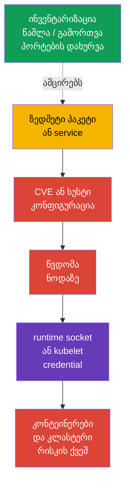
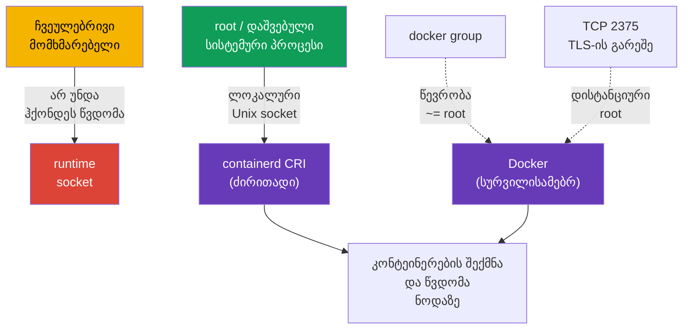

[Русская версия](ru.md) · [Eng version](README.md) · [Versión en español](es.md) · [Version française](fr.md) · [Deutsche Version](de.md) · [繁體中文版](tw.md) · [日本語版](jp.md)

# თავი 14. ჰოსტის ოპერაციული სისტემის footprint-ის მინიმიზაცია და runtime-დემონის უსაფრთხოება

> **პრობლემა.** ზედმეტი პაკეტი, service, listener ან socket Kubernetes-ნოდაზე ამატებს
> ცალკე ბინარს CVE-ით და გზას ლოკალურ ან ქსელურ შესვლამდე. ასეთი კომპონენტის
> კომპრომეტაციამ შეიძლება მიგვიყვანოს kubelet credentials-მდე ან container runtime-ის
> socket-მდე, გვერდი აუაროს Kubernetes API-ის შეზღუდვებს და საფრთხის ქვეშ დააყენოს ყველა
> workload ნოდაზე.

> **შემდეგი ნაბიჯი.** Kubernetes ზღუდავს workload-ს policy-ებით, RBAC-ითა და
> SecurityContext-ით - ანუ ავიწროებს იმას, რისი გაკეთებაც workload-ს შეუძლია API-სა და
> ნოდასთან მიმართებაში - მაგრამ ეს ყველაფერი დგას Linux-ნოდაზე. ზედმეტი სერვისი, პაკეტი,
> ღია პორტი ან წვდომა runtime-ის socket-ზე აძლევს შემტევს გზას Kubernetes API-ის გვერდის
> ავლით. **System Hardening**-ის ამ დომენში CKS-ისთვის ვამცირებთ თავად ნოდის attack
> surface-ს: ვტოვებთ მხოლოდ საჭირო სერვისებს, პაკეტებსა და ქსელურ წერტილებს, ხოლო
> თანამედროვე CRI runtime containerd-ს ვაძლევთ მხოლოდ იმას, ვისაც ეს ნამდვილად სჭირდება.

> **რა გჭირდებათ CKA-დან.** მუშაობა `systemd`-თან, პროცესებთან, ფაილებთან და journal-თან -
> [CKA-ს 0.5 თავში](../../../cka/course/00-5-linux/ge.md). როგორ არის მოწყობილი Docker,
> containerd, cgroups და cgroup driver - [CKA-ს 0.4 თავში](../../../cka/course/00-4-containers/ge.md).
> CRI-ის როლი და kubelet-ის კავშირი containerd-თან - [CKA-ს 40-ე თავში](../../../cka/course/40/ge.md).
> აქ არ მეორდება runtime-ის მოწყობა, არამედ ვზღუდავთ მის წვდომასა და attack surface-ს.

## 14.1. თავდასხმის სცენარი: ზედმეტი კომპონენტი ხდება შესასვლელი წერტილი

Kubernetes-ნოდა არ არის ყველა ამოცანისთვის განკუთვნილი უნივერსალური სერვერი. მაგალითად,
worker-ს ჩვეულებრივ არ სჭირდება გრაფიკული გარემო, ბეჭდვა, Bluetooth, ფაილური share ან
Docker daemon, თუ kubelet მუშაობს containerd-თან. ყოველი დაყენებული და, განსაკუთრებით,
გაშვებული კომპონენტი ამატებს:

- ბინარებსა და დამოკიდებულებებს CVE-ით;
- უფლებებისა და კონფიგურაციის მქონე პროცესს;
- მისმენად პორტს ან ლოკალურ socket-ს;
- journal-ს, ანგარიშებს, unit-ფაილებს და გზას მცდარ კონფიგურაციამდე.



ეს არ არის მოწოდება, წავშალოთ ყველაფერი გაუთვალისწინებლად. `kubelet`, containerd, CNI,
SSH თანმიმდევრული ადმინისტრირებისთვის და control-plane-ის კომპონენტები შესაბამის ნოდაზე
შეიძლება საჭირო იყოს. მიზანია მივიღოთ ცხადი სია: **კომპონენტი -> მფლობელი -> დანიშნულება
-> პორტი/socket**. თუ დანიშნულება და მფლობელი არ არსებობს, კომპონენტს შლიან ან
გამორთავენ დამოკიდებულებებისა და rollback-გეგმის შემოწმების შემდეგ.

ცვლილებამდე დაფიქსირეთ საწყისი მდგომარეობა. control-plane-ზე არ გამორთოთ `kubelet`,
containerd, etcd ან Kubernetes-კომპონენტები SSH-სესიაში, რომელზეც დამოკიდებულია
წვდომა: შეცდომამ შეიძლება ნოდა და API მიუწვდომელი გახადოს.

```bash
set -euo pipefail
sudo install -d -m 700 /root/hardening-before
sudo systemctl list-unit-files --type=service | sort \
  | sudo tee /root/hardening-before/services-enabled.txt >/dev/null
sudo systemctl list-units --type=service --state=running | sort \
  | sudo tee /root/hardening-before/services-running.txt >/dev/null
sudo ss -tulpn | sort | sudo tee /root/hardening-before/listeners.txt >/dev/null
if command -v dpkg-query >/dev/null; then
  sudo dpkg-query -W -f='${binary:Package}\t${Version}\n' | LC_ALL=C sort \
    | sudo tee /root/hardening-before/packages.txt >/dev/null
elif command -v rpm >/dev/null; then
  sudo rpm -qa | LC_ALL=C sort \
    | sudo tee /root/hardening-before/packages.txt >/dev/null
else
  echo 'REVIEW_REQUIRED: unsupported package manager; cannot create package inventory' >&2
  exit 2
fi
```

> 🧠 ნოდის კომპრომეტაცია შეიძლება დაიწყოს ზედმეტი პროცესით, პაკეტით, listener-ით ან socket-ით; შეინარჩუნეთ კომპონენტის, მფლობელის, დანიშნულებისა და დასაშვები წვდომის რუკა.

> 🎯 ჩაატარეთ service-ის, პაკეტის, kernel module-ისა და listener-ის ინვენტარიზაცია; შეცვალეთ მხოლოდ საჭირო არ არსებული ობიექტი, შეინარჩუნეთ baseline და შეამოწმეთ `kubelet`/containerd. `disable --now`, წაშლა და პორტის დახურვა საჭიროებს სხვადასხვა შემოწმებას.

## 14.2. ზედმეტი სერვისების ინვენტარიზაცია და გამორთვა

ჯერ გაარჩიეთ სამი მდგომარეობა. `systemctl list-units` აჩვენებს ჩატვირთულ unit-ს,
`is-active` - მუშაობს თუ არა პროცესი ახლა, ხოლო `is-enabled` - დაიწყებს თუ არა ის
ჩატვირთვისას. გამორთული unit შეიძლება ჯერ კიდევ აქტიური იყოს ცხადი გაჩერებამდე.

```bash
# გაშვებული service units და მათი მდგომარეობა.
sudo systemctl list-units --type=service --state=running

# ყველა დაყენებული service units, გამორთულის ჩათვლით.
sudo systemctl list-unit-files --type=service

# საიდან გაჩნდა კონკრეტული service და რითი იმართება.
SERVICE='service-to-review.service'
sudo systemctl status "$SERVICE"
sudo systemctl cat "$SERVICE"
sudo systemctl show "$SERVICE" -p FragmentPath -p ExecStart -p User
sudo journalctl -u "$SERVICE" --since '24 hours ago'
```

სასარგებლოა გადაწყვეტილების ცხრილი ნებისმიერი ბრძანების გამოძახებამდე:

| მიგნება | კითხვა მოქმედებამდე | ნორმალური გადაწყვეტილება |
|---|---|---|
| `kubelet.service` | ნოდა შედის კლასტერში? | დატოვება; შესწორება მხოლოდ გააზრებულად |
| `containerd.service` | ეს kubelet-ის CRI endpoint-ია? | დატოვება Kubernetes-ნოდაზე |
| `docker.service`/`docker.socket` | Docker ამ ნოდას სჭირდება? | წაშლა/გამორთვა, თუ CRI - containerd-ია და Docker საჭირო არ არის |
| `sshd.service` | არსებობს თანმიმდევრული bastion/console გზა? | დატოვება 15-ე თავის hardening-ით ან გამორთვა მხოლოდ ალტერნატიული წვდომის შემთხვევაში |
| `cups`, `avahi-daemon`, Bluetooth, GUI-service | არსებობს დოკუმენტირებული სერვერული დანიშნულება? | ჩვეულებრივ წაშლა ან გამორთვა |
| უცნობი service | ვინ არის მფლობელი, რომელი პაკეტი და პორტი? | გამოძიება, არ გამოვიცნოთ |

ცნობილი, საჭირო არ არსებული unit-ისთვის უსაფრთხო საბაზისო ოპერაციაა მისი ახლავე
გაჩერება და ავტოგაშვების აკრძალვა. ბრძანება შექცევადია: `enable --now` საჭიროების
შემთხვევაში service-ს დააბრუნებს.

```bash
# მაგალითი მხოლოდ იმის დადასტურების შემდეგ, რომ service ამ ნოდას არ სჭირდება.
sudo systemctl disable --now avahi-daemon.service

# ორივე მდგომარეობის შემოწმება.
sudo systemctl is-active avahi-daemon.service || true
sudo systemctl is-enabled avahi-daemon.service || true
```

`mask` უფრო ძლიერია, ვიდრე `disable`: ის კრძალავს unit-ის ხელით და დამოკიდებულების
საფუძველზე გაშვებას მისი `/dev/null`-ზე მითითებით. გამოიყენეთ ის service-ისთვის,
რომელიც ნოდის იმიჯში ზუსტად არ უნდა გაჩნდეს, და დააფიქსირეთ გამონაკლისი image
build/IaC-ში. არ დაამასკოთ Kubernetes-ის დამოკიდებულება შედეგების გააზრების გარეშე.

```bash
UNIT='confirmed-unwanted.service'

# ცვლილებამდე შევინახოთ საწყისი მდგომარეობა.
sudo systemctl is-active "$UNIT" \
  > "/root/hardening-before/${UNIT}.active" 2>&1 || true
sudo systemctl is-enabled "$UNIT" \
  > "/root/hardening-before/${UNIT}.enabled" 2>&1 || true

# Mask + უკვე გაშვებული unit-ის გაჩერება.
sudo systemctl mask --now "$UNIT"

# ორივე მდგომარეობის დამტკიცება.
sudo systemctl is-active "$UNIT" || true
sudo systemctl is-enabled "$UNIT" || true
```

`--now`-ის გარეშე `mask` ბლოკავს მხოლოდ მომავალ ხელით და dependency-based გაშვებას:
უკვე გაშვებული service განაგრძობს მუშაობას. rollback-ისთვის ჯერ შეასრულეთ `systemctl
unmask <unit>`, შემდეგ კი აღადგინეთ ზუსტად ცვლილებამდე შენახული active/enabled
მდგომარეობა. არ შეასრულოთ `enable --now` ავტომატურად, თუ unit hardening-მდე არ იყო
enabled და active.

## 14.3. ზედმეტი პაკეტები და მინიმალური OS-იმიჯი

service-ის გაჩერება საკმარისი არ არის: პაკეტი, მისი ბიბლიოთეკები, timer/socket unit და
მომავალი CVE ნოდაზე რჩება. ჩაატარეთ პაკეტების ინვენტარიზაცია, დაადგინეთ, რომელმა
პაკეტმა დააყენა ბინარი, და შეამოწმეთ reverse dependencies. Debian/Ubuntu-ზე:

```bash
PACKAGE='package-to-review'
BINARY='binary-to-review'
apt list --installed 2>/dev/null | less
apt-cache policy "$PACKAGE"
dpkg -S "$(command -v "$BINARY")"
apt-cache rdepends --installed "$PACKAGE"

# გამოვიტანოთ ხელით დაყენებული პაკეტები: image-ის review-ის ამოსავალი წერტილი.
apt-mark showmanual | sort
```

review-ის შემდეგ წაშალეთ ზუსტად დადასტურებული პაკეტი. `apt purge` შლის ასევე მის
კონფიგურაციას; `autoremove`-მდე ჯერ წაიკითხეთ სია, რადგან მასში შეიძლება მოხვდეს
საჭირო ბიბლიოთეკა ან დიაგნოსტიკის ინსტრუმენტი.

```bash
PACKAGE='confirmed-unneeded-package'
sudo apt purge "$PACKAGE"
sudo apt autoremove --dry-run
# შეასრულეთ autoremove მხოლოდ მისი სიის review-ის შემდეგ.
sudo apt autoremove
# მასობრივი apt upgrade აქ განზრახ არ სრულდება: patching გადადის ცალკე change window-ში.
```

RPM-სისტემებზე ეკვივალენტებია `rpm -qa`, `dnf repoquery --installed` და `dnf remove`.
არ აურიოთ სისტემური hardening უკონტროლო მასობრივ განახლებასთან: განახლებები, image
version და rollback უნდა გადიოდეს ჩვეულებრივი ექსპლუატაციის პროცესით.

**მინიმალური OS-იმიჯი** უპირატესია, ვიდრე უკვე მომუშავე ყოველი ნოდის ხელით დასუფთავება.
ნოდის იმიჯში/კონფიგურაციაში აცხადებენ საჭირო პაკეტებსა და service-ებს, გამორიცხავენ
desktop-ს, compiler-ებს, ტესტურ utility-ებსა და ზედმეტ agent-ებს, შემდეგ კი რეგულარულად
ხელახლა აწყობენ იმიჯს patch-ებით. მინიმალურობა არ ნიშნავს აღდგენის საშუალებების
არარსებობას: უნდა დარჩეს თანმიმდევრული წვდომის, journal-ისა და დიაგნოსტიკის ხერხი.

> 🏭 **Production.** სპეციალიზებულმა Kubernetes-OS-მა - მაგალითად,
> [Bottlerocket](https://bottlerocket.dev/) - შეიძლება შეამციროს mutable host footprint
> განზრახ მინიმალური immutable image-ისა და მართვადი update workflow-ის ხარჯზე. ეს
> არქიტექტურული არჩევანია: production-ში rollout-მდე stage-ში შეამოწმეთ სამიზნე
> Kubernetes-ვერსიის, CNI/CSI-ის, bootstrap-ის, observability-ის, debug-წვდომისა და
> rollback-ის მხარდაჭერა. არ გადაიტანოთ ასეთ OS-ზე ჩვეულებრივი Linux-დისტრიბუტივის
> `apt`/`dpkg` ბრძანებები ან გზები მისი ოფიციალური დოკუმენტაციის გარეშე.

| მიდგომა | პლუსი | რისკი და კონტროლი |
|---|---|---|
| პაკეტის წაშლა მომუშავე ნოდაზე | სწრაფად აღმოფხვრის ცნობილ ზედაპირს | ნოდებს შორის დრეიფი; დააფიქსირეთ IaC/image-ში |
| Golden image პაკეტების allowlist-ით | ერთგვაროვანი, აუდირებადი მდგომარეობა | საჭიროებს ხელახლა აწყობისა და განახლების პროცესს |
| Immutable/minimal OS | ნაკლები პაკეტი და ცვლილება runtime-ში | წინასწარ გავითვალისწინოთ debug და განახლება |
| „წავშალოთ ყველა უცნობი" | არ არსებობს | შეიძლება დაამტვრიოს kubelet, CNI, storage, monitoring ან წვდომა |

## 14.4. ბირთვის მოდულები: ინვენტარიზაცია და კონტროლირებადი გამორთვა

ბირთვის მოდული attack surface-ის ნაწილია, მაგრამ არ არის „ზედმეტი პაკეტი", რომლის
შედეგების გარეშე წაშლაც შესაძლებელია. ჯერ დააფიქსირეთ ჩატვირთული მოდულები, მათი
პარამეტრები და ჩატვირთვის წესები; შეამოწმეთ მოდულის დანიშნულება იმიჯის მფლობელთან და
OS-ის დოკუმენტაციაში.

```bash
MODULE='example_module'
lsmod | sort
sudo modinfo "$MODULE"
# `modprobe -c` — ჭეშმარიტების წყარო effective configuration-ისთვის.
EFFECTIVE_MODPROBE_CONFIG=$(sudo modprobe -c) || {
  echo 'ERROR: cannot read effective modprobe configuration' >&2
  exit 2
}
printf '%s\n' "$EFFECTIVE_MODPROBE_CONFIG" \
  | grep -E "^(blacklist|install)[[:space:]]+${MODULE}\b" || true
sudo modprobe -n -v "$MODULE"
# ეს ფაილები საჭიროა მხოლოდ წესის წყაროს საპოვნელად; ისინი შეიძლება იყოს overridden.
sudo find /etc/modprobe.d /run/modprobe.d /usr/local/lib/modprobe.d \
  /usr/lib/modprobe.d /lib/modprobe.d -type f -print 2>/dev/null | sort
sudo grep -RnsE "^(blacklist|install)[[:space:]]+${MODULE}\b" \
  /etc/modprobe.d /run/modprobe.d /usr/local/lib/modprobe.d /usr/lib/modprobe.d /lib/modprobe.d \
  2>/dev/null || true
```

`modprobe -c` აჩვენებს საბოლოო წესებს precedence-ის გათვალისწინებით; file-level
`find`/`grep` საჭიროა მხოლოდ დანახული წესის წყაროს საპოვნელად და შეიძლება აჩვენოს
გადაფარული ჩანაწერები. კონკრეტული მოდულისთვის `modprobe -n -v` აჩვენებს ფაქტობრივ
მოქმედებას, რომელსაც `modprobe` გამოიყენებს.

`modprobe -r <module>` გადმოტვირთავს მოდულს **მხოლოდ დროებით**: ის არ გადარჩება
reboot-ს და დასრულდება შეცდომით, თუ მოდული გამოიყენება ან დამოკიდებულების მიერ არის
დაკავებული. მუდმივ აკრძალვას სვამენ `modprobe`-ის მართვად კონფიგურაციაში; `blacklist`
ხელს უშლის ჩვეულებრივ autoload-ჩატვირთვას, ხოლო `install ... /bin/false` ასევე ბლოკავს
პირდაპირ `modprobe`-ს ამ წესის მეშვეობით. ორივე მექანიზმს იყენებენ ერთად მხოლოდ იმის
შემოწმების შემდეგ, რომ მოდული ნამდვილად აღარ არის საჭირო.

```bash
MODULE='example_module'
# change window-ში: დროებითი შემოწმება; არ სცადოთ გამოყენებული მოდულის იძულებით გადმოტვირთვა.
sudo modprobe -r "$MODULE"

# მუდმივი წესი image/IaC-ში, და არა ნოდის ხელით დრეიფი.
sudo tee "/etc/modprobe.d/disable-${MODULE}.conf" >/dev/null <<EOF
blacklist $MODULE
install $MODULE /bin/false
EOF

# Debian/Ubuntu-ისთვის განაახლეთ initramfs, თუ მოდული შეიძლება იყოს ადრეულ ჩატვირთვაში.
sudo update-initramfs -u
sudo modprobe -n -v "$MODULE"       # მოსალოდნელია წესი install /bin/false
```

დაგეგმილი reboot-ის შემდეგ შეამოწმეთ `lsmod`, `modprobe -n -v` და ნოდის მდგომარეობა.
მოდულები შეიძლება საჭირო იყოს CNI-სთვის, storage-დრაივერისთვის, runtime-ისთვის ან
ქსელური/დისკური აპარატურისთვის. ჯერ გატესტეთ ერთ drained/staging-ნოდაზე, შემდეგ
შეასრულეთ rollout ნოდა-ნოდა `kubelet`-ის, containerd-ის, CNI-ისა და workload-ის
შემოწმებით; არ გამოიყენოთ blacklist მთელ pool-ზე ერთდროულად.

## 14.5. ღია პორტები: listener, დანიშნულება და ქსელური პერიმეტრი

პორტი საშიშია არა თავისთავად - საშიშია უცნობი ან არასათანადო წყაროებისთვის ხელმისაწვდომი
სერვისი. ჯერ დაამყარეთ შესაბამისობა «listener - PID - unit - საჭირო წყაროები», შემდეგ კი
შეზღუდეთ service და firewall. `ss` ჩვეულებრივ ხელმისაწვდომია თანამედროვე Linux-ზე;
`lsof` და `netstat` სასარგებლოა როგორც ალტერნატივები.

```bash
# TCP და UDP listeners პროცესითა და PID-ით (სრული ინფორმაციისთვის საჭიროა root).
sudo ss -tulpn
sudo lsof -nP -iTCP -sTCP:LISTEN
sudo netstat -tulpn                    # თუ net-tools პაკეტი დაყენებულია

# runtime-ის Unix sockets - TCP/UDP-ის გამოტანაში არ ჩანს.
sudo ss -lxnp | grep -E 'docker|containerd' || true
```

| წერტილი | სად სჭირდება ჩვეულებრივ | უსაფრთხო მიმართულება |
|---|---|---|
| SSH `22/tcp` | მართვადი წვდომა ნოდაზე | მხოლოდ bastion/VPN/ადმინისტრაციული CIDR |
| kubelet `10250/tcp` | control-plane და თანმიმდევრული დიაგნოსტიკა | არ გახსნათ ინტერნეტში; TLS, authn/authz და firewall |
| kube-apiserver `6443/tcp` | control-plane; worker და ადმინისტრატორები არქიტექტურის მიხედვით | allowlist/private endpoint, არა `0.0.0.0/0` |
| etcd `2379`, `2380/tcp` | მხოლოდ control-plane/etcd peers | არ გამოაქვეყნოთ worker-ზე ან გარე ქსელში |
| Docker TCP API (ხშირად `2375`/`2376`) | მხოლოდ დასაბუთებული დისტანციური მართვისთვის | `2375` არ უნდა ისმენდეს; ნებისმიერი TCP endpoint საჭიროებს ცხად გამონაკლისს, mTLS-სა და ზუსტ firewall-ს |

| containerd/NRI Unix socket | ლოკალურად ნოდაზე | `root` და მინიმალური ნაკრები დაშვებული სისტემური მომხმარებლებისა |

არ გააკეთოთ დასკვნა პორტის ნომრით პროცესის გარეშე: მაგალითად, `6443` control-plane-ზე
მოსალოდნელია, მაგრამ worker-ზე შეიძლება იყოს შეცდომა; `10250` სჭირდება kubelet-ს, მაგრამ
არ უნდა იყოს საჯარო. ქსელური ფილტრი ავსებს, და არა ცვლის ზედმეტი service-ის გამორთვას.
გარე წვდომისა და SSH-ის დეტალური შეზღუდვა - 15-ე თავში.

```bash
SERVICE='service-owning-the-listener.service'
PORT='10250'
# ჯერ შევამოწმოთ კონკრეტული listener და მისი unit.
sudo ss -lntp | grep -E ':(22|10250|6443|2379|2380|2375|2376)\b' || true
sudo systemctl status "$SERVICE"

# service-ის წაშლის/გამორთვის შემდეგ პორტი უნდა გაქრეს. ss-ის შეცდომა listener-ის არარსებობის ტოლი არ არის.
listeners=$(sudo ss -H -lnt "( sport = :${PORT} )") || {
  echo "ERROR: cannot inspect TCP listener ${PORT}" >&2; exit 2;
}
if [ -n "$listeners" ]; then
  printf 'ERROR: TCP port %s is still listening:\n%s\n' "$PORT" "$listeners" >&2
  exit 1
fi
echo "OK: TCP listener ${PORT} is absent"
```

> 🎯 ჩაატარეთ service-ის, პაკეტის, kernel module-ისა და listener-ის ინვენტარიზაცია; შეცვალეთ მხოლოდ საჭირო არ არსებული ობიექტი, შეინარჩუნეთ baseline და შეამოწმეთ `kubelet`/containerd. `disable --now`, წაშლა და პორტის დახურვა საჭიროებს სხვადასხვა შემოწმებას.

## 14.6. containerd-ისა და არააუცილებელი Docker-ის უსაფრთხოება

თანამედროვე Kubernetes-ნოდაზე containerd არის ძირითადი CRI runtime; Docker daemon და
მისი socket არ არიან CRI baseline-ი და სჭირდებათ მხოლოდ ცალკე დადასტურებული ამოცანა.
Runtime daemon-ს აქვს მეტი უფლება, ვიდრე ჩვეულებრივ კონტეინერს. client-მა, რომელსაც
შეუძლია მიმართოს containerd-ს, NRI-ს ან Docker API-ს, ხშირად შეუძლია გაუშვას
პრივილეგირებული კონტეინერი, მიამონტოს ჰოსტის filesystem ან მიიღოს ნოდის credentials.
ამიტომ Unix socket წარმოადგენს წვდომის საზღვარს, და არა უწყინარ იმპლემენტაციის დეტალს.

> 🎯 containerd CRI socket-ზე წვდომა — მხოლოდ `root`-ს და მინიმალურ სისტემურ მომხმარებლებს, world-writable mode-ისა და არაპრივილეგირებულ workload-ში mount-ის გარეშე.



> 🔬 Docker გამოიყენება მხოლოდ Docker-ჰოსტისთვის; NRI/debug/metrics საჭიროებს version- და runtime-specific შემოწმებას.

### Docker: არანაირი არააუთენტიფიცირებული TCP API

`dockerd -H tcp://0.0.0.0:2375` ხსნის Docker API-ს ყველასთვის, ვისაც შეუძლია პორტამდე
მისვლა. `2375`-ზე არ არის TLS და აუთენტიფიკაცია: ეს პრაქტიკულად დისტანციური root-ია. ის
არ უნდა იყოს არც `ExecStart`-ში systemd unit-ისთვის, არც drop-in-ში, არც
`/etc/docker/daemon.json`-ში. არ სცადოთ `2375`-ის „დაფარვა" მხოლოდ firewall-ით: წესის
შეცდომა კვლავ ხელმისაწვდომს გახდის API-ს.

```bash
set -euo pipefail
# ეს gate ამოწმებს დამოუკიდებლად effective configuration-ს და actual listeners-ს.
# false — უსაფრთხო baseline; true დასაშვებია მხოლოდ documented risk exception-ისთვის.
ALLOW_REMOTE_DOCKER_API=false
declare -a TCP_CONFIGURATION_SOURCES=()
USES_SOCKET_ACTIVATION=false

add_tcp_source() {
  TCP_CONFIGURATION_SOURCES+=("$1")
}

# დავაკლასიფიციროთ ნორმალიზებული Docker -H/--host მნიშვნელობები. Unix და fd TCP არ არის;
# host:, host:port, :port, numeric port და tcp:// - TCP ფორმებია.
classify_docker_host() {
  local source=$1 host=$2
  case "$host" in
    unix://*|/*|@*) ;;
    fd://*) USES_SOCKET_ACTIVATION=true ;;
    tcp://*|*:*|[0-9]*) add_tcp_source "$source: $host" ;;
    *)
      printf 'REVIEW_REQUIRED: cannot classify Docker host value from %s: %s\n' "$source" "$host" >&2
      exit 2
      ;;
  esac
}

# Effective systemd service-კონფიგურაცია პლუს აქტიური daemon-ის argv.
DOCKER_SERVICE_EXEC=$(sudo systemctl show docker.service -p ExecStart --value 2>/dev/null || true)
DOCKER_PID=$(pgrep -xo dockerd || true)
DOCKER_CMDLINE=''
if [ -n "$DOCKER_PID" ]; then
  DOCKER_CMDLINE=$(sudo cat "/proc/$DOCKER_PID/cmdline" | tr '\0' '\n') || {
    echo 'ERROR: cannot read dockerd argv' >&2
    exit 2
  }
fi

# გავშალოთ -H/--host ყველა ფორმა effective ExecStart-ში, -H=<value>-ის ჩათვლით.
mapfile -t EXEC_HOST_DIRECTIVES < <(
  printf '%s\n' "$DOCKER_SERVICE_EXEC"     | grep -Eo -- '(-H|--host)(=|[[:space:]]+)[^[:space:]]+' || true
)
for directive in "${EXEC_HOST_DIRECTIVES[@]}"; do
  case "$directive" in
    -H=*) host=${directive#-H=} ;;
    --host=*) host=${directive#--host=} ;;
    -H\ *) host=${directive#-H } ;;
    --host\ *) host=${directive#--host } ;;
    *)
      printf 'REVIEW_REQUIRED: cannot normalize ExecStart host directive: %s\n' "$directive" >&2
      exit 2
      ;;
  esac
  classify_docker_host 'docker.service ExecStart' "$host"
done

# argv NUL-ით არის გაყოფილი, ამიტომ დავშალოთ მისი ცალკეული მნიშვნელობები quoting-ის ბუნდოვანების გარეშე.
mapfile -t DOCKER_ARGV <<< "$DOCKER_CMDLINE"
for ((i = 0; i < ${#DOCKER_ARGV[@]}; i++)); do
  case "${DOCKER_ARGV[i]}" in
    -H|--host)
      ((++i < ${#DOCKER_ARGV[@]})) || {
        echo 'REVIEW_REQUIRED: dockerd host flag has no value' >&2
        exit 2
      }
      classify_docker_host 'dockerd argv' "${DOCKER_ARGV[i]}"
      ;;
    -H=*) classify_docker_host 'dockerd argv' "${DOCKER_ARGV[i]#-H=}" ;;
    --host=*) classify_docker_host 'dockerd argv' "${DOCKER_ARGV[i]#--host=}" ;;
  esac
done

# custom config path-ის უსაფრთხოდ გამოტანა grep-ის შედეგიდან შეუძლებელია; საჭიროა მისი ცხადი review.
if printf '%s\n' "$DOCKER_SERVICE_EXEC" "$DOCKER_CMDLINE"   | grep -Eq -- '--config-file(=|[[:space:]])'; then
  echo 'REVIEW_REQUIRED: dockerd uses --config-file; parse that effective config before allowing Docker TCP API' >&2
  exit 2
fi

# დავშალოთ hosts ნაგულისხმევ config-ში. jq-ს გარეშე hosts-ველი review-required-ია, და არა PASS.
if sudo test -f /etc/docker/daemon.json && sudo grep -qE '"hosts"[[:space:]]*:' /etc/docker/daemon.json; then
  command -v jq >/dev/null || {
    echo 'REVIEW_REQUIRED: jq is required to parse daemon.json hosts safely' >&2
    exit 2
  }
  DOCKER_CONFIG_HOSTS=$(sudo jq -er '
    if .hosts? == null then empty
    elif (.hosts | type) == "array" and all(.hosts[]; type == "string") then .hosts[]
    else error("daemon.json hosts must be an array of strings") end
  ' /etc/docker/daemon.json) || {
    echo 'REVIEW_REQUIRED: cannot parse daemon.json hosts' >&2
    exit 2
  }
  while IFS= read -r host; do
    [ -z "$host" ] || classify_docker_host 'daemon.json hosts' "$host"
  done <<< "$DOCKER_CONFIG_HOSTS"
fi

# `Listen` არის systemd-ის effective socket-თვისება. გავარჩიოთ არარსებული unit იმ unit-ისგან,
# რომლის effective კონფიგურაციაც წაუკითხავია; ეს უკანასკნელი არასდროს გადავაქციოთ PASS-დ.
DOCKER_SOCKET_LOAD_STATE=$(sudo systemctl show docker.socket -p LoadState --value 2>/dev/null) || {
  echo 'REVIEW_REQUIRED: cannot determine whether docker.socket exists' >&2
  exit 2
}
case "$DOCKER_SOCKET_LOAD_STATE" in
  not-found) DOCKER_SOCKET_PRESENT=false ;;
  '')
    echo 'REVIEW_REQUIRED: empty docker.socket LoadState' >&2
    exit 2
    ;;
  *) DOCKER_SOCKET_PRESENT=true ;;
esac
if [ "$DOCKER_SOCKET_PRESENT" = true ]; then
  DOCKER_SOCKET_LISTEN=$(sudo systemctl show docker.socket -p Listen --value) || {
    echo 'REVIEW_REQUIRED: cannot read effective docker.socket Listen configuration' >&2
    exit 2
  }
  [ -n "$DOCKER_SOCKET_LISTEN" ] || {
    echo 'REVIEW_REQUIRED: docker.socket has no effective Listen entries' >&2
    exit 2
  }
  while IFS= read -r listen_entry; do
    listen_entry=${listen_entry#"${listen_entry%%[![:space:]]*}"}
    [ -z "$listen_entry" ] && continue
    case "$listen_entry" in
      *' (Stream)') socket_address=${listen_entry% (Stream)} ;;
      *)
        printf 'REVIEW_REQUIRED: cannot classify non-stream docker.socket Listen entry: %s\n' "$listen_entry" >&2
        exit 2
        ;;
    esac
    case "$socket_address" in
      /*|@*) ;;  # ფაილური და abstract Unix sockets
      *:*) add_tcp_source "docker.socket Listen: $socket_address" ;;
      *)
        if [[ "$socket_address" =~ ^[0-9]+$ ]]; then
          add_tcp_source "docker.socket Listen: $socket_address"
        else
          printf 'REVIEW_REQUIRED: cannot classify docker.socket Listen address: %s\n' "$socket_address" >&2
          exit 2
        fi
        ;;
    esac
  done <<< "$DOCKER_SOCKET_LISTEN"
elif [ "$USES_SOCKET_ACTIVATION" = true ]; then
  echo 'REVIEW_REQUIRED: dockerd uses fd:// but docker.socket is absent' >&2
  exit 2
fi

# მიმდინარე listeners ცალკე მტკიცებულებაა. დავამთხვიოთ dockerd ნებისმიერ ადგილას process metadata-ში, და არა მხოლოდ პირველში.
listeners_2375=$(sudo ss -H -lnt '( sport = :2375 )') || {
  echo 'ERROR: cannot inspect TCP 2375' >&2
  exit 2
}
dockerd_tcp_listeners=$(sudo ss -H -lntp | awk 'index($0, "\"dockerd\"")') || {
  echo 'ERROR: cannot inspect dockerd TCP listeners' >&2
  exit 2
}

TCP_EVIDENCE=$(printf '%s\n%s\n' "${TCP_CONFIGURATION_SOURCES[*]-}" "$dockerd_tcp_listeners")
if [ -n "$listeners_2375" ] || [ -n "${TCP_CONFIGURATION_SOURCES[*]-}" ] || [ -n "$dockerd_tcp_listeners" ]; then
  printf 'Docker TCP configuration/listener evidence:\n%s\n' "$TCP_EVIDENCE" >&2
  if printf '%s\n%s\n' "$listeners_2375" "$TCP_EVIDENCE"     | grep -Eq '(^|[^0-9])2375([^0-9]|$)'; then
    echo 'ERROR: Docker TCP 2375 is configured or listening' >&2
    exit 1
  fi
  if [ "$ALLOW_REMOTE_DOCKER_API" != true ]; then
    echo 'ERROR: unexpected Docker TCP endpoint is configured or listening' >&2
    exit 1
  fi
  echo 'REVIEW_REQUIRED: every allowed endpoint needs effective tlsverify=true, CA, server certificate/key, verified client-certificate authentication and firewall/security-group allowlist.' >&2
  exit 2
fi
echo 'OK: no Docker TCP endpoint is configured or listening'
```

ტიპურ systemd-ინსტალაციაში Docker იღებს `-H fd://`-ს: `docker.socket` ჩვეულებრივ
ქმნის ლოკალურ Unix socket-ს. არ ივარაუდოთ ეს შემოწმების გარეშე: effective systemd
property `Listen`-მა შეიძლება მიუთითოს TCP listener, რომელიც არსებობს `dockerd`-ის
გაშვებამდეც. ზემოთ მოცემული gate აანალიზებს მხოლოდ `Stream` entries-ს: გზა `/…` და
abstract Unix socket `@…` რჩება Unix-ად, ხოლო port, `host:port` და `[IPv6]:port`
ითვლება TCP-დ. არ დაამატოთ ერთდროულად `hosts` `daemon.json`-ში და `-H` unit-ში: Docker
დასრულდება კონფლიქტური პარამეტრების შემთხვევაში. მოაშორეთ მხოლოდ TCP endpoint აქტიური
წყაროდან, შემდეგ შეამოწმეთ კონფიგურაცია და გადატვირთეთ ერთი service ერთდროულად.

```bash
# daemon.json-ისთვის ჯერ შევამოწმოთ სინტაქსი და მხარდაჭერილი key-ები.
sudo dockerd --validate --config-file=/etc/docker/daemon.json
sudo systemctl daemon-reload
sudo systemctl restart docker.service
sudo systemctl --no-pager --full status docker.service
sudo journalctl -u docker.service -n 50 --no-pager
```

თუ დისტანციური Docker API ნამდვილად თანმიმდევრული მოთხოვნაა, პორტის ნომერი TLS-ის ან
mTLS-ის მტკიცებულება არ არის: `2376`-იც კი მტკიცებულება არ არის. **ყოველი** დაშვებული TCP
endpoint-ისთვის დაადასტურეთ effective `tlsverify=true`, CA, server certificate და key,
ასევე client certificate-ის რეალური აუთენტიფიკაცია; შეზღუდეთ წყაროები
firewall/security group-ითა და გამოყოფილი management network-ით. ეს გამონაკლისია
რისკის მფლობელით, და არა Kubernetes-ნოდისთვის ნაგულისხმევი ვარიანტი.

### containerd, NRI და runtime-ის ფაილური საზღვრები

ძირითადი CRI socket ჩვეულებრივ მდებარეობს `/run/containerd/containerd.sock`-ში; NRI
socket-ის გზა კონფიგურირებადია და ხშირად უდრის `/run/nri/nri.sock`-ს (ეკვივალენტურია
`/var/run/nri/nri.sock`-ისა). წვდომა **ნებისმიერზე** მათგანზე root-equivalent-ია.
დატოვეთ ის მხოლოდ `root`-ისთვის და მინიმალური სისტემური პროცესებისთვის. თუ
ექსპლუატაციისთვის საჭიროა ჯგუფი, ის უნდა იყოს გამოყოფილი სისტემური ჯგუფი ჩვეულებრივი
მომხმარებლების გარეშე; არ დაამატოთ იქ დეველოპერები, CI-ანგარიშები ან workload
identity. არასდროს მიამონტოთ `containerd.sock` ან `nri.sock` არაპრივილეგირებულ
კონტეინერში.

არ არსებობს უნივერსალური `chmod` Docker-ისთვის ან containerd socket-ისთვის: გზას,
მფლობელს, ჯგუფსა და mode-ს განსაზღვრავს პაკეტი, systemd unit და კონკრეტული ნოდის
policy. არ გამოიყენოთ world-writable mode-ები და არ გაასწოროთ უფლებები ერთჯერადი
ბრძანებით, თუ socket-ს ხელახლა ქმნის systemd. ჯერ დაადგინეთ კონფიგურაციის მფლობელი,
შემდეგ კი დააფიქსირეთ მინიმალურად საჭირო წვდომა image/IaC-ის მხარდაჭერილ
კონფიგურაციაში და შეამოწმეთ ის რესტარტის შემდეგ.

```bash
sudo systemctl status containerd.service --no-pager
sudo systemctl cat containerd.service
sudo stat -Lc '%A %a %U:%G %n' /run/containerd/containerd.sock \
  /run/nri/nri.sock 2>/dev/null || true
sudo ss -lxnp | grep -E 'containerd\.sock|nri\.sock' || true

# CRI-დიაგნოსტიკა სრულდება ლოკალურად და root-ით; endpoint-ს ადარებენ kubelet-ის კონფიგურაციასთან.
sudo crictl --runtime-endpoint unix:///run/containerd/containerd.sock ps
sudo grep -Rns -- '--container-runtime-endpoint\|containerRuntimeEndpoint' \
  /var/lib/kubelet /etc/systemd/system /usr/lib/systemd/system 2>/dev/null || true
```

არ დაცვათ მხოლოდ socket. `/run/containerd` შეიცავს runtime-მდგომარეობასა და
sockets-ს, ხოლო `/var/lib/containerd` - persistent content-სა და metadata-ს.
containerd-ისთვის ორიენტირია `0700` `/var/lib/containerd`-ისთვის და `0711` root-ისთვის
`/run/containerd`-ში: მეორე mode-ი უშვებს traversal-ს, რომელიც შეიძლება საჭირო იყოს
user-namespaced workload-ისთვის, მაგრამ არ ააშკარავებს catalog-ის შემცველობას.
მგრძნობიარე ქვე-catalog-ები უნდა იყოს `0700`, sockets — `0660` სისტემური ჯგუფით
არაპრივილეგირებული მომხმარებლების გარეშე; არც ერთი გზა არ უნდა იყოს writable
ჩვეულებრივი მომხმარებლებისთვის ან კონტეინერებისთვის. კონფიგურაცია, plugins და CNI
ასევე უნდა იყოს root-owned და დაცული არაავტორიზებული სუბიექტების ჩაწერისგან:
ჩვეულებრივ ეს არის `/etc/containerd`, runtime-ის plugin-catalog-ები და
`/etc/cni/net.d`, ხოლო CNI binaries - `/opt/cni/bin` (კონკრეტული გზები შეამოწმეთ
დისტრიბუტივსა და კონფიგში). არ შეცვალოთ ისინი ფართო `chmod -R`-ით: შეამოწმეთ
ownership და writable-ბიტები წერტილოვნად.

```bash
sudo find /run/containerd /var/lib/containerd /etc/containerd /etc/cni/net.d /opt/cni/bin \
  -xdev -printf '%m %u:%g %p\n' 2>/dev/null | sort
```

containerd 2.0-ში NRI ჩართულია ნაგულისხმევად. ეს ცხადი გადაწყვეტილების წერტილია: თუ
NRI არ გამოიყენება, გამორთეთ plugin შემოწმებულ კონფიგურაციაში
(`[plugins."io.containerd.nri.v1.nri"]` და `disable = true`); თუ გამოიყენება, ჩათვალეთ
NRI plugins, მათი კონფიგურაცია და გარე plugin connections runtime TCB-ის ნაწილად,
შეზღუდეთ გზები და წვდომა მათზე.

Debug და metrics ცალკე API-ზედაპირებია. Unix debug socket-ს ზღუდავენ `root`-ითა და
დაშვებული სისტემური მომხმარებლებით; TCP debug endpoint არასდროს ქვეყნდება. containerd-ის
metrics ხშირად არ ფლობს TLS-სა და აუთენტიფიკაციას, ამიტომ მიაბით ისინი მხოლოდ loopback-ს
ან გამოყოფილ management interface-ს და დამატებით შეზღუდეთ firewall-ით/მარშრუტიზაციით.
ცვლილებამდე შეამოწმეთ ზუსტად თქვენი containerd-ვერსიის მხარდაჭერილი პარამეტრები და
შეამოწმეთ listeners `ss`-ის მეშვეობით რესტარტის შემდეგ.

### Docker: მხოლოდ იმ შემთხვევაში, თუ ის ნამდვილად საჭიროა

თუ Docker დატოვებულია ცალკე ამოცანისთვის, მისი socket და ჯგუფი `docker` ასევე
root-equivalent-ია. არ გასცეთ წევრობა ჩვეულებრივ მომხმარებლებზე, არ მიამონტოთ socket
არაპრივილეგირებულ workload-ში და არ ივარაუდოთ ერთგვაროვანი owner/mode ყველა
ინსტალაციისთვის: მიჰყევით unit/package policy-ს და შეამოწმეთ წვდომა აკრძალული
ანგარიშის სახელით.

```bash
readlink -f /var/run/docker.sock 2>/dev/null || true
sudo stat -Lc '%A %a %U:%G %n' /var/run/docker.sock 2>/dev/null || true
getent group docker || true
getent group docker | awk -F: '{print $4}'
UNPRIVILEGED_USER='unprivileged-user'
sudo -u "$UNPRIVILEGED_USER" docker ps  # დაუშვებელი მომხმარებლისთვის მოსალოდნელია უარი
```

თუ Docker Kubernetes-ნოდას არ სჭირდება, უფრო საიმედოა პაკეტის წაშლა ან `docker.service`-ისა
და `docker.socket`-ის გამორთვა და დამასკვა იმის შემოწმების შემდეგ, რომ მათზე
დამოკიდებული არაა kubelet ან ექსპლუატაციური ამოცანები.

### `/etc/docker/daemon.json`-ის Hardening

`daemon.json` Docker-ის კონფიგურაციის ერთ-ერთი წყაროა. ის არ ცვლის firewall-ს,
socket-ზე უფლებებს, SecurityContext-სა და Kubernetes-policy-ებს, მაგრამ ადგენს daemon-ის
უსაფრთხო baseline-ს. არ დაამატოთ `hosts`, თუ systemd უკვე გადასცემს `-H fd://`-ს.

#### ახალი Docker-host

შემდეგი baseline გამოიყენება **ახალ** Docker-ინსტალაციაზე ვერსიის მხარდაჭერისა და
დაგეგმილ workload-თან თავსებადობის შემოწმების შემდეგ:

```json
{
  "live-restore": true,
  "no-new-privileges": true,
  "userns-remap": "default",
  "log-driver": "local"
}
```

| Key | რას იძლევა | რა შევამოწმოთ ჩართვამდე |
|---|---|---|
| `live-restore` | შეუძლია შეინარჩუნოს კონტეინერების მუშაობა daemon-ის მიუწვდომლობისას | განახლების workflow, monitoring და მოსალოდნელი restart-ქცევა; არ არის გარანტია ნებისმიერი config/migration ცვლილებისთვის |
| `no-new-privileges` | კრძალავს ახალი კონტეინერული პროცესებისთვის privilege-ის ამაღლებას `setuid`/file capabilities-ის მეშვეობით | აპლიკაციები, რომლებსაც შეცდომით სჭირდებათ privilege escalation; არსებული კონტეინერები საჭიროებს recreate-ს |
| `userns-remap` | ასახავს კონტეინერის root-ს ჰოსტის არაპრივილეგირებულ UID-ზე | volumes, ownership, images და თავსებადობა; არ ჩართოთ production-ნოდაზე ტესტის გარეშე |
| `log-driver: local` | ზღუდავს JSON-ლოგების ზრდას და rotation-ს მართავს დრაივერი | ცენტრალიზებული ლოგების შეგროვება და retention; არსებული კონტეინერები ავტომატურად არ გადაინაცვლებს |

#### არსებული Docker-host: ცალკე migration

არ გამოიყენოთ ეს JSON უკვე მომუშავე Docker-host-ზე, როგორც ჩვეულებრივი შესწორება
შემდგომი restart-ით. ცვლილებამდე შეაგროვეთ containers/images/volumes-ის inventory,
შეამოწმეთ `/etc/subuid` და `/etc/subgid`, bind mounts, host networking და privileged
containers, შეაფასეთ თავსებადობა `userns-remap`-თან და მოამზადეთ recreate/migration და
rollback გეგმა.

```bash
set -euo pipefail
sudo docker ps -a --no-trunc
sudo docker image ls
sudo docker volume ls
sudo docker network ls
sudo grep -Ev '^[[:space:]]*(#|$)' /etc/subuid /etc/subgid 2>/dev/null || true
# ყოველი workload-ისთვის ცალკე: sudo docker inspect <container>; შეამოწმეთ mounts, network და privileges.
```

`no-new-privileges`, როგორც daemon-ის ნაგულისხმევი მნიშვნელობა, მოქმედებს ახალ
კონტეინერებზე; არსებულებს ესაჭიროებათ recreate. `log-driver`-ის შეცვლა არსებულ
კონტეინერებს ავტომატურად არ გადაჰყავს. `userns-remap` ცვლის Docker-ის
namespace/storage view-სა და ownership-ს, ამიტომ საჭიროებს ცალკე migration-ს.
`live-restore` არ არის უპირობო გარანტია კონტეინერების შენარჩუნების daemon-ის
კონფიგურაციის ნებისმიერი ცვლილებისას. containerd-ის მქონე Kubernetes-ნოდისთვის ეს არ
არის containerd-ის პარამეტრი და არც `runAsNonRoot`-ის ჩანაცვლება; გამოიყენეთ Docker
მხოლოდ გამოყოფილ Docker-host-ზე ტესტირების შემდეგ.

არასდროს შექმნათ `daemon.json` არსებულ ფაილზე `install /dev/null`-ის მეშვეობით:
ჯერ შეინახეთ მიმდინარე კონფიგურაცია. ახალი ცარიელი ფაილი შექმენით მხოლოდ მისი
არარსებობის შემთხვევაში.

```bash
sudo install -d -m 0755 /etc/docker

if sudo test -e /etc/docker/daemon.json; then
  # ჯერ შევინახოთ არსებული კონფიგურაცია.
  sudo cp -a /etc/docker/daemon.json /root/hardening-before/daemon.json.before
  sudo chown root:root /etc/docker/daemon.json
  sudo chmod 0600 /etc/docker/daemon.json
else
  # შევქმნათ ცარიელი ფაილი მხოლოდ თუ ის ჯერ არ არსებობს.
  sudo install -m 0600 -o root -g root /dev/null /etc/docker/daemon.json
fi

sudoedit /etc/docker/daemon.json
sudo dockerd --validate --config-file=/etc/docker/daemon.json
sudo systemctl restart docker.service
sudo systemctl --no-pager --full status docker.service
sudo docker info --format '{{json .SecurityOptions}}'
```

> 🎯 დაამტკიცეთ მინიმიზაცია before/after diff-ითა და უარყოფითი შემოწმებებით: ზედმეტი service არ არის active/enabled, listener და `2375` არ არსებობს, არაპრივილეგირებული მომხმარებელი არ იღებს runtime access-ს.

## 14.7. შედეგის შემოწმება: მინიმალური ნოდის დამტკიცება

შემოწმება შედგება კონფიგურაციის ფაქტისა და წვდომის ფაქტისგან. საკმარისი არ არის
ფაილში საჭირო სტრიქონის დანახვა: service-ს შეიძლება არ ჰქონდეს config ხელახლა
წაკითხული, ხოლო socket შეიძლება ხელახლა შეიქმნას იმავე ჯგუფით. ჩაატარეთ before/after
diff და ტესტი იმ მომხმარებლის სახელით, რომელსაც წვდომა მოეხსნა.

```bash
set -euo pipefail
sudo install -d -m 700 /root/hardening-after

# 1. სერვისები: before/after snapshots და running + enabled მდგომარეობის diff.
sudo systemctl list-units --type=service --state=running | sort \
  | sudo tee /root/hardening-after/services-running.txt >/dev/null
sudo systemctl list-unit-files --type=service | sort \
  | sudo tee /root/hardening-after/services-enabled.txt >/dev/null
sudo diff -u /root/hardening-before/services-running.txt \
  /root/hardening-after/services-running.txt || true
sudo diff -u /root/hardening-before/services-enabled.txt \
  /root/hardening-after/services-enabled.txt || true

# 2. პაკეტები და ქსელური listeners: distro-aware snapshot, შემდეგ ავხსნათ ყოველი diff.
if command -v dpkg-query >/dev/null; then
  sudo dpkg-query -W -f='${binary:Package}\t${Version}\n' | LC_ALL=C sort \
    | sudo tee /root/hardening-after/packages.txt >/dev/null
elif command -v rpm >/dev/null; then
  sudo rpm -qa | LC_ALL=C sort \
    | sudo tee /root/hardening-after/packages.txt >/dev/null
else
  echo 'REVIEW_REQUIRED: unsupported package manager; cannot create package inventory' >&2
  exit 2
fi
sudo ss -tulpn | sort | sudo tee /root/hardening-after/listeners.txt >/dev/null
sudo diff -u /root/hardening-before/packages.txt \
  /root/hardening-after/packages.txt || true
sudo diff -u /root/hardening-before/listeners.txt \
  /root/hardening-after/listeners.txt || true

# 3. Docker TCP: გავიმეოროთ §14.6-ის canonical gate მთლიანად, და არა მხოლოდ `ss` check.
# PASS შესაძლებელია მხოლოდ თუ ერთდროულად არ არის TCP endpoint effective ExecStart/argv-ში,
# daemon.json hosts/default ან ცხადად reviewed custom config, effective docker.socket Listen
# და current listener. TCP Listen შეიძლება არსებობდეს dockerd-ის გაშვებამდეც.

# 4. runtime-ის socket რჩება ლოკალური; owner/mode შეესაბამება unit/package policy-ს,
#    არ აძლევს წვდომას ჩვეულებრივ მომხმარებლებს და არ არის world-writable.
for socket in /run/containerd/containerd.sock /run/nri/nri.sock /var/run/docker.sock; do
  if [ -S "$socket" ]; then
    sudo stat -Lc '%A %a %U:%G %n' "$socket"
  fi
done

# 5. Debug არ უნდა იყოს საჯარო, metrics - არა ყველა ინტერფეისზე TLS/auth-ის გარეშე.
sudo ss -lntup | grep -E 'containerd|debug|metrics' || true
```

**DoD - მინიმალური ნოდა:**

- [ ] ყოველ აქტიურ service-ს აქვს დანიშნულება, მფლობელი და მოსალოდნელი პორტი/socket.
- [ ] ზედმეტი service-ები გაჩერებულია `systemctl disable --now`-ით, ხოლო კვლავ საშიშები
  საჭიროების შემთხვევაში დამასკულია; kubelet/containerd და საჭირო კომპონენტები არ არის
  დაზიანებული.
- [ ] წაშლილია დადასტურებით ზედმეტი პაკეტები; ნოდის იმიჯს აქვს პაკეტების allowlist და
  განახლების პროცესი, და არა ხელით არააღწერილი დრეიფი.
- [ ] `ss -tulpn` არ შეიცავს ამოუხსნელ listeners-ს; `10250`, `6443`, etcd და SSH
  ხელმისაწვდომია მხოლოდ იქ და იმ წყაროებისთვის, სადაც ეს არქიტექტურით მოითხოვება.
- [ ] `2375` არ არის კონფიგურირებული და არ ისმენს; სრული gate აანალიზებს effective
  `ExecStart`/argv-ს, `daemon.json hosts`-ს ან ცხადად reviewed custom config-ს, effective
  `docker.socket Listen`-ს და `ss -lntp`-ს. არ არსებობს დაუშვებელი Docker TCP endpoint
  **ნებისმიერ** პორტზე, მათ შორის endpoint, რომელიც ჯერჯერობით არ ისმენს ან
  socket-activated-ია. დაშვებულ endpoint-ს ჰყავს რისკის მფლობელი, აქვს effective
  `tlsverify=true`, CA, server certificate/key, დადასტურებული client-certificate
  authentication და firewall/security-group allowlist; `2376` თავისთავად mTLS-ის
  მტკიცებულება არ არის.
- [ ] `/run/containerd/containerd.sock` და, არსებობის შემთხვევაში, `/run/nri/nri.sock`
  არ არის ხელმისაწვდომი ჩვეულებრივი მომხმარებლებისთვის, არ არის მიმონტაჟებული
  არაპრივილეგირებულ workload-ში, ხოლო `sudo crictl` აგრძელებს მუშაობას; დაშვებული
  ჯგუფები შედგება მხოლოდ სისტემური სუბიექტებისგან.
- [ ] `/run/containerd`, `/var/lib/containerd`, კონფიგურაცია/plugins/CNI root-owned
  არის და არაავტორიზებული სუბიექტებისთვის writable არ არის; საჯარო TCP debug
  endpoint არ არსებობს, ხოლო TLS/auth-ის გარეშე metrics შეზღუდულია loopback-ით ან
  management interface-ით.
- [ ] დაყენებული Docker-ის შემთხვევაში მისი წვდომა შეზღუდულია unit/package policy-ით და
  ჩვეულებრივ მომხმარებელს `docker ps` არ შეუძლია; `daemon.json` გაიარა `dockerd
  --validate`.
- [ ] Docker/containerd და kubelet healthy არიან, ხოლო ცვლილებები შეტანილია
  image/IaC/change record-ში.

## 14.8. ტიპური შეცდომები და დიაგნოსტიკა

| სიმპტომი | სავარაუდო მიზეზი | რა შევამოწმოთ და გავასწოროთ |
|---|---|---|
| `docker` კვლავ ისმენს `2375`-ს | TCP მითითებულია systemd drop-in-ში, `ExecStart`-ში ან `daemon.json`-ში | `systemctl cat docker.service docker.socket`, `ps -ef`, `tcp://`-ის ძებნა; მოვაშოროთ აქტიური წყარო და გადავტვირთოთ daemon |
| Docker არ იწყება შესწორების შემდეგ | `hosts`-ის კონფლიქტი JSON-სა და `-H`-ს შორის unit-ში, ან არასწორი JSON | `dockerd --validate`, `journalctl -u docker`, დავტოვოთ hosts-ის ერთი წყარო |
| socket-ის უფლებების ერთჯერადი შესწორება რესტარტის შემდეგ გაქრა | socket-ს ხელახლა ქმნის systemd ან runtime | ვიპოვოთ unit/package-მფლობელი `systemctl cat`-ით, დავაფიქსიროთ policy IaC/drop-in-ში, ხელახლა შევამოწმოთ `stat` |
| მომხმარებელი კვლავ ასრულებს `docker ps`-ს ან მიმართავს runtime-ს | ძველი login-სესია შეიცავს პრივილეგირებულ ჯგუფს, ან policy ზედმეტად ფართოა | `id <user>`, ახალი სესია, `getent group`, მოვაშოროთ არასისტემური წევრები და შევამოწმოთ წვდომა |
| worker გახდა `NotReady` | წაშლილია/გაჩერებულია containerd, kubelet ან დაზიანებულია CRI-კონფიგურაცია | `systemctl status kubelet containerd`, `journalctl -u kubelet`, შევადაროთ endpoint და აღვადგინოთ snapshot-იდან |
| დავხურეთ საჭირო პორტი | პორტი გამორთეს ნომრით PID-ისა და დანიშნულების შემოწმების გარეშე | `ss -lntp`, unit-მფლობელი, წყაროები/დანიშნულება; დავაბრუნოთ წერტილოვნად |
| `apt autoremove`-ის შემდეგ საჭირო utility არ არის | სია არ იყო განხილული, package dependency არასწორად შეფასდა | აღვადგინოთ პაკეტი, დავაფიქსიროთ იმიჯის allowlist, გამოვიყენოთ `--dry-run` |

> 🏭 Role-specific golden image, IaC, inventory და drift detection; staging/canary და node-by-node rollout rollback-ითა და `kubelet`, runtime, CNI და workload-ის შემოწმებით.

## 14.9. როგორ გამოიყენება ეს production-ში

- **Kubernetes v1.37 rootless node path.** `KubeletInUserNamespace` გახდა Beta და
  შესაძლებელს ხდის node stack-ის აგებას, სადაც kubelet და დაკავშირებული node
  components მუშაობს host-root-ის გარეშე user namespace-ის მეშვეობით. არ აურიოთ ეს
  `spec.hostUsers: false`-თან, რომელიც იზოლირებს Pod-ს. იხილეთ [Kubernetes v1.37
  Security Delta](../APPENDIX_K8S_137_SECURITY_DELTA_GE.md).
- **Baseline განისაზღვრება როგორც კოდი.** პაკეტების სია, enabled services, systemd
  drop-in, firewall და socket-ის შემოწმება შედის immutable image-ში, Ansible/Cloud-Init-ში
  ან სხვა IaC-ში. ხელით emergency fix შემდეგ გადადის ჭეშმარიტების წყაროში.
- **ნოდები იყოფა როლის მიხედვით.** control-plane, worker, build-host და Docker-host
  არ იღებენ ერთნაირ პაკეტებისა და პორტების ნაკრებს. განსაკუთრებით არ დგამენ Docker
  daemon-ს worker-ზე მხოლოდ ინტერაქტიული `docker ps`-ისთვის, თუ CRI - containerd-ია.
- **Runtime-წვდომას ამოწმებენ როგორც პრივილეგირებულ წვდომას.** ჯგუფის წევრობის,
  containerd/NRI/Docker socket-ის უფლებებისა და systemd override-ის ცვლილება გადის
  იმავე review-ს, როგორც `sudo`-ს გაცემა; დაშვებულ სისტემურ ჯგუფებში ჩვეულებრივი
  მომხმარებლები არ არიან.
- **ამოწმებენ დრეიფს.** რეგულარული CIS/OS scan, პაკეტების inventory, enabled unit და
  listeners ადარებენ baseline-ს. მფლობელის გარეშე ახალი listener - ინციდენტია ან
  change, და არა „ჩვეულებრივი მდგომარეობა".
- **ცვლილება ხდება ეტაპობრივად.** ჯერ staging-ნოდა და ერთი service, შემდეგ
  `kubelet`/`containerd`-ის health check, მხოლოდ ამის შემდეგ rollout. control-plane-ისთვის
  ინახავენ out-of-band console-ს და ტესტირებულ rollback-ს.

> **მათთვის, ვისაც სურს ღრმად ჩაწვდომა, არ არის საგამოცდო მასალა.** ეს თავი და 16-17-ე
> თავები განმარტავენ namespaces-ს, capabilities-ს, cgroups-სა და MAC-ს ზუსტად იმ
> მოცულობით, რომელიც საჭიროა CKS-ისთვის: ამოვიცნოთ რისკი, გამოვიყენოთ საჭირო
> `securityContext`-ველი ან policy და შევამოწმოთ ეფექტი. თუ საჭიროა თავად მექანიზმის
> უფრო ღრმა განხილვა - როგორ ახორციელებს ბირთვი syscall interception-ს, რა ხდება
> cgroup v2 controller-ის დონეზე ან როგორ არის მოწყობილი namespace-ის იზოლაცია kernel
> structures-ის დონეზე - სწორედ ამას ეძღვნება ცალკე წიგნი: Liz Rice, *Container
> Security*, 2nd edition (O'Reilly, 2025). კურსი არ ცდილობს კონკურენციას მასთან Linux
> internals-ის სიღრმეში; ეს არის მოცულობის გააზრებული საზღვარი, და არა სიგნალი, რომ
> თემა ამოწურულია 14-17-ე თავებით.

## 14.10. მინი-ლექსიკონი

- **footprint** - პაკეტების, პროცესების, პორტების, socket-ისა და კონფიგურაციის
  ნაკრები, რომელიც ზრდის ნოდის attack surface-ს.
- **attack surface** - ყველა ხელმისაწვდომი წერტილი, რომლის მეშვეობითაც შესაძლებელია
  თავდასხმა ან კონფიგურაციის შეცდომა.
- **systemd unit** - service-ის, socket-ის, timer-ის ან სხვა ობიექტის აღწერა, რომელსაც
  მართავს systemd.
- **Unix socket** - ლოკალური ფაილური IPC-წერტილი; ფაილის უფლებები განსაზღვრავს, ვინ
  მიმართავს daemon-ის API-ს.
- **Docker socket** - `/var/run/docker.sock`, Docker daemon-ის ლოკალური API; თუ Docker
  დაყენებულია, წვდომა მასზე root-equivalent-ია და შეზღუდულია კონკრეტული
  unit/package-ის policy-ით.
- **`docker` group** - ჯგუფი, რომელიც აძლევს წვდომას Docker socket-ზე; განიხილება
  როგორც root-equivalent, და არა როგორც ჩვეულებრივი სამუშაო ჯგუფი.
- **CRI socket** - endpoint kubelet-სა და ძირითად runtime containerd-ს შორის, მაგალითად
  `/run/containerd/containerd.sock`; წვდომა მასზე root-equivalent-ია.
- **NRI socket** - containerd-ის Node Resource Interface-ის Unix API; წვდომა მასზეც
  root-equivalent-ია.
- **`daemon.json`** - Docker daemon-ის კონფიგურაციული ფაილი, ჩვეულებრივ
  `/etc/docker/daemon.json`.
- **`live-restore`** - Docker-ის რეჟიმი, რომელიც ინარჩუნებს კონტეინერების მუშაობას
  daemon-ის რესტარტისას.
- **`userns-remap`** - user namespace remapping კონტეინერის UID/GID-ისა ჰოსტზე.

## 14.11. თავის შეჯამება

- მინიმალური ნოდა იწყება ინვენტარიზაციით: ყოველ service-ს, პაკეტს, listener-სა და
  socket-ს აქვს დანიშნულება და მფლობელი; დანარჩენს შლიან ან გამორთავენ.
- `systemctl disable --now` აჩერებს ზედმეტ service-ს და კრძალავს მის ავტოგაშვებას;
  `apt purge` გამოიყენება მხოლოდ დადასტურებულ პაკეტზე დამოკიდებულებების შემოწმების
  შემდეგ.
- პორტები ფასდება პროცესითა და წყაროებით: kubelet `10250` და API `6443` არ უნდა
  იყოს ღია მთელი ინტერნეტისთვის, ხოლო Docker `2375` საერთოდ არ უნდა ისმენდეს.
- `-H tcp://0.0.0.0:2375` - არააუთენტიფიცირებული დისტანციური root-ია. დატოვეთ Docker
  Unix socket-ზე; ნებისმიერი TCP endpoint — მხოლოდ დასაბუთებული mTLS-გამონაკლისი, ხოლო
  `2376` არ არის მისი უსაფრთხოების მტკიცებულება.
- containerd - თანამედროვე ძირითადი CRI runtime-ია; წვდომა მის socket-სა და NRI
  socket-ზე root-equivalent-ია, შეზღუდულია სისტემური სუბიექტებით და არასდროს
  მიმონტაჟებულია არაპრივილეგირებულ workload-ში.
- Docker/containerd socket-ის უფლებები არ ისაზღვრება უნივერსალური `chmod`-ით: მათ
  ფიქსირებენ შესაბამისი unit/package-ის policy-ის მეშვეობით, world-writable mode-ისა
  და ჩვეულებრივი მომხმარებლების გარეშე.
- `/run/containerd`, `/var/lib/containerd`, config/plugins/CNI - დაცული root-owned
  ზედაპირებია; Unix debug შეზღუდულია, TCP debug საჯარო არასდროს ხდება, ხოლო TLS/auth-ის
  გარეშე metrics ისმენს მხოლოდ loopback-ზე ან management interface-ზე.
- `live-restore`, `no-new-privileges` და `userns-remap` `daemon.json`-ში გამოიყენება
  მხოლოდ დასაბუთებულ Docker-ჰოსტზე და საჭიროებს validation-ს, თავსებადობის ტესტს და
  rollout-ს.

## 14.12. როგორ გამოგადგებათ: გამოცდაზე და რეალურ სამუშაოში

**გამოცდაზე.** ჯერ იპოვეთ აქტიური წყარო: `systemctl cat`, `systemctl show`, `ss
-tulpn`, `stat` და `ps` უფრო საიმედოა, ვიდრე ფაილის გზით გამოცნობა. დავალებამ
შეიძლება მოითხოვოს Docker TCP-ის მოშორება, socket-ის უფლებების გასწორება ან
service-ის გამორთვა. ცვლილების შემდეგ დაამტკიცეთ შედეგი: `2375` არ ისმენს, `ss -lntp`
არ აჩვენებს დაუშვებელ TCP listener `dockerd`-ს, `stat` აჩვენებს საჭირო owner/mode-ს,
ხოლო უფლების არმქონე მომხმარებელი იღებს უარს. არ გამორთოთ kubelet/containerd მხოლოდ
იმის გამო, რომ მათი პორტი ან პროცესი უცნობი გეჩვენებათ.

**რეალურ სამუშაოში.** ნოდის კომპრომეტაციების უმეტესობა იწყება ჩვეულებრივი
შეცდომით: არაპატჩირებული პაკეტი, დატოვებული management service, საჯარო daemon API ან
ზედმეტად ფართო Unix-ჯგუფი. აუდირებადი minimal image, role-specific node pools,
ქსელური წყაროების allowlist და დრეიფის მუდმივი შემოწმება ამცირებს ასეთი შეცდომის
ალბათობასა და დაზარალების რადიუსს, თუ ის მაინც მოხდა.

## 14.13. თვითშემოწმების კითხვები

<details>
<summary>1. რატომ ზრდის გამორთული, მაგრამ არაწაშლილი ზედმეტი პაკეტი კვლავ attack surface-ს?</summary>

გაჩერებული service არ შლის ბინარებს, ბიბლიოთეკებს, კონფიგურაციას, socket/timer units-სა და პაკეტის პოტენციურ CVE-ებს. ის შეიძლება კვლავ ჩაირთოს ან გახდეს შემდეგი ცვლილების დროს შეცდომის წყარო. დამოკიდებულებების შემოწმების შემდეგ დადასტურებით ზედმეტ პაკეტს შლიან, ხოლო მინიმალურ იმიჯს ინარჩუნებენ allowlist-ითა და რეგულარული ხელახლა აწყობით.
</details>

<details>
<summary>2. რით განსხვავდება `systemctl disable --now` `mask`-ისგან, და როდის სჭირდება თითოეული ვარიანტი?</summary>

`systemctl disable --now` დაუყოვნებლივ აჩერებს service-ს და კრძალავს მის ჩვეულებრივ ავტოგაშვებას; ეს შექცევადი საბაზისო ოპერაციაა ცნობილი, საჭირო არ არსებული unit-ისთვის. `mask` უფრო ძლიერია: ის unit-ს მიმართავს `/dev/null`-ზე და კრძალავს ხელით და დამოკიდებულების საფუძველზე გაშვებას. Mask-ს იყენებენ service-ისთვის, რომელიც იმიჯში ზუსტად არ უნდა გაჩნდეს, Kubernetes-ის დამოკიდებულების დამასკვის გარეშე შედეგების გააზრებით.
</details>

<details>
<summary>3. როგორ დავადგინოთ listener-ის მფლობელი, სანამ მის პორტს დავხურავთ?</summary>

ჯერ გამოაქვთ TCP/UDP listener PID-ითა და პროცესით ბრძანებით `sudo ss -tulpn`; ალტერნატივად გამოიყენება `lsof` და `netstat`. შემდეგ ნაპოვნი service-ისთვის ათვალიერებენ `systemctl status`-ს, `systemctl cat`-ს, `systemctl show ... -p ExecStart`-ს და journal-ს. გადაწყვეტილებას იღებენ listener-ის, PID-ის, unit-ის, დანიშნულებისა და დასაშვები წყაროების კომბინაციით, და არა პორტის ნომრით.
</details>

<details>
<summary>4. რატომ არ შეიძლება `10250` და `6443` ერთნაირად „ყველგან დაიხუროს", ხოლო `2375` საერთოდ არ უნდა არსებობდეს?</summary>

`10250` სჭირდება დაცულ kubelet API-ს, ხოლო `6443` — API server-ს, ამიტომ მათი წვდომა დამოკიდებულია ნოდის როლსა და არქიტექტურაზე: control plane-ს, worker-ს, ადმინისტრატორებსა და monitoring-ს აძლევენ ზუსტ allowlist-ს. ისინი არ უნდა იყოს ხელმისაწვდომი ინტერნეტისთვის, მაგრამ სრული დახურვა დაამტვრევს საჭირო ნაკადებს. `2375` — არააუთენტიფიცირებული Docker TCP API-ია და უსაფრთხო baseline-ში საერთოდ არ არის საჭირო.
</details>

<details>
<summary>5. რატომ არის `tcp://0.0.0.0:2375` ტოლფასი დისტანციური root-ისა, თუნდაც ახლა firewall არსებობდეს?</summary>

Docker API `2375`-ზე არ იყენებს TLS-სა და authentication-ს; ნებისმიერ პორტამდე მისულ client-ს შეუძლია შექმნას პრივილეგირებული კონტეინერები, მიამონტოს host filesystem და მიიღოს წვდომა ნოდაზე. Firewall - მხოლოდ გარე კომპენსირებადი შრეა, და მისმა შეცდომამ კვლავ შეიძლება გახსნას ეს root-equivalent API. ამიტომ TCP endpoint საჭიროა მოვაშოროთ აქტიური unit-იდან, drop-in-იდან და `daemon.json`-იდან, და არა მხოლოდ ვფილტრავდეთ ქსელით.
</details>

<details>
<summary>6. რატომ არის containerd/NRI socket-ზე წვდომა root-equivalent, და ვისზე შეიძლება მისი გაცემა?</summary>

containerd-ის ან NRI API-ის client-ს შეუძლია მართოს კონტეინერები პრივილეგიებით, მიამონტოს host filesystem ან მიიღოს node credentials, ამიტომ socket წარმოადგენს security boundary-ს. წვდომა რჩება root-სა და მინიმალურ სისტემურ პროცესებზე. თუ ჯგუფი აუცილებელია, ის უნდა იყოს გამოყოფილი სისტემური, ჩვეულებრივი მომხმარებლების, დეველოპერების, CI identity-სა და workload-ის გარეშე.
</details>

<details>
<summary>7. რატომ არ შეიძლება runtime socket-ს დაენიშნოს universal `chmod`, და როგორ დავაფიქსიროთ policy მდგრადად?</summary>

socket-ის გზას, owner-ს, ჯგუფსა და mode-ს განსაზღვრავს პაკეტი, systemd unit და კონკრეტული ნოდის policy, ხოლო socket შეიძლება ხელახლა შეიქმნას რესტარტის შემდეგ. უნივერსალურმა ან ერთჯერადმა `chmod`-მა შეიძლება არ შეესაბამებოდეს ინსტალაციას და გაქრეს. ჯერ განსაზღვრავენ მფლობელს `systemctl cat`-ითა და `stat`-ით, შემდეგ ფიქსირებენ მინიმალურ წვდომას image/IaC-ის მხარდაჭერილ კონფიგურაციაში ან unit policy-ში და ამოწმებენ მას რესტარტის შემდეგ.
</details>

<details>
<summary>8. რატომ არ უნდა იყოს TCP debug endpoint საჯარო, ხოლო TLS/auth-ის გარეშე metrics შეზღუდული loopback-ით ან management interface-ით?</summary>

Debug API იძლევა ზედმეტ დიაგნოსტიკურ ზედაპირს, ამიტომ მისი TCP-ვარიანტი არ ქვეყნდება; Unix socket-ს ზღუდავენ root-ითა და დაშვებული სისტემური მომხმარებლებით. containerd-ის metrics ხშირად არ ფლობს TLS-სა და authentication-ს, ამიტომ საჯარო listener ააშკარავებს მონაცემებს ნებისმიერი წყაროსთვის. მათ მიაბამენ loopback-ს ან გამოყოფილ management interface-ს და დამატებით ზღუდავენ firewall-ით/მარშრუტიზაციით.
</details>

<details>
<summary>9. რით განსხვავდება დროებითი `modprobe -r` `blacklist`-ისა და `install ... /bin/false`-ისგან?</summary>

`modprobe -r` მხოლოდ დროებით გადმოტვირთავს მოდულს და არ გადარჩება reboot-ს; ასევე ის უარს იტყვის, თუ მოდული გამოიყენება ან დამოკიდებულების მიერ არის დაკავებული. `blacklist` კრძალავს ჩვეულებრივ autoload-ჩატვირთვას, ხოლო წესი `install <module> /bin/false` ბლოკავს ასევე პირდაპირ `modprobe`-ს ამ წესის მეშვეობით. მუდმივ წესებს ინახავენ მართვად `modprobe`-კონფიგში და საჭიროების შემთხვევაში ანახლებენ initramfs-ს.
</details>

<details>
<summary>10. რატომ ტესტავენ მოდულის გამორთვას ნოდა-ნოდა rollout-მდე?</summary>

მოდული შეიძლება საჭირო იყოს CNI-სთვის, storage driver-ისთვის, runtime-ისთვის ან ქსელური/დისკური აპარატურისთვის, ხოლო შეცდომამ შეიძლება ნოდა `NotReady`-ში დატოვოს ან დაარღვიოს workload. ჯერ ამოწმებენ გამორთვას drained/staging-ნოდაზე, kubelet-ის, containerd-ის, CNI-სა და აპლიკაციების ჩათვლით. შემდეგ ცვლილებას ატარებენ ნოდებზე health checks-ით, და არა მთელ pool-ზე ერთდროულად.
</details>

<details>
<summary>11. რომელი რისკები უნდა შემოწმდეს `userns-remap`-მდე `daemon.json`-ში?</summary>

`userns-remap` ცვლის კონტეინერის root-ის mapping-ს ჰოსტის არაპრივილეგირებულ UID-ზე, მაგრამ ასევე ცვლის Docker-ფაილების ownership-სა და bind mounts-ის ქცევას. ჩართვამდე ამოწმებენ volumes-ს, ownership-ს, images-სა და workload-ის თავსებადობას. ეს გამოყოფილი Docker-ჰოსტის პარამეტრია, რომელიც საჭიროებს ტესტს, `dockerd`-ის validation-სა და rollback-გეგმას, და არ არის `runAsNonRoot`-ის ჩანაცვლება containerd-ის მქონე Kubernetes-ისთვის.
</details>

<details>
<summary>12. **Flashback (29-ე თავი).** ეს თავი წინასწარ ხურავს ცნობილ ზედმეტ პროცესებსა და პორტებს
    (static hardening, "ინციდენტამდე"). როგორ აღმოაჩენს 29-ე თავის Falco **ახალ**,
    ადრე გაუთვალისწინებელ პროცესს ნოდაზე hardening-ის შემდეგ - რომელი დეტექციის სიგნალი
    ავსებს static inventory-ს, თუ თავდამსხმელი გაუშვებს იმას, რაც სერვისების საწყის სიაში
    არ იყო?</summary>

Static inventory ადარებს ცნობილ services-ს, packages-სა და listeners-ს baseline-ს, მაგრამ, როგორც წესი, წინასწარ არ ხედავს უცნობ პროგრამას. Falco ავსებს მას runtime detection-ით: rule მოულოდნელ process execution-ზე ან shell-ის/ბინარის გაშვებაზე მგრძნობიარე კონტექსტში ქმნის alert-ს სისტემურ მოვლენაზე. ასეთი სიგნალი საშუალებას იძლევა გამოვიძიოთ ახალი პროცესი hardening-ის შემდეგ, შემდეგ კი განვაახლოთ baseline ან ვუპასუხოთ როგორც ინციდენტს.
</details>

## პრაქტიკა

ლაბი 105 აერთიანებს სისტემურ hardening-ს: სერვისების, პაკეტებისა და პორტების
ინვენტარიზაციას, ნოდაზე წვდომის მინიმიზაციასა და Docker daemon-ის უსაფრთხოებას.
შეასრულეთ ის ცვლილებამდელი საკონტროლო snapshot-ით და გაუშვით `check_result` მხოლოდ
14.7-ის ყველა შემოწმების შემდეგ.

🧪 ლაბი 105 (System Hardening ოპერაციული სისტემისა და Docker-დემონის უსაფრთხოება):
[tasks/cks/labs/105](../../labs/105/README_GE.MD)
🌐 დამატებითი ინტერაქტიული პრაქტიკა (killer.sh/killercoda, გარე რესურსი): [system-hardening-close-open-ports](https://killercoda.com/killer-shell-cks/scenario/system-hardening-close-open-ports) · [system-hardening-manage-packages](https://killercoda.com/killer-shell-cks/scenario/system-hardening-manage-packages)

## საცნობარო მასალები

- [CIS Kubernetes Benchmark](https://www.cisecurity.org/benchmark/kubernetes)
- [Kubernetes: Container Runtimes](https://kubernetes.io/docs/setup/production-environment/container-runtimes/)
- [containerd: Operations and administration](https://github.com/containerd/containerd/blob/main/docs/ops.md)
- [Liz Rice, Container Security, 2nd Edition (O'Reilly, 2025)](https://www.oreilly.com/library/view/container-security-2nd/9798341627697/) - Linux internals-ის (syscalls, capabilities, cgroups, namespaces) ღრმა განხილვა CKS-ის მოცულობის მიღმა.

---
[სარჩევი](../README_GE.md) · [თავი 13](../13/ge.md) · [თავი 15](../15/ge.md)
