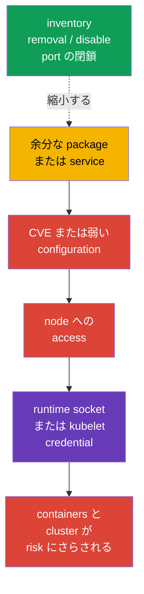
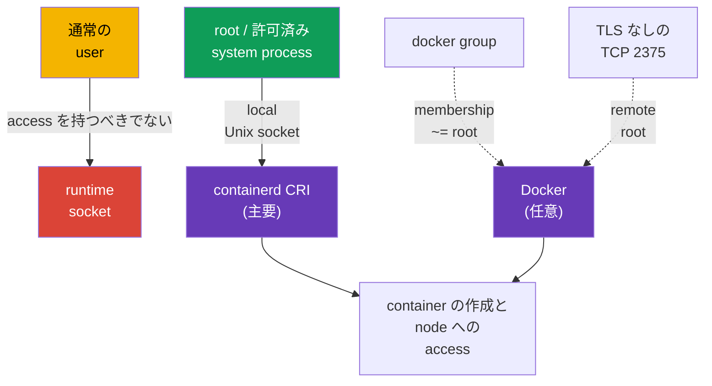

[Русская версия](ru.md) · [Eng version](README.md) · [Versión en español](es.md) · [Version française](fr.md) · [Deutsche Version](de.md) · [ქართული ვერსია](ge.md) · [繁體中文版](tw.md)

# 第14章. host OS footprint の最小化と runtime daemon の安全性

> **課題。** Kubernetes node 上の余分な package、service、listener、socket は、それぞれ CVE を持つ binary と local または network entry の経路を追加します。このような component の compromise は kubelet credentials や container runtime socket へ至り、Kubernetes API の制限を bypass して、node 上の全 workload を危険にさらし得ます。

> **この先。** Kubernetes は policies、RBAC、SecurityContext により workload が API と node に対して行えることを制限します。しかしそれらはすべて Linux node の上にあります。余分な service、package、open port、runtime socket への access は attacker に Kubernetes API を迂回する経路を与えます。CKS の **System Hardening** domain のこの section では、node 自体の attack surface を減らします。必要な services、packages、network points だけを残し、modern CRI runtime の containerd は本当に必要な者だけに提供します。

> **CKA で必要な知識。** `systemd`、processes、files、journal の操作は [CKA 第0.5章](../../../cka/course/00-5-linux/jp.md)で扱っています。Docker、containerd、cgroups、cgroup driver の仕組みは [CKA 第0.4章](../../../cka/course/00-4-containers/jp.md)、CRI の role と kubelet と containerd の関係は [CKA 第40章](../../../cka/course/40/jp.md)で扱っています。ここでは runtime の仕組みは繰り返さず、その access と attack surface を制限します。

## 14.1. attack scenario: 余分な component が entry point になる

Kubernetes node はすべての task 用の汎用 server ではありません。たとえば worker では、kubelet が containerd を使用するなら、graphical environment、printing、Bluetooth、file share、Docker daemon は通常不要です。installed された、特に running 中の component はそれぞれ次を追加します。

- CVE を持つ binaries と dependencies。
- privileges と configuration を持つ process。
- listening port または local socket。
- logs、accounts、unit files、misconfiguration の経路。



これは何もかも削除する勧めではありません。`kubelet`、containerd、合意済み administration 用 SSH、該当 node の control-plane components は必要なことがあります。目標は明示的な一覧を得ることです。**component -> owner -> purpose -> port/socket**。purpose と owner がなければ、dependencies と rollback plan を確認して component を削除または disable します。

変更前に baseline を記録してください。control plane では、access が依存する SSH session で `kubelet`、containerd、etcd、Kubernetes components を disable してはいけません。誤りにより node と API が unavailable になる可能性があります。

```bash
set -euo pipefail
sudo install -d -m 700 /root/hardening-before
sudo systemctl list-unit-files --type=service | sort \
  | sudo tee /root/hardening-before/services-enabled.txt >/dev/null
sudo systemctl list-units --type=service --state=running | sort \
  | sudo tee /root/hardening-before/services-running.txt >/dev/null
sudo ss -tulpn | sort | sudo tee /root/hardening-before/listeners.txt >/dev/null
if command -v dpkg-query >/dev/null; then
  sudo dpkg-query -W -f='${binary:Package}\t${Version}\n' | LC_ALL=C sort \
    | sudo tee /root/hardening-before/packages.txt >/dev/null
elif command -v rpm >/dev/null; then
  sudo rpm -qa | LC_ALL=C sort \
    | sudo tee /root/hardening-before/packages.txt >/dev/null
else
  echo 'REVIEW_REQUIRED: unsupported package manager; cannot create package inventory' >&2
  exit 2
fi
```

> 🧠 node compromise は余分な process、package、listener、socket から始まり得ます。component、owner、purpose、許可された access の map を維持してください。

> 🎯 service、package、kernel module、listener を inventory し、不要な object だけを変更します。baseline を保存し、`kubelet`/containerd を確認します。`disable --now`、removal、port closure には異なる verification が必要です。

## 14.2. 不要な services の inventory と無効化

まず三つの state を区別します。`systemctl list-units` は loaded units、`is-active` は現在 process が動いているか、`is-enabled` は boot 時に start するかを表示します。disabled unit は explicit stop まで active のままの場合があります。

```bash
# 実行中の service units とその state。
sudo systemctl list-units --type=service --state=running

# disabled なものを含む、すべての installed service units。
sudo systemctl list-unit-files --type=service

# 特定 service の出所と起動方法。
SERVICE='service-to-review.service'
sudo systemctl status "$SERVICE"
sudo systemctl cat "$SERVICE"
sudo systemctl show "$SERVICE" -p FragmentPath -p ExecStart -p User
sudo journalctl -u "$SERVICE" --since '24 hours ago'
```

command 実行前に decision table を用意すると役立ちます。

| Finding | action 前の質問 | 通常の決定 |
|---|---|---|
| `kubelet.service` | node は cluster に参加しているか？ | 残す。意図を持つ場合のみ修正する |
| `containerd.service` | kubelet の CRI endpoint か？ | Kubernetes node では残す |
| `docker.service`/`docker.socket` | Docker はこの node に必要か？ | CRI が containerd で Docker が不要なら remove/disable |
| `sshd.service` | 合意済み bastion/console path があるか？ | 第15章の hardening を伴い残すか、alternative access がある場合のみ disable |
| `cups`、`avahi-daemon`、Bluetooth、GUI-service | documented server purpose があるか？ | 通常は remove または disable |
| unknown service | owner、package、port は何か？ | 推測せず investigate する |

既知の不要 unit に対する安全な基本 operation は、現在停止して autostart を禁止することです。command は reversible であり、必要なら `enable --now` で service を戻せます。

```bash
# service がこの node に不要と確認した後の例だけです。
sudo systemctl disable --now avahi-daemon.service

# 両方の state を確認。
sudo systemctl is-active avahi-daemon.service || true
sudo systemctl is-enabled avahi-daemon.service || true
```

`mask` は `disable` より強く、unit を `/dev/null` に向けて manual および dependency-based start を禁止します。node image に絶対に現れてはならない service に使用し、image build/IaC に exception を記録してください。影響を理解せず Kubernetes dependency を mask しないでください。

```bash
UNIT='confirmed-unwanted.service'

# 変更前の state を保存。
sudo systemctl is-active "$UNIT" \
  > "/root/hardening-before/${UNIT}.active" 2>&1 || true
sudo systemctl is-enabled "$UNIT" \
  > "/root/hardening-before/${UNIT}.enabled" 2>&1 || true

# Mask + すでに実行中の unit の停止。
sudo systemctl mask --now "$UNIT"

# 両 state を証明。
sudo systemctl is-active "$UNIT" || true
sudo systemctl is-enabled "$UNIT" || true
```

`--now` がなければ、`mask` は将来の manual と dependency-based start だけを block します。すでに running の service は動き続けます。rollback ではまず `systemctl unmask <unit>` を実行し、次に保存した hardening 前の active/enabled state を正確に復元します。hardening 前に unit が enabled と active でなかった場合、`enable --now` を自動実行しないでください。

## 14.3. 余分な packages と minimal OS image

service を停止するだけでは不十分です。package、その libraries、timer/socket units、将来の CVE は node に残ります。packages を inventory し、binary を提供した package を特定し、reverse dependencies を確認します。Debian/Ubuntu では次のとおりです。

```bash
PACKAGE='package-to-review'
BINARY='binary-to-review'
apt list --installed 2>/dev/null | less
apt-cache policy "$PACKAGE"
dpkg -S "$(command -v "$BINARY")"
apt-cache rdepends --installed "$PACKAGE"

# manually installed packages を出力する。image review の出発点。
apt-mark showmanual | sort
```

review 後は、確認済み package だけを remove します。`apt purge` は configuration も削除します。`autoremove` の前には list を読みます。必要な library や diagnostics tool が含まれる可能性があるためです。

```bash
PACKAGE='confirmed-unneeded-package'
sudo apt purge "$PACKAGE"
sudo apt autoremove --dry-run
# list を review した後にだけ autoremove を実行する。
sudo apt autoremove
# ここでは意図的に mass apt upgrade を実行しない。patching は別の change window で行う。
```

RPM systems では `rpm -qa`、`dnf repoquery --installed`、`dnf remove` が相当します。system hardening と uncontrolled mass update を混ぜないでください。updates、image version、rollback は通常の operations process を通す必要があります。

**minimal OS image** は、すでに running の各 node を手作業で清掃するより望ましい方法です。node image/configuration で必要な packages と services を宣言し、desktop、compilers、test utilities、不要 agents を除外し、patch を含めて image を定期的に rebuild します。minimal とは recovery 手段をなくすことではありません。合意済みの access、logging、diagnostics の方法を残す必要があります。

> 🏭 **Production。** [Bottlerocket](https://bottlerocket.dev/) のような specialized Kubernetes OS は、意図的に minimal な immutable image と管理された update workflow により mutable host footprint を減らせます。これは architectural choice です。production rollout 前に stage で target Kubernetes version、CNI/CSI、bootstrap、observability、debug access、rollback の support を確認してください。official documentation なしに通常 Linux distribution の `apt`/`dpkg` commands や paths をこの OS へ移植しないでください。

| Approach | 利点 | Risk と control |
|---|---|---|
| running node 上で package を remove | known surface を素早く除去 | nodes 間 drift。IaC/image に記録する |
| package allowlist を持つ golden image | 一貫し audit 可能な state | rebuild と update process が必要 |
| Immutable/minimal OS | packages と runtime changes が少ない | debug と update を事前に設計する |
| 「unknown なものをすべて remove」 | なし | kubelet、CNI、storage、monitoring、access を壊し得る |

## 14.4. kernel modules: inventory と管理された無効化

kernel module は attack surface の一部ですが、影響なく削除できる「余分な package」ではありません。最初に loaded modules、その parameters、load rules を記録し、image owner と OS documentation で module の目的を確認します。

```bash
MODULE='example_module'
lsmod | sort
sudo modinfo "$MODULE"
# `modprobe -c` は effective configuration の source of truth。
EFFECTIVE_MODPROBE_CONFIG=$(sudo modprobe -c) || {
  echo 'ERROR: cannot read effective modprobe configuration' >&2
  exit 2
}
printf '%s\n' "$EFFECTIVE_MODPROBE_CONFIG" \
  | grep -E "^(blacklist|install)[[:space:]]+${MODULE}\b" || true
sudo modprobe -n -v "$MODULE"
# これらの files は rule の source を探すためだけに必要で、overridden されている場合があります。
sudo find /etc/modprobe.d /run/modprobe.d /usr/local/lib/modprobe.d \
  /usr/lib/modprobe.d /lib/modprobe.d -type f -print 2>/dev/null | sort
sudo grep -RnsE "^(blacklist|install)[[:space:]]+${MODULE}\b" \
  /etc/modprobe.d /run/modprobe.d /usr/local/lib/modprobe.d /usr/lib/modprobe.d /lib/modprobe.d \
  2>/dev/null || true
```

`modprobe -c` は precedence を考慮した final rules を表示します。file-level の `find`/`grep` は見つかった rule の source を特定するためだけに使い、overridden entries が表示されることがあります。特定 module に対して `modprobe -n -v` は、`modprobe` が実行する実際の action を表示します。

`modprobe -r <module>` は module を**一時的にだけ**unload します。reboot を越えて残らず、module が使われているか dependency に保持されていれば error になります。permanent な禁止は管理された `modprobe` configuration に設定します。`blacklist` は通常の autoload を妨げ、`install ... /bin/false` はその rule 経由の explicit `modprobe` も block します。module が実際に不要であると確認した後にのみ、両 mechanisms を一緒に適用します。

```bash
MODULE='example_module'
# change window での一時確認。使用中 module を強制 unload しようとしないこと。
sudo modprobe -r "$MODULE"

# manual node drift ではなく image/IaC 内の permanent rule。
sudo tee "/etc/modprobe.d/disable-${MODULE}.conf" >/dev/null <<EOF
blacklist $MODULE
install $MODULE /bin/false
EOF

# Debian/Ubuntu では、module が early boot にあり得るなら initramfs を update する。
sudo update-initramfs -u
sudo modprobe -n -v "$MODULE"       # install /bin/false rule が期待される
```

planned reboot 後に `lsmod`、`modprobe -n -v`、node health を確認します。modules は CNI、storage driver、runtime、network/disk hardware に必要なことがあります。まず drained/staging node 一台で test し、その後 `kubelet`、containerd、CNI、workload の verification を伴い node-by-node で rollout します。blacklist を全 pool に同時に適用しないでください。

## 14.5. open ports: listener、purpose、network perimeter

port 自体が危険なのではなく、unknown な service または不適切な sources から reachable な service が危険です。最初に「listener - PID - unit - 必要な sources」の対応付けを行い、その後 service と firewall を制限します。`ss` は通常 modern Linux にあります。`lsof` と `netstat` は alternatives として有用です。

```bash
# process と PID を含む TCP および UDP listeners（完全な情報には root が必要）。
sudo ss -tulpn
sudo lsof -nP -iTCP -sTCP:LISTEN
sudo netstat -tulpn                    # net-tools package が installed の場合

# runtime Unix sockets は TCP/UDP output には現れない。
sudo ss -lxnp | grep -E 'docker|containerd' || true
```

| Point | 通常必要な場所 | 安全な方針 |
|---|---|---|
| SSH `22/tcp` | 管理された node access | bastion/VPN/administrative CIDR だけ |
| kubelet `10250/tcp` | control-plane と合意済み diagnostics | internet に開かない。TLS、authn/authz、firewall |
| kube-apiserver `6443/tcp` | architecture に応じた control-plane、worker、administrators | allowlist/private endpoint。`0.0.0.0/0` ではない |
| etcd `2379`, `2380/tcp` | control-plane/etcd peers のみ | worker や external network に公開しない |
| Docker TCP API（多くは `2375`/`2376`） | justified remote management の場合のみ | `2375` は listen しない。すべての TCP endpoint には explicit exception、mTLS、正確な firewall が必要 |

| containerd/NRI Unix socket | node 上で local | `root` と最小限の許可済み system consumers |

port number だけで判断しないでください。たとえば control-plane の `6443` は想定どおりですが、worker では error の可能性があります。`10250` は kubelet に必要ですが public であってはなりません。network filtering は不要 service の disable を補完しますが、置き換えるものではありません。external access と SSH の詳細な制限は第15章で扱います。

```bash
SERVICE='service-owning-the-listener.service'
PORT='10250'
# 最初に specific listener とその unit を確認する。
sudo ss -lntp | grep -E ':(22|10250|6443|2379|2380|2375|2376)\b' || true
sudo systemctl status "$SERVICE"

# service の remove/disable 後、port は消える必要がある。ss error は listener 不在を意味しない。
listeners=$(sudo ss -H -lnt "( sport = :${PORT} )") || {
  echo "ERROR: cannot inspect TCP listener ${PORT}" >&2; exit 2;
}
if [ -n "$listeners" ]; then
  printf 'ERROR: TCP port %s is still listening:\n%s\n' "$PORT" "$listeners" >&2
  exit 1
fi
echo "OK: TCP listener ${PORT} is absent"
```

> 🎯 service、package、kernel module、listener を inventory し、不要な object だけを変更します。baseline を保存し、`kubelet`/containerd を確認します。`disable --now`、removal、port closure には異なる verification が必要です。
## 14.6. containerd と任意の Docker の安全性

modern Kubernetes node では containerd が主要な CRI runtime です。Docker daemon とその socket は CRI baseline ではなく、個別の確認済み task にのみ必要です。runtime daemon は通常 container より大きな privileges を持ちます。containerd、NRI、Docker API に接続できる client は、privileged container を実行し、host filesystem を mount し、node credentials を取得できることが多いです。したがって Unix socket は無害な implementation detail ではなく access boundary です。

> 🎯 containerd CRI socket への access は `root` と最小限の system consumers だけに与えます。world-writable mode や unprivileged workload への mount は許可しません。



> 🔬 Docker は Docker host にだけ適用します。NRI/debug/metrics には version と runtime 固有の確認が必要です。

### Docker: unauthenticated TCP API は不可

`dockerd -H tcp://0.0.0.0:2375` は port に到達できる全員に Docker API を公開します。`2375` には TLS も authentication もありません。実質的に remote root です。systemd unit の `ExecStart`、drop-in、`/etc/docker/daemon.json` のいずれにも存在してはなりません。firewall だけで `2375` を「守ろう」としないでください。rule の誤りで再び API が reachable になります。

```bash
set -euo pipefail
# この gate は effective configuration と actual listeners を independent に確認します。
# false が safe baseline。true は documented risk exception の場合だけ許可されます。
ALLOW_REMOTE_DOCKER_API=false
declare -a TCP_CONFIGURATION_SOURCES=()
USES_SOCKET_ACTIVATION=false

add_tcp_source() {
  TCP_CONFIGURATION_SOURCES+=("$1")
}

# normalized Docker -H/--host values を分類する。Unix と fd は TCP ではない。
# host:、host:port、:port、numeric port、tcp:// は TCP forms。
classify_docker_host() {
  local source=$1 host=$2
  case "$host" in
    unix://*|/*|@*) ;;
    fd://*) USES_SOCKET_ACTIVATION=true ;;
    tcp://*|*:*|[0-9]*) add_tcp_source "$source: $host" ;;
    *)
      printf 'REVIEW_REQUIRED: cannot classify Docker host value from %s: %s\n' "$source" "$host" >&2
      exit 2
      ;;
  esac
}

# effective systemd service configuration と active daemon の argv。
DOCKER_SERVICE_EXEC=$(sudo systemctl show docker.service -p ExecStart --value 2>/dev/null || true)
DOCKER_PID=$(pgrep -xo dockerd || true)
DOCKER_CMDLINE=''
if [ -n "$DOCKER_PID" ]; then
  DOCKER_CMDLINE=$(sudo cat "/proc/$DOCKER_PID/cmdline" | tr '\0' '\n') || {
    echo 'ERROR: cannot read dockerd argv' >&2
    exit 2
  }
fi

# -H=<value> を含む effective ExecStart の全 -H/--host forms を parse する。
mapfile -t EXEC_HOST_DIRECTIVES < <(
  printf '%s\n' "$DOCKER_SERVICE_EXEC"     | grep -Eo -- '(-H|--host)(=|[[:space:]]+)[^[:space:]]+' || true
)
for directive in "${EXEC_HOST_DIRECTIVES[@]}"; do
  case "$directive" in
    -H=*) host=${directive#-H=} ;;
    --host=*) host=${directive#--host=} ;;
    -H\ *) host=${directive#-H } ;;
    --host\ *) host=${directive#--host } ;;
    *)
      printf 'REVIEW_REQUIRED: cannot normalize ExecStart host directive: %s\n' "$directive" >&2
      exit 2
      ;;
  esac
  classify_docker_host 'docker.service ExecStart' "$host"
done

# argv は NUL-separated なので、quoting ambiguity なしに individual values を parse する。
mapfile -t DOCKER_ARGV <<< "$DOCKER_CMDLINE"
for ((i = 0; i < ${#DOCKER_ARGV[@]}; i++)); do
  case "${DOCKER_ARGV[i]}" in
    -H|--host)
      ((++i < ${#DOCKER_ARGV[@]})) || {
        echo 'REVIEW_REQUIRED: dockerd host flag has no value' >&2
        exit 2
      }
      classify_docker_host 'dockerd argv' "${DOCKER_ARGV[i]}"
      ;;
    -H=*) classify_docker_host 'dockerd argv' "${DOCKER_ARGV[i]#-H=}" ;;
    --host=*) classify_docker_host 'dockerd argv' "${DOCKER_ARGV[i]#--host=}" ;;
  esac
done

# custom config path は grep output から安全に推測できない。explicit review を要求する。
if printf '%s\n' "$DOCKER_SERVICE_EXEC" "$DOCKER_CMDLINE"   | grep -Eq -- '--config-file(=|[[:space:]])'; then
  echo 'REVIEW_REQUIRED: dockerd uses --config-file; parse that effective config before allowing Docker TCP API' >&2
  exit 2
fi

# default config の hosts を parse する。jq がなければ hosts key は PASS ではなく review-required。
if sudo test -f /etc/docker/daemon.json && sudo grep -qE '"hosts"[[:space:]]*:' /etc/docker/daemon.json; then
  command -v jq >/dev/null || {
    echo 'REVIEW_REQUIRED: jq is required to parse daemon.json hosts safely' >&2
    exit 2
  }
  DOCKER_CONFIG_HOSTS=$(sudo jq -er '
    if .hosts? == null then empty
    elif (.hosts | type) == "array" and all(.hosts[]; type == "string") then .hosts[]
    else error("daemon.json hosts must be an array of strings") end
  ' /etc/docker/daemon.json) || {
    echo 'REVIEW_REQUIRED: cannot parse daemon.json hosts' >&2
    exit 2
  }
  while IFS= read -r host; do
    [ -z "$host" ] || classify_docker_host 'daemon.json hosts' "$host"
  done <<< "$DOCKER_CONFIG_HOSTS"
fi

# `Listen` は systemd の effective socket property。absent unit と effective
# configuration を読めない unit を区別し、後者を PASS に決してしない。
DOCKER_SOCKET_LOAD_STATE=$(sudo systemctl show docker.socket -p LoadState --value 2>/dev/null) || {
  echo 'REVIEW_REQUIRED: cannot determine whether docker.socket exists' >&2
  exit 2
}
case "$DOCKER_SOCKET_LOAD_STATE" in
  not-found) DOCKER_SOCKET_PRESENT=false ;;
  '')
    echo 'REVIEW_REQUIRED: empty docker.socket LoadState' >&2
    exit 2
    ;;
  *) DOCKER_SOCKET_PRESENT=true ;;
esac
if [ "$DOCKER_SOCKET_PRESENT" = true ]; then
  DOCKER_SOCKET_LISTEN=$(sudo systemctl show docker.socket -p Listen --value) || {
    echo 'REVIEW_REQUIRED: cannot read effective docker.socket Listen configuration' >&2
    exit 2
  }
  [ -n "$DOCKER_SOCKET_LISTEN" ] || {
    echo 'REVIEW_REQUIRED: docker.socket has no effective Listen entries' >&2
    exit 2
  }
  while IFS= read -r listen_entry; do
    listen_entry=${listen_entry#"${listen_entry%%[![:space:]]*}"}
    [ -z "$listen_entry" ] && continue
    case "$listen_entry" in
      *' (Stream)') socket_address=${listen_entry% (Stream)} ;;
      *)
        printf 'REVIEW_REQUIRED: cannot classify non-stream docker.socket Listen entry: %s\n' "$listen_entry" >&2
        exit 2
        ;;
    esac
    case "$socket_address" in
      /*|@*) ;;  # filesystem と abstract Unix sockets
      *:*) add_tcp_source "docker.socket Listen: $socket_address" ;;
      *)
        if [[ "$socket_address" =~ ^[0-9]+$ ]]; then
          add_tcp_source "docker.socket Listen: $socket_address"
        else
          printf 'REVIEW_REQUIRED: cannot classify docker.socket Listen address: %s\n' "$socket_address" >&2
          exit 2
        fi
        ;;
    esac
  done <<< "$DOCKER_SOCKET_LISTEN"
elif [ "$USES_SOCKET_ACTIVATION" = true ]; then
  echo 'REVIEW_REQUIRED: dockerd uses fd:// but docker.socket is absent' >&2
  exit 2
fi

# current listeners は別の evidence。process metadata の先頭だけでなく、どこにでもある dockerd を match する。
listeners_2375=$(sudo ss -H -lnt '( sport = :2375 )') || {
  echo 'ERROR: cannot inspect TCP 2375' >&2
  exit 2
}
dockerd_tcp_listeners=$(sudo ss -H -lntp | awk 'index($0, "\"dockerd\"")') || {
  echo 'ERROR: cannot inspect dockerd TCP listeners' >&2
  exit 2
}

TCP_EVIDENCE=$(printf '%s\n%s\n' "${TCP_CONFIGURATION_SOURCES[*]-}" "$dockerd_tcp_listeners")
if [ -n "$listeners_2375" ] || [ -n "${TCP_CONFIGURATION_SOURCES[*]-}" ] || [ -n "$dockerd_tcp_listeners" ]; then
  printf 'Docker TCP configuration/listener evidence:\n%s\n' "$TCP_EVIDENCE" >&2
  if printf '%s\n%s\n' "$listeners_2375" "$TCP_EVIDENCE"     | grep -Eq '(^|[^0-9])2375([^0-9]|$)'; then
    echo 'ERROR: Docker TCP 2375 is configured or listening' >&2
    exit 1
  fi
  if [ "$ALLOW_REMOTE_DOCKER_API" != true ]; then
    echo 'ERROR: unexpected Docker TCP endpoint is configured or listening' >&2
    exit 1
  fi
  echo 'REVIEW_REQUIRED: every allowed endpoint needs effective tlsverify=true, CA, server certificate/key, verified client-certificate authentication and firewall/security-group allowlist.' >&2
  exit 2
fi
echo 'OK: no Docker TCP endpoint is configured or listening'
```

typical な systemd installation では Docker は `-H fd://` を受け取り、`docker.socket` は通常 local Unix socket を作ります。確認せずに仮定しないでください。effective systemd property `Listen` は、`dockerd` start 前から存在する TCP listener を設定できるためです。上の gate は `Stream` entries のみを parse します。path `/…` と abstract Unix socket `@…` は Unix のままで、port、`host:port`、`[IPv6]:port` は TCP とみなされます。`daemon.json` の `hosts` と unit 内の `-H` を同時に追加しないでください。Docker は conflicting settings で終了します。active source から TCP endpoint だけを除去し、configuration を確認して service を一つずつ restart します。

```bash
# daemon.json では、先に syntax と supported keys を確認する。
sudo dockerd --validate --config-file=/etc/docker/daemon.json
sudo systemctl daemon-reload
sudo systemctl restart docker.service
sudo systemctl --no-pager --full status docker.service
sudo journalctl -u docker.service -n 50 --no-pager
```

remote Docker API が実際に合意済み requirement である場合、port number は TLS または mTLS を証明しません。`2376` でさえ証拠ではありません。許可された**各** TCP endpoint について、effective `tlsverify=true`、CA、server certificate と key、実際の client certificate authentication を確認します。firewall/security group と dedicated management network で sources を制限します。これは risk owner を持つ exception であり、Kubernetes node の default ではありません。

### containerd、NRI、runtime の filesystem boundaries

主要な CRI socket は通常 `/run/containerd/containerd.sock` にあります。NRI socket path は configurable で、よく `/run/nri/nri.sock`（`/var/run/nri/nri.sock` と同じ）です。**いずれか**への access は root-equivalent です。`root` と最小限の system processes だけに残します。operations に group が必要な場合、それは通常 users のいない専用 system group でなければなりません。developers、CI accounts、workload identities を追加しないでください。`containerd.sock` または `nri.sock` を unprivileged container に mount してはいけません。

Docker または containerd socket に universal な `chmod` はありません。path、owner、group、mode は package、systemd unit、specific node policy が決めます。world-writable modes を使わず、systemd が socket を再作成する場合に一回の command で permissions を「修正」しないでください。最初に configuration owner を特定し、supported image/IaC configuration で最小 access を固定して、restart 後に確認します。

```bash
sudo systemctl status containerd.service --no-pager
sudo systemctl cat containerd.service
sudo stat -Lc '%A %a %U:%G %n' /run/containerd/containerd.sock \
  /run/nri/nri.sock 2>/dev/null || true
sudo ss -lxnp | grep -E 'containerd\.sock|nri\.sock' || true

# CRI diagnostics は local かつ root で実行する。endpoint は kubelet config と照合する。
sudo crictl --runtime-endpoint unix:///run/containerd/containerd.sock ps
sudo grep -Rns -- '--container-runtime-endpoint\|containerRuntimeEndpoint' \
  /var/lib/kubelet /etc/systemd/system /usr/lib/systemd/system 2>/dev/null || true
```

socket だけを保護するのでは不十分です。`/run/containerd` には runtime state と sockets があり、`/var/lib/containerd` には persistent content と metadata があります。containerd の目安は `/var/lib/containerd` に `0700`、`/run/containerd` root に `0711` です。後者は user-namespaced workload に必要な traversal を許しつつ directory contents を開示しません。sensitive subdirectories は `0700`、sockets は unprivileged users のいない system group で `0660` にします。どの path も通常 users や containers に writable であってはなりません。configuration、plugins、CNI も root-owned で unauthorized subjects からの write を防ぐ必要があります。通常は `/etc/containerd`、runtime plugin directories、`/etc/cni/net.d`、CNI binaries の `/opt/cni/bin` です（specific paths は distribution と config で確認します）。wide な `chmod -R` は行わず、ownership と writable bits を個別に確認してください。

```bash
sudo find /run/containerd /var/lib/containerd /etc/containerd /etc/cni/net.d /opt/cni/bin \
  -xdev -printf '%m %u:%g %p\n' 2>/dev/null | sort
```

containerd 2.0 では NRI が default で enabled です。これは明確な decision point です。NRI を使用しないなら、tested configuration（`[plugins."io.containerd.nri.v1.nri"]` と `disable = true`）で plugin を disable します。使用する場合は NRI plugins、その configuration、external plugin connections を runtime TCB の一部とみなし、paths と access を制限します。

debug と metrics は別の API surfaces です。Unix debug socket は `root` と許可済み system consumers に制限し、TCP debug endpoint は公開しません。containerd metrics は TLS と authentication がないことが多いため、loopback または dedicated management interface にのみ bind し、firewall/routing でさらに制限します。変更前に使用する containerd version が support する parameters を確認し、restart 後に `ss` で listeners を確認してください。

### Docker: 本当に必要な場合だけ

個別 task のため Docker を残す場合、その socket と `docker` group も root-equivalent です。通常 users に membership を付与せず、unprivileged workload に socket を mount せず、すべての installations に同じ owner/mode があると仮定しないでください。unit/package policy に従い、denied account として access を確認します。

```bash
readlink -f /var/run/docker.sock 2>/dev/null || true
sudo stat -Lc '%A %a %U:%G %n' /var/run/docker.sock 2>/dev/null || true
getent group docker || true
getent group docker | awk -F: '{print $4}'
UNPRIVILEGED_USER='unprivileged-user'
sudo -u "$UNPRIVILEGED_USER" docker ps  # 許可されない user では拒否が期待される
```

Kubernetes node に Docker が不要なら、kubelet や operational tasks が依存していないことを確認した後、package を remove するか、`docker.service` と `docker.socket` を disable および mask する方が確実です。

### `/etc/docker/daemon.json` の hardening

`daemon.json` は Docker configuration source の一つです。firewall、socket permissions、SecurityContext、Kubernetes policies を置き換えませんが、安全な daemon baseline を設定します。systemd がすでに `-H fd://` を渡している場合、`hosts` を追加しないでください。

#### 新しい Docker host

次の baseline は、version support と planned workload との compatibility を確認した後の**新しい** Docker installation に適用できます。

```json
{
  "live-restore": true,
  "no-new-privileges": true,
  "userns-remap": "default",
  "log-driver": "local"
}
```

| Key | 提供するもの | 有効化前の確認 |
|---|---|---|
| `live-restore` | daemon が unavailable な間も containers を動かし続けられる場合がある | upgrade workflow、monitoring、expected restart behavior。あらゆる config/migration change を保証するものではない |
| `no-new-privileges` | 新しい container processes が `setuid`/file capabilities で privilege を上げることを防ぐ | 誤って privilege escalation を必要とする applications。existing containers は recreate する |
| `userns-remap` | container root を unprivileged host UID に map する | volumes、ownership、images、compatibility。production node では test なしに有効化しない |
| `log-driver: local` | JSON logs の増加を制限し、driver が rotation を管理する | centralized log collection と retention。existing containers は自動 migration しない |

#### 既存 Docker host: 個別 migration

この JSON を、running Docker host に通常の edit と restart として適用しないでください。change 前に containers/images/volumes の inventory を集め、`/etc/subuid` と `/etc/subgid`、bind mounts、host networking、privileged containers を確認し、`userns-remap` compatibility を評価して recreate/migration と rollback plan を準備します。

```bash
set -euo pipefail
sudo docker ps -a --no-trunc
sudo docker image ls
sudo docker volume ls
sudo docker network ls
sudo grep -Ev '^[[:space:]]*(#|$)' /etc/subuid /etc/subgid 2>/dev/null || true
# 各 workload ごとに: sudo docker inspect <container>; mounts、network、privileges を確認する。
```

daemon default としての `no-new-privileges` は new containers に適用されます。existing containers は recreate が必要です。`log-driver` の変更は existing containers を自動変換しません。`userns-remap` は Docker の namespace/storage view と ownership を変えるため、個別 migration が必要です。`live-restore` はどの daemon configuration change でも containers を保持する無条件の保証ではありません。containerd を使う Kubernetes node では、これは containerd setting でも `runAsNonRoot` の代替でもありません。test 後に dedicated Docker host だけへ適用してください。

既存 file の上に `install /dev/null` で `daemon.json` を作らないでください。まず current configuration を保存します。新しい empty file は存在しない場合だけ作成します。

```bash
sudo install -d -m 0755 /etc/docker

if sudo test -e /etc/docker/daemon.json; then
  # まず existing configuration を保存する。
  sudo cp -a /etc/docker/daemon.json /root/hardening-before/daemon.json.before
  sudo chown root:root /etc/docker/daemon.json
  sudo chmod 0600 /etc/docker/daemon.json
else
  # まだない場合にのみ empty file を作成する。
  sudo install -m 0600 -o root -g root /dev/null /etc/docker/daemon.json
fi

sudoedit /etc/docker/daemon.json
sudo dockerd --validate --config-file=/etc/docker/daemon.json
sudo systemctl restart docker.service
sudo systemctl --no-pager --full status docker.service
sudo docker info --format '{{json .SecurityOptions}}'
```

> 🎯 before/after diff と negative checks で最小化を証明します。不要 service は active/enabled でなく、listener と `2375` はなく、unprivileged user は runtime access を得ません。

## 14.7. 結果の検証: minimal node を証明する

verification は configuration fact と access fact から成ります。file に必要な line があるだけでは不十分です。service が config を reread していないことや、socket が old group で再作成されることがあります。before/after diff と、access を除去した user としての test を実行してください。

```bash
set -euo pipefail
sudo install -d -m 700 /root/hardening-after

# 1. Services: before/after snapshots と running + enabled states の diff。
sudo systemctl list-units --type=service --state=running | sort \
  | sudo tee /root/hardening-after/services-running.txt >/dev/null
sudo systemctl list-unit-files --type=service | sort \
  | sudo tee /root/hardening-after/services-enabled.txt >/dev/null
sudo diff -u /root/hardening-before/services-running.txt \
  /root/hardening-after/services-running.txt || true
sudo diff -u /root/hardening-before/services-enabled.txt \
  /root/hardening-after/services-enabled.txt || true

# 2. Packages と network listeners: distro-aware snapshot。次にすべての diff を説明する。
if command -v dpkg-query >/dev/null; then
  sudo dpkg-query -W -f='${binary:Package}\t${Version}\n' | LC_ALL=C sort \
    | sudo tee /root/hardening-after/packages.txt >/dev/null
elif command -v rpm >/dev/null; then
  sudo rpm -qa | LC_ALL=C sort \
    | sudo tee /root/hardening-after/packages.txt >/dev/null
else
  echo 'REVIEW_REQUIRED: unsupported package manager; cannot create package inventory' >&2
  exit 2
fi
sudo ss -tulpn | sort | sudo tee /root/hardening-after/listeners.txt >/dev/null
sudo diff -u /root/hardening-before/packages.txt \
  /root/hardening-after/packages.txt || true
sudo diff -u /root/hardening-before/listeners.txt \
  /root/hardening-after/listeners.txt || true

# 3. Docker TCP: `ss` check だけでなく §14.6 の canonical gate 全体を繰り返す。
# PASS は effective ExecStart/argv、daemon.json hosts/default または explicitly reviewed custom config、
# effective docker.socket Listen、current listener のすべてに TCP endpoint がない場合だけ可能。
# TCP Listen は dockerd の start 前から存在し得る。

# 4. runtime socket は local のまま。owner/mode は unit/package policy に従い、
#   通常 users に access を与えず、world-writable ではない。
for socket in /run/containerd/containerd.sock /run/nri/nri.sock /var/run/docker.sock; do
  if [ -S "$socket" ]; then
    sudo stat -Lc '%A %a %U:%G %n' "$socket"
  fi
done

# 5. Debug は public でなく、metrics は TLS/auth なしに all interfaces へ出さない。
sudo ss -lntup | grep -E 'containerd|debug|metrics' || true
```

**DoD - minimal node:**

- [ ] active service ごとに purpose、owner、expected port/socket がある。
- [ ] 不要 services は `systemctl disable --now` で停止し、繰り返し危険なら必要に応じて mask されている。kubelet/containerd と必要 components は壊れていない。
- [ ] 確認済みの不要 packages は remove され、node image には package allowlist と update process がある。手作業の文書化されない drift ではない。
- [ ] `ss -tulpn` に unexplained listeners がない。`10250`、`6443`、etcd、SSH は architecture が必要とする場所と sources にだけ available である。
- [ ] `2375` は configure も listen もしていない。full gate は effective `ExecStart`/argv、`daemon.json hosts` または explicitly reviewed custom config、effective `docker.socket Listen`、`ss -lntp` を分析する。まだ listen していない、または socket-activated な endpoint を含め、**いずれの** port にも unapproved Docker TCP endpoint がない。allowed endpoint には risk owner、effective `tlsverify=true`、CA、server certificate/key、verified client-certificate authentication、firewall/security-group allowlist がある。`2376` だけでは mTLS の証明にならない。
- [ ] `/run/containerd/containerd.sock` と、存在する場合の `/run/nri/nri.sock` は通常 users から access できず、unprivileged workload に mount されず、`sudo crictl` は動作し続ける。allowed groups は system subjects だけで構成される。
- [ ] `/run/containerd`、`/var/lib/containerd`、configuration/plugins/CNI は root-owned で unauthorized subjects に writable でない。public TCP debug endpoint はなく、TLS/auth のない metrics は loopback または management interface に制限される。
- [ ] Docker が installed なら、その access は unit/package policy で制限され、通常 user は `docker ps` を実行できない。`daemon.json` は `dockerd --validate` を通過している。
- [ ] Docker/containerd と kubelet は healthy で、changes は image/IaC/change record に記録されている。

## 14.8. 一般的な誤りと診断

| Symptom | 考えられる原因 | 確認と修正 |
|---|---|---|
| `docker` がまだ `2375` で listen している | TCP が systemd drop-in、`ExecStart`、`daemon.json` に指定されている | `systemctl cat docker.service docker.socket`、`ps -ef`、`tcp://` の検索。active source を除去して daemon を restart |
| edit 後に Docker が start しない | JSON の `hosts` と unit の `-H` の conflict、または invalid JSON | `dockerd --validate`、`journalctl -u docker`。hosts source を一つ残す |
| socket permissions の一回の edit が restart 後に消える | systemd または runtime が socket を再作成する | `systemctl cat` で unit/package owner を特定し、IaC/drop-in で policy を固定して、`stat` を再確認 |
| user がまだ `docker ps` または runtime access を実行できる | old login session に privileged group がある、または policy が広すぎる | `id <user>`、new session、`getent group`。non-system members を除去して access を確認 |
| worker が `NotReady` になった | containerd または kubelet を remove/stop した、または CRI config が壊れた | `systemctl status kubelet containerd`、`journalctl -u kubelet`、endpoint の照合、snapshot から restore |
| 必要な port を閉じた | PID と purpose を確認せず port number で disable した | `ss -lntp`、unit owner、sources/purpose。対象を限定して rollback |
| `apt autoremove` 後に必要な utility がない | list を review せず、package dependency を誤って評価した | package を restore し、image allowlist を固定し、`--dry-run` を使う |

> 🏭 role-specific golden image、IaC、inventory、drift detection。staging/canary と rollback、`kubelet`、runtime、CNI、workload の verification を伴う node-by-node rollout。

## 14.9. production での適用方法

- **Kubernetes v1.37 rootless node path。** `KubeletInUserNamespace` は Beta になり、kubelet と関連 node components が user namespace を通じて host-root なしに動く node stack を構築できます。Pod を isolate する `spec.hostUsers: false` と混同しないでください。[Kubernetes v1.37 Security Delta](../APPENDIX_K8S_137_SECURITY_DELTA_JP.md)を参照してください。
- **baseline を code で設定する。** packages、enabled services、systemd drop-ins、firewall、socket checks の一覧を immutable image、Ansible/Cloud-Init、またはほかの IaC に含めます。手作業の emergency fix は後で source of truth に移します。
- **nodes を role で分ける。** control-plane、worker、build-host、Docker-host に同じ packages と ports を与えません。特に、CRI が containerd の場合、interactive `docker ps` だけのために Docker daemon を worker に install しません。
- **runtime access を privileged access として review する。** group members、containerd/NRI/Docker socket permissions、systemd overrides の変更は、`sudo` の付与と同じ review を通します。allowed system groups に通常 users はいません。
- **drift を確認する。** 定期的な CIS/OS scan、package inventory、enabled units、listeners を baseline と比較します。owner のない新しい listener は「通常 state」ではなく incident または change です。
- **段階的に変更する。** staging node と一 service から始め、`kubelet`/`containerd` health check の後でのみ rollout します。control plane には out-of-band console と tested rollback を用意します。

> **より深く学びたい人向け - 試験範囲外。** 本章と第16-17章は、risk の識別、必要な `securityContext` field または policy の適用、effect の確認に必要な範囲で namespaces、capabilities、cgroups、MAC を説明します。kernel が syscall interception をどう実装するか、cgroup v2 controller level で何が起きるか、kernel structures level の namespace isolation など mechanism 自体を深く学ぶには、Liz Rice の *Container Security*、第2版（O'Reilly、2025）がこれを扱います。本 course は Linux internals の深さで競うものではありません。これは topic が第14-17章で尽きたという意味ではなく、意図した scope boundary です。

## 14.10. ミニ用語集

- **footprint** - node の attack surface を増やす packages、processes、ports、sockets、configuration の集合。
- **attack surface** - attack または configuration error が可能な、すべての reachable points。
- **systemd unit** - systemd が管理する service、socket、timer、その他 entity の description。
- **Unix socket** - local filesystem IPC point。file permissions が daemon API に接続できる者を決める。
- **Docker socket** - `/var/run/docker.sock`、Docker daemon の local API。Docker が installed の場合、access は root-equivalent で、specific unit/package policy により制限される。
- **`docker` group** - Docker socket への access を与える group。通常の working group ではなく root-equivalent として扱う。
- **CRI socket** - kubelet と主要 runtime containerd 間の endpoint。例: `/run/containerd/containerd.sock`。access は root-equivalent。
- **NRI socket** - containerd の Node Resource Interface Unix API。access も root-equivalent。
- **`daemon.json`** - Docker daemon configuration file。通常 `/etc/docker/daemon.json`。
- **`live-restore`** - daemon restart 中も containers を実行し続ける Docker mode。
- **`userns-remap`** - host 上で container UID/GID を user namespace remap すること。

## 14.11. 章のまとめ

- minimal node は inventory から始まります。各 service、package、listener、socket に purpose と owner があり、残りは remove または disable します。
- `systemctl disable --now` は不要 service を停止し autostart を禁止します。`apt purge` は dependencies の review 後に確認済み package だけへ適用します。
- ports は process と sources によって評価します。kubelet `10250` と API `6443` は internet 全体に公開してはならず、Docker `2375` はまったく listen してはいけません。
- `-H tcp://0.0.0.0:2375` は unauthenticated remote root です。Docker は Unix socket に残します。TCP endpoint は justified mTLS exception に限り、`2376` は安全の証明ではありません。
- containerd は主要な modern CRI runtime です。その socket と NRI socket への access は root-equivalent で、system subjects に制限し、unprivileged workload に mount してはいけません。
- Docker/containerd socket permissions を universal な `chmod` で設定しません。world-writable mode や通常 users なしに、対応する unit/package policy で固定します。
- `/run/containerd`、`/var/lib/containerd`、config/plugins/CNI は保護された root-owned surfaces です。Unix debug は制限し、TCP debug を public にせず、TLS/auth のない metrics は loopback または management interface だけで listen させます。
- `daemon.json` の `live-restore`、`no-new-privileges`、`userns-remap` は justified Docker host にのみ適用し、validation、compatibility test、rollout が必要です。

## 14.12. 試験と実務での役立ち方

**試験で。** 最初に active source を見つけます。`systemctl cat`、`systemctl show`、`ss -tulpn`、`stat`、`ps` は file path を推測するより信頼できます。task は Docker TCP の削除、socket permissions の修正、service の disable を求めることがあります。変更後に結果を証明します。`2375` は listen せず、`ss -lntp` に unapproved TCP listener `dockerd` はなく、`stat` は必要な owner/mode を示し、unauthorized user は拒否されます。port や process が unfamiliar というだけで kubelet/containerd を disable してはいけません。

**実務で。** node compromise の多くは、unpatched package、残された management service、public daemon API、広すぎる Unix group という通常の error から始まります。auditable minimal image、role-specific node pools、network source allowlists、継続的な drift checks は、このような error の可能性と、発生した場合の blast radius を減らします。

## 14.13. 自己確認問題

<details>
<summary>1. disable されても remove されていない余分な package が、なお attack surface を増やすのはなぜですか？</summary>

stopped service は package の binaries、libraries、configuration、socket/timer units、潜在的 CVE を remove しません。再び enabled されたり、次の change で error source になったりします。dependencies を確認した後に confirmed-unneeded package を remove し、allowlist と regular rebuild で minimal image を維持します。
</details>

<details>
<summary>2. `systemctl disable --now` と `mask` の違い、およびそれぞれが必要な場合は何ですか？</summary>

`systemctl disable --now` は service を即座に stop し、通常の autostart を禁止します。これは known-unneeded unit の reversible な基本 operation です。`mask` はより強く、unit を `/dev/null` に向けて manual と dependency-based start を block します。Kubernetes dependencies を影響の理解なしに mask せず、image に絶対存在すべきでない service に使用します。
</details>

<details>
<summary>3. port を閉じる前に、listener の owner をどう特定しますか？</summary>

まず `sudo ss -tulpn` で PID と process を含む TCP/UDP listener を表示します。`lsof` と `netstat` は alternatives です。見つかった service に対し、`systemctl status`、`systemctl cat`、`systemctl show ... -p ExecStart`、journal を確認します。port number ではなく listener、PID、unit、purpose、allowed sources の組み合わせにより決定します。
</details>

<details>
<summary>4. `10250` と `6443` を同じように「どこでも閉じる」ことができず、`2375` は不在であるべきなのはなぜですか？</summary>

`10250` は protected kubelet API、`6443` は API server に必要です。その access は node role と architecture に依存します。control plane、worker、administrators、monitoring には precise allowlist を与えます。internet からは reachable であってはなりませんが、完全に閉じると必要 flows を壊します。`2375` は unauthenticated Docker TCP API であり、安全 baseline には不要です。
</details>

<details>
<summary>5. firewall が現在ある場合でも、なぜ `tcp://0.0.0.0:2375` は remote root と等価なのですか？</summary>

`2375` の Docker API は TLS と authentication を使いません。port に到達する client は privileged containers を作成し、host filesystem を mount し、node access を得られます。firewall は外側の compensating layer にすぎず、rule の誤りでこの root-equivalent API が再び開きます。よって network を filter するだけでなく、active unit、drop-in、`daemon.json` から TCP endpoint を remove します。
</details>

<details>
<summary>6. containerd/NRI socket への access が root-equivalent なのはなぜで、誰に許可できますか？</summary>

containerd または NRI API client は privileged containers を管理し、host filesystem を mount し、node credentials を取得できるため、socket は security boundary です。`root` と最小限の system processes に残します。group が必要なら、通常 users、developers、CI identities、workloads を含まない専用 system group にします。
</details>

<details>
<summary>7. runtime socket に universal な `chmod` を設定できないのはなぜで、policy を持続的に固定するにはどうしますか？</summary>

socket の path、owner、group、mode は package、systemd unit、specific node policy が決め、restart 後に socket が再作成される場合があります。universal または一回限りの `chmod` は installation に合わず消える可能性があります。まず `systemctl cat` と `stat` で owner を確認し、supported image/IaC configuration または unit policy に minimal access を固定して restart 後に確認します。
</details>

<details>
<summary>8. TCP debug endpoint を public にしてはいけず、TLS/auth のない metrics を loopback または management interface に制限するのはなぜですか？</summary>

debug API は余分な diagnostic surface を与えるため TCP variant を公開しません。Unix socket は root と allowed system consumers に制限します。containerd metrics は TLS と authentication がないことが多く、public listener は data をあらゆる source に開示します。loopback または dedicated management interface に bind し、firewall/routing でさらに制限します。
</details>

<details>
<summary>9. temporary な `modprobe -r` は、`blacklist` および `install ... /bin/false` とどう異なりますか？</summary>

`modprobe -r` は module を一時的に unload するだけで reboot を越えて残りません。また module が使用中か dependency に保持されていれば失敗します。`blacklist` は通常 autoload を禁止し、`install <module> /bin/false` rule はその rule を通じた explicit `modprobe` も block します。permanent rules は管理された `modprobe` config に保存し、必要なら initramfs を update します。
</details>

<details>
<summary>10. module disable を rollout 前に node-by-node で test するのはなぜですか？</summary>

module は CNI、storage driver、runtime、network/disk hardware に必要な場合があり、error により Node が NotReady になったり workload が壊れたりします。最初に drained/staging node で kubelet、containerd、CNI、applications を含めて disable を確認します。その後、全 pool に同時適用せず health checks を伴って node ごとに rollout します。
</details>

<details>
<summary>11. `daemon.json` の `userns-remap` の前に、どの risks を確認すべきですか？</summary>

`userns-remap` は container root を unprivileged host UID に map しますが、Docker files の ownership と bind mounts の動作も変えます。volumes、ownership、images、workload compatibility を確認します。これは dedicated Docker host の setting であり、test、`dockerd` validation、rollback plan を要します。containerd を使う Kubernetes の `runAsNonRoot` の代替ではありません。
</details>

<details>
<summary>12. **Flashback（第29章）。** 本章は known な余分 processes と ports を incident の前に閉じます（static hardening）。hardening 後、Falco は original service list に含まれない新しい process をどう検出しますか？attacker が baseline に存在しなかったものを node 上で start した場合、static inventory を補う detection signal は何ですか？</summary>

static inventory は known services、packages、listeners を baseline と比較しますが、事前に unknown な program を rule として見ません。Falco は runtime detection で補います。sensitive context で unexpected process execution または shell/binary start を対象にする rule は、system event に基づく alert を作ります。この signal により hardening 後の新 process を investigate し、その後 baseline を update するか incident として response できます。
</details>

## 演習

Lab 105 は、services、packages、ports の inventory、node access の最小化、Docker daemon security を含む system hardening をまとめます。changes 前に control snapshot を取り、14.7 のすべての checks の後でのみ `check_result` を実行してください。

🧪 Lab 105（OS System Hardening と Docker daemon security）: [tasks/cks/labs/105](../../labs/105/README_JP.MD)
🌐 追加の interactive practice（killer.sh/killercoda、external resource）: [system-hardening-close-open-ports](https://killercoda.com/killer-shell-cks/scenario/system-hardening-close-open-ports) · [system-hardening-manage-packages](https://killercoda.com/killer-shell-cks/scenario/system-hardening-manage-packages)

## 参考資料

- [CIS Kubernetes Benchmark](https://www.cisecurity.org/benchmark/kubernetes)
- [Kubernetes: Container Runtimes](https://kubernetes.io/docs/setup/production-environment/container-runtimes/)
- [containerd: Operations and administration](https://github.com/containerd/containerd/blob/main/docs/ops.md)
- [Liz Rice, Container Security, 2nd Edition (O'Reilly, 2025)](https://www.oreilly.com/library/view/container-security-2nd/9798341627697/) - CKS scope を超える Linux internals（syscalls、capabilities、cgroups、namespaces）の詳細。

---
[目次](../README_JP.md) · [第13章](../13/jp.md) · [第15章](../15/jp.md)
