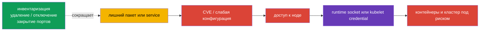
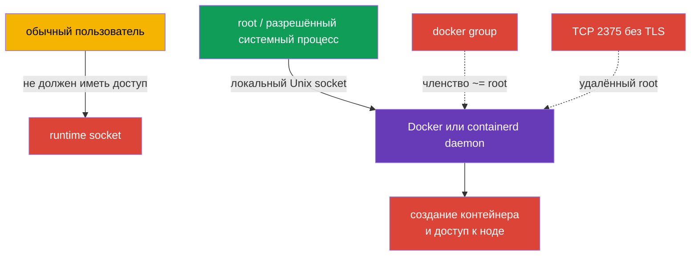

<!-- Standalone RU release: ссылки на переводы удалены, потому что соответствующие файлы не входят в архив. -->

# Глава 14. Минимизация footprint хостовой ОС и безопасность runtime-демона

> **Что дальше.** Kubernetes защищает Pod политиками, RBAC и SecurityContext, но всё это
> стоит на Linux-ноде. Лишний сервис, пакет, открытый порт или доступ к socket runtime
> дают атакующему путь в обход Kubernetes API. В этом разделе домена **System Hardening**
> CKS (10%) уменьшаем поверхность атаки самой ноды: оставляем только нужные службы,
> пакеты и сетевые точки, а Docker/containerd даём только тем, кому это действительно
> необходимо.

> **Что нужно знать из CKA.** Работа с `systemd`, процессами, файлами и журналом - в
> [главе 0.5 CKA](../../../cka/course/00-5-linux/ru.md). Как устроены Docker,
> containerd, cgroups и cgroup driver - в [главе 0.4 CKA](../../../cka/course/00-4-containers/ru.md).
> Роль CRI и связь kubelet с containerd - в [главе 40 CKA](../../../cka/course/40/ru.md).
> Здесь не повторяем устройство runtime, а ограничиваем его доступ и поверхность атаки.

## 14.1. Сценарий атаки: лишний компонент становится точкой входа

Нода Kubernetes - не универсальный сервер для всех задач. Например, на worker обычно не
нужны графическая среда, печать, Bluetooth, файловая шара или Docker daemon, если kubelet
работает с containerd. Каждый установленный и особенно запущенный компонент добавляет:

- бинарники и зависимости с CVE;
- процесс с правами и конфигурацией;
- слушающий порт либо локальный socket;
- журналы, учётные записи, unit-файлы и путь для ошибочной конфигурации.



Это не призыв удалить всё подряд. `kubelet`, containerd, CNI, SSH для согласованного
администрирования и компоненты control-plane на соответствующей ноде могут быть нужны.
Цель - получить явный список: **компонент -> владелец -> назначение -> порт/socket**.
Если назначения и владельца нет, компонент удаляют или отключают после проверки
зависимостей и плана отката.

Перед изменением зафиксируйте исходное состояние. На control-plane не отключайте
`kubelet`, containerd, etcd или компоненты Kubernetes в SSH-сессии, от которой зависит
доступ: ошибка может сделать ноду и API недоступными.

```bash
sudo install -d -m 700 /root/hardening-before
sudo systemctl list-unit-files --type=service > /root/hardening-before/services-enabled.txt
sudo systemctl list-units --type=service --state=running \
  > /root/hardening-before/services-running.txt
sudo ss -tulpn > /root/hardening-before/listeners.txt
sudo dpkg-query -W -f='${binary:Package}\t${Version}\n' \
  | sort > /root/hardening-before/packages.txt
```

## 14.2. Инвентаризация и отключение ненужных сервисов

Сначала различайте три состояния. `systemctl list-units` показывает загруженные unit,
`is-active` - работает ли процесс сейчас, а `is-enabled` - будет ли он стартовать при
загрузке. Отключённый unit может быть ещё активен до явной остановки.

```bash
# Запущенные service units и их состояние.
sudo systemctl list-units --type=service --state=running

# Все установленные service units, в том числе выключенные.
sudo systemctl list-unit-files --type=service

# Откуда взялся конкретный service и чем он запускается.
sudo systemctl status <service>
sudo systemctl cat <service>
sudo systemctl show <service> -p FragmentPath -p ExecStart -p User
sudo journalctl -u <service> --since '24 hours ago'
```

Полезна таблица решения до какой-либо команды:

| Находка | Вопрос перед действием | Нормальное решение |
|---|---|---|
| `kubelet.service` | Нода состоит в кластере? | оставить; исправлять только осознанно |
| `containerd.service` | Это CRI endpoint kubelet? | оставить на Kubernetes-ноде |
| `docker.service`/`docker.socket` | Docker нужен этой ноде? | удалить/отключить, если CRI - containerd и Docker не нужен |
| `sshd.service` | Есть согласованный bastion/console путь? | оставить с hardening из главы 15 либо отключить только при альтернативном доступе |
| `cups`, `avahi-daemon`, Bluetooth, GUI-service | Есть документированное серверное назначение? | обычно удалить либо отключить |
| неизвестный service | Кто владелец, какой пакет и порт? | расследовать, не угадывать |

Для известного ненужного unit безопасная базовая операция - остановить его сейчас и
запретить автозапуск. Команда обратима: `enable --now` вернёт service при необходимости.

```bash
# Пример только после подтверждения, что service не нужен этой ноде.
sudo systemctl disable --now avahi-daemon.service

# Проверить оба состояния.
sudo systemctl is-active avahi-daemon.service || true
sudo systemctl is-enabled avahi-daemon.service || true
```

`mask` сильнее `disable`: он запрещает ручной и зависимый запуск unit, указывая его на
`/dev/null`. Используйте его для сервиса, который в образе ноды точно не должен появиться,
и зафиксируйте исключение в image build/IaC. Не маскируйте зависимость Kubernetes без
понимания последствий.

```bash
sudo systemctl mask <confirmed-unwanted.service>
# Откат:
sudo systemctl unmask <confirmed-unwanted.service>
sudo systemctl enable --now <confirmed-unwanted.service>
```

## 14.3. Лишние пакеты и минимальный образ ОС

Остановить service недостаточно: пакет, его библиотеки, timer/socket unit и будущая CVE
остаются на ноде. Инвентаризируйте пакеты, определите, какой пакет поставил бинарник, и
проверьте reverse dependencies. На Debian/Ubuntu:

```bash
apt list --installed 2>/dev/null | less
apt-cache policy <package>
dpkg -S "$(command -v <binary>)"
apt-cache rdepends --installed <package>

# Вывести пакеты, установленные вручную: отправная точка для ревью образа.
apt-mark showmanual | sort
```

После ревью удаляйте именно подтверждённый пакет. `apt purge` удаляет также его
конфигурацию; перед `autoremove` сначала прочитайте список, потому что он может включить
нужную библиотеку или инструмент диагностики.

```bash
sudo apt purge <confirmed-unneeded-package>
sudo apt autoremove --dry-run
sudo apt autoremove
sudo apt update && sudo apt upgrade
```

На RPM-системах эквиваленты - `rpm -qa`, `dnf repoquery --installed` и `dnf remove`.
Не смешивайте системный hardening с неконтролируемым массовым обновлением: обновления,
image version и rollback должны идти через обычный процесс эксплуатации.

**Минимальный образ ОС** предпочтительнее ручной уборки каждой уже работающей ноды. В
образе/конфигурации ноды объявляют нужные пакеты и service, исключают desktop, compilers,
тестовые утилиты и ненужные агенты, а затем регулярно пересобирают образ с патчами.
Минимальность не значит отсутствие средств восстановления: должен остаться согласованный
способ доступа, журналирования и диагностики.

| Подход | Плюс | Риск и контроль |
|---|---|---|
| Удалить пакет на работающей ноде | быстро устраняет известную поверхность | дрейф между нодами; зафиксировать в IaC/image |
| Golden image с allowlist пакетов | одинаковое, аудируемое состояние | требуется процесс пересборки и обновления |
| Immutable/minimal OS | меньше пакетов и изменений в runtime | заранее предусмотреть debug и обновление |
| «Удалить всё неизвестное» | нет | может сломать kubelet, CNI, storage, monitoring или доступ |

## 14.4. Открытые порты: слушатель, назначение и сетевой периметр

Порт опасен не сам по себе - опасен неизвестный либо доступный не тем источникам сервис.
Сначала установите соответствие «слушатель - PID - unit - нужные источники», затем
ограничивайте service и firewall. `ss` обычно доступен на современной Linux; `lsof` и
`netstat` полезны как альтернативы.

```bash
# TCP и UDP listeners с процессом и PID (нужен root для полной информации).
sudo ss -tulpn
sudo lsof -nP -iTCP -sTCP:LISTEN
sudo netstat -tulpn                    # если пакет net-tools установлен

# Unix sockets runtime - не видны в выводе TCP/UDP.
sudo ss -lxnp | grep -E 'docker|containerd' || true
```

| Точка | Где обычно нужна | Безопасное направление |
|---|---|---|
| SSH `22/tcp` | управляемый доступ к ноде | только bastion/VPN/административные CIDR |
| kubelet `10250/tcp` | control-plane и согласованная диагностика | не открывать интернету; TLS, authn/authz и firewall |
| kube-apiserver `6443/tcp` | control-plane; worker и администраторы по архитектуре | allowlist/private endpoint, не `0.0.0.0/0` |
| etcd `2379`, `2380/tcp` | только control-plane/etcd peers | не публиковать на worker или внешнюю сеть |
| Docker `2375/tcp` | нигде в безопасном baseline | не слушать |
| Docker TLS `2376/tcp` | только при обоснованном удалённом управлении | mTLS и точный firewall; по умолчанию не нужен |
| Docker/containerd Unix socket | локально на ноде | `root` и минимальный набор системных потребителей |

Не делайте вывод из номера порта без процесса: например, `6443` на control-plane ожидаем,
но на worker может быть ошибкой; `10250` нужен kubelet, но не должен быть публичным.
Сетевой фильтр дополняет, а не заменяет отключение ненужного service. Подробное
ограничение внешнего доступа и SSH - в главе 15.

```bash
# Сначала проверьте конкретный listener и его unit.
sudo ss -lntp | grep -E ':(22|10250|6443|2379|2380|2375|2376)\b' || true
sudo systemctl status <service-owning-the-listener>

# После удаления/отключения service порт должен исчезнуть.
sudo ss -lntp | grep ':<port>' || echo 'listener is absent'
```

## 14.5. Безопасность демона container runtime: Docker и containerd

Runtime daemon имеет больше прав, чем обычный контейнер. Клиент, способный обратиться к
Docker API или CRI socket, часто может запустить привилегированный контейнер, смонтировать
host filesystem или получить credential ноды. Поэтому локальный socket - граница доступа,
а не безобидная деталь реализации.



### Docker: никакого неаутентифицированного TCP API

`dockerd -H tcp://0.0.0.0:2375` открывает Docker API всем, кто может дойти до порта.
На `2375` нет TLS и аутентификации: это практически удалённый root. Он не должен
присутствовать ни в `ExecStart` systemd unit, ни в drop-in, ни в `/etc/docker/daemon.json`.
Не пытайтесь «прикрыть» `2375` только firewall: ошибка правила снова сделает API доступным.

```bash
# Фактические sources конфигурации и запущенный процесс.
sudo systemctl cat docker.service docker.socket
sudo systemctl show docker.service -p ExecStart
sudo ps -ef | grep '[d]ockerd'
sudo grep -RnsE 'tcp://|2375|2376|"hosts"' \
  /etc/docker /etc/systemd/system /lib/systemd/system 2>/dev/null || true

# После исправления вывод для 2375 должен быть пустым.
sudo ss -tulpn | grep ':2375' || echo 'Docker TCP 2375 is not listening'
sudo ss -tulpn | grep ':2376' || echo 'Docker TCP 2376 is not listening'
```

В типичной systemd-установке Docker получает `-H fd://`: systemd `docker.socket`
создаёт **локальный Unix socket**, а не TCP listener. Не добавляйте одновременно `hosts`
в `daemon.json` и `-H` в unit: Docker завершается при конфликтующих настройках. Уберите
только TCP endpoint из активного источника, затем проверьте конфигурацию и рестартуйте
один service за раз.

```bash
# Для daemon.json сначала проверяем синтаксис и поддерживаемые ключи.
sudo dockerd --validate --config-file=/etc/docker/daemon.json
sudo systemctl daemon-reload
sudo systemctl restart docker.service
sudo systemctl --no-pager --full status docker.service
sudo journalctl -u docker.service -n 50 --no-pager
```

Если удалённый Docker API действительно является согласованным требованием, используют
только TLS на `2376`, взаимную аутентификацию сертификатами, firewall allowlist и
выделенный management network. Это исключение с владельцем риска, а не default для
Kubernetes-ноды.

### `/var/run/docker.sock` и группа `docker`

`/var/run/docker.sock` (часто симлинк на `/run/docker.sock`) - Unix API Docker. Безопасный
baseline для ноды, на которой Docker необходим: владелец `root:root`, режим `660`.
Тогда обращаться к socket могут root и процессы, которым root явно делегировал доступ;
обычный пользователь не может выполнить `docker ps`.

```bash
# Сначала разрешаем симлинк до фактического socket и фиксируем owner/mode.
readlink -f /var/run/docker.sock
sudo stat -Lc '%A %a %U:%G %n' /var/run/docker.sock
# Ожидаем: srw-rw---- 660 root:root /var/run/docker.sock

# Аудит группы и её членов. Любой член docker должен рассматриваться как root-equivalent.
getent group docker || true
getent group docker | awk -F: '{print $4}'
id <user>
```

Исторически пакеты Docker часто создают socket с группой `docker`. Это не безопасная
«группа разработчиков»: членство в `docker` **эквивалентно root**. Пользователь может
создать контейнер с монтированием `/` хоста и получить root на ноде. Удалите обычных
пользователей и не выдавайте членство automation без отдельного решения.

```bash
# Снимает доступ у конкретного обычного пользователя; новая login-сессия обязательна.
sudo gpasswd -d <user> docker

# Проверка под учётной записью без root и без docker-group должна завершиться отказом.
sudo -u <user> docker ps
# Ожидается: permission denied при подключении к Docker daemon socket.
```

Не исправляйте owner/mode разовым `chown`/`chmod`, если `docker.socket` создаётся
systemd: при перезапуске unit вернёт свои настройки. Для управляемого systemd socket
задайте их устойчиво через drop-in, затем перезапустите только после окна работ и
проверьте, что Docker поднялся.

```bash
sudo systemctl edit docker.socket
```

```ini
# /etc/systemd/system/docker.socket.d/override.conf
[Socket]
SocketUser=root
SocketGroup=root
SocketMode=0660
```

```bash
sudo systemctl daemon-reload
sudo systemctl restart docker.socket
sudo systemctl restart docker.service
sudo stat -Lc '%A %a %U:%G %n' /var/run/docker.sock
```

Если Docker не нужен на Kubernetes-ноде, надёжнее не hardening неиспользуемого daemon, а
удалить пакет либо отключить и замаскировать `docker.service` и `docker.socket` после
проверки, что ни kubelet, ни эксплуатационная задача от него не зависят.

### containerd socket и CRI

Современный kubeadm-кластер обычно использует containerd через
`/run/containerd/containerd.sock`. Это также привилегированный gRPC socket. На baseline
он доступен `root:root` с режимом `660`; kubelet и системные инструменты обращаются к
нему с root-правами. Не добавляйте пользователей в группу ради `crictl` и не ставьте
`chmod 666`: диагностику выполняйте через `sudo`.

```bash
sudo systemctl status containerd.service --no-pager
sudo systemctl cat containerd.service
sudo stat -Lc '%A %a %U:%G %n' /run/containerd/containerd.sock
sudo ss -lxnp | grep 'containerd.sock' || true

# Проверка CRI только локально и с root; endpoint можно сверить с kubelet config.
sudo crictl --runtime-endpoint unix:///run/containerd/containerd.sock ps
sudo grep -Rns -- '--container-runtime-endpoint\|containerRuntimeEndpoint' \
  /var/lib/kubelet /etc/systemd/system /usr/lib/systemd/system 2>/dev/null || true
```

Не путайте CRI socket с TCP endpoint приложения: он не должен быть проброшен в Pod,
экспортирован через SSH tunnel «для удобства» или примонтирован в доверенный workload.
Отдельно проверьте, что `containerd.service` не запускается с неожиданным TCP listener.
Изменение `/etc/containerd/config.toml`, cgroup driver или CRI plugin делают только с
пониманием конфигурации kubelet и планом восстановления - неправильная правка переводит
ноду в `NotReady`.

### Hardening `/etc/docker/daemon.json`

`daemon.json` - один из источников конфигурации Docker. Он не заменяет firewall, права
на socket, SecurityContext и политики Kubernetes, но задаёт безопасный baseline daemon.
Следующий фрагмент - **пример для Docker-хоста**; сначала подтвердите поддержку версии и
совместимость с workload. Не добавляйте `hosts`, если systemd уже передаёт `-H fd://`.

```json
{
  "live-restore": true,
  "no-new-privileges": true,
  "userns-remap": "default",
  "log-driver": "local"
}
```

| Ключ | Что даёт | Что проверить до включения |
|---|---|---|
| `live-restore` | контейнеры продолжают работать при рестарте daemon | workflow обновления, monitoring и ожидаемое поведение restart |
| `no-new-privileges` | запрещает контейнерным процессам повышать privilege через `setuid`/file capabilities | приложения, которым ошибочно требуется privilege escalation |
| `userns-remap` | маппит root контейнера на непривилегированный UID хоста | volumes, ownership, образы и совместимость; не включать без теста на production-ноде |
| `log-driver: local` | ограничивает рост JSON-логов и rotation управляется драйвером | централизованный сбор логов и retention |

`userns-remap` особенно важен, но не является «одной безрисковой галочкой»: меняются UID
файлов Docker и поведение bind mounts. Для Kubernetes-ноды с containerd это не настройка
containerd и не замена `runAsNonRoot`; применяйте её к выделенному Docker-хосту после
тестирования. Проверка и откат должны быть готовы до перезапуска daemon.

```bash
sudo install -m 600 -o root -g root /dev/null /etc/docker/daemon.json
sudoedit /etc/docker/daemon.json
sudo dockerd --validate --config-file=/etc/docker/daemon.json
sudo systemctl restart docker.service
sudo docker info --format '{{json .SecurityOptions}}'
```

## 14.6. Проверка результата: доказать минимальную ноду

Проверка состоит из факта конфигурации и факта доступа. Недостаточно увидеть нужную
строку в файле: service мог не перечитать конфиг, а socket мог быть пересоздан с прежней
группой. Выполните до/после diff и тест от имени пользователя, которому доступ снят.

```bash
# 1. Сервисы: сохранённый снимок против текущего состояния.
sudo systemctl list-units --type=service --state=running | sort \
  > /root/hardening-after-services.txt
diff -u /root/hardening-before/services-running.txt \
  /root/hardening-after-services.txt || true

# 2. Пакеты и сетевые listeners: изменения должны быть объяснимы.
dpkg-query -W -f='${binary:Package}\t${Version}\n' | sort \
  > /root/hardening-after-packages.txt
sudo ss -tulpn | sort > /root/hardening-after-listeners.txt
diff -u /root/hardening-before/listeners.txt \
  /root/hardening-after-listeners.txt || true

# 3. Docker API не слушает неаутентифицированный TCP 2375.
sudo ss -tulpn | grep ':2375' && exit 1 || echo 'OK: TCP 2375 is absent'

# 4. Если Docker установлен, socket должен быть root:root 660.
if [ -S /var/run/docker.sock ]; then
  sudo stat -Lc '%a %U:%G %n' /var/run/docker.sock
fi

# 5. containerd socket остаётся локальным и не world-writable.
if [ -S /run/containerd/containerd.sock ]; then
  sudo stat -Lc '%a %U:%G %n' /run/containerd/containerd.sock
fi
```

**DoD - минимальная нода:**

- [ ] Для каждого активного service есть назначение, владелец и ожидаемый порт/socket.
- [ ] Ненужные service остановлены через `systemctl disable --now`, а повторно опасные
  при необходимости замаскированы; kubelet/containerd и необходимые компоненты не сломаны.
- [ ] Удалены подтверждённо лишние пакеты; образ ноды имеет allowlist пакетов и процесс
  обновления, а не ручной неописанный дрейф.
- [ ] `ss -tulpn` не содержит необъяснимых listeners; `10250`, `6443`, etcd и SSH доступны
  только там и тем источникам, где это требуется архитектурой.
- [ ] `ss -tulpn | grep ':2375'` ничего не выводит; в unit/drop-in/`daemon.json` нет
  `tcp://0.0.0.0:2375`.
- [ ] При установленном Docker `/var/run/docker.sock` имеет `root:root` и `660`; обычный
  пользователь без root не может выполнить `docker ps`; никто не добавлен в `docker`
  «для удобства», потому что эта группа root-equivalent.
- [ ] `/run/containerd/containerd.sock` не доступен обычным пользователям и не проброшен
  в workload; `sudo crictl` продолжает работать.
- [ ] `daemon.json` прошёл `dockerd --validate`, Docker/containerd и kubelet healthy, а
  изменения занесены в image/IaC/change record.

## 14.7. Типичные ошибки и диагностика

| Симптом | Вероятная причина | Что проверить и исправить |
|---|---|---|
| `docker` всё ещё слушает `2375` | TCP задан в systemd drop-in, `ExecStart` или `daemon.json` | `systemctl cat docker.service docker.socket`, `ps -ef`, поиск `tcp://`; убрать активный источник и рестартовать daemon |
| Docker не стартует после правки | конфликт `hosts` в JSON и `-H` в unit или неверный JSON | `dockerd --validate`, `journalctl -u docker`, оставить один источник hosts |
| `chmod 660` исчез после рестарта | socket создаёт systemd с прежним `SocketGroup` | override для `docker.socket`, `daemon-reload`, повторная проверка `stat` |
| пользователь всё ещё делает `docker ps` | старая login-сессия содержит supplementary group или socket всё ещё `root:docker` | `id <user>`, новая сессия, `getent group docker`, устойчиво настроить socket |
| worker стал `NotReady` | удалён/остановлен containerd, kubelet или сломана CRI config | `systemctl status kubelet containerd`, `journalctl -u kubelet`, сверить endpoint и восстановить из снимка |
| закрыли нужный порт | порт отключали по номеру без проверки PID и назначения | `ss -lntp`, unit-владелец, источники/назначение; откатить точечно |
| после `apt autoremove` нет нужной утилиты | список не был просмотрен, package dependency неверно оценена | восстановить пакет, закрепить allowlist образа, использовать `--dry-run` |

## 14.8. Как это применяют в продакшене

- **Baseline задают как код.** Список пакетов, enabled services, systemd drop-in, firewall
  и проверка socket входят в immutable image, Ansible/Cloud-Init или другой IaC. Ручной
  emergency fix затем переносится в источник истины.
- **Ноды разделяют по роли.** Control-plane, worker, build-host и Docker-host не получают
  одинаковый набор пакетов и портов. Особенно не ставят Docker daemon на worker только
  ради интерактивного `docker ps`, если CRI - containerd.
- **Runtime доступ проверяют как привилегированный доступ.** Изменение членов `docker`
  group, прав Docker/containerd socket и systemd override проходит тот же review, что и
  выдача `sudo`.
- **Проверяют дрейф.** Регулярный CIS/OS scan, inventory пакетов, enabled unit и listeners
  сравнивают с baseline. Новый listener без владельца - инцидент либо change, а не
  «обычное состояние».
- **Изменяют постепенно.** Сначала staging-нода и один service, затем health check
  `kubelet`/`containerd`, только после этого rollout. Для control-plane держат out-of-band
  console и tested rollback.

## 14.9. Мини-глоссарий

- **footprint** - набор пакетов, процессов, портов, socket и конфигурации, увеличивающий
  поверхность атаки ноды.
- **attack surface** - все доступные точки, через которые возможны атака или ошибка
  конфигурации.
- **systemd unit** - описание service, socket, timer или другой сущности, которой управляет
  systemd.
- **Unix socket** - локальная файловая точка IPC; права файла определяют, кто обращается к
  API daemon.
- **Docker socket** - `/var/run/docker.sock`, локальный API Docker daemon; доступ к нему
  эквивалентен очень широким правам на хосте.
- **`docker` group** - группа, дающая доступ к Docker socket; рассматривается как
  root-equivalent, а не как обычная рабочая группа.
- **CRI socket** - endpoint между kubelet и runtime, например
  `/run/containerd/containerd.sock`.
- **`daemon.json`** - конфигурационный файл Docker daemon, обычно `/etc/docker/daemon.json`.
- **`live-restore`** - режим Docker, сохраняющий контейнеры работающими при рестарте daemon.
- **`userns-remap`** - user namespace remapping UID/GID контейнера на хосте.

## 14.10. Итоги главы

- Минимальная нода начинается с инвентаризации: каждый service, пакет, listener и socket
  имеет назначение и владельца; всё остальное удаляют или отключают.
- `systemctl disable --now` останавливает ненужный service и запрещает его автозапуск;
  `apt purge` применяется только к подтверждённому пакету после проверки зависимостей.
- Порты оценивают по процессу и источникам: kubelet `10250` и API `6443` не должны быть
  открыты всему интернету, а Docker `2375` не должен слушаться вовсе.
- `-H tcp://0.0.0.0:2375` - неаутентифицированный удалённый root. Оставляйте Docker на
  Unix socket; `2376` допустим только как обоснованное TLS/mTLS-исключение.
- `/var/run/docker.sock` в baseline - `root:root`, `660`; членство в `docker` group
  эквивалентно root и не выдаётся обычным пользователям.
- `/run/containerd/containerd.sock` - такой же привилегированный локальный endpoint:
  root-only, без world-writable прав и без монтирования в workload.
- `live-restore`, `no-new-privileges` и `userns-remap` в `daemon.json` усиливают Docker,
  но требуют validation, теста совместимости и контролируемого rollout.

## 14.11. Как это пригодится: на экзамене и в реальной работе

**На экзамене.** Сначала найдите активный источник: `systemctl cat`, `systemctl show`,
`ss -tulpn`, `stat` и `ps` надёжнее догадки по пути файла. Задание может требовать убрать
Docker TCP, исправить права socket или отключить service. После изменения докажите
результат: `2375` не слушается, `stat` показывает нужные owner/mode, а пользователь без
прав получает отказ. Не отключайте kubelet/containerd только потому, что их порт или
процесс выглядит незнакомо.

**В реальной работе.** Большая часть компрометаций ноды начинается с обычной ошибки:
непатченного пакета, оставленного management service, публичного daemon API или слишком
широкой Unix-группы. Аудируемый minimal image, role-specific node pools, allowlist сетевых
источников и постоянная проверка дрейфа уменьшают шанс такой ошибки и радиус поражения,
если она всё же произошла.

## 14.12. Вопросы для самопроверки

1. Почему выключенный, но не удалённый лишний пакет всё ещё увеличивает поверхность атаки?
2. Чем `systemctl disable --now` отличается от `mask`, и когда нужен каждый вариант?
3. Как установить владельца listener, прежде чем закрывать его порт?
4. Почему `10250` и `6443` нельзя одинаково «закрыть везде», а `2375` должен отсутствовать?
5. Почему `tcp://0.0.0.0:2375` равнозначен удалённому root, даже если сейчас есть firewall?
6. Какие owner и mode ожидаются у `/var/run/docker.sock`, и почему `docker` group
   root-equivalent?
7. Почему разовый `chmod` Docker socket может не пережить restart, и как сделать настройку
   устойчивой?
8. Как проверить, что пользователь действительно потерял доступ к Docker, а kubelet всё ещё
   может работать с containerd?
9. Какие риски нужно проверить до `userns-remap` в `daemon.json`?

## Практика

Лаба 105 объединяет системный hardening: инвентаризацию сервисов, пакетов и портов,
минимизацию доступа к ноде и безопасность Docker daemon. Выполняйте её с контрольным
снимком до изменений и запускайте `check_result` только после всех проверок из 14.6.

🧪 Лаба 105 (System Hardening ОС и безопасность Docker-демона):
[tasks/cks/labs/105](../../labs/105/README_RU.MD)

---
[Оглавление](../README_RU.md) · [Глава 13](../13/ru.md) · [Глава 15](../15/ru.md)
