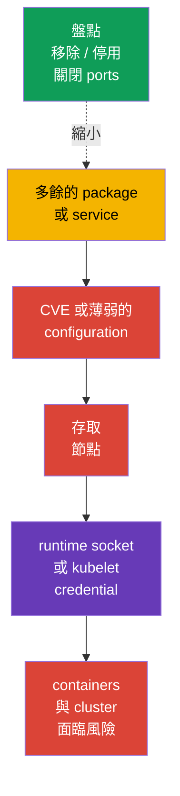
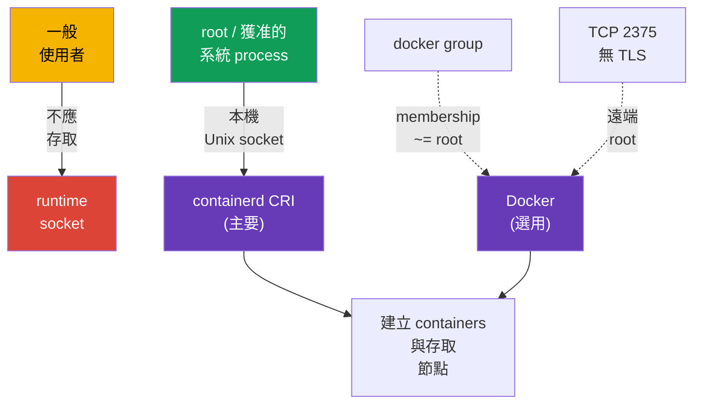

[Русская версия](ru.md) · [Eng version](README.md) · [Versión en español](es.md) · [Version française](fr.md) · [Deutsche Version](de.md) · [ქართული ვერსია](ge.md) · [日本語版](jp.md)

# 第 14 章：縮小主機 OS footprint 與 runtime daemon 安全性

> **問題。** Kubernetes 節點上多餘的套件、service、listener 或 socket，都會增加一個帶有 CVE 的
> 獨立 binary，以及本機或網路入口。此類元件遭入侵可能導向 kubelet credentials 或 container runtime
> socket，繞過 Kubernetes API 的限制，並危及節點上的所有 workload。

> **接下來。** Kubernetes 以 policies、RBAC 和 SecurityContext 限制 workload - 亦即縮小工作負載可對
> API 與節點執行的操作 - 但這一切均建立在 Linux 節點上。多餘的 service、package、開放 port，
> 或 runtime socket 存取都會為攻擊者提供繞過 Kubernetes API 的路徑。本節屬於 CKS 的
> **System Hardening** 領域，我們將縮小節點自身的 attack surface：只保留必要 services、packages
> 與網路端點，並只讓確實需要的人存取現代 CRI runtime containerd。

> **需要從 CKA 了解的內容。** `systemd`、processes、files 與 journal 的操作，請見
> [CKA 第 0.5 章](../../../cka/course/00-5-linux/tw.md)。Docker、containerd、cgroups 與 cgroup driver
> 的運作方式，請見 [CKA 第 0.4 章](../../../cka/course/00-4-containers/tw.md)。CRI 的角色及 kubelet 與
> containerd 的關係，請見 [CKA 第 40 章](../../../cka/course/40/tw.md)。這裡不重複 runtime 的運作原理，
> 而是限制其存取與 attack surface。

## 14.1. 攻擊情境：多餘元件成為入口點

Kubernetes 節點不是適用於所有用途的通用伺服器。例如，若 kubelet 搭配 containerd 運作，worker
通常不需要圖形環境、列印、Bluetooth、檔案共享或 Docker daemon。每個已安裝、尤其是已執行的元件，都會增加：

- 帶有 CVE 的 binaries 與 dependencies；
- 具有權限及 configuration 的 process；
- 監聽的 port 或本機 socket；
- journals、accounts、unit files 與設定錯誤的路徑。



這並不是要求無差別移除所有項目。`kubelet`、containerd、CNI、供協調式管理使用的 SSH，以及對應
節點上的 control-plane components 都可能是必需的。目標是建立一份明確清單：
**元件 -> owner -> 用途 -> port/socket**。如果沒有用途和 owner，在檢查 dependencies 與 rollback
計畫後便移除或停用該元件。

變更前請記錄初始狀態。不要在依賴該 SSH session 存取的 control-plane 節點上，停用 `kubelet`、
containerd、etcd 或 Kubernetes components：錯誤可能使節點和 API 都無法使用。

```bash
set -euo pipefail
sudo install -d -m 700 /root/hardening-before
sudo systemctl list-unit-files --type=service | sort \
  | sudo tee /root/hardening-before/services-enabled.txt >/dev/null
sudo systemctl list-units --type=service --state=running | sort \
  | sudo tee /root/hardening-before/services-running.txt >/dev/null
sudo ss -tulpn | sort | sudo tee /root/hardening-before/listeners.txt >/dev/null
if command -v dpkg-query >/dev/null; then
  sudo dpkg-query -W -f='${binary:Package}\t${Version}\n' | LC_ALL=C sort \
    | sudo tee /root/hardening-before/packages.txt >/dev/null
elif command -v rpm >/dev/null; then
  sudo rpm -qa | LC_ALL=C sort \
    | sudo tee /root/hardening-before/packages.txt >/dev/null
else
  echo 'REVIEW_REQUIRED: unsupported package manager; cannot create package inventory' >&2
  exit 2
fi
```

> 🧠 節點遭入侵可能始於多餘的 process、package、listener 或 socket；請維護元件、owner、用途與允許存取的對應圖。

> 🎯 盤點 service、package、kernel module 與 listener；只變更非必要的物件，保存 baseline，並檢查 `kubelet`/containerd。`disable --now`、removal 與關閉 port 需要不同的檢查。

## 14.2. 盤點與停用不必要的 services

先區分三種狀態。`systemctl list-units` 顯示已載入的 units，`is-active` 顯示 process 是否目前正在執行，
而 `is-enabled` 顯示它是否會在 boot 時啟動。已停用的 unit 在明確停止前仍可能處於 active 狀態。

```bash
# 正在執行的 service units 及其狀態。
sudo systemctl list-units --type=service --state=running

# 所有已安裝的 service units，包括已停用的項目。
sudo systemctl list-unit-files --type=service

# 特定 service 的來源與其啟動方式。
SERVICE='service-to-review.service'
sudo systemctl status "$SERVICE"
sudo systemctl cat "$SERVICE"
sudo systemctl show "$SERVICE" -p FragmentPath -p ExecStart -p User
sudo journalctl -u "$SERVICE" --since '24 hours ago'
```

在執行任何命令前，先建立決策表很有幫助：

| 發現項目 | 動作前的問題 | 正常決策 |
|---|---|---|
| `kubelet.service` | 節點屬於叢集嗎？ | 保留；僅在明確理解後修正 |
| `containerd.service` | 它是 kubelet 的 CRI endpoint 嗎？ | 在 Kubernetes 節點上保留 |
| `docker.service`/`docker.socket` | Docker 是此節點所需嗎？ | 若 CRI 為 containerd 且不需要 Docker，則移除/停用 |
| `sshd.service` | 是否有已協調的 bastion/console 路徑？ | 保留並依第 15 章進行 hardening，或僅在有替代存取時停用 |
| `cups`、`avahi-daemon`、Bluetooth、GUI-service | 是否有已記錄的伺服器用途？ | 通常移除或停用 |
| 未知 service | owner 是誰、套件和 port 是什麼？ | 調查，不要猜測 |

對於已知且不必要的 unit，安全的基本操作是立即停止，並禁止自動啟動。該命令可逆：需要時，
`enable --now` 會恢復 service。

```bash
# 僅在確認此節點不需要該 service 後的範例。
sudo systemctl disable --now avahi-daemon.service

# 驗證兩種狀態。
sudo systemctl is-active avahi-daemon.service || true
sudo systemctl is-enabled avahi-daemon.service || true
```

`mask` 比 `disable` 更強：它將 unit 指向 `/dev/null`，禁止手動和 dependency-based 啟動。它適用於
確定不應出現在 node image 中的 service，並應在 image build/IaC 中記錄例外。不要在不了解影響前 mask
Kubernetes dependency。

```bash
UNIT='confirmed-unwanted.service'

# 變更前保存初始狀態。
sudo systemctl is-active "$UNIT" \
  > "/root/hardening-before/${UNIT}.active" 2>&1 || true
sudo systemctl is-enabled "$UNIT" \
  > "/root/hardening-before/${UNIT}.enabled" 2>&1 || true

# Mask，並停止已在執行的 unit。
sudo systemctl mask --now "$UNIT"

# 證明兩種狀態。
sudo systemctl is-active "$UNIT" || true
sudo systemctl is-enabled "$UNIT" || true
```

沒有 `--now` 時，`mask` 僅會阻止未來的手動和 dependency-based 啟動：已執行的 service 會繼續運作。
如需 rollback，先執行 `systemctl unmask <unit>`，再精確恢復 hardening 前保存的 active/enabled 狀態。
若 unit 在 hardening 前不是 enabled 和 active，不要自動執行 `enable --now`。

## 14.3. 多餘 packages 與最小 OS image

停止 service 並不足夠：package、其 libraries、timer/socket unit 及未來的 CVE 仍會留在節點上。
盤點 packages、識別提供 binary 的 package，並檢查 reverse dependencies。於 Debian/Ubuntu：

```bash
PACKAGE='package-to-review'
BINARY='binary-to-review'
apt list --installed 2>/dev/null | less
apt-cache policy "$PACKAGE"
dpkg -S "$(command -v "$BINARY")"
apt-cache rdepends --installed "$PACKAGE"

# 輸出手動安裝的 packages：image review 的起點。
apt-mark showmanual | sort
```

完成 review 後，只移除已確認的 package。`apt purge` 也會移除其 configuration；在執行 `autoremove` 前，
請先閱讀清單，因為其中可能含有必要的 library 或診斷工具。

```bash
PACKAGE='confirmed-unneeded-package'
sudo apt purge "$PACKAGE"
sudo apt autoremove --dry-run
# 僅在 review 其清單後執行 autoremove。
sudo apt autoremove
# 此處刻意不執行大量 apt upgrade：patching 在獨立的 change window 進行。
```

在 RPM 系統中，對應命令為 `rpm -qa`、`dnf repoquery --installed` 與 `dnf remove`。不要將 system hardening
與不受控的大量更新混在一起：updates、image version 與 rollback 應依循正常的 operational process。

**最小 OS image** 優於手動清理每個已在執行的節點。應在 node image/configuration 中宣告必要的 packages
和 services，排除 desktop、compilers、測試 utilities 與不必要 agents，並定期以 patches 重建 image。
最小化不表示沒有 recovery 工具：必須保留已協調的存取、logging 與 diagnostics 方式。

> 🏭 **Production。** 專用 Kubernetes OS - 例如 [Bottlerocket](https://bottlerocket.dev/) - 可透過刻意最小化的
> immutable image 與受管理的 update workflow，縮小 mutable host footprint。這是架構選擇：在 production
> rollout 前，於 stage 檢查目標 Kubernetes 版本、CNI/CSI、bootstrap、observability、debug access 與 rollback
> 的支援。不要未讀其官方文件就將一般 Linux 發行版的 `apt`/`dpkg` 命令或路徑帶到該 OS。

| 方法 | 優點 | 風險與控制 |
|---|---|---|
| 在已執行節點移除 package | 快速消除已知 attack surface | 節點間 drift；在 IaC/image 中記錄 |
| 使用 package allowlist 的 golden image | 一致且可稽核的狀態 | 需要 rebuild 與 update process |
| Immutable/minimal OS | 較少的 packages 與 runtime changes | 預先規劃 debug 與 update |
| 「移除所有未知項目」 | 無 | 可能破壞 kubelet、CNI、storage、monitoring 或存取 |

## 14.4. Kernel modules：盤點與受控停用

Kernel module 是 attack surface 的一部分，但不是能無後果移除的「多餘 package」。先記錄已載入的
modules、其 parameters 與載入規則；向 image owner 和 OS 文件確認 module 的用途。

```bash
MODULE='example_module'
lsmod | sort
sudo modinfo "$MODULE"
# `modprobe -c` 是 effective configuration 的權威來源。
EFFECTIVE_MODPROBE_CONFIG=$(sudo modprobe -c) || {
  echo 'ERROR: cannot read effective modprobe configuration' >&2
  exit 2
}
printf '%s\n' "$EFFECTIVE_MODPROBE_CONFIG" \
  | grep -E "^(blacklist|install)[[:space:]]+${MODULE}\b" || true
sudo modprobe -n -v "$MODULE"
# 這些檔案僅用於找出規則來源；它們可能被 overridden。
sudo find /etc/modprobe.d /run/modprobe.d /usr/local/lib/modprobe.d \
  /usr/lib/modprobe.d /lib/modprobe.d -type f -print 2>/dev/null | sort
sudo grep -RnsE "^(blacklist|install)[[:space:]]+${MODULE}\b" \
  /etc/modprobe.d /run/modprobe.d /usr/local/lib/modprobe.d /usr/lib/modprobe.d /lib/modprobe.d \
  2>/dev/null || true
```

`modprobe -c` 會顯示考慮 precedence 後的最終規則；file-level `find`/`grep` 僅用於找出已觀察規則的來源，
並可能顯示被覆蓋的 entries。對特定 module，`modprobe -n -v` 顯示 `modprobe` 實際會採取的動作。

`modprobe -r <module>` **僅暫時**卸載 module：它無法跨越 reboot，若 module 正在使用或由 dependency
保留則會失敗。永久禁止必須在受管理的 `modprobe` configuration 中指定；`blacklist` 可阻止一般的
autoload，而 `install ... /bin/false` 也會透過此規則阻止明確的 `modprobe`。僅在確認 module 確實
不需要後，才一起使用這兩項機制。

```bash
MODULE='example_module'
# 在 change window 中：暫時檢查；不要嘗試強制卸載使用中的 module。
sudo modprobe -r "$MODULE"

# 將永久規則放在 image/IaC 中，而不是手動造成 node drift。
sudo tee "/etc/modprobe.d/disable-${MODULE}.conf" >/dev/null <<EOF
blacklist $MODULE
install $MODULE /bin/false
EOF

# 對 Debian/Ubuntu，若 module 可能位於 early boot，請更新 initramfs。
sudo update-initramfs -u
sudo modprobe -n -v "$MODULE"       # 預期為 install /bin/false 規則
```

在計畫的 reboot 後，檢查 `lsmod`、`modprobe -n -v` 與節點 health。modules 可能是 CNI、storage driver、
runtime 或網路/磁碟 hardware 所必需。先在一個 drained/staging node 測試，然後以 node-by-node 方式
rollout 並驗證 `kubelet`、containerd、CNI 與 workload；不要同時對整個 pool 套用 blacklist。

## 14.5. 開放 ports：listener、用途與網路邊界

Port 本身不危險 - 不明 service 或服務於錯誤來源的 service 才危險。先建立「listener - PID - unit -
必要來源」的對應，再限制 service 和 firewall。`ss` 通常存在於現代 Linux；`lsof` 和 `netstat`
可作為替代工具。

```bash
# 帶有 process 與 PID 的 TCP 和 UDP listeners（完整資訊需要 root）。
sudo ss -tulpn
sudo lsof -nP -iTCP -sTCP:LISTEN
sudo netstat -tulpn                    # 若已安裝 net-tools package

# Runtime 的 Unix sockets - 不會出現在 TCP/UDP 輸出中。
sudo ss -lxnp | grep -E 'docker|containerd' || true
```

| 端點 | 通常需要的位置 | 安全方向 |
|---|---|---|
| SSH `22/tcp` | 受管理的節點存取 | 僅 bastion/VPN/administrative CIDRs |
| kubelet `10250/tcp` | control-plane 與已協調的 diagnostics | 不向網際網路開放；TLS、authn/authz 與 firewall |
| kube-apiserver `6443/tcp` | control-plane；依架構供 worker 與 administrators 使用 | allowlist/private endpoint，而非 `0.0.0.0/0` |
| etcd `2379`、`2380/tcp` | 僅 control-plane/etcd peers | 不向 worker 或外部網路公開 |
| Docker TCP API（常見 `2375`/`2376`） | 僅在有合理理由的遠端管理時 | 不監聽 `2375`；任何 TCP endpoint 都需要明確例外、mTLS 與精確 firewall |

| containerd/NRI Unix socket | 節點本機 | `root` 與最少允許的系統 consumers |

不要只從 port number 推論而不看 process：例如 control-plane 的 `6443` 是預期的，但 worker 上出現可能是錯誤；
`10250` 為 kubelet 所需，卻不應公開。網路 filter 是對停用不必要 service 的補充，而非替代。第 15 章將
詳細討論外部存取與 SSH 的限制。

```bash
SERVICE='service-owning-the-listener.service'
PORT='10250'
# 先檢查特定 listener 及其 unit。
sudo ss -lntp | grep -E ':(22|10250|6443|2379|2380|2375|2376)\b' || true
sudo systemctl status "$SERVICE"

# 移除/停用 service 後，port 必須消失。ss 的錯誤不等於沒有 listener。
listeners=$(sudo ss -H -lnt "( sport = :${PORT} )") || {
  echo "ERROR: cannot inspect TCP listener ${PORT}" >&2; exit 2;
}
if [ -n "$listeners" ]; then
  printf 'ERROR: TCP port %s is still listening:\n%s\n' "$PORT" "$listeners" >&2
  exit 1
fi
echo "OK: TCP listener ${PORT} is absent"
```

> 🎯 盤點 service、package、kernel module 與 listener；只變更非必要的物件，保存 baseline，並檢查 `kubelet`/containerd。`disable --now`、removal 與關閉 port 需要不同的檢查。

## 14.6. containerd 與選用 Docker 的安全性

在現代 Kubernetes 節點上，containerd 是主要 CRI runtime；Docker daemon 與其 socket 並非 CRI baseline，
僅在獨立、已確認的需求下才需要。Runtime daemon 比一般 container 擁有更多權限。能存取 containerd、NRI
或 Docker API 的 client，通常可執行 privileged container、mount host filesystem，或取得 node credentials。
因此 Unix socket 是 access boundary，而不是無害的 implementation 細節。

> 🎯 containerd CRI socket 僅供 `root` 與最少系統 consumers 存取，不可使用 world-writable mode，也不可 mount 至 unprivileged workload。



> 🔬 Docker 僅適用於 Docker host；NRI/debug/metrics 需要 version- 與 runtime-specific 驗證。

### Docker：禁止未驗證的 TCP API

`dockerd -H tcp://0.0.0.0:2375` 會向所有能到達該 port 的人開放 Docker API。`2375` 沒有 TLS 與
authentication：它實質上是遠端 root。它不得出現在 `ExecStart` systemd unit、drop-in 或
`/etc/docker/daemon.json` 中。不要嘗試只以 firewall 「遮蔽」`2375`：規則錯誤會再次讓 API 可用。

```bash
set -euo pipefail
# 此 gate 會獨立檢查 effective configuration 與實際 listeners。
# false 是安全基線；true 僅可用於已記錄的風險例外。
ALLOW_REMOTE_DOCKER_API=false
declare -a TCP_CONFIGURATION_SOURCES=()
USES_SOCKET_ACTIVATION=false

add_tcp_source() {
  TCP_CONFIGURATION_SOURCES+=("$1")
}

# 將正規化的 Docker -H/--host 值分類。Unix 和 fd 不是 TCP；
# host:、host:port、:port、數字 port 和 tcp:// 均為 TCP 形式。
classify_docker_host() {
  local source=$1 host=$2
  case "$host" in
    unix://*|/*|@*) ;;
    fd://*) USES_SOCKET_ACTIVATION=true ;;
    tcp://*|*:*|[0-9]*) add_tcp_source "$source: $host" ;;
    *)
      printf 'REVIEW_REQUIRED: cannot classify Docker host value from %s: %s\n' "$source" "$host" >&2
      exit 2
      ;;
  esac
}

# 有效的 systemd service configuration，加上 active daemon 的 argv。
DOCKER_SERVICE_EXEC=$(sudo systemctl show docker.service -p ExecStart --value 2>/dev/null || true)
DOCKER_PID=$(pgrep -xo dockerd || true)
DOCKER_CMDLINE=''
if [ -n "$DOCKER_PID" ]; then
  DOCKER_CMDLINE=$(sudo cat "/proc/$DOCKER_PID/cmdline" | tr '\0' '\n') || {
    echo 'ERROR: cannot read dockerd argv' >&2
    exit 2
  }
fi

# 剖析 effective ExecStart 中所有 -H/--host 形式，包括 -H=<value>。
mapfile -t EXEC_HOST_DIRECTIVES < <(
  printf '%s\n' "$DOCKER_SERVICE_EXEC"     | grep -Eo -- '(-H|--host)(=|[[:space:]]+)[^[:space:]]+' || true
)
for directive in "${EXEC_HOST_DIRECTIVES[@]}"; do
  case "$directive" in
    -H=*) host=${directive#-H=} ;;
    --host=*) host=${directive#--host=} ;;
    -H\ *) host=${directive#-H } ;;
    --host\ *) host=${directive#--host } ;;
    *)
      printf 'REVIEW_REQUIRED: cannot normalize ExecStart host directive: %s\n' "$directive" >&2
      exit 2
      ;;
  esac
  classify_docker_host 'docker.service ExecStart' "$host"
done

# argv 以 NUL 分隔，因此可剖析其個別值而沒有引用歧義。
mapfile -t DOCKER_ARGV <<< "$DOCKER_CMDLINE"
for ((i = 0; i < ${#DOCKER_ARGV[@]}; i++)); do
  case "${DOCKER_ARGV[i]}" in
    -H|--host)
      ((++i < ${#DOCKER_ARGV[@]})) || {
        echo 'REVIEW_REQUIRED: dockerd host flag has no value' >&2
        exit 2
      }
      classify_docker_host 'dockerd argv' "${DOCKER_ARGV[i]}"
      ;;
    -H=*) classify_docker_host 'dockerd argv' "${DOCKER_ARGV[i]#-H=}" ;;
    --host=*) classify_docker_host 'dockerd argv' "${DOCKER_ARGV[i]#--host=}" ;;
  esac
done

# 不能從 grep 輸出安全推斷 custom config path；需要明確 review。
if printf '%s\n' "$DOCKER_SERVICE_EXEC" "$DOCKER_CMDLINE"   | grep -Eq -- '--config-file(=|[[:space:]])'; then
  echo 'REVIEW_REQUIRED: dockerd uses --config-file; parse that effective config before allowing Docker TCP API' >&2
  exit 2
fi

# 剖析 default config 中的 hosts。沒有 jq 時，hosts key 必須 review，不可 PASS。
if sudo test -f /etc/docker/daemon.json && sudo grep -qE '"hosts"[[:space:]]*:' /etc/docker/daemon.json; then
  command -v jq >/dev/null || {
    echo 'REVIEW_REQUIRED: jq is required to parse daemon.json hosts safely' >&2
    exit 2
  }
  DOCKER_CONFIG_HOSTS=$(sudo jq -er '
    if .hosts? == null then empty
    elif (.hosts | type) == "array" and all(.hosts[]; type == "string") then .hosts[]
    else error("daemon.json hosts must be an array of strings") end
  ' /etc/docker/daemon.json) || {
    echo 'REVIEW_REQUIRED: cannot parse daemon.json hosts' >&2
    exit 2
  }
  while IFS= read -r host; do
    [ -z "$host" ] || classify_docker_host 'daemon.json hosts' "$host"
  done <<< "$DOCKER_CONFIG_HOSTS"
fi

# `Listen` 是 systemd 的 effective socket property。須區分不存在的 unit 與
# 無法讀取 effective configuration 的 unit；絕不可將後者視為 PASS。
DOCKER_SOCKET_LOAD_STATE=$(sudo systemctl show docker.socket -p LoadState --value 2>/dev/null) || {
  echo 'REVIEW_REQUIRED: cannot determine whether docker.socket exists' >&2
  exit 2
}
case "$DOCKER_SOCKET_LOAD_STATE" in
  not-found) DOCKER_SOCKET_PRESENT=false ;;
  '')
    echo 'REVIEW_REQUIRED: empty docker.socket LoadState' >&2
    exit 2
    ;;
  *) DOCKER_SOCKET_PRESENT=true ;;
esac
if [ "$DOCKER_SOCKET_PRESENT" = true ]; then
  DOCKER_SOCKET_LISTEN=$(sudo systemctl show docker.socket -p Listen --value) || {
    echo 'REVIEW_REQUIRED: cannot read effective docker.socket Listen configuration' >&2
    exit 2
  }
  [ -n "$DOCKER_SOCKET_LISTEN" ] || {
    echo 'REVIEW_REQUIRED: docker.socket has no effective Listen entries' >&2
    exit 2
  }
  while IFS= read -r listen_entry; do
    listen_entry=${listen_entry#"${listen_entry%%[![:space:]]*}"}
    [ -z "$listen_entry" ] && continue
    case "$listen_entry" in
      *' (Stream)') socket_address=${listen_entry% (Stream)} ;;
      *)
        printf 'REVIEW_REQUIRED: cannot classify non-stream docker.socket Listen entry: %s\n' "$listen_entry" >&2
        exit 2
        ;;
    esac
    case "$socket_address" in
      /*|@*) ;;  # filesystem 與 abstract Unix sockets
      *:*) add_tcp_source "docker.socket Listen: $socket_address" ;;
      *)
        if [[ "$socket_address" =~ ^[0-9]+$ ]]; then
          add_tcp_source "docker.socket Listen: $socket_address"
        else
          printf 'REVIEW_REQUIRED: cannot classify docker.socket Listen address: %s\n' "$socket_address" >&2
          exit 2
        fi
        ;;
    esac
  done <<< "$DOCKER_SOCKET_LISTEN"
elif [ "$USES_SOCKET_ACTIVATION" = true ]; then
  echo 'REVIEW_REQUIRED: dockerd uses fd:// but docker.socket is absent' >&2
  exit 2
fi

# 目前 listeners 是獨立 evidence。比對 process metadata 中任何位置的 dockerd，而非僅第一個。
listeners_2375=$(sudo ss -H -lnt '( sport = :2375 )') || {
  echo 'ERROR: cannot inspect TCP 2375' >&2
  exit 2
}
dockerd_tcp_listeners=$(sudo ss -H -lntp | awk 'index($0, "\"dockerd\"")') || {
  echo 'ERROR: cannot inspect dockerd TCP listeners' >&2
  exit 2
}

TCP_EVIDENCE=$(printf '%s\n%s\n' "${TCP_CONFIGURATION_SOURCES[*]-}" "$dockerd_tcp_listeners")
if [ -n "$listeners_2375" ] || [ -n "${TCP_CONFIGURATION_SOURCES[*]-}" ] || [ -n "$dockerd_tcp_listeners" ]; then
  printf 'Docker TCP configuration/listener evidence:\n%s\n' "$TCP_EVIDENCE" >&2
  if printf '%s\n%s\n' "$listeners_2375" "$TCP_EVIDENCE"     | grep -Eq '(^|[^0-9])2375([^0-9]|$)'; then
    echo 'ERROR: Docker TCP 2375 is configured or listening' >&2
    exit 1
  fi
  if [ "$ALLOW_REMOTE_DOCKER_API" != true ]; then
    echo 'ERROR: unexpected Docker TCP endpoint is configured or listening' >&2
    exit 1
  fi
  echo 'REVIEW_REQUIRED: every allowed endpoint needs effective tlsverify=true, CA, server certificate/key, verified client-certificate authentication and firewall/security-group allowlist.' >&2
  exit 2
fi
echo 'OK: no Docker TCP endpoint is configured or listening'
```

在典型的 systemd 安裝中，Docker 取得 `-H fd://`：`docker.socket` 通常會建立本機 Unix socket。不要未經
驗證便假設如此：effective systemd property `Listen` 可指定 TCP listener，且它在 `dockerd` 啟動前就可能
存在。上方 gate 僅剖析 `Stream` entries：路徑 `/…` 與 abstract Unix socket `@…` 保持 Unix，而 port、
`host:port` 和 `[IPv6]:port` 視為 TCP。不要同時在 `daemon.json` 設定 `hosts` 與在 unit 中設定 `-H`：
設定衝突時 Docker 會結束。僅從 active source 移除 TCP endpoint，接著驗證 configuration，並一次 restart
一個 service。

```bash
# 對 daemon.json，先檢查 syntax 與支援的 keys。
sudo dockerd --validate --config-file=/etc/docker/daemon.json
sudo systemctl daemon-reload
sudo systemctl restart docker.service
sudo systemctl --no-pager --full status docker.service
sudo journalctl -u docker.service -n 50 --no-pager
```

若 remote Docker API 確實是已協調的需求，port number 並不能證明 TLS 或 mTLS：即使 `2376` 也不是證明。
對**每個**允許的 TCP endpoint，確認 effective `tlsverify=true`、CA、server certificate 和 key，以及實際的
client certificate authentication；透過 firewall/security group 與專用 management network 限制來源。這是
具有 risk owner 的 exception，而不是 Kubernetes 節點的 default。

### containerd、NRI 與 runtime 的檔案邊界

主要 CRI socket 通常位於 `/run/containerd/containerd.sock`；NRI socket 路徑可設定，且常為
`/run/nri/nri.sock`（等同於 `/var/run/nri/nri.sock`）。存取**任一** socket 均等同於 root。
僅允許 `root` 與最少系統 processes 存取。若操作需要 group，該 group 應是沒有一般使用者的專用
system group；不要加入 developers、CI accounts 或 workload identity。絕不可將 `containerd.sock` 或
`nri.sock` mount 至 unprivileged container。

Docker 或 containerd socket 沒有通用的 `chmod`：path、owner、group 與 mode 由 package、systemd unit
和特定 node policy 決定。不要使用 world-writable modes，也不要在 systemd 會重新建立 socket 時以一次性命令
修正 permissions。先找出 configuration owner，然後透過受支援的 image/IaC configuration 固定最小必要 access，
並在 restart 後驗證。

```bash
sudo systemctl status containerd.service --no-pager
sudo systemctl cat containerd.service
sudo stat -Lc '%A %a %U:%G %n' /run/containerd/containerd.sock \
  /run/nri/nri.sock 2>/dev/null || true
sudo ss -lxnp | grep -E 'containerd\.sock|nri\.sock' || true

# CRI 診斷於本機以 root 執行；請將 endpoint 與 kubelet config 比對。
sudo crictl --runtime-endpoint unix:///run/containerd/containerd.sock ps
sudo grep -Rns -- '--container-runtime-endpoint\|containerRuntimeEndpoint' \
  /var/lib/kubelet /etc/systemd/system /usr/lib/systemd/system 2>/dev/null || true
```

不要只保護 socket。`/run/containerd` 含有 runtime state 與 sockets，而 `/var/lib/containerd` 含有
persistent content 與 metadata。對 containerd，`/var/lib/containerd` 的參考 mode 為 `0700`，而
`/run/containerd` root 為 `0711`：後者允許 user-namespaced workload 可能需要的 traversal，但不會公開
directory contents。Sensitive subdirectories 應為 `0700`，sockets 應為 `0660` 並使用不含 unprivileged
users 的 system group；任何 path 都不可讓一般 users 或 containers writable。Configuration、plugins 與
CNI 也應 root-owned，並防止未經授權 subject 寫入：通常包括 `/etc/containerd`、runtime plugins directories
和 `/etc/cni/net.d`，而 CNI binaries 位於 `/opt/cni/bin`（請依發行版與 config 核對具體 paths）。不要以
寬泛的 `chmod -R` 變更它們；應逐項檢查 ownership 與 writable bits。

```bash
sudo find /run/containerd /var/lib/containerd /etc/containerd /etc/cni/net.d /opt/cni/bin \
  -xdev -printf '%m %u:%g %p\n' 2>/dev/null | sort
```

在 containerd 2.0 中，NRI 預設啟用。這是明確的決策點：若不使用 NRI，請在已驗證的 configuration 中停用
plugin（`[plugins."io.containerd.nri.v1.nri"]` 與 `disable = true`）；若使用 NRI，請將 NRI plugins、
其 configuration 與外部 plugin connections 視為 runtime TCB 的一部分，並限制其 paths 和 access。

Debug 與 metrics 是獨立的 API surfaces。Unix debug socket 應限制為 `root` 與獲准的 system consumers；
絕不公開 TCP debug endpoint。containerd metrics 常沒有 TLS 和 authentication：僅將它們 bind 至 loopback
或專用 management interface，並額外限制 firewall/routing。變更前請核對正是你所使用 containerd 版本支援的
parameters，並在 restart 後以 `ss` 檢查 listeners。

### Docker：僅在確實需要時使用

若 Docker 因特定工作而保留，其 socket 與 `docker` group 同樣等同於 root。不要授予一般使用者 membership，
不要將 socket mount 至 unprivileged workload，也不要假設所有安裝都有一致的 owner/mode：遵循 unit/package
policy，並從禁止存取的 account 驗證 access。

```bash
readlink -f /var/run/docker.sock 2>/dev/null || true
sudo stat -Lc '%A %a %U:%G %n' /var/run/docker.sock 2>/dev/null || true
getent group docker || true
getent group docker | awk -F: '{print $4}'
UNPRIVILEGED_USER='unprivileged-user'
sudo -u "$UNPRIVILEGED_USER" docker ps  # 對未獲准使用者，預期應被拒絕
```

若 Kubernetes 節點不需要 Docker，在確認 kubelet 或 operational tasks 不依賴它們後，移除 package，或停用並
mask `docker.service` 與 `docker.socket`，會較為可靠。

### Hardening `/etc/docker/daemon.json`

`daemon.json` 是 Docker 的其中一個 configuration source。它無法取代 firewall、socket permissions、
SecurityContext 與 Kubernetes policies，但能建立 daemon 的安全 baseline。若 systemd 已傳入 `-H fd://`，
不要加入 `hosts`。

#### 新 Docker host

以下 baseline 適用於檢查版本支援和與 planned workload 的 compatibility 後，**新的** Docker installation：

```json
{
  "live-restore": true,
  "no-new-privileges": true,
  "userns-remap": "default",
  "log-driver": "local"
}
```

| Key | 提供的功能 | 啟用前的檢查 |
|---|---|---|
| `live-restore` | daemon 無法使用時，可能維持 containers 運作 | update workflow、monitoring 與預期 restart 行為；不是任何 config/migration change 的保證 |
| `no-new-privileges` | 禁止新 container processes 透過 `setuid`/file capabilities 提升 privilege | 被錯誤要求 privilege escalation 的 applications；現有 containers 須 recreate |
| `userns-remap` | 將 container root 對應至 unprivileged host UID | volumes、ownership、images 與 compatibility；未在 production node 測試前不要啟用 |
| `log-driver: local` | 限制 JSON logs 成長，並由 driver 管理 rotation | centralized log collection 與 retention；現有 containers 不會自動遷移 |

#### 現有 Docker host：獨立 migration

不要將此 JSON 視為一般編輯後 restart，而直接套用於已運作的 Docker host。change 前先盤點
containers/images/volumes，檢查 `/etc/subuid` 和 `/etc/subgid`、bind mounts、host networking 與 privileged
containers，評估與 `userns-remap` 的 compatibility，並準備 recreate/migration 與 rollback plan。

```bash
set -euo pipefail
sudo docker ps -a --no-trunc
sudo docker image ls
sudo docker volume ls
sudo docker network ls
sudo grep -Ev '^[[:space:]]*(#|$)' /etc/subuid /etc/subgid 2>/dev/null || true
# 對每個 workload 個別執行：sudo docker inspect <container>；檢查 mounts、network 與 privileges。
```

`no-new-privileges` 作為 daemon default 時僅作用於新 containers；現有 containers 需要 recreate。變更
`log-driver` 不會自動轉換現有 containers。`userns-remap` 變更 Docker 的 namespace/storage view 與 ownership，
因此需要獨立 migration。`live-restore` 並非任何 daemon configuration change 下保留 containers 的無條件保證。
對使用 containerd 的 Kubernetes node，這不是 containerd setting，也不能取代 `runAsNonRoot`；請僅在測試後
對專用 Docker host 套用 Docker。

絕不可透過 `install /dev/null` 覆寫既有檔案來建立 `daemon.json`：先保存現有 configuration。僅當檔案不存在時，
才建立新的空檔案。

```bash
sudo install -d -m 0755 /etc/docker

if sudo test -e /etc/docker/daemon.json; then
  # 先保存既有 configuration。
  sudo cp -a /etc/docker/daemon.json /root/hardening-before/daemon.json.before
  sudo chown root:root /etc/docker/daemon.json
  sudo chmod 0600 /etc/docker/daemon.json
else
  # 僅在尚不存在時建立空檔案。
  sudo install -m 0600 -o root -g root /dev/null /etc/docker/daemon.json
fi

sudoedit /etc/docker/daemon.json
sudo dockerd --validate --config-file=/etc/docker/daemon.json
sudo systemctl restart docker.service
sudo systemctl --no-pager --full status docker.service
sudo docker info --format '{{json .SecurityOptions}}'
```

> 🎯 以前後 diff 和負向檢查證明最小化：不必要的 service 不是 active/enabled，listener 與 `2375` 不存在，unprivileged user 無法取得 runtime access。

## 14.7. 驗證結果：證明節點已最小化

驗證由 configuration 事實與 access 事實組成。只在檔案中看到所需字串並不足夠：service 可能沒有重新讀取
config，socket 也可能以先前 group 重新建立。執行 before/after diff，以及用已移除 access 的 user 進行測試。

```bash
set -euo pipefail
sudo install -d -m 700 /root/hardening-after

# 1. Services：before/after snapshots 與 running + enabled states 的 diff。
sudo systemctl list-units --type=service --state=running | sort \
  | sudo tee /root/hardening-after/services-running.txt >/dev/null
sudo systemctl list-unit-files --type=service | sort \
  | sudo tee /root/hardening-after/services-enabled.txt >/dev/null
sudo diff -u /root/hardening-before/services-running.txt \
  /root/hardening-after/services-running.txt || true
sudo diff -u /root/hardening-before/services-enabled.txt \
  /root/hardening-after/services-enabled.txt || true

# 2. Packages 與網路 listeners：依發行版建立 snapshot，然後說明每一項 diff。
if command -v dpkg-query >/dev/null; then
  sudo dpkg-query -W -f='${binary:Package}\t${Version}\n' | LC_ALL=C sort \
    | sudo tee /root/hardening-after/packages.txt >/dev/null
elif command -v rpm >/dev/null; then
  sudo rpm -qa | LC_ALL=C sort \
    | sudo tee /root/hardening-after/packages.txt >/dev/null
else
  echo 'REVIEW_REQUIRED: unsupported package manager; cannot create package inventory' >&2
  exit 2
fi
sudo ss -tulpn | sort | sudo tee /root/hardening-after/listeners.txt >/dev/null
sudo diff -u /root/hardening-before/packages.txt \
  /root/hardening-after/packages.txt || true
sudo diff -u /root/hardening-before/listeners.txt \
  /root/hardening-after/listeners.txt || true

# 3. Docker TCP：完整重複 §14.6 的 canonical gate，而非只做 `ss` check。
# 僅在 effective ExecStart/argv 中沒有 TCP endpoint、
# daemon.json hosts/default 或經明確審查的 custom config、有效的 docker.socket Listen
# 和 current listener 時才可 PASS。TCP Listen 可在 dockerd 啟動前存在。

# 4. Runtime socket 保持本機；owner/mode 應符合 unit/package policy，
#    不授予一般 users access，也不是 world-writable。
for socket in /run/containerd/containerd.sock /run/nri/nri.sock /var/run/docker.sock; do
  if [ -S "$socket" ]; then
    sudo stat -Lc '%A %a %U:%G %n' "$socket"
  fi
done

# 5. Debug 不得公開，metrics 不得在沒有 TLS/auth 時綁定所有 interfaces。
sudo ss -lntup | grep -E 'containerd|debug|metrics' || true
```

**DoD - 最小節點：**

- [ ] 每個 active service 都有用途、owner 與預期 port/socket。
- [ ] 不必要 services 已透過 `systemctl disable --now` 停止，必要時會重現風險的 services 已 mask；
  kubelet/containerd 與必要 components 未遭破壞。
- [ ] 已移除確認多餘的 packages；node image 有 package allowlist 與 update process，而不是未記錄的手動 drift。
- [ ] `ss -tulpn` 沒有無法說明的 listeners；`10250`、`6443`、etcd 與 SSH 僅在架構需要的位置，
  對需要的 sources 開放。
- [ ] `2375` 未設定也未監聽；full gate 會分析 effective `ExecStart`/argv、`daemon.json hosts` 或明確
  reviewed custom config、effective `docker.socket Listen` 與 `ss -lntp`。在**任何** port 上都沒有未獲准的
  Docker TCP endpoint，包括尚未監聽或由 socket activation 啟動的 endpoint。允許的 endpoint 必須有 risk
  owner、effective `tlsverify=true`、CA、server certificate/key、已確認的 client-certificate authentication
  與 firewall/security-group allowlist；`2376` 本身無法證明 mTLS。
- [ ] `/run/containerd/containerd.sock` 與（若存在）`/run/nri/nri.sock` 不可由一般 users 存取，
  不會 mount 至 unprivileged workload，且 `sudo crictl` 仍可運作；允許的 groups 僅包含 system subjects。
- [ ] `/run/containerd`、`/var/lib/containerd`、configuration/plugins/CNI 均 root-owned，且未授權 subjects
  不可寫入；沒有公開 TCP debug endpoint，而沒有 TLS/auth 的 metrics 受限於 loopback 或 management interface。
- [ ] 若安裝 Docker，其 access 受 unit/package policy 限制，且一般 user 無法執行 `docker ps`；`daemon.json`
  已通過 `dockerd --validate`。
- [ ] Docker/containerd 與 kubelet healthy，且變更已記入 image/IaC/change record。

## 14.8. 常見錯誤與診斷

| 症狀 | 可能原因 | 檢查與修正方式 |
|---|---|---|
| `docker` 仍監聽 `2375` | TCP 設在 systemd drop-in、`ExecStart` 或 `daemon.json` | `systemctl cat docker.service docker.socket`、`ps -ef`、搜尋 `tcp://`；移除 active source 後 restart daemon |
| 編輯後 Docker 無法啟動 | JSON 中的 `hosts` 與 unit 的 `-H` 衝突，或 JSON 錯誤 | `dockerd --validate`、`journalctl -u docker`，只保留一個 hosts source |
| 一次性 socket permission 編輯在 restart 後消失 | systemd 或 runtime 會重新建立 socket | 透過 `systemctl cat` 找出 unit/package owner，將 policy 固定於 IaC/drop-in，再次驗證 `stat` |
| user 仍能 `docker ps` 或存取 runtime | 舊 login session 含 privileged group，或 policy 過寬 | `id <user>`、新的 session、`getent group`，移除非系統 members 並驗證 access |
| worker 變成 `NotReady` | 移除/停止了 containerd、kubelet，或 CRI config 損壞 | `systemctl status kubelet containerd`、`journalctl -u kubelet`，比對 endpoint 並從 snapshot 還原 |
| 關閉了必要 port | 未驗證 PID 與用途便依 port number 停用 | `ss -lntp`、unit owner、sources/用途；精確 rollback |
| `apt autoremove` 後缺少必要 utility | 未 review 清單，或錯誤評估 package dependency | 還原 package、固定 image allowlist、使用 `--dry-run` |

> 🏭 Role-specific golden image、IaC、inventory 與 drift detection；staging/canary 與 node-by-node rollout，搭配 rollback、`kubelet`、runtime、CNI 和 workload 的驗證。

## 14.9. 如何在 production 中套用

- **Kubernetes v1.37 rootless node path。** `KubeletInUserNamespace` 已成為 Beta，能建立 kubelet 與相關
  node components 透過 user namespace、無需 host-root 執行的 node stack。不要將此與隔離 Pod 的
  `spec.hostUsers: false` 混淆。請見 [Kubernetes v1.37 Security Delta](../APPENDIX_K8S_137_SECURITY_DELTA_TW.md)。
- **將 baseline 定義為 code。** Package 清單、enabled services、systemd drop-in、firewall 和 socket
  驗證均置於 immutable image、Ansible/Cloud-Init 或其他 IaC。手動 emergency fix 之後必須納入 source of truth。
- **依角色區分節點。** Control-plane、worker、build-host 和 Docker-host 不會使用相同的 package 與 ports。
  特別是，若 CRI 為 containerd，請不要只為互動式 `docker ps` 而在 worker 安裝 Docker daemon。
- **將 runtime access 視為 privileged access。** 變更 group members、containerd/NRI/Docker socket permissions
  或 systemd override，應與授予 `sudo` 接受相同 review；允許的 system groups 中不得有一般 users。
- **檢查 drift。** 定期將 CIS/OS scan、package inventory、enabled units 和 listeners 與 baseline 比較。
  沒有 owner 的新 listener 是 incident 或 change，而不是「正常狀態」。
- **逐步變更。** 先處理 staging node 與一個 service，接著 health check `kubelet`/`containerd`，然後才 rollout。
  對 control-plane，保留 out-of-band console 與 tested rollback。

> **想深入了解者，非考試材料。** 本章和第 16-17 章只在 CKS 所需範圍內說明 namespaces、capabilities、
> cgroups 與 MAC：辨識風險、套用正確的 `securityContext` 或 policy，並驗證效果。若需要深入理解機制本身 -
> 例如 kernel 如何實作 syscall interception、cgroup v2 controller 層級發生什麼，或 namespace isolation 如何在
> kernel structures 層級運作 - 可參考專門討論這些內容的書籍：Liz Rice，*Container Security*，第 2 版
> (O'Reilly, 2025)。本課程無意在 Linux internals 的深度上與其競爭；這是有意識的範圍界限，而非表示該主題
> 已被第 14-17 章完全涵蓋。

## 14.10. 小型詞彙表

- **footprint** - 增加節點 attack surface 的 packages、processes、ports、sockets 與 configuration 集合。
- **attack surface** - 所有可能遭受 attack 或 configuration error 的可用點。
- **systemd unit** - systemd 管理的 service、socket、timer 或其他實體之描述。
- **Unix socket** - 本機檔案 IPC endpoint；file permissions 決定誰可呼叫 daemon API。
- **Docker socket** - `/var/run/docker.sock`，Docker daemon 的本機 API；若已安裝 Docker，對它的 access
  等同於 root，並受特定 unit/package policy 限制。
- **`docker` group** - 授予 Docker socket access 的 group；它被視為 root-equivalent，而非一般工作 group。
- **CRI socket** - kubelet 與主要 runtime containerd 間的 endpoint，例如 `/run/containerd/containerd.sock`；
  存取它等同於 root。
- **NRI socket** - containerd 的 Unix API Node Resource Interface；存取它同樣等同於 root。
- **`daemon.json`** - Docker daemon configuration file，通常為 `/etc/docker/daemon.json`。
- **`live-restore`** - Docker mode，在 daemon restart 時維持 containers 運作。
- **`userns-remap`** - 在 host 上 remap container 的 user namespace UID/GID。

## 14.11. 本章摘要

- 最小節點從 inventory 開始：每個 service、package、listener 與 socket 都有用途和 owner；其餘項目移除或停用。
- `systemctl disable --now` 停止不必要 service 並禁止其 autostart；`apt purge` 僅在檢查 dependencies 後，
  用於已確認的 package。
- 評估 ports 時要看 process 與 sources：kubelet `10250` 和 API `6443` 不應對整個網際網路開放，
  Docker `2375` 則根本不應監聽。
- `-H tcp://0.0.0.0:2375` 是未驗證的遠端 root。讓 Docker 使用 Unix socket；任何 TCP endpoint 都僅能作為
  已證實必要的 mTLS exception，而 `2376` 並非其安全性的證明。
- containerd 是主要的現代 CRI runtime；存取其 socket 與 NRI socket 等同 root，僅限 system subjects，
  且絕不 mount 至 unprivileged workload。
- Docker/containerd socket permissions 不應用通用 `chmod` 設定：應透過相應 unit/package policy 固定，
  不採用 world-writable mode，且不含一般 users。
- `/run/containerd`、`/var/lib/containerd`、config/plugins/CNI 是受保護的 root-owned surfaces；Unix debug
  受到限制，TCP debug 不應公開，沒有 TLS/auth 的 metrics 僅監聽 loopback 或 management interface。
- `daemon.json` 中的 `live-restore`、`no-new-privileges` 與 `userns-remap` 僅適用於有合理需求的 Docker host，
  且需要 validation、compatibility test 和 rollout。

## 14.12. 這如何派上用場：考試與實際工作

**考試中。** 先找出 active source：`systemctl cat`、`systemctl show`、`ss -tulpn`、`stat` 與 `ps` 比憑檔案
path 猜測可靠。題目可能要求移除 Docker TCP、修正 socket permissions 或停用 service。變更後要證明結果：
`2375` 未監聽，`ss -lntp` 未顯示未獲准的 TCP listener `dockerd`，`stat` 顯示所需 owner/mode，且無權 user
遭到拒絕。不要只因 kubelet/containerd 的 port 或 process 看起來陌生就將其停用。

**實際工作中。** 大部分節點入侵始於一般錯誤：未 patch 的 package、遺留的 management service、公開的 daemon
API 或過寬的 Unix group。可稽核的 minimal image、role-specific node pools、network source allowlist 與持續 drift
檢查，可降低此類錯誤的機率及其發生後的 blast radius。

## 14.13. 自我檢查問題

<details>
<summary>1. 為什麼已停用但未移除的多餘 package 仍會增加 attack surface？</summary>

停止的 service 不會移除 package 的 binaries、libraries、configuration、socket/timer units 和潛在 CVE。它可能再次被啟用，或在下一次變更時成為錯誤來源。檢查 dependencies 後，應移除確認不需要的 package，並透過 allowlist 與定期 rebuild 維護最小 image。
</details>

<details>
<summary>2. `systemctl disable --now` 與 `mask` 有何差異，各在何時需要？</summary>

`systemctl disable --now` 會立即停止 service 並禁止其一般 autostart；它是針對已知不必要 unit 的可逆基本操作。`mask` 更強：它將 unit 指向 `/dev/null`，阻止手動與 dependency-based 啟動。對確定不應出現在 image 中的 service 使用 mask，但不要在不了解影響前 mask Kubernetes dependencies。
</details>

<details>
<summary>3. 在關閉 listener 的 port 前，如何確認它的 owner？</summary>

先以 `sudo ss -tulpn` 輸出帶有 PID 和 process 的 TCP/UDP listener；`lsof` 與 `netstat` 可作為替代。接著對找到的 service 查看 `systemctl status`、`systemctl cat`、`systemctl show ... -p ExecStart` 和 journal。決策依 listener、PID、unit、用途與允許 sources 的組合，而不是只看 port number。
</details>

<details>
<summary>4. 為什麼不能以同樣方式「到處關閉」`10250` 與 `6443`，而 `2375` 必須不存在？</summary>

`10250` 是受保護 kubelet API 所需，`6443` 則是 API server，因此存取取決於節點角色和架構：對 control plane、worker、administrators 和 monitoring 指定精確 allowlist。它們不應向網際網路公開，但完全關閉會破壞必要 flows。`2375` 是未驗證的 Docker TCP API，在安全 baseline 中根本不需要。
</details>

<details>
<summary>5. 即使目前有 firewall，為什麼 `tcp://0.0.0.0:2375` 仍等同於遠端 root？</summary>

`2375` 上的 Docker API 不使用 TLS 與 authentication；任何能到達 port 的 client 都能建立 privileged containers、mount host filesystem 並存取節點。Firewall 只是外部補償層，規則錯誤會再次公開這個 root-equivalent API。因此，必須從 active unit、drop-in 和 `daemon.json` 移除 TCP endpoint，而不是只以網路過濾它。
</details>

<details>
<summary>6. 為什麼存取 containerd/NRI socket 等同 root，又可授予誰？</summary>

containerd 或 NRI API client 可用 privileges 管理 containers、mount host filesystem 或取得 node credentials，因此 socket 是 security boundary。僅保留給 root 與最少系統 processes。若需要 group，它必須是沒有一般 users、developers、CI identity 與 workload 的專用 system group。
</details>

<details>
<summary>7. 為什麼不能對 runtime socket 套用 universal `chmod`，又該如何持久固定 policy？</summary>

Socket 的 path、owner、group 和 mode 由 package、systemd unit 與特定 node policy 決定，且 socket 可能在 restart 後重新建立。通用或一次性的 `chmod` 可能不符合安裝情況，且會消失。先透過 `systemctl cat` 和 `stat` 確認 owner，然後在受支援的 image/IaC configuration 或 unit policy 中固定最小 access，並在 restart 後驗證。
</details>

<details>
<summary>8. 為什麼 TCP debug endpoint 不應公開，而沒有 TLS/auth 的 metrics 要限制於 loopback 或 management interface？</summary>

Debug API 提供額外 diagnostics surface，因此不公開其 TCP 形式；Unix socket 僅限 root 與獲准 system consumers。containerd metrics 常沒有 TLS 與 authentication，故公開 listener 會讓任何 source 取得資料。將它們 bind 至 loopback 或專用 management interface，並額外以 firewall/routing 限制。
</details>

<details>
<summary>9. 暫時的 `modprobe -r` 與 `blacklist`、`install ... /bin/false` 有何差異？</summary>

`modprobe -r` 僅暫時卸載 module，無法跨越 reboot；若 module 正在使用或由 dependency 保留也會拒絕。`blacklist` 禁止一般 autoload，而 `install <module> /bin/false` 規則也會阻止透過這個規則明確呼叫 `modprobe`。永久規則應保存於受管理的 `modprobe` config，必要時更新 initramfs。
</details>

<details>
<summary>10. 為什麼要在 rollout 前以 node-by-node 方式測試 module 停用？</summary>

Module 可能是 CNI、storage driver、runtime 或網路/磁碟 hardware 所需，錯誤可能使 Node 變成 NotReady 或中斷 workload。先在 drained/staging node 上檢查停用，包括 kubelet、containerd、CNI 和 applications。接著以 nodes 搭配 health checks rollout，而非同時套用到整個 pool。
</details>

<details>
<summary>11. 在 `daemon.json` 中使用 `userns-remap` 前，需要檢查哪些風險？</summary>

`userns-remap` 將 container root 對應至 unprivileged host UID，但也會改變 Docker files 的 ownership 與 bind mounts 的行為。啟用前，檢查 volumes、ownership、images 與 workload compatibility。它是專用 Docker host 的設定，需要 `dockerd` test、validation 和 rollback plan，而非 Kubernetes 搭配 containerd 時 `runAsNonRoot` 的替代品。
</details>

<details>
<summary>12. **Flashback（第 29 章）。** 本章預先關閉已知的多餘 processes 與 ports（static hardening，「incident 前」）。在 hardening 後，若攻擊者啟動原始 service 清單中沒有的新 process，第 29 章的 Falco 如何發現它？哪種 detection signal 補充了 static inventory？</summary>

Static inventory 將已知 services、packages 與 listeners 與 baseline 比較，但無法將事先未知的 program 當作規則看見。Falco 以 runtime detection 補充：針對意外的 process execution，或在 sensitive context 中啟動 shell/binary 的 rule，會依 system event 建立 alert。這類 signal 可在 hardening 後調查新 process，再更新 baseline 或將其作為 incident 回應。
</details>

## 練習

Lab 105 結合 system hardening：services、packages 與 ports 的 inventory、最小化 node access，以及 Docker daemon
安全性。請使用變更前 checkpoint 執行，並僅在完成 14.7 的所有檢查後執行 `check_result`。

🧪 Lab 105（OS System Hardening 與 Docker daemon 安全性）：
[tasks/cks/labs/105](../../labs/105/README_TW.MD)
🌐 額外互動練習（killer.sh/killercoda，外部資源）：[system-hardening-close-open-ports](https://killercoda.com/killer-shell-cks/scenario/system-hardening-close-open-ports) · [system-hardening-manage-packages](https://killercoda.com/killer-shell-cks/scenario/system-hardening-manage-packages)

## 參考資料

- [CIS Kubernetes Benchmark](https://www.cisecurity.org/benchmark/kubernetes)
- [Kubernetes: Container Runtimes](https://kubernetes.io/docs/setup/production-environment/container-runtimes/)
- [containerd: Operations and administration](https://github.com/containerd/containerd/blob/main/docs/ops.md)
- [Liz Rice, Container Security, 2nd Edition (O'Reilly, 2025)](https://www.oreilly.com/library/view/container-security-2nd/9798341627697/) - 深入說明 CKS 範圍外的 Linux internals（syscalls、capabilities、cgroups、namespaces）。

---
[目錄](../README_TW.md) · [第 13 章](../13/tw.md) · [第 15 章](../15/tw.md)
