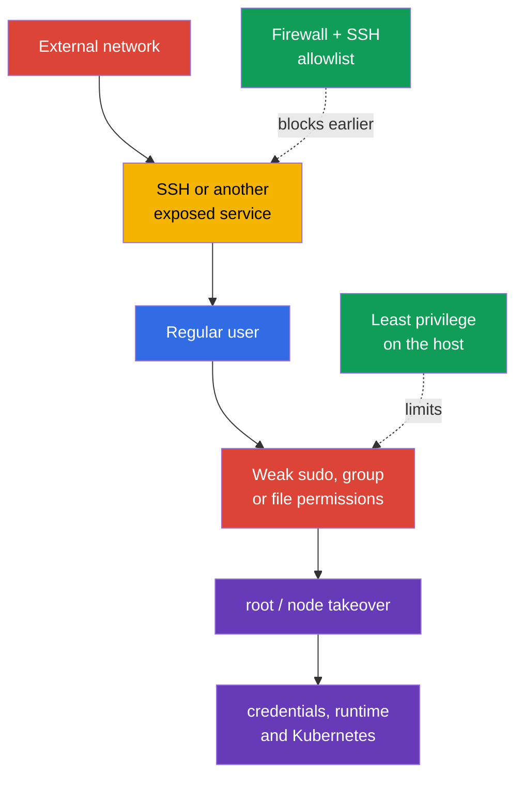
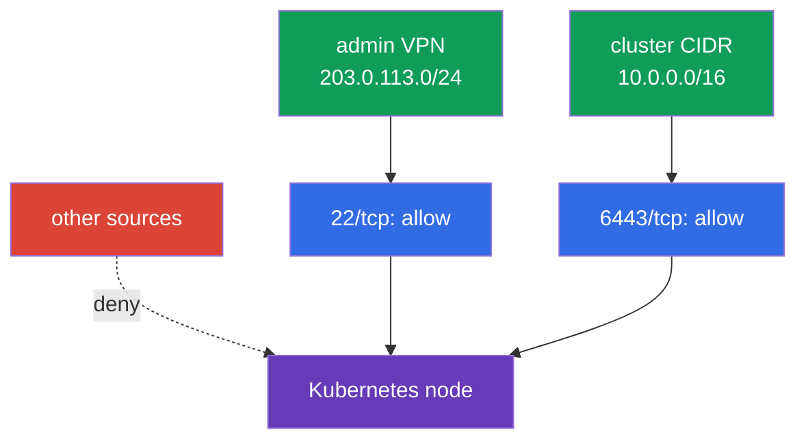

[Русская версия](ru.md) · [Versión en español](es.md) · [Version française](fr.md) · [Deutsche Version](de.md) · [ქართული ვერსია](ge.md) · [繁體中文版](tw.md) · [日本語版](jp.md)

# Chapter 15. Host least privilege and minimizing external network access

> **Problem.** After gaining entry through exposed SSH or a local account, an attacker
> looks for broad `sudo`, a privileged group, or a writable configuration file. One such
> mistake can provide root access, allow kubelet credentials to be read, or access to a
> runtime socket, turning limited node access into takeover of the node and Kubernetes.

> **What comes next.** In chapter 14, we reduced the node's attack surface: removed
> unnecessary services and packages, and eliminated insecure access to the container runtime.
> Now we limit the impact of the remaining entry point: who may log in to the host, what a
> user can do through `sudo`, which files they can read or modify, and from where the node is
> reachable at all. This is the **System Hardening** domain of CKS.

> **What you need from CKA.** Basic users, groups, file permissions, processes,
> systemd, and network commands are covered in the [CKA Linux chapter](../../../cka/course/00-5-linux/README.md).
> Here we do not repeat the fundamentals, but apply them to secure a Kubernetes node.

## 15.1. Threat model: one unnecessary access path can lead to node compromise

A Kubernetes node holds high-value data and control points: kubelet credentials,
`kubeconfig`, PKI keys, control plane manifests, container runtime sockets, and logs.
A user who can read a secret file, change configuration, or run a command as `root`
can gain access broader than their original role. Exposed SSH or an unnecessary port gives
an attacker a way to start this chain from outside.



Least privilege does not mean "give nobody anything". It means granting only the required
access, for the required time, with the ability to audit it. For a node, these are several
independent layers: local identity, narrowly scoped `sudo`, file owners and modes, a firewall,
and SSH. None of them replaces the others.

Before changing a working node, ensure emergency access through the provider console or a
second SSH session. An error in `sudoers`, the firewall, or `sshd_config` can leave you without
administrative access.

> 🧠 Node takeover is a chain of external entry, local identity, `sudo`, file permissions, and runtime sockets; host least privilege does not replace Kubernetes RBAC.

> 🎯 Use separate users, minimal groups, narrow audited `sudo`, and precise owner/mode; check the target user's effective permissions and writable parent directories.

## 15.2. Users, groups, and `sudo`: grant only the required access, not full root

Do not use one shared account or work permanently as `root`. Every operator should have a
separate user. This makes it possible to revoke access for one person and correlate an action
with a record in `auth.log` or journald.

```bash
# Inventory local users and groups.
USER_TO_REVIEW='user-to-review'
SERVICE_USER='service-user'
getent passwd
getent group
id "$USER_TO_REVIEW"
groups "$USER_TO_REVIEW"

# Disable password authentication for an unused interactive account.
sudo usermod --lock "$USER_TO_REVIEW"

# Separately disable the account itself for new logins (usermod --lock blocks only
# the password hash, not the entire Linux account).
sudo usermod --expiredate 1 "$USER_TO_REVIEW"

# Check the state.
sudo passwd -S "$USER_TO_REVIEW"
sudo chage -l "$USER_TO_REVIEW"

sudo usermod --shell /usr/sbin/nologin "$SERVICE_USER"
```

Account expiration and a password lock do not terminate existing processes or sessions. When
access must be revoked immediately, separately check active sessions, SSH keys, privileged
groups, and the central IAM/SSO source, then terminate access according to the approved
incident/offboarding procedure.

For a service account, do not apply account expiration mechanically if the service must
continue to start. It is usually given a separate restriction on interactive shell through
`nologin`, and its groups/permissions are minimized.

Service accounts do not need an interactive shell or membership in administrative groups.
Create a home or state directory only if the service needs one, with minimal owner/mode.
Also check groups that effectively mean broad escalation: `sudo`, `wheel`, `docker`, `lxd`,
and, on the particular system, groups owning container runtime sockets. Membership in such a
group must not be granted "for convenience".

### `sudo`: the minimum command set

The rule `user ALL=(ALL) ALL` is convenient but grants full root. If an operator needs one
operation, allow the exact command and its fixed arguments in a separate file under
`/etc/sudoers.d/`. Edit it with `visudo`, but do not ascribe extra protection to it:
with `visudo -f <alternative-path>`, owner and permissions are not checked automatically
without explicit `-O` and `-P`. After creation, set `root:root` and `0440` manually, then
validate the whole policy through `visudo -cf /etc/sudoers` (checking one include file is not
enough).

```bash
# Resolve the path through a predictable system PATH rather than assuming a fixed systemctl path.
SYSTEMCTL_PATH="$(env -i PATH=/usr/sbin:/usr/bin:/sbin:/bin sh -c 'command -v systemctl')"
test -n "$SYSTEMCTL_PATH" && SYSTEMCTL_PATH="$(readlink -f -- "$SYSTEMCTL_PATH")"
sudo test -x "$SYSTEMCTL_PATH"
sudo stat -c '%U:%G %a %n' "$SYSTEMCTL_PATH"  # root:root and no write permission for others are expected
```

It is safer not to provide `systemctl` directly: even narrow argument matching is easy to
broaden with an erroneous edit. Create a root-owned wrapper with no arguments; it invokes
**exactly** the path allowed above and always disables the pager. Before creating it, ensure
that `/usr/local/sbin` belongs to root and is not writable by unprivileged users.

```bash
sudo tee /usr/local/sbin/k8s-kubelet-status >/dev/null <<'EOF'
#!/bin/sh
PATH=/usr/sbin:/usr/bin:/sbin:/bin
SYSTEMCTL_PATH="$(command -v systemctl)" || exit 1
exec "$SYSTEMCTL_PATH" --no-pager status kubelet
EOF
sudo chown root:root /usr/local/sbin/k8s-kubelet-status
sudo chmod 0755 /usr/local/sbin/k8s-kubelet-status
sudo visudo -f /etc/sudoers.d/k8s-operator
sudo chown root:root /etc/sudoers.d/k8s-operator
sudo chmod 0440 /etc/sudoers.d/k8s-operator
sudo visudo -c -O -P -f /etc/sudoers.d/k8s-operator
sudo visudo -cf /etc/sudoers
```

```sudoers
# /etc/sudoers.d/k8s-operator - exact wrapper, without wildcards or arguments.
# Empty quotes specify "no arguments only"; without them, this path would be
# allowed with arbitrary arguments.
Cmnd_Alias KUBELET_STATUS = /usr/local/sbin/k8s-kubelet-status ""
k8s-operator ALL=(root) KUBELET_STATUS
```

Check the resulting policy for the target user specifically. Do not turn a
`sudo`/authentication failure into an "expected denial" through `|| echo`: first the complete
listing policy must be retrieved successfully, and absence of `/bin/bash` and other unneeded
commands is checked in its saved output.

```bash
policy=$(sudo -l -U k8s-operator) || {
  echo 'ERROR: cannot retrieve sudo policy for k8s-operator' >&2; exit 2;
}
printf '%s\n' "$policy" | tee /tmp/k8s-operator-sudo-policy.txt
# Review: only /usr/local/sbin/k8s-kubelet-status without arguments is allowed;
# /bin/bash, a shell/interpreter, and arbitrary systemctl are absent.
```

Do not try to restrict a dangerous program with a superficial argument list. An editor,
interpreter, `systemctl edit`, commands that can take an arbitrary path, and `kubectl` with an
administrative kubeconfig can often bypass an apparently narrow rule and obtain root or cluster
access. If a safe argument set cannot be described, a controlled break-glass procedure with
logging is better than a false sense of restriction.

It is useful to retain traces of every administrative action. Event/command logging and
I/O logging are different sudoers mechanisms: `logfile` sets the file destination for the event
log, while `log_input`/`log_output` or the command tags `LOG_INPUT`/`LOG_OUTPUT` record input/output
at the location in `iolog_*` or on `log_servers`.

```bash
# Inventory sudoers command/I/O logging settings.
sudo grep -REns \
  '(^|[[:space:],])((logfile|log_input|log_output|iolog_dir|iolog_file|log_servers)([=[:space:],]|$)|LOG_INPUT|LOG_OUTPUT)' \
  /etc/sudoers /etc/sudoers.d 2>/dev/null || true

# Check actual recent sudo events.
# The specific journal/syslog/logfile depends on the policy and distribution.
sudo journalctl _COMM=sudo --since '1 day ago'
```

If sudoers sets `logfile`, check that file too. If `log_input` /
`log_output` or the command tags `LOG_INPUT` / `LOG_OUTPUT` are enabled, also check `iolog_dir`
and the ability to read a record through `sudoreplay`. An empty result from one `journalctl`
does not prove that logging is absent: the destination depends on sudoers/syslog and OS configuration.

`NOPASSWD` is not by itself evidence of compromise, but it reduces protection against
unauthorized use of an already open session. Apply it only to a short, reviewed list of
non-interactive commands when automation requires it.

## 15.3. File permissions and ownership: protect credentials and configuration

POSIX permissions determine who can read (`r`), modify (`w`), and traverse a directory (`x`).
Ownership and mode must match the purpose of a file: ordinary users must not be able to read a
secret private key or modify control plane configuration. Check not only the file itself but
every directory in its path: write permission on a parent directory allows its contents to be
replaced.

```bash
# Mode, owner, and full path to the file.
stat -c '%A %a %U:%G %n' /etc/kubernetes/admin.conf
namei -l /etc/kubernetes/admin.conf

# Find world-writable files in the sensitive area; exclude the sticky bit separately.
sudo find /etc/kubernetes -xdev -type f -perm -0002 -ls
sudo find /etc/kubernetes -xdev -type d -perm -0002 -ls
```

For a self-managed kubeadm node, check at least the following. Exact owners depend on the
distribution and installation method, so first record the initial state and compare it with the
documentation for your Kubernetes/CIS version rather than applying one template blindly.

| Object | Risk of weak permissions | Secure direction |
|---|---|---|
| `/etc/kubernetes/pki/*.key` | theft of a CA or client private key | `root:root`, readable only by root, usually `600` |
| `/etc/kubernetes/admin.conf` | user obtains a cluster-admin credential | `root:root`, mode `600`; do not copy to shared directories |
| `/etc/kubernetes/manifests/` | replacement of a static Pod control plane | directory and YAML writable only by root |
| `/var/lib/kubelet/config.yaml` and kubelet credentials | changed kubelet behavior or theft of node identity | root owner, not writable by unprivileged users |
| `~/.ssh/authorized_keys` | adding an unauthorized SSH key | `.ssh` directory `700`, `authorized_keys` `600`, owned by the user |

Example of a targeted correction for a file that must be closed to other users:

```bash
sudo chown root:root /etc/kubernetes/admin.conf
sudo chmod 600 /etc/kubernetes/admin.conf
sudo stat -c '%U %G %a %n' /etc/kubernetes/admin.conf
```

Do not recursively run `chmod -R 600` on all of `/etc/kubernetes`: directories need the
`x` bit, and individual public certificates and configuration files can have another expected
mode. This kind of "fix" can break kubelet or a static Pod. Change a particular object only
after checking its owner, purpose, and actual consumer.

Also check SUID/SGID binaries: they run with the permissions of their owner or group and
increase the impact of a mistake. Do not remove system SUID files using a list from the internet -
first determine which package owns them and whether they are needed on the node.

```bash
set -euo pipefail
BINARY_PATH='/path/to/reviewed-binary'
# Inventory every selected local filesystem separately: `find / -xdev` would miss /usr, /var, /opt, etc.
findmnt -rn -o TARGET,FSTYPE |
while IFS=' ' read -r target fstype; do
  case "$fstype" in
    proc|sysfs|devtmpfs|devpts|tmpfs|cgroup|cgroup2|overlay|squashfs|nfs|nfs4|cifs|fuse.*|autofs|nsfs|mqueue|hugetlbfs|rpc_pipefs)
      continue
      ;;
  esac
  sudo find "$target" -xdev -type f -perm /6000 -printf '%m %u:%g %p\n' 2>/dev/null
done | LC_ALL=C sort -u

# Package ownership is distro-aware; a file without an owner needs provenance review.
if command -v dpkg-query >/dev/null 2>&1; then
  sudo dpkg-query -S "$BINARY_PATH" || {
    echo 'REVIEW_REQUIRED: no Debian package owns this binary; review its provenance' >&2
    exit 2
  }
elif command -v rpm >/dev/null 2>&1; then
  sudo rpm -qf "$BINARY_PATH" || {
    echo 'REVIEW_REQUIRED: no RPM package owns this binary; review its provenance' >&2
    exit 2
  }
else
  echo 'REVIEW_REQUIRED: package manager is unknown' >&2
  exit 2
fi
```

> 🎯 Build a flow matrix and allowlist, retain a second access path, apply deny-by-default, and test both the allowed and denied segments.

## 15.4. Firewall: only required ports are reachable by an external source

A firewall must be built from deny-by-default and explicit allow rules. A node does not have to
be reachable from the whole network merely because it participates in the cluster. Allow SSH only
from the administrative network, and Kubernetes ports only between agreed control-plane,
worker, and monitoring sources. The complete port list depends on topology, CNI, and components;
first collect the actual listeners and requirements of your installation.

```bash
sudo ss -lntup
sudo ss -lntup | grep -E ':(22|6443|10250|10256|10257|10259|2379|2380)\b' || true
```

| Port | Usual purpose | Who must have access |
|---|---|---|
| `22/tcp` | SSH | only bastion/VPN/administrative CIDR |
| `6443/tcp` | kube-apiserver | worker/control-plane and approved administrators |
| `10250/tcp` | protected kubelet API | control plane and required monitoring, not the internet |
| `10256/tcp` | kube-proxy healthz | only designated health-check/monitoring sources, if the port is not loopback-only |
| `10257/tcp` | kube-controller-manager | control-plane/monitoring only when needed, and not from the internet |
| `10259/tcp` | kube-scheduler | control-plane/monitoring only when needed, and not from the internet |
| `2379-2380/tcp` | etcd client/peer | only control-plane/etcd peers |
| `30000-32767/tcp`, `30000-32767/udp` (default) | NodePort | only client/LB CIDRs that need published Service; verify the actual range against the API server's `--service-node-port-range` |
| CNI ports (variable) | overlay, node-to-node, and Pod traffic | exactly the CIDRs and protocols in the selected CNI documentation |

Do not mix three rule managers without understanding the backend. `ufw` is a high-level
wrapper, while modern `iptables` often runs over `nf_tables`; making manual changes to `ufw`,
`iptables`, and `nftables` in parallel complicates auditing and can overwrite expected rules.
Choose the tool supported by the node image and configuration management system, and make it
the only source of truth.

> 🔬 You do not have to memorize every implementation; what matters is understanding and being able to apply a host firewall control in the available environment. Below are `ufw`, `iptables`, and `nftables` as alternative backends.

### Option A: `ufw`

**Before `default deny`, build an allowlist from the actual topology:** bastion/VPN, control-plane,
worker, etcd, load balancer, monitoring, Pod/Service CIDR, and your exact CNI. Add every required
role, NodePort, and CNI port from the matrix; they cannot be guessed by a universal rule.
Keep the current SSH session, open a second independent session, and before enabling enforcement
check the source address, prospective rules (`ufw status numbered`), and the out-of-band console.
Check forwarded/routed traffic separately: CNI and Pod traffic often need IPv4/IPv6 forwarding and
`ufw route` rules; one pair of `ufw allow ... to any port ...` is insufficient. Verify
`DEFAULT_FORWARD_POLICY`, `net.ipv4.ip_forward`, IPv6 forwarding, and CNI-specific flows,
or SSH/API may remain live while Pod networking breaks. After enabling it, do not close the
saved session until you confirm a new SSH login and kubelet/API operation from the permitted
networks.

```bash
# Example: allow SSH only from the administrative network.
sudo ufw allow from 203.0.113.0/24 to any port 22 proto tcp

# Example: allow the API only from the node and administrator network.
sudo ufw allow from 10.0.0.0/16 to any port 6443 proto tcp
# Before this point, add role- and CNI-specific allow rules for your installation.
sudo ufw default deny incoming
sudo ufw default allow outgoing
sudo ufw enable
sudo ufw status numbered
```

Before removing a rule, review its number and purpose, then remove it by number:

```bash
RULE_NUMBER='1'
sudo ufw status numbered
sudo ufw delete "$RULE_NUMBER"
```

### Option B: `iptables`

For the instructional `iptables` example, allow established traffic, loopback, SSH from the
allowlist, and then deny all other inbound traffic. In a real cluster, add all documented
Kubernetes/CNI flows before adding `DROP`, otherwise you can cut communication between nodes or
Pod networking. Check `FORWARD` chains, IPv4, and IPv6 separately: a CNI can route Pod traffic
outside `INPUT`, while a final `DROP` in `INPUT` neither creates a secure forwarding policy nor
replaces CNI-specific rules.

```bash
sudo iptables -A INPUT -m conntrack --ctstate ESTABLISHED,RELATED -j ACCEPT
sudo iptables -A INPUT -i lo -j ACCEPT
sudo iptables -A INPUT -p tcp -s 203.0.113.0/24 --dport 22 -j ACCEPT
sudo iptables -A INPUT -p tcp -s 10.0.0.0/16 --dport 6443 -j ACCEPT
sudo iptables -A INPUT -j DROP
sudo iptables -S INPUT
```

`-A` appends rules to the end of a chain: if an existing rule above already accepts traffic,
the final `DROP` does not ensure deny-by-default. These IPv4 rules also do not cover IPv6.
First review the order of the complete ruleset. For a permanent policy, manage a dedicated
chain with an explicit jump or use `nftables` with an explicit policy; do not mix manual
append rules with CNI or firewall-manager rules.

Rules added by a command do not always survive a reboot. Persist them using the distribution's
standard mechanism or declarative configuration; do not assume that `iptables -S` output is
itself a persistence layer.

### Option C: `nftables`

`nftables` is the modern kernel mechanism. It makes it easier to state a policy explicitly and
see the complete ruleset with one command. Do not apply this example on a node where a CNI or
firewall manager has already created tables, without reviewing the existing ruleset.

```nft
# /etc/nftables.conf: fragment of a separate table for host ingress
 table inet host_filter {
   chain input {
     type filter hook input priority filter; policy drop;
     ct state established,related accept
     iifname "lo" accept
     ip saddr 203.0.113.0/24 tcp dport 22 accept
     ip saddr 10.0.0.0/16 tcp dport 6443 accept
   }
 }
```

Check syntax before loading it, then inspect the actually active rules:

```bash
sudo nft -c -f /etc/nftables.conf
sudo systemctl reload nftables
sudo nft list ruleset
```



A host firewall complements but does not replace cloud Security Groups, a private endpoint,
routing, or Kubernetes NetworkPolicy. NetworkPolicy principally controls Pod traffic, whereas
the node firewall controls host traffic; check the responsibility boundary of your CNI and cloud
network.

> 🏭 A node role receives only its bootstrap, network, storage, and telemetry permissions; a workload uses a separate minimal workload identity.

## 15.4.1. Cloud/node IAM: a separate minimal role for a workload

Least privilege also applies to cloud IAM. A node/instance role must not receive broad
cloud-admin permissions merely because Kubernetes runs on the node; grant it only the
bootstrap, network, storage, and telemetry permissions needed by that role. A workload must
not automatically inherit node-role credentials: use workload identity, IRSA, or an equivalent
with a separate minimal cloud role for the specific ServiceAccount. Where the platform supports
it, restrict Pod access to instance metadata and node credentials. Review cloud roles separately
from Kubernetes RBAC: a minimal RoleBinding does not prove minimal cloud permissions.

## 15.5. SSH hardening: protect the main administration path

SSH is often the only remote entry to a node. Prefer a dedicated administrative user account
and keys rather than passwords. Direct `root` login makes brute force easier and removes an
individual identity from logs.

> 🎯 Confirm the key and alternative access, prohibit root/password login, and check `sshd -t`, `sshd -T`, and login by an allowed user.

With modern OpenSSH, it is more convenient to create a small drop-in than edit a large vendor
file. First check that your configuration includes the directory through `Include`.
Wildcard `Include` files are processed in lexical order, and for most ordinary scalar
keywords OpenSSH uses the first obtained value. Therefore the name `99-hardening.conf` does not
guarantee precedence, and these parameters often require a deliberately early file.

Do not apply this model to list directives, however. `AllowUsers`, `AllowGroups`, `DenyUsers`,
and `DenyGroups` can appear multiple times, and every occurrence is **added** to the respective
list. An early `00-hardening.conf` does not cancel another `AllowUsers`. Before using
`AllowUsers`, inventory all its occurrences in the main `sshd_config` and included files,
remove or merge conflicting lists into a managed allowlist, then check the result using
`sshd -T` and, where `Match` exists, `sshd -T -C user=...,host=...,addr=...`. Choose **one**
profile below: both prohibit password login, but the MFA profile additionally requires a key and
PAM keyboard-interactive. Do not enable both profiles at the same time.

```bash
sudo grep -RnsE \
  '^[[:space:]]*(Include|Match|AllowUsers|AllowGroups|DenyUsers|DenyGroups)[[:space:]]' \
  /etc/ssh/sshd_config /etc/ssh/sshd_config.d 2>/dev/null || true
```

**Profile A - key only.**

```bash
sudo install -d -o root -g root -m 0755 /etc/ssh/sshd_config.d
sudo tee /etc/ssh/sshd_config.d/00-hardening.conf >/dev/null <<'EOF'
PermitRootLogin no
PasswordAuthentication no
KbdInteractiveAuthentication no
PubkeyAuthentication yes
AllowUsers k8s-operator
EOF
sudo chown root:root /etc/ssh/sshd_config.d/00-hardening.conf
sudo chmod 0600 /etc/ssh/sshd_config.d/00-hardening.conf
sudo stat -c '%U:%G %a %n' \
  /etc/ssh/sshd_config.d /etc/ssh/sshd_config.d/00-hardening.conf

SSHD_UNIT="$(
  systemctl list-unit-files --type=service --no-legend \
    | awk '$1 == "ssh.service" || $1 == "sshd.service" { print $1; exit }'
)"
test -n "$SSHD_UNIT" || {
  echo 'ERROR: ssh.service/sshd.service was not found' >&2
  exit 1
}

sudo sshd -t
sudo systemctl reload "$SSHD_UNIT"
```

**Profile B - key + MFA through PAM keyboard-interactive.** Use it only after configuring
and testing the PAM MFA module; `AuthenticationMethods` requires both factors, rather than
replacing the key with a one-time code.

```text
PermitRootLogin no
PasswordAuthentication no
PubkeyAuthentication yes
KbdInteractiveAuthentication yes
UsePAM yes
AuthenticationMethods publickey,keyboard-interactive:pam
AllowUsers k8s-operator
```

Save profile B in the same `/etc/ssh/sshd_config.d/00-hardening.conf`; apply the **same**
owner/mode invariant, then check it before `sshd -t` and reloading the actual OpenSSH
server unit (`ssh.service` on Debian/Ubuntu or `sshd.service` on many RHEL-family
systems):

```bash
sudo install -d -o root -g root -m 0755 /etc/ssh/sshd_config.d
sudo chown root:root /etc/ssh/sshd_config.d/00-hardening.conf
sudo chmod 0600 /etc/ssh/sshd_config.d/00-hardening.conf
sudo stat -c '%U:%G %a %n' \
  /etc/ssh/sshd_config.d /etc/ssh/sshd_config.d/00-hardening.conf
sudo sshd -t
# Determine ssh.service/sshd.service using the same distro-aware method as in Profile A, then reload.
```

Do not treat one unit name as universal for all Linux distributions. `AllowUsers` is a strong
restriction, but it blocks every user not listed. Do not apply it until the required break-glass
and automation accounts have been added; document the owners and review the list.

Before closing the current SSH session, check the effective values and log in from a second
session as the allowed user. For profile A, use only a key; for B, check both the key and MFA:

```bash
sudo sshd -T | grep -E 'permitrootlogin|passwordauthentication|kbdinteractiveauthentication|pubkeyauthentication|usepam|authenticationmethods|allowusers'
NODE_ADDRESS='node-address.example.internal'
# Profile A (key only): the check is non-interactive and must not prompt for password/MFA.
ssh -o BatchMode=yes -o PreferredAuthentications=publickey \
  -o PasswordAuthentication=no -o KbdInteractiveAuthentication=no \
  "k8s-operator@${NODE_ADDRESS}" id

# Profile B (key + MFA): do not use BatchMode; complete the second-factor prompt.
ssh -o PreferredAuthentications=publickey,keyboard-interactive \
  -o PasswordAuthentication=no -o KbdInteractiveAuthentication=yes \
  "k8s-operator@${NODE_ADDRESS}" id
```

Also ensure that the resulting `allowusers` contains **only** approved accounts, including
required break-glass/automation identities, and no additional values from another `Include`.
With `Match`, check the effective configuration for every relevant user/source through
`sshd -T -C`.

Do not disable password authentication until you have established that the target user's key is
actually installed, has correct permissions, and works through the bastion/VPN. For emergency
access, use the provider console or a governed break-glass account, not a permanent root password.

## 15.6. Verification and diagnostics: prove that the protection works

Verification must confirm actual behavior, not merely a line in a file. Run network tests from
both an allowed and denied segment, and run `sudo` checks as an unprivileged user. Do not use
destructive commands on a production node or remove active rules without a rollback plan.

```bash
# 1. Check owners and modes of sensitive files.
sudo stat -c '%U %G %a %n' \
  /etc/kubernetes/admin.conf \
  /etc/kubernetes/pki/ca.key

# 2. Obtain policy without mixing it with user authentication. If sudo -l
# fails, it is an operational error, not proof of policy denial.
policy=$(sudo -l -U k8s-operator) || {
  echo 'ERROR: cannot retrieve sudo policy for k8s-operator' >&2; exit 2;
}
printf '%s\n' "$policy" | tee /tmp/k8s-operator-sudo-policy.txt
# Review listing: only the wrapper without arguments is allowed; /bin/bash is absent.

# 3. Check the actual firewall of the selected mechanism.
sudo ufw status verbose             # if ufw is used
sudo iptables -S INPUT               # if iptables is used
sudo nft list ruleset                # if nftables is used

# 4. Check listeners on the node itself.
sudo ss -lntup

# 5. Check the syntax and effective SSH configuration.
sudo sshd -t
sudo sshd -T | grep -E 'permitrootlogin|passwordauthentication|pubkeyauthentication'
```

From a host outside the allowlist, test only the expected refusal or timeout; from an allowed
network, test successful SSH/API access to the extent required by the role. SSH authentication
and `sudo` authorization/authentication are independent: a `sudo` password prompt without a TTY
does not prove an SSH or sudo policy error.

```bash
# From a host outside the allowed CIDR: the connection must not be established.
NODE_ADDRESS='node-address.example.internal'
nc -vz -w 3 "$NODE_ADDRESS" 22

# SSH login proof, Profile A: key-only and non-interactive.
ssh -o BatchMode=yes -o PreferredAuthentications=publickey \
  -o PasswordAuthentication=no -o KbdInteractiveAuthentication=no \
  "k8s-operator@${NODE_ADDRESS}" id

# SSH login proof, Profile B: complete publickey + keyboard-interactive MFA; no BatchMode.
ssh -o PreferredAuthentications=publickey,keyboard-interactive \
  -o PasswordAuthentication=no -o KbdInteractiveAuthentication=yes \
  "k8s-operator@${NODE_ADDRESS}" id

# Run this separately from an interactive admin terminal when sudo policy requires a password.
ssh -t "k8s-operator@${NODE_ADDRESS}" 'sudo -l'
# Or prove a specific allowed wrapper:
# ssh -t "k8s-operator@${NODE_ADDRESS}" 'sudo /usr/local/sbin/k8s-kubelet-status'

# Use this only when NOPASSWD is an explicit policy requirement for the checked command/listing.
ssh -o BatchMode=yes "k8s-operator@${NODE_ADDRESS}" 'sudo -n -l'
```

| Symptom | Probable cause | What to check |
|---|---|---|
| SSH is unavailable after firewall changes | source/port is not allowed or rule order is incorrect | console access, `ufw status numbered`, `iptables -S`, `nft list ruleset` |
| Kubelet stopped communicating with the API | firewall closed `6443` or the route between nodes | `journalctl -u kubelet`, allowlist, Security Group, DNS/route |
| `sudo` allows more than expected | broad rule, membership in another group, dangerous allowed command | `sudo -l -U <user>`, `id <user>`, all `/etc/sudoers.d/*` |
| Login fails after SSH hardening | key is unavailable, drop-in is not included, `AllowUsers` is too narrow | `sshd -t`, `sshd -T`, `~/.ssh` permissions, console access |
| Kubernetes component does not start after `chmod` | directory/file permissions were changed and required runtime permissions disappeared | `journalctl -u kubelet`, `crictl ps -a`, `namei -l` |

> 🏭 Manage host identities, `sudoers`, firewall, and SSH as code: owner, expiry, logging, rollback, role-specific allowlist, and periodic drift checks.

## 15.7. How this is applied in production

- **Identity lifecycle.** Local accounts are created through IAM/CMDB/configuration
  management, their owner and access expiry are known, and departing employees are blocked
  immediately. A permanent shared root account is not used.
- **Privileges as code.** `sudoers` files, groups, and owners of sensitive paths are
  described in Ansible, an image pipeline, or another IaC tool. This prevents drift and
  enables code review.
- **Firewall by node role.** Control-plane, worker, bastion, and monitoring have different
  allowlists. Rules are built from the actual flow matrix, including CNI and health checks,
  and are tested in staging before rollout.
- **SSH without bypasses.** Use short-lived SSH certificates or central access through
  bastion/VPN, MFA, and audit. Password login and root login remain disabled, while
  break-glass access has an owner and a review procedure.
- **Continuous verification.** CIS scanning from [chapter 07](../07/README.md), file-integrity
  monitoring, searches for world-writable paths, and control of open ports run regularly,
  not only before an audit.
- For Kubernetes v1.37, separately evaluate rootless node architecture (`KubeletInUserNamespace`) as an additional least-privilege boundary; this is not the same as Pod user namespaces. See [Kubernetes v1.37 Security Delta](../APPENDIX_K8S_137_SECURITY_DELTA.md).

## 15.8. Mini-glossary

- **least privilege** - granting only the minimum privileges a subject needs for its
  task, for a limited time.
- **`sudoers`** - a policy that determines which commands a user may run as another
  user; it is edited through `visudo`.
- **SUID/SGID** - special file bits that run a program with the effective UID of its
  owner or GID of its group; they require inventory.
- **allowlist** - an explicit list of permitted sources, users, ports, or actions;
  everything else is denied.
- **host firewall** - filtering rules on the node itself, for example `ufw`, `iptables`,
  or `nftables`.
- **drop-in** - a separate configuration file that supplements the base configuration, for
  example `/etc/ssh/sshd_config.d/00-hardening.conf`.
- **break-glass access** - governed emergency access used only during an incident or loss
  of the standard administration path.

## 15.9. Chapter summary

- Separate users, minimal groups, and narrowly scoped `sudo` reduce the impact of account
  compromise and make actions verifiable.
- Private keys, kubeconfig, static Pod manifests, and kubelet configuration require the
  correct owner and mode; recursive `chmod` without understanding purpose is dangerous.
- A firewall is built from default deny and an allowlist of required flows. `ufw`, `iptables`,
  and `nftables` should not be mixed without a clear source of truth.
- Secure SSH with keys, `PermitRootLogin no`, disabled password authentication, and restricted
  allowed users, but only after verifying a second access path.
- Prove the result with actual attempts: an unnecessary command through `sudo` is rejected,
  a sensitive file is inaccessible, a closed port does not answer, and allowed access works.

## 15.10. How this helps: on the exam and in real work

**On the exam.** A task can ask you to correct a kubeconfig mode, remove a user from a
dangerous group, limit `sudo`, close a port through a firewall, or prohibit root SSH.
First read the current configuration, change only the named object, then prove the result with
`stat`, `sudo -l`, `ss`, firewall output, and `sshd -t`. Before a network edit, first retain
your own SSH access.

**In real work.** Compromise of a Pod or account must not automatically mean root on the node
and access to the whole cluster. Separate users, protected credentials, a narrow firewall, and
audited SSH turn one broad attack path into several independent barriers, each of which can be
checked and automated regularly.

## 15.11. Self-check questions

<details>
<summary>1. Why can membership in `docker` or a broad `sudo` rule be equivalent to root?</summary>

A member of the `docker` group can access the Docker socket and create a container with access to the host, so this is root-equivalent rather than an ordinary working group. The rule `user ALL=(ALL) ALL` allows an arbitrary command to be run as root. Both paths bypass the restrictions of an ordinary unprivileged user and require the same caution as granting root access.
</details>

<details>
<summary>2. Which Kubernetes files on a node are most dangerous to make readable or writable by
   an ordinary user?</summary>

Private keys in `/etc/kubernetes/pki/*.key` and `/etc/kubernetes/admin.conf` are especially sensitive: reading them can yield a CA, client key, or cluster-admin credential. Writing to `/etc/kubernetes/manifests/` permits replacement of a static Pod control plane. Unprivileged users must also not receive write access to `/var/lib/kubelet/config.yaml` or access to kubelet credentials.
</details>

<details>
<summary>3. Why must you not recursively apply `chmod 600` to all of `/etc/kubernetes`?</summary>

Directories need the `x` bit for traversal, and individual public certificates and configuration files can have another expected mode. Recursive `chmod -R 600` without considering purpose can break kubelet or a static Pod. You must check the particular object, its owner, consumer, and path with `stat` and `namei -l`, then change it precisely.
</details>

<details>
<summary>4. Which rules must be added before a default deny firewall so that you neither lose access
   nor break the cluster?</summary>

Before enforcement, create an allowlist from the real topology: bastion/VPN for SSH, control plane, worker, etcd peers, load balancer, monitoring, Pod/Service CIDR, and the protocols of the particular CNI. In particular, required flows to `6443`, `10250`, `2379-2380`, health endpoints, and NodePort are needed when they are used. Keep the current SSH session, open a second one, and separately check forwarding/`ufw route`, IPv4/IPv6, and CNI traffic.
</details>

<details>
<summary>5. How do the responsibilities of a host firewall, Security Group, and NetworkPolicy differ?</summary>

A host firewall manages traffic of the node itself, while a Security Group or cloud firewall manages the infrastructure network boundary and endpoint sources. NetworkPolicy is applied by the CNI mainly to Pod traffic and does not replace protection of the host/control-plane path in every topology. The controls complement one another, so they cannot be treated as interchangeable.
</details>

<details>
<summary>6. Why should you open a second SSH session before disabling password authentication?</summary>

If the key is not installed, its permissions are wrong, the drop-in is not included, or `AllowUsers` is too narrow, disabling password authentication can lock an administrator out. A second independent session and an out-of-band console preserve a rollback path. Before closing the current session, check `sshd -t`, the effective values from `sshd -T`, and key login by the allowed user.
</details>

<details>
<summary>7. Which commands prove that SSH and firewall settings are not only written but working?</summary>

Check SSH syntax and effective configuration with `sudo sshd -t` and `sudo sshd -T | grep ...`, then perform a real key-only login from the allowed network through `ssh -o BatchMode=yes ...`. Check the active firewall with the selected mechanism: `ufw status verbose`, `iptables -S INPUT`, or `nft list ruleset`, and listeners with `sudo ss -lntup`. From an unauthorized segment, `nc -vz -w 3 <node> 22` must produce the expected refusal or timeout.
</details>

<details>
<summary>8. **Flashback (chapter 10).** This chapter concerns least privilege at the **host** level (Linux
   users, groups, access to sockets). Chapter 10 concerns least privilege at the **Kubernetes API**
   level (RBAC). Give a concrete example where narrow RBAC does not protect against an attack
   carried out through excessive host access (and vice versa) - that is, why neither of these two
   levels of least privilege is ever sufficient on its own.</summary>

A ServiceAccount can have a narrow Role limited to `get pods`, but a user with access to the containerd/Docker socket or broad `sudo` can gain root on the node and bypass this API boundary. Conversely, a strict host firewall and file modes will not stop a Pod with a stolen ServiceAccount token if its RBAC permits reading a Secret or creating `pods/exec`. The host and Kubernetes API limit different attack paths, so both layers are needed.
</details>

## Practice

In lab 105, you will disable an unnecessary service, close an unneeded port, apply a firewall,
correct the permissions of a sensitive file, and prohibit root SSH. On a separate Docker host,
you will also close the Docker TCP API, protect `/var/run/docker.sock`, and remove unnecessary
access to the `docker` group.

🧪 Lab 105 (OS System Hardening and Docker daemon):
[tasks/cks/labs/105](../../labs/105/README.MD)

## Reference materials

- [CIS Kubernetes Benchmark](https://www.cisecurity.org/benchmark/kubernetes)
- [OpenSSH: sshd_config(5)](https://man.openbsd.org/sshd_config)

---
[Table of contents](../README.md) · [Chapter 14](../14/README.md) · [Chapter 16](../16/README.md)
