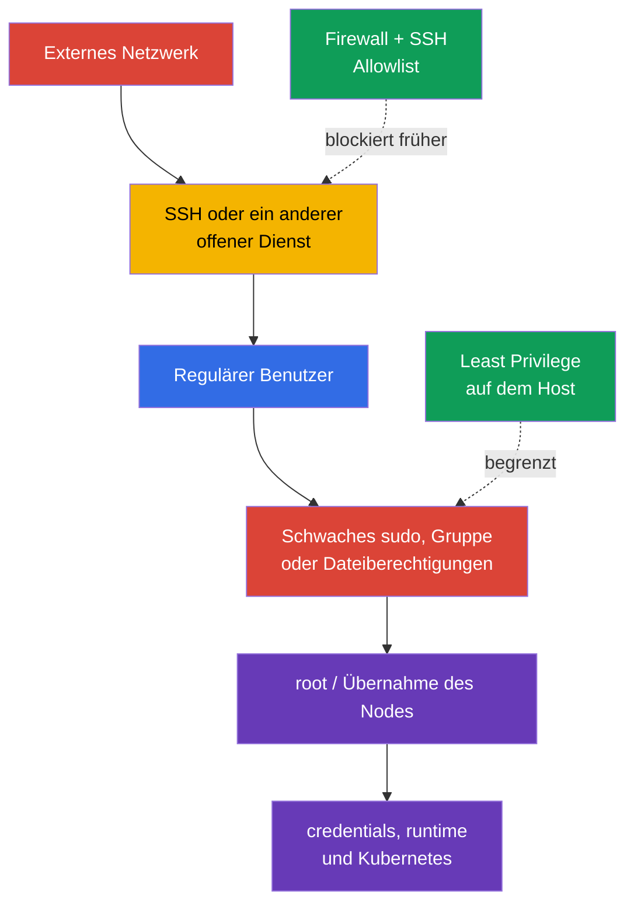
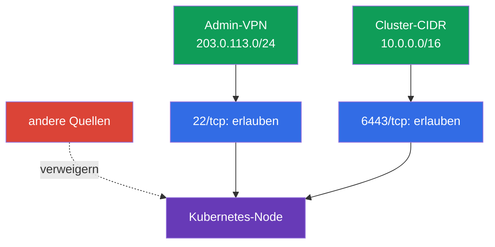

[Русская версия](ru.md) · [Eng version](README.md) · [Versión en español](es.md) · [Version française](fr.md) · [ქართული ვერსია](ge.md) · [繁體中文版](tw.md) · [日本語版](jp.md)

# Kapitel 15. Least Privilege auf dem Host und Minimierung des externen Netzwerkzugriffs

> **Problem.** Nachdem ein Angreifer über offenes SSH oder ein lokales Benutzerkonto eingedrungen ist,
> sucht er nach weitreichendem `sudo`, einer privilegierten Gruppe oder einer beschreibbaren Konfigurationsdatei. Ein
> solcher Fehler ermöglicht es, root zu werden, kubelet credentials zu lesen oder auf einen
> runtime socket zuzugreifen und verwandelt eingeschränkten Zugriff auf einen Node in die Übernahme dieses Nodes und von Kubernetes.

> **Was als Nächstes kommt.** In Kapitel 14 haben wir die Angriffsfläche des Nodes verringert: unnötige Dienste,
> Pakete und unsicheren Zugriff auf die container runtime entfernt. Jetzt begrenzen wir die Folgen des verbleibenden
> Eintrittspunkts: Wer darf sich am Host anmelden, was kann ein Benutzer über `sudo` tun,
> welche Dateien darf er lesen oder ändern und von wo ist der Node überhaupt erreichbar. Dies ist die
> **System Hardening**-Bereich von CKS.

> **Was Sie aus CKA wissen müssen.** Grundlagen zu Benutzern, Gruppen, Dateiberechtigungen, Prozessen,
> systemd und Netzwerkbefehlen werden im [CKA-Linux-Kapitel](../../../cka/course/00-5-linux/de.md) behandelt.
> Hier wiederholen wir die Grundlagen nicht, sondern wenden sie an, um einen Kubernetes-Node zu schützen.

## 15.1. Bedrohungsmodell: Ein einziger überflüssiger Zugang wird zur Übernahme des Nodes

Ein Kubernetes-Node enthält hochwertige Daten und Steuerungspunkte: kubelet credentials,
`kubeconfig`, PKI-Schlüssel, control plane-Manifeste, container runtime sockets und Logs.
Ein Benutzer, der eine geheime Datei lesen, eine Konfiguration ändern oder einen
Befehl als `root` ausführen kann, kann Zugriff erlangen, der weiter reicht als seine ursprüngliche Rolle. Offenes SSH oder
ein unnötiger Port gibt einem Angreifer die Möglichkeit, diese Kette von außen zu beginnen.



Least Privilege bedeutet nicht, „niemandem irgendetwas zu geben“, sondern nur den notwendigen
Zugriff zu gewähren, für die nötige Zeit und mit der Möglichkeit zur Auditierung. Für einen Node sind es mehrere
unabhängige Schichten: lokale Identität, eng begrenztes `sudo`, Dateibesitzer und Modi, Firewall und SSH. Keine von
ihnen ersetzt die anderen.

Stellen Sie vor Änderungen an einem laufenden Node den Notfallzugriff über die Provider-Konsole oder
eine zweite SSH-Sitzung sicher. Ein Fehler in `sudoers`, der Firewall oder `sshd_config` kann Sie ohne
administrativen Zugriff zurücklassen.

> 🧠 Die Übernahme eines Nodes ist eine Kette aus externem Eintritt, lokaler Identität, `sudo`, Dateiberechtigungen und runtime sockets; Least Privilege auf dem Host ersetzt Kubernetes RBAC nicht.

> 🎯 Verwenden Sie separate Benutzer, möglichst wenige Gruppen, eng begrenztes, auditiertes `sudo` und präzise owner/mode; prüfen Sie die effektiven Berechtigungen des Zielbenutzers und beschreibbare übergeordnete Verzeichnisse.

## 15.2. Benutzer, Gruppen und `sudo`: gezielten Zugriff statt vollständiger root-Rechte gewähren

Verwenden Sie kein gemeinsames Konto und arbeiten Sie nicht dauerhaft als `root`. Jeder Operator
sollte einen eigenen Benutzer haben: So lässt sich einer Person der Zugriff entziehen und
eine Aktion mit einem Eintrag in `auth.log` oder journald korrelieren.

```bash
# Inventarisieren Sie lokale Benutzer und Gruppen.
USER_TO_REVIEW='user-to-review'
SERVICE_USER='service-user'
getent passwd
getent group
id "$USER_TO_REVIEW"
groups "$USER_TO_REVIEW"

# Deaktivieren Sie password authentication für ein ungenutztes interaktives Benutzerkonto.
sudo usermod --lock "$USER_TO_REVIEW"

# Deaktivieren Sie zusätzlich das Konto selbst für neue logins (usermod --lock blockiert nur
# den password hash, nicht das gesamte Linux-Konto).
sudo usermod --expiredate 1 "$USER_TO_REVIEW"

# Prüfen Sie den Status.
sudo passwd -S "$USER_TO_REVIEW"
sudo chage -l "$USER_TO_REVIEW"

sudo usermod --shell /usr/sbin/nologin "$SERVICE_USER"
```

Der Ablauf eines Kontos und eine Passwortsperre beenden bereits bestehende Prozesse/Sitzungen nicht. Beim
sofortigen Entzug des Zugriffs prüfen Sie zusätzlich aktive Sitzungen, SSH-Schlüssel, privilegierte
Gruppen und die zentrale IAM/SSO-Quelle und beenden Sie den Zugriff gemäß dem genehmigten
Incident-/Offboarding-Verfahren.

Wenden Sie den Kontoablauf bei einem Service Account nicht mechanisch an, wenn der Service
weiterhin starten muss. Für ihn wird die interaktive Shell üblicherweise separat über
`nologin` deaktiviert und seine Gruppen/Berechtigungen werden minimiert.

Service Accounts benötigen keine interaktive Shell und keine Mitgliedschaft in administrativen Gruppen.
Erstellen Sie ein Home- oder State-Verzeichnis nur, wenn der Service es benötigt, mit minimalen owner/mode.
Prüfen Sie auch Gruppen, die praktisch eine weitreichende Eskalation bedeuten: `sudo`, `wheel`, `docker`, `lxd` sowie auf einem konkreten System die Eigentümergruppen
von container runtime sockets. Die Mitgliedschaft in einer solchen Gruppe darf nicht „der Bequemlichkeit halber“ erteilt werden.

### `sudo`: der minimale Befehlssatz

Die Regel `user ALL=(ALL) ALL` ist praktisch, gewährt aber vollständigen root. Benötigt ein Operator eine
Operation, erlauben Sie den konkreten Befehl und seine festen Argumente in einer separaten Datei unter
`/etc/sudoers.d/`. Bearbeiten Sie sie über `visudo`, schreiben Sie ihr aber keine weitergehende Schutzwirkung zu:
Bei `visudo -f <alternativer-pfad>` werden owner und permissions ohne explizites
`-O` und `-P` nicht automatisch geprüft. Legen Sie nach der Erstellung `root:root` und `0440` manuell fest und validieren Sie anschließend die gesamte
policy über `visudo -cf /etc/sudoers` (die Prüfung einer einzelnen include-Datei reicht nicht aus).

```bash
# Lösen Sie den Pfad über einen vorhersehbaren System-PATH auf, statt von einem festen systemctl-Pfad auszugehen.
SYSTEMCTL_PATH="$(env -i PATH=/usr/sbin:/usr/bin:/sbin:/bin sh -c 'command -v systemctl')"
test -n "$SYSTEMCTL_PATH" && SYSTEMCTL_PATH="$(readlink -f -- "$SYSTEMCTL_PATH")"
sudo test -x "$SYSTEMCTL_PATH"
sudo stat -c '%U:%G %a %n' "$SYSTEMCTL_PATH"  # erwartet werden root:root und keine Schreibberechtigung für andere
```

Es ist sicherer, `systemctl` nicht direkt bereitzustellen: Selbst eine enge Argumentübereinstimmung lässt sich
durch eine fehlerhafte Bearbeitung leicht erweitern. Erstellen Sie einen root-eigenen wrapper ohne Argumente; er ruft
**genau** den oben erlaubten Pfad auf und deaktiviert stets den pager. Stellen Sie vor seiner Erstellung sicher, dass
`/usr/local/sbin` root gehört und für unprivilegierte Benutzer nicht beschreibbar ist.

```bash
sudo tee /usr/local/sbin/k8s-kubelet-status >/dev/null <<'EOF'
#!/bin/sh
PATH=/usr/sbin:/usr/bin:/sbin:/bin
SYSTEMCTL_PATH="$(command -v systemctl)" || exit 1
exec "$SYSTEMCTL_PATH" --no-pager status kubelet
EOF
sudo chown root:root /usr/local/sbin/k8s-kubelet-status
sudo chmod 0755 /usr/local/sbin/k8s-kubelet-status
sudo visudo -f /etc/sudoers.d/k8s-operator
sudo chown root:root /etc/sudoers.d/k8s-operator
sudo chmod 0440 /etc/sudoers.d/k8s-operator
sudo visudo -c -O -P -f /etc/sudoers.d/k8s-operator
sudo visudo -cf /etc/sudoers
```

```sudoers
# /etc/sudoers.d/k8s-operator - exakter wrapper, ohne wildcards und ohne Argumente.
# Leere Anführungszeichen geben „nur ohne Argumente“ an; ohne sie wäre dieser Pfad
# mit beliebigen Argumenten erlaubt.
Cmnd_Alias KUBELET_STATUS = /usr/local/sbin/k8s-kubelet-status ""
k8s-operator ALL=(root) KUBELET_STATUS
```

Prüfen Sie die resultierende policy gezielt für den Zielbenutzer. Machen Sie aus einem
`sudo`-/Authentifizierungsfehler keine „erwartete Ablehnung“ mittels `|| echo`: Zuerst muss die vollständige
Auflistung der policy erfolgreich abgerufen werden; das Fehlen von `/bin/bash` und anderen nicht benötigten Befehlen wird
in ihrer gespeicherten Ausgabe geprüft.

```bash
policy=$(sudo -l -U k8s-operator) || {
  echo 'ERROR: cannot retrieve sudo policy for k8s-operator' >&2; exit 2;
}
printf '%s\n' "$policy" | tee /tmp/k8s-operator-sudo-policy.txt
# Prüfen: Nur /usr/local/sbin/k8s-kubelet-status ohne Argumente ist erlaubt;
# /bin/bash, Shell/Interpreter und beliebiges systemctl fehlen.
```

Versuchen Sie nicht, ein gefährliches Programm mit einer oberflächlichen Argumentliste einzuschränken. Ein Editor,
Interpreter, `systemctl edit`, Befehle mit der Möglichkeit, einen beliebigen Pfad anzugeben, sowie
`kubectl` mit einem administrativen kubeconfig können oft eine scheinbar enge Regel umgehen und
root oder Clusterzugriff erlangen. Lässt sich ein sicherer Argumentsatz nicht beschreiben,
ist ein kontrolliertes Break-Glass-Verfahren mit Protokollierung besser als ein falsches Gefühl der
Einschränkung.

Es ist sinnvoll, Spuren jeder administrativen Aktion zu bewahren. Event-/Command-Logging und
I/O-Logging sind unterschiedliche sudoers-Mechanismen: `logfile` legt das Dateiziel des event log fest, während
`log_input`/`log_output` oder die command tags `LOG_INPUT`/`LOG_OUTPUT` Eingaben/Ausgaben
am in `iolog_*` angegebenen Ort oder auf `log_servers` aufzeichnen.

```bash
# Inventarisieren Sie sudoers-Einstellungen für Command-/I/O-Logging.
sudo grep -REns \
  '(^|[[:space:],])((logfile|log_input|log_output|iolog_dir|iolog_file|log_servers)([=[:space:],]|$)|LOG_INPUT|LOG_OUTPUT)' \
  /etc/sudoers /etc/sudoers.d 2>/dev/null || true

# Prüfen Sie tatsächliche kürzliche sudo-Ereignisse.
# Das konkrete journal/syslog/logfile hängt von policy und Distribution ab.
sudo journalctl _COMM=sudo --since '1 day ago'
```

Wenn sudoers `logfile` setzt, prüfen Sie auch diese Datei. Sind `log_input` /
`log_output` oder die command tags `LOG_INPUT` / `LOG_OUTPUT` aktiviert, prüfen Sie separat `iolog_dir`
und ob sich ein Eintrag über `sudoreplay` lesen lässt. Ein leeres Ergebnis eines einzelnen `journalctl`
beweist nicht, dass logging fehlt: Das Ziel hängt von sudoers/syslog und der OS-Konfiguration ab.

`NOPASSWD` ist für sich genommen kein Beleg für eine Kompromittierung, verringert aber den Schutz vor
einer nicht autorisierten Nutzung einer bereits offenen Sitzung. Wenden Sie es nur auf eine kurze,
überprüfte Liste nichtinteraktiver Befehle an, wenn die Automatisierung es erfordert.

## 15.3. Dateiberechtigungen und Eigentümerschaft: credentials und Konfiguration schützen

POSIX-Berechtigungen bestimmen, wer lesen (`r`), ändern (`w`) und ein Verzeichnis durchqueren (`x`) kann.
Eigentümer und Modus müssen dem Zweck einer Datei entsprechen: Gewöhnliche Benutzer dürfen einen geheimen private key nicht
lesen und die Konfiguration des control plane nicht ändern. Prüfen Sie nicht
nur die Datei selbst, sondern auch alle Verzeichnisse in ihrem Pfad: Schreibberechtigung für ein übergeordnetes Verzeichnis erlaubt es,
den Inhalt zu ersetzen.

```bash
# Modus, Eigentümer und vollständiger Pfad zur Datei.
stat -c '%A %a %U:%G %n' /etc/kubernetes/admin.conf
namei -l /etc/kubernetes/admin.conf

# Suchen Sie im sensiblen Bereich nach world-writable Dateien; prüfen Sie sticky bit separat.
sudo find /etc/kubernetes -xdev -type f -perm -0002 -ls
sudo find /etc/kubernetes -xdev -type d -perm -0002 -ls
```

Prüfen Sie bei einem selbstverwalteten kubeadm-Node mindestens Folgendes. Die genauen Eigentümer hängen von
der Distribution und der Installationsmethode ab. Erfassen Sie deshalb zuerst den Ausgangszustand und
gleichen Sie ihn mit der Dokumentation für Ihre Kubernetes-/CIS-Version ab, statt eine Vorlage blind anzuwenden.

| Objekt | Risiko bei schwachen Berechtigungen | Sichere Richtung |
|---|---|---|
| `/etc/kubernetes/pki/*.key` | Diebstahl eines CA- oder Client-Private-Key | `root:root`, nur root lesbar, normalerweise `600` |
| `/etc/kubernetes/admin.conf` | Ein Benutzer erhält ein cluster-admin-Credential | `root:root`, Modus `600`; nicht in gemeinsame Verzeichnisse kopieren |
| `/etc/kubernetes/manifests/` | Manipulation eines static Pod des control plane | Verzeichnis und YAML sind nur für root beschreibbar |
| `/var/lib/kubelet/config.yaml` und kubelet credentials | Änderung des kubelet-Verhaltens oder Diebstahl der Node-Identität | Eigentümer root, nicht für unprivilegierte Benutzer beschreibbar |
| `~/.ssh/authorized_keys` | Hinzufügen eines fremden SSH-Schlüssels | Verzeichnis `.ssh` `700`, `authorized_keys` `600`, Eigentümer ist der Benutzer |

Beispiel einer gezielten Korrektur einer Datei, die für andere Benutzer gesperrt sein muss:

```bash
sudo chown root:root /etc/kubernetes/admin.conf
sudo chmod 600 /etc/kubernetes/admin.conf
sudo stat -c '%U %G %a %n' /etc/kubernetes/admin.conf
```

Führen Sie kein rekursives `chmod -R 600` für ganz `/etc/kubernetes` aus: Verzeichnisse benötigen das Bit
`x`, und einzelne öffentliche Zertifikate und Konfigurationen können einen anderen erwarteten Modus haben.
Eine solche „Reparatur“ kann kubelet oder einen static Pod beschädigen. Ändern Sie ein konkretes Objekt erst nach
Prüfung von Eigentümer, Zweck und tatsächlichem Verbraucher.

Prüfen Sie SUID/SGID-Binärdateien separat: Sie werden mit den Rechten des Eigentümers oder der Gruppe ausgeführt und
vergrößern die Folgen eines Fehlers. Löschen Sie System-SUID-Dateien nicht anhand einer Liste aus dem Internet -
stellen Sie zuerst fest, welchem Paket sie gehören und ob es auf dem Node benötigt wird.

```bash
set -euo pipefail
BINARY_PATH='/path/to/reviewed-binary'
# Inventarisieren Sie jedes ausgewählte lokale Dateisystem separat: `find / -xdev` würde /usr, /var, /opt usw. auslassen.
findmnt -rn -o TARGET,FSTYPE |
while IFS=' ' read -r target fstype; do
  case "$fstype" in
    proc|sysfs|devtmpfs|devpts|tmpfs|cgroup|cgroup2|overlay|squashfs|nfs|nfs4|cifs|fuse.*|autofs|nsfs|mqueue|hugetlbfs|rpc_pipefs)
      continue
      ;;
  esac
  sudo find "$target" -xdev -type f -perm /6000 -printf '%m %u:%g %p\n' 2>/dev/null
done | LC_ALL=C sort -u

# Die Paketzugehörigkeit hängt von der Distribution ab; bei einer Datei ohne Eigentümer muss die Herkunft geprüft werden.
if command -v dpkg-query >/dev/null 2>&1; then
  sudo dpkg-query -S "$BINARY_PATH" || {
    echo 'REVIEW_REQUIRED: no Debian package owns this binary; review its provenance' >&2
    exit 2
  }
elif command -v rpm >/dev/null 2>&1; then
  sudo rpm -qf "$BINARY_PATH" || {
    echo 'REVIEW_REQUIRED: no RPM package owns this binary; review its provenance' >&2
    exit 2
  }
else
  echo 'REVIEW_REQUIRED: package manager is unknown' >&2
  exit 2
fi
```

> 🎯 Erstellen Sie eine Matrix der Datenflüsse und eine Allowlist, bewahren Sie einen zweiten Zugangsweg, setzen Sie deny-by-default um und prüfen Sie erlaubte und verbotene Segmente.

## 15.4. Firewall: Externe Quellen erreichen nur erforderliche Ports

Die Firewall muss von deny-by-default und expliziten allow-Regeln ausgehen. Ein Node muss nicht
für das gesamte Netzwerk erreichbar sein, nur weil er am Cluster teilnimmt. Erlauben Sie SSH nur aus
dem administrativen Netzwerk und Kubernetes-Ports nur zwischen abgestimmten control-plane-,
worker- und monitoring-Quellen. Die vollständige Portliste hängt von Topologie, CNI und
Komponenten ab; erfassen Sie zuerst die tatsächlichen Listener und Anforderungen Ihrer Installation.

```bash
sudo ss -lntup
sudo ss -lntup | grep -E ':(22|6443|10250|10256|10257|10259|2379|2380)\b' || true
```

| Port | Typischer Zweck | Wer Zugang haben sollte |
|---|---|---|
| `22/tcp` | SSH | nur bastion/VPN/administrativer CIDR |
| `6443/tcp` | kube-apiserver | worker/control plane und zugelassene Administratoren |
| `10250/tcp` | geschützter kubelet API | control plane und erforderliches monitoring, nicht das Internet |
| `10256/tcp` | kube-proxy healthz | nur zugewiesene health-check/monitoring-Quellen, sofern der Port nicht nur loopback ist |
| `10257/tcp` | kube-controller-manager | control plane/monitoring nur bei Bedarf und nicht aus dem Internet |
| `10259/tcp` | kube-scheduler | control plane/monitoring nur bei Bedarf und nicht aus dem Internet |
| `2379-2380/tcp` | etcd client/peer | nur control plane/etcd peers |
| `30000-32767/tcp`, `30000-32767/udp` (default) | NodePort | nur Client-/LB-CIDRs, die veröffentlichte Services benötigen; den tatsächlichen Bereich mit `--service-node-port-range` des API server abgleichen |
| CNI-Ports (variabel) | overlay, Node-to-Node- und Pod-Traffic | genau die CIDRs und Protokolle aus der Dokumentation des gewählten CNI |

Mischen Sie nicht drei Regelmanager, ohne das Backend zu verstehen. `ufw` ist eine High-Level-
Abstraktion, und moderne `iptables` arbeiten oft über `nf_tables`; parallele manuelle
Änderungen an `ufw`, `iptables` und `nftables` erschweren die Auditierung und können erwartete
Regeln überschreiben. Wählen Sie das vom Node-Image und dem Konfigurationsmanagement unterstützte Werkzeug
und machen Sie es zur einzigen Quelle der Wahrheit.

> 🔬 Sie müssen nicht alle Implementierungen auswendig lernen; wichtig ist, einen Host-Firewall-Mechanismus in der verfügbaren Umgebung zu verstehen und anzuwenden. Unten folgen `ufw`, `iptables` und `nftables` als alternative Backends.

### Variante A: `ufw`

**Stellen Sie vor `default deny` eine Allowlist für die tatsächliche Topologie zusammen:** bastion/VPN, control-plane,
worker, etcd, load balancer, monitoring, Pod/Service CIDR und genau Ihr CNI. Fügen Sie alle
benötigten Rollen, NodePort und CNI-Ports aus der Matrix hinzu; sie lassen sich nicht mit einer universellen Regel erraten.
Behalten Sie die aktuelle SSH-Sitzung bei, öffnen Sie eine zweite unabhängige Sitzung und prüfen Sie vor dem Aktivieren der Durchsetzung
die Quelladresse, die künftigen Regeln (`ufw status numbered`) und die Out-of-Band-Konsole.
Prüfen Sie weitergeleiteten/gerouteten Traffic separat: CNI und Pod-Traffic benötigen oft IPv4/IPv6 forwarding und Regeln
über `ufw route`; ein einzelnes Paar aus `ufw allow ... to any port ...` reicht nicht aus. Gleichen Sie
`DEFAULT_FORWARD_POLICY`, `net.ipv4.ip_forward`, IPv6 forwarding und CNI-spezifische Flows ab,
sonst bleiben SSH/API erreichbar, während Pod-Networking ausfällt. Schließen Sie nach dem Aktivieren die
beibehaltene Sitzung nicht, bevor Sie die neue SSH-Anmeldung und die Funktion von kubelet/API aus erlaubten
Netzwerken bestätigt haben.

```bash
# Beispiel: SSH ist nur aus dem administrativen Netzwerk erlaubt.
sudo ufw allow from 203.0.113.0/24 to any port 22 proto tcp

# Beispiel: Die API ist nur aus dem Netzwerk der Nodes und Administratoren erreichbar.
sudo ufw allow from 10.0.0.0/16 to any port 6443 proto tcp
# Fügen Sie vor dieser Stelle die rollen- und CNI-spezifischen allow-Regeln Ihrer Installation hinzu.
sudo ufw default deny incoming
sudo ufw default allow outgoing
sudo ufw enable
sudo ufw status numbered
```

Sehen Sie vor dem Löschen einer Regel deren Nummer und Zweck ein und löschen Sie sie dann gezielt:

```bash
RULE_NUMBER='1'
sudo ufw status numbered
sudo ufw delete "$RULE_NUMBER"
```

### Variante B: `iptables`

Im Lernbeispiel mit `iptables` erlauben wir established Traffic, Loopback, SSH aus der
Allowlist und verbieten dann den übrigen eingehenden Traffic. Fügen Sie in einem realen Cluster alle
dokumentierten Kubernetes/CNI-Flows hinzu, bevor Sie `DROP` setzen, sonst kann die Verbindung
zwischen Nodes oder Pod-Networking unterbrochen werden. Prüfen Sie die Ketten `FORWARD`, IPv4 und IPv6 separat: CNI
kann Pod-Traffic nicht über `INPUT` routen, und ein abschließendes `DROP` in `INPUT` schafft keine
sichere forwarding-Policy und ersetzt keine CNI-spezifischen Regeln.

```bash
sudo iptables -A INPUT -m conntrack --ctstate ESTABLISHED,RELATED -j ACCEPT
sudo iptables -A INPUT -i lo -j ACCEPT
sudo iptables -A INPUT -p tcp -s 203.0.113.0/24 --dport 22 -j ACCEPT
sudo iptables -A INPUT -p tcp -s 10.0.0.0/16 --dport 6443 -j ACCEPT
sudo iptables -A INPUT -j DROP
sudo iptables -S INPUT
```

`-A` fügt Regeln am Ende der Kette an: Akzeptiert eine vorhandene Regel weiter oben bereits
Traffic, garantiert das abschließende `DROP` kein deny-by-default. Diese IPv4-Regeln decken auch
IPv6 nicht ab. Prüfen Sie zuerst die Reihenfolge des gesamten Ruleset und verwalten Sie für eine
dauerhafte Policy eine eigene Kette mit einem expliziten jump oder verwenden Sie `nftables` mit einer expliziten Policy; mischen Sie
keine manuell angehängten Regeln mit CNI- oder Firewall-Manager-Regeln.

Regeln, die per Befehl hinzugefügt werden, überstehen einen Neustart nicht immer. Speichern Sie sie über den
üblichen Mechanismus der Distribution oder über deklarative Konfiguration; verlassen Sie sich nicht darauf, dass
die Ausgabe von `iptables -S` für sich allein eine Persistenzschicht ist.

### Variante C: `nftables`

`nftables` ist ein moderner Kernel-Mechanismus. Damit lassen sich eine Policy explizit festlegen und das gesamte
Ruleset mit einem Befehl anzeigen. Wenden Sie das Beispiel nicht auf einem Node an, auf dem CNI oder Firewall-Manager bereits
eigene Tabellen erstellt haben, ohne das vorhandene Ruleset zu prüfen.

```nft
# /etc/nftables.conf: Fragment einer separaten Tabelle für Host-Ingress
 table inet host_filter {
   chain input {
     type filter hook input priority filter; policy drop;
     ct state established,related accept
     iifname "lo" accept
     ip saddr 203.0.113.0/24 tcp dport 22 accept
     ip saddr 10.0.0.0/16 tcp dport 6443 accept
   }
 }
```

Prüfen Sie die Syntax vor dem Laden und lassen Sie sich anschließend die tatsächlich aktiven Regeln anzeigen:

```bash
sudo nft -c -f /etc/nftables.conf
sudo systemctl reload nftables
sudo nft list ruleset
```



Die Host-Firewall ergänzt, ersetzt aber nicht Cloud Security Group, private endpoint,
Routing und Kubernetes NetworkPolicy. NetworkPolicy steuert hauptsächlich
Pod-Traffic, die Node-Firewall hingegen Host-Traffic; prüfen Sie die Verantwortungsgrenze Ihres
CNI und des Cloud-Netzwerks.

> 🏭 Die Node-Rolle erhält nur die für sie erforderlichen bootstrap-, network-, storage- und telemetry-Berechtigungen; der Workload verwendet eine separate minimale workload identity.

## 15.4.1. Cloud/Node-IAM: separate minimale Rolle für den Workload

Least Privilege erstreckt sich auf cloud IAM. Eine Node-/Instance-Rolle darf keine weitreichenden
cloud-admin permissions erhalten, nur weil Kubernetes auf dem Node läuft; gewähren Sie ihr ausschließlich die
für diese Rolle erforderlichen bootstrap-, network-, storage- und telemetry-Berechtigungen. Ein Workload darf
credentials der Node-Rolle nicht automatisch erben: Verwenden Sie workload identity, IRSA oder
ein Äquivalent mit einer separaten minimalen cloud role für einen konkreten ServiceAccount. Beschränken Sie dort, wo die
Plattform es unterstützt, den Zugriff eines Pod auf instance metadata und node credentials.
Prüfen Sie cloud roles getrennt von Kubernetes RBAC: Eine minimale RoleBinding
belegt nicht die Minimalität der Berechtigungen in der Cloud.

## 15.5. SSH-Härtung: den wichtigsten Administrationspfad schützen

SSH ist oft der einzige Remote-Zugang zu einem Node. Bevorzugen Sie ein dediziertes administratives
Benutzerkonto und Schlüssel statt Passwörtern. Die direkte Anmeldung als `root` erleichtert Brute-Force-Angriffe und entfernt
eine individuelle Identität aus den Logs.

> 🎯 Bestätigen Sie Schlüssel und alternativen Zugang, verbieten Sie root-/Passwort-Login und prüfen Sie `sshd -t`, `sshd -T` sowie die Anmeldung eines erlaubten Benutzers.

Mit modernem OpenSSH ist es bequemer, ein kleines Drop-in anzulegen, als eine große Herstellerdatei zu bearbeiten.
Prüfen Sie zuerst, ob Ihre Konfiguration das Verzeichnis über `Include` einbindet.
Wildcard-`Include`-Dateien werden in lexikografischer Reihenfolge verarbeitet, und für die meisten gewöhnlichen skalaren
Schlüsselwörter verwendet OpenSSH den zuerst erhaltenen Wert. Daher garantiert der Name
`99-hardening.conf` keinen Vorrang, und diese Parameter benötigen oft eine bewusst früh geladene Datei.

Wenden Sie dieses Modell jedoch nicht auf Listendirektiven an. `AllowUsers`, `AllowGroups`, `DenyUsers`
und `DenyGroups` können mehrfach erscheinen, und jedes Vorkommen wird der jeweiligen Liste **hinzugefügt**.
Ein frühes `00-hardening.conf` hebt ein anderes `AllowUsers` nicht auf. Inventarisieren Sie vor der Verwendung von
`AllowUsers` sämtliche Vorkommen in der Hauptdatei `sshd_config` und den eingebundenen Dateien,
entfernen oder führen Sie widersprüchliche Listen zu einer verwalteten Allowlist zusammen und prüfen Sie das Ergebnis mit
`sshd -T` sowie bei vorhandenem `Match` mit `sshd -T -C user=...,host=...,addr=...`. Wählen Sie **ein**
der nachstehenden Profile: Beide verbieten Passwort-Login, das MFA-Profil verlangt aber zusätzlich einen Schlüssel und
PAM keyboard-interactive. Aktivieren Sie nicht beide Profile gleichzeitig.

```bash
sudo grep -RnsE \
  '^[[:space:]]*(Include|Match|AllowUsers|AllowGroups|DenyUsers|DenyGroups)[[:space:]]' \
  /etc/ssh/sshd_config /etc/ssh/sshd_config.d 2>/dev/null || true
```

**Profil A - nur Schlüssel.**

```bash
sudo install -d -o root -g root -m 0755 /etc/ssh/sshd_config.d
sudo tee /etc/ssh/sshd_config.d/00-hardening.conf >/dev/null <<'EOF'
PermitRootLogin no
PasswordAuthentication no
KbdInteractiveAuthentication no
PubkeyAuthentication yes
AllowUsers k8s-operator
EOF
sudo chown root:root /etc/ssh/sshd_config.d/00-hardening.conf
sudo chmod 0600 /etc/ssh/sshd_config.d/00-hardening.conf
sudo stat -c '%U:%G %a %n' \
  /etc/ssh/sshd_config.d /etc/ssh/sshd_config.d/00-hardening.conf

SSHD_UNIT="$(
  systemctl list-unit-files --type=service --no-legend \
    | awk '$1 == "ssh.service" || $1 == "sshd.service" { print $1; exit }'
)"
test -n "$SSHD_UNIT" || {
  echo 'ERROR: ssh.service/sshd.service was not found' >&2
  exit 1
}

sudo sshd -t
sudo systemctl reload "$SSHD_UNIT"
```

**Profil B - Schlüssel + MFA über PAM keyboard-interactive.** Verwenden Sie es erst nach Konfiguration
und Test des PAM-MFA-Moduls; `AuthenticationMethods` verlangt beide Faktoren, statt den
Schlüssel durch einen Einmalcode zu ersetzen.

```text
PermitRootLogin no
PasswordAuthentication no
PubkeyAuthentication yes
KbdInteractiveAuthentication yes
UsePAM yes
AuthenticationMethods publickey,keyboard-interactive:pam
AllowUsers k8s-operator
```

Speichern Sie Profil B in derselben `/etc/ssh/sshd_config.d/00-hardening.conf`; wenden Sie dieselbe
Owner/Mode-Invariante an und prüfen Sie es vor `sshd -t` und dem Neuladen der tatsächlichen OpenSSH-
Server-Unit (`ssh.service` auf Debian/Ubuntu bzw. `sshd.service` auf vielen Systemen der RHEL-Familie):

```bash
sudo install -d -o root -g root -m 0755 /etc/ssh/sshd_config.d
sudo chown root:root /etc/ssh/sshd_config.d/00-hardening.conf
sudo chmod 0600 /etc/ssh/sshd_config.d/00-hardening.conf
sudo stat -c '%U:%G %a %n' \
  /etc/ssh/sshd_config.d /etc/ssh/sshd_config.d/00-hardening.conf
sudo sshd -t
# Bestimmen Sie ssh.service/sshd.service mit derselben distributionsabhängigen Methode wie in Profil A und laden Sie dann neu.
```

Behandeln Sie einen Unit-Namen nicht als universell für alle Linux-Distributionen. `AllowUsers` ist eine starke
Einschränkung, blockiert aber jeden nicht aufgeführten Benutzer. Wenden Sie sie erst an, nachdem alle erforderlichen
Break-Glass- und Automatisierungskonten hinzugefügt wurden; dokumentieren Sie die Verantwortlichen und überprüfen Sie die Liste.

Prüfen Sie vor dem Schließen der aktuellen SSH-Sitzung die effektiven Werte und melden Sie sich in einer zweiten
Sitzung als erlaubter Benutzer an. Verwenden Sie für Profil A nur einen Schlüssel; prüfen Sie für B sowohl Schlüssel als auch MFA:

```bash
sudo sshd -T | grep -E 'permitrootlogin|passwordauthentication|kbdinteractiveauthentication|pubkeyauthentication|usepam|authenticationmethods|allowusers'
NODE_ADDRESS='node-address.example.internal'
# Profil A (nur Schlüssel): Die Prüfung ist nicht interaktiv und darf nicht nach Passwort/MFA fragen.
ssh -o BatchMode=yes -o PreferredAuthentications=publickey \
  -o PasswordAuthentication=no -o KbdInteractiveAuthentication=no \
  "k8s-operator@${NODE_ADDRESS}" id

# Profil B (Schlüssel + MFA): BatchMode nicht verwenden; die Aufforderung zum zweiten Faktor abschließen.
ssh -o PreferredAuthentications=publickey,keyboard-interactive \
  -o PasswordAuthentication=no -o KbdInteractiveAuthentication=yes \
  "k8s-operator@${NODE_ADDRESS}" id
```

Stellen Sie außerdem sicher, dass das resultierende `allowusers` **nur** genehmigte Konten enthält, einschließlich
erforderlicher Break-Glass-/Automatisierungsidentitäten, und keine zusätzlichen Werte aus einem anderen `Include`.
Prüfen Sie bei `Match` die effektive Konfiguration für jeden relevanten Benutzer/Quelle mit
`sshd -T -C`.

Deaktivieren Sie password authentication erst, wenn Sie festgestellt haben, dass der Schlüssel des Zielbenutzers
tatsächlich installiert ist, korrekte Berechtigungen hat und über bastion/VPN funktioniert. Verwenden Sie für den Notfallzugang
die Provider-Konsole oder ein geregeltes Break-Glass-Konto, nicht ein dauerhaftes root-Passwort.

## 15.6. Verifikation und Diagnose: nachweisen, dass der Schutz funktioniert

Die Verifikation muss das tatsächliche Verhalten bestätigen, nicht nur eine Zeile in einer Datei. Führen Sie Netzwerktests
aus einem erlaubten und einem verweigerten Segment aus und `sudo`-Prüfungen als unprivilegierter Benutzer. Verwenden Sie auf
einem Produktions-Node keine destruktiven Befehle und entfernen Sie keine aktiven Regeln ohne Rollback-Plan.

```bash
# 1. Eigentümer und Modi sensibler Dateien prüfen.
sudo stat -c '%U %G %a %n' \
  /etc/kubernetes/admin.conf \
  /etc/kubernetes/pki/ca.key

# 2. Policy abrufen, ohne sie mit Benutzerauthentifizierung zu vermischen. Wenn sudo -l
# fehlschlägt, ist dies ein Betriebsfehler, kein Nachweis einer verweigerten Policy.
policy=$(sudo -l -U k8s-operator) || {
  echo 'ERROR: cannot retrieve sudo policy for k8s-operator' >&2; exit 2;
}
printf '%s\n' "$policy" | tee /tmp/k8s-operator-sudo-policy.txt
# Auflistung prüfen: Nur der Wrapper ohne Argumente ist erlaubt; /bin/bash fehlt.

# 3. Die tatsächliche Firewall des ausgewählten Mechanismus prüfen.
sudo ufw status verbose             # falls ufw verwendet wird
sudo iptables -S INPUT               # falls iptables verwendet wird
sudo nft list ruleset                # falls nftables verwendet wird

# 4. Listener auf dem Node selbst prüfen.
sudo ss -lntup

# 5. Syntax und effektive SSH-Konfiguration prüfen.
sudo sshd -t
sudo sshd -T | grep -E 'permitrootlogin|passwordauthentication|pubkeyauthentication'
```

Testen Sie von einem Host außerhalb der Allowlist nur die erwartete Zurückweisung oder Zeitüberschreitung; testen Sie aus
einem erlaubten Netzwerk erfolgreichen SSH-/API-Zugriff in dem für die Rolle erforderlichen Umfang. SSH-Authentifizierung
und `sudo`-Autorisierung/-Authentifizierung sind unabhängig: Eine `sudo`-Passwortabfrage ohne TTY
belegt keinen Fehler der SSH- oder sudo-Policy.

```bash
# Von einem Host außerhalb des erlaubten CIDR: Die Verbindung darf nicht zustande kommen.
NODE_ADDRESS='node-address.example.internal'
nc -vz -w 3 "$NODE_ADDRESS" 22

# Nachweis einer SSH-Anmeldung, Profil A: nur Schlüssel und nicht interaktiv.
ssh -o BatchMode=yes -o PreferredAuthentications=publickey \
  -o PasswordAuthentication=no -o KbdInteractiveAuthentication=no \
  "k8s-operator@${NODE_ADDRESS}" id

# Nachweis einer SSH-Anmeldung, Profil B: publickey + keyboard-interactive MFA abschließen; kein BatchMode.
ssh -o PreferredAuthentications=publickey,keyboard-interactive \
  -o PasswordAuthentication=no -o KbdInteractiveAuthentication=yes \
  "k8s-operator@${NODE_ADDRESS}" id

# Dies separat von einem interaktiven Admin-Terminal ausführen, wenn die sudo-Policy ein Passwort verlangt.
ssh -t "k8s-operator@${NODE_ADDRESS}" 'sudo -l'
# Oder einen bestimmten erlaubten Wrapper nachweisen:
# ssh -t "k8s-operator@${NODE_ADDRESS}" 'sudo /usr/local/sbin/k8s-kubelet-status'

# Dies nur verwenden, wenn NOPASSWD eine explizite Policy-Anforderung für den geprüften Befehl/die Auflistung ist.
ssh -o BatchMode=yes "k8s-operator@${NODE_ADDRESS}" 'sudo -n -l'
```

| Symptom | Wahrscheinliche Ursache | Was zu prüfen ist |
|---|---|---|
| SSH ist nach Firewall-Änderungen nicht verfügbar | Quelle/Port ist nicht erlaubt oder die Regelreihenfolge ist falsch | Konsolenzugriff, `ufw status numbered`, `iptables -S`, `nft list ruleset` |
| Kubelet kommuniziert nicht mehr mit der API | Firewall hat `6443` oder die Route zwischen Nodes geschlossen | `journalctl -u kubelet`, Allowlist, Security Group, DNS/Route |
| `sudo` erlaubt mehr als erwartet | breite Regel, Mitgliedschaft in einer anderen Gruppe, gefährlicher erlaubter Befehl | `sudo -l -U <user>`, `id <user>`, alle `/etc/sudoers.d/*` |
| Login schlägt nach SSH-Härtung fehl | Schlüssel ist nicht verfügbar, Drop-in ist nicht eingebunden, `AllowUsers` ist zu eng | `sshd -t`, `sshd -T`, `~/.ssh`-Berechtigungen, Konsolenzugriff |
| Kubernetes-Komponente startet nach `chmod` nicht | Verzeichnis-/Dateiberechtigungen wurden geändert und erforderliche runtime-Berechtigungen verschwanden | `journalctl -u kubelet`, `crictl ps -a`, `namei -l` |

> 🏭 Verwalten Sie Host-Identitäten, `sudoers`, Firewall und SSH als Code: Owner, Ablauf, Logging, Rollback, rollenspezifische Allowlist und regelmäßige Drift-Prüfungen.

## 15.7. Anwendung in der Produktion

- **Identitätslebenszyklus.** Lokale Konten werden über IAM/CMDB/Konfigurationsmanagement
  erstellt, ihr Verantwortlicher und der Ablauf ihres Zugriffs sind bekannt, und ausscheidende Mitarbeiter werden
  sofort gesperrt. Ein dauerhaftes gemeinsames root-Konto wird nicht verwendet.
- **Berechtigungen als Code.** `sudoers`-Dateien, Gruppen und Eigentümer sensibler Pfade werden
  in Ansible, einer Image-Pipeline oder einem anderen IaC-Werkzeug beschrieben. Das verhindert Drift und
  ermöglicht Code Review.
- **Firewall nach Node-Rolle.** Control plane, Worker, Bastion und Monitoring haben unterschiedliche
  Allowlists. Regeln werden aus der tatsächlichen Flow-Matrix einschließlich CNI und Health Checks aufgebaut
  und vor dem Rollout in Staging getestet.
- **SSH ohne Umgehungen.** Verwenden Sie kurzlebige SSH-Zertifikate oder zentralen Zugang über
  bastion/VPN, MFA und Audit. Passwort- und root-Login bleiben deaktiviert, während
  Break-Glass-Zugang einen Verantwortlichen und ein Prüfverfahren hat.
- **Kontinuierliche Verifikation.** CIS-Scans aus [Kapitel 07](../07/de.md), File-Integrity-
  Monitoring, Suchen nach world-writable Pfaden und die Kontrolle offener Ports laufen regelmäßig,
  nicht nur vor einem Audit.
- Bewerten Sie für Kubernetes v1.37 die rootless Node-Architektur (`KubeletInUserNamespace`) separat als zusätzliche
  Least-Privilege-Grenze; sie ist nicht dasselbe wie Pod User Namespaces. Siehe [Kubernetes v1.37 Security Delta](../APPENDIX_K8S_137_SECURITY_DELTA_DE.md).

## 15.8. Mini-Glossar

- **Least Privilege** - einem Subjekt nur die minimalen Berechtigungen zu gewähren, die es für seine
  Aufgabe während eines begrenzten Zeitraums benötigt.
- **`sudoers`** - eine Policy, die festlegt, welche Befehle ein Benutzer als ein anderer
  Benutzer ausführen darf; sie wird mit `visudo` bearbeitet.
- **SUID/SGID** - spezielle Dateibits, die ein Programm mit der effektiven UID seines
  Eigentümers bzw. der GID seiner Gruppe ausführen; sie benötigen ein Inventar.
- **Allowlist** - eine explizite Liste erlaubter Quellen, Benutzer, Ports oder Aktionen;
  alles andere wird verweigert.
- **Host-Firewall** - Filterregeln auf dem Node selbst, beispielsweise `ufw`, `iptables`
  oder `nftables`.
- **Drop-in** - eine separate Konfigurationsdatei, die die Basiskonfiguration ergänzt, zum
  Beispiel `/etc/ssh/sshd_config.d/00-hardening.conf`.
- **Break-Glass-Zugang** - geregelter Notfallzugang, der nur während eines Incidents oder beim Ausfall
  des regulären Administrationspfads verwendet wird.

## 15.9. Zusammenfassung des Kapitels

- Separate Benutzer, minimale Gruppen und eng begrenztes `sudo` verringern die Auswirkungen einer Konto-
  Kompromittierung und machen Aktionen überprüfbar.
- Private Keys, kubeconfig, Static-Pod-Manifeste und kubelet-Konfiguration benötigen den
  korrekten Owner und Modus; rekursives `chmod` ohne Verständnis des Zwecks ist gefährlich.
- Eine Firewall wird aus default deny und einer Allowlist erforderlicher Flows aufgebaut. `ufw`, `iptables`
  und `nftables` sollten ohne klare Quelle der Wahrheit nicht gemischt werden.
- Sichern Sie SSH mit Schlüsseln, `PermitRootLogin no`, deaktivierter Passwort-Authentifizierung und eingeschränkten
  erlaubten Benutzern ab, aber erst nach Prüfung eines zweiten Zugangswegs.
- Belegen Sie das Ergebnis mit tatsächlichen Versuchen: Ein unnötiger Befehl über `sudo` wird abgelehnt,
  eine sensible Datei ist nicht zugänglich, ein geschlossener Port antwortet nicht und erlaubter Zugang funktioniert.

## 15.10. Wie dies hilft: in der Prüfung und in der Praxis

**In der Prüfung.** Eine Aufgabe kann verlangen, einen kubeconfig-Modus zu korrigieren, einen Benutzer aus einer
gefährlichen Gruppe zu entfernen, `sudo` einzuschränken, einen Port über eine Firewall zu schließen oder root-SSH zu
verbieten. Lesen Sie zuerst die aktuelle Konfiguration, ändern Sie nur das benannte Objekt und belegen Sie das Ergebnis dann mit
`stat`, `sudo -l`, `ss`, Firewall-Ausgabe und `sshd -t`. Bewahren Sie vor einer Netzwerkänderung zuerst
Ihren eigenen SSH-Zugang.

**In der Praxis.** Die Kompromittierung eines Pod oder Kontos darf nicht automatisch root auf dem Node
und Zugriff auf den gesamten Cluster bedeuten. Separate Benutzer, geschützte credentials, eine enge Firewall und
auditiertes SSH verwandeln einen breiten Angriffspfad in mehrere unabhängige Barrieren, die jeweils
regelmäßig geprüft und automatisiert werden können.

## 15.11. Fragen zur Selbstkontrolle

<details>
<summary>1. Warum kann die Mitgliedschaft in `docker` oder eine weit gefasste `sudo`-Regel root gleichkommen?</summary>

Ein Mitglied der Gruppe `docker` kann auf den Docker-Socket zugreifen und einen Container mit Zugriff auf den Host erstellen; das ist somit root-äquivalent statt eine gewöhnliche Arbeitsgruppe. Die Regel `user ALL=(ALL) ALL` erlaubt, einen beliebigen Befehl als root auszuführen. Beide Pfade umgehen die Einschränkungen eines gewöhnlichen unprivilegierten Benutzers und erfordern dieselbe Vorsicht wie die Gewährung von root-Zugang.
</details>

<details>
<summary>2. Welche Kubernetes-Dateien auf einem Node sind besonders gefährlich, wenn sie für
   einen gewöhnlichen Benutzer lesbar oder beschreibbar gemacht werden?</summary>

Private Keys in `/etc/kubernetes/pki/*.key` und `/etc/kubernetes/admin.conf` sind besonders sensibel: Durch ihr Lesen können eine CA, ein Client-Schlüssel oder ein cluster-admin-Credential erlangt werden. Das Schreiben in `/etc/kubernetes/manifests/` ermöglicht es, einen Static Pod des control plane zu ersetzen. Unprivilegierte Benutzer dürfen außerdem weder Schreibzugriff auf `/var/lib/kubelet/config.yaml` noch Zugang zu kubelet credentials erhalten.
</details>

<details>
<summary>3. Warum dürfen Sie `chmod 600` nicht rekursiv auf ganz `/etc/kubernetes` anwenden?</summary>

Verzeichnisse benötigen das Bit `x` zum Durchqueren, und einzelne öffentliche Zertifikate und Konfigurationsdateien können einen anderen erwarteten Modus haben. Rekursives `chmod -R 600` ohne Berücksichtigung des Zwecks kann kubelet oder einen Static Pod beschädigen. Sie müssen das konkrete Objekt, seinen Owner, Verbraucher und Pfad mit `stat` und `namei -l` prüfen und dann gezielt ändern.
</details>

<details>
<summary>4. Welche Regeln müssen vor einer default-deny-Firewall hinzugefügt werden, damit Sie weder den Zugang
   verlieren noch den Cluster beschädigen?</summary>

Erstellen Sie vor der Durchsetzung eine Allowlist aus der tatsächlichen Topologie: bastion/VPN für SSH, control plane, Worker, etcd peers, Load Balancer, Monitoring, Pod/Service CIDR und die Protokolle des jeweiligen CNI. Insbesondere sind erforderliche Flows zu `6443`, `10250`, `2379-2380`, Health Endpoints und NodePort nötig, sofern sie verwendet werden. Behalten Sie die aktuelle SSH-Sitzung bei, öffnen Sie eine zweite und prüfen Sie forwarding/`ufw route`, IPv4/IPv6 und CNI-Traffic separat.
</details>

<details>
<summary>5. Worin unterscheiden sich die Verantwortlichkeiten von Host-Firewall, Security Group und NetworkPolicy?</summary>

Eine Host-Firewall verwaltet den Traffic des Node selbst, während eine Security Group oder Cloud-Firewall die Infrastruktur-Netzwerkgrenze und Endpoint-Quellen verwaltet. NetworkPolicy wird vom CNI hauptsächlich auf Pod-Traffic angewandt und ersetzt den Schutz des Host-/control-plane-Pfads nicht in jeder Topologie. Die Kontrollen ergänzen einander und können daher nicht als austauschbar behandelt werden.
</details>

<details>
<summary>6. Warum sollten Sie eine zweite SSH-Sitzung öffnen, bevor Sie password authentication deaktivieren?</summary>

Wenn der Schlüssel nicht installiert ist, seine Berechtigungen falsch sind, das Drop-in nicht eingebunden ist oder `AllowUsers` zu eng ist, kann das Deaktivieren von password authentication einen Administrator aussperren. Eine zweite unabhängige Sitzung und eine Out-of-Band-Konsole bewahren einen Rollback-Pfad. Prüfen Sie vor dem Schließen der aktuellen Sitzung `sshd -t`, die effektiven Werte aus `sshd -T` und die Schlüssel-Anmeldung des erlaubten Benutzers.
</details>

<details>
<summary>7. Welche Befehle belegen, dass SSH- und Firewall-Einstellungen nicht nur geschrieben wurden, sondern funktionieren?</summary>

Prüfen Sie SSH-Syntax und effektive Konfiguration mit `sudo sshd -t` und `sudo sshd -T | grep ...`; führen Sie anschließend über `ssh -o BatchMode=yes ...` eine tatsächliche Anmeldung nur per Schlüssel aus dem erlaubten Netzwerk durch. Prüfen Sie die aktive Firewall mit dem ausgewählten Mechanismus: `ufw status verbose`, `iptables -S INPUT` oder `nft list ruleset`, und die Listener mit `sudo ss -lntup`. Aus einem nicht autorisierten Segment muss `nc -vz -w 3 <node> 22` die erwartete Zurückweisung oder Zeitüberschreitung erzeugen.
</details>

<details>
<summary>8. **Rückblick (Kapitel 10).** Dieses Kapitel behandelt Least Privilege auf **Host**-Ebene (Linux-
   Benutzer, Gruppen, Zugang zu Sockets). Kapitel 10 behandelt Least Privilege auf **Kubernetes-API**-
   Ebene (RBAC). Nennen Sie ein konkretes Beispiel, bei dem enges RBAC nicht vor einem Angriff schützt,
   der durch übermäßigen Host-Zugang ausgeführt wird (und umgekehrt) - warum reicht also keine dieser beiden
   Ebenen von Least Privilege jemals allein aus?</summary>

Ein ServiceAccount kann eine enge Role besitzen, die auf `get pods` beschränkt ist, aber ein Benutzer mit Zugang zum containerd-/Docker-Socket oder mit weit gefasstem `sudo` kann root auf dem Node werden und diese API-Grenze umgehen. Umgekehrt verhindern eine strenge Host-Firewall und Dateimodi nicht, dass ein Pod mit einem gestohlenen ServiceAccount-Token ein Secret liest oder `pods/exec` erstellt, wenn sein RBAC dies erlaubt. Host und Kubernetes-API begrenzen unterschiedliche Angriffspfade, daher sind beide Schichten erforderlich.
</details>

## Praxis

In Lab 105 deaktivieren Sie einen unnötigen Dienst, schließen einen nicht benötigten Port, wenden eine Firewall an,
korrigieren die Berechtigungen einer sensiblen Datei und verbieten root-SSH. Auf einem separaten Docker-Host
schließen Sie außerdem die Docker-TCP-API, schützen `/var/run/docker.sock` und entfernen unnötigen
Zugang zur Gruppe `docker`.

🧪 Lab 105 (Betriebssystem-System-Hardening und Docker-Daemon):
[tasks/cks/labs/105](../../labs/105/README_DE.MD)

## Referenzmaterial

- [CIS Kubernetes Benchmark](https://www.cisecurity.org/benchmark/kubernetes)
- [OpenSSH: sshd_config(5)](https://man.openbsd.org/sshd_config)

---
[Inhaltsverzeichnis](../README_DE.md) · [Kapitel 14](../14/de.md) · [Kapitel 16](../16/de.md)
