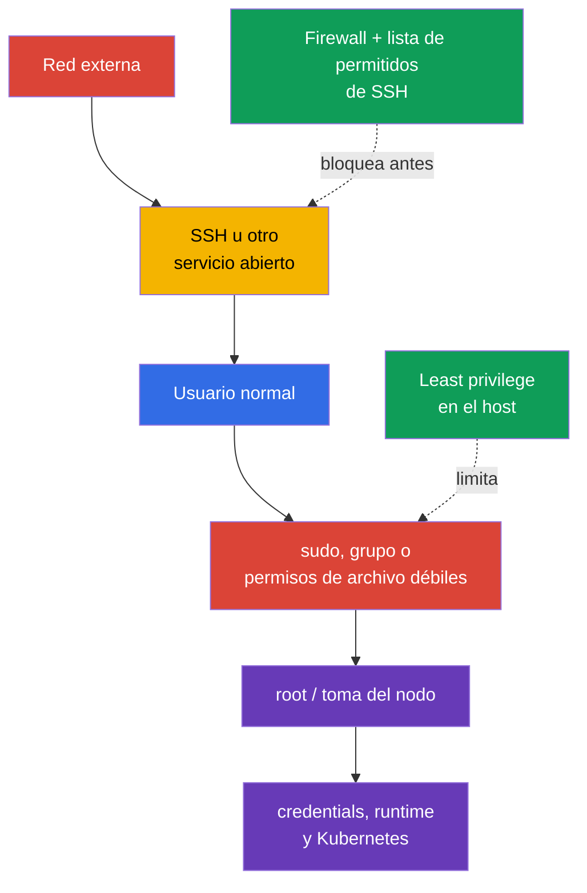
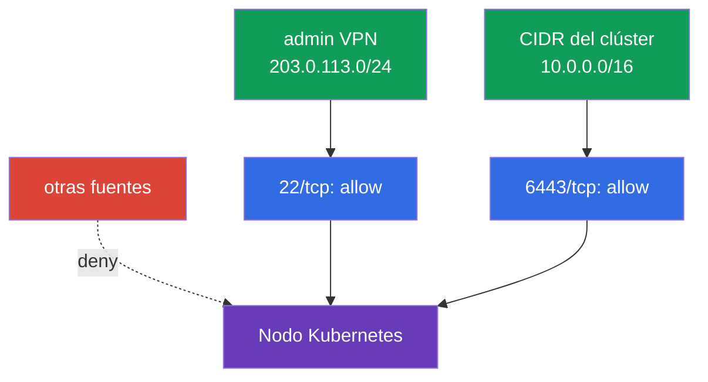

[Русская версия](ru.md) · [Eng version](README.md) · [Version française](fr.md) · [Deutsche Version](de.md) · [ქართული ვერსია](ge.md) · [繁體中文版](tw.md) · [日本語版](jp.md)

# Capítulo 15. Least privilege en el host y reducción del acceso externo a la red

> **El problema.** Tras entrar mediante SSH abierto o una cuenta local, el atacante busca
> `sudo` amplio, un grupo privilegiado o un archivo de configuración writable. Uno de estos
> errores le permite convertirse en root, leer kubelet credentials o acceder a un runtime
> socket, transformando un acceso limitado al nodo en la toma de este y de Kubernetes.

> **Qué sigue.** En el capítulo 14 redujimos la superficie de ataque del nodo: eliminamos
> servicios y paquetes innecesarios, y el acceso inseguro a container runtime. Ahora
> limitaremos las consecuencias del punto de entrada restante: quién puede entrar al host,
> qué puede hacer un usuario mediante `sudo`, qué archivos puede leer o modificar y desde
> dónde es accesible el nodo. Es el dominio **System Hardening** de CKS.

> **Lo que debes saber de CKA.** Los usuarios, grupos, permisos de archivos, procesos,
> systemd y comandos de red básicos se tratan en el [capítulo Linux de CKA](../../../cka/course/00-5-linux/es.md).
> Aquí no repetimos los fundamentos, sino que los aplicamos para proteger un nodo Kubernetes.

## 15.1. Modelo de amenazas: un acceso adicional se convierte en la toma del nodo

Un nodo Kubernetes contiene datos y puntos de control muy valiosos: kubelet credentials,
`kubeconfig`, claves PKI, manifests de control plane, sockets de container runtime y logs.
Un usuario que puede leer un archivo secreto, cambiar la configuración o ejecutar un comando
como `root` puede obtener acceso más amplio que su rol inicial. SSH abierto o un puerto
innecesario da al atacante la posibilidad de iniciar esta cadena desde el exterior.



Least privilege no significa «no dar nada a nadie», sino conceder solo el acceso necesario,
durante el tiempo necesario y con posibilidad de auditoría. Para un nodo hay varias capas
independientes: identity local, `sudo` limitado, propietarios y modos de archivos, firewall
y SSH. Ninguna de ellas sustituye a las demás.

Antes de cambiar un nodo en funcionamiento, asegúrate de tener acceso de emergencia por la
consola del proveedor o mediante una segunda sesión SSH. Un error en `sudoers`, firewall o
`sshd_config` puede dejarte sin acceso administrativo.

> 🧠 La toma del nodo es una cadena de entrada externa, identity local, `sudo`, permisos de archivos y runtime sockets; least privilege en el host no sustituye Kubernetes RBAC.

> 🎯 Usa usuarios separados, los mínimos grupos, `sudo` estrecho y auditado, y owner/mode precisos; comprueba los effective permissions del usuario objetivo y los directorios padre writable.

## 15.2. Usuarios, grupos y `sudo`: conceder solo el acceso necesario, no acceso root completo

No uses una única cuenta compartida ni trabajes siempre como `root`. Cada operador debe tener
un usuario individual: esto permite revocar el acceso de una sola persona y asociar una acción
con la entrada de `auth.log` o journald.

```bash
# Inventario de usuarios y grupos locales.
USER_TO_REVIEW='user-to-review'
SERVICE_USER='service-user'
getent passwd
getent group
id "$USER_TO_REVIEW"
groups "$USER_TO_REVIEW"

# Prohibir password authentication a una cuenta interactiva sin usar.
sudo usermod --lock "$USER_TO_REVIEW"

# Desactivar aparte la account para nuevos login (usermod --lock bloquea solo el
# password hash, no toda la Linux-account).
sudo usermod --expiredate 1 "$USER_TO_REVIEW"

# Comprobar el estado.
sudo passwd -S "$USER_TO_REVIEW"
sudo chage -l "$USER_TO_REVIEW"

sudo usermod --shell /usr/sbin/nologin "$SERVICE_USER"
```

La expiración de la account y el password lock no terminan procesos/sesiones ya existentes.
Para revocar acceso inmediatamente, comprueba por separado las sessions activas, SSH keys,
grupos privilegiados y la fuente IAM/SSO centralizada, y termina el acceso conforme al
procedimiento aprobado de incident/offboarding.

Para una service account, no apliques la expiración de account mecánicamente si el servicio
debe seguir iniciándose. Normalmente se prohíbe por separado el interactive shell mediante
`nologin` y se minimizan grupos/permissions.

Las cuentas de servicio no necesitan shell interactivo ni pertenencia a grupos
administrativos. Crea un directorio home o de state solo si el servicio lo necesita, con
owner/mode mínimos. Comprueba también los grupos que de hecho implican escalación amplia:
`sudo`, `wheel`, `docker`, `lxd` y, en el sistema concreto, los grupos propietarios de
sockets de container runtime. La pertenencia a uno de estos grupos no debe darse «por
comodidad».

### `sudo`: conjunto mínimo de comandos

La regla `user ALL=(ALL) ALL` es cómoda, pero proporciona root completo. Si el operador
necesita una operación, permite un comando específico y sus argumentos fijos en un archivo
independiente de `/etc/sudoers.d/`. Edítalo mediante `visudo`, pero no le atribuyas protección
adicional: con `visudo -f <ruta-alternativa>`, owner y permissions no se comprueban
automáticamente sin `-O` y `-P` explícitos. Tras crearlo, asigna manualmente `root:root` y
`0440`, y valida toda la policy mediante `visudo -cf /etc/sudoers` (comprobar solo un archivo
include no basta).

```bash
# Resuelve la ruta mediante un PATH de sistema predecible, sin suponer una ruta fija de systemctl.
SYSTEMCTL_PATH="$(env -i PATH=/usr/sbin:/usr/bin:/sbin:/bin sh -c 'command -v systemctl')"
test -n "$SYSTEMCTL_PATH" && SYSTEMCTL_PATH="$(readlink -f -- "$SYSTEMCTL_PATH")"
sudo test -x "$SYSTEMCTL_PATH"
sudo stat -c '%U:%G %a %n' "$SYSTEMCTL_PATH"  # se esperan root:root y ausencia de escritura de otros
```

Es más fiable no conceder `systemctl` directamente: incluso una correspondencia estrecha de
argumentos se puede ampliar mediante una modificación errónea. Crea un wrapper propiedad de
root sin argumentos; invoca **exactamente** la ruta permitida arriba y siempre desactiva el
pager. Antes de crearlo, comprueba que `/usr/local/sbin` pertenece a root y no permite la
escritura a usuarios sin privilegios.

```bash
sudo tee /usr/local/sbin/k8s-kubelet-status >/dev/null <<'EOF'
#!/bin/sh
PATH=/usr/sbin:/usr/bin:/sbin:/bin
SYSTEMCTL_PATH="$(command -v systemctl)" || exit 1
exec "$SYSTEMCTL_PATH" --no-pager status kubelet
EOF
sudo chown root:root /usr/local/sbin/k8s-kubelet-status
sudo chmod 0755 /usr/local/sbin/k8s-kubelet-status
sudo visudo -f /etc/sudoers.d/k8s-operator
sudo chown root:root /etc/sudoers.d/k8s-operator
sudo chmod 0440 /etc/sudoers.d/k8s-operator
sudo visudo -c -O -P -f /etc/sudoers.d/k8s-operator
sudo visudo -cf /etc/sudoers
```

```sudoers
# /etc/sudoers.d/k8s-operator - wrapper exacto, sin wildcard ni argumentos.
# Las comillas vacías son la especificación de argumentos «solo sin argumentos»; si faltaran,
# se permitiría ejecutar esta ruta con cualquier argumento.
Cmnd_Alias KUBELET_STATUS = /usr/local/sbin/k8s-kubelet-status ""
k8s-operator ALL=(root) KUBELET_STATUS
```

Comprueba la policy resultante específicamente para el usuario objetivo. No conviertas un
error de `sudo`/autenticación en un «denial esperado» mediante `|| echo`: primero debe
obtenerse correctamente el listado completo de policy, y la ausencia de `/bin/bash` y otros
comandos innecesarios se comprueba en su salida guardada.

```bash
policy=$(sudo -l -U k8s-operator) || {
  echo 'ERROR: cannot retrieve sudo policy for k8s-operator' >&2; exit 2;
}
printf '%s\n' "$policy" | tee /tmp/k8s-operator-sudo-policy.txt
# Revisión: solo se permite /usr/local/sbin/k8s-kubelet-status sin argumentos;
# /bin/bash, shell/interpreter y systemctl arbitrario están ausentes.
```

No intentes limitar un programa peligroso con una lista superficial de argumentos. Un editor,
intérprete, `systemctl edit`, comandos que permiten indicar una ruta arbitraria y `kubectl`
con un kubeconfig administrativo a menudo permiten sortear una regla aparentemente estrecha
y obtener root o acceso al clúster. Si no se puede describir un conjunto seguro de argumentos,
es mejor proporcionar un procedimiento break-glass controlado y registrado que una falsa
sensación de restricción.

Para todas las acciones administrativas es útil conservar trazas. Event/command logging e
I/O logging son mecanismos sudoers distintos: `logfile` especifica el file destination del
event log, mientras `log_input`/`log_output` o command tags `LOG_INPUT`/`LOG_OUTPUT`
registran la entrada/salida en la location de `iolog_*` o en `log_servers`.

```bash
# Inventario de ajustes sudoers para command/I/O logging.
sudo grep -REns \
  '(^|[[:space:],])((logfile|log_input|log_output|iolog_dir|iolog_file|log_servers)([=[:space:],]|$)|LOG_INPUT|LOG_OUTPUT)' \
  /etc/sudoers /etc/sudoers.d 2>/dev/null || true

# Comprobar los sudo events recientes efectivos.
# El journal/syslog/logfile concreto depende de la policy y de la distribución.
sudo journalctl _COMM=sudo --since '1 day ago'
```

Si sudoers define `logfile`, comprueba también ese archivo. Si están activados `log_input` /
`log_output` o command tags `LOG_INPUT` / `LOG_OUTPUT`, comprueba por separado `iolog_dir`
y la posibilidad de leer la grabación mediante `sudoreplay`. Un resultado vacío de un
`journalctl` no demuestra que no haya logging: el destination depende de sudoers/syslog y de
la configuración del SO.

`NOPASSWD` no demuestra por sí mismo que haya una vulneración, pero reduce la protección
frente al uso no autorizado de una sesión ya abierta. Úsalo solo para una lista corta y
comprobada de comandos no interactivos cuando la automatización lo requiera.

## 15.3. Permisos y propiedad de archivos: proteger credentials y configuración

Los permisos POSIX determinan quién puede leer (`r`), modificar (`w`) y recorrer un
directorio (`x`). La propiedad y el modo deben corresponder al propósito del archivo: una
private key secreta no puede ser legible por usuarios normales, y no deben poder modificar
la configuración de control plane. Comprueba no solo el archivo, sino todos los directorios
de su ruta: permiso de escritura en un directorio padre permite sustituir el contenido.

```bash
# Modo, propietario y ruta completa al archivo.
stat -c '%A %a %U:%G %n' /etc/kubernetes/admin.conf
namei -l /etc/kubernetes/admin.conf

# Buscar archivos world-writable en un área sensible; el sticky bit se excluye aparte.
sudo find /etc/kubernetes -xdev -type f -perm -0002 -ls
sudo find /etc/kubernetes -xdev -type d -perm -0002 -ls
```

Para un nodo kubeadm autogestionado, comprueba al menos lo siguiente. Los propietarios exactos
dependen de la distribución y del método de instalación, por lo que primero registra el
estado inicial y contrástalo con la documentación de tu versión Kubernetes/CIS, en vez de
aplicar una plantilla a ciegas.

| Objeto | Riesgo con permisos débiles | Dirección segura |
|---|---|---|
| `/etc/kubernetes/pki/*.key` | robo de CA o de private key de cliente | `root:root`, solo lectura por root, normalmente `600` |
| `/etc/kubernetes/admin.conf` | el usuario obtiene una credential cluster-admin | `root:root`, modo `600`; no copiar a directorios compartidos |
| `/etc/kubernetes/manifests/` | sustitución de static Pod de control plane | directorio y YAML escribibles solo por root |
| `/var/lib/kubelet/config.yaml` y kubelet credentials | cambiar el comportamiento de kubelet o robar node identity | propietario root, sin escritura de usuarios sin privilegios |
| `~/.ssh/authorized_keys` | añadir una SSH key ajena | directorio `.ssh` `700`, `authorized_keys` `600`, propietario del usuario |

Ejemplo de corrección específica de un archivo que debe estar cerrado a otros usuarios:

```bash
sudo chown root:root /etc/kubernetes/admin.conf
sudo chmod 600 /etc/kubernetes/admin.conf
sudo stat -c '%U %G %a %n' /etc/kubernetes/admin.conf
```

No hagas un `chmod -R 600` recursivo sobre todo `/etc/kubernetes`: los directorios necesitan
el bit `x`, y algunos certificados públicos y configuraciones pueden tener otro modo esperado.
Esta «corrección» puede romper kubelet o un static Pod. Cambia un objeto concreto después de
comprobar el propietario, el propósito y el consumidor efectivo.

Comprueba aparte los binarios SUID/SGID: se ejecutan con los permisos del propietario o del
grupo y aumentan las consecuencias de un error. No elimines archivos SUID del sistema usando
una lista de Internet: primero determina a qué paquete pertenecen y si se necesitan en el
nodo.

```bash
set -euo pipefail
BINARY_PATH='/path/to/reviewed-binary'
# Inventaría por separado cada filesystem local seleccionado: `find / -xdev` omitiría /usr, /var, /opt, etc.
findmnt -rn -o TARGET,FSTYPE |
while IFS=' ' read -r target fstype; do
  case "$fstype" in
    proc|sysfs|devtmpfs|devpts|tmpfs|cgroup|cgroup2|overlay|squashfs|nfs|nfs4|cifs|fuse.*|autofs|nsfs|mqueue|hugetlbfs|rpc_pipefs)
      continue
      ;;
  esac
  sudo find "$target" -xdev -type f -perm /6000 -printf '%m %u:%g %p\n' 2>/dev/null
done | LC_ALL=C sort -u

# La propiedad de paquete depende de la distribución; un archivo sin propietario requiere revisar la procedencia.
if command -v dpkg-query >/dev/null 2>&1; then
  sudo dpkg-query -S "$BINARY_PATH" || {
    echo 'REVIEW_REQUIRED: no Debian package owns this binary; review its provenance' >&2
    exit 2
  }
elif command -v rpm >/dev/null 2>&1; then
  sudo rpm -qf "$BINARY_PATH" || {
    echo 'REVIEW_REQUIRED: no RPM package owns this binary; review its provenance' >&2
    exit 2
  }
else
  echo 'REVIEW_REQUIRED: package manager is unknown' >&2
  exit 2
fi
```

> 🎯 Elabora una matriz de flujos y una allowlist, conserva una segunda vía de acceso, aplica deny-by-default y comprueba los segmentos permitido y prohibido.

## 15.4. Firewall: solo los puertos necesarios son accesibles a fuentes externas

El firewall debe partir de deny-by-default y reglas allow explícitas. Un nodo no tiene por
qué ser accesible desde toda la red solo por participar en el clúster. Permite SSH solo desde
la red administrativa, y los puertos Kubernetes solo entre las fuentes acordadas de control
plane, worker y monitoring. La lista completa de puertos depende de la topología, CNI y los
componentes; primero recoge los listeners y requisitos efectivos de tu instalación.

```bash
sudo ss -lntup
sudo ss -lntup | grep -E ':(22|6443|10250|10256|10257|10259|2379|2380)\b' || true
```

| Puerto | Uso habitual | Quién debe tener acceso |
|---|---|---|
| `22/tcp` | SSH | solo bastion/VPN/CIDR administrativo |
| `6443/tcp` | kube-apiserver | worker/control-plane y administradores permitidos |
| `10250/tcp` | kubelet API protegido | control plane y monitoring necesario, no Internet |
| `10256/tcp` | kube-proxy healthz | solo fuentes de health-check/monitoring designadas, si el puerto no es solo loopback |
| `10257/tcp` | kube-controller-manager | control-plane/monitoring solo si es necesario y no desde Internet |
| `10259/tcp` | kube-scheduler | control-plane/monitoring solo si es necesario y no desde Internet |
| `2379-2380/tcp` | etcd client/peer | solo control-plane/etcd peers |
| `30000-32767/tcp`, `30000-32767/udp` (default) | NodePort | solo CIDR de clientes/LB que necesiten Service publicados; el rango efectivo se contrasta con `--service-node-port-range` de API server |
| puertos CNI (variables) | tráfico overlay, node-to-node y Pod | exactamente los CIDR y protocolos de la documentación del CNI elegido |

No mezcles tres gestores de reglas sin entender el backend. `ufw` es un wrapper de alto
nivel, y los `iptables` modernos a menudo funcionan sobre `nf_tables`; modificar en paralelo
`ufw`, `iptables` y `nftables` dificulta la auditoría y puede sobrescribir reglas esperadas.
Elige una herramienta admitida por la imagen del nodo y el sistema de gestión de
configuración, y hazla la única fuente de verdad.

> 🔬 No hace falta memorizar todas las implementaciones; es importante entender y saber aplicar un host firewall control en el entorno disponible. A continuación, `ufw`, `iptables` y `nftables` como backend alternativos.

### Opción A: `ufw`

**Antes de `default deny`, prepara una allowlist según la topología real:** bastion/VPN,
control-plane, worker, etcd, load balancer, monitoring, CIDR Pod/Service y precisamente tu
CNI. Añade todos los roles necesarios, NodePort y puertos CNI de la matriz; no se pueden
adivinar mediante una regla universal. Conserva la sesión SSH actual, abre una segunda sesión
independiente y antes de activar enforcement comprueba la dirección de origen, las reglas
futuras (`ufw status numbered`) y la out-of-band console. Comprueba aparte el tráfico
forwarded/routed: CNI y Pod traffic suelen requerir forwarding IPv4/IPv6 y reglas `ufw route`;
un solo par de `ufw allow ... to any port ...` no basta. Contrasta `DEFAULT_FORWARD_POLICY`,
`net.ipv4.ip_forward`, forwarding IPv6 y los flujos CNI-specific; de lo contrario SSH/API
seguirán activos, pero Pod networking se romperá. Tras activarlo, no cierres la sesión
conservada hasta confirmar un nuevo acceso SSH y el funcionamiento de kubelet/API desde las
redes permitidas.

```bash
# Ejemplo: SSH solo se permite desde la red administrativa.
sudo ufw allow from 203.0.113.0/24 to any port 22 proto tcp

# Ejemplo: la API solo es accesible desde la red de nodos y administradores.
sudo ufw allow from 10.0.0.0/16 to any port 6443 proto tcp
# Antes de este punto, añade las reglas allow específicas de rol y CNI de tu instalación.
sudo ufw default deny incoming
sudo ufw default allow outgoing
sudo ufw enable
sudo ufw status numbered
```

Antes de eliminar una regla, revisa su número y propósito; después elimínala de forma
dirigida:

```bash
RULE_NUMBER='1'
sudo ufw status numbered
sudo ufw delete "$RULE_NUMBER"
```

### Opción B: `iptables`

En el ejemplo de formación con `iptables`, permitimos tráfico established, loopback, SSH
desde la allowlist y después prohibimos el resto del tráfico entrante. En un clúster real,
añade todos los flujos Kubernetes/CNI documentados antes de establecer `DROP`; de lo
contrario puedes cortar la conectividad entre nodos o Pod networking. Comprueba aparte las
cadenas `FORWARD`, IPv4 e IPv6: CNI puede enrutar Pod traffic no mediante `INPUT`, y un
`DROP` final en `INPUT` no crea una policy de forwarding segura ni sustituye CNI-specific
rules.

```bash
sudo iptables -A INPUT -m conntrack --ctstate ESTABLISHED,RELATED -j ACCEPT
sudo iptables -A INPUT -i lo -j ACCEPT
sudo iptables -A INPUT -p tcp -s 203.0.113.0/24 --dport 22 -j ACCEPT
sudo iptables -A INPUT -p tcp -s 10.0.0.0/16 --dport 6443 -j ACCEPT
sudo iptables -A INPUT -j DROP
sudo iptables -S INPUT
```

`-A` añade reglas al final de la cadena: si una regla existente superior ya acepta tráfico,
el `DROP` final no garantiza deny-by-default. Estas reglas IPv4 tampoco cubren IPv6. Primero
revisa el orden de todo el ruleset; para una policy persistente, gestiona una cadena dedicada
con un jump explícito o usa `nftables` con una policy explícita; no mezcles reglas append
manuales con las reglas de CNI o de un firewall manager.

Las reglas añadidas mediante comando no siempre sobreviven a un reinicio. Guárdalas con el
mecanismo habitual de la distribución o mediante configuración declarativa; no supongas que
la salida de `iptables -S` sea por sí sola una capa de persistence.

### Opción C: `nftables`

`nftables` es el mecanismo moderno del kernel. Hace más sencillo establecer explícitamente
una policy y ver todo el ruleset con un comando. No apliques el ejemplo en un nodo donde CNI
o un firewall manager ya haya creado sus tablas sin revisar el ruleset existente.

```nft
# /etc/nftables.conf: fragmento de una tabla independiente para host ingress
 table inet host_filter {
   chain input {
     type filter hook input priority filter; policy drop;
     ct state established,related accept
     iifname "lo" accept
     ip saddr 203.0.113.0/24 tcp dport 22 accept
     ip saddr 10.0.0.0/16 tcp dport 6443 accept
   }
 }
```

Comprueba la sintaxis antes de cargarla y después revisa las reglas realmente activas:

```bash
sudo nft -c -f /etc/nftables.conf
sudo systemctl reload nftables
sudo nft list ruleset
```



Host firewall complementa, pero no sustituye cloud Security Group, private endpoint,
enrutamiento ni Kubernetes NetworkPolicy. NetworkPolicy gestiona principalmente tráfico Pod,
mientras el firewall del nodo gestiona host traffic; comprueba el límite de responsabilidad de
tu CNI y tu red cloud.

> 🏭 Node role recibe solo sus permissions de bootstrap, red, storage y telemetry; workload utiliza una workload identity independiente y mínima.

## 15.4.1. Cloud/node IAM: un rol mínimo e independiente para workload

Least privilege se extiende al cloud IAM. El node/instance role no debe recibir broad
cloud-admin permissions solo porque Kubernetes se ejecute en el nodo; concédele únicamente
los permisos de bootstrap, red, storage y telemetry que necesite ese rol. Workload no debe
heredar automáticamente credentials de node role: usa workload identity, IRSA o un análogo
con una cloud-role mínima independiente para el ServiceAccount concreto. Donde la plataforma
lo admita, limita el acceso del Pod a instance metadata y node credentials. La revisión de
cloud-role se realiza por separado de Kubernetes RBAC: tener una RoleBinding mínima no prueba
que los permisos cloud sean mínimos.

## 15.5. SSH hardening: proteger la vía principal de administración

SSH suele ser la única entrada remota al nodo. Prefiere una cuenta de usuario administrativo
independiente y keys en vez de passwords. El login directo de `root` simplifica brute force y
elimina la identity individual de los logs.

> 🎯 Confirma la key y el acceso alternativo, prohíbe root/password login y comprueba `sshd -t`, `sshd -T` y el acceso del usuario permitido.

En OpenSSH moderno es conveniente crear un drop-in pequeño en lugar de editar el gran archivo
de vendor. Primero comprueba que tu configuración incluye el directorio mediante `Include`.
Los archivos wildcard-`Include` se procesan en lexical order y, para la mayoría de scalar
keywords normales, OpenSSH usa el primer valor recibido, por lo que el nombre
`99-hardening.conf` no garantiza prioridad y para estos parámetros suele hacer falta un
archivo intencionalmente temprano.

Pero no traslades este modelo a list directives. `AllowUsers`, `AllowGroups`, `DenyUsers` y
`DenyGroups` pueden aparecer varias veces, y cada occurrence **se añade** a la lista
correspondiente. Un `00-hardening.conf` temprano no anula otro `AllowUsers`. Antes de usar
`AllowUsers`, inventaría todas sus occurrences en el `sshd_config` principal y los archivos
incluidos, elimina o combina las listas en conflicto en una allowlist gestionada y después
comprueba el resultado mediante `sshd -T` y, si hay `Match`,
`sshd -T -C user=...,host=...,addr=...`. Elige **un** perfil de los siguientes: ambos
prohíben el login por password, pero el perfil MFA requiere además key y PAM
keyboard-interactive. No actives los dos perfiles a la vez.

```bash
sudo grep -RnsE \
  '^[[:space:]]*(Include|Match|AllowUsers|AllowGroups|DenyUsers|DenyGroups)[[:space:]]' \
  /etc/ssh/sshd_config /etc/ssh/sshd_config.d 2>/dev/null || true
```

**Perfil A - solo key.**

```bash
sudo install -d -o root -g root -m 0755 /etc/ssh/sshd_config.d
sudo tee /etc/ssh/sshd_config.d/00-hardening.conf >/dev/null <<'EOF'
PermitRootLogin no
PasswordAuthentication no
KbdInteractiveAuthentication no
PubkeyAuthentication yes
AllowUsers k8s-operator
EOF
sudo chown root:root /etc/ssh/sshd_config.d/00-hardening.conf
sudo chmod 0600 /etc/ssh/sshd_config.d/00-hardening.conf
sudo stat -c '%U:%G %a %n' \
  /etc/ssh/sshd_config.d /etc/ssh/sshd_config.d/00-hardening.conf

SSHD_UNIT="$(
  systemctl list-unit-files --type=service --no-legend \
    | awk '$1 == "ssh.service" || $1 == "sshd.service" { print $1; exit }'
)"
test -n "$SSHD_UNIT" || {
  echo 'ERROR: ssh.service/sshd.service was not found' >&2
  exit 1
}

sudo sshd -t
sudo systemctl reload "$SSHD_UNIT"
```

**Perfil B - key + MFA mediante PAM keyboard-interactive.** Úsalo solo después de configurar
y comprobar el módulo MFA de PAM; `AuthenticationMethods` exige ambos factores, no sustituye
la key por un código de un solo uso.

```text
PermitRootLogin no
PasswordAuthentication no
PubkeyAuthentication yes
KbdInteractiveAuthentication yes
UsePAM yes
AuthenticationMethods publickey,keyboard-interactive:pam
AllowUsers k8s-operator
```

Guarda el perfil B en el mismo `/etc/ssh/sshd_config.d/00-hardening.conf`; aplica el **mismo**
invariant de owner/mode, y después compruébalo antes de `sshd -t` y de recargar el OpenSSH
server unit efectivo (`ssh.service` en Debian/Ubuntu o `sshd.service` en muchos sistemas de
la familia RHEL):

```bash
sudo install -d -o root -g root -m 0755 /etc/ssh/sshd_config.d
sudo chown root:root /etc/ssh/sshd_config.d/00-hardening.conf
sudo chmod 0600 /etc/ssh/sshd_config.d/00-hardening.conf
sudo stat -c '%U:%G %a %n' \
  /etc/ssh/sshd_config.d /etc/ssh/sshd_config.d/00-hardening.conf
sudo sshd -t
# Determina ssh.service/sshd.service con el mismo método distro-aware que en el Perfil A y luego recárgalo.
```

No fijes un único nombre de unit como universal para todas las distribuciones Linux.
`AllowUsers` es una restricción potente, pero bloquea a todos los usuarios no indicados. No
la apliques hasta haber añadido las cuentas necesarias de break-glass y automation; documenta
los propietarios y revisa la lista.

Antes de cerrar la sesión SSH actual, comprueba los valores resultantes y entra con una
segunda sesión como el usuario permitido. Para el perfil A usa solo key; para B comprueba
key y MFA:

```bash
sudo sshd -T | grep -E 'permitrootlogin|passwordauthentication|kbdinteractiveauthentication|pubkeyauthentication|usepam|authenticationmethods|allowusers'
NODE_ADDRESS='node-address.example.internal'
# Perfil A (solo key): la comprobación es no interactiva y no debe solicitar password/MFA.
ssh -o BatchMode=yes -o PreferredAuthentications=publickey \
  -o PasswordAuthentication=no -o KbdInteractiveAuthentication=no \
  "k8s-operator@${NODE_ADDRESS}" id

# Perfil B (key + MFA): no uses BatchMode; completa el prompt del segundo factor.
ssh -o PreferredAuthentications=publickey,keyboard-interactive \
  -o PasswordAuthentication=no -o KbdInteractiveAuthentication=yes \
  "k8s-operator@${NODE_ADDRESS}" id
```

Comprueba aparte que el `allowusers` resultante contenga **solo** las cuentas aprobadas,
incluidas las identities necesarias de break-glass/automation, no valores adicionales de otro
`Include`. Con `Match`, comprueba la effective configuration para cada user/source relevante
mediante `sshd -T -C`.

No desactives password authentication hasta comprobar que la key del usuario objetivo esté
realmente instalada, tenga los permisos correctos y funcione mediante bastion/VPN. Para acceso
de emergencia, usa la consola del proveedor o una cuenta break-glass formalizada y controlada,
no un root password permanente.

## 15.6. Comprobación y diagnóstico: demostrar que la protección funciona

La comprobación debe confirmar el comportamiento efectivo, no solo la presencia de una línea
en un archivo. Realiza pruebas de red desde segmentos permitidos y prohibidos, y las
comprobaciones de `sudo` como un usuario sin privilegios. No uses comandos destructive en un
nodo de production ni elimines reglas activas sin un plan de rollback.

```bash
# 1. Comprobar propietarios y modos de archivos sensibles.
sudo stat -c '%U %G %a %n' \
  /etc/kubernetes/admin.conf \
  /etc/kubernetes/pki/ca.key

# 2. Obtener la policy sin mezclarla con la autenticación del usuario. Si sudo -l
# falla, es un error operational, no una prueba de policy denial.
policy=$(sudo -l -U k8s-operator) || {
  echo 'ERROR: cannot retrieve sudo policy for k8s-operator' >&2; exit 2;
}
printf '%s\n' "$policy" | tee /tmp/k8s-operator-sudo-policy.txt
# Listado de revisión: solo se permite el wrapper sin argumentos; /bin/bash está ausente.

# 3. Comprobar el firewall efectivo del mecanismo elegido.
sudo ufw status verbose             # si se usa ufw
sudo iptables -S INPUT               # si se usa iptables
sudo nft list ruleset                # si se usa nftables

# 4. Comprobar listeners en el propio nodo.
sudo ss -lntup

# 5. Comprobar sintaxis y configuración SSH resultante.
sudo sshd -t
sudo sshd -T | grep -E 'permitrootlogin|passwordauthentication|pubkeyauthentication'
```

Desde un host que no esté en la allowlist, comprueba solo el denial o timeout esperado; desde
la red permitida, comprueba el acceso SSH/API correcto en el alcance que necesita el rol. La
comprobación de autenticación SSH y la comprobación de authorization/authentication de `sudo`
son independientes: un password prompt de `sudo` sin TTY no prueba un error de SSH ni de
sudo policy.

```bash
# Desde un host fuera del CIDR permitido: la conexión no debe establecerse.
NODE_ADDRESS='node-address.example.internal'
nc -vz -w 3 "$NODE_ADDRESS" 22

# Prueba de login SSH, Perfil A: solo key y no interactiva.
ssh -o BatchMode=yes -o PreferredAuthentications=publickey \
  -o PasswordAuthentication=no -o KbdInteractiveAuthentication=no \
  "k8s-operator@${NODE_ADDRESS}" id

# Prueba de login SSH, Perfil B: completa publickey + keyboard-interactive MFA; sin BatchMode.
ssh -o PreferredAuthentications=publickey,keyboard-interactive \
  -o PasswordAuthentication=no -o KbdInteractiveAuthentication=yes \
  "k8s-operator@${NODE_ADDRESS}" id

# Ejecuta esto por separado desde una terminal administrativa interactiva cuando la sudo policy requiera password.
ssh -t "k8s-operator@${NODE_ADDRESS}" 'sudo -l'
# O prueba un wrapper específico permitido:
# ssh -t "k8s-operator@${NODE_ADDRESS}" 'sudo /usr/local/sbin/k8s-kubelet-status'

# Úsalo solo si NOPASSWD es un requisito de policy explícito para el comando/listado comprobado.
ssh -o BatchMode=yes "k8s-operator@${NODE_ADDRESS}" 'sudo -n -l'
```

| Síntoma | Causa probable | Qué comprobar |
|---|---|---|
| SSH no está accesible tras firewall | fuente/puerto no permitido u orden de reglas incorrecto | console access, `ufw status numbered`, `iptables -S`, `nft list ruleset` |
| Kubelet deja de comunicarse con API | firewall cerró `6443` o la ruta entre nodos | `journalctl -u kubelet`, allowlist, Security Group, DNS/ruta |
| `sudo` permite más de lo esperado | regla amplia, pertenencia a otro grupo, comando peligroso permitido | `sudo -l -U <user>`, `id <user>`, todos los `/etc/sudoers.d/*` |
| No hay login tras SSH hardening | key no accesible, drop-in no incluido, `AllowUsers` demasiado estrecho | `sshd -t`, `sshd -T`, permisos de `~/.ssh`, console access |
| El componente Kubernetes no arranca tras `chmod` | cambiaron permisos de directorio/archivo y desaparecieron permisos runtime necesarios | `journalctl -u kubelet`, `crictl ps -a`, `namei -l` |

> 🏭 Gestiona host identities, `sudoers`, firewall y SSH como código: propietario, plazo, registro, rollback, role-specific allowlist y drift checks periódicos.

## 15.7. Cómo se aplica en production

- **Lifecycle de identity.** Las cuentas locales se crean mediante gestión IAM/CMDB/de
  configuración; se conoce el propietario y el plazo de acceso, y los empleados que se van
  se bloquean inmediatamente. No se utiliza una shared root account permanente.
- **Privilegios como código.** Los archivos `sudoers`, grupos y propietarios de rutas
  sensibles se describen en Ansible, image pipeline u otra herramienta IaC. Esto evita el
  drift y permite code review.
- **Firewall por roles de nodo.** Control-plane, worker, bastion y monitoring tienen
  allowlists diferentes. Las reglas se construyen según la matriz de flujos real, incluidos
  CNI y health checks, y se prueban en staging antes del despliegue.
- **SSH sin atajos.** Se usan SSH certificates de corta duración o acceso centralizado por
  bastion/VPN, MFA y auditoría. Password login y root login permanecen desactivados, y el
  acceso break-glass tiene un responsable y un procedimiento de revisión.
- **Comprobación continua.** El escaneo CIS del [capítulo 07](../07/es.md), file-integrity
  monitoring, la búsqueda de rutas world-writable y el control de puertos abiertos se ejecutan
  regularmente, no solo antes de una auditoría.
- Para Kubernetes v1.37, evalúa aparte la arquitectura rootless del nodo
  (`KubeletInUserNamespace`) como límite adicional de least privilege; no es lo mismo que Pod
  user namespaces. Consulta [Kubernetes v1.37 Security Delta](../APPENDIX_K8S_137_SECURITY_DELTA_ES.md).

## 15.8. Miniglosario

- **least privilege** - concesión solo de los permisos mínimos que el sujeto necesita para
  su tarea, durante un plazo limitado.
- **`sudoers`** - policy que define qué comandos puede ejecutar un usuario como otro
  usuario; se edita mediante `visudo`.
- **SUID/SGID** - bits especiales de archivo que ejecutan un programa con el effective UID
  del propietario o GID del grupo; requieren inventario.
- **allowlist** - lista explícita de fuentes, usuarios, puertos o acciones permitidos; todo
  lo demás se prohíbe.
- **host firewall** - reglas de filtrado en el propio nodo, por ejemplo `ufw`, `iptables` o
  `nftables`.
- **drop-in** - archivo de configuración independiente que complementa la configuración
  base, por ejemplo `/etc/ssh/sshd_config.d/00-hardening.conf`.
- **break-glass access** - acceso de emergencia controlado, usado solo durante un incidente
  o cuando se pierde la vía normal de administración.

## 15.9. Resumen del capítulo

- Usuarios independientes, grupos mínimos y `sudo` limitado reducen las consecuencias de
  comprometer una cuenta y hacen comprobables las acciones.
- Private keys, kubeconfig, manifests de static Pod y kubelet configuration requieren el
  propietario y modo correctos; un `chmod` recursivo sin entender el propósito es peligroso.
- El firewall se construye a partir de default deny y una allowlist de los flujos necesarios.
  No se deben mezclar `ufw`, `iptables` y `nftables` sin una fuente de verdad clara.
- SSH se protege con keys, `PermitRootLogin no`, desactivando password authentication y
  restringiendo los usuarios permitidos, pero solo después de comprobar una segunda vía de
  acceso.
- El resultado se demuestra con intentos reales: un comando innecesario mediante `sudo` se
  rechaza, un archivo sensible no es accesible, un puerto cerrado no responde y el acceso
  permitido funciona.

## 15.10. Cómo resulta útil: en el examen y en el trabajo real

**En el examen.** La tarea puede pedir corregir el modo de kubeconfig, sacar a un usuario de
un grupo peligroso, limitar `sudo`, cerrar un puerto mediante firewall o prohibir root SSH.
Primero lee la configuración actual, cambia solo el objeto indicado y demuestra después el
resultado con `stat`, `sudo -l`, `ss`, la salida del firewall y `sshd -t`. Para un cambio de
red, conserva primero tu propio acceso SSH.

**En el trabajo real.** La toma de un Pod o de una cuenta no debe significar automáticamente
root en el nodo y acceso a todo el clúster. Separar usuarios, proteger credentials, tener un
firewall limitado y SSH auditado transforma una vía de ataque amplia en varias barreras
independientes, cada una de las cuales se puede comprobar y automatizar regularmente.

## 15.11. Preguntas de autoevaluación

<details>
<summary>1. ¿Por qué la pertenencia a `docker` o una regla `sudo` amplia puede equivaler a root?</summary>

Un miembro del grupo `docker` puede acceder al Docker socket y crear un contenedor con acceso al host; por tanto, es root-equivalent, no un grupo de trabajo normal. La regla `user ALL=(ALL) ALL` permite ejecutar un comando arbitrario como root. Ambas vías sortean las restricciones de un usuario normal sin privilegios y requieren la misma cautela que conceder acceso root.
</details>

<details>
<summary>2. ¿Qué archivos Kubernetes del nodo es más peligroso hacer legibles o escribibles para
   un usuario normal?</summary>

Son especialmente sensibles las private keys de `/etc/kubernetes/pki/*.key` y `/etc/kubernetes/admin.conf`: leerlas puede dar CA, client key o una credential cluster-admin. Escribir en `/etc/kubernetes/manifests/` permite sustituir un static Pod de control plane. Tampoco se debe permitir a usuarios sin privilegios escribir en `/var/lib/kubelet/config.yaml` ni acceder a kubelet credentials.
</details>

<details>
<summary>3. ¿Por qué no se puede aplicar `chmod 600` recursivamente a todo `/etc/kubernetes`?</summary>

Los directorios necesitan el bit `x` para traversal, y algunos certificados públicos y configuraciones pueden tener otro modo esperado. Un `chmod -R 600` recursivo sin tener en cuenta el propósito puede romper kubelet o un static Pod. Hay que comprobar el objeto concreto, su propietario, consumidor y ruta mediante `stat` y `namei -l`, y después cambiarlo específicamente.
</details>

<details>
<summary>4. ¿Qué reglas deben añadirse antes de un firewall default deny para no perder acceso ni
   romper el clúster?</summary>

Antes de enforcement se elabora una allowlist según la topología real: bastion/VPN para SSH, control plane, worker, etcd peers, load balancer, monitoring, CIDR Pod/Service y protocolos del CNI concreto. En particular, se necesitan los flujos requeridos hacia `6443`, `10250`, `2379-2380`, health endpoints y NodePort si se usan. Se conserva la sesión SSH actual, se abre otra y se comprueban aparte forwarding/`ufw route`, IPv4/IPv6 y tráfico CNI.
</details>

<details>
<summary>5. ¿En qué se diferencian las responsabilidades de host firewall, Security Group y NetworkPolicy?</summary>

Host firewall gestiona el tráfico del propio nodo, Security Group o cloud firewall el límite de red de la infraestructura y las fuentes hacia un endpoint. NetworkPolicy es aplicada por CNI principalmente al tráfico Pod y no sustituye la protección de la vía host/control-plane en todas las topologías. Los controles se complementan entre sí, por lo que no se pueden considerar intercambiables.
</details>

<details>
<summary>6. ¿Por qué hay que abrir una segunda sesión SSH antes de desactivar password authentication?</summary>

Si la key no está instalada, sus permisos son incorrectos, el drop-in no se incluye o `AllowUsers` es demasiado estrecho, desactivar password authentication puede dejar al administrador sin acceso. Una segunda sesión independiente y una out-of-band console conservan una vía de rollback. Antes de cerrar la sesión actual hay que comprobar `sshd -t`, los valores efectivos de `sshd -T` y el login del usuario permitido mediante key.
</details>

<details>
<summary>7. ¿Qué comandos demuestran que los ajustes de SSH y firewall no solo están escritos, sino que funcionan?</summary>

La sintaxis y el resultado SSH se comprueban con `sudo sshd -t` y `sudo sshd -T | grep ...`; después se realiza un login key-only real desde una red permitida mediante `ssh -o BatchMode=yes ...`. El firewall activo se comprueba con el mecanismo elegido: `ufw status verbose`, `iptables -S INPUT` o `nft list ruleset`, y los listeners con `sudo ss -lntup`. Desde un segmento no permitido, `nc -vz -w 3 <node> 22` debe dar el denial o timeout esperado.
</details>

<details>
<summary>8. **Flashback (capítulo 10).** Este capítulo trata least privilege en el nivel de **host**
   (usuarios Linux, grupos, acceso a sockets). El capítulo 10 trata least privilege en el
   nivel de **Kubernetes API** (RBAC). Da un ejemplo concreto donde RBAC estrecho no protege
   de un ataque efectuado mediante host access excesivo (y viceversa): es decir, por qué uno
   de estos dos niveles de least privilege nunca basta por sí solo.</summary>

Un ServiceAccount puede tener una Role estrecha solo para `get pods`, pero un usuario con acceso al socket containerd/Docker o a `sudo` amplio puede obtener root en el nodo y sortear ese límite API. A la inversa, host firewall y file modes estrictos no detendrán un Pod con un ServiceAccount token robado si su RBAC permite leer Secret o crear `pods/exec`. Host y Kubernetes API limitan vías de ataque distintas, por lo que se necesitan ambas capas.
</details>

## Práctica

En el laboratorio 105 desactivarás un servicio adicional, cerrarás un puerto innecesario,
aplicarás firewall, corregirás permisos de un archivo sensible y prohibirás root SSH. En un
host Docker independiente también cerrarás Docker TCP API, protegerás `/var/run/docker.sock`
y retirarás el acceso adicional al grupo `docker`.

🧪 Lab 105 (System Hardening de SO y Docker daemon):
[tasks/cks/labs/105](../../labs/105/README_ES.MD)

## Materiales de referencia

- [CIS Kubernetes Benchmark](https://www.cisecurity.org/benchmark/kubernetes)
- [OpenSSH: sshd_config(5)](https://man.openbsd.org/sshd_config)

---
[Índice](../README_ES.md) · [Capítulo 14](../14/es.md) · [Capítulo 16](../16/es.md)
