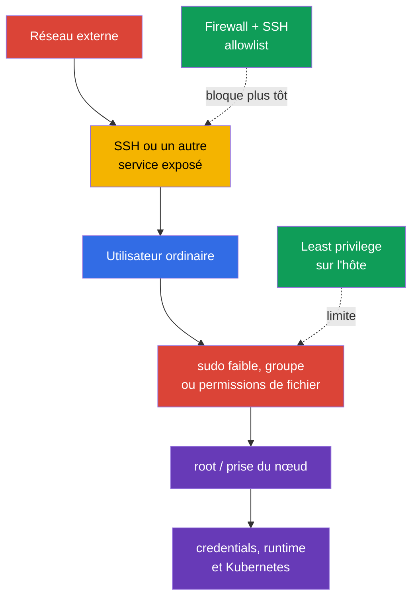
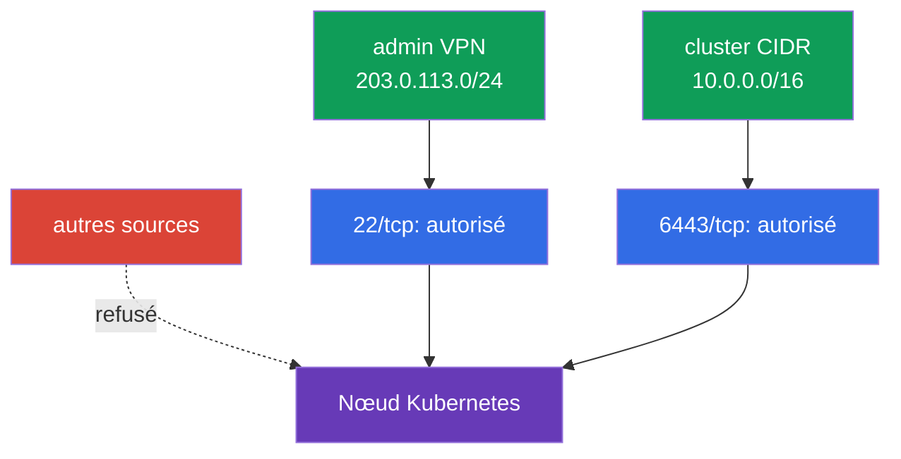

[Русская версия](ru.md) · [Eng version](README.md) · [Versión en español](es.md) · [Deutsche Version](de.md) · [ქართული ვერსია](ge.md) · [繁體中文版](tw.md) · [日本語版](jp.md)

# Chapitre 15. Least privilege sur l'hôte et réduction de l'accès réseau externe

> **Problème.** Après être entré par SSH exposé ou par un compte local, un attaquant
> recherche un `sudo` étendu, un groupe privilégié ou un fichier de configuration accessible
> en écriture. Une seule erreur de ce type permet de devenir root, de lire les credentials de
> kubelet ou d'accéder à un socket runtime, transformant un accès limité au nœud en prise de
> contrôle du nœud et de Kubernetes.

> **Ce qui suit.** Au chapitre 14, nous avons réduit la surface d'attaque du nœud : supprimé les
> services et packages superflus, ainsi que l'accès non sécurisé au container runtime. Nous allons
> maintenant limiter les conséquences du point d'entrée restant : qui peut se connecter à l'hôte,
> ce qu'un utilisateur peut faire avec `sudo`, quels fichiers il peut lire ou modifier et depuis
> où le nœud est accessible. Cela relève du domaine **System Hardening** de CKS.

> **Ce qu'il faut connaître de CKA.** Les bases des utilisateurs, groupes, permissions de fichiers,
> processus, systemd et commandes réseau sont présentées dans le [chapitre Linux de CKA](../../../cka/course/00-5-linux/fr.md).
> Ici, nous ne répétons pas les fondamentaux, mais les appliquons pour protéger un nœud Kubernetes.

## 15.1. Modèle de menace : un accès superflu suffit à compromettre un nœud

Un nœud Kubernetes détient des données et des points de contrôle de grande valeur : credentials de
kubelet, `kubeconfig`, clés PKI, manifestes du control plane, sockets du container runtime et logs.
Un utilisateur qui peut lire un fichier secret, modifier une configuration ou exécuter une commande
en tant que `root` peut obtenir un accès plus large que son rôle initial. Un SSH exposé ou un port
inutile offre à l'attaquant un moyen de démarrer cette chaîne depuis l'extérieur.



Le least privilege ne signifie pas « ne rien donner à personne ». Il consiste à accorder seulement
l'accès nécessaire, pour la durée nécessaire et avec la possibilité de l'auditer. Pour un nœud,
il s'agit de plusieurs couches indépendantes : identity locale, `sudo` étroit, propriétaires et
modes de fichiers, firewall et SSH. Aucune ne remplace les autres.

Avant de modifier un nœud en service, assurez un accès d'urgence par la console du fournisseur ou
une seconde session SSH. Une erreur dans `sudoers`, le firewall ou `sshd_config` peut vous priver
d'accès administratif.

> 🧠 La prise d'un nœud est une chaîne d'entrée externe, d'identity locale, de `sudo`, de permissions de fichiers et de runtime sockets ; le least privilege sur l'hôte ne remplace pas Kubernetes RBAC.

> 🎯 Utilisez des utilisateurs distincts, un minimum de groupes, un `sudo` étroit et audité, ainsi que des owner/mode précis ; vérifiez les permissions effectives de l'utilisateur cible et les répertoires parents accessibles en écriture.

## 15.2. Utilisateurs, groupes et `sudo` : accorder la capacité, pas le root complet

N'utilisez pas un compte partagé et ne travaillez pas en permanence en tant que `root`. Chaque
opérateur doit disposer de son propre utilisateur : cela permet de révoquer l'accès d'une seule
personne et de relier une action à son enregistrement dans `auth.log` ou journald.

```bash
# Inventaire des utilisateurs et groupes locaux.
USER_TO_REVIEW='user-to-review'
SERVICE_USER='service-user'
getent passwd
getent group
id "$USER_TO_REVIEW"
groups "$USER_TO_REVIEW"

# Désactiver password authentication pour un compte interactif inutilisé.
sudo usermod --lock "$USER_TO_REVIEW"

# Désactiver séparément le compte pour les nouvelles login (usermod --lock bloque seulement
# password hash, pas l'intégralité du Linux-account).
sudo usermod --expiredate 1 "$USER_TO_REVIEW"

# Vérifier l'état.
sudo passwd -S "$USER_TO_REVIEW"
sudo chage -l "$USER_TO_REVIEW"

sudo usermod --shell /usr/sbin/nologin "$SERVICE_USER"
```

L'expiration du compte et le verrouillage du mot de passe ne terminent pas les processus ou
sessions existants. Lorsqu'un accès doit être révoqué immédiatement, vérifiez séparément les
sessions actives, les clés SSH, les groupes privilégiés et la source IAM/SSO centralisée, puis
retirez l'accès selon la procédure d'incident/offboarding approuvée.

Pour un service account, n'appliquez pas mécaniquement l'expiration du compte si le service doit
continuer à démarrer. On lui interdit généralement séparément le shell interactif avec `nologin`
et on minimise ses groupes/permissions.

Les comptes de service n'ont pas besoin de shell interactif ni d'appartenance à des groupes
administratifs. Créez un répertoire home ou state uniquement si le service en a besoin, avec un
owner/mode minimal. Vérifiez aussi les groupes qui impliquent en pratique une large élévation :
`sudo`, `wheel`, `docker`, `lxd` et, sur le système concerné, les groupes propriétaires des
sockets de container runtime. L'appartenance à un tel groupe ne doit pas être accordée « par
commodité ».

### `sudo` : ensemble minimal de commandes

La règle `user ALL=(ALL) ALL` est pratique, mais accorde le root complet. Si un opérateur a besoin
d'une seule opération, autorisez la commande précise et ses arguments fixes dans un fichier séparé
sous `/etc/sudoers.d/`. Éditez-le avec `visudo`, mais ne lui attribuez pas une protection
supplémentaire : avec `visudo -f <chemin-alternatif>`, owner et permissions ne sont pas vérifiés
automatiquement sans `-O` et `-P` explicites. Après sa création, définissez manuellement
`root:root` et `0440`, puis validez toute la policy avec `visudo -cf /etc/sudoers` (vérifier un
seul fichier include ne suffit pas).

```bash
# Résoudre le chemin avec un PATH système prévisible au lieu de supposer un chemin systemctl fixe.
SYSTEMCTL_PATH="$(env -i PATH=/usr/sbin:/usr/bin:/sbin:/bin sh -c 'command -v systemctl')"
test -n "$SYSTEMCTL_PATH" && SYSTEMCTL_PATH="$(readlink -f -- "$SYSTEMCTL_PATH")"
sudo test -x "$SYSTEMCTL_PATH"
sudo stat -c '%U:%G %a %n' "$SYSTEMCTL_PATH"  # root:root et aucune permission d'écriture pour les autres sont attendus
```

Il est plus sûr de ne pas fournir `systemctl` directement : même une correspondance étroite des
arguments est facile à élargir par une modification erronée. Créez un wrapper appartenant à root,
sans arguments ; il appelle **exactement** le chemin autorisé ci-dessus et désactive toujours le
pager. Avant de le créer, assurez-vous que `/usr/local/sbin` appartient à root et n'est pas
accessible en écriture aux utilisateurs non privilégiés.

```bash
sudo tee /usr/local/sbin/k8s-kubelet-status >/dev/null <<'EOF'
#!/bin/sh
PATH=/usr/sbin:/usr/bin:/sbin:/bin
SYSTEMCTL_PATH="$(command -v systemctl)" || exit 1
exec "$SYSTEMCTL_PATH" --no-pager status kubelet
EOF
sudo chown root:root /usr/local/sbin/k8s-kubelet-status
sudo chmod 0755 /usr/local/sbin/k8s-kubelet-status
sudo visudo -f /etc/sudoers.d/k8s-operator
sudo chown root:root /etc/sudoers.d/k8s-operator
sudo chmod 0440 /etc/sudoers.d/k8s-operator
sudo visudo -c -O -P -f /etc/sudoers.d/k8s-operator
sudo visudo -cf /etc/sudoers
```

```sudoers
# /etc/sudoers.d/k8s-operator - wrapper précis, sans wildcard ni arguments.
# Les guillemets vides spécifient « uniquement sans arguments » ; leur absence
# autoriserait l'exécution de ce chemin avec des arguments arbitraires.
Cmnd_Alias KUBELET_STATUS = /usr/local/sbin/k8s-kubelet-status ""
k8s-operator ALL=(root) KUBELET_STATUS
```

Vérifiez la policy résultante précisément pour l'utilisateur cible. Ne transformez pas un échec
de `sudo`/d'authentification en « refusal attendu » avec `|| echo` : la listing policy complète
doit d'abord être récupérée avec succès, et l'absence de `/bin/bash` et d'autres commandes
inutiles est vérifiée dans sa sortie enregistrée.

```bash
policy=$(sudo -l -U k8s-operator) || {
  echo 'ERROR: cannot retrieve sudo policy for k8s-operator' >&2; exit 2;
}
printf '%s\n' "$policy" | tee /tmp/k8s-operator-sudo-policy.txt
# Review: seul /usr/local/sbin/k8s-kubelet-status sans arguments est autorisé ;
# /bin/bash, shell/interpreter et systemctl arbitraire sont absents.
```

N'essayez pas de restreindre un programme dangereux par une liste superficielle d'arguments. Un
éditeur, interpréteur, `systemctl edit`, des commandes pouvant recevoir un chemin arbitraire, ou
`kubectl` avec un kubeconfig administratif peuvent souvent contourner une règle apparemment
étroite et obtenir root ou l'accès au cluster. Si un ensemble d'arguments sûr ne peut être décrit,
une procédure break-glass contrôlée avec journalisation vaut mieux qu'une fausse impression de
restriction.

Il est utile de conserver des traces de chaque action administrative. La journalisation
d'événements/de commandes et la journalisation I/O sont des mécanismes sudoers différents :
`logfile` définit la destination fichier du journal d'événements, tandis que `log_input`/`log_output`
ou les command tags `LOG_INPUT`/`LOG_OUTPUT` enregistrent l'entrée/la sortie à l'emplacement de
`iolog_*` ou sur `log_servers`.

```bash
# Inventorier les réglages sudoers de journalisation des commandes/I/O.
sudo grep -REns \
  '(^|[[:space:],])((logfile|log_input|log_output|iolog_dir|iolog_file|log_servers)([=[:space:],]|$)|LOG_INPUT|LOG_OUTPUT)' \
  /etc/sudoers /etc/sudoers.d 2>/dev/null || true

# Vérifier les événements sudo récents réels.
# Le journal/syslog/logfile précis dépend de la policy et de la distribution.
sudo journalctl _COMM=sudo --since '1 day ago'
```

Si sudoers définit `logfile`, vérifiez aussi ce fichier. Si `log_input` / `log_output` ou les
command tags `LOG_INPUT` / `LOG_OUTPUT` sont activés, vérifiez également `iolog_dir` et la
possibilité de lire un enregistrement avec `sudoreplay`. Un résultat vide d'un `journalctl` ne
prouve pas l'absence de logging : la destination dépend de sudoers/syslog et de la configuration
de l'OS.

`NOPASSWD` n'est pas en soi une preuve de compromission, mais réduit la protection contre
l'utilisation non autorisée d'une session déjà ouverte. Appliquez-le seulement à une liste courte
et revue de commandes non interactives, lorsque l'automatisation le requiert.

## 15.3. Permissions et propriété des fichiers : protéger les credentials et la configuration

Les permissions POSIX déterminent qui peut lire (`r`), modifier (`w`) et traverser un répertoire
(`x`). Le propriétaire et le mode doivent correspondre au rôle du fichier : les utilisateurs
ordinaires ne doivent pas pouvoir lire une clé privée secrète ni modifier la configuration du
control plane. Vérifiez non seulement le fichier lui-même, mais chaque répertoire de son chemin :
le droit d'écriture sur un répertoire parent permet de remplacer son contenu.

```bash
# Mode, propriétaire et chemin complet du fichier.
stat -c '%A %a %U:%G %n' /etc/kubernetes/admin.conf
namei -l /etc/kubernetes/admin.conf

# Chercher les fichiers world-writable dans la zone sensible ; exclure sticky bit séparément.
sudo find /etc/kubernetes -xdev -type f -perm -0002 -ls
sudo find /etc/kubernetes -xdev -type d -perm -0002 -ls
```

Pour un nœud kubeadm self-managed, vérifiez au minimum les éléments suivants. Les propriétaires
exacts dépendent de la distribution et de la méthode d'installation ; enregistrez donc d'abord
l'état initial et comparez-le à la documentation de votre version Kubernetes/CIS, au lieu
d'appliquer aveuglément un modèle unique.

| Objet | Risque de permissions faibles | Orientation sûre |
|---|---|---|
| `/etc/kubernetes/pki/*.key` | vol d'une CA ou d'une client private key | `root:root`, lisible uniquement par root, généralement `600` |
| `/etc/kubernetes/admin.conf` | l'utilisateur obtient un credential cluster-admin | `root:root`, mode `600` ; ne pas copier dans des répertoires partagés |
| `/etc/kubernetes/manifests/` | remplacement d'un static Pod control plane | répertoire et YAML accessibles en écriture uniquement par root |
| `/var/lib/kubelet/config.yaml` et credentials de kubelet | comportement de kubelet modifié ou vol de node identity | propriétaire root, non accessible en écriture aux utilisateurs non privilégiés |
| `~/.ssh/authorized_keys` | ajout d'une clé SSH non autorisée | répertoire `.ssh` `700`, `authorized_keys` `600`, appartenant à l'utilisateur |

Exemple de correction ciblée pour un fichier qui doit être fermé aux autres utilisateurs :

```bash
sudo chown root:root /etc/kubernetes/admin.conf
sudo chmod 600 /etc/kubernetes/admin.conf
sudo stat -c '%U %G %a %n' /etc/kubernetes/admin.conf
```

N'exécutez pas récursivement `chmod -R 600` sur tout `/etc/kubernetes` : les répertoires ont
besoin du bit `x`, et certains certificats publics ou fichiers de configuration peuvent avoir un
autre mode attendu. Ce type de « correction » peut casser kubelet ou un static Pod. Modifiez un
objet particulier seulement après avoir vérifié son propriétaire, son usage et son consommateur
réel.

Vérifiez aussi les binaires SUID/SGID : ils s'exécutent avec les droits de leur propriétaire ou
groupe et augmentent les conséquences d'une erreur. Ne supprimez pas des fichiers SUID système à
partir d'une liste trouvée sur Internet : déterminez d'abord quel package les possède et s'ils
sont nécessaires sur le nœud.

```bash
set -euo pipefail
BINARY_PATH='/path/to/reviewed-binary'
# Inventorier séparément chaque filesystem local sélectionné : `find / -xdev` manquerait /usr, /var, /opt, etc.
findmnt -rn -o TARGET,FSTYPE |
while IFS=' ' read -r target fstype; do
  case "$fstype" in
    proc|sysfs|devtmpfs|devpts|tmpfs|cgroup|cgroup2|overlay|squashfs|nfs|nfs4|cifs|fuse.*|autofs|nsfs|mqueue|hugetlbfs|rpc_pipefs)
      continue
      ;;
  esac
  sudo find "$target" -xdev -type f -perm /6000 -printf '%m %u:%g %p\n' 2>/dev/null
done | LC_ALL=C sort -u

# Le propriétaire du package dépend de la distribution ; un fichier sans propriétaire exige une revue de provenance.
if command -v dpkg-query >/dev/null 2>&1; then
  sudo dpkg-query -S "$BINARY_PATH" || {
    echo 'REVIEW_REQUIRED: no Debian package owns this binary; review its provenance' >&2
    exit 2
  }
elif command -v rpm >/dev/null 2>&1; then
  sudo rpm -qf "$BINARY_PATH" || {
    echo 'REVIEW_REQUIRED: no RPM package owns this binary; review its provenance' >&2
    exit 2
  }
else
  echo 'REVIEW_REQUIRED: package manager is unknown' >&2
  exit 2
fi
```

> 🎯 Établissez une matrice des flux et une allowlist, conservez un second chemin d'accès, appliquez deny-by-default et testez les segments autorisés comme refusés.

## 15.4. Firewall : seuls les ports nécessaires sont accessibles depuis une source externe

Un firewall doit être construit avec deny-by-default et des règles allow explicites. Un nœud ne
doit pas être accessible depuis tout le réseau simplement parce qu'il participe au cluster.
Autorisez SSH seulement depuis le réseau d'administration, et les ports Kubernetes seulement
entre les sources control-plane, worker et monitoring convenues. La liste complète des ports
dépend de la topologie, du CNI et des composants ; relevez d'abord les listeners et exigences
réels de votre installation.

```bash
sudo ss -lntup
sudo ss -lntup | grep -E ':(22|6443|10250|10256|10257|10259|2379|2380)\b' || true
```

| Port | Usage habituel | Qui doit avoir accès |
|---|---|---|
| `22/tcp` | SSH | uniquement bastion/VPN/CIDR administratif |
| `6443/tcp` | kube-apiserver | worker/control-plane et administrateurs approuvés |
| `10250/tcp` | kubelet API protégé | control plane et monitoring nécessaire, pas Internet |
| `10256/tcp` | kube-proxy healthz | uniquement sources health-check/monitoring désignées, si le port n'est pas loopback-only |
| `10257/tcp` | kube-controller-manager | control-plane/monitoring seulement si nécessaire et jamais depuis Internet |
| `10259/tcp` | kube-scheduler | control-plane/monitoring seulement si nécessaire et jamais depuis Internet |
| `2379-2380/tcp` | etcd client/peer | seulement control-plane/etcd peers |
| `30000-32767/tcp`, `30000-32767/udp` (default) | NodePort | seulement les CIDR client/LB nécessitant des Service publiés ; vérifiez la plage réelle avec `--service-node-port-range` de l'API server |
| ports CNI (variables) | overlay, node-to-node et trafic Pod | exactement les CIDR et protocoles de la documentation du CNI choisi |

Ne mélangez pas trois gestionnaires de règles sans comprendre le backend. `ufw` est un wrapper de
haut niveau, alors que les `iptables` modernes fonctionnent souvent au-dessus de `nf_tables` ;
modifier manuellement `ufw`, `iptables` et `nftables` en parallèle complique l'audit et peut
écraser les règles attendues. Choisissez l'outil pris en charge par l'image du nœud et le système
de gestion de configuration, et faites-en l'unique source de vérité.

> 🔬 Il n'est pas nécessaire de mémoriser toutes les implémentations ; l'important est de comprendre et savoir appliquer un contrôle de host firewall dans l'environnement disponible. Ci-dessous, `ufw`, `iptables` et `nftables` sont des backend alternatifs.

### Option A : `ufw`

**Avant `default deny`, établissez une allowlist selon la topologie réelle :** bastion/VPN,
control-plane, worker, etcd, load balancer, monitoring, Pod/Service CIDR et votre CNI exact.
Ajoutez chaque rôle, NodePort et port CNI requis de la matrice ; ils ne peuvent pas être devinés
par une règle universelle. Conservez la session SSH actuelle, ouvrez une seconde session
indépendante et, avant d'activer enforcement, vérifiez l'adresse source, les règles prévues
(`ufw status numbered`) et la console out-of-band. Vérifiez séparément le trafic forwarded/routed :
CNI et trafic Pod demandent souvent le forwarding IPv4/IPv6 et des règles `ufw route` ; une seule
paire de `ufw allow ... to any port ...` est insuffisante. Contrôlez `DEFAULT_FORWARD_POLICY`,
`net.ipv4.ip_forward`, le forwarding IPv6 et les flux spécifiques au CNI, sinon SSH/API peuvent
rester fonctionnels tandis que le réseau Pod casse. Après l'activation, ne fermez pas la session
conservée tant qu'un nouveau login SSH et le fonctionnement de kubelet/API depuis les réseaux
autorisés ne sont pas confirmés.

```bash
# Exemple : SSH autorisé seulement depuis le réseau d'administration.
sudo ufw allow from 203.0.113.0/24 to any port 22 proto tcp

# Exemple : API accessible seulement depuis le réseau des nœuds et administrateurs.
sudo ufw allow from 10.0.0.0/16 to any port 6443 proto tcp
# Avant ce point, ajoutez les règles allow spécifiques aux rôles et au CNI de votre installation.
sudo ufw default deny incoming
sudo ufw default allow outgoing
sudo ufw enable
sudo ufw status numbered
```

Avant de supprimer une règle, examinez son numéro et son objectif, puis supprimez-la par numéro :

```bash
RULE_NUMBER='1'
sudo ufw status numbered
sudo ufw delete "$RULE_NUMBER"
```

### Option B : `iptables`

Pour l'exemple pédagogique `iptables`, autorisez le trafic established, loopback, SSH depuis
l'allowlist, puis refusez tout le reste du trafic entrant. Dans un cluster réel, ajoutez tous les
flux Kubernetes/CNI documentés avant `DROP`, sinon vous pouvez couper la communication entre les
nœuds ou le réseau Pod. Vérifiez séparément les chaînes `FORWARD`, IPv4 et IPv6 : un CNI peut
router le trafic Pod hors de `INPUT`, tandis qu'un `DROP` final dans `INPUT` ne crée ni une policy
de forwarding sûre ni ne remplace les règles spécifiques au CNI.

```bash
sudo iptables -A INPUT -m conntrack --ctstate ESTABLISHED,RELATED -j ACCEPT
sudo iptables -A INPUT -i lo -j ACCEPT
sudo iptables -A INPUT -p tcp -s 203.0.113.0/24 --dport 22 -j ACCEPT
sudo iptables -A INPUT -p tcp -s 10.0.0.0/16 --dport 6443 -j ACCEPT
sudo iptables -A INPUT -j DROP
sudo iptables -S INPUT
```

`-A` ajoute les règles à la fin d'une chaîne : si une règle existante plus haut accepte déjà le
trafic, le `DROP` final ne garantit pas deny-by-default. Ces règles IPv4 ne couvrent pas non plus
IPv6. Examinez d'abord l'ordre de l'ensemble du ruleset. Pour une policy permanente, gérez une
chaîne dédiée avec un jump explicite ou utilisez `nftables` avec une policy explicite ; ne mélangez
pas les règles append manuelles avec les règles du CNI ou du firewall manager.

Les règles ajoutées par commande ne survivent pas toujours à un redémarrage. Rendez-les persistantes
avec le mécanisme standard de la distribution ou une configuration déclarative ; ne supposez pas
que la sortie de `iptables -S` est elle-même une couche de persistance.

### Option C : `nftables`

`nftables` est le mécanisme moderne du noyau. Il facilite la définition explicite d'une policy et
l'affichage de tout le ruleset avec une seule commande. N'appliquez pas cet exemple sur un nœud où
un CNI ou firewall manager a déjà créé des tables sans examiner le ruleset existant.

```nft
# /etc/nftables.conf : fragment d'une table distincte pour host ingress
 table inet host_filter {
   chain input {
     type filter hook input priority filter; policy drop;
     ct state established,related accept
     iifname "lo" accept
     ip saddr 203.0.113.0/24 tcp dport 22 accept
     ip saddr 10.0.0.0/16 tcp dport 6443 accept
   }
 }
```

Vérifiez la syntaxe avant de la charger, puis examinez les règles réellement actives :

```bash
sudo nft -c -f /etc/nftables.conf
sudo systemctl reload nftables
sudo nft list ruleset
```



Un host firewall complète, mais ne remplace pas les cloud Security Groups, un private endpoint,
le routage ou Kubernetes NetworkPolicy. NetworkPolicy gère principalement le trafic Pod, tandis
que le firewall du nœud gère le trafic de l'hôte ; vérifiez la frontière de responsabilité de votre
CNI et du réseau cloud.

> 🏭 Une node role ne reçoit que les permissions bootstrap, réseau, storage et telemetry qui lui sont nécessaires ; un workload utilise une workload identity minimale distincte.

## 15.4.1. Cloud/node IAM : un rôle minimal distinct pour un workload

Le least privilege s'applique aussi au cloud IAM. Une node/instance role ne doit pas recevoir de
larges permissions cloud-admin simplement parce que Kubernetes s'exécute sur le nœud ; accordez-lui
seulement les permissions bootstrap, réseau, storage et telemetry nécessaires à ce rôle. Un workload
ne doit pas hériter automatiquement des credentials de node role : utilisez workload identity, IRSA
ou un équivalent avec un cloud role minimal distinct pour le ServiceAccount concerné. Lorsque la
plateforme le permet, limitez l'accès des Pod aux instance metadata et aux credentials du nœud.
Examinez les cloud roles séparément de Kubernetes RBAC : un RoleBinding minimal ne prouve pas des
permissions cloud minimales.

## 15.5. SSH hardening : protéger le principal chemin d'administration

SSH est souvent la seule entrée distante d'un nœud. Préférez un compte utilisateur administratif
distinct et des clés plutôt que des mots de passe. Le login direct de `root` facilite le brute force
et retire une identity individuelle des logs.

> 🎯 Confirmez la clé et l'accès alternatif, interdisez le login root/password, puis vérifiez `sshd -t`, `sshd -T` et le login d'un utilisateur autorisé.

Avec les OpenSSH modernes, il est plus pratique de créer un petit drop-in que d'éditer un grand
fichier vendor. Vérifiez d'abord que votre configuration inclut le répertoire avec `Include`. Les
fichiers wildcard-`Include` sont traités dans l'ordre lexical et, pour la plupart des scalar
keywords ordinaires, OpenSSH utilise la première valeur obtenue. Le nom `99-hardening.conf` ne
garantit donc pas la priorité, et ces paramètres demandent souvent un fichier délibérément précoce.

N'appliquez cependant pas ce modèle aux list directives. `AllowUsers`, `AllowGroups`, `DenyUsers`
et `DenyGroups` peuvent apparaître plusieurs fois, et chaque occurrence est **ajoutée** à la liste
correspondante. Un `00-hardening.conf` précoce n'annule pas un autre `AllowUsers`. Avant d'utiliser
`AllowUsers`, inventoriez toutes ses occurrences dans le `sshd_config` principal et les fichiers
inclus, supprimez ou fusionnez les listes en conflit dans une allowlist gérée, puis vérifiez le
résultat avec `sshd -T` et, lorsqu'il existe un `Match`, `sshd -T -C user=...,host=...,addr=...`.
Choisissez **un** profil ci-dessous : les deux interdisent le login par mot de passe, mais le profil
MFA exige en plus une clé et PAM keyboard-interactive. N'activez pas les deux profils en même temps.

```bash
sudo grep -RnsE \
  '^[[:space:]]*(Include|Match|AllowUsers|AllowGroups|DenyUsers|DenyGroups)[[:space:]]' \
  /etc/ssh/sshd_config /etc/ssh/sshd_config.d 2>/dev/null || true
```

**Profil A - clé uniquement.**

```bash
sudo install -d -o root -g root -m 0755 /etc/ssh/sshd_config.d
sudo tee /etc/ssh/sshd_config.d/00-hardening.conf >/dev/null <<'EOF'
PermitRootLogin no
PasswordAuthentication no
KbdInteractiveAuthentication no
PubkeyAuthentication yes
AllowUsers k8s-operator
EOF
sudo chown root:root /etc/ssh/sshd_config.d/00-hardening.conf
sudo chmod 0600 /etc/ssh/sshd_config.d/00-hardening.conf
sudo stat -c '%U:%G %a %n' \
  /etc/ssh/sshd_config.d /etc/ssh/sshd_config.d/00-hardening.conf

SSHD_UNIT="$(
  systemctl list-unit-files --type=service --no-legend \
    | awk '$1 == "ssh.service" || $1 == "sshd.service" { print $1; exit }'
)"
test -n "$SSHD_UNIT" || {
  echo 'ERROR: ssh.service/sshd.service was not found' >&2
  exit 1
}

sudo sshd -t
sudo systemctl reload "$SSHD_UNIT"
```

**Profil B - clé + MFA via PAM keyboard-interactive.** Utilisez-le seulement après avoir
configuré et testé le module PAM MFA ; `AuthenticationMethods` exige les deux facteurs au lieu de
remplacer la clé par un code à usage unique.

```text
PermitRootLogin no
PasswordAuthentication no
PubkeyAuthentication yes
KbdInteractiveAuthentication yes
UsePAM yes
AuthenticationMethods publickey,keyboard-interactive:pam
AllowUsers k8s-operator
```

Enregistrez le profil B dans le même `/etc/ssh/sshd_config.d/00-hardening.conf` ; appliquez le
**même** invariant owner/mode, puis vérifiez-le avant `sshd -t` et le reload de l'OpenSSH server
unit réel (`ssh.service` sur Debian/Ubuntu ou `sshd.service` sur de nombreux systèmes de la famille
RHEL) :

```bash
sudo install -d -o root -g root -m 0755 /etc/ssh/sshd_config.d
sudo chown root:root /etc/ssh/sshd_config.d/00-hardening.conf
sudo chmod 0600 /etc/ssh/sshd_config.d/00-hardening.conf
sudo stat -c '%U:%G %a %n' \
  /etc/ssh/sshd_config.d /etc/ssh/sshd_config.d/00-hardening.conf
sudo sshd -t
# Déterminez ssh.service/sshd.service par la même méthode dépendante de la distribution que dans le Profile A, puis rechargez-le.
```

Ne considérez pas un nom d'unit unique comme universel pour toutes les distributions Linux.
`AllowUsers` est une restriction forte, mais bloque tout utilisateur non listé. Ne l'appliquez pas
tant que les comptes break-glass et automation nécessaires ne sont pas ajoutés ; documentez les
propriétaires et revoyez la liste.

Avant de fermer la session SSH actuelle, vérifiez les valeurs effectives et connectez-vous depuis
une seconde session avec l'utilisateur autorisé. Pour le profil A, utilisez seulement une clé ;
pour B, vérifiez la clé et MFA :

```bash
sudo sshd -T | grep -E 'permitrootlogin|passwordauthentication|kbdinteractiveauthentication|pubkeyauthentication|usepam|authenticationmethods|allowusers'
NODE_ADDRESS='node-address.example.internal'
# Profil A (clé uniquement) : la vérification est non interactive et ne doit pas proposer password/MFA.
ssh -o BatchMode=yes -o PreferredAuthentications=publickey \
  -o PasswordAuthentication=no -o KbdInteractiveAuthentication=no \
  "k8s-operator@${NODE_ADDRESS}" id

# Profil B (clé + MFA) : n'utilisez pas BatchMode ; terminez le prompt du second facteur.
ssh -o PreferredAuthentications=publickey,keyboard-interactive \
  -o PasswordAuthentication=no -o KbdInteractiveAuthentication=yes \
  "k8s-operator@${NODE_ADDRESS}" id
```

Assurez-vous aussi que le `allowusers` résultant contient **uniquement** les comptes approuvés, y
compris les identities break-glass/automation nécessaires, sans valeurs supplémentaires provenant
d'un autre `Include`. Avec `Match`, vérifiez la configuration effective de chaque utilisateur/source
important avec `sshd -T -C`.

Ne désactivez pas password authentication tant que vous n'avez pas établi que la clé de
l'utilisateur cible est réellement installée, a les permissions correctes et fonctionne via le
bastion/VPN. Pour l'accès d'urgence, utilisez la console du fournisseur ou un compte break-glass
gouverné, pas un root password permanent.

## 15.6. Vérification et diagnostic : prouver que la protection agit

La vérification doit confirmer le comportement réel, non simplement la présence d'une ligne dans
un fichier. Exécutez les tests réseau depuis un segment autorisé et un segment refusé, et les
vérifications `sudo` en tant qu'utilisateur non privilégié. N'utilisez pas de commandes
destructives sur un nœud de production et ne supprimez pas les règles actives sans plan de rollback.

```bash
# 1. Vérifier les propriétaires et modes des fichiers sensibles.
sudo stat -c '%U %G %a %n' \
  /etc/kubernetes/admin.conf \
  /etc/kubernetes/pki/ca.key

# 2. Obtenir la policy sans la mélanger avec l'authentification de l'utilisateur. Si sudo -l
# échoue, c'est une erreur opérationnelle, pas la preuve d'un refus de policy.
policy=$(sudo -l -U k8s-operator) || {
  echo 'ERROR: cannot retrieve sudo policy for k8s-operator' >&2; exit 2;
}
printf '%s\n' "$policy" | tee /tmp/k8s-operator-sudo-policy.txt
# Review listing : seul le wrapper sans arguments est autorisé ; /bin/bash est absent.

# 3. Vérifier le firewall réel du mécanisme choisi.
sudo ufw status verbose             # si ufw est utilisé
sudo iptables -S INPUT               # si iptables est utilisé
sudo nft list ruleset                # si nftables est utilisé

# 4. Vérifier les listeners du nœud lui-même.
sudo ss -lntup

# 5. Vérifier la syntaxe et la configuration SSH effective.
sudo sshd -t
sudo sshd -T | grep -E 'permitrootlogin|passwordauthentication|pubkeyauthentication'
```

Depuis un hôte hors de l'allowlist, testez seulement le refus ou timeout attendu ; depuis un réseau
autorisé, testez l'accès SSH/API réussi dans la mesure nécessaire au rôle. L'authentification SSH
et l'autorisation/authentification `sudo` sont indépendantes : un password prompt `sudo` sans TTY
ne prouve pas une erreur SSH ou de sudo policy.

```bash
# Depuis un hôte hors du CIDR autorisé : la connexion ne doit pas être établie.
NODE_ADDRESS='node-address.example.internal'
nc -vz -w 3 "$NODE_ADDRESS" 22

# Preuve de login SSH, Profile A : clé seulement et non interactif.
ssh -o BatchMode=yes -o PreferredAuthentications=publickey \
  -o PasswordAuthentication=no -o KbdInteractiveAuthentication=no \
  "k8s-operator@${NODE_ADDRESS}" id

# Preuve de login SSH, Profile B : publickey + MFA keyboard-interactive complets, sans BatchMode.
ssh -o PreferredAuthentications=publickey,keyboard-interactive \
  -o PasswordAuthentication=no -o KbdInteractiveAuthentication=yes \
  "k8s-operator@${NODE_ADDRESS}" id

# Exécutez ceci séparément depuis un terminal administratif interactif lorsque sudo policy exige un mot de passe.
ssh -t "k8s-operator@${NODE_ADDRESS}" 'sudo -l'
# Ou prouver un wrapper autorisé précis :
# ssh -t "k8s-operator@${NODE_ADDRESS}" 'sudo /usr/local/sbin/k8s-kubelet-status'

# Utilisez ceci seulement lorsque NOPASSWD est une exigence explicite de policy pour la commande/listing vérifiée.
ssh -o BatchMode=yes "k8s-operator@${NODE_ADDRESS}" 'sudo -n -l'
```

| Symptôme | Cause probable | À vérifier |
|---|---|---|
| SSH est inaccessible après le firewall | source/port non autorisé ou ordre des règles incorrect | accès console, `ufw status numbered`, `iptables -S`, `nft list ruleset` |
| Kubelet ne communique plus avec l'API | firewall a fermé `6443` ou la route entre nœuds | `journalctl -u kubelet`, allowlist, Security Group, DNS/route |
| `sudo` autorise plus que prévu | règle large, appartenance à un autre groupe, commande autorisée dangereuse | `sudo -l -U <user>`, `id <user>`, tous les `/etc/sudoers.d/*` |
| Login échoue après SSH hardening | clé indisponible, drop-in non inclus, `AllowUsers` trop étroit | `sshd -t`, `sshd -T`, permissions de `~/.ssh`, accès console |
| Un composant Kubernetes ne démarre pas après `chmod` | permissions du répertoire/fichier modifiées et permissions runtime requises disparues | `journalctl -u kubelet`, `crictl ps -a`, `namei -l` |

> 🏭 Gérez les host identities, `sudoers`, firewall et SSH comme du code : propriétaire, expiration, journalisation, rollback, allowlist spécifique au rôle et contrôles réguliers de drift.

## 15.7. Comment cela est appliqué en production

- **Cycle de vie des identities.** Les comptes locaux sont créés par IAM/CMDB/configuration
  management, leur propriétaire et l'expiration de leur accès sont connus, et les employés partis
  sont bloqués immédiatement. Un shared root account permanent n'est pas utilisé.
- **Privilèges sous forme de code.** Les fichiers `sudoers`, groupes et propriétaires des chemins
  sensibles sont décrits dans Ansible, un image pipeline ou un autre outil IaC. Cela empêche le
  drift et permet le code review.
- **Firewall par rôle de nœud.** Control-plane, worker, bastion et monitoring possèdent des
  allowlists différentes. Les règles sont construites à partir de la matrice réelle des flux,
  y compris CNI et health checks, et testées en staging avant rollout.
- **SSH sans contournement.** Utilisez des SSH certificates à courte durée de vie ou un accès
  centralisé par bastion/VPN, MFA et audit. Password login et root login restent désactivés,
  tandis que l'accès break-glass a un propriétaire et une procédure de revue.
- **Vérification continue.** Le CIS scanning du [chapitre 07](../07/fr.md), le file-integrity
  monitoring, la recherche de chemins world-writable et le contrôle des ports ouverts s'exécutent
  régulièrement, et pas seulement avant un audit.
- Pour Kubernetes v1.37, évaluez séparément l'architecture rootless node
  (`KubeletInUserNamespace`) comme frontière least-privilege supplémentaire ; ce n'est pas la même
  chose que les Pod user namespaces. Consultez [Kubernetes v1.37 Security Delta](../APPENDIX_K8S_137_SECURITY_DELTA_FR.md).

## 15.8. Mini-glossaire

- **least privilege** - attribution des privilèges minimaux nécessaires à un sujet pour sa tâche,
  pendant une durée limitée.
- **`sudoers`** - policy qui détermine quelles commandes un utilisateur peut exécuter au nom d'un
  autre utilisateur ; elle est éditée avec `visudo`.
- **SUID/SGID** - bits spéciaux de fichier lançant un programme avec l'UID effectif de son
  propriétaire ou le GID de son groupe ; ils exigent un inventaire.
- **allowlist** - liste explicite des sources, utilisateurs, ports ou actions autorisés ; tout le
  reste est refusé.
- **host firewall** - règles de filtrage sur le nœud lui-même, par exemple `ufw`, `iptables` ou
  `nftables`.
- **drop-in** - fichier de configuration séparé qui complète la configuration de base, par exemple
  `/etc/ssh/sshd_config.d/00-hardening.conf`.
- **break-glass access** - accès d'urgence gouverné, utilisé seulement lors d'un incident ou de la
  perte du chemin d'administration normal.

## 15.9. Résumé du chapitre

- Des utilisateurs distincts, des groupes minimaux et un `sudo` étroit réduisent les conséquences
  de la compromission d'un compte et rendent les actions vérifiables.
- Les private keys, kubeconfig, manifestes static Pod et configuration de kubelet requièrent le bon
  propriétaire et le bon mode ; un `chmod` récursif sans compréhension du but est dangereux.
- Un firewall se construit avec default deny et une allowlist des flux nécessaires. `ufw`,
  `iptables` et `nftables` ne doivent pas être mélangés sans source de vérité claire.
- Protégez SSH avec des clés, `PermitRootLogin no`, password authentication désactivée et des
  utilisateurs autorisés restreints, mais seulement après avoir vérifié un second chemin d'accès.
- Prouvez le résultat par des tentatives réelles : une commande superflue via `sudo` est refusée,
  un fichier sensible est inaccessible, un port fermé ne répond pas et l'accès autorisé fonctionne.

## 15.10. Utilité : à l'examen et dans le travail réel

**À l'examen.** Une tâche peut vous demander de corriger le mode d'un kubeconfig, retirer un
utilisateur d'un groupe dangereux, limiter `sudo`, fermer un port avec un firewall ou interdire
root SSH. Lisez d'abord la configuration actuelle, modifiez seulement l'objet nommé, puis prouvez
le résultat avec `stat`, `sudo -l`, `ss`, la sortie du firewall et `sshd -t`. Avant une modification
réseau, conservez d'abord votre propre accès SSH.

**Dans le travail réel.** La compromission d'un Pod ou d'un compte ne doit pas automatiquement
signifier root sur le nœud et accès à tout le cluster. Des utilisateurs séparés, des credentials
protégés, un firewall étroit et SSH audité transforment un chemin d'attaque large en plusieurs
barrières indépendantes, chacune vérifiable et automatisable régulièrement.

## 15.11. Questions d'auto-évaluation

<details>
<summary>1. Pourquoi l'appartenance à `docker` ou une règle `sudo` large peut-elle être équivalente à root ?</summary>

Un membre du groupe `docker` peut accéder au Docker socket et créer un conteneur ayant accès à
l'hôte ; c'est donc l'équivalent de root, et non un groupe de travail ordinaire. La règle
`user ALL=(ALL) ALL` permet d'exécuter une commande arbitraire en tant que root. Ces deux voies
contournent les restrictions d'un utilisateur ordinaire non privilégié et exigent la même prudence
que l'attribution d'un accès root.
</details>

<details>
<summary>2. Quels fichiers Kubernetes d'un nœud est-il le plus dangereux de rendre lisibles ou accessibles en écriture à un utilisateur ordinaire ?</summary>

Les private keys de `/etc/kubernetes/pki/*.key` et `/etc/kubernetes/admin.conf` sont
particulièrement sensibles : leur lecture peut donner une CA, une client key ou un credential
cluster-admin. L'écriture dans `/etc/kubernetes/manifests/` permet de remplacer un static Pod
control plane. Les utilisateurs non privilégiés ne doivent pas non plus recevoir l'écriture sur
`/var/lib/kubelet/config.yaml` ni l'accès aux credentials de kubelet.
</details>

<details>
<summary>3. Pourquoi ne faut-il pas appliquer récursivement `chmod 600` à tout `/etc/kubernetes` ?</summary>

Les répertoires ont besoin du bit `x` pour le traversal, et les certificats publics ou fichiers de
configuration individuels peuvent avoir un autre mode attendu. Un `chmod -R 600` récursif sans
tenir compte de l'usage peut casser kubelet ou un static Pod. Vous devez vérifier l'objet précis,
son propriétaire, son consommateur et son chemin avec `stat` et `namei -l`, puis le modifier de
façon ciblée.
</details>

<details>
<summary>4. Quelles règles faut-il ajouter avant un firewall default deny afin de ne perdre ni l'accès ni le cluster ?</summary>

Avant enforcement, établissez une allowlist selon la topologie réelle : bastion/VPN pour SSH,
control plane, worker, etcd peers, load balancer, monitoring, Pod/Service CIDR et les protocoles du
CNI concerné. En particulier, les flux nécessaires vers `6443`, `10250`, `2379-2380`, les health
endpoints et NodePort sont requis lorsqu'ils sont utilisés. Conservez la session SSH actuelle,
ouvrez-en une seconde et vérifiez séparément forwarding/`ufw route`, IPv4/IPv6 et le trafic CNI.
</details>

<details>
<summary>5. En quoi les responsabilités d'un host firewall, d'un Security Group et d'une NetworkPolicy diffèrent-elles ?</summary>

Un host firewall gère le trafic du nœud lui-même, alors qu'un Security Group ou cloud firewall
gère la frontière réseau de l'infrastructure et les sources vers l'endpoint. NetworkPolicy est
appliquée par le CNI principalement au trafic Pod et ne remplace pas la protection du chemin
host/control-plane dans toutes les topologies. Les contrôles se complètent et ne sont donc pas
interchangeables.
</details>

<details>
<summary>6. Pourquoi faut-il ouvrir une seconde session SSH avant de désactiver password authentication ?</summary>

Si la clé n'est pas installée, si ses permissions sont erronées, si le drop-in n'est pas inclus ou
si `AllowUsers` est trop étroit, désactiver password authentication peut exclure un administrateur.
Une seconde session indépendante et une console out-of-band préservent un chemin de rollback. Avant
de fermer la session actuelle, vérifiez `sshd -t`, les valeurs effectives de `sshd -T` et le login
par clé de l'utilisateur autorisé.
</details>

<details>
<summary>7. Quelles commandes prouvent que les paramètres SSH et firewall ne sont pas seulement écrits, mais fonctionnent ?</summary>

Vérifiez la syntaxe SSH et la configuration effective avec `sudo sshd -t` et `sudo sshd -T | grep ...`,
puis effectuez un login réel key-only depuis le réseau autorisé avec `ssh -o BatchMode=yes ...`.
Vérifiez le firewall actif avec le mécanisme choisi : `ufw status verbose`, `iptables -S INPUT` ou
`nft list ruleset`, et les listeners avec `sudo ss -lntup`. Depuis un segment non autorisé,
`nc -vz -w 3 <node> 22` doit produire le refus ou timeout attendu.
</details>

<details>
<summary>8. **Flashback (chapitre 10).** Ce chapitre traite du least privilege au niveau de l'**hôte** (utilisateurs Linux, groupes, accès aux sockets). Le chapitre 10 traite du least privilege au niveau de l'**API Kubernetes** (RBAC). Donnez un exemple concret où un RBAC étroit ne protège pas d'une attaque réalisée par un host access excessif (et inversement) - autrement dit, pourquoi aucun de ces deux niveaux de least privilege n'est jamais suffisant seul.</summary>

Un ServiceAccount peut avoir une Role étroite limitée à `get pods`, mais un utilisateur ayant accès
au socket containerd/Docker ou un `sudo` large peut obtenir root sur le nœud et contourner cette
frontière API. Inversement, un host firewall strict et les modes de fichiers n'arrêteront pas un Pod
avec un ServiceAccount token volé si son RBAC autorise la lecture d'un Secret ou la création de
`pods/exec`. L'hôte et l'API Kubernetes limitent des chemins d'attaque différents ; les deux couches
sont donc nécessaires.
</details>

## Pratique

Dans le lab 105, vous désactiverez un service superflu, fermerez un port inutile, appliquerez un
firewall, corrigerez les permissions d'un fichier sensible et interdirez root SSH. Sur un hôte
Docker séparé, vous fermerez aussi Docker TCP API, protégerez `/var/run/docker.sock` et retirerez
l'accès superflu au groupe `docker`.

🧪 Lab 105 (System Hardening de l'OS et Docker daemon) :
[tasks/cks/labs/105](../../labs/105/README_FR.MD)

## Ressources de référence

- [CIS Kubernetes Benchmark](https://www.cisecurity.org/benchmark/kubernetes)
- [OpenSSH : sshd_config(5)](https://man.openbsd.org/sshd_config)

---
[Table des matières](../README_FR.md) · [Chapitre 14](../14/fr.md) · [Chapitre 16](../16/fr.md)
