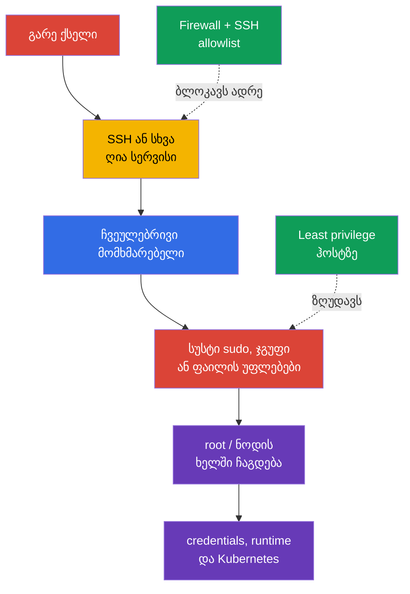
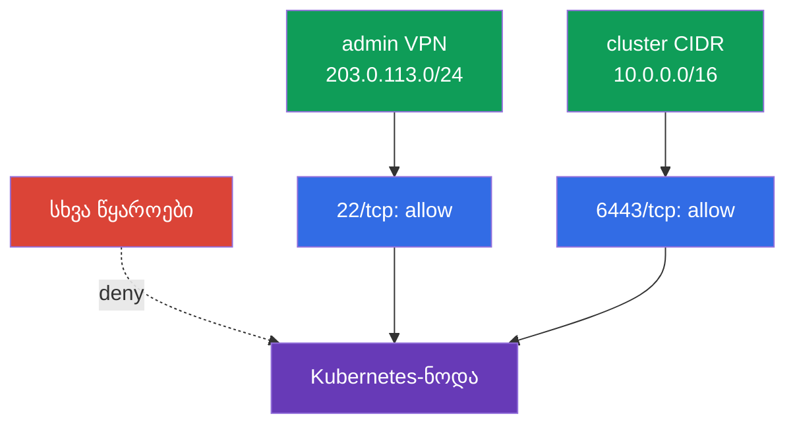

[Русская версия](ru.md) · [Eng version](README.md) · [Versión en español](es.md) · [Version française](fr.md) · [Deutsche Version](de.md) · [繁體中文版](tw.md) · [日本語版](jp.md)

# თავი 15. Least-privilege ჰოსტზე და გარე ქსელური წვდომის მინიმიზაცია

> **პრობლემა.** ღია SSH-ის ან ლოკალური ანგარიშის საშუალებით შესული შემტევი ეძებს ფართო
> `sudo`-ს, პრივილეგირებულ ჯგუფს ან ჩასაწერად ხელმისაწვდომ კონფიგურაციის ფაილს. ერთმა
> ასეთმა შეცდომამ შეიძლება მისცეს root გახდომის, kubelet credentials-ის წაკითხვის ან
> runtime socket-თან მისვლის შესაძლებლობა, ნოდაზე შეზღუდული წვდომა ნოდისა და Kubernetes-ის
> ხელში ჩაგდებად აქციოს.

> **შემდეგი ნაბიჯი.** მე-14 თავში შევამცირეთ ნოდის შეტევის ზედაპირი: მოვაშორეთ ზედმეტი
> სერვისები, პაკეტები და container runtime-თან არაუსაფრთხო წვდომა. ახლა შემოვფარგლავთ
> დარჩენილი შესვლის წერტილის შედეგებს: ვის აქვს უფლება შევიდეს ჰოსტზე, რისი გაკეთება
> შეუძლია მომხმარებელს `sudo`-ს საშუალებით, რომელი ფაილების წაკითხვა ან შეცვლა შეუძლია და
> საერთოდ საიდან არის ნოდა ხელმისაწვდომი. ეს არის CKS-ის **System Hardening**-დომენი.

> **რა გჭირდებათ CKA-დან.** მომხმარებლების, ჯგუფების, ფაილთა უფლებების, პროცესების,
> systemd-ისა და ქსელური ბრძანებების საფუძვლები განხილულია [CKA-ს Linux-თავში](../../../cka/course/00-5-linux/ge.md).
> აქ საფუძვლებს არ ვიმეორებთ, არამედ ვიყენებთ მათ Kubernetes-ნოდის დასაცავად.

## 15.1. საფრთხის მოდელი: ერთი ზედმეტი წვდომა ნოდის ხელში ჩაგდებად იქცევა

Kubernetes-ნოდაზეა მაღალღირებულებიანი მონაცემები და მართვის წერტილები: kubelet credentials,
`kubeconfig`, PKI-გასაღებები, control plane-ის მანიფესტები, container runtime-ის სოკეტები
და ჟურნალები. მომხმარებელს, რომელსაც შეუძლია წაიკითხოს საიდუმლო ფაილი, შეცვალოს
კონფიგურაცია ან შეასრულოს ბრძანება `root`-ის სახელით, შეუძლია მიიღოს წვდომა, რომელიც მის
საწყის როლზე ფართოა. ღია SSH ან ზედმეტი პორტი შემტევს აძლევს საშუალებას დაიწყოს ეს ჯაჭვი
გარედან.



Least privilege ნიშნავს არა „არავისთვის არაფრის მიცემას“, არამედ მხოლოდ საჭირო წვდომის
გაცემას საჭირო ვადით და აუდიტის შესაძლებლობით. ნოდისთვის ეს რამდენიმე დამოუკიდებელი
ფენაა: ლოკალური identity, წერტილოვანი `sudo`, ფაილების მფლობელები და რეჟიმები, firewall და
SSH. მათგან არცერთი არ ანაცვლებს დანარჩენებს.

მომუშავე ნოდაზე ცვლილებების შეტანამდე უზრუნველყავით ავარიული წვდომა პროვაიდერის კონსოლის
ან მეორე SSH-სესიის საშუალებით. შეცდომამ `sudoers`-ში, firewall-ში ან `sshd_config`-ში
შეიძლება დაგტოვოთ ადმინისტრაციული წვდომის გარეშე.

> 🧠 ნოდის ხელში ჩაგდება არის გარე შესვლის, ლოკალური identity-ის, `sudo`-ს, ფაილის
> უფლებებისა და runtime socket-ების ჯაჭვი; least privilege ჰოსტზე არ ანაცვლებს Kubernetes
> RBAC-ს.

> 🎯 გამოიყენეთ ცალკეული მომხმარებლები, მინიმალური ჯგუფები, ვიწრო auditable `sudo` და
> ზუსტი owner/mode; შეამოწმეთ სამიზნე მომხმარებლის ეფექტური უფლებები და ჩასაწერად
> ხელმისაწვდომი მშობელი კატალოგები.

## 15.2. მომხმარებლები, ჯგუფები და `sudo`: ვაძლევთ შესაძლებლობას, არა სრულ root-ს

ნუ გამოიყენებთ ერთ საერთო ანგარიშს და მუდმივად ნუ იმუშავებთ `root`-ის სახელით. თითოეულ
ოპერატორს უნდა ჰქონდეს ცალკე მომხმარებელი: ეს საშუალებას იძლევა ერთ ადამიანს წვდომა
გამოაცალკელოთ და მოქმედება დააკავშიროთ `auth.log`-ის ან journald-ის ჩანაწერთან.

```bash
# ლოკალური მომხმარებლებისა და ჯგუფების ინვენტარიზაცია.
USER_TO_REVIEW='user-to-review'
SERVICE_USER='service-user'
getent passwd
getent group
id "$USER_TO_REVIEW"
groups "$USER_TO_REVIEW"

# password authentication-ის აკრძალვა გამოუყენებელი ინტერაქტიული ანგარიშისთვის.
sudo usermod --lock "$USER_TO_REVIEW"

# ცალკე გამორთეთ თავად account ახალი login-ებისთვის (usermod --lock ბლოკავს მხოლოდ
# password hash-ს, არა მთელ Linux-account-ს).
sudo usermod --expiredate 1 "$USER_TO_REVIEW"

# შეამოწმეთ მდგომარეობა.
sudo passwd -S "$USER_TO_REVIEW"
sudo chage -l "$USER_TO_REVIEW"

sudo usermod --shell /usr/sbin/nologin "$SERVICE_USER"
```

Account-ის ვადის გასვლა და password lock არ წყვეტს უკვე არსებულ პროცესებს/სესიებს.
დაუყოვნებელი წვდომის გაუქმებისას ცალკე შეამოწმეთ აქტიური sessions, SSH keys,
პრივილეგირებული ჯგუფები და ცენტრალიზებული IAM/SSO source და წვდომა დაასრულეთ
დამტკიცებული incident/offboarding პროცედურის მიხედვით.

Service account-ისთვის account-ის ვადის გასვლა მექანიკურად ნუ გამოიყენებთ, თუ სერვისმა
გაშვება უნდა გააგრძელოს. მისთვის ჩვეულებრივ ცალკე ეკრძალება interactive shell `nologin`-ის
საშუალებით და მინიმუმამდე მცირდება ჯგუფები/permissions.

სერვისულ ანგარიშებს არ სჭირდებათ ინტერაქტიული shell და ადმინისტრაციულ ჯგუფებში წევრობა.
Home ან state-კატალოგი შექმენით მხოლოდ იმ შემთხვევაში, თუ ის სერვისს სჭირდება, მინიმალური
owner/mode-ით. შეამოწმეთ ასევე ჯგუფები, რომლებიც ფაქტობრივად ნიშნავს ფართო ესკალაციას:
`sudo`, `wheel`, `docker`, `lxd`, ხოლო კონკრეტულ სისტემაზე - container runtime-ის
სოკეტების მფლობელი ჯგუფები. ასეთ ჯგუფში წევრობა არ შეიძლება გაიცეს „მოხერხებულობისთვის“.

### `sudo`: ბრძანებების მინიმალური ნაკრები

წესი `user ALL=(ALL) ALL` მოსახერხებელია, მაგრამ სრულ root-ს იძლევა. თუ ოპერატორს ერთი
ოპერაცია სჭირდება, დაუშვით კონკრეტული ბრძანება და მისი ფიქსირებული არგუმენტები ცალკე
ფაილში `/etc/sudoers.d/`. რედაქტირება მოახდინეთ `visudo`-ს საშუალებით, მაგრამ მას ზედმეტი
დაცვა ნუ მიაწერთ: `visudo -f <ალტერნატიული-გზა>`-ის დროს owner და permissions ავტომატურად
არ მოწმდება ცალსახა `-O`-სა და `-P`-ს გარეშე. შექმნის შემდეგ ხელით დააყენეთ `root:root` და
`0440`, შემდეგ დაავალიდეთ მთელი policy `visudo -cf /etc/sudoers`-ით (ერთი include-ფაილის
შემოწმება საკმარისი არ არის).

```bash
# გზა გადაწყვიტეთ პროგნოზირებადი სისტემური PATH-ის საშუალებით და არა ფიქსირებული
# systemctl-გზის ვარაუდით.
SYSTEMCTL_PATH="$(env -i PATH=/usr/sbin:/usr/bin:/sbin:/bin sh -c 'command -v systemctl')"
test -n "$SYSTEMCTL_PATH" && SYSTEMCTL_PATH="$(readlink -f -- "$SYSTEMCTL_PATH")"
sudo test -x "$SYSTEMCTL_PATH"
sudo stat -c '%U:%G %a %n' "$SYSTEMCTL_PATH"  # მოსალოდნელია root:root და სხვებისთვის ჩაწერის არარსებობა
```

უფრო საიმედოა `systemctl`-ის პირდაპირ არ მიცემა: ვიწრო არგუმენტ-შესაბამისობაც კი ადვილად
ფართოვდება მცდარი რედაქტირებით. შექმენით root-მფლობელი wrapper არგუმენტების გარეშე; ის
იძახებს **ზუსტად** ზემოთ დაშვებულ გზას და ყოველთვის გამორთავს pager-ს. შექმნამდე
დარწმუნდით, რომ `/usr/local/sbin` ეკუთვნის root-ს და არაპრივილეგირებული მომხმარებლებისთვის
ჩასაწერად მიუწვდომელია.

```bash
sudo tee /usr/local/sbin/k8s-kubelet-status >/dev/null <<'EOF'
#!/bin/sh
PATH=/usr/sbin:/usr/bin:/sbin:/bin
SYSTEMCTL_PATH="$(command -v systemctl)" || exit 1
exec "$SYSTEMCTL_PATH" --no-pager status kubelet
EOF
sudo chown root:root /usr/local/sbin/k8s-kubelet-status
sudo chmod 0755 /usr/local/sbin/k8s-kubelet-status
sudo visudo -f /etc/sudoers.d/k8s-operator
sudo chown root:root /etc/sudoers.d/k8s-operator
sudo chmod 0440 /etc/sudoers.d/k8s-operator
sudo visudo -c -O -P -f /etc/sudoers.d/k8s-operator
sudo visudo -cf /etc/sudoers
```

```sudoers
# /etc/sudoers.d/k8s-operator - ზუსტი wrapper, wildcard-ისა და არგუმენტების გარეშე.
# ცარიელი ბრჭყალები აღნიშნავს „მხოლოდ არგუმენტების გარეშე“-ს; მათი არარსებობა
# დაუშვებდა ამ გზის გაშვებას ნებისმიერი არგუმენტით.
Cmnd_Alias KUBELET_STATUS = /usr/local/sbin/k8s-kubelet-status ""
k8s-operator ALL=(root) KUBELET_STATUS
```

შეამოწმეთ საბოლოო policy ზუსტად სამიზნე მომხმარებლისთვის. `sudo`/აუთენტიფიკაციის
შეცდომა ნუ აქცევთ „მოსალოდნელ denial“-ად `|| echo`-ს საშუალებით: ჯერ უნდა მოხერხდეს
policy-ის სრული listing-ის მიღება, ხოლო `/bin/bash`-ისა და სხვა ზედმეტი ბრძანებების
არარსებობა მოწმდება მისი შენახული output-ში.

```bash
policy=$(sudo -l -U k8s-operator) || {
  echo 'ERROR: cannot retrieve sudo policy for k8s-operator' >&2; exit 2;
}
printf '%s\n' "$policy" | tee /tmp/k8s-operator-sudo-policy.txt
# განხილვა: დაშვებულია მხოლოდ /usr/local/sbin/k8s-kubelet-status არგუმენტების გარეშე;
# /bin/bash, shell/interpreter და თვითნებური systemctl არ არის.
```

ნუ შეეცდებით საშიში პროგრამის შეზღუდვას ზედაპირული არგუმენტების სიით. Editor,
interpreter, `systemctl edit`, ბრძანებები თვითნებური გზის მითითების შესაძლებლობით, ასევე
`kubectl` ადმინისტრაციული kubeconfig-ით ხშირად საშუალებას იძლევა გვერდი აუარონ
ერთი შეხედვით ვიწრო წესს და მიიღონ root ან წვდომა კლასტერზე. თუ უსაფრთხო
არგუმენტების ნაკრების აღწერა შეუძლებელია, უკეთესია მართვადი break-glass-პროცედურა
ჟურნალირებით, ვიდრე შეზღუდვის ცრუ შეგრძნება.

ყველა ადმინისტრაციული მოქმედებისთვის სასარგებლოა კვალის შენახვა. Event/command logging
და I/O logging - sudoers-ის განსხვავებული მექანიზმებია: `logfile` განსაზღვრავს event log-ის
ფაილურ დანიშნულებას, ხოლო `log_input`/`log_output` ან command tags
`LOG_INPUT`/`LOG_OUTPUT` წერს input/output-ს `iolog_*`-დან ან `log_servers`-ზე
მითითებულ location-ში.

```bash
# sudoers-ის command/I/O logging-პარამეტრების ინვენტარიზაცია.
sudo grep -REns \
  '(^|[[:space:],])((logfile|log_input|log_output|iolog_dir|iolog_file|log_servers)([=[:space:],]|$)|LOG_INPUT|LOG_OUTPUT)' \
  /etc/sudoers /etc/sudoers.d 2>/dev/null || true

# შეამოწმეთ ფაქტობრივი ბოლოდროინდელი sudo-მოვლენები.
# კონკრეტული journal/syslog/logfile დამოკიდებულია policy-სა და დისტრიბუციაზე.
sudo journalctl _COMM=sudo --since '1 day ago'
```

თუ sudoers ადგენს `logfile`-ს, შეამოწმეთ ესეც ფაილი. თუ ჩართულია `log_input` /
`log_output` ან command tags `LOG_INPUT` / `LOG_OUTPUT`, ცალკე შეამოწმეთ `iolog_dir` და
ჩანაწერის წაკითხვის შესაძლებლობა `sudoreplay`-ის საშუალებით. ერთი `journalctl`-ის ცარიელი
შედეგი არ ამტკიცებს logging-ის არარსებობას: destination დამოკიდებულია sudoers/syslog-სა
და OS-კონფიგურაციაზე.

`NOPASSWD` თავისთავად არ არის კომპრომეტაციის მტკიცებულება, მაგრამ ამცირებს დაცვას უკვე
ღია სესიის არაავტორიზებული გამოყენებისგან. გამოიყენეთ ის მხოლოდ მოკლე, გადამოწმებული
არაინტერაქტიული ბრძანებების სიაზე, როცა ეს ავტომატიზაციას ესაჭიროება.

## 15.3. ფაილების უფლებები და მფლობელობა: credentials-ისა და კონფიგურაციის დაცვა

POSIX-უფლებები განსაზღვრავს, ვის შეუძლია წაკითხვა (`r`), შეცვლა (`w`) და კატალოგის
გავლა (`x`). მფლობელი და რეჟიმი უნდა შეესაბამებოდეს ფაილის დანიშნულებას: საიდუმლო private
key-ს ჩვეულებრივმა მომხმარებლებმა არ უნდა წაიკითხონ, ხოლო control plane-ის კონფიგურაცია -
არ უნდა შეცვალონ. შეამოწმეთ არა მხოლოდ თავად ფაილი, არამედ ყველა კატალოგი მის გზაზე:
მშობელ კატალოგში ჩაწერის უფლება საშუალებას იძლევა შეცვალო შიგთავსი.

```bash
# ფაილის რეჟიმი, მფლობელი და სრული გზა.
stat -c '%A %a %U:%G %n' /etc/kubernetes/admin.conf
namei -l /etc/kubernetes/admin.conf

# world-writable ფაილების ძებნა მგრძნობიარე არეში; sticky bit ცალკე ვგამორიცხავთ.
sudo find /etc/kubernetes -xdev -type f -perm -0002 -ls
sudo find /etc/kubernetes -xdev -type d -perm -0002 -ls
```

თვითმართვადი kubeadm-ნოდისთვის შეამოწმეთ სულ ცოტა შემდეგი. ზუსტი მფლობელები
დამოკიდებულია დისტრიბუციასა და დაყენების ხერხზე, ამიტომ ჯერ დააფიქსირეთ საწყისი
მდგომარეობა და შეადარეთ თქვენი Kubernetes/CIS ვერსიის დოკუმენტაციას, ნაცვლად ერთი
შაბლონის ბრმად გამოყენებისა.

| ობიექტი | რისკი სუსტი უფლებებისას | უსაფრთხო მიმართულება |
|---|---|---|
| `/etc/kubernetes/pki/*.key` | CA-ს ან client-ის private key-ის მოპარვა | `root:root`, მხოლოდ root-ისთვის წაკითხვადი, ჩვეულებრივ `600` |
| `/etc/kubernetes/admin.conf` | მომხმარებელი იღებს cluster-admin credential-ს | `root:root`, რეჟიმი `600`; არ დააკოპიროთ საერთო კატალოგებში |
| `/etc/kubernetes/manifests/` | control plane-ის static Pod-ის ჩანაცვლება | კატალოგი და YAML ჩასაწერად ხელმისაწვდომია მხოლოდ root-ისთვის |
| `/var/lib/kubelet/config.yaml` და kubelet credentials | kubelet-ის ქცევის შეცვლა ან node identity-ის მოპარვა | მფლობელი root, ჩასაწერად მიუწვდომელი არაპრივილეგირებული მომხმარებლისთვის |
| `~/.ssh/authorized_keys` | სხვისი SSH-გასაღების დამატება | კატალოგი `.ssh` `700`, `authorized_keys` `600`, მფლობელი - მომხმარებელი |

მაგალითი ფაილის წერტილოვანი კორექციისა, რომელიც დახურული უნდა იყოს სხვა
მომხმარებლებისთვის:

```bash
sudo chown root:root /etc/kubernetes/admin.conf
sudo chmod 600 /etc/kubernetes/admin.conf
sudo stat -c '%U %G %a %n' /etc/kubernetes/admin.conf
```

ნუ გააკეთებთ რეკურსიულ `chmod -R 600`-ს მთელი `/etc/kubernetes`-ისთვის: კატალოგებს
სჭირდება ბიტი `x`, ხოლო ცალკეულ საჯარო სერტიფიკატებსა და კონფიგურაციებს შეიძლება
ჰქონდეთ სხვა მოსალოდნელი რეჟიმი. ასეთმა „შეკეთებამ“ შეიძლება დაანგრიოს kubelet ან
static Pod. კონკრეტული ობიექტი შეცვალეთ მხოლოდ მფლობელის, დანიშნულებისა და ფაქტობრივი
მომხმარებლის შემოწმების შემდეგ.

ცალკე შეამოწმეთ SUID/SGID-ბინარები: ისინი გაეშვება მფლობელის ან ჯგუფის უფლებებით და
ზრდის შეცდომის შედეგებს. ნუ წაშლით სისტემურ SUID-ფაილებს ინტერნეტიდან აღებული სიის
მიხედვით - ჯერ დაადგინეთ, რომელ პაკეტს ეკუთვნის და საჭიროა თუ არა ნოდაზე.

```bash
set -euo pipefail
BINARY_PATH='/path/to/reviewed-binary'
# ინვენტარიზაცია გაუკეთეთ თითოეულ არჩეულ ლოკალურ ფაილურ სისტემას ცალ-ცალკე: `find / -xdev`
# გამოტოვებდა /usr, /var, /opt და ა.შ.
findmnt -rn -o TARGET,FSTYPE |
while IFS=' ' read -r target fstype; do
  case "$fstype" in
    proc|sysfs|devtmpfs|devpts|tmpfs|cgroup|cgroup2|overlay|squashfs|nfs|nfs4|cifs|fuse.*|autofs|nsfs|mqueue|hugetlbfs|rpc_pipefs)
      continue
      ;;
  esac
  sudo find "$target" -xdev -type f -perm /6000 -printf '%m %u:%g %p\n' 2>/dev/null
done | LC_ALL=C sort -u

# პაკეტის კუთვნილება დამოკიდებულია დისტრიბუციაზე; მფლობელი პაკეტის გარეშე ფაილს
# ესაჭიროება წარმომავლობის შემოწმება.
if command -v dpkg-query >/dev/null 2>&1; then
  sudo dpkg-query -S "$BINARY_PATH" || {
    echo 'REVIEW_REQUIRED: no Debian package owns this binary; review its provenance' >&2
    exit 2
  }
elif command -v rpm >/dev/null 2>&1; then
  sudo rpm -qf "$BINARY_PATH" || {
    echo 'REVIEW_REQUIRED: no RPM package owns this binary; review its provenance' >&2
    exit 2
  }
else
  echo 'REVIEW_REQUIRED: package manager is unknown' >&2
  exit 2
fi
```

> 🎯 შეადგინეთ ნაკადების მატრიცა და allowlist, შეინარჩუნეთ წვდომის მეორე გზა, გამოიყენეთ
> deny-by-default და შეამოწმეთ დაშვებული და აკრძალული სეგმენტები.

## 15.4. Firewall: გარე წყაროსთვის ხელმისაწვდომია მხოლოდ საჭირო პორტები

Firewall უნდა აშენდეს deny-by-default-იდან და ცალსახა allow-წესებიდან. ნოდა
ვალდებული არ არის იყოს ხელმისაწვდომი მთელი ქსელისთვის მხოლოდ იმიტომ, რომ ის
მონაწილეობს კლასტერში. დაუშვით SSH მხოლოდ ადმინისტრაციული ქსელიდან, ხოლო
Kubernetes-პორტები - მხოლოდ შეთანხმებულ control-plane-, worker- და monitoring-წყაროებს
შორის. პორტების სრული სია დამოკიდებულია ტოპოლოგიაზე, CNI-ზე და კომპონენტებზე; ჯერ
გადაამოწმეთ თქვენი დაყენების ფაქტობრივი listener-ები და მოთხოვნები.

```bash
sudo ss -lntup
sudo ss -lntup | grep -E ':(22|6443|10250|10256|10257|10259|2379|2380)\b' || true
```

| პორტი | ჩვეულებრივი დანიშნულება | ვისაც უნდა ჰქონდეს წვდომა |
|---|---|---|
| `22/tcp` | SSH | მხოლოდ bastion/VPN/ადმინისტრაციული CIDR |
| `6443/tcp` | kube-apiserver | worker/control-plane და დაშვებული ადმინისტრატორები |
| `10250/tcp` | დაცული kubelet API | control plane და საჭირო monitoring, არა ინტერნეტი |
| `10256/tcp` | kube-proxy healthz | მხოლოდ დანიშნული health-check/monitoring-წყაროები, თუ პორტი არაა მხოლოდ loopback |
| `10257/tcp` | kube-controller-manager | control-plane/monitoring მხოლოდ საჭიროებისას და არა ინტერნეტიდან |
| `10259/tcp` | kube-scheduler | control-plane/monitoring მხოლოდ საჭიროებისას და არა ინტერნეტიდან |
| `2379-2380/tcp` | etcd client/peer | მხოლოდ control-plane/etcd peers |
| `30000-32767/tcp`, `30000-32767/udp` (default) | NodePort | მხოლოდ იმ კლიენტების/LB-ის CIDR, ვისაც სჭირდება გამოქვეყნებული Service; ფაქტობრივ დიაპაზონს ადარებენ API server-ის `--service-node-port-range`-ს |
| CNI-ის პორტები (ცვლადი) | overlay, node-to-node და Pod-ტრაფიკი | ზუსტად არჩეული CNI-ის დოკუმენტაციიდან მიღებული CIDR-ები და პროტოკოლები |

ნუ აურევთ სამ წესთა მენეჯერს backend-ის გააზრების გარეშე. `ufw` მაღალდონიანი
გარსია, ხოლო თანამედროვე `iptables` ხშირად `nf_tables`-ის ზემოთ მუშაობს; `ufw`-ის,
`iptables`-ისა და `nftables`-ის პარალელური ხელით შეცვლა ართულებს აუდიტს და შეიძლება
გადაწეროს მოსალოდნელი წესები. აირჩიეთ ინსტრუმენტი, რომელსაც მხარს უჭერს ნოდის image და
კონფიგურაციის მართვის სისტემა, და გახადეთ ის სიმართლის ერთადერთ წყაროდ.

> 🔬 ყველა რეალიზაციის დაზეპირება არ არის საჭირო; მნიშვნელოვანია ხელმისაწვდომ გარემოში
> host firewall control-ის გააზრება და გამოყენება. ქვემოთ - `ufw`, `iptables` და
> `nftables`, როგორც ალტერნატიული backend-ები.

### ვარიანტი A: `ufw`

**`default deny`-მდე შეადგინეთ allowlist რეალური ტოპოლოგიის მიხედვით:** bastion/VPN,
control-plane, worker, etcd, load balancer, monitoring, Pod/Service CIDR და ზუსტად თქვენი
CNI. დაამატეთ ყველა საჭირო როლი, NodePort და CNI-პორტი მატრიციდან; მათი გამოცნობა
უნივერსალური წესით შეუძლებელია. შეინარჩუნეთ მიმდინარე SSH-სესია, გახსენით მეორე
დამოუკიდებელი სესია და enforcement-ის ჩართვამდე შეამოწმეთ წყაროს მისამართი, მომავალი
წესები (`ufw status numbered`) და out-of-band კონსოლი. ცალკე შეამოწმეთ forwarded/routed
ტრაფიკი: CNI-სა და Pod-ტრაფიკს ხშირად სჭირდება IPv4/IPv6 forwarding და `ufw route`-ის
წესები; ერთი წყვილი `ufw allow ... to any port ...` საკმარისი არ არის. გადაამოწმეთ
`DEFAULT_FORWARD_POLICY`, `net.ipv4.ip_forward`, IPv6 forwarding და CNI-სპეციფიკური
ნაკადები, თორემ SSH/API ცოცხალი დარჩება, ხოლო Pod networking გაფუჭდება. ჩართვის შემდეგ
ნუ დახურავთ შენარჩუნებულ სესიას, სანამ არ დაადასტურებთ ახალ SSH-შესვლას და kubelet/API-ის
მუშაობას დაშვებული ქსელებიდან.

```bash
# მაგალითი: SSH დაშვებულია მხოლოდ ადმინისტრაციული ქსელიდან.
sudo ufw allow from 203.0.113.0/24 to any port 22 proto tcp

# მაგალითი: API ხელმისაწვდომია მხოლოდ ნოდების და ადმინისტრატორების ქსელიდან.
sudo ufw allow from 10.0.0.0/16 to any port 6443 proto tcp
# ამ წერტილამდე დაამატეთ თქვენი დაყენების როლის და CNI-ის სპეციფიკური allow-წესები.
sudo ufw default deny incoming
sudo ufw default allow outgoing
sudo ufw enable
sudo ufw status numbered
```

წესის წაშლამდე დაათვალიერეთ ნომერი და დანიშნულება, შემდეგ წაშალეთ მიზანმიმართულად:

```bash
RULE_NUMBER='1'
sudo ufw status numbered
sudo ufw delete "$RULE_NUMBER"
```

### ვარიანტი B: `iptables`

სასწავლო მაგალითისთვის `iptables`-ით ვუშვებთ established-ტრაფიკს, loopback-ს, SSH-ს
allowlist-იდან და შემდეგ ვკრძალავთ დარჩენილ შემომავალ ტრაფიკს. რეალურ კლასტერში
დაამატეთ ყველა დოკუმენტირებული Kubernetes/CNI-ნაკადი `DROP`-ის დაყენებამდე, თორემ
შეიძლება გაწყდეს კავშირი ნოდებს შორის ან Pod networking. ცალკე შეამოწმეთ `FORWARD`-ჯაჭვები,
IPv4 და IPv6: CNI-მ შეიძლება Pod-ტრაფიკი არა `INPUT`-ის, არამედ სხვა გზით
გაამარშრუტოს, ხოლო საბოლოო `DROP` `INPUT`-ში არ ქმნის უსაფრთხო forwarding-პოლიტიკას და
არ ანაცვლებს CNI-სპეციფიკურ წესებს.

```bash
sudo iptables -A INPUT -m conntrack --ctstate ESTABLISHED,RELATED -j ACCEPT
sudo iptables -A INPUT -i lo -j ACCEPT
sudo iptables -A INPUT -p tcp -s 203.0.113.0/24 --dport 22 -j ACCEPT
sudo iptables -A INPUT -p tcp -s 10.0.0.0/16 --dport 6443 -j ACCEPT
sudo iptables -A INPUT -j DROP
sudo iptables -S INPUT
```

`-A` ამატებს წესებს ჯაჭვის ბოლოში: თუ არსებული წესი უფრო მაღლა უკვე იღებს ტრაფიკს,
საბოლოო `DROP` deny-by-default-ს არ იძლევა გარანტიად. ეს IPv4-წესები ასევე არ ფარავს
IPv6-ს. ჯერ დაათვალიერეთ მთელი ruleset-ის მიმდევრობა, ხოლო მუდმივი policy-სთვის
მართეთ გამოყოფილი ჯაჭვი ცალსახა jump-ით ან გამოიყენეთ `nftables` ცალსახა policy-ით; ნუ
აურევთ ხელით დამატებულ append-წესებს CNI-ის ან firewall manager-ის წესებთან.

ბრძანებით დამატებული წესები ყოველთვის არ გადარჩება გადატვირთვას. შეინახეთ ისინი
დისტრიბუციის შტატიანი მექანიზმით ან დეკლარაციული კონფიგურაციით; ნუ იმედოვნებთ, რომ
`iptables -S`-ის output თავისთავად persistence-ფენაა.

### ვარიანტი C: `nftables`

`nftables` - ბირთვის თანამედროვე მექანიზმია. მასში მარტივია policy-ის ცალსახად დადგენა
და მთელი ruleset-ის ერთი ბრძანებით ნახვა. ნუ გამოიყენებთ მაგალითს ნოდაზე, სადაც CNI-მ ან
firewall manager-მა უკვე შექმნა თავისი ცხრილები, არსებული ruleset-ის განხილვის გარეშე.

```nft
# /etc/nftables.conf: host ingress-ის ცალკე ცხრილის ფრაგმენტი
 table inet host_filter {
   chain input {
     type filter hook input priority filter; policy drop;
     ct state established,related accept
     iifname "lo" accept
     ip saddr 203.0.113.0/24 tcp dport 22 accept
     ip saddr 10.0.0.0/16 tcp dport 6443 accept
   }
 }
```

შეამოწმეთ სინტაქსი ჩატვირთვამდე, შემდეგ დაათვალიერეთ ფაქტობრივად აქტიური წესები:

```bash
sudo nft -c -f /etc/nftables.conf
sudo systemctl reload nftables
sudo nft list ruleset
```



Host firewall ავსებს, მაგრამ არ ანაცვლებს cloud Security Group-ს, private endpoint-ს,
მარშრუტიზაციასა და Kubernetes NetworkPolicy-ს. NetworkPolicy ძირითადად Pod-ტრაფიკს
მართავს, ხოლო ნოდის firewall - host-ტრაფიკს; შეამოწმეთ თქვენი CNI-ისა და cloud-ქსელის
პასუხისმგებლობის საზღვარი.

> 🏭 Node role იღებს მხოლოდ თავის bootstrap, network, storage და telemetry permissions-ს;
> workload იყენებს ცალკე მინიმალურ workload identity-ს.

## 15.4.1. Cloud/node IAM: ცალკე მინიმალური როლი workload-ისთვის

Least privilege ვრცელდება cloud IAM-ზეც. Node/instance role-მა არ უნდა მიიღოს ფართო
cloud-admin permissions მხოლოდ იმიტომ, რომ ნოდაზე მუშაობს Kubernetes; მიეცით მხოლოდ ამ
როლისთვის საჭირო bootstrap, ქსელური, storage და telemetry უფლებები. Workload-მა
ავტომატურად არ უნდა მემკვიდრეობით მიიღოს node role-ის credentials: გამოიყენეთ workload
identity, IRSA ან ანალოგი ცალკე მინიმალური cloud-role-ით კონკრეტული ServiceAccount-ისთვის.
სადაც პლატფორმა ამას უჭერს მხარს, შეზღუდეთ Pod-ის წვდომა instance metadata-ზე და node
credentials-ზე. Cloud-role-ის განხილვა ჩატარდეს ცალკე Kubernetes RBAC-ისგან: მინიმალური
RoleBinding-ის არსებობა არ ამტკიცებს უფლებების მინიმალურობას ღრუბელში.

## 15.5. SSH-ჰარდნინგი: ადმინისტრირების მთავარი გზის დაცვა

SSH ხშირად ნოდაზე ერთადერთი დისტანციური შესვლის გზაა. მიანიჭეთ უპირატესობა ცალკე
ადმინისტრაციულ მომხმარებლის ანგარიშსა და გასაღებებს, ნაცვლად პაროლებისა. `root`-ის
პირდაპირი შესვლა ამარტივებს brute force-ს და აშორებს ინდივიდუალურ იდენტობას
ჟურნალებიდან.

> 🎯 დაადასტურეთ გასაღები და ალტერნატიული წვდომა, აკრძალეთ root/password login, შეამოწმეთ
> `sshd -t`, `sshd -T` და დაშვებული მომხმარებლის შესვლა.

თანამედროვე OpenSSH-ზე მოსახერხებელია პატარა drop-in-ის შექმნა, ვიდრე დიდი vendor-ფაილის
რედაქტირება. ჯერ შეამოწმეთ, თქვენი კონფიგურაცია კატალოგს `Include`-ით რომ რთავს თუ არა.
Wildcard-`Include`-ფაილები მუშავდება lexical order-ით, ხოლო უმეტესი ჩვეულებრივი scalar
keywords-ისთვის OpenSSH იყენებს პირველად მიღებულ მნიშვნელობას, ამიტომ სახელი
`99-hardening.conf` პრიორიტეტს არ იძლევა და ასეთ პარამეტრებს ხშირად სჭირდება
შეგნებულად ადრეული ფაილი.

მაგრამ ეს მოდელი ნუ გადაიტანთ list directives-ზე. `AllowUsers`, `AllowGroups`,
`DenyUsers` და `DenyGroups` შეიძლება რამდენჯერმე შეგხვდეთ, და ყოველი occurrence
**ემატება** შესაბამის სიას. ადრეული `00-hardening.conf` სხვა `AllowUsers`-ს არ აუქმებს.
`AllowUsers`-ის გამოყენებამდე ჩაატარეთ მისი ყველა occurrence-ის ინვენტარიზაცია ძირითად
`sshd_config`-სა და ჩართულ ფაილებში, წაშალეთ ან გააერთიანეთ კონფლიქტური სიები
მართვად allowlist-ად, შემდეგ კი შეამოწმეთ შედეგი `sshd -T`-ით, ხოლო `Match`-ის
არსებობისას - `sshd -T -C user=...,host=...,addr=...`-ით. აირჩიეთ ქვემოთ მოცემული
**ერთი** პროფილი: ორივე კრძალავს პაროლური წვდომას, მაგრამ MFA-პროფილი დამატებით
მოითხოვს გასაღებსა და PAM keyboard-interactive-ს. ორივე პროფილი ერთდროულად ნუ ჩართავთ.

```bash
sudo grep -RnsE \
  '^[[:space:]]*(Include|Match|AllowUsers|AllowGroups|DenyUsers|DenyGroups)[[:space:]]' \
  /etc/ssh/sshd_config /etc/ssh/sshd_config.d 2>/dev/null || true
```

**პროფილი A - მხოლოდ გასაღები.**

```bash
sudo install -d -o root -g root -m 0755 /etc/ssh/sshd_config.d
sudo tee /etc/ssh/sshd_config.d/00-hardening.conf >/dev/null <<'EOF'
PermitRootLogin no
PasswordAuthentication no
KbdInteractiveAuthentication no
PubkeyAuthentication yes
AllowUsers k8s-operator
EOF
sudo chown root:root /etc/ssh/sshd_config.d/00-hardening.conf
sudo chmod 0600 /etc/ssh/sshd_config.d/00-hardening.conf
sudo stat -c '%U:%G %a %n' \
  /etc/ssh/sshd_config.d /etc/ssh/sshd_config.d/00-hardening.conf

SSHD_UNIT="$(
  systemctl list-unit-files --type=service --no-legend \
    | awk '$1 == "ssh.service" || $1 == "sshd.service" { print $1; exit }'
)"
test -n "$SSHD_UNIT" || {
  echo 'ERROR: ssh.service/sshd.service was not found' >&2
  exit 1
}

sudo sshd -t
sudo systemctl reload "$SSHD_UNIT"
```

**პროფილი B - გასაღები + MFA PAM keyboard-interactive-ის საშუალებით.** გამოიყენეთ იგი
მხოლოდ PAM-MFA-მოდულის კონფიგურაციისა და შემოწმების შემდეგ; `AuthenticationMethods`
მოითხოვს ორივე ფაქტორს და არა გასაღების ერთჯერადი კოდით შეცვლას.

```text
PermitRootLogin no
PasswordAuthentication no
PubkeyAuthentication yes
KbdInteractiveAuthentication yes
UsePAM yes
AuthenticationMethods publickey,keyboard-interactive:pam
AllowUsers k8s-operator
```

შეინახეთ პროფილი B იმავე `/etc/ssh/sshd_config.d/00-hardening.conf`-ში; გამოიყენეთ
**იგივე** invariant owner/mode, შემდეგ შეამოწმეთ ის `sshd -t`-მდე და ფაქტობრივი OpenSSH
server unit-ის reload-მდე (`ssh.service` Debian/Ubuntu-ზე ან `sshd.service` RHEL-family
ბევრ სისტემაზე):

```bash
sudo install -d -o root -g root -m 0755 /etc/ssh/sshd_config.d
sudo chown root:root /etc/ssh/sshd_config.d/00-hardening.conf
sudo chmod 0600 /etc/ssh/sshd_config.d/00-hardening.conf
sudo stat -c '%U:%G %a %n' \
  /etc/ssh/sshd_config.d /etc/ssh/sshd_config.d/00-hardening.conf
sudo sshd -t
# განსაზღვრეთ ssh.service/sshd.service იმავე distro-aware ხერხით, რაც Profile A-ში, შემდეგ reload.
```

ნუ დააფიქსირებთ ერთ unit-სახელს, როგორც უნივერსალურს ყველა Linux-დისტრიბუციისთვის.
`AllowUsers` ძლიერი შეზღუდვაა, მაგრამ ის ბლოკავს ყველა მითითებულის გარეშე მომხმარებელს.
ნუ გამოიყენებთ მას, სანამ არ დაამატებთ საჭირო break-glass და automation-ანგარიშებს;
დააფიქსირეთ პასუხისმგებელი პირები და გადახედეთ სიას.

მიმდინარე SSH-სესიის დახურვამდე შეამოწმეთ საბოლოო მნიშვნელობები და შედით მეორე სესიით
დაშვებული მომხმარებლის სახელით. პროფილი A-სთვის გამოიყენეთ მხოლოდ გასაღები; B-სთვის
შეამოწმეთ როგორც გასაღები, ისე MFA:

```bash
sudo sshd -T | grep -E 'permitrootlogin|passwordauthentication|kbdinteractiveauthentication|pubkeyauthentication|usepam|authenticationmethods|allowusers'
NODE_ADDRESS='node-address.example.internal'
# პროფილი A (მხოლოდ გასაღები): შემოწმება არაინტერაქტიულია და არ უნდა სთხოვდეს password/MFA.
ssh -o BatchMode=yes -o PreferredAuthentications=publickey \
  -o PasswordAuthentication=no -o KbdInteractiveAuthentication=no \
  "k8s-operator@${NODE_ADDRESS}" id

# პროფილი B (გასაღები + MFA): ნუ გამოიყენებთ BatchMode-ს; გაიარეთ მეორე ფაქტორის prompt.
ssh -o PreferredAuthentications=publickey,keyboard-interactive \
  -o PasswordAuthentication=no -o KbdInteractiveAuthentication=yes \
  "k8s-operator@${NODE_ADDRESS}" id
```

ცალკე დარწმუნდით, რომ საბოლოო `allowusers` შეიცავს **მხოლოდ** დამტკიცებულ
ანგარიშებს, საჭირო break-glass/automation identities-ის ჩათვლით და არა სხვა
`Include`-იდან წამოსულ დამატებით მნიშვნელობებს. `Match`-ის დროს შეამოწმეთ ეფექტური
კონფიგურაცია თითოეული მნიშვნელოვანი user/source-ისთვის `sshd -T -C`-ის საშუალებით.

ნუ გამორთავთ password authentication-ს, სანამ არ დარწმუნდებით, რომ სამიზნე
მომხმარებლის გასაღები რეალურად დაყენებულია, აქვს სწორი უფლებები და მუშაობს
bastion/VPN-ის საშუალებით. ავარიული წვდომისთვის გამოიყენეთ პროვაიდერის კონსოლი ან
გაფორმებული break-glass-ანგარიში კონტროლით, ნაცვლად მუდმივი root-პაროლისა.

## 15.6. შემოწმება და დიაგნოსტიკა: ვამტკიცებთ, რომ დაცვა მუშაობს

შემოწმებამ უნდა დაადასტუროს ფაქტობრივი ქცევა, არა მხოლოდ ფაილში სტრიქონის არსებობა.
შეასრულეთ ქსელური ტესტები დაშვებული და აკრძალული სეგმენტიდან, ხოლო `sudo`-ს
შემოწმებები - არაპრივილეგირებული მომხმარებლის სახელით. ნუ გამოიყენებთ დესტრუქციულ
ბრძანებებს production-ნოდაზე და ნუ წაშლით მოქმედ წესებს rollback-გეგმის გარეშე.

```bash
# 1. შეამოწმეთ მგრძნობიარე ფაილების მფლობელები და რეჟიმები.
sudo stat -c '%U %G %a %n' \
  /etc/kubernetes/admin.conf \
  /etc/kubernetes/pki/ca.key

# 2. მიიღეთ policy მომხმარებლის აუთენტიფიკაციასთან შეურევლად. თუ sudo -l ვერ
# შესრულდა, ეს operational error-ია და არა policy denial-ის მტკიცებულება.
policy=$(sudo -l -U k8s-operator) || {
  echo 'ERROR: cannot retrieve sudo policy for k8s-operator' >&2; exit 2;
}
printf '%s\n' "$policy" | tee /tmp/k8s-operator-sudo-policy.txt
# განხილეთ listing: დაშვებულია მხოლოდ wrapper არგუმენტების გარეშე; /bin/bash არ არის.

# 3. შეამოწმეთ არჩეული მექანიზმის ფაქტობრივი firewall.
sudo ufw status verbose             # თუ გამოიყენება ufw
sudo iptables -S INPUT               # თუ გამოიყენება iptables
sudo nft list ruleset                # თუ გამოიყენება nftables

# 4. შეამოწმეთ listener-ები თავად ნოდაზე.
sudo ss -lntup

# 5. შეამოწმეთ სინტაქსი და საბოლოო SSH-კონფიგურაცია.
sudo sshd -t
sudo sshd -T | grep -E 'permitrootlogin|passwordauthentication|pubkeyauthentication'
```

Host-იდან, რომელიც allowlist-ში არაა, შეამოწმეთ მხოლოდ მოსალოდნელი უარყოფა ან
timeout; დაშვებული ქსელიდან - წარმატებული SSH/API-წვდომა იმ მოცულობით, რომელიც
როლს სჭირდება. SSH-აუთენტიფიკაციისა და `sudo` authorization/authentication-ის
შემოწმება დამოუკიდებელია: `sudo`-ს password prompt TTY-ის გარეშე არ ამტკიცებს SSH-ის
ან sudo policy-ის შეცდომას.

```bash
# CIDR-ის გარეთ მდებარე host-იდან: კავშირი არ უნდა დამყარდეს.
NODE_ADDRESS='node-address.example.internal'
nc -vz -w 3 "$NODE_ADDRESS" 22

# SSH login proof, Profile A: key-only and non-interactive.
ssh -o BatchMode=yes -o PreferredAuthentications=publickey \
  -o PasswordAuthentication=no -o KbdInteractiveAuthentication=no \
  "k8s-operator@${NODE_ADDRESS}" id

# SSH login proof, Profile B: complete publickey + keyboard-interactive MFA; no BatchMode.
ssh -o PreferredAuthentications=publickey,keyboard-interactive \
  -o PasswordAuthentication=no -o KbdInteractiveAuthentication=yes \
  "k8s-operator@${NODE_ADDRESS}" id

# Run this separately from an interactive admin terminal when sudo policy requires a password.
ssh -t "k8s-operator@${NODE_ADDRESS}" 'sudo -l'
# Or prove a specific allowed wrapper:
# ssh -t "k8s-operator@${NODE_ADDRESS}" 'sudo /usr/local/sbin/k8s-kubelet-status'

# Use this only when NOPASSWD is an explicit policy requirement for the checked command/listing.
ssh -o BatchMode=yes "k8s-operator@${NODE_ADDRESS}" 'sudo -n -l'
```

| სიმპტომი | სავარაუდო მიზეზი | რა შეამოწმოთ |
|---|---|---|
| firewall-ის შემდეგ SSH მიუწვდომელია | დაუშვებელი წყარო/პორტი ან წესების არასწორი მიმდევრობა | console access, `ufw status numbered`, `iptables -S`, `nft list ruleset` |
| kubelet-მა შეწყვიტა API-სთან კომუნიკაცია | firewall-მა დახურა `6443` ან ნოდებს შორის მარშრუტი | `journalctl -u kubelet`, allowlist, Security Group, DNS/მარშრუტი |
| `sudo` მოსალოდნელზე მეტს უშვებს | ფართო წესი, სხვა ჯგუფში წევრობა, საშიში დაშვებული ბრძანება | `sudo -l -U <user>`, `id <user>`, ყველა `/etc/sudoers.d/*` |
| SSH-ჰარდნინგის შემდეგ შესვლა არ ხერხდება | გასაღები მიუწვდომელია, drop-in არაა ჩართული, `AllowUsers` ზედმეტად ვიწროა | `sshd -t`, `sshd -T`, `~/.ssh`-ის უფლებები, console access |
| Kubernetes-კომპონენტი `chmod`-ის შემდეგ არ იწყება | შეიცვალა კატალოგის/ფაილის უფლებები, გაქრა საჭირო runtime-უფლებები | `journalctl -u kubelet`, `crictl ps -a`, `namei -l` |

> 🏭 მართეთ host identities, `sudoers`, firewall და SSH კოდივით: მფლობელი, ვადა,
> ჟურნალი, rollback, როლზე ორიენტირებული allowlist და პერიოდული drift checks.

## 15.7. როგორ გამოიყენება ეს production-ში

- **Identity-ის სასიცოცხლო ციკლი.** ლოკალურ ანგარიშებს ქმნიან IAM/CMDB/კონფიგურაციის
  მართვის საშუალებით, მფლობელი და წვდომის ვადა ცნობილია, ხოლო წასული თანამშრომლები
  დაუყოვნებლივ იბლოკება. მუდმივ საერთო root account-ს არ იყენებენ.
- **პრივილეგიები კოდივით.** ფაილებს `sudoers`, ჯგუფებსა და მგრძნობიარე გზების
  მფლობელებს აღწერენ Ansible-ში, image pipeline-ში ან სხვა IaC-ინსტრუმენტში. ეს
  ხელს უშლის drift-ს და საშუალებას იძლევა code review-ის ჩატარებისთვის.
- **Firewall ნოდის როლების მიხედვით.** Control-plane-ს, worker-ს, bastion-ს და
  monitoring-ს განსხვავებული allowlist აქვთ. წესებს აშენებენ ნაკადების ფაქტობრივი
  მატრიცის მიხედვით, CNI-სა და health check-ების ჩათვლით, და staging-ში ამოწმებენ
  გავრცელებამდე.
- **SSH ხრახნების გარეშე.** იყენებენ ხანმოკლე SSH certificates-ს ან ცენტრალიზებულ
  წვდომას bastion/VPN-ის, MFA-სა და აუდიტის საშუალებით. Password login და root login
  გამორთული რჩება, ხოლო break-glass-წვდომას ჰყავს მფლობელი და ჩატარებულია ჩასინჯვის
  პროცედურა.
- **უწყვეტი შემოწმება.** [07-ე თავიდან](../07/ge.md) CIS-სკანირება, file-integrity
  monitoring, world-writable გზების ძებნა და ღია პორტების კონტროლი გაშვებულია რეგულარულად,
  არა მხოლოდ აუდიტის წინ.
- Kubernetes v1.37-ისთვის ცალკე შეაფასეთ rootless node architecture
  (`KubeletInUserNamespace`), როგორც დამატებითი least-privilege საზღვარი; ეს არ არის
  იგივე, რაც Pod user namespaces. იხილეთ [Kubernetes v1.37 Security Delta](../APPENDIX_K8S_137_SECURITY_DELTA_GE.md).

## 15.8. მინი-გლოსარიუმი

- **least privilege** - სუბიექტისთვის მხოლოდ მისი ამოცანისთვის საჭირო მინიმალური
  უფლებების გაცემა, შეზღუდული ვადით.
- **`sudoers`** - policy, რომელიც განსაზღვრავს, რომელი ბრძანებების შესრულება შეუძლია
  მომხმარებელს სხვა მომხმარებლის სახელით; რედაქტირდება `visudo`-ს საშუალებით.
- **SUID/SGID** - ფაილის სპეციალური ბიტები, რომლებიც პროგრამას აგზავნის მფლობელის
  ეფექტური UID-ით ან ჯგუფის GID-ით; ესაჭიროება ინვენტარიზაცია.
- **allowlist** - დაშვებული წყაროების, მომხმარებლების, პორტების ან მოქმედებების ცალსახა
  სია; ყველაფერი დანარჩენი აკრძალულია.
- **host firewall** - ფილტრაციის წესები თავად ნოდაზე, მაგალითად `ufw`, `iptables` ან
  `nftables`.
- **drop-in** - ცალკე კონფიგურაციის ფაილი, რომელიც ავსებს საბაზისო კონფიგურაციას,
  მაგალითად `/etc/ssh/sshd_config.d/00-hardening.conf`.
- **break-glass access** - მართვადი ავარიული წვდომა, რომელიც გამოიყენება მხოლოდ
  ინციდენტისას ან ადმინისტრირების შტატიანი გზის დაკარგვისას.

## 15.9. თავის შეჯამება

- ცალკეული მომხმარებლები, მინიმალური ჯგუფები და წერტილოვანი `sudo` ამცირებს
  ანგარიშის კომპრომეტაციის შედეგებს და მოქმედებებს გადამოწმებადს ხდის.
- Private keys, kubeconfig, static Pod-მანიფესტები და kubelet-ის კონფიგურაცია
  საჭიროებს სწორ მფლობელს და რეჟიმს; დანიშნულების გაუგებრად რეკურსიული `chmod`
  საშიშია.
- Firewall შენდება default deny-იდან და საჭირო ნაკადების allowlist-იდან. `ufw`,
  `iptables` და `nftables` არ უნდა აირიოს ერთმანეთში ცხადი სიმართლის წყაროს გარეშე.
- SSH იცავენ გასაღებებით, `PermitRootLogin no`-ს, password authentication-ის
  გამორთვითა და დაშვებული მომხმარებლების შეზღუდვით, მაგრამ მხოლოდ წვდომის მეორე
  გზის შემოწმების შემდეგ.
- შედეგი მტკიცდება რეალური მცდელობებით: `sudo`-ს საშუალებით ზედმეტი ბრძანება
  უარყოფილია, მგრძნობიარე ფაილი მიუწვდომელია, დახურული პორტი არ პასუხობს, ხოლო
  დაშვებული წვდომა მუშაობს.

## 15.10. როგორ გამოგადგებათ ეს: გამოცდაზე და რეალურ სამუშაოში

**გამოცდაზე.** დავალებამ შეიძლება მოითხოვოს kubeconfig-ის რეჟიმის გასწორება,
მომხმარებლის საშიშ ჯგუფიდან ამოღება, `sudo`-ს შეზღუდვა, პორტის დახურვა firewall-ის
საშუალებით ან root SSH-ის აკრძალვა. ჯერ წაიკითხეთ მიმდინარე კონფიგურაცია, შეცვალეთ
მხოლოდ დასახელებული ობიექტი და შემდეგ დაამტკიცეთ შედეგი `stat`-ით, `sudo -l`-ით,
`ss`-ით, firewall-ის output-ითა და `sshd -t`-ით. ქსელური რედაქტირებისას ჯერ
შეინარჩუნეთ საკუთარი SSH-წვდომა.

**რეალურ სამუშაოში.** Pod-ის ან ანგარიშის ხელში ჩაგდება ავტომატურად არ უნდა ნიშნავდეს
root-ს ნოდაზე და წვდომას მთელ კლასტერზე. მომხმარებლების გამოცალკელება, დაცული
credentials, ვიწრო firewall და auditable SSH ერთ ფართო შეტევის გზას რამდენიმე
დამოუკიდებელ ბარიერად აქცევს, რომელთაგან თითოეულის რეგულარულად შემოწმება და
ავტომატიზაცია შესაძლებელია.

## 15.11. თვითშემოწმების კითხვები

<details>
<summary>1. რატომ შეიძლება იყოს `docker`-ში წევრობა ან ფართო `sudo`-წესი root-ის ეკვივალენტური?</summary>

ჯგუფის `docker` წევრს შეუძლია მიწვდეს Docker socket-ს და შექმნას კონტეინერი host-ზე წვდომით, ამიტომ ეს root-ეკვივალენტურია და არა ჩვეულებრივი სამუშაო ჯგუფი. წესი `user ALL=(ALL) ALL` საშუალებას იძლევა შესრულდეს ნებისმიერი ბრძანება root-ის სახელით. ორივე გზა უვლის გვერდს ჩვეულებრივი არაპრივილეგირებული მომხმარებლის შეზღუდვებს და მოითხოვს იმავე სიფრთხილეს, რაც root-წვდომის გაცემა.
</details>

<details>
<summary>2. რომელი Kubernetes-ფაილების ნოდაზე წაკითხვადად ან ჩასაწერად ხელმისაწვდომად გახდომაა ყველაზე
   საშიში ჩვეულებრივი მომხმარებლისთვის?</summary>

განსაკუთრებით მგრძნობიარეა private keys `/etc/kubernetes/pki/*.key`-ში და `/etc/kubernetes/admin.conf`: მათმა წაკითხვამ შეიძლება მისცეს CA, client key ან cluster-admin credential. ჩაწერა `/etc/kubernetes/manifests/`-ში საშუალებას იძლევა ჩანაცვლდეს control plane-ის static Pod. ასევე არაპრივილეგირებულ მომხმარებლებს არ შეიძლება მიეცეთ ჩაწერის უფლება `/var/lib/kubelet/config.yaml`-ში და წვდომა kubelet credentials-ზე.
</details>

<details>
<summary>3. რატომ არ შეიძლება რეკურსიულად გამოვიყენოთ `chmod 600` მთელი `/etc/kubernetes`-ისთვის?</summary>

კატალოგებს traversal-ისთვის სჭირდებათ ბიტი `x`, ხოლო ცალკეულ საჯარო სერტიფიკატებსა და კონფიგურაციებს შეიძლება ჰქონდეთ სხვა მოსალოდნელი რეჟიმი. რეკურსიულმა `chmod -R 600`-მა დანიშნულების გაუთვალისწინებლად შეიძლება დაანგრიოს kubelet ან static Pod. საჭიროა კონკრეტული ობიექტის, მისი მფლობელის, მომხმარებლისა და გზის შემოწმება `stat`-ითა და `namei -l`-ით, შემდეგ კი წერტილოვანი შეცვლა.
</details>

<details>
<summary>4. რომელი წესები უნდა დაემატოს default deny firewall-მდე, რათა არ დაიკარგოს წვდომა და არ
   დაინგრეს კლასტერი?</summary>

Enforcement-მდე ადგენენ allowlist-ს რეალური ტოპოლოგიის მიხედვით: bastion/VPN SSH-სთვის, control plane, worker, etcd peers, load balancer, monitoring, Pod/Service CIDR და კონკრეტული CNI-ის პროტოკოლები. კერძოდ, საჭიროა ნაკადები `6443`-სთან, `10250`-სთან, `2379-2380`-სთან, health endpoints-სა და NodePort-თან, თუ ისინი გამოიყენება. ინარჩუნებენ მიმდინარე SSH-სესიას, ხსნიან მეორეს და ცალკე ამოწმებენ forwarding/`ufw route`-ს, IPv4/IPv6-ს და CNI-ტრაფიკს.
</details>

<details>
<summary>5. რით განსხვავდება host firewall-ის, Security Group-ისა და NetworkPolicy-ის პასუხისმგებლობის სფეროები?</summary>

Host firewall მართავს თავად ნოდის ტრაფიკს, Security Group ან cloud firewall — ინფრასტრუქტურის ქსელურ საზღვარსა და endpoint-ის წყაროებს. NetworkPolicy-ს იყენებს CNI ძირითადად Pod-ტრაფიკზე და ყველა ტოპოლოგიაში არ ანაცვლებს host-/control-plane-გზის დაცვას. კონტროლები ერთმანეთს ავსებს, ამიტომ ისინი ურთიერთშენაცვლებადად ვერ ჩაითვლება.
</details>

<details>
<summary>6. რატომ უნდა გახსნათ მეორე SSH-სესია password authentication-ის გამორთვამდე?</summary>

თუ გასაღები არ არის დაყენებული, მისი უფლებები არასწორია, drop-in არაა ჩართული ან `AllowUsers` ზედმეტად ვიწროა, password authentication-ის გამორთვამ შეიძლება ადმინისტრატორს წვდომა წაართვას. მეორე დამოუკიდებელი სესია და out-of-band კონსოლი ინარჩუნებს rollback-გზას. მიმდინარე სესიის დახურვამდე საჭიროა შემოწმდეს `sshd -t`, `sshd -T`-ის ფაქტობრივი მნიშვნელობები და დაშვებული მომხმარებლის გასაღებით შესვლა.
</details>

<details>
<summary>7. რომელი ბრძანებები ამტკიცებს, რომ SSH- და firewall-პარამეტრები არა მხოლოდ ჩაწერილია, არამედ მუშაობს?</summary>

SSH-ის სინტაქსსა და საბოლოო კონფიგურაციას ამოწმებენ `sudo sshd -t`-ითა და `sudo sshd -T | grep ...`-ით, შემდეგ ასრულებენ რეალურ key-only შესვლას დაშვებული ქსელიდან `ssh -o BatchMode=yes ...`-ის საშუალებით. აქტიურ firewall-ს ამოწმებენ არჩეული მექანიზმით: `ufw status verbose`, `iptables -S INPUT` ან `nft list ruleset`, ხოლო listener-ებს - `sudo ss -lntup`-ით. დაუშვებელი სეგმენტიდან `nc -vz -w 3 <node> 22` უნდა მისცეს მოსალოდნელი უარყოფა ან timeout.
</details>

<details>
<summary>8. **Flashback (მე-10 თავი).** ეს თავი ეხება least privilege-ს **ჰოსტის** დონეზე (Linux
   მომხმარებლები, ჯგუფები, სოკეტებზე წვდომა). მე-10 თავი ეხება least privilege-ს
   **Kubernetes API**-ის დონეზე (RBAC). მოიყვანეთ კონკრეტული მაგალითი, სადაც ვიწრო RBAC
   არ იცავს შეტევისგან, რომელიც ხორციელდება ჰოსტზე გადაჭარბებული წვდომის საშუალებით (და
   პირიქით) - ანუ რატომ არასდროსაა საკმარისი ამ ორი დონის least privilege-დან რომელიმე
   ცალკე აღებული?</summary>

ServiceAccount-ს შეიძლება ჰქონდეს ვიწრო Role, შემოფარგლული მხოლოდ `get pods`-ით, მაგრამ მომხმარებელს containerd/Docker socket-თან წვდომით ან ფართო `sudo`-თი შეუძლია გახდეს root ნოდაზე და გვერდი აუაროს ამ API-საზღვარს. პირიქით, მკაცრი host firewall და ფაილის რეჟიმები ვერ შეაჩერებს Pod-ს მოპარული ServiceAccount token-ით, თუ მისი RBAC უშვებს Secret-ის წაკითხვას ან `pods/exec`-ის შექმნას. Host და Kubernetes API-ი განსხვავებულ შეტევის გზებს ზღუდავს, ამიტომ ორივე ფენაა საჭირო.
</details>

## პრაქტიკა

105-ე ლაბაში გამორთავთ ზედმეტ სერვისს, დახურავთ არასაჭირო პორტს, გამოიყენებთ
firewall-ს, გაასწორებთ მგრძნობიარე ფაილის უფლებებს და აკრძალავთ root SSH-ს. ცალკე
Docker-ჰოსტზე ასევე დახურავთ Docker TCP API-ს, დაიცავთ `/var/run/docker.sock`-ს და
მოხსნით ჯგუფ `docker`-ზე ზედმეტ წვდომას.

🧪 ლაბა 105 (OS-ისა და Docker daemon-ის System Hardening):
[tasks/cks/labs/105](../../labs/105/README_GE.MD)

## საცნობარო მასალები

- [CIS Kubernetes Benchmark](https://www.cisecurity.org/benchmark/kubernetes)
- [OpenSSH: sshd_config(5)](https://man.openbsd.org/sshd_config)

---
[სარჩევი](../README_GE.md) · [თავი 14](../14/ge.md) · [თავი 16](../16/ge.md)
