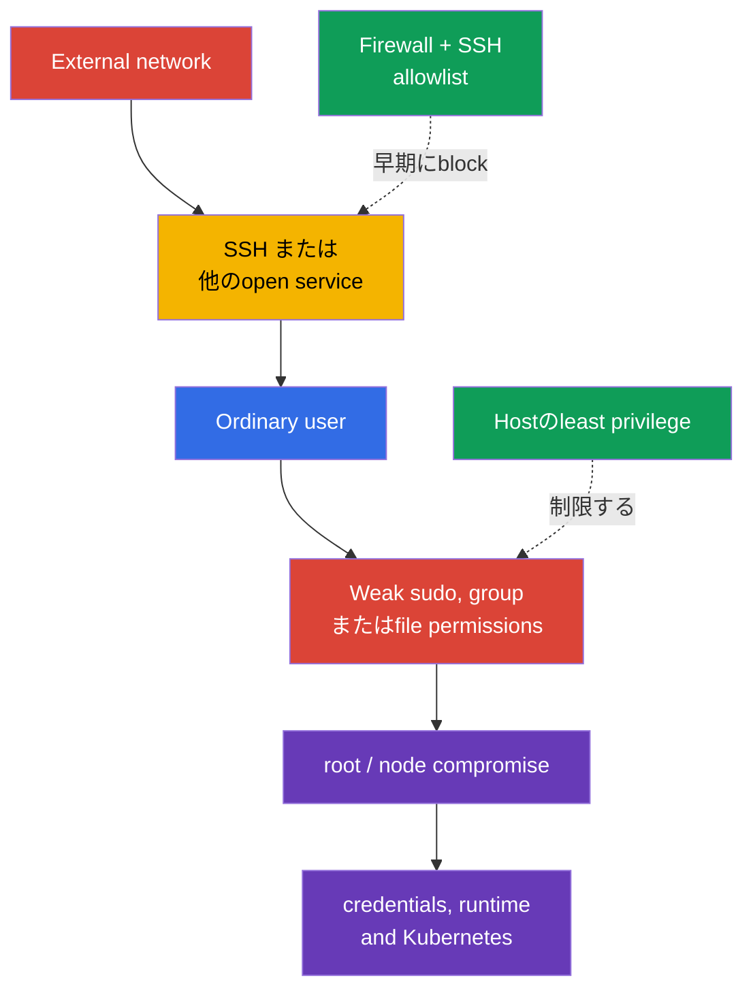
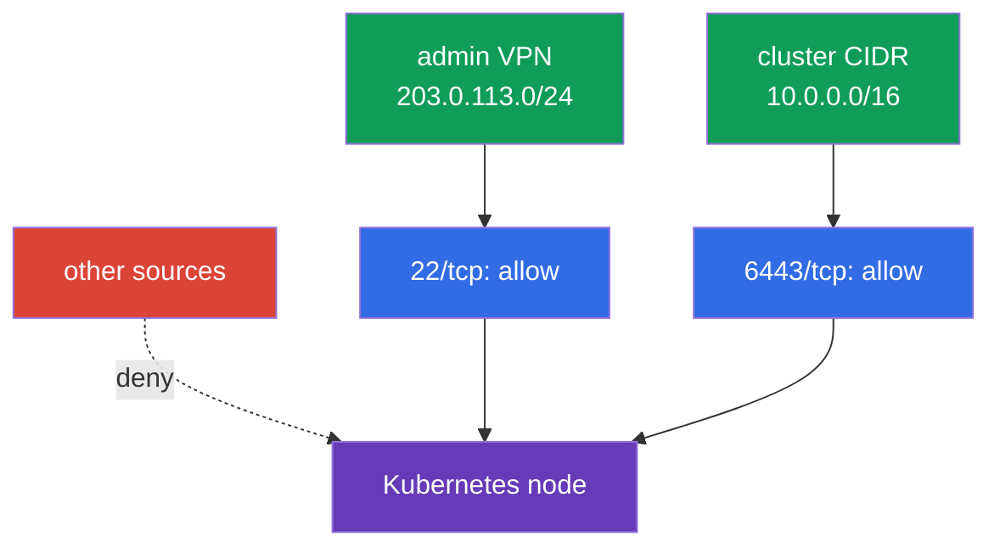

[Русская версия](ru.md) · [Eng version](README.md) · [Versión en español](es.md) · [Version française](fr.md) · [Deutsche Version](de.md) · [ქართული ვერსია](ge.md) · [繁體中文版](tw.md)

# 第15章. Hostでのleast privilegeとexternal network accessの最小化

> **問題。** 開いたSSHまたはlocal accountを入口にした攻撃者は、broadな`sudo`、privileged group、writable configuration fileを探します。一つのerrorでrootになり、kubelet credentialsを読み、runtime socketへ接続でき、限定されたnode accessがnodeとKubernetesのcompromiseになります。

> **次に行うこと。** 第14章では不要なservices、packages、insecureなcontainer runtime accessを取り除きnode attack surfaceを減らしました。ここでは残るentry pointの影響、すなわちhostへloginできる者、`sudo`で可能な操作、read/writeできるfiles、nodeへのnetwork accessを制限します。これはCKSの**System Hardening** domainです。

> **CKAから必要なこと。** users、groups、file permissions、processes、systemd、network commandsの基礎は[CKA Linux章](../../../cka/course/00-5-linux/jp.md)で扱います。ここではKubernetes nodeのprotectionに適用します。

## 15.1. Threat model: 一つの余分なaccessがnode compromiseになる

Kubernetes nodeにはkubelet credentials、`kubeconfig`、PKI keys、control-plane manifests、container-runtime sockets、logsというhigh-value dataとcontrol pointsがあります。secret fileをreadできる、configurationを変更できる、rootとしてcommandを実行できるuserは、元のroleより広いaccessを得られます。open SSHや不要なportはattack chainをexternal sourceから開始させます。



least privilegeは「誰にも何も与えない」ことではなく、必要なaccessだけを必要な期間与えaudit可能にすることです。nodeではlocal identity、targeted `sudo`、file owners/modes、firewall、SSHというindependent layersです。どれも他を置き換えません。working nodeを変更する前にprovider consoleまたはsecond SSH sessionでemergency accessを確保してください。`sudoers`、firewall、`sshd_config`のerrorはadministrative accessを失わせます。

> 🧠 node compromiseはexternal entry、local identity、`sudo`、file permissions、runtime socketsのchainです。hostのleast privilegeはKubernetes RBACを置き換えません。

> 🎯 separate users、minimal groups、narrow audited `sudo`、precise owner/modeを使用し、target userのeffective permissionsとwritable parent directoriesを確認します。

## 15.2. Users、groups、`sudo`: 能力を与え、full rootを与えない

shared accountや常時rootでの作業を避けます。operatorごとにseparate userを使用すると、個人ごとにaccessをrevokeしactionsを`auth.log`またはjournaldと対応付けられます。

```bash
# ローカル users と groups を inventory する。
USER_TO_REVIEW='user-to-review'
SERVICE_USER='service-user'
getent passwd
getent group
id "$USER_TO_REVIEW"
groups "$USER_TO_REVIEW"

# 使用していない interactive account の password authentication を禁止する。
sudo usermod --lock "$USER_TO_REVIEW"

# new login を防ぐため account 自体も別途 disable する（usermod --lock は
# password hash だけを lock し、Linux account 全体を無効化するわけではない）。
sudo usermod --expiredate 1 "$USER_TO_REVIEW"

# state を確認する。
sudo passwd -S "$USER_TO_REVIEW"
sudo chage -l "$USER_TO_REVIEW"

sudo usermod --shell /usr/sbin/nologin "$SERVICE_USER"
```

account expirationとpassword lockは既存processes/sessionsを終わらせません。immediate revocationではactive sessions、SSH keys、privileged groups、central IAM/SSO sourceも確認し、approved incident/offboarding procedureでaccessを終了します。service accountではserviceが起動を続ける必要があるならexpirationを機械的に適用せず、通常は`nologin`でinteractive shellを禁じgroups/permissionsを最小化します。`sudo`、`wheel`、`docker`、`lxd`、runtime socket ownersのgroupsはbroad escalationを意味するため便利さで付与しません。

### `sudo`: minimal command set

`user ALL=(ALL) ALL`は便利ですがfull rootを与えます。一操作だけなら、specific commandとfixed argumentsを`/etc/sudoers.d/`のseparate fileで許可します。`visudo`で編集しますが、`visudo -f <alternative-path>`がexplicitな`-O`と`-P`なしにowner/permissionsを自動verifyするわけではありません。作成後に`root:root`と`0440`を設定し、`visudo -cf /etc/sudoers`でfull policyをvalidateします。

```bash
# systemctl の固定 path を仮定せず、予測可能な system PATH から path を解決する。
SYSTEMCTL_PATH="$(env -i PATH=/usr/sbin:/usr/bin:/sbin:/bin sh -c 'command -v systemctl')"
test -n "$SYSTEMCTL_PATH" && SYSTEMCTL_PATH="$(readlink -f -- "$SYSTEMCTL_PATH")"
sudo test -x "$SYSTEMCTL_PATH"
sudo stat -c '%U:%G %a %n' "$SYSTEMCTL_PATH"  # root:root かつ others に書き込み権限がないことを期待する
```

`systemctl`を直接許可するより、argumentsなしのroot-owned wrapperが安全です。wrapperは許可されたpathだけを呼び、常にpagerを無効にします。作成前に`/usr/local/sbin`がroot-ownedでunprivileged usersにwritableでないことを確認します。

```bash
sudo tee /usr/local/sbin/k8s-kubelet-status >/dev/null <<'EOF'
#!/bin/sh
PATH=/usr/sbin:/usr/bin:/sbin:/bin
SYSTEMCTL_PATH="$(command -v systemctl)" || exit 1
exec "$SYSTEMCTL_PATH" --no-pager status kubelet
EOF
sudo chown root:root /usr/local/sbin/k8s-kubelet-status
sudo chmod 0755 /usr/local/sbin/k8s-kubelet-status
sudo visudo -f /etc/sudoers.d/k8s-operator
sudo chown root:root /etc/sudoers.d/k8s-operator
sudo chmod 0440 /etc/sudoers.d/k8s-operator
sudo visudo -c -O -P -f /etc/sudoers.d/k8s-operator
sudo visudo -cf /etc/sudoers
```

```sudoers
# /etc/sudoers.d/k8s-operator - wildcard なし・引数なしの exact wrapper。
# 空の quotes は「引数なしのみ」を意味する argument specification。これがないと
# この path を任意の引数で実行できてしまう。
Cmnd_Alias KUBELET_STATUS = /usr/local/sbin/k8s-kubelet-status ""
k8s-operator ALL=(root) KUBELET_STATUS
```

target userに対するeffective policyを確認します。`sudo`/authentication errorを`|| echo`でexpected denialに変えず、complete policy listingが成功してから、そのsaved outputで`/bin/bash`、shell/interpreter、arbitrary `systemctl`がないことをreviewします。editor、interpreter、`systemctl edit`、arbitrary pathを受けるcommands、administrative kubeconfigを持つ`kubectl`はnarrow-looking ruleをbypassできます。safe argumentsを記述できないなら、false securityよりlogging付きcontrolled break-glass procedureを使います。

```bash
policy=$(sudo -l -U k8s-operator) || {
  echo 'ERROR: cannot retrieve sudo policy for k8s-operator' >&2; exit 2;
}
printf '%s\n' "$policy" | tee /tmp/k8s-operator-sudo-policy.txt
# Review: /usr/local/sbin/k8s-kubelet-status の引数なし実行だけが許可され、
# /bin/bash、shell/interpreter、任意の systemctl は存在しない。
```

sudoersのevent/command loggingとI/O loggingは別mechanismsです。`logfile`はevent logのfile destination、`log_input`/`log_output`または`LOG_INPUT`/`LOG_OUTPUT`は`iolog_*`または`log_servers`のlocationへinput/outputを記録します。

```bash
# command/I/O logging に関する sudoers 設定を inventory する。
sudo grep -REns \
  '(^|[[:space:],])((logfile|log_input|log_output|iolog_dir|iolog_file|log_servers)([=[:space:],]|$)|LOG_INPUT|LOG_OUTPUT)' \
  /etc/sudoers /etc/sudoers.d 2>/dev/null || true

# actual recent sudo events を確認する。
# 実際の journal/syslog/logfile は policy と distro に依存する。
sudo journalctl _COMM=sudo --since '1 day ago'
```

`logfile`、`iolog_dir`、`sudoreplay`もpolicyに応じて確認します。空の`journalctl`はloggingがない証明ではありません。`NOPASSWD`はcompromiseの証拠そのものではありませんが、開かれたsessionのunauthorized useに対するprotectionを下げます。automationが必要とするshortでreviewedなnoninteractive commandsだけに使います。

## 15.3. File permissionsとownership: credentialsとconfigurationを守る

POSIX permissionsはread（`r`）、modify（`w`）、directory traversal（`x`）できる者を決めます。secret private keyはordinary userに読ませず、control-plane configurationは変更させません。fileだけでなくpathの全directoriesを確認します。parent directoryへのwrite permissionでcontentをsubstituteできます。

```bash
# file の mode、owner、full path を確認する。
stat -c '%A %a %U:%G %n' /etc/kubernetes/admin.conf
namei -l /etc/kubernetes/admin.conf

# sensitive area で world-writable files を検索する。sticky bit は別途除外する。
sudo find /etc/kubernetes -xdev -type f -perm -0002 -ls
sudo find /etc/kubernetes -xdev -type d -perm -0002 -ls
```

| Object | weak permissionsのrisk | 安全な方向 |
|---|---|---|
| `/etc/kubernetes/pki/*.key` | CAまたはclient private keyのtheft | `root:root`、rootだけread、通常`600` |
| `/etc/kubernetes/admin.conf` | userがcluster-admin credentialを得る | `root:root`、`600`。shared directoriesへcopyしない |
| `/etc/kubernetes/manifests/` | control-plane static Podのsubstitution | directoryとYAMLはrootだけwrite可能 |
| `/var/lib/kubelet/config.yaml`とkubelet credentials | kubelet behaviorの変更またはnode identityのtheft | root owner、unprivileged userはwrite不可 |
| `~/.ssh/authorized_keys` | foreign SSH keyの追加 | `.ssh`は`700`、`authorized_keys`は`600`、user owner |

```bash
sudo chown root:root /etc/kubernetes/admin.conf
sudo chmod 600 /etc/kubernetes/admin.conf
sudo stat -c '%U %G %a %n' /etc/kubernetes/admin.conf
```

`/etc/kubernetes`全体へrecursiveな`chmod -R 600`をしないでください。directoriesには`x`が必要で、public certificates/configurationsには別modeが必要なことがあります。owner、purpose、actual consumerを確認後にspecific objectだけ変更します。SUID/SGID binariesもinventoryし、internet listでsystem SUID filesを削除せず、package ownershipとnodeでの必要性を確認します。

```bash
set -euo pipefail
BINARY_PATH='/path/to/reviewed-binary'
# Inventory every selected local filesystem separately: `find / -xdev` would miss /usr, /var, /opt, etc.
findmnt -rn -o TARGET,FSTYPE |
while IFS=' ' read -r target fstype; do
  case "$fstype" in
    proc|sysfs|devtmpfs|devpts|tmpfs|cgroup|cgroup2|overlay|squashfs|nfs|nfs4|cifs|fuse.*|autofs|nsfs|mqueue|hugetlbfs|rpc_pipefs)
      continue
      ;;
  esac
  sudo find "$target" -xdev -type f -perm /6000 -printf '%m %u:%g %p\n' 2>/dev/null
done | LC_ALL=C sort -u

# Package ownership is distro-aware; a file without an owner needs provenance review.
if command -v dpkg-query >/dev/null 2>&1; then
  sudo dpkg-query -S "$BINARY_PATH" || {
    echo 'REVIEW_REQUIRED: no Debian package owns this binary; review its provenance' >&2
    exit 2
  }
elif command -v rpm >/dev/null 2>&1; then
  sudo rpm -qf "$BINARY_PATH" || {
    echo 'REVIEW_REQUIRED: no RPM package owns this binary; review its provenance' >&2
    exit 2
  }
else
  echo 'REVIEW_REQUIRED: package manager is unknown' >&2
  exit 2
fi
```

> 🎯 flows matrixとallowlistを作り、second access pathを保持してdeny-by-defaultを適用し、allowed/denied segmentsを確認します。

## 15.4. Firewall: external sourceに必要なportsだけを開く

Firewallはdeny-by-defaultとexplicit allow rulesで構築します。nodeはcluster参加を理由にnetwork全体へ公開される必要はありません。SSHはadministrative networkだけ、Kubernetes portsはagreed control-plane、worker、monitoring sourcesだけに許可します。exact portsはtopology、CNI、componentsに依存するので、まずactual listenersとrequirementsを確認します。

```bash
sudo ss -lntup
sudo ss -lntup | grep -E ':(22|6443|10250|10256|10257|10259|2379|2380)\b' || true
```

| Port | 通常のpurpose | Accessを持つべき者 |
|---|---|---|
| `22/tcp` | SSH | bastion/VPN/administrative CIDRだけ |
| `6443/tcp` | kube-apiserver | worker/control planeとallowed administrators |
| `10250/tcp` | protected kubelet API | control planeとnecessary monitoring、internet以外 |
| `10256/tcp` | kube-proxy healthz | designated health-check/monitoring sourcesだけ（loopback-onlyでない場合） |
| `10257/tcp` | kube-controller-manager | 必要なcontrol-plane/monitoringだけ、internet以外 |
| `10259/tcp` | kube-scheduler | 必要なcontrol-plane/monitoringだけ、internet以外 |
| `2379-2380/tcp` | etcd client/peer | control-plane/etcd peersだけ |
| `30000-32767/tcp`、`30000-32767/udp`（default） | NodePort | published Serviceを必要とするclient/LB CIDRだけ；実際のrangeは API server の `--service-node-port-range` で確認する |
| variable CNI ports | overlay、node-to-node、Pod traffic | chosen CNI documentationのexact CIDRs/protocols |

backendを理解せず`ufw`、`iptables`、`nftables`のthree managersを混在させません。`ufw`はhigh-level wrapperであり、現代の`iptables`は多くの場合`nf_tables`の上で動作します；`ufw`、`iptables`、`nftables`を並行してmanualに変更すると、auditが難しくなり、想定していたrulesを上書きする可能性があります。node imageとconfiguration managementがsupportするtool一つをsource of truthにします。

> 🔬 全てのfirewall実装を覚える必要はありません；重要なのはhost firewall controlを理解し、利用可能なbackend（`ufw`、`iptables`、`nftables`）を適用できることです。

### Variant A: `ufw`

`default deny`の前に、bastion/VPN、control plane、worker、etcd、load balancer、monitoring、Pod/Service CIDR、chosen CNIのactual topologyに基づくallowlistを作ります。forwarded/routed traffic、`DEFAULT_FORWARD_POLICY`、IPv4/IPv6 forwarding、`ufw route`とCNI-specific flowsも確認します。CNIとPod trafficはIPv4/IPv6 forwardingと`ufw route`ルールを必要とすることが多く、`ufw allow ... to any port ...`の1ペアだけではforwarded/routedなCNI/Pod trafficには不十分です。`DEFAULT_FORWARD_POLICY`、`net.ipv4.ip_forward`、IPv6 forwarding、CNI-specific flowsを必ず確認してください。そうしないとSSH/APIは生き残っても、Pod networkingが壊れる可能性があります。second SSH sessionとout-of-band consoleを保持し、新SSH loginとallowed networksからkubelet/APIを確認するまでcurrent sessionを閉じません。

```bash
# 例: SSH は administrative network からのみ許可する。
sudo ufw allow from 203.0.113.0/24 to any port 22 proto tcp

# 例: API は node network と administrator network からのみ許可する。
sudo ufw allow from 10.0.0.0/16 to any port 6443 proto tcp
# この位置より前に、installation 固有の role/CNI allow rules を追加する。
sudo ufw default deny incoming
sudo ufw default allow outgoing
sudo ufw enable
sudo ufw status numbered
```

ruleを削除する前にnumberとpurposeをreviewし、targetedに削除します。

```bash
RULE_NUMBER='1'
sudo ufw status numbered
sudo ufw delete "$RULE_NUMBER"
```

### Variant B: `iptables`

lab exampleではestablished traffic、loopback、allowlistからのSSHを許可し、残りのinbound trafficをdenyします。real clusterでは`DROP`前にdocumented Kubernetes/CNI flowsを追加します。`FORWARD` chains、IPv4、IPv6も確認します。CNIはPod trafficを`INPUT`以外にrouteすることがあり、final `INPUT` DROPはforwarding policyやCNI rulesの代わりになりません。

```bash
sudo iptables -A INPUT -m conntrack --ctstate ESTABLISHED,RELATED -j ACCEPT
sudo iptables -A INPUT -i lo -j ACCEPT
sudo iptables -A INPUT -p tcp -s 203.0.113.0/24 --dport 22 -j ACCEPT
sudo iptables -A INPUT -p tcp -s 10.0.0.0/16 --dport 6443 -j ACCEPT
sudo iptables -A INPUT -j DROP
sudo iptables -S INPUT
```

`-A`はchain末尾へaddします。上にexisting ACCEPTがあればfinal DROPはdeny-by-defaultを保証せず、IPv4 rulesはIPv6をcoverしません。full ruleset orderをreviewし、permanent policyにはexplicit jump付きdedicated chainまたはexplicit policyの`nftables`を使います。manual append rulesをCNI/firewall manager rulesと混ぜません。commandでaddしたrulesはreboot後に残らない場合があるため、distribution-nativeまたはdeclarative persistenceを使います。

### Variant C: `nftables`

`nftables`はmodern kernel mechanismで、explicit policyとwhole rulesetを一commandで確認できます。CNIまたはfirewall managerがtablesを作っているnodeでは、existing rulesetをreviewせずexampleを適用しません。

```nft
# /etc/nftables.conf: host ingress 用の独立 table fragment
 table inet host_filter {
   chain input {
     type filter hook input priority filter; policy drop;
     ct state established,related accept
     iifname "lo" accept
     ip saddr 203.0.113.0/24 tcp dport 22 accept
     ip saddr 10.0.0.0/16 tcp dport 6443 accept
   }
 }
```

```bash
sudo nft -c -f /etc/nftables.conf
sudo systemctl reload nftables
sudo nft list ruleset
```



Host firewallはcloud Security Group、private endpoint、routing、Kubernetes NetworkPolicyを補完し、置き換えません。NetworkPolicyは主にPod traffic、node firewallはhost trafficをcontrolします。CNIとcloud networkのresponsibility boundaryを確認してください。

> 🏭 node roleにはそのbootstrap、network、storage、telemetry permissionsだけを与え、workloadはseparate minimal workload identityを使います。

## 15.4.1. Cloud/node IAM: workloadごとのseparate minimal role

least privilegeはcloud IAMにも適用されます。Kubernetesがnodeで動くという理由だけでnode/instance roleへbroad cloud-admin permissionsを与えず、そのroleに必要なbootstrap、network、storage、telemetry permissionsだけを与えます。workloadがnode role credentialsを自動継承しないよう、specific ServiceAccount向けのseparate minimal cloud roleを持つworkload identity、IRSA、またはequivalentを使います。platformがsupportする場合はPodからinstance metadataとnode credentialsへのaccessを制限します。cloud roleはKubernetes RBACとは別にreviewします。minimal RoleBindingがcloud permissionsの最小性を証明するわけではありません。

## 15.5. SSH hardening: primary administration pathを守る

SSHは多くの場合nodeへの唯一のremote entryです。passwordよりseparate administrative user accountとkeysを優先します。direct `root` loginはbrute forceを容易にし、logsのindividual identityをなくします。

> 🎯 keyとalternative accessを確認し、root/password loginを禁止して、`sshd -t`、`sshd -T`、allowed userでのloginを確認します。

modern OpenSSHではlarge vendor fileを編集せずsmall drop-inを作ると便利です。最初に`Include`でdirectoryが読み込まれることを確認します。wildcard `Include` filesはlexical orderで処理され、通常のscalar keywordsはfirst valueが使われるため、`99-hardening.conf`はpriorityを保証しません。一方`AllowUsers`、`AllowGroups`、`DenyUsers`、`DenyGroups`はmultiple occurrencesがlistへaddされます。early `00-hardening.conf`は別の`AllowUsers`を打ち消しません。すべてをinventoryし、conflictsをmanaged allowlistへremove/mergeして、`sshd -T`、`Match`があれば`sshd -T -C user=...,host=...,addr=...`でeffective resultを確認します。以下の**一つ**のprofileを選びます。両方password loginを禁止しますが、MFA profileはkeyとPAM keyboard-interactiveもrequireします。両方を同時に有効にしません。

```bash
sudo grep -RnsE \
  '^[[:space:]]*(Include|Match|AllowUsers|AllowGroups|DenyUsers|DenyGroups)[[:space:]]' \
  /etc/ssh/sshd_config /etc/ssh/sshd_config.d 2>/dev/null || true
```

**Profile A — key only.**

```bash
sudo install -d -o root -g root -m 0755 /etc/ssh/sshd_config.d
sudo tee /etc/ssh/sshd_config.d/00-hardening.conf >/dev/null <<'EOF'
PermitRootLogin no
PasswordAuthentication no
KbdInteractiveAuthentication no
PubkeyAuthentication yes
AllowUsers k8s-operator
EOF
sudo chown root:root /etc/ssh/sshd_config.d/00-hardening.conf
sudo chmod 0600 /etc/ssh/sshd_config.d/00-hardening.conf
sudo stat -c '%U:%G %a %n' \
  /etc/ssh/sshd_config.d /etc/ssh/sshd_config.d/00-hardening.conf

SSHD_UNIT="$(
  systemctl list-unit-files --type=service --no-legend \
    | awk '$1 == "ssh.service" || $1 == "sshd.service" { print $1; exit }'
)"
test -n "$SSHD_UNIT" || {
  echo 'ERROR: ssh.service/sshd.service was not found' >&2
  exit 1
}

sudo sshd -t
sudo systemctl reload "$SSHD_UNIT"
```

**Profile B — key + MFA via PAM keyboard-interactive.** MFA PAM moduleをconfigure・testした後だけ使います。`AuthenticationMethods`はone-time codeでkeyをreplaceせず、両factorsをrequireします。

```text
PermitRootLogin no
PasswordAuthentication no
PubkeyAuthentication yes
KbdInteractiveAuthentication yes
UsePAM yes
AuthenticationMethods publickey,keyboard-interactive:pam
AllowUsers k8s-operator
```

Profile Bを同じ`/etc/ssh/sshd_config.d/00-hardening.conf`に保存し、同じowner/mode invariantを適用してから、`sshd -t`とactual OpenSSH server unit（Debian/Ubuntuでは`ssh.service`、多くのRHEL-familyでは`sshd.service`）のreload前に確認します。

```bash
sudo install -d -o root -g root -m 0755 /etc/ssh/sshd_config.d
sudo chown root:root /etc/ssh/sshd_config.d/00-hardening.conf
sudo chmod 0600 /etc/ssh/sshd_config.d/00-hardening.conf
sudo stat -c '%U:%G %a %n' \
  /etc/ssh/sshd_config.d /etc/ssh/sshd_config.d/00-hardening.conf
sudo sshd -t
# Profile A と同じ distro-aware 方法で ssh.service/sshd.service を判定してから reload する。
```

unit nameを全Linux distributionsで一つに固定しません。`AllowUsers`はstrong restrictionですが、listed以外をすべてblockします。required break-glass/automation accountsを追加するまで適用せず、ownersをdocumentしてlistをreviewします。current SSH sessionを閉じる前にeffective valuesを確認し、allowed userでsecond sessionをloginします。Profile Aはkeyだけ、BはkeyとMFAをtestします。

```bash
sudo sshd -T | grep -E 'permitrootlogin|passwordauthentication|kbdinteractiveauthentication|pubkeyauthentication|usepam|authenticationmethods|allowusers'
NODE_ADDRESS='node-address.example.internal'
# Profile A（key only）: check は non-interactive で、password/MFA を要求してはならない。
ssh -o BatchMode=yes -o PreferredAuthentications=publickey \
  -o PasswordAuthentication=no -o KbdInteractiveAuthentication=no \
  "k8s-operator@${NODE_ADDRESS}" id

# Profile B（key + MFA）: BatchMode を使わず、second-factor prompt を完了する。
ssh -o PreferredAuthentications=publickey,keyboard-interactive \
  -o PasswordAuthentication=no -o KbdInteractiveAuthentication=yes \
  "k8s-operator@${NODE_ADDRESS}" id
```

effective `allowusers`がapproved accounts、required break-glass/automation identitiesだけを含み、別Includeのextra valuesを含まないことを確認します。`Match`ではrelevant user/sourceごとに`sshd -T -C`を使用します。target userのkeyが実際にinstallされ、correct permissionsでbastion/VPN経由で働くと確認するまでpassword authenticationを無効にしません。emergency accessはprovider consoleまたはcontrolled break-glass accountで提供し、permanent root passwordにはしません。

## 15.6. Verificationとdiagnosis: protectionが働くことを証明する

verificationはfile内のlineではなくactual behaviorを確認します。network testsはallowedとdenied segmentsから、`sudo` testsはunprivileged userとして行います。production nodeでdestructive commandsを使わず、rollback planなしにactive rulesを削除しません。

```bash
# 1. sensitive files の owners と modes を確認する。
sudo stat -c '%U %G %a %n' \
  /etc/kubernetes/admin.conf \
  /etc/kubernetes/pki/ca.key

# 2. user authentication と混同せず policy を取得する。sudo -l が
# 失敗した場合、それは operational error であり policy denial の証明ではない。
policy=$(sudo -l -U k8s-operator) || {
  echo 'ERROR: cannot retrieve sudo policy for k8s-operator' >&2; exit 2;
}
printf '%s\n' "$policy" | tee /tmp/k8s-operator-sudo-policy.txt
# Review listing: 引数なし wrapper だけが許可され、/bin/bash は存在しない。

# 3. 選択した mechanism の actual firewall を確認する。
sudo ufw status verbose             # ufw を使用している場合
sudo iptables -S INPUT               # iptables を使用している場合
sudo nft list ruleset                # nftables を使用している場合

# 4. node 自体の listeners を確認する。
sudo ss -lntup

# 5. SSH configuration の syntax と effective configuration を確認する。
sudo sshd -t
sudo sshd -T | grep -E 'permitrootlogin|passwordauthentication|pubkeyauthentication'
```

allowlist外hostからはexpected refusalまたはtimeoutだけを確認し、allowed networkからはroleに必要なscopeのSSH/API access成功を確認します。SSH authentication checkと`sudo` authorization/authentication checkはindependentです。TTYなしの`sudo` password promptはSSHまたはsudo policy errorの証明ではありません。

```bash
# 許可された CIDR の外側の host からは connection が成立してはならない。
NODE_ADDRESS='node-address.example.internal'
nc -vz -w 3 "$NODE_ADDRESS" 22

# SSH login proof, Profile A: key-only and non-interactive.
ssh -o BatchMode=yes -o PreferredAuthentications=publickey \
  -o PasswordAuthentication=no -o KbdInteractiveAuthentication=no \
  "k8s-operator@${NODE_ADDRESS}" id

# SSH login proof, Profile B: complete publickey + keyboard-interactive MFA; no BatchMode.
ssh -o PreferredAuthentications=publickey,keyboard-interactive \
  -o PasswordAuthentication=no -o KbdInteractiveAuthentication=yes \
  "k8s-operator@${NODE_ADDRESS}" id

# Run this separately from an interactive admin terminal when sudo policy requires a password.
ssh -t "k8s-operator@${NODE_ADDRESS}" 'sudo -l'
# Or prove a specific allowed wrapper:
# ssh -t "k8s-operator@${NODE_ADDRESS}" 'sudo /usr/local/sbin/k8s-kubelet-status'

# Use this only when NOPASSWD is an explicit policy requirement for the checked command/listing.
ssh -o BatchMode=yes "k8s-operator@${NODE_ADDRESS}" 'sudo -n -l'
```

| Symptom | 想定原因 | 確認すること |
|---|---|---|
| firewall後にSSHが到達不能 | source/portがallowされていない、またはrule order誤り | console access、`ufw status numbered`、`iptables -S`、`nft list ruleset` |
| kubeletがAPIと通信しない | firewallが`6443`またはnode間routeを閉じた | `journalctl -u kubelet`、allowlist、Security Group、DNS/route |
| `sudo`がexpectedより多く許可 | broad rule、別group membership、dangerous allowed command | `sudo -l -U <user>`、`id <user>`、すべての`/etc/sudoers.d/*` |
| SSH hardening後にloginできない | key inaccessible、drop-in未include、`AllowUsers`が狭すぎる | `sshd -t`、`sshd -T`、`~/.ssh` permissions、console access |
| `chmod`後にKubernetes componentがstartしない | directory/file permissions変更によりrequired runtime permissionsが消えた | `journalctl -u kubelet`、`crictl ps -a`、`namei -l` |

> 🏭 host identities、`sudoers`、firewall、SSHをcodeとしてmanageします。owner、expiry、log、rollback、role-specific allowlist、periodic drift checksを持ちます。

## 15.7. productionでの適用方法

- **Identity lifecycle.** local accountsをIAM/CMDB/configuration managementで作成し、ownerとaccess期限を把握して退職者を即座にblockします。permanent shared root accountは使用しません。
- **Privileges as code.** `sudoers` files、groups、sensitive pathsのownersをAnsible、image pipeline、IaCで定義し、driftを防ぎcode review可能にします。
- **Node-role firewall.** control plane、worker、bastion、monitoringには異なるallowlistsを用意し、CNIとhealth checksを含むactual flow matrixからrulesを作りstagingでtestします。
- **BypassのないSSH.** short-lived SSH certificatesまたはbastion/VPN経由のcentral access、MFA、auditを使います。password/root loginは無効のままとし、break-glass accessにはownerとreview procedureを持たせます。
- **Continuous verification.** [第07章](../07/jp.md)のCIS scanning、file-integrity monitoring、world-writable pathsのsearch、open ports controlをaudit前だけでなく定期実行します。
- Kubernetes v1.37では、rootless node architecture（`KubeletInUserNamespace`）をadditional least-privilege boundaryとして個別に評価します。これはPod user namespacesとは別です。[Kubernetes v1.37 Security Delta](../APPENDIX_K8S_137_SECURITY_DELTA_JP.md)を参照してください。

## 15.8. ミニ用語集

- **least privilege** - subjectのtaskに必要なminimum permissionsだけをlimited durationで与えること。
- **`sudoers`** - userが別userとして実行できるcommandsを定めるpolicy。`visudo`で編集します。
- **SUID/SGID** - programをownerのeffective UIDまたはgroupのGIDで実行するspecial file bits。inventoryが必要です。
- **allowlist** - allowed sources、users、ports、actionsのexplicit list。他はすべてdenyします。
- **host firewall** - `ufw`、`iptables`、`nftables`などnode自体のfiltering rules。
- **drop-in** - `/etc/ssh/sshd_config.d/00-hardening.conf`のようにbase configurationを補うseparate config file。
- **break-glass access** - incidentまたは通常administration path喪失時だけに使うcontrolled emergency access。

## 15.9. 章のまとめ

- Separate users、minimal groups、targeted `sudo`はaccount compromiseのimpactを減らし、actionsをverifiableにします。
- Private keys、kubeconfig、static Pod manifests、kubelet configurationにはcorrect owner/modeが必要です。purposeを理解しないrecursive `chmod`は危険です。
- Firewallはdefault denyとnecessary flowsのallowlistから構築します。clear source of truthなしに`ufw`、`iptables`、`nftables`を混在させません。
- SSHはkeys、`PermitRootLogin no`、password authenticationのdisable、allowed usersのrestrictionでprotectしますが、second access pathの確認後だけ適用します。
- Resultはreal attemptsで証明します。extra `sudo` commandはdenyされ、sensitive fileは読めず、closed portは応答せず、allowed accessはworkingであるべきです。

## 15.10. これはどのように役立つか: 試験と実務

**試験で。** kubeconfig modeの修正、dangerous groupからのuser削除、`sudo` restriction、firewallでのport close、root SSHの禁止を求められることがあります。current configurationを読んでnamed objectだけを変更し、`stat`、`sudo -l`、`ss`、firewall output、`sshd -t`でresultを証明します。network change前には自身のSSH accessを保持します。

**実務で。** Podまたはaccountのcompromiseがautomaticにnode rootとcluster全体へのaccessになるべきではありません。separate users、protected credentials、narrow firewall、audited SSHにより、wide attack pathをindependent barriersへ分け、regular verificationとautomationを可能にします。

## 15.11. 自己確認問題

<details><summary>1. なぜ`docker` membershipまたはbroadな`sudo` ruleはrootと同等になり得ますか?</summary>

`docker` group memberはDocker socketへ接続しhost accessを持つcontainerを作成できるためroot-equivalentです。`user ALL=(ALL) ALL`はarbitrary commandをrootとして実行できます。どちらもordinary user restrictionsをbypassするためroot accessと同じ慎重さが必要です。
</details>

<details><summary>2. ordinary userにread/write可能にすると特に危険なKubernetes filesは何ですか?</summary>

`/etc/kubernetes/pki/*.key`と`/etc/kubernetes/admin.conf`はCA、client key、cluster-admin credentialを与え得ます。`/etc/kubernetes/manifests/`へのwriteはcontrol-plane static Podをsubstituteできます。`/var/lib/kubelet/config.yaml`とkubelet credentialsもunprivileged usersにwriteさせません。
</details>

<details><summary>3. `/etc/kubernetes`全体にrecursiveな`chmod 600`をしてはいけない理由は何ですか?</summary>

directoriesにはtraversal用の`x`が必要で、public certificates/configurationsには別のexpected modeがあります。`chmod -R 600`はkubelet/static Podを壊し得ます。`stat`と`namei -l`でobject、owner、consumer、pathを確認しtargetedに変更します。
</details>

<details><summary>4. accessを失わずclusterを壊さないため、default-deny firewall前に何をallowしますか?</summary>

bastion/VPN SSH、control plane、workers、etcd peers、load balancer、monitoring、Pod/Service CIDR、specific CNI protocolsのactual topology-based allowlistを作ります。必要な`6443`、`10250`、`2379-2380`、health endpoints、使用中のNodePort flowsを含めます。current SSH sessionとsecond sessionを保持し、forwarding/`ufw route`、IPv4/IPv6、CNI trafficを別途確認します。
</details>

<details><summary>5. host firewall、Security Group、NetworkPolicyのresponsibilityはどう異なりますか?</summary>

host firewallはnode traffic、Security Group/cloud firewallはinfrastructure network perimeterとendpoint sourcesをcontrolします。NetworkPolicyはCNIが主にPod trafficへ適用し、全topologyでhost/control-plane path protectionを置き換えません。controlsは補完関係です。
</details>

<details><summary>6. password authenticationを無効にする前にsecond SSH sessionを開く理由は何ですか?</summary>

key未install、wrong permissions、drop-in未include、狭すぎる`AllowUsers`ならadministrator accessを失います。independent second sessionとout-of-band consoleがrollback pathを残します。current sessionを閉じる前に`sshd -t`、effective `sshd -T`、allowed userのkey loginを確認します。
</details>

<details><summary>7. SSH/firewall settingsが書かれただけでなくworkingだと証明するcommandsは何ですか?</summary>

`sudo sshd -t`と`sudo sshd -T | grep ...`の後、allowed networkから`ssh -o BatchMode=yes ...`でreal key-only loginを行います。active firewallは`ufw status verbose`、`iptables -S INPUT`、`nft list ruleset`、listenersは`sudo ss -lntup`で確認します。unallowed segmentの`nc -vz -w 3 <node> 22`はexpected refusal/timeoutになるべきです。
</details>

<details><summary>8. **振り返り（第10章）。** host-level least privilegeとKubernetes API RBACの一方だけで十分でない例は何ですか?</summary>

ServiceAccountが`get pods`だけのnarrow Roleでも、containerd/Docker socket accessまたはbroad `sudo`を持つuserはnode rootとなりAPI boundaryをbypassできます。逆にstrict host firewall/file modesも、stolen ServiceAccount tokenのRBACがSecret readまたは`pods/exec`を許せばPodを止めません。両layersが必要です。
</details>

## 練習

Lab 105ではextra serviceをdisableし、unneeded portをcloseしてfirewallを適用し、sensitive file permissionsを修正してroot SSHを禁止します。separate Docker hostではDocker TCP APIを閉じ、`/var/run/docker.sock`をprotectし、`docker` groupへのextra accessを外します。

🧪 Lab 105（OS System HardeningとDocker daemon）：
[tasks/cks/labs/105](../../labs/105/README_JP.MD)

## 参考資料

- [CIS Kubernetes Benchmark](https://www.cisecurity.org/benchmark/kubernetes)
- [OpenSSH: sshd_config(5)](https://man.openbsd.org/sshd_config)

---
[目次](../README_JP.md) · [第14章](../14/jp.md) · [第16章](../16/jp.md)
