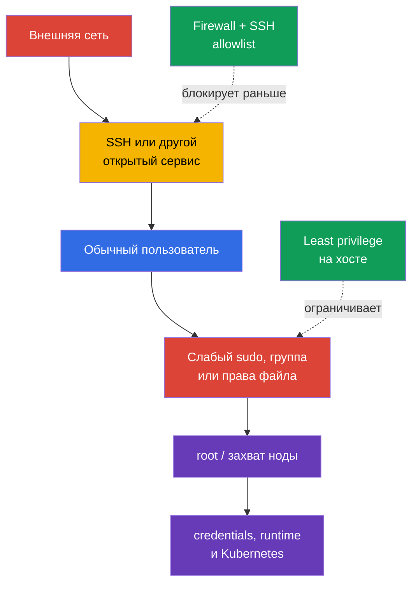
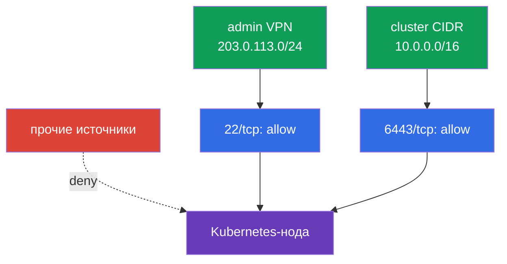

<!-- Standalone RU release: ссылки на переводы удалены, потому что соответствующие файлы не входят в архив. -->

# Глава 15. Least-privilege на хосте и минимизация внешнего доступа к сети

> **Что дальше.** В главе 14 мы уменьшили поверхность атаки ноды: убрали лишние сервисы,
> пакеты и небезопасный доступ к container runtime. Теперь ограничим последствия оставшейся
> точки входа: кому разрешено войти на хост, что пользователь может сделать через `sudo`,
> какие файлы он может читать или менять и откуда вообще доступна нода. Это домен
> **System Hardening** CKS.

> **Что нужно знать из CKA.** Базовые пользователи, группы, права файлов, процессы,
> systemd и сетевые команды разобраны в [главе Linux CKA](../../../cka/course/00-5-linux/ru.md).
> Здесь не повторяем основы, а применяем их для защиты Kubernetes-ноды.

## 15.1. Модель угроз: один лишний доступ превращается в захват ноды

На ноде Kubernetes есть высокоценные данные и точки управления: kubelet credentials,
`kubeconfig`, ключи PKI, манифесты control plane, сокеты container runtime и журналы.
Пользователь, который может читать секретный файл, менять конфигурацию или исполнять
команду от `root`, способен получить доступ шире своей исходной роли. Открытый SSH или
ненужный порт даёт атакующему возможность начать эту цепочку извне.



Least privilege означает не «никому ничего не давать», а выдавать только необходимый
доступ, на нужный срок и с возможностью аудита. Для ноды это несколько независимых слоёв:
локальная identity, точечный `sudo`, владельцы и режимы файлов, firewall и SSH. Ни один из
них не заменяет остальные.

Перед изменением рабочей ноды обеспечьте аварийный доступ через консоль провайдера или
вторую SSH-сессию. Ошибка в `sudoers`, firewall или `sshd_config` может оставить вас без
административного доступа.

> 🧠 Захват ноды — цепочка внешнего входа, локальной identity, `sudo`, файловых прав и runtime sockets; least privilege на хосте не заменяет Kubernetes RBAC.

> 🎯 Используйте отдельных пользователей, минимум групп, узкий audited `sudo` и точные owner/mode; проверяйте effective permissions целевого пользователя и writable родительские каталоги.

## 15.2. Пользователи, группы и `sudo`: выдаём возможность, а не полный root

Не используйте один общий аккаунт и не работайте постоянно от `root`. У каждого оператора
должен быть отдельный пользователь: это позволяет отозвать доступ одному человеку и
сопоставить действие с записью в `auth.log` или journald.

```bash
# Инвентаризация локальных пользователей и групп.
USER_TO_REVIEW='user-to-review'
SERVICE_USER='service-user'
getent passwd
getent group
id "$USER_TO_REVIEW"
groups "$USER_TO_REVIEW"

# Запретить password authentication для неиспользуемой интерактивной учётной записи.
sudo usermod --lock "$USER_TO_REVIEW"

# Отдельно отключить сам account для новых login (usermod --lock блокирует только
# password hash, а не весь Linux-account).
sudo usermod --expiredate 1 "$USER_TO_REVIEW"

# Проверить состояние.
sudo passwd -S "$USER_TO_REVIEW"
sudo chage -l "$USER_TO_REVIEW"

sudo usermod --shell /usr/sbin/nologin "$SERVICE_USER"
```

Account expiration и password lock не завершают уже существующие процессы/сессии. При
немедленном отзыве доступа отдельно проверьте активные sessions, SSH keys, привилегированные
группы и централизованный IAM/SSO source и завершите доступ по утверждённой
incident/offboarding procedure.

Для service account не применяйте account expiration механически, если сервис должен
продолжать запускаться. Для него обычно отдельно запрещают interactive shell через
`nologin` и минимизируют группы/permissions.

Сервисным аккаунтам не нужен интерактивный shell и членство в административных группах.
Домашний либо state-каталог создавайте только если он нужен сервису, с минимальными owner/mode.
Проверьте также группы, которые фактически означают широкую эскалацию: `sudo`, `wheel`, `docker`, `lxd`, а на конкретной системе - группы владельцев
сокетов container runtime. Членство в такой группе нельзя выдавать «для удобства».

### `sudo`: минимальный набор команд

Правило `user ALL=(ALL) ALL` удобно, но даёт полный root. Если оператору требуется одна
операция, разрешайте конкретную команду и её фиксированные аргументы в отдельном файле
`/etc/sudoers.d/`. Редактируйте его через `visudo`, но не приписывайте ему лишнюю защиту:
при `visudo -f <альтернативный-путь>` owner и permissions автоматически не проверяются без
явных `-O` и `-P`. После создания вручную задайте `root:root` и `0440`, затем валидируйте всю
policy через `visudo -cf /etc/sudoers` (проверка одного include-файла недостаточна).

```bash
# Разрешите путь через предсказуемый системный PATH, а не предполагая фиксированный путь systemctl.
SYSTEMCTL_PATH="$(env -i PATH=/usr/sbin:/usr/bin:/sbin:/bin sh -c 'command -v systemctl')"
test -n "$SYSTEMCTL_PATH" && SYSTEMCTL_PATH="$(readlink -f -- "$SYSTEMCTL_PATH")"
sudo test -x "$SYSTEMCTL_PATH"
sudo stat -c '%U:%G %a %n' "$SYSTEMCTL_PATH"  # ожидаются root:root и отсутствие записи для других
```

Надёжнее не предоставлять `systemctl` напрямую: даже узкое сопоставление аргументов легко
расширить ошибочной правкой. Создайте root-владельческий wrapper без аргументов; он вызывает
**ровно** путь, разрешённый выше, и всегда отключает pager. Перед созданием убедитесь, что
`/usr/local/sbin` принадлежит root и недоступен для записи непривилегированным пользователям.

```bash
sudo tee /usr/local/sbin/k8s-kubelet-status >/dev/null <<'EOF'
#!/bin/sh
PATH=/usr/sbin:/usr/bin:/sbin:/bin
SYSTEMCTL_PATH="$(command -v systemctl)" || exit 1
exec "$SYSTEMCTL_PATH" --no-pager status kubelet
EOF
sudo chown root:root /usr/local/sbin/k8s-kubelet-status
sudo chmod 0755 /usr/local/sbin/k8s-kubelet-status
sudo visudo -f /etc/sudoers.d/k8s-operator
sudo chown root:root /etc/sudoers.d/k8s-operator
sudo chmod 0440 /etc/sudoers.d/k8s-operator
sudo visudo -c -O -P -f /etc/sudoers.d/k8s-operator
sudo visudo -cf /etc/sudoers
```

```sudoers
# /etc/sudoers.d/k8s-operator - точный wrapper, без wildcard и без аргументов.
Cmnd_Alias KUBELET_STATUS = /usr/local/sbin/k8s-kubelet-status
k8s-operator ALL=(root) KUBELET_STATUS
```

Проверьте правило именно от имени целевого пользователя:

```bash
sudo -l -U k8s-operator /usr/local/sbin/k8s-kubelet-status
sudo -l -U k8s-operator /bin/bash || echo 'root shell is denied by policy as expected'
```

Не пытайтесь ограничить опасную программу поверхностным списком аргументов. Редактор,
интерпретатор, `systemctl edit`, команды с возможностью указать произвольный путь, а также
`kubectl` с административным kubeconfig часто позволяют обойти узкое на вид правило и
получить root или доступ к кластеру. Если безопасный набор аргументов невозможно описать,
лучше дать контролируемую break-glass-процедуру с журналированием, чем ложное ощущение
ограничения.

Для всех административных действий полезно сохранять следы:

```bash
sudo grep -R --line-number -- '--log' /etc/sudoers /etc/sudoers.d 2>/dev/null || true
sudo journalctl _COMM=sudo --since '1 day ago'
```

`NOPASSWD` не является самим по себе доказательством компрометации, но снижает защиту от
неавторизованного использования уже открытой сессии. Применяйте его только к короткому,
проверенному списку неинтерактивных команд, когда это требуется автоматизации.

## 15.3. Права и владение файлами: защищаем credentials и конфигурацию

Права POSIX определяют, кто может читать (`r`), менять (`w`) и обходить каталог (`x`).
Владение и режим должны соответствовать назначению файла: секретный private key нельзя
читать обычным пользователям, а конфигурацию control plane - менять им. Проверяйте не
только сам файл, но и все каталоги на пути: право записи в родительский каталог позволяет
подменить содержимое.

```bash
# Режим, владелец и полный путь до файла.
stat -c '%A %a %U:%G %n' /etc/kubernetes/admin.conf
namei -l /etc/kubernetes/admin.conf

# Поиск world-writable файлов в чувствительной области; sticky bit исключаем отдельно.
sudo find /etc/kubernetes -xdev -type f -perm -0002 -ls
sudo find /etc/kubernetes -xdev -type d -perm -0002 -ls
```

Для self-managed kubeadm-ноды проверьте как минимум следующее. Точные владельцы зависят от
дистрибутива и способа установки, поэтому сначала зафиксируйте исходное состояние и
сверяйтесь с документацией своей версии Kubernetes/CIS, а не применяйте один шаблон вслепую.

| Объект | Риск при слабых правах | Безопасное направление |
|---|---|---|
| `/etc/kubernetes/pki/*.key` | кража CA или клиентского private key | `root:root`, только чтение root, обычно `600` |
| `/etc/kubernetes/admin.conf` | пользователь получает cluster-admin credential | `root:root`, режим `600`; не копировать в общие каталоги |
| `/etc/kubernetes/manifests/` | подмена static Pod control plane | каталог и YAML доступны на запись только root |
| `/var/lib/kubelet/config.yaml` и kubelet credentials | изменение поведения kubelet или кража node identity | владелец root, без записи непривилегированным пользователям |
| `~/.ssh/authorized_keys` | добавление чужого SSH-ключа | каталог `.ssh` `700`, `authorized_keys` `600`, владелец пользователя |

Пример точечной коррекции файла, который должен быть закрыт от других пользователей:

```bash
sudo chown root:root /etc/kubernetes/admin.conf
sudo chmod 600 /etc/kubernetes/admin.conf
sudo stat -c '%U %G %a %n' /etc/kubernetes/admin.conf
```

Не делайте рекурсивный `chmod -R 600` для всего `/etc/kubernetes`: каталогам нужен бит
`x`, а отдельные публичные сертификаты и конфигурации могут иметь другой ожидаемый режим.
Такая «починка» способна сломать kubelet или static Pod. Меняйте конкретный объект после
проверки владельца, назначения и фактического потребителя.

Отдельно проверяйте SUID/SGID-бинарники: они запускаются с правами владельца или группы и
увеличивают последствия ошибки. Не удаляйте системные SUID-файлы по списку из интернета -
сначала установите, какому пакету они принадлежат и нужен ли он на ноде.

```bash
BINARY_PATH='/path/to/reviewed-binary'
sudo find / -xdev -type f -perm /6000 -printf '%m %u:%g %p\n' 2>/dev/null
sudo dpkg -S "$BINARY_PATH" 2>/dev/null || true
```

> 🎯 Составьте матрицу потоков и allowlist, сохраните второй путь доступа, примените deny-by-default и проверьте разрешённый и запрещённый сегменты.

## 15.4. Firewall: внешнему источнику доступны только нужные порты

Firewall должен строиться от deny-by-default и явных allow-правил. Нода не обязана быть
доступна всей сети только потому, что она участвует в кластере. Разрешите SSH лишь от
административной сети, а Kubernetes-порты - только между согласованными control-plane,
worker и monitoring-источниками. Полный список портов зависит от топологии, CNI и
компонентов; сначала снимите фактические слушатели и требования вашей установки.

```bash
sudo ss -lntup
sudo ss -lntup | grep -E ':(22|6443|10250|10256|10257|10259|2379|2380)\b' || true
```

| Порт | Обычное назначение | Кто должен иметь доступ |
|---|---|---|
| `22/tcp` | SSH | только bastion/VPN/административный CIDR |
| `6443/tcp` | kube-apiserver | worker/control-plane и разрешённые администраторы |
| `10250/tcp` | защищённый kubelet API | control plane и нужный monitoring, не интернет |
| `10256/tcp` | kube-proxy healthz | только назначенные health-check/monitoring-источники, если порт не loopback-only |
| `10257/tcp` | kube-controller-manager | control-plane/monitoring только при необходимости и не из интернета |
| `10259/tcp` | kube-scheduler | control-plane/monitoring только при необходимости и не из интернета |
| `2379-2380/tcp` | etcd client/peer | только control-plane/etcd peers |
| `30000-32767/tcp`, `30000-32767/udp` (default) | NodePort | только CIDR клиентов/LB, которым нужны опубликованные Service; фактический диапазон сверяют с `--service-node-port-range` API server |
| порты CNI (переменные) | overlay, node-to-node и Pod-трафик | ровно CIDR и протоколы из документации выбранного CNI |

Не смешивайте три менеджера правил без понимания backend. `ufw` является высокоуровневой
обёрткой, а современные `iptables` часто работают поверх `nf_tables`; параллельное ручное
изменение `ufw`, `iptables` и `nftables` затрудняет аудит и может перезаписать ожидаемые
правила. Выберите инструмент, поддерживаемый образом ноды и системой управления
конфигурацией, и сделайте его единственным источником истины.

> 🔬 Не требуется заучивать все реализации; важно понимать и уметь применить host firewall control в доступном окружении. Ниже — `ufw`, `iptables` и `nftables` как альтернативные backend.

### Вариант A: `ufw`

**До `default deny` составьте allowlist по реальной топологии:** bastion/VPN, control-plane,
worker, etcd, load balancer, monitoring, Pod/Service CIDR и именно ваш CNI. Добавьте все
нужные роли, NodePort и CNI-порты из матрицы; их нельзя угадать универсальным правилом.
Сохраните текущую SSH-сессию, откройте вторую независимую сессию и до включения enforcement
проверьте адрес источника, будущие правила (`ufw status numbered`) и out-of-band console.
Отдельно проверьте forwarded/routed трафик: CNI и Pod traffic часто требуют IPv4/IPv6 forwarding и правил
`ufw route`; одной пары `ufw allow ... to any port ...` недостаточно. Сверьте
`DEFAULT_FORWARD_POLICY`, `net.ipv4.ip_forward`, IPv6 forwarding и CNI-specific потоки,
иначе SSH/API останутся живыми, а Pod networking сломается. После включения не закрывайте
сохранённую сессию, пока не подтвердите новый SSH-вход и работу kubelet/API из разрешённых
сетей.

```bash
# Пример: SSH разрешён только из административной сети.
sudo ufw allow from 203.0.113.0/24 to any port 22 proto tcp

# Пример: API доступен только из сети нод и администраторов.
sudo ufw allow from 10.0.0.0/16 to any port 6443 proto tcp
# До этой точки добавьте роль- и CNI-специфичные allow-правила своей установки.
sudo ufw default deny incoming
sudo ufw default allow outgoing
sudo ufw enable
sudo ufw status numbered
```

Перед удалением правила просмотрите номер и назначение, затем удаляйте адресно:

```bash
RULE_NUMBER='1'
sudo ufw status numbered
sudo ufw delete "$RULE_NUMBER"
```

### Вариант B: `iptables`

Для учебного примера с `iptables` разрешаем established-трафик, loopback, SSH из
allowlist и затем запрещаем остальной входящий трафик. В реальном кластере добавьте все
документированные Kubernetes/CNI-потоки до установки `DROP`, иначе можно оборвать связь
между нодами или Pod networking. Отдельно проверьте цепочки `FORWARD`, IPv4 и IPv6: CNI
может маршрутизировать Pod traffic не через `INPUT`, а финальный `DROP` в `INPUT` не создаёт
безопасную политику forwarding и не заменяет CNI-specific rules.

```bash
sudo iptables -A INPUT -m conntrack --ctstate ESTABLISHED,RELATED -j ACCEPT
sudo iptables -A INPUT -i lo -j ACCEPT
sudo iptables -A INPUT -p tcp -s 203.0.113.0/24 --dport 22 -j ACCEPT
sudo iptables -A INPUT -p tcp -s 10.0.0.0/16 --dport 6443 -j ACCEPT
sudo iptables -A INPUT -j DROP
sudo iptables -S INPUT
```

`-A` добавляет правила в конец цепочки: если существующее правило выше уже принимает
трафик, финальный `DROP` не гарантирует deny-by-default. Эти IPv4-правила также не покрывают
IPv6. Сначала просмотрите порядок всего ruleset, а для постоянной политики управляйте
выделенной цепочкой с явным jump либо используйте `nftables` с явной policy; не смешивайте
ручные append-правила с правилами CNI или firewall manager.

Правила, добавленные командой, не всегда переживают перезагрузку. Сохраняйте их штатным
механизмом дистрибутива или через декларативную конфигурацию; не рассчитывайте, что
вывод `iptables -S` сам по себе является persistence-слоем.

### Вариант C: `nftables`

`nftables` - современный механизм ядра. В нём проще явно задать policy и увидеть весь
ruleset одной командой. Не применяйте пример на ноде, где CNI или firewall manager уже
создал свои таблицы, без ревью существующего ruleset.

```nft
# /etc/nftables.conf: фрагмент отдельной таблицы для host ingress
 table inet host_filter {
   chain input {
     type filter hook input priority filter; policy drop;
     ct state established,related accept
     iifname "lo" accept
     ip saddr 203.0.113.0/24 tcp dport 22 accept
     ip saddr 10.0.0.0/16 tcp dport 6443 accept
   }
 }
```

Проверяйте синтаксис до загрузки, затем просматривайте реально активные правила:

```bash
sudo nft -c -f /etc/nftables.conf
sudo systemctl reload nftables
sudo nft list ruleset
```



Host firewall дополняет, но не заменяет cloud Security Group, private endpoint,
маршрутизацию и Kubernetes NetworkPolicy. NetworkPolicy управляет главным образом
трафиком Pod, а firewall ноды - host traffic; проверяйте границу ответственности своего
CNI и облачной сети.

> 🏭 Node role получает только свои bootstrap, network, storage и telemetry permissions; workload использует отдельную минимальную workload identity.

## 15.4.1. Cloud/node IAM: отдельная минимальная роль для workload

Least privilege распространяется на cloud IAM. Node/instance role не должна получать broad
cloud-admin permissions только потому, что на ноде работает Kubernetes; выдавайте ей лишь
права bootstrap, сети, storage и telemetry, необходимые этой роли. Workload не должен
автоматически наследовать credentials node role: используйте workload identity, IRSA или
аналог с отдельной минимальной cloud-role для конкретного ServiceAccount. Там, где это
поддерживает платформа, ограничьте доступ Pod к instance metadata и node credentials.
Ревью cloud-role проводят отдельно от Kubernetes RBAC: наличие минимальной RoleBinding не
доказывает минимальность прав в облаке.

## 15.5. SSH-хардненинг: защищаем главный путь администрирования

SSH часто является единственным удалённым входом на ноду. Предпочитайте отдельный
административный пользовательский аккаунт и ключи вместо паролей. Прямой вход `root`
упрощает brute force и убирает индивидуальную идентичность в журналах.

> 🎯 Подтвердите ключ и альтернативный доступ, запретите root/password login, проверьте `sshd -t`, `sshd -T` и вход разрешённым пользователем.

На современных OpenSSH удобнее создать небольшой drop-in, а не редактировать большой
vendor-файл. Сначала проверьте, что каталог включается вашей конфигурацией через `Include`.
Имя `99-hardening.conf` не гарантирует приоритет: drop-ins обрабатываются по алфавиту, а
OpenSSH обычно использует первое встретившееся значение каждого keyword. Инвентаризируйте
более ранние файлы (например, cloud-init) и устраните конфликт либо используйте осознанно
ранний `00-hardening.conf`; итог всегда подтверждайте `sshd -T` (и при `Match` —
`sshd -T -C user=...,host=...,addr=...`). Выберите **один** профиль ниже: оба запрещают парольный вход, но MFA-профиль дополнительно
требует ключ и PAM keyboard-interactive. Не включайте два профиля одновременно.

**Профиль A - только ключ.**

```bash
sudo install -d -m 755 /etc/ssh/sshd_config.d
sudo tee /etc/ssh/sshd_config.d/00-hardening.conf >/dev/null <<'EOF'
PermitRootLogin no
PasswordAuthentication no
KbdInteractiveAuthentication no
PubkeyAuthentication yes
AllowUsers k8s-operator
EOF
sudo chmod 600 /etc/ssh/sshd_config.d/00-hardening.conf

SSHD_UNIT="$(
  systemctl list-unit-files --type=service --no-legend \
    | awk '$1 == "ssh.service" || $1 == "sshd.service" { print $1; exit }'
)"
test -n "$SSHD_UNIT" || {
  echo 'ERROR: ssh.service/sshd.service was not found' >&2
  exit 1
}

sudo sshd -t
sudo systemctl reload "$SSHD_UNIT"
```

**Профиль B - ключ + MFA через PAM keyboard-interactive.** Используйте его только после
настройки и проверки PAM-модуля MFA; `AuthenticationMethods` требует оба фактора, а не
заменяет ключ одноразовым кодом.

```text
PermitRootLogin no
PasswordAuthentication no
PubkeyAuthentication yes
KbdInteractiveAuthentication yes
UsePAM yes
AuthenticationMethods publickey,keyboard-interactive:pam
AllowUsers k8s-operator
```

Сохраните профиль B в том же `/etc/ssh/sshd_config.d/00-hardening.conf`, затем выполните
`sudo sshd -t` и reload фактического OpenSSH server unit (`ssh.service` на Debian/Ubuntu
или `sshd.service` на многих RHEL-family системах). Не фиксируйте одно имя unit как
универсальное для всех Linux-дистрибутивов. `AllowUsers` - сильное ограничение, но оно
блокирует всех неуказанных пользователей. Не применяйте его, пока не добавили необходимые
break-glass и automation-аккаунты; документируйте владельцев и пересматривайте список.

Перед закрытием текущей SSH-сессии проверьте итоговые значения и войдите второй сессией
под разрешённым пользователем. Для профиля A используйте только ключ; для B проверьте и
ключ, и MFA:

```bash
sudo sshd -T | grep -E 'permitrootlogin|passwordauthentication|kbdinteractiveauthentication|pubkeyauthentication|usepam|authenticationmethods|allowusers'
NODE_ADDRESS='node-address.example.internal'
# Профиль A (только ключ): проверка неинтерактивна и не должна предлагать password/MFA.
ssh -o BatchMode=yes -o PreferredAuthentications=publickey \
  -o PasswordAuthentication=no -o KbdInteractiveAuthentication=no \
  "k8s-operator@${NODE_ADDRESS}" true

# Профиль B (ключ + MFA): не используйте BatchMode; пройдите prompt второго фактора.
ssh -o PreferredAuthentications=publickey,keyboard-interactive \
  -o PasswordAuthentication=no -o KbdInteractiveAuthentication=yes \
  "k8s-operator@${NODE_ADDRESS}" true
```

Не отключайте password authentication, пока не убедились, что ключ целевого пользователя
реально установлен, имеет корректные права и работает через bastion/VPN. Для аварийного
доступа используйте консоль провайдера или оформленную break-glass-учётную запись с
контролем, а не постоянный root password.

## 15.6. Проверка и диагностика: доказываем, что защита действует

Проверка должна подтверждать фактическое поведение, а не только наличие строки в файле.
Выполняйте сетевые тесты из разрешённого и запрещённого сегмента, а проверки `sudo` - от
имени непривилегированного пользователя. Не используйте destructive-команды на production-ноде и не удаляйте действующие
правила без плана отката.

```bash
# 1. Проверить владельцев и режимы чувствительных файлов.
sudo stat -c '%U %G %a %n' \
  /etc/kubernetes/admin.conf \
  /etc/kubernetes/pki/ca.key

# 2. Проверить policy без смешивания с аутентификацией пользователя.
sudo -l -U k8s-operator /usr/local/sbin/k8s-kubelet-status
sudo -l -U k8s-operator /bin/bash || echo 'root shell is denied by policy as expected'

# 3. Проверить фактический firewall выбранного механизма.
sudo ufw status verbose             # если используется ufw
sudo iptables -S INPUT               # если используется iptables
sudo nft list ruleset                # если используется nftables

# 4. Проверить listeners на самой ноде.
sudo ss -lntup

# 5. Проверить синтаксис и итоговую SSH-конфигурацию.
sudo sshd -t
sudo sshd -T | grep -E 'permitrootlogin|passwordauthentication|pubkeyauthentication'
```

Из хоста, который не входит в allowlist, проверяйте только ожидаемый отказ или timeout;
из разрешённой сети - успешный SSH/API-доступ в объёме, который нужен роли.

```bash
# С хоста вне разрешённого CIDR: соединение не должно устанавливаться.
NODE_ADDRESS='node-address.example.internal'
nc -vz -w 3 "$NODE_ADDRESS" 22

# Из разрешённой административной сети: профиль A проверяется key-only без prompt.
ssh -o BatchMode=yes -o PreferredAuthentications=publickey \
  -o PasswordAuthentication=no -o KbdInteractiveAuthentication=no \
  "k8s-operator@${NODE_ADDRESS}" 'id && sudo -l'

# Профиль B проверяется с ключом и интерактивным вторым фактором; не задавайте BatchMode.
ssh -o PreferredAuthentications=publickey,keyboard-interactive \
  -o PasswordAuthentication=no -o KbdInteractiveAuthentication=yes \
  "k8s-operator@${NODE_ADDRESS}" 'id && sudo -l'
```

| Симптом | Вероятная причина | Что проверить |
|---|---|---|
| После firewall недоступен SSH | не разрешён источник/порт либо неверный порядок правил | console access, `ufw status numbered`, `iptables -S`, `nft list ruleset` |
| Kubelet перестал общаться с API | firewall закрыл `6443` или маршрут между нодами | `journalctl -u kubelet`, allowlist, Security Group, DNS/маршрут |
| `sudo` разрешает больше ожидаемого | широкое правило, членство в другой группе, опасная разрешённая команда | `sudo -l -U <user>`, `id <user>`, все `/etc/sudoers.d/*` |
| После SSH-хардненинга нет входа | ключ не доступен, drop-in не включён, `AllowUsers` слишком узок | `sshd -t`, `sshd -T`, права `~/.ssh`, console access |
| Kubernetes компонент не стартует после `chmod` | изменены права каталога/файла, нужные runtime-права исчезли | `journalctl -u kubelet`, `crictl ps -a`, `namei -l` |

> 🏭 Управляйте host identities, `sudoers`, firewall и SSH как кодом: владелец, срок, журнал, rollback, role-specific allowlist и периодические drift checks.

## 15.7. Как это применяют в продакшене

- **Identity жизненного цикла.** Локальные аккаунты создают через IAM/CMDB/конфигурационное
  управление, владелец и срок доступа известны, а ушедшие сотрудники блокируются сразу.
  Постоянный shared root account не используют.
- **Привилегии как код.** Файлы `sudoers`, группы и владельцы чувствительных путей
  описывают в Ansible, image pipeline или другом IaC-инструменте. Это предотвращает drift и
  позволяет делать code review.
- **Firewall по ролям нод.** Control-plane, worker, bastion и monitoring имеют разные
  allowlist. Правила строят по реальной матрице потоков, включая CNI и health checks, и
  проверяют в staging до раскатки.
- **SSH без обходов.** Используют короткоживущие SSH certificates или централизованный
  доступ через bastion/VPN, MFA и аудит. Password login и root login остаются выключенными,
  а break-glass доступ имеет владельца и процедуру ревью.
- **Непрерывная проверка.** CIS-сканирование из [главы 07](../07/ru.md), file-integrity
  monitoring, поиск world-writable путей и контроль открытых портов запускают регулярно,
  а не только перед аудитом.

## 15.8. Мини-глоссарий

- **least privilege** - предоставление только минимальных прав, нужных субъекту для его
  задачи, на ограниченный срок.
- **`sudoers`** - политика, определяющая, какие команды пользователь может исполнить от
  имени другого пользователя; редактируется через `visudo`.
- **SUID/SGID** - специальные биты файла, запускающие программу с effective UID владельца
  или GID группы; требуют инвентаризации.
- **allowlist** - явный список разрешённых источников, пользователей, портов или действий;
  всё остальное запрещено.
- **host firewall** - правила фильтрации на самой ноде, например `ufw`, `iptables` или
  `nftables`.
- **drop-in** - отдельный конфигурационный файл, дополняющий базовую конфигурацию, например
  `/etc/ssh/sshd_config.d/00-hardening.conf`.
- **break-glass access** - контролируемый аварийный доступ, используемый только при
  инциденте или потере штатного пути администрирования.

## 15.9. Итоги главы

- Отдельные пользователи, минимальные группы и точечный `sudo` уменьшают последствия
  компрометации учётной записи и делают действия проверяемыми.
- Private keys, kubeconfig, static Pod-манифесты и kubelet configuration требуют
  корректного владельца и режима; рекурсивный `chmod` без понимания назначения опасен.
- Firewall строится от default deny и allowlist нужных потоков. `ufw`, `iptables` и
  `nftables` не следует смешивать без ясного источника истины.
- SSH защищают ключами, `PermitRootLogin no`, отключением password authentication и
  ограничением разрешённых пользователей, но только после проверки второго пути доступа.
- Результат доказывают реальными попытками: лишняя команда через `sudo` отклоняется,
  чувствительный файл недоступен, закрытый порт не отвечает, а разрешённый доступ работает.

## 15.10. Как это пригодится: на экзамене и в реальной работе

**На экзамене.** Задание может попросить исправить режим kubeconfig, убрать пользователя
из опасной группы, ограничить `sudo`, закрыть порт через firewall или запретить root SSH.
Сначала прочитайте текущую конфигурацию, меняйте только названный объект и затем докажите
результат `stat`, `sudo -l`, `ss`, выводом firewall и `sshd -t`. Для сетевой правки сначала
сохраните собственный SSH-доступ.

**В реальной работе.** Захват Pod или учётной записи не должен автоматически означать root
на ноде и доступ ко всему кластеру. Разделение пользователей, защищённые credentials,
узкий firewall и audited SSH превращают один широкий путь атаки в несколько независимых
барьеров, каждый из которых можно регулярно проверять и автоматизировать.

## 15.11. Вопросы для самопроверки

<details>
<summary>1. Почему членство в `docker` или широкое правило `sudo` может быть эквивалентно root?</summary>

Член группы `docker` может обратиться к Docker socket и создать контейнер с доступом к host, поэтому это root-equivalent, а не обычная рабочая группа. Правило `user ALL=(ALL) ALL` позволяет выполнить произвольную команду от root. Оба пути обходят ограничения обычного непривилегированного пользователя и требуют такой же осторожности, как выдача root-доступа.
</details>

<details>
<summary>2. Какие Kubernetes-файлы на ноде наиболее опасно сделать читаемыми или записываемыми для
   обычного пользователя?</summary>

Особенно чувствительны private keys в `/etc/kubernetes/pki/*.key` и `/etc/kubernetes/admin.conf`: их чтение может дать CA, client key или cluster-admin credential. Запись в `/etc/kubernetes/manifests/` позволяет подменить static Pod control plane. Также нельзя отдавать непривилегированным пользователям запись в `/var/lib/kubelet/config.yaml` и доступ к kubelet credentials.
</details>

<details>
<summary>3. Почему нельзя рекурсивно применить `chmod 600` ко всему `/etc/kubernetes`?</summary>

Каталогам необходим бит `x` для traversal, а отдельные публичные сертификаты и конфигурации могут иметь другой ожидаемый режим. Рекурсивный `chmod -R 600` без учёта назначения способен сломать kubelet или static Pod. Нужно проверять конкретный объект, его владельца, потребителя и путь через `stat` и `namei -l`, а затем менять точечно.
</details>

<details>
<summary>4. Какие правила должны быть добавлены до default deny firewall, чтобы не потерять доступ и
   не сломать кластер?</summary>

До enforcement составляют allowlist по реальной топологии: bastion/VPN для SSH, control plane, worker, etcd peers, load balancer, monitoring, Pod/Service CIDR и протоколы конкретного CNI. В частности, нужны необходимые потоки к `6443`, `10250`, `2379-2380`, health endpoints и NodePort, если они используются. Сохраняют текущую SSH-сессию, открывают вторую и отдельно проверяют forwarding/`ufw route`, IPv4/IPv6 и CNI-трафик.
</details>

<details>
<summary>5. Чем отличаются области ответственности host firewall, Security Group и NetworkPolicy?</summary>

Host firewall управляет трафиком самой ноды, Security Group или cloud firewall — сетевой границей инфраструктуры и источниками к endpoint. NetworkPolicy применяется CNI главным образом к Pod-трафику и не заменяет защиту host/control-plane пути во всех топологиях. Контроли дополняют друг друга, поэтому их нельзя считать взаимозаменяемыми.
</details>

<details>
<summary>6. Почему перед отключением password authentication надо открыть вторую SSH-сессию?</summary>

Если ключ не установлен, неверны его права, drop-in не включён или `AllowUsers` слишком узок, отключение password authentication может лишить администратора доступа. Вторая независимая сессия и out-of-band console сохраняют путь отката. До закрытия текущей сессии нужно проверить `sshd -t`, фактические значения `sshd -T` и вход разрешённого пользователя ключом.
</details>

<details>
<summary>7. Какие команды докажут, что SSH- и firewall-настройки не только записаны, но и работают?</summary>

Синтаксис и итог SSH проверяют `sudo sshd -t` и `sudo sshd -T | grep ...`, затем делают реальный key-only вход из разрешённой сети через `ssh -o BatchMode=yes ...`. Активный firewall проверяют выбранным механизмом: `ufw status verbose`, `iptables -S INPUT` или `nft list ruleset`, а listeners — `sudo ss -lntup`. Из неразрешённого сегмента `nc -vz -w 3 <node> 22` должен дать ожидаемый отказ или timeout.
</details>

<details>
<summary>8. **Flashback (глава 10).** Эта глава про least privilege на уровне **хоста** (Linux
   пользователи, группы, доступ к сокетам). Глава 10 - про least privilege на уровне
   **Kubernetes API** (RBAC). Приведите конкретный пример, где узкий RBAC не защищает от
   атаки, реализуемой через избыточный host access (и наоборот) - то есть почему одного из
   этих двух уровней least privilege никогда не достаточно самого по себе.</summary>

ServiceAccount может иметь узкую Role только на `get pods`, но пользователь с доступом к containerd/Docker socket или широким `sudo` способен получить root на ноде и обойти эту API-границу. Обратно, строгий host firewall и file modes не остановят Pod с украденным ServiceAccount token, если его RBAC разрешает читать Secret или создавать `pods/exec`. Host и Kubernetes API ограничивают разные пути атаки, поэтому нужны оба слоя.
</details>

## Практика

В лабе 105 вы отключите лишний сервис, закроете ненужный порт, примените firewall,
исправите права чувствительного файла и запретите root SSH. На отдельном Docker-хосте
также закроете Docker TCP API, защитите `/var/run/docker.sock` и снимете лишний доступ к
группе `docker`.

🧪 Лаба 105 (System Hardening ОС и Docker daemon):
[tasks/cks/labs/105](../../labs/105/README_RU.MD)

## Справочные материалы

- [CIS Kubernetes Benchmark](https://www.cisecurity.org/benchmark/kubernetes)
- [OpenSSH: sshd_config(5)](https://man.openbsd.org/sshd_config)

---
[Оглавление](../README_RU.md) · [Глава 14](../14/ru.md) · [Глава 16](../16/ru.md)
