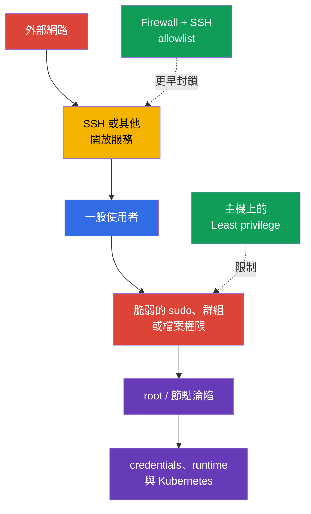
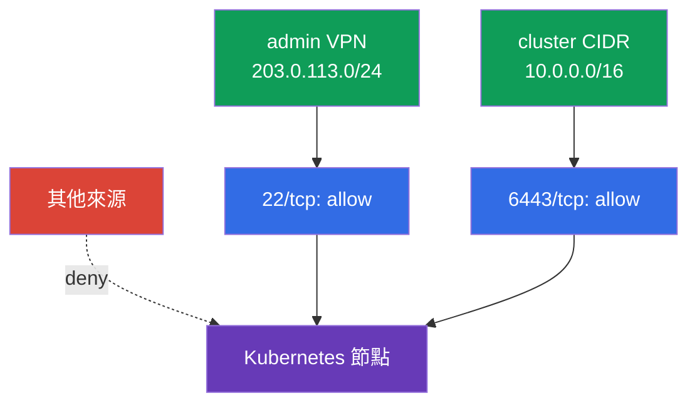

[Русская версия](ru.md) · [Eng version](README.md) · [Versión en español](es.md) · [Version française](fr.md) · [Deutsche Version](de.md) · [ქართული ვერსია](ge.md) · [日本語版](jp.md)

# 第 15 章。主機上的 least privilege 與最小化外部網路存取

> **問題。** 攻擊者經由開放的 SSH 或本機帳戶取得入口後，會尋找寬廣的 `sudo`、privileged group 或可寫入的 configuration file。任何一項錯誤都可能讓其成為 root、讀取 kubelet credentials，或存取 runtime socket，將受限的 node 存取轉化為對節點與 Kubernetes 的接管。

> **接下來。** 第 14 章中，我們縮小了 node 的 attack surface：移除多餘 service、package 及不安全的 container runtime 存取。現在要限制剩餘 entry point 的後果：哪些人可以登入主機、使用者能透過 `sudo` 做什麼、哪些 files 可以讀取或變更，以及 node 從何處可被存取。這屬於 CKS 的 **System Hardening** 領域。

> **需要的 CKA 基礎。** 關於使用者、group、file permissions、process、systemd 與 network commands 的基本知識，請見 [CKA Linux 章節](../../../cka/course/00-5-linux/tw.md)。本章不重複基礎，而是將其用於保護 Kubernetes node。

## 15.1. 威脅模型：一項多餘存取權可導致 node takeover

Kubernetes node 上有高價值資料與 control points：kubelet credentials、`kubeconfig`、PKI keys、control plane manifests、container runtime sockets 與 logs。能讀取 secret file、變更 configuration，或以 `root` 身分執行 command 的使用者，可以取得超出其原始角色的 access。開放的 SSH 或不必要的 port 則讓攻擊者可從外部啟動這條攻擊鏈。



least privilege 並非「不給任何人任何權限」，而是只授予必要的 access、必要的時限，且必須可稽核。對 node 而言，這是幾個相互獨立的 layers：local identity、精確的 `sudo`、file owners 與 modes、firewall 及 SSH。任何一層都無法取代其他層。

在修改運作中的 node 前，請透過 provider console 或第二個 SSH session 確保 emergency access。`sudoers`、firewall 或 `sshd_config` 的錯誤可能使您失去 administrative access。

> 🧠 Node takeover 是由外部入口、local identity、`sudo`、file permissions 與 runtime sockets 組成的鏈；主機上的 least privilege 無法取代 Kubernetes RBAC。

> 🎯 使用獨立使用者、最少 group、狹窄且可稽核的 `sudo` 及精確 owner/mode；檢查 target user 的 effective permissions 與可寫入的 parent directories。

## 15.2. 使用者、group 與 `sudo`：授予能力，而非完整 root

不要使用一個共用帳戶，也不要持續以 `root` 身分工作。每位 operator 都應有自己的使用者帳戶：如此能撤銷單一人員的 access，並將其動作對應至 `auth.log` 或 journald 記錄。

```bash
# 盤點本機使用者與群組。
USER_TO_REVIEW='user-to-review'
SERVICE_USER='service-user'
getent passwd
getent group
id "$USER_TO_REVIEW"
groups "$USER_TO_REVIEW"

# 對未使用的互動式帳戶停用 password authentication。
sudo usermod --lock "$USER_TO_REVIEW"

# 另外停用該帳戶本身的新登入（usermod --lock 只會鎖定
# password hash，而不是整個 Linux 帳戶）。
sudo usermod --expiredate 1 "$USER_TO_REVIEW"

# 檢查目前狀態。
sudo passwd -S "$USER_TO_REVIEW"
sudo chage -l "$USER_TO_REVIEW"

sudo usermod --shell /usr/sbin/nologin "$SERVICE_USER"
```

Account expiration 與 password lock 不會終止已存在的 processes/sessions。若要立即撤銷 access，還要檢查 active sessions、SSH keys、privileged groups 與 centralized IAM/SSO source，並依既定的 incident/offboarding procedure 終止 access。

若 service account 必須持續啟動，就不要機械式地對它套用 account expiration。一般會為其以 `nologin` 另外停用 interactive shell，並最小化 groups/permissions。

Service accounts 不需要 interactive shell，也不需要 administrative groups。只有服務需要時才建立 home 或 state directory，並採用最小 owner/mode。也應檢查實際上代表寬廣 escalation 的 groups：`sudo`、`wheel`、`docker`、`lxd`，以及特定系統上 container runtime socket 的 owner groups。不能為了「方便」授予這類 group membership。

### `sudo`：最小 command set

規則 `user ALL=(ALL) ALL` 很方便，但會授予完整 root。若 operator 只需要一項 operation，請在獨立的 `/etc/sudoers.d/` file 中允許特定 command 及其固定 arguments。請用 `visudo` 編輯它，但不要賦予它不存在的保護：使用 `visudo -f <alternative-path>` 時，除非明確指定 `-O` 及 `-P`，否則不會自動檢查 owner 和 permissions。建立後手動設定 `root:root` 與 `0440`，再用 `visudo -cf /etc/sudoers` 驗證整份 policy（只檢查單一 include file 並不足夠）。

```bash
# 透過可預期的系統 PATH 解析路徑，而不是假設 systemctl 的固定路徑。
SYSTEMCTL_PATH="$(env -i PATH=/usr/sbin:/usr/bin:/sbin:/bin sh -c 'command -v systemctl')"
test -n "$SYSTEMCTL_PATH" && SYSTEMCTL_PATH="$(readlink -f -- "$SYSTEMCTL_PATH")"
sudo test -x "$SYSTEMCTL_PATH"
sudo stat -c '%U:%G %a %n' "$SYSTEMCTL_PATH"  # 預期為 root:root，且其他人無寫入權限
```

不要直接授予 `systemctl`：即使是狹窄的 argument matching，也很容易被錯誤變更擴大。請建立無 arguments 的 root-owned wrapper；它只呼叫上方允許的**唯一** path，且永遠停用 pager。建立前確認 `/usr/local/sbin` 由 root 擁有，且 unprivileged users 無法寫入。

```bash
sudo tee /usr/local/sbin/k8s-kubelet-status >/dev/null <<'EOF'
#!/bin/sh
PATH=/usr/sbin:/usr/bin:/sbin:/bin
SYSTEMCTL_PATH="$(command -v systemctl)" || exit 1
exec "$SYSTEMCTL_PATH" --no-pager status kubelet
EOF
sudo chown root:root /usr/local/sbin/k8s-kubelet-status
sudo chmod 0755 /usr/local/sbin/k8s-kubelet-status
sudo visudo -f /etc/sudoers.d/k8s-operator
sudo chown root:root /etc/sudoers.d/k8s-operator
sudo chmod 0440 /etc/sudoers.d/k8s-operator
sudo visudo -c -O -P -f /etc/sudoers.d/k8s-operator
sudo visudo -cf /etc/sudoers
```

```sudoers
# /etc/sudoers.d/k8s-operator - 精確的 wrapper，不含 wildcard，也不含 arguments。
# 空的引號代表「僅允許不帶任何 arguments」；若省略此規格，
# 便會允許以任意 arguments 執行此路徑。
Cmnd_Alias KUBELET_STATUS = /usr/local/sbin/k8s-kubelet-status ""
k8s-operator ALL=(root) KUBELET_STATUS
```

請針對 target user 檢查最終 policy。不要以 `|| echo` 將 `sudo`/authentication error 變成「預期的 denial」：必須先成功取得完整 policy listing，再於保存的 output 中檢查 `/bin/bash` 及其他多餘 commands 不存在。

```bash
policy=$(sudo -l -U k8s-operator) || {
  echo 'ERROR: cannot retrieve sudo policy for k8s-operator' >&2; exit 2;
}
printf '%s\n' "$policy" | tee /tmp/k8s-operator-sudo-policy.txt
# Review：僅允許不帶 arguments 的 /usr/local/sbin/k8s-kubelet-status；
# /bin/bash、shell/interpreter 及任意 systemctl 皆不存在。
```

不要用表面上的 argument list 來限制危險程式。editor、interpreter、`systemctl edit`、可指定任意 path 的 commands，以及搭配 administrative kubeconfig 的 `kubectl`，往往可繞過看似狹窄的規則，並取得 root 或 cluster access。若無法描述安全的 argument set，與其製造受限的錯覺，不如提供有 logging 的受控 break-glass procedure。

保留所有 administrative actions 的 traces 很有用。Event/command logging 與 I/O logging 是不同 sudoers mechanisms：`logfile` 指定 event log 的 file destination，而 `log_input`/`log_output` 或 command tags `LOG_INPUT`/`LOG_OUTPUT` 會將 input/output 寫入 `iolog_*` 中的 location 或 `log_servers`。

```bash
# 盤點 sudoers 中的 command/I/O logging 設定。
sudo grep -REns \
  '(^|[[:space:],])((logfile|log_input|log_output|iolog_dir|iolog_file|log_servers)([=[:space:],]|$)|LOG_INPUT|LOG_OUTPUT)' \
  /etc/sudoers /etc/sudoers.d 2>/dev/null || true

# 檢查實際近期的 sudo 事件。
# 具體的 journal/syslog/logfile 取決於 policy 與發行版。
sudo journalctl _COMM=sudo --since '1 day ago'
```

若 sudoers 指定 `logfile`，也請檢查該 file。若啟用 `log_input` / `log_output` 或 command tags `LOG_INPUT` / `LOG_OUTPUT`，請另行檢查 `iolog_dir` 與能否透過 `sudoreplay` 讀取錄製內容。單一 `journalctl` 的空結果不能證明不存在 logging：destination 取決於 sudoers/syslog 與 OS configuration。

`NOPASSWD` 本身不是 compromise 的證據，但會降低對已開啟 session 遭未授權使用的防護。僅在 automation 需要時，才對短小、經過 review 的 non-interactive commands 清單使用它。

## 15.3. File permissions 與 ownership：保護 credentials 與 configuration

POSIX permissions 決定誰可以讀取（`r`）、變更（`w`）與 traverses directory（`x`）。ownership 與 mode 應符合 file 的用途：secret private key 不得供一般使用者讀取，control plane configuration 也不應讓他們變更。不要只檢查 file 本身，還要檢查 path 上的所有 directories：parent directory 的 write permission 能夠替換內容。

```bash
# 檔案的 mode、擁有者與完整路徑。
stat -c '%A %a %U:%G %n' /etc/kubernetes/admin.conf
namei -l /etc/kubernetes/admin.conf

# 在敏感區域中搜尋 world-writable 檔案；sticky bit 另行排除。
sudo find /etc/kubernetes -xdev -type f -perm -0002 -ls
sudo find /etc/kubernetes -xdev -type d -perm -0002 -ls
```

對 self-managed kubeadm node，至少檢查下列項目。精確 owner 取決於 distribution 與 installation method，因此請先記錄 baseline，並比對您的 Kubernetes/CIS version documentation，而不是盲目套用單一模板。

| Object | 權限過寬的風險 | 安全方向 |
|---|---|---|
| `/etc/kubernetes/pki/*.key` | 竊取 CA 或 client private key | `root:root`，僅 root 可讀，通常為 `600` |
| `/etc/kubernetes/admin.conf` | 使用者取得 cluster-admin credential | `root:root`、mode `600`；不要複製到 shared directories |
| `/etc/kubernetes/manifests/` | 替換 control plane static Pod | directory 與 YAML 僅 root 可寫入 |
| `/var/lib/kubelet/config.yaml` 與 kubelet credentials | 改變 kubelet behavior 或竊取 node identity | root 擁有，unprivileged users 不可寫入 |
| `~/.ssh/authorized_keys` | 加入他人的 SSH key | `.ssh` directory `700`、`authorized_keys` `600`，由該使用者擁有 |

以下是對應當封閉於其他使用者的 file 進行精確修正的範例：

```bash
sudo chown root:root /etc/kubernetes/admin.conf
sudo chmod 600 /etc/kubernetes/admin.conf
sudo stat -c '%U %G %a %n' /etc/kubernetes/admin.conf
```

不要對整個 `/etc/kubernetes` 遞迴執行 `chmod -R 600`：directories 需要 `x` bit，個別 public certificates 與 configurations 也可能有其他預期 mode。這種「修正」可能破壞 kubelet 或 static Pod。確認 owner、用途及實際 consumer 後，才變更特定 object。

也要單獨檢查 SUID/SGID binaries：它們以 owner 或 group 的權限執行，會擴大錯誤的後果。不要依網路上的 list 刪除 system SUID files——先確認其屬於哪個 package，以及 node 是否需要該 package。

```bash
set -euo pipefail
BINARY_PATH='/path/to/reviewed-binary'
# Inventory every selected local filesystem separately: `find / -xdev` would miss /usr, /var, /opt, etc.
findmnt -rn -o TARGET,FSTYPE |
while IFS=' ' read -r target fstype; do
  case "$fstype" in
    proc|sysfs|devtmpfs|devpts|tmpfs|cgroup|cgroup2|overlay|squashfs|nfs|nfs4|cifs|fuse.*|autofs|nsfs|mqueue|hugetlbfs|rpc_pipefs)
      continue
      ;;
  esac
  sudo find "$target" -xdev -type f -perm /6000 -printf '%m %u:%g %p\n' 2>/dev/null
done | LC_ALL=C sort -u

# Package ownership is distro-aware; a file without an owner needs provenance review.
if command -v dpkg-query >/dev/null 2>&1; then
  sudo dpkg-query -S "$BINARY_PATH" || {
    echo 'REVIEW_REQUIRED: no Debian package owns this binary; review its provenance' >&2
    exit 2
  }
elif command -v rpm >/dev/null 2>&1; then
  sudo rpm -qf "$BINARY_PATH" || {
    echo 'REVIEW_REQUIRED: no RPM package owns this binary; review its provenance' >&2
    exit 2
  }
else
  echo 'REVIEW_REQUIRED: package manager is unknown' >&2
  exit 2
fi
```

> 🎯 製作 flow matrix 與 allowlist，保留第二個 access path，套用 deny-by-default，並檢查允許與禁止的 segments。

## 15.4. Firewall：外部來源僅能存取必要 ports

Firewall 應由 deny-by-default 與明確的 allow rules 建構。node 並非只因參與 cluster 就必須對整個 network 開放。僅允許 administrative network 存取 SSH，並只允許協調過的 control-plane、worker 與 monitoring sources 存取 Kubernetes ports。完整 port list 取決於 topology、CNI 與 components；請先取得您安裝環境實際的 listeners 與 requirements。

```bash
sudo ss -lntup
sudo ss -lntup | grep -E ':(22|6443|10250|10256|10257|10259|2379|2380)\b' || true
```

| Port | 常見用途 | 應具存取權的對象 |
|---|---|---|
| `22/tcp` | SSH | 僅 bastion/VPN/administrative CIDR |
| `6443/tcp` | kube-apiserver | worker/control-plane 與已允許的 administrators |
| `10250/tcp` | 受保護的 kubelet API | control plane 與必要的 monitoring，不可對 internet 開放 |
| `10256/tcp` | kube-proxy healthz | 僅指定的 health-check/monitoring sources（若 port 並非 loopback-only） |
| `10257/tcp` | kube-controller-manager | control-plane/monitoring，僅在必要時且不可來自 internet |
| `10259/tcp` | kube-scheduler | control-plane/monitoring，僅在必要時且不可來自 internet |
| `2379-2380/tcp` | etcd client/peer | 僅 control-plane/etcd peers |
| `30000-32767/tcp`、`30000-32767/udp`（default） | NodePort | 僅需要已發布 Service 的 clients/LB CIDR；實際範圍請與 API server 的 `--service-node-port-range` 比對 |
| CNI ports（可變） | overlay、node-to-node 與 Pod traffic | 精確採用所選 CNI documentation 中的 CIDR 與 protocols |

不要在不了解 backend 的情況下混用三種 rule managers。`ufw` 是 high-level wrapper，而現代 `iptables` 通常運行於 `nf_tables` 之上；平行手動變更 `ufw`、`iptables` 與 `nftables` 會讓 audit 困難，且可能覆寫預期 rules。選擇 node image 與 configuration management system 支援的工具，並讓它成為唯一的 source of truth。

> 🔬 不必死記所有 implementations；重要的是理解並能在可用環境中套用 host firewall control。以下的 `ufw`、`iptables` 與 `nftables` 是替代 backends。

### 選項 A：`ufw`

**在設定 `default deny` 前，先依實際 topology 建立 allowlist：** bastion/VPN、control-plane、worker、etcd、load balancer、monitoring、Pod/Service CIDR，以及您使用的 CNI。從 matrix 加入所有需要的 roles、NodePort 與 CNI ports；無法用 universal rule 猜測它們。保留目前 SSH session，開啟第二個獨立 session，並在啟用 enforcement 前檢查 source address、未來 rules（`ufw status numbered`）與 out-of-band console。也要檢查 forwarded/routed traffic：CNI 與 Pod traffic 常需要 IPv4/IPv6 forwarding 及 `ufw route` rules；僅有一對 `ufw allow ... to any port ...` 並不足夠。請比對 `DEFAULT_FORWARD_POLICY`、`net.ipv4.ip_forward`、IPv6 forwarding 與 CNI-specific flows，否則 SSH/API 仍能運作，但 Pod networking 會故障。啟用後，在確認新的 SSH login 及 kubelet/API 可從允許 networks 正常運作前，請勿關閉保留的 session。

```bash
# 範例：僅允許來自管理網路的 SSH。
sudo ufw allow from 203.0.113.0/24 to any port 22 proto tcp

# 範例：API 僅能從節點與管理者的網路存取。
sudo ufw allow from 10.0.0.0/16 to any port 6443 proto tcp
# 在此之前，請加入您安裝環境中特定角色與 CNI 的 allow 規則。
sudo ufw default deny incoming
sudo ufw default allow outgoing
sudo ufw enable
sudo ufw status numbered
```

刪除 rule 前先檢查其編號與目的，然後精確地移除：

```bash
RULE_NUMBER='1'
sudo ufw status numbered
sudo ufw delete "$RULE_NUMBER"
```

### 選項 B：`iptables`

此 `iptables` 教學範例允許 established traffic、loopback 與來自 allowlist 的 SSH，接著拒絕其餘 incoming traffic。在實際 cluster 中，請在套用 `DROP` 前加入所有已文件化的 Kubernetes/CNI flows；否則可能中斷 node 間連線或 Pod networking。請另外檢查 `FORWARD` chains、IPv4 與 IPv6：CNI 可能不經 `INPUT` route Pod traffic，而 `INPUT` 中最終的 `DROP` 不會建立安全的 forwarding policy，也無法取代 CNI-specific rules。

```bash
sudo iptables -A INPUT -m conntrack --ctstate ESTABLISHED,RELATED -j ACCEPT
sudo iptables -A INPUT -i lo -j ACCEPT
sudo iptables -A INPUT -p tcp -s 203.0.113.0/24 --dport 22 -j ACCEPT
sudo iptables -A INPUT -p tcp -s 10.0.0.0/16 --dport 6443 -j ACCEPT
sudo iptables -A INPUT -j DROP
sudo iptables -S INPUT
```

`-A` 將 rules 加到 chain 末端：若更高處既有 rule 已接受 traffic，最終的 `DROP` 並不保證 deny-by-default。這些 IPv4 rules 也不涵蓋 IPv6。請先檢視完整 ruleset 的順序；對 persistent policy，應管理具有明確 jump 的 dedicated chain，或使用有明確 policy 的 `nftables`；不要將手動 append rules 與 CNI 或 firewall manager rules 混用。

以 command 加入的 rules 不一定在 reboot 後持續存在。應使用 distribution 的標準機制或 declarative configuration 儲存它們；不要以為 `iptables -S` output 本身就是 persistence layer。

### 選項 C：`nftables`

`nftables` 是現代 kernel mechanism。它更容易明確設定 policy，並以一條 command 檢視整個 ruleset。若 CNI 或 firewall manager 已在 node 上建立 tables，請勿在未 review 現有 ruleset 前套用本範例。

```nft
# /etc/nftables.conf：host ingress 專用表格的片段
 table inet host_filter {
   chain input {
     type filter hook input priority filter; policy drop;
     ct state established,related accept
     iifname "lo" accept
     ip saddr 203.0.113.0/24 tcp dport 22 accept
     ip saddr 10.0.0.0/16 tcp dport 6443 accept
   }
 }
```

請在載入前檢查 syntax，接著檢視實際 active rules：

```bash
sudo nft -c -f /etc/nftables.conf
sudo systemctl reload nftables
sudo nft list ruleset
```



Host firewall 是 cloud Security Group、private endpoint、routing 與 Kubernetes NetworkPolicy 的補充，而非替代。NetworkPolicy 主要管理 Pod traffic，node firewall 管理 host traffic；請檢查您的 CNI 與 cloud network 的 responsibility boundary。

> 🏭 Node role 僅取得自己的 bootstrap、network、storage 與 telemetry permissions；workload 使用獨立且最小化的 workload identity。

## 15.4.1. Cloud/node IAM：為 workload 使用獨立的最小角色

least privilege 也適用於 cloud IAM。Node/instance role 不應只因 Kubernetes 運行於 node 上就取得 broad cloud-admin permissions；只授予該角色所需的 bootstrap、network、storage 與 telemetry permissions。workload 不應自動繼承 node role 的 credentials：請使用 workload identity、IRSA 或類似機制，為特定 ServiceAccount 指派獨立且最小化的 cloud-role。平台支援時，限制 Pod 存取 instance metadata 與 node credentials。cloud-role review 應與 Kubernetes RBAC 分開進行：最小 RoleBinding 的存在無法證明 cloud permissions 已最小化。

## 15.5. SSH hardening：保護主要 administrative path

SSH 常是 node 唯一的 remote entry point。應使用獨立 administrative user account 與 keys，而不是 passwords。直接 `root` login 容易受到 brute force 攻擊，並會移除 logs 中個別 identity。

> 🎯 確認 key 與替代 access，禁止 root/password login，檢查 `sshd -t`、`sshd -T`，並以被允許的使用者登入。

在現代 OpenSSH 中，建立小型 drop-in 比編輯大型 vendor file 更方便。先透過 `Include` 檢查目錄是否已被 configuration 包含。Wildcard `Include` files 按 lexical order 處理，而多數一般 scalar keywords 由 OpenSSH 使用第一個取得的值；因此檔名 `99-hardening.conf` 不保證優先權，對這類 parameters 通常需要刻意放在較早的 file。

但不要將這種模型套用至 list directives。`AllowUsers`、`AllowGroups`、`DenyUsers` 與 `DenyGroups` 可出現多次，每個 occurrence 都會**加入**相應 list。較早的 `00-hardening.conf` 不會取消另一個 `AllowUsers`。使用 `AllowUsers` 前，請盤點主要 `sshd_config` 與 included files 中所有 occurrence，將衝突 lists 移除或合併成受管理的 allowlist，接著以 `sshd -T`，以及有 `Match` 時的 `sshd -T -C user=...,host=...,addr=...` 檢查最終結果。請選擇下方**其中一個** profile：兩者皆禁用 password login，但 MFA profile 額外要求 key 與 PAM keyboard-interactive。不要同時啟用兩個 profiles。

```bash
sudo grep -RnsE \
  '^[[:space:]]*(Include|Match|AllowUsers|AllowGroups|DenyUsers|DenyGroups)[[:space:]]' \
  /etc/ssh/sshd_config /etc/ssh/sshd_config.d 2>/dev/null || true
```

**Profile A - 僅使用 key。**

```bash
sudo install -d -o root -g root -m 0755 /etc/ssh/sshd_config.d
sudo tee /etc/ssh/sshd_config.d/00-hardening.conf >/dev/null <<'EOF'
PermitRootLogin no
PasswordAuthentication no
KbdInteractiveAuthentication no
PubkeyAuthentication yes
AllowUsers k8s-operator
EOF
sudo chown root:root /etc/ssh/sshd_config.d/00-hardening.conf
sudo chmod 0600 /etc/ssh/sshd_config.d/00-hardening.conf
sudo stat -c '%U:%G %a %n' \
  /etc/ssh/sshd_config.d /etc/ssh/sshd_config.d/00-hardening.conf

SSHD_UNIT="$(
  systemctl list-unit-files --type=service --no-legend \
    | awk '$1 == "ssh.service" || $1 == "sshd.service" { print $1; exit }'
)"
test -n "$SSHD_UNIT" || {
  echo 'ERROR: ssh.service/sshd.service was not found' >&2
  exit 1
}

sudo sshd -t
sudo systemctl reload "$SSHD_UNIT"
```

**Profile B - key + 經由 PAM keyboard-interactive 的 MFA。** 只有在完成 MFA PAM module 的設定與驗證後才使用；`AuthenticationMethods` 要求兩個 factors，而不是以 one-time code 取代 key。

```text
PermitRootLogin no
PasswordAuthentication no
PubkeyAuthentication yes
KbdInteractiveAuthentication yes
UsePAM yes
AuthenticationMethods publickey,keyboard-interactive:pam
AllowUsers k8s-operator
```

將 profile B 儲存於相同的 `/etc/ssh/sshd_config.d/00-hardening.conf`；套用**相同的** owner/mode invariant，接著在 `sshd -t` 及 reload 實際 OpenSSH server unit 前驗證（Debian/Ubuntu 是 `ssh.service`，許多 RHEL-family systems 則是 `sshd.service`）：

```bash
sudo install -d -o root -g root -m 0755 /etc/ssh/sshd_config.d
sudo chown root:root /etc/ssh/sshd_config.d/00-hardening.conf
sudo chmod 0600 /etc/ssh/sshd_config.d/00-hardening.conf
sudo stat -c '%U:%G %a %n' \
  /etc/ssh/sshd_config.d /etc/ssh/sshd_config.d/00-hardening.conf
sudo sshd -t
# 以與 Profile A 相同的 distro-aware 方式判斷 ssh.service/sshd.service，然後 reload。
```

不要把單一 unit name 固定為所有 Linux distributions 的通用名稱。`AllowUsers` 是強大的限制，但會阻擋未列出的所有 users。在加入必要的 break-glass 與 automation accounts 前，請勿使用它；記錄 owners 並定期 review 此 list。

關閉目前 SSH session 前，檢查最終 values，並以被允許的使用者開啟第二個 session。Profile A 僅使用 key；Profile B 則同時驗證 key 與 MFA：

```bash
sudo sshd -T | grep -E 'permitrootlogin|passwordauthentication|kbdinteractiveauthentication|pubkeyauthentication|usepam|authenticationmethods|allowusers'
NODE_ADDRESS='node-address.example.internal'
# Profile A（僅使用 key）：檢查為非互動式，且不應提示 password/MFA。
ssh -o BatchMode=yes -o PreferredAuthentications=publickey \
  -o PasswordAuthentication=no -o KbdInteractiveAuthentication=no \
  "k8s-operator@${NODE_ADDRESS}" id

# Profile B（key + MFA）：請勿使用 BatchMode；需通過第二因素的 prompt。
ssh -o PreferredAuthentications=publickey,keyboard-interactive \
  -o PasswordAuthentication=no -o KbdInteractiveAuthentication=yes \
  "k8s-operator@${NODE_ADDRESS}" id
```

還要確認最終 `allowusers` 僅包含已核准 accounts，包括必要的 break-glass/automation identities，而非來自另一個 `Include` 的額外值。使用 `Match` 時，請為每個重要 user/source 透過 `sshd -T -C` 檢查 effective configuration。

在確認 target user 的 key 確實已安裝、permissions 正確，並可經由 bastion/VPN 運作前，請勿關閉 password authentication。emergency access 應使用 provider console 或有 control 的 break-glass account，而不是永久的 root password。

## 15.6. 驗證與診斷：證明防護生效

驗證應確認實際 behavior，而不是只確認 file 中有一行設定。從 allowed 與 denied segments 進行 network tests，並以 unprivileged user 的身分執行 `sudo` checks。不要在 production node 上執行 destructive commands，也不要在沒有 rollback plan 的情況下刪除作用中的 rules。

```bash
# 1. 檢查敏感檔案的擁有者與 mode。
sudo stat -c '%U %G %a %n' \
  /etc/kubernetes/admin.conf \
  /etc/kubernetes/pki/ca.key

# 2. 取得 policy，且不與使用者的驗證混淆。若 sudo -l
# 執行失敗，這是 operational error，而非 policy denial 的證明。
policy=$(sudo -l -U k8s-operator) || {
  echo 'ERROR: cannot retrieve sudo policy for k8s-operator' >&2; exit 2;
}
printf '%s\n' "$policy" | tee /tmp/k8s-operator-sudo-policy.txt
# Review listing：僅允許不帶 arguments 的 wrapper；/bin/bash 不存在。

# 3. 檢查所選機制的實際 firewall。
sudo ufw status verbose             # 若使用 ufw
sudo iptables -S INPUT               # 若使用 iptables
sudo nft list ruleset                # 若使用 nftables

# 4. 檢查節點本身的 listeners。
sudo ss -lntup

# 5. 檢查 SSH 設定的語法與最終結果。
sudo sshd -t
sudo sshd -T | grep -E 'permitrootlogin|passwordauthentication|pubkeyauthentication'
```

從不在 allowlist 中的 host，只檢查預期 denial 或 timeout；從 allowed network，則確認角色所需範圍內成功的 SSH/API access。SSH authentication 驗證與 `sudo` authorization/authentication 驗證相互獨立：沒有 TTY 時的 `sudo` password prompt 不代表 SSH 或 sudo policy 有錯誤。

```bash
# 從允許 CIDR 之外的主機：連線不應建立。
NODE_ADDRESS='node-address.example.internal'
nc -vz -w 3 "$NODE_ADDRESS" 22

# SSH login proof, Profile A: key-only and non-interactive.
ssh -o BatchMode=yes -o PreferredAuthentications=publickey \
  -o PasswordAuthentication=no -o KbdInteractiveAuthentication=no \
  "k8s-operator@${NODE_ADDRESS}" id

# SSH login proof, Profile B: complete publickey + keyboard-interactive MFA; no BatchMode.
ssh -o PreferredAuthentications=publickey,keyboard-interactive \
  -o PasswordAuthentication=no -o KbdInteractiveAuthentication=yes \
  "k8s-operator@${NODE_ADDRESS}" id

# Run this separately from an interactive admin terminal when sudo policy requires a password.
ssh -t "k8s-operator@${NODE_ADDRESS}" 'sudo -l'
# Or prove a specific allowed wrapper:
# ssh -t "k8s-operator@${NODE_ADDRESS}" 'sudo /usr/local/sbin/k8s-kubelet-status'

# Use this only when NOPASSWD is an explicit policy requirement for the checked command/listing.
ssh -o BatchMode=yes "k8s-operator@${NODE_ADDRESS}" 'sudo -n -l'
```

| 症狀 | 可能原因 | 檢查項目 |
|---|---|---|
| 套用 firewall 後 SSH 無法存取 | 未允許 source/port，或 rule order 錯誤 | console access、`ufw status numbered`、`iptables -S`、`nft list ruleset` |
| Kubelet 無法再與 API 通訊 | firewall 封鎖 `6443` 或 node 間路由 | `journalctl -u kubelet`、allowlist、Security Group、DNS/route |
| `sudo` 允許的範圍超出預期 | 寬廣 rule、其他 group membership、危險的 allowed command | `sudo -l -U <user>`、`id <user>`、所有 `/etc/sudoers.d/*` |
| SSH hardening 後無法登入 | key 不可用、drop-in 未被包含、`AllowUsers` 過窄 | `sshd -t`、`sshd -T`、`~/.ssh` permissions、console access |
| `chmod` 後 Kubernetes component 無法啟動 | directory/file permissions 已變更，需要的 runtime permissions 消失 | `journalctl -u kubelet`、`crictl ps -a`、`namei -l` |

> 🏭 將 host identities、`sudoers`、firewall 與 SSH 視為 code 管理：owner、期限、log、rollback、role-specific allowlist 與定期 drift checks。

## 15.7. 在 production 中的應用方式

- **Identity lifecycle。** 透過 IAM/CMDB/configuration management 建立 local accounts，讓 owner 與 access duration 可知，並立即停用離職人員。不要使用永久的 shared root account。
- **Privileges as code。** 在 Ansible、image pipeline 或其他 IaC tool 中描述 `sudoers` files、groups 與 sensitive paths 的 owners。這可防止 drift 並允許 code review。
- **依 node roles 設定 firewall。** Control-plane、worker、bastion 及 monitoring 使用不同 allowlists。依真實 traffic matrix（包括 CNI 與 health checks）建立 rules，並在 rollout 前於 staging 驗證。
- **無繞過的 SSH。** 使用 short-lived SSH certificates 或透過 bastion/VPN、MFA 與 audit 的 centralized access。Password login 與 root login 維持關閉，而 break-glass access 有 owner 與 review procedure。
- **持續驗證。** 定期執行 [第 07 章](../07/tw.md) 的 CIS scanning、file-integrity monitoring、搜尋 world-writable paths 與開放 ports 的 control，而非僅在 audit 前執行。
- Kubernetes v1.37 請另行評估 rootless node architecture（`KubeletInUserNamespace`）作為額外 least-privilege boundary；這與 Pod user namespaces 不同。請見 [Kubernetes v1.37 Security Delta](../APPENDIX_K8S_137_SECURITY_DELTA_TW.md)。

## 15.8. 迷你詞彙表

- **least privilege** - 僅在有限時間內，授予 subject 完成其工作所需的最小 permissions。
- **`sudoers`** - 決定使用者可以其他使用者身分執行哪些 commands 的 policy；透過 `visudo` 編輯。
- **SUID/SGID** - 以 file owner 的 effective UID 或 group GID 執行程式的特殊 file bits；需要 inventory。
- **allowlist** - 明確列出的允許 sources、users、ports 或 actions；其他一律拒絕。
- **host firewall** - node 本身的 filtering rules，例如 `ufw`、`iptables` 或 `nftables`。
- **drop-in** - 補充 base configuration 的獨立 configuration file，例如 `/etc/ssh/sshd_config.d/00-hardening.conf`。
- **break-glass access** - 僅在 incident 或正常 administrative path 中斷時使用的受控 emergency access。

## 15.9. 本章總結

- 獨立 users、最小 groups 與精確的 `sudo`，可降低 account compromise 的後果，並使 actions 可驗證。
- Private keys、kubeconfig、static Pod manifests 與 kubelet configuration 需要正確 owner 與 mode；不了解用途便遞迴執行 `chmod` 很危險。
- Firewall 以 default deny 與所需 flows 的 allowlist 為基礎。沒有清楚 source of truth 時，不應混用 `ufw`、`iptables` 與 `nftables`。
- SSH 以 keys、`PermitRootLogin no`、停用 password authentication 及限制 allowed users 來 harden，但只能在驗證第二個 access path 後進行。
- 以真實嘗試證明結果：多餘的 `sudo` command 被拒絕、sensitive file 不可存取、closed port 沒有回應，而 allowed access 正常運作。

## 15.10. 適用之處：考試與實務工作

**在考試中。** 題目可能要求修正 kubeconfig mode、將 user 從危險 group 移除、限制 `sudo`、用 firewall 關閉 port，或禁止 root SSH。先閱讀目前 configuration，只變更指定 object，並以 `stat`、`sudo -l`、`ss`、firewall output 及 `sshd -t` 證明結果。network 變更前，先保留自己的 SSH access。

**在實務工作中。** Pod 或 account 遭接管，不應自動意味著 node root 或整個 cluster access。分離 users、保護 credentials、狹窄 firewall 與可稽核 SSH，會將一條寬廣 attack path 轉換為多個獨立 barriers；每一個都可定期驗證並自動化。

## 15.11. 自我檢查問題

<details>
<summary>1. 為什麼加入 `docker` 或寬廣的 `sudo` rule 可以等同 root？</summary>

`docker` group 的成員可存取 Docker socket，並建立能存取 host 的 container，因此這是 root-equivalent，而非一般工作群組。規則 `user ALL=(ALL) ALL` 可讓使用者以 root 身分執行任意 command。兩條路徑都繞過一般 unprivileged user 的限制，必須與授予 root access 一樣謹慎。
</details>

<details>
<summary>2. 在 node 上，哪些 Kubernetes files 最危險，不應讓一般使用者可讀取或寫入？</summary>

`/etc/kubernetes/pki/*.key` 中的 private keys 與 `/etc/kubernetes/admin.conf` 尤其敏感：讀取它們可取得 CA、client key 或 cluster-admin credential。寫入 `/etc/kubernetes/manifests/` 可替換 control plane static Pod。也不可讓 unprivileged users 寫入 `/var/lib/kubelet/config.yaml` 或存取 kubelet credentials。
</details>

<details>
<summary>3. 為什麼不能對整個 `/etc/kubernetes` 遞迴套用 `chmod 600`？</summary>

directories 需要 `x` bit 以供 traversal，而個別 public certificates 與 configurations 可能有不同的預期 mode。不考慮用途便遞迴 `chmod -R 600`，可能破壞 kubelet 或 static Pod。必須使用 `stat` 與 `namei -l` 檢查特定 object、其 owner、consumer 與 path，再精確變更。
</details>

<details>
<summary>4. 在套用 default deny firewall 前，必須先加入哪些 rules，才能避免失去 access 或破壞 cluster？</summary>

enforcement 前，依實際 topology 建立 allowlist：SSH 的 bastion/VPN、control plane、worker、etcd peers、load balancer、monitoring、Pod/Service CIDR 與特定 CNI 的 protocols。尤其需要通往 `6443`、`10250`、`2379-2380`、health endpoints 和（使用時）NodePort 的 flows。保留目前 SSH session、開啟第二個，並另外檢查 forwarding/`ufw route`、IPv4/IPv6 與 CNI traffic。
</details>

<details>
<summary>5. host firewall、Security Group 與 NetworkPolicy 的責任範圍有何不同？</summary>

Host firewall 管理 node 本身的 traffic；Security Group 或 cloud firewall 管理 infrastructure network boundary 及到 endpoint 的 sources。NetworkPolicy 由 CNI 主要套用於 Pod traffic，並非在所有 topologies 中都能取代 host/control-plane path 的保護。這些 controls 相輔相成，因此不可視為可互換。
</details>

<details>
<summary>6. 為什麼關閉 password authentication 前必須開啟第二個 SSH session？</summary>

若 key 未安裝、其 permissions 錯誤、drop-in 未包含，或 `AllowUsers` 過窄，關閉 password authentication 可能讓 administrator 失去 access。第二個獨立 session 與 out-of-band console 保留 rollback path。關閉目前 session 前，必須檢查 `sshd -t`、實際的 `sshd -T` values，並以 key 驗證被允許 user 的 login。
</details>

<details>
<summary>7. 哪些 commands 能證明 SSH 與 firewall configuration 不只寫入了設定，而且確實在運作？</summary>

以 `sudo sshd -t` 和 `sudo sshd -T | grep ...` 檢查 SSH syntax 與最終結果，接著從 allowed network 經由 `ssh -o BatchMode=yes ...` 進行真正的 key-only login。使用所選 mechanism 檢查 active firewall：`ufw status verbose`、`iptables -S INPUT` 或 `nft list ruleset`，並以 `sudo ss -lntup` 檢查 listeners。從未允許的 segment，`nc -vz -w 3 <node> 22` 應出現預期 denial 或 timeout。
</details>

<details>
<summary>8. **回顧（第 10 章）。** 本章處理的是**主機**層級的 least privilege（Linux users、groups、socket access）；第 10 章處理的是 **Kubernetes API** 層級的 least privilege（RBAC）。請舉出具體例子，說明狹窄 RBAC 無法保護經由過多 host access 實現的 attack（反之亦然），亦即為何這兩個 least-privilege levels 都無法單獨足夠。</summary>

ServiceAccount 可能只有 `get pods` 的狹窄 Role，但能存取 containerd/Docker socket 或寬廣 `sudo` 的使用者，仍可取得 node root 並繞過該 API boundary。反之，嚴格的 host firewall 與 file modes 也無法阻止遭竊的 ServiceAccount token：若其 RBAC 允許讀取 Secret 或建立 `pods/exec`，攻擊仍會成功。Host 與 Kubernetes API 限制不同 attack paths，因此兩個 layers 都需要。
</details>

## 實作

在 Lab 105 中，您將停用多餘 service、關閉不需要的 port、套用 firewall、修正 sensitive file permissions，並禁止 root SSH。在獨立 Docker host 上，也會關閉 Docker TCP API、保護 `/var/run/docker.sock`，並移除對 `docker` group 的多餘 access。

🧪 Lab 105（OS System Hardening 與 Docker daemon）：
[tasks/cks/labs/105](../../labs/105/README_TW.MD)

## 參考資料

- [CIS Kubernetes Benchmark](https://www.cisecurity.org/benchmark/kubernetes)
- [OpenSSH: sshd_config(5)](https://man.openbsd.org/sshd_config)

---
[目錄](../README_TW.md) · [第 14 章](../14/tw.md) · [第 16 章](../16/tw.md)
